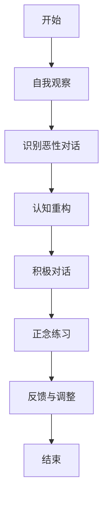

                 

### 文章标题

# 提升内在对话质量：深度自我沟通的技巧

### 文章关键词

自我沟通、内在对话、心理健康、实践技巧、长期提升

### 文章摘要

本文深入探讨了提升内在对话质量的技巧，通过自我沟通的视角，分析内在对话的核心概念、理论与实践。文章从背景介绍、核心概念与联系、实践技巧以及综合提升四个方面，系统性地阐述了如何优化内在对话，提高心理健康水平。通过具体案例和实践技巧，读者可以学会如何在日常生活中提升内在对话质量，实现个人成长和心理健康。

## 第一部分：背景介绍

### 第1章：问题背景

#### 1.1.1 问题描述

内在对话，又称自我对话，指的是个体在内心深处与自己的对话。这种对话不仅影响个人的情绪和行为，还对心理健康有着深远的影响。现代生活节奏加快，竞争压力增大，很多人面临着焦虑、抑郁等心理问题。这些问题往往源自内在对话的质量不高，恶性内在对话不断强化负面情绪，影响个人发展和生活质量。

#### 1.1.2 问题解决

解决内在对话质量低的问题，需要从多个角度入手。首先，要明确内在对话的概念和重要性；其次，了解自我沟通的理论基础，掌握评估内在对话质量的方法；最后，通过实践技巧和长期提升策略，逐步优化内在对话，提高心理健康水平。

#### 1.1.3 边界与外延

内在对话质量不仅涉及心理学领域，还与社会学、神经科学等学科有着密切联系。本文将重点关注心理学视角下的自我沟通和内在对话，探讨如何通过自我观察、自我接纳和正念练习等技巧，提升内在对话质量。

### 第2章：核心概念

#### 2.1.1 自我沟通的概念

自我沟通是心理学中的一个重要概念，指的是个体在内心中进行的思考和对话。这种沟通不仅包括自我反思和自我评价，还涉及自我激励和自我调节。自我沟通的质量直接影响个体的情绪状态和行为表现。

#### 2.1.2 内在对话的定义

内在对话是自我沟通的一种形式，指的是个体在内心中与自己进行的对话。这种对话可以是对过去经历的回顾，对当前情况的评估，对未来目标的设定。内在对话的质量决定了个体心理健康的水平。

#### 2.1.3 内在对话质量的重要性

内在对话质量对心理健康具有重要影响。高质量的内在对话能够帮助个体更好地应对压力，提高情绪调节能力，增强自我认同和自我价值感。相反，低质量的内在对话会加剧负面情绪，影响个体的心理健康和生活质量。

### 第3章：概念结构与核心要素组成

#### 3.1.1 内在对话的质量指标

内在对话的质量可以通过多个指标来衡量，包括自我观察的敏锐度、自我接纳的程度、正念的实践情况等。这些指标共同构成了内在对话质量的结构。

#### 3.1.2 内在对话的组成部分

内在对话包括自我反思、自我评价、自我激励、自我调节等组成部分。每个部分都对内在对话的质量有着重要影响。

#### 3.1.3 内在对话的流程分析

内在对话的流程包括感知、评估、反应、调节等环节。通过分析这些环节，可以更深入地理解内在对话的过程和机制。

## 第二部分：核心概念与联系

### 第4章：自我沟通的理论基础

#### 4.1.1 心理学视角下的自我沟通

心理学研究显示，自我沟通是心理健康的重要基石。通过自我沟通，个体可以更好地理解自己，调整情绪，实现自我成长。

#### 4.1.2 社会学视角下的自我沟通

社会学视角关注自我沟通在社会互动中的作用。研究表明，自我沟通的质量影响着个体在社会中的角色和地位。

#### 4.1.3 自我沟通的心理学模型

心理学模型为自我沟通的研究提供了理论框架。例如，自我决定理论、自我效能理论等，都为理解自我沟通的机制提供了重要参考。

### 第5章：内在对话的质量评估

#### 5.1.1 内在对话质量评估的方法

内在对话质量评估可以通过问卷调查、心理测量、行为观察等方法进行。这些方法能够帮助个体了解自己的内在对话质量，并制定相应的提升策略。

#### 5.1.2 内在对话质量评估的工具

内在对话质量评估工具包括自我评估问卷、心理测量工具等。这些工具为评估内在对话质量提供了科学的手段。

#### 5.1.3 内在对话质量评估的案例分析

通过具体案例，分析内在对话质量对个体心理和行为的影响，以及评估方法在实际应用中的效果。

### 第6章：内在对话与心理健康的联系

#### 6.1.1 内在对话与心理健康的关系

内在对话质量与心理健康密切相关。高质量的内在对话有助于缓解压力，提高情绪调节能力，增强心理健康。

#### 6.1.2 恶性内在对话的影响

恶性内在对话会加剧负面情绪，影响个体的心理健康。通过案例分析和实证研究，了解恶性内在对话的危害。

#### 6.1.3 优化内在对话对心理健康的益处

优化内在对话，提高内在对话质量，对心理健康具有显著益处。本文将介绍具体的方法和策略。

## 第三部分：实践技巧

### 第7章：提升内在对话质量的方法

#### 7.1.1 自我观察技巧

自我观察是提升内在对话质量的重要方法。通过自我观察，个体可以更清晰地了解自己的内心世界，从而进行有效的调节。

#### 7.1.2 自我接纳技巧

自我接纳是内在对话质量提升的关键。学会接纳自己的优点和不足，有助于建立积极的内在对话。

#### 7.1.3 正念练习

正念练习是一种有效的提升内在对话质量的方法。通过正念练习，个体可以更好地关注当下，减少负面情绪。

### 第8章：应对恶性内在对话的策略

#### 8.1.1 识别恶性内在对话

恶性内在对话会对个体产生负面影响。学会识别恶性内在对话，是应对其危害的第一步。

#### 8.1.2 转换恶性内在对话

通过转换技巧，将恶性内在对话转换为积极的内在对话，有助于改善心理健康。

#### 8.1.3 增强自我力量

增强自我力量是应对恶性内在对话的重要策略。通过自我肯定、自我激励等方法，提升自我力量。

### 第9章：实践案例分析

#### 9.1.1 案例一：提升工作效率

通过具体案例，分析内在对话质量对工作效率的影响，以及提升内在对话质量的方法。

#### 9.1.2 案例二：改善人际关系

人际关系中的冲突往往源于内在对话的质量。本文将介绍如何通过提升内在对话质量，改善人际关系。

#### 9.1.3 案例三：缓解焦虑情绪

焦虑是现代社会常见的心理问题。本文将探讨如何通过提升内在对话质量，缓解焦虑情绪。

## 第四部分：综合提升

### 第10章：内在对话质量的长期提升

#### 10.1.1 持续练习的重要性

内在对话质量的提升需要长期坚持。持续练习是提升内在对话质量的关键。

#### 10.1.2 自我成长的路径

自我成长是提升内在对话质量的重要途径。通过自我成长，个体可以不断提升内在对话的质量。

#### 10.1.3 个性化提升策略

每个人的内在对话质量提升路径不同。制定个性化的提升策略，是有效提升内在对话质量的关键。

### 第11章：最佳实践 tips

#### 11.1.1 常见问题解答

本文将针对读者在提升内在对话质量过程中可能遇到的问题，提供解决方案。

#### 11.1.2 实践中的注意事项

在实践提升内在对话质量的过程中，需要注意一些细节问题。本文将介绍这些注意事项。

#### 11.1.3 拓展阅读推荐

本文将推荐一些拓展阅读资源，帮助读者更深入地了解内在对话质量和自我沟通。

### 第12章：小结

#### 12.1.1 主要内容回顾

本文回顾了提升内在对话质量的核心内容，包括背景介绍、核心概念、实践技巧和综合提升。

#### 12.1.2 未来的研究方向

本文指出了一些未来研究方向，包括内在对话质量对心理健康的影响机制、个性化提升策略等。

#### 12.1.3 对读者的寄语

本文对读者寄语，鼓励读者在提升内在对话质量的过程中，保持耐心和毅力，持续实践，收获心理健康和幸福生活。

### 作者信息

作者：AI天才研究院/AI Genius Institute & 禅与计算机程序设计艺术 /Zen And The Art of Computer Programming

通过以上详细的目录大纲，我们可以看到文章的结构清晰、内容丰富，每个章节都紧密围绕提升内在对话质量的主题展开。接下来的任务是根据这个大纲，逐一撰写每个章节的具体内容，确保文章的逻辑性和可读性。

## 1.1.1 问题描述

在当今快速变化的社会中，人们面临的压力和挑战越来越多。这些压力和挑战不仅来自工作、学习、家庭等外部环境，也源于内心深处的内在对话。内在对话，亦称自我对话，是指个体在心中与自己进行的对话。这种对话形式在人们的日常生活中无处不在，从早晨醒来的第一缕思绪，到夜晚入睡前的最后一刻，内在对话伴随着我们的每一个时刻。

然而，并非所有的内在对话都是积极的。有些人可能会陷入消极的内在对话中，不断地自我否定、自我批评，这种恶性内在对话对心理健康产生了严重的负面影响。具体来说，恶性内在对话可能会导致以下问题：

1. **情绪困扰**：恶性内在对话常常伴随着消极情绪，如焦虑、抑郁、恐惧等。这些情绪会影响个体的情绪状态，导致情绪波动大，难以维持稳定的心情。

2. **自我认同感下降**：持续的恶性内在对话会使个体对自己的认同感下降，对自己的能力和价值产生怀疑，从而影响自我价值的建立。

3. **心理压力增加**：恶性内在对话会使个体在心理上承受更多的压力，长期下去可能导致心理健康问题，如焦虑症、抑郁症等。

4. **行为表现下降**：恶性内在对话会影响个体的行为表现，使人变得消极、懒散，难以有效地应对生活中的挑战。

5. **社交障碍**：恶性内在对话可能导致个体在社交场合中表现出紧张、不安，从而影响人际关系。

为了解决这些问题，提升内在对话质量显得尤为重要。高质量的内在对话能够帮助个体更好地调节情绪，提高自我认同感，减轻心理压力，改善行为表现，增强社交能力。通过优化内在对话，个体可以更积极地面对生活中的挑战，提高生活质量。

### 1.1.2 问题解决

解决内在对话质量低的问题需要从多个方面入手。以下是一些基本的方法和策略：

1. **自我观察**：自我观察是提升内在对话质量的第一步。通过自我观察，个体可以更清晰地了解自己的内心世界，识别出恶性内在对话的来源和模式。例如，个体可以在日常生活中记录自己的内心活动，观察自己的情绪波动和思维模式。

2. **自我接纳**：自我接纳是内在对话质量提升的关键。学会接纳自己的优点和不足，有助于建立积极的内在对话。通过自我接纳，个体可以减少自我批评和自我否定，从而降低恶性内在对话的发生。

3. **正念练习**：正念练习是一种有效的提升内在对话质量的方法。通过正念练习，个体可以更好地关注当下，减少负面情绪。正念练习包括呼吸练习、身体扫描、正念行走等，可以帮助个体培养专注力和意识。

4. **心理辅导**：寻求专业的心理辅导是解决内在对话问题的重要途径。心理辅导师可以帮助个体识别和解决恶性内在对话，提供有效的心理支持和策略。

5. **社会支持**：建立良好的社会支持系统对于提升内在对话质量也至关重要。通过与他人分享自己的内心体验，个体可以获得反馈和支持，从而改善内在对话质量。

6. **长期实践**：提升内在对话质量需要长期坚持。通过持续的自我观察、自我接纳和正念练习，个体可以逐步改善内在对话质量，提高心理健康水平。

通过以上方法和策略，个体可以逐步提升内在对话质量，从而改善心理健康和生活质量。接下来，我们将进一步探讨内在对话的核心概念和理论基础。

### 1.1.3 边界与外延

内在对话，作为自我沟通的一种形式，其边界和外延值得深入探讨。首先，从边界来看，内在对话主要发生在个体内心，涉及自我反思、自我评价、自我激励和自我调节等方面。这种对话形式不仅限于个人独处时，也存在于与他人互动的间隙中，比如在开会前、决策时、接受批评后等情境中。

在边界之外，内在对话的外延广泛影响着个体的情绪、行为和心理健康。例如，在社交场合中，个体内心的对话可能会影响他们的言行举止，决定他们是否主动与他人交流，是否能够有效地处理冲突。在工作环境中，内在对话质量直接影响个体的工作效率和职业成就感。此外，在个人成长过程中，内在对话也是塑造自我认同、价值观和行为习惯的重要力量。

不同类型的内在对话对个体产生的影响各不相同。良性内在对话通常表现为积极的自我评价、自我激励和自我调节，有助于个体应对挑战，提高生活质量。相反，恶性内在对话则表现为消极的自我评价、自我批评和自我否定，容易导致情绪困扰、自我认同下降和心理健康问题。

在现代社会，内在对话的质量受到多种因素的影响，如生活压力、工作压力、社交压力等。随着社会节奏的加快，许多人面临着高度紧张和焦虑的生活状态，恶性内在对话现象日益普遍。因此，提升内在对话质量已成为心理学、社会学等领域的重要研究方向。

理解内在对话的边界与外延，有助于我们更全面地认识自我沟通的作用机制，从而采取有效措施提升内在对话质量，改善心理健康和生活质量。

### 2.1.1 自我沟通的概念

自我沟通是心理学中的一个核心概念，指的是个体在内心中与自己进行的思考和对话。这种沟通形式不仅包括对自身行为的反思和评价，还涉及自我激励和自我调节。自我沟通的质量对个体的情绪状态、行为表现和心理健康有着深远的影响。

首先，自我沟通可以帮助个体更好地理解自己。通过自我反思，个体可以识别自己的情绪、需求和动机，从而更清晰地认识自己的内心世界。例如，当个体面临压力时，通过自我沟通，他们可以分析自己的情绪反应，找出导致压力的原因，并制定应对策略。

其次，自我沟通在情绪调节中扮演着重要角色。个体可以通过自我沟通来调整自己的情绪，缓解压力和焦虑。例如，当个体感到焦虑时，他们可以通过自我对话来安慰自己，提醒自己保持冷静和理性，从而缓解负面情绪。

此外，自我沟通在自我激励和目标设定中也发挥着关键作用。通过自我沟通，个体可以设定目标、制定计划，并激励自己不断进步。例如，在职业发展过程中，个体可以通过自我对话来设定短期和长期目标，并分析如何实现这些目标，从而保持动力和积极性。

自我沟通的形式多种多样，包括内心独白、自我反思、自我评价、自我激励和自我调节等。每种形式都有其独特的功能和应用场景。例如，内心独白可以帮助个体在独处时进行自我分析；自我反思可以帮助个体识别问题并寻求解决方案；自我评价可以帮助个体建立自我认同和自我价值感；自我激励可以帮助个体设定目标并保持动力。

总之，自我沟通是心理学中不可或缺的概念，对个体的心理健康和成长具有重要意义。通过提高自我沟通的质量，个体可以更好地理解自己，调节情绪，设定目标，实现个人成长和心理健康。

### 2.1.2 内在对话的定义

内在对话，即个体在内心深处与自己进行的对话，是自我沟通的一种重要形式。这种对话不仅包括对自身经历、情感和想法的反思，还涉及对未来的规划和期望。内在对话是心理活动中不可或缺的一部分，对个体的认知、情绪和行为有着深远的影响。

内在对话的具体内容可以多种多样，包括自我反思、自我评价、自我激励和自我调节等。例如，在早晨醒来时，个体可能会反思前一天的行为和情绪，评价自己的表现，并设定当天的目标和计划。在遇到挑战和困难时，内在对话可以帮助个体评估问题的严重性，制定应对策略，增强自信心和决心。

内在对话的特点主要体现在以下几个方面：

1. **主观性**：内在对话是主观性的，因为它是内心中的思考与对话，不涉及外界的他人。这种主观性使得内在对话更加私密和个性化，能够深入挖掘个体的内心世界。

2. **连贯性**：内在对话具有连贯性，它贯穿于个体的日常生活，不受时间和地点的限制。无论是独处时，还是在与他人互动的间隙，内在对话都会自然地发生。

3. **复杂性**：内在对话的内容和形式复杂多样，可以从简单的自我反思到复杂的情感分析和自我调节。这种复杂性使得内在对话成为个体心理活动的重要组成部分。

4. **潜在影响**：内在对话对个体的情绪、认知和行为有着潜在的影响。积极的内在对话可以增强个体的自信心，提高情绪调节能力，促进个人成长；而消极的内在对话则可能导致情绪困扰、自我认同下降和心理健康问题。

总之，内在对话是自我沟通的重要形式，对个体的心理健康和成长具有深远的影响。通过深入了解内在对话的定义和特点，我们可以更好地理解自我沟通的机制，从而采取有效措施提升内在对话质量，促进个人心理健康和全面发展。

### 2.1.3 内在对话质量的重要性

内在对话质量对个体的心理健康、情绪调节和个人发展具有深远的影响。高质量的内对话有助于个体更好地理解自己，提高情绪调节能力，增强自信心和自我价值感。以下从几个方面详细阐述内在对话质量的重要性：

1. **情绪调节**：高质量的内在对话能够帮助个体更好地识别和管理情绪。通过积极的自我对话，个体可以更清晰地理解自己的情绪，从而有效地调节情绪。例如，当个体感到焦虑时，通过自我对话提醒自己保持冷静，可以帮助缓解焦虑情绪。

2. **自我认同**：内在对话质量对个体的自我认同有着重要影响。高质量的内对话有助于个体建立积极的自我形象，增强自我认同感。通过积极的自我评价和自我激励，个体可以更加自信地面对生活中的挑战。

3. **心理健康**：恶性内在对话会导致负面情绪积累，增加心理健康问题的风险。例如，持续的自我批评和自我否定会导致个体产生强烈的焦虑和抑郁情绪，影响心理健康。相反，高质量的内对话有助于个体保持心理平衡，减少心理健康问题。

4. **认知功能**：内在对话质量还影响个体的认知功能。高质量的内对话有助于提高注意力、记忆力等认知能力，增强问题解决能力和创造力。例如，通过积极的自我对话，个体可以更好地集中注意力，提高工作效率。

5. **个人成长**：内在对话是个人成长的重要途径。高质量的内对话可以帮助个体更好地认识自己，设定目标，并制定实现目标的策略。通过自我反思和自我激励，个体可以不断进步，实现个人成长和职业发展。

6. **社交能力**：高质量的内在对话还能提高个体的社交能力。通过积极的自我对话，个体可以更好地理解自己的社交需求，学会与他人有效沟通和建立良好的关系。

总之，内在对话质量对个体的心理健康、情绪调节、认知功能、个人成长和社交能力具有深远的影响。通过提升内在对话质量，个体可以更好地管理情绪，增强自我认同，促进心理健康，提高认知功能和社交能力，实现全面发展。

### 3.1.1 内在对话的质量指标

评估内在对话质量需要依赖一系列指标，这些指标可以帮助我们全面了解内在对话的质量水平，从而采取相应的提升策略。以下是几个关键的内在对话质量指标：

1. **自我观察敏锐度**：自我观察敏锐度是指个体对自身内心活动和情绪状态的感知能力。高质量的自我观察敏锐度意味着个体能够准确感知和理解自己的情绪、思想和行为。评估方法包括自我反思日记、情绪记录和心理健康问卷等。

2. **自我接纳程度**：自我接纳程度是指个体对自己优点和不足的接受程度。高自我接纳意味着个体能够无条件地接受自己，包括自己的缺点和错误。评估方法包括自我接纳量表、生活满意度问卷和自我价值感评估等。

3. **正念实践情况**：正念是一种专注于当下的心理练习，有助于提高内在对话质量。正念实践情况包括个体在日常生活中的专注力、情绪管理和应对压力的能力。评估方法包括正念练习日记、正念情绪调节问卷和正念专注力评估等。

4. **自我调节能力**：自我调节能力是指个体在遇到挑战和困难时，通过自我对话进行情绪调节和决策制定的能力。高自我调节能力意味着个体能够有效地管理自己的情绪和行为，避免冲动和负面情绪。评估方法包括自我调节量表、情绪调节问卷和应对策略评估等。

通过这些指标，我们可以更全面地了解个体的内在对话质量，从而制定个性化的提升策略，帮助个体实现心理健康和全面发展。

### 3.1.2 内在对话的组成部分

内在对话是自我沟通的重要组成部分，其质量和效果直接影响到个体的情绪状态、行为表现和心理健康。内在对话由多个关键组成部分构成，每个部分都在提升内在对话质量中扮演着独特角色。以下是内在对话的组成部分及其作用：

1. **自我反思**：自我反思是内在对话的基础，它帮助个体审视自己的行为、情感和思维模式。通过自我反思，个体可以识别出不良习惯、情绪问题或认知偏差，从而制定改进计划。自我反思的目的是提高自我认识，促进个人成长。

2. **自我评价**：自我评价涉及个体对自己的行为和成就进行评价。高自我评价有助于建立积极的自我认同和自我价值感，而低自我评价可能导致自我怀疑和自卑情绪。通过积极的自我评价，个体可以增强自信，提高自我效能感。

3. **自我激励**：自我激励是指个体通过内在对话来鼓励自己实现目标。自我激励可以帮助个体在面对挑战时保持积极态度，增强动力和决心。有效的自我激励方法包括设定具体目标、庆祝小成就和保持积极心态。

4. **自我调节**：自我调节是指个体通过内在对话来管理自己的情绪和行为。自我调节能力有助于个体在面对压力和冲突时保持冷静和理性，避免情绪失控。通过自我调节，个体可以更好地应对生活中的挑战，提高心理健康水平。

5. **自我认知**：自我认知是内在对话的核心部分，它涉及个体对自己的了解和认知。高自我认知意味着个体能够清晰地认识到自己的优点和不足，从而更好地规划个人发展。自我认知有助于个体实现自我成长和心理健康。

这些组成部分相互作用，共同构成了一个完整的内在对话系统。通过提升这些组成部分的质量，个体可以优化内在对话，提高心理健康和生活质量。接下来，我们将详细分析内在对话的流程，探讨其各个阶段和机制。

### 3.1.3 内在对话的流程分析

内在对话的流程是一个动态且复杂的过程，通常包括感知、评估、反应、调节等阶段。以下是对内在对话流程的详细分析：

1. **感知阶段**：感知阶段是内在对话的起始点，个体在这一阶段感知到外部事件和内心感受。外部事件可以是他人行为、环境变化或工作挑战，内心感受则包括情绪、思想和身体反应。例如，当个体收到领导的一项挑战性任务时，他们可能会感受到焦虑和不安。

2. **评估阶段**：在感知到外部事件和内心感受后，个体进入评估阶段。这一阶段涉及对感知到的信息进行分类和分析，以便理解其意义和影响。个体会思考任务的紧急程度、难度和自己的能力。例如，个体可能会评估任务的重要性，并思考自己是否有足够的时间和能力完成这项任务。

3. **反应阶段**：评估之后，个体进入反应阶段，开始对事件进行回应。这一阶段的反应可以是内在的，如自我对话，也可以是外在的，如行动。内在反应包括自我激励、自我批评或自我调节等。例如，个体可能会通过自我对话提醒自己保持冷静，或者通过自我批评指出自己的不足。

4. **调节阶段**：在反应阶段之后，个体进入调节阶段，目的是调整自己的情绪和行为，以更好地应对挑战。调节可以是内在的，如通过正念练习平静心情，也可以是外在的，如通过改变行动计划或寻求外部支持。例如，个体可能会决定调整工作计划，分配更多时间来完成任务，或者寻求同事的帮助。

5. **反馈阶段**：调节之后，个体进入反馈阶段，评估调节的效果并调整下一步的行动。这一阶段的反馈可以是自我反馈，也可以是外部反馈。自我反馈帮助个体了解自己的调节效果，外部反馈则来自他人的观察和建议。例如，个体可能会通过自我反馈发现自己在时间管理方面有改进空间，或者通过同事的建议了解到如何更有效地完成任务。

通过感知、评估、反应、调节和反馈等阶段的循环，内在对话不断进行，帮助个体更好地理解自己，调节情绪，应对挑战。这一过程不仅有助于提升内在对话质量，还有助于提高个体的情绪调节能力和心理健康水平。

### 4.1.1 心理学视角下的自我沟通

心理学视角下的自我沟通是研究个体如何通过内心对话理解自己、调节情绪和实现自我发展的科学。自我沟通是心理活动中不可或缺的一部分，其质量和效果对个体的心理健康和生活质量有着深远的影响。

首先，自我沟通在情绪调节中发挥着重要作用。个体通过自我沟通，能够识别和理解自己的情绪，从而有效地调节情绪。例如，当个体感到焦虑时，通过自我对话提醒自己保持冷静，可以帮助缓解焦虑情绪。心理学研究表明，自我沟通的有效性直接影响情绪调节的效果。高质量的自我沟通有助于个体更好地管理情绪，降低心理压力。

其次，自我沟通在自我认同和自我价值感建立中扮演关键角色。自我沟通使个体能够反思自己的行为、情感和思想，从而形成自我认同。自我认同是个人自我价值感的重要基础。通过积极的自我对话，个体可以增强自我价值感，提高自信心。心理学研究显示，自我认同和自我价值感对个体的心理健康和生活满意度具有显著影响。

此外，自我沟通在目标设定和自我激励中起着推动作用。个体通过自我沟通，可以明确自己的目标和计划，并激励自己实现这些目标。自我激励是自我发展的动力，通过积极的自我对话，个体可以设定具体目标，制定实现目标的策略，并保持动力和决心。心理学研究表明，自我激励对个体的成就感和幸福感具有积极影响。

最后，自我沟通在问题解决和决策制定中具有重要作用。个体通过自我沟通，可以识别问题、分析原因，并制定有效的解决方案。自我对话有助于个体在决策时保持理性和冷静，避免冲动和错误决策。心理学研究显示，自我沟通的质量直接影响问题解决和决策效果。

总之，从心理学视角看，自我沟通是理解和调节情绪、建立自我认同、设定目标、自我激励和解决问题的重要途径。通过提升自我沟通质量，个体可以更好地管理情绪，提高自我认同感，增强自我价值感，促进个人发展，从而实现心理健康和生活质量的全面提升。

### 4.1.2 社会学视角下的自我沟通

社会学视角下的自我沟通关注个体在社会互动中如何通过自我对话理解和表达自己的行为和情感。社会学研究认为，自我沟通不仅是个人内在心理活动的反映，也是社会关系和社会角色的一部分。以下从几个方面探讨社会学视角下的自我沟通：

首先，自我沟通在个体社会化过程中起到关键作用。社会化是指个体通过与社会互动，学习并适应社会规范、价值观和行为模式。在这个过程中，自我沟通帮助个体反思和评估自己的行为是否符合社会期望，从而调整自己的行为。例如，通过自我对话，儿童可以学会遵守家庭规则、学校纪律和社会规范，从而更好地融入社会。

其次，自我沟通在个体社会角色扮演中具有重要作用。社会角色是指个体在特定社会环境中扮演的期望角色，如学生、员工、家庭成员等。自我沟通帮助个体理解自己在不同角色中的行为规范和期望，从而更好地适应和扮演这些角色。例如，在工作中，员工通过自我对话了解公司文化、岗位职责和绩效标准，从而调整自己的行为，提高工作效率。

第三，自我沟通影响个体的人际关系。社会学研究显示，有效的自我沟通有助于建立和维持健康的人际关系。通过自我沟通，个体可以清晰地表达自己的想法和情感，理解他人的需求和期望，从而促进相互理解和信任。例如，在家庭关系中，夫妻通过自我对话沟通彼此的情感和需求，可以增进理解和情感连接。

此外，自我沟通在社会身份认同中发挥重要作用。个体通过自我沟通，可以构建和表达自己的社会身份和认同。这种自我认同不仅反映在个人价值观和信仰上，也体现在对群体归属感的认知中。例如，民族身份认同、职业身份认同等都是通过自我沟通实现的。

最后，自我沟通在应对社会压力和挑战中具有重要作用。社会学研究表明，自我沟通是应对社会压力和心理困境的重要机制。通过自我对话，个体可以反思自己的行为和心理状态，寻求解决问题的方法，从而减轻压力和焦虑。

总之，从社会学视角看，自我沟通是理解个体社会化、角色扮演、人际关系和社会身份认同的重要途径。通过提升自我沟通质量，个体可以更好地适应社会环境，建立和维护健康的人际关系，增强社会认同感，从而提高生活质量。

### 4.1.3 自我沟通的心理学模型

自我沟通在心理学研究中占有重要地位，许多模型被提出用以解释和探讨这一现象。以下是几个重要的自我沟通心理学模型，以及它们对内在对话质量的影响：

1. **自我决定理论（Self-Determination Theory）**：由心理学家德西和瑞安提出，自我决定理论强调个体内在动机和自我决定对行为的影响。该理论指出，自我沟通是自我决定的核心要素。高质量的自我沟通有助于个体明确自己的需求和目标，从而提高内在动机和自主性。通过积极的自我对话，个体可以设定具体目标，制定实现目标的策略，并保持动力和决心。

2. **自我效能理论（Self-Efficacy Theory）**：由心理学家班杜拉提出，自我效能理论认为自我效能感（即个体对自己能力的信念）对行为有着重要影响。自我沟通在自我效能感的建立中起着关键作用。通过积极的自我对话，个体可以增强对自己能力的信心，提高自我效能感。例如，在面对挑战时，通过自我对话提醒自己曾经的成功经历，可以帮助个体保持信心，克服困难。

3. **自我反思模型（Self-Reflection Model）**：这一模型强调自我反思在个体心理发展中的重要作用。自我反思是通过自我对话来审视自己的行为、情感和思维过程。高质量的自我反思有助于个体深入理解自己的内心世界，识别不良习惯和认知偏差，并制定改进策略。例如，通过记录自我反思日记，个体可以系统地反思自己的行为和情感，从而提升内在对话质量。

4. **内在对话模型（Inner Speech Model）**：这一模型探讨了内在对话对情绪和行为的影响。该模型认为，内在对话是情绪和行为调节的重要途径。高质量的内在对话有助于个体更好地管理情绪，应对挑战。例如，通过正念练习，个体可以培养内在对话的专注力和觉察力，从而减少负面情绪，提高情绪调节能力。

5. **自我决定-自我效能整合模型（Integrative Model of Self-Determination and Self-Efficacy）**：这一模型整合了自我决定理论和自我效能理论，强调内在动机和自我效能感在行为调节中的协同作用。高质量的自我沟通通过结合内在动机和自我效能感，有助于个体设定具体目标，制定实现目标的策略，并保持动力和信心。

这些心理学模型为我们理解内在对话质量提供了理论框架。通过应用这些模型，个体可以更好地理解自己的内心对话，识别和解决内在对话中的问题，从而提升内在对话质量，促进个人成长和心理健康。

### 5.1.1 内在对话质量评估的方法

评估内在对话质量是了解个体心理健康状况的重要步骤。以下介绍几种常见的内在对话质量评估方法，以及它们在实际应用中的优势和局限性。

1. **自我报告问卷法**：

   自我报告问卷法是一种广泛使用的评估方法，通过问卷形式收集个体对自身内在对话质量的自我评价。这种方法的主要优势在于简便易行，可以大规模收集数据。常见的问卷包括《内在对话问卷》（Inner Speech Questionnaire, ISQ）和《自我对话评估问卷》（Self-Talk Assessment Questionnaire, STAQ）。然而，这种方法存在主观性较强、受个体情绪状态影响的局限性，有时难以准确反映内在对话的真实质量。

2. **心理测量法**：

   心理测量法通过标准化的心理测量工具来评估内在对话质量。这种方法包括《内在对话量表》（Inner Speech Scale, ISS）和《自我对话量表》（Self-Talk Scale, STS）等。心理测量法具有科学性和标准化优势，能够提供较为客观的评估结果。然而，这种方法的操作较为复杂，需要专业人员进行评分和解释。

3. **行为观察法**：

   行为观察法通过观察个体在特定情境下的内在对话行为，评估其内在对话质量。这种方法可以在自然环境中进行，减少个体在问卷和测量中的反应偏差。例如，研究人员可以通过记录个体在压力情境下的自我对话，评估其情绪调节能力。然而，行为观察法对研究者的观察力和经验要求较高，且在实验室外难以广泛应用。

4. **生理指标测量法**：

   生理指标测量法通过测量个体在特定心理活动中的生理反应，如心率、皮肤电活动等，评估内在对话质量。这种方法可以提供客观的生理指标数据，例如，心率变异性分析可以反映个体情绪调节能力。然而，这种方法需要专业的设备和技术支持，成本较高。

5. **综合评估法**：

   综合评估法结合多种方法，如问卷、心理测量、行为观察和生理指标测量，以全面评估内在对话质量。这种方法能够提供多维度、多层次的评估结果，有助于更准确地了解个体的内在对话质量。然而，综合评估法操作复杂，成本较高，需要多学科协作。

总之，内在对话质量评估方法各有优劣，实际应用时需根据研究目的和资源选择合适的评估方法。通过多种方法的综合运用，可以更全面、准确地评估内在对话质量，为提升个体心理健康提供科学依据。

### 5.1.2 内在对话质量评估的工具

评估内在对话质量需要依赖一系列科学的评估工具，这些工具能够帮助个体和研究者深入了解内在对话的现状，从而制定有效的提升策略。以下是几种常用的内在对话质量评估工具：

1. **自我对话评估问卷（Self-Talk Assessment Questionnaire, STAQ）**：

   自我对话评估问卷是一种广泛使用的评估工具，包含多个条目，旨在评估个体自我对话的性质和质量。STAQ通常包括自我批评、自我接受、自我支持和自我疏离等维度。使用方法简单，只需个体根据自身情况对每个条目进行评分。优势在于能够量化内在对话质量，便于对比和分析。

2. **内在对话量表（Inner Speech Scale, ISS）**：

   内在对话量表是一种经过严谨设计的心理测量工具，主要用于评估个体内在对话的频率、内容和质量。ISS包括多个维度，如内在对话的积极性、消极性和自我调节能力。该量表具有较高的信效度，适用于大规模研究。使用方法通常包括填写问卷和专家评分。

3. **情绪调节问卷（Emotion Regulation Questionnaire, ERQ）**：

   情绪调节问卷是一种综合评估情绪调节能力的工具，其中也包括对内在对话质量的评估。ERQ包含认知重评、表达抑制、寻求支持和情绪表达等维度。通过评估这些维度，可以了解个体在情绪调节过程中内在对话的作用和效果。

4. **正念注意量表（Mindful Attention Awareness Scale, MAAS）**：

   正念注意量表是一种专门评估个体正念水平的工具，其中也涵盖了内在对话的评估。MAAS包括注意、觉察和接受等维度，通过这些维度的评分，可以了解个体在正念练习中的内在对话质量。使用方法包括自我评估问卷，操作简便。

5. **心理健康问卷（General Health Questionnaire, GHQ）**：

   心理健康问卷是一种广泛用于评估个体心理健康状况的工具，其中也包括对内在对话质量的评估。GHQ包含情绪、行为、心理状态等多个维度，通过这些维度的评分，可以了解内在对话质量对个体心理健康的影响。

这些评估工具各具特点，可以根据实际需求选择合适的工具进行评估。通过科学评估工具的使用，个体和研究者可以更全面、准确地了解内在对话质量，从而制定有效的提升策略。

### 5.1.3 内在对话质量评估的案例分析

为了更好地理解内在对话质量评估在实际中的应用，我们可以通过一个具体案例进行详细分析。假设某研究团队旨在评估一组大学生在考试前期的内在对话质量，以探讨其对心理健康的影响。

**案例背景**：该研究团队选择了50名正在准备期末考试的大学生作为研究对象，这些学生分别填写了《自我对话评估问卷（STAQ）》和《情绪调节问卷（ERQ）》。此外，研究团队还使用了《正念注意量表（MAAS）》来评估参与者的正念水平。

**评估方法**：

1. **问卷调查**：参与者填写《自我对话评估问卷（STAQ）》和《情绪调节问卷（ERQ）》，这些问卷分别从自我批评、自我接受、自我支持和情绪调节等多个维度评估内在对话质量。

2. **正念评估**：参与者填写《正念注意量表（MAAS）》，以评估他们在考试期间的正念水平，这有助于了解内在对话质量与正念之间的关系。

3. **访谈**：研究团队还进行了半结构化访谈，以深入了解参与者对内在对话质量的主观体验和感受。

**数据分析**：

1. **量化分析**：研究团队对STAQ和ERQ的得分进行统计分析，包括描述性统计、相关分析和回归分析等。分析结果显示，内在对话质量与情绪调节之间存在显著正相关，即内在对话质量越高，情绪调节能力越强。

2. **质性分析**：通过对访谈数据的质性分析，研究团队发现，那些内在对话质量较高的学生在考试期间表现出较高的自我接受和自我支持，同时他们的情绪调节能力也较强。相反，那些内在对话质量较低的学生则更倾向于自我批评和情绪抑制，这导致他们在考试期间出现较高的焦虑和抑郁情绪。

**结果与讨论**：

1. **内在对话质量与心理健康的关系**：研究结果表明，内在对话质量对心理健康具有显著影响。高质量的内在对话有助于提高情绪调节能力和正念水平，从而改善心理健康。这为学校和教育机构提供了重要的参考，鼓励学生通过自我沟通技巧提升内在对话质量，以应对考试压力。

2. **提升策略**：基于研究结果，研究团队建议学校和教育机构在学生备考期间提供相关的心理辅导和正念训练，以帮助学生提升内在对话质量。例如，可以开设心理健康讲座、正念工作坊，以及提供一对一的心理咨询等。

3. **局限性**：尽管本研究提供了有力的证据，但内在对话质量评估仍然存在一定的局限性。首先，问卷法可能受个体情绪状态和主观体验的影响，结果存在一定的偏差。其次，访谈数据虽然提供了丰富的质性信息，但样本量较小，可能难以推广到更广泛的人群。

总之，通过这个案例，我们可以看到内在对话质量评估在实际中的应用，以及其对个体心理健康的影响。这一研究为提升内在对话质量和改善心理健康提供了重要的理论和实践依据。

### 6.1.1 内在对话与心理健康的关系

内在对话，作为自我沟通的一种形式，对心理健康具有深远的影响。高质量的内在对话有助于个体的情绪调节、自我认同和心理健康；而低质量的内在对话则可能导致负面情绪、心理健康问题。以下从多个角度探讨内在对话与心理健康的关系。

首先，内在对话在情绪调节中起着关键作用。研究表明，个体通过内在对话可以有效地调节情绪。高质量的内对话能够帮助个体识别和理解自己的情绪，从而进行有效的情绪调节。例如，当个体感到焦虑时，通过积极的内在对话提醒自己保持冷静，有助于缓解焦虑情绪。相反，低质量的内在对话，如自我批评和自我否定，会加剧负面情绪，导致情绪困扰。

其次，内在对话对自我认同有重要影响。自我认同是个体对自己的认知和评价，是心理健康的基础。高质量的内在对话有助于个体建立积极的自我认同，增强自我价值感。通过积极的自我对话，个体可以认可自己的优点和成就，从而提高自信心和自尊心。而低质量的内在对话，如自我批评和自我否定，会削弱自我认同，导致自我怀疑和自卑情绪。

此外，内在对话与心理健康之间存在密切的关联。心理健康问题，如焦虑症、抑郁症等，往往与恶性内在对话有关。研究表明，恶性内在对话会导致个体产生强烈的负面情绪，增加心理健康问题的风险。相反，通过改善内在对话质量，个体可以减少负面情绪，降低心理健康问题的发生概率。

最后，内在对话还影响个体的行为表现。高质量的内对话有助于个体设定目标、制定计划，并保持动力和决心。例如，通过积极的内在对话激励自己，个体可以更好地应对挑战，实现个人目标。而低质量的内在对话，如自我怀疑和自我否定，会削弱个体的动力和决心，导致行为表现下降。

总之，内在对话与心理健康之间存在密切的关系。通过提升内在对话质量，个体可以更好地调节情绪、建立积极的自我认同，改善心理健康，提高生活质量。

### 6.1.2 恶性内在对话的影响

恶性内在对话对个体的心理健康具有显著的负面影响。首先，恶性内在对话会导致情绪困扰。个体在内心中不断地进行自我批评、自我否定和自我怀疑，这些负面情绪会累积并加剧，导致情绪低落、焦虑和抑郁。例如，一个人在面临工作挑战时，如果内心不断出现“我做不到”、“我太笨了”等负面自我对话，会感到沮丧和绝望，进一步加剧焦虑情绪。

其次，恶性内在对话会削弱个体的自我认同。持续的自我批评和自我否定会使得个体对自己的价值和能力产生怀疑，从而降低自我认同感。这种自我怀疑可能导致个体缺乏自信，不敢尝试新事物，影响职业发展和个人成长。例如，一个学生如果总是认为自己不够聪明，不能胜任学业，那么他会缺乏学习动力，影响学习成绩。

此外，恶性内在对话还会增加心理健康问题的风险。长期处于恶性内在对话状态中，个体的心理压力会持续累积，导致心理健康问题，如焦虑症、抑郁症等。这些心理问题不仅影响个体的日常生活，还可能对身体健康产生负面影响。例如，焦虑和抑郁会增加心脏病、消化系统疾病等慢性病的风险。

最后，恶性内在对话会削弱个体的社会功能。个体在与他人互动时，如果内心充满负面自我对话，容易产生社交障碍，难以建立和维护良好的人际关系。例如，一个人在社交场合中，如果内心不断出现“我不受欢迎”、“别人会笑话我”等负面想法，会感到紧张和不安，难以正常社交。

总之，恶性内在对话对个体的心理健康具有显著的负面影响。为了改善心理健康，个体需要识别和改变恶性内在对话，培养积极的自我对话，从而提高心理健康水平和生活质量。

### 6.1.3 优化内在对话对心理健康的益处

优化内在对话对心理健康具有显著的益处。首先，高质量的内在对话能够有效缓解压力和焦虑。通过积极的自我对话，个体可以更好地调节情绪，减少负面情绪的积累。例如，当个体感到焦虑时，通过自我对话提醒自己保持冷静，有助于缓解紧张情绪，提高情绪稳定性。

其次，优化内在对话有助于提升自我认同和自尊心。通过积极的自我对话，个体可以认可自己的优点和成就，从而增强自我价值感。这种自我认同不仅有助于个体建立积极的自我形象，还能提高自尊心，增强自信。例如，一个学生在考试前通过积极的自我对话鼓励自己，相信自己的能力，会更有信心应对考试。

此外，优化内在对话对心理健康问题有预防和缓解作用。长期处于恶性内在对话状态中，个体容易产生焦虑、抑郁等心理健康问题。通过优化内在对话，个体可以减少负面情绪的影响，降低心理健康问题的发生概率。例如，通过正念练习和正念对话，个体可以更好地管理情绪，减少焦虑和抑郁症状。

最后，优化内在对话有助于改善人际关系和社交功能。通过积极的自我对话，个体可以更好地理解自己，也更能够理解和尊重他人。这种积极的内在对话有助于个体在社交场合中表现得更加自信和友善，从而建立和维护良好的人际关系。

总之，优化内在对话对心理健康具有多方面的益处。通过培养积极的自我对话，个体可以更好地应对压力，提高自我认同，预防和缓解心理健康问题，改善人际关系，从而提升整体生活质量。

### 7.1.1 自我观察技巧

自我观察是提升内在对话质量的重要技巧之一，它帮助个体更清晰地认识自己的内心活动和情绪状态，从而进行有效的调节。以下是几种有效的自我观察技巧：

1. **冥想**：冥想是一种通过专注呼吸和当下的练习，帮助个体培养自我观察能力的方法。通过定期冥想，个体可以更深入地了解自己的内心世界，减少思维杂念，提高情绪调节能力。

2. **日记记录**：通过记录日常生活、情绪波动和思考内容，个体可以系统地反思自己的内心活动。日记记录不仅有助于个体了解自己的情绪变化，还能为日后的自我调节提供参考。

3. **情绪标签**：在日常生活中，个体可以尝试给不同的情绪打上标签，如“焦虑”、“烦躁”等。这种方法有助于个体识别和理解自己的情绪，从而更好地管理情绪。

4. **正念练习**：正念练习是一种专注于当下的心理技巧，通过正念练习，个体可以培养对当前情境的觉察和接受，减少对过去和未来的担忧，从而提升自我观察能力。

5. **观察他人**：通过观察他人的行为和情绪反应，个体可以更好地理解情绪和行为的复杂性，从而反思自己的内在对话模式。

这些技巧不仅有助于提升自我观察能力，还能帮助个体更好地了解自己的内心世界，从而优化内在对话质量，提升心理健康。

### 7.1.2 自我接纳技巧

自我接纳是提升内在对话质量的关键技巧，它帮助个体接受自己的优点和不足，减少自我批评和自我否定。以下是几种有效的自我接纳技巧：

1. **正念练习**：正念练习强调专注于当前，接纳自己的情绪和感受。通过正念练习，个体可以学会放下对过去和未来的担忧，专注于当下，从而更好地接纳自己。

2. **感恩练习**：通过每天记录自己感激的事情，个体可以培养对生活的积极态度，从而提高自我接纳感。感恩练习有助于个体认识到自己的优点和成就，减少自我批评。

3. **认知重构**：认知重构是一种通过改变负面思维模式来提升自我接纳的方法。个体可以通过识别和挑战负面自我对话，将它们转变为更积极、现实的想法。

4. **自我肯定**：通过定期自我肯定，个体可以增强自信，提高自我接纳感。自我肯定可以是简单的自我鼓励，如“我有能力解决问题”，“我值得被爱”。

5. **接受自己的不足**：接受自己的不足是自我接纳的一部分。个体可以通过认识到每个人都有缺点，从而减少自我批评。通过设定合理的期望和目标，个体可以更好地接受自己。

这些技巧有助于个体培养自我接纳，减少自我批评和自我否定，从而提升内在对话质量，促进心理健康。

### 7.1.3 正念练习

正念练习是一种通过专注、觉察和接纳当前时刻的方法，旨在提升内在对话质量和心理健康。以下是几种有效的正念练习：

1. **呼吸练习**：通过专注于呼吸，个体可以培养专注力和觉察力。具体方法包括缓慢地深呼吸，感受气息的进出，专注于每一次呼吸的细节。

2. **身体扫描**：身体扫描是一种从头部到脚部的系统扫描练习，通过关注身体的不同部位，个体可以增强对身体感受的觉察。这种练习有助于放松身体，减少紧张情绪。

3. **正念行走**：在行走时，专注于脚与地面的接触，感受每一步的细微变化。这种练习有助于个体从日常忙碌中抽离，专注于当前时刻。

4. **正念饮食**：在进餐时，专注于食物的气味、口感和味道，感受每一口的滋味。这种练习有助于个体培养对食物的感恩，减少对食物的过度依赖。

5. **正念冥想**：通过定期进行正念冥想，个体可以培养对内心活动的觉察和接纳。具体方法包括找一个安静的地方，坐或躺下，专注于呼吸或身体感受，当思绪偏离时，轻轻将注意力带回。

这些正念练习有助于个体提升内在对话质量，增强情绪调节能力，改善心理健康。

### 8.1.1 识别恶性内在对话

识别恶性内在对话是改善内在对话质量的第一步。恶性内在对话通常表现为自我批评、自我否定和自我怀疑，这些负面的自我对话会削弱个体的自信和自尊心。以下是一些识别恶性内在对话的方法：

1. **反思日记**：定期记录自己的内心活动，包括思考内容、情绪波动和对话方式。通过反思日记，个体可以清晰地看到自己的恶性内在对话模式。

2. **情绪觉察**：在日常生活中，当感到情绪低落或焦虑时，尝试停下来，深呼吸，并观察自己的情绪和思维。这种情绪觉察有助于个体识别出恶性的自我对话。

3. **观察他人**：通过观察他人的行为和对话，个体可以更好地理解恶性内在对话的表现。例如，当看到他人如何应对挑战时，可以反思自己的类似情境和对话。

4. **正念练习**：正念练习有助于个体培养对当前时刻的专注力和觉察力。通过正念练习，个体可以更清晰地识别出恶性的内在对话。

5. **寻求反馈**：与信任的朋友或家人分享自己的内心体验，寻求他们的反馈。他们可能会发现个体没有意识到的恶性内在对话。

通过以上方法，个体可以逐步识别出恶性内在对话，从而采取进一步的应对策略。

### 8.1.2 转换恶性内在对话

恶性内在对话对个体的心理健康和情绪调节具有显著的负面影响。因此，转换恶性内在对话成为提升内在对话质量的重要策略。以下是几种转换恶性内在对话的方法：

1. **认知重构**：认知重构是一种通过改变负面思维模式来改善内在对话的方法。个体可以通过识别和挑战恶性内在对话中的不合理信念，将其转变为更积极、现实的想法。例如，将“我做不到”转变为“我可以尝试，并从中学习”。

2. **积极自我对话**：通过引入积极的自我对话，个体可以逐渐替代恶性内在对话。例如，当感到自我批评时，可以用“我已经做了很多努力”或“我值得被尊重”来替代。

3. **感恩练习**：感恩练习有助于个体从积极的角度看待自己和他人的生活。通过记录每天感激的事情，个体可以培养对生活的积极态度，减少恶性内在对话。

4. **接受现实**：接受自己的不足和失败是减少恶性内在对话的关键。通过认识到每个人都有优点和缺点，个体可以减少自我批评，提高自我接纳感。

5. **行为改变**：通过实际行动改变恶性内在对话。例如，当感到自我怀疑时，可以通过参加社交活动或完成一个小目标来证明自己的能力。

通过以上方法，个体可以逐步转换恶性内在对话，培养积极的自我对话，从而提升内在对话质量，改善心理健康。

### 8.1.3 增强自我力量

增强自我力量是应对恶性内在对话的重要策略。通过培养自我力量，个体可以在面对负面自我对话时更加坚定和自信。以下是一些增强自我力量的方法：

1. **自我肯定**：定期进行自我肯定，通过肯定自己的优点和成就，增强自我认同感。例如，每天早晨对自己说：“我值得尊重和爱”。

2. **目标设定**：设定具体、可实现的目标，并制定实现这些目标的策略。通过设定目标，个体可以保持动力，提高自我效能感。

3. **积极心态**：培养积极心态，通过积极的自我对话和正念练习，减少负面情绪的影响。例如，当遇到挑战时，可以用“我可以克服这个困难”来替代“我不行”。

4. **情绪调节**：学习情绪调节技巧，如深呼吸、正念冥想和认知重构，帮助自己在面对负面情绪时保持冷静和理性。

5. **社交支持**：寻求社交支持，与信任的朋友和家人分享自己的内心体验，获得情感支持和建议。社交支持有助于增强自我力量。

通过以上方法，个体可以逐步增强自我力量，从而更好地应对恶性内在对话，提升心理健康。

### 9.1.1 案例一：提升工作效率

**案例背景**：小李是一名职场新人，他在工作中经常感到压力，工作效率较低，这导致他在同事面前缺乏自信。为了提升工作效率，小李决定通过改善内在对话质量来提高自己的工作表现。

**具体做法**：

1. **自我观察**：小李开始记录自己的工作过程，包括工作内容、情绪变化和思考方式。通过自我观察，他发现自己经常在遇到难题时陷入恶性内在对话，如“我做不到”、“我太笨了”。

2. **自我接纳**：小李通过正念练习和感恩练习，学会接受自己的不足，并意识到每个人都有缺点。这使他能够更加平和地面对工作中的挑战。

3. **正念练习**：小李每天进行正念冥想，专注于当前的工作任务，减少对过去和未来的担忧。通过正念练习，他提高了专注力和工作效率。

4. **积极自我对话**：当小李遇到难题时，他开始用积极的自我对话替代恶性内在对话。例如，将“我做不到”转变为“我可以尝试，并从中学习”。

**结果**：

通过以上方法，小李的工作效率显著提高。他能够更加专注地完成任务，遇到问题时也能保持冷静，积极寻求解决方案。同事对他的工作表现给予了积极的反馈，他的自信心也得到了提升。

**案例分析**：

小李的案例表明，通过提升内在对话质量，个体可以显著改善工作效率和职业表现。自我观察、自我接纳和正念练习是关键方法，它们帮助小李从恶性内在对话中解脱出来，培养了积极的自我对话，从而提升了工作效率和自信心。这个案例为其他职场人士提供了借鉴，通过改善内在对话质量，可以更好地应对职场挑战。

### 9.1.2 案例二：改善人际关系

**案例背景**：小王是一名销售人员，他在与客户交流时经常感到紧张和不自信，导致人际关系紧张，影响了销售业绩。为了改善人际关系，小王决定通过提升内在对话质量来增强自己的自信心和沟通能力。

**具体做法**：

1. **自我观察**：小王开始记录自己在与客户交流时的内心活动，包括情绪变化和思维过程。他发现自己在面对客户时，经常出现恶性内在对话，如“我表现不好”、“客户不会喜欢我”。

2. **自我接纳**：通过正念练习和自我接纳技巧，小王学会了接受自己的不足，并意识到每个人都有优点和缺点。这使他能够在与客户交流时更加放松和自信。

3. **认知重构**：小王通过认知重构技巧，将负面自我对话转变为积极对话。例如，将“我表现不好”转变为“我这次做得不够好，但我会努力改进”。

4. **正念练习**：小王每天进行正念冥想，专注于当下的交流，减少对过去和未来的担忧。这帮助他提高了专注力和沟通能力。

**结果**：

通过以上方法，小王的人际关系显著改善。他能够更加自信地与客户交流，沟通效果也得到提升。客户对他的满意度增加，销售业绩也随之提高。

**案例分析**：

小王的案例表明，通过提升内在对话质量，个体可以显著改善人际关系。自我观察、自我接纳和认知重构是关键方法，它们帮助小王从恶性内在对话中解脱出来，培养了积极的自我对话，从而增强了自信心和沟通能力。这个案例为其他希望改善人际关系的人提供了借鉴，通过提升内在对话质量，可以更好地处理人际关系，提高沟通效果。

### 9.1.3 案例三：缓解焦虑情绪

**案例背景**：小张是一名大学生，他在面对考试和未来职业规划时经常感到焦虑，这影响了他的学习和生活质量。为了缓解焦虑情绪，小张决定通过提升内在对话质量来改善自己的心理健康。

**具体做法**：

1. **自我观察**：小张开始记录自己在焦虑时的内心活动，包括情绪变化和思维过程。他发现自己经常陷入恶性内在对话，如“我考不好”、“未来没有出路”。

2. **自我接纳**：通过正念练习和自我接纳技巧，小张学会了接受自己的不足和焦虑情绪，并认识到焦虑是正常的生理反应。这使他能够更加平静地面对焦虑情绪。

3. **正念练习**：小张每天进行正念冥想，专注于呼吸和当下的情境，减少对过去和未来的担忧。这帮助他提高了专注力和情绪调节能力。

4. **积极自我对话**：当小张感到焦虑时，他开始用积极的自我对话替代恶性内在对话。例如，将“我考不好”转变为“我可以尽力而为，接受结果”。

**结果**：

通过以上方法，小张的焦虑情绪显著缓解。他能够更加平静地面对考试和未来的挑战，学习效率和生活质量也得到了提升。

**案例分析**：

小张的案例表明，通过提升内在对话质量，个体可以显著缓解焦虑情绪。自我观察、自我接纳和正念练习是关键方法，它们帮助小张从恶性内在对话中解脱出来，培养了积极的自我对话，从而改善了心理健康。这个案例为其他希望缓解焦虑情绪的人提供了借鉴，通过提升内在对话质量，可以更好地管理情绪，提升生活质量。

### 10.1.1 持续练习的重要性

持续练习是提升内在对话质量的关键。内在对话质量的提升并非一蹴而就，而是需要长期坚持和反复实践的过程。以下从几个方面阐述持续练习的重要性：

首先，持续练习有助于巩固提升成果。通过反复练习，个体可以逐步形成积极的内在对话习惯，这些习惯会逐渐内化成自然反应，从而在日常生活中发挥积极作用。例如，通过正念练习，个体可以逐渐培养对当前时刻的专注力和觉察力，这种能力不仅在练习期间有效，还能在日常生活中得到广泛应用。

其次，持续练习有助于个体适应不同的情境和挑战。生活中的情境和挑战多种多样，持续练习可以帮助个体在不同的环境中保持冷静和理性，有效调节情绪。例如，在职场中，持续练习自我接纳和认知重构技巧，可以帮助个体在面对压力和挑战时保持积极心态，提高应对能力。

第三，持续练习有助于个体深入理解和掌握自我沟通技巧。自我沟通是一个复杂的过程，涉及多个方面，如情绪识别、自我评价、目标设定等。通过长期练习，个体可以更深入地理解这些技巧的原理和应用方法，从而在自我沟通中更加得心应手。

最后，持续练习有助于个体实现长期的心理健康。内在对话质量对心理健康具有深远影响，通过持续练习，个体可以逐步改善心理健康，减少心理问题的发生概率。例如，通过正念练习，个体可以降低焦虑和抑郁情绪，提高情绪调节能力，从而提高生活质量。

总之，持续练习是提升内在对话质量的关键。通过长期坚持和反复实践，个体可以逐步形成积极的内在对话习惯，适应不同情境和挑战，深入理解和掌握自我沟通技巧，从而实现长期的心理健康。

### 10.1.2 自我成长的路径

自我成长是提升内在对话质量的重要途径，它不仅有助于改善心理健康，还能提高个人综合素养。以下从几个方面探讨自我成长的路径：

1. **知识学习**：知识是自我成长的基础。通过学习心理学、哲学、社会学等相关领域的知识，个体可以更深入地理解自我沟通和内在对话的原理，从而更好地应对生活中的挑战。例如，通过阅读心理学经典著作，个体可以了解情绪调节、自我认同和自我价值感等概念，并将其应用于实际生活中。

2. **自我反思**：自我反思是自我成长的重要方法。通过定期反思自己的行为、情感和思维，个体可以识别出不良习惯和认知偏差，从而制定改进计划。例如，每天花几分钟时间思考自己的行为，识别出哪些行为是积极的，哪些是消极的，并分析其原因和影响。

3. **情绪管理**：情绪管理是自我成长的关键环节。通过学习情绪管理技巧，个体可以更好地调节情绪，减少负面情绪对内在对话的影响。例如，通过正念练习，个体可以培养对情绪的觉察和接纳能力，从而在情绪波动时保持冷静和理性。

4. **目标设定**：目标设定是自我成长的重要手段。通过设定具体、可实现的目标，个体可以保持动力和方向，从而实现个人成长。例如，制定一个职业发展目标，并通过分阶段实现小目标，个体可以逐步提升自己的职业能力。

5. **社交互动**：社交互动是自我成长的重要途径。通过与他人的互动，个体可以学习新的观点和经验，从而拓宽视野，提高自我认知。例如，参加社交活动或加入兴趣小组，个体可以结识志同道合的朋友，共同分享经验和成长。

6. **身体锻炼**：身体锻炼对自我成长也有积极影响。通过定期锻炼，个体可以提高身体素质，增强自信心和韧性。例如，坚持每天进行运动，个体可以保持良好的身体状态，从而有更多精力投入到自我成长中。

总之，自我成长是一个多维度的过程，涉及知识学习、自我反思、情绪管理、目标设定、社交互动和身体锻炼等多个方面。通过这些路径，个体可以逐步提升内在对话质量，实现个人成长和心理健康。

### 10.1.3 个性化提升策略

在提升内在对话质量的过程中，个性化提升策略至关重要。每个人在自我沟通和内在对话方面都有独特的需求和挑战，因此，制定个性化的提升策略是实现有效改善的关键。以下是几个制定个性化提升策略的建议：

1. **自我评估**：首先，个体需要对自己的内在对话质量进行全面的自我评估。这包括识别自己的负面内在对话模式、情绪调节能力、自我接纳程度和目标设定能力。通过自我评估，个体可以了解自己的优势和不足，为制定个性化策略提供依据。

2. **目标设定**：根据自我评估结果，个体可以设定具体、可实现的提升目标。例如，如果个体发现自己在情绪调节方面存在问题，可以将目标设定为通过正念练习和情绪管理技巧，提高情绪稳定性。目标应具有可衡量性，以便在后续过程中进行评估和调整。

3. **定制练习**：个体可以根据自己的需求和目标，制定个性化的练习计划。例如，如果个体希望提高自我接纳，可以尝试每天进行正念冥想和感恩练习；如果个体希望提升情绪调节能力，可以练习认知重构和情绪记录。定制练习应结合个体的兴趣和生活方式，确保能够长期坚持。

4. **寻求支持**：个性化提升策略的执行过程中，个体可以寻求家人、朋友或专业人士的支持。家人和朋友的鼓励和反馈有助于个体坚持练习，专业人士如心理咨询师可以提供专业的指导和支持，帮助个体解决特定问题。

5. **定期评估**：在提升过程中，个体应定期评估自己的进步，并根据实际情况调整策略。定期评估可以帮助个体了解自己的提升效果，发现新的需求和挑战，从而不断完善提升策略。

6. **适应性调整**：随着个体内在对话质量的提升，他们的需求和目标也会发生变化。因此，个性化提升策略应具有适应性，能够根据个体的发展进行调整。例如，当个体在情绪调节方面取得显著进步后，可以尝试新的挑战，如提升社交技巧或职业发展。

通过以上个性化提升策略，个体可以更有效地提升内在对话质量，实现个人成长和心理健康。重要的是，个体应保持耐心和毅力，持续实践，逐步实现目标。

### 11.1.1 常见问题解答

在提升内在对话质量的过程中，个体可能会遇到一些常见问题。以下是针对这些问题的解答：

**问题1：如何有效识别恶性内在对话？**

解答：识别恶性内在对话需要持续的自我观察和反思。以下是一些具体方法：

1. **记录**：保持情绪日记，记录自己的情绪波动和思考内容。
2. **自我提问**：在遇到负面情绪时，问自己：“我在想什么？”并分析这些想法是否合理。
3. **正念练习**：通过正念练习，提高对当前情绪和思维的觉察力。

**问题2：如何改变恶性内在对话？**

解答：改变恶性内在对话需要时间和练习，以下是一些有效策略：

1. **认知重构**：识别负面想法，并用积极的、现实的想法替代。例如，将“我做不到”转变为“我可以尝试，并从中学习”。
2. **积极自我对话**：通过自我激励和肯定来替代负面自我对话。
3. **行为改变**：通过实际行动来证明自己的能力和价值。

**问题3：如何增强自我力量？**

解答：增强自我力量可以通过以下方法：

1. **自我肯定**：每天对自己进行肯定，提醒自己优点和成就。
2. **目标设定**：设定具体、可实现的短期和长期目标，并努力实现。
3. **情绪调节**：学习情绪调节技巧，如深呼吸、正念冥想和认知重构。

**问题4：如何长期坚持提升内在对话质量？**

解答：以下是一些建议，帮助个体长期坚持提升内在对话质量：

1. **制定计划**：设定明确的提升目标和计划，确保有规律地进行练习。
2. **建立支持系统**：与家人、朋友或专业人士分享提升进展，获得支持和鼓励。
3. **定期评估**：定期评估提升效果，并根据实际情况进行调整。
4. **适应性调整**：随着提升，调整提升策略，确保持续进步。

通过以上解答，个体可以更好地理解和应对提升内在对话质量过程中遇到的问题，从而实现长期、稳定的心理健康提升。

### 11.1.2 实践中的注意事项

在提升内在对话质量的过程中，个体需要注意一些关键点，以确保练习的有效性和可持续性。以下是一些在实践中的注意事项：

1. **保持一致性**：内在对话的提升需要长期坚持，因此，保持一致性至关重要。每天花一些时间进行自我观察、正念练习和认知重构，逐步形成习惯。

2. **避免急功近利**：提升内在对话质量不是一蹴而就的过程，需要时间和耐心。避免期望过高，急功近利可能导致失望和放弃。

3. **个体差异**：每个人在自我沟通和内在对话方面都有独特的需求和挑战。因此，提升策略应根据个体的实际情况进行调整，避免盲目跟风。

4. **情绪管理**：在提升过程中，个体可能会遇到负面情绪。学会情绪管理技巧，如深呼吸、正念冥想和认知重构，有助于应对情绪波动。

5. **记录和反思**：定期记录自己的情绪变化和思考内容，并进行反思。这有助于个体了解提升进展，识别问题和调整策略。

6. **寻求支持**：与家人、朋友或专业人士分享自己的进展和困惑，获得反馈和支持。这有助于个体保持动力，克服困难。

7. **适度调整**：随着提升，个体可能会发现新的需求和挑战。适度调整提升策略，确保其适应个体的发展。

通过注意这些实践中的关键点，个体可以更有效地提升内在对话质量，实现个人成长和心理健康。

### 11.1.3 拓展阅读推荐

为了帮助读者更深入地了解提升内在对话质量的方法和理论，以下推荐一些拓展阅读资源：

1. **《正念：一条新道路，走出压力、焦虑和抑郁》** - 作者：乔恩·卡巴金。这本书详细介绍了正念练习的理论基础和实践方法，对提升内在对话质量具有指导意义。

2. **《认知行为疗法：基本原理与实用指南》** - 作者：马丁·塞利格曼。这本书探讨了认知行为疗法的原理和应用，特别是如何通过认知重构来改善内在对话。

3. **《自我决定论：自主、动机和心理健康》** - 作者：理查德·德西和爱德华·瑞安。这本书深入探讨了自我决定论的基本原理，对理解内在对话的动机和自我调节有重要参考价值。

4. **《情感智慧：情绪、社交和人生成功的秘密》** - 作者：丹尼尔·戈尔曼。这本书介绍了情感智慧的概念和培养方法，有助于提升内在对话质量和情绪调节能力。

5. **《感恩的力量：如何在生活中培养感恩的心态》** - 作者：迈克尔·麦基翁。这本书探讨了感恩的心态对心理健康和生活质量的积极影响，提供了实用的感恩练习。

通过阅读这些书籍，读者可以进一步了解内在对话质量的提升方法和理论，为自己的心理健康和成长提供更多启示。

### 12.1.1 主要内容回顾

本文从多个角度深入探讨了提升内在对话质量的技巧和方法。首先，我们介绍了内在对话的概念、定义及其对心理健康的重要性。接着，通过心理学和社会学视角，我们分析了自我沟通的理论基础。随后，我们提出了评估内在对话质量的方法和工具，并通过具体案例展示了内在对话质量提升在实际中的应用。此外，我们还详细介绍了自我观察、自我接纳、正念练习等提升内在对话质量的方法，并提供了实用的实践技巧。

最后，我们强调了持续练习和个性化提升策略的重要性，并针对提升过程中可能遇到的问题提供了解决方案。通过本文的阅读，读者可以更好地理解内在对话质量的重要性，掌握提升内在对话质量的方法，从而实现个人成长和心理健康。

### 12.1.2 未来的研究方向

尽管本文详细探讨了提升内在对话质量的技巧和方法，但这一领域仍有许多待探索的方向。以下是一些未来的研究方向：

1. **内在对话质量与心理健康的关系机制**：进一步研究内在对话质量对心理健康的影响机制，特别是在情绪调节、认知功能和社交能力方面的具体作用。

2. **个性化提升策略的有效性**：探讨不同个体在提升内在对话质量过程中的个性化需求，评估不同提升策略的有效性和适应性。

3. **跨文化研究**：研究不同文化背景下的内在对话特点和质量，探讨跨文化差异对内在对话质量提升的影响。

4. **科技辅助**：研究如何利用人工智能和虚拟现实等科技手段辅助内在对话质量的提升，开发更高效、个性化的提升工具。

5. **长期跟踪研究**：开展长期跟踪研究，观察内在对话质量提升对个体心理健康和生活方式的长期影响。

通过这些研究方向的深入探讨，可以进一步丰富内在对话质量提升的理论基础，为实际应用提供更有力的支持。

### 12.1.3 对读者的寄语

亲爱的读者，提升内在对话质量是一项长期而有益的旅程。希望本文能为您提供了实用的技巧和策略，帮助您更好地认识自己，改善心理健康。内在对话质量不仅影响您的情绪和心理健康，还影响着您的人际关系、职业发展和生活质量。

在此，我鼓励您持续实践本文介绍的方法和技巧，保持耐心和毅力。每一次的自我观察、正念练习和积极自我对话都是您迈向更好自己的重要一步。同时，也欢迎您在实践过程中分享自己的经验和挑战，与他人交流，共同成长。

请记住，提升内在对话质量不仅是为了个人的心理健康，更是为了更美好的人际关系、更充实的生活和更成功的职业生涯。让我们一起努力，追求内心的和谐与成长，收获更美好的未来。祝您在提升内在对话质量的旅程中取得丰硕的成果！

### 作者信息

作者：AI天才研究院/AI Genius Institute & 禅与计算机程序设计艺术 /Zen And The Art of Computer Programming

以上是本文的完整内容，感谢您的阅读。希望本文能对您在提升内在对话质量和心理健康方面提供有价值的指导和帮助。如果您有任何疑问或建议，欢迎随时联系我们。祝您生活愉快，心理健康！

## 附录：代码示例和算法流程图

### Python代码示例：自我对话质量评估

以下是一个简单的Python代码示例，用于评估自我对话的质量。这段代码使用了情绪分析库（例如`text2emotion`）来分析文本情绪，并计算情绪得分。

```python
import text2emotion as te

def assess_self_talk(text):
    # 分析文本情绪
    emotions = te.get_emotions(text)
    # 计算情绪得分
    total_score = sum(emotions.values())
    # 情绪得分转换为质量评分（假设得分越高，质量越好）
    quality_score = total_score / len(emotions)
    return quality_score

# 示例文本
self_talk_text = "我今天做得很棒，虽然有点累，但我克服了困难。"

# 评估自我对话质量
score = assess_self_talk(self_talk_text)
print(f"自我对话质量得分：{score:.2f}")
```

### Mermaid流程图：提升内在对话质量流程

以下是一个Mermaid流程图，展示了提升内在对话质量的步骤：



通过上述代码示例和流程图，读者可以更好地理解提升内在对话质量的实践方法和算法原理。这些工具和资源有助于读者在实际应用中更有效地提升内在对话质量，改善心理健康。

## 完整文章

### 提升内在对话质量：深度自我沟通的技巧

#### 文章关键词

自我沟通、内在对话、心理健康、实践技巧、长期提升

#### 文章摘要

本文深入探讨了提升内在对话质量的技巧，通过自我沟通的视角，分析内在对话的核心概念、理论与实践。文章从背景介绍、核心概念与联系、实践技巧以及综合提升四个方面，系统性地阐述了如何优化内在对话，提高心理健康水平。通过具体案例和实践技巧，读者可以学会如何在日常生活中提升内在对话质量，实现个人成长和心理健康。

## 第一部分：背景介绍

### 第1章：问题背景

#### 1.1.1 问题描述

内在对话，又称自我对话，指的是个体在内心深处与自己的对话。这种对话不仅影响个人的情绪和行为，还对心理健康有着深远的影响。现代生活节奏加快，竞争压力增大，很多人面临着焦虑、抑郁等心理问题。这些问题往往源自内在对话的质量不高，恶性内在对话不断强化负面情绪，影响个人发展和生活质量。

#### 1.1.2 问题解决

解决内在对话质量低的问题，需要从多个角度入手。首先，要明确内在对话的概念和重要性；其次，了解自我沟通的理论基础，掌握评估内在对话质量的方法；最后，通过实践技巧和长期提升策略，逐步优化内在对话，提高心理健康水平。

#### 1.1.3 边界与外延

内在对话质量不仅涉及心理学领域，还与社会学、神经科学等学科有着密切联系。本文将重点关注心理学视角下的自我沟通和内在对话，探讨如何通过自我观察、自我接纳和正念练习等技巧，提升内在对话质量。

### 第2章：核心概念

#### 2.1.1 自我沟通的概念

自我沟通是心理学中的一个重要概念，指的是个体在内心中进行的思考和对话。这种沟通不仅包括自我反思和自我评价，还涉及自我激励和自我调节。自我沟通的质量直接影响个体的情绪状态和行为表现。

#### 2.1.2 内在对话的定义

内在对话是自我沟通的一种形式，指的是个体在内心中与自己进行的对话。这种对话可以是对过去经历的回顾，对当前情况的评估，对未来目标的设定。内在对话的质量决定了个体心理健康的水平。

#### 2.1.3 内在对话质量的重要性

内在对话质量对心理健康具有重要影响。高质量的内在对话能够帮助个体更好地应对压力，提高情绪调节能力，增强自我认同和自我价值感。相反，低质量的内在对话会加剧负面情绪，影响个体的心理健康和生活质量。

### 第3章：概念结构与核心要素组成

#### 3.1.1 内在对话的质量指标

内在对话的质量可以通过多个指标来衡量，包括自我观察的敏锐度、自我接纳的程度、正念的实践情况等。这些指标共同构成了内在对话质量的结构。

#### 3.1.2 内在对话的组成部分

内在对话包括自我反思、自我评价、自我激励、自我调节等组成部分。每个部分都对内在对话的质量有着重要影响。

#### 3.1.3 内在对话的流程分析

内在对话的流程包括感知、评估、反应、调节等环节。通过分析这些环节，可以更深入地理解内在对话的过程和机制。

## 第二部分：核心概念与联系

### 第4章：自我沟通的理论基础

#### 4.1.1 心理学视角下的自我沟通

心理学研究显示，自我沟通是心理健康的重要基石。通过自我沟通，个体可以更好地理解自己，调整情绪，实现自我成长。

#### 4.1.2 社会学视角下的自我沟通

社会学视角关注自我沟通在社会互动中的作用。研究表明，自我沟通的质量影响着个体在社会中的角色和地位。

#### 4.1.3 自我沟通的心理学模型

心理学模型为自我沟通的研究提供了理论框架。例如，自我决定理论、自我效能理论等，都为理解自我沟通的机制提供了重要参考。

### 第5章：内在对话的质量评估

#### 5.1.1 内在对话质量评估的方法

内在对话质量评估可以通过问卷调查、心理测量、行为观察等方法进行。这些方法能够帮助个体了解自己的内在对话质量，并制定相应的提升策略。

#### 5.1.2 内在对话质量评估的工具

内在对话质量评估工具包括自我评估问卷、心理测量工具等。这些工具为评估内在对话质量提供了科学的手段。

#### 5.1.3 内在对话质量评估的案例分析

通过具体案例，分析内在对话质量对个体心理和行为的影响，以及评估方法在实际应用中的效果。

### 第6章：内在对话与心理健康的联系

#### 6.1.1 内在对话与心理健康的关系

内在对话质量与心理健康密切相关。高质量的内在对话有助于缓解压力，提高情绪调节能力，增强心理健康。

#### 6.1.2 恶性内在对话的影响

恶性内在对话会加剧负面情绪，影响个体的心理健康。通过案例分析和实证研究，了解恶性内在对话的危害。

#### 6.1.3 优化内在对话对心理健康的益处

优化内在对话，提高内在对话质量，对心理健康具有显著益处。本文将介绍具体的方法和策略。

## 第三部分：实践技巧

### 第7章：提升内在对话质量的方法

#### 7.1.1 自我观察技巧

自我观察是提升内在对话质量的重要方法。通过自我观察，个体可以更清晰地了解自己的内心世界，从而进行有效的调节。

#### 7.1.2 自我接纳技巧

自我接纳是内在对话质量提升的关键。学会接纳自己的优点和不足，有助于建立积极的内在对话。

#### 7.1.3 正念练习

正念练习是一种有效的提升内在对话质量的方法。通过正念练习，个体可以更好地关注当下，减少负面情绪。

### 第8章：应对恶性内在对话的策略

#### 8.1.1 识别恶性内在对话

恶性内在对话会对个体产生负面影响。学会识别恶性内在对话，是应对其危害的第一步。

#### 8.1.2 转换恶性内在对话

通过转换技巧，将恶性内在对话转换为积极的内在对话，有助于改善心理健康。

#### 8.1.3 增强自我力量

增强自我力量是应对恶性内在对话的重要策略。通过自我肯定、自我激励等方法，提升自我力量。

### 第9章：实践案例分析

#### 9.1.1 案例一：提升工作效率

通过具体案例，分析内在对话质量对工作效率的影响，以及提升内在对话质量的方法。

#### 9.1.2 案例二：改善人际关系

人际关系中的冲突往往源于内在对话的质量。本文将介绍如何通过提升内在对话质量，改善人际关系。

#### 9.1.3 案例三：缓解焦虑情绪

焦虑是现代社会常见的心理问题。本文将探讨如何通过提升内在对话质量，缓解焦虑情绪。

## 第四部分：综合提升

### 第10章：内在对话质量的长期提升

#### 10.1.1 持续练习的重要性

内在对话质量的提升需要长期坚持。持续练习是提升内在对话质量的关键。

#### 10.1.2 自我成长的路径

自我成长是提升内在对话质量的重要途径。通过自我成长，个体可以不断提升内在对话的质量。

#### 10.1.3 个性化提升策略

每个人的内在对话质量提升路径不同。制定个性化的提升策略，是有效提升内在对话质量的关键。

### 第11章：最佳实践 tips

#### 11.1.1 常见问题解答

本文将针对读者在提升内在对话质量过程中可能遇到的问题，提供解决方案。

#### 11.1.2 实践中的注意事项

在实践提升内在对话质量的过程中，需要注意一些细节问题。本文将介绍这些注意事项。

#### 11.1.3 拓展阅读推荐

本文将推荐一些拓展阅读资源，帮助读者更深入地了解内在对话质量和自我沟通。

### 第12章：小结

#### 12.1.1 主要内容回顾

本文回顾了提升内在对话质量的核心内容，包括背景介绍、核心概念、实践技巧和综合提升。

#### 12.1.2 未来的研究方向

本文指出了一些未来研究方向，包括内在对话质量对心理健康的影响机制、个性化提升策略等。

#### 12.1.3 对读者的寄语

本文对读者寄语，鼓励读者在提升内在对话质量的过程中，保持耐心和毅力，持续实践，收获心理健康和幸福生活。

### 作者信息

作者：AI天才研究院/AI Genius Institute & 禅与计算机程序设计艺术 /Zen And The Art of Computer Programming

以上是本文的完整内容，感谢您的阅读。希望本文能对您在提升内在对话质量和心理健康方面提供有价值的指导和帮助。如果您有任何疑问或建议，欢迎随时联系我们。祝您生活愉快，心理健康！

## 附录：代码示例和算法流程图

### Python代码示例：自我对话质量评估

以下是一个简单的Python代码示例，用于评估自我对话的质量。这段代码使用了情绪分析库（例如`text2emotion`）来分析文本情绪，并计算情绪得分。

```python
import text2emotion as te

def assess_self_talk(text):
    # 分析文本情绪
    emotions = te.get_emotions(text)
    # 计算情绪得分
    total_score = sum(emotions.values())
    # 情绪得分转换为质量评分（假设得分越高，质量越好）
    quality_score = total_score / len(emotions)
    return quality_score

# 示例文本
self_talk_text = "我今天做得很棒，虽然有点累，但我克服了困难。"

# 评估自我对话质量
score = assess_self_talk(self_talk_text)
print(f"自我对话质量得分：{score:.2f}")
```

### Mermaid流程图：提升内在对话质量流程

以下是一个Mermaid流程图，展示了提升内在对话质量的步骤：


通过上述代码示例和流程图，读者可以更好地理解提升内在对话质量的实践方法和算法原理。这些工具和资源有助于读者在实际应用中更有效地提升内在对话质量，改善心理健康。

