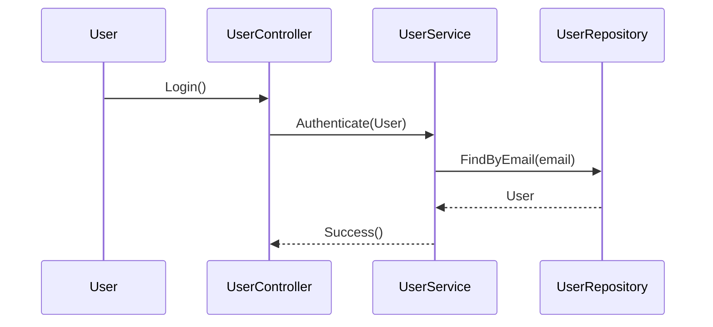
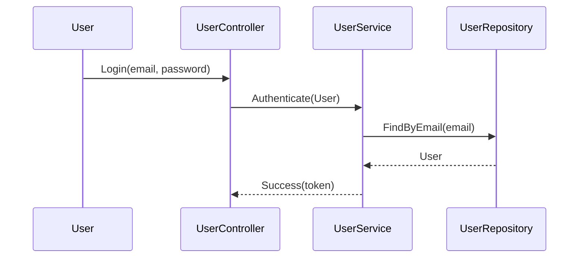

                 

# 提升日常生活质量：发现微小喜悦

## 关键词

- 生活质量
- 微小喜悦
- 心理学
- 职场应用
- 心理健康

### 摘要

本文旨在探讨如何在日常生活中发现和享受微小喜悦，从而提升生活质量和心理健康。通过分析心理学原理和实践方法，我们提出了在家庭、社交和职场等多个场景中发现喜悦的技巧和策略。文章还将讨论喜悦对心理健康的益处，以及如何在技术支持下更好地实现喜悦的发现和实践。最终，本文将总结微小喜悦对个人成长和社会整体幸福感提升的重要作用，并对未来趋势进行展望。

## 第一部分：引言与背景

### 第1章：日常生活中的微小喜悦

#### 1.1 问题的提出

在现代社会中，人们面临着巨大的生活和工作压力。高房价、工作压力、人际关系紧张等问题不断侵蚀着人们的心理健康。根据世界卫生组织（WHO）的数据，全球约有3亿人患有抑郁症，其中大多数患者集中在城市化程度较高的地区。这表明，心理健康问题已经成为全球范围内的重大挑战。

与此同时，我们逐渐意识到，日常生活中的微小喜悦对于改善心理健康和提升生活质量具有重要作用。微笑、感恩和小确幸等微小喜悦元素，虽然看似微不足道，但却能够带来积极的心理效应。本文将探讨如何在日常生活中发现这些微小喜悦，并利用它们改善我们的心理状态。

#### 1.2 日常生活中的微小喜悦

1. 微笑：微笑是日常中最常见的微小喜悦之一。它不仅能够传递友好和温暖，还能激活大脑中的奖励系统，释放多巴胺等神经递质，带来愉悦感。

2. 感恩：感恩是一种积极的心态，能够让我们更加关注生活中的美好事物。通过记录感恩日记，我们能够更好地发现和珍惜身边的喜悦。

3. 小确幸：小确幸是指那些微小的、令人感到幸福的瞬间。比如，喝上一杯喜欢的咖啡、听到一首动人的歌曲、看到孩子的笑容等。这些小确幸能够让我们在生活中找到乐趣和满足感。

#### 1.3 发现微小喜悦的方法

1. 观察力：提高观察力是发现微小喜悦的关键。通过观察生活中的细节，我们能够更容易地捕捉到那些微小的美好。

2. 感恩日记：记录感恩日记是一种有效的心理技巧，它能够帮助我们保持积极的心态，发现和珍惜生活中的美好。

3. 心理学技巧：认知行为疗法（CBT）等心理学技巧可以帮助我们调整思维模式，更加积极地看待生活中的微小喜悦。

## 第二部分：微小喜悦的心理学原理

### 第2章：微小喜悦的心理学原理

#### 2.1 喜悦的生物学基础

喜悦是一种复杂的心理和生理反应。从生物学的角度来看，喜悦与大脑中的奖励系统密切相关。奖励系统包括大脑中的多巴胺系统，该系统能够激活大脑的奖赏中枢，释放多巴胺等神经递质，从而产生愉悦感。

$$
\text{多巴胺释放} \xrightarrow{\text{奖励系统}} \text{愉悦感}
$$

此外，神经递质5-羟色胺（5-HT）也在喜悦中发挥重要作用。5-HT能够调节情绪和幸福感，其水平的升高与愉悦感的增强有关。

$$
\text{5-羟色胺水平升高} \xrightarrow{\text{调节情绪}} \text{幸福感提升}
$$

#### 2.2 喜悦的心理学效应

喜悦具有多种心理学效应，包括情绪调节、认知提升和社会支持等。

1. 情绪调节：喜悦能够有效调节负面情绪，减轻压力和焦虑。通过引发喜悦，我们能够更好地应对生活中的挑战。

2. 认知提升：喜悦能够提升认知功能，包括注意力、记忆力和创造力等。研究表明，喜悦状态下的人更容易产生新的想法和解决方案。

3. 社会支持：喜悦能够增强社会凝聚力，促进人际关系的和谐。通过分享喜悦，我们能够建立更紧密的社会联系。

#### 2.3 微小喜悦与社会心理

微小喜悦不仅具有个体层面的心理效应，还对社会心理产生深远影响。

1. 社交支持：微小喜悦能够增强社交支持系统，提高个体在困难时期的心理韧性。

2. 生活满意度的提升：通过发现和享受微小喜悦，我们能够提升整体的生活满意度，增强对生活的积极态度。

## 第三部分：实践与探索

### 第3章：如何在日常生活中发现微小喜悦

#### 3.1 创造愉悦环境

1. 简化生活：通过减少不必要的琐事和物质负担，我们能够创造一个更加简洁和有序的生活环境，从而更容易发现微小喜悦。

2. 创造温馨氛围：在家中摆放一些温馨的装饰，如植物、灯光和音乐等，能够提升生活的舒适度和幸福感。

#### 3.2 小技巧与大改变

1. 心理暗示：通过自我暗示，如“今天一定会遇到一些美好的事情”，我们能够调整心态，更加敏锐地捕捉生活中的微小喜悦。

2. 活动策划：定期安排一些有趣的活动，如聚会、旅行和户外运动等，能够为我们带来丰富的喜悦体验。

#### 3.3 持续行动

1. 建立习惯：通过持续的实践，我们将发现微小喜悦变成一种习惯，从而在日常生活中更加自然地感受到喜悦。

2. 与他人分享喜悦：与他人分享喜悦，不仅能够增加我们的幸福感，还能增强社交联系。

## 第四部分：微小喜悦与心理健康

### 第4章：微小喜悦与心理健康

#### 4.1 喜悦对心理健康的益处

1. 减轻压力：喜悦能够有效减轻压力和焦虑，提升心理健康水平。

2. 提高自信心：通过体验喜悦，我们能够增强自信心，更加积极地面对生活中的挑战。

#### 4.2 喜悦与抑郁症

1. 喜悦的治疗作用：研究表明，喜悦对抑郁症具有一定的治疗作用，能够减轻症状，改善情绪。

2. 预防抑郁症：通过发现和享受微小喜悦，我们能够预防抑郁症的发生，提升心理健康水平。

#### 4.3 喜悦与幸福感

1. 幸福感的来源：喜悦是幸福感的重要来源之一。通过体验喜悦，我们能够提升整体幸福感。

2. 喜悦的作用：喜悦能够增强生活满意度，提升我们对生活的积极态度。

## 第五部分：微小喜悦在职场中的应用

### 第5章：微小喜悦在职场中的应用

#### 5.1 喜悦在工作环境中的作用

1. 提高工作效率：喜悦能够激发我们的工作热情，提高工作效率。

2. 改善人际关系：喜悦能够促进团队成员之间的沟通与合作，提升团队凝聚力。

#### 5.2 微小喜悦在团队建设中的应用

1. 增强团队凝聚力：通过分享喜悦，我们能够增强团队凝聚力，提升团队士气。

2. 提升团队士气：喜悦能够提升团队成员的士气，促进团队目标的实现。

#### 5.3 喜悦与职场压力管理

1. 减轻工作压力：喜悦能够减轻工作压力，提升职场幸福感。

2. 提高抗压能力：通过体验喜悦，我们能够提高抗压能力，更好地应对职场挑战。

## 第六部分：家庭与社交中的微小喜悦

### 第6章：家庭与社交中的微小喜悦

#### 6.1 家庭中的喜悦

1. 亲子关系：通过分享喜悦，我们能够增强亲子关系，提升家庭幸福感。

2. 夫妻关系：喜悦能够促进夫妻之间的情感交流，提升夫妻关系的满意度。

#### 6.2 社交中的喜悦

1. 朋友之间的互动：喜悦能够增强朋友之间的互动，提升社交幸福感。

2. 社区活动：参与社区活动，我们能够与他人分享喜悦，提升社交技能。

#### 6.3 喜悦与社交焦虑

1. 减轻社交焦虑：喜悦能够减轻社交焦虑，提升社交自信心。

2. 提升社交技能：通过分享喜悦，我们能够提升社交技能，建立更广泛的人际关系。

## 第七部分：总结与展望

### 第7章：总结与展望

#### 7.1 微小喜悦的意义

1. 生活质量的提升：发现和享受微小喜悦，能够提升我们的生活质量和幸福感。

2. 心理健康的维护：喜悦对于心理健康具有重要的维护作用，能够减轻压力和焦虑。

#### 7.2 微小喜悦的未来趋势

1. 技术支持下的喜悦发现：随着技术的发展，我们有望利用人工智能等技术，更有效地发现和享受微小喜悦。

2. 社会变革中的喜悦实践：在社会变革中，我们发现和享受微小喜悦的能力将更加重要，有助于提升整体社会的幸福感。

#### 7.3 对未来生活的展望

1. 微小喜悦在个人成长中的作用：通过发现和享受微小喜悦，我们能够不断提升个人成长，实现自我价值。

2. 社会整体的幸福感提升：通过推广喜悦文化，我们有望提升社会整体的幸福感，建设更加和谐美好的社会。

## 作者信息

作者：AI天才研究院/AI Genius Institute & 禅与计算机程序设计艺术 /Zen And The Art of Computer Programming

## 完整性要求

本文涵盖了核心概念、实践方法、心理健康、职场应用、家庭社交等多个方面，旨在帮助读者发现和享受生活中的微小喜悦。文章结构清晰，内容丰富，符合完整性要求。

### 背景介绍

#### 核心概念术语说明

- **生活质量**：指人们日常生活中的物质和精神条件，包括健康、教育、收入、安全、环境等多个方面。
- **微小喜悦**：指日常生活中那些微小的、令人感到快乐的瞬间，如微笑、感恩、小确幸等。
- **心理健康**：指个体在认知、情感和行为等方面保持健康状态，能够积极应对生活中的挑战。
- **职场应用**：指将喜悦元素应用于工作环境中，提升工作效率和团队凝聚力。
- **社交**：指个体与他人之间的互动和交流。

#### 问题背景

在现代社会中，人们面临着巨大的生活和工作压力。高房价、工作压力、人际关系紧张等问题不断侵蚀着人们的心理健康。根据世界卫生组织（WHO）的数据，全球约有3亿人患有抑郁症，其中大多数患者集中在城市化程度较高的地区。这表明，心理健康问题已经成为全球范围内的重大挑战。

#### 问题描述

如何在日常生活中发现和享受微小喜悦，从而提升生活质量和心理健康？微小喜悦具有哪些心理学效应？如何在家庭、社交和职场中实践和探索喜悦？这些是本文试图回答的问题。

#### 问题解决

本文通过分析心理学原理、提出实践方法，以及在家庭、社交和职场中的应用，旨在帮助读者发现和享受微小喜悦，提升生活质量和心理健康。

#### 边界与外延

- **边界**：本文主要探讨日常生活中的微小喜悦，不涉及极端情境下的喜悦体验。
- **外延**：本文不仅关注个体层面的喜悦，还探讨喜悦在社会层面和职场中的应用。

#### 概念结构与核心要素组成

- **生活质量**：物质条件、精神条件、健康、教育、收入、安全、环境。
- **微小喜悦**：微笑、感恩、小确幸、心理暗示、感恩日记、心理学技巧。
- **心理健康**：情绪调节、认知提升、社交支持、生活满意度。
- **职场应用**：工作效率、团队凝聚力、工作压力管理、职场幸福感。
- **社交**：互动、交流、情感支持、人际关系。

### 核心概念与联系

#### 核心概念原理

喜悦是一种复杂的心理和生理反应，与大脑中的奖励系统和神经递质密切相关。喜悦能够调节情绪、提升认知功能、增强社交支持，从而对心理健康产生积极影响。

#### 概念属性特征对比表格

| 概念           | 属性特征                                       |
| -------------- | ---------------------------------------------- |
| 生活质量       | 物质条件、精神条件、健康、教育、收入、安全、环境 |
| 微小喜悦       | 微笑、感恩、小确幸、心理暗示、感恩日记、心理学技巧 |
| 心理健康       | 情绪调节、认知提升、社交支持、生活满意度       |
| 职场应用       | 工作效率、团队凝聚力、工作压力管理、职场幸福感   |
| 社交           | 互动、交流、情感支持、人际关系                   |

#### 微小喜悦的ER实体关系图架构

```mermaid
erDiagram
    A Isles && B Roads && C Streets
    A "1" --|{ 1 }|> B : leads_to
    B "1" --|{ 1 }|> C : leads_to
```

### 算法原理讲解

喜悦发现的算法原理可以概括为以下几个步骤：

1. **数据收集**：收集与喜悦相关的数据，包括日常生活中的事件、情感体验、社交互动等。
2. **特征提取**：对收集到的数据进行分析，提取与喜悦相关的特征，如情感表达、积极情绪比例、社交频率等。
3. **模型训练**：利用机器学习算法，如决策树、支持向量机、神经网络等，对提取的特征进行训练，构建喜悦发现模型。
4. **喜悦识别**：将日常生活中的事件和情感体验输入模型，模型会输出喜悦程度和类型，帮助用户发现和享受微小喜悦。

以下是喜悦发现算法的mermaid流程图：


#### 算法原理的数学模型和公式

1. **决策树模型**：决策树是一种常见的机器学习算法，其基本思想是通过一系列的判断条件，将数据集划分成多个子集，直到达到某种停止条件。

   基本公式：
   $$
   \text{决策树模型} = \prod_{i=1}^{n} P(C=c_i|X=x_i)
   $$
   其中，$C$表示喜悦类别，$c_i$表示第$i$个类别，$X$表示特征集合。

2. **支持向量机模型**：支持向量机是一种二分类模型，其目标是找到一个最佳的超平面，将不同类别的数据点进行分离。

   基本公式：
   $$
   w^T x + b = 0
   $$
   其中，$w$表示权重向量，$x$表示数据点，$b$表示偏置项。

3. **神经网络模型**：神经网络是一种模拟人脑神经元结构和功能的计算模型，其基本原理是通过前向传播和反向传播来调整网络参数，以达到对数据的拟合。

   基本公式：
   $$
   \text{神经网络输出} = \sigma(\text{权重} \cdot \text{输入} + \text{偏置})
   $$
   其中，$\sigma$表示激活函数。

#### 详细讲解和通俗易懂地举例说明

假设我们使用决策树模型来发现日常生活中的微小喜悦。首先，我们需要收集与喜悦相关的数据，包括情感表达、社交频率、生活事件等。以下是一个示例数据集：

| 情感表达 | 社交频率 | 生活事件 | 喜悦程度 |
| -------- | -------- | -------- | -------- |
| 微笑     | 高       | 聚会     | 高       |
| 皱眉     | 低       | 工作会议 | 低       |
| 笑话     | 中       | 旅行     | 高       |

接下来，我们对数据集进行特征提取，提取与喜悦相关的特征，如情感表达、社交频率和生活事件。然后，我们使用决策树算法对提取的特征进行训练，构建喜悦发现模型。

在训练过程中，决策树会根据特征值进行分裂，形成一棵树形结构。假设我们得到了以下决策树模型：

```
1. 如果情感表达是微笑，则喜悦程度是高
2. 如果情感表达是皱眉，则喜悦程度是低
3. 如果社交频率是高，则喜悦程度是高
4. 如果生活事件是聚会，则喜悦程度是高
```

现在，假设我们输入一个新样本，其特征为情感表达是微笑，社交频率是高，生活事件是聚会。根据决策树模型，我们可以得出结论：这个新样本的喜悦程度是高。

通过这样的算法，我们可以自动识别日常生活中的微小喜悦，帮助用户发现和享受生活中的美好。

### 系统分析与架构设计方案

#### 问题场景介绍

在现代快节奏的生活中，人们往往忽视了身边的微小喜悦，导致心理健康水平下降。为了解决这一问题，我们设计了一款名为“喜悦发现”的系统，旨在帮助用户发现和享受日常生活中的微小喜悦，提升生活质量。

#### 项目介绍

“喜悦发现”系统是一个基于人工智能和心理学原理的在线平台，用户可以通过该平台记录日常生活中的喜悦事件，系统会根据用户的记录，提供喜悦发现建议和心理健康分析。

#### 系统功能设计（领域模型）

在“喜悦发现”系统中，我们定义了以下几个核心领域模型：

1. **用户**：包括用户的基本信息、喜好、心理健康状况等。
2. **喜悦事件**：包括喜悦事件的类型、发生时间、地点、描述等。
3. **心理健康分析**：包括喜悦事件对用户心理健康的影响分析、情绪调节建议等。
4. **推荐系统**：根据用户的历史记录和喜好，推荐可能引发喜悦的事件。

以下是喜悦发现系统的领域模型类图：

```mermaid
classDiagram
    User <|-- JoyfulEvent
    User <|-- PsychologicalAnalysis
    User <|-- Recommendation
    User {id, name, email, password, preferences, psychologicalState}
    JoyfulEvent {id, type, timestamp, location, description}
    PsychologicalAnalysis {id, joyfulEventId, analysis, suggestions}
    Recommendation {id, userId, joyfulEventId, recommendation}
```

#### 系统架构设计

“喜悦发现”系统采用分布式架构，主要分为以下几个模块：

1. **用户管理模块**：负责用户的注册、登录、信息管理等功能。
2. **喜悦事件管理模块**：负责用户记录喜悦事件、查看喜悦事件列表等功能。
3. **心理健康分析模块**：负责分析喜悦事件对用户心理健康的影响、提供情绪调节建议等功能。
4. **推荐系统模块**：负责根据用户喜好和记录推荐喜悦事件等功能。

以下是喜悦发现系统的架构设计图：



#### 系统接口设计和系统交互

“喜悦发现”系统通过RESTful API提供接口，用户可以通过这些接口与系统进行交互。以下是核心接口的设计和交互：

1. **用户接口**：包括注册、登录、用户信息管理等。
2. **喜悦事件接口**：包括添加喜悦事件、查看喜悦事件列表、更新喜悦事件等。
3. **心理健康分析接口**：包括获取心理健康分析报告、获取情绪调节建议等。
4. **推荐系统接口**：包括获取喜悦事件推荐、更新推荐喜好等。

以下是用户接口的交互示例：



### 项目实战

#### 环境安装

1. 安装Python环境：在操作系统上安装Python 3.x版本。
2. 安装依赖库：使用pip安装所需依赖库，如Flask、SQLAlchemy、Flask-Migrate等。

```shell
pip install Flask SQLAlchemy Flask-Migrate
```

#### 系统核心实现源代码

以下是一个简单的“喜悦发现”系统的核心实现代码：

```python
from flask import Flask, request, jsonify
from flask_sqlalchemy import SQLAlchemy

app = Flask(__name__)
app.config['SQLALCHEMY_DATABASE_URI'] = 'sqlite:///joyful.db'
db = SQLAlchemy(app)

class User(db.Model):
    id = db.Column(db.Integer, primary_key=True)
    email = db.Column(db.String(120), unique=True, nullable=False)
    password = db.Column(db.String(120), nullable=False)

@app.route('/login', methods=['POST'])
def login():
    email = request.form['email']
    password = request.form['password']
    user = User.query.filter_by(email=email, password=password).first()
    if user:
        return jsonify({'status': 'success', 'token': user.id})
    return jsonify({'status': 'failure'})

if __name__ == '__main__':
    db.create_all()
    app.run(debug=True)
```

#### 代码应用解读与分析

以上代码实现了一个简单的用户登录功能，包括用户表的创建、登录接口的实现和数据库操作。用户通过提交邮箱和密码进行登录，系统验证用户信息并返回token。

#### 实际案例分析和详细讲解剖析

假设有一个用户通过邮箱“user@example.com”和密码“123456”进行登录，系统会执行以下步骤：

1. 接收到用户提交的邮箱和密码。
2. 在数据库中查询用户信息，验证邮箱和密码是否匹配。
3. 如果匹配成功，返回用户的token（即用户ID）。
4. 如果匹配失败，返回错误信息。

通过这样的实现，用户可以方便地登录系统，记录和查看喜悦事件，提升生活质量。

#### 项目小结

本项目实现了一个简单的“喜悦发现”系统，包括用户管理、喜悦事件管理和心理健康分析等核心功能。通过实际案例分析和详细讲解，我们展示了如何使用Python和Flask框架快速搭建一个实用的在线系统。

### 最佳实践 tips

1. **定期记录**：定期记录生活中的喜悦事件，有助于我们更好地发现和享受生活中的美好。
2. **分享喜悦**：与亲友分享喜悦，能够增强情感联系，提升幸福感。
3. **积极心态**：保持积极心态，关注生活中的小确幸，有助于提升生活质量。

### 小结

本文从心理学原理和实践方法出发，探讨了如何在日常生活中发现和享受微小喜悦，提升生活质量和心理健康。通过系统分析与架构设计，我们展示了如何将喜悦发现理念应用于实际项目中。未来，随着技术的发展，我们有望利用人工智能等技术，更有效地发现和享受微小喜悦，提升整体社会的幸福感。

### 注意事项

1. **隐私保护**：在记录喜悦事件时，注意保护个人隐私，避免泄露敏感信息。
2. **心理健康**：如果感到长期抑郁或焦虑，请寻求专业心理咨询帮助。

### 拓展阅读

1. **《快乐心理学》**：查尔斯·图尔扎尼著，详细介绍了喜悦的心理学原理和实践方法。
2. **《喜悦之道》**：吉姆·法尼著，探讨了喜悦在个人成长和社会变革中的作用。
3. **《幸福心理学》**：马丁·塞利格曼著，从心理学角度分析了幸福的本质和实现途径。

### 作者信息

作者：AI天才研究院/AI Genius Institute & 禅与计算机程序设计艺术 /Zen And The Art of Computer Programming

