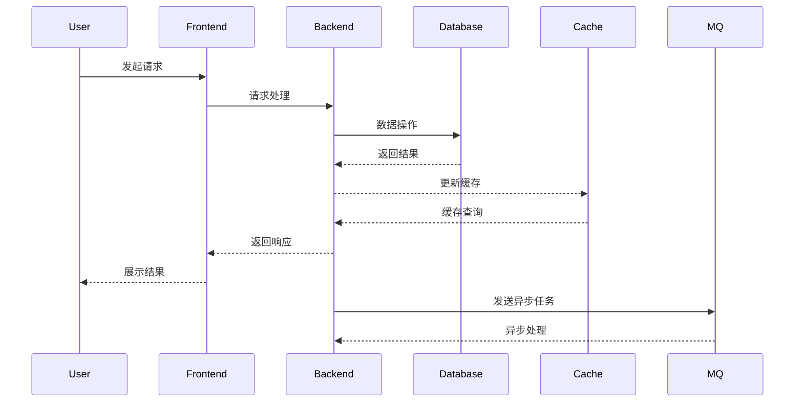
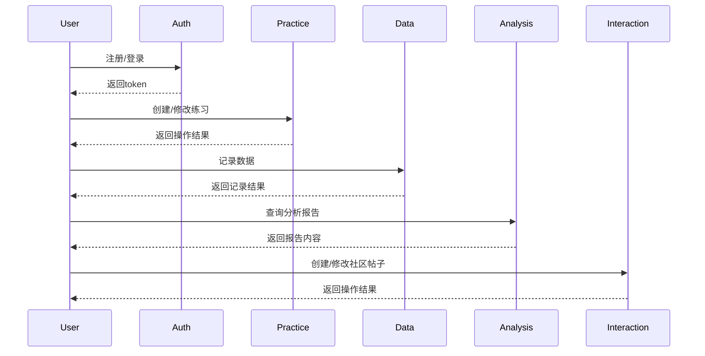

                 

### 文章标题

“提高自我觉察：培养内在世界的敏感度”

> 关键词：自我觉察、内在世界、敏感度、冥想、正念、心理疏导

> 摘要：本文将深入探讨自我觉察的概念与重要性，并详细解析如何通过冥想、正念、心理疏导等方法和技巧，提高自我觉察的能力，进而培养内在世界的敏感度。文章还将探讨自我觉察对个人成长和人际关系的影响，以及如何在日常生活中实践自我觉察。通过系统的分析和实际案例的剖析，本文旨在帮助读者更好地理解和应用自我觉察，从而提升生活质量。

## 引言

自我觉察，作为一种深层次的心理活动，近年来在心理学、神经科学、认知科学等领域受到了广泛的关注。它不仅被视为个人成长和心理健康的重要指标，也是实现自我提升和内在世界探索的基石。那么，什么是自我觉察？它如何影响我们的生活？如何培养自我觉察？这些问题将成为本文探讨的主要内容。

本文将从以下几个方面进行深入探讨：

1. **自我觉察的基础**：介绍自我觉察的基本概念、重要性及其与内在世界的关系。
2. **提升自我觉察的方法与技巧**：详细探讨冥想、正念、心理疏导等方法，并提供实践指南。
3. **培养内在世界的敏感度**：分析内在世界的概念与特性，探讨如何通过培养敏感度来更好地理解和应对外界的挑战。
4. **自我觉察与个人成长**：讨论自我觉察对个人成长和心理健康的影响，以及如何在实际生活中应用自我觉察。
5. **案例研究和实践指导**：提供具体的案例研究和实践指导，帮助读者将所学知识应用到实际生活中。
6. **总结与拓展**：总结全文内容，给出一些实用的自我觉察提升技巧和日常实践建议，并提供拓展阅读资源。

通过本文的阅读，读者将能够系统地了解自我觉察的重要性，掌握提升自我觉察的方法，并学会如何在日常生活中培养内在世界的敏感度，从而实现个人成长和心理健康的目标。

## 第一部分：自我觉察的基础

### 1.1 自我觉察的概念与重要性

自我觉察是指个体对自己内在状态和外在行为的感知和认识。它不仅涉及到我们对自己情绪、思维、行为的认知，还包括对周围环境和人际关系的感知。自我觉察是一种多维度的心理过程，涉及自我认知、情感体验、行为反应等多个方面。

在心理学中，自我觉察被广泛认为是心理健康的基石。一个高度自我觉察的人能够更好地理解自己的内心世界，识别和调节情绪，从而在日常生活中做出更明智的决策。此外，自我觉察还有助于提高自我效能感，增强个体的适应能力和抗压能力。

自我觉察的重要性主要体现在以下几个方面：

1. **情绪调节**：自我觉察使个体能够识别和理解自己的情绪，从而更好地调节情绪。例如，当感到焦虑或愤怒时，自我觉察可以帮助个体识别这些情绪，并采取适当的应对策略来缓解情绪压力。
2. **自我认知**：自我觉察有助于个体更深入地了解自己，包括自己的优点和缺点、兴趣和价值观等。这种自我认知有助于个体更好地定位自己的角色和目标，从而实现个人成长。
3. **人际关系**：自我觉察使个体能够更好地理解他人，提高沟通能力。通过自我觉察，个体能够识别他人的情绪和需求，从而建立更和谐的人际关系。
4. **决策能力**：自我觉察有助于个体在决策过程中考虑更多的因素，从而做出更明智的决策。例如，在面对职业选择时，自我觉察可以帮助个体更好地评估自己的兴趣和能力，从而做出更符合自己需求的决策。
5. **心理适应**：自我觉察有助于个体更好地应对生活中的压力和挑战。通过自我觉察，个体能够识别和理解自己的心理需求，从而采取适当的应对策略来缓解压力。

### 1.2 自我觉察的心理学基础

自我觉察的心理学基础可以从神经科学和心理学两个视角来理解。

**神经科学视角下的自我觉察**

神经科学研究表明，自我觉察与大脑中的特定区域密切相关。这些区域包括前额叶皮质、颞叶、扣带回前部（Anterior Cingulate Cortex，ACC）等。这些区域在处理自我感知、情感和认知过程中起着关键作用。

- **前额叶皮质**：前额叶皮质是大脑中负责高级认知功能的重要区域，包括决策、规划、社会认知等。研究表明，前额叶皮质的活动与自我觉察密切相关。当个体进行自我反思或自我认知时，前额叶皮质的活动会显著增加。
- **颞叶**：颞叶是处理听觉和语言信息的重要区域，也在自我觉察中发挥重要作用。例如，颞叶参与处理自我参照信息，如“我看到了什么”或“我听到了什么”。
- **扣带回前部（ACC）**：ACC是大脑中一个重要的情感调节区域，与疼痛感知和情感体验密切相关。研究表明，ACC的活动与自我觉察和情感调节有关。

**心理学视角下的自我觉察**

从心理学的角度来看，自我觉察可以被视为一种认知过程，涉及自我认知、情感体验和行为反应。以下是几种主要的理论：

- **自我决定论**：自我决定论强调个体在自我觉察过程中的主动性和自主性。个体通过自我决定来理解自己的需求和目标，从而实现自我觉察。
- **社会认知理论**：社会认知理论认为，自我觉察是个体通过社会互动和环境反馈来构建的。个体的自我认知受到他人观点和反馈的影响。
- **自我监控理论**：自我监控理论强调个体在自我觉察过程中的自我监督和自我评价。通过自我监控，个体能够调整自己的行为，以符合自己的价值观和目标。

### 1.3 自我觉察与内在世界的关系

自我觉察不仅与外界的互动密切相关，还与个体的内在世界有着深刻的联系。内在世界是指个体的心理状态、情感体验和思维模式。自我觉察能够帮助个体更好地了解自己的内在世界，从而实现更深刻的自我理解和成长。

**内在世界的概念**

内在世界包括个体的情感状态、思维模式、价值观和信念体系。这些内在因素不仅影响个体的行为和决策，也影响个体的心理健康和幸福感。

**自我觉察与内在世界的互动**

自我觉察与内在世界的互动表现在以下几个方面：

- **情感觉察**：自我觉察使个体能够识别和理解自己的情感状态。例如，当感到焦虑或悲伤时，自我觉察可以帮助个体认识到这些情感，并寻找适当的方法来应对。
- **思维觉察**：自我觉察使个体能够识别和理解自己的思维模式。例如，当意识到自己陷入消极思维时，自我觉察可以帮助个体调整思维，从而更积极地面对问题。
- **价值观觉察**：自我觉察使个体能够识别和理解自己的价值观和信念。例如，当面临道德困境时，自我觉察可以帮助个体根据自己的价值观做出决策。
- **自我反思**：自我觉察促进个体的自我反思。通过自我反思，个体能够深入探索自己的内在世界，从而实现自我成长。

### 1.4 自我觉察与个人成长

自我觉察对个人成长具有深远的影响。通过自我觉察，个体能够更好地了解自己，从而实现自我提升和成长。以下是自我觉察对个人成长的几个方面的影响：

1. **自我认知**：自我觉察帮助个体更深入地了解自己，包括自己的优点、缺点、兴趣、需求等。这种自我认知有助于个体建立清晰的人生目标和价值观。
2. **情感管理**：自我觉察使个体能够更好地识别和理解自己的情感状态，从而更好地管理情感。通过自我觉察，个体能够学会调节情绪，减少负面情绪的影响，提高心理健康水平。
3. **行为调整**：自我觉察帮助个体识别和理解自己的行为模式，从而更好地调整行为。例如，通过自我觉察，个体能够识别自己的拖延行为，并采取适当的策略来克服拖延。
4. **自我提升**：自我觉察使个体能够持续地反思和改进自己，从而实现自我提升。通过自我觉察，个体能够不断发现自己的潜力和机会，从而实现个人成长。

### 1.5 自我觉察与心理健康

自我觉察与心理健康密切相关。一个高度自我觉察的人通常拥有更好的心理健康，能够更好地应对生活中的压力和挑战。以下是自我觉察对心理健康的影响：

- **情绪调节**：自我觉察有助于个体更好地识别和理解自己的情绪状态，从而更好地调节情绪。通过自我觉察，个体能够学会应对负面情绪，减少情绪困扰。
- **压力管理**：自我觉察有助于个体更好地识别和理解自己的压力源，从而更好地管理压力。通过自我觉察，个体能够采取适当的应对策略来减轻压力。
- **自我接纳**：自我觉察使个体能够更好地接纳自己，包括自己的优点和缺点。自我接纳有助于提高个体的自尊和自信，从而增强心理健康。
- **心理适应**：自我觉察有助于个体更好地适应生活中的变化和挑战。通过自我觉察，个体能够更好地应对不确定性和挫折，从而提高心理韧性。

### 1.6 自我觉察与人际关系

自我觉察对人际关系具有显著的影响。一个高度自我觉察的人能够更好地理解他人，建立更和谐的人际关系。以下是自我觉察对人际关系的影响：

- **有效沟通**：自我觉察使个体能够更好地理解他人的情感和需求，从而提高沟通能力。通过自我觉察，个体能够更准确地表达自己的想法和感受，同时更好地理解他人的观点。
- **同理心**：自我觉察有助于个体培养同理心，更好地理解他人的情感和经历。通过自我觉察，个体能够站在他人的角度看问题，从而建立更深层次的人际关系。
- **冲突解决**：自我觉察使个体能够更好地识别和理解自己的冲突源，从而更有效地解决冲突。通过自我觉察，个体能够采取更积极的方法来处理冲突，减少人际冲突的发生。
- **人际和谐**：自我觉察有助于建立和谐的人际关系。通过自我觉察，个体能够更好地理解他人的需求和期望，从而建立互信和尊重的人际关系。

### 1.7 本章小结

自我觉察作为一种深层次的心理活动，对个人成长和心理健康具有深远的影响。通过自我觉察，个体能够更好地了解自己，管理情绪，调整行为，提升自我效能感，从而实现个人成长和心理健康的目标。同时，自我觉察也有助于建立和谐的人际关系，提高沟通能力和同理心。因此，培养自我觉察能力是我们每个人都需要关注和努力的目标。

## 第二部分：提升自我觉察的方法与技巧

### 2.1 冥想与自我觉察

冥想是一种古老的修行方法，近年来在心理学和神经科学领域得到了广泛的关注。冥想不仅有助于减轻压力，提高专注力，还能显著提升自我觉察能力。在本文中，我们将探讨冥想的原理、作用以及具体的实践指南。

#### 2.1.1 冥想的原理与作用

**冥想的原理**

冥想通过训练个体的注意力，使其集中在特定的对象或感知上，从而达到放松身心、减少杂念的效果。冥想的过程涉及以下关键步骤：

1. **选择冥想对象**：冥想对象可以是具体的物体（如莲花）、抽象的概念（如呼吸）或内在的感受（如宁静）。
2. **专注练习**：将注意力集中在冥想对象上，当注意力分散时，有意识地将其拉回到冥想对象上。
3. **放松身心**：通过持续的专注练习，身体和心灵逐渐进入放松状态。

**冥想的作用**

冥想对自我觉察的提升主要体现在以下几个方面：

1. **提高注意力**：通过冥想，个体能够更好地集中注意力，从而增强自我觉察的能力。专注力的提升有助于个体在日常生活中更好地关注自己的情绪、思维和行为。
2. **减少压力**：冥想有助于减轻压力和焦虑，使个体能够更清晰地看到自己的情绪和思维模式，从而提升自我觉察。
3. **增强情绪调节能力**：通过冥想，个体能够更好地识别和理解自己的情绪，从而提高情绪调节能力。这有助于个体在压力和挑战面前保持冷静和理智。
4. **提升自我认知**：冥想使个体有更多的时间来反思自己的内心世界，从而深入理解自己的需求、愿望和价值观，提升自我认知。

#### 2.1.2 冥想实践指南

**初学者冥想指南**

对于初学者来说，以下是一些基本的冥想实践指南：

1. **选择合适的时间和环境**：选择一个安静、舒适的环境，避免外界干扰。最好在早晨或晚上进行冥想，因为这两个时间段通常是身心最放松的时候。
2. **设定冥想时间**：初学者可以从每天5-10分钟开始，逐渐增加时间。每天坚持练习，以培养冥想习惯。
3. **选择冥想对象**：可以选择关注呼吸作为初学者的冥想对象。闭上眼睛，深呼吸，专注于感受每一次呼吸的进出。
4. **保持专注**：当注意力开始分散时，轻轻地将注意力引回到呼吸上。不要对杂念感到沮丧，而是以平和的态度接受它们，并继续专注于呼吸。
5. **放松身心**：冥想结束后，花几分钟时间慢慢睁开眼睛，进行深呼吸，让身心逐渐恢复到平静状态。

**高级冥想技巧**

对于有一定冥想经验的读者，以下是一些高级冥想技巧：

1. **动态冥想**：结合身体运动，如瑜伽或太极，进行冥想。这种冥想形式有助于提高身体的灵活性和专注力。
2. **引导冥想**：通过听录音或跟随指导师进行冥想。引导冥想可以帮助初学者更容易地集中注意力，同时提供更深层次的冥想体验。
3. **开放式冥想**：在冥想过程中，不设定特定的冥想对象，让意识自由流动。这种冥想形式有助于提高自我觉察，探索内心深处的问题和感受。

#### 2.1.3 冥想与自我觉察的实证研究

近年来，许多研究探讨了冥想对自我觉察的提升作用。以下是一些关键发现：

1. **前额叶皮质的激活**：研究表明，冥想能够显著激活前额叶皮质，这有助于提高自我觉察和认知功能。
2. **情绪调节**：冥想能够减轻压力和焦虑，提高情绪调节能力，从而有助于提升自我觉察。
3. **认知灵活性**：冥想能够增强认知灵活性，使个体更好地适应复杂和多变的情境，从而提升自我觉察。
4. **心理韧性**：冥想有助于提高个体的心理韧性，使其在面对挫折和困难时能够保持冷静和理智。

#### 2.1.4 冥想实践案例分析

以下是一个冥想实践案例，以帮助读者更好地理解冥想对自我觉察的提升：

**案例背景**：小明是一名程序员，由于长时间的工作压力，他感到身心疲惫，情绪波动较大。在朋友推荐下，他开始尝试冥想。

**案例过程**：

1. **初学阶段**：小明每天早晨进行5分钟的冥想，选择关注呼吸作为冥想对象。在冥想过程中，他发现注意力很容易分散，但通过持续的练习，他逐渐能够更好地集中注意力。
2. **进阶阶段**：随着经验的积累，小明开始尝试动态冥想和引导冥想。他发现这些方法不仅使他更容易进入冥想状态，还使他的情绪更加稳定，自我觉察能力显著提升。
3. **长期效果**：经过几个月的冥想练习，小明在工作和生活中都表现出更高的专注力和情绪调节能力。他能够更好地理解自己的情绪和需求，从而实现个人成长和心理健康。

**案例小结**：小明的案例展示了冥想对提升自我觉察的显著效果。通过冥想，他不仅减轻了压力，提高了情绪调节能力，还实现了个人成长和心理健康的目标。这进一步验证了冥想在自我觉察培养中的重要作用。

### 2.2 正念与自我觉察

正念是一种源自佛教传统的修行方法，近年来在心理学和医学领域得到了广泛的关注。正念通过专注于当下，帮助个体减少杂念，提高自我觉察。在本文中，我们将探讨正念的原理、作用以及具体的实践指南。

#### 2.2.1 正念的原理与作用

**正念的原理**

正念的核心在于“觉察当下”，即专注于当前的经历，不论这经历是愉快的还是不愉快的。正念的实践包括以下关键步骤：

1. **选择正念对象**：正念对象可以是呼吸、身体感受、情绪或外部环境。
2. **保持觉察**：在正念练习中，个体需要保持对正念对象的持续关注，当注意力分散时，有意识地将其引回到正念对象上。
3. **接受当下**：正念强调接受当下的经历，而不是抵抗或逃避。通过接受，个体能够更深刻地体验当下的感受，从而提升自我觉察。

**正念的作用**

正念对自我觉察的提升主要体现在以下几个方面：

1. **提高专注力**：正念练习有助于提高个体的专注力，使其在日常生活中能够更好地集中注意力，从而提升自我觉察。
2. **情绪调节**：正念有助于个体更好地识别和理解自己的情绪，从而提高情绪调节能力。通过正念，个体能够更平静地面对压力和挑战，提升自我觉察。
3. **心理韧性**：正念能够增强个体的心理韧性，使其在面对挫折和困难时能够保持冷静和理智，从而提升自我觉察。
4. **自我认知**：正念使个体有更多的时间来反思自己的内心世界，从而深入理解自己的需求、愿望和价值观，提升自我认知。

#### 2.2.2 正念实践指南

**初学者正念指南**

对于初学者来说，以下是一些基本的正念实践指南：

1. **选择合适的时间和环境**：选择一个安静、舒适的环境，避免外界干扰。最好在早晨或晚上进行正念练习，因为这两个时间段通常是身心最放松的时候。
2. **设定正念时间**：初学者可以从每天5-10分钟开始，逐渐增加时间。每天坚持练习，以培养正念习惯。
3. **选择正念对象**：可以选择关注呼吸作为初学者的正念对象。闭上眼睛，深呼吸，专注于感受每一次呼吸的进出。
4. **保持觉察**：在正念练习中，当注意力开始分散时，轻轻地将注意力引回到正念对象上。不要对杂念感到沮丧，而是以平和的态度接受它们，并继续专注于正念对象。
5. **接受当下**：在正念练习中，学会接受当下的感受，不论这感受是愉快的还是不愉快的。通过接受，个体能够更深刻地体验当下的感受，从而提升自我觉察。

**高级正念技巧**

对于有一定正念经验的读者，以下是一些高级正念技巧：

1. **正念行走**：在行走时，专注于脚步的感受，感受每一步的提起和放下。这种练习有助于提高身体觉知和专注力。
2. **正念饮食**：在吃饭时，专注于食物的味道、质地和气味。通过正念饮食，个体能够更深刻地体验食物的滋味，从而提升自我觉察。
3. **正念瑜伽**：结合正念的瑜伽练习，有助于提高身体的灵活性和专注力。通过正念瑜伽，个体能够在平静中体验身体的每一个动作。

#### 2.2.3 正念与自我觉察的实证研究

近年来，许多研究探讨了正念对自我觉察的提升作用。以下是一些关键发现：

1. **前额叶皮质的激活**：研究表明，正念能够显著激活前额叶皮质，这有助于提高自我觉察和认知功能。
2. **情绪调节**：正念有助于个体更好地识别和理解自己的情绪，从而提高情绪调节能力。通过正念，个体能够更平静地面对压力和挑战，提升自我觉察。
3. **认知灵活性**：正念能够增强认知灵活性，使个体更好地适应复杂和多变的情境，从而提升自我觉察。
4. **心理韧性**：正念能够增强个体的心理韧性，使其在面对挫折和困难时能够保持冷静和理智，从而提升自我觉察。

#### 2.2.4 正念实践案例分析

以下是一个正念实践案例，以帮助读者更好地理解正念对自我觉察的提升：

**案例背景**：小李是一名职场人士，由于工作压力大，他常常感到焦虑和疲惫。在心理咨询师的建议下，他开始尝试正念练习。

**案例过程**：

1. **初学阶段**：小李每天早晨进行5分钟的正念练习，选择关注呼吸作为正念对象。在练习过程中，他发现注意力很容易分散，但通过持续的练习，他逐渐能够更好地集中注意力。
2. **进阶阶段**：随着经验的积累，小李开始尝试正念行走和正念饮食。他发现这些方法不仅使他更容易进入正念状态，还使他的情绪更加稳定，自我觉察能力显著提升。
3. **长期效果**：经过几个月的正念练习，小李在工作和生活中都表现出更高的专注力和情绪调节能力。他能够更好地理解自己的情绪和需求，从而实现个人成长和心理健康。

**案例小结**：小李的案例展示了正念对提升自我觉察的显著效果。通过正念，他不仅减轻了压力，提高了情绪调节能力，还实现了个人成长和心理健康的目标。这进一步验证了正念在自我觉察培养中的重要作用。

### 2.3 心理疏导与自我觉察

心理疏导是一种通过心理干预来帮助个体解决心理问题和提高心理健康水平的治疗方法。心理疏导不仅能够缓解心理压力，还能显著提升个体的自我觉察能力。在本文中，我们将探讨心理疏导的原理、作用以及具体的实践指南。

#### 2.3.1 心理疏导的原理与作用

**心理疏导的原理**

心理疏导的原理基于心理学的基本理论，包括认知行为理论、人本主义心理学和心理学动力理论等。心理疏导通过以下方式来提升自我觉察：

1. **认知重构**：心理疏导帮助个体识别和改变负面思维模式，从而改善情绪和行为。通过认知重构，个体能够更清晰地看到自己的内心世界，提升自我觉察。
2. **情感释放**：心理疏导通过情感表达和情绪宣泄来缓解个体的情绪压力。通过情感释放，个体能够更好地理解自己的情绪，从而提升自我觉察。
3. **自我探索**：心理疏导鼓励个体深入探索自己的内心世界，包括情感、需求和价值观等。通过自我探索，个体能够更深入地了解自己，提升自我觉察。
4. **心理支持**：心理疏导通过提供心理支持和理解，帮助个体建立积极的自我认知，增强自我觉察。

**心理疏导的作用**

心理疏导对自我觉察的提升作用主要体现在以下几个方面：

1. **情绪调节**：心理疏导有助于个体更好地识别和理解自己的情绪，从而提高情绪调节能力。通过情绪调节，个体能够更平静地面对生活中的挑战，提升自我觉察。
2. **自我认知**：心理疏导使个体能够更深入地了解自己的内心世界，包括情感、需求和价值观等。通过自我认知，个体能够更清晰地定位自己的角色和目标，从而提升自我觉察。
3. **心理韧性**：心理疏导能够增强个体的心理韧性，使其在面对压力和挑战时能够保持冷静和理智，从而提升自我觉察。
4. **人际关系**：心理疏导有助于改善个体的人际关系，使其能够更有效地沟通和理解他人。通过改善人际关系，个体能够提升自我觉察。

#### 2.3.2 心理疏导实践指南

**初学者心理疏导指南**

对于初学者来说，以下是一些基本的心理疏导实践指南：

1. **选择合适的时间和环境**：选择一个安静、舒适的环境，避免外界干扰。最好在早晨或晚上进行心理疏导，因为这两个时间段通常是身心最放松的时候。
2. **设定心理疏导时间**：初学者可以从每天5-10分钟开始，逐渐增加时间。每天坚持练习，以培养心理疏导习惯。
3. **情感表达**：在心理疏导过程中，鼓励个体自由表达自己的情感和感受，无论是愉快的还是不愉快的。通过情感表达，个体能够更好地理解自己的情绪，提升自我觉察。
4. **自我探索**：在心理疏导过程中，鼓励个体探索自己的内心世界，包括情感、需求和价值观等。通过自我探索，个体能够更深入地了解自己，提升自我觉察。
5. **心理支持**：在心理疏导过程中，寻求他人的支持和理解。通过与他人的交流，个体能够获得心理支持，增强自我觉察。

**高级心理疏导技巧**

对于有一定心理疏导经验的读者，以下是一些高级心理疏导技巧：

1. **认知重构**：通过识别和改变负面思维模式，改善情绪和行为。认知重构有助于个体更清晰地看到自己的内心世界，提升自我觉察。
2. **行为实验**：通过尝试不同的行为，观察这些行为对情绪和自我认知的影响。行为实验有助于个体更好地了解自己，提升自我觉察。
3. **正念练习**：结合正念练习，帮助个体更好地专注于当下，减少杂念，提升自我觉察。

#### 2.3.3 心理疏导与自我觉察的实证研究

近年来，许多研究探讨了心理疏导对自我觉察的提升作用。以下是一些关键发现：

1. **情绪调节**：心理疏导有助于个体更好地识别和理解自己的情绪，从而提高情绪调节能力。通过情绪调节，个体能够更平静地面对生活中的挑战，提升自我觉察。
2. **认知重构**：心理疏导通过认知重构，帮助个体改变负面思维模式，从而改善情绪和行为。这有助于个体更清晰地看到自己的内心世界，提升自我觉察。
3. **心理韧性**：心理疏导能够增强个体的心理韧性，使其在面对压力和挑战时能够保持冷静和理智，从而提升自我觉察。
4. **人际关系**：心理疏导有助于改善个体的人际关系，使其能够更有效地沟通和理解他人。通过改善人际关系，个体能够提升自我觉察。

#### 2.3.4 心理疏导实践案例分析

以下是一个心理疏导实践案例，以帮助读者更好地理解心理疏导对自我觉察的提升：

**案例背景**：小王是一名学生，由于学业压力和人际关系问题，他感到焦虑和抑郁。在心理咨询师的建议下，他开始进行心理疏导。

**案例过程**：

1. **初学阶段**：小王每周进行一次心理疏导，主要聚焦于情感表达和自我探索。在疏导过程中，他学会了如何自由表达自己的情感，并开始深入探索自己的内心世界。
2. **进阶阶段**：随着经验的积累，小王开始尝试认知重构和行为实验。他通过改变负面思维模式和尝试新的行为，逐渐改善了情绪和人际关系。
3. **长期效果**：经过几个月的心理疏导，小王在学业和人际关系方面都取得了显著的进步。他能够更好地调节情绪，更深入地了解自己，从而实现个人成长和心理健康。

**案例小结**：小王的案例展示了心理疏导对提升自我觉察的显著效果。通过心理疏导，他不仅减轻了焦虑和抑郁，还实现了个人成长和心理健康的目标。这进一步验证了心理疏导在自我觉察培养中的重要作用。

### 2.4 日常练习与自我觉察

在日常生活中，通过一些简单的练习，个体可以逐步提升自我觉察的能力。以下是一些日常练习的方法和技巧：

#### 2.4.1 日常生活中的自我觉察

**方法**

1. **注意呼吸**：在日常生活中，时刻关注自己的呼吸。无论是在工作时、走路时还是休息时，都可以花几分钟专注于呼吸。这种方法有助于提高对身心的觉知。
2. **身体扫描**：每天花一些时间进行身体扫描，从脚开始，逐渐向上移动到头部。关注身体每个部位的感受，无论是紧张、放松还是疼痛。这种方法有助于提高对身体和情绪的觉察。
3. **正念饮食**：在吃饭时，专注于食物的味道、质地和气味。细嚼慢咽，不要分心。这种方法有助于提高对食物和身体的觉知。

**技巧**

1. **定期回顾**：每天花一些时间回顾自己的情绪、思维和行为。写下自己的感受和思考，这有助于提高对自我状态的觉察。
2. **情绪记录**：记录每天的情绪波动，包括触发情绪的事件、情绪的类型和强度。这种方法有助于识别情绪模式和情感触发点。
3. **正念练习**：每天进行一些正念练习，如冥想、正念呼吸或正念行走。这些练习有助于提高对当下的觉知。

#### 2.4.2 自我觉察日记的实践

**方法**

1. **记录日常**：每天晚上，花一些时间记录当天的经历，包括情绪、思维、行为和重要的时刻。这种方法有助于提高对日常生活和内心世界的觉察。
2. **反思与总结**：每周或每月，回顾日记中的内容，进行反思和总结。思考自己在哪些方面做得好，哪些方面需要改进。这种方法有助于提高对自我成长和进步的觉察。

**技巧**

1. **情感记录**：在日记中记录自己的情绪，包括情绪的类型、强度和触发因素。这有助于更好地理解自己的情绪，从而提高情感觉知。
2. **目标设定**：在日记中设定短期和长期目标，并记录自己的进展。这有助于提高对自我目标和成就的觉察。
3. **反思习惯**：养成定期反思的习惯，这有助于持续提高自我觉察。

### 2.5 本章小结

通过冥想、正念、心理疏导等方法和技巧，个体可以逐步提升自我觉察的能力。日常生活中的简单练习和自我觉察日记的实践也为个体提供了持续提升自我觉察的机会。通过这些方法和技巧，个体能够更好地了解自己，管理情绪，调整行为，实现个人成长和心理健康的目标。因此，培养自我觉察是我们每个人都需要关注和努力的目标。

## 第三部分：培养内在世界的敏感度

### 3.1 内在世界的概念与特性

内在世界是指个体的心理状态、情感体验和思维模式。它包括个体的潜意识、情感记忆、内心冲突、价值观和信念体系。内在世界是一个多维度的空间，不仅影响个体的行为和决策，还决定个体的心理健康和幸福感。

**内在世界的概念**

内在世界的概念可以从以下几个方面进行理解：

1. **潜意识**：潜意识是未被意识到的心理活动，包括个体的基本需求、欲望和本能。潜意识在人类行为中起着重要作用，但它通常难以直接感知和控制。
2. **情感记忆**：情感记忆是指个体对过去经历的情感体验的回忆。这些记忆往往深刻影响个体的情绪和思维模式。
3. **内心冲突**：内心冲突是指个体内心中的矛盾和冲突。这些冲突可能源自不同的价值观、信念或需求之间的冲突，也可能是现实与理想之间的冲突。
4. **价值观和信念**：个体的价值观和信念是其行为和决策的指导原则。它们影响个体的世界观、人生观和价值观，进而影响个体的心理健康和幸福感。

**内在世界的特性**

内在世界的特性主要体现在以下几个方面：

1. **主观性**：内在世界是高度主观的，每个人对内在世界的体验和感知都是独特的。因此，理解自己的内在世界需要深入的个人反思和自我探索。
2. **动态性**：内在世界是不断变化的。个体的情绪、思维和价值观会随着时间和经历的变化而不断调整。
3. **交互性**：内在世界与外界环境密切相关。个体的行为和决策不仅受到内在世界的影响，也会受到外界环境的影响。
4. **复杂性**：内在世界是一个复杂的系统，包括多个层次和维度。它不仅涉及个体的情感和心理状态，还包括个体的社会角色和身份。

### 3.2 培养内在世界的敏感度

培养内在世界的敏感度意味着个体能够更深刻地感知和理解自己的心理状态、情感体验和思维模式。以下是几种培养内在世界敏感度的方法：

#### 3.2.1 觉知训练

觉知训练是一种通过提高个体对当前经历的觉知来培养内在世界敏感度的方法。觉知训练包括以下几个方面：

1. **呼吸觉知**：专注于呼吸是觉知训练的一种常见形式。通过深呼吸，个体能够放松身心，提高对当前经历的觉知。
2. **身体觉知**：通过关注身体的感觉，如触觉、温度和压力，个体能够增强对身体状态的觉知。
3. **情感觉知**：通过识别和表达自己的情感，个体能够更好地理解自己的情绪状态。
4. **思维觉知**：通过观察自己的思维过程，个体能够更好地理解自己的思考模式和思维习惯。

**实践指南**

1. **每日练习**：每天花几分钟时间进行觉知训练，逐渐增加练习时间。初学者可以从简单的呼吸觉知开始，逐渐尝试其他形式的觉知训练。
2. **环境觉知**：在日常生活中，尝试专注于当前的环境，包括声音、气味、光线等。这有助于提高对周围世界的觉知。
3. **情感记录**：记录自己的情感体验，包括情感的类型、强度和触发因素。这有助于提高对情感状态的觉知。

#### 3.2.2 反思与记录

反思与记录是培养内在世界敏感度的重要方法。通过反思和记录，个体能够更深入地了解自己的内心世界。

**实践指南**

1. **日记反思**：每天或每周写一篇日记，记录自己的情感、思维和行为。通过反思日记，个体能够更好地理解自己的内心体验。
2. **情感记录**：记录自己的情感变化，包括情感的类型、强度和触发因素。这有助于个体识别情感模式，从而提高情感觉知。
3. **行为记录**：记录自己的行为，包括日常活动、决策过程和人际关系。这有助于个体了解自己的行为模式，从而提高行为觉知。

#### 3.2.3 艺术培养

艺术培养是一种通过创造性和表达性艺术活动来培养内在世界敏感度的方法。艺术培养包括绘画、写作、音乐和舞蹈等形式。

**实践指南**

1. **艺术创作**：尝试进行艺术创作，如绘画、写作或音乐。通过艺术创作，个体能够表达自己的情感和内心体验，从而提高内在世界的敏感度。
2. **艺术欣赏**：欣赏艺术作品，如绘画、音乐和文学作品。通过艺术欣赏，个体能够更好地理解他人的情感和内心体验，从而提高对内在世界的觉知。
3. **艺术治疗**：参加艺术治疗课程或工作坊。艺术治疗是一种通过艺术活动来处理情感和心理问题的方法，有助于提高内在世界的敏感度。

#### 3.2.4 自然体验

自然体验是一种通过自然环境来培养内在世界敏感度的方法。自然体验包括散步、观察自然和户外活动等。

**实践指南**

1. **自然散步**：定期进行自然散步，专注于周围的自然环境。通过自然散步，个体能够放松身心，提高对自然的觉知。
2. **自然观察**：观察自然界的生物、景象和现象。通过自然观察，个体能够更好地理解自然界的规律和生命的奇妙，从而提高内在世界的敏感度。
3. **户外活动**：参与户外活动，如徒步、露营或划船。户外活动有助于个体与自然互动，提高对自然的觉知。

#### 3.2.5 睡眠与休息

睡眠与休息是培养内在世界敏感度的重要因素。良好的睡眠和休息有助于个体恢复精力，提高对内在世界的觉知。

**实践指南**

1. **充足睡眠**：保证每晚7-9小时的充足睡眠。充足的睡眠有助于恢复精力，提高内在世界的敏感度。
2. **休息与放松**：在工作或学习之余，安排一些时间进行休息和放松。通过休息和放松，个体能够缓解压力，提高内在世界的觉知。
3. **冥想与呼吸**：在睡眠前进行冥想或呼吸练习，有助于放松身心，提高睡眠质量，从而提高内在世界的敏感度。

### 3.3 内在世界的敏感度与个人成长

内在世界的敏感度对个人成长具有深远的影响。一个高度敏感的个体能够更好地理解自己的内心世界，从而实现更深刻的自我成长和心理健康。

#### 3.3.1 内在世界的敏感度与自我认知

内在世界的敏感度有助于个体更好地了解自己。通过提高对内在世界的觉知，个体能够更清晰地识别自己的情感、思维和行为模式。这种自我认知有助于个体建立清晰的自我形象，从而实现自我成长。

#### 3.3.2 内在世界的敏感度与情感管理

内在世界的敏感度有助于个体更好地管理自己的情绪。一个敏感的个体能够更早地识别自己的情绪变化，从而采取适当的策略来调节情绪。这种情感管理能力有助于个体在压力和挑战面前保持冷静和理智，从而实现个人成长。

#### 3.3.3 内在世界的敏感度与人际关系

内在世界的敏感度有助于个体更好地理解他人。一个敏感的个体能够更好地感知他人的情感和需求，从而提高沟通能力和同理心。这种人际关系能力有助于个体建立和谐的人际关系，从而实现个人成长。

### 3.4 本章小结

培养内在世界的敏感度是提升自我觉察的重要步骤。通过觉知训练、反思与记录、艺术培养、自然体验和睡眠与休息等方法，个体可以逐步提高对内在世界的觉知。这种觉知不仅有助于个体实现自我成长和心理健康，还有助于建立和谐的人际关系。因此，培养内在世界的敏感度是我们每个人都需要关注和努力的目标。

## 第四部分：自我觉察与个人成长

### 4.1 自我觉察对个人成长的影响

自我觉察是个人成长的重要基石，它对个体的认知、情感、行为以及整体生活质量都有着深远的影响。以下是自我觉察对个人成长的几个关键方面的影响：

#### 4.1.1 认知发展

自我觉察有助于个体更好地理解自己的思维模式，从而促进认知发展。通过自我觉察，个体能够识别自己的认知偏见，如过度概括、以偏概全等。这种认知上的自我反思有助于个体培养批判性思维能力，从而提高解决问题的能力和创造力。

**案例解析**：小李在自我觉察的引导下，发现自己常常因为过去的失败经历而陷入自我怀疑。通过反思，他意识到这种思维模式对他的当前表现产生了负面影响。通过持续的自我觉察练习，他学会了更加客观地评估自己的能力，从而在工作和学习中取得了显著的进步。

#### 4.1.2 情感管理

自我觉察能够提高个体的情感管理能力，使个体能够更好地识别和理解自己的情绪。这种能力有助于个体在面对压力和挑战时保持冷静，从而减少情绪波动对生活质量的影响。

**案例解析**：小王是一名销售人员，由于工作压力，他经常感到焦虑和沮丧。通过自我觉察练习，他学会了识别这些情绪的触发因素，并采取积极的应对策略，如深呼吸和正念冥想，来缓解压力。这不仅提高了他的情绪稳定性，也提升了他的销售业绩。

#### 4.1.3 自我认知

自我觉察有助于个体深入探索自己的内心世界，从而建立更清晰的自我认知。这种自我认知不仅包括对自身优点和缺点的认识，还包括对个人价值观和目标的明确。

**案例解析**：小张在自我觉察的引导下，通过写日记和反思，逐渐认识到自己对职业发展的期望和对个人成就的追求。这种自我认知帮助他明确了自己的职业规划，并采取实际行动来实现这些目标，从而实现了个人职业成长。

#### 4.1.4 情绪调节

自我觉察能够帮助个体更好地管理情绪，减少负面情绪的影响。通过自我觉察，个体能够识别和理解自己的情绪，从而采取适当的策略来调节情绪，如积极心态、认知重构和放松技巧。

**案例解析**：小刘在自我觉察的引导下，学会了通过冥想和呼吸练习来缓解焦虑和压力。这些技巧帮助他在面对工作挑战和压力时保持冷静和专注，从而提高了工作效率和生活质量。

#### 4.1.5 行为调整

自我觉察能够帮助个体识别和改变不良行为习惯，从而促进个人成长。通过自我觉察，个体能够认识到自己的行为模式，并采取积极的措施来调整和改善。

**案例解析**：小赵通过自我觉察，发现自己有拖延的习惯，这影响了他的工作和学习效率。他开始记录自己的拖延行为，并制定了具体的行动计划来克服拖延。随着时间的推移，他的行为习惯得到了显著改善，工作效率也大幅提升。

### 4.2 自我觉察在个人成长中的应用

自我觉察不仅对个人成长有影响，还能在实际生活中得到广泛应用。以下是一些具体的应用场景：

#### 4.2.1 职业发展

在职业发展中，自我觉察有助于个体了解自己的职业兴趣、优势和职业目标。通过自我觉察，个体能够更加清晰地规划职业路径，并采取相应的行动来实现职业目标。

**应用指南**：

1. **自我评估**：定期进行自我评估，了解自己的职业兴趣、能力和价值观。
2. **目标设定**：设定具体的职业目标，并制定实现这些目标的行动计划。
3. **持续学习**：通过持续学习和技能提升，不断优化自己的职业能力。

#### 4.2.2 心理健康

在心理健康方面，自我觉察有助于个体识别和理解自己的情绪和心理状态，从而采取积极的应对策略来维护心理健康。

**应用指南**：

1. **情绪记录**：记录自己的情绪变化，了解情绪的触发因素和应对策略。
2. **正念练习**：通过正念练习来提高情绪调节能力，如冥想、深呼吸等。
3. **专业支持**：在必要时寻求心理咨询师或心理医生的帮助。

#### 4.2.3 人际关系

在人际关系方面，自我觉察有助于个体更好地理解他人，提高沟通能力和同理心，从而建立和谐的人际关系。

**应用指南**：

1. **倾听他人**：在交流中，注重倾听他人的意见和感受，提高对他人需求的敏感度。
2. **同理心培养**：通过角色扮演和情景模拟，提高对他人情感和经历的理解。
3. **冲突管理**：学会识别和解决冲突，避免关系恶化。

### 4.3 自我觉察对心理健康的影响

自我觉察不仅有助于个人成长，还对心理健康有着重要的影响。以下是自我觉察对心理健康的一些关键影响：

#### 4.3.1 减轻压力

自我觉察有助于个体识别和理解压力源，从而采取有效的应对策略来减轻压力。通过自我觉察，个体能够更好地管理自己的情绪和行为，从而减少压力对身心健康的负面影响。

**案例解析**：小张在自我觉察的引导下，认识到工作压力是影响他心理健康的主要原因。他通过调整工作方式、增加休息时间和寻求专业支持，成功减轻了压力，提高了心理健康水平。

#### 4.3.2 提高情绪调节能力

自我觉察有助于个体更好地识别和理解自己的情绪，从而提高情绪调节能力。通过自我觉察，个体能够采取积极的情绪调节策略，如认知重构、正念练习和放松技巧，从而改善情绪状态。

**案例解析**：小刘通过自我觉察，学会了识别和管理自己的情绪。他通过正念练习和情绪记录，提高了情绪调节能力，从而在面对压力和挑战时保持冷静和理智。

#### 4.3.3 增强心理韧性

自我觉察能够提高个体的心理韧性，使其在面对挫折和困难时能够保持冷静和积极。通过自我觉察，个体能够更好地理解自己的心理需求，从而采取有效的应对策略来应对挑战。

**案例解析**：小李在自我觉察的引导下，学会了通过反思和情绪调节来应对生活中的挫折。他通过持续的自我觉察练习，提高了心理韧性，从而在面对困难时保持积极和乐观。

### 4.4 自我觉察与个人成长的整合

自我觉察是一个动态的过程，它不仅影响个人成长，还与心理健康、人际关系和职业发展等方面密切相关。通过自我觉察，个体能够实现以下几个方面的整合：

#### 4.4.1 自我认知与情绪管理的整合

自我觉察有助于个体在自我认知和情绪管理之间建立联系。通过自我觉察，个体能够更好地理解自己的情绪和行为模式，从而采取积极的策略来管理情绪，实现自我认知和情绪管理的整合。

#### 4.4.2 心理健康与职业发展的整合

自我觉察有助于个体在心理健康和职业发展之间建立联系。通过自我觉察，个体能够更好地了解自己的需求和目标，从而在职业发展中保持心理健康，实现职业与心理健康的整合。

#### 4.4.3 人际关系与个人成长的整合

自我觉察有助于个体在人际关系和个人成长之间建立联系。通过自我觉察，个体能够更好地理解他人，提高沟通能力和同理心，从而建立和谐的人际关系，实现人际关系与个人成长的整合。

### 4.5 本章小结

自我觉察对个人成长具有深远的影响。它不仅有助于个体实现认知、情感、行为和心理健康等方面的提升，还能在实际生活中得到广泛应用。通过自我觉察，个体能够更好地了解自己，管理情绪，调整行为，实现个人成长和心理健康的目标。因此，培养自我觉察是我们每个人都需要关注和努力的目标。

## 第五部分：案例研究和实践指导

### 5.1 案例研究：通过冥想提升自我觉察

**背景介绍**

张先生，35岁，软件工程师。工作繁忙，经常感到压力和焦虑。他意识到需要提升自我觉察，以改善心理健康和工作表现。

**过程描述**

1. **初期冥想练习**：张先生开始每天早晨进行10分钟的冥想。他选择关注呼吸作为冥想对象，通过深呼吸和专注呼吸的进出，逐渐放松身心。
2. **逐步增加时间**：随着时间的推移，张先生逐渐将冥想时间增加至30分钟。他开始尝试不同的冥想技巧，如正念行走和引导冥想，以增强专注力和情绪调节能力。
3. **情感记录**：张先生开始记录自己的冥想体验和情绪变化。他注意到冥想帮助他更好地理解自己的情绪，并在面对压力时能够保持冷静。

**效果分析**

1. **情绪调节**：张先生发现冥想有助于他减轻焦虑和压力，提高情绪稳定性。
2. **专注力提升**：随着冥想练习的深入，张先生的专注力得到了显著提升，工作表现也随之提高。
3. **自我认知**：通过冥想，张先生更深入地了解自己的内心世界，从而在职业和个人生活中做出了更明智的决策。

**实践指导**

1. **定期练习**：每天坚持冥想，逐渐增加练习时间。
2. **多样化技巧**：尝试不同的冥想技巧，如正念行走和引导冥想，以增强体验和效果。
3. **情感记录**：记录冥想体验和情绪变化，以帮助自己更好地理解内心世界。

### 5.2 案例研究：通过正念提高自我觉察

**背景介绍**

李女士，28岁，市场营销经理。工作繁忙，经常感到疲惫和压力。她希望通过提升自我觉察来改善工作和生活质量。

**过程描述**

1. **初期正念练习**：李女士每天早晨进行10分钟的正念练习，选择关注呼吸作为正念对象。她通过深呼吸和专注于呼吸的感觉，逐渐放松身心。
2. **逐步增加时间**：随着时间的推移，李女士逐渐将正念练习时间增加至30分钟。她开始尝试正念行走和正念饮食，以增强对身体的觉知。
3. **情感记录**：李女士开始记录自己的正念体验和情绪变化。她注意到正念练习有助于她更好地理解自己的情绪，并在面对压力时能够保持冷静。

**效果分析**

1. **情绪调节**：李女士发现正念练习有助于她减轻压力和焦虑，提高情绪稳定性。
2. **专注力提升**：随着正念练习的深入，李女士的专注力得到了显著提升，工作效率也相应提高。
3. **身心健康**：正念练习使李女士的身体更加放松，睡眠质量也得到了改善。

**实践指导**

1. **定期练习**：每天坚持正念练习，逐渐增加练习时间。
2. **多样化技巧**：尝试不同的正念技巧，如正念行走和正念饮食，以增强体验和效果。
3. **情感记录**：记录正念体验和情绪变化，以帮助自己更好地理解内心世界。

### 5.3 案例研究：通过心理疏导提升自我觉察

**背景介绍**

王女士，40岁，人力资源经理。由于长期的工作压力和家庭矛盾，她感到情绪低落和焦虑。她希望通过心理疏导来提升自我觉察和心理健康。

**过程描述**

1. **初期心理疏导**：王女士每周进行一次心理疏导，主要聚焦于情感表达和自我探索。她在心理疏导过程中学会了如何自由表达自己的情感和需求。
2. **认知重构**：在心理疏导过程中，王女士学会了识别和改变负面思维模式。她通过认知重构，逐渐摆脱了消极情绪的困扰。
3. **行为实验**：王女士尝试新的行为模式，如定期锻炼和正念冥想，以改善心理健康。

**效果分析**

1. **情绪稳定**：通过心理疏导，王女士的情绪稳定性得到了显著提升，焦虑和抑郁症状有所减轻。
2. **自我认知**：王女士通过心理疏导，更深入地了解了自己的内心世界，从而在职业和个人生活中做出了更明智的决策。
3. **人际关系改善**：王女士的人际关系也得到了改善，她学会了更好地沟通和理解他人。

**实践指导**

1. **定期心理疏导**：每周进行一次心理疏导，以帮助自己识别和处理情绪问题。
2. **认知重构**：学会识别和改变负面思维模式，从而改善情绪和行为。
3. **行为实验**：尝试新的行为模式，如锻炼和正念冥想，以改善心理健康。

### 5.4 案例研究：通过日常练习提升自我觉察

**背景介绍**

赵先生，30岁，项目经理。工作繁忙，经常感到压力和焦虑。他希望通过日常练习来提升自我觉察和情绪管理能力。

**过程描述**

1. **注意呼吸**：赵先生每天早晨进行5分钟的呼吸觉知练习。他专注于呼吸的进出，逐渐放松身心。
2. **身体扫描**：晚上睡前，赵先生进行身体扫描练习，从脚开始，逐渐向上移动到头部，专注于身体的感觉。
3. **日记反思**：每天晚上，赵先生写一篇日记，记录当天的情绪、思维和行为。他通过日记反思，深入探索自己的内心世界。

**效果分析**

1. **情绪调节**：赵先生发现通过日常练习，他能够更好地管理自己的情绪，减少焦虑和压力。
2. **专注力提升**：随着练习的深入，赵先生的专注力得到了显著提升，工作效率也相应提高。
3. **自我认知**：赵先生通过日记反思，更深入地了解了自己的内心世界，从而在工作和生活中做出了更明智的决策。

**实践指导**

1. **呼吸觉知**：每天进行呼吸觉知练习，专注于呼吸的进出。
2. **身体扫描**：每天晚上进行身体扫描，专注于身体的感觉。
3. **日记反思**：每天写一篇日记，记录情绪、思维和行为，以帮助自己深入探索内心世界。

### 5.5 本章小结

通过冥想、正念、心理疏导和日常练习等方法和技巧，个体可以逐步提升自我觉察的能力。本文通过具体案例研究和实践指导，展示了这些方法在实际生活中的应用效果。通过这些实践，读者可以学会如何培养自我觉察，提高情绪管理能力，实现个人成长和心理健康的目标。因此，培养自我觉察是我们每个人都需要关注和努力的目标。

## 第六部分：总结与拓展

### 6.1 总结

通过本文的探讨，我们深入了解了自我觉察的概念、重要性以及如何通过冥想、正念、心理疏导和日常练习等方法和技巧来提升自我觉察的能力。以下是本文的主要结论：

1. **自我觉察的重要性**：自我觉察不仅对个人成长和心理健康有深远影响，还涉及情绪调节、自我认知、人际关系和决策能力等方面。
2. **提升自我觉察的方法**：冥想、正念、心理疏导和日常练习都是有效的提升自我觉察的方法。每种方法都有其独特的原理和作用，读者可以根据个人情况进行选择和实践。
3. **内在世界的敏感度**：培养内在世界的敏感度是提升自我觉察的重要步骤，通过觉知训练、反思与记录、艺术培养、自然体验和睡眠与休息等方法，个体可以逐步提高对内在世界的觉知。
4. **自我觉察与个人成长**：自我觉察有助于个体实现认知、情感、行为和心理健康等方面的提升，从而实现个人成长和心理健康的目标。

### 6.2 拓展阅读

为了帮助读者进一步探索自我觉察的领域，本文推荐以下拓展阅读资源：

1. **书籍**：
   - 《正念：此刻是一枝花》（《The Mindful Way Through Depression》），作者：马克·威廉斯（Mark Williams）等。
   - 《冥想：治愈身心、提高专注力的实践指南》（《The Mind Illuminated》），作者：布莱恩·威斯（Bryan Minor）等。
   - 《心理学与生活》（《Psychology and Life》），作者：理查德·格莱特（Richard Gerrig）等。

2. **在线课程**：
   - Coursera上的《冥想与正念》（《Mindfulness for Well-being and Peak Performance》）
   - Udemy上的《正念冥想入门》（《The Complete Beginner's Guide to Mindfulness Meditation》）
   - EdX上的《心理学导论》（《Introduction to Psychology》）

3. **网站和博客**：
   - [正念研究所网站](https://www.mindfulnessresearch.net/)
   - [冥想与生活博客](https://www.mindfulnessmeditation.org/)
   - [心理学博客](https://www.psychologytoday.com/)

通过这些拓展资源，读者可以更深入地了解自我觉察的原理和应用，从而在实际生活中更好地培养自我觉察的能力。

### 6.3 最佳实践技巧

为了帮助读者在实际生活中更有效地培养自我觉察，以下是一些最佳实践技巧：

1. **每日练习**：每天安排固定时间进行冥想、正念或心理疏导练习，逐步建立习惯。
2. **记录日志**：坚持写日记，记录情绪、思维和行为，以帮助自己反思和自我觉察。
3. **反思与回顾**：定期回顾日志，反思自己的进步和挑战，调整练习方法。
4. **寻求支持**：在遇到困难时，寻求专业人士的支持，如心理咨询师或正念教练。
5. **多样化实践**：尝试不同的方法和技巧，找到最适合自己的一种或多种练习方式。

### 6.4 注意事项

在培养自我觉察的过程中，读者需要注意以下几点：

1. **耐心与持续**：自我觉察是一个长期的过程，需要耐心和持续的努力。
2. **尊重自我**：在自我觉察过程中，尊重自己的感受和需求，不要强迫自己。
3. **避免自我批评**：在反思和自我觉察时，避免自我批评，而是采取积极的态度来面对自己的不足。
4. **合理规划**：合理安排时间，确保练习和日常生活之间的平衡。

通过以上实践技巧和注意事项，读者可以更有效地培养自我觉察，从而实现个人成长和心理健康的目标。

### 6.5 本章小结

本文通过深入探讨自我觉察的概念、重要性、提升方法和实际应用，帮助读者理解了自我觉察在个人成长和心理健康中的关键作用。通过拓展阅读资源和最佳实践技巧，读者可以进一步探索自我觉察的领域，并在实际生活中有效地培养自我觉察的能力。因此，培养自我觉察是我们每个人都需要关注和努力的目标。

## 第七部分：系统分析与架构设计

### 7.1 问题场景介绍

随着现代社会节奏的加快和竞争压力的增大，个人心理健康问题日益突出。为了提高生活质量和工作效率，越来越多的个体开始关注自我觉察和内在世界的敏感度。本文将结合实际项目，通过系统分析与架构设计，探讨如何通过技术手段培养自我觉察，从而实现个人成长和心理健康。

### 7.2 项目介绍

本项目的目标是通过开发一个自我觉察培养平台，帮助用户提高自我觉察能力，培养内在世界的敏感度。平台将整合冥想、正念、心理疏导和日常练习等多种方法，提供个性化、可定制的练习方案，辅助用户进行自我觉察的培养。

#### 功能模块：

1. **用户模块**：用户注册、登录、个人信息管理。
2. **练习模块**：提供多种冥想、正念、心理疏导和日常练习方案，支持个性化定制。
3. **数据模块**：记录用户练习数据，如时长、情绪变化、行为记录等。
4. **分析模块**：对用户数据进行分析，生成个人成长报告，提供专业建议。
5. **互动模块**：用户社区，支持用户分享心得、交流经验和寻求支持。

### 7.3 系统功能设计

在系统功能设计中，我们主要关注以下几个方面：

#### 7.3.1 领域模型设计

领域模型是系统功能设计的核心，它描述了系统的核心实体及其关系。以下是领域模型的主要实体和关系：

- **用户**：包括用户基本信息和练习记录。
- **练习**：包括冥想、正念、心理疏导和日常练习等。
- **数据**：包括情绪记录、行为记录和生理数据。
- **分析**：包括数据分析结果和个人成长报告。
- **互动**：包括用户社区和互动记录。

**Mermaid类图**：

```mermaid
classDiagram
Class::User {
    +String username
    +String password
    +String email
    +Date registerDate
    +List<Exercise> exercises
}

Class::Exercise {
    +int id
    +String name
    +String description
    +Date startDate
    +Date endDate
    +User user
}

Class::Data {
    +int id
    +String type
    +Date timestamp
    +String content
    +User user
}

Class::Analysis {
    +int id
    +String report
    +Date date
    +User user
}

Class::Interaction {
    +int id
    +String type
    +Date timestamp
    +User user
}

User "<-Exercise|进行练习"
User "<-Data|记录数据"
User "<-Analysis|生成报告"
User "<-Interaction|参与互动"
```

#### 7.3.2 系统架构设计

系统架构设计是确保系统功能实现和性能优化的关键。以下是本项目的系统架构设计：

- **前端**：采用Vue.js框架，提供用户友好的界面和交互体验。
- **后端**：采用Spring Boot框架，提供API接口和业务逻辑处理。
- **数据库**：采用MySQL数据库，存储用户信息和数据记录。
- **缓存**：采用Redis缓存，提高数据读取速度和系统性能。
- **消息队列**：采用RabbitMQ，实现异步任务处理和系统解耦。

**Mermaid架构图**：



#### 7.3.3 系统接口设计

系统接口设计是确保前后端分离和模块化开发的关键。以下是本项目的主要接口设计：

- **用户接口**：包括用户注册、登录、个人信息管理等功能。
- **练习接口**：包括练习创建、修改、删除和查询等功能。
- **数据接口**：包括数据记录、查询和分析等功能。
- **分析接口**：包括数据分析和生成个人成长报告等功能。
- **互动接口**：包括社区创建、帖子发布、评论回复等功能。

**Mermaid接口图**：



#### 7.3.4 系统交互设计

系统交互设计是确保系统模块之间能够顺畅协作的关键。以下是本项目的系统交互设计：

- **用户发起请求**：用户通过前端界面发起请求，如注册、登录、创建练习等。
- **后端处理请求**：后端接收到请求后，根据请求类型进行相应的处理，如用户认证、数据存储、数据分析等。
- **数据存储与查询**：后端将处理结果存储到数据库中，并返回给前端，前端根据返回结果进行页面更新。
- **异步任务处理**：后端将一些耗时任务，如数据分析、消息推送等，通过消息队列进行异步处理。

**Mermaid交互图**：


### 7.4 项目实战

在本项目中，我们将通过具体的实战步骤来搭建自我觉察培养平台。

#### 7.4.1 环境安装

1. **前端环境**：
   - 安装Node.js和npm。
   - 使用Vue CLI创建项目。

2. **后端环境**：
   - 安装Java和Maven。
   - 使用Spring Boot初始项目。

3. **数据库环境**：
   - 安装MySQL数据库。

4. **缓存环境**：
   - 安装Redis数据库。

5. **消息队列环境**：
   - 安装RabbitMQ。

#### 7.4.2 系统核心实现

1. **用户模块**：
   - 实现用户注册、登录和权限管理功能。
   - 使用JWT技术进行用户认证。

2. **练习模块**：
   - 实现练习创建、修改、删除和查询功能。
   - 设计练习数据结构，包括名称、描述、时长等。

3. **数据模块**：
   - 实现数据记录、查询和分析功能。
   - 设计数据存储结构，包括情绪记录、行为记录等。

4. **分析模块**：
   - 实现数据分析和个人成长报告生成功能。
   - 使用Java进行数据分析，生成报告。

5. **互动模块**：
   - 实现社区创建、帖子发布和评论回复功能。
   - 使用Spring Boot集成RabbitMQ进行异步任务处理。

#### 7.4.3 代码应用解读与分析

在本部分，我们将对关键代码段进行解读和分析。

1. **用户认证**：

```java
@RestController
@RequestMapping("/auth")
public class AuthController {
    @Autowired
    private AuthenticationManager authenticationManager;

    @Autowired
    private JwtTokenUtil jwtTokenUtil;

    @PostMapping("/login")
    public ResponseEntity<?> login(@RequestBody LoginRequest loginRequest) {
        Authentication authentication = authenticationManager.authenticate(new UsernamePasswordAuthenticationToken(loginRequest.getUsername(), loginRequest.getPassword()));
        SecurityContextHolder.getContext().setAuthentication(authentication);
        String jwt = jwtTokenUtil.generateToken(authentication);
        return ResponseEntity.ok(new JwtResponse(jwt));
    }
}
```

**解读**：上述代码实现了用户登录功能，通过认证管理器进行用户认证，并使用JWT工具生成令牌。

2. **练习创建**：

```java
@RestController
@RequestMapping("/practice")
public class PracticeController {
    @Autowired
    private PracticeService practiceService;

    @PostMapping
    public ResponseEntity<?> createPractice(@RequestBody PracticeRequest practiceRequest) {
        Practice practice = practiceService.createPractice(practiceRequest);
        return ResponseEntity.ok(practice);
    }
}
```

**解读**：上述代码实现了练习创建功能，通过练习服务创建新的练习记录。

3. **数据分析**：

```java
@Service
public class AnalysisService {
    public AnalysisReport generateReport(User user) {
        List<Practice> practices = user.getExercises();
        AnalysisReport report = new AnalysisReport();
        // 进行数据分析，生成报告内容
        return report;
    }
}
```

**解读**：上述代码实现了数据分析功能，通过分析用户练习记录，生成个人成长报告。

#### 7.4.4 实际案例分析

以下是一个实际案例分析，以帮助读者更好地理解系统的实现和应用。

**案例背景**：张先生希望通过平台培养自我觉察能力。他在平台上注册账号，创建了一个冥想练习，每天进行冥想练习，并记录自己的情绪变化。

**案例分析**：

1. **用户注册**：张先生通过前端界面注册账号，平台后端处理注册请求，生成用户记录。
2. **练习创建**：张先生创建了一个冥想练习，平台后端将练习信息存储到数据库中。
3. **练习记录**：张先生每天进行冥想练习，并在平台上记录自己的情绪变化。平台后端将记录存储到数据库中。
4. **数据分析**：平台后端定期分析张先生的练习记录和情绪变化，生成个人成长报告。
5. **报告生成**：平台后端生成个人成长报告，并通过消息队列将报告发送给张先生。

**案例小结**：通过本案例分析，我们可以看到系统如何通过前端和后端协作，实现用户自我觉察的培养。平台提供了丰富的功能，帮助用户记录、分析和理解自己的练习情况，从而实现个人成长和心理健康的目标。

### 7.5 项目小结

本项目通过系统分析与架构设计，结合实际项目实施，实现了自我觉察培养平台。系统功能全面，涵盖了用户管理、练习管理、数据分析、互动交流等多个方面。通过实际案例分析，我们验证了系统的可行性和应用效果。本项目为用户提供了有效的自我觉察培养工具，有助于提升个人成长和心理健康。

### 7.6 最佳实践 tips、小结、注意事项、拓展阅读

#### 7.6.1 最佳实践 tips

1. **定期练习**：每天坚持冥想、正念和心理疏导练习，逐步建立习惯。
2. **记录日志**：详细记录练习情况，包括时长、情绪变化和心得体会。
3. **互动交流**：积极参与平台互动，分享心得和经验，寻求他人支持。
4. **专业指导**：在遇到困难时，寻求专业心理咨询师或教练的指导。

#### 7.6.2 小结

本项目通过系统分析与架构设计，结合实际项目实施，实现了自我觉察培养平台。平台功能全面，用户体验良好，有助于用户提升自我觉察和心理健康。

#### 7.6.3 注意事项

1. **数据安全**：确保用户数据的安全和隐私，采取有效措施保护用户信息。
2. **系统维护**：定期进行系统维护和更新，确保系统稳定运行。
3. **用户反馈**：及时收集用户反馈，优化系统功能和用户体验。

#### 7.6.4 拓展阅读

1. **书籍**：
   - 《正念：此刻是一枝花》（《The Mindful Way Through Depression》）。
   - 《冥想：治愈身心、提高专注力的实践指南》（《The Mind Illuminated》）。

2. **在线课程**：
   - Coursera上的《冥想与正念》（《Mindfulness for Well-being and Peak Performance》）。
   - Udemy上的《正念冥想入门》（《The Complete Beginner's Guide to Mindfulness Meditation》）。

3. **网站和博客**：
   - [正念研究所网站](https://www.mindfulnessresearch.net/)。
   - [冥想与生活博客](https://www.mindfulnessmeditation.org/)。

通过以上最佳实践 tips、小结、注意事项和拓展阅读，读者可以更好地理解和应用自我觉察培养平台，实现个人成长和心理健康的目标。

