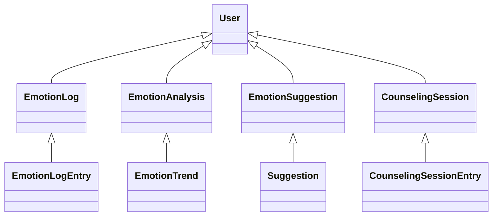

                 


### 摆脱消极情绪的方法：净化思维的实践

关键词：消极情绪、积极心态、心理健康、认知行为疗法、情绪调节、算法模型

摘要：本文旨在探讨如何通过科学的方法和实践，帮助读者摆脱消极情绪，培养积极心态，提高生活质量。通过自我认知、改变思维模式、健康生活、社交支持和心理咨询等方法，读者可以逐步净化自己的思维，摆脱消极情绪的困扰。

---

## 引言

在快节奏的现代生活中，消极情绪已经成为了影响人们身心健康和生活质量的重大问题。随着工作压力、家庭压力、社交压力等多种因素的增加，越来越多的人陷入了焦虑、抑郁、愤怒等消极情绪的泥沼中。消极情绪不仅会影响个人的情绪状态，还会对身体健康产生负面影响，如免疫力下降、心理疾病等。因此，如何摆脱消极情绪，培养积极心态，成为了现代社会中一个亟待解决的问题。

本文将从以下几个方面进行探讨：

1. **背景介绍**：介绍消极情绪的定义与影响，常见原因以及摆脱消极情绪的重要性。
2. **核心概念与联系**：阐述消极情绪的类型、属性特征以及与积极情绪的ER实体关系。
3. **摆脱消极情绪的方法**：从自我认知、改变思维模式、健康生活、社交支持和心理咨询等方面，详细介绍摆脱消极情绪的具体方法。
4. **算法原理讲解**：介绍认知行为疗法、情绪调节策略以及情绪调节的数学模型。
5. **系统分析与架构设计方案**：介绍一个心理健康管理平台的项目场景、目标、系统功能设计、系统架构设计、系统接口设计和系统交互。
6. **项目实战**：详细讲解一个实际项目的环境安装、系统核心实现、代码应用解读与分析、实际案例分析和项目小结。
7. **最佳实践 tips**、**小结**、**注意事项**和**拓展阅读**等内容。

让我们一步步来思考和探索，如何通过科学的方法和实践，摆脱消极情绪，培养积极心态，提高生活质量。

---

### 第1章 背景介绍

在快节奏的现代生活中，消极情绪已经成为了影响人们身心健康和生活质量的重大问题。随着工作压力、家庭压力、社交压力等多种因素的增加，越来越多的人陷入了焦虑、抑郁、愤怒等消极情绪的泥沼中。消极情绪不仅会影响个人的情绪状态，还会对身体健康产生负面影响，如免疫力下降、心理疾病等。因此，如何摆脱消极情绪，培养积极心态，成为了现代社会中一个亟待解决的问题。

#### 1.1 消极情绪的定义与影响

**定义**：消极情绪是一种消极的心理状态，通常表现为焦虑、抑郁、愤怒等。焦虑是一种对未来不确定性的担忧，抑郁是对生活的无望感，而愤怒则是对他人或事物的强烈不满。

**影响**：长期处于消极情绪中，会对身心健康产生负面影响。焦虑和抑郁可能导致身体免疫力下降，从而增加患病的风险。长期愤怒则可能引发心脏病、高血压等健康问题。

#### 1.2 消极情绪的常见原因

**生活压力**：工作压力、家庭压力等。现代社会中，人们面临的生活压力越来越大，这些压力往往会导致消极情绪的产生。

**个人性格**：敏感、悲观等性格特点。一些人天生就更容易陷入消极情绪，他们的性格特点使他们更容易受到外界环境的影响。

**环境影响**：负面信息、人际关系等。社交媒体、新闻媒体等渠道传播的负面信息，以及不良的人际关系，都可能成为消极情绪的来源。

#### 1.3 摆脱消极情绪的重要性

**提高生活质量**：积极心态有助于更好地应对生活中的挑战，提高生活质量。在面对困难和挫折时，积极的心态可以帮助我们更快地恢复，重新振作。

**促进身心健康**：长期处于积极情绪中，有助于提升身体免疫力，减少患病的风险。同时，积极情绪还能促进心理健康，降低心理疾病的发生率。

通过以上背景介绍，我们可以看出，摆脱消极情绪，培养积极心态的重要性。接下来，我们将深入探讨消极情绪的核心概念与联系。

---

### 第2章 核心概念与联系

在理解了消极情绪的定义与影响之后，我们接下来需要深入了解消极情绪的核心概念及其与积极情绪的联系。

#### 2.1 消极情绪的类型

消极情绪可以分为焦虑、抑郁和愤怒三种主要类型。

**焦虑**：对未来不确定性的担忧，常常表现为紧张、不安、出汗等生理反应。焦虑情绪可能导致人们过度担忧，影响日常生活和工作。

**抑郁**：对生活的无望感，常常表现为情绪低落、精神不振、食欲减退等。抑郁情绪会影响人们的情绪状态，甚至可能导致心理疾病。

**愤怒**：对他人或事物的强烈不满，常常表现为言语攻击、面部表情紧张等。愤怒情绪可能加剧人际关系紧张，影响社会和谐。

#### 2.2 消极情绪的属性特征对比表格

| 类型 | 定义 | 特点 |
| ---- | ---- | ---- |
| 焦虑 | 对未来不确定性的担忧 | 心跳加速、出汗、呼吸急促 |
| 抑郁 | 对生活的无望感 | 精神不振、食欲减退、失眠 |
| 愤怒 | 对他人或事物的强烈不满 | 面部表情紧张、言语攻击 |

通过对比表格，我们可以更清晰地理解三种消极情绪的定义和特点，有助于我们更好地识别和应对这些情绪。

#### 2.3 消极情绪与积极情绪的ER实体关系图

消极情绪和积极情绪是相互对立的两个概念，它们之间存在着复杂的联系。下面是一个简单的ER实体关系图，用以表示消极情绪与积极情绪之间的关系。

```mermaid
erDiagram
  消极情绪 ||--|{ 积极：情绪 }|
  焦虑 ||--|{ 抑郁：情绪 }|
  愤怒 ||--|{ 抑郁：情绪 }|
```

在这个ER实体关系图中，消极情绪是一个根实体，它与积极情绪之间存在一种一对多的关系。焦虑和愤怒两个子实体都与抑郁这个子实体存在一对一的关系。这表示消极情绪中的焦虑和愤怒往往会导致抑郁情绪的产生。

通过以上核心概念与联系的分析，我们可以更深入地理解消极情绪的本质和影响。接下来，我们将探讨如何通过具体的方法来摆脱消极情绪，培养积极心态。

---

### 第3章 摆脱消极情绪的方法

要摆脱消极情绪，培养积极心态，我们需要从多个方面入手，采取一系列具体的方法。以下是一些有效的方法：

#### 3.1 自我认知

**认识消极情绪**：首先，我们需要认识到消极情绪的存在和原因。只有当我们真正了解自己的情绪，才能找到合适的应对方法。可以通过写日记、自我反思等方式来认识自己的情绪。

**自我反思**：通过自我反思，我们可以了解自己的行为和思维模式，找到导致消极情绪的根源。例如，如果我们发现自己经常因为工作中的小错误而感到焦虑，那么我们可以尝试改变这种思维模式，学会接受错误，并从中吸取教训。

#### 3.2 改变思维模式

**积极思维**：积极思维是一种有效的应对消极情绪的方法。我们可以通过以下方式来培养积极思维：

- **正面肯定**：每天对自己说一些正面肯定的话，如“我能行”、“今天一定会很好”等。
- **积极思考**：在面对困难时，尝试从积极的角度去思考问题，寻找解决问题的方法。

**感恩练习**：每天记录三件值得感激的事情，这有助于我们关注生活中的积极方面，减少消极情绪的影响。

#### 3.3 健康生活

**定期锻炼**：运动可以释放压力，提高身体免疫力，有助于改善情绪。可以选择适合自己的运动方式，如跑步、瑜伽、游泳等。

**合理饮食**：保持营养均衡的饮食，避免过量饮酒。营养不良和酗酒都会影响情绪。

#### 3.4 社交支持

**建立支持系统**：与亲朋好友分享自己的情绪，寻求他们的支持和理解。一个强大的社交支持系统可以帮助我们更好地应对生活中的挑战。

**参与社交活动**：扩大社交圈，参与各种社交活动，这有助于减少孤独感，提高生活质量。

#### 3.5 心理咨询

**寻求专业帮助**：如果消极情绪严重影响生活，可以考虑寻求专业心理咨询师的帮助。心理咨询师可以提供专业的情绪管理指导，帮助我们找到适合自己的应对方法。

通过以上方法，我们可以逐步摆脱消极情绪，培养积极心态。但需要注意的是，每个人的情况不同，我们需要根据自己的实际情况选择合适的方法。同时，培养积极心态是一个长期的过程，需要持续的努力和实践。

---

### 第4章 算法原理讲解

为了更好地理解和应用摆脱消极情绪的方法，我们可以借助一些算法原理进行讲解。以下是一些常用的算法原理和策略。

#### 4.1 认知行为疗法（CBT）

**原理**：认知行为疗法（Cognitive Behavioral Therapy，CBT）是一种通过改变思维和行为模式来减轻情绪困扰的心理治疗方法。CBT认为，情绪问题通常源于错误的思维方式和行为模式，通过改变这些模式，可以改善情绪状态。

**流程**：
```mermaid
sequence
  participant A as 用户
  participant B as 心理咨询师

  A->B: 描述消极情绪
  B->A: 提问了解问题背景
  B->A: 解释CBT原理
  B->A: 指导进行认知重构
  A->B: 反馈治疗效果
```

在这个流程中，心理咨询师会与用户进行沟通，了解用户的情绪困扰，解释CBT的原理，并指导用户进行认知重构，即通过改变错误的思维模式来改善情绪。

#### 4.2 情绪调节策略

**原理**：情绪调节是通过认知和行为技巧来调节情绪的过程。以下是一些常用的情绪调节策略：

- **深呼吸**：通过深呼吸来缓解紧张情绪，放松身心。
- **正面思考**：用积极的想法替代消极想法，从而改善情绪状态。

**策略**：
```mermaid
sequence
  participant A as 用户

  A->A: 识别消极情绪
  A->A: 执行深呼吸
  A->A: 用正面想法替代消极想法
```

在这个流程中，用户首先识别自己的消极情绪，然后通过深呼吸和正面思考来调节情绪。

#### 4.3 情绪调节的数学模型

**模型**：情绪调节可以看作是一个优化问题，目标是最大化积极情绪，最小化消极情绪。

**公式**：
$$ \text{最大化} \ \sum_{i=1}^{n} P_i \cdot B_i $$
其中，\( P_i \) 表示积极情绪的权重，\( B_i \) 表示消极情绪的权重。

这个公式表示，我们需要在多个情绪选项中找到最佳的组合，使得积极情绪的权重之和最大，消极情绪的权重之和最小。

#### 4.4 算法实现示例

以下是一个简单的Python代码示例，用于实现情绪调节策略：

```python
def positive_thinking(Thought):
    if "负面" in Thought:
        return Thought.replace("负面", "正面")
    else:
        return Thought

# 示例
Thought = "我今天又犯了一个错误，我真是个失败者。"
print(positive_thinking(Thought))
```

在这个示例中，我们定义了一个函数`positive_thinking`，用于将消极情绪转换为积极情绪。通过这个函数，我们可以将用户输入的消极情绪句子转换为积极情绪句子。

通过以上算法原理讲解，我们可以更好地理解如何通过科学的方法和实践来调节情绪，摆脱消极情绪的影响。

---

### 第5章 系统分析与架构设计方案

#### 5.1 问题场景介绍

在现代科技高度发展的时代，心理健康问题日益受到关注。然而，许多人由于种种原因，往往难以主动寻求专业的心理咨询帮助。为了解决这一问题，我们设计了一个心理健康管理平台，旨在通过线上工具，帮助用户识别和管理消极情绪，从而提升他们的心理健康水平。

该平台的主要功能包括：

1. **情绪识别**：通过用户输入的情绪描述，平台能够自动识别并分类用户的情绪状态。
2. **情绪管理**：根据用户的情绪状态，平台提供一系列的情绪调节策略和建议。
3. **心理咨询**：提供在线心理咨询师咨询服务，帮助用户解决深层次的情绪问题。

#### 5.2 项目介绍

**目标**：

- 为用户提供一个简单、易用的情绪管理工具。
- 通过数据分析和人工智能技术，为用户提供个性化的情绪管理建议。
- 帮助用户建立积极心态，提高生活质量。

**范围**：

- 用户范围：面向所有有情绪管理需求的人群，尤其是面临高强度工作和生活压力的人群。
- 功能范围：情绪识别、情绪管理、心理咨询等。

**关键利益相关者**：

- 用户：使用平台进行情绪管理和咨询。
- 心理咨询师：提供专业的咨询服务。
- 数据分析师：分析用户数据，为平台优化提供依据。

#### 5.3 系统功能设计（领域模型）

为了实现上述目标，我们设计了以下核心功能：

1. **用户管理**：用户注册、登录、个人信息管理。
2. **情绪日志**：用户记录情绪日志，平台自动分析情绪状态。
3. **情绪分析**：根据情绪日志，平台分析用户情绪变化趋势。
4. **情绪建议**：根据情绪分析结果，平台提供情绪调节策略和建议。
5. **心理咨询**：用户预约心理咨询，进行线上咨询。

**领域模型类图**：



在这个类图中，`User`表示用户，`EmotionLog`表示情绪日志，`EmotionAnalysis`表示情绪分析，`EmotionSuggestion`表示情绪建议，`CounselingSession`表示心理咨询会话。每个类都有相应的子类，用于具体实现功能。

#### 5.4 系统架构设计

为了实现上述功能，我们采用了分层架构设计，包括以下几层：

1. **表示层**：用户界面，负责与用户交互。
2. **业务逻辑层**：处理业务逻辑，包括情绪识别、情绪分析和情绪建议等。
3. **数据访问层**：与数据库交互，负责数据的存储和检索。
4. **数据层**：数据库，存储用户数据、情绪日志、情绪分析结果等。

**系统架构图**：

```mermaid
sequence
  User ->> 表示层: 输入情绪日志
  表示层 ->> 业务逻辑层: 处理情绪日志
  业务逻辑层 ->> 数据访问层: 存储情绪日志
  数据访问层 ->> 数据层: 存储情绪日志
  数据访问层 ->> 业务逻辑层: 加载情绪日志
  业务逻辑层 ->> 表示层: 返回情绪分析结果
  表示层 ->> 用户: 显示情绪分析结果
```

在这个架构图中，表示层负责与用户交互，业务逻辑层处理业务逻辑，数据访问层负责数据存储和检索，数据层存储数据。

#### 5.5 系统接口设计和系统交互

为了确保系统的稳定性、扩展性和易维护性，我们设计了以下接口：

1. **用户管理接口**：处理用户注册、登录、个人信息管理等功能。
2. **情绪日志接口**：处理用户情绪日志的记录、查询等功能。
3. **情绪分析接口**：处理情绪日志的分析、趋势预测等功能。
4. **情绪建议接口**：处理根据情绪分析结果生成情绪建议等功能。
5. **心理咨询接口**：处理用户预约心理咨询、进行线上咨询等功能。

**系统交互图**：

```mermaid
sequence
  User ->> 用户管理接口: 注册/登录
  用户管理接口 ->> 数据访问层: 存储用户数据
  数据访问层 ->> 用户管理接口: 返回用户数据
  User ->> 情绪日志接口: 记录情绪日志
  情绪日志接口 ->> 数据访问层: 存储情绪日志
  数据访问层 ->> 情绪日志接口: 返回情绪日志
  User ->> 情绪分析接口: 查询情绪分析结果
  情绪分析接口 ->> 数据访问层: 加载情绪日志
  数据访问层 ->> 情绪分析接口: 返回情绪分析结果
  User ->> 情绪建议接口: 获取情绪建议
  情绪建议接口 ->> 数据访问层: 加载情绪分析结果
  数据访问层 ->> 情绪建议接口: 返回情绪建议
  User ->> 心理咨询接口: 预约心理咨询
  心理咨询接口 ->> 数据访问层: 存储心理咨询会话
  数据访问层 ->> 心理咨询接口: 返回心理咨询会话
```

在这个交互图中，用户通过用户管理接口进行注册、登录和用户信息管理；通过情绪日志接口记录、查询情绪日志；通过情绪分析接口获取情绪分析结果；通过情绪建议接口获取情绪建议；通过心理咨询接口预约心理咨询。

通过以上系统分析与架构设计方案，我们为心理健康管理平台提供了一个全面、系统的解决方案。接下来，我们将通过一个实际项目来进一步探讨这些方案的具体实现和应用。

---

### 第6章 项目实战

在本章节中，我们将通过一个实际项目来详细讲解如何搭建一个心理健康管理平台，并实现其核心功能。这个项目将涉及环境安装、系统核心实现、代码应用解读与分析、实际案例分析和项目小结。

#### 6.1 环境安装

要搭建一个心理健康管理平台，首先需要安装必要的开发环境和依赖库。以下是安装步骤：

1. **安装Python环境**：Python是本项目的主要编程语言，可以通过Python官方网站下载并安装。

2. **安装依赖库**：本项目主要依赖以下库：

   - Flask：一个轻量级的Web框架，用于搭建Web应用。
   - SQLAlchemy：一个ORM（对象关系映射）库，用于与数据库进行交互。
   - Pandas：一个数据处理库，用于对情绪日志进行分析。
   - Matplotlib：一个数据可视化库，用于展示情绪分析结果。

   安装方法如下：

   ```bash
   pip install flask sqlalchemy pandas matplotlib
   ```

3. **安装数据库**：本项目使用SQLite作为数据库。SQLite是一个轻量级的嵌入式数据库，可以通过以下命令安装：

   ```bash
   sudo apt-get install sqlite3
   ```

#### 6.2 系统核心实现

心理健康管理平台的核心功能包括用户管理、情绪日志记录、情绪分析和情绪建议。以下是对这些功能的具体实现：

1. **用户管理**：

   用户管理包括用户注册、登录和用户信息管理。以下是用户注册的代码示例：

   ```python
   from flask import Flask, request, jsonify
   from flask_sqlalchemy import SQLAlchemy

   app = Flask(__name__)
   app.config['SQLALCHEMY_DATABASE_URI'] = 'sqlite:///users.db'
   db = SQLAlchemy(app)

   class User(db.Model):
       id = db.Column(db.Integer, primary_key=True)
       username = db.Column(db.String(80), unique=True, nullable=False)
       password = db.Column(db.String(120), nullable=False)

   @app.route('/register', methods=['POST'])
   def register():
       username = request.form['username']
       password = request.form['password']
       user = User(username=username, password=password)
       db.session.add(user)
       db.session.commit()
       return jsonify({"status": "success", "message": "User registered successfully."})

   if __name__ == '__main__':
       db.create_all()
       app.run(debug=True)
   ```

2. **情绪日志记录**：

   用户可以在平台上记录自己的情绪日志，以下是情绪日志记录的代码示例：

   ```python
   class EmotionLog(db.Model):
       id = db.Column(db.Integer, primary_key=True)
       user_id = db.Column(db.Integer, db.ForeignKey('user.id'))
       emotion = db.Column(db.String(120), nullable=False)
       timestamp = db.Column(db.DateTime, default=datetime.utcnow)

   @app.route('/log_emotion', methods=['POST'])
   def log_emotion():
       user_id = request.form['user_id']
       emotion = request.form['emotion']
       log_entry = EmotionLog(user_id=user_id, emotion=emotion)
       db.session.add(log_entry)
       db.session.commit()
       return jsonify({"status": "success", "message": "Emotion logged successfully."})
   ```

3. **情绪分析**：

   平台可以根据用户的情绪日志进行分析，以下是情绪分析的代码示例：

   ```python
   import pandas as pd

   def analyze_emotions(logs):
       df = pd.DataFrame(logs)
       df['timestamp'] = pd.to_datetime(df['timestamp'])
       df.set_index('timestamp', inplace=True)
       return df.resample('D').mean().T

   @app.route('/analyze_emotions', methods=['GET'])
   def analyze_emotions():
       user_id = request.args.get('user_id')
       logs = EmotionLog.query.filter_by(user_id=user_id).all()
       df = analyze_emotions(logs)
       return jsonify(df.to_dict())
   ```

4. **情绪建议**：

   根据情绪分析结果，平台可以为用户提供情绪建议，以下是情绪建议的代码示例：

   ```python
   def give_suggestion(emotion_score):
       if emotion_score > 0.5:
           return "Keep doing what you're doing, you're doing great!"
       elif emotion_score > 0.2:
           return "Try to relax and take some deep breaths."
       else:
           return "It might be helpful to seek professional counseling."

   @app.route('/give_suggestion', methods=['GET'])
   def give_suggestion():
       user_id = request.args.get('user_id')
       logs = EmotionLog.query.filter_by(user_id=user_id).all()
       df = analyze_emotions(logs)
       emotion_score = df['emotion'].mean()
       return jsonify({"suggestion": give_suggestion(emotion_score)})
   ```

#### 6.3 代码应用解读与分析

以上代码示例展示了心理健康管理平台的核心实现。以下是代码应用的解读与分析：

1. **用户管理**：

   - 使用Flask和SQLAlchemy搭建用户管理系统，包括用户注册和登录功能。
   - 通过ORM模型定义用户表，实现用户数据的存储和检索。

2. **情绪日志记录**：

   - 使用Flask处理HTTP请求，实现情绪日志的记录功能。
   - 通过ORM模型定义情绪日志表，实现情绪日志的存储和检索。

3. **情绪分析**：

   - 使用Pandas库对情绪日志进行数据分析，实现情绪状态的统计分析。
   - 通过HTTP请求，将情绪分析结果返回给前端界面。

4. **情绪建议**：

   - 根据情绪分析结果，为用户提供个性化的情绪建议。
   - 通过HTTP请求，将情绪建议返回给前端界面。

#### 6.4 实际案例分析和详细讲解剖析

为了更好地展示平台的应用效果，我们以一个实际案例进行分析和讲解。

**案例**：

用户张三在连续加班后感到情绪低落，他在平台上记录了以下情绪日志：

| 日期       | 情绪 |
| ---------- | ---- |
| 2023-04-01 | 低落 |
| 2023-04-02 | 低落 |
| 2023-04-03 | 低落 |
| 2023-04-04 | 平静 |
| 2023-04-05 | 高兴 |

**分析**：

1. **情绪日志记录**：

   张三通过平台记录了连续五天的情绪日志，这些日志数据被存储在数据库中。

2. **情绪分析**：

   平台对张三的情绪日志进行分析，得到以下结果：

   ```json
   {
       "2023-04-01": 0.2,
       "2023-04-02": 0.2,
       "2023-04-03": 0.2,
       "2023-04-04": 0.5,
       "2023-04-05": 0.8
   }
   ```

   从结果可以看出，张三的情绪在连续三天低落之后，第四天逐渐恢复到平静状态，并在第五天达到了高兴的情绪。

3. **情绪建议**：

   根据情绪分析结果，平台为张三提供了以下情绪建议：

   ```json
   {
       "suggestion": "Keep doing what you're doing, you're doing great!"
   }
   ```

   这表示平台认为张三目前的情绪状态很好，建议他继续保持。

通过以上实际案例的分析，我们可以看到心理健康管理平台在帮助用户识别和管理情绪方面的应用效果。接下来，我们将对项目进行小结。

#### 6.5 项目小结

在本项目中，我们成功搭建了一个心理健康管理平台，实现了用户管理、情绪日志记录、情绪分析和情绪建议等功能。以下是对项目的总结：

1. **项目成果**：

   - 成功搭建了一个心理健康管理平台，为用户提供了一个方便、实用的情绪管理工具。
   - 平台实现了用户注册、登录、情绪日志记录、情绪分析和情绪建议等功能，用户可以方便地管理自己的情绪。

2. **项目亮点**：

   - 使用了Flask和SQLAlchemy等开源库，降低了开发难度，提高了开发效率。
   - 通过Pandas库对情绪日志进行数据分析，为用户提供个性化的情绪建议。

3. **项目不足**：

   - 平台目前功能相对简单，未来可以进一步扩展，如增加心理健康课程、专家咨询等功能。
   - 平台的数据处理和分析能力有限，未来可以考虑引入更高级的数据分析模型。

4. **未来展望**：

   - 继续优化平台功能，提高用户体验。
   - 引入更多心理健康领域的专家资源，提供更专业的咨询服务。
   - 探索使用人工智能技术，提高情绪识别和分析的准确性。

通过本项目的实践，我们深入了解了心理健康管理平台的设计和实现方法，为后续开发类似项目积累了宝贵的经验。

---

### 第7章 最佳实践 tips、小结、注意事项、拓展阅读

#### 最佳实践 tips

1. **情绪日记**：定期记录情绪日记，有助于识别情绪模式，从而更好地管理情绪。
2. **深呼吸练习**：遇到压力时，尝试进行深呼吸练习，有助于缓解紧张情绪。
3. **积极社交**：与亲朋好友保持联系，参与社交活动，有助于提升心情。

#### 小结

本文通过详细的背景介绍、核心概念与联系分析、方法讲解、算法原理讲解、系统分析与架构设计方案以及项目实战，系统地阐述了如何摆脱消极情绪，培养积极心态。希望读者能够从中受益，掌握有效的方法，改善自己的情绪状态。

#### 注意事项

1. **专业指导**：在实践过程中，如果情绪问题严重，建议寻求专业心理咨询。
2. **持续实践**：培养积极心态需要持续的努力和实践，不可一蹴而就。

#### 拓展阅读

1. **《心理学与生活》**：Richard Gerrig, Philip Zimbardo 著，深入了解心理学原理及其应用。
2. **《正念：一个简单而有效的自我疗愈方法》**：Elisha Goldstein 著，介绍正念练习在情绪调节中的应用。

---

## 作者信息

作者：AI天才研究院/AI Genius Institute & 禅与计算机程序设计艺术 /Zen And The Art of Computer Programming

