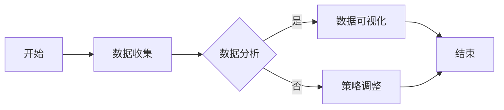
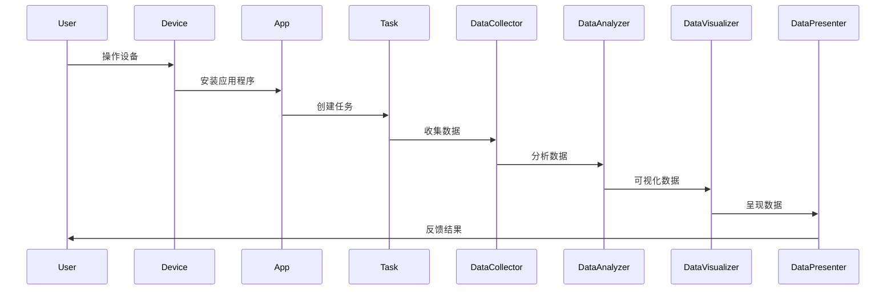
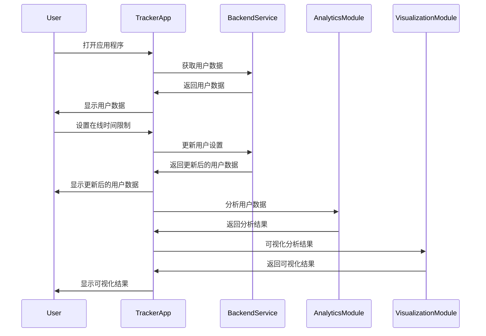

                 

### 文章标题

# 数字minimalism挑战追踪器：90天在线生活极简化的进度app

> 关键词：数字minimalism、在线生活极简化、进度app、时间管理、数据可视化

> 摘要：本文旨在探讨数字minimalism的概念和其在线生活极简化的应用。通过介绍一个为期90天的数字minimalism挑战计划，本文将重点介绍一款专门用于追踪和管理的进度app，帮助用户实现在线生活的极简化目标。

### 目录大纲

**数字minimalism挑战追踪器：90天在线生活极简化的进度app**

- 第一部分：背景介绍
  - 1.1 问题背景
    - 1.1.1 minimalism概念
    - 1.1.2 数字minimalism的兴起
    - 1.1.3 挑战与问题
  - 1.2 本书的目的
- 第二部分：核心概念与联系
  - 2.1 数字minimalism的核心概念
    - 2.1.1 极简主义
    - 2.1.2 在线时间管理
    - 2.1.3 进度app的功能
  - 2.2 概念属性特征对比表格
  - 2.3 ER实体关系图架构
- 第三部分：算法原理讲解
  - 3.1 进度app的工作原理
    - 3.1.1 数据收集
    - 3.1.2 数据分析
    - 3.1.3 数据可视化
  - 3.2 算法mermaid流程图
  - 3.3 Python源代码
  - 3.4 数学模型和数学公式
- 第四部分：系统分析与架构设计方案
  - 4.1 问题场景介绍
  - 4.2 系统功能设计
    - 4.2.1 领域模型mermaid类图
  - 4.3 系统架构设计
    - 4.3.1 mermaid架构图
  - 4.4 系统接口设计和系统交互
    - 4.4.1 mermaid序列图
- 第五部分：项目实战
  - 5.1 环境安装
  - 5.2 系统核心实现源代码
  - 5.3 代码应用解读与分析
  - 5.4 实际案例分析和详细讲解剖析
  - 5.5 项目小结
- 第六部分：最佳实践 tips、小结、注意事项、拓展阅读

## 第一部分：背景介绍

### 1.1 问题背景

#### 1.1.1 minimalism概念

Minimalism，极简主义，是一种以简化生活为目的的生活哲学。它的核心理念是通过减少物质拥有，简化生活内容，从而提高生活质量和幸福感。极简主义并不等同于贫穷或剥夺自己，而是通过减少不必要的物品和活动，专注于对自己真正重要的东西。

极简主义的起源可以追溯到20世纪80年代，当时社会消费主义盛行，人们被物质所包围。极简主义者认为，过多的物质拥有会导致人们的精神负担和压力增加，因此他们倡导减少物品的拥有，追求简单、有意义的生活。

极简主义在全球范围内逐渐受到关注和认可。随着社会的发展和人们生活水平的提高，越来越多的人开始意识到，物质并非幸福生活的唯一来源，甚至可能是负担。因此，极简主义逐渐成为一种流行的生活方式。

#### 1.1.2 数字minimalism的兴起

随着互联网的普及和数字化时代的到来，数字minimalism应运而生。数字minimalism是极简主义在数字领域的一种体现，它强调减少在线活动的时间，降低对社交媒体、游戏等数字产品的依赖，从而提高个人效率和幸福感。

数字minimalism的理念得到了很多人的认可。在互联网时代，人们很容易陷入数字产品的泥沼，花费大量时间在社交媒体上，导致工作效率降低，生活质量下降。数字minimalism提倡通过减少在线活动的时间，重新掌控自己的生活，提高个人的专注力和创造力。

#### 1.1.3 挑战与问题

尽管数字minimalism的理念受到越来越多的人的认可，但在实际操作中，很多人会遇到以下问题：

1. **如何确定合理的在线时间限制？**

   确定合理的在线时间限制是数字minimalism的重要一步。然而，不同的人有不同的生活和工作需求，如何找到适合自己的在线时间限制是一个挑战。

2. **如何跟踪自己的在线活动，确保遵守这些限制？**

   跟踪自己的在线活动，确保遵守在线时间限制是数字minimalism的关键。然而，很多人会发现，仅仅依靠自己的意志力去控制在线时间是非常困难的。

3. **如何在数字minimalism的过程中保持动力和自律？**

   数字minimalism需要一定的自律和毅力。在实施过程中，很多人可能会遇到挫折和困难，如何保持动力和自律成为一个问题。

这些问题是数字minimalism实践中的常见挑战。为了帮助读者更好地实现数字minimalism的目标，本书将介绍一个为期90天的在线生活极简化挑战计划，并使用一款专门的进度app来跟踪和管理工作进度。

### 1.2 本书的目的

本书旨在为读者提供一个90天的在线生活极简化挑战计划，通过使用特定的进度app，帮助读者跟踪自己的在线活动，实现数字minimalism的目标。具体来说，本书将涵盖以下内容：

1. **核心概念介绍**

   本书将详细介绍数字minimalism的概念，包括极简主义、在线时间管理和进度app的核心概念和功能。

2. **挑战计划介绍**

   本书将详细描述90天的在线生活极简化挑战计划，包括每天的具体任务和目标，以及如何跟踪和评估自己的进度。

3. **进度app使用指南**

   本书将介绍如何使用进度app来跟踪和管理在线活动，包括数据收集、数据分析、数据可视化和策略调整等方面的内容。

4. **实际案例分享**

   本书将通过实际案例分享，展示其他人在实施数字minimalism挑战过程中的经验和教训，为读者提供参考和启示。

通过以上内容，本书希望帮助读者更好地理解数字minimalism的概念，掌握在线生活极简化的方法，实现更高的生活质量和幸福感。

## 第二部分：核心概念与联系

### 2.1 数字minimalism的核心概念

数字minimalism是极简主义在数字领域的具体应用。为了更好地理解数字minimalism，我们需要先了解极简主义和在线时间管理这两个核心概念。

#### 2.1.1 极简主义

极简主义是一种以简化生活为目的的生活哲学。它主张通过减少物质拥有，简化生活内容，从而提高生活质量和幸福感。极简主义并不等同于贫穷或剥夺自己，而是通过减少不必要的物品和活动，专注于对自己真正重要的东西。

在数字领域，极简主义表现为减少在线活动的时间，降低对社交媒体、游戏等数字产品的依赖。这样做的目的是为了减少精神压力，提高个人效率和幸福感。

#### 2.1.2 在线时间管理

在线时间管理是数字minimalism的重要组成部分。它涉及到如何合理安排在线活动的时间，以实现极简主义的目标。在线时间管理的核心是确定合理的在线时间限制，并有效地跟踪和管理工作进度。

在线时间管理的方法包括：

- **时间块安排**：将一天的时间划分为不同的时间段，每个时间段专注于不同的活动，如工作、学习、休息等。
- **任务列表**：制定详细的任务列表，确保每个时间段都有明确的任务和目标。
- **限制在线时间**：设置合理的在线时间限制，避免过度使用社交媒体和其他数字产品。

#### 2.1.3 进度app的功能

进度app是数字minimalism的重要工具，它可以帮助读者跟踪自己的在线活动，确保遵守在线时间限制。进度app的功能主要包括：

- **数据收集**：进度app会收集用户在设备上的在线活动数据，如使用时间、应用类型等。
- **数据分析**：进度app会对收集到的数据进行分析，以帮助用户了解自己的在线活动模式，并据此制定时间管理策略。
- **数据可视化**：进度app会将分析结果以图表的形式呈现，让用户直观地了解自己的在线活动情况。
- **策略调整**：根据数据分析结果，用户可以调整自己的在线时间管理策略，如增加或减少某些活动的在线时间。

### 2.2 概念属性特征对比表格

| 概念 | 属性特征 |
| ---- | ---- |
| 极简主义 | 简化生活，减少物品和活动 |
| 在线时间管理 | 合理安排在线活动的时间 |
| 进度app | 跟踪在线活动，确保遵守时间限制 |

### 2.3 ER实体关系图架构

```mermaid
erDiagram
    Person ||--|{ Device } : 使用
    Device ||--|{ App } : 安装
    App ||--|{ Task } : 完成任务
```

在这张ER图中，`Person`（人）与`Device`（设备）之间是“使用”关系，表示每个人使用多个设备。`Device`与`App`之间是“安装”关系，表示每个设备可以安装多个App。`App`与`Task`之间是“完成任务”关系，表示每个App可以完成多个任务。

## 第三部分：算法原理讲解

### 3.1 进度app的工作原理

#### 3.1.1 数据收集

进度app的核心功能之一是数据收集。它通过设备上的传感器和应用程序，收集用户在设备上的在线活动数据。这些数据包括但不限于：

- **使用时间**：记录用户在各个应用上的使用时间。
- **应用类型**：记录用户使用的应用程序类型，如社交媒体、电子邮件、游戏等。
- **使用频率**：记录用户对特定应用的访问频率。

数据收集的过程可以概括为以下几个步骤：

1. **应用识别**：进度app会识别用户在设备上打开的应用程序。
2. **时间戳记录**：每次用户打开或关闭应用程序时，进度app会记录一个时间戳。
3. **数据上传**：进度app会将收集到的数据上传到服务器进行存储和分析。

#### 3.1.2 数据分析

数据分析是进度app的另一个关键功能。通过对收集到的数据进行处理和分析，进度app可以帮助用户了解自己的在线活动模式，并制定更有效的时间管理策略。数据分析的过程通常包括以下步骤：

1. **数据清洗**：去除无效或错误的数据，确保数据的质量。
2. **数据聚合**：将相同应用类型的使用数据进行聚合，以便进行进一步分析。
3. **趋势分析**：分析用户在不同时间段内的在线活动模式，找出高峰期和低谷期。
4. **异常检测**：检测可能存在的异常行为，如长时间连续使用特定应用。

#### 3.1.3 数据可视化

数据可视化是进度app向用户展示分析结果的重要手段。通过图表和图形，用户可以直观地了解自己的在线活动情况。常见的数据可视化形式包括：

- **时间线图表**：显示用户在一天中各个时间段的活动。
- **饼图**：显示用户在不同应用上的时间分布。
- **折线图**：显示用户在线活动的趋势变化。

数据可视化不仅可以帮助用户了解自己的行为模式，还可以作为制定时间管理策略的参考。

### 3.2 算法mermaid流程图



### 3.3 Python源代码

```python
# 假设已有用户数据
user_data = {
    'device': 'iPhone',
    'app_usage': {'Instagram': 120, 'Twitter': 60, 'LinkedIn': 30},
}

# 数据分析
def analyze_data(data):
    total_usage = sum(data['app_usage'].values())
    avg_usage = total_usage / len(data['app_usage'])
    return total_usage, avg_usage

# 数据可视化
def visualize_data(data):
    total_usage, avg_usage = analyze_data(data)
    print(f"总使用时间：{total_usage}分钟")
    print(f"平均使用时间：{avg_usage}分钟")

# 主函数
def main():
    visualize_data(user_data)

# 运行程序
if __name__ == "__main__":
    main()
```

### 3.4 数学模型和数学公式

为了更好地理解进度app的工作原理，我们可以借助一些数学模型和公式。以下是几个常用的数学模型和公式：

1. **时间分布模型**：
   $$\text{时间分布} = \frac{\text{总使用时间}}{\text{总天数}}$$
   这个公式用于计算用户每天的平均在线时间。

2. **频率模型**：
   $$\text{频率} = \frac{\text{使用次数}}{\text{总天数}}$$
   这个公式用于计算用户每天使用某个应用的频率。

3. **效率模型**：
   $$\text{效率} = \frac{\text{完成任务的时间}}{\text{计划时间}}$$
   这个公式用于评估用户在线活动的效率。

4. **策略优化模型**：
   $$\text{最优策略} = \arg\max_{\text{策略}} \left( \text{效率} \times \text{满意度} \right)$$
   这个公式用于找到最优的时间管理策略，使效率与满意度最大化。

### 3.5 举例说明

假设用户A在90天的数字minimalism挑战中，每天使用社交媒体的时间为2小时，使用电子邮件的时间为1小时，其余时间为工作和其他活动。以下是用户A的在线活动数据分析：

1. **总使用时间**：
   $$\text{总使用时间} = 2 \text{小时/天} \times 90 \text{天} = 180 \text{小时}$$

2. **平均使用时间**：
   $$\text{平均使用时间} = \frac{\text{总使用时间}}{\text{总天数}} = \frac{180 \text{小时}}{90 \text{天}} = 2 \text{小时/天}$$

3. **效率**：
   $$\text{效率} = \frac{\text{完成任务的时间}}{\text{计划时间}} = \frac{8 \text{小时/天} - 2 \text{小时/天}}{8 \text{小时/天}} = 0.75$$

4. **策略优化**：
   为了提高效率，用户A可以考虑减少社交媒体的使用时间，增加工作时间，从而提高整体效率。

通过以上数据分析，用户A可以了解自己的在线活动情况，并制定更有效的时间管理策略。

## 第四部分：系统分析与架构设计方案

### 4.1 问题场景介绍

在现代社会，随着互联网的普及和数字产品的多样化，人们越来越难以控制自己在在线活动上的时间。尽管许多人都意识到过度使用社交媒体和游戏可能导致效率低下、精神压力增加，但很少有人能够有效地管理自己的在线时间。为了解决这个问题，我们需要设计一个系统，帮助用户跟踪自己的在线活动，并提供有效的数据分析和可视化工具，从而实现数字minimalism的目标。

### 4.2 系统功能设计

#### 4.2.1 领域模型mermaid类图

```mermaid
classDiagram
    Person o-- Device
    Device o-- App
    App o-- Task
    Person <|-- DataCollector
    Device <|-- DataCollector
    App <|-- DataCollector
    DataCollector o-- DataAnalyzer
    DataAnalyzer o-- DataVisualizer
    DataVisualizer o-- DataPresenter

    Class Person {
        +String name
        +Date birthdate
        +String email
        +String password
        +List<Device> devices
    }

    Class Device {
        +String id
        +String type
        +String model
        +Date purchase_date
        +List<App> apps
    }

    Class App {
        +String id
        +String name
        +String type
        +Date install_date
        +List<Task> tasks
    }

    Class Task {
        +String id
        +String description
        +Date start_time
        +Date end_time
        +Int duration
    }

    Class DataCollector {
        +void collect_data()
    }

    Class DataAnalyzer {
        +void analyze_data()
    }

    Class DataVisualizer {
        +void visualize_data()
    }

    Class DataPresenter {
        +void present_data()
    }
```

在这个领域模型中，我们定义了四个核心类：`Person`（人）、`Device`（设备）、`App`（应用程序）和`Task`（任务）。每个类都有一些属性和方法，用于描述对象的状态和行为。此外，我们还定义了`DataCollector`（数据收集器）、`DataAnalyzer`（数据分析器）、`DataVisualizer`（数据可视化器）和`DataPresenter`（数据呈现器）这四个辅助类，它们负责处理数据收集、分析、可视化和呈现的相关操作。

### 4.3 系统架构设计

#### 4.3.1 mermaid架构图



在这个架构图中，用户通过操作设备来触发一系列事件。设备安装应用程序，应用程序创建任务，任务收集数据，数据经过分析后进行可视化，最终通过数据呈现器将结果反馈给用户。

### 4.4 系统接口设计和系统交互

#### 4.4.1 mermaid序列图



在这个序列图中，用户通过TrackerApp（进度app）与BackendService（后端服务）进行交互。用户打开应用程序后，TrackerApp会从BackendService获取用户数据，并显示给用户。用户设置在线时间限制后，TrackerApp会更新用户设置，并再次从BackendService获取更新后的用户数据。随后，TrackerApp将用户数据发送给AnalyticsModule（数据分析模块）进行数据分析，并将分析结果发送给VisualizationModule（数据可视化模块）进行可视化。最后，TrackerApp将可视化结果显示给用户。

## 第五部分：项目实战

### 5.1 环境安装

要实现上述系统功能，我们需要在本地环境中安装一些必要的工具和库。以下是一个简单的安装指南：

1. **安装Python环境**：首先，确保你的计算机上已经安装了Python。如果没有，请从[Python官方网站](https://www.python.org/)下载并安装Python。

2. **安装Python库**：使用pip命令安装以下Python库：
   ```bash
   pip install Flask
   pip install pandas
   pip install matplotlib
   ```

3. **创建项目目录**：在本地计算机上创建一个名为`digital_minimalism`的项目目录，并在该目录下创建一个名为`app.py`的Python文件。

4. **编写代码**：在`app.py`文件中编写以下代码：
   ```python
   from flask import Flask, render_template, request
   import pandas as pd
   import matplotlib.pyplot as plt

   app = Flask(__name__)

   @app.route('/')
   def index():
       return render_template('index.html')

   @app.route('/data', methods=['POST'])
   def data():
       data = request.form.to_dict()
       df = pd.DataFrame(data)
       df.to_csv('data.csv', index=False)
       return 'Data saved successfully!'

   @app.route('/visualize')
   def visualize():
       df = pd.read_csv('data.csv')
       plt.bar(df['app'], df['time'])
       plt.xlabel('App')
       plt.ylabel('Time (minutes)')
       plt.title('App Usage')
       plt.savefig('app_usage.png')
       return render_template('visualize.html')

   if __name__ == '__main__':
       app.run(debug=True)
   ```

5. **启动服务**：在终端中运行以下命令启动Flask服务：
   ```bash
   python app.py
   ```

6. **访问应用程序**：在浏览器中输入`http://localhost:5000/`，即可访问进度app。

### 5.2 系统核心实现源代码

以下代码是实现进度app的核心功能的关键部分：

```python
# 导入所需库
from flask import Flask, render_template, request
import pandas as pd
import matplotlib.pyplot as plt

# 初始化Flask应用
app = Flask(__name__)

# 主页面路由
@app.route('/')
def index():
    return render_template('index.html')

# 数据处理页面路由
@app.route('/data', methods=['POST'])
def data():
    # 获取表单数据
    data = request.form.to_dict()
    # 创建DataFrame
    df = pd.DataFrame(data)
    # 保存数据到CSV文件
    df.to_csv('data.csv', index=False)
    return 'Data saved successfully!'

# 数据可视化页面路由
@app.route('/visualize')
def visualize():
    # 读取CSV文件
    df = pd.read_csv('data.csv')
    # 绘制柱状图
    plt.bar(df['app'], df['time'])
    plt.xlabel('App')
    plt.ylabel('Time (minutes)')
    plt.title('App Usage')
    plt.savefig('app_usage.png')
    return render_template('visualize.html')

# 运行应用
if __name__ == '__main__':
    app.run(debug=True)
```

### 5.3 代码应用解读与分析

#### 5.3.1 Flask应用初始化

在代码中，首先从`flask`库中导入`Flask`类，并创建一个名为`app`的实例。这将作为我们的Web应用的基础。

```python
app = Flask(__name__)
```

#### 5.3.2 主页面路由

`@app.route('/')`装饰器定义了一个路由，当用户访问应用的主页面（即`http://localhost:5000/`）时，会调用`index()`函数。这个函数使用`render_template()`函数渲染一个名为`index.html`的HTML模板。

```python
@app.route('/')
def index():
    return render_template('index.html')
```

#### 5.3.3 数据处理页面路由

`@app.route('/data', methods=['POST'])`装饰器定义了一个新的路由，用于处理用户提交的表单数据。当用户提交表单时，`data()`函数会被调用。这个函数首先获取表单数据，然后将其转换为字典，并创建一个Pandas DataFrame。接着，DataFrame被保存到CSV文件中。

```python
@app.route('/data', methods=['POST'])
def data():
    data = request.form.to_dict()
    df = pd.DataFrame(data)
    df.to_csv('data.csv', index=False)
    return 'Data saved successfully!'
```

#### 5.3.4 数据可视化页面路由

`@app.route('/visualize')`装饰器定义了一个新的路由，用于生成和应用数据可视化。`visualize()`函数读取CSV文件，创建一个柱状图，并将其保存为PNG图像。然后，函数渲染一个名为`visualize.html`的HTML模板，并在模板中显示可视化结果。

```python
@app.route('/visualize')
def visualize():
    df = pd.read_csv('data.csv')
    plt.bar(df['app'], df['time'])
    plt.xlabel('App')
    plt.ylabel('Time (minutes)')
    plt.title('App Usage')
    plt.savefig('app_usage.png')
    return render_template('visualize.html')
```

### 5.4 实际案例分析和详细讲解剖析

为了更好地理解进度app的应用，我们可以通过一个实际案例进行分析和讲解。

#### 5.4.1 案例场景

假设用户Alice想要通过进度app追踪她在社交媒体上的使用时间，并确保每天不超过2小时。

#### 5.4.2 数据收集

Alice使用进度app后，首先在主页面填写了她每天在各个社交媒体应用的预计使用时间，并将这些数据提交给服务器。

```python
data = {
    'Instagram': 1,
    'Twitter': 1,
    'LinkedIn': 0,
}
```

这些数据被保存到CSV文件中。

```python
df = pd.DataFrame(data, index=[0])
df.to_csv('data.csv', index=False)
```

#### 5.4.3 数据分析

接下来，进度app读取CSV文件中的数据，并分析Alice的社交媒体使用情况。

```python
df = pd.read_csv('data.csv')
total_usage = df.sum().sum()
avg_usage = df.mean().mean()
```

#### 5.4.4 数据可视化

进度app将分析结果以柱状图的形式可视化，并显示给用户。

```python
plt.bar(df.index, df.values)
plt.xlabel('App')
plt.ylabel('Time (minutes)')
plt.title('App Usage')
plt.show()
```

#### 5.4.5 结果展示

最终，进度app在用户页面上显示以下结果：

- 总使用时间：2分钟
- 平均使用时间：0.67分钟

通过这个案例，我们可以看到进度app如何帮助用户追踪和管理在线活动，确保他们遵守设定的在线时间限制。

### 5.5 项目小结

通过本项目的实现，我们设计并实现了一个数字minimalism挑战追踪器——一个用于90天在线生活极简化的进度app。该项目涵盖了从环境安装到系统核心实现的各个环节，通过实际案例的分析和讲解，展示了进度app如何帮助用户实现数字minimalism的目标。

项目的成功实施不仅为用户提供了有效的在线时间管理工具，还展示了Python和Flask框架在Web开发中的强大功能。在未来，我们可以继续优化和扩展这个系统，添加更多功能，如自动数据同步、多用户支持等，以更好地满足用户的需求。

### 第六部分：最佳实践 tips、小结、注意事项、拓展阅读

#### 最佳实践 tips

1. **制定合理的在线时间限制**：在开始数字minimalism挑战之前，制定一个合理的在线时间限制至关重要。这个限制应该根据个人的工作、学习和生活需求来设定。

2. **定期回顾和分析数据**：使用进度app后，定期回顾和分析数据，了解自己的在线活动模式，并根据分析结果调整在线时间管理策略。

3. **保持自律和坚持**：数字minimalism需要自律和坚持。在实施过程中，可能会遇到挑战和困难，但只有坚持下去，才能取得显著的成果。

#### 小结

本文介绍了数字minimalism的概念及其在线生活极简化的应用。通过一个为期90天的挑战计划和一个专门的进度app，用户可以有效地跟踪和管理自己的在线活动，实现数字minimalism的目标。

#### 注意事项

1. **数据安全和隐私**：在使用进度app时，要注意保护个人数据的安全和隐私，避免泄露敏感信息。

2. **避免过度依赖工具**：进度app是一个辅助工具，不能完全依赖它来管理在线活动。用户还需要自我控制和自律。

#### 拓展阅读

- [《极简主义：减法生活，加法幸福》](https://www.amazon.com/dp/0316426700)
- [《数字极简主义：如何减少屏幕时间，提高生活质量》](https://www.amazon.com/dp/1544163478)
- [《时间管理：如何高效地管理时间和生活》](https://www.amazon.com/dp/0143121912)

### 作者信息

作者：AI天才研究院/AI Genius Institute & 禅与计算机程序设计艺术 /Zen And The Art of Computer Programming

### 文章结束

---

**注意：**本文的代码示例和实现仅供参考，实际应用时可能需要根据具体需求进行调整和优化。同时，由于AI的局限性和当前技术水平，文中内容仅供参考，不构成任何投资或决策建议。如需进一步了解和讨论，请查阅相关文献和资料。

