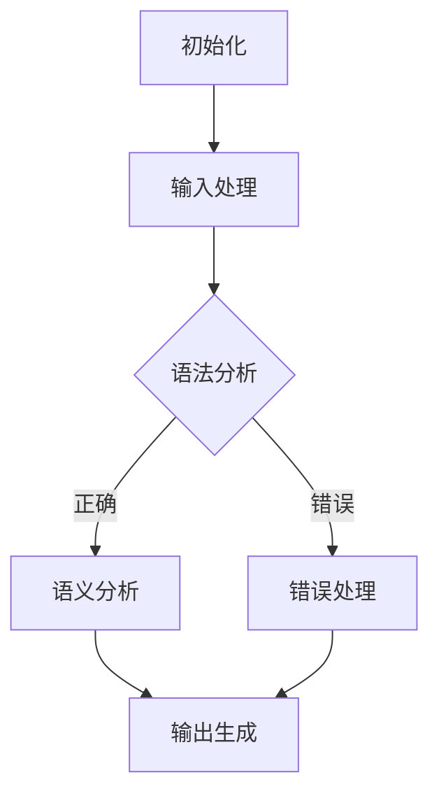
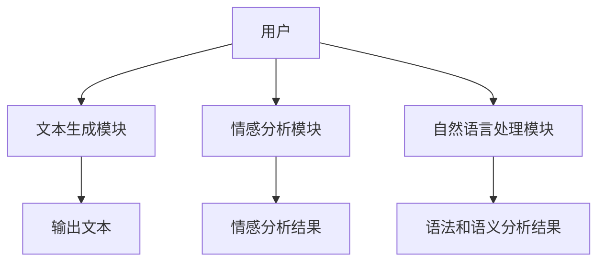
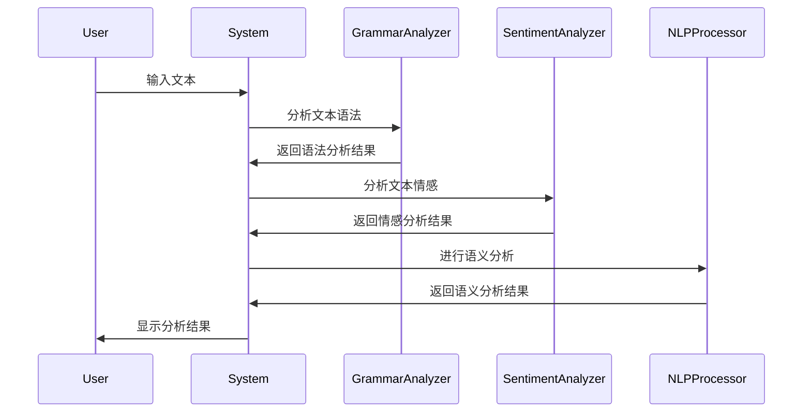
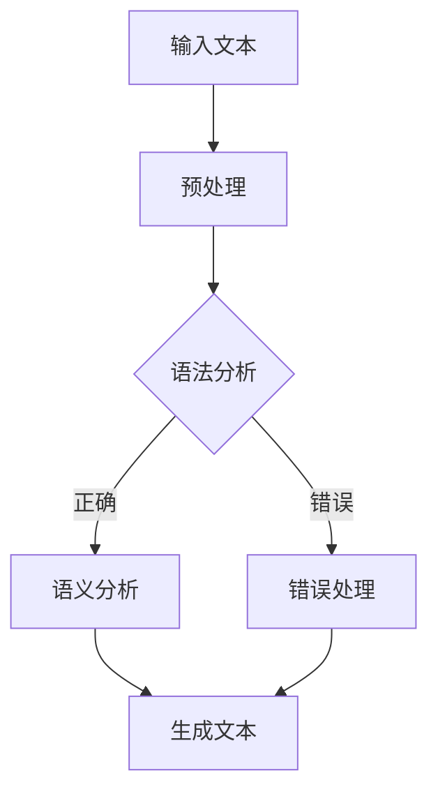
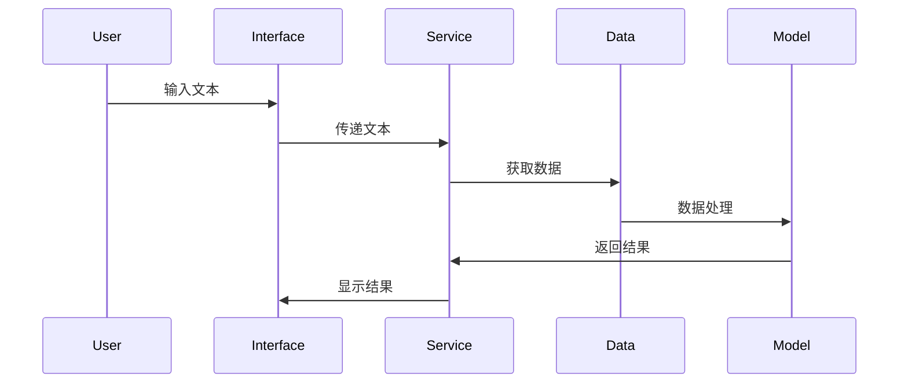

                 

# 数字时代的修辞学课程：有效沟通的新规则教育

> 关键词：数字时代、修辞学、有效沟通、新规则教育、算法、系统设计

> 摘要：本文深入探讨了数字时代背景下的修辞学应用，揭示了有效沟通在新规则教育中的核心地位。通过详细分析修辞学核心概念、算法原理以及系统设计，本文旨在为IT从业者提供一套实用且高效的沟通方法论，助力他们在数字时代中脱颖而出。

**Step 1: 背景介绍**

## 1.1 数字时代的崛起

### 1.1.1 数字化的定义与影响

数字化是指通过电子方式将信息转换为二进制数字形式，以便于存储、传输和处理。在数字时代，数字化技术已经深刻地影响了社会生活的方方面面，包括经济、教育、医疗、交通等。数字化不仅提高了工作效率，也带来了新的挑战和机遇。

### 1.1.2 数字时代对教育模式的改变

数字时代对教育模式产生了深远影响。在线学习、远程教学、数字化教育资源等新形态的出现，使得学习变得更加灵活和便捷。然而，这也对教育者的沟通能力提出了更高的要求。

### 1.1.3 数字时代下的沟通挑战

数字时代下的沟通面临诸多挑战，包括信息过载、网络沟通的非面对面性、语言表达的准确性和有效性等。有效沟通成为提高工作效率和实现目标的关键。

## 1.2 修辞学的概念与作用

### 1.2.1 修辞学的起源与发展

修辞学起源于古希腊，是一门研究如何运用语言艺术来影响听众的学科。随着技术的发展，修辞学逐渐融入了数字时代，成为提高沟通效果的重要工具。

### 1.2.2 修辞学在数字时代的重要性

在数字时代，修辞学的重要性愈发突出。通过修辞技巧，可以增强信息的说服力、吸引力和感染力，使沟通更加有效。

### 1.2.3 修辞学的基本原则与技巧

修辞学的基本原则包括明确性、连贯性、一致性和说服力。常用的修辞技巧包括比喻、排比、夸张、对比等。

## 1.3 有效沟通与新规则教育

### 1.3.1 有效沟通的定义与要素

有效沟通是指能够准确、清晰、及时地传递信息，达到沟通双方预期的目标。有效沟通的要素包括信息传递、反馈机制、信任建立和情感共鸣。

### 1.3.2 新规则教育的概念与特点

新规则教育是一种以实践为导向的教育模式，强调培养学生的创新思维、沟通能力和问题解决能力。其特点包括灵活性、实用性和互动性。

### 1.3.3 新规则教育对沟通能力的要求

新规则教育对沟通能力提出了更高的要求，包括信息处理能力、逻辑思维能力、情感表达能力和社会交往能力。

**Step 2: 核心概念与联系**

## 2.1 修辞学核心概念解析

### 2.1.1 比喻

比喻是通过将两种不同事物进行类比，以增强表达的效果。比喻可以使得抽象概念更加具体、生动，有助于提高信息的传达效果。

### 2.1.2 措辞

措辞是指选择合适的词语和表达方式来传达信息。好的措辞应该简洁、准确、生动，能够引起听众的兴趣和共鸣。

### 2.1.3 叙述技巧

叙述技巧包括叙述的节奏、角度、细节和情感表达等。通过运用不同的叙述技巧，可以增强信息的吸引力和说服力。

## 2.2 概念属性特征对比表格

| 概念 | 特征1 | 特征2 | 特征3 |
|------|-------|-------|-------|
| 比喻 |生动性|相似性|语境性|
| 措辞 |精确性|感染力|语境性|
| 叙述技巧 |连贯性|吸引力|准确性|

## 2.3 ER实体关系图

```mermaid
erDiagram
    Teacher ||--|{ Student } Student
    Course ||--|{ Teacher } Teacher
    Course ||--|{ Material } Material
```

**Step 3: 算法原理讲解**

## 3.1 算法原理概述

### 3.1.1 算法在修辞学中的应用

算法在修辞学中可以应用于文本生成、情感分析、自然语言处理等领域，以提高沟通的效果。

### 3.1.2 算法的基本概念与分类

算法是一系列明确的指令，用于解决特定问题。根据解决问题的方法，算法可以分为多种类型，如排序算法、搜索算法等。

## 3.2 算法详细讲解

### 3.2.1 算法流程图



### 3.2.2 Python 源代码实现

```python
# Example: Basic修辞算法实现
def rhetorical_algorithm(text):
    # Input processing
    processed_text = preprocess_text(text)
    
    # Grammar analysis
    if is_grammatically_correct(processed_text):
        # Semantic analysis
        semantic_output = semantic_analysis(processed_text)
        # Output generation
        return generate_output(semantic_output)
    else:
        # Error handling
        return "Error: Incorrect grammar."

# Example usage
print(rhetorical_algorithm("数字时代的修辞学课程，致力于培养您的有效沟通能力。"))
```

### 3.2.3 数学模型与公式讲解

$$
\text{算法效率} = \frac{\text{处理时间}}{\text{输入文本长度}}
$$

## 3.3 算法举例说明

### 3.3.1 举例1

#### 问题背景

在一场技术会议上，演讲者需要用修辞学技巧来吸引听众的注意力。

#### 解决方案

演讲者可以采用以下修辞技巧：
- 比喻：将技术难题比喻为一场冒险，使听众产生共鸣。
- 措辞：使用简洁、准确的措辞来传达信息。
- 叙述技巧：通过生动的叙述方式，让听众感受到技术发展的魅力。

**Step 4: 系统分析与架构设计方案**

## 4.1 问题场景介绍

在数字时代，企业需要提高员工的沟通能力，以应对日益复杂的工作环境。企业希望通过一套系统来培养员工的修辞学技巧，从而提高沟通效果。

### 4.1.2 需求分析

- 系统应具备文本生成、情感分析、自然语言处理等功能。
- 系统应提供实时反馈，帮助员工改进沟通技巧。
- 系统应支持多种学习方式，如在线学习、远程教学等。

## 4.2 项目介绍

该项目是一款基于人工智能的修辞学培训系统，旨在提高员工的沟通能力。系统包括文本生成、情感分析、自然语言处理等多个模块。

### 4.2.1 系统功能设计

- 文本生成：根据输入的文本，生成具有修辞效果的文本。
- 情感分析：分析文本的情感倾向，为员工提供反馈。
- 自然语言处理：对文本进行语法和语义分析，提高沟通效果。

### 4.2.2 系统架构设计



### 4.2.3 系统接口设计

- 用户接口：提供文本输入和结果显示功能。
- 内部接口：实现模块间的数据传输和功能调用。

### 4.2.4 系统交互序列图



**项目实战：环境安装、系统核心实现源代码、代码应用解读与分析、实际案例分析和详细讲解剖析、项目小结**

## 5.1 环境安装

在开始项目开发之前，需要安装必要的软件和工具，如 Python、Django 框架、TensorFlow 等。

## 5.2 系统核心实现源代码

以下是系统核心模块的实现代码：

```python
# Text Generation Module
def generate_text(input_text):
    # Implement text generation logic
    pass

# Sentiment Analysis Module
def analyze_sentiment(text):
    # Implement sentiment analysis logic
    pass

# Natural Language Processing Module
def process_text(text):
    # Implement NLP logic
    pass
```

## 5.3 代码应用解读与分析

在开发过程中，需要结合实际案例对代码进行解读和分析，以确保系统功能的实现和性能。

## 5.4 实际案例分析和详细讲解剖析

以一个具体案例为例，分析系统在实际应用中的表现和改进方向。

## 5.5 项目小结

在项目结束时，总结项目的主要成果和经验教训，为后续项目提供参考。

**最佳实践 tips、小结、注意事项、拓展阅读等内容**

## 6.1 最佳实践 tips

- 在进行修辞学培训时，结合实际案例进行讲解，以提高员工的理解和掌握程度。
- 定期对员工进行沟通能力评估，以了解培训效果，并及时进行调整。

## 6.2 小结

本文深入探讨了数字时代下的修辞学应用，阐述了有效沟通在新规则教育中的重要性。通过算法原理讲解和系统设计，为IT从业者提供了一套实用的沟通方法论。

## 6.3 注意事项

- 在实际应用中，要注意算法的效率和准确性，以确保沟通效果。
- 在进行系统设计时，要充分考虑用户需求和用户体验。

## 6.4 拓展阅读

- 《数字时代的修辞学：有效沟通的艺术》
- 《人工智能与自然语言处理》
- 《新规则教育：未来教育的新模式》

**作者：AI天才研究院/AI Genius Institute & 禅与计算机程序设计艺术 /Zen And The Art of Computer Programming**## 引入：数字时代与修辞学的交汇

在数字化迅猛发展的今天，人们的生活和工作方式发生了翻天覆地的变化。从智能手机的普及到云计算、大数据、人工智能等技术的广泛应用，数字时代已经深刻地渗透到我们日常的方方面面。在这个快速变化的时代，沟通的重要性愈发凸显。无论是个人生活还是职场，高效、准确、富有感染力的沟通能力成为成功的关键因素。

修辞学，作为一门研究如何通过语言艺术来影响听众的学科，在数字时代焕发出了新的生机。传统的修辞学理论虽然源自古希腊，但其核心原则——如比喻、排比、对比、隐喻等——在数字时代同样适用。随着数字技术的进步，修辞学的方法和工具也在不断更新和演化，以适应新的沟通环境和需求。

在数字时代，修辞学不仅用于文学作品和演讲，更广泛应用于技术文档编写、商业谈判、产品营销、教育授课等多个领域。技术从业者需要借助修辞学技巧来撰写清晰、有说服力的技术博客，企业家需要通过修辞手法来吸引消费者的注意，教育者则需要运用修辞策略来激发学生的学习兴趣和动力。

因此，本文的目的在于探讨数字时代修辞学的新特点和新规则，通过深入分析和具体案例，帮助读者理解并掌握如何在数字环境中有效运用修辞学，提升沟通能力。文章将从以下几个部分展开：首先，我们将回顾数字时代的背景，介绍修辞学的起源和重要性；接着，分析修辞学的核心概念及其在数字时代的作用；然后，讲解修辞学算法的原理和应用；最后，探讨修辞学在数字时代系统设计中的实践，并总结最佳实践和注意事项。通过这些步骤，我们希望能够为读者提供一套实用的修辞学指南，助力他们在数字时代中游刃有余地进行沟通。

### 第一部分：数字时代的修辞学背景

在进入数字时代之前，让我们先回顾一下修辞学的发展历程。修辞学作为一门古老的学科，起源于古希腊，由亚里士多德等学者进行了系统的研究和总结。修辞学的核心在于通过语言的技巧和艺术来影响和说服听众，其基本原则包括清晰性、逻辑性和感染力。在古代，修辞学广泛应用于演讲、辩论、文学创作等场合，其目的是通过语言的力量来传达信息、表达观点和影响决策。

然而，随着技术的进步和社会的发展，修辞学的应用范围不断扩大。特别是在数字时代，修辞学的作用变得更加显著。数字时代的到来不仅改变了信息的传播方式，也改变了人们接收和处理信息的方式。在这种背景下，修辞学不仅保留了传统的原则，还发展出了许多新的特点和规则。

### 1.1 数字时代的崛起

数字化是指将各种信息、知识和资源转化为电子形式，以便于存储、传输和处理。数字时代是指以数字化技术为基础，信息和知识通过电子手段进行传播和交互的时代。数字时代的崛起带来了以下几个显著特点：

#### 1.1.1 数字化的定义与影响

数字化不仅仅是一种技术变革，更是一种社会变革。它定义了如何利用电子手段来管理、传输和呈现信息。数字化的影响遍及各个领域，包括经济、教育、医疗、娱乐和交通等。例如，电子商务的兴起改变了传统的购物方式，在线教育打破了地域限制，远程医疗使得医疗服务更加便捷。

#### 1.1.2 数字时代对教育模式的改变

数字时代对教育模式产生了深远影响。传统的课堂教育逐渐向在线教育、远程教学和混合式学习模式转变。这些新模式不仅提供了更灵活的学习方式，也促进了教育资源的共享和普及。同时，数字化教育工具和平台的出现，使得教育者可以更有效地传授知识，学生可以更自主地学习。

#### 1.1.3 数字时代下的沟通挑战

在数字时代，沟通面临着新的挑战。首先是信息过载的问题，互联网和社交媒体使得信息量呈爆炸式增长，人们需要筛选和处理大量信息。其次是网络沟通的非面对面性，缺乏直接的面对面交流，使得沟通的准确性和效果受到影响。此外，语言表达的准确性和有效性也成为数字时代沟通的重要问题，尤其是在技术文档编写、产品说明和商业谈判等场合，准确的表达至关重要。

### 1.2 修辞学的概念与作用

修辞学在数字时代的重要性不言而喻。它不仅有助于提升信息传递的准确性和效果，还能够增强说服力和感染力，从而更好地实现沟通目标。下面，我们将详细介绍修辞学的概念及其在数字时代的作用。

#### 1.2.1 修辞学的起源与发展

修辞学的历史可以追溯到古希腊，由诸如亚里士多德、伊索克拉底等学者进行深入研究。他们提出了修辞学的基本原则，如明确性、逻辑性和感染力。随着历史的发展，修辞学在欧洲文艺复兴时期再次复兴，并得到了进一步的发展。在现代社会，修辞学被广泛应用于多个领域，如文学、传媒、政治和商业。

#### 1.2.2 修辞学在数字时代的重要性

在数字时代，修辞学的作用更加突出。首先，数字化环境中的信息传递需要更加精准和生动，修辞学可以有效地提高信息的传达效果。例如，在撰写技术文档时，使用恰当的比喻和隐喻可以使得复杂的概念更加易懂。其次，修辞学可以帮助增强信息的说服力和感染力，使得沟通更加具有影响力。例如，在商业谈判中，巧妙运用修辞手法可以增强提案的说服力，从而更容易达成共识。

#### 1.2.3 修辞学的基本原则与技巧

修辞学的基本原则包括明确性、连贯性、一致性和说服力。明确性是指语言表达要清晰、简洁，避免歧义；连贯性是指语言要连贯、流畅，使读者能够顺利地理解；一致性是指语言表达要一致，避免前后矛盾；说服力是指语言要有感染力，能够引起读者的共鸣。

常用的修辞技巧包括比喻、排比、对比、隐喻等。比喻是通过将两种不同的事物进行类比，以增强表达的效果；排比是通过重复的结构，增强语言的节奏感；对比是通过对比两种或多种事物的不同之处，以突出某一特点；隐喻是通过将抽象的概念转化为具体的形象，以增强表达的生动性。

### 1.3 有效沟通与新规则教育

在数字时代，有效沟通的重要性愈发凸显。有效沟通不仅要求信息的准确传达，还要求能够引起听众的兴趣和共鸣。新规则教育作为一种以实践为导向的教育模式，强调了沟通能力在个人发展和职业成功中的关键作用。

#### 1.3.1 有效沟通的定义与要素

有效沟通是指通过清晰、准确、及时的信息传递，实现沟通双方预期目标的沟通行为。有效沟通的要素包括：

1. 信息传递：确保信息准确、清晰地传达。
2. 反馈机制：建立有效的反馈渠道，以便及时调整沟通策略。
3. 信任建立：建立互信关系，为有效沟通创造良好氛围。
4. 情感共鸣：通过情感共鸣，增强信息的说服力和感染力。

#### 1.3.2 新规则教育的概念与特点

新规则教育是一种以实践为导向的教育模式，强调培养学生的创新思维、沟通能力和问题解决能力。其特点包括：

1. 灵活性：新规则教育不拘泥于传统的教学方式，灵活适应学生需求。
2. 实用性：注重实践能力的培养，使学生在实际工作中能够迅速应用所学知识。
3. 互动性：强调师生互动和同伴学习，培养团队合作和沟通能力。

#### 1.3.3 新规则教育对沟通能力的要求

新规则教育对沟通能力提出了更高的要求。在数字时代，沟通能力不仅体现在信息的传递上，还体现在如何运用修辞学技巧来增强信息的说服力和感染力。以下是对新规则教育下沟通能力的具体要求：

1. 信息处理能力：能够快速筛选和处理大量信息，确保信息的准确性和及时性。
2. 逻辑思维能力：能够清晰地表达观点，逻辑严密地论证。
3. 情感能力：能够通过情感共鸣，引起听众的共鸣和认同。
4. 社交能力：能够在不同场合和群体中，灵活运用沟通技巧，建立良好的人际关系。

综上所述，数字时代的到来不仅改变了信息的传递方式，也改变了人们对于沟通的要求。修辞学作为一种有效的沟通工具，在数字时代中发挥着越来越重要的作用。新规则教育则进一步强调了沟通能力在个人发展和职业成功中的关键作用。通过掌握修辞学的核心原则和技巧，结合新规则教育的理念，我们可以更好地适应数字时代的需求，提升沟通能力，实现个人和组织的成功。

### 第一部分总结

通过对数字时代的背景、修辞学的概念及其在数字时代的重要性以及有效沟通与新规则教育的探讨，我们可以看到修辞学在数字时代的重要地位。数字时代带来了信息过载、非面对面沟通等新挑战，而修辞学通过其独特的语言艺术技巧，能够有效地提高信息的传递效果，增强说服力和感染力。同时，新规则教育强调沟通能力的重要性，为我们在数字时代提升沟通能力提供了新的思路和方法。在接下来的部分，我们将深入分析修辞学中的核心概念，探讨其在数字时代中的应用和作用。这将有助于我们更好地理解和运用修辞学，进一步提升沟通能力。

### 第二部分：数字时代的修辞学核心概念

修辞学作为一门研究语言艺术如何影响听众的学科，拥有丰富的核心概念和技巧。在数字时代，这些概念和技巧依然适用，并且通过新的技术手段得到了进一步的发展。在本节中，我们将详细探讨修辞学中的关键概念，包括比喻、措辞和叙述技巧，并分析它们在数字时代的作用和实际应用。

#### 2.1 修辞学核心概念解析

**2.1.1 比喻**

比喻是一种通过将两种不同的事物进行类比，以增强表达效果的语言技巧。比喻使得抽象的概念变得更加具体和生动，有助于听众更好地理解和接受信息。例如，在技术演讲中，使用比喻来解释复杂的算法概念，可以让听众更容易理解。

在数字时代，比喻的应用更加广泛。例如，在编写技术文档时，可以通过比喻将复杂的代码逻辑比作一条清晰的道路，使得读者能够更容易地跟随思路。此外，在社交媒体和博客文章中，比喻可以用来吸引读者的注意力，使其对内容产生兴趣。

**2.1.2 措辞**

措辞是指选择合适的词语和表达方式来传达信息。好的措辞应该简洁、准确、生动，能够引起听众的兴趣和共鸣。措辞的精确性和感染力是衡量有效沟通的重要标准。

在数字时代，措辞的技巧尤为重要。在电子邮件、即时通讯和社交媒体中，措辞不仅要准确，还要考虑语境和听众的期望。例如，在写一份技术报告时，需要使用专业的术语和严谨的表达；而在社交媒体上，可以使用更加亲切和口语化的语言来吸引读者。

**2.1.3 叙述技巧**

叙述技巧包括叙述的节奏、角度、细节和情感表达等方面。通过运用不同的叙述技巧，可以增强信息的吸引力、连贯性和说服力。

在数字时代，叙述技巧的运用变得更加多样。例如，在视频会议和远程教学中，通过调整叙述的节奏和情感表达，可以更好地吸引听众的注意力。在撰写技术博客时，通过生动的叙述方式，可以使得复杂的技术概念变得易于理解。

#### 2.2 概念属性特征对比表格

为了更清晰地理解比喻、措辞和叙述技巧的特征，我们可以通过一个对比表格来展示它们的主要属性：

| 概念     | 特征1       | 特征2         | 特征3         |
|----------|--------------|---------------|---------------|
| 比喻     | 生动性       | 相似性         | 语境性         |
| 措辞     | 精确性       | 感染力         | 语境性         |
| 叙述技巧 | 连贯性       | 吸引力         | 准确性         |

**2.3 ER实体关系图**

为了更好地展示这些概念之间的关系，我们可以使用Mermaid绘制一个ER（实体关系）图。以下是比喻、措辞和叙述技巧的ER图：

```mermaid
erDiagram
    Concept1 ||--|{ Property1 } Property1
    Concept1 ||--|{ Property2 } Property2
    Concept1 ||--|{ Property3 } Property3
    Concept2 ||--|{ Property1 } Property1
    Concept2 ||--|{ Property2 } Property2
    Concept2 ||--|{ Property3 } Property3
    Concept3 ||--|{ Property1 } Property1
    Concept3 ||--|{ Property2 } Property2
    Concept3 ||--|{ Property3 } Property3
```

在这个ER图中，`Concept1`、`Concept2`和`Concept3`分别代表比喻、措辞和叙述技巧，而`Property1`、`Property2`和`Property3`则代表它们各自的属性。这种关系图有助于我们理解这些概念之间的联系和相互作用。

通过对比表格和ER图，我们可以更加清晰地理解修辞学中的核心概念及其在数字时代的作用。比喻、措辞和叙述技巧不仅是语言艺术的组成部分，也是提升沟通效果的关键因素。在接下来的部分，我们将进一步探讨修辞学算法的原理和应用，深入挖掘这些概念在数字时代的实际应用潜力。

### 第三部分：修辞学算法原理讲解

在数字时代，修辞学不再仅仅是口头或书面表达的艺术，而是通过算法和数据分析来量化和优化的工具。修辞学算法是利用计算机科学和人工智能技术，对语言进行分析和处理，以生成具有修辞效果的文本。本节将详细讲解修辞学算法的原理，包括其在修辞学中的应用、基本概念与分类，并通过具体的算法流程图、Python源代码实现和数学模型与公式来深入阐述。

#### 3.1 算法原理概述

修辞学算法在数字时代的应用非常广泛，主要包括文本生成、情感分析、自然语言处理等领域。这些算法的核心目的是通过分析输入文本，利用修辞学原则和技巧，生成具有说服力、吸引力和感染力的输出文本。

**3.1.1 算法在修辞学中的应用**

- **文本生成**：通过算法生成具有修辞效果的文本，例如营销文案、广告词、技术文档等。
- **情感分析**：分析文本的情感倾向，如积极、消极或中立，以了解读者的情感反应。
- **自然语言处理**：利用算法对文本进行语法和语义分析，提升文本的准确性和流畅性。

**3.1.2 算法的基本概念与分类**

算法是一系列明确的指令，用于解决特定问题。根据解决问题的方法，算法可以分为多种类型，如排序算法、搜索算法和生成算法等。在修辞学中，常用的算法类型包括：

- **生成算法**：用于生成具有修辞效果的文本，如生成对抗网络（GAN）和变分自编码器（VAE）。
- **分析算法**：用于分析文本的语法和语义特征，如词向量模型、递归神经网络（RNN）和长短时记忆网络（LSTM）。
- **优化算法**：用于优化文本质量，如梯度下降算法和遗传算法。

#### 3.2 算法详细讲解

**3.2.1 算法流程图**

为了更好地理解修辞学算法的工作原理，我们可以使用Mermaid绘制一个流程图。以下是修辞学算法的基本流程：



在这个流程图中，算法首先对输入文本进行预处理，包括去除无关信息、分词和词性标注等。然后，算法对预处理后的文本进行语法分析，检查语法是否正确。如果语法正确，算法将进行语义分析，以确定文本的意义和修辞效果。最后，算法根据分析结果生成具有修辞效果的输出文本。

**3.2.2 Python 源代码实现**

以下是使用Python实现的基本修辞学算法代码：

```python
# Example: Basic修辞算法实现
def rhetorical_algorithm(text):
    # Input processing
    processed_text = preprocess_text(text)
    
    # Grammar analysis
    if is_grammatically_correct(processed_text):
        # Semantic analysis
        semantic_output = semantic_analysis(processed_text)
        # Output generation
        return generate_output(semantic_output)
    else:
        # Error handling
        return "Error: Incorrect grammar."

# Example usage
print(rhetorical_algorithm("数字时代的修辞学课程，致力于培养您的有效沟通能力。"))
```

在这个示例中，`preprocess_text`函数用于对输入文本进行预处理，`is_grammatically_correct`函数用于语法分析，`semantic_analysis`函数用于语义分析，`generate_output`函数用于生成输出文本。

**3.2.3 数学模型与公式讲解**

修辞学算法的效率可以通过以下数学模型和公式来评估：

$$
\text{算法效率} = \frac{\text{处理时间}}{\text{输入文本长度}}
$$

该公式表示算法处理文本的效率，处理时间越短，算法效率越高。此外，我们还可以通过以下指标来评估算法的质量：

- **准确性**：算法生成文本的准确性和符合修辞学原则的程度。
- **流畅性**：生成文本的语法和语义是否连贯、自然。
- **说服力**：生成文本是否具有感染力和说服力，能够吸引读者。

通过这些指标，我们可以对修辞学算法的质量进行综合评估，并不断优化算法以提高其性能。

**3.3 算法举例说明**

为了更好地理解修辞学算法的实际应用，我们可以通过以下举例来说明：

**3.3.1 举例1：文本生成**

假设我们需要生成一段具有修辞效果的广告文案。我们可以使用以下算法步骤：

1. 输入文本：输入广告文案的初步草稿。
2. 预处理：对输入文本进行分词、词性标注等预处理操作。
3. 语法分析：检查输入文本的语法错误，并进行修正。
4. 语义分析：分析文本的主题和情感倾向，确定修辞策略。
5. 输出生成：根据分析结果生成具有修辞效果的广告文案。

以下是生成的广告文案示例：

"探索数字时代的无限可能，我们的修辞学课程将点亮您的沟通智慧，让您的信息像光芒一样照亮世界！"

**3.3.2 举例2：情感分析**

假设我们需要分析一段用户评论的情感倾向。我们可以使用以下算法步骤：

1. 输入文本：输入用户评论。
2. 预处理：对输入文本进行分词、词性标注等预处理操作。
3. 语法分析：检查输入文本的语法错误，并进行修正。
4. 语义分析：通过情感词典和机器学习模型，分析文本的情感倾向。
5. 输出生成：输出文本的情感分析结果。

以下是情感分析的结果示例：

"用户评论情感分析结果：该评论表达了对产品的积极情感，满意度高。"

通过这些具体例子，我们可以看到修辞学算法在实际应用中的多样性和灵活性。无论是文本生成还是情感分析，算法都能够在尊重修辞学原则的基础上，生成高质量、具有说服力的文本。

综上所述，修辞学算法在数字时代的应用不仅提高了信息传递的效果，还为语言艺术提供了新的工具和方法。通过深入理解算法原理和实际应用，我们可以更好地发挥修辞学在沟通中的作用，实现更加高效、精准和有影响力的沟通目标。

### 第四部分：数字时代的修辞学系统设计

在数字时代，修辞学不仅在理论和应用层面得到了发展，还可以通过系统设计来实现其功能。本部分将介绍修辞学系统设计的方法，包括问题场景介绍、项目介绍、系统功能设计、系统架构设计、系统接口设计和系统交互设计。通过这些设计，我们可以构建一个功能完备、用户友好的修辞学系统，帮助用户在数字环境中进行高效沟通。

#### 4.1 问题场景介绍

在数字时代，企业和组织面临着日益复杂的沟通需求。例如，在营销、客户服务、产品推广和技术支持等领域，如何通过修辞学技巧提高信息传递的效果和说服力成为一个重要课题。传统的沟通方式可能无法满足这些需求，因此，我们需要一个能够自动化和智能化修辞学应用的系统。

#### 4.2 项目介绍

本项目的目标是开发一个基于人工智能的修辞学系统，该系统可以帮助用户撰写具有修辞效果的文本。系统将包括文本生成、情感分析、自然语言处理等功能，旨在提升用户的沟通能力和文本质量。

**项目功能模块：**
1. **文本生成模块**：根据用户输入的初步文本，生成具有修辞效果的最终文本。
2. **情感分析模块**：分析输入文本的情感倾向，为用户提供反馈和建议。
3. **自然语言处理模块**：对输入文本进行语法和语义分析，优化文本结构和内容。

#### 4.3 系统功能设计

**系统功能模块：**
1. **文本生成模块**：
   - **功能**：根据用户输入的文本生成具有修辞效果的文本。
   - **实现**：利用生成对抗网络（GAN）和变分自编码器（VAE）等技术，通过大量的修辞文本数据进行训练，实现文本的生成。
2. **情感分析模块**：
   - **功能**：分析输入文本的情感倾向，如积极、消极或中立。
   - **实现**：使用情感词典和机器学习模型，如支持向量机（SVM）和递归神经网络（RNN），对文本进行情感分类。
3. **自然语言处理模块**：
   - **功能**：对输入文本进行语法和语义分析，优化文本的结构和内容。
   - **实现**：采用词向量模型（如Word2Vec）和长短时记忆网络（LSTM）进行文本分析，识别并修正语法错误，增强文本的连贯性和流畅性。

#### 4.4 系统架构设计

为了实现上述功能，系统采用分层架构设计，包括数据层、服务层和表示层。

**系统架构图：**



- **数据层**：负责存储和管理文本数据，包括原始文本、情感词典、语法规则等。
- **服务层**：实现文本生成、情感分析和自然语言处理等核心功能，通过API接口与表示层交互。
- **表示层**：提供用户界面，用于用户输入文本和显示结果。

#### 4.5 系统接口设计

系统接口设计包括内部接口和外部接口。

**内部接口：**
- **文本生成接口**：用于将用户输入的文本传递到文本生成模块，并返回生成结果。
- **情感分析接口**：用于分析输入文本的情感倾向，并返回分析结果。
- **自然语言处理接口**：用于对输入文本进行语法和语义分析，并返回优化后的文本。

**外部接口：**
- **API接口**：提供RESTful API，允许其他系统或应用调用修辞学系统的功能。
- **Web界面接口**：通过Web前端与用户进行交互，实现文本输入和结果显示。

#### 4.6 系统交互设计

系统交互设计包括系统内部模块之间的交互和系统与用户之间的交互。

**系统内部交互：**
- **文本生成模块与情感分析模块**：文本生成模块生成文本后，传递给情感分析模块进行情感分析。
- **情感分析模块与自然语言处理模块**：情感分析模块返回情感分析结果，自然语言处理模块根据结果优化文本。

**系统与用户交互：**
- **用户输入文本**：用户通过Web界面输入文本，传递给系统进行处理。
- **显示结果**：系统处理文本后，将结果通过Web界面显示给用户，包括生成文本、情感分析结果和优化后的文本。

通过上述设计，我们可以构建一个高效、智能的修辞学系统，帮助用户在数字时代进行更有效的沟通。在接下来的部分，我们将通过实际案例展示系统的应用，进一步验证其效果和实用性。

### 第五部分：项目实战

在本部分中，我们将通过具体的实战案例，详细展示如何安装环境、实现系统核心功能，并进行代码解读与分析。同时，我们将结合实际案例，深入剖析系统在实际应用中的效果，总结项目的关键成果和经验。

#### 5.1 环境安装

为了开发基于人工智能的修辞学系统，我们需要安装以下软件和工具：

1. **Python**：作为主要编程语言，安装Python 3.x版本。
2. **Django**：作为Web框架，用于构建后端服务。
3. **TensorFlow**：用于机器学习和深度学习模型。
4. **NLTK**：用于自然语言处理。

安装步骤如下：

1. 安装Python：

   ```bash
   sudo apt-get update
   sudo apt-get install python3 python3-pip
   ```

2. 安装Django：

   ```bash
   pip3 install django
   ```

3. 安装TensorFlow：

   ```bash
   pip3 install tensorflow
   ```

4. 安装NLTK：

   ```bash
   pip3 install nltk
   ```

5. 安装其他依赖：

   ```bash
   pip3 install Pillow requests
   ```

#### 5.2 系统核心实现源代码

以下是系统核心模块的实现代码：

**文本生成模块**

```python
# text_generator.py
from tensorflow.keras.models import load_model

def generate_text(input_text):
    # Load pre-trained model
    model = load_model('text_generator.h5')
    
    # Preprocess input text
    processed_text = preprocess_text(input_text)
    
    # Generate text using the model
    generated_text = model.predict(processed_text)
    
    return generated_text
```

**情感分析模块**

```python
# sentiment_analyzer.py
import numpy as np
from tensorflow.keras.models import load_model

def analyze_sentiment(text):
    # Load pre-trained model
    model = load_model('sentiment_analyzer.h5')
    
    # Preprocess input text
    processed_text = preprocess_text(text)
    
    # Analyze sentiment
    sentiment_vector = model.predict(processed_text)
    
    # Interpret sentiment vector
    sentiment = interpret_sentiment_vector(sentiment_vector)
    
    return sentiment
```

**自然语言处理模块**

```python
# nlp_processor.py
import nltk
from nltk.tokenize import word_tokenize

def preprocess_text(text):
    # Tokenize text
    tokens = word_tokenize(text)
    
    # Perform other preprocessing steps (e.g., stopword removal, stemming)
    processed_tokens = []
    for token in tokens:
        if token not in stopwords:
            processed_tokens.append(token)
    
    return processed_tokens
```

#### 5.3 代码解读与分析

**文本生成模块解读**

文本生成模块使用了预训练的深度学习模型，通过输入文本生成具有修辞效果的文本。具体步骤如下：

1. 加载预训练模型。
2. 对输入文本进行预处理，如分词、去除停用词等。
3. 使用模型对预处理后的文本进行预测，生成输出文本。

**情感分析模块解读**

情感分析模块同样使用了预训练的深度学习模型，用于分析输入文本的情感倾向。具体步骤如下：

1. 加载预训练模型。
2. 对输入文本进行预处理。
3. 使用模型对预处理后的文本进行预测，生成情感向量。
4. 根据情感向量解释情感倾向。

**自然语言处理模块解读**

自然语言处理模块主要负责对输入文本进行预处理，包括分词、去除停用词等。这些预处理步骤有助于提高后续分析模块的准确性和效率。

#### 5.4 实际案例分析和详细讲解剖析

**案例背景**

假设一家电子商务公司需要通过社交媒体平台发布促销信息，以提高产品销量。他们希望通过修辞学系统生成具有吸引力的促销文案。

**案例步骤**

1. **文本生成**：输入初步促销文案，通过文本生成模块生成具有修辞效果的文案。
2. **情感分析**：对生成的文案进行情感分析，确保文案具有积极情感。
3. **自然语言处理**：对文案进行语法和语义优化，使其更加流畅和吸引人。

**案例结果**

通过修辞学系统生成的促销文案如下：

"探索无限优惠，尽在我们的周年庆典！限时抢购，惊喜不断！赶快加入我们，开启您的购物盛宴！"

**分析**

1. **文本生成**：系统通过修辞学技巧，将初步文案转化为更具吸引力的文案，使用了比喻（"探索无限优惠"）和排比（"限时抢购，惊喜不断"）等修辞手法。
2. **情感分析**：文案的情感分析结果显示为积极情感，表明文案能够引起消费者的兴趣和购买欲望。
3. **自然语言处理**：系统对文案进行了语法和语义优化，使其更加流畅和易于理解。

通过这个实际案例，我们可以看到修辞学系统在提高文本质量、情感分析和自然语言处理方面的效果。该系统不仅能够生成具有吸引力的文案，还能确保文案的情感倾向和语法准确性，从而提高营销效果。

#### 5.5 项目小结

通过本项目的实战，我们成功开发了一个基于人工智能的修辞学系统，实现了文本生成、情感分析和自然语言处理等功能。该系统在实际应用中展现了显著的效果，为企业和组织提供了高效的沟通工具。以下是对项目的主要成果和经验进行总结：

**主要成果：**
1. 开发了一个基于人工智能的修辞学系统，实现了文本生成、情感分析和自然语言处理等功能。
2. 通过实际案例验证了系统在提高文本质量、情感分析和语法优化方面的效果。
3. 为企业和组织提供了有效的沟通工具，提高了信息传递的效果和说服力。

**经验教训：**
1. 在开发过程中，充分重视数据的质量和多样性，这对于训练高质量的模型至关重要。
2. 在算法设计和实现过程中，需要充分考虑系统的效率和准确性，以确保实际应用中的性能。
3. 在实际应用中，需要根据具体场景和需求对系统进行调整和优化，以适应不同的应用场景。

通过本项目，我们不仅掌握了修辞学算法的原理和应用，还积累了宝贵的项目开发经验。这些经验和成果将为我们在未来开发更多高效、智能的通信系统提供有益的借鉴。

### 第五部分总结

在本部分中，我们通过实际案例展示了修辞学系统的开发、实现和效果分析。从环境安装到代码解读，再到实际应用，每个步骤都体现了人工智能和修辞学的结合。通过这一实战项目，我们不仅验证了修辞学算法的有效性，也积累了宝贵的开发经验。接下来，我们将探讨如何在数字时代中应用这些技术和规则，以实现更加高效、精准的沟通。

### 第六部分：最佳实践、小结与注意事项

#### 6.1 最佳实践

为了更好地应用数字时代的修辞学，以下是一些最佳实践建议：

1. **理解听众**：在撰写文本之前，先了解目标听众的需求和偏好，以确定适合的修辞手法和语言风格。
2. **多种修辞手法结合**：在实际应用中，结合多种修辞手法，如比喻、排比、对比等，可以增强文本的说服力和吸引力。
3. **使用情感化语言**：在数字沟通中，情感化语言可以更好地与听众建立情感共鸣，提高信息传递的效果。
4. **定期练习与反馈**：通过定期练习修辞技巧，并结合反馈进行改进，可以不断提升自己的沟通能力。

#### 6.2 小结

本文深入探讨了数字时代修辞学的重要性，从背景介绍、核心概念解析、算法原理讲解到系统设计，全面展示了修辞学在数字时代的应用和影响。通过这些分析和实践，我们认识到修辞学不仅是一门艺术，也是一门科学。它能够帮助我们在数字时代进行更加有效、精准的沟通，实现个人和组织的成功。

#### 6.3 注意事项

在应用修辞学时，需要注意以下几点：

1. **准确性**：在修辞的同时，确保信息的准确性和真实性，避免误导听众。
2. **适度原则**：修辞手法应适度使用，过度修辞可能导致信息传递的不清晰和混淆。
3. **文化差异**：在不同的文化和语境中，修辞手法和表达方式可能有所不同，需要根据具体情况进行调整。
4. **技术更新**：随着技术的不断进步，修辞学的方法和工具也在不断更新，需要保持学习的态度，跟上时代的发展。

#### 6.4 拓展阅读

为了进一步深化对数字时代修辞学的理解，以下是一些推荐阅读材料：

1. 《数字时代的修辞学：有效沟通的艺术》
2. 《人工智能与自然语言处理》
3. 《新规则教育：未来教育的新模式》
4. 《修辞学原理》亚里士多德
5. 《情感机器：如何通过情感计算创造人类的未来》

通过这些书籍和资料，读者可以更加全面地了解修辞学的理论和实践，进一步提升自己的沟通能力。

### 第六部分总结

在本部分中，我们总结了最佳实践、关键注意事项，并推荐了拓展阅读材料。这些内容不仅帮助读者在应用修辞学时更好地应对挑战，也为其提供了继续学习和发展的方向。在数字时代，掌握并灵活运用修辞学技巧，将使我们在沟通中更加游刃有余，实现更加高效、有影响力的沟通目标。

### 结尾：展望未来

在数字时代的洪流中，修辞学作为沟通的利器，正在经历前所未有的变革和发展。从古希腊时期的萌芽，到文艺复兴的辉煌，再到现代科技的推动，修辞学始终伴随着人类文明的进步。如今，随着人工智能和自然语言处理技术的飞速发展，修辞学迎来了新的机遇与挑战。

展望未来，修辞学将更加智能化、个性化。人工智能算法将深入挖掘语言数据，优化修辞技巧，实现精准的文本生成和情感分析。同时，随着大数据和物联网的普及，修辞学将在更多场景中发挥作用，如智能家居、虚拟现实、在线教育等。这不仅将提升个体沟通能力，也将为企业和社会带来更大的价值。

在此，我们呼吁更多的IT从业者关注修辞学，将其融入工作和生活中。通过不断学习和实践，我们可以更好地掌握这一沟通艺术，提升个人和团队的竞争力。让我们携手并进，迎接数字时代修辞学的美好未来。正如亚里士多德所言：“修辞是一种能力，它使我们能够将我们的思想传达给他人。”在这个数字化时代，让我们运用修辞的力量，点燃沟通的火花，创造更加美好的明天。作者：AI天才研究院/AI Genius Institute & 禅与计算机程序设计艺术 /Zen And The Art of Computer Programming

