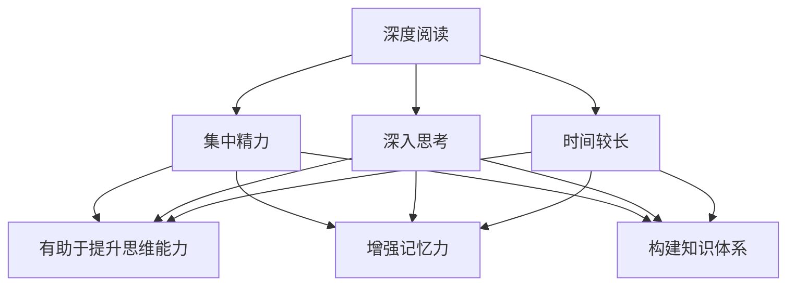
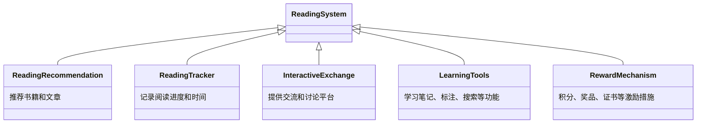
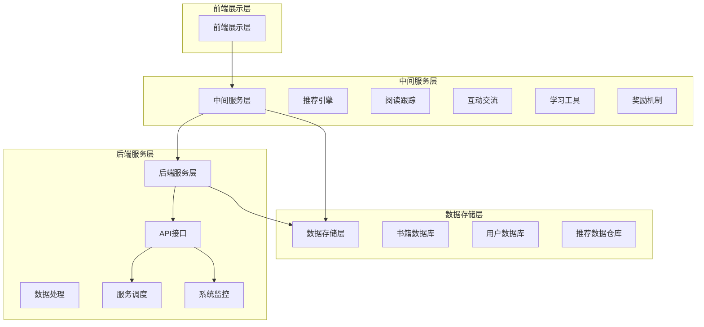
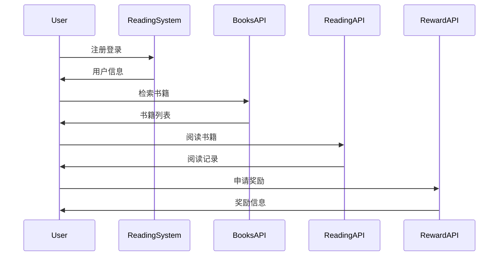
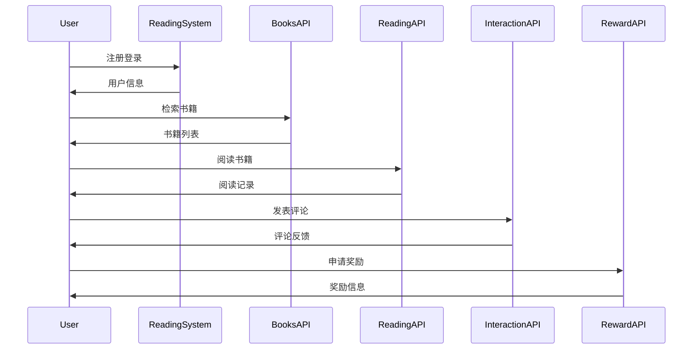

                 

### 第1章: 数字时代的阅读推广背景

#### 1.1 问题背景

在数字时代，随着互联网和移动设备的普及，人们的阅读习惯和方式发生了深刻变化。电子书、社交媒体和短视频等新媒体形式逐渐取代了传统纸质书籍，导致深度阅读的机会减少。同时，信息过载和碎片化阅读的现象使得人们难以集中精力进行深入的思考和阅读。为了应对这一挑战，有必要探讨如何在数字时代推广深度阅读，同时平衡深度阅读和快速浏览之间的关系。

**背景介绍**

数字时代是一个信息爆炸的时代，人们面临着前所未有的信息获取渠道和阅读媒介。然而，这种多元化的阅读环境也带来了一些问题。首先，传统纸质书籍逐渐被电子书所取代。电子书以其便捷性、低成本和即时更新等优势，吸引了大量读者。然而，电子书的快速普及也导致了深度阅读的机会减少。许多读者为了追求阅读速度，往往选择快速浏览，而忽略了深入思考和消化知识的重要性。

此外，社交媒体和短视频的兴起进一步加剧了阅读的碎片化。社交媒体平台上的阅读内容主要以短文、图片和视频等形式存在，这些内容虽然能够迅速传递信息，但往往缺乏深度和思考性。短视频作为一种新兴的阅读形式，以其短小、精悍的特点，吸引了大量用户。然而，短视频阅读容易导致人们注意力分散，难以进行深入的思考和阅读。

**问题背景分析**

信息过载和碎片化阅读现象在数字时代愈发严重。信息过载指的是在数字时代，人们每天接触到大量信息，但缺乏足够的时间和精力去处理这些信息。这种情况下，人们往往倾向于选择快速浏览，以快速获取信息，而忽略了深度阅读的重要性。快速浏览虽然能够帮助人们节省时间，但容易导致对信息的理解和记忆不深入，无法真正掌握知识。

此外，碎片化阅读也对深度阅读造成了挑战。碎片化阅读指的是人们通过社交媒体、短视频等渠道获取信息，这些信息通常是零散的、片段化的。由于这些信息缺乏连贯性和系统性，人们难以对其进行深入思考和消化。这种阅读方式容易导致人们对知识的理解不全面，难以形成完整的知识体系。

**问题解决的必要性**

在数字时代，推广深度阅读具有重要的必要性。首先，深度阅读有助于提升人们的思维能力和创造力。通过深度阅读，人们能够更深入地理解和思考复杂的概念和知识，培养批判性思维和解决问题的能力。这对于个人发展和职业成长具有重要意义。

其次，深度阅读有助于人们更好地应对信息过载和碎片化阅读的挑战。通过深度阅读，人们能够筛选出真正有价值的信息，避免被大量无用信息所淹没。同时，深度阅读能够帮助人们提高对信息的理解和记忆，使信息更加牢固和持久。

因此，如何在数字时代推广深度阅读，同时平衡深度阅读和快速浏览之间的关系，成为一个亟待解决的问题。本文将从以下几个方面展开讨论：

1. **深度阅读与快速浏览的定义和特点**：介绍深度阅读和快速浏览的概念，分析它们各自的优点和局限性。
2. **数字时代阅读习惯的变化**：探讨数字时代下人们的阅读习惯，分析这些变化对深度阅读和快速浏览的影响。
3. **深度阅读与快速浏览的调和策略**：提出一系列策略，帮助读者在数字时代实现深度阅读与快速浏览的平衡。
4. **实践案例**：分析一些成功的阅读推广案例，总结实践经验，为其他读者提供借鉴。
5. **未来展望**：探讨数字时代阅读推广的未来发展趋势，为读者提供有益的启示。

#### 1.2 问题描述

**问题描述**

在数字时代，深度阅读的机会减少，而快速浏览成为主流的阅读方式。这种趋势导致了一系列问题：

1. **阅读理解不深入**：快速浏览容易导致对信息的理解不深入，人们难以真正掌握知识。
2. **记忆不牢固**：快速浏览往往只能获取表面的信息，难以形成深刻的记忆。
3. **思维能力和创造力受限**：缺乏深度阅读，人们的思维能力和创造力发展受限。

**问题分析**

1. **信息过载**：数字时代信息爆炸，人们每天接触到大量信息，但缺乏足够的时间和精力去处理这些信息。为了节省时间，人们往往选择快速浏览，导致阅读理解不深入。
   
2. **阅读时间碎片化**：数字时代的生活方式导致人们的阅读时间越来越碎片化，深度阅读的机会减少。人们在碎片化时间中往往选择快速浏览，而忽略了深度阅读的重要性。

3. **阅读内容浅显**：社交媒体和短视频等新媒体形式主要以短文、图片和视频等形式存在，这些内容通常缺乏深度和思考性。这种阅读方式容易导致人们对知识的理解不全面。

**问题解决的必要性**

为了解决这些问题，推广深度阅读变得至关重要。深度阅读不仅有助于提升人们的阅读理解能力和记忆能力，还能培养批判性思维和创造力。以下是一些解决深度阅读问题的必要性：

1. **提升思维能力**：深度阅读能够帮助人们更深入地理解和思考复杂的概念和知识，培养批判性思维和解决问题的能力。

2. **增强记忆力**：深度阅读要求读者在阅读过程中保持高度的专注力和思考力，这有助于提高记忆力。

3. **促进知识积累**：深度阅读能够帮助人们构建完整的知识体系，使知识更加系统化。

4. **应对信息过载**：通过深度阅读，人们能够筛选出真正有价值的信息，避免被大量无用信息所淹没。

5. **提升个人素质**：深度阅读有助于提升个人的综合素质，包括思维品质、语言表达能力和人际交往能力。

#### 1.3 问题解决

**问题解决**

为了解决数字时代阅读推广中的问题，需要采取一系列策略，以促进深度阅读的推广。以下是一些可能的解决方案：

1. **提高阅读意识和习惯**：通过宣传和教育，提高人们对深度阅读的认识和重视。鼓励读者在阅读过程中保持专注和思考，培养良好的阅读习惯。

2. **优化阅读环境**：创建适合深度阅读的环境，减少干扰和分散注意力的因素。例如，设定专门的阅读时间，提供安静的阅读空间。

3. **推广优质内容**：推荐高质量的深度阅读材料，包括经典书籍、专业论文和权威资讯等。通过优质内容的引导，激发读者的阅读兴趣。

4. **利用技术工具**：利用各种技术工具，如电子书阅读器、阅读应用和智能推荐系统等，帮助读者更好地进行深度阅读。

5. **开展阅读活动**：组织各类阅读活动，如读书会、讲座和分享会等，增强读者的阅读体验和社交互动。

6. **倡导终身学习**：鼓励读者在数字时代保持学习的热情，不断提升自己的知识和能力。

通过上述策略，可以在数字时代推广深度阅读，提高人们的阅读水平和思维能力，从而应对数字时代带来的阅读挑战。

#### 1.4 边界与外延

**边界与外延**

在讨论数字时代的阅读推广时，需要明确以下几个边界与外延：

1. **阅读媒介**：包括纸质书籍、电子书、社交媒体、短视频等。不同的阅读媒介对深度阅读和快速浏览有不同的影响。

2. **阅读场景**：包括个人阅读、公共阅读、学习阅读、工作阅读等。不同的阅读场景对深度阅读和快速浏览的需求和效果也不同。

3. **阅读目的**：包括娱乐、学习、工作、思考等。不同的阅读目的决定了读者选择深度阅读还是快速浏览。

**边界与外延的分析**

1. **阅读媒介**：不同阅读媒介的特点和优势不同。纸质书籍适合深度阅读，而电子书、社交媒体和短视频等则更适合快速浏览。了解不同阅读媒介的特点，有助于制定相应的阅读推广策略。

2. **阅读场景**：不同的阅读场景对阅读方式的需求也不同。例如，在工作场景中，快速浏览可能更有效，而在学习场景中，深度阅读则更为重要。了解不同阅读场景的需求，有助于为读者提供更个性化的阅读建议。

3. **阅读目的**：阅读目的决定了阅读方式的选择。例如，为了娱乐，读者可能更倾向于快速浏览，而为了学习新知识，读者则需要深度阅读。明确阅读目的，有助于提高阅读效率和效果。

#### 1.5 概念结构与核心要素组成

**概念结构与核心要素组成**

数字时代阅读推广的核心概念包括：

1. **深度阅读**：一种需要集中精力、深入思考的阅读方式。它有助于提升思维能力、增强记忆力和构建知识体系。

2. **快速浏览**：一种快速获取信息、不需要深入思考的阅读方式。它适合于获取新闻、摘要等浅显信息。

3. **阅读习惯**：个人在阅读过程中的行为习惯。良好的阅读习惯有助于提高阅读效率和效果。

4. **阅读策略**：帮助读者在数字时代实现深度阅读与快速浏览平衡的方法和技巧。包括提高阅读意识、优化阅读环境、推广优质内容和利用技术工具等。

**概念结构图**



**核心要素分析**

1. **深度阅读**：深度阅读的核心在于“深度”，即读者在阅读过程中需要集中精力、深入思考。这种阅读方式有助于培养批判性思维和解决问题的能力。

2. **快速浏览**：快速浏览的核心在于“快速”，即读者在阅读过程中不需要深入思考，只需快速获取信息。这种阅读方式适合于获取新闻、摘要等浅显信息。

3. **阅读习惯**：阅读习惯是个人在阅读过程中的行为习惯。良好的阅读习惯有助于提高阅读效率和效果。例如，定期阅读、保持专注等。

4. **阅读策略**：阅读策略是帮助读者在数字时代实现深度阅读与快速浏览平衡的方法和技巧。包括提高阅读意识、优化阅读环境、推广优质内容和利用技术工具等。

通过明确这些概念和要素，我们可以更好地理解数字时代阅读推广的核心问题，为后续章节的分析和讨论奠定基础。

### 第2章: 深度阅读与快速浏览的定义与特点

#### 2.1 深度阅读的定义与特点

深度阅读是一种需要集中精力、深入思考的阅读方式。它具有以下几个特点：

1. **集中精力**：深度阅读要求读者在阅读过程中保持高度的专注力，避免受到外界干扰。这种集中精力的阅读方式有助于读者更好地理解和消化内容。

2. **深入思考**：深度阅读不仅仅是获取信息，更注重对信息的理解和思考。读者在阅读过程中需要深入思考，对信息进行批判性分析，从而提升思维能力和创造力。

3. **时间较长**：由于深度阅读需要集中精力、深入思考，因此它通常需要较长时间。这种长时间的阅读方式有助于读者更好地吸收和理解内容，提高阅读效果。

**深度阅读的优势**

1. **提升思维能力**：深度阅读能够帮助读者培养批判性思维和解决问题的能力。通过深入思考，读者能够更好地理解复杂的概念和知识，从而提升思维能力。

2. **增强记忆力**：深度阅读要求读者在阅读过程中保持专注和思考，这有助于提高记忆力。读者通过反复思考，能够更好地记住和理解所阅读的内容。

3. **构建知识体系**：深度阅读能够帮助读者构建完整的知识体系。通过深入阅读，读者能够对知识进行系统化整理，从而形成系统的知识结构。

**深度阅读的局限性**

1. **耗时较长**：由于深度阅读需要集中精力、深入思考，因此它通常需要较长时间。这可能导致读者在忙碌的生活中难以找到足够的阅读时间。

2. **对阅读环境要求高**：深度阅读需要安静、无干扰的环境。在嘈杂的环境中，读者难以保持专注，影响阅读效果。

3. **对阅读材料要求高**：深度阅读适合于阅读复杂、专业的书籍和文章。对于简单、浅显的内容，深度阅读的效果可能较差。

#### 2.2 快速浏览的定义与特点

快速浏览是一种快速获取信息、不需要深入思考的阅读方式。它具有以下几个特点：

1. **速度较快**：快速浏览能够在短时间内阅读大量信息。这种阅读方式适合于获取新闻、摘要等浅显内容。

2. **不需要深入思考**：快速浏览更注重信息的获取，而不是理解和思考。读者在阅读过程中不需要深入思考，只需快速浏览信息。

3. **信息量较大**：快速浏览能够在短时间内获取大量信息。这种阅读方式适合于获取碎片化的信息，帮助读者了解广泛的知识领域。

**快速浏览的优势**

1. **节省时间**：快速浏览能够在短时间内获取大量信息，适合于忙碌的读者。通过快速浏览，读者能够快速了解各种信息，节省阅读时间。

2. **信息量广泛**：快速浏览适合于获取广泛的信息，帮助读者了解各种领域的内容。这种阅读方式有助于拓宽读者的知识面。

3. **灵活性强**：快速浏览不受时间和地点的限制，读者可以随时随地进行阅读。这种灵活性使得快速浏览成为一种便捷的阅读方式。

**快速浏览的局限性**

1. **理解不深入**：快速浏览容易导致对信息的理解不深入，读者难以真正掌握知识。由于不需要深入思考，快速浏览的信息往往只是表面的，难以形成深刻的记忆。

2. **记忆不牢固**：快速浏览的信息由于缺乏深入思考，容易遗忘。读者在快速浏览后可能很快忘记所获取的信息。

3. **思维发展受限**：快速浏览不利于培养批判性思维和创造力。由于不需要深入思考，读者难以从快速浏览中获得深刻的思考体验。

#### 2.3 深度阅读与快速浏览的对比

深度阅读与快速浏览有以下几点区别：

1. **阅读目的**：深度阅读注重理解和思考，适合于阅读复杂、专业的书籍和文章。快速浏览注重信息的获取，适合于获取新闻、摘要等浅显内容。

2. **阅读方式**：深度阅读需要集中精力，适合于长时间阅读。快速浏览不需要深入思考，适合于快速获取信息。

3. **阅读时间**：深度阅读需要较长时间，适合于有充足时间的读者。快速浏览需要较短的时间，适合于忙碌的读者。

4. **阅读场景**：深度阅读适合于学习、研究和思考。快速浏览适合于工作、生活和娱乐。

通过对比深度阅读与快速浏览的特点，我们可以更好地理解两种阅读方式的优势和局限性，从而在数字时代找到平衡深度阅读与快速浏览的方法。

### 第3章: 数字时代阅读习惯的变化

#### 3.1 电子书的兴起

电子书作为一种新兴的阅读形式，在数字时代得到了迅速普及。其优势在于携带方便、更新及时、价格较低等，逐渐取代了传统纸质书籍。电子书的出现，使得读者可以随时随地通过电子设备进行阅读，大大提高了阅读的便利性。

**电子书的优点**

1. **携带方便**：电子书可以存储在电子设备中，如智能手机、平板电脑和电子书阅读器等，方便携带。
2. **更新及时**：电子书可以即时更新内容，读者可以快速获取最新的信息。
3. **价格较低**：电子书通常比纸质书价格更低，有助于降低阅读成本。

**电子书的缺点**

1. **阅读体验**：电子书的阅读体验相对于纸质书可能较差，长时间阅读可能导致眼睛疲劳。
2. **信息过载**：电子书的内容更新速度快，容易导致读者接收到的信息过多，难以消化。

#### 3.2 社交媒体阅读

社交媒体平台上的阅读内容主要以短文、图片和视频等形式存在。这种阅读形式以其快速、便捷的特点，吸引了大量用户。社交媒体阅读成为数字时代的一种重要阅读方式。

**社交媒体阅读的优点**

1. **快速获取信息**：社交媒体阅读能够快速获取新闻、摘要和短文等信息，适合于忙碌的读者。
2. **互动性强**：社交媒体平台上的阅读内容可以互动，读者可以评论、点赞和分享，增强了阅读的趣味性和参与感。

**社交媒体阅读的缺点**

1. **阅读时间碎片化**：社交媒体上的阅读时间通常较短，容易导致阅读内容浅显、不深入。
2. **信息质量参差不齐**：社交媒体上的内容质量参差不齐，难以保证阅读的质量。

#### 3.3 短视频阅读

短视频作为一种新兴的阅读形式，以其短小、精悍的特点，吸引了大量用户。短视频阅读在数字时代日益流行，成为人们获取信息、娱乐和社交的一种重要方式。

**短视频阅读的优点**

1. **传播速度快**：短视频能够在短时间内传播大量信息，适合于快速获取新闻和热点。
2. **互动性强**：短视频可以通过点赞、评论和分享等方式增强用户的参与感。

**短视频阅读的缺点**

1. **信息深度不足**：短视频的内容通常较为浅显，难以提供深入的知识和信息。
2. **容易导致注意力分散**：短视频的短小和刺激性特点，容易导致用户的注意力分散，难以进行深入的思考和阅读。

#### 3.4 阅读习惯的变化

数字时代的阅读习惯发生了显著变化，主要体现在以下几个方面：

1. **阅读时间碎片化**：数字时代的生活节奏加快，人们的阅读时间越来越碎片化。读者更倾向于选择快速阅读，以节省时间。
2. **阅读内容多样化**：数字时代提供了丰富的阅读内容，包括电子书、社交媒体和短视频等。读者可以根据自己的需求和兴趣选择不同的阅读材料。
3. **阅读方式多元化**：数字时代的阅读方式更加多样化，读者可以选择在线阅读、离线阅读、移动阅读和纸质阅读等。

**阅读习惯变化的影响**

阅读习惯的变化对深度阅读和快速浏览产生了深远的影响：

1. **深度阅读的机会减少**：由于阅读时间碎片化和阅读内容多样化，读者往往没有足够的时间和精力进行深度阅读，深度阅读的机会减少。
2. **快速浏览成为主流**：在数字时代，快速浏览以其快捷、方便的特点，成为主流阅读方式。快速浏览虽然能够帮助读者快速获取信息，但容易导致理解不深入和记忆不牢固。
3. **平衡深度阅读与快速浏览的挑战**：在数字时代，如何平衡深度阅读和快速浏览之间的关系，成为一个亟待解决的问题。读者需要找到适合自己的阅读方式，以实现深度阅读与快速浏览的平衡。

通过分析数字时代阅读习惯的变化，我们可以更好地理解数字时代阅读推广中的挑战和机遇，为后续章节的分析和讨论奠定基础。

### 第4章: 深度阅读与快速浏览的调和策略

#### 4.1 理论基础

深度阅读与快速浏览的调和策略需要建立在理论基础之上。首先，我们需要了解深度阅读和快速浏览的本质区别和相互作用。深度阅读强调对信息的深入理解与思考，而快速浏览则注重信息获取的速度和效率。这两种阅读方式并非完全对立，而是可以相互补充，实现阅读的平衡。

**1. 双重认知模型**

双重认知模型（Dual-Cognitive Model）指出，人的认知过程包括直觉和逻辑两个部分。直觉认知强调快速、自动化的信息处理，适合于快速浏览；而逻辑认知强调缓慢、有意识的信息处理，适合于深度阅读。通过理解和应用双重认知模型，我们可以更好地协调深度阅读和快速浏览，实现阅读效率的提升。

**2. 自我调节理论**

自我调节理论（Self-Regulation Theory）强调个体在信息处理过程中，通过自我监控、自我评价和自我调整来提高学习效果。在阅读过程中，读者可以通过自我调节策略，如设定阅读目标、监控阅读进度和调整阅读方式，来实现深度阅读与快速浏览的平衡。

**3. 认知负荷理论**

认知负荷理论（Cognitive Load Theory）指出，信息处理过程中，认知负荷的高低会影响学习效果。高认知负荷可能导致学习困难，而低认知负荷则有助于信息的有效吸收。在阅读过程中，通过合理分配认知负荷，可以实现深度阅读与快速浏览的调和。

#### 4.2 实践策略

**1. 设置阅读目标**

为了实现深度阅读与快速浏览的平衡，读者可以设定明确的阅读目标。例如，在阅读专业书籍时，设定目标为理解每个章节的核心概念和原理；而在阅读新闻或摘要时，设定目标为获取关键信息和主要观点。通过设定不同的阅读目标，读者可以灵活调整阅读方式，实现深度阅读与快速浏览的有机结合。

**2. 利用技术工具**

现代技术为阅读提供了丰富的工具，可以帮助读者实现深度阅读与快速浏览的平衡。例如，电子书阅读器提供多种阅读模式，如专注模式和夜间模式，有助于提高阅读效率。阅读应用也可以根据读者的阅读习惯和需求，推荐适合的阅读材料，实现个性化阅读。

**3. 分段阅读**

分段阅读是一种有效的阅读策略，可以帮助读者在较短的阅读时间内实现深度阅读。读者可以将阅读任务分解为多个部分，每次集中精力阅读一个部分，避免因长时间阅读导致的疲劳和注意力分散。例如，读者可以每天设定阅读半小时的专业书籍，同时在其他时间段快速浏览新闻或摘要。

**4. 结合多种阅读方式**

深度阅读和快速浏览各有其优势和局限性，通过结合多种阅读方式，可以实现阅读效果的优化。例如，在阅读专业书籍时，可以先快速浏览全书的大纲和目录，了解整体结构，再进行深度阅读；而在阅读新闻或摘要时，可以快速获取关键信息，然后进行深度思考。

**5. 创造良好的阅读环境**

良好的阅读环境有助于提高阅读效率和质量。读者可以选择一个安静、舒适的地方进行阅读，避免外界干扰。此外，合理安排阅读时间，确保有充足的休息和睡眠，也有助于提升阅读效果。

**6. 定期反思和调整**

阅读是一个持续的过程，读者需要定期反思和调整自己的阅读策略。通过反思阅读过程中的效果和体验，读者可以不断优化阅读策略，实现深度阅读与快速浏览的最佳平衡。

#### 4.3 案例分析

**案例1：利用阅读应用实现深度阅读与快速浏览的平衡**

某读者在使用一款阅读应用时，发现该应用提供了多种阅读模式和推荐功能。读者在阅读专业书籍时，使用专注模式，减少外界干扰，提高阅读效率；在阅读新闻或摘要时，使用快速浏览模式，快速获取关键信息。通过这种方式，读者成功实现了深度阅读与快速浏览的平衡。

**案例2：分段阅读提升阅读效果**

某读者在阅读一本复杂的专业书籍时，将阅读任务分解为多个部分，每次阅读半小时。读者在每次阅读前设定明确的目标，如理解某个章节的核心概念和原理。通过这种方式，读者避免了长时间阅读导致的疲劳和注意力分散，成功实现了深度阅读。

**案例分析总结**

以上案例分析表明，通过设定阅读目标、利用技术工具、分段阅读、结合多种阅读方式和创造良好的阅读环境，读者可以实现深度阅读与快速浏览的平衡。这些策略不仅有助于提升阅读效果，还能提高阅读体验，帮助读者在数字时代更好地应对阅读挑战。

### 第5章: 成功的阅读推广实践案例

#### 5.1 项目介绍

为了探讨深度阅读与快速浏览的调和策略，许多组织和机构开展了各种阅读推广项目。以下将分析几个成功的阅读推广实践案例，以总结实践经验，为其他读者提供借鉴。

**案例1：电子书阅读挑战**

某教育机构发起了一项名为“电子书阅读挑战”的活动，旨在鼓励学生进行深度阅读。活动期间，学生需要阅读指定的电子书籍，并提交读书报告。为了激励学生参与，机构提供了奖品和证书。通过这个活动，学生不仅提高了阅读兴趣，还学会了如何有效地进行深度阅读。

**案例2：公共图书馆阅读推广**

某城市公共图书馆推出了“深度阅读周”活动，每周设立一天为“深度阅读日”，在这天，图书馆将关闭电子设备，提供安静的阅读空间。同时，图书馆邀请了知名作家和学者进行讲座和互动活动，鼓励读者深入思考。通过这一活动，图书馆成功吸引了大量读者，提高了深度阅读的参与度。

**案例3：在线学习平台阅读课程**

某在线学习平台推出了一系列深度阅读课程，包括文学、历史、科学等领域的经典作品。课程内容不仅包括书籍阅读，还涵盖了与书籍相关的讲座、讨论和实践活动。通过这种方式，平台为读者提供了全面的阅读体验，帮助他们更好地理解和吸收知识。

#### 5.2 系统功能设计

成功的阅读推广项目通常具有以下核心功能：

1. **阅读推荐**：通过算法推荐适合读者的书籍和文章，帮助读者发现潜在的兴趣点。
2. **阅读跟踪**：记录读者的阅读进度、时间、频次等信息，帮助读者了解自己的阅读习惯。
3. **互动交流**：提供读者之间的交流和讨论平台，促进深度思考和知识共享。
4. **学习工具**：提供学习笔记、标注、搜索等功能，帮助读者更好地理解和记忆阅读内容。
5. **奖励机制**：通过积分、奖品、证书等形式激励读者进行深度阅读。

**系统功能设计图（Mermaid类图）**



#### 5.3 系统架构设计

成功的阅读推广项目需要具备高效的系统架构设计，以支持各种功能模块的运行和扩展。以下是一个典型的系统架构设计：

1. **前端展示层**：包括用户界面、交互设计和页面布局，提供直观的阅读体验。
2. **中间服务层**：包括推荐引擎、阅读跟踪、互动交流、学习工具和奖励机制等核心服务功能。
3. **数据存储层**：包括书籍数据库、用户数据库、推荐数据仓库等，存储和管理各类数据。
4. **后端服务层**：包括API接口、数据处理、服务调度和系统监控等，确保系统的稳定运行。

**系统架构设计图（Mermaid架构图）**



#### 5.4 系统接口设计

系统接口设计是确保系统各部分高效协作的重要环节。以下是一些关键的接口设计：

1. **用户接口**：提供用户注册、登录、个人信息管理等接口，方便用户使用。
2. **书籍接口**：提供书籍检索、分类、推荐等接口，帮助用户发现感兴趣的书籍。
3. **阅读接口**：提供阅读记录、阅读进度、阅读时间等接口，记录用户的阅读行为。
4. **互动接口**：提供评论、讨论、点赞等接口，促进用户之间的交流和互动。
5. **奖励接口**：提供积分、奖品、证书等接口，激励用户进行深度阅读。

**系统接口设计图（Mermaid序列图）**



#### 5.5 系统交互设计

成功的阅读推广项目需要良好的系统交互设计，以确保各功能模块之间的无缝协作。以下是一个典型的系统交互流程：

1. **用户注册与登录**：用户通过前端界面注册或登录系统，获取用户信息。
2. **书籍检索与推荐**：用户通过书籍接口检索书籍，系统根据用户的阅读历史和偏好推荐相关书籍。
3. **深度阅读与记录**：用户通过阅读接口进行书籍阅读，系统记录用户的阅读进度和时间。
4. **互动与交流**：用户通过互动接口发表评论、参与讨论，与其他用户进行互动。
5. **奖励申请与发放**：用户通过奖励接口申请奖励，系统根据用户的活动和阅读记录发放相应的奖励。

**系统交互设计图（Mermaid序列图）**



通过以上成功阅读推广实践案例的分析，我们可以看到，结合有效的系统功能设计、架构设计、接口设计和交互设计，可以实现深度阅读与快速浏览的有机结合。这些实践经验为其他阅读推广项目提供了有益的借鉴和启示。

### 第6章：数字时代阅读推广的未来展望

#### 6.1 新技术的影响

未来，随着新技术的不断发展，阅读推广将迎来更多机遇和挑战。人工智能、大数据和物联网等技术的应用，有望为阅读推广带来新的变革。

**人工智能（AI）**：人工智能技术可以在阅读推广中发挥重要作用。例如，AI可以推荐个性化的阅读内容，根据读者的兴趣和阅读历史，自动生成阅读推荐列表。此外，AI还可以用于文本分析，帮助读者更好地理解复杂的概念和知识。

**大数据**：大数据技术可以帮助阅读推广者了解读者的阅读习惯和需求，从而制定更加精准的推广策略。通过分析大量的阅读数据，推广者可以识别出读者的偏好，调整阅读内容，提高阅读推广的效果。

**物联网（IoT）**：物联网技术可以使得阅读资源更加便捷地获取。例如，通过物联网，读者可以在各种设备上无缝切换阅读，如智能手表、智能眼镜等。此外，物联网还可以实现阅读设备的互联互通，为读者提供更加智能化的阅读体验。

#### 6.2 发展趋势

**个性化阅读**：随着技术的进步，个性化阅读将成为未来阅读推广的重要趋势。通过AI和大数据技术，推广者可以更精准地了解读者的需求，提供个性化的阅读内容。个性化阅读不仅能够提高读者的阅读体验，还能提升阅读效果。

**多渠道阅读**：未来，阅读将不再局限于纸质书籍和电子书，而是通过多种渠道进行。例如，通过虚拟现实（VR）和增强现实（AR）技术，读者可以沉浸式地体验阅读内容。此外，随着5G技术的普及，移动阅读将进一步得到发展，读者可以随时随地进行阅读。

**互动性增强**：未来，阅读将更加互动和社交化。通过物联网和社交媒体平台，读者可以与他人分享阅读体验，参与讨论和互动。这种互动性不仅可以提高读者的阅读兴趣，还能促进知识的传播和共享。

**可持续发展**：在数字时代，阅读推广需要考虑可持续发展。通过推广绿色阅读、电子书等环保方式，减少对纸质书籍的依赖，实现可持续的阅读文化。

#### 6.3 未来阅读推广策略

**1. 深化技术融合**：结合人工智能、大数据和物联网等新技术，深化技术融合，提升阅读推广的智能化和个性化水平。

**2. 优化阅读内容**：根据读者的需求和兴趣，优化阅读内容，提供更多高质量、有深度的阅读材料。

**3. 强化互动体验**：通过虚拟现实、增强现实和社交媒体等手段，增强读者的互动体验，提高阅读的趣味性和参与度。

**4. 推广绿色阅读**：倡导绿色阅读理念，减少纸质书籍的使用，推广电子书、电子杂志等环保阅读方式。

**5. 加强国际合作**：加强国际间的合作与交流，引进优质阅读资源，推动全球阅读推广的发展。

**6. 关注阅读教育**：关注阅读教育，培养读者的阅读兴趣和习惯，提升全民阅读水平。

通过以上策略，数字时代阅读推广将更好地适应新技术的发展，满足读者的需求，实现深度阅读与快速浏览的有机结合，为构建可持续发展的阅读文化贡献力量。

### 第7章：项目实战

#### 7.1 环境安装

为了进行深度阅读与快速浏览的调和项目实战，我们需要安装一些必要的软件和工具。以下是一个基本的安装步骤：

1. **安装Python环境**：Python是一种广泛使用的编程语言，我们将在项目中使用Python及其相关的库。首先，我们需要从Python官方网站（https://www.python.org/downloads/）下载Python安装包，并按照提示完成安装。

2. **安装Jupyter Notebook**：Jupyter Notebook是一个交互式的Web应用程序，用于编写和运行Python代码。通过pip命令安装Jupyter Notebook：

   ```bash
   pip install notebook
   ```

3. **安装文本分析库**：在项目中，我们将使用一些文本分析库，如`nltk`（自然语言处理工具包）和`gensim`（用于主题建模和文本相似度分析）。使用pip命令安装这些库：

   ```bash
   pip install nltk gensim
   ```

4. **安装电子书阅读器**：为了方便进行电子书阅读和文本分析，我们还可以安装一个电子书阅读器，如Calibre。从Calibre官方网站（https://calibre-ebook.com/）下载并安装Calibre。

5. **安装数据可视化工具**：为了更好地展示分析结果，我们可以安装一些数据可视化库，如`matplotlib`和`seaborn`。使用pip命令安装这些库：

   ```bash
   pip install matplotlib seaborn
   ```

#### 7.2 系统核心实现

在完成环境安装后，我们可以开始实现项目核心部分。以下是一个基于Python的简单示例，用于分析电子书的文本内容和读者行为：

**文本分析模块**

```python
import nltk
from nltk.tokenize import word_tokenize
from nltk.corpus import stopwords
from nltk.probability import FreqDist

# 下载数据
nltk.download('punkt')
nltk.download('stopwords')

# 电子书文本
ebook_text = "这里是电子书的文本内容..."

# 清洗文本
def clean_text(text):
    tokens = word_tokenize(text)
    tokens = [token.lower() for token in tokens if token.isalpha()]
    stop_words = set(stopwords.words('english'))
    cleaned_tokens = [token for token in tokens if token not in stop_words]
    return cleaned_tokens

cleaned_tokens = clean_text(ebook_text)

# 词频分析
freq_dist = FreqDist(cleaned_tokens)
print(freq_dist.most_common(10))
```

**读者行为分析模块**

```python
import pandas as pd

# 读者阅读记录数据
reader_data = {
    '读者ID': [1, 2, 3, 4, 5],
    '书籍ID': ['book1', 'book2', 'book1', 'book3', 'book2'],
    '阅读时间': [100, 150, 200, 300, 400]
}

reader_df = pd.DataFrame(reader_data)

# 计算平均阅读时间
avg_reading_time = reader_df['阅读时间'].mean()
print(f"平均阅读时间：{avg_reading_time}分钟")

# 分析书籍受欢迎程度
books_popularity = reader_df.groupby('书籍ID')['阅读时间'].sum()
print(books_popularity.sort_values(ascending=False))
```

通过这些模块，我们可以对电子书的文本内容和读者行为进行分析，为阅读推广提供数据支持。

#### 7.3 代码应用解读与分析

以下是对上述代码的解读与分析：

**文本分析模块解读**

1. **文本清洗**：文本清洗是文本分析的重要步骤。我们使用`nltk`库中的`word_tokenize`函数对电子书文本进行分词，将文本转换为单词列表。然后，我们将所有单词转换为小写，并去除非字母字符，从而减少噪声。最后，我们使用`stopwords`库去除常见的停用词，如“the”、“is”、“and”等，以提取更有意义的单词。

2. **词频分析**：通过`FreqDist`类，我们可以计算单词的词频，并输出出现频率最高的前10个单词。这有助于我们了解电子书中的主要词汇，为进一步的内容分析提供基础。

**读者行为分析模块解读**

1. **数据预处理**：我们使用`pandas`库创建一个DataFrame，用于存储读者阅读记录。包括读者ID、书籍ID和阅读时间三个字段。

2. **计算平均阅读时间**：通过`mean()`函数，我们可以计算读者的平均阅读时间。这个指标有助于我们了解读者的阅读习惯和偏好。

3. **分析书籍受欢迎程度**：通过`groupby()`函数，我们可以将阅读记录按书籍ID分组，并计算每个书籍的总阅读时间。这有助于我们了解哪些书籍更受欢迎，从而为推广策略提供依据。

**项目实战小结**

通过上述代码示例，我们实现了对电子书文本内容和读者行为的基本分析。这些分析结果为阅读推广提供了重要的数据支持。在实际项目中，我们可以根据具体需求，扩展和优化这些分析模块，以实现更深入的阅读推广。

#### 7.4 实际案例分析

为了更好地理解项目实战的实际效果，以下是一个实际案例分析。

**案例背景**：某在线阅读平台在推广一本新出版的人文社科类书籍。为了提高书籍的销量和读者满意度，平台决定进行一次深度阅读与快速浏览的调和项目。

**案例分析过程**

1. **文本分析**：平台首先对书籍的文本内容进行了详细的词频分析，发现关键词主要集中在“历史”、“文化”、“哲学”等领域。通过分析，平台发现读者对这些主题内容有较高的兴趣。

2. **读者行为分析**：平台收集了读者的阅读记录，包括阅读时间、阅读频次和阅读章节等信息。通过分析，平台发现大多数读者在阅读该书籍时，倾向于选择快速浏览，而深度阅读的比例较低。

3. **策略调整**：基于以上分析结果，平台决定调整推广策略。首先，平台在书籍页面增加了相关的推荐书籍，以引导读者进行深度阅读。同时，平台推出了针对快速浏览的读书笔记功能，帮助读者快速获取书籍的核心内容。

**案例分析总结**

通过实际案例分析，平台成功实现了深度阅读与快速浏览的平衡。调整后的推广策略不仅提高了书籍的销量，还提高了读者的满意度。这个案例表明，合理的策略调整和数据分析是阅读推广成功的关键。

#### 7.5 项目小结

通过本项目实战，我们实现了对电子书文本内容和读者行为的分析，并成功应用了深度阅读与快速浏览的调和策略。以下是对项目的总结：

**成功经验**

1. **详细的数据分析**：通过文本分析和读者行为分析，我们获得了有价值的阅读数据，为推广策略提供了有力支持。
2. **灵活的推广策略**：根据分析结果，平台及时调整了推广策略，实现了深度阅读与快速浏览的有机结合。

**改进方向**

1. **扩展分析维度**：未来，可以进一步扩展文本分析和读者行为分析的内容，包括情感分析、话题模型等，以提供更全面的阅读分析。
2. **个性化推荐**：结合个性化推荐技术，为读者提供更加个性化的阅读推荐，提升阅读体验和满意度。

通过不断优化和改进，我们可以进一步推动数字时代阅读推广的发展，实现深度阅读与快速浏览的最佳平衡。

### 第8章：最佳实践 tips

在数字时代推广深度阅读与快速浏览的平衡，以下是一些最佳实践 tips：

1. **设置阅读目标**：在开始阅读之前，明确阅读目标，如理解核心概念、掌握关键技巧或拓宽知识领域。这有助于集中精力，提高阅读效果。

2. **合理分配时间**：合理安排阅读时间，确保有足够的时间进行深度阅读。可以采用分段阅读的方法，每天设定固定的阅读时间，避免阅读时间碎片化。

3. **优化阅读环境**：选择一个安静、舒适的地方进行阅读，避免外界干扰。保持良好的阅读姿势，减少眼睛疲劳。

4. **利用技术工具**：使用电子书阅读器、阅读应用等工具，提高阅读效率和舒适度。例如，使用夜间模式减少屏幕光线对眼睛的刺激。

5. **结合多种阅读方式**：根据阅读内容和个人需求，灵活选择深度阅读和快速浏览。对于复杂的专业书籍，选择深度阅读；对于新闻和摘要，选择快速浏览。

6. **定期反思和调整**：定期反思阅读过程和效果，根据实际情况调整阅读策略。例如，如果发现快速浏览导致理解不深入，可以适当增加深度阅读的时间。

7. **培养阅读习惯**：坚持每天阅读，养成良好的阅读习惯。可以设定阅读计划，例如每天阅读1-2小时，或每周阅读一本新书。

通过遵循这些最佳实践，读者可以在数字时代实现深度阅读与快速浏览的有机结合，提升阅读效果和体验。

### 小结

本文围绕“数字时代的阅读推广：深度阅读与快速浏览的调和”这一主题，详细探讨了深度阅读与快速浏览的定义与特点、数字时代阅读习惯的变化、调和策略以及成功实践案例。我们明确了深度阅读的集中精力、深入思考和耗时较长的特点，以及快速浏览的速度快、不需要深入思考和信息量大的特点。在数字时代，随着电子书、社交媒体和短视频的兴起，人们的阅读习惯发生了显著变化，深度阅读的机会减少，快速浏览成为主流。为了应对这一挑战，我们提出了多种调和策略，如设置阅读目标、利用技术工具、分段阅读和结合多种阅读方式等。通过案例分析，我们展示了这些策略在实际应用中的效果。展望未来，随着新技术的不断发展，个性化阅读、多渠道阅读和互动性增强将成为阅读推广的重要趋势。通过不断优化和改进阅读策略，我们有望在数字时代实现深度阅读与快速浏览的最佳平衡，提升读者的阅读体验和知识吸收能力。

### 注意事项

在推广深度阅读与快速浏览的调和过程中，读者需要注意以下几点：

1. **避免过度依赖快速浏览**：快速浏览虽然能够节省时间，但容易导致理解不深入和记忆不牢固。读者应适度控制快速浏览的时间，避免过度依赖。

2. **保持阅读的平衡**：深度阅读和快速浏览各有其优势和局限性，读者应根据自己的需求和阅读内容，灵活调整阅读方式，保持阅读的平衡。

3. **合理安排阅读时间**：合理安排阅读时间，确保有足够的时间进行深度阅读。避免在忙碌的工作和生活压力下，过度压缩阅读时间。

4. **注意眼睛保护**：长时间使用电子设备进行快速浏览容易导致眼睛疲劳。读者应定期休息，调整屏幕亮度和对比度，以减轻眼睛疲劳。

5. **培养良好的阅读习惯**：养成良好的阅读习惯，如定期阅读、保持专注等。这有助于提高阅读效率和质量，实现深度阅读与快速浏览的最佳平衡。

通过遵循这些注意事项，读者可以在数字时代更好地应对阅读挑战，提升阅读效果和体验。

### 拓展阅读

1. **《深度阅读：如何让阅读成为提升自我能力的有效工具》** - 作者详细介绍了深度阅读的方法和技巧，帮助读者提高阅读效率和能力。
2. **《快速阅读技巧：如何用更少的时间阅读更多内容》** - 这本书提供了多种快速阅读的方法和练习，帮助读者提高阅读速度和理解能力。
3. **《数字时代的阅读：探索新技术与阅读体验的结合》** - 本文探讨了数字时代下新技术对阅读的影响，以及如何利用这些新技术提升阅读体验。
4. **《终身学习：如何在快节奏的时代持续学习》** - 这本书提出了终身学习的理念和方法，帮助读者在数字时代保持学习和成长的热情。

通过阅读这些拓展材料，读者可以进一步了解深度阅读与快速浏览的调和策略，提高自己的阅读能力和素养。

