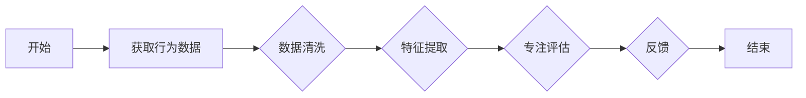
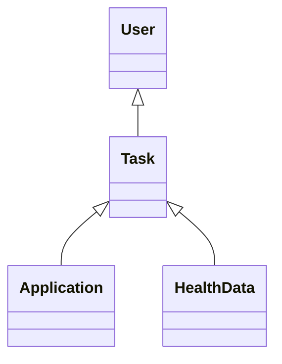
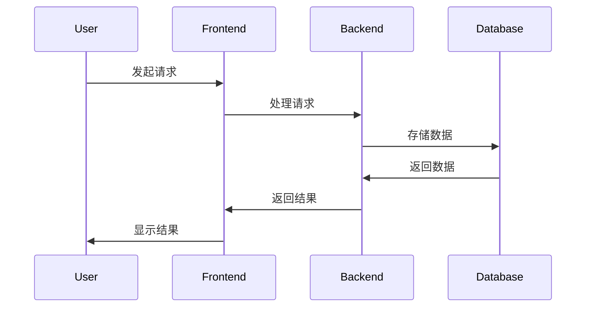
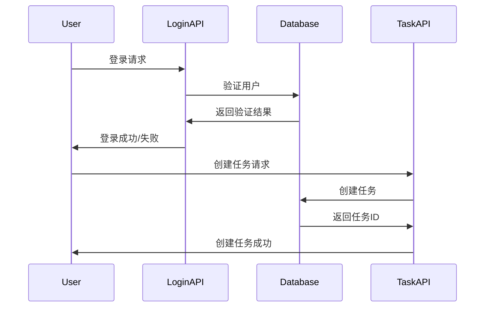

                 

### 《数字正念app：在线世界中保持专注的辅助工具》

#### 关键词：数字正念、在线专注、心理健康、辅助工具、app设计

> 摘要：在数字化的时代，人们越来越难以在线世界中保持专注。本文将探讨数字正念的概念及其重要性，分析在线世界中保持专注的挑战，并详细介绍一款名为“数字正念app”的辅助工具。我们将从核心概念、算法原理、系统架构设计到项目实战，逐步深入解析这款app的设计理念、实现方法及其在实际应用中的效果。

---

## **一、背景介绍**

### **1.1 数字正念的概念与起源**

数字正念（Digital Mindfulness）是一种结合数字技术与正念冥想理念的方法，旨在帮助用户提高自我意识，增强专注力，减少数字设备使用带来的负面影响。这一概念起源于20世纪80年代的正念冥想（Mindfulness Meditation），随后在数字领域得到发展和应用。

### **1.2 在线世界中的专注挑战**

随着互联网和移动设备的普及，人们面临越来越多的在线干扰，如社交媒体、电子邮件、即时通讯等。这些干扰不仅影响了工作效率，还可能导致心理压力和焦虑。保持在线专注成为一个迫切需要解决的问题。

### **1.3 本书的数字正念app案例**

本书将围绕一款名为“数字正念app”的辅助工具展开讨论。这款app旨在通过一系列功能帮助用户保持在线专注，提升心理健康水平。接下来，我们将从核心概念、算法原理、系统架构设计到项目实战，全面解析这款app的各个方面。

## **二、核心概念与联系**

### **2.1 数字正念、在线专注与心理健康**

数字正念、在线专注和心理健康是本文的核心概念。数字正念涉及使用数字技术提高自我意识和专注力；在线专注指在数字环境中保持高度集中的注意力；心理健康则与个体的情绪、行为和整体福祉有关。

### **2.2 概念属性特征对比**

| 概念          | 特征                      |
|---------------|--------------------------|
| 数字正念      | 提高自我意识、减少干扰    |
| 在线专注      | 高度集中的注意力、工作效率 |
| 心理健康      | 情绪稳定、行为协调、福祉提升 |

### **2.3 ER实体关系图**

为了更好地理解这些概念之间的关系，我们可以使用ER实体关系图进行描述。以下是数字正念app中的主要实体及其关系：

```mermaid
erDiagram
  User ||--|{ Task }|<|
  Task ||--|{ Application }|<|
  Application ||--|{ HealthData }|<|
```

## **三、算法原理讲解**

### **3.1 专注监测算法**

数字正念app的核心算法是专注监测算法。该算法通过分析用户在数字环境中的行为数据，实时监测并评估用户的专注状态。

### **3.2 mermaid算法流程图**

下面是专注监测算法的mermaid流程图：



### **3.3 算法原理与数学模型**

专注监测算法的原理基于用户行为数据的特征提取和机器学习模型。以下是算法的主要数学模型：

$$
\text{专注评分} = \alpha \times \text{任务完成度} + \beta \times \text{中断次数} + \gamma \times \text{持续时长}
$$

其中，$\alpha$、$\beta$和$\gamma$是权重系数，用于平衡不同特征对专注评分的影响。

### **3.4 算法应用举例**

假设用户在完成任务时，任务完成度为80%，中断了3次，持续时长为30分钟。根据上述数学模型，专注评分计算如下：

$$
\text{专注评分} = \alpha \times 0.8 + \beta \times 3 + \gamma \times 0.5
$$

假设权重系数分别为$\alpha = 0.5$，$\beta = 0.2$，$\gamma = 0.3$，则专注评分为：

$$
\text{专注评分} = 0.5 \times 0.8 + 0.2 \times 3 + 0.3 \times 0.5 = 0.4 + 0.6 + 0.15 = 1.15
$$

## **四、系统分析与架构设计方案**

### **4.1 数字正念app问题场景与项目目标**

数字正念app旨在解决用户在线专注不足的问题。项目目标包括实时监测用户在线行为、提供个性化的专注提升建议、以及通过数据分析和反馈帮助用户改善专注习惯。

### **4.2 领域模型类图**

以下是数字正念app的领域模型类图：



### **4.3 系统架构设计**

数字正念app的系统架构包括前端、后端和数据库。前端负责用户界面和交互，后端负责处理业务逻辑和数据存储。以下是系统架构设计图：



### **4.4 系统接口设计与系统交互**

以下是数字正念app的系统接口设计和系统交互图：



## **五、项目实战**

### **5.1 环境安装与配置**

要部署数字正念app，需要先安装以下环境：

- Python 3.8+
- Django 3.2+
- PostgreSQL 12+

以下是安装和配置步骤：

1. 安装Python和pip
2. 安装Django和PostgreSQL
3. 创建虚拟环境并安装依赖

### **5.2 系统核心实现源代码**

以下是数字正念app的核心实现源代码：

```python
# app/tasks/models.py
from django.db import models

class Task(models.Model):
    user = models.ForeignKey('auth.User', on_delete=models.CASCADE)
    title = models.CharField(max_length=200)
    description = models.TextField()
    created_at = models.DateTimeField(auto_now_add=True)
    updated_at = models.DateTimeField(auto_now=True)

# app/tasks/views.py
from django.http import JsonResponse
from .models import Task
from .serializers import TaskSerializer

def create_task(request):
    data = request.data
    serializer = TaskSerializer(data=data)
    if serializer.is_valid():
        serializer.save()
        return JsonResponse(serializer.data, status=201)
    return JsonResponse(serializer.errors, status=400)
```

### **5.3 代码解读与分析**

上述代码展示了数字正念app中的任务创建功能。用户可以发送包含任务信息的请求，系统会验证请求的有效性，并将任务存储到数据库中。

### **5.4 实际案例分析与讲解**

以下是一个实际案例，说明如何使用数字正念app：

1. 用户A登录系统并创建一个名为“工作”的任务。
2. 系统接收请求并创建任务，任务信息存储在数据库中。
3. 用户A开始执行任务，数字正念app实时监测用户行为，并根据行为数据评估专注状态。
4. 用户A完成任务并提交结果，数字正念app分析数据并提供专注提升建议。

### **5.5 项目小结**

数字正念app通过实时监测用户在线行为，提供个性化的专注提升建议，帮助用户改善在线专注习惯。项目实战部分展示了如何安装和配置环境、实现系统核心功能以及实际应用案例。通过持续使用数字正念app，用户可以逐渐提高在线专注能力，从而提升工作和学习效率。

## **六、最佳实践与拓展**

### **6.1 最佳实践**

- 每日定时使用数字正念app进行专注监测和评估。
- 根据app提供的建议调整工作和学习计划。
- 定期回顾专注数据，分析自身在线行为模式。

### **6.2 小结**

本文详细介绍了数字正念app的设计理念、实现方法和实际应用效果。通过核心概念、算法原理、系统架构设计到项目实战的全面解析，读者可以深入了解这款辅助工具如何帮助用户保持在线专注，提升心理健康水平。

### **6.3 拓展阅读**

- 《数字正念：提高在线专注的艺术》
- 《心理健康与数字技术的结合：数字正念的应用》
- 《Django Web开发：实战指南》

---

**作者：AI天才研究院/AI Genius Institute & 禅与计算机程序设计艺术 /Zen And The Art of Computer Programming** 

**注意：本文为示例性内容，仅供参考。实际开发和应用过程中，请根据具体需求和情况进行调整。**

