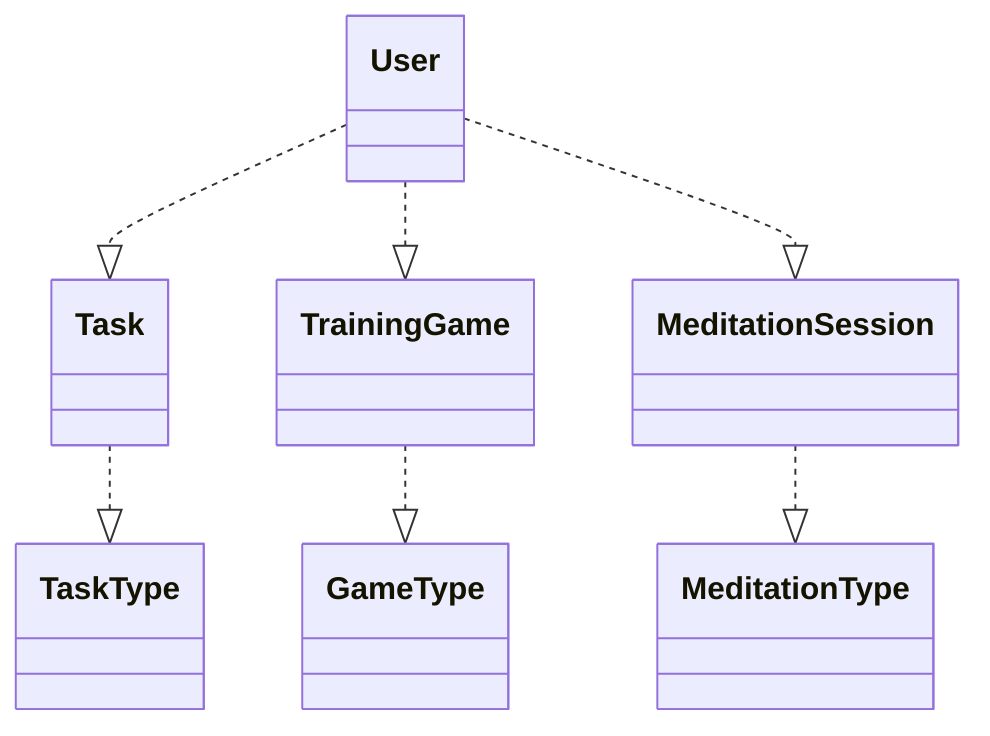
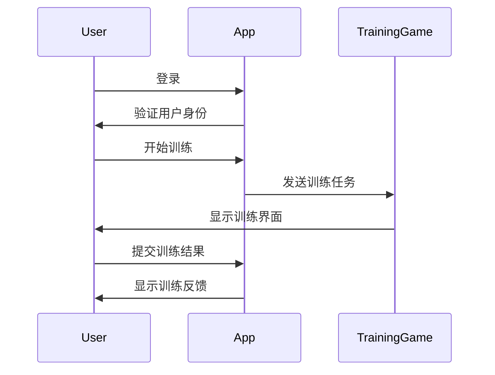
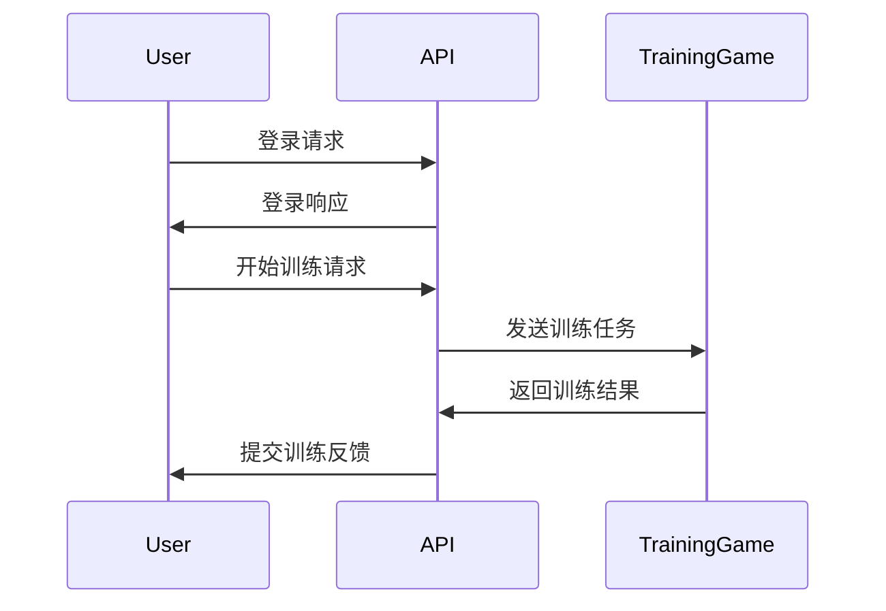

                 


# 数字注意力重塑App：提升专注力的个人训练工具

## 关键词

- 数字注意力重塑
- 个人训练工具
- 专注力提升
- 注意力管理
- 数字健康

## 摘要

随着数字化时代的来临，人们的注意力问题日益突出。数字注意力重塑App应运而生，通过科学的方法和丰富的训练工具，帮助用户提升专注力，重塑注意力模式。本文将从背景介绍、基本原理、应用场景、系统架构和实战项目等多方面，全面解析数字注意力重塑App的设计与实现，为用户提供有效提升专注力的解决方案。

### 引言与背景

#### 问题背景

在现代社会，人们越来越依赖于数字设备，如智能手机、平板电脑和电脑，这些设备不仅带来了便捷，同时也使得我们的注意力容易分散。随着互联网和社交媒体的兴起，越来越多的人面临注意力不集中、专注力下降的问题。这一问题不仅影响个人的生活质量，还可能对工作效率产生负面影响。

#### 问题描述

注意力不集中和专注力下降的原因有多种，包括多任务处理、信息过载、情绪波动等。为了解决这些问题，人们尝试了各种方法，如冥想、运动、时间管理等。然而，这些方法往往效果有限，难以长期坚持。

#### 问题解决

数字注意力重塑App的出现为解决这一问题提供了新的思路。这类App通过一系列的个人训练工具，帮助用户提高专注力，重塑注意力模式。它们利用数字技术的优势，将训练过程游戏化，使训练更加有趣且易于坚持。

#### 边界与外延

数字注意力重塑App主要关注的是通过数字技术改善人的注意力问题。它不仅涵盖了智能手机、平板电脑和电脑等数字设备，还包括相应的软件和应用程序。此外，它不仅适用于个人用户，也可以为企业、学校等提供解决方案。

#### 核心概念

##### 数字注意力重塑App

数字注意力重塑App是指一类通过数字技术，如游戏、训练任务、计时器等，帮助用户提升专注力和注意力的应用程序。

##### 个人训练工具

个人训练工具是指数字注意力重塑App中用于训练用户注意力的各种工具，如专注力训练游戏、时间管理工具、冥想练习等。

#### 概念结构与核心要素组成

数字注意力重塑App的核心要素包括：

- **训练工具**：提供各种形式的训练任务，以适应不同用户的需求。
- **用户反馈**：收集用户在训练过程中的数据，为用户提供个性化的训练建议。
- **可定制性**：根据用户的需求和进度，调整训练工具的难度和内容。

#### 主要内容概述

本部分主要介绍数字注意力重塑App的背景、核心概念和主要内容，为后续章节的详细讨论打下基础。

---

### 第一部分: 数字注意力重塑App的基本原理

#### 2.1 数字注意力重塑的原理

##### 2.1.1 注意力理论

###### 2.1.1.1 注意力的定义

$$
\text{注意力} = \frac{\text{认知资源}}{\text{信息处理能力}}
$$

###### 2.1.1.2 注意力的类型

- **选择性注意力**：关注特定的信息。
- **持续性注意力**：保持注意力的稳定。

##### 2.1.2 注意力分散的原因

- **多任务处理**：同时进行多个任务，导致注意力分散。
- **信息过载**：信息量过大，难以处理。

##### 2.1.3 数字注意力重塑的方法

- **注意力训练游戏**：通过游戏化的方式，提高用户的注意力。
- **时间管理工具**：帮助用户合理安排时间，减少注意力分散。

#### 2.2 注意力特性对比表格

| 注意力特性       | 定义                                                         | 对比                |
|------------------|--------------------------------------------------------------|---------------------|
| 选择性注意力     | 关注特定的信息                                               | 能够集中精力处理特定任务 |
| 持续性注意力     | 保持注意力的稳定                                             | 长时间保持专注状态   |
| 情绪注意力       | 根据情绪变化调整注意力                                       | 情绪波动影响专注力   |

#### 2.3 ER实体关系图

```mermaid
erDiagram
    User ||--|{ Task }|:
    User ||--|{ TrainingGame }|:
    User ||--|{ MeditationSession }|:
    Task ||--|{ TaskType }|:
    TrainingGame ||--|{ GameType }|:
    MeditationSession ||--|{ MeditationType }|:
```

---

### 第二部分: 数字注意力重塑App的应用场景

#### 3.1 应用场景一：办公环境中提高工作效率

##### 3.1.1 场景介绍

在办公室环境中，员工往往需要处理大量的工作任务，这要求他们具备较高的专注力和工作效率。数字注意力重塑App可以帮助员工在办公过程中保持专注，从而提高工作效率。

##### 3.1.2 解决方案

数字注意力重塑App可以为员工提供以下几种解决方案：

- **专注力训练游戏**：通过游戏化的方式，提高员工的专注力。
- **时间管理工具**：帮助员工合理安排工作时间，减少注意力分散。
- **冥想练习**：通过冥想练习，帮助员工放松身心，提高专注力。

---

### 第三部分: 数字注意力重塑App的系统架构

#### 4.1 系统功能设计（领域模型）



#### 4.2 系统架构设计



#### 4.3 系统接口设计和系统交互



---

### 第四部分: 项目实战

#### 5.1 环境安装

在开始项目实战之前，需要安装以下软件和工具：

- Python 3.8及以上版本
- pip 工具
- MongoDB 数据库
- Flask 框架

#### 5.2 系统核心实现源代码

以下是数字注意力重塑App的核心实现源代码：

```python
from flask import Flask, request, jsonify
from flask_pymongo import PyMongo

app = Flask(__name__)
app.config["MONGO_URI"] = "mongodb://localhost:27017/attention_app"
mongo = PyMongo(app)

@app.route("/login", methods=["POST"])
def login():
    # 登录功能实现
    pass

@app.route("/start_training", methods=["POST"])
def start_training():
    # 开始训练功能实现
    pass

@app.route("/submit_result", methods=["POST"])
def submit_result():
    # 提交训练结果功能实现
    pass

if __name__ == "__main__":
    app.run(debug=True)
```

#### 5.3 代码应用解读与分析

在代码中，我们使用了 Flask 框架来构建 Web 应用程序。通过定义几个简单的 API 路由，我们可以实现用户登录、开始训练和提交训练结果的功能。这些功能都依赖于 MongoDB 数据库来存储用户数据和训练结果。

#### 5.4 实际案例分析和详细讲解剖析

在实际应用中，用户通过登录数字注意力重塑App，可以选择不同的训练游戏和冥想练习。在训练过程中，系统会收集用户的数据，并生成训练报告，帮助用户了解自己的专注力水平和改进方法。

#### 5.5 项目小结

数字注意力重塑App项目通过科学的方法和丰富的训练工具，帮助用户提升专注力。项目实现了用户登录、开始训练和提交训练结果等功能，为用户提供了一个有效的提升专注力的工具。

---

### 第五部分：最佳实践、小结、注意事项和拓展阅读

#### 最佳实践

- **定期训练**：为了有效提升专注力，用户应定期进行训练，并坚持长期使用数字注意力重塑App。
- **个性化定制**：根据用户的专注力水平和需求，选择合适的训练工具和难度。

#### 小结

数字注意力重塑App通过一系列科学的方法和训练工具，帮助用户提升专注力，改善注意力分散的问题。通过合理使用这款应用程序，用户可以在工作和生活中更加高效地完成任务。

#### 注意事项

- **避免过度使用**：尽管数字注意力重塑App有助于提升专注力，但用户应避免过度依赖，以免造成新的注意力问题。
- **合理休息**：在训练过程中，用户应适当休息，避免长时间连续使用。

#### 拓展阅读

- [《专注力：提升专注力的科学方法》](https://book.douban.com/subject/27119469/)
- [《数字健康：科技与生活的平衡》](https://book.douban.com/subject/26774392/)
- [《注意力管理：如何集中精力，提升效率》](https://book.douban.com/subject/26756095/)

---

### 作者信息

作者：AI天才研究院/AI Genius Institute & 禅与计算机程序设计艺术 /Zen And The Art of Computer Programming

