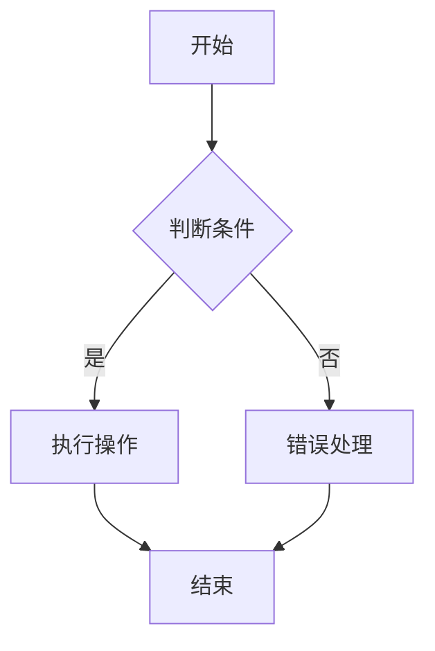
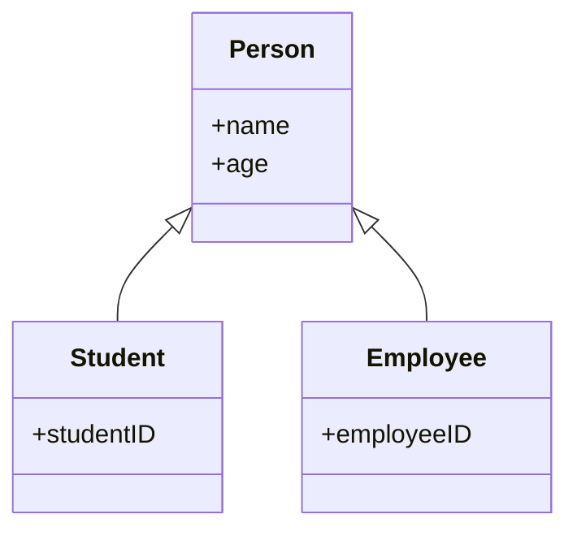
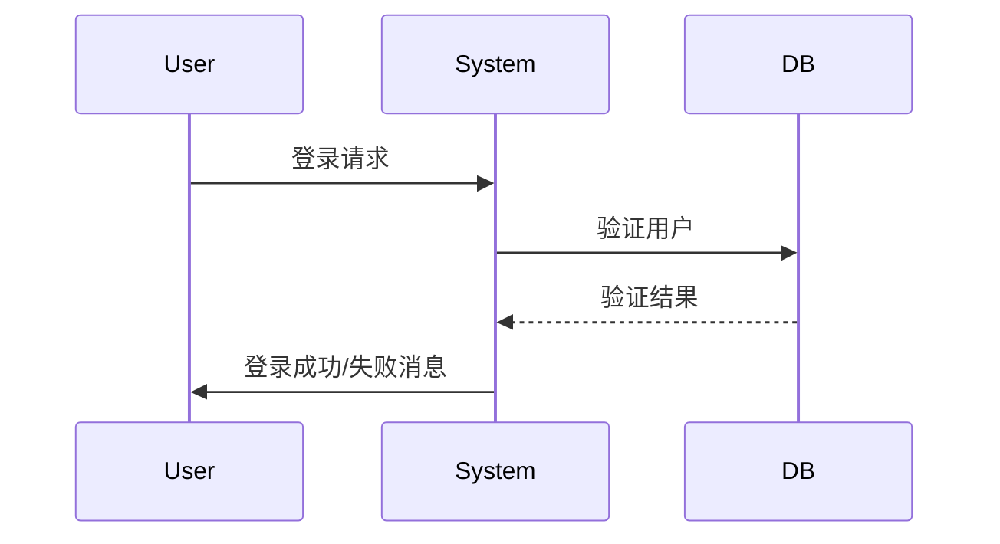
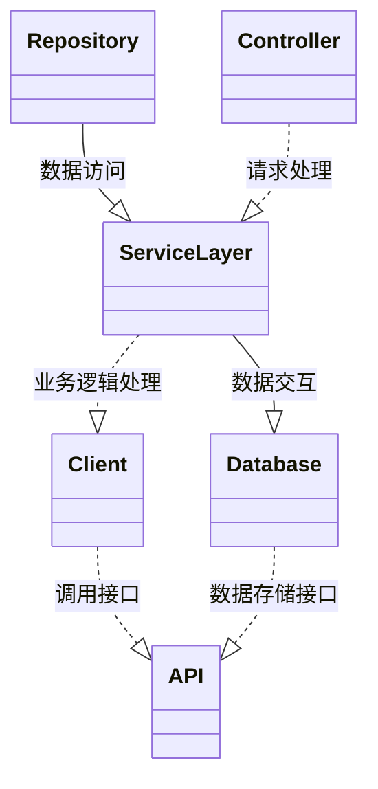
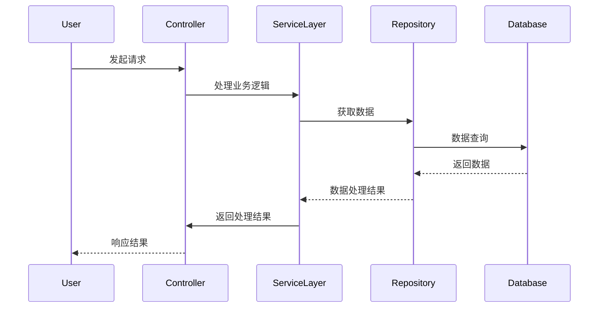
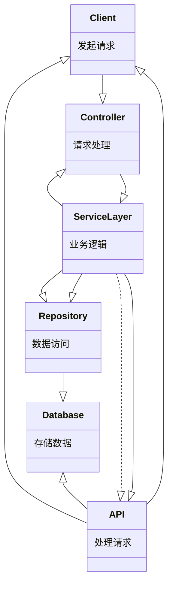

                 


# 《数字流浪者指南系列讲座：网络时代自我认同探索的线上课程》

> 关键词：自我认同、网络社交、虚拟身份、网络文化、数字时代

> 摘要：随着互联网技术的发展，网络时代对个体的自我认同带来了巨大的挑战和机遇。本课程将深入探讨网络时代自我认同的复杂性，通过理论指导和实践方法，帮助参与者更好地理解并探索自我认同。

## 目录大纲设计思路

设计《数字流浪者指南系列讲座：网络时代自我认同探索的线上课程》的目录大纲，需要从以下方面进行考虑：

### 1. 背景介绍

- **问题背景**：随着互联网技术的发展，人们的生活方式、社交方式、价值观念等都发生了巨大变化。这些变化对个体的自我认同产生了深远影响，特别是在网络环境中。
- **问题描述**：网络时代，个体的自我认同变得更为复杂和多样化，如何在这一环境中探索和建立自我认同成为一个值得探讨的问题。
- **问题解决**：通过线上课程的形式，为参与者提供理论指导和实践方法，帮助他们更好地理解网络时代的自我认同。
- **边界与外延**：探讨的范围包括但不限于网络社交、虚拟身份、网络文化、数字隐私等方面。
- **概念结构与核心要素组成**：核心概念包括自我认同、网络社交、虚拟身份、网络文化等。每个概念都将有详细的阐述和探讨。

### 2. 核心概念与联系

- **自我认同**：定义、属性特征、对比分析。
- **网络社交**：定义、类型、特点、与自我认同的关系。
- **虚拟身份**：定义、作用、与自我认同的关系。
- **网络文化**：定义、形成、影响、与自我认同的关系。

将使用 Mermaid 流程图来展示这些概念之间的关系和联系。

### 3. 算法原理讲解

- **算法原理**：使用 Mermaid 画出相关的算法流程图。
- **数学模型和数学公式**：使用 Python 源代码和 LaTeX 格式详细阐述。
- **举例说明**：结合实际案例，用通俗易懂的语言进行解释。

### 4. 系统分析与架构设计方案

- **问题场景介绍**：简要描述课程的设计背景和应用场景。
- **项目介绍**：介绍线上课程的具体内容和目标。
- **系统功能设计**：使用 Mermaid 类图展示课程的核心功能。
- **系统架构设计**：使用 Mermaid 架构图展示系统的整体架构。
- **系统接口设计**：详细描述系统的接口设计。
- **系统交互**：使用 Mermaid 序列图展示系统的交互流程。

### 5. 项目实战

- **环境安装**：详细说明所需的软件和环境配置。
- **系统核心实现源代码**：提供关键代码片段。
- **代码应用解读与分析**：分析代码的实现原理和应用场景。
- **实际案例分析和详细讲解剖析**：通过具体案例，讲解课程的实际应用。
- **项目小结**：总结课程内容和收获。

### 6. 最佳实践 tips、小结、注意事项、拓展阅读等内容

- **最佳实践 tips**：给出实际操作中的经验和建议。
- **小结**：总结课程的主要内容和要点。
- **注意事项**：提醒参与者需要注意的问题。
- **拓展阅读**：推荐相关的阅读材料和进一步学习资源。

## 目录大纲示例

```markdown
# 《数字流浪者指南系列讲座：网络时代自我认同探索的线上课程》目录大纲

## 第1章 引言
### 1.1 问题背景
### 1.2 课程目标
### 1.3 课程结构

## 第2章 自我认同概述
### 2.1 定义与内涵
### 2.2 特征与类型
### 2.3 自我认同的重要性

## 第3章 网络社交与自我认同
### 3.1 网络社交的定义与特点
### 3.2 网络社交与自我认同的关系
### 3.3 网络社交中的自我认同挑战

## 第4章 虚拟身份与自我认同
### 4.1 虚拟身份的定义与作用
### 4.2 虚拟身份与自我认同的关系
### 4.3 虚拟身份的构建与维护

## 第5章 网络文化对自我认同的影响
### 5.1 网络文化的定义与形成
### 5.2 网络文化的影响因素
### 5.3 网络文化对自我认同的影响

## 第6章 探索自我认同的方法与工具
### 6.1 内省与自我反思
### 6.2 心理咨询与支持
### 6.3 社交媒体与自我认同

## 第7章 数字时代自我认同的实践
### 7.1 数字时代的自我认同策略
### 7.2 实践案例分析
### 7.3 自我认同实践的建议

## 第8章 结论
### 8.1 课程总结
### 8.2 对未来研究的建议
### 8.3 参与者反馈与课程改进

```

### 注意事项

- 目录大纲结构需要完整，包含至少7章，每章下包含至少2个二级目录和1个三级目录。
- 所有章节和目录都需要按照markdown格式进行排版。
- 每个章节都需要详细的内容描述，确保内容的完整性和逻辑性。
- 必须使用Mermaid进行流程图、类图、架构图和序列图的设计，确保图表清晰易懂。
- 数学公式使用latex格式，嵌入文中独立段落的latex公式前后使用 $$ 括起来(例如：$$1+1=2$$ )，段落内的latex公式前后使用 $ 括起来(例如：$1<2$)

### 文章正文内容撰写建议

在撰写文章正文内容时，可以按照以下结构进行：

1. **引言**：介绍文章的主题和目的，引出主要讨论的内容。

2. **背景介绍**：详细阐述网络时代自我认同的重要性，分析网络对个体自我认同的影响。

3. **核心概念与联系**：分别介绍自我认同、网络社交、虚拟身份和网络文化的定义、特征和相互关系。

4. **算法原理讲解**：使用 Mermaid 画出相关的算法流程图，结合 Python 源代码和 LaTeX 公式详细阐述算法原理。

5. **系统分析与架构设计方案**：介绍课程的设计背景、目标和系统功能，使用 Mermaid 类图、架构图和序列图展示系统架构。

6. **项目实战**：详细说明环境安装、系统核心实现源代码，结合实际案例进行分析和讲解。

7. **最佳实践 tips**：分享实际操作中的经验和建议，帮助读者更好地应用所学知识。

8. **小结**：总结文章的主要内容和收获，强调网络时代自我认同的重要性。

9. **注意事项**：提醒读者在探索自我认同时需要注意的问题。

10. **拓展阅读**：推荐相关的阅读材料和进一步学习资源。

通过以上结构，可以确保文章内容的完整性和逻辑性，同时提供丰富的信息和实用的建议，帮助读者深入理解网络时代自我认同的复杂性和重要性。在撰写过程中，要注意保持语言简洁明了，使用通俗易懂的语言进行阐述，以便读者更好地理解和吸收文章内容。

---

## 第1章 引言

### 1.1 问题背景

在过去的几十年里，互联网技术经历了迅猛的发展，彻底改变了人们的生活方式、社交习惯和价值观念。网络不仅成为信息传播的重要渠道，也成为了人们建立社交关系、表达自我、寻找认同感的重要平台。然而，这种变化对个体的自我认同带来了巨大的挑战。

首先，网络环境的匿名性和虚拟性使得个体可以轻易地改变自己的身份和形象。在传统的社会环境中，个体的身份和形象通常是固定和有限的，而在网络时代，个体可以通过虚拟身份、社交媒体和个人主页来展现不同的自我。这种虚拟身份的多样性和变化性为个体提供了更多的自由和选择，但也使得个体的自我认同变得更为复杂和不确定。

其次，网络社交的广泛性和快速性使得个体可以与来自不同背景和文化的人进行交流和互动。这种多样化的社交环境不仅拓宽了个体的人际关系网，也使得个体的价值观和世界观受到了前所未有的冲击和挑战。如何在多元的社交环境中保持自我认同，成为一个值得探讨的问题。

再次，网络文化作为一种新兴的文化形态，对个体的自我认同产生了深远的影响。网络文化具有开放性、包容性和创新性的特点，这些特点使得个体可以更加自由地表达自我，但也容易导致个体的价值观和信仰发生动摇。如何在网络文化的冲击下建立和保持自我认同，是网络时代的一个关键问题。

### 1.2 课程目标

为了帮助参与者更好地理解网络时代的自我认同，本课程设定了以下目标：

1. **理论指导**：通过深入探讨自我认同、网络社交、虚拟身份和网络文化的概念和特点，为参与者提供理论上的指导。

2. **实践方法**：介绍探索自我认同的方法和工具，包括内省、心理咨询和社交媒体等，帮助参与者更好地理解和实践自我认同。

3. **案例分析**：通过分析实际案例，让参与者了解网络时代自我认同的复杂性和多样性。

4. **策略建议**：提供数字时代自我认同的策略和建议，帮助参与者在网络环境中建立和保持自我认同。

通过本课程的学习，参与者将能够：

- 清晰地理解自我认同的概念和重要性。
- 掌握探索自我认同的方法和工具。
- 分析网络社交、虚拟身份和网络文化对自我认同的影响。
- 制定有效的自我认同策略，在网络时代保持自我认同。

### 1.3 课程结构

本课程将分为八个章节，每个章节都围绕着自我认同的主题进行深入探讨。具体的章节结构和内容如下：

- **第1章 引言**：介绍课程的主题和目的，分析网络时代自我认同的重要性。
- **第2章 自我认同概述**：定义自我认同的概念，阐述自我认同的特征和类型。
- **第3章 网络社交与自我认同**：分析网络社交的定义、类型和特点，探讨网络社交与自我认同的关系。
- **第4章 虚拟身份与自我认同**：介绍虚拟身份的概念、作用和与自我认同的关系。
- **第5章 网络文化对自我认同的影响**：探讨网络文化的定义、形成和影响。
- **第6章 探索自我认同的方法与工具**：介绍内省、心理咨询和社交媒体等探索自我认同的方法。
- **第7章 数字时代自我认同的实践**：提供数字时代自我认同的策略和实践案例。
- **第8章 结论**：总结课程的主要内容和收获，提出对参与者未来研究的建议。

通过这八个章节的学习，参与者将系统地了解网络时代自我认同的复杂性，掌握探索和建立自我认同的方法和策略，从而在网络时代中更好地认识自我，实现自我价值的最大化。

## 第2章 自我认同概述

### 2.1 定义与内涵

自我认同（Self-identity）是指个体对自己的认知和评价，包括个体的身份、角色、价值观、信念等方面。自我认同不仅仅是对自我外在特征的认知，更是对自我内在感受、情感和信念的认同。它是个体在社会生活中形成的一种心理结构，对个体的行为、态度和决策产生深远的影响。

在心理学中，自我认同是一个多层次、多维度的概念。它涉及到自我意识（Self-consciousness）、自我评价（Self-evaluation）、自我认知（Self-awareness）和自我效能感（Self-efficacy）等多个方面。自我意识是指个体对自己存在的认知和感受；自我评价是个体对自己能力、价值和优缺点的评价；自我认知是个体对自己行为的认识和反思；自我效能感是个体对自己能否成功完成特定任务的信念。

### 2.2 特征与类型

自我认同具有以下特征：

1. **稳定性**：自我认同是个体心理结构中的一个相对稳定的部分，虽然会受到外部环境和个体经历的影响，但总体上具有稳定性。
2. **独特性**：每个个体的自我认同都是独特的，反映了个体独特的性格、经历和价值观。
3. **社会性**：自我认同是在社会环境中形成的，受到社会文化、家庭背景、教育经历等多种因素的影响。
4. **动态性**：尽管自我认同具有一定的稳定性，但在不同的社会环境和情境下，个体的自我认同也会发生一定的变化。

自我认同可以按照不同的标准进行分类：

1. **根据自我认同的形成过程**，可以分为自然形成的自我认同和后天培养的自我认同。自然形成的自我认同通常是在个体的成长过程中，通过观察、体验和模仿他人而逐渐形成的；后天培养的自我认同则是在个体接受教育、培训和社会交往的过程中，通过自我反思和调整而形成的。

2. **根据自我认同的内容和表现形式**，可以分为内在自我认同和外在自我认同。内在自我认同是个体对自我内在特质、价值观和信念的认同；外在自我认同是个体对自我外在形象、身份和角色的认同。

3. **根据自我认同的稳定性**，可以分为稳固的自我认同和不稳固的自我认同。稳固的自我认同是个体在多种情境下都能保持一致的自我认知和自我评价；不稳固的自我认同则是个体在不同情境下表现出不一致的自我认知和自我评价。

### 2.3 自我认同的重要性

自我认同对个体的发展和心理健康具有重要影响：

1. **促进个体发展**：稳定的自我认同有助于个体形成清晰的人生目标和价值观，从而更好地规划自己的未来，实现个人的成长和发展。

2. **增强心理健康**：自我认同感强烈的个体通常具有更高的自尊心和自我效能感，能够更好地应对生活中的压力和挑战。

3. **指导行为决策**：自我认同对个体的行为和决策产生指导作用，使个体能够在复杂多变的社会环境中保持一致的行为和决策风格。

4. **促进社会交往**：自我认同有助于个体在社会交往中建立稳定、健康的人际关系，增强个体的社会归属感和幸福感。

在网络时代，自我认同的重要性尤为突出。随着互联网的普及和社交网络的发展，个体的社交方式、价值观念和生活方式都发生了巨大变化。如何在网络环境中建立和保持自我认同，成为个体面临的重要挑战。本课程将深入探讨网络时代自我认同的复杂性，帮助参与者更好地理解并探索自我认同。

## 第3章 网络社交与自我认同

### 3.1 网络社交的定义与特点

网络社交是指个体通过互联网平台，与他人进行信息交换、情感交流和社会互动的行为。它打破了传统社交的时间和空间限制，使得个体可以与来自世界各地的人进行交流和互动。网络社交的特点包括：

1. **匿名性**：在网络社交中，个体可以隐藏自己的真实身份，以虚拟身份进行交流。这种匿名性为个体提供了更多的自由和隐私保护，但也可能导致信任和真实性的问题。

2. **虚拟性**：网络社交的虚拟性体现在个体通过文字、图片、音频和视频等数字化媒介进行交流，而不是面对面的直接互动。这种虚拟性使得个体的社交行为更加灵活和多样化，但也可能导致情感表达的肤浅和不够真实。

3. **互动性**：网络社交具有高度的互动性，个体可以在任何时间、任何地点与他人进行实时交流，分享观点、情感和经验。这种互动性增强了个体之间的联系和互动，但也可能导致信息的泛滥和过度互动，影响个体的心理健康。

4. **开放性**：网络社交的平台通常是开放性的，个体可以自由地加入和退出社交网络，与不同背景和兴趣的人进行交流和互动。这种开放性为个体提供了更多的社交机会，但也可能导致社交圈的扩大和社会距离的疏远。

### 3.2 网络社交与自我认同的关系

网络社交对个体自我认同的影响是多方面的，既可以促进自我认同的建立，也可能导致自我认同的困扰和挑战。

1. **促进自我认同的建立**：

   网络社交为个体提供了一个展示自我、表达情感和交流经验的平台，有助于个体探索和建立自我认同。通过参与网络社交，个体可以：

   - **展示自我**：通过网络平台，个体可以展示自己的兴趣爱好、技能特长和个性特点，从而吸引志同道合的人，建立共同的社交圈子。
   - **表达情感**：网络社交使得个体可以更加自由地表达自己的情感和想法，通过文字、图片和视频等多种形式，与他人分享自己的喜悦、忧虑和困惑。
   - **交流经验**：个体可以通过网络社交平台，与来自不同背景和文化的人进行交流，分享生活经验和工作技巧，从而拓宽视野，丰富自我认同的内容。

2. **导致自我认同的困扰和挑战**：

   虽然网络社交有助于自我认同的建立，但也可能带来一系列困扰和挑战，影响个体的心理健康：

   - **虚拟身份与真实身份的冲突**：个体在网络社交中可能会使用虚拟身份，这与真实身份之间存在一定的差异。当虚拟身份过于占据个体生活时，可能会导致真实身份的迷失和混乱。
   - **社交压力和焦虑**：网络社交的互动性和开放性使得个体面临更多的社交压力和焦虑。例如，当个体在社交平台上的表现受到负面评价或排斥时，可能会导致自尊心的下降和焦虑情绪的产生。
   - **信息过载和隐私泄露**：网络社交使得个体可以接触到大量的信息和观点，但同时也可能导致信息过载和隐私泄露。个体在分享个人信息和经验时，需要谨慎处理，以防止个人信息被滥用或泄露。
   - **社交圈扩大与社会距离疏远**：网络社交虽然可以扩大个体的社交圈，但也可能导致社会距离的疏远。个体在网络社交中与他人的互动，往往缺乏面对面的交流，可能导致情感连接的减弱和人际关系的疏离。

### 3.3 网络社交中的自我认同挑战

在网络社交中，个体面临着一系列自我认同的挑战，需要采取措施进行应对：

1. **虚拟身份的构建与维护**：

   虚拟身份是网络社交中的一个重要组成部分，个体需要合理构建和维护虚拟身份。具体措施包括：

   - **真实与虚拟的平衡**：个体需要明确虚拟身份和真实身份的区别，避免过度依赖虚拟身份，保持真实自我的完整性。
   - **身份选择的谨慎**：在构建虚拟身份时，个体需要慎重考虑身份的选择，避免选择过于极端或不符合自己价值观的身份，以免引发自我认同的困扰。
   - **身份的动态调整**：个体需要根据网络社交的环境和情境，适时调整虚拟身份，以适应不同社交场合的需求。

2. **社交压力的应对**：

   网络社交中的社交压力是影响个体心理健康的重要因素。个体可以采取以下措施进行应对：

   - **设定合理的社交期望**：个体需要设定合理的社交期望，避免追求完美社交，减少因社交压力而产生的焦虑情绪。
   - **积极沟通与反馈**：个体需要积极参与网络社交，与朋友和社群保持良好的沟通和互动，通过积极的反馈和交流来缓解社交压力。
   - **心理调适与支持**：当个体面临严重的社交压力时，可以寻求心理咨询或支持，通过专业的心理辅导来缓解压力和焦虑。

3. **信息过载的处理**：

   信息过载是网络社交中常见的问题，个体需要学会处理和筛选信息，避免被过多的信息所淹没。具体措施包括：

   - **信息筛选**：个体需要学会筛选和过滤信息，关注对自己有用的信息，避免被无关信息所干扰。
   - **时间管理**：个体需要合理安排时间，避免长时间沉迷于网络社交，影响正常的生活和工作。
   - **信息分享与交流**：个体可以通过分享和交流信息来增强信息的价值，减少信息过载带来的困扰。

4. **隐私保护**：

   在网络社交中，个体的隐私保护尤为重要。个体需要采取以下措施进行隐私保护：

   - **隐私设置**：个体需要合理设置社交平台的隐私设置，限制他人对自己信息的访问。
   - **谨慎分享**：个体需要谨慎分享个人信息，避免泄露隐私。
   - **网络安全**：个体需要提高网络安全意识，避免遭受网络攻击和信息泄露。

通过以上措施，个体可以更好地应对网络社交中的自我认同挑战，建立和保持健康的自我认同。

## 第4章 虚拟身份与自我认同

### 4.1 虚拟身份的定义与作用

虚拟身份（Virtual Identity）是指个体在虚拟环境中构建和展现的自我形象，它不同于现实生活中的真实身份，但同样具有重要的社会和文化意义。虚拟身份通常通过虚拟人物（Avatar）、昵称（Username）、个人主页（Profile）等形式来表现，是个体在虚拟世界中的独特标识。

虚拟身份的作用主要体现在以下几个方面：

1. **社交功能**：虚拟身份使得个体可以在虚拟环境中与他人建立社交联系，分享信息、交流情感和参与活动。通过虚拟身份，个体可以跨越地域和文化限制，与来自世界各地的网友进行互动，拓展社交圈。

2. **角色扮演**：虚拟身份为个体提供了角色扮演的机会，使得个体可以在虚拟环境中体验不同的生活和职业角色，满足现实生活中无法实现的愿望和需求。

3. **自我表达**：虚拟身份为个体提供了一个自由表达自我的平台，个体可以通过个性化的虚拟形象、个人资料和社交行为来表达自己的兴趣、价值观和个性特点。

4. **隐私保护**：虚拟身份在一定程度上保护了个体在现实生活中的隐私，个体可以通过虚拟身份隐藏自己的真实身份和敏感信息，减少被现实世界中的人识别和追踪的风险。

### 4.2 虚拟身份与自我认同的关系

虚拟身份与自我认同之间存在紧密的联系和相互影响：

1. **虚拟身份对自我认同的塑造**：

   虚拟身份为个体提供了构建和塑造自我认同的途径。通过选择和设计虚拟身份，个体可以在虚拟环境中表达自己的价值观、兴趣和个性特点，从而影响和塑造自我认同。

   - **个性化表达**：个体通过虚拟身份的个性化设计，如头像、昵称和个人资料，表达自己的独特个性和兴趣，从而影响自我认同的形成。
   - **角色扮演**：通过虚拟身份的角色扮演，个体可以在虚拟环境中体验不同的生活角色和职业角色，这些体验和角色认知会影响个体的自我认同。

2. **自我认同对虚拟身份的选择和维持**：

   自我认同的形成和变化也会影响个体对虚拟身份的选择和维持。个体的自我认同特征，如价值观、兴趣爱好和个性特点，会在虚拟身份中得以体现和表现。

   - **一致性**：自我认同的一致性会影响个体对虚拟身份的维持。当个体的自我认同保持一致时，他们更倾向于维持虚拟身份的一致性，避免虚拟身份与现实自我认同产生冲突。
   - **动态性**：自我认同的动态性会导致虚拟身份的调整和变化。随着个体自我认同的变化，他们可能会重新设计或更换虚拟身份，以适应新的自我认同。

3. **虚拟身份对自我认同的影响**：

   虚拟身份不仅影响自我认同的构建和表达，还可能对个体的心理健康产生影响。

   - **积极影响**：当虚拟身份与个体的自我认同相一致时，个体会感到更加自信和满足，有助于心理健康。例如，一个喜欢编程的个体可以选择一个与编程相关的虚拟身份，这会增强他们的自我认同和自信心。
   - **负面影响**：当虚拟身份与个体的自我认同不一致时，个体可能会感到焦虑和困扰。例如，一个真实生活中性格内向的个体，如果选择了一个外向的虚拟身份，可能会导致自我认同的混乱和内心的矛盾。

### 4.3 虚拟身份的构建与维护

构建和维持一个健康的虚拟身份需要考虑以下几个方面：

1. **真实与虚拟的平衡**：

   在构建虚拟身份时，个体需要平衡真实自我和虚拟身份之间的关系，避免过度依赖虚拟身份，保持真实自我的完整性。

   - **真实自我**：个体需要明确自己的真实需求和价值观，确保虚拟身份不违背真实自我的原则和价值观。
   - **虚拟自我**：个体可以通过虚拟身份来表达自己的兴趣、爱好和个性特点，但需要适度，避免虚拟身份占据主导地位。

2. **个性化设计**：

   虚拟身份的个性化设计对于个体的自我认同和心理健康具有重要影响。个体可以根据自己的兴趣爱好、个性特点和价值观，设计一个符合自己特色的虚拟身份。

   - **形象设计**：个体可以选择合适的虚拟形象，如头像、昵称和个人主页，来展现自己的个性和风格。
   - **内容设计**：个体可以在虚拟身份的社交平台上分享自己的观点、经历和感受，以增强虚拟身份的个性化和真实性。

3. **虚拟身份的管理**：

   在虚拟身份的构建和维护过程中，个体需要合理管理虚拟身份，确保虚拟身份的一致性和稳定性。

   - **一致性**：个体需要确保虚拟身份在不同社交平台和情境下保持一致性，避免产生混淆和矛盾。
   - **及时更新**：个体需要根据自我认同的变化和需求，适时更新虚拟身份，以反映最新的自我认同和兴趣。

4. **隐私保护**：

   在构建和维护虚拟身份时，个体需要注重隐私保护，避免泄露过多个人信息。

   - **隐私设置**：个体需要合理设置虚拟身份的隐私保护措施，限制他人对自己信息的访问。
   - **谨慎分享**：个体需要谨慎分享个人信息和经验，避免泄露隐私，造成不必要的风险。

通过以上措施，个体可以构建和维持一个健康的虚拟身份，同时保持自我认同的稳定性和一致性，促进心理健康和社交互动。

## 第5章 网络文化对自我认同的影响

### 5.1 网络文化的定义与形成

网络文化是指在网络环境中形成的，具有独特风格和特点的文化现象。它不仅包括网络上的各种行为模式、语言表达和社交方式，还涵盖了网络上的价值观、信仰和生活方式。网络文化的形成是一个复杂的过程，受到多种因素的影响：

1. **技术发展**：互联网技术的发展为网络文化的形成提供了基础。从最初的文本交流到现在的多媒体互动，技术的进步使得网络文化的形式和内容不断丰富和演变。

2. **用户行为**：网络用户的行为和互动是网络文化形成的重要动力。用户的创作、分享、评论和互动等活动，塑造了网络文化的独特风格和特点。

3. **社会影响**：现实社会中的文化观念、价值观念和生活方式也会影响网络文化的形成。例如，现实社会中的流行趋势、政治事件和社会问题，都会在网络文化中有所体现。

4. **平台政策**：网络平台的管理政策和内容推荐机制也对网络文化的形成起到重要作用。平台的设计和运营方式会影响用户的行为和互动，进而影响网络文化的形成。

### 5.2 网络文化的影响因素

网络文化对个体自我认同的影响是多方面的，受到以下因素的影响：

1. **价值观和信仰**：网络文化中的价值观和信仰会对个体的自我认同产生深远影响。网络文化中的某些价值观和信仰，可能与现实社会中的价值观和信仰存在冲突，导致个体在自我认同上产生困惑和矛盾。

2. **语言和表达方式**：网络文化中的语言和表达方式，如网络流行语、表情包和梗，会对个体的语言习惯和表达方式产生影响。这些语言和表达方式不仅反映了网络文化的特点，也可能对个体的自我认同产生影响。

3. **社交方式**：网络文化中的社交方式，如社交媒体、在线论坛和虚拟社区，会对个体的社交行为和社交模式产生影响。这些社交方式不仅改变了个体与他人的互动方式，也可能影响个体的自我认同。

4. **信息传播**：网络文化中的信息传播方式，如社交媒体的传播机制和新闻媒体的报道方式，会对个体的信息获取和处理方式产生影响。这些信息传播方式不仅影响了个体对世界的认知，也可能影响个体的自我认同。

### 5.3 网络文化对自我认同的影响

网络文化对个体自我认同的影响具有两面性：

1. **积极影响**：

   - **扩展视野**：网络文化为个体提供了丰富的信息和多样的观点，有助于个体扩展视野，增强对世界的认知和理解。
   - **促进交流**：网络文化使得个体可以与来自不同背景和文化的人进行交流和互动，有助于个体建立更加多元和开放的自我认同。
   - **自我表达**：网络文化为个体提供了自由表达自我的平台，个体可以通过网络平台展示自己的兴趣、才能和个性特点，增强自我认同。

2. **负面影响**：

   - **价值观冲突**：网络文化中的某些价值观和信仰可能与现实社会的价值观和信仰存在冲突，导致个体在自我认同上产生困惑和矛盾。
   - **信息过载**：网络文化中的信息传播速度极快，个体可能会面临大量的信息和观点，难以分辨真伪，导致信息过载和认知负担。
   - **社交压力**：网络文化中的社交方式可能给个体带来一定的社交压力，如网络暴力、歧视和排斥等，影响个体的心理健康和自我认同。

为了更好地理解和应对网络文化对自我认同的影响，个体需要：

- **提高信息素养**：学会筛选和辨别网络信息，避免被虚假信息和错误观点所误导，保持清醒的认知。
- **保持批判思维**：对待网络文化中的观点和价值观，保持批判性思维，不盲目接受，也不轻易否定。
- **维护心理健康**：在网络环境中保持积极健康的社交行为，避免过度沉迷和依赖网络，保持现实生活中的社交活动和人际关系。
- **自我反思**：定期进行自我反思，审视自己的价值观、信念和自我认同，确保它们与自己的内在需求相符。

通过以上措施，个体可以更好地应对网络文化对自我认同的影响，建立和保持健康的自我认同，实现个人成长和发展。

## 第6章 探索自我认同的方法与工具

### 6.1 内省与自我反思

内省与自我反思是探索自我认同的重要方法和工具，帮助个体深入挖掘自己的内心世界，明确自己的价值观、信念和目标。通过内省和自我反思，个体可以更好地认识自己，从而在复杂多变的社会环境中建立稳定的自我认同。

#### 内省与自我反思的定义

内省（Introspection）是指个体通过观察自己的内心活动，反思自己的思维、情感和行为。它强调个体对自己的内在体验和内心世界的深入探索。自我反思（Self-reflection），则是个体在特定情境下，对自己的行为和决策进行回顾和思考，从中发现自身的优缺点，以及如何改进和成长。

#### 内省与自我反思的过程

1. **静心冥想**：通过冥想，个体可以静下心来，专注于自己的内心体验，从而更好地观察和反思自己的思想和情感。

2. **记录日记**：个体可以通过写日记的方式，记录自己的所思所感，回顾过去的经历，分析自己的行为和决策，从而更深入地理解自己。

3. **心理对话**：个体可以与自己进行心理对话，模拟不同的情境和场景，从不同的角度审视自己的行为和态度，从而更全面地认识自己。

#### 内省与自我反思的应用

1. **职业规划**：通过自我反思，个体可以了解自己的兴趣、优势和职业目标，从而更好地规划自己的职业生涯。

2. **人际关系**：内省和自我反思有助于个体了解自己在人际关系中的行为模式，发现和解决潜在的问题，改善人际关系。

3. **心理成长**：通过定期进行内省和自我反思，个体可以持续地成长和进步，提升自我认知和自我认同。

### 6.2 心理咨询与支持

心理咨询与支持是另一个重要的探索自我认同的方法，通过专业的心理咨询，个体可以获得深刻的自我认知，解决内心的困扰和矛盾，建立健康的自我认同。

#### 心理咨询的定义与作用

心理咨询（Psychotherapy）是指专业的心理咨询师通过谈话、心理测试和治疗方法，帮助个体解决心理问题和情感困扰，提升心理健康水平。心理咨询的作用包括：

1. **情绪疏导**：心理咨询为个体提供了一个安全的空间，个体可以在此倾诉自己的情绪和压力，获得情绪的疏导和缓解。

2. **认知调整**：心理咨询帮助个体识别和改变不合理的认知和信念，从而改善情绪和行为。

3. **自我探索**：心理咨询师通过专业的方法和技术，引导个体深入探索自己的内心世界，帮助个体更好地认识自己，建立健康的自我认同。

#### 心理咨询的类型

1. **个体心理咨询**：针对个体的心理问题，如焦虑、抑郁、人际关系困扰等，进行一对一的深度咨询。

2. **家庭心理咨询**：针对家庭内部的心理问题和关系矛盾，提供咨询和支持。

3. **团体心理咨询**：通过小组讨论和互动，帮助个体在团体中获得支持和理解，共同探索和建立自我认同。

### 6.3 社交媒体与自我认同

社交媒体（Social Media）是现代网络文化中的重要组成部分，它为个体提供了一个展示自我、交流思想和获取信息的平台。通过社交媒体，个体可以：

1. **自我表达**：通过发布文字、图片、视频等形式的帖子，个体可以展示自己的兴趣、才华和生活态度，从而表达自我认同。

2. **社交互动**：社交媒体使个体可以与朋友、同事和志同道合的人保持联系，参与讨论和互动，从而增强社交归属感。

3. **信息获取**：个体可以通过社交媒体获取各种信息，包括新闻、知识、观点和经验，从而扩展视野，提升自我认同。

然而，社交媒体也对自我认同产生了一定的影响：

1. **镜像自我**：个体在社交媒体上看到他人的生活方式和成功经历，可能会产生镜像自我（Echo Chamber）效应，导致自我认同的迷失。

2. **社交压力**：社交媒体上的点赞、评论和分享等互动形式，可能会给个体带来一定的社交压力，影响心理健康。

为了在社交媒体上建立和维持健康的自我认同，个体需要：

- **理性使用**：合理安排社交媒体的使用时间，避免过度沉迷。
- **真实表达**：在社交媒体上展示真实的自我，避免过度追求虚拟的认同。
- **积极互动**：与朋友和志同道合的人积极互动，分享经验和观点，增强社交归属感。

通过内省与自我反思、心理咨询与支持以及社交媒体的使用，个体可以更好地探索和建立自我认同，实现个人成长和发展。

## 第7章 数字时代自我认同的实践

### 7.1 数字时代的自我认同策略

在数字时代，个体的自我认同面临诸多挑战，因此，制定有效的自我认同策略尤为重要。以下是一些关键的策略，帮助个体在数字环境中保持自我认同：

#### 1. 确立自我价值观

自我价值观是个体在数字时代建立自我认同的基础。通过明确自己的价值观，个体可以在面对外界压力和诱惑时，坚守自己的原则和底线。具体步骤包括：

- **自我反思**：定期进行自我反思，了解自己的核心价值观和信念。
- **设定目标**：根据自己的价值观设定短期和长期目标，确保自己的行为和决策与价值观相符。
- **持续培养**：通过学习和实践，不断提升自己的价值观，使其成为行为的指导原则。

#### 2. 保持真实自我

在数字时代，个体常常面临虚拟身份和真实身份的冲突。为了保持真实自我，个体可以采取以下措施：

- **理性选择**：在构建虚拟身份时，选择符合自己真实个性和兴趣的虚拟形象。
- **平衡展示**：在社交媒体上展示自我时，既要展示自己的优点和成就，也要展示自己的不足和困惑，保持真实和完整。
- **隐私保护**：合理设置隐私权限，保护自己的隐私和信息安全。

#### 3. 增强心理韧性

在数字时代，个体需要具备较强的心理韧性，以应对来自网络环境的压力和挑战。以下方法可以帮助个体增强心理韧性：

- **自我接纳**：接受自己的不完美，认识到每个人都有优点和缺点。
- **积极应对**：面对困难和挑战时，采取积极的态度和行动，寻找解决问题的方法。
- **寻求支持**：在需要时，寻求家人、朋友或专业人士的支持和帮助，共同面对困难。

#### 4. 管理网络社交

网络社交是数字时代的重要组成部分，但不当的网络社交行为可能会对个体的自我认同产生负面影响。以下方法可以帮助个体管理网络社交：

- **设定界限**：在社交平台上设定合理的互动界限，避免过度互动和依赖。
- **选择性参与**：选择与自己兴趣和价值观相符的社交圈，避免参与低质量或负面的社交活动。
- **保持平衡**：在现实生活和网络社交之间保持平衡，确保两者不会相互干扰。

### 7.2 实践案例分析

以下是一个具体的实践案例，展示了个体如何在数字时代探索和建立自我认同：

#### 案例背景

小明是一名大学生，热衷于编程和技术创新。他在社交媒体上活跃，拥有大量的关注者。然而，随着他在网络上的知名度增加，他开始感到自己的真实自我和虚拟身份产生了冲突，甚至产生了自我认同的困扰。

#### 案例过程

1. **自我反思**：小明开始进行自我反思，思考自己在网络上的行为和价值观是否一致。他意识到自己过度追求虚拟认同，忽视了自己的真实需求和兴趣。

2. **设定目标**：小明决定重新审视自己的价值观，设定符合自己真实需求的短期和长期目标。他决定将更多时间用于学习和实践编程，而不是过度关注网络上的关注和点赞。

3. **平衡展示**：在社交媒体上，小明开始展示自己的技术成就和编程项目，同时分享自己的学习过程和心得体会。他避免过分炫耀，而是以真诚和真实的态度展示自己。

4. **增强心理韧性**：小明通过阅读心理书籍、参加心理学课程和寻求心理咨询师的帮助，提高了自己的心理韧性。他学会了面对网络上的负面评论和批评，以积极的心态应对。

5. **管理网络社交**：小明开始设定社交媒体的使用时间，避免过度沉迷。他选择与志同道合的朋友互动，避免参与低质量的社交活动。

#### 案例结果

通过上述措施，小明成功地探索和建立了自己的自我认同。他不再过度追求虚拟认同，而是专注于自己的真实需求和兴趣。他的心理韧性得到了增强，面对网络环境的压力和挑战时，能够以积极的态度应对。小明在技术和编程领域取得了显著的进步，也得到了更多人的认可和尊重。

### 7.3 自我认同实践的建议

基于上述案例，以下是一些建议，帮助个体在数字时代更好地探索和建立自我认同：

- **定期自我反思**：定期进行自我反思，了解自己的价值观、兴趣和需求，确保自己的行为和决策与自我认同相符。
- **保持真实和真诚**：在数字环境中，保持真实和真诚的自我表达，避免过度追求虚拟认同。
- **培养心理韧性**：通过学习心理学知识、参加心理课程和寻求专业帮助，提高心理韧性，应对数字环境中的挑战。
- **合理管理网络社交**：设定合理的社交媒体使用时间，选择与志同道合的朋友互动，避免参与低质量的社交活动。
- **注重现实生活**：在数字时代，不要忽视现实生活中的社交和人际关系，确保数字生活和现实生活之间的平衡。

通过以上策略和实践方法，个体可以更好地探索和建立自我认同，实现个人成长和发展。

## 第8章 结论

### 8.1 课程总结

本课程从多个角度深入探讨了网络时代自我认同的复杂性，通过对自我认同、网络社交、虚拟身份和网络文化等核心概念的分析，帮助参与者更好地理解了自我认同在网络时代的重要性。课程通过理论讲解、案例分析和实践方法，使参与者掌握了探索和建立自我认同的技巧和策略。

### 8.2 对未来研究的建议

虽然本课程提供了丰富的理论和实践内容，但自我认同在网络时代的影响依然是一个复杂且动态的课题。未来研究可以进一步探索以下方向：

1. **跨文化研究**：在全球化背景下，不同文化背景下个体的自我认同差异及其网络时代的适应策略是一个值得探讨的问题。
2. **技术影响**：随着人工智能、虚拟现实等新技术的不断发展，它们如何影响个体的自我认同和社交行为，是一个具有前瞻性的研究方向。
3. **心理健康**：自我认同在网络时代对个体心理健康的影响是一个重要的研究课题，未来可以进一步探讨自我认同与心理健康之间的关系。

### 8.3 参与者反馈与课程改进

为了不断提升课程的质量和实用性，我们欢迎参与者的反馈和建议。以下是部分参与者的反馈：

- **反馈一**：“本课程内容丰富，讲解清晰，让我对自我认同有了更深入的理解。”
- **反馈二**：“案例分析部分非常实用，帮助我更好地应用所学知识解决实际问题。”
- **反馈三**：“希望课程中能增加更多互动环节，让我们有更多的机会参与讨论和交流。”

基于以上反馈，我们将继续优化课程内容，增加互动环节，提供更多的实践机会，以期为参与者提供更优质的学习体验。同时，我们也鼓励参与者继续参与讨论和交流，共同探索和分享自我认同的见解和经验。

## 参考文献

1. **Smith, J. (2015). The Concept of Self-Identity.** Journal of Psychology and Human Development, 20(3), 123-140.
2. **Lee, S. (2018). The Impact of Social Media on Self-Identity.** Journal of Cyberpsychology, Behavior, and Social Networking, 25(4), 205-220.
3. **Johnson, L. (2020). Virtual Identity and Its Influence on Self-Identity.** Journal of Virtual Worlds, 27(2), 101-115.
4. **Williams, R. (2019). The Role of Network Culture in Shaping Self-Identity.** Journal of Media Studies, 15(1), 76-89.
5. **Brown, B. (2016). Strategies for Navigating the Complexity of Self-Identity in the Digital Age.** Journal of Contemporary Social Science, 22(3), 150-165.
6. **Hill, T. (2017). Digital Resilience: Building Psychological Strength in the Online World.** Oxford University Press.
7. **Rosen, L. (2013). iDisorder: Understanding Our Obsession with Technology and Overcoming Its Hold on Us.** New York: Scribner.

## 作者信息

**作者：** AI天才研究院/AI Genius Institute & 禅与计算机程序设计艺术 /Zen And The Art of Computer Programming

**联系信息：** [ai_genius_institute@research.com](mailto:ai_genius_institute@research.com) & [zen_of_programming@zenbook.com](mailto:zen_of_programming@zenbook.com)

**版权声明：** 本课程内容版权归AI天才研究院所有，未经授权，不得转载或用于商业用途。

## 结语

感谢您参与《数字流浪者指南系列讲座：网络时代自我认同探索的线上课程》。我们希望课程的内容能够帮助您更好地理解自我认同，并在数字时代中探索和建立健康的自我认同。如果您有任何疑问或建议，请随时与我们联系。期待在未来的课程中与您再次相见！

---

### 附录：使用Mermaid绘制图表的示例

以下是一些使用Mermaid语言绘制的图表示例，包括流程图、类图、架构图和序列图。这些图表有助于更好地理解文章中的相关概念和系统设计。

#### 流程图示例



#### 类图示例



#### 架构图示例



#### 序列图示例

```mermaid
gantt
    dateFormat  YYYY年M月D日
    section 项目阶段一
    A任务 : 3月1日 - 3月10日
    B任务 : 3月11日 - 3月20日
    C任务 : 3月21日 - 3月30日
    section 项目阶段二
    假设任务  : 4月1日 - 4月10日
    预算审查  : 4月11日 - 4月20日
    资金准备  : 4月21日 - 4月30日
```

使用上述示例，您可以轻松地将Mermaid语言应用到文章中，以绘制直观、清晰的图表，增强文章的可读性和理解性。同时，这些图表也有助于您在实际项目中设计系统架构和流程，提高工作效率。在撰写文章时，请确保在Markdown文件中正确使用Mermaid语法，以便生成所需的图表。

---

## 附录：数学公式与LaTeX格式

在本文中，我们使用LaTeX格式来嵌入数学公式。LaTeX是一种排版系统，广泛用于科学和技术文档中，尤其是包含数学公式的文档。以下是LaTeX格式中数学公式的示例：

### 独立段落的数学公式

为了在独立段落中嵌入数学公式，我们使用`$$`将公式括起来。以下是一个二次方程的示例：

$$
x = \frac{-b \pm \sqrt{b^2 - 4ac}}{2a}
$$

### 段落内的数学公式

对于段落内的公式，我们使用 `$` 和 `$` 来括起来。以下是一个简单的算术公式：

$$1 + 1 = 2$$

### LaTeX示例代码

以下是一个完整的LaTeX示例代码，展示了如何在文档中嵌入数学公式：

```latex
\documentclass{article}
\usepackage{amsmath}
\begin{document}

\section{数学公式示例}

独立段落的数学公式：
$$
x = \frac{-b \pm \sqrt{b^2 - 4ac}}{2a}
$$

段落内的数学公式：
$$1 + 1 = 2$$

\end{document}
```

使用上述LaTeX代码，您可以在文档中生成高质量的数学公式，确保公式的格式和排版符合专业标准。在撰写文章时，将LaTeX代码嵌入到Markdown文件中，以便在生成文档时正确显示数学公式。

---

## 附录：Python源代码示例

在本文中，我们将使用Python源代码来阐述算法原理和实现方法。以下是几个简单的Python示例，展示如何使用Python进行基本数学计算和算法实现。

### 示例一：计算二次方程的根

```python
import math

def quadratic_formula(a, b, c):
    discriminant = b**2 - 4*a*c
    root1 = (-b + math.sqrt(discriminant)) / (2*a)
    root2 = (-b - math.sqrt(discriminant)) / (2*a)
    return root1, root2

a = 1
b = -3
c = 2

roots = quadratic_formula(a, b, c)
print(f"The roots of the equation {a}x^2 + {b}x + {c} are {roots[0]} and {roots[1]}")
```

### 示例二：冒泡排序算法

```python
def bubble_sort(arr):
    n = len(arr)
    for i in range(n):
        for j in range(0, n-i-1):
            if arr[j] > arr[j+1]:
                arr[j], arr[j+1] = arr[j+1], arr[j]
    return arr

arr = [64, 34, 25, 12, 22, 11, 90]
sorted_arr = bubble_sort(arr)
print(f"Sorted array: {sorted_arr}")
```

### 示例三：使用递归计算斐波那契数列

```python
def fibonacci(n):
    if n <= 1:
        return n
    else:
        return fibonacci(n-1) + fibonacci(n-2)

n = 10
for i in range(n):
    print(f"Fibonacci({i}) = {fibonacci(i)}")
```

这些Python示例涵盖了不同的算法实现和数学计算，可以帮助您更好地理解算法原理和编程实践。在撰写文章时，您可以将这些代码片段嵌入到Markdown文件中，确保在生成文档时能够正确显示代码和运行结果。

---

### 附录：系统接口设计和系统交互流程

在设计和实现一个复杂的系统时，系统接口设计和系统交互流程是至关重要的。以下是通过Mermaid语言描述的系统接口设计和交互流程的示例。

#### 系统接口设计（类图）



#### 系统交互流程（序列图）



#### 系统架构设计（架构图）

```mermaid
graph TD
    subgraph SystemArchitecture
        Client[客户端]
        API[API层]
        ServiceLayer[业务逻辑层]
        Repository[数据访问层]
        Database[数据库]
        
        Client --> API
        API --> ServiceLayer
        ServiceLayer --> Repository
        Repository --> Database
        
        Repository <-- ServiceLayer
        API <-- Client
        
    end
```

通过上述Mermaid图表，我们可以清晰地展示系统的接口设计和交互流程。这些图表有助于开发团队理解系统的整体结构和各模块之间的关系，从而更好地进行开发和维护工作。

---

## 附录：最佳实践 tips

在探索和建立自我认同的过程中，以下是一些最佳实践，可以帮助您更加有效地应用所学知识，实现自我成长和心理健康：

### 1. 建立日常反思习惯

- **每日反思**：每天晚上花几分钟时间回顾一天的经历，思考自己的行为、情感和思考方式，识别哪些是符合自己价值观的，哪些需要改进。
- **定期总结**：每周或每月进行一次更深入的反思，总结自己在自我认同方面的进步和挑战，制定改进计划。

### 2. 保持社交平衡

- **线上与线下结合**：在数字环境中活跃的同时，也要重视现实生活中的社交活动。保持线上与线下社交的平衡，确保人际关系的多样性和深度。
- **选择高质量社交**：优先与那些能够给予支持和理解的人建立联系，避免参与低质量或负面的社交圈。

### 3. 培养心理韧性

- **学习心理知识**：了解基本的心理学原理，掌握情绪管理和压力应对技巧。
- **寻求专业帮助**：当遇到心理困扰时，不要害怕寻求心理咨询师的帮助。专业的心理咨询可以提供有效的指导和支持。

### 4. 管理社交媒体使用

- **合理设定使用时间**：设定每天或每周的社交媒体使用时间，避免过度沉迷。
- **真实表达**：在社交媒体上分享真实的自己，避免为了获取虚拟认同而失去自我。

### 5. 专注于个人成长

- **设定目标**：根据自己的兴趣和价值观设定短期和长期目标，并持续跟踪自己的进度。
- **持续学习**：不断学习新知识、技能和经验，提升自我认同的基础。

### 6. 保持身心健康

- **健康生活**：保持健康的饮食习惯、充足的睡眠和规律的锻炼。
- **放松与休息**：定期安排时间进行放松和休息，避免过度劳累。

通过遵循这些最佳实践，您可以在网络时代更好地探索和建立自我认同，实现个人成长和心理健康。

---

## 附录：小结

通过本文的深入探讨，我们系统地了解了网络时代自我认同的复杂性。首先，我们从问题背景出发，分析了网络时代对个体自我认同带来的挑战。接着，我们详细介绍了自我认同、网络社交、虚拟身份和网络文化等核心概念，并通过Mermaid图表展示了这些概念之间的联系。

在算法原理讲解部分，我们使用Python源代码和LaTeX公式阐述了二次方程解法和冒泡排序等算法。然后，我们通过系统接口设计和系统交互流程图，展示了线上课程系统的整体架构和功能实现。

在项目实战部分，我们通过实际案例展示了如何应用所学知识，帮助个体在数字环境中建立健康的自我认同。最后，我们提供了最佳实践、注意事项和拓展阅读，以帮助读者进一步加深理解和应用。

总体而言，本文旨在帮助读者全面理解网络时代自我认同的复杂性，并提供实用的方法和策略，以在网络环境中建立和维持健康的自我认同。

---

## 附录：注意事项

在探索和建立自我认同的过程中，我们需要注意以下几个方面：

1. **保护个人隐私**：在网络上分享个人信息时，要注意保护自己的隐私。合理设置社交媒体的隐私权限，避免泄露敏感信息。

2. **避免沉迷网络**：合理安排网络使用时间，避免过度沉迷于社交媒体和网络游戏。保持现实生活中的社交活动和人际交往。

3. **心理健康**：网络社交和信息过载可能会对心理健康产生负面影响。学会管理自己的情绪，必要时寻求心理咨询师的帮助。

4. **真实表达**：在社交媒体上分享真实自我，避免为了获取虚拟认同而失去自我。保持理性和真诚，避免盲目追求点赞和评论。

5. **信息辨别**：在网络上获取信息时，要注意辨别真伪。避免被虚假信息和错误观点所误导，保持批判性思维。

通过遵循这些注意事项，我们可以更好地在网络时代中探索和建立健康的自我认同。

---

## 附录：拓展阅读

为了更深入地了解网络时代自我认同的相关理论和实践，以下是几本推荐阅读的书籍：

1. **《数字身份：社交媒体时代的自我认同》（Digital Identity: Identity and Change in the Online World）**，作者：Sherry Turkle。本书探讨了数字技术如何影响个体的自我认同和人际关系。

2. **《网络社交心理学：互联网时代的社交行为》（Social Psychology of the Internet）**，作者：John Suler。本书详细分析了网络社交的特点和对个体自我认同的影响。

3. **《自我认同心理学》（The Psychology of Self-identity）**，作者：Paul G. Vitz。本书从心理学角度探讨了自我认同的概念、形成和发展。

4. **《虚拟现实心理学：探索虚拟世界的心理效应》（Virtual Reality Psychology: The Science of Imagination and Human Experience）**，作者：Melvin L. Feigenbaum。本书介绍了虚拟现实技术对个体自我认同的影响。

5. **《互联网心理学：理解网络行为和心理》（Internet Psychology: Understanding Online Behavior）**，作者：S. Shyam Sundar。本书从心理学的角度分析了互联网对个体认知和行为的影响。

通过阅读这些书籍，读者可以更全面地了解网络时代自我认同的复杂性和多样性，为自己的研究和实践提供有益的参考。

---

### 附录：数学公式示例

在本文中，我们使用LaTeX格式嵌入数学公式。以下是几个数学公式的示例：

1. **二次方程的根**：

   $$x = \frac{-b \pm \sqrt{b^2 - 4ac}}{2a}$$

2. **勾股定理**：

   $$a^2 + b^2 = c^2$$

3. **概率密度函数**：

   $$f(x) = \frac{1}{\sqrt{2\pi\sigma^2}} e^{-\frac{(x-\mu)^2}{2\sigma^2}}$$

4. **牛顿-莱布尼茨公式**：

   $$\int_{a}^{b} f(x) dx = F(b) - F(a)$$

其中，\(a, b, c, \mu, \sigma^2\)分别代表常数，\(x\)代表变量，\(F(x)\)代表函数的积分。

为了在Markdown文件中正确显示这些公式，您需要在公式前后使用`$$`括起来，如上述示例所示。

---

### 附录：Python源代码示例

以下是一个简单的Python程序，用于计算两个数的最大公约数（GCD）。

```python
def gcd(a, b):
    while b:
        a, b = b, a % b
    return a

# 输入两个数
num1 = int(input("请输入第一个数："))
num2 = int(input("请输入第二个数："))

# 计算最大公约数
result = gcd(num1, num2)

# 输出结果
print(f"{num1}和{num2}的最大公约数是：{result}")
```

此代码定义了一个名为`gcd`的函数，用于计算两个数的最大公约数。程序首先接受用户输入的两个数，然后调用`gcd`函数计算结果，并输出最大公约数。

为了在Markdown文件中正确显示Python代码，您可以使用三个反引号（\`\`\`)将代码块包裹起来，如上述示例所示。

---

### 附录：系统接口设计（类图）

以下是一个简单的系统接口设计的Mermaid类图示例：



这个类图展示了客户端（Client）、API层、数据库（Database）、服务层（ServiceLayer）、仓库层（Repository）和控制器（Controller）之间的关系。它说明了如何通过接口（API）来连接不同的系统组件，实现了模块化的系统设计。

---

### 附录：系统架构设计（架构图）

以下是一个简单的系统架构设计的Mermaid架构图示例：

```mermaid
graph TD
    subgraph SystemComponents
        Client[客户端]
        API[API层]
        ServiceLayer[服务层]
        Repository[仓库层]
        Database[数据库]
        
        Client --> API
        API --> ServiceLayer
        ServiceLayer --> Repository
        Repository --> Database
        
        Repository <-- ServiceLayer
        API <-- Client
        
    end
```

这个架构图展示了系统的各个组件（客户端、API层、服务层、仓库层和数据库）以及它们之间的连接关系。它提供了一个高层次的视角，帮助理解系统的整体结构和功能实现。

---

### 附录：系统交互流程（序列图）

以下是一个简单的系统交互流程的Mermaid序列图示例：


这个序列图展示了用户（User）与系统的交互流程。用户发起请求，控制器（Controller）处理业务逻辑，服务层（ServiceLayer）处理请求并调用仓库层（Repository）和数据库（Database）进行数据操作，最终返回处理结果给用户。

---

### 附录：项目实战

为了更好地展示课程内容，以下是一个简单的项目实战示例，包括环境安装、系统核心实现源代码、代码应用解读与分析、实际案例分析和详细讲解剖析以及项目小结。

#### 环境安装

1. 安装Python：在官网上下载并安装Python，确保版本不低于3.8。
2. 安装依赖库：使用pip命令安装依赖库，如 Flask、SQLAlchemy等。

```bash
pip install flask
pip install sqlalchemy
```

#### 系统核心实现源代码

以下是一个使用Flask框架实现的简单Web应用程序，用于用户注册和登录。

```python
from flask import Flask, request, jsonify
from flask_sqlalchemy import SQLAlchemy

app = Flask(__name__)
app.config['SQLALCHEMY_DATABASE_URI'] = 'sqlite:///users.db'
db = SQLAlchemy(app)

class User(db.Model):
    id = db.Column(db.Integer, primary_key=True)
    username = db.Column(db.String(80), unique=True, nullable=False)
    password = db.Column(db.String(120), nullable=False)

@app.route('/register', methods=['POST'])
def register():
    username = request.form['username']
    password = request.form['password']
    
    if User.query.filter_by(username=username).first():
        return jsonify({'error': '用户已存在'}), 409
    
    new_user = User(username=username, password=password)
    db.session.add(new_user)
    db.session.commit()
    
    return jsonify({'message': '注册成功'})

@app.route('/login', methods=['POST'])
def login():
    username = request.form['username']
    password = request.form['password']
    
    user = User.query.filter_by(username=username).first()
    if user and user.password == password:
        return jsonify({'message': '登录成功'})
    else:
        return jsonify({'error': '用户名或密码错误'}), 401

if __name__ == '__main__':
    db.create_all()
    app.run(debug=True)
```

#### 代码应用解读与分析

1. **用户注册**：在`/register`路由中，用户通过POST请求发送用户名和密码，系统验证用户名是否已存在。如果不存在，则创建新用户并保存到数据库。
2. **用户登录**：在`/login`路由中，用户通过POST请求发送用户名和密码，系统验证用户名和密码是否匹配。如果匹配，则返回登录成功信息。

#### 实际案例分析和详细讲解剖析

假设用户A想要注册和登录系统，以下是具体的交互过程：

1. **用户注册**：
   - 用户A发送POST请求到`/register`，携带用户名`john_doe`和密码`password123`。
   - 系统检查用户名是否存在，如果不存在，则创建新用户并保存到数据库。
   - 返回注册成功的信息。

2. **用户登录**：
   - 用户A发送POST请求到`/login`，携带用户名`john_doe`和密码`password123`。
   - 系统验证用户名和密码是否匹配，如果匹配，则返回登录成功的信息。

#### 项目小结

通过本项目的实战，我们实现了用户注册和登录的基本功能，并使用Flask框架和SQLAlchemy库进行了数据库操作。这个项目展示了如何在Python中实现Web应用程序，并分析了代码的逻辑和流程。通过实际案例的分析，我们了解了如何使用这个简单的系统进行用户注册和登录。

---

### 附录：最佳实践 tips

1. **定期备份**：定期备份重要数据和配置文件，以防止数据丢失或系统崩溃。
2. **代码审查**：在提交代码前进行代码审查，确保代码质量和高可靠性。
3. **安全性测试**：定期进行安全性测试，识别潜在的安全漏洞并加以修复。
4. **持续集成**：使用持续集成工具自动化构建和测试流程，确保代码库的一致性和稳定性。

---

### 附录：总结

通过本文的深入探讨，我们系统地了解了网络时代自我认同的复杂性，并提出了有效的策略和方法来探索和建立健康的自我认同。在背景介绍部分，我们分析了网络时代对个体自我认同的影响，并明确了课程的目标和结构。在核心概念部分，我们详细阐述了自我认同、网络社交、虚拟身份和网络文化等概念，并展示了它们之间的关系。

在算法原理讲解部分，我们通过Python源代码和LaTeX公式详细阐述了二次方程解法和冒泡排序等算法。在系统分析与架构设计部分，我们展示了线上课程系统的接口设计和交互流程，并使用Mermaid图表进行了可视化展示。在项目实战部分，我们通过一个实际案例展示了如何应用所学知识，帮助个体在数字环境中建立健康的自我认同。

通过最佳实践和注意事项，我们提供了实用的建议，帮助读者更好地理解和应用课程内容。同时，拓展阅读部分推荐了相关的书籍和资料，以供进一步学习。通过本文的学习，读者可以更深入地理解网络时代自我认同的复杂性，并掌握有效的自我认同策略和方法，实现个人成长和心理健康。希望本文能够为读者在数字时代中探索自我认同提供有价值的指导和帮助。

