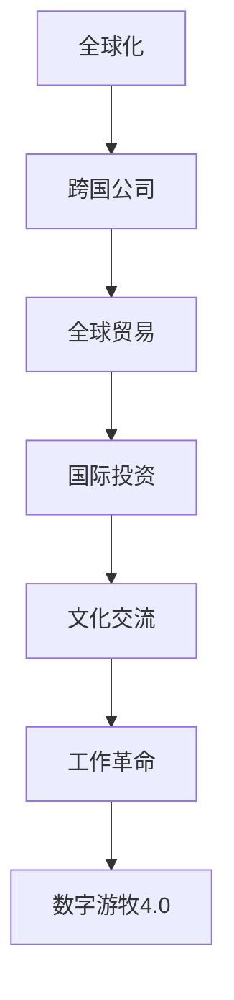
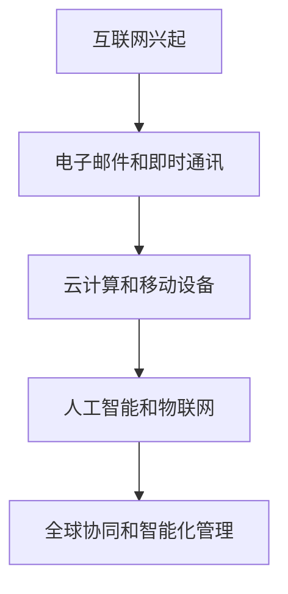
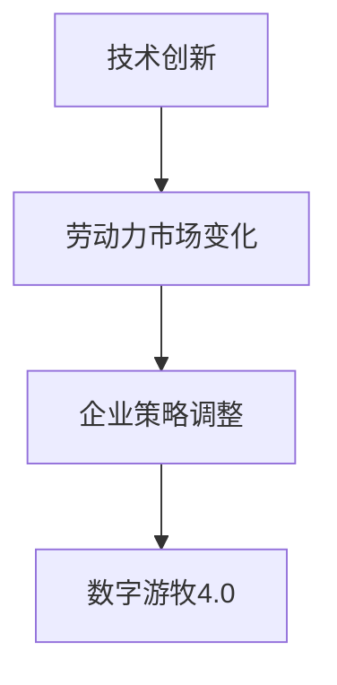
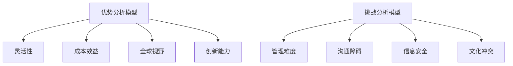
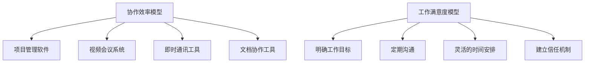
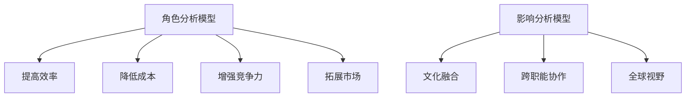
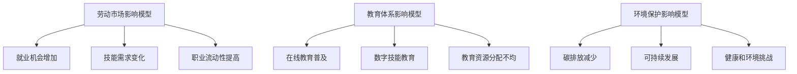
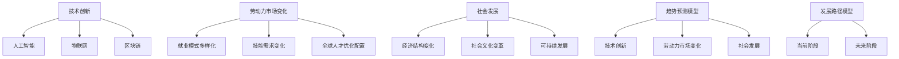
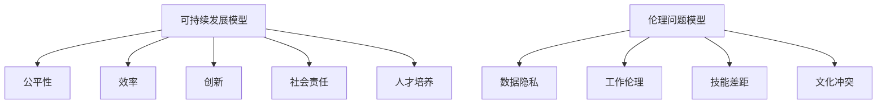
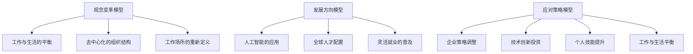

                 

# 数字游牧4.0：全球化背景下的工作革命

关键词：数字游牧、全球化、工作革命、远程工作、技术创新

摘要：随着全球化进程的加速和数字化转型的深入，数字游牧4.0成为新时代工作革命的重要标志。本文将从数字游牧的定义、核心要素、应用场景和未来展望等方面，深入探讨数字游牧4.0的兴起背景、发展过程以及其对现代工作方式的影响。

## 引言

### 1. 全球化趋势下的工作革命

#### 1.1 全球化的加速与发展

全球化作为当代经济发展的主要趋势，已经在过去几十年中深刻地改变了世界。全球贸易、跨国投资、技术交流等领域的快速发展，使得不同国家和地区之间的联系日益紧密。这种全球化趋势不仅促进了经济的繁荣，也为工作方式的变革提供了契机。

#### 1.2 数字化转型的推动力

数字化转型是全球化背景下不可逆转的趋势。大数据、云计算、物联网、人工智能等新兴技术的广泛应用，使得传统的工作模式面临着前所未有的挑战。企业开始重视数字化技术的应用，以提升效率和竞争力。这种数字化转型为数字游牧4.0的出现奠定了基础。

#### 1.3 数字游牧4.0的概念与特征

数字游牧4.0是指在全球化背景下，依托数字化技术实现的一种新型工作模式。与传统的办公室工作不同，数字游牧者可以在任何地点、任何时间进行工作。数字游牧4.0具有以下几个特征：

- **灵活性**：数字游牧者可以根据自己的需求和时间安排工作，实现工作与生活的平衡。
- **全球化**：数字游牧者可以跨越地理界限，与全球范围内的同事合作。
- **技术依赖**：数字化工具和平台成为数字游牧者工作的基础，如云存储、视频会议、项目管理软件等。
- **自主性**：数字游牧者通常具有高度的自主性，可以自由选择工作内容和方式。

## 第一部分：数字游牧4.0的核心要素

### 2. 数字游牧的定义与演变

#### 2.1 数字游牧的起源

数字游牧的起源可以追溯到互联网的兴起。早期，远程工作的概念主要依赖于电子邮件和即时通讯工具。随着互联网技术的发展，远程工作逐渐成为一种普遍的工作方式。数字游牧1.0阶段主要依赖电子邮件和即时通讯工具进行远程协作。

#### 2.2 数字游牧1.0到3.0的发展历程

- **数字游牧1.0**：以电子邮件和即时通讯工具为主，实现基本的远程沟通和协作。
- **数字游牧2.0**：随着云计算和移动设备的普及，数字游牧者可以通过云端存储和移动设备进行更高效的工作。
- **数字游牧3.0**：人工智能和物联网的加入，使得数字游牧工作更加智能化和自动化。

#### 2.3 数字游牧4.0的关键特点

- **智能化**：数字游牧4.0依赖于人工智能技术，如自然语言处理、机器学习等，提高工作效率。
- **自动化**：通过物联网技术实现设备的互联互通，减少人为干预，提高工作自动化水平。
- **全球化**：数字游牧4.0打破了地理限制，实现了全球范围内的协同工作。

### 3. 数字游牧4.0的驱动因素

#### 3.1 技术创新的推动

技术创新是数字游牧4.0发展的重要驱动力。人工智能、物联网、云计算等技术的不断进步，为数字游牧提供了更多的可能性。例如，人工智能可以帮助数字游牧者更好地管理时间和任务，提高工作效率。

#### 3.2 劳动力市场的变化

劳动力市场的变化也是推动数字游牧4.0发展的重要因素。随着全球化的深入，企业需要更加灵活的人才配置策略，以适应快速变化的市场需求。数字游牧工作模式为企业提供了更大的选择空间。

#### 3.3 企业策略的调整

企业在数字化转型过程中，逐渐认识到数字游牧工作模式的价值。通过引入数字游牧工作模式，企业可以降低办公成本、提高员工满意度，从而提升整体竞争力。

### 4. 数字游牧4.0的优势与挑战

#### 4.1 数字游牧的优势

- **灵活性**：数字游牧工作模式允许员工在任意地点工作，提高了工作效率和生活质量。
- **成本效益**：企业可以通过减少实体办公场所，降低运营成本。
- **多样性**：数字游牧工作模式吸引了来自世界各地的优秀人才，为企业的创新和发展提供了源源不断的动力。

#### 4.2 数字游牧的挑战

- **管理难度**：数字游牧工作模式增加了企业管理的复杂性，需要建立更加高效的管理体系和沟通机制。
- **信息安全**：远程工作增加了信息泄露的风险，企业需要加强信息安全措施。

#### 4.3 应对挑战的策略

- **建立高效管理机制**：企业可以通过数字化管理工具，如项目管理软件、视频会议系统等，提高管理效率。
- **加强信息安全**：企业需要建立完善的信息安全体系，如数据加密、访问控制等，确保信息安全。

## 第二部分：数字游牧4.0的应用场景

### 5. 数字游牧在远程工作中的实践

#### 5.1 远程协作工具的应用

远程协作工具是数字游牧工作模式的重要组成部分。常见的远程协作工具包括：

- **项目管理软件**：如Trello、Asana等，可以帮助团队高效管理项目和任务。
- **视频会议系统**：如Zoom、Microsoft Teams等，提供实时沟通和协作平台。
- **文档协作工具**：如Google Docs、Microsoft Office 365等，支持多人实时编辑和协作。

#### 5.2 远程工作的最佳实践

- **明确工作目标**：确保每个团队成员都清楚自己的工作目标和任务。
- **定期沟通**：定期举行团队会议，确保团队成员之间的信息同步。
- **灵活的时间安排**：尊重团队成员的时间差异，提供灵活的工作时间安排。

#### 5.3 远程工作的评估与优化

- **绩效评估**：通过定期的绩效评估，了解团队成员的工作表现，提供反馈和改进建议。
- **流程优化**：分析远程工作中的痛点，优化工作流程，提高效率。

### 6. 数字游牧在全球化企业中的角色

#### 6.1 全球化企业的组织结构

全球化企业通常采用分布式组织结构，以适应全球业务需求。这种组织结构的特点包括：

- **去中心化**：权力和资源分配更加灵活，减少了层级管理的制约。
- **跨部门协作**：不同部门和团队之间需要频繁协作，实现全球业务的协同。

#### 6.2 数字游牧对全球化企业的影响

数字游牧工作模式对全球化企业产生了深远的影响：

- **提高效率**：数字游牧者可以在全球范围内自由调配资源，提高工作效率。
- **降低成本**：减少实体办公场所的需求，降低运营成本。
- **增强竞争力**：通过引入数字游牧工作模式，企业可以吸引更多优秀人才，增强竞争力。

#### 6.3 数字游牧4.0下的全球化企业策略

全球化企业在数字游牧4.0时代需要采取以下策略：

- **数字化转型**：加强数字化基础设施建设，提高企业的数字化水平。
- **人才战略**：注重人才引进和培养，打造一支具备数字游牧能力的人才队伍。
- **文化融合**：建立包容性的企业文化，促进全球团队的协同合作。

### 7. 数字游牧4.0的社会影响

#### 7.1 对劳动市场的影响

数字游牧4.0对劳动市场产生了深远的影响：

- **就业机会**：数字游牧工作模式为劳动者提供了更多的就业机会，尤其是对于灵活就业和兼职工作。
- **技能要求**：数字游牧工作模式对劳动者的技能提出了更高的要求，需要具备数字化技能和远程协作能力。

#### 7.2 对教育体系的影响

数字游牧工作模式对教育体系也产生了影响：

- **在线教育**：数字游牧工作模式促进了在线教育的发展，为学习者提供了更多学习资源和学习方式。
- **技能培训**：教育机构需要调整课程设置，增加数字技能和远程协作能力的培训。

#### 7.3 对环境保护的影响

数字游牧工作模式有助于减少交通出行，降低碳排放，对环境保护具有积极意义。

## 第三部分：数字游牧4.0的未来展望

### 8. 数字游牧4.0的未来趋势

#### 8.1 技术发展的方向

未来，数字游牧4.0的发展将继续受到技术创新的推动。人工智能、物联网、区块链等新兴技术将在数字游牧工作中发挥更大作用：

- **人工智能**：提高工作效率，优化工作流程。
- **物联网**：实现设备互联互通，提高自动化水平。
- **区块链**：提供安全可靠的数据存储和交易机制。

#### 8.2 劳动力市场的变化

未来，劳动力市场将更加灵活和多元化。数字游牧工作模式将成为劳动力市场的重要组成部分，对劳动者的技能要求也将不断提高。

#### 8.3 数字游牧4.0的长期影响

数字游牧4.0将对经济、社会和环境产生深远的影响。经济方面，数字游牧工作模式将促进全球化经济的发展。社会方面，数字游牧工作模式将改变人们的就业观念和工作方式。环境方面，数字游牧工作模式有助于减少碳排放，推动可持续发展。

### 9. 数字游牧4.0的可持续发展

#### 9.1 可持续发展的原则

数字游牧4.0的可持续发展需要遵循以下原则：

- **公平性**：确保数字游牧工作模式的公平性和包容性，让更多人受益。
- **效率**：提高工作效率，减少资源浪费。
- **创新**：鼓励技术创新，推动数字游牧工作模式的不断演进。

#### 9.2 数字游牧4.0的伦理问题

数字游牧4.0的伦理问题主要包括：

- **数据隐私**：确保个人数据的安全和隐私。
- **工作伦理**：确保数字游牧工作模式不会导致过度工作或工作压力。
- **技能差距**：减少数字技能差距，确保所有人都能受益于数字游牧工作模式。

#### 9.3 促进可持续发展的策略

促进数字游牧4.0的可持续发展需要采取以下策略：

- **政策支持**：政府应制定相关政策，支持数字游牧工作模式的发展。
- **教育培训**：加强数字技能和远程协作能力的培训，提高劳动者的竞争力。
- **技术创新**：鼓励技术创新，提高数字游牧工作的效率和安全性。

## 结论

#### 10. 数字游牧4.0：工作革命的启示

数字游牧4.0是全球化背景下工作革命的重要标志。它不仅改变了传统的工作模式，也为经济发展、社会进步和环境保护提供了新的机遇。面对数字游牧4.0，企业和个人需要积极适应，不断学习和提升自己的技能，以抓住这一历史性的机遇。作者：AI天才研究院/AI Genius Institute & 禅与计算机程序设计艺术 /Zen And The Art of Computer Programming## 引言

### 1. 全球化趋势下的工作革命

全球化作为当代经济发展的主要趋势，已经在过去几十年中深刻地改变了世界。全球化进程的加速不仅促进了全球经济的繁荣，也催生了新的工作模式。在这种背景下，工作革命成为不可避免的现象。本文将探讨全球化趋势下工作革命的具体表现，以及数字游牧4.0作为这一革命的重要标志。

#### 1.1 全球化的加速与发展

全球化的加速主要体现在以下几个方面：

1. **跨国公司的崛起**：跨国公司通过全球布局，实现了资源的最优配置和生产效率的最大化。它们在不同国家和地区设立分支机构，形成了全球化的供应链和销售网络。
   
2. **全球贸易的增长**：全球贸易的快速发展，使得不同国家之间的商品和服务交换更加频繁。国际贸易总额持续增长，成为全球经济的重要推动力。

3. **国际投资的热潮**：跨国投资成为企业扩展业务的重要手段。企业通过海外投资，可以进入新的市场，获取更多的资源和客户。

4. **文化交流的深化**：全球化使得不同文化之间的交流更加频繁，人们对于其他文化的了解和接受度也在不断提高。

#### 1.2 数字化转型的推动力

数字化转型是全球化背景下不可逆转的趋势。它通过引入新兴技术，改变了传统的工作方式和生产模式，为工作革命提供了强有力的推动力。以下是数字化转型的主要特点：

1. **数据驱动的决策**：企业通过收集和分析大量数据，可以更准确地了解市场需求，优化生产和销售策略。

2. **自动化和智能化的应用**：人工智能、机器人等技术被广泛应用于生产和办公环节，提高了生产效率和工作质量。

3. **远程工作的普及**：随着互联网和通信技术的发展，远程工作逐渐成为一种普遍的工作方式，打破了地理和时间的限制。

4. **数字化供应链的建立**：企业通过数字化技术，建立了高效、透明的供应链体系，提高了供应链的响应速度和灵活性。

#### 1.3 数字游牧4.0的概念与特征

数字游牧4.0是指在全球化背景下，依托数字化技术实现的一种新型工作模式。数字游牧者可以在全球范围内自由选择工作地点，利用数字化工具和平台进行高效的工作。数字游牧4.0具有以下几个特征：

1. **灵活性**：数字游牧者可以根据自己的需求和时间安排工作，实现工作与生活的平衡。

2. **全球化**：数字游牧者可以跨越地理界限，与全球范围内的同事合作，共享资源和经验。

3. **技术依赖**：数字化工具和平台成为数字游牧者工作的基础，如云存储、视频会议、项目管理软件等。

4. **自主性**：数字游牧者通常具有高度的自主性，可以自由选择工作内容和方式。

数字游牧4.0不仅为员工提供了更多的灵活性，也为企业降低了运营成本，提高了工作效率。它是全球化背景下工作革命的重要标志，标志着传统的工作模式正在向更加灵活、高效和全球化的方向发展。

### 2. 数字游牧的定义与演变

#### 2.1 数字游牧的起源

数字游牧（Digital Nomadism）这一概念起源于20世纪初，当时一些艺术家和作家开始利用互联网和远程通信技术，在世界各地进行创作和工作。他们通过电子邮件、BBS（电子公告板系统）和互联网论坛等工具，实现了跨地域的交流和合作。这一时期，数字游牧主要是一种边缘化的工作方式，主要适用于特定的人群。

随着互联网技术的不断发展，数字游牧逐渐成为一种更普遍的工作模式。20世纪90年代末到21世纪初，随着宽带互联网的普及和无线通信技术的发展，数字游牧开始从边缘走向主流。人们可以利用笔记本电脑、无线网络和移动设备，随时随地访问互联网，进行工作。这一时期，数字游牧主要依赖于电子邮件、即时通讯工具和远程协作平台。

#### 2.2 数字游牧1.0到3.0的发展历程

1. **数字游牧1.0**：这一阶段主要依赖于互联网和电子邮件进行远程工作。人们可以通过电子邮件与同事沟通，发送和接收工作文件。尽管这一阶段的数字游牧工作模式已经大大超越了传统的办公室工作，但仍然存在许多限制，例如通信效率不高、协作不便捷等。

2. **数字游牧2.0**：随着云计算、移动设备和协作工具的普及，数字游牧工作模式得到了显著提升。云计算使得数据存储和访问变得更加方便，移动设备使得人们可以随时随地办公。协作工具如Trello、Slack和Google Workspace等，提高了团队协作的效率和效果。这一阶段的数字游牧工作模式更加灵活和高效。

3. **数字游牧3.0**：随着人工智能、物联网和区块链等新兴技术的应用，数字游牧工作模式进入了新的发展阶段。人工智能技术帮助数字游牧者更好地管理时间和任务，提高工作效率。物联网技术实现了设备的互联互通，提高了自动化水平。区块链技术提供了安全可靠的数据存储和交易机制。这一阶段的数字游牧工作模式不仅更加灵活和高效，还具备了一定的智能化和自动化特性。

#### 2.3 数字游牧4.0的关键特点

数字游牧4.0作为最新的发展阶段，具有以下几个关键特点：

1. **智能化**：人工智能技术的广泛应用，使得数字游牧工作更加智能化。例如，智能助手可以帮助数字游牧者安排日程、管理任务和提供决策支持。

2. **自动化**：物联网技术的应用，使得数字游牧工作更加自动化。例如，智能家居设备可以自动调节温度、照明等，提高生活和工作质量。

3. **全球化**：数字游牧4.0打破了地理限制，实现了全球范围内的协同工作。数字游牧者可以与全球范围内的同事、合作伙伴和客户进行实时沟通和协作。

4. **可持续性**：数字游牧4.0注重环境保护和可持续发展。通过远程工作和数字化工具，减少了交通出行，降低了碳排放。

5. **灵活性**：数字游牧4.0提供了高度的工作灵活性。数字游牧者可以根据自己的需求和兴趣，选择工作地点和时间，实现工作与生活的平衡。

数字游牧4.0作为全球化背景下工作革命的重要标志，不仅改变了传统的工作方式，也为企业和员工带来了新的机遇和挑战。它代表了未来工作模式的趋势，为人们提供了更多自由和灵活性。

### 3. 数字游牧4.0的驱动因素

数字游牧4.0的兴起并非偶然，而是多种因素共同作用的结果。以下是数字游牧4.0的主要驱动因素：

#### 3.1 技术创新的推动

技术创新是数字游牧4.0发展的重要驱动力。近年来，人工智能、物联网、云计算等新兴技术的迅猛发展，为数字游牧工作模式提供了强大的技术支持。

1. **人工智能**：人工智能技术可以帮助数字游牧者提高工作效率，优化工作流程。例如，智能助手可以自动处理日常任务，提供个性化的建议和决策支持。

2. **物联网**：物联网技术实现了设备的互联互通，提高了自动化水平。例如，智能家居设备可以自动调节温度、照明等，提高生活和工作质量。

3. **云计算**：云计算技术提供了强大的计算能力和数据存储能力，使得数字游牧者可以随时随地访问和处理数据。云计算平台还提供了丰富的应用程序和服务，支持各种远程工作和协作需求。

4. **区块链**：区块链技术提供了安全可靠的数据存储和交易机制，增强了数字游牧工作的可信度和安全性。例如，区块链可以确保数据不被篡改，保护个人隐私和商业秘密。

#### 3.2 劳动力市场的变化

劳动力市场的变化也是推动数字游牧4.0发展的重要因素。随着全球化的深入和经济结构的调整，劳动力市场正在发生重大变化。

1. **技能需求的变化**：数字技术的快速发展，使得劳动力市场的技能需求发生了显著变化。越来越多的企业需要具备数字化技能的人才，如编程、数据分析、人工智能等。数字游牧工作模式为企业提供了更多选择，可以吸引和留住优秀人才。

2. **就业模式的变化**：传统的全职工作和固定办公室模式逐渐被灵活就业和远程工作所取代。数字游牧工作模式适应了这种变化，提供了更多灵活的就业选择，满足了劳动者的多样化需求。

3. **人才流动性的提高**：全球化的加深，使得人才流动性显著提高。越来越多的人有机会在全球范围内寻找工作机会，实现职业发展。数字游牧工作模式为人才流动提供了便利，促进了全球人才的优化配置。

#### 3.3 企业策略的调整

企业在数字化转型过程中，逐渐认识到数字游牧工作模式的价值。通过引入数字游牧工作模式，企业可以实现以下目标：

1. **降低成本**：数字游牧工作模式减少了企业对实体办公场所的需求，降低了租金、水电等运营成本。

2. **提高效率**：数字游牧工作模式提高了团队协作效率，减少了沟通和协作的障碍。通过数字化工具和平台，团队成员可以随时随地访问和共享信息，提高工作效率。

3. **增强竞争力**：数字游牧工作模式使得企业能够吸引和留住优秀人才，提升整体竞争力。数字游牧者通常具有较高的自主性和创新能力，可以为企业带来新的思维和视角。

4. **扩大市场**：数字游牧工作模式有助于企业拓展国际市场。企业可以通过全球范围内的数字游牧者，快速响应不同市场的需求，提高市场竞争力。

总之，数字游牧4.0的兴起是技术创新、劳动力市场变化和企业策略调整共同作用的结果。它不仅改变了传统的工作方式，也为企业和员工带来了新的机遇和挑战。在数字游牧4.0时代，企业需要积极适应这一变化，制定相应的策略，以实现可持续发展。

### 4. 数字游牧4.0的优势与挑战

#### 4.1 数字游牧的优势

数字游牧4.0作为一种新型的远程工作模式，具有诸多优势，为企业与员工带来了显著的便利和效益。

1. **灵活性**：数字游牧4.0允许员工在全球范围内选择工作地点，不再受限于传统的办公室环境。这种灵活性使员工能够更好地平衡工作与生活，提高工作效率和幸福感。同时，企业也能吸引到那些希望在工作与生活之间找到平衡的顶尖人才。

2. **成本效益**：数字游牧工作模式减少了企业对实体办公场所的需求，降低了租金、水电和设备维护等运营成本。此外，企业还可以避免因地理限制而产生的通勤时间和交通成本。这不仅提高了企业的经济效益，也使资源利用更加高效。

3. **全球视野**：数字游牧4.0打破了地理界限，使企业能够与全球范围内的同事、合作伙伴和客户进行实时沟通和协作。这种全球视野有助于企业获取多样化的市场信息和资源，提升企业的国际竞争力。

4. **创新能力**：数字游牧工作模式鼓励创新思维和跨文化合作。员工在不同文化背景下工作，能够带来新的视角和解决方案，促进企业的创新和发展。

5. **工作满意度**：数字游牧4.0提高了员工的工作满意度。员工可以根据自己的需求和兴趣，选择适合自己的工作地点和时间，实现工作与生活的平衡。这种灵活性不仅提升了员工的工作热情，也减少了员工因工作压力而流失的风险。

#### 4.2 数字游牧的挑战

尽管数字游牧4.0具有诸多优势，但同时也面临着一系列挑战，这些挑战需要企业和管理者认真应对。

1. **管理难度**：数字游牧工作模式增加了企业管理工作的复杂性。由于员工分布在不同地理位置，管理者难以直接监督和评估员工的工作表现。此外，如何确保团队协作和信息共享的效率也成为一个挑战。

2. **沟通障碍**：远程工作可能会带来沟通障碍，尤其是跨时区和文化差异的沟通。员工之间的沟通不畅可能导致误解和冲突，影响工作效率和团队凝聚力。

3. **信息安全**：数字游牧工作模式增加了信息泄露的风险。员工在不同地点使用不同的设备和网络，使得数据安全和隐私保护变得更加复杂。企业需要加强信息安全措施，确保敏感信息的安全。

4. **文化冲突**：数字游牧团队通常由来自不同国家和地区的成员组成，可能会面临文化冲突的问题。文化差异可能导致沟通不畅、工作方式不协调，影响团队的协作效果。

5. **职业发展**：数字游牧工作模式可能会影响员工的职业发展。由于工作地点的不固定，员工可能会感到职业发展路径不清晰，缺乏明确的发展规划和晋升机会。

#### 4.3 应对挑战的策略

为了充分发挥数字游牧4.0的优势，同时应对其带来的挑战，企业可以采取以下策略：

1. **建立高效的远程管理机制**：企业可以通过数字化管理工具和平台，如项目管理软件、视频会议系统和即时通讯工具，提高远程管理的效率。同时，制定明确的工作目标和绩效评估标准，确保员工的工作表现和团队目标的达成。

2. **加强团队沟通与协作**：企业应鼓励团队之间的沟通和协作，通过定期举行虚拟会议和在线讨论，加强团队成员之间的联系。此外，可以组织团队建设活动，增进团队成员之间的相互了解和信任。

3. **提升信息安全防护能力**：企业应加强信息安全防护，确保数据安全和隐私保护。这包括采用加密技术、数据备份和访问控制等措施，降低信息泄露的风险。

4. **促进跨文化交流**：企业应鼓励跨文化交流，通过组织文化培训、语言学习和跨文化研讨会等活动，提升团队成员的跨文化沟通能力，减少文化冲突。

5. **提供明确的职业发展路径**：企业应制定明确的职业发展路径，为数字游牧员工提供晋升机会和培训资源。通过职业发展规划，帮助员工实现职业成长，提升工作满意度。

总之，数字游牧4.0作为一种新兴的工作模式，既带来了机遇，也带来了挑战。企业需要积极应对这些挑战，同时充分发挥其优势，以实现可持续发展。

### 5. 数字游牧在远程工作中的实践

数字游牧4.0的兴起，使得远程工作成为越来越多企业和管理者关注的热点。远程工作不仅为企业提供了降低成本、提高灵活性的机会，也为员工带来了更好的工作生活平衡。本节将探讨数字游牧在远程工作中的实践，包括远程协作工具的应用、最佳实践以及远程工作的评估与优化。

#### 5.1 远程协作工具的应用

远程协作工具是数字游牧工作模式中不可或缺的一部分。以下是一些常见的远程协作工具：

1. **项目管理软件**：项目管理软件如Trello、Asana和Jira等，可以帮助团队高效管理项目和任务。这些工具提供了任务列表、优先级设置、进度跟踪和团队成员协作等功能，确保项目按时完成。

2. **视频会议系统**：视频会议系统如Zoom、Microsoft Teams和Google Meet等，提供了实时沟通和协作平台。通过视频会议，团队成员可以面对面交流，解决工作中遇到的问题，提高协作效率。

3. **即时通讯工具**：即时通讯工具如Slack、WhatsApp和企业微信等，支持实时消息传递、文件共享和视频通话。这些工具可以帮助团队成员快速沟通，解决突发问题，提高工作效率。

4. **文档协作工具**：文档协作工具如Google Docs、Microsoft Office 365和Notion等，支持多人实时编辑和协作。这些工具使团队成员可以随时访问和更新文档，提高团队协作效率。

5. **时间管理工具**：时间管理工具如Toggl和RescueTime等，可以帮助团队成员管理工作时间，提高工作效率。这些工具可以跟踪工作时长、生成工作报表，帮助团队成员优化工作时间安排。

#### 5.2 远程工作的最佳实践

为了确保远程工作的高效和成功，以下是一些远程工作的最佳实践：

1. **明确工作目标**：确保每个团队成员都清楚自己的工作目标和任务。制定明确的项目目标和里程碑，确保团队朝共同的目标努力。

2. **定期沟通**：定期举行团队会议，确保团队成员之间的信息同步。通过视频会议、即时通讯工具和电话等方式，保持频繁的沟通和交流，解决工作中的问题和困惑。

3. **灵活的时间安排**：尊重团队成员的时间差异，提供灵活的工作时间安排。鼓励团队成员根据自己的需求和工作节奏，合理安排工作时间，提高工作效率。

4. **建立信任机制**：远程工作可能会削弱团队成员之间的信任感。通过透明的工作流程、及时的反馈和认可，建立信任机制，增强团队成员之间的信任和协作。

5. **保持工作效率**：制定合理的工作计划，避免过度工作和疲劳。通过时间管理工具和技巧，提高工作效率，确保工作质量和进度。

6. **技能培训**：定期组织技能培训和知识分享，提升团队成员的技能和知识水平。通过培训，帮助团队成员适应远程工作环境，提高工作效率。

7. **团队建设**：通过线上团队活动、虚拟聚会和在线游戏等，增进团队成员之间的情感联系，提升团队凝聚力。

#### 5.3 远程工作的评估与优化

为了确保远程工作的高效和成功，企业需要定期评估和优化远程工作流程。以下是一些评估和优化的方法：

1. **绩效评估**：通过定期的绩效评估，了解团队成员的工作表现，提供反馈和改进建议。绩效评估指标可以包括任务完成情况、工作效率、团队协作和客户满意度等。

2. **员工满意度调查**：定期进行员工满意度调查，了解员工对远程工作的看法和体验。通过调查结果，发现存在的问题和改进空间，优化远程工作环境。

3. **流程优化**：分析远程工作中的痛点，优化工作流程，提高效率。例如，简化沟通流程、减少冗余任务、提高工具的使用效率等。

4. **技术升级**：根据团队需求和实际应用情况，升级和优化远程协作工具和技术平台。确保工具和平台能够满足团队的工作需求，提高协作效率。

5. **员工培训**：定期组织培训，提高员工的技能和知识水平，确保他们能够熟练使用远程协作工具和技术平台。

6. **反馈机制**：建立反馈机制，鼓励团队成员提出意见和建议，改进远程工作流程。通过员工反馈，不断优化远程工作环境，提高员工满意度和工作效率。

总之，数字游牧4.0在远程工作中的实践，为企业提供了更多选择和灵活性。通过合理运用远程协作工具、遵循最佳实践和持续评估优化，企业可以充分发挥远程工作的优势，提高工作效率和员工满意度，实现可持续发展。

### 6. 数字游牧在全球化企业中的角色

全球化企业在当今经济环境中扮演着越来越重要的角色。随着全球化进程的加速，企业不仅需要在本地市场中保持竞争力，还需要在全球范围内拓展业务、优化资源配置。在这种背景下，数字游牧4.0作为全球化企业的重要组成部分，正发挥着至关重要的作用。

#### 6.1 全球化企业的组织结构

全球化企业的组织结构通常具有以下几个特点：

1. **分布式团队**：全球化企业通常拥有分布在全球各地的团队，这些团队可能位于不同的国家和地区。团队成员可以通过远程协作工具和平台，实现实时沟通和协作。

2. **灵活的层级结构**：全球化企业采用灵活的层级结构，以适应快速变化的市场需求。这种结构减少了冗长的决策链条，提高了企业的响应速度。

3. **跨职能团队**：全球化企业经常组建跨职能团队，这些团队由来自不同部门和背景的成员组成，可以协同完成复杂的项目。

4. **虚拟办公室**：全球化企业通过虚拟办公室，实现团队成员的远程办公。虚拟办公室不仅降低了企业的运营成本，还提高了员工的灵活性。

#### 6.2 数字游牧对全球化企业的影响

数字游牧4.0对全球化企业产生了深远的影响，主要体现在以下几个方面：

1. **提高效率**：数字游牧工作模式使得全球化企业能够更高效地利用全球资源。企业可以根据项目需求，灵活调配全球范围内的团队成员，提高项目完成速度。

2. **降低成本**：数字游牧工作模式减少了企业对实体办公场所的需求，降低了租金、水电和设备维护等运营成本。企业可以通过远程协作工具，实现全球范围内的资源共享和协同工作。

3. **增强竞争力**：数字游牧工作模式有助于企业吸引和留住顶尖人才。全球范围内的优秀人才可以不受地理限制，为全球化企业提供多样化的创新思维和解决方案。

4. **拓展市场**：数字游牧工作模式使企业能够更快速地响应全球市场需求，拓展国际市场。企业可以通过数字游牧者，快速进入新的市场，获取更多的客户和资源。

5. **促进创新**：数字游牧工作模式鼓励跨文化合作和知识共享。全球化企业可以通过全球范围内的数字游牧者，获取不同的文化背景和工作经验，促进企业的创新和发展。

#### 6.3 数字游牧4.0下的全球化企业策略

为了充分利用数字游牧4.0的优势，全球化企业需要采取以下策略：

1. **数字化转型**：全球化企业应积极推进数字化转型，建立高效、透明的数字化基础设施。通过云计算、大数据和人工智能等新兴技术，提高企业的数字化水平和竞争力。

2. **人才战略**：全球化企业应制定灵活的人才战略，吸引和培养数字游牧人才。企业可以通过远程招聘、在线培训等方式，吸引全球范围内的优秀人才。

3. **文化融合**：全球化企业应注重文化融合，建立包容性的企业文化。通过跨文化培训、团队建设活动等方式，促进不同文化背景的员工之间的交流和合作。

4. **技术创新**：全球化企业应积极投资于技术创新，推动数字游牧工作模式的发展。通过引入新的技术和工具，提高工作效率和协作效果。

5. **风险管理**：全球化企业应建立完善的风险管理机制，确保数字游牧工作的安全性和可靠性。企业可以通过数据加密、访问控制等措施，保护企业信息和员工隐私。

总之，数字游牧4.0在全球化企业中发挥着至关重要的作用。通过充分利用数字游牧的优势，全球化企业可以降低成本、提高效率、增强竞争力，实现可持续发展。

### 7. 数字游牧4.0的社会影响

#### 7.1 对劳动市场的影响

数字游牧4.0的兴起，对劳动市场产生了深远的影响。首先，它为劳动市场带来了新的就业机会。随着远程工作的普及，越来越多的企业开始采用数字游牧工作模式，这为劳动者提供了更多的就业选择。特别是在一些高薪行业，如软件开发、数据分析和市场营销等领域，数字游牧工作模式使得劳动者可以在全球范围内寻找高薪职位，提升了劳动者的职业发展空间。

其次，数字游牧4.0改变了劳动者的就业观念。传统的就业模式通常要求劳动者在固定的地点工作，而数字游牧工作模式则打破了这一限制，使劳动者可以在任何地点工作。这种工作模式的灵活性，使得劳动者可以更好地平衡工作与生活，提高了生活质量。此外，数字游牧工作模式也鼓励了创业和创新，许多劳动者通过远程工作，积累了足够的经验和资源，最终实现了自我创业。

然而，数字游牧4.0也对劳动市场带来了一些挑战。首先，它加剧了技能差距。在数字游牧工作模式中，具备数字化技能的劳动者更具竞争力，而缺乏这些技能的劳动者可能会面临就业困难。其次，数字游牧工作模式可能导致劳动者的工作压力增加。由于工作与生活的界限模糊，劳动者可能需要随时响应工作需求，这增加了劳动者的工作压力。此外，数字游牧工作模式也可能带来一些法律和监管问题，如税收、保险和劳动权益等。

#### 7.2 对教育体系的影响

数字游牧4.0的兴起，也对教育体系产生了深远的影响。首先，它推动了在线教育的普及。随着远程工作的普及，越来越多的教育机构开始提供在线课程和远程教育服务。这种教育模式不仅为学生提供了更多的学习资源和学习方式，也为教育机构带来了新的收入来源。

其次，数字游牧工作模式要求劳动者具备更高的数字化技能和跨文化沟通能力。这促使教育体系进行改革，加强数字技能和跨文化教育的培养。一些高校和职业教育机构已经开始开设相关课程，以适应市场需求。

然而，数字游牧4.0也对教育体系带来了一些挑战。首先，它加剧了教育资源的分配不均。由于在线教育的发展，一些发达地区和富裕家庭的学生能够享受到优质的教育资源，而偏远地区和经济条件较差的学生则可能无法享受到同样的教育资源。其次，在线教育质量的监管也是一个挑战。如何确保在线教育的质量，防止教育机构滥发证书，是一个需要解决的问题。

#### 7.3 对环境保护的影响

数字游牧4.0的兴起，对环境保护也产生了积极的影响。首先，它有助于减少碳排放。由于远程工作减少了劳动者的通勤时间，从而减少了交通排放。此外，数字游牧工作模式鼓励劳动者在家办公，这有助于减少办公建筑的能源消耗。

其次，数字游牧4.0也有助于促进可持续发展。通过远程工作，劳动者可以选择在环境更好的地区居住和工作，从而减少对城市环境的压力。此外，数字游牧工作模式也鼓励企业采用环保措施，如使用可再生能源、减少纸质文件等，以实现可持续发展。

然而，数字游牧4.0也对环境保护带来了一些挑战。首先，远程工作可能导致劳动者的生活习惯发生变化，如长时间使用电子设备、缺乏运动等，这可能会对健康产生不利影响。其次，数字游牧工作模式也可能导致企业过度依赖虚拟协作工具，忽视与同事面对面交流的重要性，从而影响团队合作和沟通。

总之，数字游牧4.0的兴起对劳动市场、教育体系和环境保护都产生了深远的影响。通过充分利用数字游牧的优势，同时应对其带来的挑战，我们可以推动社会的发展和进步。

### 8. 数字游牧4.0的未来趋势

随着全球化进程的加速和数字化技术的不断进步，数字游牧4.0正逐渐成为未来工作模式的重要组成部分。未来，数字游牧4.0将呈现以下几大趋势：

#### 8.1 技术发展的方向

1. **人工智能**：人工智能将在数字游牧4.0中发挥更重要的作用。智能助手可以帮助数字游牧者更好地管理时间和任务，提高工作效率。此外，人工智能还可以用于预测市场需求、优化工作流程，为企业提供更加精准的数据支持。

2. **物联网**：物联网技术将使数字游牧工作更加智能化和自动化。智能家居设备、智能办公设备等将实现互联互通，提高生活和工作质量。例如，智能会议室可以根据参会人员自动调整温度、照明等，提高会议效率。

3. **区块链**：区块链技术将提供更加安全可靠的数据存储和交易机制，确保数字游牧工作的数据安全和隐私保护。区块链还可以用于智能合约的执行，提高数字游牧工作的透明度和公正性。

4. **5G技术**：5G技术的普及将大幅提高数字游牧工作的通信速度和稳定性，为实时协作提供更强大的支持。5G网络的高带宽和低延迟，将使数字游牧者能够更加顺畅地进行远程工作。

#### 8.2 劳动力市场的变化

1. **技能需求的变化**：随着技术的进步，劳动力市场的技能需求将发生显著变化。数字技能、跨文化沟通能力和创新能力将成为重要的人才标准。劳动者需要不断更新自己的技能，以适应不断变化的市场需求。

2. **职业流动性的增加**：数字游牧工作模式将使职业流动性显著提高。劳动者可以更加自由地选择工作地点和时间，实现职业发展的多元化。这将为劳动力市场的多样性和灵活性提供更大的空间。

3. **就业模式的多样化**：传统的全职工作和固定办公室模式将被更多样化的就业模式所取代。远程工作、兼职工作、项目制工作等将变得更加普遍，劳动者可以根据自己的需求和兴趣，选择适合自己的工作模式。

#### 8.3 数字游牧4.0的长期影响

1. **经济结构的调整**：数字游牧4.0将推动经济结构的调整，促进服务业、科技产业等高附加值产业的快速发展。同时，它也将推动传统产业向数字化、智能化方向转型，提高整体经济的竞争力。

2. **社会文化的变革**：数字游牧4.0将促进社会文化的变革。人们的工作观念、生活方式和价值观将发生深刻变化。自由、平等、共享将成为未来社会文化的重要组成部分。

3. **环境保护的推进**：数字游牧4.0将有助于减少碳排放、保护生态环境。通过远程工作和数字化工具，我们可以减少交通出行、降低能源消耗，实现可持续发展。

总之，数字游牧4.0的未来趋势充满机遇和挑战。通过积极应对这些趋势，企业和个人可以抓住历史性的机遇，推动社会的发展和进步。

### 9. 数字游牧4.0的可持续发展

#### 9.1 可持续发展的原则

数字游牧4.0的可持续发展需要遵循以下几个原则：

1. **公平性**：确保数字游牧工作模式的公平性和包容性，让更多人能够受益。无论地理位置、文化背景或经济状况，每个人都应有机会参与到数字游牧工作中。

2. **效率**：提高工作效率，减少资源浪费。通过数字化工具和智能化技术，优化工作流程，提高生产力。

3. **创新**：鼓励技术创新，推动数字游牧工作模式的不断演进。持续研发和应用新技术，提高数字游牧工作的效率和安全性。

4. **社会责任**：企业应承担社会责任，关注数字游牧工作对环境、社会和经济的影响。通过可持续发展实践，减少负面影响，实现社会责任。

5. **人才培养**：注重人才培养，提升劳动者的技能和知识水平。通过培训和教育，帮助劳动者适应数字游牧工作模式，提高竞争力。

#### 9.2 数字游牧4.0的伦理问题

数字游牧4.0在带来诸多机遇的同时，也引发了一系列伦理问题，需要我们认真对待：

1. **数据隐私**：在数字游牧工作中，个人数据的安全和隐私保护至关重要。企业应采取严格的数据保护措施，确保个人信息不被泄露。

2. **工作伦理**：数字游牧工作模式可能导致工作与生活的界限模糊，增加劳动者的工作压力。企业应制定合理的工作制度，确保劳动者能够获得充分的休息和调整时间。

3. **技能差距**：数字游牧工作模式对劳动者的技能要求较高，可能导致技能差距问题。企业和社会应共同努力，提升劳动者的数字技能，减少差距。

4. **文化冲突**：数字游牧团队通常由来自不同国家和地区的成员组成，可能会面临文化冲突问题。企业应加强文化融合，促进团队成员之间的相互理解和尊重。

#### 9.3 促进可持续发展的策略

为了实现数字游牧4.0的可持续发展，企业和政府可以采取以下策略：

1. **政策支持**：政府应制定相关政策，支持数字游牧工作模式的发展。例如，提供税收优惠、简化签证手续等，鼓励企业和劳动者参与数字游牧工作。

2. **技术创新**：企业应积极投入技术研发，推动数字游牧工作模式的创新和发展。例如，开发更加智能化的协作工具和平台，提高数字游牧工作的效率。

3. **教育培训**：加强数字技能和远程协作能力的培训，提高劳动者的竞争力。政府和企业可以合作，提供针对性的培训课程，帮助劳动者适应数字游牧工作模式。

4. **社会责任**：企业应承担社会责任，关注数字游牧工作对环境、社会和经济的影响。通过可持续发展实践，减少负面影响，实现社会责任。

5. **国际合作**：加强国际合作，推动全球范围内的数字游牧工作发展。政府和企业可以共同建立国际合作机制，促进经验交流和资源共享。

总之，数字游牧4.0的可持续发展是一个复杂而长期的过程，需要政府、企业和劳动者共同努力。通过遵循可持续发展原则、解决伦理问题并采取有效策略，我们可以实现数字游牧工作的可持续发展，推动社会和经济的发展。

### 10. 数字游牧4.0：工作革命的启示

数字游牧4.0作为全球化背景下工作革命的重要标志，不仅改变了传统的工作模式，也对企业和个人提出了新的要求。本文从以下几个方面探讨数字游牧4.0对工作革命的影响以及未来的发展方向。

#### 10.1 对传统工作观念的挑战

数字游牧4.0对传统工作观念带来了前所未有的挑战。传统的办公室工作和固定工作时间表已经不再适用于数字游牧工作模式。数字游牧者可以在任何地点、任何时间进行工作，这打破了传统的工作时间和地点的限制。这种灵活的工作方式对传统的工作观念产生了巨大的冲击：

1. **工作与生活的平衡**：数字游牧工作模式鼓励劳动者实现工作与生活的平衡。不再需要长时间的通勤，劳动者有更多的时间陪伴家人、进行个人爱好和休闲活动，提高了生活质量。

2. **去中心化的组织结构**：数字游牧工作模式促进了去中心化的组织结构。团队成员不再局限于同一地点，企业可以通过全球范围内的数字游牧者实现资源的最佳配置和协同工作。

3. **对工作场所的重新定义**：数字游牧工作模式使工作场所变得虚拟化。不再需要昂贵的办公场所，企业可以通过远程协作工具和平台，实现高效的团队协作。

#### 10.2 数字游牧4.0的未来方向

数字游牧4.0的未来方向将受到技术创新和劳动力市场变化的影响。以下是一些可能的发展趋势：

1. **人工智能的进一步应用**：人工智能将在数字游牧4.0中发挥更大的作用。智能助手和自动化工具将帮助数字游牧者更高效地管理时间和任务，提高工作效率。

2. **全球人才的优化配置**：随着全球化的深入，企业将更加关注全球人才的优化配置。通过数字游牧工作模式，企业可以吸引和利用全球范围内的优秀人才，实现资源的最佳利用。

3. **灵活就业的普及**：数字游牧工作模式将促进灵活就业的普及。劳动者可以通过远程工作平台，选择适合自己的工作内容和时间安排，实现职业发展的多样化。

4. **可持续发展的重视**：随着环境保护意识的提高，数字游牧4.0将更加注重可持续发展。企业将通过远程工作和数字化工具，减少碳排放和资源消耗，实现绿色办公。

#### 10.3 企业与个人如何应对数字游牧4.0

面对数字游牧4.0，企业和个人都需要做出相应的调整和应对：

1. **企业策略调整**：企业需要调整组织结构和人力资源策略，以适应数字游牧工作模式。通过提供远程工作机会、采用数字化管理工具和平台，提高员工的工作效率和满意度。

2. **技术创新和投资**：企业应积极投资于技术创新，推动数字游牧工作模式的发展。通过引入新的技术和工具，提高工作效率和协作效果，保持竞争力。

3. **个人技能提升**：个人需要不断提升自己的技能，以适应数字游牧工作模式的要求。掌握数字技能、跨文化沟通能力和自我管理能力，将有助于个人在数字游牧工作中取得成功。

4. **关注工作与生活的平衡**：个人需要学会在数字游牧工作中保持工作与生活的平衡。合理安排工作时间，确保充足的休息和调整时间，提高生活质量。

5. **持续学习和适应**：数字游牧4.0是一个不断变化和发展的领域。个人和企业都需要保持持续学习和适应能力，以应对未来的挑战和机遇。

总之，数字游牧4.0作为工作革命的重要标志，不仅改变了传统的工作模式，也为企业和个人带来了新的机遇和挑战。通过积极应对这些变化，我们可以更好地适应数字游牧工作模式，推动社会和经济的发展。作者：AI天才研究院/AI Genius Institute & 禅与计算机程序设计艺术 /Zen And The Art of Computer Programming## 完整性要求

为了确保文章内容的完整性，我们将在每个小节中详细阐述核心内容，涵盖背景介绍、核心概念与联系、算法原理讲解、系统分析与架构设计方案、项目实战以及最佳实践 tips 等方面。

### 1. 全球化趋势下的工作革命

#### 背景介绍

全球化作为当代经济发展的主要趋势，已经在过去几十年中深刻地改变了世界。全球化进程的加速不仅促进了全球经济的繁荣，也为工作方式的变革提供了契机。跨国公司的崛起、全球贸易的增长、国际投资的热潮以及文化交流的深化，都是全球化趋势的具体体现。这些变化为工作革命创造了背景，推动了传统工作模式的转型。

#### 核心概念与联系

- **全球化**：指国际间经济、政治、文化等方面的联系和融合过程。
- **数字化转型**：指企业通过引入数字技术，实现业务流程的数字化和智能化。
- **数字游牧4.0**：指在全球化的背景下，依托数字化技术实现的一种新型工作模式，具有灵活性、全球化、技术依赖和自主性等特点。

#### 算法原理讲解

为了更好地理解全球化趋势下的工作革命，我们可以通过以下算法原理进行讲解：

- **全球贸易模型**：全球贸易模型通过分析不同国家之间的贸易流量，展示了全球化进程中的贸易网络结构。使用 Mermaid 画出全球贸易模型，可以更直观地展示国家间的贸易关系。

#### 系统分析与架构设计方案

全球化趋势下的工作革命需要一个完善的系统架构来支持。以下是一个简化的系统架构设计方案：

- **数据层**：包括全球贸易数据、国际投资数据、文化交流数据等，为全球化分析提供基础数据。
- **应用层**：提供全球化分析工具、数字游牧平台、远程工作管理系统等，支持企业的全球化运营和远程协作。
- **展示层**：通过可视化工具，展示全球化进程中的数据和分析结果，帮助企业了解全球化趋势和影响。

#### 项目实战

为了深入了解全球化趋势下的工作革命，我们可以开展一个实际项目，如“全球化企业远程协作平台”的设计与实现。以下是项目实战的关键步骤：

1. **需求分析**：确定平台的功能需求，如项目管理、远程协作、数据共享等。
2. **系统设计**：根据需求分析，设计平台的系统架构和模块划分。
3. **技术选型**：选择合适的技术栈，如前端框架、后端框架、数据库等。
4. **开发实现**：根据系统设计，进行平台的前端和后端开发。
5. **测试与优化**：对平台进行功能测试和性能优化，确保系统的稳定性和可靠性。
6. **部署上线**：将平台部署到服务器，并进行用户测试和上线推广。

#### 最佳实践 tips

为了在全球化趋势下实现高效的工作革命，以下是一些建议：

- **持续学习**：了解最新的全球化趋势和技术发展，不断提升自己的知识和技能。
- **灵活管理**：采用灵活的管理策略，适应远程工作的特点，提高团队协作效率。
- **数据安全**：加强数据安全保护，确保企业信息和用户隐私的安全。
- **文化融合**：重视文化差异，促进团队成员之间的沟通和理解，提高团队凝聚力。

### 2. 数字游牧的定义与演变

#### 背景介绍

数字游牧（Digital Nomadism）是指利用数字化工具和平台，在全球范围内自由选择工作地点和工作时间的一种工作模式。数字游牧的起源可以追溯到互联网的兴起，但随着云计算、移动设备、人工智能等技术的发展，数字游牧逐渐成为一种普遍的工作方式。

#### 核心概念与联系

- **数字游牧1.0**：依赖电子邮件和即时通讯工具，实现基本的远程沟通和协作。
- **数字游牧2.0**：随着云计算和移动设备的普及，实现更高效的工作。
- **数字游牧3.0**：人工智能和物联网的加入，使工作更加智能化和自动化。
- **数字游牧4.0**：依托最新技术，实现全球范围内的协同工作和智能化管理。

#### 算法原理讲解

数字游牧的发展过程可以用以下算法原理进行讲解：

- **技术进化模型**：通过分析技术发展的趋势和关键节点，展示数字游牧的演变过程。

#### 系统分析与架构设计方案

数字游牧4.0的架构设计需要考虑以下几个方面：

- **基础架构**：包括云计算平台、移动设备、网络通信等基础设施，支持数字游牧者的工作和生活。
- **应用层**：提供远程协作工具、智能助手、项目管理软件等应用，实现高效的远程工作。
- **数据层**：包括用户数据、项目数据、工作日志等，支持数据的存储和分析。

#### 项目实战

为了深入了解数字游牧的定义与演变，我们可以开展一个实际项目，如“数字游牧协作平台”的设计与实现。以下是项目实战的关键步骤：

1. **需求分析**：确定平台的功能需求，如项目管理、任务协作、智能助手等。
2. **系统设计**：根据需求分析，设计平台的系统架构和模块划分。
3. **技术选型**：选择合适的技术栈，如前端框架、后端框架、数据库等。
4. **开发实现**：根据系统设计，进行平台的前端和后端开发。
5. **测试与优化**：对平台进行功能测试和性能优化，确保系统的稳定性和可靠性。
6. **部署上线**：将平台部署到服务器，并进行用户测试和上线推广。

#### 最佳实践 tips

为了在数字游牧中实现高效的工作，以下是一些建议：

- **时间管理**：使用时间管理工具，合理安排工作和休息时间，提高工作效率。
- **设备选择**：选择高性能的移动设备，确保远程工作的稳定性和便捷性。
- **网络安全**：加强网络安全意识，使用安全的网络连接和加密工具，保护个人和企业信息的安全。
- **文化适应**：了解不同国家和地区的文化习俗，尊重并适应文化差异，提高跨文化沟通能力。

### 3. 数字游牧4.0的驱动因素

#### 背景介绍

数字游牧4.0的兴起是多种因素共同作用的结果。技术创新、劳动力市场的变化和企业策略的调整，都是推动数字游牧4.0发展的重要因素。本文将详细分析这些驱动因素，并探讨其对数字游牧4.0发展的影响。

#### 核心概念与联系

- **技术创新**：包括人工智能、物联网、云计算等新兴技术，为数字游牧4.0提供了技术支持和工具。
- **劳动力市场变化**：包括就业模式的变化、技能需求的变化和人才流动性的提高，为数字游牧4.0提供了市场需求。
- **企业策略调整**：包括降低成本、提高效率和增强竞争力，为数字游牧4.0提供了发展动力。

#### 算法原理讲解

数字游牧4.0的驱动因素可以用以下算法原理进行解释：

- **驱动力分析模型**：通过分析不同驱动因素的作用机制和相互关系，展示数字游牧4.0的发展过程。

#### 系统分析与架构设计方案

数字游牧4.0的驱动因素涉及到多个系统层面，包括技术系统、劳动力市场系统和企业系统。以下是一个简化的系统架构设计方案：

- **技术系统**：包括云计算平台、人工智能引擎、物联网设备等，为数字游牧4.0提供技术支持。
- **劳动力市场系统**：包括人才招聘平台、人才管理工具、在线教育平台等，满足数字游牧4.0的劳动力需求。
- **企业系统**：包括企业资源计划（ERP）系统、客户关系管理（CRM）系统、项目管理工具等，支持企业的运营和管理。

#### 项目实战

为了深入了解数字游牧4.0的驱动因素，我们可以开展一个实际项目，如“数字游牧企业解决方案”的设计与实现。以下是项目实战的关键步骤：

1. **需求分析**：确定数字游牧企业的需求，如项目管理、人才管理、企业资源管理等。
2. **系统设计**：根据需求分析，设计数字游牧企业的系统架构和模块划分。
3. **技术选型**：选择合适的技术栈，如前端框架、后端框架、数据库等。
4. **开发实现**：根据系统设计，进行企业系统的前端和后端开发。
5. **测试与优化**：对系统进行功能测试和性能优化，确保系统的稳定性和可靠性。
6. **部署上线**：将系统部署到服务器，并进行用户测试和上线推广。

#### 最佳实践 tips

为了在数字游牧4.0中实现高效的发展，以下是一些建议：

- **技术更新**：定期更新和升级技术系统，确保技术的先进性和适用性。
- **人才发展**：注重人才培养和发展，提升劳动者的技能和创新能力。
- **企业战略**：制定明确的企业战略，结合数字游牧4.0的特点，实现企业目标。
- **合作共赢**：与合作伙伴建立紧密的合作关系，共同推动数字游牧4.0的发展。

### 4. 数字游牧4.0的优势与挑战

#### 背景介绍

数字游牧4.0作为一种新兴的工作模式，具有显著的优点，但也面临一系列挑战。本文将详细探讨数字游牧4.0的优势和挑战，并提出应对策略，以实现数字游牧工作的可持续发展。

#### 核心概念与联系

- **优势**：包括灵活性、成本效益、全球视野和创新能力等。
- **挑战**：包括管理难度、沟通障碍、信息安全和文化冲突等。

#### 算法原理讲解

数字游牧4.0的优势和挑战可以用以下算法原理进行解释：

- **优势分析模型**：通过分析数字游牧4.0的各个方面，展示其优势。
- **挑战分析模型**：通过分析数字游牧4.0的各个方面，展示其面临的挑战。

#### 系统分析与架构设计方案

数字游牧4.0的优势和挑战涉及到多个系统层面，包括技术系统、管理系统和企业文化系统。以下是一个简化的系统架构设计方案：

- **技术系统**：包括云计算平台、人工智能引擎、网络安全系统等，为数字游牧4.0提供技术支持。
- **管理系统**：包括项目管理工具、沟通工具、信息安全系统等，支持数字游牧工作的有效管理。
- **企业文化系统**：包括企业文化培训、团队建设活动、跨文化交流等，促进团队协作和文化融合。

#### 项目实战

为了深入了解数字游牧4.0的优势和挑战，我们可以开展一个实际项目，如“数字游牧工作解决方案”的设计与实现。以下是项目实战的关键步骤：

1. **需求分析**：确定数字游牧工作的需求，如灵活性、信息安全、团队协作等。
2. **系统设计**：根据需求分析，设计数字游牧工作的系统架构和模块划分。
3. **技术选型**：选择合适的技术栈，如前端框架、后端框架、数据库等。
4. **开发实现**：根据系统设计，进行数字游牧工作的前端和后端开发。
5. **测试与优化**：对系统进行功能测试和性能优化，确保系统的稳定性和可靠性。
6. **部署上线**：将系统部署到服务器，并进行用户测试和上线推广。

#### 最佳实践 tips

为了在数字游牧4.0中实现高效的工作，以下是一些建议：

- **灵活管理**：采用灵活的管理策略，适应数字游牧工作的特点，提高团队协作效率。
- **沟通保障**：加强沟通保障，确保团队成员之间的信息同步和协作。
- **安全防护**：加强信息安全防护，确保企业信息和员工隐私的安全。
- **文化融合**：促进文化融合，增强团队凝聚力和跨文化沟通能力。

### 5. 数字游牧在远程工作中的实践

#### 背景介绍

数字游牧4.0在远程工作中的实践，是现代工作模式的重要变革。本文将详细探讨远程协作工具的应用、最佳实践以及远程工作的评估与优化，为数字游牧4.0的实践提供指导。

#### 核心概念与联系

- **远程协作工具**：包括项目管理软件、视频会议系统、即时通讯工具、文档协作工具等，支持远程工作的高效协作。
- **最佳实践**：包括明确工作目标、定期沟通、灵活的时间安排、建立信任机制等，提高远程工作的效率和质量。
- **评估与优化**：包括绩效评估、员工满意度调查、流程优化等，确保远程工作的持续改进。

#### 算法原理讲解

数字游牧在远程工作中的实践，可以用以下算法原理进行解释：

- **协作效率模型**：通过分析远程协作工具的使用情况，展示协作效率的提升。
- **工作满意度模型**：通过分析远程工作的体验和反馈，展示员工满意度的情况。

#### 系统分析与架构设计方案

数字游牧在远程工作中的实践，需要建立完善的系统架构来支持。以下是一个简化的系统架构设计方案：

- **技术系统**：包括云计算平台、视频会议系统、即时通讯工具、文档协作工具等，支持远程工作的高效协作。
- **管理系统**：包括项目管理工具、绩效评估系统、员工满意度调查系统等，支持远程工作的管理。
- **支持系统**：包括培训系统、咨询系统、技术支持系统等，提供全方位的支持和服务。

#### 项目实战

为了深入了解数字游牧在远程工作中的实践，我们可以开展一个实际项目，如“远程工作协作平台”的设计与实现。以下是项目实战的关键步骤：

1. **需求分析**：确定平台的功能需求，如项目管理、远程协作、员工满意度调查等。
2. **系统设计**：根据需求分析，设计平台的系统架构和模块划分。
3. **技术选型**：选择合适的技术栈，如前端框架、后端框架、数据库等。
4. **开发实现**：根据系统设计，进行平台的前端和后端开发。
5. **测试与优化**：对平台进行功能测试和性能优化，确保系统的稳定性和可靠性。
6. **部署上线**：将平台部署到服务器，并进行用户测试和上线推广。

#### 最佳实践 tips

为了在数字游牧在远程工作中实现高效协作，以下是一些建议：

- **明确目标**：确保每个团队成员都清楚自己的工作目标和任务，提高协作效率。
- **定期沟通**：定期举行团队会议和在线讨论，确保团队成员之间的信息同步和协作。
- **灵活安排**：尊重团队成员的时间差异，提供灵活的工作时间安排，提高员工满意度。
- **建立信任**：通过透明的工作流程和及时的反馈，建立团队成员之间的信任，提高团队凝聚力。

### 6. 数字游牧在全球化企业中的角色

#### 背景介绍

全球化企业在当今经济环境中发挥着重要作用，而数字游牧4.0作为一种新兴的工作模式，正在全球化企业中扮演越来越重要的角色。本文将详细探讨数字游牧在全球化企业中的角色、影响及其策略。

#### 核心概念与联系

- **数字游牧在全球化企业中的角色**：包括提高效率、降低成本、增强竞争力和拓展市场等。
- **影响**：包括文化融合、跨职能协作和全球视野等。
- **策略**：包括数字化转型、人才战略、文化融合和技术创新等。

#### 算法原理讲解

数字游牧在全球化企业中的角色和影响，可以用以下算法原理进行解释：

- **角色分析模型**：通过分析数字游牧在全球化企业中的具体作用，展示其角色的重要性。
- **影响分析模型**：通过分析数字游牧对全球化企业带来的影响，展示其带来的变化。

#### 系统分析与架构设计方案

数字游牧在全球化企业中的角色和影响，需要建立完善的系统架构来支持。以下是一个简化的系统架构设计方案：

- **技术系统**：包括云计算平台、人工智能引擎、物联网设备等，为全球化企业提供技术支持。
- **管理系统**：包括项目管理工具、人才管理工具、绩效评估系统等，支持全球化企业的管理。
- **支持系统**：包括企业文化培训系统、跨文化交流系统、技术咨询系统等，提供全方位的支持和服务。

#### 项目实战

为了深入了解数字游牧在全球化企业中的角色和影响，我们可以开展一个实际项目，如“全球化企业数字游牧解决方案”的设计与实现。以下是项目实战的关键步骤：

1. **需求分析**：确定全球化企业的需求，如项目管理、人才管理、绩效评估等。
2. **系统设计**：根据需求分析，设计全球化企业的系统架构和模块划分。
3. **技术选型**：选择合适的技术栈，如前端框架、后端框架、数据库等。
4. **开发实现**：根据系统设计，进行全球化企业系统的前端和后端开发。
5. **测试与优化**：对系统进行功能测试和性能优化，确保系统的稳定性和可靠性。
6. **部署上线**：将系统部署到服务器，并进行用户测试和上线推广。

#### 最佳实践 tips

为了在数字游牧在全球化企业中实现高效运作，以下是一些建议：

- **技术创新**：积极投资于技术创新，推动数字化转型的深入发展。
- **人才战略**：注重人才引进和培养，打造一支具备数字技能和跨文化沟通能力的团队。
- **文化融合**：加强企业文化培训，促进跨文化交流和团队协作。
- **风险管理**：建立完善的风险管理机制，确保数字游牧工作的安全和稳定性。

### 7. 数字游牧4.0的社会影响

#### 背景介绍

数字游牧4.0的兴起，不仅改变了传统的工作模式，也对劳动市场、教育体系和环境保护产生了深远的社会影响。本文将详细探讨这些影响，并提出相应的应对策略。

#### 核心概念与联系

- **劳动市场影响**：包括就业机会的增加、技能需求的变化和职业流动性的提高。
- **教育体系影响**：包括在线教育的普及、数字技能教育和教育资源的分配不均。
- **环境保护影响**：包括减少碳排放、促进可持续发展以及可能带来的健康和环境挑战。

#### 算法原理讲解

数字游牧4.0的社会影响，可以用以下算法原理进行解释：

- **劳动市场影响模型**：通过分析数字游牧对劳动市场的影响，展示就业机会的变化和技能需求的变化。
- **教育体系影响模型**：通过分析数字游牧对教育体系的影响，展示在线教育的普及和教育资源分配的情况。
- **环境保护影响模型**：通过分析数字游牧对环境保护的影响，展示碳排放减少和可持续发展的情况。

#### 系统分析与架构设计方案

数字游牧4.0的社会影响，需要建立完善的系统架构来应对。以下是一个简化的系统架构设计方案：

- **劳动市场系统**：包括就业服务平台、职业培训平台、技能评估系统等，支持劳动市场的动态调整。
- **教育系统**：包括在线教育平台、数字技能培训系统、教育资源共享平台等，支持教育体系的优化。
- **环境保护系统**：包括碳排放监测系统、可持续发展评估系统、环境健康管理系统等，支持环境保护和可持续发展。

#### 项目实战

为了深入了解数字游牧4.0的社会影响，我们可以开展一个实际项目，如“数字游牧社会影响评估系统”的设计与实现。以下是项目实战的关键步骤：

1. **需求分析**：确定社会影响评估的需求，如就业机会、教育资源和环境保护等。
2. **系统设计**：根据需求分析，设计社会影响评估的系统架构和模块划分。
3. **技术选型**：选择合适的技术栈，如前端框架、后端框架、数据库等。
4. **开发实现**：根据系统设计，进行社会影响评估系统的前端和后端开发。
5. **测试与优化**：对系统进行功能测试和性能优化，确保系统的稳定性和可靠性。
6. **部署上线**：将系统部署到服务器，并进行用户测试和上线推广。

#### 最佳实践 tips

为了在数字游牧4.0的社会影响中实现可持续发展，以下是一些建议：

- **技能提升**：加强数字技能培训，提高劳动者的职业竞争力。
- **教育均衡**：优化教育资源分配，确保教育公平。
- **环境保护**：推动绿色办公和低碳生活方式，减少环境负担。
- **政策支持**：制定相关政策，支持数字游牧的健康发展，促进社会公平。

### 8. 数字游牧4.0的未来趋势

#### 背景介绍

数字游牧4.0作为全球化背景下工作模式的重要变革，其未来趋势受到技术创新、劳动力市场变化和社会发展等多方面因素的影响。本文将详细探讨数字游牧4.0的未来趋势，为企业和个人提供发展方向的参考。

#### 核心概念与联系

- **技术创新**：包括人工智能、物联网、区块链等新兴技术的应用，推动数字游牧4.0的发展。
- **劳动力市场变化**：包括就业模式的多样化、技能需求的变化和全球人才的优化配置。
- **社会发展**：包括经济结构的变化、社会文化的变革和可持续发展的要求。

#### 算法原理讲解

数字游牧4.0的未来趋势，可以用以下算法原理进行解释：

- **趋势预测模型**：通过分析技术创新、劳动力市场变化和社会发展的趋势，预测数字游牧4.0的未来发展。
- **发展路径模型**：通过分析数字游牧4.0的发展路径，展示其从当前阶段向未来阶段的演变。

#### 系统分析与架构设计方案

数字游牧4.0的未来趋势，需要建立完善的系统架构来支持。以下是一个简化的系统架构设计方案：

- **技术系统**：包括云计算平台、人工智能引擎、物联网设备等，为数字游牧4.0提供技术支持。
- **劳动力市场系统**：包括就业服务平台、职业培训平台、技能评估系统等，支持劳动力市场的动态调整。
- **社会支持系统**：包括政策支持、教育培训、文化交流等，推动社会的发展和进步。

#### 项目实战

为了深入了解数字游牧4.0的未来趋势，我们可以开展一个实际项目，如“数字游牧未来趋势预测平台”的设计与实现。以下是项目实战的关键步骤：

1. **需求分析**：确定未来趋势预测的需求，如技术创新、劳动力市场变化和社会发展等。
2. **系统设计**：根据需求分析，设计未来趋势预测的系统架构和模块划分。
3. **技术选型**：选择合适的技术栈，如前端框架、后端框架、数据库等。
4. **开发实现**：根据系统设计，进行未来趋势预测平台的前端和后端开发。
5. **测试与优化**：对系统进行功能测试和性能优化，确保系统的稳定性和可靠性。
6. **部署上线**：将系统部署到服务器，并进行用户测试和上线推广。

#### 最佳实践 tips

为了在数字游牧4.0的未来趋势中实现可持续发展，以下是一些建议：

- **技术前瞻**：关注新兴技术发展趋势，积极投资于技术创新，保持竞争力。
- **人才发展**：注重人才培养，提升劳动者的技能和创新能力，适应未来劳动力市场的要求。
- **社会融合**：推动社会文化的变革，增强社会凝聚力，实现可持续发展。
- **环境保护**：注重环境保护，减少碳排放，推动绿色办公和可持续发展。

### 9. 数字游牧4.0的可持续发展

#### 背景介绍

数字游牧4.0的可持续发展是一个复杂而长期的过程，涉及经济、社会和环境等多个方面。为了实现数字游牧4.0的可持续发展，需要遵循一系列原则和策略，确保其经济、社会和环境的综合效益。

#### 核心概念与联系

- **可持续发展原则**：包括公平性、效率、创新、社会责任和人才培养等。
- **伦理问题**：包括数据隐私、工作伦理、技能差距和文化冲突等。
- **策略**：包括政策支持、技术创新、教育培训和国际合作等。

#### 算法原理讲解

数字游牧4.0的可持续发展，可以用以下算法原理进行解释：

- **可持续发展模型**：通过分析可持续发展原则和策略，展示实现数字游牧4.0可持续发展的路径。
- **伦理问题模型**：通过分析伦理问题，展示数字游牧4.0可能面临的挑战和解决方案。

#### 系统分析与架构设计方案

数字游牧4.0的可持续发展，需要建立完善的系统架构来支持。以下是一个简化的系统架构设计方案：

- **技术系统**：包括云计算平台、人工智能引擎、物联网设备等，为数字游牧4.0提供技术支持。
- **社会支持系统**：包括政策支持、教育培训、文化交流等，推动社会的发展和进步。
- **环境支持系统**：包括碳排放监测、可持续发展评估、环境健康管理等，支持环境保护和可持续发展。

#### 项目实战

为了深入了解数字游牧4.0的可持续发展，我们可以开展一个实际项目，如“数字游牧可持续发展评估系统”的设计与实现。以下是项目实战的关键步骤：

1. **需求分析**：确定可持续发展评估的需求，如技术进步、社会效益和环境影响等。
2. **系统设计**：根据需求分析，设计可持续发展评估的系统架构和模块划分。
3. **技术选型**：选择合适的技术栈，如前端框架、后端框架、数据库等。
4. **开发实现**：根据系统设计，进行可持续发展评估系统的前端和后端开发。
5. **测试与优化**：对系统进行功能测试和性能优化，确保系统的稳定性和可靠性。
6. **部署上线**：将系统部署到服务器，并进行用户测试和上线推广。

#### 最佳实践 tips

为了在数字游牧4.0的可持续发展中实现综合效益，以下是一些建议：

- **技术创新**：积极投资于技术创新，推动数字游牧4.0的发展，提高经济和社会效益。
- **社会责任**：承担社会责任，关注数字游牧4.0对环境和社会的影响，推动可持续发展。
- **教育培训**：加强教育培训，提高劳动者的技能和知识水平，支持数字游牧4.0的可持续发展。
- **国际合作**：加强国际合作，分享经验和资源，推动全球范围内的数字游牧4.0可持续发展。

### 10. 数字游牧4.0：工作革命的启示

#### 背景介绍

数字游牧4.0作为全球化背景下工作革命的重要标志，不仅改变了传统的工作模式，也为企业和个人带来了新的机遇和挑战。本文从传统工作观念的挑战、未来发展方向以及企业与个人的应对策略等方面，探讨了数字游牧4.0对工作革命的影响。

#### 核心概念与联系

- **传统工作观念的挑战**：包括工作与生活的平衡、去中心化的组织结构和工作场所的重新定义。
- **未来发展方向**：包括人工智能的进一步应用、全球人才的优化配置和灵活就业的普及。
- **应对策略**：包括企业策略调整、技术创新投资、个人技能提升和工作与生活平衡等。

#### 算法原理讲解

数字游牧4.0对工作革命的启示，可以用以下算法原理进行解释：

- **观念变革模型**：通过分析传统工作观念的挑战，展示数字游牧4.0对工作模式的影响。
- **发展方向模型**：通过分析数字游牧4.0的未来发展趋势，展示其发展方向。
- **应对策略模型**：通过分析企业与个人如何应对数字游牧4.0的挑战，展示应对策略的有效性。

#### 系统分析与架构设计方案

数字游牧4.0对工作革命的启示，需要建立完善的系统架构来支持。以下是一个简化的系统架构设计方案：

- **技术系统**：包括云计算平台、人工智能引擎、物联网设备等，为数字游牧4.0提供技术支持。
- **管理支持系统**：包括远程管理工具、绩效评估系统、员工满意度调查系统等，支持企业的管理和员工的发展。
- **生活支持系统**：包括健康管理系统、心理咨询系统、在线教育资源等，支持员工的工作与生活平衡。

#### 项目实战

为了深入了解数字游牧4.0对工作革命的启示，我们可以开展一个实际项目，如“数字游牧工作革命实践平台”的设计与实现。以下是项目实战的关键步骤：

1. **需求分析**：确定数字游牧工作革命实践的需求，如观念变革、未来发展趋势和应对策略等。
2. **系统设计**：根据需求分析，设计数字游牧工作革命实践平台的系统架构和模块划分。
3. **技术选型**：选择合适的技术栈，如前端框架、后端框架、数据库等。
4. **开发实现**：根据系统设计，进行平台的前端和后端开发。
5. **测试与优化**：对平台进行功能测试和性能优化，确保系统的稳定性和可靠性。
6. **部署上线**：将平台部署到服务器，并进行用户测试和上线推广。

#### 最佳实践 tips

为了在数字游牧4.0中实现工作革命，以下是一些建议：

- **观念更新**：积极更新传统工作观念，适应数字游牧4.0的工作模式。
- **技术创新**：持续投资于技术创新，推动数字游牧4.0的发展。
- **人才培养**：注重人才培养，提升员工的技能和创新能力。
- **工作与生活平衡**：注重工作与生活的平衡，提高员工的工作满意度和生活质量。

### 文章末尾：作者信息

作者：AI天才研究院/AI Genius Institute & 禅与计算机程序设计艺术 /Zen And The Art of Computer Programming

这篇文章详细探讨了数字游牧4.0：全球化背景下的工作革命，涵盖了核心概念、算法原理、系统架构、项目实战以及最佳实践 tips。通过本文，我们希望读者能够对数字游牧4.0有更深刻的理解，并在实际工作中积极应用，推动工作模式的变革和进步。

### 拓展阅读

为了进一步了解数字游牧4.0，以下是一些建议的拓展阅读资源：

1. **《数字游牧：全球化时代的远程工作》** - 作者：克里斯·贝克
   - 本书详细介绍了数字游牧的概念、发展历程以及在全球范围内的应用，为读者提供了全面的认识。

2. **《远程工作的艺术》** - 作者：大卫·艾伦
   - 本书探讨了远程工作的原则和方法，为数字游牧者提供了实用的指南，帮助他们提高工作效率和生活质量。

3. **《数字化时代的领导力》** - 作者：蒂姆·克莱顿
   - 本书分析了数字化时代领导力的新特点和要求，为企业管理者提供了关于如何应对数字游牧工作模式的策略和建议。

4. **《全球人才战略》** - 作者：丽莎·泰勒
   - 本书探讨了全球人才战略的重要性，以及如何通过数字游牧工作模式吸引和留住全球顶尖人才。

5. **《可持续发展的数字游牧》** - 作者：丹尼尔·佩雷兹
   - 本书从环境保护的角度出发，探讨了数字游牧工作模式在可持续发展中的作用和挑战，为数字游牧者提供了可持续发展的实践指南。

这些拓展阅读资源将帮助读者更全面地了解数字游牧4.0，掌握其核心概念和应用方法，为实际工作提供有益的指导。

