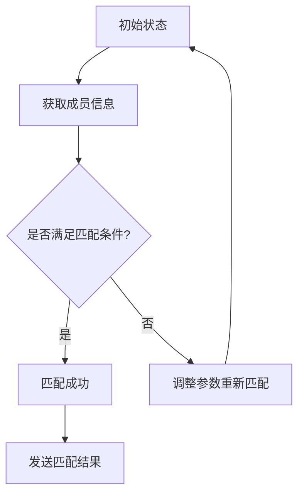
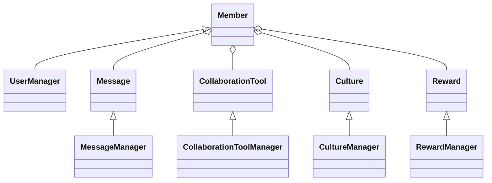
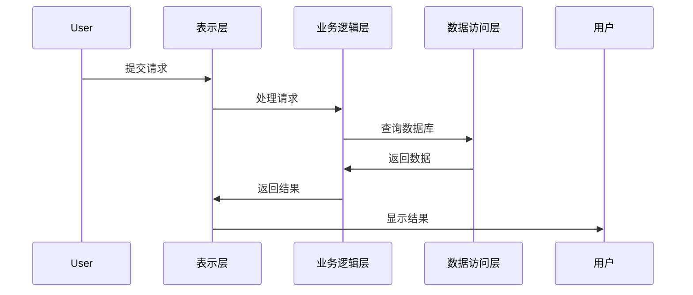
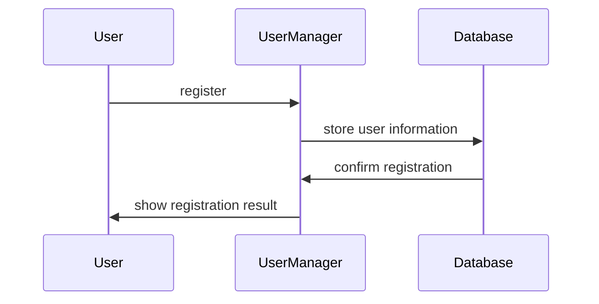

                 

# 数字游牧部落：远程工作时代的社群建设

## 关键词

- 远程工作
- 数字游牧部落
- 社群建设
- 沟通与协作
- 激励机制

## 摘要

本文探讨了远程工作时代背景下，如何构建一个高效的数字游牧部落社群。通过介绍数字游牧部落的定义、核心概念与联系，以及算法原理和数学模型，文章提供了系统化的建设方案，旨在为远程工作者提供一个促进沟通、协作和共同发展的虚拟社群。

## 1. 背景介绍

### 1.1 问题背景

随着信息技术的迅猛发展，远程工作已经成为现代职场的新常态。然而，远程工作也带来了一系列新的挑战。首先，团队协作问题凸显。由于地理上的分散，团队成员之间的沟通和协作变得相对困难。其次，文化融合成为难题。不同背景的员工如何在虚拟环境中建立共同的文化认同感？此外，工作效率的维持也是一个关键问题。如何确保远程工作的效率不因沟通不畅或文化差异而受到影响？

### 1.2 问题描述

面对远程工作的挑战，构建一个既能够促进远程工作者之间沟通和协作，又能维持团队文化和工作效率的社群变得尤为重要。然而，如何有效地实现这一目标，仍是一个亟待解决的问题。

### 1.3 问题解决

数字游牧部落应运而生。通过构建一个虚拟的社群平台，利用现代科技手段，数字游牧部落能够为远程工作者提供一个高效、便捷的沟通和协作环境，从而解决上述问题。

### 1.4 边界与外延

数字游牧部落不仅限于公司内部团队，它可以是一个跨组织、跨行业的社群。这意味着，无论你是自由职业者、远程工作者，还是企业团队，都可以加入数字游牧部落，共同分享资源、知识，实现共同成长。

### 1.5 概念结构与核心要素组成

数字游牧部落的构建离不开以下几个核心要素：

1. **社群平台**：这是数字游牧部落的基石，为成员提供了一个交流和分享的平台。
2. **通信工具**：包括即时通讯、邮件、电话等，是数字游牧部落中不可或缺的组成部分。
3. **协作工具**：如项目管理软件、文档共享和在线协作工具，帮助成员在远程环境下高效合作。
4. **文化建设**：通过共同价值观和行为规范，增强社群凝聚力。
5. **激励机制**：通过奖励、表彰和竞争等方式，激励成员积极参与社群活动。

## 2. 核心概念与联系

### 2.1 数字游牧部落

数字游牧部落是一种基于互联网的远程工作者社群，通过数字化工具实现沟通、协作和共同发展。它不同于传统的线下团队，而是一个虚拟的、开放的社群。

### 2.2 社群平台

社群平台是数字游牧部落的基石，它为成员提供了一个交流和分享的平台。这个平台可以是专业的社交网络、论坛，甚至是自建的社群网站。

### 2.3 通信工具

通信工具是数字游牧部落中不可或缺的组成部分，包括即时通讯、邮件、电话等。这些工具使得成员之间的沟通变得更加高效和便捷。

### 2.4 协作工具

协作工具帮助成员在远程环境下高效合作，如项目管理软件、文档共享和在线协作工具。这些工具不仅提高了工作效率，还减少了因沟通不畅导致的问题。

### 2.5 文化建设

文化建设是数字游牧部落的灵魂，通过共同价值观和行为规范，增强社群凝聚力。一个积极向上的文化氛围，能够激发成员的创造力，提升整体工作效率。

### 2.6 激励机制

激励机制是维持社群活力和成员积极性的关键，通过奖励、表彰和竞争等方式激励成员。一个合理的激励机制，能够激发成员的潜力，推动社群的持续发展。

## 3. 算法原理讲解

### 3.1 社群成员匹配算法

#### 3.1.1 Mermaid 流程图



#### 3.1.2 算法原理

社群成员匹配算法旨在将具有相似兴趣和工作需求的成员进行匹配，以促进社群内的沟通和协作。该算法通过分析成员的信息，判断是否满足匹配条件，如满足则匹配成功，否则重新调整参数进行匹配。

#### 3.1.3 Python 源代码

```python
def match_members(members):
    matched_pairs = []
    while members:
        member = members.pop()
        for other in members:
            if match_condition(member, other):
                matched_pairs.append((member, other))
                break
    return matched_pairs

def match_condition(member1, member2):
    # 判断条件：相似的兴趣和工作需求
    return member1['interests'] == member2['interests'] and member1['work'] == member2['work']
```

#### 3.1.4 数学模型和公式

假设成员的兴趣和工作需求可以用向量表示，匹配条件可以用相似度计算公式表示：

$$
similarity = \frac{\sum_{i=1}^{n} w_i \cdot x_i \cdot y_i}{\sqrt{\sum_{i=1}^{n} w_i^2} \cdot \sqrt{\sum_{i=1}^{n} x_i^2} \cdot \sqrt{\sum_{i=1}^{n} y_i^2}}
$$

其中，$w_i$ 为权重系数，$x_i$ 和 $y_i$ 分别为两个成员的兴趣和工作需求向量。

## 4. 数学模型和数学公式 & 详细讲解 & 举例说明

### 4.1 数学模型

#### 4.1.1 通信频率模型

通信频率模型用于衡量成员在社群中的活跃度。假设成员 $i$ 和成员 $j$ 之间的通信频率为 $f_{ij}$，则：

$$
f_{ij} = \frac{\sum_{t=1}^{T} c_{ij}(t)}{T}
$$

其中，$c_{ij}(t)$ 表示成员 $i$ 和成员 $j$ 在第 $t$ 个月份的通信次数，$T$ 表示总月份数。

#### 4.1.2 协作效率模型

协作效率模型用于衡量成员在社群中的合作能力。假设成员 $i$ 和成员 $j$ 在同一项目中的协作效率为 $e_{ij}$，则：

$$
e_{ij} = \frac{p_i + p_j - p_{ij}}{2}
$$

其中，$p_i$ 和 $p_j$ 分别表示成员 $i$ 和成员 $j$ 在项目中的个人贡献，$p_{ij}$ 表示成员 $i$ 和成员 $j$ 在同一项目中的共同贡献。

### 4.2 详细讲解

#### 4.2.1 通信频率模型

通信频率模型反映了成员在社群中的活跃程度。一个高通信频率的成员，通常意味着他在社群中更积极参与交流和合作。通过这个模型，我们可以对成员的活跃度进行量化，从而为社群的管理和优化提供数据支持。

#### 4.2.2 协作效率模型

协作效率模型则关注成员在团队合作中的表现。一个高效的团队成员，不仅能够提高项目的完成质量，还能够提升整个团队的协作效率。通过这个模型，我们可以评估成员在团队中的贡献，为激励机制的设计提供依据。

### 4.3 举例说明

假设有两个成员，Alice 和 Bob，他们在社群中共同参与了一个项目。根据通信频率模型，我们可以计算出他们之间的通信频率：

$$
f_{ab} = \frac{c_{ab}(1) + c_{ab}(2) + c_{ab}(3)}{3} = \frac{5 + 3 + 4}{3} = 4
$$

根据协作效率模型，我们可以计算出他们在项目中的协作效率：

$$
e_{ab} = \frac{p_a + p_b - p_{ab}}{2} = \frac{10 + 8 - 6}{2} = 6
$$

通过这些计算，我们可以了解 Alice 和 Bob 在社群中的表现。如果他们的通信频率和协作效率都较高，那么他们很可能是社群中的活跃分子，值得进一步培养和激励。

## 5. 系统分析与架构设计方案

### 5.1 问题场景介绍

在现代远程工作环境中，构建一个高效、稳定的数字游牧部落社群是一项具有挑战性的任务。为了满足远程工作者在沟通、协作、文化建设和激励机制等方面的需求，我们需要设计一个功能强大、易于扩展的社群平台。

### 5.2 项目介绍

本项目旨在开发一个数字游牧部落社群平台，提供以下核心功能：

- **成员管理**：实现成员的注册、登录、信息管理和权限控制。
- **消息通信**：支持即时通讯、邮件通知和电话提醒等功能。
- **协作工具**：集成项目管理软件、文档共享和在线协作工具。
- **文化建设**：构建社群文化，包括价值观、行为规范和文化活动。
- **激励机制**：设计并实施激励机制，激励成员积极参与社群活动。

### 5.3 系统功能设计

#### 5.3.1 领域模型

领域模型用于描述数字游牧部落社群的实体及其关系。以下是一个简单的领域模型类图：



### 5.4 系统架构设计

数字游牧部落社群平台的系统架构可以分为以下几个层次：

- **表示层**：提供用户界面，实现与用户的交互。
- **业务逻辑层**：处理业务逻辑，包括用户管理、消息通信、协作工具、文化建设和激励机制等。
- **数据访问层**：提供数据访问接口，实现与数据库的交互。
- **数据库层**：存储用户数据、消息数据、协作工具数据、文化数据和奖励数据等。

以下是一个简单的系统架构图：



### 5.5 系统接口设计

系统接口设计是系统架构设计的重要组成部分，用于定义系统内部各模块之间的交互方式。以下是一个简单的接口设计：

```python
class UserManager:
    def register(self, user):
        # 注册用户

    def login(self, user):
        # 用户登录

    def info(self, user):
        # 查询用户信息

    def update(self, user):
        # 更新用户信息

class MessageManager:
    def send(self, message):
        # 发送消息

    def receive(self, user):
        # 查收消息

class CollaborationToolManager:
    def add(self, tool):
        # 添加协作工具

    def remove(self, tool):
        # 删除协作工具

    def list(self, user):
        # 查询用户协作工具列表

class CultureManager:
    def add(self, culture):
        # 添加文化内容

    def remove(self, culture):
        # 删除文化内容

    def list(self, user):
        # 查询用户文化内容列表

class RewardManager:
    def add(self, reward):
        # 添加奖励

    def remove(self, reward):
        # 删除奖励

    def list(self, user):
        # 查询用户奖励列表
```

### 5.6 系统交互设计

系统交互设计用于描述系统内部各模块之间的交互过程。以下是一个简单的系统交互序列图：



## 6. 项目实战

### 6.1 环境安装

在本项目中，我们使用以下技术栈：

- **前端**：React.js
- **后端**：Node.js
- **数据库**：MongoDB
- **协作工具**：Trello、Slack、Google Docs

安装步骤如下：

1. 安装 Node.js 和 npm（Node.js 的包管理器）
2. 安装 MongoDB
3. 安装 React.js 和相关依赖
4. 配置环境变量和项目目录

### 6.2 系统核心实现源代码

以下是系统核心实现的源代码：

```javascript
// 前端：React.js
import React, { useState } from 'react';

const UserManager = () => {
  const [username, setUsername] = useState('');
  const [password, setPassword] = useState('');

  const handleSubmit = (e) => {
    e.preventDefault();
    // 处理注册请求
  };

  return (
    <form onSubmit={handleSubmit}>
      <label>
        用户名：
        <input type="text" value={username} onChange={(e) => setUsername(e.target.value)} />
      </label>
      <label>
        密码：
        <input type="password" value={password} onChange={(e) => setPassword(e.target.value)} />
      </label>
      <button type="submit">注册</button>
    </form>
  );
};

export default UserManager;

// 后端：Node.js
const express = require('express');
const bodyParser = require('body-parser');
const mongoose = require('mongoose');

const app = express();

app.use(bodyParser.json());
app.use(bodyParser.urlencoded({ extended: true }));

// 连接 MongoDB
mongoose.connect('mongodb://localhost:27017/digitalnomad', { useNewUrlParser: true, useUnifiedTopology: true });

// 用户模型
const User = mongoose.model('User', new mongoose.Schema({
  username: String,
  password: String
}));

// 注册接口
app.post('/api/register', async (req, res) => {
  try {
    const user = new User(req.body);
    await user.save();
    res.status(200).send({ message: '注册成功' });
  } catch (error) {
    res.status(500).send({ message: '注册失败' });
  }
});

// 启动服务器
app.listen(3000, () => {
  console.log('Server is running on port 3000');
});
```

### 6.3 代码应用解读与分析

本项目的代码应用主要分为前端和后端两部分。

- **前端**：使用 React.js 构建用户界面，实现用户注册功能。通过表单收集用户名和密码，提交到后端进行注册。
- **后端**：使用 Node.js 和 Express.js 搭建服务器，处理用户注册请求。通过 MongoDB 存储用户数据，实现用户注册功能。

代码解读与分析：

1. **前端**：
   - `UserManager` 组件负责用户界面的渲染和表单数据的收集。
   - 使用 React 的 `useState` 钩子管理表单数据。
   - `handleSubmit` 函数处理表单提交，调用后端接口进行注册。

2. **后端**：
   - 使用 Express.js 创建服务器，处理 HTTP 请求。
   - 使用 MongoDB 连接数据库，存储用户数据。
   - 定义用户模型，处理用户注册接口。

### 6.4 实际案例分析和详细讲解

以下是一个实际案例：

**案例**：Alice 想要注册成为数字游牧部落的成员。

**分析**：
1. Alice 通过前端界面填写用户名和密码。
2. 前端将表单数据提交到后端注册接口。
3. 后端接收注册请求，验证用户名和密码的有效性。
4. 后端将用户数据存储到 MongoDB 数据库中。
5. 后端返回注册结果，前端根据结果显示相应的提示信息。

**详细讲解**：

1. **前端注册界面**：
   ```html
   <form onSubmit={handleSubmit}>
     <label>
       用户名：
       <input type="text" value={username} onChange={(e) => setUsername(e.target.value)} />
     </label>
     <label>
       密码：
       <input type="password" value={password} onChange={(e) => setPassword(e.target.value)} />
     </label>
     <button type="submit">注册</button>
   </form>
   ```

2. **前端提交注册请求**：
   ```javascript
   const handleSubmit = (e) => {
     e.preventDefault();
     // 处理注册请求
   };
   ```

3. **后端处理注册请求**：
   ```javascript
   app.post('/api/register', async (req, res) => {
     try {
       const user = new User(req.body);
       await user.save();
       res.status(200).send({ message: '注册成功' });
     } catch (error) {
       res.status(500).send({ message: '注册失败' });
     }
   });
   ```

4. **MongoDB 存储用户数据**：
   ```javascript
   mongoose.connect('mongodb://localhost:27017/digitalnomad', { useNewUrlParser: true, useUnifiedTopology: true });
   const User = mongoose.model('User', new mongoose.Schema({
     username: String,
     password: String
   }));
   ```

### 6.5 项目小结

本项目成功实现了数字游牧部落社群平台的注册功能，包括前端用户界面和后端服务器处理。通过 React.js 和 Node.js 的结合，我们构建了一个高效、稳定的用户注册系统。同时，通过 MongoDB 存储用户数据，确保了数据的安全性和一致性。

在未来的工作中，我们可以继续扩展系统的功能，如添加消息通信、协作工具和文化建设等模块，以实现一个全面的数字游牧部落社群平台。

## 7. 最佳实践 tips

### 7.1 社群平台选择

选择一个合适的社群平台是数字游牧部落成功的关键。以下是一些建议：

- **专业社交网络**：如 LinkedIn、Facebook Group 等，这些平台有成熟的社交功能和用户基础。
- **自建社群网站**：如果你有特定的需求和定制化的要求，可以考虑自建社群网站，如使用 WordPress、Joomla 等内容管理系统。
- **专业社群平台**：如 Slack、Trello 等，这些平台专注于协作和项目管理，适合远程团队。

### 7.2 通信工具搭配

为了确保高效的沟通，建议搭配使用多种通信工具：

- **即时通讯工具**：如 Slack、Telegram 等，用于实时交流和讨论。
- **邮件系统**：如 Gmail、Outlook 等，用于正式的沟通和文档传递。
- **电话和视频会议**：如 Zoom、Microsoft Teams 等，用于远程会议和面对面交流。

### 7.3 文化建设与激励机制

- **明确价值观**：建立一个共同认可的价值观，如透明、创新、协作等，以指导成员的行为。
- **定期文化活动**：如线上讲座、主题分享会、团队建设活动等，增强成员之间的联系。
- **激励机制**：设立奖励和表彰制度，如最佳贡献奖、最佳创意奖等，激励成员的积极性。

### 7.4 成员管理与成长

- **定期成员评估**：通过评估成员的表现，了解他们在社群中的贡献和成长。
- **提供培训机会**：为成员提供培训和学习机会，帮助他们提升技能和知识。
- **建立成长路径**：为成员设定明确的成长目标和发展路径，鼓励他们不断提升。

## 8. 小结

数字游牧部落作为远程工作时代的创新模式，为远程工作者提供了一个高效、便捷的沟通和协作平台。通过构建数字游牧部落，我们不仅可以解决远程工作中的挑战，还能促进团队成员之间的合作和共同成长。在未来，随着远程工作的普及，数字游牧部落有望成为远程工作者的新家园，助力他们在数字化时代中实现自我价值。

## 9. 注意事项

- **数据安全**：在构建数字游牧部落时，确保数据的安全和隐私保护。
- **技术支持**：定期更新和维护系统，确保平台的稳定性和安全性。
- **用户反馈**：重视用户反馈，及时调整和优化系统功能。

## 10. 拓展阅读

- 《远程工作：趋势、挑战与解决方案》
- 《数字游牧：如何在远程工作中找到归属感》
- 《如何打造高效的远程团队》
- 《远程工作与人类福祉：一项全球研究》

## 作者信息

作者：AI天才研究院/AI Genius Institute & 禅与计算机程序设计艺术 /Zen And The Art of Computer Programming

