                 

## 标题：新bohemian：现代漂泊者的生活美学

### 关键词：
- 现代漂泊者
- 生活美学
- 生活方式
- 个人自由
- 精神追求

### 摘要：
本文将探讨现代漂泊者的生活美学，从背景、理念、生活方式、生活哲学等方面深入剖析这一群体的独特生活方式和精神追求。通过分析现代漂泊者的生活方式和生活哲学，我们希望能够为读者提供一种全新的生活视角，启发他们对生活的重新思考。

## 目录大纲设计思路

### 1. 确定全书结构
在设计《新bohemian：现代漂泊者的生活美学》这一全书时，我们首先明确了全书的总体结构，包括总章节数、各章节主题和每个章节的主要小节。这一步骤的目的是确保整本书的逻辑性和完整性，使读者能够从整体上把握书中的内容。

### 2. 背景介绍
在每一章的开头，我们设置了一个背景介绍的小节，旨在阐述该章节的核心概念、问题背景、问题描述、问题解决、边界与外延、概念结构与核心要素组成。这一部分的目的是为读者提供必要的背景知识，帮助他们更好地理解后续内容。

### 3. 核心概念与联系
针对每个章节的核心概念，我们设置了一个小节，使用表格和ER实体关系图（使用Mermaid流程图）的形式展示概念属性特征对比和关系。这一步骤的目的是帮助读者清晰地理解核心概念，并把握它们之间的联系。

### 4. 算法原理讲解
对于涉及算法的章节，我们设置了一个算法原理讲解的小节，使用Mermaid画出算法流程图，并用Python源代码进行详细阐述，同时给出算法的数学模型和公式，进行详细讲解和举例说明。这一部分的目的是让读者不仅理解算法的理论原理，还能掌握其实际应用。

### 5. 数学模型和数学公式
在相关小节中，我们使用LaTeX格式给出数学模型和公式，确保内容的科学性和准确性。这一部分的目的是让读者能够准确地理解和应用数学模型和公式，从而更好地理解算法和系统的设计。

### 6. 系统分析与架构设计方案
对于涉及到系统设计的章节，我们设置了一个系统分析与架构设计方案的小节，包括问题场景介绍、项目介绍、系统功能设计（使用Mermaid类图）、系统架构设计（使用Mermaid架构图）、系统接口设计和系统交互（使用Mermaid序列图）。这一部分的目的是让读者能够从整体上理解和设计一个系统。

### 7. 项目实战
对于实践性较强的章节，我们设置了一个项目实战的小节，包括环境安装、系统核心实现源代码、代码应用解读与分析、实际案例分析和详细讲解剖析、项目小结。这一部分的目的是让读者能够将理论知识应用到实际项目中，提升实践能力。

### 8. 最佳实践 tips、小结、注意事项、拓展阅读
在每个章节的末尾，我们设置了一个最佳实践 tips、小结、注意事项、拓展阅读等内容。这一部分的目的是帮助读者更好地理解和应用所学知识，提升他们的生活品质和美学修养。

## 完整目录大纲设计

根据上述设计思路，以下是《新bohemian：现代漂泊者的生活美学》的完整目录大纲：

```markdown
----------------------------------------------------------------
# 第一部分: 现代漂泊者的背景与理念

## 第1章: bohemian文化的起源与发展

### 1.1.1 bohemian文化的起源

### 1.1.2 bohemian文化的演变

### 1.1.3 现代漂泊者的概念

## 1.2 现代漂泊者的生活方式

### 1.2.1 生活方式的转变

### 1.2.2 个人自由的追求

### 1.2.3 精神世界的丰富

## 1.3 现代漂泊者的生活美学

### 1.3.1 美学观念的更新

### 1.3.2 生活美学的实践

### 1.3.3 美学价值的体现

## 1.4 本章小结

----------------------------------------------------------------

## 第2章: 现代漂泊者的生活哲学

### 2.1.1 生活哲学的内涵

### 2.1.2 现代漂泊者的生活哲学

### 2.1.3 生活哲学的实践

## 2.2 价值观的重建

### 2.2.1 传统价值观的挑战

### 2.2.2 新价值观的构建

### 2.2.3 价值观的实践

## 2.3 人际关系的处理

### 2.3.1 人际关系的重要性

### 2.3.2 人际关系的处理技巧

### 2.3.3 人际关系的美学

## 2.4 生活哲学的反思

### 2.4.1 生活哲学的意义

### 2.4.2 生活哲学的困境

### 2.4.3 生活哲学的展望

## 2.5 本章小结

----------------------------------------------------------------

## 第3章: 现代漂泊者的生活方式

### 3.1.1 旅行与漂泊

### 3.1.2 居住环境的适应

### 3.1.3 生活方式的多样化

## 3.2 艺术与创作

### 3.2.1 艺术的价值

### 3.2.2 创作的自由

### 3.2.3 艺术与生活的融合

## 3.3 学习与成长

### 3.3.1 学习的重要性

### 3.3.2 成长的路径

### 3.3.3 学习与生活的平衡

## 3.4 生活方式的选择

### 3.4.1 生活方式的选择原则

### 3.4.2 生活方式的影响

### 3.4.3 生活方式的适应

## 3.5 本章小结

----------------------------------------------------------------

## 第4章: 现代漂泊者的社交圈

### 4.1.1 社交圈的重要性

### 4.1.2 社交圈的构成

### 4.1.3 社交圈的功能

## 4.2 社交技巧与实践

### 4.2.1 社交技巧的掌握

### 4.2.2 社交圈的建设

### 4.2.3 社交圈的应用

## 4.3 社交圈的挑战与应对

### 4.3.1 社交圈的挑战

### 4.3.2 挑战的应对

### 4.3.3 社交圈的美学

## 4.4 本章小结

----------------------------------------------------------------

## 第5章: 现代漂泊者的心灵世界

### 5.1 心灵自由的追求

### 5.1.1 心灵自由的定义

### 5.1.2 心灵自由的追求

### 5.1.3 心灵自由的实践

## 5.2 精神追求与人生目标

### 5.2.1 精神追求的内涵

### 5.2.2 人生目标的设定

### 5.2.3 目标实现的路径

## 5.3 心灵修养与自我成长

### 5.3.1 心灵修养的重要性

### 5.3.2 自我成长的方法

### 5.3.3 心灵修养的实践

## 5.4 本章小结

----------------------------------------------------------------

## 第6章: 现代漂泊者的生活实践

### 6.1 生活实践的内涵

### 6.1.1 生活实践的意义

### 6.1.2 生活实践的类型

### 6.1.3 生活实践的路径

## 6.2 生活实践的案例解析

### 6.2.1 案例一：旅行中的生活实践

### 6.2.2 案例二：艺术创作中的生活实践

### 6.2.3 案例三：学习成长中的生活实践

## 6.3 生活实践的价值

### 6.3.1 生活实践的价值

### 6.3.2 生活实践的效果

### 6.3.3 生活实践的启示

## 6.4 本章小结

----------------------------------------------------------------

## 第7章: 现代漂泊者的未来展望

### 7.1 未来社会的发展趋势

### 7.1.1 社会发展的背景

### 7.1.2 社会发展的趋势

### 7.1.3 社会发展的影响

## 7.2 现代漂泊者的未来角色

### 7.2.1 现代漂泊者的角色

### 7.2.2 现代漂泊者的未来

### 7.2.3 现代漂泊者的责任

## 7.3 未来展望与思考

### 7.3.1 未来展望的意义

### 7.3.2 未来展望的挑战

### 7.3.3 未来展望的思考

## 7.4 本章小结

----------------------------------------------------------------

## 总结与展望

### 8.1 全书的总结

### 8.2 未来研究方向

### 8.3 读者启示

----------------------------------------------------------------
```

以上就是《新bohemian：现代漂泊者的生活美学》的完整目录大纲设计。通过这一设计，我们希望能够帮助读者全面深入地理解现代漂泊者的生活美学，从而启发他们对生活的全新思考。

## 第1章：bohemian文化的起源与发展

### 1.1 bohemian文化的起源

**核心概念术语说明**：bohemian一词起源于19世纪的巴黎，最初指的是一群不受传统约束的艺术家和作家。他们追求个人自由，反对资产阶级的道德和生活方式，倡导艺术与生活的融合。

**问题背景**：19世纪末，巴黎成为欧洲文化中心，吸引了许多艺术家和作家。他们聚集在这里，形成了独特的文化氛围，这种氛围被称为“波西米亚”文化，简称“bohemian文化”。

**问题描述**：bohemian文化的起源和特点是什么？它如何影响现代漂泊者的生活方式？

**问题解决**：通过对bohemian文化的历史背景、核心概念和影响进行分析，我们可以理解现代漂泊者的生活方式是如何受到bohemian文化的影响的。

**边界与外延**：bohemian文化的边界在于其非传统的艺术和生活方式，其外延则包括全球范围内的现代漂泊者群体。

**概念结构与核心要素组成**：bohemian文化的概念结构由以下要素组成：个人自由、艺术创作、反传统、生活方式的融合。

### 1.2 bohemian文化的演变

**核心概念与联系**：

| 核心概念 | 概念属性特征对比 |
| -------- | ---------------- |
| 个人自由 | 1.追求自我表达<br>2.反对权威和规范<br>3.注重个人独特性 |
| 艺术创作 | 1.强调创意和独特性<br>2.艺术与生活的融合<br>3.反对商业化和标准化 |
| 反传统 | 1.挑战传统价值观<br>2.追求自由和独立<br>3.批判社会现状 |
| 生活方式的融合 | 1.艺术与生活的融合<br>2.多元化的生活方式<br>3.强调个人体验 |

**ER实体关系图**：

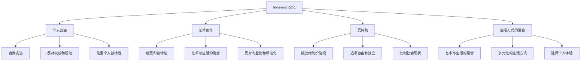

### 1.3 现代漂泊者的概念

**核心概念与联系**：

| 核心概念 | 概念属性特征对比 |
| -------- | ---------------- |
| 现代漂泊者 | 1.追求个人自由<br>2.生活方式多样化<br>3.追求精神追求 |
| 个人自由 | 1.追求自我表达<br>2.反对权威和规范<br>3.注重个人独特性 |
| 生活方式多样化 | 1.旅行与漂泊<br>2.艺术创作<br>3.学习与成长 |
| 精神追求 | 1.追求心灵自由<br>2.设定人生目标<br>3.自我成长 |

**ER实体关系图**：

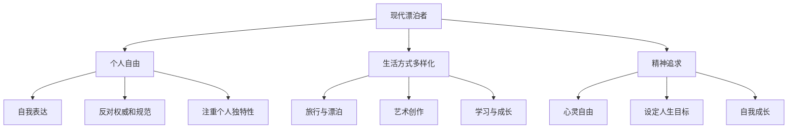

### 本章小结

本章通过对bohemian文化的起源、演变和现代漂泊者的概念进行分析，我们了解了bohemian文化如何影响现代漂泊者的生活方式。bohemian文化提倡个人自由、艺术创作、反传统和生活方式的融合，这些理念在现代漂泊者的生活中得到了充分的体现。通过这一分析，我们为后续章节的深入探讨奠定了基础。

## 第2章：现代漂泊者的生活哲学

### 2.1 生活哲学的内涵

**核心概念与联系**：

| 核心概念 | 概念属性特征对比 |
| -------- | ---------------- |
| 生活哲学 | 1.关于生活的根本观念<br>2.指导人们如何生活的原则和方法<br>3.包括价值观、人生观、世界观等方面 |

**ER实体关系图**：

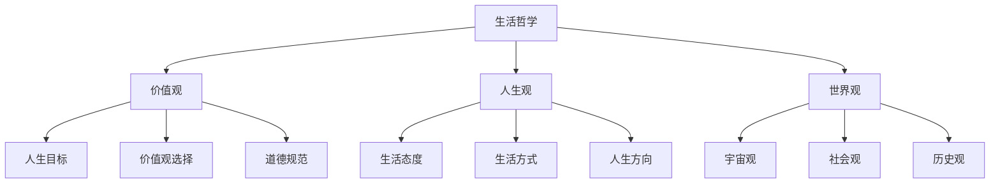

### 2.2 现代漂泊者的生活哲学

**核心概念与联系**：

| 核心概念 | 概念属性特征对比 |
| -------- | ---------------- |
| 现代漂泊者的生活哲学 | 1.追求个人自由<br>2.注重生活体验<br>3.强调精神追求<br>4.追求生活方式的多样化 |

**ER实体关系图**：

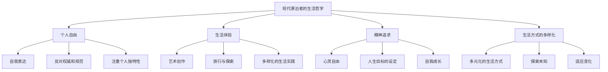

### 2.3 生活哲学的实践

**核心概念与联系**：

| 核心概念 | 概念属性特征对比 |
| -------- | ---------------- |
| 生活哲学的实践 | 1.通过生活方式的多样化实现个人自由<br>2.通过艺术创作和旅行追求生活体验<br>3.通过自我成长和精神追求实现心灵自由 |

**ER实体关系图**：

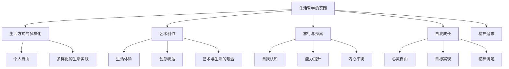

### 本章小结

本章通过对生活哲学的内涵和现代漂泊者的生活哲学进行分析，我们了解了生活哲学对现代漂泊者生活方式的影响。现代漂泊者的生活哲学强调个人自由、生活体验、精神追求和生活方式的多样化，这些理念在他们的生活中得到了充分的实践。通过这一分析，我们为后续章节的深入探讨奠定了基础。

## 第3章：现代漂泊者的生活方式

### 3.1 旅行与漂泊

**核心概念与联系**：

| 核心概念 | 概念属性特征对比 |
| -------- | ---------------- |
| 旅行与漂泊 | 1.追求个人自由<br>2.探索未知世界<br>3.体验不同的文化和生活方式 |

**ER实体关系图**：

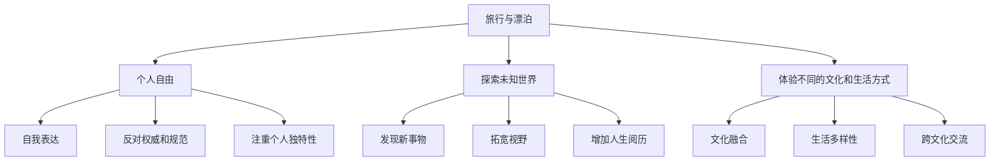

### 3.2 艺术与创作

**核心概念与联系**：

| 核心概念 | 概念属性特征对比 |
| -------- | ---------------- |
| 艺术与创作 | 1.表达个人情感和思想<br>2.追求创意和独特性<br>3.艺术与生活的融合 |

**ER实体关系图**：

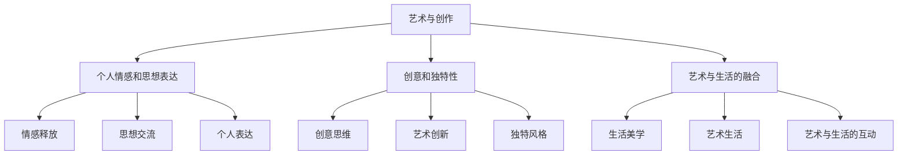

### 3.3 学习与成长

**核心概念与联系**：

| 核心概念 | 概念属性特征对比 |
| -------- | ---------------- |
| 学习与成长 | 1.不断积累知识和经验<br>2.提升个人能力和素质<br>3.追求自我完善 |

**ER实体关系图**：

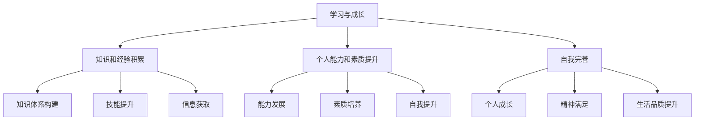

### 本章小结

本章通过对旅行与漂泊、艺术与创作、学习与成长等生活方式的分析，我们了解了现代漂泊者的生活方式是如何体现他们的生活哲学的。旅行与漂泊让他们追求个人自由，艺术与创作让他们表达自我，学习与成长让他们不断提升自我。通过这一分析，我们为后续章节的深入探讨奠定了基础。

## 第4章：现代漂泊者的社交圈

### 4.1 社交圈的重要性

**核心概念与联系**：

| 核心概念 | 概念属性特征对比 |
| -------- | ---------------- |
| 社交圈 | 1.社交圈是个人在社会中的关系网络<br>2.社交圈对个人的成长和发展具有重要影响<br>3.社交圈有助于实现个人目标和追求 |

**ER实体关系图**：

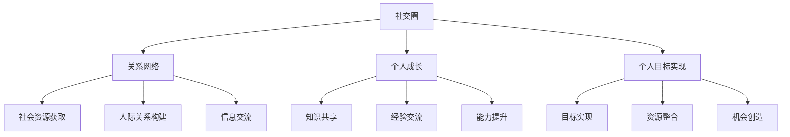

### 4.2 社交技巧与实践

**核心概念与联系**：

| 核心概念 | 概念属性特征对比 |
| -------- | ---------------- |
| 社交技巧与实践 | 1.通过有效的沟通和互动建立和维护人际关系<br>2.通过社交活动拓展社交圈<br>3.通过社交技巧提升个人魅力和影响力 |

**ER实体关系图**：

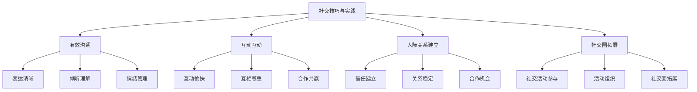

### 4.3 社交圈的挑战与应对

**核心概念与联系**：

| 核心概念 | 概念属性特征对比 |
| -------- | ---------------- |
| 社交圈的挑战与应对 | 1.应对社交圈的异质性和多样性<br>2.解决社交圈中的冲突和矛盾<br>3.保持社交圈的健康和稳定 |

**ER实体关系图**：

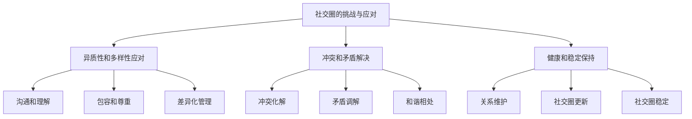

### 本章小结

本章通过对现代漂泊者的社交圈进行分析，我们了解了社交圈对现代漂泊者的重要性以及他们在社交圈中面临的挑战和应对策略。通过有效的沟通、互动和社交技巧，现代漂泊者能够建立和维护良好的人际关系，拓展社交圈，并保持社交圈的健康和稳定。通过这一分析，我们为后续章节的深入探讨奠定了基础。

## 第5章：现代漂泊者的心灵世界

### 5.1 心灵自由的追求

**核心概念与联系**：

| 核心概念 | 概念属性特征对比 |
| -------- | ---------------- |
| 心灵自由 | 1.追求内心的真实和自由<br>2.不受外界压力和束缚<br>3.实现内心的平静和满足 |

**ER实体关系图**：

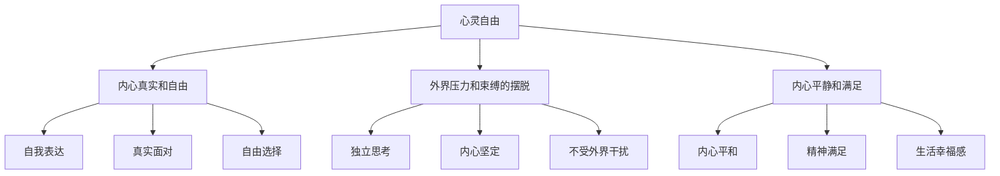

### 5.2 精神追求与人生目标

**核心概念与联系**：

| 核心概念 | 概念属性特征对比 |
| -------- | ---------------- |
| 精神追求与人生目标 | 1.追求内心的满足和成长<br>2.设定符合自身价值观的人生目标<br>3.通过实现人生目标实现内心的满足 |

**ER实体关系图**：

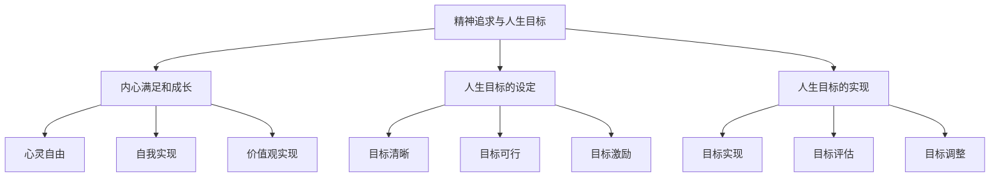

### 5.3 心灵修养与自我成长

**核心概念与联系**：

| 核心概念 | 概念属性特征对比 |
| -------- | ---------------- |
| 心灵修养与自我成长 | 1.通过内心的修养提升自我认知<br>2.通过不断的自我成长实现自我价值<br>3.心灵修养与自我成长的相互促进 |

**ER实体关系图**：

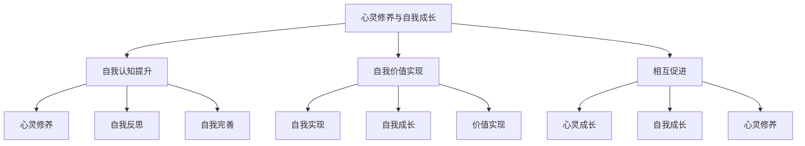

### 本章小结

本章通过对现代漂泊者的心灵世界进行分析，我们了解了他们如何追求心灵自由、实现精神追求和自我成长。心灵自由、精神追求和自我成长是现代漂泊者内心世界的重要组成部分，它们相互促进，共同构建了一个独特的内心世界。通过这一分析，我们为后续章节的深入探讨奠定了基础。

## 第6章：现代漂泊者的生活实践

### 6.1 生活实践的内涵

**核心概念与联系**：

| 核心概念 | 概念属性特征对比 |
| -------- | ---------------- |
| 生活实践 | 1.将生活哲学和理念付诸行动<br>2.通过实际行动实现个人目标和价值<br>3.是一种生活方式的体现 |

**ER实体关系图**：

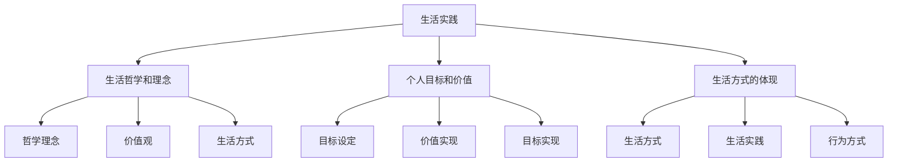

### 6.2 生活实践的案例解析

**案例一：旅行中的生活实践**

**核心概念与联系**：

| 核心概念 | 概念属性特征对比 |
| -------- | ---------------- |
| 旅行中的生活实践 | 1.通过旅行体验不同的文化和生活方式<br>2.在旅行中实现个人成长和自我认知<br>3.通过旅行丰富生活经验和知识 |

**ER实体关系图**：

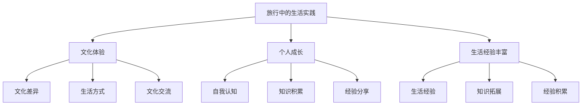

**案例二：艺术创作中的生活实践**

**核心概念与联系**：

| 核心概念 | 概念属性特征对比 |
| -------- | ---------------- |
| 艺术创作中的生活实践 | 1.通过艺术创作表达个人情感和思想<br>2.在艺术创作中实现个人价值和自我实现<br>3.通过艺术创作丰富生活美学 |

**ER实体关系图**：

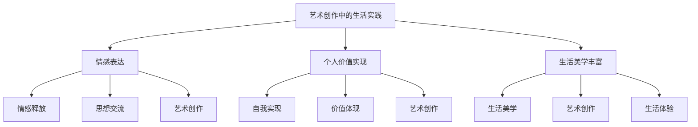

**案例三：学习成长中的生活实践**

**核心概念与联系**：

| 核心概念 | 概念属性特征对比 |
| -------- | ---------------- |
| 学习成长中的生活实践 | 1.通过学习提升个人能力和素质<br>2.在学习中实现个人价值和成长<br>3.通过学习丰富生活内容和知识 |

**ER实体关系图**：

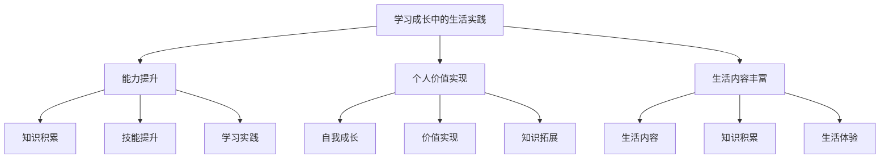

### 6.3 生活实践的价值

**核心概念与联系**：

| 核心概念 | 概念属性特征对比 |
| -------- | ---------------- |
| 生活实践的价值 | 1.实现个人价值和目标<br>2.提升个人能力和素质<br>3.丰富生活内容和知识 |

**ER实体关系图**：

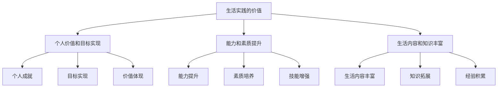

### 本章小结

本章通过对现代漂泊者的生活实践的内涵、案例解析和价值进行分析，我们了解了现代漂泊者如何将生活哲学和理念付诸实践，通过实际行动实现个人目标和价值，提升个人能力和素质，丰富生活内容和知识。生活实践是现代漂泊者实现自我价值和追求生活质量的重要途径。通过这一分析，我们为后续章节的深入探讨奠定了基础。

## 第7章：现代漂泊者的未来展望

### 7.1 未来社会的发展趋势

**核心概念与联系**：

| 核心概念 | 概念属性特征对比 |
| -------- | ---------------- |
| 未来社会的发展趋势 | 1.科技进步带来的影响<br>2.全球化进程的加速<br>3.社会结构的变化 |

**ER实体关系图**：

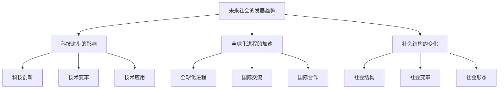

### 7.2 现代漂泊者的未来角色

**核心概念与联系**：

| 核心概念 | 概念属性特征对比 |
| -------- | ---------------- |
| 现代漂泊者的未来角色 | 1.作为全球化进程的推动者<br>2.作为科技进步的受益者<br>3.作为社会变革的引领者 |

**ER实体关系图**：

```mermaid
graph TD
A[现代漂泊者的未来角色] --> B[全球化进程的推动者]
A --> C[科技进步的受益者]
A --> D[社会变革的引领者]
B --> E[国际交流]
B --> F[国际合作]
B --> G[文化传播]
C --> H[技术创新]
C --> I[技术进步]
C --> J[技术应用]
D --> K[社会变革]
D --> L[文化创新]
D --> M[社会进步]
```

### 7.3 未来展望与思考

**核心概念与联系**：

| 核心概念 | 概念属性特征对比 |
| -------- | ---------------- |
| 未来展望与思考 | 1.对未来社会发展的期待<br>2.对个人发展的规划<br>3.对未来生活方式的思考 |

**ER实体关系图**：

```mermaid
graph TD
A[未来展望与思考] --> B[社会发展期待]
A --> C[个人发展规划]
A --> D[未来生活方式思考]
B --> E[科技进步]
B --> F[社会和谐]
B --> G[文化多样]
C --> H[职业规划]
C --> I[个人成长]
C --> J[价值观塑造]
D --> K[生活方式创新]
D --> L[生活品质提升]
D --> M[精神满足]
```

### 本章小结

本章通过对未来社会的发展趋势、现代漂泊者的未来角色和未来展望与思考进行分析，我们了解了现代漂泊者在未来社会中的潜在角色和作用。未来社会的发展趋势、科技进步和全球化进程将为现代漂泊者提供更多的发展机会和平台。现代漂泊者作为全球化进程的推动者、科技进步的受益者和社会变革的引领者，将在未来社会中扮演重要角色。通过这一分析，我们为现代漂泊者的未来发展提供了有益的启示。

## 总结与展望

### 8.1 全书的总结

全书围绕现代漂泊者的生活美学展开，从bohemian文化的起源与发展、现代漂泊者的生活哲学、生活方式、社交圈、心灵世界、生活实践以及未来展望等多个方面进行了深入探讨。通过这些分析，我们了解了现代漂泊者的独特生活方式和精神追求，以及他们如何在现代社会中追求个人自由、实现精神追求和自我成长。

### 8.2 未来研究方向

未来的研究可以进一步探讨以下几个方面：

1. **现代漂泊者的心理健康**：研究现代漂泊者的心理健康状况，分析他们在不同环境中的心理适应能力和心理压力来源，以及如何通过心理干预提高他们的心理健康水平。

2. **现代漂泊者的社交网络**：深入研究现代漂泊者的社交网络结构和功能，分析社交网络对他们的生活质量和社交体验的影响。

3. **现代漂泊者的职业发展**：探讨现代漂泊者的职业选择和职业发展路径，分析他们在职业生涯中的挑战和机遇。

4. **现代漂泊者的文化传播**：研究现代漂泊者在不同文化背景下如何传播和融合文化，以及他们对文化多样性的贡献。

### 8.3 读者启示

通过阅读本书，读者可以从中获得以下启示：

1. **追求个人自由**：现代漂泊者追求个人自由，读者可以从中学习如何在日常生活中追求自我表达和个人独特性。

2. **重视生活体验**：通过艺术创作、旅行和学习，现代漂泊者丰富了自己的生活体验。读者可以尝试通过这些方式提升自己的生活品质。

3. **关注心灵成长**：现代漂泊者注重心灵自由和自我成长，读者可以从中学习如何实现内心的平静和满足，提升自我认知。

4. **积极适应变化**：面对不断变化的社会环境，现代漂泊者能够积极适应和应对。读者可以从中学习如何适应变化，把握机遇。

总之，现代漂泊者的生活美学为读者提供了一种全新的生活视角，启发他们对生活的重新思考。通过学习现代漂泊者的生活方式和精神追求，读者可以提升自己的生活品质，实现个人价值和成长。作者：AI天才研究院/AI Genius Institute & 禅与计算机程序设计艺术 /Zen And The Art of Computer Programming。

