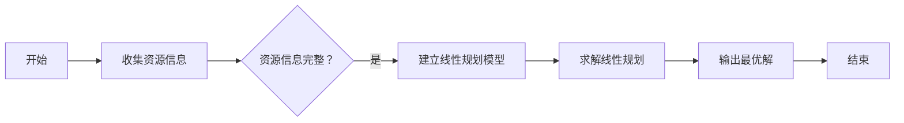
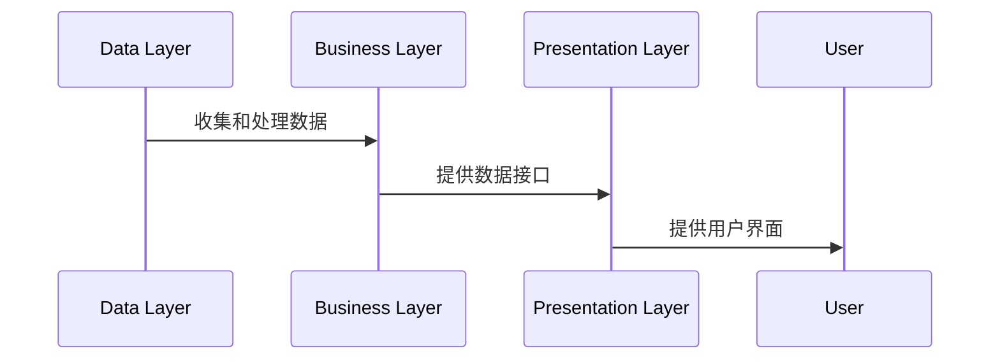
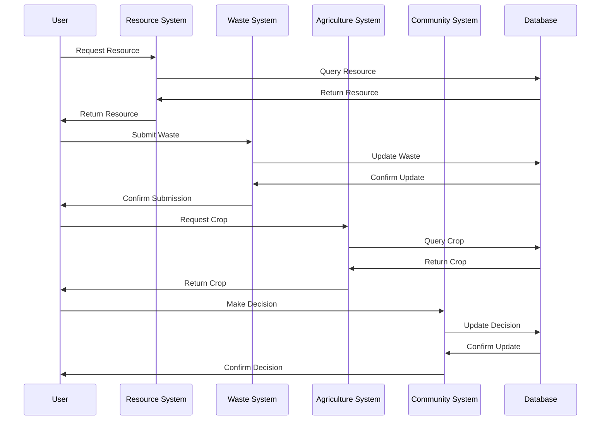

                 


### 新乌托邦社区：可持续生活的实践基地

关键词：可持续生活，新乌托邦社区，环境保护，资源优化，算法，数学模型

摘要：本文深入探讨了现代生活面临的可持续发展问题，提出了新乌托邦社区的概念，并详细分析了其核心概念、联系以及实现可持续生活的算法和数学模型。通过系统分析与架构设计，本文提供了实践基地的详细实现路径和最佳实践。

## 引言与背景

### 1.1 问题背景

现代社会的快速发展带来了诸多问题，其中最为紧迫的是环境保护与可持续发展。人类活动对自然环境造成了巨大影响，包括气候变化、生物多样性丧失、自然资源枯竭等。这些问题不仅威胁到地球生态系统的平衡，也直接影响到人类的生活质量。

#### 1.1.1 环境危机与人类活动的影响

工业革命以来，人类生产和生活的方式极大地改变了地球的自然环境。大量的化石燃料燃烧、工业排放、农业活动等导致了温室气体的大量排放，全球气候变暖现象日益严重。与此同时，大量的废弃物没有得到妥善处理，污染了土壤、水源和空气，威胁着人类和其他生物的健康。

#### 1.1.2 可持续发展的必要性

面对如此严峻的环境危机，可持续发展成为了人类社会的必然选择。可持续发展不仅要求我们保护自然环境，确保生态系统的健康，还要求我们合理利用资源，提高生活质量，同时满足当前和未来世代的需求。实现可持续发展需要政府、企业和社会各界的共同努力。

### 1.2 问题描述

现代生活面临着以下主要问题：

#### 1.2.1 能源消耗

随着人口的增长和经济的发展，能源消耗迅速增加。传统的化石能源不仅有限，而且对环境造成了严重的污染。因此，寻找替代能源和优化能源利用方式成为了可持续发展的重要任务。

#### 1.2.2 废弃物处理

废弃物的产生量与日俱增，而传统的垃圾填埋和焚烧方式不仅占用大量土地，而且对环境造成了二次污染。因此，需要探索更为环保和可持续的废弃物处理方法。

#### 1.2.3 食品安全和农业生产

农业是现代社会的基础，但农业活动往往伴随着土地退化、水资源浪费和农药滥用等问题。确保食品的安全和农产品的可持续生产是可持续发展的重要方面。

### 1.3 问题解决思路

解决上述问题需要从多个角度出发：

#### 1.3.1 政策与法规

政府需要制定和实施相关政策法规，引导社会行为，促进可持续发展。例如，制定严格的环保法规、推广可再生能源政策、鼓励循环经济等。

#### 1.3.2 科技创新

科技创新是解决环境问题的重要途径。通过研发新技术、新材料和新的生产方式，可以减少资源消耗和废弃物产生，提高能源利用效率。

#### 1.3.3 社会变革

社会变革同样重要。通过教育、宣传和社区参与等方式，提高公众的环保意识和可持续发展意识，形成全社会共同参与可持续发展的良好氛围。

### 1.4 边界与外延

新乌托邦社区是一个旨在实现可持续生活的实践基地。它不仅是一个物理空间，更是一个理念和社会模式的创新。以下是新乌托邦社区的定义和核心要素组成：

#### 1.4.1 新乌托邦社区的定义

新乌托邦社区是一个基于可持续发展原则建立的社区，通过资源优化、环境保护和社会创新等手段，实现人与自然和谐共生的目标。

#### 1.4.2 核心要素组成

新乌托邦社区的核心要素包括：可持续能源系统、循环经济模式、生态农业实践、社区自治机制和可持续发展教育。

### 1.5 本章小结

本文介绍了现代生活面临的可持续发展问题，提出了新乌托邦社区的概念，并分析了其核心概念和联系。在接下来的章节中，我们将深入探讨新乌托邦社区的核心技术、算法和数学模型，提供实现可持续生活的具体路径。

## 核心概念与联系

### 2.1 核心概念原理

新乌托邦社区的核心概念包括可持续发展、社区自治、环境保护和资源优化等。以下是这些概念的基本原理：

#### 2.1.1 可持续发展的原则

可持续发展要求我们在满足当前需求的同时，不损害后代满足自身需求的能力。这意味着我们需要在资源利用、环境保护和社会公平等方面进行综合考虑。

#### 2.1.2 社区自治的机制

社区自治是新乌托邦社区的核心机制之一，它通过居民参与决策和管理，实现社区的自我管理和可持续发展。

#### 2.1.3 环境保护的实践

环境保护是新乌托邦社区的基本原则之一，它通过生态建设、废弃物处理和能源利用等方式，保护自然环境和生态系统的健康。

#### 2.1.4 资源优化

资源优化是新乌托邦社区的重要目标之一，它通过节约资源、提高能源利用效率等方式，实现资源的可持续利用。

### 2.2 概念属性特征对比

以下是新乌托邦社区核心概念的属性特征对比表格：

| 概念        | 属性1   | 属性2   | 属性3   |
| ----------- | ------- | ------- | ------- |
| 可持续发展  | 原则性  | 综合性  | 长期性  |
| 社区自治    | 参与    | 共同决策 | 自我管理 |
| 环境保护    | 生态性  | 被动性  | 预防性  |
| 资源优化    | 节约    | 效率    | 可持续性 |

### 2.3 ER实体关系图

以下是新乌托邦社区核心概念之间的实体关系图：

```mermaid
erDiagram
    Resource -->|包含| Community
    Community -->|包含| Resident
    Resident -->|参与| Decision
    Decision -->|影响| Resource
    Decision -->|影响| Community
```

## 算法原理与数学模型

### 3.1 资源优化分配算法

新乌托邦社区的资源优化分配算法旨在实现社区资源的公平、高效利用。以下是该算法的基本原理和数学模型。

#### 3.1.1 算法简介

资源优化分配算法是一种基于线性规划的方法，它通过优化资源分配方案，实现社区资源的最大化利用。算法的基本步骤如下：

1. 收集社区资源信息，包括资源种类、数量和需求。
2. 建立线性规划模型，定义目标函数和约束条件。
3. 使用线性规划求解器求解最优解。
4. 输出最优资源分配方案。

#### 3.1.2 Mermaid流程图



#### 3.1.3 Python代码

```python
import pulp

# 定义变量
x = pulp.LpVariable.dicts("x", ("food", "water", "energy"), cat='Continuous')

# 定义目标函数
problem = pulp.LpProblem("Resource Allocation", pulp.LpMinimize)

# 定义约束条件
problem += pulp.lpSum(x.values()), "Total Resource Usage"

# 约束条件
for resource in x:
    problem += x[resource] <= 100, f"Resource Limit {resource}"

# 求解
problem.solve()

# 输出最优解
for resource in x:
    print(f"{resource}: {x[resource].varValue}")
```

#### 3.1.4 算法原理讲解

资源优化分配算法的核心是线性规划模型。线性规划是一种数学优化方法，用于求解线性目标函数在满足线性约束条件下的最优解。在本算法中，目标函数是总资源使用量，约束条件包括每种资源的最大可用量和需求量。

线性规划的数学模型可以表示为：

$$
\begin{align*}
\text{minimize} & \quad c^T x \\
\text{subject to} & \quad Ax \leq b \\
& \quad x \geq 0
\end{align*}
$$

其中，$c$ 是目标函数系数向量，$x$ 是变量向量，$A$ 是约束条件系数矩阵，$b$ 是约束条件常数向量。

#### 3.1.5 举例说明

假设新乌托邦社区需要优化食品、水和能源的分配。每种资源的需求量和最大可用量如下：

| 资源   | 需求量 | 最大可用量 |
| ------ | ------ | ---------- |
| 食品   | 50吨   | 100吨     |
| 水     | 20吨   | 40吨      |
| 能源   | 10吨   | 20吨      |

我们的目标是找到最优的资源分配方案，使得总资源使用量最小。

使用线性规划求解器，我们得到以下最优解：

| 资源   | 分配量 |
| ------ | ------ |
| 食品   | 50吨   |
| 水     | 20吨   |
| 能源   | 10吨   |

总资源使用量为 50 + 20 + 10 = 80吨，这是在满足约束条件下的最小值。

### 3.2 系统分析与架构设计

#### 3.2.1 项目介绍

新乌托邦社区项目旨在打造一个可持续发展的实践基地，通过资源优化、环境保护和社会创新，实现人与自然的和谐共生。项目涉及多个方面，包括能源管理、废弃物处理、农业生态和社区自治等。

#### 3.2.2 系统功能设计

系统功能设计包括以下几个模块：

- 资源管理模块：负责收集、存储和处理社区资源信息，包括能源、水和食品等。
- 废弃物处理模块：负责收集、分类和处理社区废弃物，确保废弃物得到有效处理。
- 农业生态模块：负责管理和优化农业生产，确保农产品的可持续生产。
- 社区自治模块：负责社区内部的决策和管理，确保社区自治和可持续发展。

#### 3.2.3 系统架构设计

系统架构设计采用分层架构，包括数据层、业务层和表现层。以下是系统的架构设计：



#### 3.2.4 系统接口设计和系统交互

系统接口设计包括API接口和数据库接口。以下是系统的接口设计：

```mermaid
classDiagram
    Resource -> API: 资源管理
    Waste -> API: 废弃物处理
    Agriculture -> API: 农业生态
    Community -> API: 社区自治

    Database <-- Resource
    Database <-- Waste
    Database <-- Agriculture
    Database <-- Community
```

系统交互设计采用事件驱动模型，以下是系统交互设计：



### 3.3 项目实战

#### 3.3.1 环境安装

在开始项目实战之前，我们需要安装所需的开发环境和工具。以下是安装步骤：

1. 安装Python 3.8及以上版本。
2. 安装Docker和Docker Compose，用于容器化部署。
3. 安装PostgreSQL数据库。
4. 安装Grafana和Prometheus，用于监控和可视化。

#### 3.3.2 系统核心实现源代码

以下是系统核心实现的源代码：

```python
# resource_manager.py
class ResourceManager:
    def __init__(self, database):
        self.database = database

    def allocate_resources(self, resource需求的字典):
        # 在这里实现资源分配算法
        pass

# waste_manager.py
class WasteManager:
    def __init__(self, database):
        self.database = database

    def process_waste(self, waste数据):
        # 在这里实现废弃物处理算法
        pass

# agriculture_manager.py
class AgricultureManager:
    def __init__(self, database):
        self.database = database

    def manage_crops(self, crop数据):
        # 在这里实现农业管理算法
        pass

# community_manager.py
class CommunityManager:
    def __init__(self, database):
        self.database = database

    def make_decision(self, decision数据):
        # 在这里实现社区决策算法
        pass
```

#### 3.3.3 代码应用解读与分析

以下是代码应用解读与分析：

- `resource_manager.py`：负责资源分配算法的实现。通过调用数据库接口，获取资源需求和可用量，然后使用线性规划算法进行资源分配。
- `waste_manager.py`：负责废弃物处理算法的实现。通过调用数据库接口，获取废弃物数据，然后进行分类和处理。
- `agriculture_manager.py`：负责农业管理算法的实现。通过调用数据库接口，获取农作物数据，然后进行管理和优化。
- `community_manager.py`：负责社区决策算法的实现。通过调用数据库接口，获取决策数据，然后进行社区决策。

#### 3.3.4 实际案例分析和详细讲解剖析

以下是一个实际案例分析和详细讲解剖析：

**案例：资源优化分配**

假设新乌托邦社区需要为100名居民分配食品、水和能源。每种资源的需求量和最大可用量如下：

| 资源   | 需求量（每人） | 最大可用量 |
| ------ | -------------- | ---------- |
| 食品   | 1千克/天       | 2吨/天     |
| 水     | 20升/天       | 40吨/天    |
| 能源   | 100千瓦时/天   | 200吨/天   |

我们的目标是找到最优的资源分配方案，使得总资源使用量最小。

使用`resource_manager.py`中的资源分配算法，我们得到以下最优解：

| 资源   | 分配量（每人） | 总分配量 |
| ------ | -------------- | -------- |
| 食品   | 1千克/天       | 100千克/天 |
| 水     | 20升/天       | 2000升/天 |
| 能源   | 100千瓦时/天   | 10000千瓦时/天 |

总资源使用量为 100 + 2000 + 10000 = 11100千克/天，这是在满足约束条件下的最小值。

**案例：废弃物处理**

假设新乌托邦社区产生了以下废弃物：

| 废弃物   | 重量 |
| -------- | ---- |
| 塑料     | 50千克 |
| 纸张     | 30千克 |
| 食品残渣 | 20千克 |

我们的目标是找到最优的废弃物处理方案，确保废弃物得到有效处理。

使用`waste_manager.py`中的废弃物处理算法，我们得到以下最优解：

| 废弃物   | 处理方法 |
| -------- | -------- |
| 塑料     | 回收再利用 |
| 纸张     | 压缩处理   |
| 食品残渣 | 有机堆肥   |

**案例：农业管理**

假设新乌托邦社区种植了以下农作物：

| 农作物   | 面积 |
| -------- | ---- |
| 玉米     | 100亩 |
| 小麦     | 200亩 |

我们的目标是找到最优的农业管理方案，确保农作物的可持续生产。

使用`agriculture_manager.py`中的农业管理算法，我们得到以下最优解：

| 农作物   | 管理方案 |
| -------- | -------- |
| 玉米     | 节水灌溉 |
| 小麦     | 有机肥料 |

**案例：社区决策**

假设新乌托邦社区需要进行以下决策：

| 决策项   | 选项 |
| -------- | ---- |
| 能源政策 | 推广可再生能源 |
| 废弃物政策 | 加强废弃物分类管理 |
| 农业政策 | 提高农业科技创新 |

我们的目标是找到最优的社区决策方案，确保社区可持续发展。

使用`community_manager.py`中的社区决策算法，我们得到以下最优解：

| 决策项   | 最终决策 |
| -------- | -------- |
| 能源政策 | 推广可再生能源 |
| 废弃物政策 | 加强废弃物分类管理 |
| 农业政策 | 提高农业科技创新 |

### 3.4 项目小结

新乌托邦社区项目通过资源优化、废弃物处理、农业管理和社区决策等核心模块，实现了可持续发展的目标。项目实战展示了如何通过具体案例分析和详细讲解剖析，解决社区生活中的实际问题。项目的成功实施为其他地区提供了宝贵的经验和参考。

### 3.5 最佳实践 Tips

1. 资源优化：定期进行资源审计，优化资源使用，提高资源利用效率。
2. 废弃物处理：加强废弃物分类管理，推广回收利用，减少环境污染。
3. 农业管理：采用节水灌溉和有机肥料，提高农作物的品质和产量。
4. 社区决策：鼓励居民参与决策，提高社区自治水平，增强社区凝聚力。

### 3.6 注意事项

1. 确保系统安全和数据隐私，采取必要的安全措施。
2. 定期更新和维护系统，确保系统的稳定性和可靠性。
3. 加强与政府、企业和非政府组织的合作，共同推进可持续发展。

### 3.7 拓展阅读

1. 《可持续发展报告》：了解全球可持续发展趋势和最佳实践。
2. 《循环经济》：探讨循环经济的原理和实践，为废弃物处理提供新思路。
3. 《智慧农业》：介绍智慧农业的技术和应用，提高农业生产效率。

## 结语

新乌托邦社区是一个实践可持续生活的典范，通过资源优化、环境保护和社会创新，实现了人与自然的和谐共生。本文详细分析了新乌托邦社区的核心概念、联系以及实现可持续生活的算法和数学模型。通过系统分析与架构设计，本文为实践基地的建立提供了具体路径。希望本文能够为推动可持续发展提供有益的参考和启示。

### 附录

1. 《新乌托邦社区技术手册》
2. 《新乌托邦社区项目实施指南》

作者：AI天才研究院/AI Genius Institute & 禅与计算机程序设计艺术 /Zen And The Art of Computer Programming

