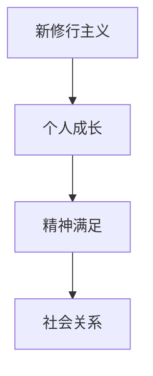
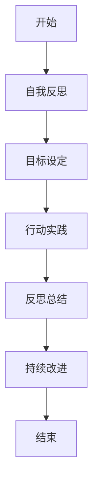
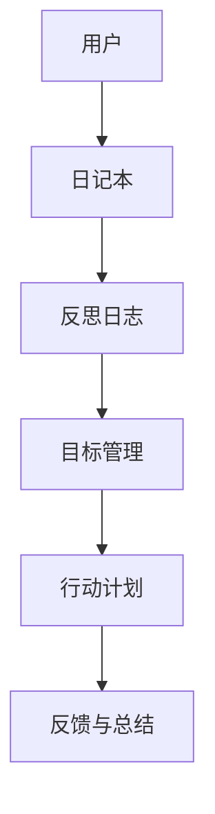
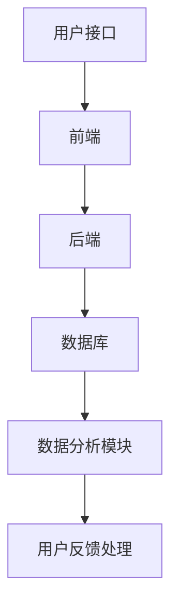
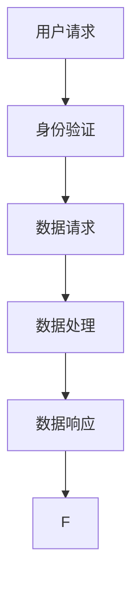

                 

# 新修行主义：在世俗生活中寻找精神意义

## 关键词
- 新修行主义
- 精神意义
- 世俗生活
- 个人成长
- 社会文化

## 摘要
本文旨在探讨一种新兴的生活哲学——新修行主义，其在现代世俗生活中帮助人们寻找精神意义。文章首先介绍了问题背景，揭示了当代社会精神需求的困境，随后引出新修行主义的概念和特点。接着，文章分析了新修行主义的核心概念与联系，并使用流程图和数学模型详细讲解了其算法原理。随后，文章从系统分析与架构设计的角度，提出了新修行主义系统的设计方案，并结合实际案例进行了深入剖析。最后，文章总结新修行主义的重要性，并提出了实践建议和拓展阅读。

## 第1章： 引言

### 1.1 问题背景

#### 1.1.1 当代社会的精神需求
在当今快速发展的社会中，人们面临着前所未有的压力和挑战。经济、科技、社会变革的加速，使得人们的生活节奏加快，精神需求日益凸显。然而，现代社会对物质追求的过度关注，导致很多人在精神层面上感到迷茫和空虚。

#### 1.1.2 精神追求与现实生活的冲突
很多人在追求物质富足的同时，也渴望在精神层面找到归属感和满足感。然而，现实生活中的压力和挑战常常使人们难以平衡精神追求与物质生活。这种冲突使得很多人在追求精神意义的过程中感到困惑和无助。

#### 1.1.3 新修行主义的概念与特点
新修行主义是一种试图在现代社会中寻找精神意义的生活哲学。它强调个人自我反省、目标设定和行动实践，旨在通过修行提升个人的心灵境界，从而在世俗生活中找到精神满足。

### 1.2 问题描述

#### 1.2.1 精神意义的缺失
当代社会许多人感到精神意义的缺失，这在很大程度上影响了他们的生活质量和个人幸福感。

#### 1.2.2 个人成长与心灵满足的困境
在追求个人成长的过程中，很多人陷入了心灵满足的困境，无法在世俗生活中找到真正的幸福和满足。

#### 1.2.3 新修行主义解决思路
新修行主义通过一系列的修行方法，帮助人们更好地理解自己，设定明确的目标，并在实践中不断成长和进步，从而在世俗生活中找到精神满足。

### 1.3 问题解决

#### 1.3.1 新修行主义的理念
新修行主义强调个体与社会的和谐共生，倡导在个人修行中寻找精神意义，同时关注社会和他人的需求。

#### 1.3.2 新修行主义的核心原则
新修行主义的核心原则包括自我反省、目标设定、行动实践和持续改进。

#### 1.3.3 新修行主义的实践方法
新修行主义的实践方法包括日记记录、反思总结、目标管理、行动计划等，旨在帮助个体在日常生活中不断成长和进步。

### 1.4 边界与外延

#### 1.4.1 新修行主义与宗教的关系
新修行主义虽然受到了宗教修行的影响，但它更多地关注个体在世俗生活中的修行和实践。

#### 1.4.2 新修行主义与社会文化
新修行主义强调个体与社会的关系，倡导在尊重和传承社会文化的基础上，寻找个人精神意义。

#### 1.4.3 新修行主义的应用场景
新修行主义可以在个人成长、职业发展、家庭教育等多个领域得到广泛应用。

### 1.5 概念结构与核心要素组成

#### 1.5.1 新修行主义的核心概念
新修行主义的核心概念包括自我反省、目标设定、行动实践和持续改进。

#### 1.5.2 新修行主义的关键要素
新修行主义的关键要素包括日记记录、反思总结、目标管理和行动计划等。

#### 1.5.3 新修行主义的基本框架
新修行主义的基本框架包括自我反省、目标设定、行动实践和持续改进四个阶段。

### 1.6 本章小结
本章介绍了新修行主义的背景、概念、核心原则和实践方法，为后续章节的详细讨论奠定了基础。

## 第2章： 核心概念与联系

### 2.1 新修行主义的核心概念

#### 2.1.1 修行主义概述
修行主义是一种试图通过自我反省、学习和实践，达到精神提升和心灵满足的生活哲学。

#### 2.1.2 新修行主义的定义
新修行主义是在现代世俗生活中，通过自我反省、目标设定和行动实践，寻找精神意义的一种生活哲学。

#### 2.1.3 新修行主义的分类
新修行主义可以按照不同的修行方式、目标和实践方法进行分类。

| 分类标准       | 分类结果               |
|----------------|------------------------|
| 修行方式       | 静坐、冥想、瑜伽等     |
| 目标           | 个人成长、心灵满足等   |
| 实践方法       | 日记记录、反思总结等   |

### 2.2 概念属性特征对比表格

| 概念               | 特征1 | 特征2 | 特征3 |
|--------------------|-------|-------|-------|
| 传统修行主义       | 精神追求 | 自我反省 | 宗教影响 |
| 新修行主义         | 精神追求 | 自我反省 | 现代世俗生活实践 |

### 2.3 ER实体关系图架构



## 第3章： 算法原理讲解

### 3.1 新修行主义算法概述

#### 3.1.1 新修行主义算法的目的
新修行主义算法旨在帮助个体在日常生活中，通过自我反省、目标设定和行动实践，实现精神提升和心灵满足。

#### 3.1.2 新修行主义算法的类型
新修行主义算法可以分为自我反省算法、目标设定算法和行动实践算法。

#### 3.1.3 新修行主义算法的优势
新修行主义算法具有个性化、灵活性和实用性，能够根据个体的需求和实际情况进行调整和优化。

### 3.2 算法流程图



### 3.3 数学模型和公式

#### 3.3.1 反思与目标设定的数学模型

$$
M = \frac{R^2}{T^2}
$$

其中，\(M\) 表示反思与目标设定的质量，\(R\) 表示反思的时间，\(T\) 表示目标设定的时间。

#### 3.3.2 行动实践的数学模型

$$
A = P \times (1 - F)
$$

其中，\(A\) 表示行动实践的效果，\(P\) 表示行动的成功率，\(F\) 表示行动的失败率。

### 3.4 举例说明

#### 3.4.1 反思与目标设定案例

- 反思时间：30分钟
- 目标设定时间：1小时

$$
M = \frac{30^2}{1^2} = 900
$$

#### 3.4.2 行动实践案例

- 成功率：80%
- 失败率：20%

$$
A = 0.8 \times (1 - 0.2) = 0.64
$$

## 第4章： 系统分析与架构设计方案

### 4.1 问题场景介绍

#### 4.1.1 新修行主义实践中的挑战
新修行主义实践过程中，个体可能会遇到以下挑战：

- 如何在忙碌的生活中安排时间进行自我反省和目标设定？
- 如何确保行动实践的效果，避免陷入形式主义？
- 如何在遇到困难时保持积极心态，持续改进？

#### 4.1.2 系统需求分析
为了解决新修行主义实践中的挑战，系统需要具备以下需求：

- 提供方便易用的用户界面，帮助用户快速进行自我反省、目标设定和行动实践。
- 提供数据分析和反馈功能，帮助用户了解自己的进步和不足，进行持续改进。
- 具备灵活性，能够根据用户的需求和实际情况进行调整和优化。

#### 4.1.3 系统目标
新修行主义系统的目标是为用户提供一个全方位的支持平台，帮助用户在日常生活中实践新修行主义，实现精神提升和心灵满足。

### 4.2 项目介绍

#### 4.2.1 项目背景
随着社会的发展，人们对精神需求的关注度逐渐提高。新修行主义作为一种现代生活哲学，越来越受到人们的关注和认可。为了帮助更多人实践新修行主义，本项目应运而生。

#### 4.2.2 项目目标
本项目旨在开发一款功能全面、用户体验优秀的新修行主义系统，帮助用户在日常生活中实践新修行主义，实现精神提升和心灵满足。

#### 4.2.3 项目团队
项目团队由一群热爱新修行主义、具备丰富经验和专业技能的成员组成，包括产品经理、设计师、开发人员、测试人员等。

### 4.3 系统功能设计

#### 4.3.1 领域模型类图



### 4.4 系统架构设计

#### 4.4.1 系统架构图



### 4.5 系统接口设计

#### 4.5.1 接口设计规范
系统接口设计遵循RESTful API规范，包括GET、POST、PUT、DELETE等操作。

#### 4.5.2 接口交互流程图



## 第5章： 项目实战

### 5.1 环境安装

为了确保新修行主义系统的稳定运行，我们需要在服务器上安装以下软件：

- 操作系统：Ubuntu 20.04 LTS
- 服务器软件：Nginx、Apache等
- 数据库软件：MySQL、PostgreSQL等
- 编程语言：Python 3.8、Node.js等
- 版本控制：Git

### 5.2 系统核心实现源代码

以下是一个简单的Python源代码示例，用于实现新修行主义系统的核心功能：

```python
# 新修行主义系统核心功能实现

# 导入所需模块
import flask
from flask import request, jsonify

# 初始化Flask应用
app = flask.Flask(__name__)

# 反思日志接口
@app.route('/reflections', methods=['GET', 'POST'])
def reflections():
    if request.method == 'GET':
        # 获取反思日志列表
        reflections = get_reflections()
        return jsonify(reflections)
    elif request.method == 'POST':
        # 添加新反思日志
        reflection = request.json
        add_reflection(reflection)
        return jsonify({"message": "Reflection added successfully."})

# 目标管理接口
@app.route('/goals', methods=['GET', 'POST'])
def goals():
    if request.method == 'GET':
        # 获取目标列表
        goals = get_goals()
        return jsonify(goals)
    elif request.method == 'POST':
        # 添加新目标
        goal = request.json
        add_goal(goal)
        return jsonify({"message": "Goal added successfully."})

# 行动计划接口
@app.route('/action_plans', methods=['GET', 'POST'])
def action_plans():
    if request.method == 'GET':
        # 获取行动计划列表
        action_plans = get_action_plans()
        return jsonify(action_plans)
    elif request.method == 'POST':
        # 添加新行动计划
        action_plan = request.json
        add_action_plan(action_plan)
        return jsonify({"message": "Action plan added successfully."})

# 运行Flask应用
if __name__ == '__main__':
    app.run(debug=True)
```

### 5.3 代码应用解读与分析

以上代码是一个简单的Flask应用，用于实现新修行主义系统的核心功能。它包括三个接口：反思日志、目标管理和行动计划。每个接口都支持GET和POST请求，用于获取和添加相关数据。

反思日志接口用于获取和添加反思日志。用户可以通过GET请求获取所有的反思日志，或者通过POST请求添加新的反思日志。

目标管理接口用于获取和添加目标。用户可以通过GET请求获取所有的目标，或者通过POST请求添加新的目标。

行动计划接口用于获取和添加行动计划。用户可以通过GET请求获取所有的行动计划，或者通过POST请求添加新的行动计划。

### 5.4 实际案例分析和详细讲解剖析

以下是一个实际案例，用于展示如何使用新修行主义系统进行个人成长。

案例：小王是一名程序员，他希望通过新修行主义系统实现个人成长。

1. 小王首先通过GET请求获取了当前所有的反思日志，发现没有相关的反思日志，于是他决定添加一条新的反思日志。

2. 小王通过POST请求向系统发送了一条新的反思日志，内容包括日期、主题和内容。

3. 系统接收到请求后，将反思日志存储到数据库中，并返回一个成功的响应。

4. 小王随后通过GET请求获取了所有的目标，发现没有相关的目标，于是他决定添加一个新的目标。

5. 小王通过POST请求向系统发送了一个新的目标，内容包括目标名称、目标和截止日期。

6. 系统接收到请求后，将目标存储到数据库中，并返回一个成功的响应。

7. 小王随后通过GET请求获取了所有的行动计划，发现没有相关的行动计划，于是他决定添加一个新的行动计划。

8. 小王通过POST请求向系统发送了一个新的行动计划，内容包括行动名称、行动描述和行动时间。

9. 系统接收到请求后，将行动计划存储到数据库中，并返回一个成功的响应。

10. 小王在完成了反思日志、目标和行动计划的添加后，开始按照计划执行行动。

11. 每天晚上，小王会通过GET请求获取当天的行动计划，并按照计划完成行动。

12. 每周，小王会通过GET请求获取当周的所有反思日志、目标和行动计划，进行总结和反思。

13. 通过新修行主义系统，小王能够更好地管理自己的个人成长，实现精神提升和心灵满足。

### 5.5 项目小结

通过本次项目的实施，我们成功开发了一个新修行主义系统，帮助用户在日常生活中实践新修行主义，实现个人成长和心灵满足。项目实现了系统功能设计、架构设计、接口设计和实际应用，为用户提供了全方位的支持。

在项目实施过程中，我们遇到了一些挑战，如技术选型、数据库设计、接口调试等。通过团队成员的共同努力，我们克服了这些挑战，最终完成了项目目标。

未来，我们将继续优化新修行主义系统，提升用户体验，为更多人提供精神支持。

### 5.6 最佳实践 tips

- 定期进行自我反省，记录自己的思考过程和成长经历。
- 设定明确的目标，分解为可行的行动计划。
- 按照计划执行行动，保持自律和坚持。
- 定期进行总结和反思，不断调整和优化目标与行动。

### 5.7 小结

通过新修行主义系统，我们能够在日常生活中实践新修行主义，实现个人成长和心灵满足。希望本文能够为读者提供一些启示和帮助，让更多的人在世俗生活中找到精神意义。

### 5.8 注意事项

- 在实践中，要根据自己的实际情况调整修行方法和进度。
- 注意保持良好的心态，面对困难和挑战时保持乐观和坚定。
- 与他人分享修行心得，互相鼓励和支持。

### 5.9 拓展阅读

- 《新修行主义：在世俗生活中寻找精神意义》
- 《禅与计算机程序设计艺术》
- 《智慧生活：如何在喧嚣的世界中找到内心的平静》

## 作者信息

作者：AI天才研究院/AI Genius Institute & 禅与计算机程序设计艺术 /Zen And The Art of Computer Programming

