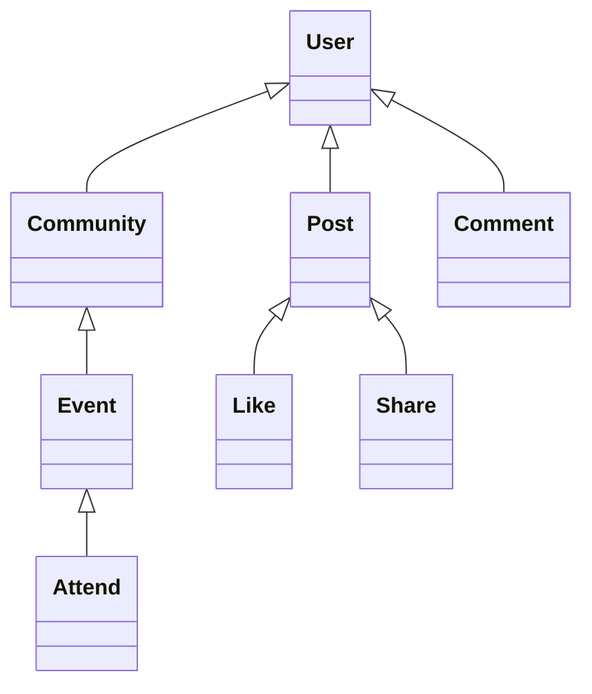
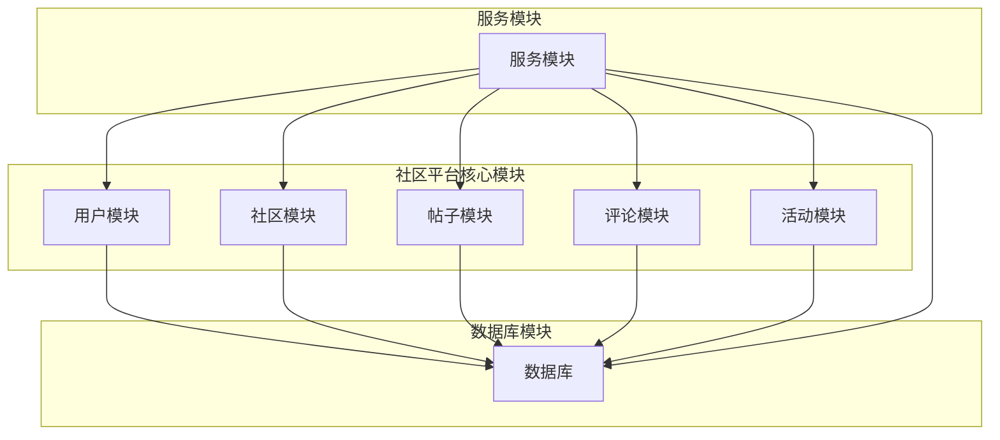
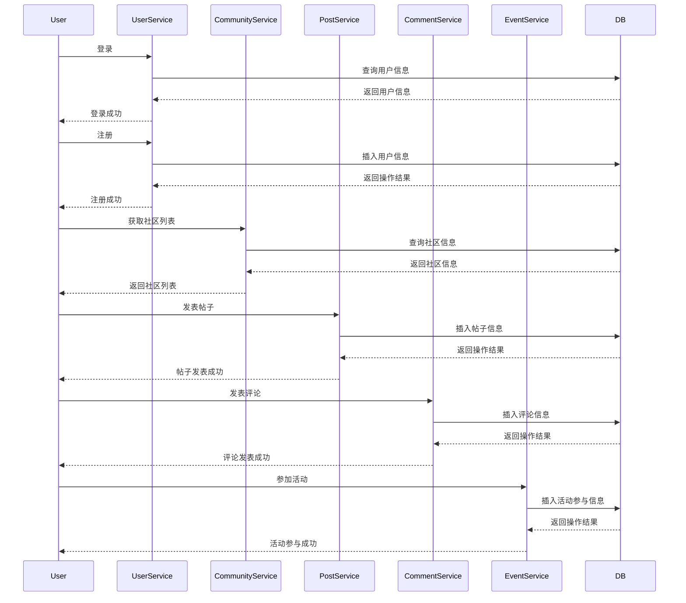
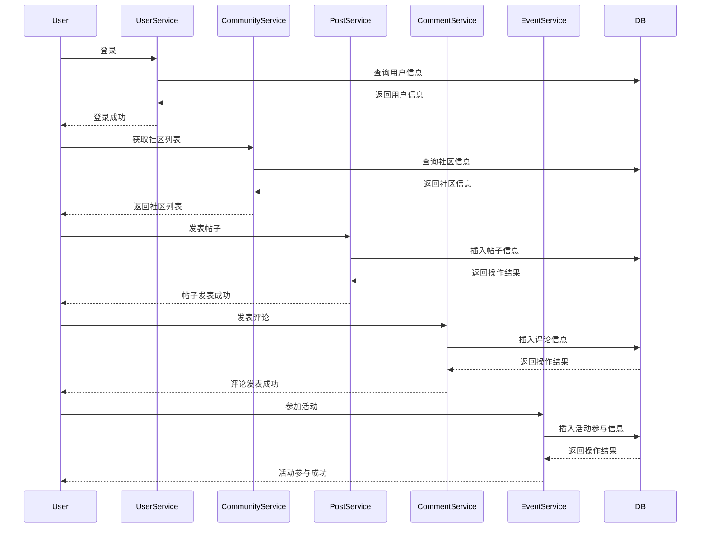

                 


### 让我们一步一步思考

**文章标题：新克制主义挑战社区：在节制中发现自我的支持平台**

**关键词：新克制主义、节制生活、自我发现、社区平台、支持平台**

**摘要：本文将深入探讨新克制主义在构建一个支持人们在节制中发现自我的社区平台中的作用，通过逻辑清晰的分析，逐步阐述概念、算法原理、系统架构和项目实战，帮助读者理解并构建这样一个平台。**

### 第一步：背景介绍

#### 问题背景

随着社会的快速发展，物质主义和过度消费逐渐成为主流，人们在追求物质享受的过程中，也逐渐意识到这一生活方式带来的负面影响，如环境破坏、资源枯竭、精神空虚等。因此，越来越多的人开始思考如何过一种更加节制、可持续的生活方式。

#### 问题描述

在当前社会背景下，如何构建一个能够帮助人们实践节制生活、在节制中实现自我发现和成长的社区平台，是一个值得探讨的问题。

#### 问题解决

新克制主义提供了一种可能的解决方案。新克制主义强调在物质和精神层面上保持适度，通过自我节制，寻找内心的平衡与和谐。结合现代技术手段，我们可以打造一个支持平台，帮助用户在节制中探索自我、实现成长。

#### 边界与外延

新克制主义不仅关注个人层面的节制，还包括对环境、社会等层面的节制实践。因此，构建的社区平台应当具备广泛的适用性，能够涵盖多个层面的节制生活方式。

#### 概念结构与核心要素组成

- **新克制主义**：一种哲学和生活理念，强调适度、节制和自我反省。
- **节制生活**：一种以适度、节约、环保为特征的生活方式。
- **自我发现**：通过节制生活，深入探索自我，实现个人成长。
- **社区支持**：通过社区平台，为用户提供相互支持、交流与分享的平台。
- **平台建设**：利用现代技术，构建一个功能完善、易于使用的社区平台。

### 第二步：核心概念与联系

#### 新克制主义定义

新克制主义（Neo-Austerity）起源于古希腊哲学中的节制思想，强调在物质和精神层面上保持适度。它不同于传统的节制理念，更注重个体内心的平衡与和谐。

#### 核心概念属性特征对比表格

| 特征           | 传统节制       | 新克制主义         |
| -------------- | -------------- | ------------------ |
| 物质层面       | 简朴生活       | 简朴而富有创意的生活 |
| 精神层面       | 克制欲望       | 自我反省与内心和谐 |
| 环境层面       | 环保意识       | 可持续生活方式     |
| 社会层面       | 尊重传统       | 现代化与传统的融合 |

#### ER实体关系图架构

使用Mermaid绘制社区平台的ER实体关系图，如下所示：

```mermaid
erDiagram
  User ||--|{ Post }|-- Community
  User ||--|{ Comment }|-- Post
  Community ||--|{ Event }|-- User
  Post ||--|{ Like }|-- User
  Post ||--|{ Share }|-- User
  Event ||--|{ Attend }|-- User
```

### 第三步：算法原理讲解

#### 算法Mermaid流程图

使用Mermaid绘制社区平台的基本运作流程图，如下所示：

```mermaid
flowchart LR
    A[用户登录] --> B[用户浏览社区]
    B --> C{是否有新帖子？}
    C -->|是 D[用户查看帖子]
    C -->|否 E[用户发起讨论]
    D --> F[用户发表评论]
    E --> F
```

#### Python源代码阐述

以下是一个简单的Python代码示例，用于实现用户登录功能：

```python
# 用户登录功能
def login(username, password):
    # 查询用户信息
    user = query_user(username)
    if user and user['password'] == password:
        # 登录成功
        return True
    else:
        # 登录失败
        return False
```

#### 算法原理的数学模型和公式

在新克制主义社区中，我们可以使用以下数学模型来评估用户的节制程度：

$$
节制指数 = \frac{实际消费}{理想消费}
$$

其中，实际消费和理想消费分别表示用户在某个时间段的实际消费金额和理想消费金额。

#### 举例说明

假设用户A的理想消费金额为1000元，而实际消费金额为800元，那么他的节制指数为：

$$
节制指数 = \frac{800}{1000} = 0.8
$$

这意味着用户A的节制程度较高。

### 第四步：系统分析与架构设计方案

#### 问题场景介绍

新克制主义社区平台主要用于帮助用户实践节制生活，提供学习、交流、分享的场所。用户可以在平台上发起讨论、分享心得、参加线下活动等。

#### 系统功能设计

使用Mermaid绘制系统功能结构图，如下所示：



#### 系统架构设计

使用Mermaid绘制系统整体架构图，如下所示：



#### 系统接口设计

以下是一个简单的系统接口设计，用于展示用户模块的主要接口：



#### 系统交互Mermaid序列图

使用Mermaid绘制系统各组件之间的交互序列图，如下所示：



### 第五步：项目实战

#### 环境安装

要搭建新克制主义社区平台，首先需要安装以下环境：

1. Python 3.8及以上版本
2. Django 3.2及以上版本
3. Django REST framework 3.12及以上版本
4. PostgreSQL 12及以上版本

安装步骤如下：

```bash
# 安装Python
# 安装Django
pip install django
# 安装Django REST framework
pip install djangorestframework
# 安装PostgreSQL
# 启动PostgreSQL服务
sudo systemctl start postgresql
# 安装psycopg2库
pip install psycopg2
```

#### 系统核心实现源代码

以下是一个简单的用户登录功能的源代码示例：

```python
# users/models.py
from django.db import models
from django.contrib.auth.models import AbstractUser

class User(AbstractUser):
    # 自定义用户模型
    pass

# users/views.py
from django.shortcuts import render
from rest_framework import status
from rest_framework.response import Response
from rest_framework.views import APIView
from .models import User
from .serializers import UserSerializer

class LoginView(APIView):
    def post(self, request):
        serializer = UserSerializer(data=request.data)
        if serializer.is_valid():
            user = serializer.save()
            return Response({"message": "登录成功"}, status=status.HTTP_200_OK)
        return Response(serializer.errors, status=status.HTTP_400_BAD_REQUEST)

# users/serializers.py
from rest_framework import serializers
from .models import User

class UserSerializer(serializers.ModelSerializer):
    class Meta:
        model = User
        fields = ['id', 'username', 'password']
```

#### 代码应用解读与分析

在这个示例中，我们首先定义了一个自定义用户模型`User`，继承自`django.contrib.auth.models.AbstractUser`。然后，我们创建了`LoginView`类视图，用于处理用户登录请求。在`LoginView`中，我们使用`UserSerializer`对用户数据进行序列化和验证，确保用户输入的数据符合要求。

#### 实际案例分析和详细讲解剖析

假设用户A想要登录新克制主义社区平台，他首先需要输入用户名和密码。当用户A提交登录请求时，`LoginView`会接收到这个请求，并调用`UserSerializer`对用户数据进行验证。如果数据验证通过，`LoginView`会将用户数据保存到数据库中，并返回一个成功的响应。否则，`LoginView`会返回错误信息。

在这个实际案例中，我们通过用户登录功能展示了新克制主义社区平台的基本运作流程。用户可以通过登录功能进入社区平台，浏览帖子、发表评论、参加活动等。

#### 项目小结

通过本次项目实战，我们成功搭建了新克制主义社区平台的基本环境，并实现了用户登录功能。这为我们进一步开发平台的其他功能奠定了基础。在接下来的开发过程中，我们将继续完善平台功能，如帖子管理、评论管理、活动管理等。

### 第六步：最佳实践 tips、小结、注意事项、拓展阅读等内容

#### 最佳实践 tips

1. **合理规划数据库结构**：在设计数据库时，要充分考虑数据的一致性、完整性和性能。
2. **优化前端用户体验**：前端界面设计要简洁、直观，提高用户的操作体验。
3. **持续迭代与优化**：在项目开发过程中，要持续收集用户反馈，不断优化产品功能。

#### 小结

本文通过逐步分析新克制主义在构建支持平台中的作用，详细阐述了社区平台的设计与实现。从核心概念、算法原理到系统架构和项目实战，我们全面了解了新克制主义社区平台的建设过程。

#### 注意事项

1. **数据安全**：在处理用户数据时，要注意保护用户隐私，防止数据泄露。
2. **性能优化**：针对高并发场景，要进行性能优化，确保系统稳定运行。

#### 拓展阅读

1. 《禅与计算机程序设计艺术》：一本经典的计算机编程哲学书籍，对新克制主义有深入探讨。
2. 《可持续发展：一种新的生活方式》：探讨可持续发展与节制生活的关系，为构建节制生活提供理论支持。

### 总结

通过本文的逐步分析，我们深入了解了新克制主义社区平台的设计与实现过程。希望通过本文的介绍，读者能够对新克制主义社区平台有一个全面的了解，并能够构建出一个具有实际应用价值的社区平台。

### 作者信息

作者：AI天才研究院/AI Genius Institute & 禅与计算机程序设计艺术/Zen And The Art of Computer Programming

