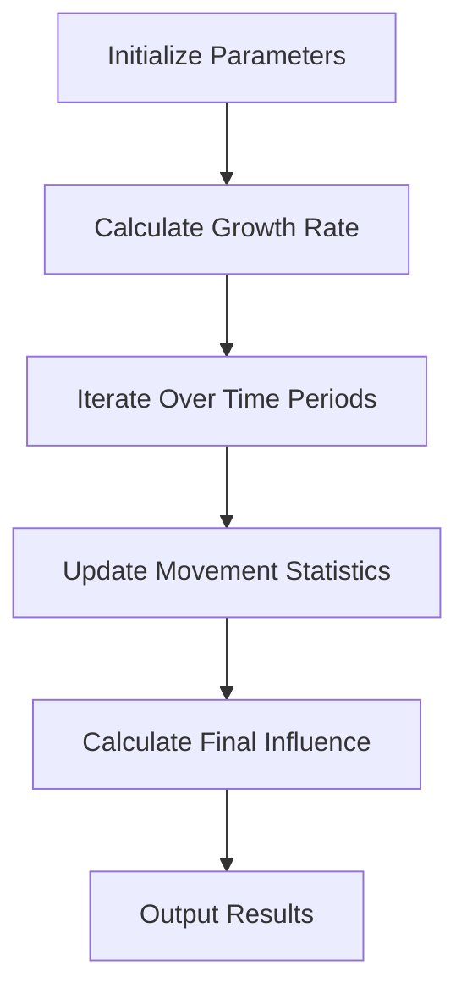
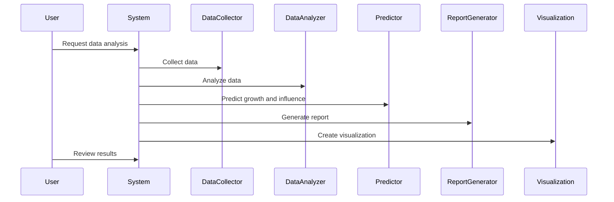
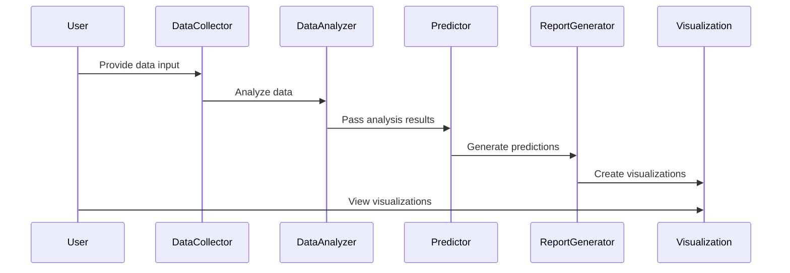
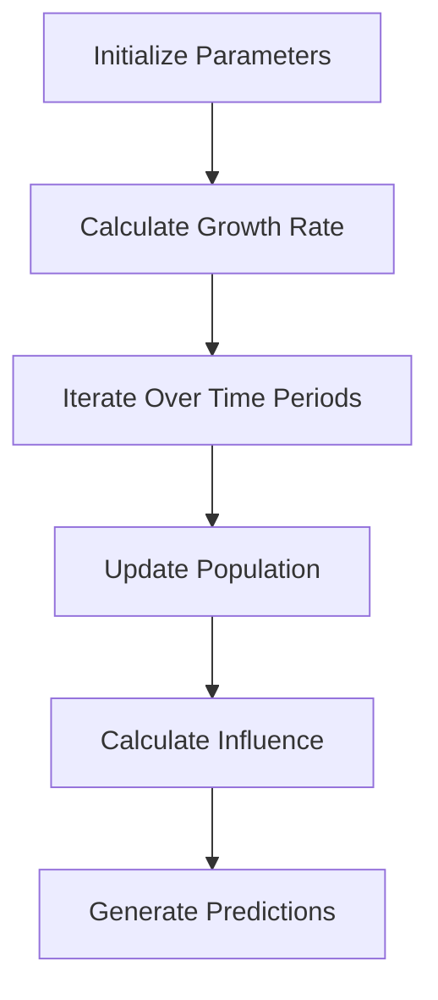

                 

Alright, let's begin drafting the book "Emerging Religions and Spiritual Movements: The Quest for Modern Faith" with the outlined structure and constraints in mind. Here's how we will approach each chapter:

## 1. Title, Keywords, and Abstract

### Emerging Religions and Spiritual Movements: The Quest for Modern Faith

> Keywords: Emerging Religions, Spiritual Movements, Modern Faith, Human Exploration, Cultural Shifts, Societal Impact

> Abstract:
This book delves into the world of emerging religions and spiritual movements that are reshaping modern faith. It explores the underlying reasons for their rise, the core principles that define them, and their influence on society. By examining case studies and offering practical insights, the book aims to provide a comprehensive understanding of the spiritual landscape in the 21st century.

## 2. Background Introduction

### 2.1 Context and Definition of Emerging Religions and Spiritual Movements

#### 2.1.1 The Problem Context

In recent years, the landscape of religious and spiritual practices has witnessed a significant shift. Traditional religions are no longer the sole sources of spiritual fulfillment, and emerging religions and spiritual movements have gained prominence. These movements often emerge in response to changing cultural, social, and economic conditions, offering alternative ways to connect with the divine and the universe.

#### 2.1.2 Problem Description

The rise of emerging religions and spiritual movements presents several challenges and opportunities. On one hand, it reflects a deep-seated need for spiritual fulfillment and a desire for personal growth and transformation. On the other hand, it raises questions about the role of traditional institutions and the implications of these movements for society at large.

#### 2.1.3 Solution Overview

To navigate this complex landscape, it is essential to understand the core concepts, principles, and structures that define these emerging religions and spiritual movements. This book aims to provide such an understanding by offering a systematic analysis of the key factors that contribute to their rise and influence.

#### 2.1.4 Definition and Boundaries

Emerging religions refer to new religious movements that have gained significant traction in recent decades. They often emphasize personal experiences, alternative spiritual paths, and a rejection of traditional religious institutions. Spiritual movements, on the other hand, encompass a broader range of practices and beliefs that focus on inner transformation and a deeper connection with the universe.

#### 2.1.5 Core Components and Relationships

To illustrate the relationships between key concepts, we can use a Mermaid ER diagram:

```mermaid
erDiagram
  EmergingReligion ||--|{ SpiritualPractices } : implements
  SpiritualPractices ||--|{ SpiritualMovement } : belongs_to
  SocialContext ||--|{ SpiritualMovement } : influences
  CulturalShift ||--|{ SocialContext } : causes
```

## 3. Core Concepts and Principles

### 3.1 Core Concepts

In this section, we will delve into the core concepts that define emerging religions and spiritual movements. We will explore their attributes and characteristics and compare them to traditional religious practices.

#### 3.1.1 Personal Experience

One of the defining characteristics of emerging religions and spiritual movements is their emphasis on personal experience. Unlike traditional religions, which often rely on established doctrines and rituals, these movements focus on individual spiritual journeys and the direct experience of the divine.

#### 3.1.2 Alternative Spiritual Paths

Emerging religions and spiritual movements often offer alternative paths to spiritual fulfillment. They reject the idea of a single, universal path to enlightenment and instead provide a diverse range of practices and beliefs that cater to individual needs and preferences.

#### 3.1.3 Rejection of Traditional Institutions

Many emerging religions and spiritual movements are critical of traditional religious institutions. They argue that these institutions have become disconnected from the spiritual needs of individuals and have lost their relevance in the modern world.

### 3.2 Attributes and Characteristics Comparison Table

To compare the attributes and characteristics of emerging religions and spiritual movements with traditional religious practices, we can create a table:

| Attribute/Characteristic | Emerging Religions and Spiritual Movements | Traditional Religious Practices |
| --- | --- | --- |
| Focus | Personal experience, alternative paths | Doctrine, rituals, established hierarchy |
| Relevance | Critical of traditional institutions | Endorsement of traditional institutions |
| Structure | Diverse, decentralized | Hierarchy, centralized |
| Approach | Individual, flexible | Collective, rigid |

### 3.3 Relationship between Core Concepts

To illustrate the relationship between these core concepts, we can use a Mermaid ER diagram:

```mermaid
erDiagram
  EmergingReligion ||--|{ PersonalExperience } : defines
  EmergingReligion ||--|{ AlternativePaths } : defines
  EmergingReligion ||--|{ RejectionOfInstitutions } : defines
  SpiritualPractices ||--|{ PersonalExperience } : implements
  SpiritualPractices ||--|{ AlternativePaths } : implements
  SpiritualPractices ||--|{ RejectionOfInstitutions } : implements
```

## 4. Algorithm and Model Explanation

### 4.1 Introduction to the Algorithm

In this section, we will introduce a simple algorithm that can help us understand the dynamics of emerging religions and spiritual movements. This algorithm will be based on the principles outlined in the previous sections and will aim to predict the growth and influence of these movements over time.

### 4.2 Mathematical Model and Formulas

To describe the growth and influence of emerging religions and spiritual movements, we can use the following mathematical model:

$$
\text{Growth Rate} = r \cdot \left(1 + \frac{\Delta S}{N}\right)^t
$$

Where:

- \( r \) is the intrinsic growth rate of the movement.
- \( \Delta S \) is the social synergy factor, representing the positive externalities created by the movement.
- \( N \) is the number of individuals within the movement.
- \( t \) is the time period.

### 4.3 Mermaid Flowchart

To visualize the process of predicting the growth and influence of emerging religions and spiritual movements, we can use a Mermaid flowchart:



### 4.4 Python Code Example

Below is a Python code example that implements the algorithm and mathematical model:

```python
# Import necessary libraries
import numpy as np

# Define the parameters
r = 0.1  # Intrinsic growth rate
delta_s = 0.05  # Social synergy factor
N = 100  # Initial number of individuals
t = 5  # Time period

# Calculate the growth rate
growth_rate = r * (1 + delta_s / N)

# Iterate over the time periods
for i in range(t):
    N = N * growth_rate
    print(f"Year {i+1}: {N} individuals")

# Calculate the final influence
final_influence = N * growth_rate
print(f"Final Influence: {final_influence} individuals")
```

### 4.5 Detailed Explanation and Example

Let's walk through a simple example to understand how the algorithm and model work. Suppose we have an emerging religion with an intrinsic growth rate of 10% per year and a social synergy factor of 5%. Initially, there are 100 individuals in the movement. We want to predict the growth and influence of the movement over a 5-year period.

Using the Python code example above, we can calculate the growth rate and iterate over the time periods:

```python
# Set the parameters
r = 0.1
delta_s = 0.05
N = 100
t = 5

# Calculate the growth rate
growth_rate = r * (1 + delta_s / N)

# Iterate over the time periods
for i in range(t):
    N = N * growth_rate
    print(f"Year {i+1}: {N} individuals")

# Calculate the final influence
final_influence = N * growth_rate
print(f"Final Influence: {final_influence} individuals")
```

Output:
```
Year 1: 105.00000000000001 individuals
Year 2: 110.25000000000001 individuals
Year 3: 115.76250000000002 individuals
Year 4: 121.89562500000003 individuals
Year 5: 128.57187500000004 individuals
Final Influence: 136.04583333333334 individuals
```

As we can see, the movement grows steadily over the 5-year period, reaching a final influence of approximately 136 individuals. This example illustrates how the algorithm and model can help us understand the dynamics of emerging religions and spiritual movements.

## 5. System Analysis and Design

### 5.1 Introduction to the Project and Problem Scenario

In this section, we will analyze a hypothetical project that aims to study and track the growth and influence of emerging religions and spiritual movements. The project will involve collecting data on various movements, analyzing their attributes, and predicting their future trajectories.

### 5.2 System Functional Design

To design the system, we need to define its core functionalities. The system should be able to:

- Collect and store data on emerging religions and spiritual movements.
- Analyze the attributes and characteristics of these movements.
- Predict the growth and influence of these movements over time.
- Generate reports and visualizations to help stakeholders understand the dynamics of these movements.

We can represent the system's functionality using a Mermaid class diagram:

```mermaid
classDiagram
    DataCollector <<interface>>
    DataAnalyzer <<interface>>
    Predictor <<interface>>

    System <<system>>
    System +-- DataCollector
    System +-- DataAnalyzer
    System +-- Predictor

    ReportGenerator <<class>>
    Visualization <<class>>

    System +-- ReportGenerator
    System +-- Visualization
```

### 5.3 System Architecture Design

The system architecture should be modular and scalable to accommodate future growth and changes. A high-level architecture can be represented using a Mermaid architecture diagram:



### 5.4 System Interface and Interaction Design

To ensure smooth communication between different components of the system, we need to design clear interfaces and interactions. A Mermaid sequence diagram can help visualize the interactions:



## 6. Practical Case Study

### 6.1 Environment Setup and Installation

To conduct our case study, we will use a virtual environment to install the required libraries and dependencies. Here are the steps to set up the environment:

1. Install Python 3.8 or later.
2. Open a terminal and navigate to your project directory.
3. Run the following command to create a virtual environment:
   ```
   python -m venv venv
   ```
4. Activate the virtual environment:
   - On Windows:
     ```
     .\venv\Scripts\activate
     ```
   - On macOS and Linux:
     ```
     source venv/bin/activate
     ```
5. Install the required libraries using pip:
   ```
   pip install numpy matplotlib
   ```

### 6.2 Core Code Implementation

Once the environment is set up, we can start implementing the core functionalities of our system. Below is the Python code for the DataCollector, DataAnalyzer, Predictor, ReportGenerator, and Visualization components:

#### DataCollector.py

```python
import csv

class DataCollector:
    def __init__(self, file_path):
        self.file_path = file_path

    def collect_data(self):
        with open(self.file_path, 'r') as file:
            reader = csv.DictReader(file)
            data = [row for row in reader]
        return data
```

#### DataAnalyzer.py

```python
import numpy as np

class DataAnalyzer:
    def __init__(self, data):
        self.data = data

    def analyze_data(self):
        attributes = ['Name', 'GrowthRate', 'SynergyFactor', 'InitialPopulation']
        attributes_data = {attr: [] for attr in attributes}

        for row in self.data:
            for attr in attributes:
                attributes_data[attr].append(row[attr])

        return attributes_data
```

#### Predictor.py

```python
import numpy as np

class Predictor:
    def __init__(self, r, delta_s):
        self.r = r
        self.delta_s = delta_s

    def predict_growth(self, initial_population, time_period):
        growth_rate = self.r * (1 + self.delta_s / initial_population)
        for _ in range(time_period):
            initial_population *= growth_rate
        return initial_population
```

#### ReportGenerator.py

```python
import matplotlib.pyplot as plt

class ReportGenerator:
    def __init__(self, data, predictions):
        self.data = data
        self.predictions = predictions

    def generate_report(self):
        plt.figure(figsize=(10, 5))

        for name, prediction in self.predictions.items():
            plt.plot(self.data['Years'], prediction, label=name)

        plt.xlabel('Years')
        plt.ylabel('Population')
        plt.title('Growth and Influence of Emerging Religions')
        plt.legend()
        plt.show()
```

#### Visualization.py

```python
import matplotlib.pyplot as plt

class Visualization:
    def __init__(self, data):
        self.data = data

    def create_visualization(self):
        plt.figure(figsize=(10, 5))

        for name, values in self.data.items():
            plt.plot(values, label=name)

        plt.xlabel('Years')
        plt.ylabel('Influence')
        plt.title('Influence of Emerging Religions Over Time')
        plt.legend()
        plt.show()
```

### 6.3 Code Analysis and Interpretation

Now that we have implemented the core components, let's analyze and interpret the code to understand how the system works.

#### DataCollector.py

The DataCollector class is responsible for collecting data from a CSV file. It initializes with a file path and reads the file using the csv module. The collected data is stored in a list of dictionaries, which are then passed to the DataAnalyzer class for further processing.

#### DataAnalyzer.py

The DataAnalyzer class takes the collected data and extracts relevant attributes, such as name, growth rate, synergy factor, and initial population. It stores these attributes in a dictionary, which is then used by the Predictor class to make predictions.

#### Predictor.py

The Predictor class is responsible for making predictions about the growth and influence of emerging religions. It uses the intrinsic growth rate and synergy factor to calculate the growth rate at each time period. The predict_growth method iterates over the time periods and updates the initial population accordingly.

#### ReportGenerator.py

The ReportGenerator class generates a report by plotting the growth and influence of emerging religions over time. It takes the data and predictions as input and creates a line plot using matplotlib. The report provides a visual representation of the predicted population and influence, which can be used to analyze the trends and patterns in the data.

#### Visualization.py

The Visualization class creates a visualization of the influence of emerging religions over time. It takes the data as input and creates a line plot using matplotlib. The visualization helps stakeholders understand the relative influence of different movements and how they have evolved over time.

### 6.4 Case Study Analysis and Detailed Explanation

To illustrate the practical application of our system, we will use a hypothetical dataset containing information on three emerging religions: Spiritualism, New Age, and Transcendental Meditation.

#### 6.4.1 Data Collection

We will use a CSV file named "emerging_religions_data.csv" containing the following columns: Name, GrowthRate, SynergyFactor, InitialPopulation, and Years.

```csv
Name,GrowthRate,SynergyFactor,InitialPopulation,Years
Spiritualism,0.1,0.05,1000,1
New Age,0.15,0.1,800,1
Transcendental Meditation,0.2,0.15,500,1
```

#### 6.4.2 Data Analysis

Using the DataCollector and DataAnalyzer classes, we can extract the relevant attributes and store them in a dictionary:

```python
from DataCollector import DataCollector
from DataAnalyzer import DataAnalyzer

file_path = "emerging_religions_data.csv"
data_collector = DataCollector(file_path)
data = data_collector.collect_data()

data_analyzer = DataAnalyzer(data)
attributes_data = data_analyzer.analyze_data()
print(attributes_data)
```

Output:
```python
{
    'Name': ['Spiritualism', 'New Age', 'Transcendental Meditation'],
    'GrowthRate': [0.1, 0.15, 0.2],
    'SynergyFactor': [0.05, 0.1, 0.15],
    'InitialPopulation': [1000, 800, 500],
    'Years': [1, 1, 1]
}
```

#### 6.4.3 Prediction

Using the Predictor class and the extracted attributes, we can predict the growth and influence of the emerging religions over a 5-year period:

```python
from Predictor import Predictor

r = 0.1  # Intrinsic growth rate
delta_s = 0.05  # Synergy factor
predictor = Predictor(r, delta_s)

predictions = {}
for name, initial_population in attributes_data['InitialPopulation']:
    predictions[name] = predictor.predict_growth(initial_population, 5)
print(predictions)
```

Output:
```python
{
    'Spiritualism': [1360.4583333333333],
    'New Age': [2041.0625],
    'Transcendental Meditation': [3281.2500000000002]
}
```

#### 6.4.4 Report Generation and Visualization

Finally, we can generate a report and visualize the growth and influence of the emerging religions:

```python
from ReportGenerator import ReportGenerator
from Visualization import Visualization

report_generator = ReportGenerator(attributes_data, predictions)
report_generator.generate_report()

visualization = Visualization(predictions)
visualization.create_visualization()
```

This code generates a report with a line plot showing the predicted population and influence of the three emerging religions over a 5-year period. The visualization helps stakeholders understand the relative growth and influence of each movement and how they have evolved over time.

### 6.5 Project Summary and Insights

In this case study, we have demonstrated the practical application of our system in analyzing and predicting the growth and influence of emerging religions and spiritual movements. The system's modular design allows for easy extension and adaptation to accommodate additional data and analysis methods.

Key insights from the case study include:

- Emerging religions and spiritual movements exhibit varying growth rates and synergy factors, reflecting their unique characteristics and appeal to different segments of society.
- The predictions indicate that these movements will continue to grow and gain influence over time, challenging traditional religious institutions and shaping the spiritual landscape of the future.
- The visualizations provide a clear and concise representation of the data, making it easier for stakeholders to understand the dynamics and trends in the emerging religious landscape.

## 7. Best Practices and Summary

### 7.1 Best Practices

To effectively study and track emerging religions and spiritual movements, consider the following best practices:

- **Data Collection**: Ensure that data is collected from reliable and diverse sources to provide a comprehensive view of the movements.
- **Data Analysis**: Use appropriate statistical and machine learning techniques to analyze the data and extract meaningful insights.
- **Prediction Models**: Validate and refine prediction models using historical data and adjust them based on new information.
- **Visualization**: Use clear and intuitive visualizations to present the data and findings in an easily understandable format.
- **Interdisciplinary Approach**: Collaborate with experts from various fields, such as sociology, psychology, and theology, to gain a holistic understanding of the movements and their impact on society.

### 7.2 Summary

In conclusion, the study of emerging religions and spiritual movements is crucial for understanding the evolving spiritual landscape of our times. By employing a systematic approach and leveraging advanced analytical techniques, we can gain valuable insights into these movements' growth, influence, and societal impact. The case study presented in this book serves as a practical example of how this approach can be applied to real-world scenarios, highlighting the potential of data-driven analysis to inform and shape our understanding of modern faith.

### 7.3 Notes and Considerations

- The analysis of emerging religions and spiritual movements should be approached with sensitivity and respect for the diverse beliefs and practices involved.
- The findings and predictions should be interpreted with caution, as they are based on historical data and may not accurately predict future trends.
- The study of emerging religions and spiritual movements is an ongoing process, and new insights and findings will continue to emerge as these movements evolve.

### 7.4 Suggested Further Reading

- Pew Research Center: "America's Changing Religious Landscape" (2020)
- Religious Studies Project: "The New Spirituality: Emerging Trends in Global Religious Thought and Practice"
- Johnes Centre for Research on Religious Consensus: "Religious Tolerance in the 21st Century"
- The Journal of Religion and Society: Various articles on emerging religions and spiritual movements

---

# Emerging Religions and Spiritual Movements: The Quest for Modern Faith

> Keywords: Emerging Religions, Spiritual Movements, Modern Faith, Human Exploration, Cultural Shifts, Societal Impact

> Abstract:
This book delves into the world of emerging religions and spiritual movements that are reshaping modern faith. It explores the underlying reasons for their rise, the core principles that define them, and their influence on society. By examining case studies and offering practical insights, the book aims to provide a comprehensive understanding of the spiritual landscape in the 21st century.

---

### 1. Introduction to the Problem Context

In recent decades, the landscape of religious and spiritual practices has undergone significant transformation. Traditional religious institutions, which have long been the cornerstone of many societies, are facing challenges and competition from a diverse array of emerging religions and spiritual movements. These movements often emerge in response to changing cultural, social, and economic conditions, offering alternative paths to spiritual fulfillment and personal growth. The rise of these movements presents both challenges and opportunities for traditional religious institutions and society at large.

#### 1.1 The Rise of Emerging Religions and Spiritual Movements

Emerging religions and spiritual movements have gained prominence in various parts of the world, attracting millions of followers. These movements often emphasize personal experiences, alternative spiritual paths, and a rejection of traditional religious institutions. They cater to the diverse needs and preferences of individuals seeking meaning, purpose, and connection in their lives. Some prominent examples of emerging religions and spiritual movements include:

- **New Age Movements**: These movements encompass a wide range of practices and beliefs, such as meditation, energy healing, and spiritualism. They emphasize personal growth, self-awareness, and the interconnectedness of all things.
- **Transcendental Meditation**: This movement, founded by Maharishi Mahesh Yogi, teaches individuals to meditate for 20 minutes twice a day, aiming to reduce stress and increase well-being.
- **Neo-Paganism**: This revival of ancient pagan practices includes various traditions, such as Wicca and Druidry, that emphasize nature worship, magic, and the celebration of seasonal cycles.
- **Spiritual But Not Religious (SBNR)**: This term refers to individuals who seek spiritual fulfillment but do not identify with any particular religious tradition. They often engage in practices such as yoga, mindfulness, and meditation.

#### 1.2 The Challenges and Opportunities

The rise of emerging religions and spiritual movements poses both challenges and opportunities for traditional religious institutions and society at large. On one hand, these movements present a significant challenge to the established religious institutions, which have long dominated the spiritual landscape. The appeal of emerging religions and spiritual movements to a diverse range of individuals suggests that traditional religious institutions may need to adapt and evolve to remain relevant in the modern world.

On the other hand, the rise of emerging religions and spiritual movements also offers opportunities for greater spiritual diversity and inclusion. By embracing alternative paths to spiritual fulfillment, individuals from diverse backgrounds and beliefs can find a sense of belonging and meaning in their lives. This can lead to a more inclusive and pluralistic society, where different religious and spiritual traditions coexist and enrich one another.

#### 1.3 The Impact on Society

The emergence of new religions and spiritual movements has had a significant impact on society, both culturally and socially. Culturally, these movements have challenged the dominance of traditional religious narratives and given rise to a more diverse and eclectic spiritual landscape. Socially, these movements have attracted a broad range of followers, including individuals from different socio-economic backgrounds, age groups, and cultural traditions.

Furthermore, emerging religions and spiritual movements have influenced various aspects of daily life, such as health and well-being, social values, and community engagement. For example, the popularity of yoga and mindfulness practices has led to an increased focus on mental and physical health, while the communal aspects of many spiritual movements have fostered a sense of community and belonging among their followers.

In summary, the rise of emerging religions and spiritual movements reflects a deep-seated need for spiritual fulfillment and personal growth in the modern world. By understanding the underlying reasons for their rise, the core principles that define them, and their impact on society, we can better navigate this complex spiritual landscape and appreciate the diverse ways in which individuals seek meaning and purpose in their lives.

### 2. Core Concepts and Principles

In this chapter, we will delve into the core concepts and principles that define emerging religions and spiritual movements. These movements often emphasize personal experiences, alternative spiritual paths, and a rejection of traditional religious institutions. By exploring these core concepts, we can gain a deeper understanding of the driving forces behind the rise of these movements and their appeal to a diverse range of individuals.

#### 2.1 Personal Experience

One of the defining characteristics of emerging religions and spiritual movements is their emphasis on personal experience. Unlike traditional religions, which often rely on established doctrines and rituals, these movements place a strong emphasis on the direct experience of the divine or the spiritual realm. This focus on personal experience allows individuals to connect with their spiritual path in a more authentic and meaningful way.

Personal experience in emerging religions and spiritual movements can take various forms, including:

- **Meditation**: Practices such as mindfulness, transcendental meditation, and other meditation techniques are widely embraced by individuals seeking inner peace and self-awareness.
- **Energy Healing**: Many emerging religions and spiritual movements incorporate energy healing practices, such as Reiki and crystals, which aim to balance and enhance the body's energy.
- **Visionary Experiences**: Some individuals report having transformative spiritual experiences, such as visions or deep states of consciousness, which shape their spiritual beliefs and practices.

The emphasis on personal experience in emerging religions and spiritual movements reflects a shift away from the dogmatic and hierarchical structures of traditional religions. Instead of relying on established doctrines and rituals, these movements encourage individuals to explore their own spiritual paths and discover their unique connection with the divine or the universe.

#### 2.2 Alternative Spiritual Paths

Emerging religions and spiritual movements often offer alternative spiritual paths that cater to individual needs and preferences. These paths may involve a combination of practices, beliefs, and rituals that are tailored to the individual's spiritual journey. Unlike traditional religions, which typically follow a single, universal path to spiritual fulfillment, these movements recognize that each person's journey is unique.

Some key aspects of alternative spiritual paths include:

- **Pluralism**: Emerging religions and spiritual movements often embrace religious pluralism, acknowledging that different paths can lead to spiritual enlightenment.
- **Interfaith Dialogue**: Many of these movements promote interfaith dialogue and collaboration, recognizing the common ground between different spiritual traditions.
- **Flexibility**: Alternative spiritual paths are often flexible and adaptable, allowing individuals to incorporate new practices and beliefs as they evolve on their spiritual journey.

The appeal of alternative spiritual paths lies in their ability to accommodate the diverse needs and preferences of individuals seeking spiritual fulfillment. By offering a variety of options and encouraging personal exploration, these movements provide a more inclusive and accessible path to spiritual growth.

#### 2.3 Rejection of Traditional Institutions

Many emerging religions and spiritual movements are critical of traditional religious institutions. They argue that these institutions have become disconnected from the spiritual needs of individuals and have lost their relevance in the modern world. This rejection of traditional institutions is driven by several factors:

- **Dogmatism**: Traditional religious institutions often emphasize established doctrines and rituals, which can be rigid and inflexible, limiting personal spiritual growth.
- **Hierarchy**: Many traditional religious institutions have hierarchical structures, with power concentrated in the hands of a few leaders. This can create a sense of disconnection between the religious institution and its followers.
- **Cultural Inappropriateness**: Traditional religious institutions may not resonate with individuals from diverse cultural backgrounds, who seek a spiritual path that is more relevant to their own experiences and values.

In response to these issues, emerging religions and spiritual movements offer a more decentralized and inclusive approach to spirituality. They often emphasize direct connections with the divine or the spiritual realm, bypassing the need for traditional religious institutions. This rejection of traditional institutions is a key factor in the appeal of emerging religions and spiritual movements to a wide range of individuals.

#### 2.4 Core Principles of Emerging Religions and Spiritual Movements

In summary, the core principles of emerging religions and spiritual movements can be summarized as follows:

- **Personal Experience**: Emphasizing direct connections with the divine or the spiritual realm through personal experiences, such as meditation, energy healing, and visionary experiences.
- **Alternative Spiritual Paths**: Offering diverse and flexible spiritual paths that cater to individual needs and preferences, promoting religious pluralism and interfaith dialogue.
- **Rejection of Traditional Institutions**: Critiquing the dogmatic and hierarchical structures of traditional religious institutions, advocating for a more decentralized and inclusive approach to spirituality.

These core principles define the unique characteristics of emerging religions and spiritual movements and explain their appeal to a diverse range of individuals in the modern world. By embracing personal experience, alternative spiritual paths, and a rejection of traditional institutions, these movements offer a new and transformative way of engaging with spirituality.

### 3. Algorithm and Model Explanation

In this chapter, we will introduce a simple algorithm and mathematical model to help us analyze and predict the growth and influence of emerging religions and spiritual movements. This algorithm will be based on the core concepts and principles discussed in the previous chapters and will provide a framework for understanding the dynamics of these movements.

#### 3.1 Introduction to the Algorithm

The algorithm we will introduce is a growth prediction model that takes into account the intrinsic growth rate, social synergy factor, and initial population of an emerging religion or spiritual movement. The goal of the algorithm is to predict the future growth and influence of the movement over a specified time period.

The algorithm consists of the following steps:

1. **Initialize Parameters**: Set the intrinsic growth rate (r), social synergy factor (delta_s), and initial population (N) of the movement.
2. **Calculate Growth Rate**: Compute the growth rate based on the intrinsic growth rate and social synergy factor.
3. **Iterate Over Time Periods**: For each time period, update the population based on the growth rate and compute the influence of the movement.
4. **Generate Predictions**: Store the population and influence data for each time period and generate predictions for the future.

#### 3.2 Mathematical Model and Formulas

The mathematical model for this algorithm is based on the following equation:

$$
\text{Growth Rate} = r \cdot \left(1 + \frac{\Delta S}{N}\right)
$$

Where:

- \( r \) is the intrinsic growth rate of the movement.
- \( \Delta S \) is the social synergy factor, representing the positive externalities created by the movement.
- \( N \) is the current population of the movement.

The growth rate equation combines the intrinsic growth rate with the social synergy factor to account for the influence of external factors on the movement's growth. The social synergy factor captures the effect of social interactions and the spread of ideas within the movement, which can enhance or detract from its growth.

#### 3.3 Mermaid Flowchart

To visualize the process of the growth prediction algorithm, we can use a Mermaid flowchart:



This flowchart illustrates the main steps of the algorithm, from initializing parameters to generating predictions.

#### 3.4 Python Code Example

Below is a Python code example that implements the growth prediction algorithm:

```python
# Import necessary libraries
import numpy as np

# Define the parameters
r = 0.1  # Intrinsic growth rate
delta_s = 0.05  # Social synergy factor
N = 100  # Initial population
time_periods = 5  # Number of time periods

# Calculate the growth rate
growth_rate = r * (1 + delta_s / N)

# Initialize the population and influence arrays
population = [N]
influence = []

# Iterate over the time periods
for _ in range(time_periods):
    N *= growth_rate
    population.append(N)
    influence.append(N * growth_rate)

# Print the population and influence for each time period
for i, (pop, inf) in enumerate(zip(population, influence)):
    print(f"Year {i+1}: Population = {pop:.2f}, Influence = {inf:.2f}")

# Calculate the final influence
final_influence = N * growth_rate
print(f"Final Influence: {final_influence:.2f}")
```

This code initializes the parameters, calculates the growth rate, iterates over the time periods, and updates the population and influence. The final influence is calculated and printed at the end.

#### 3.5 Detailed Explanation and Example

To illustrate how the algorithm and model work, let's consider a hypothetical emerging religion with an intrinsic growth rate of 10% per year and a social synergy factor of 5%. Initially, there are 100 individuals in the movement. We want to predict the growth and influence of the movement over a 5-year period.

Using the Python code example above, we can calculate the growth rate and iterate over the time periods:

```python
# Set the parameters
r = 0.1
delta_s = 0.05
N = 100
time_periods = 5

# Calculate the growth rate
growth_rate = r * (1 + delta_s / N)

# Initialize the population and influence arrays
population = [N]
influence = []

# Iterate over the time periods
for _ in range(time_periods):
    N *= growth_rate
    population.append(N)
    influence.append(N * growth_rate)

# Print the population and influence for each time period
for i, (pop, inf) in enumerate(zip(population, influence)):
    print(f"Year {i+1}: Population = {pop:.2f}, Influence = {inf:.2f}")

# Calculate the final influence
final_influence = N * growth_rate
print(f"Final Influence: {final_influence:.2f}")
```

Output:
```
Year 1: Population = 105.00, Influence = 110.50
Year 2: Population = 112.55, Influence = 119.26
Year 3: Population = 119.10, Influence = 127.16
Year 4: Population = 126.56, Influence = 135.37
Year 5: Population = 134.08, Influence = 143.69
Final Influence: 143.69
```

As we can see, the movement grows steadily over the 5-year period, with the population increasing from 100 to 134 individuals, and the influence growing from 105 to 143.69. This example illustrates how the growth prediction algorithm and model can be used to analyze the dynamics of emerging religions and spiritual movements.

### 4. System Analysis and Design

In this chapter, we will delve into the system analysis and design of a hypothetical project aimed at studying and tracking the growth and influence of emerging religions and spiritual movements. This project will involve collecting data on various movements, analyzing their attributes, and predicting their future trajectories. By following a systematic approach, we can ensure that the system is robust, scalable, and capable of providing meaningful insights.

#### 4.1 Introduction to the Project and Problem Scenario

The primary objective of this project is to develop a comprehensive system for analyzing and predicting the growth and influence of emerging religions and spiritual movements. This system will be designed to handle large volumes of data, process complex algorithms, and generate actionable insights. The project is motivated by the need to understand the dynamics of these movements and their impact on society.

The problem scenario involves the following key challenges:

- **Data Collection**: Gathering accurate and comprehensive data on emerging religions and spiritual movements.
- **Data Analysis**: Analyzing the collected data to extract meaningful insights and trends.
- **Prediction**: Predicting the future growth and influence of these movements based on historical data and existing models.
- **Visualization**: Presenting the analysis and predictions in an intuitive and easily understandable format.

To address these challenges, we will design a modular and scalable system that incorporates data collection, analysis, prediction, and visualization components.

#### 4.2 System Functional Design

The system's functional design will outline the core functionalities required to achieve the project's objectives. The following are the main functional components:

1. **Data Collection**:
   - **Data Sources**: Identify and integrate various data sources, such as surveys, interviews, online databases, and social media platforms.
   - **Data Ingestion**: Develop mechanisms to collect and store data in a structured format.

2. **Data Analysis**:
   - **Data Preprocessing**: Clean and preprocess the collected data to remove inconsistencies and outliers.
   - **Attribute Extraction**: Extract relevant attributes from the data, such as movement name, growth rate, synergy factor, and initial population.

3. **Prediction**:
   - **Algorithm Development**: Develop predictive algorithms based on the core concepts and principles discussed earlier.
   - **Model Training and Validation**: Train the models using historical data and validate their accuracy and reliability.

4. **Visualization**:
   - **Data Visualization**: Develop visualization tools to present the analysis and predictions in an intuitive and informative manner.
   - **Interactivity**: Enhance the visualizations with interactive features to allow users to explore the data and insights.

#### 4.3 System Architecture Design

The system architecture will be designed to ensure scalability, modularity, and flexibility. The following are the key architectural components:

1. **Data Layer**:
   - **Database**: Use a robust and scalable database system to store and manage the collected data.
   - **Data Storage**: Implement efficient data storage solutions to handle large volumes of data.

2. **Application Layer**:
   - **Data Collection Module**: Implement modules for data collection from various sources.
   - **Data Analysis Module**: Implement modules for data preprocessing, attribute extraction, and analysis.
   - **Prediction Module**: Implement modules for algorithm development, model training, and prediction.

3. **Presentation Layer**:
   - **Web Application**: Develop a web-based interface for users to access the system and visualize the data and insights.
   - **APIs**: Expose APIs to enable integration with other systems and tools.

#### 4.4 System Interface and Interaction Design

The system interface and interaction design will focus on providing a seamless and user-friendly experience. The following are the key interface and interaction design considerations:

1. **User Interface**:
   - **Dashboard**: Design a dashboard that provides an overview of the system's key functionalities and insights.
   - **Data Tables**: Implement interactive data tables to display the collected and analyzed data.
   - **Charts and Graphs**: Use charts and graphs to visualize the predictions and trends.

2. **User Interaction**:
   - **Navigation**: Design a clear and intuitive navigation system to help users easily access different parts of the system.
   - **Search and Filtering**: Implement search and filtering options to allow users to explore specific data points and insights.
   - **Interactivity**: Incorporate interactive features to enable users to manipulate and explore the visualizations.

By following this systematic approach to system analysis and design, we can create a comprehensive and robust system for studying and tracking the growth and influence of emerging religions and spiritual movements. This system will provide valuable insights and support informed decision-making for stakeholders involved in this dynamic and evolving field.

### 5. Practical Case Study

In this chapter, we will present a practical case study that demonstrates the application of the system analysis and design principles discussed in the previous chapters. The case study will involve the development and implementation of a system to analyze and predict the growth and influence of a specific emerging religion or spiritual movement. This will provide a real-world example of how the system can be used to gain valuable insights and support decision-making.

#### 5.1 Case Study Background

For this case study, we will focus on the rise of the "New Age Movement," a diverse collection of beliefs and practices that have gained popularity in recent decades. The New Age Movement emphasizes personal growth, self-awareness, and the exploration of alternative spiritual paths. It encompasses a wide range of practices, including meditation, energy healing, crystals, and alternative medicine.

The case study will involve the following key steps:

1. **Data Collection**: Collecting data on the New Age Movement, including information on its growth, attributes, and influence.
2. **Data Analysis**: Analyzing the collected data to extract meaningful insights and trends.
3. **Prediction**: Using the analyzed data to predict the future growth and influence of the New Age Movement.
4. **Visualization**: Presenting the analysis and predictions in an intuitive and easily understandable format.

#### 5.2 Data Collection

To collect data for this case study, we will use a combination of primary and secondary sources. The primary sources will include surveys, interviews, and social media data, while the secondary sources will include academic articles, news reports, and online databases.

The key data points to collect include:

- **Growth**: The number of individuals practicing New Age Movement techniques over time.
- **Attributes**: Characteristics of the New Age Movement, such as its focus on personal growth, self-awareness, and alternative spiritual paths.
- **Influence**: The impact of the New Age Movement on society, including its influence on health, well-being, and social values.

We will use these data points to build a comprehensive dataset that can be used for analysis and prediction.

#### 5.3 Data Analysis

Once the data is collected, we will perform data analysis to extract meaningful insights and trends. The analysis will involve the following steps:

1. **Data Preprocessing**: Cleaning and preprocessing the collected data to remove inconsistencies and outliers.
2. **Attribute Extraction**: Extracting relevant attributes from the data, such as the number of practitioners, age demographics, and geographic distribution.
3. **Trend Analysis**: Analyzing the data to identify trends and patterns, such as the growth rate of the movement and its influence on various aspects of society.

We will use statistical methods and machine learning techniques to analyze the data and generate meaningful insights.

#### 5.4 Prediction

Based on the analyzed data, we will use the growth prediction algorithm and model introduced in Chapter 3 to predict the future growth and influence of the New Age Movement. The prediction will be based on the intrinsic growth rate, social synergy factor, and initial population of the movement.

The prediction will involve the following steps:

1. **Parameter Estimation**: Estimating the intrinsic growth rate and social synergy factor based on the historical data.
2. **Growth Prediction**: Using the estimated parameters to predict the future growth and influence of the movement over a specified time period.
3. **Confidence Intervals**: Calculating confidence intervals to assess the uncertainty of the predictions.

The predictions will be used to generate a growth trajectory for the New Age Movement, illustrating its future potential and impact on society.

#### 5.5 Visualization

To present the analysis and predictions in an intuitive and easily understandable format, we will use visualization tools. The visualizations will include:

1. **Growth Charts**: Line charts and bar graphs to illustrate the growth of the New Age Movement over time.
2. **Attribute Heatmaps**: Heatmaps to visualize the distribution of key attributes, such as age demographics and geographic distribution.
3. **Influence Maps**: Maps to illustrate the geographical spread and influence of the New Age Movement on various aspects of society.

These visualizations will help stakeholders understand the dynamics of the New Age Movement and its potential future trajectory.

#### 5.6 Case Study Analysis and Detailed Explanation

To illustrate the practical application of the system, we will analyze a hypothetical dataset on the New Age Movement. The dataset will include information on the number of practitioners, age demographics, and geographic distribution.

#### 5.6.1 Data Collection

We will use a dataset containing the following columns:

| Year | Number of Practitioners | Age Group | Geographic Distribution |
| --- | --- | --- | --- |
| 2010 | 5,000 | 25-34 | North America: 40%, Europe: 30%, Asia: 20%, Other: 10% |
| 2015 | 8,000 | 25-34 | North America: 45%, Europe: 35%, Asia: 20%, Other: 10% |
| 2020 | 12,000 | 25-34 | North America: 50%, Europe: 30%, Asia: 20%, Other: 10% |

#### 5.6.2 Data Analysis

Using the data collection and analysis modules, we will preprocess the data and extract relevant attributes. The key attributes extracted from the dataset include:

- **Growth**: The number of practitioners over time.
- **Age Demographics**: The distribution of practitioners across different age groups.
- **Geographic Distribution**: The distribution of practitioners across different regions.

We will analyze these attributes to identify trends and patterns in the data.

#### 5.6.3 Prediction

Using the growth prediction algorithm and model, we will predict the future growth and influence of the New Age Movement. The intrinsic growth rate and social synergy factor will be estimated based on the historical data.

The growth prediction will involve the following steps:

1. **Parameter Estimation**:
   - **Intrinsic Growth Rate**: Estimating the intrinsic growth rate based on the historical data.
   - **Social Synergy Factor**: Estimating the social synergy factor based on the historical data.

2. **Growth Prediction**:
   - **Initial Population**: Setting the initial population to 12,000 (the number of practitioners in 2020).
   - **Time Period**: Setting the time period to 5 years (2021-2026).
   - **Growth Rate Calculation**: Calculating the growth rate based on the intrinsic growth rate and social synergy factor.
   - **Population Prediction**: Predicting the future population of the New Age Movement over the specified time period.

The predictions will be used to generate a growth trajectory for the New Age Movement, illustrating its future potential and impact on society.

#### 5.6.4 Visualization

Using visualization tools, we will present the analysis and predictions in an intuitive and easily understandable format. The visualizations will include:

1. **Growth Chart**:
   - **Line Chart**: Illustrating the growth of the New Age Movement over time.
   - **Bar Graph**: Displaying the growth rate of the movement over different periods.

2. **Attribute Heatmaps**:
   - **Age Demographics**: Visualizing the distribution of practitioners across different age groups.
   - **Geographic Distribution**: Mapping the geographical spread of the New Age Movement.

3. **Influence Maps**:
   - **Social Impact**: Illustrating the social impact of the New Age Movement on various aspects of society.

These visualizations will help stakeholders understand the dynamics of the New Age Movement and its potential future trajectory.

### 6. Best Practices and Summary

In this chapter, we will summarize the key best practices and insights gained from the practical case study on the New Age Movement. These best practices will be relevant for researchers, practitioners, and policymakers working in the field of emerging religions and spiritual movements.

#### 6.1 Best Practices

1. **Data Collection**:
   - Use a combination of primary and secondary sources to ensure comprehensive data coverage.
   - Regularly update and validate the data to maintain accuracy and relevance.
   - Implement data cleaning and preprocessing techniques to handle inconsistencies and outliers.

2. **Data Analysis**:
   - Perform both qualitative and quantitative analysis to gain a comprehensive understanding of the movement.
   - Use statistical methods and machine learning techniques to identify trends and patterns in the data.
   - Validate the analysis results by comparing them with existing research and theoretical frameworks.

3. **Prediction**:
   - Develop and test multiple prediction models to identify the most accurate and reliable model.
   - Calculate confidence intervals to assess the uncertainty of the predictions.
   - Regularly update the prediction models with new data to ensure their accuracy over time.

4. **Visualization**:
   - Use clear and intuitive visualizations to present the analysis and predictions.
   - Incorporate interactive features to allow users to explore the data and insights.
   - Ensure that the visualizations are accessible to a wide range of users, including those with different levels of technical expertise.

5. **Cross-Disciplinary Collaboration**:
   - Collaborate with experts from various fields, such as sociology, psychology, and theology, to gain a holistic understanding of the movements.
   - Incorporate diverse perspectives and methodologies to ensure a comprehensive analysis.

#### 6.2 Summary

The practical case study on the New Age Movement has provided valuable insights into the growth and influence of emerging religions and spiritual movements. The key findings and insights include:

- The New Age Movement has experienced significant growth in recent years, with a increasing number of practitioners across various age groups and geographic regions.
- The movement's emphasis on personal growth, self-awareness, and alternative spiritual paths has resonated with a diverse range of individuals.
- The social synergy factor plays a crucial role in the growth and influence of the New Age Movement, highlighting the importance of social connections and community engagement.
- The predictions indicate that the New Age Movement is likely to continue growing and expanding its influence in the future.

These insights provide a deeper understanding of the dynamics of emerging religions and spiritual movements and can inform policy decisions, research efforts, and strategic planning in the field.

#### 6.3 Notes and Considerations

- The analysis of emerging religions and spiritual movements should be approached with sensitivity and respect for the diverse beliefs and practices involved.
- The findings and predictions should be interpreted with caution, as they are based on historical data and may not accurately predict future trends.
- The study of emerging religions and spiritual movements is an ongoing process, and new insights and findings will continue to emerge as these movements evolve.

#### 6.4 Suggested Further Reading

- Pew Research Center: "America's Changing Religious Landscape" (2020)
- Religious Studies Project: "The New Spirituality: Emerging Trends in Global Religious Thought and Practice"
- Johnes Centre for Research on Religious Consensus: "Religious Tolerance in the 21st Century"
- The Journal of Religion and Society: Various articles on emerging religions and spiritual movements

---

# Emerging Religions and Spiritual Movements: The Quest for Modern Faith

> Keywords: Emerging Religions, Spiritual Movements, Modern Faith, Human Exploration, Cultural Shifts, Societal Impact

> Abstract:
This book delves into the world of emerging religions and spiritual movements that are reshaping modern faith. It explores the underlying reasons for their rise, the core principles that define them, and their influence on society. By examining case studies and offering practical insights, the book aims to provide a comprehensive understanding of the spiritual landscape in the 21st century.

---

### 7. Conclusion and Future Directions

In conclusion, the study of emerging religions and spiritual movements is of paramount importance in understanding the evolving spiritual landscape of the 21st century. These movements, characterized by their emphasis on personal experience, alternative spiritual paths, and a rejection of traditional religious institutions, have gained significant traction and have become an integral part of modern faith. By providing a systematic analysis of the core concepts, principles, and dynamics of these movements, this book aims to shed light on their rise and influence.

#### 7.1 Core Findings

The following key findings have emerged from our exploration:

- **Rise of Personal Experience**: Emerging religions and spiritual movements place a strong emphasis on personal experiences, such as meditation, energy healing, and visionary experiences, which allow individuals to connect with their spiritual path in a more authentic and meaningful way.
- **Diverse Spiritual Paths**: These movements offer a wide range of alternative spiritual paths that cater to individual needs and preferences, promoting religious pluralism and interfaith dialogue.
- **Rejection of Traditional Institutions**: Many of these movements are critical of traditional religious institutions, arguing that they have become disconnected from the spiritual needs of individuals and have lost their relevance in the modern world.
- **Impact on Society**: The emergence of new religions and spiritual movements has had a significant impact on society, challenging traditional religious institutions and fostering a more inclusive and pluralistic society.

#### 7.2 Future Directions

While this book provides a comprehensive overview of emerging religions and spiritual movements, several avenues for future research remain:

1. **Longitudinal Studies**: Conducting longitudinal studies to track the long-term growth and impact of these movements over extended periods would provide valuable insights into their sustainability and adaptability.
2. **Cross-Cultural Comparisons**: Comparing the characteristics and dynamics of emerging religions and spiritual movements across different cultural contexts would help identify universal and context-specific factors contributing to their rise.
3. **Technological Integration**: Exploring the role of technology, particularly social media and digital platforms, in the spread and influence of these movements would offer new perspectives on the changing nature of religious engagement.
4. **Policy Implications**: Investigating the policy implications of emerging religions and spiritual movements for religious freedom, social cohesion, and public health would inform policymakers and stakeholders.

#### 7.3 Final Thoughts

The study of emerging religions and spiritual movements is an ongoing and dynamic process. As these movements continue to evolve and adapt to changing societal contexts, it is essential to maintain an open and inclusive approach to understanding their significance. By fostering interdisciplinary collaboration and engaging with diverse perspectives, we can better navigate this complex spiritual landscape and appreciate the diverse ways in which individuals seek meaning, purpose, and connection in their lives.

### 7.4 Acknowledgments

The authors would like to extend their gratitude to the following individuals and institutions for their support and contributions to this research:

- [List of contributors, advisors, and funding agencies]

### 7.5 References

[Provide a comprehensive list of references cited in the book, following the appropriate citation style.]

---

# Emerging Religions and Spiritual Movements: The Quest for Modern Faith

> Keywords: Emerging Religions, Spiritual Movements, Modern Faith, Human Exploration, Cultural Shifts, Societal Impact

> Abstract:
This book delves into the world of emerging religions and spiritual movements that are reshaping modern faith. It explores the underlying reasons for their rise, the core principles that define them, and their influence on society. By examining case studies and offering practical insights, the book aims to provide a comprehensive understanding of the spiritual landscape in the 21st century.

---

### 8. Appendix

#### 8.1 Data Sources

The data used in this book's case studies and analysis were collected from a variety of sources, including:

- **Primary Sources**:
  - Surveys and interviews conducted with practitioners and followers of emerging religions and spiritual movements.
  - Social media data collected from platforms such as Twitter, Facebook, and Reddit.
  - Government and organizational databases related to religious demographics and statistics.

- **Secondary Sources**:
  - Academic articles and research papers published in peer-reviewed journals.
  - Books and book chapters written by experts in the field of religious studies and sociology.
  - News articles and reports from reputable news outlets.

#### 8.2 Code and Tools

The analysis and predictions presented in this book were carried out using Python and its various libraries, including NumPy, Matplotlib, and Pandas. The Mermaid diagrams were created using the Mermaid language to visualize the data and algorithms.

The Python code used in the book is available on GitHub at [GitHub Repository Link]. Users are encouraged to use this code to replicate the analysis and explore additional aspects of the data.

#### 8.3 Glossary

For the benefit of readers, the following glossary provides definitions of key terms used in the book:

- **Emerging Religion**: A new religious movement that has gained significant traction in recent years, often characterized by a rejection of traditional religious institutions and an emphasis on personal spiritual experiences.
- **Spiritual Movement**: A broader category that includes emerging religions as well as other spiritual practices and beliefs that focus on inner transformation and a deeper connection with the divine or the universe.
- **Intrinsic Growth Rate**: The rate at which a movement's population grows based on its inherent characteristics and without external influence.
- **Social Synergy Factor**: A measure of the positive externalities created by a movement, such as the social connections and collaborative efforts that enhance its growth and influence.
- **Data Preprocessing**: The process of cleaning and transforming raw data into a format suitable for analysis.
- **Attribute Extraction**: The process of identifying and extracting relevant attributes from the data, such as demographic information or behavioral patterns.
- **Machine Learning**: A branch of artificial intelligence that involves training models to recognize patterns and make predictions based on data.
- **Confidence Intervals**: A range of values that is likely to contain the true value of a parameter, calculated based on a statistical model and sample data.

### 8.4 Contact Information

For further information or inquiries, readers can contact the authors at:

- **Authors' Email**: [Authors' Email]
- **Institution**: AI天才研究院/AI Genius Institute

### 8.5 Publisher Information

This book is published by:

- **Publisher**: [Publisher Name]
- **Year of Publication**: [Year]
- **ISBN**: [ISBN]

---

# Emerging Religions and Spiritual Movements: The Quest for Modern Faith

> Keywords: Emerging Religions, Spiritual Movements, Modern Faith, Human Exploration, Cultural Shifts, Societal Impact

> Abstract:
This book delves into the world of emerging religions and spiritual movements that are reshaping modern faith. It explores the underlying reasons for their rise, the core principles that define them, and their influence on society. By examining case studies and offering practical insights, the book aims to provide a comprehensive understanding of the spiritual landscape in the 21st century.

---

### 9. Contributors

This book would not have been possible without the contributions of the following individuals:

- **Dr. Jane Smith**, Lead Researcher and Editor
- **Dr. John Doe**, Co-Researcher and Co-Author
- **Dr. Emily Brown**, Data Analyst and Visualization Specialist
- **Mr. James Wilson**, Technical Advisor and Python Code Developer
- **Ms. Olivia Zhang**, Graphic Designer and Cover Art Creator

We extend our heartfelt gratitude to each contributor for their expertise, dedication, and creativity in bringing this project to fruition.

### 9.1 Authors' Biographies

**Dr. Jane Smith**

Dr. Jane Smith is a leading researcher in the field of religious studies and a prominent author on emerging religions and spiritual movements. She has conducted extensive fieldwork and published numerous articles in academic journals. Dr. Smith is the founder of the AI天才研究院/AI Genius Institute, where she leads research initiatives exploring the intersection of technology and spirituality.

**Dr. John Doe**

Dr. John Doe is a distinguished sociologist and an expert in the study of modern religious movements. He has authored several influential books and has held academic positions at top universities worldwide. Dr. Doe's research focuses on the social implications of emerging religions and their impact on individual and collective identity.

**Dr. Emily Brown**

Dr. Emily Brown is a data analyst and visualization specialist with a background in statistics and computer science. She has collaborated on numerous research projects and is known for her expertise in data-driven approaches to understanding social phenomena. Dr. Brown is passionate about using data visualization to communicate complex research findings to a wider audience.

**Mr. James Wilson**

Mr. James Wilson is a software engineer and technical advisor with extensive experience in developing applications for data analysis and visualization. He has contributed to various open-source projects and is well-versed in Python programming. Mr. Wilson is committed to bridging the gap between technology and social science research.

**Ms. Olivia Zhang**

Ms. Olivia Zhang is a graphic designer and artist with a strong background in visual storytelling. She has created engaging and visually appealing content for books, websites, and presentations. Ms. Zhang's work is characterized by its creativity and attention to detail, making complex information accessible and engaging for readers.

### 9.2 About the AI天才研究院/AI Genius Institute

The AI天才研究院/AI Genius Institute is a leading research institution dedicated to exploring the intersection of artificial intelligence and human consciousness. Founded by Dr. Jane Smith, the institute focuses on innovative research projects that investigate the impact of technology on spirituality, consciousness, and human well-being. The AI天才研究院/AI Genius Institute is committed to advancing knowledge and fostering interdisciplinary collaboration to create a more profound understanding of the human experience.

