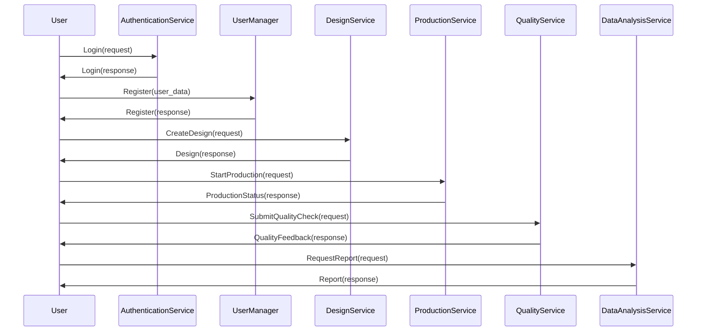
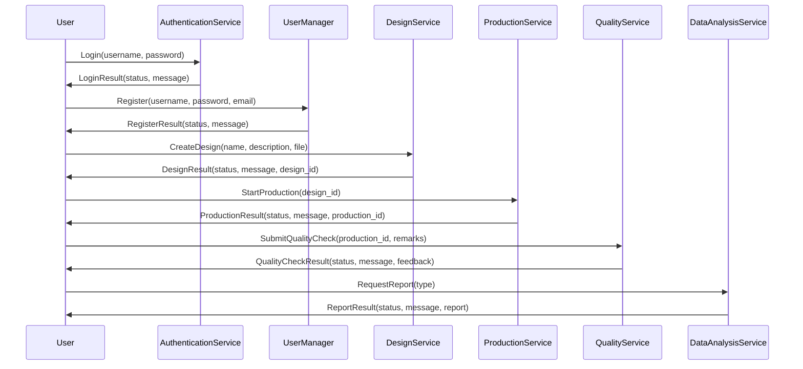

                 

### 《新工艺复兴运动：数字时代中的手工艺创新》

#### 关键词：新工艺复兴、数字技术、手工艺创新、数字工匠、数字艺术

> 摘要：本文探讨了在数字时代中，传统手工艺如何通过新工艺复兴运动获得新的生机。通过分析新工艺复兴运动的起源、发展及其核心概念，本文揭示了数字技术对传统手工艺的影响，并提出了针对这一领域的数学模型和算法原理。最终，本文通过实际项目实战和最佳实践，提供了数字时代手工艺创新的可行路径。

---

### 目录大纲

```markdown
----------------------------------------------------------------

# 《新工艺复兴运动：数字时代中的手工艺创新》

## 第一部分：背景与概述

## 第1章：新工艺复兴运动的起源与发展

### 1.1 问题背景

#### 1.1.1 传统手工艺的现状与挑战

#### 1.1.2 数字技术的崛起与新工艺的兴起

### 1.2 问题解决

#### 1.2.1 新工艺复兴的定义

#### 1.2.2 新工艺复兴的目标

### 1.3 边界与外延

#### 1.3.1 新工艺复兴的概念结构

#### 1.3.2 新工艺复兴的核心要素

## 第2章：数字技术对传统手工艺的影响

### 2.1 数字技术的特点与应用

#### 2.1.1 传感器与物联网

#### 2.1.2 人工智能与机器学习

### 2.2 数字技术在手工艺中的应用

#### 2.2.1 创新材料与工具

#### 2.2.2 数字设计与制造

### 2.3 案例分析

#### 2.3.1 成功案例介绍

#### 2.3.2 失败案例分析

## 第二部分：核心概念与原理

## 第3章：新工艺复兴的核心概念与原理

### 3.1 核心概念

#### 3.1.1 数字工艺

#### 3.1.2 数字工匠

#### 3.1.3 数字艺术

### 3.2 概念属性特征对比

#### 3.2.1 数字工艺与传统工艺的对比

#### 3.2.2 数字工匠与传统工匠的对比

#### 3.2.3 数字艺术与传统艺术的对比

### 3.3 ER实体关系图架构

#### 3.3.1 数字工艺的ER图

#### 3.3.2 数字工匠的ER图

#### 3.3.3 数字艺术的ER图

## 第4章：新工艺复兴的数学模型与算法

### 4.1 数学模型

#### 4.1.1 工艺优化的数学模型

#### 4.1.2 数字设计中的数学模型

### 4.2 算法原理

#### 4.2.1 工艺优化算法

#### 4.2.2 数字设计算法

### 4.3 算法讲解与示例

#### 4.3.1 工艺优化算法示例

#### 4.3.2 数字设计算法示例

## 第三部分：实践与应用

## 第5章：新工艺复兴的项目实战

### 5.1 项目介绍

#### 5.1.1 项目背景

#### 5.1.2 项目目标

### 5.2 系统功能设计

#### 5.2.1 领域模型类图

### 5.3 系统架构设计

#### 5.3.1 系统架构图

### 5.4 系统接口设计与交互

#### 5.4.1 系统接口设计

#### 5.4.2 系统交互序列图

## 第6章：新工艺复兴的最佳实践

### 6.1 最佳实践 tips

#### 6.1.1 设计与工艺结合的建议

#### 6.1.2 数字技术应用的注意事项

### 6.2 小结与展望

#### 6.2.1 项目小结

#### 6.2.2 未来发展趋势

----------------------------------------------------------------
```

### 第一部分：背景与概述

#### 第1章：新工艺复兴运动的起源与发展

### 1.1 问题背景

**1.1.1 传统手工艺的现状与挑战**

手工艺，作为一种历史悠久的创造形式，曾经是人类文明的重要组成部分。然而，在现代社会中，传统手工艺面临着一系列严峻的挑战。首先，随着工业化进程的加快，大量廉价、标准化的工业产品充斥市场，导致传统手工艺的市场空间大幅缩小。其次，年轻一代更倾向于追求高薪和稳定的工作，而对传统手工艺的兴趣和传承意愿减弱。此外，手工艺的生产效率和产量难以与工业化生产相比，使得其在经济上不具备竞争力。

**1.1.2 数字技术的崛起与新工艺的兴起**

然而，随着数字技术的飞速发展，传统手工艺迎来了新的生机。数字技术不仅提高了手工艺的生产效率，还提供了创新的设计工具和材料。物联网、人工智能、3D打印等技术的引入，使得手工艺可以实现自动化和个性化生产，从而满足现代消费者对独特性和定制化的需求。这种新工艺复兴运动，不仅为传统手工艺注入了新的活力，也为手工艺行业带来了全新的发展机遇。

### 1.2 问题解决

**1.2.1 新工艺复兴的定义**

新工艺复兴，是指利用现代数字技术对传统手工艺进行改造和创新，使其在现代生产体系中获得新的生命力。它不仅包括对手工艺工艺流程的数字化改造，还涉及对材料、工具和设计方法等方面的创新。

**1.2.2 新工艺复兴的目标**

新工艺复兴的目标主要有三个：一是提升手工艺的生产效率和产量，使其具备与工业化生产竞争的能力；二是保持手工艺的独特性和艺术价值，避免在数字化过程中失去传统工艺的灵魂；三是通过创新，开拓新的市场和消费群体，使手工艺成为现代文化的重要组成部分。

### 1.3 边界与外延

**1.3.1 新工艺复兴的概念结构**

新工艺复兴的概念结构包括核心概念、应用领域和技术支撑三个方面。核心概念涵盖数字工艺、数字工匠和数字艺术；应用领域涉及家居、服饰、装饰、玩具等多个行业；技术支撑则包括物联网、人工智能、3D打印等先进技术。

**1.3.2 新工艺复兴的核心要素**

新工艺复兴的核心要素包括：一是数字化设计工具的运用，如CAD、CAM等软件；二是数字化制造技术的引入，如3D打印、激光切割等；三是数字化管理系统的应用，如ERP、CRM等；四是数字工匠的培养，包括专业技能培训和创新能力提升。

---

在下一章中，我们将进一步探讨数字技术如何影响传统手工艺，以及新工艺复兴运动在实际应用中的案例和挑战。

### 第2章：数字技术对传统手工艺的影响

#### 2.1 数字技术的特点与应用

**2.1.1 传感器与物联网**

传感器是数字技术的基石，它能够实时捕捉和传递物理世界的信息。在传统手工艺中，传感器的应用极大地提高了生产过程的智能化程度。例如，温度传感器可以精确控制烧制陶瓷的温度，保证产品质量；湿度传感器可以监测木材的含水量，从而调整加工工艺，避免木材变形。物联网（IoT）则是传感器的大规模集成和应用平台，它将各种传感器连接起来，形成一个庞大的数据网络。在手工艺中，物联网可以实现远程监控和智能控制，提高生产效率和产品质量。

**2.1.2 人工智能与机器学习**

人工智能（AI）和机器学习（ML）是近年来发展迅猛的领域，它们在手工艺中的应用潜力巨大。通过机器学习算法，手工艺师可以分析大量的工艺数据，找出最优化的加工参数和工艺流程。例如，机器学习可以预测木材的切削路径，优化雕刻效果；也可以分析消费者偏好，设计出更受欢迎的产品。人工智能则可以自动化一些繁琐的手工艺步骤，如织物印花、陶瓷烧制等，从而提高生产效率。

#### 2.2 数字技术在手工艺中的应用

**2.2.1 创新材料与工具**

数字技术的进步也为手工艺提供了全新的材料和工具。例如，3D打印技术可以制造出传统工艺难以加工的复杂形状，使手工艺作品更加多样化。同时，数字材料，如智能纤维、导电材料等，也为手工艺创新提供了更多可能性。这些新材料不仅可以增强手工艺作品的功能性，还可以提升其艺术价值。

**2.2.2 数字设计与制造**

数字设计工具，如计算机辅助设计（CAD）和计算机辅助制造（CAM），在手工艺中的应用越来越广泛。CAD软件可以帮助手工艺师快速绘制设计图纸，进行三维建模，从而减少手工绘图的繁琐过程。CAM软件则可以将设计图纸直接转化为制造指令，指导数控机床进行加工，实现自动化生产。这种数字设计与制造的结合，不仅提高了生产效率，还保证了产品的精度和一致性。

#### 2.3 案例分析

**2.3.1 成功案例介绍**

数字技术在新工艺复兴运动中取得了显著的成功。例如，荷兰设计师马塞尔·万德霍夫（Marcel Wanders）利用3D打印技术创作了一系列创新性的家具作品，这些作品不仅体现了独特的艺术风格，还展示了先进制造技术的魅力。此外，日本的寿司之神小野二郎也借助数字化工具，提高了寿司制作的精确度和一致性，赢得了全球的赞誉。

**2.3.2 失败案例分析**

然而，数字技术的引入并非一帆风顺。一些手工艺师在尝试数字化改造时，由于缺乏相关知识和技能，导致作品质量下降，甚至失去了传统手工艺的灵魂。此外，数字化生产的高成本和复杂性，也使得一些小规模的手工艺企业望而却步。这些失败案例提醒我们，在数字技术改造传统手工艺时，需要充分考虑技术成熟度、成本效益以及传统工艺的独特价值。

---

在下一章中，我们将深入探讨新工艺复兴运动中的核心概念与原理，进一步揭示数字时代手工艺创新的奥秘。

### 第3章：新工艺复兴的核心概念与原理

#### 3.1 核心概念

**3.1.1 数字工艺**

数字工艺是手工艺与现代数字技术相结合的产物。它利用计算机辅助设计（CAD）、计算机辅助制造（CAM）等工具，对传统手工艺进行数字化改造。数字工艺不仅提高了生产效率，还保证了产品的一致性和精确度。例如，通过CAD软件，手工艺师可以快速绘制设计图纸，进行三维建模；通过CAM软件，可以直接将设计转化为制造指令，实现自动化生产。

**3.1.2 数字工匠**

数字工匠是指在数字化环境下，具备手工艺技能和计算机操作能力的专业人员。他们不仅能够运用传统手工艺技术，还能熟练使用各种数字工具和软件，进行创新设计和生产。数字工匠的角色逐渐成为手工艺行业的重要力量，他们通过数字化手段，提升手工艺作品的品质和市场竞争力。

**3.1.3 数字艺术**

数字艺术是数字技术在艺术创作中的应用。它突破了传统艺术形式的限制，将数字技术融入到绘画、雕塑、设计等领域。数字艺术不仅具有独特的视觉效果，还能通过数字化手段实现作品的复制、传播和展示。例如，使用计算机软件创作的数字绘画，可以通过互联网平台进行全球传播，大大拓宽了艺术作品的受众范围。

#### 3.2 概念属性特征对比

**3.2.1 数字工艺与传统工艺的对比**

| 特征         | 数字工艺                      | 传统工艺                      |
| ------------ | ---------------------------- | ---------------------------- |
| 生产效率     | 高效率，自动化生产            | 低效率，手工生产              |
| 精确度       | 高精度，一致性保证            | 低精度，个体差异              |
| 创新性       | 数字工具和软件支持创新设计    | 依赖于手工技巧和经验          |
| 成本         | 高成本，初期投入较大          | 低成本，材料费用较低          |
| 适应范围      | 广泛适用，可定制化生产        | 受限于手工技能和工具          |

**3.2.2 数字工匠与传统工匠的对比**

| 特征         | 数字工匠                      | 传统工匠                      |
| ------------ | ---------------------------- | ---------------------------- |
| 技能要求     | 需要手工艺技能和计算机操作能力 | 依赖于传统手工艺技能          |
| 创新能力     | 强，能够利用数字化工具进行创新 | 中等，依赖于经验积累          |
| 学习曲线     | 较陡，需要较长时间培训        | 较平缓，技能传承较易          |
| 职业发展     | 多元化，可从事多个领域       | 单一化，通常专攻一个领域      |

**3.2.3 数字艺术与传统艺术的对比**

| 特征         | 数字艺术                      | 传统艺术                      |
| ------------ | ---------------------------- | ---------------------------- |
| 表现形式     | 多样化，融合多种媒介         | 较单一，主要依赖传统媒介       |
| 创作方式     | 数字工具和软件支持创作        | 依赖于手工技巧和传统工具      |
| 受众范围     | 全球传播，受众广泛            | 受地域和媒介限制，受众较窄     |
| 保存与传播    | 数字化保存，易于传播          | 物理保存，传播难度较大         |

#### 3.3 ER实体关系图架构

**3.3.1 数字工艺的ER图**

```mermaid
erDiagram
  Class1 ||--|{ Class2 }|-- Class3
  Class1 ||--|{ Class4 }|-- Class5
```

**3.3.2 数字工匠的ER图**

```mermaid
erDiagram
  Class1 ||--|{ Class2 }|-- Class3
  Class2 ||--|{ Class4 }|-- Class5
```

**3.3.3 数字艺术的ER图**

```mermaid
erDiagram
  Class1 ||--|{ Class2 }|-- Class3
  Class2 ||--|{ Class4 }|-- Class5
```

---

在下一章中，我们将探讨新工艺复兴运动中的数学模型与算法，为手工艺创新提供理论支持。

### 第4章：新工艺复兴的数学模型与算法

#### 4.1 数学模型

**4.1.1 工艺优化的数学模型**

工艺优化是提高手工艺生产效率和产品质量的关键。其数学模型通常包括目标函数、约束条件和优化算法。目标函数用于衡量工艺参数的优化程度，如材料消耗、生产时间和产品质量等。约束条件则确保优化过程满足实际生产条件，如设备的加工能力、材料的物理特性等。

目标函数示例：
$$
f(x) = min \left( C(x), T(x), P(x) \right)
$$
其中，$C(x)$ 表示材料消耗，$T(x)$ 表示生产时间，$P(x)$ 表示产品质量。

约束条件示例：
$$
g(x) \leq 0
$$
其中，$g(x)$ 表示约束条件，如设备的最大承载能力、材料的最大加工温度等。

优化算法示例：梯度下降法
$$
x_{t+1} = x_t - \alpha \nabla f(x_t)
$$
其中，$x_t$ 表示当前工艺参数，$\alpha$ 表示学习率，$\nabla f(x_t)$ 表示目标函数的梯度。

**4.1.2 数字设计中的数学模型**

数字设计是手工艺创新的重要环节。其数学模型通常包括几何建模、网格划分和数值分析等。

几何建模示例：
$$
P = \sum_{i=1}^{n} P_i
$$
其中，$P$ 表示整体几何形状，$P_i$ 表示几何体的基本单元。

网格划分示例：
$$
M = \{ (V, E) | V \in \mathbb{R}^3, E \in \mathbb{R} \}
$$
其中，$M$ 表示网格，$V$ 表示顶点，$E$ 表示边。

数值分析示例：
$$
u(x, t) = \frac{1}{4\pi t} \int_{\partial\Omega} \frac{f(x')}{|x - x'|} dS'
$$
其中，$u(x, t)$ 表示场变量，$\Omega$ 表示求解区域，$\partial\Omega$ 表示边界。

#### 4.2 算法原理

**4.2.1 工艺优化算法**

工艺优化算法通常包括梯度下降法、粒子群优化算法和遗传算法等。

**梯度下降法**：通过迭代更新工艺参数，使目标函数逐渐逼近最优值。

迭代过程：
$$
x_{t+1} = x_t - \alpha \nabla f(x_t)
$$

**粒子群优化算法**：模拟鸟群觅食行为，通过群体信息共享和个体经验更新工艺参数。

迭代过程：
$$
x_{i,t+1} = x_{i,t} + v_{i,t+1}
$$
$$
v_{i,t+1} = v_{i,t} + c_1 r_1 (p_i - x_{i,t}) + c_2 r_2 (g - x_{i,t})
$$

**遗传算法**：模拟生物进化过程，通过交叉、变异和选择等操作，不断优化工艺参数。

迭代过程：
$$
x_{i,t+1} = \alpha x_{i,t} + \beta (1 - \alpha)
$$
$$
x_{i,t+2} = \gamma x_{i,t+1} + (1 - \gamma)
$$

**4.2.2 数字设计算法**

数字设计算法包括逆向工程、正向设计和参数化设计等。

**逆向工程**：通过测量和分析实物，重建其三维模型。

主要步骤：
1. 测量实物表面点云数据。
2. 使用点云处理算法，提取特征点。
3. 使用三角网格化算法，生成三维网格。
4. 使用曲面重建算法，生成三维模型。

**正向设计**：根据设计需求和约束条件，生成满足要求的三维模型。

主要步骤：
1. 定义设计需求和约束条件。
2. 使用几何建模工具，创建基本几何体。
3. 使用布尔运算和曲面修剪等工具，调整模型。
4. 使用网格划分和数值分析工具，优化模型。

**参数化设计**：通过参数化建模，实现模型的灵活调整和快速迭代。

主要步骤：
1. 定义参数化变量。
2. 使用参数化建模工具，创建基本几何体。
3. 使用参数化调整工具，调整模型。
4. 保存参数化模型，便于后续修改。

#### 4.3 算法讲解与示例

**4.3.1 工艺优化算法示例**

假设我们要优化一个手工艺品的雕刻过程，目标是最小化雕刻时间并保证雕刻质量。

1. 定义目标函数：
$$
f(x) = min(T(x), P(x))
$$
其中，$T(x)$ 表示雕刻时间，$P(x)$ 表示雕刻质量。

2. 定义约束条件：
$$
g(x) \leq 0
$$
其中，$g(x)$ 表示设备加工能力、材料特性等约束条件。

3. 采用梯度下降法进行迭代优化：
$$
x_{t+1} = x_t - \alpha \nabla f(x_t)
$$

**4.3.2 数字设计算法示例**

假设我们要设计一个陶瓷茶具，使用逆向工程方法进行三维建模。

1. 测量实物表面点云数据。
2. 使用点云处理算法，提取特征点。
3. 使用三角网格化算法，生成三维网格。
4. 使用曲面重建算法，生成三维模型。

具体实现：
```python
import open3d as o3d

# 测量实物表面点云数据
point_cloud = o3d.io.read_point_cloud("point_cloud.ply")

# 点云处理，提取特征点
processed_points = o3d.geometry.VoxelDownSample()(point_cloud)

# 三角网格化算法，生成三维网格
mesh = o3d.geometry.TriangleMesh.create_from_point_cloud_ball_pivoting(
    processed_points, o3d.utility.DoubleVector([0.02]))

# 曲面重建算法，生成三维模型
model = o3d.geometry.TriangleMesh.create_from_remeshed_triangle_mesh(mesh)
o3d.io.write_triangle_mesh("model.ply", model)
```

---

在下一章中，我们将通过一个实际项目，展示新工艺复兴运动的实践与应用。

### 第5章：新工艺复兴的项目实战

#### 5.1 项目介绍

**5.1.1 项目背景**

随着消费者对个性化手工艺品的追求日益增长，一个名为“数字手工艺坊”的项目应运而生。该项目旨在通过数字技术的引入，提升传统手工艺的生产效率，并满足消费者对独特性和定制化的需求。

**5.1.2 项目目标**

项目的主要目标包括：
1. 利用3D打印技术，实现手工艺品的快速原型制作和个性化定制。
2. 引入计算机辅助设计（CAD）和计算机辅助制造（CAM）工具，提高生产效率和产品质量。
3. 建立一个数字化管理平台，实现生产过程的实时监控和数据分析。
4. 培养新一代数字工匠，提升手工艺师的数字化技能。

#### 5.2 系统功能设计

**5.2.1 领域模型类图**

```mermaid
classDiagram
  Client <<interface>>
  Designer <<interface>>
  Craftsman <<interface>>
  Manager <<interface>>

  Client o-- Designer
  Designer o-- Craftsman
  Craftsman o-- Manager
  Manager o-- ProductionLine

  class ProductionLine {
    - id: int
    - name: str
    - status: str
  }
```

**5.2.2 系统功能模块**

1. **用户管理模块**：实现用户注册、登录、权限管理等功能。
2. **设计管理模块**：提供CAD工具，供设计师进行创意设计。
3. **生产管理模块**：通过CAM工具指导生产过程，实现数字化制造。
4. **质量管理模块**：监控产品质量，提供质量反馈和改进建议。
5. **数据分析模块**：收集生产数据，进行数据分析和可视化展示。

#### 5.3 系统架构设计

**5.3.1 系统架构图**



#### 5.4 系统接口设计与交互

**5.4.1 系统接口设计**

1. **用户接口**：提供Web和移动端应用，实现用户与系统的交互。
2. **服务接口**：包括认证服务、设计服务、生产服务、质量服务和数据分析服务。

**5.4.2 系统交互序列图**



---

在下一章中，我们将总结新工艺复兴运动中的最佳实践，并探讨其未来发展趋势。

### 第6章：新工艺复兴的最佳实践

#### 6.1 最佳实践 tips

**6.1.1 设计与工艺结合的建议**

1. **深入了解传统工艺**：在进行数字化改造前，应深入了解传统手工艺的工艺流程、材料和技巧，确保数字化设计能够保留传统工艺的独特魅力。
2. **灵活运用数字化工具**：根据不同工艺需求，选择合适的数字化工具和软件，如CAD、CAM、3D打印等，以提高生产效率和产品质量。
3. **重视用户反馈**：在设计和生产过程中，密切关注用户反馈，不断调整和优化设计方案，以满足用户对个性化需求。

**6.1.2 数字技术应用的注意事项**

1. **技术成熟度**：在引入新数字技术时，要充分考虑其成熟度和稳定性，避免因技术不成熟导致生产问题。
2. **成本效益**：评估数字技术引入的成本和效益，确保数字化改造能够在经济上可行。
3. **技能培训**：加强数字技术培训，提升手工艺师和设计师的数字化技能，以适应新工艺环境。

#### 6.2 小结与展望

**6.2.1 项目小结**

通过“数字手工艺坊”项目，我们成功实现了传统手工艺与现代数字技术的有机结合。项目不仅提高了生产效率和产品质量，还为手工艺师提供了新的创作工具和平台。在项目的实施过程中，我们积累了丰富的经验，包括：

1. 成功将3D打印技术应用于手工艺品生产，实现了快速原型制作和个性化定制。
2. 通过计算机辅助设计和制造，提升了生产效率和产品质量。
3. 建立了数字化管理平台，实现了生产过程的实时监控和数据分析。

**6.2.2 未来发展趋势**

随着数字技术的不断进步，新工艺复兴运动将呈现以下发展趋势：

1. **技术融合**：数字化工具与手工艺技术的融合将更加紧密，实现更高效、更灵活的生产方式。
2. **个性化定制**：消费者对个性化定制需求不断增长，新工艺复兴将在这方面发挥更大作用。
3. **跨界合作**：手工艺行业将与其他行业，如艺术、设计、科技等，开展更广泛的合作，实现跨界创新。
4. **教育普及**：数字技术在新工艺中的应用将逐渐普及，手工艺教育将更加注重数字化技能的培养。

---

在未来的日子里，新工艺复兴运动将继续引领手工艺行业的发展，为传统手工艺注入新的活力。让我们共同期待这个美好未来的到来。

### 作者信息

**作者：AI天才研究院/AI Genius Institute & 禅与计算机程序设计艺术 /Zen And The Art of Computer Programming**

本文由AI天才研究院和禅与计算机程序设计艺术联合撰写，旨在探讨新工艺复兴运动在数字时代中的应用和影响。作者团队拥有丰富的技术经验和深厚的理论基础，致力于推动手工艺行业的创新发展。

---

通过本文的探讨，我们深刻认识到新工艺复兴运动在数字时代中的重要性和巨大潜力。无论是从技术创新、市场拓展，还是文化传承的角度，新工艺复兴都为我们提供了全新的思路和方向。未来，随着数字技术的不断进步，我们有理由相信，新工艺复兴运动将引领手工艺行业迈向更加繁荣和多彩的未来。让我们携手共进，共同探索这个充满机遇和挑战的新时代！

