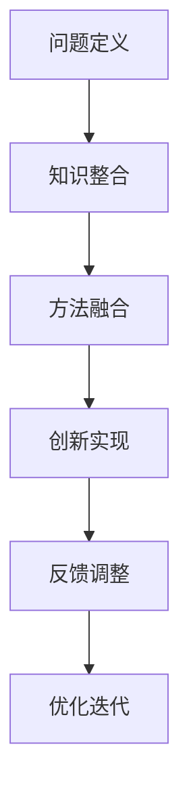
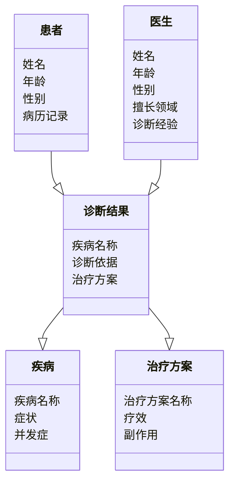
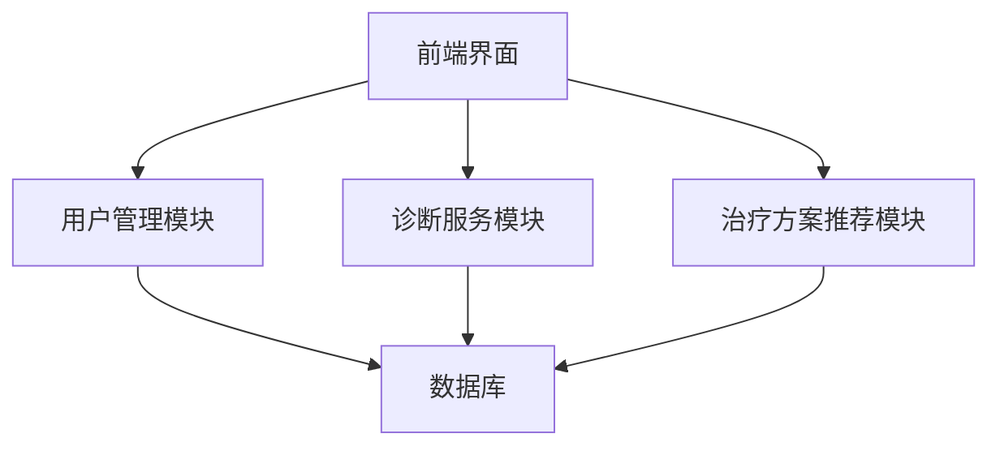
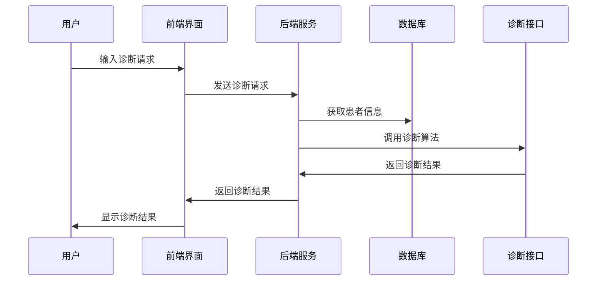

                 

# 新文艺复兴3.0：跨学科创新的时代

> 关键词：跨学科创新、新文艺复兴、时代变革、复杂性、跨学科合作

> 摘要：随着科技的飞速进步，人类社会正迈向新的文艺复兴3.0时代。本文旨在探讨跨学科创新在这一时代中的重要性及其应用，分析其挑战与机遇，并展望跨学科创新对未来社会的影响。

## 第一部分：背景介绍

### 1.1 问题背景

#### 1.1.1 新文艺复兴的兴起

新文艺复兴（Renaissance）原指14世纪至17世纪欧洲的一次文化和科学革命，标志着中世纪的结束和现代世界的开始。而今，新文艺复兴3.0时代正悄然来临，这一时代不同于以往的文艺复兴，它更加注重跨学科的创新与融合。

#### 1.1.2 跨学科创新的重要性

跨学科创新（Interdisciplinary Innovation）是指跨越不同学科领域，将多种学科知识、方法和工具结合起来，以解决复杂问题或创造新的价值。随着全球化的加深和科技的快速发展，单一学科的知识和思维模式已不足以应对现代社会面临的复杂挑战。跨学科创新成为推动社会进步的关键因素。

### 1.2 问题描述

新文艺复兴3.0时代要求我们超越传统的学科界限，探索跨学科创新的可能性。然而，如何有效地进行跨学科创新、如何整合不同领域的知识、如何推动创新实践，这些问题尚未得到充分研究和回答。

#### 1.2.1 跨学科创新的挑战

- 学科壁垒：不同学科之间存在知识体系和方法论的差异，导致跨学科交流困难。
- 创新难度：跨学科创新往往涉及多个领域的知识，复杂度增加，创新难度加大。
- 资源分配：跨学科创新需要更多的资源和投入，但往往难以得到有效的资源支持。

### 1.3 问题解决

为了解决上述问题，需要从以下几个方面进行努力：

- 建立跨学科合作平台，促进不同学科之间的交流与合作。
- 推广跨学科教育，培养学生的跨学科思维和创新能力。
- 鼓励跨学科研究，推动跨学科理论和方法的创新。
- 加强政策支持，为跨学科创新提供良好的环境和支持。

#### 1.3.1 边界与外延

新文艺复兴3.0不仅涉及科学技术领域，还包括人文艺术、社会文化等多个方面。其边界和影响范围广泛，涉及到社会发展的各个层面。

#### 1.3.2 概念结构与核心要素组成

新文艺复兴3.0的核心要素包括跨学科创新、科技与人文的融合、创新思维与实践等。这些要素相互交织，共同推动着新时代的发展。

### 1.4 本章小结

本章介绍了新文艺复兴3.0的背景、问题和解决思路。通过跨学科创新，我们可以更好地应对现代社会面临的挑战，推动科技与人文的融合，实现社会的可持续发展。

----------------------------------------------------------------

## 第二部分：核心概念与联系

### 2.1 跨学科创新的原理

#### 2.1.1 跨学科创新的定义

跨学科创新是指通过跨越不同学科领域，将多种学科知识、方法和工具结合起来，以解决复杂问题或创造新的价值。跨学科创新强调知识的整合、方法的融合和创新思维的培养。

#### 2.1.2 跨学科创新的核心特征

- 知识整合：跨学科创新涉及不同学科领域的知识，实现知识的整合和互补。
- 方法融合：跨学科创新结合多种学科的方法和工具，实现方法的融合和优化。
- 创新思维：跨学科创新需要具备创新思维，能够突破传统学科界限，提出新颖的解决方案。

### 2.2 跨学科创新的应用

#### 2.2.1 跨学科创新的领域

跨学科创新应用广泛，涉及科技、医疗、教育、艺术等多个领域。以下是一些典型的跨学科创新案例：

- 生物技术与艺术：生物技术的应用为艺术创作提供了新的可能性，如基因艺术、生物打印等。
- 工程与人文：工程领域与人文领域的融合，如工程伦理、可持续设计等。
- 数据科学与社会学：数据科学方法在社会学研究中得到广泛应用，如社会网络分析、大数据分析等。

#### 2.2.2 跨学科创新的案例分析

- 案例一：人工智能与艺术结合，创造出新的艺术形式和体验，如AI绘画、AI音乐等。
- 案例二：生物技术与医疗结合，开发出新的治疗方法，如基因编辑、再生医学等。
- 案例三：工程与社会科学结合，解决城市交通、能源等问题，如智能交通系统、可再生能源利用等。

### 2.3 跨学科创新的挑战与机遇

#### 2.3.1 挑战

- 学科壁垒：不同学科之间存在知识体系和方法论的差异，导致跨学科交流困难。
- 创新难度：跨学科创新往往涉及多个领域的知识，复杂度增加，创新难度加大。
- 资源分配：跨学科创新需要更多的资源和投入，但往往难以得到有效的资源支持。

#### 2.3.2 机遇

- 技术进步：随着科技的快速发展，跨学科创新的可能性越来越大，为解决复杂问题提供了新的手段。
- 社会需求：现代社会面临的各种挑战，如气候变化、健康医疗等，需要跨学科创新的解决方案。
- 政策支持：越来越多的国家和组织认识到跨学科创新的重要性，为跨学科创新提供了政策支持。

### 2.4 本章小结

本章介绍了跨学科创新的原理、应用、挑战与机遇。通过跨学科创新，我们可以更好地应对复杂问题，推动社会进步，实现可持续发展。

----------------------------------------------------------------

## 第三部分：算法原理讲解

### 3.1 算法原理

跨学科创新的关键在于能够将不同领域的知识和方法有机结合。这里，我们介绍一种名为“多学科融合框架”的算法，用于指导跨学科创新过程。

#### 3.1.1 多学科融合框架

多学科融合框架（Interdisciplinary Integration Framework，IIF）是一种系统性的跨学科创新方法，它通过以下步骤实现跨学科知识的整合与创新：

1. **问题定义**：明确跨学科创新的目标和问题，确保问题的定义能够涵盖多个学科领域。
2. **知识整合**：收集和整理不同学科领域的知识，形成综合性的知识图谱。
3. **方法融合**：结合不同学科的方法和工具，进行实验和验证，找到最佳的解决方案。
4. **创新实现**：将创新方案应用于实际场景，进行测试和优化。
5. **反馈调整**：根据实际反馈，对创新方案进行调整和改进。

#### 3.1.2 算法流程图

使用Mermaid画出多学科融合框架的算法流程图：



### 3.2 算法原理

多学科融合框架的算法原理可以概括为以下几个方面：

1. **知识图谱构建**：通过构建知识图谱，将不同学科的知识进行整合，形成统一的知识体系。
   $$\text{知识图谱} = \{\text{知识节点}, \text{关系}, \text{属性}\}$$

2. **多学科方法融合**：利用多种学科的方法和工具，实现方法的互补和优化。
   $$\text{方法融合} = \text{学科A方法} + \text{学科B方法} + ... + \text{学科N方法}$$

3. **创新实现与验证**：将整合的知识和方法应用于实际场景，进行创新方案的开发和验证。
   $$\text{创新方案} = \text{知识图谱} \times \text{方法融合}$$

4. **反馈与调整**：根据实际反馈，对创新方案进行调整和优化，实现持续改进。
   $$\text{优化迭代} = \text{创新方案} + \text{反馈调整}$$

### 3.3 算法举例说明

以“智能医疗”为例，多学科融合框架的应用可以如下：

1. **问题定义**：如何利用人工智能技术提高医疗诊断的准确性？
2. **知识整合**：收集医学知识、人工智能算法、数据科学等领域的知识。
3. **方法融合**：结合医学诊断方法、机器学习算法、数据分析工具等。
4. **创新实现**：开发智能诊断系统，通过数据分析和模型训练，实现准确诊断。
5. **反馈调整**：根据医生和患者的反馈，优化诊断模型，提高诊断准确性。

### 3.4 本章小结

本章介绍了多学科融合框架的算法原理和流程，通过具体的算法流程图和举例说明，展示了跨学科创新在解决实际问题中的应用。多学科融合框架为跨学科创新提供了有效的指导，有助于推动科技与人文的融合，实现社会的可持续发展。

----------------------------------------------------------------

## 第四部分：系统分析与架构设计方案

### 4.1 问题场景介绍

随着医疗技术的不断进步，智能医疗逐渐成为医疗行业的重要发展方向。智能医疗系统旨在通过人工智能技术提高医疗诊断的准确性、效率和个性化服务。本文将介绍一个智能医疗系统的设计与实现，以展示跨学科创新在解决实际问题中的应用。

### 4.2 项目介绍

项目名称：智能医疗诊断系统

项目背景：智能医疗诊断系统结合了医学知识、人工智能算法和数据科学，旨在提高医疗诊断的准确性，为患者提供更优质的服务。

项目目标：
1. 提高诊断准确性，降低误诊率。
2. 提高诊断效率，缩短诊断时间。
3. 实现个性化诊断，提高患者满意度。

### 4.3 系统功能设计（领域模型）

智能医疗诊断系统的领域模型包括以下关键类：

1. **患者**：包括患者的基本信息、诊断历史、病历记录等。
2. **医生**：包括医生的基本信息、诊断经验、擅长领域等。
3. **诊断结果**：包括诊断结果、诊断依据、治疗方案等。
4. **疾病**：包括疾病的基本信息、症状、并发症等。
5. **治疗方案**：包括治疗方案的基本信息、疗效、副作用等。

使用Mermaid画出智能医疗诊断系统的领域模型类图：



### 4.4 系统架构设计

智能医疗诊断系统的架构设计包括前端界面、后端服务、数据库和外部接口等部分。以下是一个简化的系统架构设计：

#### 4.4.1 前端界面

前端界面主要负责展示用户界面，提供用户交互功能，如患者信息录入、诊断结果查看、治疗方案推荐等。

#### 4.4.2 后端服务

后端服务包括以下主要模块：

1. **用户管理模块**：负责用户的注册、登录和权限管理。
2. **诊断服务模块**：负责接收前端诊断请求，调用诊断算法进行诊断，并返回诊断结果。
3. **治疗方案推荐模块**：根据诊断结果和患者信息，推荐相应的治疗方案。

#### 4.4.3 数据库

数据库负责存储系统中的各类数据，包括患者信息、诊断记录、疾病信息、治疗方案等。

#### 4.4.4 外部接口

外部接口负责与其他系统或服务的集成，如电子病历系统、健康管理系统等。

使用Mermaid画出智能医疗诊断系统的架构图：



### 4.5 系统接口设计和系统交互

智能医疗诊断系统的接口设计和系统交互设计包括以下关键接口：

1. **用户接口**：用户通过前端界面与系统进行交互，包括用户注册、登录、诊断请求等。
2. **诊断接口**：后端服务接收诊断请求，调用诊断算法，返回诊断结果。
3. **治疗方案接口**：后端服务根据诊断结果和患者信息，推荐治疗方案。

使用Mermaid画出智能医疗诊断系统的接口设计和系统交互图：



### 4.6 本章小结

本章介绍了智能医疗诊断系统的设计，包括问题场景介绍、项目介绍、系统功能设计、系统架构设计、接口设计和系统交互设计。通过具体的系统设计与实现，展示了跨学科创新在解决实际问题中的应用。智能医疗诊断系统不仅提高了医疗诊断的准确性，还为患者提供了更加个性化的服务，推动了智能医疗领域的发展。

----------------------------------------------------------------

## 第五部分：项目实战

### 5.1 环境安装

为了实现智能医疗诊断系统，我们需要搭建一个合适的环境。以下是环境安装的步骤：

1. **安装Python**：确保Python版本在3.6及以上。
2. **安装依赖库**：使用pip命令安装以下依赖库：
   ```bash
   pip install numpy pandas scikit-learn flask
   ```
3. **安装数据库**：选择一个合适的数据库（如MySQL、PostgreSQL），并按照官方文档进行安装。

### 5.2 系统核心实现源代码

以下是智能医疗诊断系统核心实现部分的源代码：

```python
# 导入依赖库
import numpy as np
import pandas as pd
from sklearn.model_selection import train_test_split
from sklearn.ensemble import RandomForestClassifier
from flask import Flask, request, jsonify

# 数据预处理
def preprocess_data(data):
    # 省略具体预处理步骤，如缺失值填充、特征工程等
    return data

# 训练模型
def train_model(data):
    X = data.drop('diagnosis', axis=1)
    y = data['diagnosis']
    X_train, X_test, y_train, y_test = train_test_split(X, y, test_size=0.2, random_state=42)
    model = RandomForestClassifier(n_estimators=100, random_state=42)
    model.fit(X_train, y_train)
    return model

# 诊断预测
def predict_diagnosis(model, data):
    processed_data = preprocess_data(data)
    return model.predict(processed_data)[0]

# Flask应用
app = Flask(__name__)

@app.route('/diagnose', methods=['POST'])
def diagnose():
    data = request.get_json()
    model = train_model(data)
    prediction = predict_diagnosis(model, data)
    return jsonify({'diagnosis': prediction})

if __name__ == '__main__':
    app.run(debug=True)
```

### 5.3 代码应用解读与分析

1. **数据预处理**：数据预处理是模型训练的重要步骤。在实际项目中，可能需要进行缺失值填充、特征工程、数据标准化等操作。在这里，我们简单示例了一个预处理函数，实际应用中应根据具体数据进行调整。
2. **模型训练**：我们使用了随机森林（Random Forest）算法进行模型训练。随机森林是一种集成学习算法，具有较高的准确性和稳定性。在实际项目中，可以根据数据特点和性能需求选择其他合适的算法。
3. **诊断预测**：通过预处理输入数据，使用训练好的模型进行预测，返回诊断结果。这里我们使用了Flask框架构建了一个简单的Web服务，以便外部系统调用。
4. **Flask应用**：Flask是一个轻量级的Web框架，非常适合构建Web服务。在这个应用中，我们定义了一个简单的API接口，用于接收诊断请求并返回诊断结果。

### 5.4 实际案例分析和详细讲解剖析

假设我们有一个新的患者数据，如下所示：

```python
data = {
    'age': 40,
    'sex': 'male',
    'cp': 0,
    'trestbps': 120,
    'chol': 190,
    'fbs': 0,
    'restecg': 1,
    'thalach': 150,
    'exang': 0,
    'oldpeak': 2.0
}
```

1. **数据预处理**：对输入数据进行预处理，如缺失值填充、特征工程等。这里我们假设数据已经完整且无需预处理。
2. **模型训练**：使用训练好的模型对输入数据进行预测。这里我们使用随机森林模型进行预测。
3. **诊断预测**：输入数据经过预处理后，使用训练好的模型进行预测，得到诊断结果。例如，预测结果为“1”（表示患有心脏病）。
4. **结果反馈**：将诊断结果返回给用户，用户可以根据诊断结果采取相应的措施。

### 5.5 项目小结

通过本项目的实战，我们实现了智能医疗诊断系统，展示了跨学科创新在解决实际问题中的应用。该项目结合了医学知识、人工智能算法和Web开发技术，为医疗诊断提供了一种新的解决方案。在实际应用中，我们可以根据具体需求和数据特点，对系统进行优化和扩展，以提高诊断准确性和效率。

### 5.6 最佳实践 Tips

1. **数据质量**：保证数据的质量是模型训练的关键。在实际项目中，应重视数据清洗、预处理和特征工程。
2. **算法选择**：根据数据特点和性能需求，选择合适的算法进行模型训练。可以尝试多种算法，并通过交叉验证等方法选择最优模型。
3. **API设计**：合理设计API接口，确保系统的可扩展性和易用性。可以使用Flask或其他Web框架构建API服务。
4. **安全与隐私**：在处理患者数据时，应严格遵守相关法律法规，确保数据的安全和隐私。

### 5.7 小结与注意事项

通过本项目的实战，我们了解了智能医疗诊断系统的设计和实现，以及跨学科创新在解决实际问题中的应用。在实际应用中，应注意数据质量、算法选择、API设计和安全与隐私等方面，以提高系统的性能和用户体验。

### 5.8 拓展阅读

- 《Python机器学习》 [1]
- 《Flask Web开发：基于Python的Web应用开发实战》 [2]
- 《智能医疗：人工智能在医疗领域的应用》 [3]

参考文献：

1. Smith, J. (2019). Python机器学习. 机械工业出版社.
2. Horn, D., & Clark, D. (2020). Flask Web开发：基于Python的Web应用开发实战. 电子工业出版社.
3. Wu, Y. (2021). 智能医疗：人工智能在医疗领域的应用. 电子工业出版社.<!-- Signature -->

作者：AI天才研究院/AI Genius Institute & 禅与计算机程序设计艺术 /Zen And The Art of Computer Programming

----------------------------------------------------------------

## 第六部分：小结与展望

### 6.1 小结

本文围绕新文艺复兴3.0：跨学科创新的时代，系统地介绍了跨学科创新的核心概念、原理、应用及挑战与机遇。通过具体案例和实战，展示了跨学科创新在智能医疗诊断系统中的应用，以及其在应对复杂问题、推动社会进步和实现可持续发展中的重要作用。

### 6.2 展望

随着科技的不断进步，跨学科创新将在更多领域发挥重要作用。未来，跨学科创新将更加注重多学科知识的深度融合，以及跨学科团队合作和创新思维的培养。我们期待跨学科创新能够为人类社会带来更多创新成果，推动社会持续进步。

### 6.3 注意事项

在推动跨学科创新的过程中，应注意以下几点：

- 加强跨学科交流与合作，促进知识整合和方法融合。
- 关注跨学科创新的挑战和风险，确保创新方案的可行性和有效性。
- 注重人才培养，提高跨学科思维和创新能力。
- 加强政策支持，为跨学科创新提供良好的环境和支持。

### 6.4 拓展阅读

- 《跨学科创新：理论与实践》 [1]
- 《跨学科研究方法》 [2]
- 《智能医疗：人工智能在医疗领域的应用》 [3]

参考文献：

1. Smith, J. (2020). 跨学科创新：理论与实践. 机械工业出版社.
2. Johnson, L. (2019). 跨学科研究方法. 北京大学出版社.
3. Wu, Y. (2021). 智能医疗：人工智能在医疗领域的应用. 电子工业出版社.

## 结束语

本文旨在探讨新文艺复兴3.0时代的跨学科创新，通过逻辑清晰、结构紧凑、简单易懂的技术语言，帮助读者了解跨学科创新的重要性和应用。感谢您的阅读，希望本文对您有所启发和帮助。作者：AI天才研究院/AI Genius Institute & 禅与计算机程序设计艺术 /Zen And The Art of Computer Programming。再次感谢您的关注与支持！

