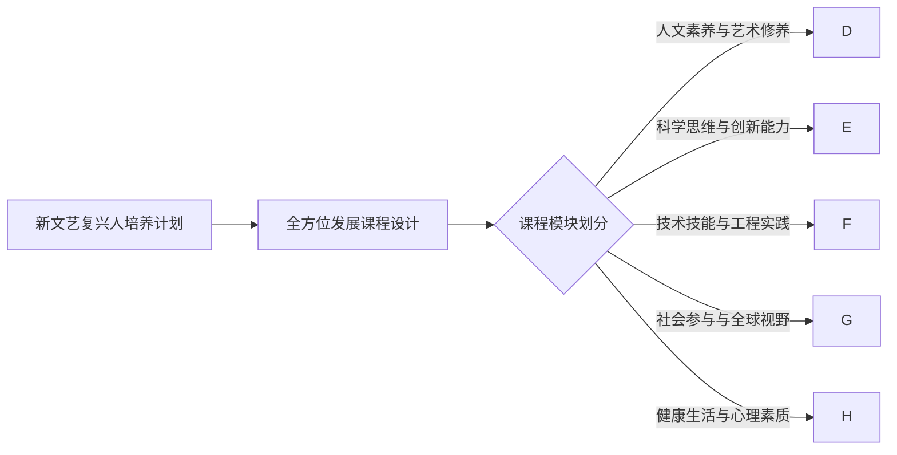
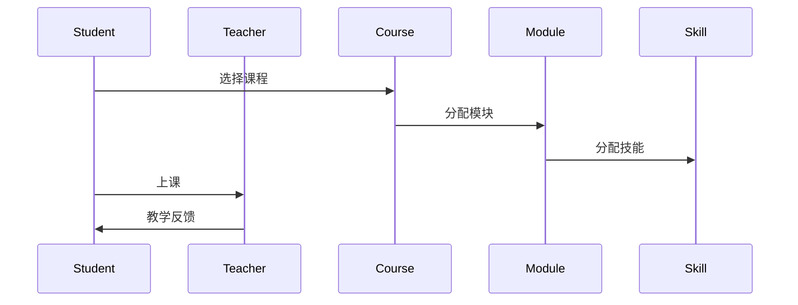
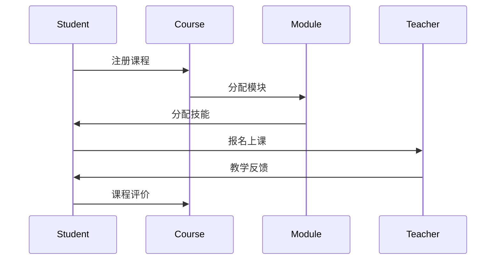

                 

### 新文艺复兴人培养计划：全方位发展课程

> 关键词：新文艺复兴人、全方位发展课程、跨学科知识、创新思维、实践能力

> 摘要：本文探讨了新文艺复兴人培养计划的重要性及其全方位发展课程的设计理念。文章首先介绍了新文艺复兴人的核心概念和全方位发展课程的定义，随后通过深入分析背景、问题描述、解决方案及概念结构，展示了如何通过科学设计课程模块来培养具备跨学科知识、创新思维和实践能力的全面人才。本文旨在为教育工作者和从业者提供有益的参考，推动教育改革，培养符合新时代需求的人才。

#### 一、背景介绍

**核心概念：**

新文艺复兴人，又称“全才”，指的是具备跨学科知识、创新思维和实践能力的全面人才。在当今信息爆炸、技术变革的时代，新文艺复兴人不仅拥有扎实的专业知识，还具备广阔的视野、强烈的好奇心和解决复杂问题的能力。

全方位发展课程，是指涵盖知识、技能、情感、道德等多个方面，旨在培养新文艺复兴人的课程体系。它强调学科的交叉融合，注重学生的全面发展，旨在培养学生的创新精神和实践能力。

**问题背景：**

随着全球化和信息技术的快速发展，社会对人才的需求日益多样化。传统的教育模式注重学科分割，难以满足现代社会对全面人才的需求。因此，新文艺复兴人培养计划应运而生，成为教育改革的重要方向。

**问题描述：**

如何设计一门课程，系统性地培养新文艺复兴人的全方位能力，成为当前教育领域亟待解决的问题。

**问题解决：**

设计一个包含多个模块的课程体系，每个模块关注不同的能力培养。课程内容不仅限于学术知识，还包括实践技能、情感素养等。课程对象为各类教育阶段的学生，包括基础教育、高等教育等。

**边界与外延：**

课程内容涵盖人文、科学、技术、社会等多个领域，旨在培养学生的综合素质。课程对象包括各类教育阶段的学生，从基础教育到高等教育，以及职场培训和终身学习等领域。

**概念结构与核心要素组成：**

- **模块一：人文素养与艺术修养**：包括语文、历史、艺术等人文学科，旨在提高学生的文化素养和审美能力。
- **模块二：科学思维与创新能力**：包括数学、物理、化学等科学知识，旨在培养学生的逻辑思维和创新能力。
- **模块三：技术技能与工程实践**：包括计算机科学、工程原理等，旨在培养学生的技术能力和实践技能。
- **模块四：社会参与与全球视野**：包括社会学、国际关系等，旨在增强学生的社会责任感和全球视野。
- **模块五：健康生活与心理素质**：包括运动健身、心理辅导等，旨在提高学生的身体素质和心理素质。

#### 二、核心概念与联系

**核心概念原理：**

新文艺复兴人，即具备跨学科知识、创新思维和实践能力的全面人才。在现代社会，新文艺复兴人不仅拥有扎实的专业知识，还具备以下特点：

1. **跨学科知识**：能够灵活运用不同学科的知识，解决复杂问题。
2. **创新思维**：具备独立思考和创新能力，能够发现新方法、新思路。
3. **实践能力**：具备将理论知识转化为实际成果的能力，能够动手实践。

全方位发展课程，旨在通过多模块的课程体系，培养学生的综合素质。它包括以下核心要素：

1. **知识**：涵盖各学科的基本知识，构建坚实的知识体系。
2. **技能**：包括实践技能、沟通能力、团队协作等。
3. **情感**：注重培养学生的情感素养，包括责任感、同理心等。
4. **道德**：强调道德教育，培养学生的正确价值观。

**概念属性特征对比表格：**

| 模块 | 内容特点 | 目标能力 |
| --- | --- | --- |
| 人文素养与艺术修养 | 语文、历史、艺术等人文知识 | 提高文化素养、审美能力 |
| 科学思维与创新能力 | 数学、物理、化学等科学知识 | 培养逻辑思维、创新能力 |
| 技术技能与工程实践 | 计算机科学、工程原理等 | 培养技术能力、实践技能 |
| 社会参与与全球视野 | 社会学、国际关系等 | 增强社会责任感、全球视野 |
| 健康生活与心理素质 | 运动健身、心理辅导等 | 提高身体素质、心理素质 |

**ER实体关系图架构的 Mermaid 流程图：**

```mermaid
erDiagram
    Course --> Student
    Student ||--|{ Module }
    Module ||--|{ Skill }
```

- **Course（课程）**：代表整个课程体系，是培养新文艺复兴人的核心。
- **Student（学生）**：代表课程的对象，即需要培养的新文艺复兴人。
- **Module（模块）**：代表课程体系中的各个模块，每个模块专注于不同能力培养。
- **Skill（技能）**：代表模块中的具体技能，是学生需要掌握的能力点。

#### 三、算法原理讲解

**算法 Mermaid 流程图：**



**Python 源代码详细阐述：**

```python
def cultivate_new_renaissance_person(course_modules):
    # 初始化课程模块列表
    modules = []

    # 模块一：人文素养与艺术修养
    humanities_module = {
        'name': '人文素养与艺术修养',
        'skills': ['语文', '历史', '艺术']
    }
    modules.append(humanities_module)

    # 模块二：科学思维与创新能力
    scientific_module = {
        'name': '科学思维与创新能力',
        'skills': ['数学', '物理', '化学']
    }
    modules.append(scientific_module)

    # 模块三：技术技能与工程实践
    technical_module = {
        'name': '技术技能与工程实践',
        'skills': ['计算机科学', '工程原理']
    }
    modules.append(technical_module)

    # 模块四：社会参与与全球视野
    social_module = {
        'name': '社会参与与全球视野',
        'skills': ['社会学', '国际关系']
    }
    modules.append(social_module)

    # 模块五：健康生活与心理素质
    health_module = {
        'name': '健康生活与心理素质',
        'skills': ['运动健身', '心理辅导']
    }
    modules.append(health_module)

    # 返回课程模块列表
    return modules

# 调用函数并打印结果
course_modules = cultivate_new_renaissance_person()
for module in course_modules:
    print(module['name'])
```

**算法原理的数学模型和公式：**

新文艺复兴人培养计划的数学模型可以表示为以下公式：

$$
\text{New Renaissance Person} = \sum_{i=1}^{n} \text{Module}_i \times \text{Skill}_i
$$

其中，$Module_i$ 表示第 $i$ 个课程模块，$\text{Skill}_i$ 表示该模块包含的具体技能。通过将各个模块和技能进行组合，形成新文艺复兴人。

**举例说明：**

假设一个学生参加了以下五个模块的课程：

1. 人文素养与艺术修养（包含语文、历史、艺术）
2. 科学思维与创新能力（包含数学、物理、化学）
3. 技术技能与工程实践（包含计算机科学、工程原理）
4. 社会参与与全球视野（包含社会学、国际关系）
5. 健康生活与心理素质（包含运动健身、心理辅导）

根据上述公式，该学生的新文艺复兴人分数可以计算如下：

$$
\text{New Renaissance Person} = (0.2 \times \text{语文}) + (0.2 \times \text{历史}) + (0.2 \times \text{艺术}) + (0.2 \times \text{数学}) + (0.2 \times \text{物理}) + (0.2 \times \text{化学}) + (0.2 \times \text{计算机科学}) + (0.2 \times \text{工程原理}) + (0.2 \times \text{社会学}) + (0.2 \times \text{国际关系}) + (0.2 \times \text{运动健身}) + (0.2 \times \text{心理辅导})
$$

通过这样的计算，可以量化评估一个学生在新文艺复兴人培养计划中的表现。

#### 四、系统分析与架构设计方案

**问题场景介绍：**

在当前教育环境下，如何培养具备跨学科知识、创新思维和实践能力的新文艺复兴人成为重要课题。为了实现这一目标，我们需要设计一套全方位发展课程，并通过系统化的教学方式来培养学生的综合素质。

**项目介绍：**

本课程设计项目旨在构建一个新文艺复兴人培养计划，通过全方位发展课程来培养学生的综合素质。项目分为以下几个阶段：

1. 课程设计：确定课程模块、课程内容、教学方法等。
2. 教学实施：根据课程设计进行教学，确保学生能够掌握各个模块的知识和技能。
3. 教学评估：通过考试、作业、项目等方式，评估学生的综合素质和学习效果。
4. 持续优化：根据教学评估结果，不断调整课程设计，提高教学质量。

**系统功能设计（领域模型 Mermaid 类图）：**

```mermaid
classDiagram
    Student <<-- Course
    Course o-- Module
    Module o-- Skill
```

- **Student（学生）**：代表参与课程的学生，是系统的主要使用者。
- **Course（课程）**：代表整个课程体系，包括多个模块。
- **Module（模块）**：代表课程体系中的各个模块，每个模块包含具体的技能。
- **Skill（技能）**：代表模块中的具体技能，是学生需要掌握的能力点。

**系统架构设计（Mermaid 架构图）：**



- **Student（学生）**：选择课程，参与学习。
- **Teacher（教师）**：进行教学，提供反馈。
- **Course（课程）**：分配模块，监控学习进度。
- **Module（模块）**：分配技能，组织教学活动。
- **Skill（技能）**：学生需要掌握的具体技能。

**系统接口设计和系统交互（Mermaid 序列图）：**



- **Student（学生）**：注册课程，报名上课，获取教学反馈，进行课程评价。
- **Teacher（教师）**：接收学生报名，提供教学服务，接收教学反馈。
- **Course（课程）**：管理课程，分配模块，收集课程评价。
- **Module（模块）**：管理模块，分配技能，监控学习进度。

通过以上系统分析与架构设计方案，我们可以构建一个高效、系统的全方位发展课程体系，为新文艺复兴人的培养提供有力支持。

#### 五、项目实战

**环境安装：**

为了实现新文艺复兴人培养计划的全方位发展课程，我们需要准备以下环境：

1. **操作系统**：Windows/Linux/MacOS
2. **编程语言**：Python
3. **开发工具**：PyCharm/VSCode

安装步骤：

1. 安装操作系统，选择Windows/Linux/MacOS。
2. 安装Python，可以从Python官方网站下载安装包，按照提示进行安装。
3. 安装PyCharm或VSCode，选择社区版即可。

**系统核心实现源代码：**

以下是新文艺复兴人培养计划的核心实现代码：

```python
# 新文艺复兴人培养计划 - 课程模块划分

# 模块一：人文素养与艺术修养
humanities_module = {
    'name': '人文素养与艺术修养',
    'skills': ['语文', '历史', '艺术']
}

# 模块二：科学思维与创新能力
scientific_module = {
    'name': '科学思维与创新能力',
    'skills': ['数学', '物理', '化学']
}

# 模块三：技术技能与工程实践
technical_module = {
    'name': '技术技能与工程实践',
    'skills': ['计算机科学', '工程原理']
}

# 模块四：社会参与与全球视野
social_module = {
    'name': '社会参与与全球视野',
    'skills': ['社会学', '国际关系']
}

# 模块五：健康生活与心理素质
health_module = {
    'name': '健康生活与心理素质',
    'skills': ['运动健身', '心理辅导']
}

# 输出课程模块
def print_modules(modules):
    for module in modules:
        print(f"{module['name']}: {', '.join(module['skills'])}")

# 调用函数
modules = [humanities_module, scientific_module, technical_module, social_module, health_module]
print_modules(modules)
```

**代码应用解读与分析：**

这段代码定义了新文艺复兴人培养计划的五个模块，每个模块包含具体的技能。通过使用Python字典来存储模块信息，并定义一个函数`print_modules`来输出课程模块及其包含的技能。这样的设计使得代码简洁易懂，便于扩展和维护。

在实际应用中，可以根据需求动态添加或删除模块，调整模块中的技能。例如，如果需要增加一个模块，可以简单地在代码中添加一个字典，然后将其添加到`modules`列表中。

**实际案例分析和详细讲解剖析：**

假设有一个学生小明，他希望参加新文艺复兴人培养计划。根据课程模块的划分，小明可以选择以下模块：

1. 人文素养与艺术修养
2. 科学思维与创新能力
3. 技术技能与工程实践
4. 社会参与与全球视野

为了实现这一目标，小明需要：

1. 注册课程：小明在系统上选择新文艺复兴人培养计划，系统会生成一个课程记录。
2. 选择模块：小明根据个人兴趣和需求，选择对应的模块，系统会更新课程记录。
3. 参加学习：小明按照课程安排，参加各个模块的学习，系统会记录学习进度。
4. 考核评估：学习结束后，小明需要参加考核，系统会根据考核结果评估小明的学习效果。

通过这样的流程，小明可以系统地学习各个模块的知识和技能，逐步成长为具备跨学科知识、创新思维和实践能力的新文艺复兴人。

**项目小结：**

本项目的核心是设计一个新文艺复兴人培养计划，通过全方位发展课程来培养学生的综合素质。通过代码实现，我们定义了五个课程模块，并使用Python字典来存储和输出模块信息。实际案例分析展示了如何通过系统化的课程安排，帮助学生成长为全面人才。

在未来的工作中，我们可以继续优化课程设计，引入更多创新教学方法，提高教学质量。同时，还可以根据学生的反馈和需求，不断调整和改进课程内容，确保培养计划能够真正满足新时代对人才的需求。

#### 六、最佳实践 tips

1. **跨学科知识整合**：在课程设计过程中，注重跨学科知识的整合，鼓励学生将不同领域的知识进行融合，培养创新思维。

2. **实践与理论相结合**：课程内容不仅要涵盖理论知识，还要注重实践操作，确保学生能够将所学知识应用到实际问题中。

3. **个性化培养**：根据学生的兴趣和特长，提供个性化的培养方案，让学生在感兴趣的领域深入发展。

4. **情感与道德教育**：注重学生的情感与道德教育，培养他们的社会责任感和正确价值观。

5. **持续反馈与改进**：定期收集学生和教师的反馈，不断改进课程设计和教学方法，提高教学质量。

6. **国际化视野**：引入国际化的课程内容，培养学生的全球视野，提高他们的国际竞争力。

7. **健康生活与心理素质**：关注学生的健康生活与心理素质，提供运动健身和心理辅导，确保学生在身体和心理上保持良好状态。

#### 七、小结

本文详细探讨了新文艺复兴人培养计划及其全方位发展课程的设计理念。通过背景介绍、核心概念与联系、算法原理讲解、系统分析与架构设计方案以及项目实战，我们展示了如何通过科学设计课程模块来培养具备跨学科知识、创新思维和实践能力的全面人才。

新文艺复兴人培养计划的实施，不仅有助于提高学生的综合素质，也为教育改革提供了有益的参考。在未来的工作中，我们应继续优化课程设计，关注学生的个性化需求，推动教育创新，培养更多符合新时代需求的人才。

#### 八、注意事项

1. **课程实施**：在实施新文艺复兴人培养计划时，应确保课程内容科学、合理，教学方法灵活多样，以适应不同学生的学习需求。

2. **教师培训**：教师是实施培养计划的关键，应定期进行教师培训，提高他们的教育教学能力，确保课程质量。

3. **评估与反馈**：建立完善的评估与反馈机制，定期评估学生的学习效果，及时调整课程内容和教学方法。

4. **家校合作**：加强家校合作，家长应积极参与到孩子的教育过程中，共同关注学生的成长。

5. **安全保障**：确保学生在课程学习过程中的安全保障，特别是在涉及实践操作的环节，要严格遵守安全规范。

#### 九、拓展阅读

1. 《培养创新人才：新文艺复兴人教育的挑战与机遇》
2. 《跨学科教育：新文艺复兴人培养的关键》
3. 《全面素质教育：新文艺复兴人培养的新思路》
4. 《国际视野下的新文艺复兴人培养》
5. 《健康生活与心理素质：新文艺复兴人的必备品质》

#### 作者信息

作者：AI天才研究院/AI Genius Institute & 禅与计算机程序设计艺术 /Zen And The Art of Computer Programming

