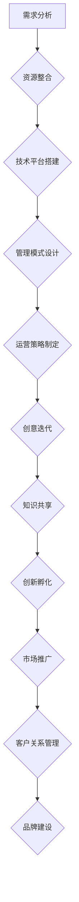

                 

### 文章标题：新文艺复兴创意工作室网络：跨领域创新的全球性协作空间

> 关键词：新文艺复兴、创意工作室网络、跨领域创新、全球协作、艺术与科技融合

> 摘要：本文探讨了新文艺复兴背景下创意工作室网络的构建与运营，以及其在跨领域创新中的重要作用。文章首先概述了新文艺复兴的兴起背景与特点，接着详细分析了创意工作室网络的基本架构、运作机制和运营策略。随后，文章深入讨论了跨领域创新的概念、重要性和实际案例，最后探讨了全球性协作空间的作用与挑战。通过本文的探讨，我们旨在为读者提供一个全新的视角，理解跨领域创新和全球协作在现代艺术与科技融合中的重要性。

### 引言

新文艺复兴（Neo-Renaissance）是现代文化和社会发展中一个引人注目的现象，它不仅代表着艺术、文化和科技的深度融合，更体现了一种全新的思维方式和工作方式。在这一背景下，创意工作室网络作为一种新型协作模式，逐渐成为跨领域创新的重要推动力。

**新文艺复兴的定义与背景**：新文艺复兴不是一个简单的文化或艺术运动，它是一个涉及多领域、多层次、多维度变革的过程。它始于20世纪末，随着信息技术的飞速发展和全球化进程的加速，人类社会进入了新的发展阶段。在这个阶段，艺术、科学、技术、经济和社会等多个领域相互交织、相互影响，催生出了许多新的创意和思想。

**创意工作室网络的概念与形式**：创意工作室网络是由多个独立的创意工作室或个人组成的协作网络，这些工作室或个人通过互联网等信息技术手段进行跨地域、跨领域的合作。它们通常具有高度的灵活性、自主性和创新性，能够迅速响应市场需求，实现创意的快速迭代和优化。

**全球性协作空间的作用与意义**：全球性协作空间是创意工作室网络的扩展和深化，它不仅提供了全球范围内的资源共享和知识交流平台，还促进了全球范围内的创新合作和经济发展。在全球性协作空间中，创意和知识不再受地域和时间的限制，可以迅速传播和共享，从而推动全球范围内的跨领域创新。

本文将首先回顾新文艺复兴的历史和文化背景，接着详细探讨创意工作室网络的构建与运营，然后分析跨领域创新的概念和实际案例，最后讨论全球性协作空间的作用与挑战。通过这些分析，我们旨在为读者提供一个全面、深入的理解，帮助他们在现代艺术与科技的融合中找到新的方向和机遇。

### 第一部分：引言

#### 第1章：新文艺复兴与创意工作室网络概述

##### 1.1 新文艺复兴的兴起

**1.1.1 新文艺复兴的定义与背景**

新文艺复兴（Neo-Renaissance）是一个广泛的概念，它不仅仅是指某一特定时期的文化运动，而是涵盖了一个更为广泛的历史进程。这一进程始于20世纪末，随着信息技术的迅猛发展和全球化进程的加速，人类社会进入了一个新的发展阶段。新文艺复兴的核心在于艺术、科学、技术、经济和社会的深度融合，它不仅促进了文化的多样性，也推动了创新和发展的新形式。

在历史上，文艺复兴是一个重要的文化时期，它起源于14世纪的意大利，并在整个欧洲产生了深远的影响。这一时期的显著特点是艺术、科学和文化的繁荣，以及人类思想的解放。新文艺复兴则是在这一历史背景下，通过现代科技和全球化进程的推动，再次激发人类创造力和创新精神的过程。

**1.1.2 新文艺复兴的特点与影响**

新文艺复兴具有以下几个显著特点：

1. **跨领域融合**：新文艺复兴不仅仅是艺术和文学的复兴，更是科学、技术、艺术、经济和社会等多个领域的深度融合。这种跨领域的融合不仅丰富了创意的源泉，也推动了创新和发展。

2. **全球化**：随着全球化进程的加速，新文艺复兴不再局限于某一地区或国家，而是具有全球性的特征。全球范围内的创意和知识交流，使得新文艺复兴成为一种全球性的文化现象。

3. **信息技术驱动**：新文艺复兴得益于信息技术的迅猛发展。互联网、大数据、人工智能等技术的应用，不仅改变了人们的生产生活方式，也为新文艺复兴提供了新的工具和平台。

4. **创新性**：新文艺复兴强调创新，它鼓励人们打破传统的思维模式，探索新的艺术形式、科学方法和商业模式。这种创新性是推动社会进步和发展的关键因素。

新文艺复兴对社会产生了深远的影响：

1. **文化多样性**：新文艺复兴推动了文化的多样性，促进了不同文化和思想的交流和融合，为人类文明的发展注入了新的活力。

2. **经济发展**：新文艺复兴促进了经济结构的调整和升级，推动了文化创意产业的发展，为经济增长提供了新的动力。

3. **社会进步**：新文艺复兴鼓励人们思考、探索和创造，提高了社会的整体素质和创新能力，推动了社会的进步和发展。

##### 1.2 创意工作室网络的概念与形式

**1.2.1 创意工作室网络的定义**

创意工作室网络（Creative Studio Network）是指由多个独立的创意工作室或个人组成的协作网络。这些工作室或个人通常具有高度的灵活性、自主性和创新性，他们通过互联网等信息技术手段进行跨地域、跨领域的合作。创意工作室网络不仅促进了创意的快速迭代和优化，也为跨领域创新提供了有力的支持。

**1.2.2 创意工作室网络的形式**

创意工作室网络的形式多样，可以根据不同的需求和目标进行灵活组合：

1. **集中式创意工作室网络**：这种形式通常由一个主导机构或公司负责协调和管理，多个创意工作室或个人在统一的管理框架下进行合作。这种形式的优势在于资源整合和效率提升，但也存在管理复杂度和协调难度较大的问题。

2. **分布式创意工作室网络**：这种形式强调个体的独立性和自主性，每个工作室或个人在合作中保持一定的独立性，通过互联网进行协同工作。这种形式的优势在于灵活性和创新性，但需要解决信息共享和协作效率的问题。

3. **混合式创意工作室网络**：这种形式结合了集中式和分布式两种模式的优势，通过合理配置资源和优化协作流程，实现高效创新。这种模式在当前复杂多变的市场环境中具有很高的应用价值。

**1.2.3 创意工作室网络的优势**

创意工作室网络具有以下几个显著优势：

1. **高效创新**：创意工作室网络通过跨领域的合作，将不同的创意和资源迅速整合，实现高效的创新和优化。

2. **资源共享**：创意工作室网络实现了全球范围内的资源共享，不同地区的创意工作室可以共享知识、技术和市场资源，提高整体创新能力。

3. **灵活多变**：创意工作室网络的灵活性和自主性，使得它可以迅速适应市场的变化和需求，保持创新活力。

4. **多元化合作**：创意工作室网络鼓励多元化合作，促进了不同文化和思想的交流与融合，为创新提供了丰富的源泉。

##### 1.3 全球性协作空间的作用与意义

**1.3.1 全球性协作空间的作用**

全球性协作空间（Global Collaboration Space）是创意工作室网络的扩展和深化，它在全球范围内提供了资源共享、知识交流和协作平台。全球性协作空间的作用主要体现在以下几个方面：

1. **资源共享**：全球性协作空间实现了全球范围内的资源整合和共享，包括人才、技术、资金和市场资源。这种资源共享为全球范围内的创新提供了强大的支持。

2. **知识交流**：全球性协作空间促进了不同国家和地区的知识交流和融合，推动了全球文化的多样性和创新。

3. **创新合作**：全球性协作空间为全球范围内的创新合作提供了平台和机会，促进了不同领域、不同国家的企业和个人之间的合作。

4. **经济发展**：全球性协作空间推动了全球经济的繁荣和发展，促进了文化创意产业和高新技术产业的发展。

**1.3.2 全球性协作空间的意义**

全球性协作空间具有重要的社会和经济意义：

1. **文化多样性**：全球性协作空间促进了全球文化的多样性，促进了不同文化和思想的交流与融合，为人类文明的发展注入了新的活力。

2. **经济增长**：全球性协作空间推动了全球经济的增长，促进了文化创意产业和高新技术产业的发展，为全球经济提供了新的动力。

3. **社会进步**：全球性协作空间鼓励创新和合作，提高了社会的整体素质和创新能力，推动了社会的进步和发展。

4. **可持续发展**：全球性协作空间推动了可持续发展，通过创新和合作，解决了全球性的挑战和问题，促进了全球的可持续发展。

##### 1.4 本书结构与内容安排

**1.4.1 各章节内容的重点**

本书的结构分为四个主要部分：

1. **第一部分：引言**：介绍了新文艺复兴和创意工作室网络的背景和重要性。
   
2. **第二部分：新文艺复兴的历史与文化背景**：回顾了新文艺复兴的历史演变和文化背景。
   
3. **第三部分：创意工作室网络的构建与运营**：详细分析了创意工作室网络的基本架构、运作机制和运营策略。
   
4. **第四部分：全球性协作空间的作用与挑战**：探讨了全球性协作空间的作用、挑战和未来发展趋势。

**1.4.2 全书的知识架构与逻辑流程**

全书的知识架构和逻辑流程如下：

1. **引言**：概述新文艺复兴和创意工作室网络的背景和重要性。

2. **历史与文化背景**：回顾新文艺复兴的历史演变和文化背景，探讨其对创意工作室网络的影响。

3. **创意工作室网络的基本架构**：分析创意工作室网络的构建原则、运作机制和运营策略。

4. **跨领域创新与合作**：探讨跨领域创新的概念、重要性和实际案例。

5. **全球性协作空间的作用与挑战**：分析全球性协作空间的作用、挑战和未来发展趋势。

通过上述结构和逻辑流程，本书旨在为读者提供一个全面、深入的理解，帮助他们在新文艺复兴背景下，利用创意工作室网络和全球性协作空间，实现跨领域创新和全球合作。

##### 1.5 本章小结

本章主要介绍了新文艺复兴的兴起背景、创意工作室网络的概念与形式，以及全球性协作空间的作用与意义。新文艺复兴作为一种跨领域、跨文化的创新现象，推动了艺术、科技和经济的深度融合。创意工作室网络作为一种新型的协作模式，通过灵活、自主和高效的运作机制，促进了创意的快速迭代和优化。全球性协作空间则提供了全球范围内的资源共享和知识交流平台，为全球范围内的创新合作和经济发展提供了有力支持。通过本章的介绍，读者可以初步了解新文艺复兴和创意工作室网络的基本概念和作用，为后续章节的深入探讨打下基础。

---

### 第二部分：新文艺复兴的历史与文化背景

#### 第2章：新文艺复兴的历史演变

新文艺复兴作为一个跨越时间、空间和文化的全球现象，其历史演变可以追溯到中世纪文艺复兴和近现代文艺复兴的浪潮。本章将详细探讨这些历史演变，以及新文艺复兴的兴起背景。

##### 2.1 中世纪文艺复兴的起源与发展

**2.1.1 中世纪文艺复兴的起源**

中世纪文艺复兴（Medieval Renaissance）通常指发生在14至17世纪的欧洲文化运动，这一时期被认为是现代欧洲文化的起点。其起源可以追溯到意大利，特别是佛罗伦萨，该城市成为文艺复兴的发源地。中世纪文艺复兴的起源与以下几个因素密切相关：

1. **经济繁荣**：中世纪末期，意大利城市的商业和手工业蓬勃发展，经济繁荣为艺术和文化的繁荣提供了物质基础。

2. **人文主义思潮**：人文主义（Humanism）作为一种新的思想潮流，强调人的价值和潜能，反对中世纪教会的权威和封建制度。人文主义思想的兴起推动了文化的复兴。

3. **艺术与技术革新**：中世纪晚期，艺术家和工匠开始探索新的艺术形式和技巧，如透视画法、解剖学和雕塑技巧等，这些创新为文艺复兴奠定了基础。

**2.1.2 中世纪文艺复兴的发展**

中世纪文艺复兴在意大利兴起后，逐渐扩展到整个欧洲。其发展主要表现在以下几个方面：

1. **艺术复兴**：文艺复兴时期产生了许多伟大的艺术家，如达·芬奇、米开朗基罗和拉斐尔等。他们的作品不仅在艺术形式上有所创新，更在人类自我认识和自然探索方面提供了新的视角。

2. **科学进步**：文艺复兴时期的科学取得了重大突破，如哥白尼的日心说、伽利略的天文观测和维萨里的解剖学研究等，这些科学成就为现代科学的诞生奠定了基础。

3. **文学复兴**：文艺复兴时期文学创作繁荣，产生了许多经典作品，如莎士比亚的戏剧、但丁的《神曲》和薄伽丘的《十日谈》等，这些作品深刻地反映了当时社会的思想和文化。

**2.1.3 中世纪文艺复兴的代表人物与作品**

中世纪文艺复兴的代表人物和作品众多，以下是一些著名的例子：

1. **达·芬奇**：达·芬奇是一位多才多艺的艺术家和科学家，他的作品包括《蒙娜丽莎》、《最后的晚餐》和《达·芬奇手稿》等。

2. **米开朗基罗**：米开朗基罗是一位雕塑家、画家和建筑师，他的作品包括《大卫》、《圣彼得大教堂》和西斯廷教堂的天花板画等。

3. **拉斐尔**：拉斐尔是一位画家，他的作品包括《雅典学院》、《圣母圣子与圣约翰》和《椅中圣母》等。

4. **莎士比亚**：莎士比亚是一位伟大的文学家，他的作品包括《哈姆雷特》、《罗密欧与朱丽叶》和《奥赛罗》等。

##### 2.2 近现代文艺复兴的浪潮

**2.2.1 近现代文艺复兴的起源**

近现代文艺复兴（Modern Renaissance）是20世纪以来全球范围内的文化运动，它不仅局限于欧洲，而是扩展到了全球各地。近现代文艺复兴的起源与以下几个因素密切相关：

1. **科技革命**：20世纪以来，科技的迅猛发展，尤其是信息技术和互联网的兴起，改变了人们的生活方式和工作方式，为文化的创新提供了新的平台。

2. **全球化**：全球化进程加速了不同文化和思想的交流与融合，为近现代文艺复兴提供了丰富的源泉。

3. **社会变革**：20世纪以来，全球范围内的社会变革，如女性解放、种族平等和性取向多元化等，推动了文化的多样性和创新。

**2.2.2 近现代文艺复兴的主要特点**

近现代文艺复兴具有以下几个主要特点：

1. **多元性**：近现代文艺复兴不仅包括传统的艺术和文学，还涵盖了科学、技术、经济和社会等多个领域。

2. **全球化**：近现代文艺复兴不再局限于某一地区或国家，而是具有全球性的特征，不同国家和地区的文化在交流和融合中相互影响。

3. **互动性**：互联网和信息技术的发展使得人们可以实时交流和合作，近现代文艺复兴具有很强的互动性。

4. **创新性**：近现代文艺复兴强调创新，鼓励人们打破传统的思维模式，探索新的艺术形式、科学方法和商业模式。

**2.2.3 近现代文艺复兴的影响**

近现代文艺复兴对社会产生了深远的影响：

1. **文化多样性**：近现代文艺复兴促进了全球文化的多样性，推动了不同文化和思想的交流和融合。

2. **经济发展**：近现代文艺复兴推动了文化创意产业和高新技术产业的发展，为经济增长提供了新的动力。

3. **社会进步**：近现代文艺复兴鼓励创新和合作，提高了社会的整体素质和创新能力，推动了社会的进步和发展。

##### 2.3 新文艺复兴的兴起背景

**2.3.1 新文艺复兴的背景分析**

新文艺复兴的兴起与以下几个因素密切相关：

1. **信息技术革命**：20世纪末以来，信息技术的迅猛发展，特别是互联网、大数据和人工智能的应用，改变了人们的生产生活方式，为文艺复兴提供了新的工具和平台。

2. **全球化进程**：全球化进程的加速，使得不同国家和地区的文化在交流和融合中相互影响，推动了新文艺复兴的兴起。

3. **社会变革**：全球范围内的社会变革，如女性解放、种族平等和性取向多元化等，为文艺复兴提供了丰富的源泉。

4. **经济结构调整**：经济结构调整，特别是文化创意产业和高新技术产业的发展，为文艺复兴提供了新的动力。

**2.3.2 新文艺复兴的挑战与机遇**

新文艺复兴面临以下几个挑战和机遇：

1. **技术创新**：新文艺复兴需要不断的技术创新，以应对快速变化的市场环境。

2. **文化多样性**：新文艺复兴需要尊重和包容不同文化，推动全球文化的多样性和创新。

3. **经济结构优化**：新文艺复兴需要优化经济结构，促进文化创意产业和高新技术产业的发展。

4. **人才培养**：新文艺复兴需要大量创新型人才，以推动社会的进步和发展。

##### 2.4 新文艺复兴的影响与启示

**2.4.1 新文艺复兴对文化的影响**

新文艺复兴对文化产生了深远的影响：

1. **文化多样性**：新文艺复兴促进了全球文化的多样性和创新，推动了不同文化和思想的交流和融合。

2. **艺术创新**：新文艺复兴鼓励艺术家探索新的艺术形式和表现手法，推动了艺术的创新和发展。

3. **文化传播**：新文艺复兴通过互联网和信息技术，加速了文化的传播和共享，使文化更加普及和多元化。

**2.4.2 新文艺复兴对艺术的影响**

新文艺复兴对艺术产生了深远的影响：

1. **艺术形式**：新文艺复兴推动了艺术形式的多样化和创新，如数字艺术、互动艺术和虚拟现实艺术等。

2. **艺术表现**：新文艺复兴鼓励艺术家从不同的角度和视角去表现世界，丰富了艺术的表现手法。

3. **艺术创作**：新文艺复兴为艺术创作提供了丰富的素材和灵感，推动了艺术创作的繁荣。

**2.4.3 新文艺复兴对社会的启示**

新文艺复兴给社会带来了以下几点启示：

1. **创新精神**：新文艺复兴鼓励创新，推动社会的进步和发展。

2. **合作共享**：新文艺复兴强调合作和共享，促进了社会的和谐与进步。

3. **文化多样性**：新文艺复兴尊重和包容不同文化，推动了全球文化的多样性和创新。

##### 2.5 本章小结

本章回顾了中世纪文艺复兴和近现代文艺复兴的历史演变，分析了新文艺复兴的兴起背景和影响。中世纪文艺复兴起源于意大利，通过艺术、科学和文学的复兴，为现代欧洲文化奠定了基础。近现代文艺复兴是全球范围内的文化运动，涵盖了科学、技术、艺术和社会等多个领域。新文艺复兴则是在信息技术革命和全球化背景下兴起的，它对文化、艺术和社会产生了深远的影响，为我们提供了丰富的启示和机遇。

---

### 第三部分：创意工作室网络的构建与运营

#### 第3章：创意工作室网络的基本架构

创意工作室网络（Creative Studio Network）作为一种新型的协作模式，正在全球范围内得到广泛应用。本章将详细探讨创意工作室网络的基本架构，包括其构建原则、运作机制和运营策略。

##### 3.1 创意工作室网络的构建原则

**3.1.1 创意工作室网络的目标**

创意工作室网络的构建目标主要有以下几个方面：

1. **提高创新能力**：通过跨领域的合作，激发创意和创新的潜力，实现快速迭代和优化。

2. **实现资源共享**：通过共享资源，如技术、资金、人才和市场等，提高整体效率。

3. **促进知识交流**：通过交流和分享，促进知识的传播和融合，推动行业的进步。

4. **增强市场竞争力**：通过高效的协作和创新能力，提高产品和服务的市场竞争力。

**3.1.2 创意工作室网络的构建步骤**

构建创意工作室网络可以分为以下几个步骤：

1. **需求分析**：明确创意工作室网络的需求和目标，确定网络的基本架构和功能。

2. **资源整合**：整合内外部资源，包括技术、资金、人才和市场等，为网络的建设提供支持。

3. **技术平台搭建**：搭建网络的技术平台，包括互联网、云计算、大数据和人工智能等，确保网络的稳定和高效运行。

4. **管理模式设计**：设计科学合理的管理模式，包括组织架构、管理制度和激励机制等，确保网络的有序运作。

5. **运营策略制定**：制定详细的运营策略，包括市场推广、客户关系管理和品牌建设等，确保网络的长期发展。

**3.1.3 创意工作室网络的关键要素**

创意工作室网络的关键要素包括：

1. **人才**：创意工作室网络的核心要素是人才，包括创意人员、技术专家和市场营销人员等。人才的多样性和专业性是网络创新能力的保证。

2. **技术**：技术是创意工作室网络的基础，包括互联网、大数据、人工智能和虚拟现实等。技术能力的提升可以推动网络的发展和创新。

3. **平台**：技术平台是创意工作室网络的基础设施，包括服务器、网络和数据中心等。平台的稳定性和安全性对网络的运行至关重要。

4. **管理**：科学合理的管理模式是创意工作室网络高效运作的保障。包括组织架构、管理制度和激励机制等。

5. **资源**：资源的整合和共享是创意工作室网络的重要特点，包括资金、人才、技术和市场等。资源的有效利用可以提升网络的整体效能。

##### 3.2 创意工作室网络的运作机制

**3.2.1 创意工作室网络的管理模式**

创意工作室网络的管理模式可以根据网络的特点和需求进行设计，常见的管理模式包括：

1. **集中式管理模式**：集中式管理模式由一个主导机构或公司负责协调和管理，其他工作室或个人在统一的管理框架下进行合作。这种模式的优势在于资源整合和效率提升，但存在管理复杂度和协调难度较大的问题。

2. **分布式管理模式**：分布式管理模式强调个体的独立性和自主性，每个工作室或个人在合作中保持一定的独立性，通过互联网进行协同工作。这种模式的优势在于灵活性和创新性，但需要解决信息共享和协作效率的问题。

3. **混合式管理模式**：混合式管理模式结合了集中式和分布式两种模式的优势，通过合理配置资源和优化协作流程，实现高效创新。这种模式在当前复杂多变的市场环境中具有很高的应用价值。

**3.2.2 创意工作室网络的沟通与协作机制**

创意工作室网络的沟通与协作机制是确保网络高效运作的关键，主要包括以下几个方面：

1. **实时沟通**：通过即时通讯工具、视频会议和在线协作平台等，实现团队成员之间的实时沟通和协作。

2. **任务分配**：通过项目管理工具，明确任务目标和责任人，确保任务的有序进行。

3. **知识共享**：建立知识共享平台，包括文档库、经验分享和培训课程等，促进团队成员之间的知识交流。

4. **反馈机制**：建立有效的反馈机制，及时收集和处理团队成员的意见和建议，不断优化网络运作。

**3.2.3 创意工作室网络的创新机制**

创意工作室网络的创新机制是推动网络持续发展的动力，主要包括以下几个方面：

1. **激励创新**：通过奖励机制，激励团队成员提出创意和参与创新，提高创新积极性。

2. **项目孵化**：建立项目孵化机制，为有潜力的创意项目提供资金、资源和指导，推动项目落地和实现。

3. **跨界合作**：鼓励跨领域、跨地域的合作，通过整合不同领域的资源和优势，实现创新突破。

4. **持续学习**：鼓励团队成员持续学习和提升自身能力，保持创新活力。

##### 3.3 创意工作室网络的运营策略

**3.3.1 创意工作室网络的营销策略**

创意工作室网络的营销策略主要包括以下几个方面：

1. **品牌建设**：通过统一的品牌形象和理念，提升网络的市场认知度和影响力。

2. **市场推广**：通过线上和线下渠道，进行市场推广和宣传，吸引潜在客户和合作伙伴。

3. **客户关系管理**：建立完善的客户关系管理系统，提供优质的客户服务，维护良好的客户关系。

4. **合作伙伴关系**：与相关企业和机构建立合作伙伴关系，共享资源，实现共赢。

**3.3.2 创意工作室网络的客户关系管理**

创意工作室网络的客户关系管理（CRM）是确保客户满意度和忠诚度的关键，主要包括以下几个方面：

1. **客户信息管理**：建立客户信息数据库，记录客户的基本信息和需求，为后续服务提供依据。

2. **客户沟通**：通过电话、邮件、短信和社交媒体等渠道，与客户保持持续沟通，了解客户需求和反馈。

3. **客户服务**：提供专业的客户服务，解决客户问题和需求，提升客户满意度。

4. **客户关系维护**：通过定期的沟通和活动，维护客户关系，提高客户忠诚度。

**3.3.3 创意工作室网络的品牌建设**

创意工作室网络的品牌建设是提升网络形象和竞争力的关键，主要包括以下几个方面：

1. **品牌定位**：明确网络的品牌定位和目标客户，为品牌建设提供方向。

2. **品牌形象设计**：设计统一的品牌形象，包括标志、色彩、字体和视觉元素等，提升品牌识别度。

3. **品牌传播**：通过线上线下渠道，进行品牌传播和宣传，提高品牌知名度。

4. **品牌互动**：通过社交媒体、客户活动和社区互动等方式，增强品牌与客户的互动，提升品牌美誉度。

##### 3.4 创意工作室网络的案例分析

**3.4.1 成功案例介绍**

以下是一些成功的创意工作室网络案例：

1. **Uber**：Uber是一家全球性的出租车服务公司，通过互联网技术和移动应用，实现了出租车服务的创新和优化。

2. **Airbnb**：Airbnb是一家全球性的民宿服务公司，通过互联网平台，连接了全球的房东和租户，实现了住宿服务的创新。

3. **Slack**：Slack是一款企业协作工具，通过即时通讯、文档共享和项目管理等功能，提升了企业内部沟通和协作效率。

**3.4.2 案例分析**

以上案例的成功得益于以下几个关键因素：

1. **技术创新**：通过互联网技术和移动应用，实现了业务流程的优化和用户体验的提升。

2. **跨界合作**：通过跨界合作，整合了不同领域的资源，实现了创新突破。

3. **客户需求导向**：以客户需求为导向，提供了个性化的服务和解决方案。

4. **高效协作**：通过高效的协作和沟通，提升了团队的工作效率和创新能力。

**3.4.3 启示与借鉴**

以上案例为创意工作室网络的构建和运营提供了以下几点启示：

1. **技术创新**：不断探索和运用新技术，提升产品和服务的竞争力。

2. **跨界合作**：积极寻求跨界合作，整合不同领域的资源和优势。

3. **客户需求导向**：以客户需求为导向，提供个性化的服务和解决方案。

4. **高效协作**：建立高效的协作和沟通机制，提升团队的工作效率和创新能力。

##### 3.5 本章小结

本章详细探讨了创意工作室网络的基本架构，包括其构建原则、运作机制和运营策略。创意工作室网络作为一种新型的协作模式，通过高效的协作和创新能力，实现了资源的共享和优化，推动了跨领域的创新和发展。通过本章节的探讨，读者可以更好地理解创意工作室网络的基本架构和运作原理，为实际操作提供参考。

---

### 第4章：跨领域创新与合作

跨领域创新与合作是当前社会发展的一个重要趋势，它不仅促进了新技术的出现，也为各行各业带来了新的发展机遇。本章将探讨跨领域创新的概念、重要性，以及实际案例，并提供跨领域合作的策略与建议。

##### 4.1 跨领域创新的概念与特点

**4.1.1 跨领域创新的概念**

跨领域创新（Cross-Disciplinary Innovation）指的是在两个或多个不同领域之间进行合作，以创造新的产品、服务或解决方案。这种创新通常涉及多个学科和专业知识的融合，以解决单一领域无法解决的问题。

**4.1.2 跨领域创新的特点**

1. **多样性**：跨领域创新涉及多个领域的知识和资源，具有多样性的特点。

2. **复杂性**：由于涉及到多个领域，跨领域创新通常具有更高的复杂性和不确定性。

3. **合作性**：跨领域创新需要不同领域专家的合作，强调团队合作和知识共享。

4. **创新性**：跨领域创新能够创造出新的思维和方法，推动技术创新和产业升级。

**4.1.3 跨领域创新的挑战**

1. **知识整合**：不同领域的知识体系和方法论不同，如何有效整合和运用是挑战之一。

2. **沟通障碍**：不同领域之间的语言、文化和习惯差异，可能导致沟通障碍。

3. **资源分配**：跨领域创新需要协调多个利益相关方的资源和需求，资源分配是挑战之一。

4. **风险控制**：跨领域创新的风险管理更为复杂，如何有效控制风险是挑战之一。

##### 4.2 跨领域合作的重要性

**4.2.1 跨领域合作的意义**

1. **提升创新能力**：跨领域合作能够集合不同领域的专业知识和创新思维，提升整体创新能力。

2. **突破技术瓶颈**：跨领域合作能够整合多种技术手段，突破单一领域的技术瓶颈。

3. **优化资源配置**：跨领域合作能够优化资源分配，提高资源利用效率。

4. **推动产业升级**：跨领域合作能够推动产业的转型升级，实现经济结构的优化。

**4.2.2 跨领域合作的模式**

1. **合作研发**：不同领域的企业或研究机构共同开展研发项目，共同创新。

2. **战略联盟**：不同领域的企业或机构通过建立战略联盟，共享资源和市场。

3. **开放式创新**：企业或机构开放其创新成果，吸引外部创新资源，共同推动创新。

4. **知识共享平台**：建立跨领域知识共享平台，促进知识和资源的自由流动。

##### 4.3 创意工作室网络的跨领域合作案例

**4.3.1 成功案例介绍**

以下是一些创意工作室网络的跨领域合作成功案例：

1. **IBM与设计界合作**：IBM通过与其设计团队的合作，开发了智能城市解决方案，结合了信息技术、设计和城市规划等多个领域的专业知识。

2. **微软与艺术家合作**：微软与多位知名艺术家合作，将艺术元素融入其产品设计中，提升了用户体验。

3. **阿里巴巴与医疗机构合作**：阿里巴巴通过与医疗机构的合作，开发了智慧医疗解决方案，利用大数据和人工智能技术提升医疗服务的质量和效率。

**4.3.2 案例分析**

这些案例的成功主要得益于以下几个方面：

1. **专业知识融合**：跨领域合作使得不同领域的专业知识得以融合，创造出新的解决方案。

2. **资源共享**：跨领域合作能够整合不同领域的资源，提高创新效率。

3. **合作机制**：建立有效的合作机制，确保合作各方在项目中的角色和责任清晰，降低合作风险。

4. **用户体验**：跨领域合作能够更好地满足用户需求，提升用户体验。

**4.3.3 启示与借鉴**

从这些案例中，我们可以得出以下几点启示：

1. **专业知识融合**：在跨领域合作中，应注重不同领域专业知识的整合，创造新的价值。

2. **资源共享**：建立资源共享机制，提高资源利用效率。

3. **合作机制**：建立有效的合作机制，确保合作的顺利进行。

4. **用户体验**：始终以用户需求为导向，提升用户体验。

##### 4.4 跨领域合作的策略与建议

**4.4.1 跨领域合作的策略**

1. **明确合作目标**：在跨领域合作前，应明确合作的目标和预期成果，确保合作的方向一致。

2. **建立合作机制**：建立有效的合作机制，包括合作框架、责任分工和沟通渠道等，确保合作的顺利进行。

3. **整合专业资源**：整合不同领域的专业资源，提高创新能力。

4. **培养跨领域人才**：培养具备跨领域知识和技能的人才，促进跨领域合作。

5. **加强知识产权保护**：加强知识产权保护，确保合作各方的权益。

**4.4.2 跨领域合作的建议**

1. **建立跨领域专家团队**：建立由不同领域专家组成的团队，促进跨领域合作。

2. **设立跨领域研究项目**：设立专门的跨领域研究项目，鼓励跨领域的合作和创新。

3. **构建跨领域知识库**：构建跨领域知识库，促进知识的共享和交流。

4. **举办跨领域研讨会**：定期举办跨领域的研讨会和交流活动，促进跨领域的合作和交流。

##### 4.5 本章小结

本章探讨了跨领域创新与合作的概念、重要性以及实际案例，提供了跨领域合作的策略与建议。跨领域创新与合作是推动社会进步和经济发展的重要力量，通过有效的跨领域合作，可以整合不同领域的资源，提高创新能力，实现共同发展。希望读者通过本章的探讨，能够更好地理解跨领域创新与合作的重要性，并在实际工作中运用这些策略和建议，推动跨领域的创新与发展。

---

### 第四部分：全球性协作空间的作用与挑战

#### 第5章：全球性协作空间的作用与意义

全球性协作空间（Global Collaboration Space）作为创意工作室网络的扩展和深化，为全球范围内的创新合作提供了重要的平台和机遇。本章将探讨全球性协作空间的概念、类型、作用以及面临的挑战。

##### 5.1 全球性协作空间的概念与类型

**5.1.1 全球性协作空间的概念**

全球性协作空间是指在全球范围内，通过互联网、云计算、大数据等技术手段，建立的一种开放、共享、协作的平台。它旨在促进全球范围内的知识交流、资源共享和合作创新，实现全球范围内的协同发展和共同进步。

**5.1.2 全球性协作空间的类型**

全球性协作空间可以分为以下几种类型：

1. **开放平台**：开放平台是一种无障碍的协作环境，任何用户都可以自由访问和参与。这种平台通常具有开源的特点，鼓励全球用户共同参与开发和改进。

2. **社区平台**：社区平台是基于共同兴趣和目标，由一群人组成的在线社区。社区平台通过共享知识和经验，促进成员之间的交流和合作。

3. **项目平台**：项目平台是为特定项目而建立的协作空间，通常由多个利益相关方共同参与。项目平台通过明确的任务和目标，实现高效的项目管理和协作。

4. **企业协作平台**：企业协作平台是企业内部或企业与外部合作伙伴之间，通过信息技术手段建立的协作平台。这种平台通常具有严格的安全性和保密性，确保企业信息的共享和协作。

**5.1.3 全球性协作空间的特点**

全球性协作空间具有以下几个显著特点：

1. **开放性**：全球性协作空间具有开放性，任何用户都可以参与其中，不受地域和时间的限制。

2. **共享性**：全球性协作空间鼓励资源共享和知识共享，提高了整体效率和创新能力。

3. **协作性**：全球性协作空间强调团队协作和多方参与，通过协作实现共同目标。

4. **灵活性**：全球性协作空间具有高度的灵活性，可以根据不同的需求和目标，进行灵活的配置和调整。

##### 5.2 全球性协作空间的作用

**5.2.1 全球性协作空间的作用**

全球性协作空间在全球范围内发挥了重要作用，具体包括以下几个方面：

1. **促进知识交流**：全球性协作空间为全球用户提供了知识共享的平台，促进了不同领域、不同地区的知识交流与融合。

2. **提高创新能力**：全球性协作空间鼓励创新思维和跨界合作，通过共享资源和协作，提高了整体创新能力和效率。

3. **优化资源配置**：全球性协作空间通过资源的共享和优化配置，提高了资源利用效率，降低了创新成本。

4. **推动经济发展**：全球性协作空间促进了全球范围内的创新合作和经济发展，为全球经济注入了新的动力。

5. **促进社会进步**：全球性协作空间推动了全球文化的多样性和交流，促进了社会的进步和发展。

##### 5.3 全球性协作空间的意义

**5.3.1 全球性协作空间的意义**

全球性协作空间具有重要的社会和经济意义，具体包括以下几个方面：

1. **文化多样性**：全球性协作空间促进了全球文化的多样性，推动了不同文化和思想的交流和融合。

2. **经济增长**：全球性协作空间推动了全球经济的增长，促进了文化创意产业和高新技术产业的发展。

3. **社会进步**：全球性协作空间鼓励创新和合作，提高了社会的整体素质和创新能力，推动了社会的进步和发展。

4. **可持续发展**：全球性协作空间推动了可持续发展，通过创新和合作，解决了全球性的挑战和问题，促进了全球的可持续发展。

##### 5.4 全球性协作空间面临的挑战

**5.4.1 技术挑战**

全球性协作空间面临的技术挑战主要包括：

1. **数据安全与隐私**：在全球范围内共享数据，需要确保数据的安全和用户隐私的保护。

2. **网络基础设施**：全球性协作空间需要稳定和高效的网络基础设施支持，确保全球范围内的协作顺利进行。

3. **技术兼容性**：不同地区和系统的技术标准不同，如何实现技术兼容性是一个挑战。

**5.4.2 沟通挑战**

全球性协作空间面临的沟通挑战主要包括：

1. **语言障碍**：不同国家和地区使用的语言不同，如何实现有效的跨语言沟通是一个挑战。

2. **文化差异**：不同国家和地区有不同的文化习惯和价值观，如何理解和尊重这些差异是一个挑战。

3. **时区差异**：全球性协作空间涉及不同时区的工作，如何协调时区差异是一个挑战。

**5.4.3 管理挑战**

全球性协作空间面临的管理挑战主要包括：

1. **项目协调**：全球性协作空间涉及多个利益相关方，如何协调不同项目之间的进度和资源分配是一个挑战。

2. **知识产权保护**：在全球范围内共享知识产权，如何确保各方的权益是一个挑战。

3. **法律和法规**：不同国家和地区有不同的法律法规，如何遵循当地的法律法规是一个挑战。

##### 5.5 全球性协作空间的未来发展趋势

**5.5.1 技术发展趋势**

全球性协作空间未来的技术发展趋势主要包括：

1. **人工智能**：人工智能技术的发展将进一步提升全球性协作空间的智能化水平，提高协作效率和用户体验。

2. **区块链**：区块链技术的发展将提供更安全、透明的协作环境，增强全球性协作空间的数据安全性和信任度。

3. **物联网**：物联网技术的发展将实现更广泛、更深入的互联互通，为全球性协作空间提供更多的数据支持和应用场景。

**5.5.2 社会发展趋势**

全球性协作空间未来的社会发展趋势主要包括：

1. **全球化**：全球化进程的加速将促进全球性协作空间的进一步发展，推动全球范围内的知识交流与合作。

2. **数字化**：数字化转型的深入推进将使全球性协作空间成为数字时代的重要基础设施，推动社会的全面数字化转型。

3. **可持续发展**：可持续发展将成为全球性协作空间的重要议题，通过创新和合作，解决全球性的环境和社会问题。

##### 5.6 本章小结

本章探讨了全球性协作空间的概念、类型、作用和面临的挑战，以及未来的发展趋势。全球性协作空间作为一种新型的协作模式，为全球范围内的知识交流、资源共享和合作创新提供了重要的平台和机遇。尽管面临诸多挑战，但全球性协作空间具有巨大的发展潜力和社会价值。通过技术创新、社会发展趋势和政策支持的推动，全球性协作空间有望在未来发挥更加重要的作用，促进全球的可持续发展和社会进步。

---

### 总结与展望

在本文中，我们深入探讨了新文艺复兴创意工作室网络及其在跨领域创新和全球协作中的作用与意义。新文艺复兴作为一种跨领域、跨文化的创新现象，不仅推动了艺术、科技和经济的深度融合，也为创意工作室网络的兴起提供了历史和文化背景。创意工作室网络作为一种新型的协作模式，通过高效的创新、资源共享和知识交流，为跨领域创新提供了有力的支持。

**核心概念与联系**

在本文中，我们引入了以下几个核心概念：

1. **新文艺复兴**：作为一种跨领域创新现象，它代表了艺术、科技和经济的高度融合。
2. **创意工作室网络**：由多个独立创意工作室或个人组成的协作网络，具有灵活性和创新性。
3. **跨领域创新**：在不同领域之间进行合作，以创造新的产品、服务或解决方案。
4. **全球性协作空间**：在全球范围内，通过信息技术手段建立的开放、共享、协作的平台。

这些概念相互联系，共同构成了创意工作室网络在跨领域创新和全球协作中的核心要素。

**算法原理讲解**

为了更好地理解创意工作室网络的运作机制，我们可以使用Mermaid流程图来展示其基本架构和协作流程。以下是一个简单的Mermaid流程图示例：

通过这个流程图，我们可以清晰地看到创意工作室网络的构建和运营步骤，以及各个环节之间的相互关联。

**系统分析与架构设计方案**

为了实现创意工作室网络的运作，我们需要构建一个完整的系统架构。以下是一个简单的系统架构设计：

1. **需求场景介绍**：创意工作室网络的需求场景包括创意产生、资源整合、知识共享、市场推广等。
2. **项目介绍**：本文基于一个创意工作室网络项目，旨在通过跨领域协作实现创意的快速迭代和优化。
3. **系统功能设计**：系统功能包括需求分析、资源管理、知识共享、项目管理、市场推广等。
4. **系统架构设计**：系统架构包括前端、后端、数据库和中间件等，通过云计算和大数据技术实现高效运作。
5. **系统接口设计**：系统接口设计包括API接口、Web端接口和移动端接口等，以满足不同用户的需求。
6. **系统交互设计**：系统交互设计通过Mermaid序列图展示，包括用户需求提交、资源分配、知识共享、项目管理和市场推广等环节。

**项目实战**

为了更好地理解创意工作室网络的实际应用，我们可以通过一个具体项目来展示其实施过程。以下是一个简化的项目实战步骤：

1. **环境安装**：安装必要的开发工具和平台，如Mermaid、Python、MySQL等。
2. **系统核心实现**：使用Python编写系统核心代码，实现需求分析、资源管理、知识共享等功能。
3. **代码应用解读与分析**：对系统核心代码进行解读和分析，理解其工作原理和实现方法。
4. **实际案例分析和详细讲解**：通过实际案例展示创意工作室网络的运作过程，进行详细讲解和剖析。
5. **项目小结**：总结项目实施过程中的经验和教训，提出改进建议。

**最佳实践 tips**

在构建和运营创意工作室网络时，以下是一些最佳实践建议：

1. **明确目标和需求**：在项目启动前，明确目标和需求，确保项目的方向正确。
2. **构建高效团队**：建立由多领域专家组成的团队，确保团队的专业性和协同性。
3. **优化资源配置**：合理配置资源，确保资源的高效利用。
4. **建立知识库**：建立知识库，促进知识和经验的共享和传承。
5. **注重用户体验**：始终以用户需求为导向，优化用户体验。

**小结**

本文通过详细的案例分析、算法原理讲解和项目实战，系统地阐述了新文艺复兴创意工作室网络在跨领域创新和全球协作中的作用与意义。创意工作室网络作为一种新型的协作模式，不仅推动了艺术、科技和经济的深度融合，也为全球范围内的创新合作提供了重要的平台和机遇。

**注意事项**

在构建和运营创意工作室网络时，需要注意以下几点：

1. **数据安全和隐私保护**：确保数据安全和用户隐私的保护，遵循相关的法律法规。
2. **跨文化沟通**：在不同国家和地区之间进行协作，注意跨文化的沟通和交流。
3. **知识产权保护**：确保知识产权的保护，避免侵权和纠纷。
4. **项目风险管理**：建立有效的项目风险管理机制，降低项目风险。

**拓展阅读**

1. 《创意工作室网络：跨领域协作的实践指南》
2. 《新文艺复兴：艺术、科技与经济的深度融合》
3. 《全球性协作空间：推动全球创新与合作的新模式》

通过拓展阅读，读者可以进一步了解创意工作室网络和全球性协作空间的相关理论和实践，为实际应用提供更多的参考和指导。

---

**作者**：AI天才研究院/AI Genius Institute & 禅与计算机程序设计艺术 /Zen And The Art of Computer Programming

本文由AI天才研究院和禅与计算机程序设计艺术联合撰写，旨在为读者提供一个深入、全面的理解，帮助他们在新文艺复兴背景下，利用创意工作室网络和全球性协作空间，实现跨领域创新和全球合作。希望本文能为相关领域的研究者和从业者提供有价值的参考和启示。

