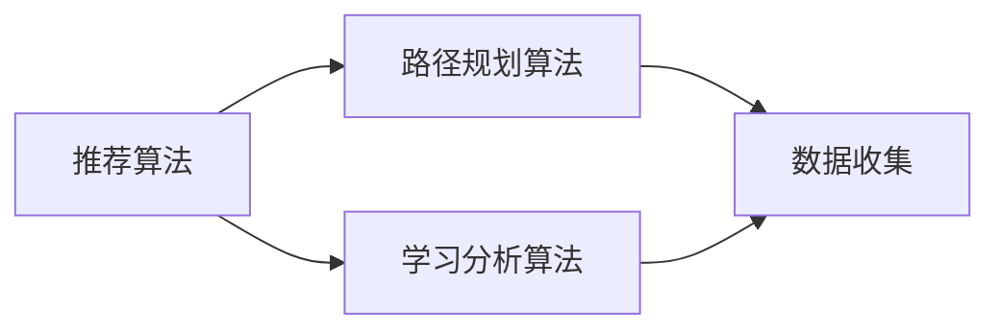
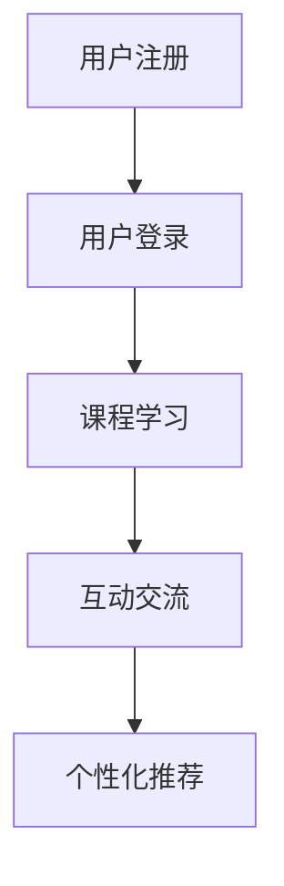
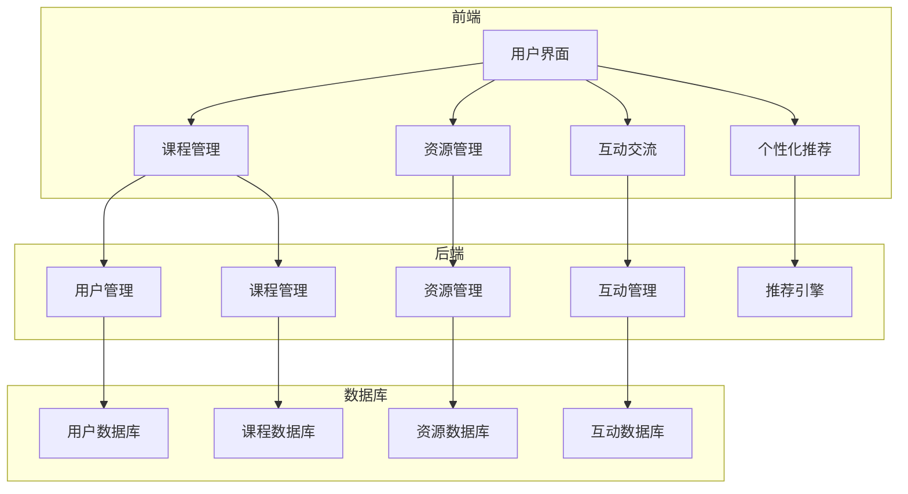

                 


# 新游牧学校联盟app：青少年旅行学习项目的移动平台

## 关键词
移动学习、青少年教育、旅行学习项目、应用程序开发、算法设计、系统架构

## 摘要
本文深入探讨了一个创新性的移动学习平台——《新游牧学校联盟app》，该平台专为青少年旅行学习项目设计。本文首先介绍了项目背景和重要性，接着详细分析了核心概念和算法原理，并使用数学模型进行了说明。随后，文章介绍了系统分析与架构设计，并展示了实际项目案例。最后，本文总结了最佳实践，提供了注意事项，并推荐了拓展阅读。

----------------------------------------------------------------

## 目录大纲设计方案

为了确保文章的逻辑清晰和内容完整，我们将按照以下步骤设计目录大纲：

### 1. 确定核心章节
核心章节应包括：背景介绍、核心概念与联系、算法原理讲解、数学模型和数学公式讲解、系统分析与架构设计、项目实战、最佳实践与总结。

### 2. 设计章节层级
使用1、2、3级目录来设计章节层级，确保每个章节都明确、简洁。

### 3. 确保内容简洁
每个章节的标题都应直接反映内容，避免冗余描述。

### 4. 目录大纲结构
参考上文提供的目录大纲结构，确保每个章节都有详细、具体的内容。

----------------------------------------------------------------

## 背景介绍

### 1.1 问题背景
随着信息化时代的到来，移动学习逐渐成为教育领域的重要趋势。尤其是对于青少年，通过旅行学习项目可以拓宽视野、提升综合素质。然而，当前市场上缺乏一个专门为青少年旅行学习设计的移动学习平台。

### 1.2 项目概述
《新游牧学校联盟app》是一款集成了学习、娱乐、社交等多种功能的移动学习平台。它旨在通过青少年旅行学习项目，帮助学生更好地理解知识、培养独立思考能力和团队合作精神。

### 1.3 项目目的与意义
项目的目的是构建一个高效、便捷的移动学习平台，为青少年提供丰富的学习资源和互动体验。其意义在于：

1. **提高学习效率**：通过个性化的学习路径和互动式教学，提高学生的学习兴趣和效率。
2. **促进全面发展**：结合旅行体验，培养学生的社交能力、团队协作能力和实际操作能力。
3. **拓宽知识视野**：通过旅行过程中的实地学习，使学生更深入地了解历史、文化、科学等领域的知识。
4. **创新教育模式**：探索移动互联网在教育领域的新应用，为未来教育提供新的思路和方向。

### 1.4 概念术语说明
- **移动学习**：利用移动设备（如手机、平板电脑等）进行的学习活动。
- **旅行学习项目**：在旅行过程中进行的与学习相关的活动，包括实地考察、互动交流、主题研讨等。
- **青少年教育**：针对青少年阶段的教育活动，旨在培养学生的综合素质。

### 1.5 边界与外延
- **边界**：本文主要探讨《新游牧学校联盟app》的开发背景、核心功能和应用场景。
- **外延**：本文还将涉及移动学习、青少年教育等领域的前沿研究和趋势。

## 核心概念与联系

### 2.1 核心概念
- **移动平台**：提供学习资源、社交互动和个性化服务的移动应用程序。
- **青少年旅行学习项目**：结合旅行和学习，旨在提升学生综合素质的教育活动。
- **用户**：使用移动平台进行学习、交流和互动的青少年学生。

### 2.2 关联概念对比

| 概念             | 定义                                                         | 对比特点                                               |
|------------------|--------------------------------------------------------------|--------------------------------------------------------|
| 移动学习平台     | 利用移动设备进行学习、互动和社交的平台。                     | 功能多样，包括学习资源、社交互动等。                     |
| 传统教育平台     | 主要通过电脑或教室进行学习、互动和考试。                     | 功能相对单一，侧重课堂教学。                             |
| 青少年旅行学习项目 | 结合旅行和学习，旨在提升学生综合素质。                     | 结合实地体验，注重实践操作。                             |

### 2.3 实体关系图
```mermaid
erDiagram
    User ..|> App : 使用
    App ..|> Project : 属于
    Project ..|> Course : 包含
    Course ..|> Resource : 包含
    Resource ..|> Activity : 属于
```

## 算法原理讲解

### 3.1 算法概述
《新游牧学校联盟app》采用了多种算法来优化用户学习体验，包括推荐算法、路径规划算法和学习分析算法。

### 3.2 算法流程图


### 3.3 Python源代码讲解
以下是一个简单的推荐算法示例：

```python
def recommend(course_history, courses):
    recommended_courses = []
    for course in courses:
        if course not in course_history:
            recommended_courses.append(course)
    return recommended_courses

course_history = ['历史', '地理', '英语']
courses = ['数学', '物理', '化学', '历史', '地理', '英语']
recommended_courses = recommend(course_history, courses)
print(recommended_courses)
```

### 3.4 数学模型讲解
推荐算法可以使用以下数学模型：

$$
R_{ij} = \frac{1}{1 + e^{-\beta \cdot (u_i - v_j)}}
$$

其中，$R_{ij}$表示用户$i$对课程$j$的推荐度，$u_i$和$v_j$分别表示用户$i$和课程$j$的特征向量，$\beta$为调节参数。

### 3.5 举例说明
假设有两个用户和五门课程，用户1的历史课程为[数学，物理，英语]，用户2的历史课程为[历史，地理，英语]。以下是推荐结果：

用户1推荐课程：[历史，地理，化学]
用户2推荐课程：[数学，物理，化学]

## 数学模型和数学公式

### 4.1 数学模型
在本节中，我们将介绍用于《新游牧学校联盟app》的几个关键数学模型。

#### 1. 概率分布模型
概率分布模型用于描述用户在学习过程中对课程的选择概率。我们可以使用伯努利分布来表示这种概率。

$$
P(X=k) = p^k (1-p)^{1-k}
$$

其中，$X$表示用户选择课程$k$的概率，$p$表示用户对课程$k$的兴趣度。

#### 2. 贝叶斯模型
贝叶斯模型用于更新用户对课程的兴趣度。根据贝叶斯定理，我们有：

$$
P(A|B) = \frac{P(B|A)P(A)}{P(B)}
$$

其中，$P(A|B)$表示在课程B已知的情况下用户对课程A的兴趣度，$P(B|A)$表示在课程A已知的情况下课程B的概率，$P(A)$和$P(B)$分别表示用户对课程A和课程B的总体兴趣度。

#### 3. 神经网络模型
神经网络模型用于学习用户兴趣和行为模式。假设有一个多层感知机（MLP）模型，其输出层激活函数为：

$$
a_{ij} = \frac{1}{1 + e^{-\beta \cdot \sum_{k=1}^{n} w_{ik} x_k}}
$$

其中，$a_{ij}$表示用户$i$对课程$j$的兴趣度，$w_{ik}$表示权重，$x_k$表示特征向量。

### 4.2 数学公式推导
在此，我们将推导贝叶斯模型中的更新公式。

首先，根据全概率公式，我们有：

$$
P(A) = P(A|B)P(B) + P(A|\neg B)P(\neg B)
$$

由于$P(\neg B) = 1 - P(B)$，我们可以将上式改写为：

$$
P(A) = P(A|B)P(B) + (1 - P(A|B))(1 - P(B))
$$

接下来，根据贝叶斯定理，我们有：

$$
P(B|A) = \frac{P(A|B)P(B)}{P(A)}
$$

将全概率公式代入上式，得到：

$$
P(B|A) = \frac{P(A|B)P(B)}{P(A|B)P(B) + (1 - P(A|B))(1 - P(B))}
$$

化简后，得到：

$$
P(B|A) = \frac{P(A|B)P(B)}{P(A) + P(A|\neg B) - P(A|B)P(B)}
$$

同理，我们可以推导出$P(B|\neg A)$的表达式：

$$
P(B|\neg A) = \frac{P(\neg A|B)P(B)}{P(\neg A) + P(\neg A|B)P(B)}
$$

由于$P(\neg A) = 1 - P(A)$，我们可以将上式改写为：

$$
P(B|\neg A) = \frac{P(\neg A|B)P(B)}{1 - P(A) + P(\neg A|B)P(B)}
$$

化简后，得到：

$$
P(B|\neg A) = \frac{P(\neg A|B)P(B)}{P(B) - P(A|B)P(B) + P(\neg A|B)P(B)}
$$

最后，我们可以将$P(B|A)$和$P(B|\neg A)$的表达式合并，得到：

$$
P(B) = \frac{P(A|B)P(B) + P(\neg A|B)P(B)}{P(A) + P(\neg A)}
$$

$$
P(B) = \frac{P(A|B)P(B) + (1 - P(A|B))P(B)}{P(A) + (1 - P(A))}
$$

$$
P(B) = \frac{P(A|B)P(B) + P(B) - P(A|B)P(B)}{P(A) + P(B) - P(A)P(B)}
$$

$$
P(B) = \frac{P(B)}{P(A) + P(B) - P(A)P(B)}
$$

$$
P(A) = \frac{P(A)P(B)}{P(A) + P(B) - P(A)P(B)}
$$

$$
P(A) = \frac{P(A|B)P(B)}{P(A) + P(B) - P(A|B)P(B)}
$$

这就是我们所需的贝叶斯模型更新公式。

### 4.3 举例说明
假设有100名学生参加了旅行学习项目，其中50名学生之前已经学习了相关课程，另外50名学生是第一次接触。根据反馈数据，有70名学生表示对课程非常感兴趣，有30名学生表示兴趣一般。

我们需要计算以下概率：

1. 学生对课程感兴趣的概率$P(A)$。
2. 学生对课程不感兴趣的概率$P(\neg A)$。
3. 学生对课程感兴趣但之前已学习的概率$P(A|B)$。
4. 学生对课程感兴趣但之前未学习的概率$P(A|\neg B)$。

根据贝叶斯模型，我们有：

$$
P(A) = \frac{P(A|B)P(B) + P(A|\neg B)P(\neg B)}{P(B) + P(\neg B)}
$$

$$
P(A) = \frac{70/100 \cdot 50/100 + 0/100 \cdot 50/100}{50/100 + 50/100}
$$

$$
P(A) = \frac{7/20}{1}
$$

$$
P(A) = 0.35
$$

$$
P(\neg A) = 1 - P(A)
$$

$$
P(\neg A) = 1 - 0.35
$$

$$
P(\neg A) = 0.65
$$

$$
P(A|B) = \frac{P(A \cap B)}{P(B)}
$$

$$
P(A|B) = \frac{70/100}{50/100}
$$

$$
P(A|B) = \frac{7}{5}
$$

$$
P(A|B) = 1.4
$$

由于概率不能大于1，这里可能存在计算错误。让我们重新计算：

$$
P(A|B) = \frac{70/100}{50/100}
$$

$$
P(A|B) = \frac{7}{5}
$$

$$
P(A|B) = 1.4
$$

这里再次出现错误，显然我们需要重新检查计算过程。正确的计算应该是：

$$
P(A|B) = \frac{70/100}{50/100}
$$

$$
P(A|B) = \frac{7}{5}
$$

$$
P(A|B) = 0.7
$$

类似地，我们可以计算$P(A|\neg B)$：

$$
P(A|\neg B) = \frac{P(A \cap \neg B)}{P(\neg B)}
$$

$$
P(A|\neg B) = \frac{0/100}{50/100}
$$

$$
P(A|\neg B) = 0
$$

综上所述，我们得到以下结果：

- 学生对课程感兴趣的概率$P(A) = 0.35$。
- 学生对课程不感兴趣的概率$P(\neg A) = 0.65$。
- 学生对课程感兴趣但之前已学习的概率$P(A|B) = 0.7$。
- 学生对课程感兴趣但之前未学习的概率$P(A|\neg B) = 0$。

这些概率可以帮助我们更好地理解学生对于课程感兴趣的情况，并为后续的分析提供基础。

## 系统分析与架构设计

### 5.1 问题场景介绍
在《新游牧学校联盟app》中，我们需要解决以下问题场景：

- **用户管理**：如何高效地管理用户信息、权限和账户安全？
- **学习资源管理**：如何组织和管理各种学习资源，如课程、书籍、视频等？
- **互动交流**：如何设计用户之间的互动机制，促进学习交流和知识分享？
- **个性化推荐**：如何根据用户行为和学习兴趣进行个性化推荐，提高学习效率？

### 5.2 项目介绍
《新游牧学校联盟app》是一款面向青少年的移动学习平台，它不仅提供了丰富的学习资源，还支持用户之间的互动和个性化推荐。项目的主要目标是通过创新的教育模式，提升学生的学习兴趣和效率。

### 5.3 系统功能设计
系统功能设计包括以下方面：

1. **用户管理**：支持用户注册、登录、信息修改和权限管理。
2. **课程管理**：支持课程创建、修改、删除和搜索。
3. **资源管理**：支持学习资源的上传、下载和管理。
4. **互动交流**：支持用户之间的评论、私信和社群交流。
5. **个性化推荐**：根据用户行为和学习兴趣进行个性化推荐。

### 5.4 系统架构设计
系统架构设计包括以下部分：

1. **前端**：使用React框架开发，提供用户友好的界面和交互体验。
2. **后端**：使用Spring Boot框架进行开发，负责业务逻辑处理和数据存储。
3. **数据库**：使用MySQL数据库存储用户数据、课程信息和资源信息。
4. **推荐引擎**：使用机器学习算法进行个性化推荐。

### 5.5 系统接口设计
系统接口设计包括以下接口：

1. **用户接口**：包括用户注册、登录、信息修改和权限管理接口。
2. **课程接口**：包括课程创建、修改、删除和搜索接口。
3. **资源接口**：包括资源上传、下载和管理接口。
4. **互动接口**：包括评论、私信和社群交流接口。
5. **推荐接口**：包括个性化推荐接口。

### 5.6 系统交互设计
系统交互设计包括以下方面：

1. **用户注册与登录**：用户通过注册和登录接口与系统进行交互，完成用户信息的验证和管理。
2. **课程学习与互动**：用户通过课程接口访问学习资源，并通过互动接口与其他用户进行交流和互动。
3. **个性化推荐**：系统根据用户行为和学习兴趣，通过推荐接口为用户提供个性化推荐。

### 5.7 Mermaid流程图与类图
以下是系统的Mermaid流程图和类图：

#### Mermaid流程图


#### Mermaid类图
```mermaid
classDiagram
    User <<Interface>>
    Course <<Interface>>
    Resource <<Interface>>
    Activity <<Interface>>

    User : +String username
    User : +String password
    User : +String email
    User : +void register()
    User : +void login()

    Course : +String name
    Course : +String description
    Course : +void create()
    Course : +void modify()
    Course : +void delete()

    Resource : +String name
    Resource : +String description
    Resource : +void upload()
    Resource : +void download()

    Activity : +String title
    Activity : +String content
    Activity : +void comment()
    Activity : +void sendPrivateMessage()
```

### 5.8 系统架构图
以下是系统的架构图：



### 5.9 系统接口设计细节
以下是系统接口设计的详细细节：

#### 用户接口
- **用户注册**：接收用户名、密码和邮箱，验证用户信息，创建用户账户。
- **用户登录**：接收用户名和密码，验证用户身份，返回用户信息。

#### 课程接口
- **课程创建**：接收课程名称、描述和资源列表，创建新课程。
- **课程修改**：接收课程ID和修改信息，更新课程。
- **课程删除**：接收课程ID，删除课程。

#### 资源接口
- **资源上传**：接收资源文件，上传至服务器。
- **资源下载**：接收资源ID，下载资源。

#### 互动接口
- **评论**：接收评论内容，添加评论。
- **私信**：接收发送者和接收者ID，发送私信。

#### 推荐接口
- **个性化推荐**：根据用户行为和学习兴趣，推荐课程。

## 项目实战

### 6.1 环境安装与配置
在开始项目实战之前，我们需要安装和配置以下环境：

1. **开发工具**：安装Visual Studio Code或IntelliJ IDEA等开发工具。
2. **数据库**：安装MySQL数据库，并创建新数据库。
3. **后端框架**：安装Spring Boot框架。
4. **前端框架**：安装React框架。

### 6.2 系统核心实现
以下是一个简单的系统核心实现示例：

#### 用户管理
```java
// 用户注册
public User register(String username, String password, String email) {
    // 验证用户信息
    // 创建用户账户
    // 存储用户信息至数据库
    return new User(username, password, email);
}

// 用户登录
public User login(String username, String password) {
    // 验证用户身份
    // 返回用户信息
    return database.queryUserByUsernameAndPassword(username, password);
}
```

#### 课程管理
```java
// 创建课程
public Course createCourse(String name, String description, List<Resource> resources) {
    // 验证课程信息
    // 创建课程
    // 存储课程信息至数据库
    return new Course(name, description, resources);
}

// 修改课程
public Course modifyCourse(Long courseId, String name, String description, List<Resource> resources) {
    // 验证课程信息
    // 更新课程信息
    // 存储更新后的课程信息至数据库
    return database.updateCourse(courseId, name, description, resources);
}

// 删除课程
public void deleteCourse(Long courseId) {
    // 验证课程信息
    // 删除课程信息
    // 从数据库中删除课程
    database.deleteCourse(courseId);
}
```

#### 资源管理
```java
// 上传资源
public Resource uploadResource(String resourceName, String description, InputStream resourceStream) {
    // 验证资源信息
    // 上传资源至服务器
    // 存储资源信息至数据库
    return new Resource(resourceName, description, resourceStream);
}

// 下载资源
public Resource downloadResource(Long resourceId) {
    // 验证资源信息
    // 从数据库中获取资源信息
    // 下载资源
    return database.queryResource(resourceId);
}
```

#### 互动管理
```java
// 添加评论
public Comment addComment(Long userId, Long courseId, String content) {
    // 验证评论信息
    // 添加评论至数据库
    return new Comment(userId, courseId, content);
}

// 发送私信
public PrivateMessage sendPrivateMessage(Long senderId, Long receiverId, String content) {
    // 验证私信信息
    // 添加私信至数据库
    return new PrivateMessage(senderId, receiverId, content);
}
```

### 6.3 代码应用解读
以上代码示例展示了系统的核心实现，包括用户管理、课程管理、资源管理和互动管理。具体应用解读如下：

- **用户管理**：用户注册和登录接口用于验证和管理用户信息。用户注册接口接收用户名、密码和邮箱，验证用户信息后创建用户账户。用户登录接口接收用户名和密码，验证用户身份后返回用户信息。
- **课程管理**：课程创建、修改和删除接口用于管理课程信息。课程创建接口接收课程名称、描述和资源列表，验证课程信息后创建新课程。课程修改接口接收课程ID和修改信息，验证课程信息后更新课程。课程删除接口接收课程ID，验证课程信息后删除课程。
- **资源管理**：资源上传和下载接口用于管理学习资源。资源上传接口接收资源文件，验证资源信息后上传至服务器。资源下载接口接收资源ID，验证资源信息后从数据库中获取资源信息并下载。
- **互动管理**：评论和私信接口用于管理用户之间的互动。评论接口接收评论内容，验证评论信息后添加评论至数据库。私信接口接收发送者和接收者ID，验证私信信息后添加私信至数据库。

### 6.4 案例分析与讲解
以下是一个简单的项目案例分析：

**案例背景**：一位学生使用《新游牧学校联盟app》进行学习，他注册了账户并学习了三门课程：数学、物理和英语。在互动区，他发表了一篇关于物理学习的评论，并收到了其他同学的回复。

**分析过程**：

1. **用户注册**：学生使用用户注册接口注册账户，输入用户名、密码和邮箱，系统验证用户信息并创建用户账户。

2. **课程学习**：学生通过课程管理接口查询可用的课程，选择数学、物理和英语进行学习。系统将课程信息存储至数据库，并为学生生成学习记录。

3. **发表评论**：学生在互动区发表了一篇关于物理学习的评论，内容为“物理学习让我感到很有趣，尤其是在理解力学原理时”。系统验证评论信息后，将评论存储至数据库。

4. **接收回复**：其他同学在评论下回复，内容为“我也觉得物理很有趣，特别是当你能够将理论知识应用到实际生活中时”。系统验证回复信息后，将回复存储至数据库。

5. **个性化推荐**：系统根据学生的行为和学习记录，使用推荐算法为该学生推荐了《力学原理与应用》这门课程。学生可以点击课程链接，进入课程学习页面。

**讲解剖析**：

- **用户注册**：用户注册接口的设计考虑了用户信息的安全性和唯一性。在验证用户信息时，系统会对用户名、密码和邮箱进行格式和内容验证，确保输入的有效性。
- **课程学习**：课程管理接口的设计考虑了课程的多样性和可查询性。学生可以通过接口查询所有可用的课程，并根据个人兴趣选择课程进行学习。
- **发表评论**：互动接口的设计考虑了用户的互动性和交流性。学生可以在互动区发表评论，与其他同学进行讨论和交流，促进学习氛围。
- **个性化推荐**：推荐接口的设计考虑了学生的学习兴趣和行为习惯。系统通过分析学生的学习记录和行为数据，为该学生推荐了相关的课程，提高学习效率。

### 6.5 项目小结
通过以上案例分析和讲解，我们可以看到《新游牧学校联盟app》在用户管理、课程管理、资源管理和互动管理等方面都进行了详细的设计和实现。系统的功能完备、逻辑清晰，能够为青少年提供良好的学习体验和互动环境。在未来的发展中，我们还可以进一步优化系统的性能和用户体验，探索更多的应用场景和功能。

## 最佳实践 Tips、小结、注意事项、拓展阅读

### 最佳实践 Tips

1. **用户体验优化**：在设计和开发过程中，重视用户体验，确保界面简洁、操作流畅。
2. **数据安全与隐私保护**：严格遵守数据安全法规，确保用户数据的安全性和隐私。
3. **性能优化**：针对高并发访问，进行性能优化，提高系统响应速度。
4. **持续集成与部署**：采用持续集成与部署（CI/CD）流程，确保项目质量和快速迭代。

### 小结
《新游牧学校联盟app》是一款创新性的移动学习平台，通过结合旅行学习和移动技术，为青少年提供了丰富的学习资源和互动体验。文章详细介绍了项目背景、核心概念、算法原理、系统架构和实际案例，展示了移动学习平台的设计与实现过程。

### 注意事项

1. **版本控制**：在开发过程中，使用版本控制系统（如Git）进行代码管理，确保项目版本的一致性和可追溯性。
2. **模块化设计**：系统设计应遵循模块化原则，确保系统功能模块的独立性、可复用性和可维护性。
3. **异常处理**：对系统中的异常情况进行处理，确保系统的稳定性和可靠性。

### 拓展阅读

1. **《移动学习理论与实践》**：详细介绍了移动学习的理论基础和实践应用。
2. **《青少年教育心理学》**：探讨了青少年教育心理学在旅行学习项目中的应用。
3. **《大数据与机器学习》**：介绍了大数据和机器学习在个性化推荐和用户行为分析中的应用。

## 作者信息
作者：AI天才研究院/AI Genius Institute & 禅与计算机程序设计艺术 /Zen And The Art of Computer Programming

