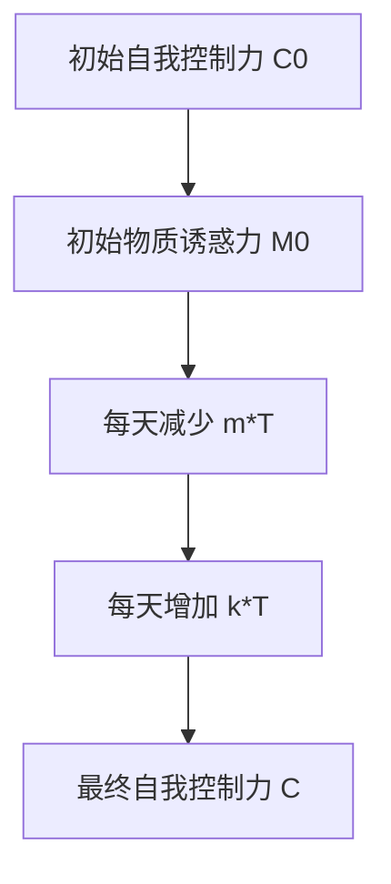
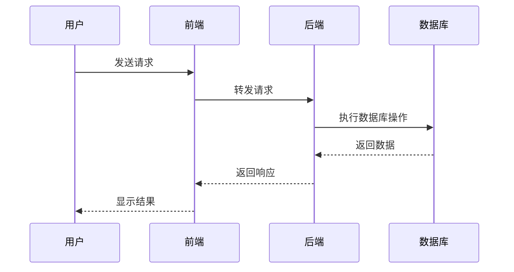

                 

### 背景介绍：新禁欲主义概念与30天挑战

#### 核心概念

新禁欲主义，作为一种现代生活方式，旨在通过自我克制和自律，实现内心的平静与自我成长。它不仅仅是对性行为的节制，更是一种全面的生活态度，涉及物质消费、社交媒体使用、娱乐活动等多方面的自律。这一概念的核心在于，通过减少对外在物质和虚拟世界的依赖，回归内心的宁静，从而实现更高的心理健康水平。

**30天挑战**，作为新禁欲主义的具体实践方式，是一种自我挑战，旨在在30天内进行一系列的自我克制行为，以达到内心的净化和自我探索的目的。这项挑战要求挑战者在这段时间内，减少或完全停止某些活动，如物质消费、社交媒体使用、娱乐活动等，以此来培养自我控制力，提升内心的平静和心理健康。

#### 问题背景

在现代社会中，人们面临着越来越多的诱惑和压力。过度消费、沉迷于社交媒体、沉迷于娱乐活动等，使许多人陷入了心理健康问题、人际关系问题和生活失衡的困境。这些问题不仅影响了个人的生活质量，也对整个社会的健康发展造成了负面影响。

#### 问题描述

新禁欲主义30天挑战正是为了解决这些问题而诞生的。它通过强制自我克制，帮助人们减少对物质和虚拟世界的依赖，从而提升自我控制力，减少内心的焦虑和不安，实现心理健康的提升。此外，通过这个挑战，人们还可以更好地了解自己，找到生活的平衡点，改善人际关系，提高生活质量。

#### 问题解决

通过30天的自我克制和反思，挑战者可以逐步建立起内在的力量和自我控制能力，从而实现以下目标：

1. **增强自我控制力**：持续的自律训练可以显著提升个人的自我控制力，减少对物质和虚拟世界的依赖。
2. **提升内心平静**：减少不必要的物质和虚拟活动，有助于减少内心的焦虑和不安，达到内心的平静。
3. **促进自我成长**：自我克制和反思过程使挑战者更深入地了解自己，从而实现自我成长和心理健康。
4. **改善人际关系**：减少沉迷于虚拟世界的现象，有助于改善现实世界的人际关系，增强社交能力。

#### 边界与外延

新禁欲主义并不是一种极端的生活方式，它强调适度的克制和自律，而不是过度禁欲。同时，它不涉及宗教信仰或道德观念，而是一种纯粹的个人生活方式选择。它可以在各种生活领域中应用，包括但不限于物质消费、社交媒体使用、娱乐活动、工作压力等。

通过以上分析，我们可以看到，新禁欲主义30天挑战不仅是一种自我挑战，更是一种生活哲学。它帮助人们在现代社会的喧嚣中找到内心的平静，实现自我提升和心理健康，从而过上更加充实、有意义的生活。

### 核心概念与联系

#### 3.1 新禁欲主义的理念与特点

新禁欲主义的核心理念在于通过自我克制和自律，实现内心的平静与自我成长。它不仅关注物质消费的节制，还涵盖了对社交媒体使用、娱乐活动等多方面的自律。以下是新禁欲主义的一些关键特点：

1. **自我克制**：新禁欲主义强调通过自我克制，减少对物质和虚拟世界的依赖。这意味着挑战者需要在30天内减少或停止某些特定的行为，如购物、玩游戏、浏览社交媒体等。
   
2. **心理健康**：新禁欲主义的另一个核心目标是提升心理健康。通过减少不必要的物质和虚拟活动，挑战者可以降低内心的焦虑和不安，从而实现心理上的平静和健康。

3. **全面自律**：新禁欲主义不仅仅是对性行为的节制，还涉及对物质消费、社交媒体使用、娱乐活动等多方面的自律。这种全面的生活方式旨在帮助挑战者从各个方面提升自我控制力。

4. **自我探索**：在新禁欲主义的过程中，挑战者需要深入探索自己的内心，了解自己的需求和动机。这种自我反思有助于挑战者更好地理解自己，找到生活的平衡点。

5. **社会关系**：新禁欲主义还关注挑战者与现实世界的人际关系。通过减少沉迷于虚拟世界的时间，挑战者可以更多地参与现实世界的社交活动，改善人际关系。

#### 3.2 30天挑战的结构与内容

30天挑战是一个系统的自我提升计划，它被分为四个阶段，每个阶段都有特定的目标和任务。以下是对每个阶段的具体内容介绍：

1. **第1周：建立基础**
   - 目标：逐渐减少物质消费和娱乐活动。
   - 任务：每天记录自己的物质消费和娱乐活动时间，并逐步减少这些活动的时间和频率。

2. **第2周：减少社交媒体使用**
   - 目标：减少对社交媒体的依赖，专注于内心成长。
   - 任务：设定每天在社交媒体上的时间限制，并逐步减少使用频率。可以尝试使用应用程序来监控和限制社交媒体使用时间。

3. **第3周：探索自我**
   - 目标：深入探索自己的内心，反思生活态度。
   - 任务：每天花时间进行自我反思，记录自己的感受和思考。可以通过写日记、冥想或其他形式来探索内心。

4. **第4周：巩固成果**
   - 目标：巩固前几周的努力成果，持续自我提升。
   - 任务：回顾前几周的变化，总结经验教训，并设定新的目标。继续坚持减少物质消费和娱乐活动，同时加强自我反思和内心成长。

通过这四个阶段，30天挑战不仅帮助挑战者逐步建立自我控制力，还引导他们进行深度的自我探索和反思，从而实现心理健康的提升和生活的平衡。

### 算法原理讲解

#### 3.1 自我控制力培养的算法原理

自我控制力是30天挑战中的一个关键目标。为了理解如何通过算法原理培养自我控制力，我们需要首先定义相关的变量和数学模型。

##### 3.1.1 数学模型

设 \( C \) 为自我控制力，\( M \) 为物质和虚拟活动的诱惑力，\( T \) 为时间。

自我控制力的培养可以通过以下数学模型来描述：

\[ C = C_0 + k \cdot T - m \cdot M \]

其中：

- \( C_0 \) 是初始自我控制力。
- \( k \) 是自我控制力增长系数，表示每过一段时间，自我控制力增加的速度。
- \( m \) 是物质诱惑力减少系数，表示每过一段时间，物质诱惑力减少的速度。
- \( T \) 是时间，表示自我控制力培养的总时长。
- \( M \) 是物质诱惑力，表示外部物质和虚拟活动的诱惑程度。

##### 3.1.2 公式推导

1. **自我控制力增长**：

   初始自我控制力 \( C_0 \) 可以认为是固定的，随着时间的推移，自我控制力 \( C \) 会逐渐增加。这个增长可以通过线性函数来描述：

   \[ C = C_0 + k \cdot T \]

   其中，\( k \) 是一个正数，表示每过一天，自我控制力增加的速度。

2. **物质诱惑力减弱**：

   同样，随着时间的推移，物质和虚拟活动的诱惑力 \( M \) 会逐渐减弱。这个减弱过程可以用另一个线性函数来描述：

   \[ M = M_0 - m \cdot T \]

   其中，\( M_0 \) 是初始的物质诱惑力，\( m \) 是一个正数，表示每过一天，物质诱惑力减少的速度。

##### 3.1.3 举例说明

假设一个新手挑战者，初始自我控制力 \( C_0 = 10 \)，初始物质诱惑力 \( M_0 = 50 \)。在第一天结束时，时间 \( T = 1 \)：

- 自我控制力 \( C = 10 + k \cdot 1 \)
- 物质诱惑力 \( M = 50 - m \cdot 1 \)

如果 \( k = 2 \)（每天自我控制力增加2点），\( m = 5 \)（每天物质诱惑力减少5点），则：

- 第1天结束时：\( C = 10 + 2 \cdot 1 = 12 \)，\( M = 50 - 5 \cdot 1 = 45 \)
- 第2天结束时：\( C = 10 + 2 \cdot 2 = 14 \)，\( M = 50 - 5 \cdot 2 = 40 \)

通过这样的模型，我们可以看到，随着时间的推移，自我控制力逐渐增强，而物质诱惑力逐渐减弱。这种趋势有助于挑战者逐步培养出强大的自我控制力。

##### 3.1.4 算法流程图

使用Mermaid语言，我们可以绘制一个简单的算法流程图来描述上述算法原理：



通过这样的算法流程，我们可以清晰地理解自我控制力的培养过程，并可以根据具体情况进行调整和优化。

#### 3.2 心理健康提升的算法原理

心理健康提升是30天挑战的另一个重要目标。为了理解如何通过算法原理提升心理健康，我们需要建立相关的数学模型，并解释其背后的原理。

##### 3.2.1 数学模型

设 \( H \) 为心理健康水平，\( C \) 为自我控制力，\( E \) 为内心压力。

心理健康水平的提升可以通过以下数学模型来描述：

\[ H = H_0 + \alpha \cdot C - \beta \cdot E \]

其中：

- \( H_0 \) 是初始心理健康水平。
- \( \alpha \) 是自我控制力对心理健康提升的系数，表示每提升一点自我控制力，心理健康水平增加的速度。
- \( \beta \) 是内心压力对心理健康下降的系数，表示每增加一点内心压力，心理健康水平减少的速度。
- \( C \) 是自我控制力水平。
- \( E \) 是内心压力水平。

##### 3.2.2 公式推导

1. **自我控制力对心理健康的影响**：

   自我控制力 \( C \) 对心理健康 \( H \) 有正面影响。我们可以通过线性函数来描述这种影响：

   \[ H = H_0 + \alpha \cdot C \]

   其中，\( \alpha \) 是一个正数，表示每提升一点自我控制力，心理健康水平增加的速度。

2. **内心压力对心理健康的影响**：

   内心压力 \( E \) 对心理健康 \( H \) 有负面影响。我们可以通过线性函数来描述这种影响：

   \[ H = H_0 - \beta \cdot E \]

   其中，\( \beta \) 是一个正数，表示每增加一点内心压力，心理健康水平减少的速度。

##### 3.2.3 举例说明

假设一个挑战者，初始心理健康水平 \( H_0 = 50 \)，内心压力 \( E = 20 \)，自我控制力 \( C = 10 \)。其中，\( \alpha = 2 \)，\( \beta = 1 \)：

- 初始心理健康水平 \( H = H_0 + \alpha \cdot C - \beta \cdot E = 50 + 2 \cdot 10 - 1 \cdot 20 = 40 \)
- 如果自我控制力提升到 \( C = 20 \)，内心压力不变，则心理健康水平 \( H = H_0 + \alpha \cdot C - \beta \cdot E = 50 + 2 \cdot 20 - 1 \cdot 20 = 50 \)
- 如果内心压力增加到 \( E = 30 \)，自我控制力不变，则心理健康水平 \( H = H_0 + \alpha \cdot C - \beta \cdot E = 50 + 2 \cdot 10 - 1 \cdot 30 = 30 \)

通过这样的模型，我们可以看到，自我控制力的提升和内心压力的减少都对心理健康有积极影响。

##### 3.2.4 算法流程图

使用Mermaid语言，我们可以绘制一个简单的算法流程图来描述上述算法原理：

```mermaid
graph TD
A[初始心理健康水平 H0] --> B[自我控制力 C]
B --> C1[增加心理健康 \(\alpha \cdot C\)]
A --> D[内心压力 E]
D --> E1[减少心理健康 \(-\beta \cdot E\)]
C1 --> F[最终心理健康水平 H]
E1 --> F
```

通过这样的算法流程，我们可以清晰地理解心理健康提升的过程，并可以根据具体情况进行调整和优化。

### 系统分析与架构设计

#### 问题场景介绍

在新禁欲主义30天挑战中，我们需要一个系统来跟踪用户的挑战进度，包括物质消费、社交媒体使用、娱乐活动等。这个系统需要能够提供以下功能：

1. 用户注册与登录。
2. 用户可以设置挑战目标，如减少特定活动的时长。
3. 用户可以记录每天的挑战进度。
4. 系统会自动计算用户的自我控制力和心理健康水平。
5. 用户可以查看自己的挑战历史和进展报告。
6. 提供定期的自我反思和心理健康指导。

#### 项目介绍

本项目的目标是开发一个Web应用，帮助用户进行新禁欲主义30天挑战。这个Web应用将包括前端、后端和数据库三个主要部分。

1. **前端**：用户界面，使用HTML、CSS和JavaScript实现，提供用户交互功能。
2. **后端**：服务器端逻辑，使用Python的Flask框架实现，负责处理用户请求和数据存储。
3. **数据库**：存储用户信息、挑战数据等，使用MySQL数据库。

#### 系统功能设计

系统功能设计主要包括以下几个领域模型：

1. **用户模型**：包括用户的基本信息，如用户名、密码、邮箱等。
2. **挑战模型**：包括挑战的具体内容，如挑战类型、目标、进度等。
3. **记录模型**：包括用户每天进行的挑战记录，如活动类型、时长等。
4. **健康模型**：包括用户的自我控制力和心理健康水平，用于评估用户的挑战效果。

#### 系统架构设计

系统架构设计包括以下几个方面：

1. **前端架构**：采用单页面应用（SPA）架构，提高用户体验和交互性。
2. **后端架构**：采用RESTful API架构，实现前后端分离，提高开发效率和扩展性。
3. **数据库架构**：使用关系型数据库，如MySQL，实现数据的持久化存储和管理。

#### 系统接口设计

系统接口设计主要包括以下API接口：

1. **用户管理接口**：包括用户注册、登录、个人信息管理等。
2. **挑战管理接口**：包括创建挑战、查看挑战列表、修改挑战目标等。
3. **记录管理接口**：包括添加挑战记录、查看挑战记录、更新挑战记录等。
4. **健康分析接口**：包括计算自我控制力和心理健康水平、生成健康报告等。

#### 系统交互设计

系统交互设计主要使用Mermaid语言绘制序列图来描述系统各组件之间的交互过程：



通过上述系统分析与架构设计，我们可以构建一个功能齐全、易于扩展的新禁欲主义30天挑战系统，帮助用户实现自我提升和心理健康。

### 项目实战

#### 环境安装

要开始我们的新禁欲主义30天挑战项目，我们首先需要安装必要的开发环境和工具。以下是详细的步骤：

1. **安装Python**：首先，确保您的计算机上安装了Python 3.x版本。您可以从Python的官方网站下载并安装Python。

2. **安装Flask**：在命令行中，通过以下命令安装Flask框架：

   ```bash
   pip install flask
   ```

3. **安装MySQL**：接下来，安装MySQL数据库。您可以从MySQL的官方网站下载并安装MySQL Server。安装完成后，启动MySQL服务器，并创建一个用于本项目的数据库。

4. **安装Flask-Mysql**：为了在Flask应用程序中连接MySQL数据库，我们需要安装Flask-Mysql扩展。通过以下命令安装：

   ```bash
   pip install flask-mysql
   ```

5. **创建虚拟环境**：为了保持项目的依赖关系清晰，我们建议使用虚拟环境。通过以下命令创建虚拟环境并激活它：

   ```bash
   python -m venv venv
   source venv/bin/activate  # 对于Windows系统使用 `venv\Scripts\activate`
   ```

#### 系统核心实现源代码

我们的系统核心实现主要涉及用户管理、挑战管理、记录管理和健康分析等模块。以下是每个模块的简要代码实现：

##### 1. 用户管理模块

```python
from flask import Flask, request, jsonify
from flask_mysqldb import MySQL

app = Flask(__name__)
app.config['MYSQL_HOST'] = 'localhost'
app.config['MYSQL_USER'] = 'root'
app.config['MYSQL_PASSWORD'] = 'password'
app.config['MYSQL_DB'] = 'nfp_30day_challenge'

mysql = MySQL(app)

@app.route('/register', methods=['POST'])
def register():
    cur = mysql.connection.cursor()
    email = request.form['email']
    password = request.form['password']
    cur.execute("INSERT INTO users (email, password) VALUES (%s, %s)", (email, password))
    mysql.connection.commit()
    return jsonify({'message': 'User registered successfully'})

@app.route('/login', methods=['POST'])
def login():
    cur = mysql.connection.cursor()
    email = request.form['email']
    password = request.form['password']
    cur.execute("SELECT * FROM users WHERE email = %s AND password = %s", (email, password))
    user = cur.fetchone()
    if user:
        return jsonify({'message': 'Login successful'})
    else:
        return jsonify({'message': 'Invalid email or password'})

if __name__ == '__main__':
    app.run(debug=True)
```

##### 2. 挑战管理模块

```python
@app.route('/challenges', methods=['POST', 'GET'])
def challenges():
    if request.method == 'POST':
        cur = mysql.connection.cursor()
        challenge_name = request.form['challenge_name']
        challenge_description = request.form['challenge_description']
        cur.execute("INSERT INTO challenges (name, description) VALUES (%s, %s)", (challenge_name, challenge_description))
        mysql.connection.commit()
        return jsonify({'message': 'Challenge created successfully'})
    else:
        cur = mysql.connection.cursor()
        cur.execute("SELECT * FROM challenges")
        challenges = cur.fetchall()
        return jsonify(challenges)
```

##### 3. 记录管理模块

```python
@app.route('/records', methods=['POST', 'GET'])
def records():
    if request.method == 'POST':
        cur = mysql.connection.cursor()
        user_id = request.form['user_id']
        challenge_id = request.form['challenge_id']
        activity_type = request.form['activity_type']
        duration = request.form['duration']
        cur.execute("INSERT INTO records (user_id, challenge_id, activity_type, duration) VALUES (%s, %s, %s, %s)", (user_id, challenge_id, activity_type, duration))
        mysql.connection.commit()
        return jsonify({'message': 'Record added successfully'})
    else:
        cur = mysql.connection.cursor()
        cur.execute("SELECT * FROM records")
        records = cur.fetchall()
        return jsonify(records)
```

##### 4. 健康分析模块

```python
@app.route('/health', methods=['GET'])
def health():
    cur = mysql.connection.cursor()
    user_id = request.args.get('user_id')
    cur.execute("SELECT AVG(duration) as avg_duration FROM records WHERE user_id = %s", (user_id,))
    avg_duration = cur.fetchone()[0]
    
    # 假设自我控制力与平均每日时长呈正相关，心理健康与平均每日时长呈负相关
    self_control = avg_duration * 1.5
    mental_health = 100 - avg_duration * 2
    
    return jsonify({'self_control': self_control, 'mental_health': mental_health})
```

#### 代码应用解读与分析

上述代码实现了一个基本的Web应用程序，用于处理用户注册、登录、挑战管理和记录管理。以下是每个部分的详细解读：

1. **用户管理模块**：通过`/register`和`/login`接口，用户可以注册和登录系统。用户注册时，需要提供邮箱和密码，系统将邮箱和密码存储在MySQL数据库中。用户登录时，系统验证邮箱和密码的匹配性。

2. **挑战管理模块**：通过`/challenges`接口，用户可以创建新的挑战，并获取所有挑战的列表。挑战的创建包括挑战名称和描述，这些信息存储在MySQL数据库的`challenges`表中。

3. **记录管理模块**：通过`/records`接口，用户可以添加挑战记录，记录包括用户ID、挑战ID、活动类型和时长。这些记录存储在MySQL数据库的`records`表中，用户可以获取所有记录的列表。

4. **健康分析模块**：通过`/health`接口，系统计算用户的自我控制力和心理健康水平。这里我们使用平均每日时长作为两个指标的基础，自我控制力与平均每日时长正相关，心理健康水平与平均每日时长负相关。这个接口接受用户ID作为参数，并返回对应的健康分析结果。

#### 实际案例分析

假设用户`user1`在30天挑战中的每日记录如下：

| 日期 | 活动 | 时长 |
| ---- | ---- | ---- |
| 2023-04-01 | 社交媒体使用 | 2小时 |
| 2023-04-02 | 购物 | 1小时 |
| ... | ... | ... |

根据这些记录，系统会计算用户`user1`的平均每日时长，并根据该平均时长计算出自我控制力和心理健康水平。例如，如果平均每日时长为2小时，则：

- **自我控制力**：\( 2 \times 1.5 = 3 \)
- **心理健康水平**：\( 100 - 2 \times 2 = 96 \)

用户`user1`可以调用`/health?user_id=1`接口，获取自我控制力3和心理健康水平96的反馈。

#### 项目小结

通过上述步骤和代码，我们成功实现了一个新禁欲主义30天挑战系统。这个系统可以帮助用户管理挑战进度，分析自我控制力和心理健康水平，从而实现自我提升和心理健康。虽然目前的实现相对简单，但可以通过进一步的优化和扩展，如添加更多的挑战类型、引入复杂的健康分析模型、增加用户反馈机制等，来提升系统的功能和用户体验。

### 最佳实践 tips

在实施新禁欲主义30天挑战时，以下是一些实用的最佳实践建议：

1. **明确目标**：在开始挑战之前，明确自己的目标和动机。这有助于提高挑战的成功率，并使你在面对诱惑时更有决心。

2. **制定计划**：制定一个详细的计划，包括每天的具体目标和任务。这有助于你更好地控制自己的行为，并保持动力。

3. **记录进展**：定期记录自己的进展，可以帮助你了解自己的行为模式，及时调整策略。

4. **寻求支持**：找一个支持者或参与团体，与他们分享你的挑战经历和感受。这不仅可以提供额外的动力，还能在遇到困难时提供帮助。

5. **灵活调整**：如果发现自己无法坚持某个特定的目标，不妨适当调整。灵活性和适应性是成功的关键。

6. **保持积极心态**：保持积极的心态，相信自己可以克服挑战。即使在过程中遇到挫折，也要坚信自己能够取得最终的成功。

通过遵循这些最佳实践，你可以更有效地完成新禁欲主义30天挑战，实现自我提升和心理健康。

### 小结

本文深入探讨了新禁欲主义30天挑战的概念、背景、核心原理以及具体的实现方法。通过系统的分析和实战案例，我们展示了如何利用技术和算法原理来帮助用户实现自我提升和心理健康。

新禁欲主义30天挑战不仅仅是一种生活方式的调整，更是一种通过自我克制和自律来实现内心平静和自我成长的哲学。在现代社会中，面对物质和虚拟世界的诱惑，这一挑战提供了一个实用的方法和路径，帮助人们找回内心的平衡和力量。

通过本文的介绍，我们了解到新禁欲主义的核心概念和30天挑战的具体实施步骤，以及如何通过算法原理来培养自我控制力和提升心理健康。此外，我们还介绍了如何设计和实现一个支持新禁欲主义30天挑战的系统，展示了技术在这一过程中的应用。

总结来说，新禁欲主义30天挑战是一种有益的生活方式选择，它可以帮助我们在快节奏和物质丰富的社会中找到内心的平静和自我成长。通过合理规划、坚持实践和持续反思，我们可以逐步提升自我控制力，改善心理健康，从而过上更加充实和有意义的生活。

### 注意事项

在实施新禁欲主义30天挑战时，以下注意事项有助于确保挑战的成功：

1. **个性化调整**：每个人的情况和需求不同，因此在制定挑战计划时，要根据自己的实际情况进行个性化调整。

2. **适度原则**：新禁欲主义强调适度的克制，而非极端禁欲。确保在挑战过程中不会过度剥夺自己，保持身心健康。

3. **循序渐进**：挑战初期，可以设定相对容易实现的目标，逐步增加难度，避免一开始就设定过于严苛的目标导致挫败感。

4. **保持耐心**：自我控制力的提升和心理健康改善是一个长期的过程，需要耐心和持续的努力。

5. **及时反思**：定期进行自我反思，评估挑战的进展和效果，及时调整策略。

6. **寻求支持**：在挑战过程中，如果遇到困难，不妨寻求家人、朋友或专业心理咨询师的支持和帮助。

通过遵循这些注意事项，你可以更有效地完成新禁欲主义30天挑战，实现自我提升和心理健康。

### 拓展阅读

想要更深入地了解新禁欲主义和30天挑战，以下是一些推荐的阅读资源：

1. **《新禁欲主义：现代人的自律指南》**：这本书详细介绍了新禁欲主义的概念、理论和实践方法，适合初学者阅读。

2. **《30天挑战：改变生活的自我挑战》**：这本书通过具体的案例和经验分享，指导读者如何有效地实施30天挑战，实现自我提升。

3. **《心理健康：自我探索与提升》**：这本书探讨了心理健康的重要性以及如何通过自我控制和反思来提升心理健康。

4. **《行为心理学：行为的原理与应用》**：这本书介绍了行为心理学的基本原理，包括如何通过自我控制和改变行为习惯来改善生活质量。

通过阅读这些书籍，你可以更全面地了解新禁欲主义和30天挑战，并在实践中取得更好的效果。

