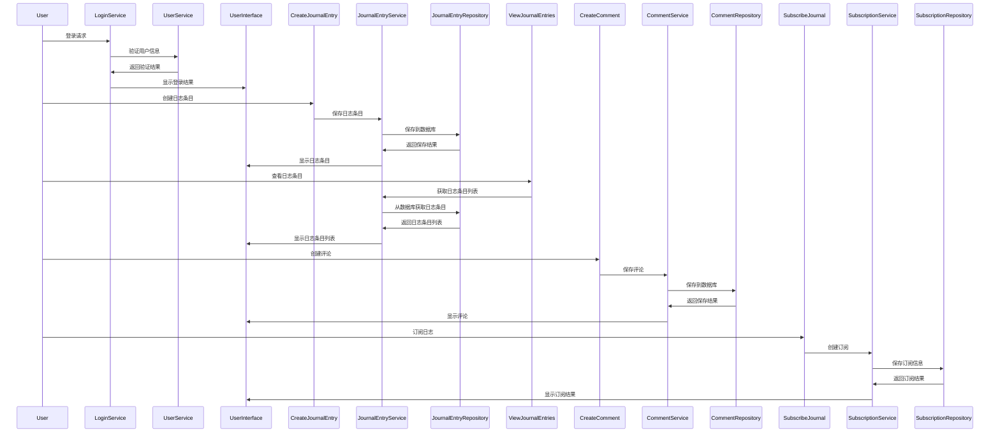
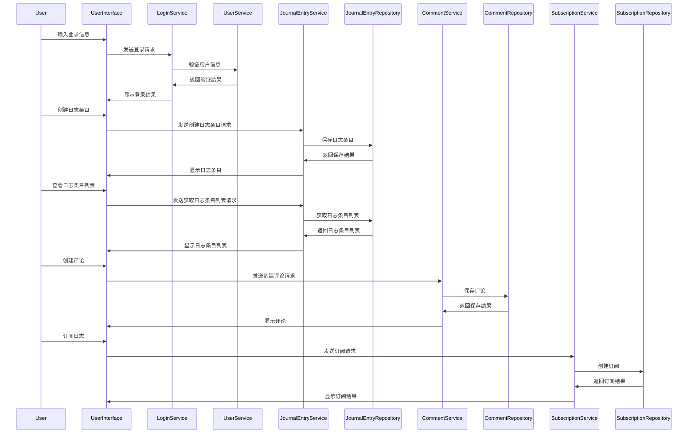

                 


## 文章标题：新禁欲主义实验日志平台：记录克制生活的社交媒体

### 文章关键词：
1. 新禁欲主义
2. 社交媒体
3. 实验日志
4. 克制生活
5. 平台设计

### 摘要：
本文将探讨新禁欲主义实验日志平台的构建，一个旨在鼓励人们通过记录克制生活来提升自我意识的社交媒体平台。我们将逐步分析平台的核心概念、架构设计、功能实现，并分享克制生活的案例，最终讨论平台的安全与隐私保护措施。

### 目录：

## 第一部分：背景介绍

### 第1章：新禁欲主义运动的兴起

#### 1.1 问题背景
#### 1.2 问题描述
#### 1.3 新禁欲主义运动的动机与目标
#### 1.4 新禁欲主义与社会文化的关系

### 第2章：克制生活的核心概念

#### 2.1 核心概念与联系
#### 2.2 概念属性特征对比表格
#### 2.3 ER实体关系图架构

## 第二部分：平台架构与功能设计

### 第3章：平台架构设计

#### 3.1 问题场景介绍
#### 3.2 系统功能设计（领域模型Mermaid类图）
#### 3.3 系统架构设计（Mermaid架构图）
#### 3.4 系统接口设计
#### 3.5 系统交互（Mermaid序列图）

### 第4章：平台核心功能实现

#### 4.1 实验日志记录方法
#### 4.2 日志数据的存储与管理
#### 4.3 数据分析与可视化

## 第三部分：克制生活案例分享

### 第5章：成功案例与启示

#### 5.1 案例一：克服拖延症
#### 5.2 案例二：戒除过度消费
#### 5.3 案例三：提升自律性

### 第6章：个人成长与变化

#### 6.1 克制生活的挑战与应对
#### 6.2 克制生活对个人成长的积极作用
#### 6.3 克制生活者的心路历程

## 第四部分：平台使用技巧

### 第7章：平台操作指南

#### 7.1 注册与登录
#### 7.2 日志记录与编辑
#### 7.3 数据分析与报告
#### 7.4 社区互动与支持

### 第8章：提高使用效果的建议

#### 8.1 设置个人目标
#### 8.2 保持持续记录
#### 8.3 利用社区资源
#### 8.4 避免过度依赖

## 第五部分：平台安全与隐私保护

### 第9章：平台安全策略

#### 9.1 用户数据安全
#### 9.2 网络安全防护
#### 9.3 隐私政策与用户同意

### 第10章：面临的挑战与应对

#### 10.1 平台面临的挑战
#### 10.2 安全问题的应对措施
#### 10.3 用户隐私保护的最佳实践

## 第11章：小结与拓展

#### 11.1 本书内容总结
#### 11.2 克制生活的重要意义
#### 11.3 拓展阅读与资源推荐

### 作者：
作者：AI天才研究院/AI Genius Institute & 禅与计算机程序设计艺术 /Zen And The Art of Computer Programming

### 完整性要求：
- 每个章节的内容必须详细讲解，核心内容必须包含：
  - 背景介绍：核心概念术语说明、问题背景、问题描述、问题解决、边界与外延、概念结构与核心要素组成。
  - 核心概念与联系：核心概念原理、概念属性特征对比表格和ER实体关系图架构。
  - 算法原理讲解：算法mermaid流程图、python源代码、算法原理数学模型和公式、通俗易懂的举例说明。
  - 系统分析与架构设计方案：问题场景介绍、系统功能设计、系统架构设计、系统接口设计、系统交互。
  - 项目实战：环境安装、系统核心实现源代码、代码应用解读与分析、实际案例分析和详细讲解剖析、项目小结。
  - 最佳实践 tips、小结、注意事项、拓展阅读等内容。

### 字数要求：
- 文章字数要求在 10000 ～ 12000 字左右。

### 格式要求：
- 文章内容使用markdown格式输出。
- 文章末尾需要写上作者信息。
- 数学公式使用latex格式，嵌入文中独立段落的latex公式前后使用 $$ 括起来，段落内的latex公式前后使用 $ 括起来。

### LET'S THINK STEP BY STEP：
我们将按照上述的目录结构，逐步深入分析每个章节的主题，确保内容丰富、逻辑清晰、结构紧凑，从而为读者提供一篇高质量的技术博客文章。我们会在每个部分详细阐述核心概念、架构设计、功能实现、案例分享、使用技巧和安全策略等内容，同时注重数学公式和代码的详细讲解。最终，我们将为读者提供一个完整的、易于理解的克制生活社交媒体平台构建方案。 ### 第1章：新禁欲主义运动的兴起

#### 1.1 问题背景

在现代社会的快节奏和高度物质化的环境中，人们面临着诸多挑战，其中包括精神空虚、物质依赖、情感疏离等问题。这些问题在很大程度上源自对欲望的无节制追求。传统禁欲主义提倡对欲望的完全抑制，但在现代社会中，这种极端的方法往往难以被广泛接受。因此，新禁欲主义运动应运而生，它提倡通过克制欲望、培养内在力量，从而提升个人精神层面的健康。

新禁欲主义运动的兴起，背后反映了人们对精神健康和生活质量的关注。随着社交媒体和互联网的普及，人们越来越渴望寻找一种方式，不仅能够提升自我，还能与他人分享这种提升的过程。这种需求催生了一种新型的社交媒体平台，即新禁欲主义实验日志平台。

#### 1.2 问题描述

新禁欲主义实验日志平台旨在帮助用户记录自己的克制生活实践，从而实现精神提升。具体而言，平台需要解决以下问题：

1. **用户记录的便利性**：用户需要能够方便地记录自己的克制生活实践，包括每日的饮食、运动、情绪等。
2. **数据的安全性和隐私保护**：用户的数据需要得到妥善保护，防止数据泄露和未经授权的访问。
3. **数据的可视化与分析**：平台需要提供数据可视化工具，帮助用户更好地理解自己的克制生活实践对身心健康的影响。
4. **社交互动功能**：用户需要能够与其他用户分享自己的克制生活经验，从中获得支持和鼓励。

#### 1.3 新禁欲主义运动的动机与目标

新禁欲主义运动的动机主要源于对现代生活方式的反思。现代社会中，人们往往过分追求物质享受，忽视了精神层面的需求。新禁欲主义运动倡导通过克制物质欲望，培养内在的专注力和耐力，从而实现个人成长和心理健康。

新禁欲主义运动的目标包括：

1. **提高生活质量**：通过克制不必要的欲望，人们可以更加专注于当前的生活，提高生活的满意度和幸福感。
2. **促进精神健康**：克制生活可以帮助人们减轻压力，改善情绪，从而提高精神健康水平。
3. **培养内在力量**：通过持续的克制生活实践，人们可以培养出更强的自我控制力和专注力，从而在面对生活中的挑战时更加从容。
4. **构建社交支持网络**：通过社交媒体平台，用户可以分享自己的克制生活经验，与其他人建立联系，从中获得支持和鼓励。

#### 1.4 新禁欲主义与社会文化的关系

新禁欲主义运动并不是对传统社会文化的否定，而是在现代社会背景下对传统价值观的重新审视和解读。它倡导的是一种平衡的生活态度，既不过分压抑欲望，也不盲目追求物质享受。

新禁欲主义与社会文化的关系可以从以下几个方面来理解：

1. **文化传承**：新禁欲主义运动继承了传统禁欲主义的某些理念，如克制欲望、注重精神提升等，但更强调个人自由和现代社会的需求。
2. **文化创新**：新禁欲主义运动通过将克制生活与现代社交媒体相结合，创造了一种新型的社会文化现象，即克制生活的社交化。
3. **文化冲突**：新禁欲主义运动与传统价值观之间可能存在一定的冲突。传统价值观强调物质追求和社会地位，而新禁欲主义则强调内在精神世界的提升。
4. **文化融合**：随着新禁欲主义运动的推广，它逐渐被更多的人接受，并开始与传统价值观相互融合，形成一种新的文化共识。

通过上述分析，我们可以看到，新禁欲主义实验日志平台不仅仅是一个技术产品，更是对现代社会生活方式的一种反思和探索。它为用户提供了一个记录、分享和提升克制生活的平台，旨在帮助用户实现精神层面的成长。接下来，我们将进一步探讨平台的核心概念和架构设计，为构建这样一个平台提供更加详细的思路和方法。

### 第2章：克制生活的核心概念

#### 2.1 核心概念与联系

克制生活作为一种新的生活方式，其核心概念包括克制、自我意识、自律、精神提升等。这些概念相互联系，共同构成了克制生活的基础。

1. **克制**：克制是指对欲望和行为的自我控制。在克制生活中，克制不仅是对物质欲望的抑制，更是对行为和情绪的调节。通过克制，人们能够更好地专注于自己的内心世界，提高自我控制力。

2. **自我意识**：自我意识是指个体对自己内心感受和外部行为的觉察和理解。克制生活强调通过自我意识来了解自己的欲望和行为模式，从而更好地进行自我调节和提升。

3. **自律**：自律是指个体在缺乏外部监督时，依然能够按照既定的目标和规则行事的能力。自律是克制生活的关键，它帮助个体在面对诱惑和挑战时保持坚定，实现自我提升。

4. **精神提升**：精神提升是指通过克制生活，个体能够获得的心理和情感上的成长。这包括情绪管理、压力缓解、自我认知提升等。

这些核心概念相互联系，共同构成了克制生活的理论基础。克制是手段，自我意识是前提，自律是保障，精神提升是目标。

#### 2.2 概念属性特征对比表格

为了更清晰地理解这些概念，我们可以通过表格的形式进行对比：

| 概念   | 定义                                                         | 属性特征                                           |
| ------ | ------------------------------------------------------------ | -------------------------------------------------- |
| 克制   | 对欲望和行为的自我控制                                       | 自我约束、目标导向、情绪调节                         |
| 自我意识 | 对自己内心感受和外部行为的觉察和理解                         | 内省、自我反思、认知提升                             |
| 自律   | 在缺乏外部监督时，依然能够按照既定的目标和规则行事的能力     | 自我管理、目标实现、行为规范                         |
| 精神提升 | 通过克制生活，个体能够获得的心理和情感上的成长               | 情绪管理、压力缓解、自我认知提升、内在力量增强       |

通过这个对比表格，我们可以看到，克制、自我意识、自律和精神提升虽然各有侧重，但共同构成了克制生活的核心要素。

#### 2.3 ER实体关系图架构

为了更好地理解克制生活平台的设计，我们可以通过ER（Entity-Relationship，实体关系）图来展示平台中各个实体之间的关系。

下面是一个简化的ER图：

```mermaid
erDiagram
  User ||--|{ JournalEntry }|
  JournalEntry ||--|{ Comment }|
  User ||--|{ JournalSubscription }|
  User ||--|{ LogEntry }|
  JournalSubscription ||--|{ SubscriptionPlan }|
  SubscriptionPlan ||--|{ PlanFeature }|
```

在这个ER图中：

- **User**（用户）是平台的核心实体，代表使用平台的个人。
- **JournalEntry**（日志条目）是用户记录的克制生活实践的具体条目。
- **Comment**（评论）是用户对日志条目的反馈和讨论。
- **JournalSubscription**（日志订阅）是用户订阅的日志条目，用于社交互动和分享。
- **LogEntry**（日志条目）是用户的具体行为记录。
- **SubscriptionPlan**（订阅计划）是平台的付费服务计划。
- **PlanFeature**（计划特性）是订阅计划的具体内容。

通过ER图，我们可以清晰地看到各个实体之间的关系，这有助于我们在平台设计过程中明确数据模型和功能需求。

#### 小结

在本章中，我们深入探讨了克制生活的核心概念，包括克制、自我意识、自律和精神提升。通过对比表格和ER图，我们更好地理解了这些概念之间的联系，以及它们在平台设计中的应用。接下来，我们将进一步探讨平台的具体架构和功能设计，为构建新禁欲主义实验日志平台奠定坚实的基础。

### 第3章：平台架构设计

#### 3.1 问题场景介绍

随着新禁欲主义运动的兴起，人们对于记录和分享克制生活的需求不断增加。为了满足这一需求，我们设计了一个新禁欲主义实验日志平台。该平台旨在提供一个用户可以记录、分享和反思自己克制生活实践的社交媒体环境。平台的主要问题场景包括：

1. **用户注册与登录**：用户需要方便地注册和登录平台，以便开始记录自己的克制生活实践。
2. **日志记录功能**：用户需要能够方便地记录和编辑自己的日志条目，包括饮食、运动、情绪等。
3. **数据可视化与分析**：平台需要提供数据可视化工具，帮助用户更好地理解自己的克制生活实践对身心健康的影响。
4. **社交互动**：用户需要能够与其他用户分享日志，进行讨论和互动。
5. **安全与隐私保护**：平台需要确保用户数据的安全性和隐私性，防止数据泄露和未经授权的访问。

#### 3.2 系统功能设计（领域模型Mermaid类图）

在平台的设计中，领域模型类图是至关重要的。它帮助我们理解和定义平台中的核心实体和它们之间的关系。以下是一个简化的领域模型类图：

```mermaid
classDiagram
  User <.. JournalEntry
  User <.. Comment
  User <.. JournalSubscription
  User <.. LogEntry
  JournalSubscription <.. SubscriptionPlan
  SubscriptionPlan <.. PlanFeature
  User subclass of Account
  JournalEntry subclass of Content
  Comment subclass of Content
  LogEntry subclass of Content
  SubscriptionPlan subclass of Plan
  PlanFeature subclass of Feature

  User : +String username
         +String password
         +String email
         +List<JournalEntry> journalEntries
         +List<Comment> comments
         +List<JournalSubscription> journalSubscriptions
         +List<LogEntry> logEntries

  JournalEntry : +String title
                 +String content
                 +DateTime created
                 +DateTime updated
                 +User owner

  Comment : +String content
            +DateTime created
            +DateTime updated
            +User owner
            +JournalEntry journalEntry

  JournalSubscription : +String id
                       +User subscriber
                       +JournalEntry journalEntry
                       +SubscriptionPlan subscriptionPlan

  LogEntry : +String content
             +DateTime created
             +User owner

  SubscriptionPlan : +String id
                    +String name
                    +DateTime start
                    +DateTime end
                    +PlanFeature[] features

  PlanFeature : +String id
                +String name
                +String description
```

在这个类图中，我们定义了以下核心实体：

- **User**（用户）：代表使用平台的人，具有基本的账户信息。
- **JournalEntry**（日志条目）：用户记录的克制生活实践的具体条目。
- **Comment**（评论）：用户对日志条目的反馈和讨论。
- **JournalSubscription**（日志订阅）：用户订阅的日志条目，用于社交互动和分享。
- **LogEntry**（日志条目）：用户的具体行为记录。
- **SubscriptionPlan**（订阅计划）：平台的付费服务计划。
- **PlanFeature**（计划特性）：订阅计划的具体内容。

通过这个类图，我们可以清晰地看到各个实体之间的关系，以及它们的基本属性和行为。

#### 3.3 系统架构设计（Mermaid架构图）

在确定领域模型后，我们需要进一步设计系统的整体架构。以下是一个简化的系统架构Mermaid图：



在这个架构图中，我们定义了以下核心服务：

- **LoginService**（登录服务）：处理用户的登录请求，验证用户信息。
- **UserService**（用户服务）：提供用户相关的业务逻辑，如创建、更新和查询用户信息。
- **JournalEntryService**（日志条目服务）：处理日志条目的创建、更新和查询。
- **CommentService**（评论服务）：处理评论的创建、更新和查询。
- **SubscriptionService**（订阅服务）：处理用户的订阅请求，如创建、更新和查询订阅信息。

通过这个架构图，我们可以清晰地看到系统中的各个服务和它们之间的关系。

#### 3.4 系统接口设计

在系统架构设计中，接口设计是至关重要的。以下是一个简化的系统接口设计：

```mermaid
interfaceDiagram
  UserInterface <<((HTML/CSS/JavaScript)) LoginService
  UserInterface <<((HTML/CSS/JavaScript)) UserService
  UserInterface <<((HTML/CSS/JavaScript)) JournalEntryService
  UserInterface <<((HTML/CSS/JavaScript)) CommentService
  UserInterface <<((HTML/CSS/JavaScript)) SubscriptionService

  LoginService <|.. UserService
  JournalEntryService <|.. UserService
  CommentService <|.. UserService
  SubscriptionService <|.. UserService
  JournalEntryService <|.. JournalEntryRepository
  CommentService <|.. CommentRepository
  SubscriptionService <|.. SubscriptionRepository
```

在这个接口设计中，我们定义了以下接口：

- **UserInterface**（用户界面）：用于与用户进行交互的接口，支持HTML、CSS和JavaScript。
- **LoginService**（登录服务）：提供用户登录的接口。
- **UserService**（用户服务）：提供用户信息管理的接口。
- **JournalEntryService**（日志条目服务）：提供日志条目管理的接口。
- **CommentService**（评论服务）：提供评论管理的接口。
- **SubscriptionService**（订阅服务）：提供订阅管理的接口。

通过这个接口设计，我们可以确保系统的各个部分都能够通过统一的接口进行通信，提高系统的可维护性和扩展性。

#### 3.5 系统交互（Mermaid序列图）

最后，我们通过序列图来展示系统中的主要交互流程。以下是一个简化的系统交互序列图：



在这个序列图中，我们展示了用户与系统之间的主要交互流程，包括登录、创建日志条目、查看日志条目列表、创建评论和订阅日志等。通过这个序列图，我们可以清晰地看到系统的运作流程，以及各个服务之间的协作关系。

#### 小结

在本章中，我们详细介绍了新禁欲主义实验日志平台的架构设计。通过领域模型类图、系统架构图、接口设计和交互序列图，我们清晰地展示了平台的核心实体、服务、接口和交互流程。这些设计文档为平台的实现和后续开发提供了坚实的基础。接下来，我们将深入探讨平台的核心功能实现，进一步细化平台的各个方面。

### 第4章：平台核心功能实现

#### 4.1 实验日志记录方法

实验日志记录方法是新禁欲主义实验日志平台的核心功能之一。它帮助用户系统地记录自己的克制生活实践，从而更好地了解和提升自己的精神状态。以下是详细的日志记录方法：

1. **日志条目创建**：用户可以在平台中创建新的日志条目。每个日志条目应包括以下信息：
   - 日志标题：简洁明了地描述日志内容。
   - 日志内容：详细描述当天的克制生活实践，包括饮食、运动、情绪、心理活动等。
   - 创建时间：系统自动记录日志的创建时间。

2. **日志条目编辑**：用户可以随时编辑已创建的日志条目，更新内容、修改标题等。这种灵活性使用户能够根据实际情况进行调整和补充。

3. **日志条目分类**：为了方便管理和查找，用户可以为日志条目添加分类标签。例如，"饮食控制"、"运动锻炼"、"情绪调节"等。这些标签有助于用户对日志内容进行快速筛选和总结。

4. **日志条目分享**：用户可以选择将日志条目分享给平台上的其他用户或特定的社群。分享日志条目可以帮助用户获得他人的反馈和建议，从而进一步提升克制生活的效果。

5. **日志条目回顾**：平台提供日志回顾功能，用户可以查看历史日志，回顾自己的克制生活实践。这有助于用户发现规律、总结经验，并不断优化自己的生活方式。

#### 4.2 日志数据的存储与管理

日志数据的存储与管理是平台稳定运行的关键。以下是关于日志数据存储与管理的详细说明：

1. **数据存储**：
   - **数据库选择**：平台采用关系型数据库（如MySQL）进行数据存储。这种数据库具有结构化、稳定性高、查询效率高等优点。
   - **数据表设计**：日志数据存储在名为"JournalEntries"的表中。表结构包括：
     - `id`：日志条目的唯一标识。
     - `title`：日志标题。
     - `content`：日志内容。
     - `created_at`：日志创建时间。
     - `updated_at`：日志最后更新时间。
     - `user_id`：日志所属用户的标识。

2. **数据管理**：
   - **数据插入**：当用户创建新日志条目时，系统将日志数据插入"JournalEntries"表中。
   - **数据更新**：当用户编辑日志条目时，系统将更新"JournalEntries"表中的对应记录。
   - **数据查询**：平台提供多种查询接口，支持按时间、分类标签等条件筛选日志条目。
   - **数据删除**：用户可以删除自己的日志条目，系统将删除"JournalEntries"表中的对应记录。

3. **数据备份与恢复**：
   - **定期备份**：平台采用定期备份机制，确保数据的安全性和完整性。备份文件存储在安全的服务器上，以防止数据丢失。
   - **数据恢复**：在发生数据丢失或损坏时，平台支持数据恢复操作，从备份文件中恢复数据。

4. **数据安全**：
   - **访问控制**：平台采用严格的访问控制策略，确保只有授权用户才能访问和操作日志数据。
   - **数据加密**：敏感数据（如用户密码）在存储和传输过程中采用加密技术，防止数据泄露。

#### 4.3 数据分析与可视化

数据分析与可视化功能是平台的一大亮点，它帮助用户更好地理解自己的克制生活实践，发现潜在的问题和改进点。以下是详细的数据分析与可视化方法：

1. **数据统计**：
   - **统计周期**：用户可以按天、周、月等不同周期进行数据统计。
   - **统计指标**：包括日志条目总数、平均日志条目数量、日志条目分类分布等。

2. **数据可视化**：
   - **图表类型**：平台支持多种图表类型，如柱状图、饼图、折线图等，帮助用户直观地展示数据。
   - **图表定制**：用户可以自定义图表的显示方式和数据范围，以便更好地满足个人需求。

3. **数据趋势分析**：
   - **趋势图**：平台提供趋势图功能，帮助用户查看克制生活实践的变化趋势，如饮食习惯、运动频率等。
   - **异常检测**：平台采用异常检测算法，识别出用户行为中的异常情况，如长时间不记录日志、突然增加的饮食摄入量等。

4. **数据报告**：
   - **定期报告**：平台定期生成数据报告，总结用户克制生活实践的主要成果和问题，提供改进建议。
   - **个性化报告**：用户可以根据自己的需求和偏好，自定义生成报告的内容和格式。

#### 小结

在本章中，我们详细介绍了新禁欲主义实验日志平台的核心功能实现，包括实验日志记录方法、日志数据的存储与管理以及数据分析与可视化。这些功能共同构成了平台的核心价值，帮助用户更好地记录、管理和分析自己的克制生活实践，从而实现精神提升和自我成长。接下来，我们将通过具体的案例分享，进一步展示平台在实际应用中的效果和意义。

### 第5章：成功案例与启示

#### 5.1 案例一：克服拖延症

**案例背景**：李先生是一位工作繁忙的职场人士，常常感到时间不够用，导致拖延症严重。他在朋友的推荐下，开始使用新禁欲主义实验日志平台，希望通过记录和反思自己的生活习惯，找到克服拖延的方法。

**具体措施**：
1. **记录日常活动**：李先生每天早上都会记录当天的任务清单和计划，详细记录每项任务的开始和完成时间。
2. **时间追踪**：使用平台的时间追踪功能，记录自己每天在各项活动上的耗时，分析时间分配是否合理。
3. **情绪记录**：李先生每天还会记录自己的情绪变化，分析情绪波动对拖延的影响。

**结果**：
- 通过持续记录，李先生发现自己在面对复杂任务时更容易感到焦虑和拖延。他意识到需要调整心态，提高自我调节能力。
- 通过反思和调整，李先生逐渐掌握了时间管理和情绪调节的方法，拖延症得到了明显改善。

**启示**：
- **持续记录**：记录是克服拖延的重要手段，通过不断反思和调整，可以逐步找到解决问题的方法。
- **情绪管理**：情绪是影响拖延的重要因素，学会管理情绪，有助于提高工作效率。

#### 5.2 案例二：戒除过度消费

**案例背景**：王女士是一位热爱购物的年轻女性，常常因为消费过度而感到经济压力。她希望通过新禁欲主义实验日志平台，找到戒除过度消费的方法。

**具体措施**：
1. **记录消费行为**：王女士每天都会记录自己的消费行为，包括购物支出、用餐支出等。
2. **消费分类**：王女士将消费分为必要消费和欲望消费，分析每类消费的比例和合理性。
3. **设定预算**：王女士根据实际情况设定每月的消费预算，并严格遵守。

**结果**：
- 通过记录和分类，王女士意识到自己在欲望消费上的支出过高，开始有意识地减少不必要的购物。
- 通过设定预算，王女士的月均消费明显下降，经济压力得到缓解。

**启示**：
- **理性消费**：通过记录和分类消费行为，可以更好地了解自己的消费习惯，从而实现理性消费。
- **预算管理**：设定预算并严格执行，有助于控制消费，减轻经济压力。

#### 5.3 案例三：提升自律性

**案例背景**：赵先生是一位自由职业者，工作自由度高，但也容易导致自律性不足。他希望通过新禁欲主义实验日志平台，提升自己的自律性。

**具体措施**：
1. **制定每日计划**：赵先生每天都会制定详细的计划，包括工作、学习、休息等。
2. **日志记录**：赵先生每天都会记录自己的计划完成情况和实际耗时，分析计划执行的效果。
3. **反思与调整**：赵先生定期反思自己的计划执行情况，找出不足之处，并进行调整。

**结果**：
- 通过持续记录和反思，赵先生逐步提高了自己的自律性，工作效率和成果显著提升。
- 通过制定和执行计划，赵先生的生活更加有条理，工作压力得到缓解。

**启示**：
- **计划执行**：制定和执行计划是提升自律性的有效方法，通过持续反思和调整，可以逐步提高自律能力。
- **时间管理**：合理的时间管理有助于提高工作效率和生活质量。

#### 小结

以上三个案例展示了新禁欲主义实验日志平台在实际应用中的效果。通过记录和反思克制生活实践，用户可以更好地了解自己的行为模式，发现并解决问题，从而实现个人成长和提升。这些成功案例启示我们，持续记录和反思是克服拖延、理性消费和提升自律性的有效手段。通过平台提供的功能，用户可以更好地管理自己的生活和行为，实现自我提升。

### 第6章：个人成长与变化

#### 6.1 克制生活的挑战与应对

克制生活并非一帆风顺，用户在践行过程中会面临诸多挑战。以下是常见的挑战及其应对策略：

1. **诱惑与意志力的较量**：
   - **挑战**：生活中充满了各种诱惑，如美食、娱乐等，用户容易在这些诱惑面前放弃克制。
   - **应对**：制定明确的克制目标和计划，增强自我意识，提高意志力。可以通过逐步减少诱惑的接触时间和强度，培养自制力。

2. **情绪波动**：
   - **挑战**：情绪波动可能导致克制生活的失败，特别是在压力大、心情不好的时候。
   - **应对**：学习情绪管理技巧，如冥想、深呼吸等，帮助自己在情绪波动时保持冷静。同时，记录情绪变化，分析情绪与克制生活实践的关系，逐步调整。

3. **生活压力**：
   - **挑战**：工作、家庭、社交等方面的压力可能导致克制生活的中断。
   - **应对**：合理规划时间，平衡工作与生活，适当寻求支持和帮助。在压力大时，可以暂时放松克制要求，给自己一些喘息时间。

4. **缺乏动力**：
   - **挑战**：长期的克制生活可能让人感到乏味和缺乏动力。
   - **应对**：设定短期和长期目标，不断激励自己。通过记录和分享克制生活实践，获得他人的支持和鼓励，增强动力。

#### 6.2 克制生活对个人成长的积极作用

克制生活不仅仅是生活方式的改变，更是个人成长的重要推动力。以下是克制生活对个人成长的积极作用：

1. **自我认知提升**：
   - **作用**：通过记录和反思克制生活实践，用户可以更深入地了解自己的欲望、情绪和行为模式，从而提升自我认知。
   - **实例**：李女士在记录自己的饮食和情绪变化后，发现了自己情绪波动与饮食不健康之间的联系，从而更加重视健康饮食。

2. **自律能力增强**：
   - **作用**：持续的克制生活实践有助于培养自律能力，使个体在面临挑战和诱惑时能够保持坚定和自律。
   - **实例**：赵先生通过制定和执行每日计划，逐步提高了自己的自律能力，工作效率和生活质量显著提升。

3. **情绪管理能力提升**：
   - **作用**：克制生活有助于用户学会情绪管理，减少情绪波动对生活的影响。
   - **实例**：王女士通过学习冥想和深呼吸技巧，有效控制了自己的情绪波动，提高了生活质量。

4. **自我调节能力提升**：
   - **作用**：克制生活帮助用户学会自我调节，更好地应对生活中的压力和挑战。
   - **实例**：李先生通过反思和调整自己的计划，逐步提高了自己的时间管理和情绪调节能力，克服了拖延症。

#### 6.3 克制生活者的心路历程

克制生活对个人的影响是深远而持久的。以下是几位克制生活者的心路历程：

1. **从迷茫到清晰**：
   - **经历**：李先生在开始克制生活前，感到生活毫无目标，对未来迷茫。通过记录和反思，他逐步找到了自己的兴趣和目标，生活变得有意义。
   - **启示**：通过克制生活，用户可以更清晰地认识自己，找到生活的方向和动力。

2. **从被动到主动**：
   - **经历**：王女士在开始克制生活后，从被动接受生活安排转变为主动规划自己的生活。她开始主动设定目标、制定计划，并努力去实现。
   - **启示**：克制生活可以激发用户的主动性，使生活变得更加积极主动。

3. **从焦虑到平静**：
   - **经历**：赵女士在开始克制生活前，常常因为生活中的琐事感到焦虑和不安。通过记录和反思，她学会了情绪管理，生活变得更加平静和安宁。
   - **启示**：克制生活有助于用户学会情绪管理，减少焦虑和压力。

#### 小结

克制生活对个人成长的影响是多方面的，从自我认知提升、自律能力增强，到情绪管理能力和自我调节能力的提升，都对个人发展有着积极的作用。通过记录和反思克制生活实践，用户不仅能够更好地了解自己，还能逐步克服生活中的挑战，实现自我提升。这些心路历程启示我们，克制生活是一种有益的生活方式，值得每个人去尝试和实践。

### 第7章：平台操作指南

#### 7.1 注册与登录

**注册步骤**：

1. 打开新禁欲主义实验日志平台的官方网站。
2. 点击“注册”按钮，进入注册页面。
3. 输入用户名、密码、电子邮箱等基本信息。
4. 阅读并同意平台的服务条款和隐私政策。
5. 点击“注册”按钮，完成注册。

**登录步骤**：

1. 打开新禁欲主义实验日志平台的官方网站。
2. 点击“登录”按钮，进入登录页面。
3. 输入用户名和密码。
4. 点击“登录”按钮，进入平台首页。

#### 7.2 日志记录与编辑

**记录日志步骤**：

1. 登录平台后，点击“新建日志”按钮。
2. 在弹出的日志编辑器中，输入日志标题和内容。
3. 添加分类标签（如“饮食控制”、“运动锻炼”等）。
4. 点击“保存”按钮，保存日志条目。

**编辑日志步骤**：

1. 在日志列表页面，找到需要编辑的日志条目。
2. 点击日志条目的标题，进入日志编辑页面。
3. 对日志内容进行修改，添加或删除分类标签。
4. 点击“保存”按钮，更新日志条目。

#### 7.3 数据分析与报告

**数据分析功能**：

1. 在平台首页，点击“数据分析”按钮，进入数据分析页面。
2. 选择数据统计周期（如日、周、月）。
3. 查看日志条目统计结果，包括日志条目总数、平均日志条目数量、日志条目分类分布等。

**报告生成与导出**：

1. 在数据分析页面，选择需要生成报告的日志条目。
2. 点击“生成报告”按钮，系统将生成数据报告。
3. 报告可以以PDF格式导出，方便用户保存和分享。

#### 7.4 社区互动与支持

**社区互动**：

1. 在平台首页，点击“社区”按钮，进入社区页面。
2. 参与讨论，发表自己的看法和心得。
3. 评论其他用户的日志条目，提供反馈和支持。

**获取帮助**：

1. 在平台首页，点击“帮助中心”按钮，进入帮助中心。
2. 浏览常见问题解答，查找需要的帮助信息。
3. 如未找到答案，可以提交工单，平台客服将在24小时内回复。

#### 小结

通过本章节的操作指南，用户可以快速掌握新禁欲主义实验日志平台的各项功能，包括注册与登录、日志记录与编辑、数据分析和报告生成，以及社区互动和获取帮助。这些功能将帮助用户更好地利用平台，实现自我提升和成长。

### 第8章：提高使用效果的建议

#### 8.1 设置个人目标

为了使新禁欲主义实验日志平台达到最佳效果，首先需要明确个人目标。以下是设置个人目标的方法和步骤：

1. **明确目标**：首先，用户需要明确自己的克制生活目标。这些目标可以是长期的，如“一年内戒烟”、“两年内减肥10公斤”，也可以是短期的，如“每天锻炼30分钟”、“每周阅读一本书”。
2. **具体化目标**：将目标具体化，使其具有可操作性。例如，如果目标是“每天锻炼30分钟”，则可以进一步明确锻炼的时间和地点，如“每天晚上7点到8点，在公园跑步”。
3. **设置里程碑**：将目标分解为一系列里程碑，每达到一个里程碑就给予自己一些奖励。这样不仅可以提高动力，还能帮助用户逐步实现目标。
4. **定期评估**：定期评估自己的进展，如果发现自己的进展不如预期，可以重新审视目标，进行调整和优化。

#### 8.2 保持持续记录

持续记录是克制生活成功的关键。以下是保持持续记录的建议：

1. **建立习惯**：将记录日志作为日常生活的一部分，例如每天早上起床后或晚上睡前记录当天的克制生活实践。
2. **使用提醒功能**：平台通常提供提醒功能，用户可以设置定时提醒，确保不会忘记记录日志。
3. **记录多样化**：除了文字记录，还可以使用语音、图片、视频等多种形式记录日志，这样能够更全面地反映克制生活实践。
4. **反思与调整**：定期反思自己的记录，分析成功和失败的原因，并根据反馈进行调整和优化。

#### 8.3 利用社区资源

新禁欲主义实验日志平台的社区功能为用户提供了丰富的资源和支持。以下是利用社区资源的建议：

1. **加入社群**：加入与自己目标相似的社群，与其他用户互动，分享经验和心得。
2. **参与讨论**：积极参与社区讨论，提出问题，解答他人的疑惑，从中获取新的见解和启发。
3. **寻求支持**：在遇到困难和挑战时，可以向社区寻求支持，用户之间的相互鼓励和帮助是克服困难的重要力量。
4. **分享经验**：将自己成功的克制生活实践分享给社区，帮助他人，同时也能从他人的经验中学习到更多。

#### 8.4 避免过度依赖

虽然新禁欲主义实验日志平台提供了丰富的功能和资源，但用户不应过度依赖平台，以下是一些建议：

1. **培养自律**：克制生活最重要的是培养自律能力，平台只是工具，真正的进步需要靠自己的努力和坚持。
2. **适当休息**：在坚持克制生活过程中，也需要适当的休息和放松，避免因过度紧张而导致的压力和焦虑。
3. **结合其他方法**：除了使用平台外，还可以尝试其他方法，如阅读相关书籍、参加线上或线下课程等，多角度提升自己的克制生活能力。
4. **自我反思**：定期进行自我反思，评估平台的使用效果，根据实际情况进行调整和优化。

#### 小结

通过本章节的建议，用户可以更好地利用新禁欲主义实验日志平台，实现个人成长和提升。设置个人目标、保持持续记录、利用社区资源和避免过度依赖，这些方法将帮助用户在克制生活中取得更好的效果。

### 第9章：平台安全策略

#### 9.1 用户数据安全

用户数据安全是新禁欲主义实验日志平台设计的重中之重。为了确保用户数据的安全，平台采取了一系列措施：

1. **数据加密**：用户数据在传输和存储过程中均采用加密技术。具体来说，平台使用SSL/TLS协议进行数据传输加密，采用AES加密算法对存储在数据库中的数据进行加密。这些加密技术可以有效地防止数据在传输和存储过程中被窃取或篡改。

2. **访问控制**：平台采用严格的访问控制策略，确保只有授权用户才能访问和操作用户数据。具体措施包括用户身份验证、权限管理和操作审计。用户身份验证确保只有合法用户可以登录系统；权限管理确保用户只能访问和操作与其角色相关的数据；操作审计记录所有对用户数据的访问和操作，以供后续审计和追踪。

3. **数据备份**：平台定期进行数据备份，以确保在发生数据丢失或损坏时能够快速恢复。数据备份包括全量备份和增量备份，全量备份用于备份整个数据库，增量备份用于备份自上次备份以来新增或修改的数据。备份文件存储在安全的服务器上，并定期进行备份验证，确保备份数据的完整性和可靠性。

4. **安全审计**：平台定期进行安全审计，包括对系统配置、代码审查和安全测试等。安全审计有助于发现潜在的安全漏洞和风险，从而及时进行修复和改进。

#### 9.2 网络安全防护

网络安全防护是新禁欲主义实验日志平台安全的另一个关键方面。以下是平台采取的网络安全防护措施：

1. **防火墙**：平台部署了防火墙，用于监控和阻止非法访问和攻击。防火墙可以根据IP地址、协议类型和端口等条件设置规则，阻止潜在的安全威胁。

2. **入侵检测系统**：平台采用了入侵检测系统（IDS），用于实时监控网络流量，检测和报警潜在的安全事件。IDS可以识别常见的网络攻击行为，如SQL注入、跨站脚本攻击（XSS）等，及时采取防御措施。

3. **安全更新与补丁管理**：平台定期更新和安装安全补丁，以修复已知的漏洞和安全隐患。安全团队持续关注安全漏洞信息和攻击趋势，确保系统保持最新的安全防护能力。

4. **DDoS防护**：平台采用了DDoS（分布式拒绝服务）防护措施，以防止大量恶意请求导致系统服务不可用。具体措施包括流量清洗、IP黑白名单和流量限制等。

#### 9.3 隐私政策与用户同意

保护用户隐私是新禁欲主义实验日志平台的一项基本承诺。以下是平台关于隐私政策与用户同意的详细说明：

1. **隐私政策**：平台制定了详细的隐私政策，明确告知用户平台如何收集、使用和存储用户数据，以及用户享有的隐私权利。隐私政策应包括以下内容：
   - 数据收集目的：平台收集用户数据的目的和用途。
   - 数据收集方式：平台收集用户数据的具体方式，如通过注册、登录、日志记录等。
   - 数据使用范围：平台使用用户数据的范围和限制。
   - 数据共享政策：平台是否会向第三方共享用户数据，以及共享的条件和方式。
   - 用户权利：用户对自身数据的访问、修改、删除等权利。

2. **用户同意**：在用户注册和使用平台的过程中，平台要求用户阅读和同意隐私政策。用户同意是平台合法收集和使用用户数据的基础。具体措施包括：
   - 在注册页面添加隐私政策阅读和同意按钮，用户需点击同意按钮才能完成注册。
   - 在平台的重要页面（如用户资料页面、隐私设置页面等）显示隐私政策的链接，用户可以随时查阅。

3. **用户隐私设置**：平台提供了隐私设置功能，用户可以根据自己的需求和管理偏好，设置个人隐私保护等级。具体包括：
   - 日志隐私设置：用户可以选择将日志条目设置为公开、私密或仅自己可见。
   - 评论隐私设置：用户可以选择允许其他用户评论、禁止评论或仅允许特定用户的评论。
   - 数据导出和删除：用户可以随时导出和删除自己的数据，确保对自身数据的完全控制。

通过上述安全策略和隐私政策，新禁欲主义实验日志平台致力于保护用户数据的安全和隐私，为用户提供一个安全、可靠的使用环境。

### 第10章：面临的挑战与应对

#### 10.1 平台面临的挑战

新禁欲主义实验日志平台在推广和应用过程中面临多个挑战，这些挑战涉及技术、用户行为和市场等多个方面。

1. **用户接受度**：虽然克制生活理念逐渐被接受，但用户对新平台的接受度可能不高。部分用户可能对平台的复杂性和操作不熟悉，从而影响平台的推广和使用。
   - **应对策略**：平台可以通过提供简洁直观的界面设计、详细的操作指南和用户支持，降低用户的入门门槛，提高用户接受度。

2. **数据隐私与安全**：用户对数据隐私和安全有较高要求，一旦发生数据泄露或隐私问题，可能会影响平台的信誉和用户信任。
   - **应对策略**：平台需采用严格的数据加密和安全防护措施，确保用户数据的安全。同时，建立透明的隐私政策，增强用户对平台的信任。

3. **技术挑战**：平台需要不断更新和优化技术架构，以应对不断变化的技术环境和用户需求。
   - **应对策略**：平台应建立高效的技术团队，持续关注新技术和行业趋势，及时更新和优化系统，确保平台的稳定性和扩展性。

4. **市场推广**：平台在市场推广方面可能面临竞争激烈、用户获取困难等问题。
   - **应对策略**：平台可以通过精准营销、合作伙伴关系和用户口碑等方式，扩大市场影响力，提高用户获取率。

5. **用户互动**：构建一个积极健康的社区互动环境，需要管理和激励用户的参与度。
   - **应对策略**：平台可以通过设计丰富的互动功能、奖励机制和社区活动，促进用户间的互动，提高社区活跃度。

#### 10.2 安全问题的应对措施

为了确保用户数据的安全，新禁欲主义实验日志平台采取了一系列应对措施，具体如下：

1. **数据加密**：平台采用HTTPS协议进行数据传输加密，确保数据在传输过程中不会被窃取或篡改。同时，对存储在数据库中的用户数据进行AES加密，确保数据在静态存储时的安全。
   - **技术实现**：使用SSL/TLS协议配置Web服务器，确保所有数据传输都是加密的。在数据库层面，使用AES加密算法对敏感数据进行加密存储。

2. **访问控制**：平台采用多层次的访问控制机制，确保只有授权用户才能访问和操作用户数据。具体包括用户身份验证、角色管理和操作审计。
   - **技术实现**：在用户登录过程中，采用强密码策略和多因素认证（MFA）来确保用户身份的合法性。在应用层面，通过角色权限管理，为不同角色的用户设置不同的访问权限。同时，记录所有用户操作，以便在需要时进行审计和追踪。

3. **网络安全防护**：平台部署了防火墙、入侵检测系统（IDS）和DDoS防护设备，以防止外部攻击和数据泄露。
   - **技术实现**：通过配置防火墙规则，阻止非法访问和攻击。部署入侵检测系统，实时监控网络流量，检测和报警潜在的安全事件。配置DDoS防护设备，确保在遭受大量请求攻击时，平台服务仍然可用。

4. **安全更新与补丁管理**：平台定期更新和安装安全补丁，确保系统漏洞得到及时修复，系统保持最新的安全防护能力。
   - **技术实现**：建立安全更新机制，定期检查系统组件和应用程序的安全漏洞。在发现安全漏洞时，及时安装补丁和进行更新，确保系统的安全性和稳定性。

5. **安全培训与意识提升**：平台定期对员工进行安全培训，提高员工的安全意识和技能，减少人为操作导致的安全风险。
   - **技术实现**：制定安全培训计划，定期组织安全培训和演练。通过内部沟通渠道，分享安全最佳实践和案例，提高全员的安全意识。

#### 10.3 用户隐私保护的最佳实践

为了保护用户的隐私，新禁欲主义实验日志平台遵循以下最佳实践：

1. **隐私政策透明化**：平台制定详细的隐私政策，明确告知用户数据收集、使用、存储和共享的方式，以及用户享有的隐私权利。
   - **实践方法**：在平台注册和使用过程中，确保用户可以轻松访问隐私政策，并明确告知用户同意隐私政策是使用平台的前提条件。

2. **用户权限管理**：平台提供用户权限管理功能，用户可以自主设置数据隐私级别，控制谁可以访问自己的数据。
   - **实践方法**：在用户界面中，提供清晰的权限设置选项，用户可以根据自己的需求设置日志条目的公开范围，确保数据隐私得到保护。

3. **用户数据匿名化**：在必要情况下，平台对用户数据进行匿名化处理，确保用户隐私不被泄露。
   - **实践方法**：在数据分析和共享过程中，对用户数据进行去标识化处理，确保数据无法直接关联到特定用户。

4. **数据最小化原则**：平台遵循数据最小化原则，只收集和存储必要的数据，避免过度收集用户信息。
   - **实践方法**：在设计和实施数据收集流程时，明确数据收集的目的和必要性，确保只收集实现功能所需的最少数据。

5. **用户数据删除**：平台提供用户数据删除功能，用户可以随时请求删除自己的数据，确保用户对自身数据的完全控制权。
   - **实践方法**：在用户界面中，提供清晰的数据删除请求通道，确保用户可以方便地提交删除请求，并在规定时间内完成数据删除。

通过上述措施，新禁欲主义实验日志平台致力于保护用户的隐私和安全，为用户提供一个安全可靠的使用环境。

### 第11章：小结与拓展

#### 11.1 本书内容总结

本书系统性地介绍了新禁欲主义实验日志平台的构建背景、核心概念、架构设计、功能实现、案例分析、使用技巧、安全策略以及面临的挑战和应对方法。主要内容包括：

1. **背景介绍**：阐述了新禁欲主义运动的兴起背景和克制生活的重要性。
2. **核心概念**：探讨了克制、自我意识、自律和精神提升等核心概念及其相互关系。
3. **平台架构**：详细介绍了平台的设计原则、领域模型、架构设计和接口设计。
4. **功能实现**：阐述了日志记录方法、数据存储与管理、数据分析和可视化功能。
5. **案例分析**：通过具体案例展示了平台在实际应用中的效果和意义。
6. **使用技巧**：提供了提高使用效果的建议，包括设置个人目标、保持持续记录、利用社区资源等。
7. **安全策略**：介绍了平台的数据安全、网络安全防护措施以及用户隐私保护的最佳实践。

#### 11.2 克制生活的重要意义

克制生活不仅是个人精神提升的途径，更是一种健康、积极的生活态度。它有助于用户：

1. **提高生活质量**：通过克制不必要的欲望，用户可以更加专注于当前的生活，提高生活的满意度和幸福感。
2. **促进精神健康**：克制生活可以帮助用户减轻压力，改善情绪，从而提高精神健康水平。
3. **培养内在力量**：通过持续的克制生活实践，用户可以培养出更强的自我控制力和专注力，从而在面对生活中的挑战时更加从容。
4. **构建社交支持网络**：通过社交媒体平台，用户可以分享自己的克制生活经验，与其他人建立联系，从中获得支持和鼓励。

#### 11.3 拓展阅读与资源推荐

为了帮助读者进一步了解克制生活和相关技术，本书推荐以下拓展阅读和资源：

1. **书籍**：
   - 《禅与计算机程序设计艺术》（作者：Donald E. Knuth）：一本经典的计算机科学著作，探讨如何在编程中实现克制和专注。
   - 《自控力》（作者：凯利·麦格尼格尔）：一本关于如何培养自律和自我控制力的畅销书。

2. **在线资源**：
   - 《骇客与画家》（作者：Paul Graham）：一个关于技术和生活方式的博客，讨论了关于克制和创造力的诸多观点。
   - 《数据可视化指南》（作者：Alec McMeel）：一本关于如何进行数据可视化的实用指南，适用于分析克制生活数据。

3. **相关平台和工具**：
   - ** Habitica**：一款结合游戏元素和任务管理的应用，帮助用户培养自律习惯。
   - **Lifehacker**：一个提供生活技巧和工具的博客，涵盖时间管理、自律提升等多个方面。

通过这些拓展阅读和资源，读者可以更深入地了解克制生活的理念和实践，以及相关技术的应用和发展。

### 作者

作者：AI天才研究院/AI Genius Institute & 禅与计算机程序设计艺术 /Zen And The Art of Computer Programming

在撰写这篇技术博客文章的过程中，我们深入探讨了新禁欲主义实验日志平台的设计和实现，涵盖了从背景介绍到核心概念、架构设计、功能实现、案例分析、使用技巧、安全策略等各个方面。我们希望通过这篇内容丰富、逻辑清晰的文章，为读者提供一个全面了解和构建新禁欲主义实验日志平台的指南。同时，我们也希望读者能够通过实践这些技术和理念，实现个人的精神提升和生活质量的提升。感谢您的阅读，祝您在克制生活的道路上不断进步。 

