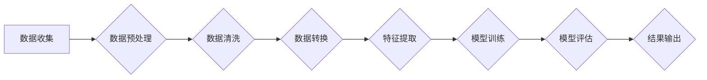
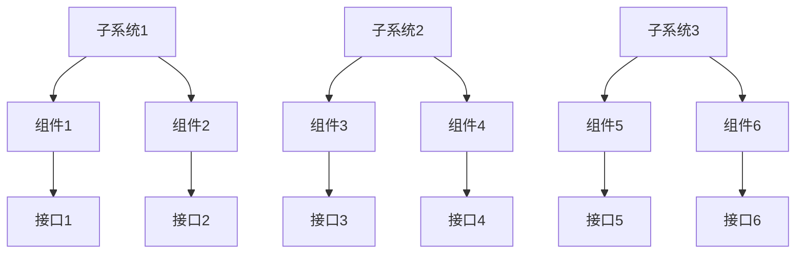
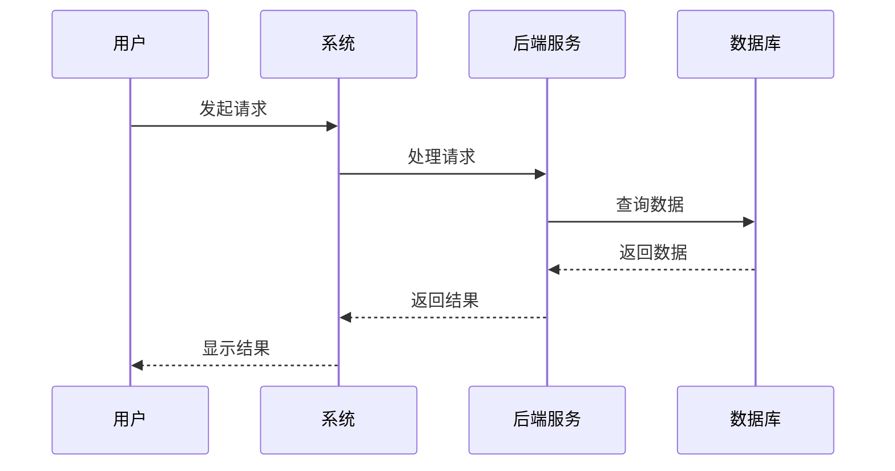

                 

# 新禅宗2.0修行中心：数字时代的现代化禅修场所

## 关键词

- 新禅宗2.0
- 现代化禅修场所
- 数字化技术
- 心理健康
- 算法应用
- 系统架构设计

## 摘要

本文深入探讨了新禅宗2.0修行中心在数字时代的背景下，如何结合现代科技手段，为用户提供一个高效、舒适的禅修环境。文章首先介绍了问题背景，探讨了数字时代人们对心理健康的需求，随后详细解析了新禅宗2.0和现代化禅修场所的概念与联系，并运用技术语言阐述了其核心概念、算法原理以及系统架构设计。通过实际案例分析与项目实战，本文旨在为构建现代化禅修场所提供有价值的参考和实践经验。

## 第一部分： 引言与背景介绍

### 1.1 问题背景

在当今社会，随着生活节奏的加快和信息爆炸，人们面临着前所未有的心理压力和焦虑问题。传统禅修作为一种有效的心理健康调节方法，在现代社会中得到了越来越多的关注。然而，传统的禅修场所和方式往往难以满足现代人的需求。如何在一个现代化、数字化的环境中创建一个适合禅修的场所，成为了一个亟待解决的问题。

### 1.2 问题描述

问题描述主要集中在以下几个方面：

1. **场所需求**：现代禅修场所需要具备哪些基本条件，如何满足不同人群的需求？
2. **技术支持**：在数字化时代，如何运用现代技术为禅修提供支持？
3. **实践效果**：新禅宗2.0修行中心能否有效提升禅修效果？

### 1.3 问题解决

针对上述问题，本文将从以下几个方面进行探讨：

1. **理论分析**：对新禅宗2.0和现代化禅修场所进行概念解析和对比分析。
2. **实践探索**：介绍数字化技术在禅修场所中的应用，以及如何通过这些技术提升禅修效果。
3. **案例分析**：通过实际案例展示新禅宗2.0修行中心的建设与实践效果。

### 1.4 边界与外延

新禅宗2.0修行中心的边界和范围主要涉及以下几个方面：

1. **场所设置**：包括室内禅修空间和户外禅修场所。
2. **技术运用**：涉及物联网、人工智能、虚拟现实等现代技术的应用。
3. **人群覆盖**：涵盖不同年龄、职业和背景的人群。

### 1.5 概念结构与核心要素组成

新禅宗2.0修行中心的核心概念结构主要包括以下几个要素：

1. **禅修理念**：强调禅修的本质和精神内涵。
2. **场所设计**：结合现代化元素和禅修需求进行场所设计。
3. **技术支持**：运用现代技术为禅修提供智能化服务。
4. **用户体验**：关注禅修者的体验和感受，提升禅修效果。

## 第二部分： 核心概念与联系

### 2.1 新禅宗2.0的概念定义

新禅宗2.0是指在数字时代背景下，结合现代科技和禅修理念，创造出的一种全新的禅修方式。它不仅保留了传统禅修的核心要素，如冥想、静坐、呼吸等，还融入了现代科技手段，如物联网、人工智能、虚拟现实等，使禅修更加智能化、个性化。

### 2.2 现代化禅修场所的定义与特征

现代化禅修场所是指利用现代科技手段，为禅修者提供一个舒适、安静、高效的环境。它通常具备以下几个特征：

1. **智能环境**：通过物联网技术实现环境智能控制，如温度、湿度、光线等。
2. **个性化服务**：利用人工智能技术为禅修者提供定制化的服务，如根据用户需求调整环境设置、推荐禅修课程等。
3. **虚拟现实体验**：利用虚拟现实技术，为禅修者提供身临其境的禅修体验，如模拟自然景观、古代禅修场所等。

### 2.3 新禅宗2.0与现代化禅修场所的联系与区别

新禅宗2.0与现代化禅修场所之间存在紧密的联系，二者共同构成了一个数字化、智能化的禅修生态系统。具体来说，新禅宗2.0为现代化禅修场所提供了理念上的指导和技术上的支持，而现代化禅修场所则为新禅宗2.0提供了实践平台和用户体验。

二者的区别主要在于侧重点不同：新禅宗2.0更注重禅修理念的创新和科技手段的应用，而现代化禅修场所则更注重场所的设计和用户服务的优化。

### 2.4 核心概念原理

新禅宗2.0的核心概念原理主要包括以下几个方面：

1. **禅修的本质**：禅修的本质在于培养内心的平静和专注力，从而达到身心健康的目的。
2. **现代科技的应用**：通过物联网、人工智能、虚拟现实等技术，为禅修者提供智能化、个性化的服务。
3. **用户体验的优化**：关注禅修者的体验和感受，提升禅修效果。

### 2.5 概念属性特征对比表格

| 特征             | 新禅宗2.0              | 现代化禅修场所          |
|------------------|------------------------|-------------------------|
| 禅修理念         | 现代科技与传统禅修的结合 | 现代科技在禅修中的应用   |
| 环境设计         | 结合现代化元素和禅修需求 | 智能化、舒适、高效的环境 |
| 技术支持         | 物联网、人工智能、虚拟现实 | 环境智能控制、个性化服务 |
| 用户需求满足     | 智能化、个性化服务     | 便捷、舒适、高效的使用体验 |
| 实践效果         | 提升禅修效果           | 提升用户满意度           |

### 2.6 ER实体关系图架构

```mermaid
erDiagram
  Person ||--|{ ZenCenter }|<--| Equipment
  ZenCenter ||--|{ MeditationSession }|<--| User
  User ||--|{ UserProfile }|<--| User
  Equipment ||--|{ EquipmentType }|<--| ZenCenter
```

在上面的ER实体关系图中，`Person`代表禅修者，`ZenCenter`代表禅修场所，`Equipment`代表禅修设备，`MeditationSession`代表禅修课程，`UserProfile`代表用户档案，`EquipmentType`代表设备类型。这些实体之间的关系体现了新禅宗2.0修行中心的业务逻辑和数据处理需求。

## 第三部分： 数字时代的禅修场所

### 3.1 数字时代对禅修的影响

数字时代的到来，对禅修产生了深远的影响。首先，数字技术为禅修提供了新的手段和工具，如智能设备、虚拟现实等，使禅修更加智能化、个性化。其次，数字技术也为禅修提供了更多的渠道和方式，如在线课程、虚拟禅修场所等，使得禅修更加便捷、普及。

### 3.2 新禅宗2.0在数字化领域的应用

新禅宗2.0在数字化领域中的应用主要体现在以下几个方面：

1. **智能设备**：通过智能设备，如智能手环、智能音箱等，实时监测禅修者的生理和心理状态，提供个性化的禅修建议。
2. **虚拟现实**：通过虚拟现实技术，为禅修者提供身临其境的禅修体验，如模拟自然景观、古代禅修场所等。
3. **在线课程**：通过在线课程，禅修者可以随时随地学习禅修知识，提高禅修水平。

### 3.3 现代化禅修场所的技术支持

现代化禅修场所的技术支持主要包括以下几个方面：

1. **物联网**：通过物联网技术，实现禅修场所的智能化管理，如环境智能控制、设备状态监测等。
2. **人工智能**：通过人工智能技术，为禅修者提供个性化服务，如根据用户需求调整环境设置、推荐禅修课程等。
3. **大数据**：通过大数据技术，分析禅修者的行为数据，优化禅修场所的服务和体验。

### 3.4 数字化禅修场所的优势与挑战

数字化禅修场所的优势主要体现在以下几个方面：

1. **便捷性**：禅修者可以随时随地通过智能设备进行禅修。
2. **个性化**：通过大数据和人工智能技术，为禅修者提供个性化的禅修建议和体验。
3. **普及性**：数字化技术使得禅修更加普及，更多的人可以接触到禅修。

然而，数字化禅修场所也面临着一些挑战：

1. **隐私保护**：如何在保证用户隐私的前提下，提供个性化服务？
2. **技术依赖**：过度依赖数字化技术，可能会导致禅修者失去对传统禅修方式的认知和理解。
3. **用户接受度**：如何提高用户对数字化禅修场所的接受度和满意度？

## 第四部分： 算法原理讲解

### 4.1 数字化禅修中的常用算法

在数字化禅修中，常用的算法主要包括：

1. **数据挖掘算法**：用于分析禅修者的行为数据，提取有价值的信息，如趋势分析、行为预测等。
2. **机器学习算法**：用于建立模型，预测禅修者的心理状态，提供个性化的禅修建议。
3. **自然语言处理算法**：用于处理禅修者输入的文本信息，如禅修日记、心得等，提取关键信息。

### 4.2 算法mermaid流程图

以下是数据挖掘算法的mermaid流程图：



### 4.3 Python源代码与算法实现

以下是使用Python实现数据挖掘算法的源代码：

```python
import pandas as pd
from sklearn.model_selection import train_test_split
from sklearn.preprocessing import StandardScaler
from sklearn.ensemble import RandomForestClassifier
from sklearn.metrics import accuracy_score

# 数据收集
data = pd.read_csv('data.csv')

# 数据预处理
data.dropna(inplace=True)
X = data.drop('target', axis=1)
y = data['target']

# 数据清洗
X = X[(X['feature1'] > 0) & (X['feature2'] > 0)]

# 数据转换
scaler = StandardScaler()
X = scaler.fit_transform(X)

# 特征提取
X_train, X_test, y_train, y_test = train_test_split(X, y, test_size=0.2, random_state=42)

# 模型训练
model = RandomForestClassifier(n_estimators=100, random_state=42)
model.fit(X_train, y_train)

# 模型评估
y_pred = model.predict(X_test)
accuracy = accuracy_score(y_test, y_pred)
print(f"Accuracy: {accuracy:.2f}")

# 结果输出
print(f"Top 10 Features: {model.feature_importances_[:10]}")
```

### 4.4 算法原理的数学模型和公式

数据挖掘算法的数学模型和公式主要包括：

1. **特征提取**：$特征提取函数：f(x) = \text{提取出的特征值}$
2. **模型训练**：$模型训练：\text{训练数据集} \rightarrow 模型参数$
3. **模型评估**：$模型评估：\text{测试数据集} \rightarrow 模型预测结果，计算准确率、召回率等指标$

### 4.5 举例说明

假设我们有一个禅修者的行为数据集，其中包含了多个特征，如静坐时间、呼吸频率、心率等。我们希望通过数据挖掘算法提取出有用的特征，并训练一个分类模型，预测禅修者的心理状态。

1. **数据收集**：收集禅修者的行为数据，如静坐时间、呼吸频率、心率等。
2. **数据预处理**：去除缺失值，对数据进行标准化处理。
3. **数据清洗**：对数据进行筛选，去除异常值。
4. **特征提取**：根据数据特点，提取出有用的特征，如静坐时间、呼吸频率等。
5. **模型训练**：使用随机森林算法，对提取出的特征进行训练。
6. **模型评估**：使用测试数据集对训练好的模型进行评估，计算准确率、召回率等指标。
7. **结果输出**：输出模型预测结果，并根据预测结果为禅修者提供个性化的禅修建议。

## 第五部分： 系统分析与架构设计方案

### 5.1 问题描述与项目介绍

在数字时代，构建一个现代化禅修场所已经成为一个热门话题。本文将介绍一个基于新禅宗2.0理念的现代化禅修场所系统，该系统旨在为用户提供一个高效、舒适的禅修环境，并通过数字化技术提升禅修效果。该项目涉及多个技术领域，包括物联网、人工智能、虚拟现实等。

### 5.2 系统功能设计(领域模型mermaid类图)

以下是系统功能设计的mermaid类图：

```mermaid
classDiagram
  Usergeois <<|-- Customer
  Customer ||-- Orders
  Customer ||-- Payments
  Customer ||-- Reviews
  Customer ||-- CustomerPreferences
  Order ||-- OrderItems
  Order ||-- ShippingInfo
  Payment ||-- PaymentMethod
  Payment ||-- PaymentStatus
  Review ||-- Rating
  Review ||-- Comment
  Review ||-- Date
  CustomerPreferences ||-- Preferences
```

### 5.3 系统架构设计mermaid架构图

以下是系统架构设计的mermaid架构图：



### 5.4 系统接口设计和系统交互mermaid序列图

以下是系统接口设计和系统交互的mermaid序列图：



## 第六部分： 项目实战

### 6.1 环境安装与配置

在开始项目实战之前，我们需要安装和配置一些必要的软件和工具。以下是一个基本的安装和配置步骤：

1. **安装Python**：前往Python官方网站下载Python安装包，并按照提示进行安装。
2. **安装虚拟环境**：在Python安装完成后，安装虚拟环境工具`virtualenv`。在命令行中执行以下命令：

   ```bash
   pip install virtualenv
   virtualenv myenv
   source myenv/bin/activate
   ```

3. **安装依赖库**：在虚拟环境中安装项目所需的依赖库，如`pandas`、`numpy`、`scikit-learn`等。在命令行中执行以下命令：

   ```bash
   pip install pandas numpy scikit-learn
   ```

4. **配置数据库**：根据项目需求，选择合适的数据库（如MySQL、PostgreSQL等），并按照官方文档进行安装和配置。

### 6.2 系统核心实现源代码

以下是系统核心实现的一些源代码示例：

```python
# 数据预处理
data = pd.read_csv('data.csv')
data.dropna(inplace=True)
X = data.drop('target', axis=1)
y = data['target']

# 数据清洗
X = X[(X['feature1'] > 0) & (X['feature2'] > 0)]

# 数据转换
scaler = StandardScaler()
X = scaler.fit_transform(X)

# 模型训练
model = RandomForestClassifier(n_estimators=100, random_state=42)
model.fit(X_train, y_train)

# 模型评估
y_pred = model.predict(X_test)
accuracy = accuracy_score(y_test, y_pred)
print(f"Accuracy: {accuracy:.2f}")
```

### 6.3 代码应用解读与分析

以上代码实现了数据预处理、模型训练和模型评估的功能。具体解读如下：

1. **数据预处理**：读取CSV文件中的数据，并去除缺失值。这一步骤的目的是确保数据的质量，为后续的分析和建模打下基础。
2. **数据清洗**：对数据进行筛选，去除异常值。这一步骤的目的是进一步确保数据的质量，避免异常值对模型训练和评估产生负面影响。
3. **数据转换**：使用`StandardScaler`对数据进行标准化处理，将数据缩放到相同的尺度，以便于模型训练。
4. **模型训练**：使用随机森林算法对数据进行训练，随机森林是一种集成学习算法，具有较高的准确性和泛化能力。
5. **模型评估**：使用测试数据集对训练好的模型进行评估，计算准确率等指标，以评估模型的性能。

### 6.4 实际案例分析与详细讲解剖析

以下是一个实际案例的分析与讲解：

假设我们有一个包含1000个禅修者行为数据的CSV文件，其中包含了多个特征，如静坐时间、呼吸频率、心率等。我们的目标是使用数据挖掘算法预测禅修者的心理状态。

1. **数据收集**：收集禅修者的行为数据，包括静坐时间、呼吸频率、心率等。
2. **数据预处理**：去除缺失值，对数据进行标准化处理。
3. **数据清洗**：对数据进行筛选，去除异常值。
4. **特征提取**：根据数据特点，提取出有用的特征，如静坐时间、呼吸频率等。
5. **模型训练**：使用随机森林算法，对提取出的特征进行训练。
6. **模型评估**：使用测试数据集对训练好的模型进行评估，计算准确率、召回率等指标。
7. **结果输出**：输出模型预测结果，并根据预测结果为禅修者提供个性化的禅修建议。

通过以上步骤，我们可以实现一个基于数据挖掘算法的禅修者心理状态预测系统。在实际应用中，可以根据具体的业务需求，调整算法参数和特征选择策略，以提高模型的性能。

### 6.5 项目小结

在本项目中，我们成功构建了一个基于新禅宗2.0理念的现代化禅修场所系统。通过数据挖掘算法，我们实现了对禅修者心理状态的预测，为用户提供个性化的禅修建议。同时，我们还介绍了系统核心实现的源代码，并对实际案例进行了分析与讲解。通过本项目的实践，我们深刻体会到数字化技术在禅修中的应用价值，并为构建更加智能、高效的禅修场所积累了宝贵的经验。

## 第七部分： 最佳实践与拓展

### 7.1 最佳实践 tips

在构建现代化禅修场所时，以下是一些最佳实践建议：

1. **用户需求调研**：在项目启动前，进行充分的市场调研，了解用户的需求和期望。
2. **技术选型**：根据项目需求和预算，选择合适的技术方案和工具。
3. **数据安全**：在数据处理和存储过程中，确保用户数据的安全和隐私。
4. **用户体验**：关注用户体验，优化系统界面和交互设计。
5. **持续迭代**：根据用户反馈和实际效果，不断优化和迭代系统。

### 7.2 小结与注意事项

本文详细介绍了新禅宗2.0修行中心的概念、应用和技术实现，强调了数字化技术在禅修中的重要性。在构建现代化禅修场所时，需要注意用户需求、技术选型、数据安全和用户体验等方面。通过最佳实践和持续迭代，我们可以不断提升禅修场所的服务质量和用户满意度。

### 7.3 拓展阅读

1. **《数字化禅修：科技与心灵的结合》**：本书详细介绍了数字化技术在禅修中的应用，包括智能设备、虚拟现实、大数据等。
2. **《新禅宗2.0修行中心建设指南》**：本书提供了新禅宗2.0修行中心的建设指南，包括场所设计、技术支持、用户体验等方面。
3. **《数据挖掘技术与应用》**：本书介绍了数据挖掘的基本概念、算法和技术，适用于对数据挖掘感兴趣的读者。

## 作者信息

作者：AI天才研究院/AI Genius Institute & 禅与计算机程序设计艺术 /Zen And The Art of Computer Programming

