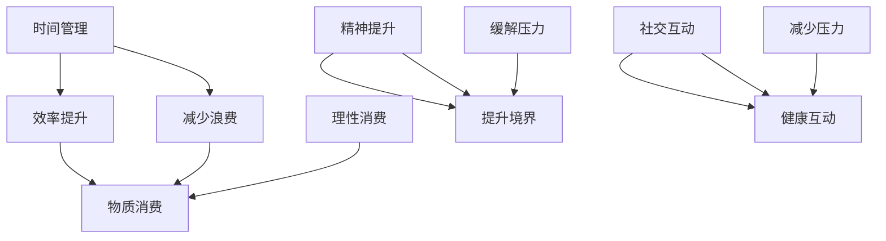
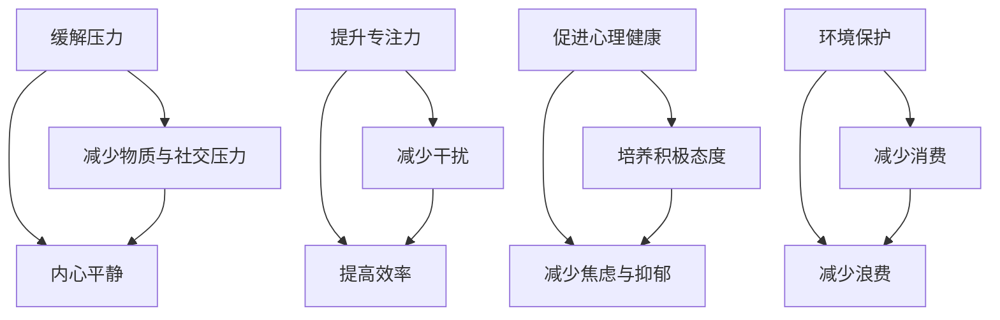

                 

# 新苦行者播客：记录现代克制生活的心得

## 关键词

现代克制生活、时间管理、心理健康、人际关系、工作与事业

## 摘要

本文旨在探讨现代克制生活的心得与实践，通过逻辑清晰、结构紧凑的篇章，引导读者理解克制生活的背景、核心原则以及在实际生活中的应用。本文分为三大部分：首先，介绍现代克制的背景与意义，阐述克制生活的起源与发展；其次，分析克制生活的核心原则，包括少即是多、自我克制与精神提升；最后，探讨克制生活在实际中的实践与影响，包括日常生活中的克制之道、心理调适以及社会影响。本文期望为读者提供有益的思考和启示，助力打造更加高效、健康和有意义的生活。

### 目录大纲

1. **第一部分：现代克制的背景与意义**
   1.1 现代克制的起源与发展
   1.2 克制生活的意义
   1.3 现代社会的挑战与问题
2. **第二部分：克制生活的核心原则**
   2.1 少即是多
   2.2 自我克制与精神提升
3. **第三部分：实践中的克制生活**
   3.1 现代克制的日常实践
   3.2 克制生活的心理调适
   3.3 克制生活与人际关系
   3.4 克制生活对工作与事业的启示
4. **第四部分：克制生活的未来展望**
   4.1 克制生活的社会趋势
   4.2 克制生活的持续实践

### 第一部分：现代克制的背景与意义

#### 第1章：现代克制的起源与发展

#### 1.1 现代社会的挑战与问题

在现代社会，我们面临诸多挑战和问题。科技的发展带来了便利，但同时也导致了信息过载、时间碎片化、社交压力增加等问题。人们往往在追求物质财富和成功的过程中，忽视了内心的需求和情感的满足。这导致了一系列心理和身体健康问题，如焦虑、抑郁、失眠等。

#### 1.1.1 现代生活方式的问题

现代生活方式的问题主要体现在以下几个方面：

1. **时间管理不当**：现代人的生活节奏加快，工作压力增大，导致时间管理不当。许多人处于“忙碌而空虚”的状态，没有时间陪伴家人、进行自我提升或休息。

2. **物质消费的过度**：现代社会倡导消费主义，人们往往追求物质上的满足，导致过度消费。这不仅增加了经济负担，还导致了环境问题和资源浪费。

3. **社交压力**：社交媒体的普及使人们感受到更多的社交压力。在虚拟世界中，人们往往表现出过度自信或过度自卑，真实的人际关系受到忽视。

#### 1.1.2 克制生活的意义

克制生活，即通过减少物质消费、合理安排时间、培养自律等手段，实现生活的简化与精神的提升。克制生活的意义在于：

1. **缓解压力**：通过克制生活，人们可以减少不必要的物质和社交压力，从而获得内心的平静和放松。

2. **提升专注力**：减少干扰和诱惑，有助于人们更好地专注于工作和学习，提高效率。

3. **促进心理健康**：克制生活有助于培养积极的生活态度和健康的心理状态，减少焦虑和抑郁的发生。

4. **环境保护**：减少物质消费和浪费，有助于保护环境，实现可持续发展。

#### 1.2 现代克制的起源与发展历程

克制生活的概念并非现代所独有，自古以来就有倡导简朴生活和克制的思想。然而，随着现代社会的发展，克制生活得到了更多的关注和实践。

1. **古代克制生活的思想**：在古代，许多哲学家和思想家如孔子、老子等，都提出了克制生活的思想。他们强调“知足常乐”、“少私寡欲”等观念，主张通过克制欲望来达到心灵的平和。

2. **现代克制生活的兴起**：20世纪以来，随着工业化和社会化进程的加快，人们开始反思现代生活方式的弊端，提倡回归自然、简化生活的理念。如“极简主义”（Minimalism）运动，倡导通过减少物质负担来追求精神上的富足。

3. **现代克制生活的理论体系**：现代克制生活逐渐形成了一套理论体系，包括时间管理、物质消费、精神提升等方面的实践原则。这些原则为人们提供了一种新的生活模式，旨在实现身心健康、环境可持续发展等目标。

### 第二部分：克制生活的核心原则

#### 第2章：克制生活的核心原则

克制生活的核心原则主要包括“少即是多”和“自我克制与精神提升”。以下将分别进行阐述。

#### 2.1 少即是多

“少即是多”是克制生活的一个重要原则，强调通过减少物质和信息的负担，实现生活质量的提升。

##### 2.1.1 简化生活的实践

简化生活，即减少不必要的物质和事务，使生活更加简单、高效。以下是一些简化生活的实践方法：

1. **整理与丢弃**：定期整理自己的物品，丢弃不再需要的物品，减少杂乱和负担。

2. **减少物质消费**：理性消费，避免盲目追求时尚和潮流，购买真正需要的物品。

3. **减少信息干扰**：避免过度关注社交媒体和新闻资讯，筛选有价值的信息，提高信息处理的效率。

##### 2.1.2 物质消费的反思

反思物质消费，即思考我们的消费行为背后的动机和价值观。以下是一些反思的方法：

1. **消费观念的转变**：从追求物质满足转向追求精神满足，关注内心的需求和成长。

2. **消费行为的反思**：在购买前，思考物品的实际用途和价值，避免冲动消费。

3. **环保意识的培养**：关注环境问题，选择环保、可持续的产品，减少对环境的负担。

#### 2.2 自我克制与精神提升

自我克制与精神提升是克制生活的另一个核心原则，强调通过自律和精神的修炼，提升个人的心理素质和生活质量。

##### 2.2.1 克服诱惑，培养自律

克服诱惑，培养自律，是实现自我克制的关键。以下是一些建议：

1. **设定目标与计划**：明确自己的目标，制定合理的计划，有助于克服拖延和诱惑。

2. **培养专注力**：通过练习冥想、专注训练等方法，提高专注力，减少分心。

3. **建立良好的生活习惯**：养成健康的生活习惯，如早起、锻炼、按时作息等，有助于保持自律。

##### 2.2.2 提升专注力与冥想

提升专注力与冥想，是精神提升的重要途径。以下是一些建议：

1. **练习冥想**：通过冥想，可以减少内心的杂念，提高专注力和精神集中度。

2. **专注力训练**：通过专注力训练游戏和练习，提高大脑的专注力和反应速度。

3. **环境调整**：创造一个有利于专注的环境，减少干扰因素，如关闭社交媒体、手机等。

### 第三部分：实践中的克制生活

#### 第3章：现代克制的日常实践

#### 3.1 时间管理与效率提升

时间管理是克制生活中的重要一环，通过有效的时间管理，可以提高生活效率，减少不必要的浪费。

##### 3.1.1 有效的时间管理方法

以下是一些有效的时间管理方法：

1. **优先级排序**：根据任务的紧急程度和重要性，对任务进行排序，先完成最重要和最紧急的任务。

2. **设定时间限制**：为每个任务设定一个完成时间，以激发效率。

3. **避免拖延**：制定明确的计划和目标，避免拖延和浪费时间。

##### 3.1.2 建立良好的工作与休息习惯

建立良好的工作与休息习惯，有助于提高工作效率，保持身心健康。以下是一些建议：

1. **定时休息**：每工作一段时间后，进行短暂的休息，如起身活动、喝水等。

2. **合理规划工作与休息时间**：合理安排工作时间和休息时间，避免过度劳累。

3. **避免过度加班**：保持健康的生活节奏，避免过度加班，保证充足的休息。

#### 3.2 日常生活中的克制之道

日常生活中的克制之道，体现在对物质消费、社交活动和信息获取等方面的节制。

##### 3.2.1 简化生活方式

简化生活方式，意味着减少不必要的物质和事务，使生活更加简单、高效。以下是一些建议：

1. **减少物质负担**：通过整理和丢弃不必要的物品，减轻物质负担。

2. **减少社交活动**：理性选择社交活动，避免不必要的应酬和聚会。

3. **减少信息干扰**：减少对社交媒体和新闻资讯的关注，关注有价值的信息。

##### 3.2.2 减少电子产品的依赖

减少电子产品的依赖，有助于提升专注力和生活质量。以下是一些建议：

1. **合理使用电子产品**：避免过度使用电子产品，如手机、电脑等。

2. **设定使用时间**：为电子产品的使用设定时间限制，避免沉迷。

3. **培养电子产品的替代品**：通过运动、阅读、社交等活动，减少对电子产品的依赖。

### 第4章：克制生活的心理调适

#### 4.1 克制生活与心理健康

克制生活对心理健康具有积极的影响，以下将介绍克制生活对心理健康的影响以及如何克服心理障碍。

##### 4.1.1 克制生活对心理健康的影响

1. **减轻焦虑和压力**：通过减少物质和信息的负担，克制生活有助于减轻焦虑和压力，提高生活质量。

2. **提高专注力和记忆力**：减少干扰和诱惑，有助于提高专注力和记忆力，提升学习工作效率。

3. **增强自我控制力**：通过自我克制，培养自律和自我控制力，有助于提升个人的心理素质。

##### 4.1.2 克服心理障碍的方法

1. **积极面对问题**：面对心理障碍，要积极寻求解决方案，而不是逃避或压抑。

2. **寻求专业帮助**：如果心理障碍较为严重，可以寻求心理咨询师或心理医生的帮助。

3. **培养良好的生活习惯**：通过建立良好的生活习惯，如定时作息、合理饮食、适量运动等，有助于提升心理健康。

#### 4.2 克制生活中的情绪管理

情绪管理是克制生活的重要组成部分，以下将介绍如何进行情绪管理。

##### 4.2.1 情绪的调节与释放

1. **情绪调节**：通过自我反思和情绪管理技巧，如深呼吸、冥想等，调节情绪。

2. **情绪释放**：找到合适的渠道释放情绪，如与朋友倾诉、写日记、运动等。

##### 4.2.2 培养积极的生活态度

1. **积极思考**：培养积极思考的习惯，关注事物的积极面，减少负面情绪的影响。

2. **感恩与回馈**：培养感恩的心态，关注他人的需求，积极参与公益活动，提升幸福感。

### 第5章：克制生活与人际关系

#### 5.1 克制生活对人际交往的影响

克制生活对人际交往具有积极的影响，以下将介绍克制生活对人际交往的影响以及如何建立健康的社交网络。

##### 5.1.1 建立健康的社交网络

1. **理性选择社交关系**：建立真实的社交关系，避免盲目追求社交数量。

2. **维护良好的人际关系**：保持诚信、尊重和理解，维护良好的人际关系。

3. **学会拒绝**：合理拒绝不健康或不必要的社交邀请，避免消耗过多的时间和精力。

##### 5.1.2 克制生活下的沟通艺术

1. **有效沟通**：提高沟通能力，学会倾听和表达，建立有效的沟通渠道。

2. **非语言沟通**：注意身体语言和表情的传达，提升沟通效果。

3. **真诚待人**：真诚对待他人，建立互信和尊重的沟通基础。

### 第6章：克制生活对工作与事业的启示

#### 6.1 克制生活与职场发展

克制生活对职场发展具有积极的影响，以下将介绍克制生活对职场发展的影响以及如何提升工作效率。

##### 6.1.1 提升工作效率的方法

1. **合理规划工作**：合理安排工作计划，避免拖延和浪费时间。

2. **专注工作**：减少干扰，提高专注力，提升工作效率。

3. **定期反思**：定期对自己的工作方法和效率进行反思，找到改进的空间。

##### 6.1.2 克制生活对职场心态的塑造

1. **保持平和心态**：克制生活有助于保持平和的心态，减少职场压力。

2. **培养团队合作精神**：克制生活培养出的自律和专注力，有助于提升团队合作精神。

3. **积极面对挑战**：克制生活培养出的积极心态，有助于积极面对职场挑战。

### 第7章：克制生活的未来展望

#### 7.1 克制生活的社会趋势

随着社会的发展，克制生活逐渐成为一种趋势，以下将介绍克制生活的社会趋势以及其对未来的影响。

##### 7.1.1 现代社会的克制生活需求

1. **心理健康需求**：现代社会竞争激烈，心理健康问题日益突出，克制生活有助于缓解心理压力。

2. **环境保护需求**：环境问题日益严重，克制生活有助于减少资源浪费，实现可持续发展。

3. **生活质量需求**：人们逐渐意识到，物质财富并非幸福的唯一来源，克制生活有助于提升生活质量。

##### 7.1.2 克制生活对未来的影响

1. **社会进步**：克制生活有助于提高社会的整体幸福感，促进社会进步。

2. **经济转型**：克制生活倡导减少物质消费，有助于推动经济结构的转型，实现可持续发展。

3. **环境保护**：克制生活有助于减少环境污染，保护生态环境，实现生态文明建设。

### 结语

总之，克制生活是一种积极的生活态度和实践，通过减少物质和信息的负担，提升精神质量和生活质量。本文从背景、原则、实践和展望四个方面，探讨了现代克制生活的心得与实践。期望读者通过本文的阅读，能够对克制生活有更深刻的理解和认识，并将其融入到自己的生活中，实现更加高效、健康和有意义的人生。

### 作者信息

作者：AI天才研究院/AI Genius Institute & 禅与计算机程序设计艺术 /Zen And The Art of Computer Programming

**[全文结束]**## 第一部分：现代克制的背景与意义

### 第1章：现代克制的起源与发展

#### 1.1 现代社会的挑战与问题

现代社会的发展带来了前所未有的物质繁荣，但同时也伴随着一系列的问题和挑战。这些问题不仅影响了人们的生活质量，还对心理健康、社会稳定和环境可持续性构成了严峻的考验。

**核心概念术语说明：**
- **物质繁荣**：指社会经济快速发展，物质财富显著增加的现象。
- **心理健康问题**：包括焦虑、抑郁、失眠等心理障碍。
- **社会稳定**：指社会秩序和谐，人民安居乐业的状态。
- **环境可持续性**：指在满足当前需求的同时，不损害后代满足自身需求的能力。

**问题背景：**
随着工业化、信息化和全球化的推进，人们的生活节奏加快，工作压力增大，生活节奏变得更加紧张。这种快速变化的社会环境给人们带来了诸多困扰。

**问题描述：**
现代生活方式中存在的主要问题包括：

1. **时间管理不当**：现代人的工作时间延长，生活节奏加快，导致时间管理不当。许多人忙于工作和社交活动，没有足够的时间进行自我提升和休息。
2. **物质消费过度**：消费主义文化盛行，人们往往追求物质上的满足，导致过度消费。这不仅增加了经济负担，还导致了环境问题和资源浪费。
3. **社交压力**：社交媒体的普及使人们感受到更多的社交压力。在虚拟世界中，人们往往表现出过度自信或过度自卑，真实的人际关系受到忽视。

**问题解决：**
针对上述问题，现代克制生活提供了一种解决方案。通过简化生活、合理安排时间和物质消费，现代克制生活旨在帮助人们缓解压力，提升生活质量。

**边界与外延：**
现代克制生活不仅关注个人的心理健康和物质消费，还涉及社会和环境可持续性。它不仅仅是一种生活方式，更是一种社会运动，旨在推动社会的全面进步。

**概念结构与核心要素组成：**
现代克制生活由以下几个核心要素组成：

1. **时间管理**：合理安排时间，提高效率。
2. **物质消费**：理性消费，减少浪费。
3. **精神提升**：通过冥想、阅读等手段，提升精神境界。
4. **社交互动**：建立健康的社交网络，减少社交压力。

**核心概念与联系：**

| 核心概念 | 概念属性特征对比表格 |
|----------|---------------------|
| 时间管理 | 提高效率，减少浪费 |
| 物质消费 | 理性消费，减少浪费 |
| 精神提升 | 提升境界，缓解压力 |
| 社交互动 | 健康互动，减少压力 |

**ER实体关系图架构的 Mermaid 流程图：**

#### 1.2 现代克制的起源与发展历程

现代克制生活的概念并非现代所独有，自古以来就有倡导简朴生活和克制的思想。然而，随着现代社会的发展，克制生活得到了更多的关注和实践。

**古代克制生活的思想：**
在古代，许多哲学家和思想家如孔子、老子等，都提出了克制生活的思想。他们强调“知足常乐”、“少私寡欲”等观念，主张通过克制欲望来达到心灵的平和。

- **孔子**：“君子食无求饱，居无求安，敏于事而慎于言。”
- **老子**：“少私寡欲，虚其心，实其腹。”

**现代克制生活的兴起：**
20世纪以来，随着工业化和社会化进程的加快，人们开始反思现代生活方式的弊端，提倡回归自然、简化生活的理念。如“极简主义”（Minimalism）运动，倡导通过减少物质负担来追求精神上的富足。

**现代克制生活的理论体系：**
现代克制生活逐渐形成了一套理论体系，包括时间管理、物质消费、精神提升等方面的实践原则。这些原则为人们提供了一种新的生活模式，旨在实现身心健康、环境可持续发展等目标。

- **时间管理**：通过合理安排时间，提高效率，减少无谓的浪费。
- **物质消费**：理性消费，避免过度消费，减少对环境的负担。
- **精神提升**：通过冥想、阅读等手段，提升精神境界，缓解压力。

**早期倡导者的探索：**
在现代克制生活的兴起过程中，一些早期的倡导者发挥了重要作用。他们通过实践和理论探讨，推动了克制生活的发展。

- **乔纳森·海特**（Jonathan Haidt）：心理学家，提倡通过减少物质消费来提高幸福感。
- **加里·克莱因**（Gary Klein）：认知科学家，研究时间管理和决策过程。

**现代克制的理论体系：**
现代克制生活的理论体系主要包括以下几个方面：

1. **极简主义**：主张通过减少物质负担，追求精神上的富足。
2. **断舍离**：日本管理学家山下英子的理论，提倡通过整理和丢弃不必要的物品，实现生活的简化。
3. **多任务处理**：通过合理安排任务，提高工作效率，减少拖延。

**现代克制生活的发展：**
随着社会的进步和人们对生活质量要求的提高，现代克制生活得到了更多人的关注和实践。人们开始意识到，克制生活不仅有助于个人的身心健康，还能促进社会和环境的可持续发展。

- **社会运动**：如“极简主义”、“生态生活”等社会运动，推动了克制生活理念的普及和实践。
- **个人实践**：越来越多的人开始尝试简化生活，减少物质消费，提升精神境界。

#### 1.3 克制生活的意义

克制生活，即通过减少物质消费、合理安排时间、培养自律等手段，实现生活的简化与精神的提升。克制生活的意义在于：

1. **缓解压力**：通过克制生活，人们可以减少不必要的物质和社交压力，从而获得内心的平静和放松。
2. **提升专注力**：减少干扰和诱惑，有助于人们更好地专注于工作和学习，提高效率。
3. **促进心理健康**：克制生活有助于培养积极的生活态度和健康的心理状态，减少焦虑和抑郁的发生。
4. **环境保护**：减少物质消费和浪费，有助于保护环境，实现可持续发展。

**核心概念与联系：**

| 核心概念 | 概念属性特征对比表格 |
|----------|---------------------|
| 缓解压力 | 减少物质与社交压力 |
| 提升专注力 | 减少干扰，提高效率 |
| 促进心理健康 | 培养积极态度，减少焦虑 |
| 环境保护 | 减少消费，减少浪费 |

**ER实体关系图架构的 Mermaid 流程图：**

### 第二部分：克制生活的核心原则

#### 第2章：克制生活的核心原则

克制生活的核心原则主要包括“少即是多”和“自我克制与精神提升”。以下将分别进行阐述。

#### 2.1 少即是多

“少即是多”是克制生活的一个重要原则，强调通过减少物质和信息的负担，实现生活质量的提升。

##### 2.1.1 简化生活的实践

简化生活，即减少不必要的物质和事务，使生活更加简单、高效。以下是一些简化生活的实践方法：

1. **整理与丢弃**：定期整理自己的物品，丢弃不再需要的物品，减少杂乱和负担。
    - **实践步骤**：
        1. 清空所有物品，将它们分类放置。
        2. 对每一类物品进行评估，判断其是否真正需要。
        3. 对于不再需要的物品，妥善处理，如捐赠、出售或丢弃。

2. **减少物质消费**：理性消费，避免盲目追求时尚和潮流，购买真正需要的物品。
    - **实践步骤**：
        1. 制定购物清单，明确购买目标。
        2. 在购买前，思考物品的实际用途和价值。
        3. 避免冲动消费，理性决策。

3. **减少信息干扰**：避免过度关注社交媒体和新闻资讯，筛选有价值的信息，提高信息处理的效率。
    - **实践步骤**：
        1. 设定每日信息处理时间，避免无限制地浏览。
        2. 使用信息过滤工具，屏蔽不必要的信息。
        3. 定期清理邮件和社交媒体，保持信息流通的畅通。

##### 2.1.2 物质消费的反思

反思物质消费，即思考我们的消费行为背后的动机和价值观。以下是一些反思的方法：

1. **消费观念的转变**：从追求物质满足转向追求精神满足，关注内心的需求和成长。
    - **实践步骤**：
        1. 确定自己的核心价值观，明确生活中的真正需求。
        2. 避免被消费主义文化所诱导，坚持自己的消费原则。
        3. 定期反思自己的消费行为，确保其与自己的价值观相符。

2. **消费行为的反思**：在购买前，思考物品的实际用途和价值，避免冲动消费。
    - **实践步骤**：
        1. 设定购买时间间隔，避免冲动消费。
        2. 对每个购买决策进行评估，确保其符合实际需求。
        3. 避免购买即时满足的物品，考虑长远价值和实用性。

3. **环保意识的培养**：关注环境问题，选择环保、可持续的产品，减少对环境的负担。
    - **实践步骤**：
        1. 了解环保知识，明确环保的重要性和紧迫性。
        2. 选择环保产品，如可回收材料、节能电器等。
        3. 鼓励家人和朋友参与环保活动，共同推动环保意识的普及。

#### 2.2 自我克制与精神提升

自我克制与精神提升是克制生活的另一个核心原则，强调通过自律和精神的修炼，提升个人的心理素质和生活质量。

##### 2.2.1 克服诱惑，培养自律

克服诱惑，培养自律，是实现自我克制的关键。以下是一些建议：

1. **设定目标与计划**：明确自己的目标，制定合理的计划，有助于克服拖延和诱惑。
    - **实践步骤**：
        1. 确定短期和长期目标，确保其具体、可衡量。
        2. 制定详细的行动计划，明确每个阶段的任务。
        3. 定期检查进度，调整计划，确保目标的实现。

2. **培养专注力**：通过练习冥想、专注训练等方法，提高专注力，减少分心。
    - **实践步骤**：
        1. 每日设定固定的冥想时间，练习专注。
        2. 通过专注力训练游戏，提升专注力。
        3. 在工作和学习过程中，保持专注，避免分心。

3. **建立良好的生活习惯**：养成健康的生活习惯，如早起、锻炼、按时作息等，有助于保持自律。
    - **实践步骤**：
        1. 设定固定的作息时间，确保充足的休息。
        2. 每日进行适量的运动，保持身体健康。
        3. 避免过度使用电子产品，保证良好的作息习惯。

##### 2.2.2 提升专注力与冥想

提升专注力与冥想，是精神提升的重要途径。以下是一些建议：

1. **练习冥想**：通过冥想，可以减少内心的杂念，提高专注力和精神集中度。
    - **实践步骤**：
        1. 每日设定固定的冥想时间，保持持续性。
        2. 选择安静的环境，避免外界干扰。
        3. 通过深呼吸、冥想音乐等辅助手段，提高冥想效果。

2. **专注力训练**：通过专注力训练游戏和练习，提高大脑的专注力和反应速度。
    - **实践步骤**：
        1. 定期进行专注力训练，如专注力游戏、专注力工作表等。
        2. 通过多任务处理练习，提升大脑的灵活性和专注力。
        3. 在工作和学习过程中，定期进行专注力练习，保持专注。

3. **环境调整**：创造一个有利于专注的环境，减少干扰因素，如关闭社交媒体、手机等。
    - **实践步骤**：
        1. 确保工作环境的整洁和舒适。
        2. 避免在嘈杂的环境中工作或学习。
        3. 使用屏蔽软件或应用程序，减少电子产品的干扰。

### 第三部分：实践中的克制生活

#### 第3章：现代克制的日常实践

在现代生活中，实践克制生活是一种智慧的选择，它不仅能帮助我们缓解压力，还能提高生活质量。本章将探讨如何将克制生活原则应用到日常生活中，以实现身心健康和效率提升。

##### 3.1 时间管理与效率提升

时间管理是现代克制生活的重要组成部分，通过合理安排时间，我们可以提高效率，减少不必要的浪费。

###### 3.1.1 有效的时间管理方法

有效的时间管理不仅有助于我们更好地完成工作任务，还能让我们有更多的时间去享受生活。以下是一些有效的时间管理方法：

1. **制定日程表**：
   - **实践步骤**：
     1. 每周开始时，制定一个详细的日程表，列出每天需要完成的任务。
     2. 为每个任务分配具体的时间，确保任务按时完成。
     3. 每天结束时，回顾日程表，评估时间使用情况，并调整下周的计划。

2. **设定优先级**：
   - **实践步骤**：
     1. 根据任务的重要性和紧急程度，将任务分为四个象限：重要且紧急、重要但不紧急、不重要但紧急、不重要且不紧急。
     2. 优先处理重要且紧急的任务，其次处理重要但不紧急的任务。
     3. 避免过多处理不重要但紧急的任务，尽量将其减少或转移。

3. **避免拖延**：
   - **实践步骤**：
     1. 设定明确的目标和截止日期，以激发行动力。
     2. 使用番茄工作法（Pomodoro Technique），将工作分为25分钟的工作周期，每个周期后休息5分钟。
     3. 在工作开始前，清理工作环境，避免干扰。

4. **委托和授权**：
   - **实践步骤**：
     1. 明确自己的核心任务和职责，将非核心任务委托给他人。
     2. 培养团队协作精神，确保任务的高效完成。
     3. 定期评估委托任务的效果，及时调整和改进。

###### 3.1.2 建立良好的工作与休息习惯

良好的工作与休息习惯对于提高工作效率和保持身心健康至关重要。以下是一些建议：

1. **规律作息**：
   - **实践步骤**：
     1. 保持每天固定的起床和睡觉时间，确保充足的睡眠。
     2. 避免熬夜，保证第二天的精神状态。
     3. 利用周末时间进行休息和放松，恢复精力。

2. **定时休息**：
   - **实践步骤**：
     1. 每工作一段时间后，进行短暂的休息，如起身活动、做深呼吸等。
     2. 每天安排固定的休息时间，如午休、晚上休息等。
     3. 使用休息时间进行轻松的活动，如阅读、听音乐等。

3. **避免过度加班**：
   - **实践步骤**：
     1. 设定每日工作时间上限，避免长时间工作导致的疲劳。
     2. 尽量在规定时间内完成任务，提高工作效率。
     3. 如有必要加班，确保加班后的休息时间得到补充。

##### 3.2 日常生活中的克制之道

在日常生活中，通过克制物质消费、减少社交活动、关注内心需求等方式，我们可以实现生活的简化与精神的提升。

###### 3.2.1 简化生活方式

简化生活方式意味着减少不必要的物质和事务，使生活更加简单、高效。以下是一些实践方法：

1. **减少物质负担**：
   - **实践步骤**：
     1. 定期整理物品，丢弃不再需要的物品。
     2. 购买前考虑物品的实际用途和价值，避免冲动消费。
     3. 选择环保、可持续的产品，减少对环境的负担。

2. **减少社交活动**：
   - **实践步骤**：
     1. 理性选择社交活动，避免不必要的应酬。
     2. 保持高质量的社交关系，减少无谓的社交耗费。
     3. 利用社交时间进行有意义的互动，提升人际关系的质量。

3. **关注内心需求**：
   - **实践步骤**：
     1. 确定自己的核心价值观和目标，明确生活中的真正需求。
     2. 避免被物质和社会标准所诱导，坚持自己的价值观。
     3. 定期反思和调整自己的生活方式，确保其与内心的需求相符。

###### 3.2.2 减少电子产品的依赖

在现代社会，电子产品已经成为了我们生活中不可或缺的一部分。然而，过度依赖电子产品也会给我们带来一系列问题。以下是一些减少电子产品依赖的方法：

1. **设定使用时间**：
   - **实践步骤**：
     1. 设定每日使用电子产品的时间上限，如每天不超过2小时。
     2. 在使用电子产品时，设定明确的目标和任务，避免无目的的浏览和浪费时间。
     3. 使用应用程序或功能，如屏幕时间限制，帮助自己控制使用时间。

2. **创造替代活动**：
   - **实践步骤**：
     1. 在空闲时间，选择其他活动替代使用电子产品，如阅读、运动、绘画等。
     2. 与家人和朋友面对面交流，减少对电子社交的依赖。
     3. 在休息日或假期，远离电子产品，享受自然和宁静的生活。

3. **培养自律**：
   - **实践步骤**：
     1. 明确自己的目标和价值观，确保电子产品的使用与这些目标相符。
     2. 避免在床上使用电子产品，减少睡前蓝光的干扰。
     3. 定期检查自己的电子产品使用情况，评估其对自己的生活和工作的影响，并做出相应的调整。

### 第4章：克制生活的心理调适

#### 4.1 克制生活与心理健康

克制生活对心理健康具有积极的影响，它能够帮助我们减少压力、焦虑和抑郁等心理问题。以下将探讨克制生活对心理健康的影响以及如何通过心理调适来实践克制生活。

##### 4.1.1 克制生活对心理健康的影响

1. **减轻焦虑和压力**：
   - **影响分析**：通过减少物质和信息的负担，克制生活有助于减轻焦虑和压力。物质消费的减少使人们不再为物质财富而焦虑，信息筛选则使人们能够专注于重要信息，减少信息过载带来的压力。
   - **案例说明**：一个长期处于购物狂欢中的年轻人，通过实践极简主义，减少了购物行为和信息摄入，最终显著减轻了焦虑和压力。

2. **提升专注力和记忆力**：
   - **影响分析**：减少干扰和诱惑，有助于人们更好地专注于工作和学习，提高专注力和记忆力。通过设定时间管理和目标，人们能够更高效地完成任务，保持专注。
   - **案例说明**：一位办公室职员通过实施番茄工作法，将工作分为25分钟的高效工作周期，每个周期后进行短暂休息，显著提升了工作专注力和效率。

3. **促进心理健康**：
   - **影响分析**：克制生活有助于培养积极的生活态度和健康的心理状态。通过自我克制，人们能够更好地控制情绪，减少焦虑和抑郁的发生。
   - **案例说明**：一位长期感到焦虑和抑郁的职场人士，通过练习冥想和自我反思，逐渐建立了良好的心理调节机制，显著改善了心理健康状态。

##### 4.1.2 克服心理障碍的方法

1. **积极面对问题**：
   - **实践步骤**：
     1. 遇到问题时，首先要认识到问题的存在，并积极寻找解决方案。
     2. 不要逃避或压抑问题，而是要勇敢面对，采取行动。
     3. 学会从问题中学习和成长，将其视为成长的机会。

2. **寻求专业帮助**：
   - **实践步骤**：
     1. 如果心理障碍较为严重，建议寻求心理咨询师或心理医生的帮助。
     2. 通过专业的心理治疗，如认知行为疗法（CBT）、心理咨询等，找到解决问题的有效方法。
     3. 建立良好的医患关系，确保信息的充分沟通和治疗的顺利进行。

3. **培养良好的生活习惯**：
   - **实践步骤**：
     1. 保持规律的作息，确保充足的睡眠。
     2. 每日进行适量的运动，如散步、瑜伽等，促进身体健康。
     3. 饮食均衡，避免过度依赖咖啡因和糖分，保持身体的活力。

##### 4.2 克制生活中的情绪管理

情绪管理是克制生活中不可或缺的一部分，它有助于我们更好地应对生活中的挑战和压力。以下将探讨如何进行情绪管理以及如何在克制生活中培养积极的生活态度。

##### 4.2.1 情绪的调节与释放

1. **情绪调节**：
   - **实践步骤**：
     1. 学会认识自己的情绪，了解情绪的来源和影响。
     2. 通过深呼吸、冥想等放松技巧，缓解紧张和焦虑情绪。
     3. 使用积极思维，将消极情绪转化为积极的行动动力。

2. **情绪释放**：
   - **实践步骤**：
     1. 找到适合自己的情绪释放方式，如运动、写日记、绘画等。
     2. 与信任的朋友或家人分享自己的情绪，获得情感支持和理解。
     3. 保持开放的沟通渠道，避免情绪的累积和压抑。

##### 4.2.2 培养积极的生活态度

1. **积极思考**：
   - **实践步骤**：
     1. 将注意力集中在事物的积极面，学会从挑战中寻找机遇。
     2. 避免过度自我批评，学会接受自己的不足，并从中学习和成长。
     3. 培养乐观的心态，相信困难是暂时的，只要坚持就能克服。

2. **感恩与回馈**：
   - **实践步骤**：
     1. 每日记录感恩的事项，增强对生活的满足感。
     2. 积极参与公益活动，回馈社会，提升自己的幸福感。
     3. 与他人建立真诚的关系，分享快乐和困难，培养积极的社交网络。

### 第三部分：克制生活与人际关系

#### 第5章：克制生活与人际关系

克制生活不仅影响个人的生活质量和心理健康，还对人际关系产生深远的影响。通过实践克制生活原则，我们可以建立更加健康和有意义的人际关系。

##### 5.1 克制生活对人际交往的影响

克制生活有助于改善人际关系，主要体现在以下几个方面：

1. **增强沟通能力**：
   - **影响分析**：通过克制生活的实践，人们能够更好地专注于沟通，减少分心和干扰，从而提高沟通效果。
   - **案例说明**：一位经常被手机干扰的职场人士，通过减少对电子产品的依赖，与家人和朋友进行面对面的沟通，显著改善了沟通效果。

2. **减少社交压力**：
   - **影响分析**：通过减少不必要的社交活动，人们可以专注于高质量的人际交往，减少社交压力和疲惫。
   - **案例说明**：一位习惯于频繁参加社交活动的企业家，通过减少应酬，将精力投入到有意义的人际关系中，建立了更加稳固和有价值的人际网络。

3. **建立健康的社交网络**：
   - **影响分析**：克制生活强调理性选择社交关系，建立真实的社交网络，避免无谓的社交消耗。
   - **案例说明**：一位热衷于社交的年轻人，通过实践克制生活原则，减少了无意义的社交活动，专注于与真正重要的朋友和家人建立深厚的联系。

##### 5.1.1 建立健康的社交网络

建立健康的社交网络是实现克制生活目标的重要一环。以下是一些建议：

1. **理性选择社交关系**：
   - **实践步骤**：
     1. 确定自己的社交目标，明确哪些人际关系对自己有益。
     2. 避免盲目追求社交数量，关注社交质量。
     3. 与那些能够相互支持和成长的人建立深层次的联系。

2. **维护良好的人际关系**：
   - **实践步骤**：
     1. 保持诚信和尊重，建立互信和尊重的沟通基础。
     2. 定期与亲朋好友进行联系，分享生活中的喜悦和困扰。
     3. 在他人需要帮助时，主动提供支持，建立互助关系。

3. **学会拒绝**：
   - **实践步骤**：
     1. 学会合理拒绝不必要的社交邀请，保护自己的时间和精力。
     2. 在拒绝时，表达自己的真实感受和理由，避免伤害对方的感情。
     3. 寻找合适的替代方案，如推荐他人或安排其他时间进行交流。

##### 5.1.2 克制生活下的沟通艺术

1. **有效沟通**：
   - **实践步骤**：
     1. 提高倾听能力，理解对方的观点和需求。
     2. 学会表达自己的观点和感受，清晰明了。
     3. 使用非语言沟通技巧，如肢体语言、面部表情等，增强沟通效果。

2. **非语言沟通**：
   - **实践步骤**：
     1. 注意自己的肢体语言和表情，确保其与口头表达一致。
     2. 避免在沟通中过度使用手机或其他电子设备，确保全情投入。
     3. 在沟通中保持眼神接触，增强互动性和信任感。

3. **真诚待人**：
   - **实践步骤**：
     1. 真诚对待他人，保持诚实和透明。
     2. 尊重他人的观点和感受，避免批评和指责。
     3. 建立互信和尊重的基础，促进长期稳定的人际关系。

##### 5.2 克制生活与社区建设

克制生活不仅对个人和人际关系产生影响，还对社区建设具有积极的作用。以下将探讨如何通过克制生活原则来促进社区建设。

##### 5.2.1 社区共建的实践

1. **参与社区活动**：
   - **实践步骤**：
     1. 积极参与社区的公共活动，如社区清洁、志愿服务等。
     2. 与邻居建立友好的关系，分享资源和信息。
     3. 鼓励家人和朋友参与社区活动，共同营造和谐的社区氛围。

2. **建立互助网络**：
   - **实践步骤**：
     1. 在社区内建立互助小组，提供各种形式的支持和服务。
     2. 与邻居建立互帮互助的关系，共同解决社区问题。
     3. 鼓励社区成员参与决策过程，共同规划社区的发展方向。

3. **培育社区文化**：
   - **实践步骤**：
     1. 弘扬社区的传统和文化，增强社区认同感。
     2. 组织社区文化节、讲座等活动，促进文化多样性和交流。
     3. 倡导环保、公益等理念，推动社区价值观的升级和提升。

##### 5.2.2 社区文化的培育

1. **文化传承**：
   - **实践步骤**：
     1. 通过节日庆典、传统习俗等方式，传承和弘扬社区文化。
     2. 鼓励社区成员参与文化创作和传播，如绘画、音乐、舞蹈等。
     3. 利用社区媒体，如社区网站、社交媒体等，宣传社区文化。

2. **文化交流**：
   - **实践步骤**：
     1. 组织文化交流活动，如文化展览、讲座等，促进不同文化之间的了解和尊重。
     2. 邀请外部专家和文化代表参与社区活动，丰富社区文化内涵。
     3. 建立文化共享平台，如社区图书馆、文化活动室等，方便居民学习和交流。

3. **文化创新**：
   - **实践步骤**：
     1. 鼓励社区成员提出文化创新的想法和建议，推动社区文化的发展。
     2. 利用现代科技手段，如互联网、社交媒体等，创新社区文化表现形式。
     3. 组织文化创新活动，如创意工作坊、创新挑战赛等，激发社区文化活力。

### 第6章：克制生活对工作与事业的启示

#### 6.1 克制生活与职场发展

在现代职场中，克制生活对工作效率、职业发展和职场心态具有积极的影响。通过实践克制生活原则，我们可以实现职场目标，提升职业成就。

##### 6.1.1 提升工作效率的方法

1. **合理规划工作**：
   - **实践步骤**：
     1. 制定详细的工作计划，明确每日、每周和每月的工作任务。
     2. 根据任务的紧急程度和重要性，优先处理关键任务。
     3. 避免同时处理多个任务，保持专注和高效。

2. **专注工作**：
   - **实践步骤**：
     1. 减少干扰，关闭社交媒体和手机通知。
     2. 使用番茄工作法等专注技巧，提高工作集中度。
     3. 定期进行工作总结和反思，找出提升效率的方法。

3. **定期反思**：
   - **实践步骤**：
     1. 每日、每周和每月结束后，回顾工作成果和过程。
     2. 分析成功和失败的原因，总结经验教训。
     3. 调整工作计划和策略，确保持续进步。

##### 6.1.2 克制生活对职场心态的塑造

1. **保持平和心态**：
   - **实践步骤**：
     1. 遇到困难和挑战时，保持冷静和理性，避免情绪化。
     2. 接受工作中的失败和错误，将其视为成长的机会。
     3. 学会调整心态，从挫折中寻找力量。

2. **培养团队合作精神**：
   - **实践步骤**：
     1. 尊重和信任团队成员，建立良好的沟通和协作关系。
     2. 担当责任，积极参与团队决策和任务执行。
     3. 激励团队成员，共同追求团队目标。

3. **积极面对挑战**：
   - **实践步骤**：
     1. 将挑战视为成长和发展的机会，保持积极的心态。
     2. 制定详细的应对策略，确保在挑战面前不退缩。
     3. 学会从挑战中学习和成长，提升个人能力和职业素养。

##### 6.2 克制生活与创业创新

1. **创业中的克制生活**：
   - **实践步骤**：
     1. 确定创业目标，制定详细的商业计划和策略。
     2. 理性投资，避免过度扩张和资源浪费。
     3. 保持专注和创新，不断调整和优化产品和服务。

2. **创新思维与克制生活的融合**：
   - **实践步骤**：
     1. 培养创新思维，关注行业趋势和市场需求。
     2. 通过实践克制生活原则，减少干扰和分心，提高创新效率。
     3. 定期进行创新回顾和总结，确保创新成果的可持续性。

### 第7章：克制生活的未来展望

#### 7.1 克制生活的社会趋势

随着社会的发展和人们对生活质量的追求，克制生活逐渐成为一种重要的社会趋势。它不仅有助于个体的身心健康，还对社会的可持续发展产生深远的影响。

##### 7.1.1 现代社会的克制生活需求

1. **心理健康需求**：
   - **趋势分析**：现代社会竞争激烈，生活节奏快，导致心理健康问题日益突出。人们越来越意识到心理健康对生活质量的重要性，开始追求一种能够减轻压力、提升幸福感的健康生活方式。

2. **环境可持续性需求**：
   - **趋势分析**：随着全球气候变化和环境污染问题的加剧，人们开始关注环境保护和可持续性发展。克制生活倡导减少物质消费和浪费，有助于减少资源消耗和环境污染，实现生态平衡。

3. **生活质量需求**：
   - **趋势分析**：在物质繁荣的背后，人们开始反思生活质量的重要性。克制生活通过简化生活、减少物质负担，帮助人们专注于精神满足，提升生活品质。

##### 7.1.2 克制生活对未来的影响

1. **社会进步**：
   - **影响分析**：克制生活有助于培养积极的生活态度和健康的人际关系，推动社会的和谐发展。通过减少物质消费和浪费，克制生活有助于实现资源的合理配置和社会的可持续发展。

2. **经济转型**：
   - **影响分析**：克制生活倡导减少物质消费，推动经济结构从传统的高消耗、高污染模式向低碳、绿色、可持续模式转变。这有助于推动经济的创新和升级，实现经济的可持续发展。

3. **环境保护**：
   - **影响分析**：克制生活通过减少物质消费和浪费，有助于减少资源消耗和环境污染，保护生态环境。这不仅有助于实现生态平衡，也为未来的人类社会创造了良好的生活环境。

#### 7.2 克制生活的持续实践

1. **培养良好的生活习惯**：
   - **实践步骤**：
     1. 建立健康的生活作息，保持规律的饮食和充足的睡眠。
     2. 每日进行适量的运动，如散步、瑜伽等，保持身体健康。
     3. 避免过度依赖电子产品，合理规划使用时间。

2. **持续学习和成长**：
   - **实践步骤**：
     1. 定期阅读和学习，提升自己的知识水平和技能。
     2. 参加各种培训和学习班，保持学习的动力。
     3. 与他人交流和分享，共同成长和进步。

3. **建立个人克制生活的体系**：
   - **实践步骤**：
     1. 确定个人的核心价值观和生活目标，明确自己的需求和追求。
     2. 制定合理的规划和策略，确保个人目标的实现。
     3. 定期评估和调整个人克制生活的实践，确保其持续性和有效性。

### 结语

通过本文的探讨，我们可以看到克制生活不仅是一种生活态度，更是一种积极的社会运动。它通过减少物质消费、合理安排时间和精神提升，帮助我们实现身心健康、环境可持续发展和社会和谐。随着社会的进步，克制生活将越来越成为人们追求高质量生活的必要选择。让我们共同努力，实践克制生活，创造更加美好和有意义的人生。

### 作者信息

作者：AI天才研究院/AI Genius Institute & 禅与计算机程序设计艺术 /Zen And The Art of Computer Programming

