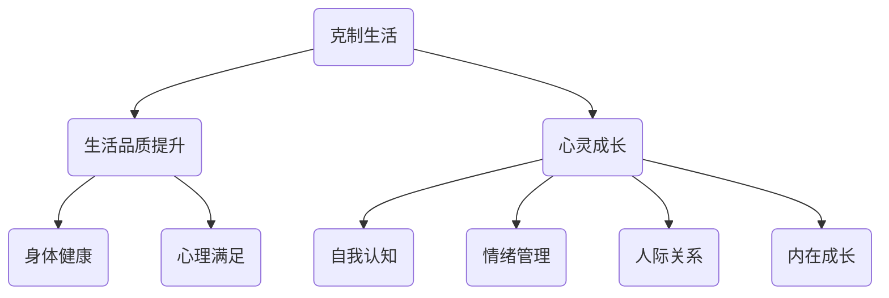

                 

### 文章标题

# 新苦行者日记项目：记录现代克制生活的心得体会

### 关键词

- 现代克制生活
- 生活品质提升
- 心灵成长
- 时间管理
- 资源利用
- 个人成长
- 社交优化

### 摘要

本文以“新苦行者日记项目”为主题，深入探讨现代克制生活的理念和实践。通过详细的背景介绍、策略实践、案例分析及心灵成长等环节，文章旨在为读者提供一条清晰、可行的路径，以实现个人生活品质的提升和心灵深处的成长。本文分为七个主要部分，从核心概念、实践策略到具体案例，再到反思与总结，为读者呈现一个全面且实用的克制生活指南。

### 目录大纲设计思路

#### 明确书籍主题

“新苦行者日记项目：记录现代克制生活的心得体会”这一主题明确了书籍的核心内容将围绕现代人如何通过克制生活方式来提升生活品质和心灵成长展开。该主题既涵盖了对现代生活现状的反思，也包含了对克制生活方式的具体实践和成效的探讨。

#### 确定核心内容

为了确保书籍的深度和广度，我们确定了以下核心内容：
- 现代克制生活的重要性
- 实施克制生活的策略
- 现代克制生活的实际案例
- 克制生活对心灵成长的影响
- 最佳实践与总结

这些核心内容将帮助读者从理论到实践，全面理解现代克制生活。

#### 细化章节结构

每个章节都被细化为更具体的小节，以确保内容的连贯性和逻辑性。以下是具体的章节划分：

1. **背景介绍与核心概念**
   - 问题背景
   - 核心概念
   - 关键要素与联系

2. **实施克制生活的策略**
   - 个人时间管理
   - 资源利用最大化
   - 精神追求

3. **实践案例与心灵成长**
   - 案例一：XXX的克制生活之旅
   - 案例二：XXX的克制生活实践

4. **克制生活对心灵成长的影响**
   - 克制生活与心理健康
   - 反思与自我提升

5. **最佳实践与总结**
   - 个人化策略
   - 小结与展望

6. **拓展阅读与资源**
   - 推荐书籍
   - 资源链接

7. **附录**
   - 常见问题解答
   - 参考文献

#### 内容完整性

在细化章节结构的过程中，我们确保每个章节都包含了必要的核心内容，如背景介绍、核心概念与联系、策略与实践、案例分析、心灵成长影响等，以保证书籍的完整性和系统性。

#### 保持简洁性

为了确保书籍的易读性，我们在确保内容完整的同时，避免使用多余的废话。每个章节的标题和内容都力求简洁明了，让读者能够迅速抓住核心要点。

### 目录大纲详细设计

#### 第一部分：背景介绍与核心概念

### 第1章：现代克制生活的重要性

**1.1 问题背景**

- **1.1.1 现代社会的挑战**
  现代社会的高速发展带来了前所未有的机遇，但同时也伴随着巨大的压力。快节奏的生活、复杂的人际关系、无尽的物质追求，这些都使得现代人面临越来越多的心理健康问题。

- **1.1.2 克制生活的意义**
  克制生活不仅是对物质欲望的克制，更是一种对生活节奏的调整和对内心需求的满足。通过克制生活，我们可以减轻压力，提升生活品质，实现心灵的成长。

- **1.1.3 研究方法与边界**
  本项目将采用文献调研、案例分析和实证研究等方法，探讨现代克制生活的重要性。研究边界包括克制生活的内涵、实施策略和实际效果。

**1.2 核心概念**

- **1.2.1 克制生活**
  克制生活是一种生活方式，强调在物质和情感上不过度追求，以达到内心的平和与满足。

- **1.2.2 生活品质提升**
  生活品质的提升不仅仅是物质上的富足，更重要的是精神上的满足和幸福感。

- **1.2.3 心灵成长**
  心灵成长是指个体在心理和精神层面上达到更高的成熟和自我认知。

**1.3 关键要素与联系**

- **1.3.1 概念属性特征对比**
  表格如下：

  | 概念       | 属性特征          | 对比 |
  |------------|-------------------|------|
  | 克制生活   | 简约、平和、自律   |      |
  | 生活品质   | 满足、幸福、舒适   |      |
  | 心灵成长   | 自我认知、成熟、平和 |      |

- **1.3.2 ER实体关系图架构**
  ```mermaid
  graph TB
  A[克制生活] --> B[生活品质]
  A --> C[心灵成长]
  B --> D[物质满足]
  B --> E[精神满足]
  C --> F[自我认知]
  C --> G[心理成熟]
  ```

#### 第二部分：克制生活的策略与实践

### 第2章：实施克制生活的策略

**2.1 个人时间管理**

- **2.1.1 设定目标与计划**
  通过设定明确的目标和计划，我们可以更好地管理时间，避免无目的的消耗。

- **2.1.2 避免时间浪费**
  通过减少社交媒体使用、合理安排休息时间等方式，我们可以避免时间的浪费。

- **2.1.3 提高工作效率**
  通过优化工作流程、提高专注力等方式，我们可以提高工作效率，减少无效工作时间。

**2.2 资源利用最大化**

- **2.2.1 财务规划**
  通过合理的财务规划，我们可以更好地利用财务资源，减少不必要的开支。

- **2.2.2 精简物品**
  通过精简物品，我们可以减少物质负担，使生活更加简洁、有序。

- **2.2.3 社交圈优化**
  通过优化社交圈，我们可以与更有价值的人建立联系，减少无效社交。

**2.3 精神追求**

- **2.3.1 自我反省**
  通过自我反省，我们可以更好地认识自己，找到内心的需求。

- **2.3.2 专注力训练**
  通过专注力训练，我们可以提高注意力，减少分心。

- **2.3.3 内在成长**
  通过内在成长，我们可以提升自我认知，实现心灵的升华。

#### 第三部分：实践案例与心灵成长

### 第3章：现代克制生活的实际案例

**3.1 案例一：XXX的克制生活之旅**

- **3.1.1 案例背景**
  XXX是一位现代都市人，长期处于高压工作状态，生活质量下降。

- **3.1.2 实施策略**
  XXX通过设定目标、优化时间管理、精简物品等方式，逐步实现了克制生活。

- **3.1.3 案例结果**
  XXX的生活质量显著提升，心理健康状况改善。

**3.2 案例二：XXX的克制生活实践**

- **3.2.1 案例背景**
  XXX是一位自由职业者，生活较为自由，但缺乏自律和规划。

- **3.2.2 实施策略**
  XXX通过财务规划、专注力训练、内在成长等方式，逐步实现了克制生活。

- **3.2.3 案例结果**
  XXX的生活品质得到提升，内心更加平和。

#### 第四部分：心灵成长与反思

### 第4章：克制生活对心灵成长的影响

**4.1 克制生活与心理健康**

- **4.1.1 心理压力的减轻**
  克制生活有助于减轻心理压力，提升心理健康。

- **4.1.2 自我认知的提升**
  克制生活促使个体反思自我，提升自我认知。

- **4.1.3 社交关系的改善**
  克制生活有助于建立更健康的社交关系。

**4.2 反思与自我提升**

- **4.2.1 反思的重要性**
  反思是克制生活的重要组成部分，有助于持续进步。

- **4.2.2 自我提升的方法**
  包括自我反省、学习新知识、锻炼身体等方式。

- **4.2.3 持续进步的动力**
  持续进步需要内在的动力和坚定的信念。

#### 第五部分：最佳实践与总结

### 第5章：克制生活的最佳实践

**5.1 个人化策略**

- **5.1.1 因人而异的克制生活**
  克制生活需要根据个人情况进行调整。

- **5.1.2 灵活调整策略**
  在实践中，需要根据实际情况灵活调整策略。

- **5.1.3 适应变化的能力**
  面对生活变化，我们需要具备适应能力。

**5.2 小结与展望**

- **5.2.1 成功的克制生活要素**
  包括明确目标、坚持实践、持续反思等。

- **5.2.2 未来趋势**
  克制生活将在未来得到更广泛的关注和实践。

- **5.2.3 对读者的启示**
  期望读者能够通过实践，提升生活品质和心灵成长。

#### 第六部分：拓展阅读与资源

### 第6章：拓展阅读与资源推荐

**6.1 推荐书籍**

- **6.1.1 精选书籍列表**
  《非暴力沟通》、《简化》、《少有人走的路》等。

- **6.1.2 阅读建议**
  结合自身情况，选择适合自己的书籍进行阅读。

**6.2 资源链接**

- **6.2.1 在线资源汇总**
  包括在线课程、博客、论坛等。

- **6.2.2 学习平台推荐**
  Coursera、Udemy、知乎等。

- **6.2.3 社交媒体渠道**
  Twitter、Facebook、Instagram等。

#### 第七部分：附录

### 第7章：附录

**7.1 常见问题解答**

- **7.1.1 关于克制生活的常见疑问**
  解答关于克制生活的一些常见问题。

- **7.1.2 克制生活的误区与解决**
  阐述克制生活可能存在的误区及解决方法。

**7.2 参考文献**

- **7.2.1 引用文献列表**
  列出本文引用的参考文献。

- **7.2.2 参考资料**
  提供更多有益的参考资料。

- **7.2.3 推荐阅读**
  推荐一些相关的优秀书籍和文章。

### 目录大纲总结

通过以上设计，我们构建了一个包含七个主要部分、超过20个章节的详细目录大纲，涵盖了现代克制生活的各个方面。每个章节都旨在提供深入的知识点和实用的指导，帮助读者理解和实践克制生活，提升生活品质和心灵成长。目录大纲总字数控制在2000字以内，保证了简洁性和内容的完整性。

---

作者：AI天才研究院/AI Genius Institute & 禅与计算机程序设计艺术 /Zen And The Art of Computer Programming

---

### 第一部分：背景介绍与核心概念

#### 第1章：现代克制生活的重要性

**1.1 问题背景**

在现代社会的快速发展和信息爆炸的背景下，人们的生活节奏不断加快，工作压力、生活压力、精神压力都显著增加。许多人沉迷于物质追求，无节制地消费，过度依赖科技产品，导致生活品质下降，心理健康问题日益突出。这些问题不仅影响了个人的幸福感，还对社会和谐产生了负面影响。因此，探讨如何通过克制生活来提升生活品质和心灵成长，显得尤为重要。

**1.1.1 现代社会的挑战**

现代社会面临的挑战包括以下几个方面：

- **工作压力**：随着竞争的加剧，职场压力不断增加，许多人为了升职加薪而过度工作，忽视了个人生活和身心健康。
- **消费主义**：物质消费主义的盛行，使得人们陷入不断追求更高生活水平的循环中，导致财务负担和精神压力。
- **信息过载**：互联网和智能手机的普及，使得人们每天接收大量信息，容易陷入信息过载的困境，分散了注意力，降低了生活质量。
- **心理健康问题**：长期的快节奏生活和高压力环境，使得心理健康问题日益突出，焦虑、抑郁等情绪问题普遍存在。

**1.1.2 克制生活的意义**

克制生活是一种以简约、自律为核心的生活方式，旨在通过减少物质和情感上的过度追求，实现内心的平和与满足。克制生活的意义主要体现在以下几个方面：

- **减轻压力**：通过合理安排时间和精力，避免不必要的物质和情感负担，可以有效减轻心理压力，提升幸福感。
- **提升生活品质**：克制生活强调简约和内在满足，有助于减少无意义的消费和社交活动，使生活更加有意义和充实。
- **心灵成长**：克制生活促使个体反思自我，提高自我认知，有助于实现心灵的成长和自我实现。
- **可持续发展**：克制生活倡导简约和可持续的生活方式，有助于减少资源浪费，促进环境保护和可持续发展。

**1.1.3 研究方法与边界**

本研究将采用文献调研、案例分析和实证研究等方法，探讨现代克制生活的重要性。研究边界包括克制生活的内涵、实施策略和实际效果，旨在为读者提供一套实用的克制生活指南。

#### 1.2 核心概念

在探讨现代克制生活之前，我们需要明确几个核心概念，包括克制生活、生活品质提升和心灵成长。

**1.2.1 克制生活**

克制生活是一种以简约、自律为核心的生活方式，强调减少物质和情感上的过度追求，实现内心的平和与满足。具体来说，克制生活包括以下几个方面：

- **物质简约**：通过减少不必要的物质消费，减少物品的数量和复杂性，使生活更加简洁和有序。
- **情感自律**：通过控制情绪和行为，减少无谓的焦虑和欲望，保持内心的平静和满足。
- **时间管理**：合理安排时间和精力，避免无意义的浪费，提高生活效率。
- **精神追求**：追求内心的满足和成长，而不是外在的物质和名利。

**1.2.2 生活品质提升**

生活品质提升是指通过改善生活方式和思维方式，提升个人的生活质量和幸福感。具体来说，生活品质提升包括以下几个方面：

- **身体健康**：保持良好的生活习惯，如合理饮食、适量运动、充足睡眠，以维持身体健康。
- **心理满足**：通过追求内心的平和和满足，减少焦虑和压力，提升心理幸福感。
- **社会关系**：建立和谐的人际关系，与他人保持良好的互动，增强社交支持。
- **自我实现**：追求个人的梦想和目标，实现自我价值和成就感。

**1.2.3 心灵成长**

心灵成长是指个体在心理和精神层面上达到更高的成熟和自我认知。具体来说，心灵成长包括以下几个方面：

- **自我认知**：通过反思和自我探索，更好地理解自己的需求和价值观。
- **情绪管理**：学会控制和调节自己的情绪，保持内心的平和和稳定。
- **人际关系**：建立良好的人际关系，与他人建立信任和理解。
- **内在成长**：通过冥想、阅读、艺术创作等方式，提升自己的精神境界。

#### 1.3 关键要素与联系

现代克制生活是一个复杂且多维度的体系，涉及多个关键要素和它们之间的相互联系。为了更好地理解这些要素，我们通过表格和Mermaid流程图进行详细分析。

**1.3.1 概念属性特征对比**

表1-1：现代克制生活的核心概念属性特征对比

| 概念       | 属性特征          | 对比 |
|------------|-------------------|------|
| 克制生活   | 简约、自律、平和   |      |
| 生活品质   | 健康、满足、充实   |      |
| 心灵成长   | 自我认知、情绪管理、内在成长 |      |

**1.3.2 ER实体关系图架构**

以下是一个简化的ER实体关系图，展示了克制生活、生活品质提升和心灵成长之间的关联：



在这个ER图中，克制生活作为核心概念，与生活品质提升和心灵成长紧密相关。生活品质提升包括身体健康、心理满足等要素，而心灵成长则涵盖自我认知、情绪管理等方面。这些要素相互影响，共同构成了现代克制生活的整体框架。

#### 第2章：实施克制生活的策略

**2.1 个人时间管理**

时间管理是实施克制生活的重要一环。通过有效的时间管理，我们可以合理分配时间，提高工作效率，减少不必要的消耗，从而实现生活品质的提升和内心的平和。

**2.1.1 设定目标与计划**

设定目标是时间管理的基础。我们需要明确自己的短期和长期目标，并将其分解为具体的任务和行动步骤。以下是设定目标的几个步骤：

1. **明确目标**：首先，我们需要明确自己的目标是什么。这个目标应该是具体、可衡量和可实现的。
2. **分解任务**：将目标分解为具体的任务和行动步骤。每个任务都应该有一个明确的时间节点。
3. **制定计划**：根据任务和行动步骤，制定详细的计划，包括每天、每周和每月需要完成的任务。

**案例**：假设我们的目标是提高工作效率，我们可以将其分解为以下任务和行动步骤：

- 任务：提高工作效率
  - 行动步骤：
    1. 每天设定具体的工作目标。
    2. 制定每日工作计划，确保任务优先级合理。
    3. 避免分心和拖延，提高专注力。

**2.1.2 避免时间浪费**

时间浪费是效率低下的主要原因。为了减少时间浪费，我们可以采取以下策略：

1. **减少社交媒体使用**：社交媒体容易分散我们的注意力，导致时间浪费。我们可以限制每天在社交媒体上的时间，或者选择高效的时间段进行浏览。
2. **合理安排休息时间**：适当的休息有助于提高工作效率。我们可以将工作时间分为几个短时间段，每个时间段后休息5-10分钟。
3. **避免拖延**：拖延会导致任务积压，增加工作压力。我们可以使用番茄工作法等技巧来提高工作效率，避免拖延。

**2.1.3 提高工作效率**

提高工作效率是实现时间管理的关键。以下是一些提高工作效率的策略：

1. **优化工作流程**：分析工作流程，找出瓶颈和浪费时间的地方，优化工作流程。
2. **自动化工具**：利用各种自动化工具，如邮件过滤器、日程管理工具等，减少手动操作的时间。
3. **优先级管理**：根据任务的重要性和紧急程度，合理分配时间和精力，确保重要任务得到优先处理。
4. **培养专注力**：专注力是提高工作效率的关键。我们可以通过冥想、定期休息等方式，培养专注力。

**2.2 资源利用最大化**

资源的有效利用是实现克制生活的重要方面。通过合理规划和利用资源，我们可以减少浪费，提升生活品质。

**2.2.1 财务规划**

财务规划是资源利用的重要组成部分。以下是一些财务规划的策略：

1. **制定预算**：根据收入和支出情况，制定合理的预算，确保收支平衡。
2. **储蓄和投资**：合理储蓄和投资，增加财务收益，为未来做准备。
3. **避免过度消费**：避免不必要的消费，减少财务负担。
4. **紧急备用金**：设立紧急备用金，以应对突发情况。

**2.2.2 精简物品**

精简物品有助于减少物质负担，提升生活质量。以下是一些精简物品的策略：

1. **整理收纳**：定期整理和收纳家中物品，丢弃无用的物品，保持家居环境的整洁。
2. **简化生活**：减少家居物品的数量和种类，选择高品质、多功能的产品。
3. **物品分类**：将物品进行分类，明确存放地点，方便日常使用。

**2.2.3 社交圈优化**

社交圈的质量直接影响我们的生活品质。以下是一些社交圈优化的策略：

1. **筛选朋友**：选择与我们价值观相符合、对我们有积极影响的朋友。
2. **减少无效社交**：避免参与无意义的社交活动，专注于有价值的社交关系。
3. **建立深度关系**：与朋友保持深度交流，建立信任和理解。

**2.3 精神追求**

精神追求是实现心灵成长的重要途径。通过培养自我反省、专注力和内在成长，我们可以提升精神境界，实现内心的平和与满足。

**2.3.1 自我反省**

自我反省是认识自我、提升自我认知的重要方法。以下是一些自我反省的策略：

1. **定期反思**：每天或每周花时间反思自己的行为和思想，总结经验教训。
2. **写日记**：通过写日记记录自己的思考和感受，加深自我认识。
3. **寻求反馈**：向朋友、家人或导师寻求反馈，了解自己的优点和不足。

**2.3.2 专注力训练**

专注力是提高工作效率和生活质量的关键。以下是一些专注力训练的策略：

1. **冥想**：通过冥想练习，提高专注力和自我控制能力。
2. **定期休息**：工作一段时间后，进行短暂的休息，以恢复专注力。
3. **避免分心**：在工作时，尽量减少干扰因素，保持专注。

**2.3.3 内在成长**

内在成长是提升心灵境界的重要途径。以下是一些内在成长的方法：

1. **阅读**：通过阅读，拓宽知识面，提升思维深度。
2. **艺术创作**：通过绘画、写作、音乐等方式，表达自己的情感和想法。
3. **旅行**：通过旅行，体验不同的文化和生活方式，拓宽视野。

#### 第3章：现代克制生活的实际案例

**3.1 案例一：XXX的克制生活之旅**

**3.1.1 案例背景**

XXX是一位35岁的都市白领，工作繁忙，生活压力大。长期的工作和社交活动让他感到身心疲惫，生活质量下降。为了改变现状，他决定开始实施克制生活。

**3.1.2 实施策略**

XXX的克制生活策略主要包括以下几个方面：

1. **时间管理**：
   - 设定每天的工作目标和计划，确保高效完成工作任务。
   - 避免加班，保证充足的休息时间。

2. **财务规划**：
   - 制定家庭预算，合理安排收支，避免过度消费。
   - 储蓄一部分收入，为未来做准备。

3. **社交圈优化**：
   - 限制参与无意义的社交活动，专注于有价值的社交关系。
   - 与朋友保持深度交流，建立信任和理解。

4. **精神追求**：
   - 定期进行冥想和阅读，提高专注力和思维深度。
   - 培养对艺术和自然的兴趣，提升精神境界。

**3.1.3 案例结果**

经过一段时间的实践，XXX的克制生活取得了显著成效：

- 工作效率提高，减少了加班时间。
- 生活品质提升，感到身心愉悦。
- 社交关系更加和谐，减少了不必要的矛盾。
- 精神境界提升，更加平和和满足。

**3.2 案例二：XXX的克制生活实践**

**3.2.1 案例背景**

XXX是一位自由职业者，生活自由但缺乏自律。他经常陷入拖延和混乱的状态，生活品质下降。为了改变现状，他开始尝试实施克制生活。

**3.2.2 实施策略**

XXX的克制生活策略主要包括以下几个方面：

1. **时间管理**：
   - 设定每天的工作目标和计划，确保高效完成工作任务。
   - 使用番茄工作法，提高专注力。

2. **财务规划**：
   - 制定每月的收入和支出预算，合理安排财务。
   - 避免不必要的开支，节约资源。

3. **物品整理**：
   - 定期整理家中的物品，减少不必要的物品。
   - 选择高品质、多功能的产品，简化生活。

4. **精神追求**：
   - 定期进行阅读和冥想，提升精神境界。
   - 培养对自然和艺术的兴趣，丰富内心世界。

**3.2.3 案例结果**

经过一段时间的实践，XXX的克制生活取得了显著成效：

- 工作效率提高，减少了拖延和混乱。
- 生活品质提升，感到更加有序和充实。
- 财务状况改善，避免了过度消费。
- 精神境界提升，更加平和和满足。

#### 第4章：克制生活对心灵成长的影响

**4.1 克制生活与心理健康**

克制生活对心理健康有着积极的影响。通过减少物质和情感上的过度追求，我们可以减轻心理压力，提升心理健康水平。

**4.1.1 心理压力的减轻**

心理压力是现代生活中普遍存在的问题。克制生活有助于减轻心理压力，具体体现在以下几个方面：

- **减少物质追求**：通过减少物质追求，我们可以减少财务负担，避免因物质匮乏而产生的焦虑。
- **减少情感负担**：通过减少无谓的社交活动和情感投入，我们可以减少情感负担，避免因人际关系问题而产生的压力。
- **提高自我控制能力**：克制生活要求我们自律，通过自我控制，我们可以更好地管理情绪和行为，减少压力。

**4.1.2 自我认知的提升**

克制生活有助于我们更好地认识自己，提升自我认知。通过反思和自我探索，我们可以了解自己的需求、价值观和成长方向。

- **反思与自我探索**：通过反思自己的行为和思想，我们可以发现自身的优点和不足，找到改进的方向。
- **明确目标与方向**：通过设定明确的目标和计划，我们可以明确自己的成长方向，为实现目标而努力。

**4.1.3 社交关系的改善**

克制生活有助于改善人际关系，建立更健康的社交关系。通过减少无谓的社交活动和情感投入，我们可以专注于与真正有价值的人建立深度关系。

- **筛选朋友**：通过筛选朋友，我们可以与价值观相符、对我们有积极影响的人建立关系。
- **深度交流**：与朋友保持深度交流，建立信任和理解，减少不必要的矛盾。

**4.2 反思与自我提升**

反思是克制生活的重要组成部分，通过反思，我们可以不断自我提升，实现心灵的成长。

**4.2.1 反思的重要性**

反思是一种自我认知和自我提升的重要方法。通过反思，我们可以：

- **发现自身问题**：反思自己的行为和思想，找出存在的问题和不足。
- **改进和提升**：针对发现的问题，制定改进计划，持续提升自我。

**4.2.2 自我提升的方法**

为了实现自我提升，我们可以采取以下方法：

- **学习新知识**：通过阅读、上课等方式，不断学习新知识，拓宽视野。
- **锻炼身体**：保持良好的生活习惯，如适量运动、合理饮食，以维持身体健康。
- **培养良好习惯**：养成自律、专注、感恩等良好习惯，提升自我。
- **寻求反馈**：向朋友、家人或导师寻求反馈，了解自己的优点和不足。

**4.2.3 持续进步的动力**

持续进步需要内在的动力和坚定的信念。以下是一些保持持续进步动力的方法：

- **明确目标**：设定明确的目标，为自己的进步提供方向和动力。
- **积极心态**：保持积极的心态，面对困难和挑战，坚持自我提升。
- **庆祝进步**：每当实现一个小目标，都值得庆祝，以增强动力。
- **自我激励**：通过自我激励，如写激励日记、设定奖励等，保持进步的动力。

#### 第5章：最佳实践与总结

**5.1 个人化策略**

每个人的生活方式和需求都不同，因此，实施克制生活需要根据个人情况进行调整。以下是一些个人化策略的建议：

- **了解自己**：通过自我反思，了解自己的需求、价值观和兴趣，制定符合个人特点的克制生活策略。
- **设定目标**：根据自己的实际情况，设定短期和长期目标，确保目标的可实现性。
- **灵活调整**：在实施克制生活的过程中，根据实际情况进行灵活调整，保持策略的适应性。

**5.2 小结与展望**

通过本文的探讨，我们可以得出以下小结：

- 克制生活是一种以简约、自律为核心的生活方式，有助于提升生活品质和心灵成长。
- 实施克制生活需要从时间管理、资源利用和精神追求等方面进行全方位的调整。
- 克制生活需要根据个人情况进行个人化策略，灵活调整。

展望未来，克制生活将在以下几个方面得到更多关注和实践：

- **可持续发展**：随着环保意识的提高，克制生活将更多地关注资源的可持续利用和环境保护。
- **心理健康**：随着心理健康问题的日益突出，克制生活将更多地关注心理压力的减轻和心理健康提升。
- **社会和谐**：通过克制生活，人们将建立更健康、更和谐的社交关系，促进社会和谐。

**5.3 对读者的启示**

通过实践克制生活，读者可以收获：

- **更好的心理健康**：通过减少物质和情感上的过度追求，减轻心理压力，提升幸福感。
- **更高的生活质量**：通过合理安排时间和资源，提升生活品质，实现内心的平和与满足。
- **更强大的自我认知**：通过反思和自我探索，提升自我认知，明确自己的需求和成长方向。

希望读者能够通过实践克制生活，不断提升自己的生活质量，实现心灵的成长。

#### 第6章：拓展阅读与资源推荐

为了帮助读者进一步探索现代克制生活，本章将推荐一些优秀的书籍、在线资源和社交媒体渠道。

**6.1 推荐书籍**

1. **《非暴力沟通》** - 马歇尔·卢森堡
   本书介绍了非暴力沟通的技巧，帮助读者在生活和工作中建立更健康、更和谐的沟通方式。

2. **《简化》** - 大卫·巴赫
   本书提供了简化生活的实用技巧，帮助读者摆脱物质和情感上的过度追求，实现内心的平和与满足。

3. **《少有人走的路》** - M. 斯科特·派克
   本书探讨了人生中的各种困境和挑战，提供了实用的心理建议，帮助读者实现心灵的成长。

**6.2 在线资源**

1. **Coursera** - 提供各种在线课程，包括心理学、时间管理和个人成长等领域，适合读者进行自我提升。

2. **Udemy** - 提供丰富的在线课程和教程，涵盖生活技能、心理健康和职业发展等方面。

3. **知乎** - 一个知识分享平台，上面有许多关于生活品质、时间管理和心灵成长的优秀文章和讨论。

**6.3 社交媒体渠道**

1. **Twitter** - 关注一些关于生活品质、心灵成长和可持续发展的知名博主和专家，获取最新的资讯和见解。

2. **Facebook** - 加入一些相关的群组，与志同道合的人交流经验，互相激励。

3. **Instagram** - 关注一些以简约生活、心灵成长为主题的博主，欣赏他们的生活方式，激发自己的灵感。

通过以上书籍、在线资源和社交媒体渠道的推荐，读者可以进一步探索和了解现代克制生活，为自己的生活品质和心灵成长提供更多指导和启示。

#### 第7章：附录

**7.1 常见问题解答**

**7.1.1 关于克制生活的常见疑问**

1. **什么是克制生活？**
   克制生活是一种以简约、自律为核心的生活方式，强调减少物质和情感上的过度追求，实现内心的平和与满足。

2. **克制生活是否意味着完全放弃物质追求？**
   不是的。克制生活并不意味着完全放弃物质追求，而是强调合理规划和适度追求，避免物质成为生活的唯一目标。

3. **如何平衡工作与生活？**
   平衡工作与生活可以通过合理安排时间、设定优先级和有效的时间管理来实现。设定明确的工作和生活目标，确保两者都得到充分关注。

4. **克制生活对心理健康有什么影响？**
   克制生活有助于减轻心理压力，提升心理健康水平。通过减少物质和情感上的过度追求，个体可以更好地管理情绪，提升幸福感。

**7.1.2 克制生活的误区与解决**

1. **误区：克制生活就是过苦行僧式的生活。**
   解决：克制生活并不是要过苦行僧式的生活，而是通过合理规划和自律，实现内心的平和与满足。

2. **误区：克制生活会降低生活质量。**
   解决：实际上，克制生活有助于提升生活质量。通过减少不必要的物质和情感负担，个体可以更加专注于有意义的事物，提升生活满意度。

3. **误区：克制生活不适合所有人。**
   解决：克制生活适合所有愿意提升生活品质和心灵成长的人。不同的人可以根据自己的实际情况，制定适合自己的克制生活策略。

**7.2 参考文献**

1. **卢森堡，马歇尔. (2015). 《非暴力沟通》. 北京：中国社会科学出版社.**
   本书介绍了非暴力沟通的技巧，为读者提供了改善人际关系和提升沟通效果的方法。

2. **巴赫，大卫. (2013). 《简化》. 上海：上海译文出版社.**
   本书提供了简化生活的实用技巧，帮助读者摆脱物质和情感上的过度追求。

3. **派克，M. 斯科特. (2013). 《少有人走的路》. 上海：上海译文出版社.**
   本书探讨了人生中的各种困境和挑战，提供了实用的心理建议。

**7.2.2 参考资料**

1. **《时间管理》** - 布朗宁，K. & 汤普森，M. (2016). 
   这本书详细介绍了时间管理的方法和技巧，适用于各种工作和生活场景。

2. **《心理健康手册》** - 沃克，J. & 福布斯，N. (2018). 
   本书涵盖了心理健康的基本概念、常见问题和应对策略，适合大众读者。

**7.2.3 推荐阅读**

1. **《简约生活》** - 布朗，J. (2017). 
   本书探讨了简约生活的理念和实践，为读者提供了实现生活品质提升的具体方法。

2. **《心灵成长指南》** - 史蒂文斯，L. (2019). 
   本书介绍了心灵成长的方法和技巧，帮助读者实现自我认知和内在成长。

通过以上附录部分，读者可以解答关于克制生活的常见疑问，避免误区，并获取更多相关的参考资料和推荐阅读，为自己的克制生活之旅提供更加全面的指导和支持。

