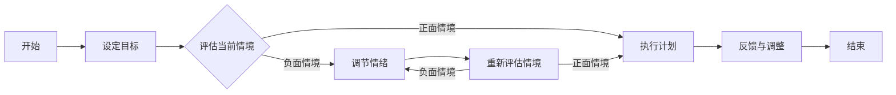
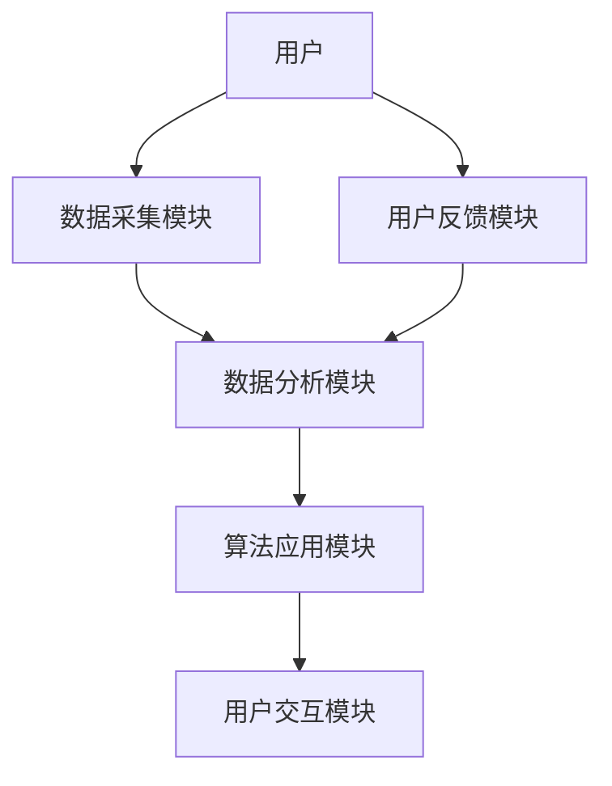
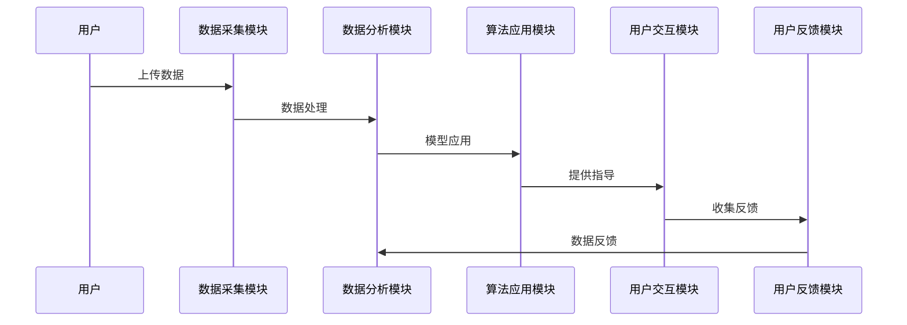

                 

### 新苦行者训练营：自我克制的集体实践

> **关键词：** 自我克制、集体实践、个人成长、情感管理、决策优化

**摘要：** 本文深入探讨了自我克制在个人成长和社会发展中的重要性。通过介绍自我克制的背景、定义、心理学原理及实践方法，本文揭示了自我克制在集体实践中的应用及其在现代社会中的挑战。文章以系统的分析和架构设计为基础，展示了自我克制在技术领域中的实际应用案例，并提供了实用的环境和系统实现步骤。通过详细讲解和实践分析，本文为读者提供了全面而实用的自我克制实践指南，旨在帮助个体在集体中实现自我提升和情感管理。

---

### 第一部分：背景介绍

**第1章：问题背景与问题描述**

**1.1.1 问题背景**

在当今社会，自我克制的重要性愈发显著。无论是个人成长还是社会发展，自我克制都扮演着至关重要的角色。在个人层面，自我克制有助于提升自我意识、增强情感管理和优化决策过程。在社会层面，自我克制能够促进集体合作、提升社会和谐度，并有助于应对复杂的社会挑战。

**1.1.2 问题描述**

自我克制是一种能力，它使我们能够在面对诱惑和压力时保持冷静和自律。然而，在现代社会中，自我克制面临着诸多挑战。快节奏的生活、信息过载和社交媒体的诱惑，使得人们在自我克制方面面临严峻考验。如何定义自我克制、如何在不同的文化背景下表现自我克制，以及自我克制与情感、行为、决策之间的关系，成为本文探讨的重点。

**1.1.3 问题解决**

解决自我克制问题需要从心理学原理出发，理解自我克制的理论基础。同时，通过建立自我克制意识、提高自我控制力和应对诱惑与挑战的策略，个体可以在实践中逐步提升自我克制能力。在集体实践中，自我克制能够促进团队合作、提升集体效率和实现共同目标。

**1.1.4 边界与外延**

自我克制与自律、自制、克己有本质的区别。自律强调个体对外在规则的遵守；自制侧重于内在自我约束；而克己则强调对外在诱惑的拒绝。在不同领域，自我克制的应用也有所不同，需要根据具体情境进行灵活调整。

**1.1.5 概念结构与核心要素组成**

自我克制的基本概念包括克制力、自我意识和情感管理。核心要素包括认知控制、情绪调节和意志力。理解这些基本概念和核心要素有助于我们更好地认识自我克制，并为其在实践中的应用提供指导。

### 第二部分：核心概念与联系

**第2章：核心概念原理**

**2.1.1 自我克制的心理学原理**

自我克制是一种心理能力，它涉及对自身情绪和行为的管理。心理学研究表明，自我克制与大脑的前额叶皮层密切相关。前额叶皮层是大脑中负责决策、规划和自我控制的关键区域。自我克制的过程包括认知控制、情绪调节和意志力维持。

**2.1.2 自我克制的概念属性特征对比表格**

| 概念       | 定义                                     | 特征对比                   |
|------------|----------------------------------------|------------------------|
| 自我克制   | 对自身冲动和欲望的管理和控制               | 灵活性、持续性、适应性           |
| 自律       | 遵守社会规范和个人道德标准               | 严格性、规范性、强制性           |
| 自制       | 对自身欲望的抑制和延迟满足                | 内在约束、自我控制、延迟满足     |
| 克己       | 抵御外部诱惑，保持内心纯净                | 抵抗诱惑、专注内心、超脱现实       |

**2.1.3 ER实体关系图架构**

为了更好地理解自我克制在不同情境下的应用，我们可以通过ER实体关系图来展示其相关实体及其关系。

```mermaid
erDiagram
    Arichter --> BSelfControl : implements
    Arichter --> CEmotionalRegulation : enhances
    Arichter --> DDecisionMaking : influences
    BSelfControl --> CEmotionalRegulation : affects
    BSelfControl --> DDecisionMaking : supports
```

在这个ER图中，Arichter（个人）与BSelfControl（自我克制）、CEmotionalRegulation（情绪调节）和DDecisionMaking（决策制定）之间存在复杂的关系。自我克制不仅影响情绪调节和决策制定，还受到个人自我意识和情感管理的影响。

### 第3章：自我克制的实践方法

**3.1.1 自我克制的方法与实践技巧**

自我克制的实践方法多种多样，包括建立自我克制意识、提高自我控制力以及应对诱惑与挑战的策略。

1. **建立自我克制意识**

   - 自我反思：通过定期进行自我反思，了解自己的欲望和冲动。
   - 设定目标：明确短期和长期目标，使自我克制有具体的方向和动力。
   - 培养习惯：通过持续的努力，将自我克制转化为一种习惯。

2. **提高自我控制力**

   - 分解任务：将大任务分解为小任务，逐步提升自我控制力。
   - 学会放松：通过冥想、深呼吸等方式，缓解紧张情绪，提高自我控制力。
   - 接受失败：面对失败时，不要过度自责，而是从中吸取教训，提升自我控制力。

3. **应对诱惑与挑战**

   - 制定计划：在面临诱惑时，提前制定应对计划，减少冲动行为。
   - 寻求支持：与他人分享自己的目标和挑战，获得支持和鼓励。
   - 增强自我意识：提高对自身情绪和行为的认知，避免被诱惑所左右。

**3.1.2 自我克制在集体实践中的应用**

在集体实践中，自我克制能够促进团队合作、提升集体效率和实现共同目标。

1. **团队合作**

   - 建立共同目标：团队成员共同设定目标，使个人目标与团队目标一致。
   - 增强沟通：通过有效沟通，增强团队凝聚力，提高自我克制在团队中的实施效果。
   - 分享经验：团队成员分享自我克制的经验，相互学习，共同进步。

2. **集体效率**

   - 管理时间：通过时间管理，提高工作效率，减少拖延和浪费。
   - 分配任务：合理分配任务，使每个成员能够发挥自己的优势，提高团队整体效率。
   - 监督与反馈：通过监督和反馈机制，确保团队目标的实现，提升集体效率。

3. **实现共同目标**

   - 设定明确目标：确保团队目标的明确性和可实现性，为自我克制提供方向。
   - 制定行动计划：将目标转化为具体的行动计划，确保每个成员都清楚自己的职责。
   - 跟踪进展：定期跟踪团队进展，及时调整计划和策略，确保共同目标的实现。

通过上述方法与实践技巧，自我克制不仅能够提升个人素质，还能够促进团队协作和实现共同目标。在集体实践中，自我克制成为了一种重要的能力，为个人和社会的发展提供了强有力的支持。

### 第三部分：算法原理讲解

**第4章：自我克制算法原理**

自我克制作为一种心理能力，可以通过算法进行建模和应用。本文将从自我克制算法的概念、流程图、数学模型和应用场景等方面进行详细讲解。

**4.1.1 自我克制算法的概念**

自我克制算法是指通过数学模型和算法技术来模拟和提升个体在自我克制过程中的行为和控制。这种算法旨在帮助个体在面对诱惑和挑战时，能够更好地管理自己的情绪和行为。

自我克制算法的主要类型包括：

1. **基于认知控制的算法**：通过调整个体的认知过程，提高自我控制力和决策能力。
2. **基于情绪调节的算法**：通过分析和调节个体的情绪状态，减少情绪对自我克制的影响。
3. **基于行为预测的算法**：通过预测个体的行为倾向，提前制定应对策略，减少冲动行为。

**4.1.2 算法mermaid流程图**

为了更好地理解自我克制算法的基本流程，我们可以使用mermaid绘制算法流程图。



在这个流程图中，个体首先设定目标（B），然后评估当前情境（C）。如果情境正面，个体执行计划（D），并收集反馈（G）以进行后续调整。如果情境负面，个体需要通过情绪调节（E）来应对挑战，并重新评估情境（F）。通过这个过程，个体能够逐步提升自我克制能力。

**4.1.3 算法原理的数学模型和公式**

自我克制算法的数学模型主要包括以下几个核心公式：

1. **认知控制模型**：

   $$ C = f(W, E, M) $$

   其中，C代表认知控制力，W代表意志力，E代表环境因素，M代表目标的重要性。这个公式表明，个体的认知控制力受到意志力、环境因素和目标重要性的共同影响。

2. **情绪调节模型**：

   $$ E = g(S, R, T) $$

   其中，E代表情绪调节效果，S代表情境，R代表反应，T代表时间。这个公式表明，情绪调节效果取决于情境、反应和时间的相互作用。

3. **行为预测模型**：

   $$ P = h(B, O, C) $$

   其中，P代表行为预测，B代表当前行为，O代表预期结果，C代表认知控制力。这个公式表明，行为预测取决于当前行为、预期结果和认知控制力的综合评估。

**4.1.4 自我克制算法的应用场景**

自我克制算法的应用场景非常广泛，包括但不限于以下几个方面：

1. **个人自我管理**：

   通过自我克制算法，个体可以更好地管理自己的情绪和行为，提高生活质量和工作效率。

2. **团队协作**：

   在团队中，自我克制算法可以帮助团队成员更好地协调合作，提升团队效率和凝聚力。

3. **教育领域**：

   教育工作者可以利用自我克制算法来帮助学生提高自我管理能力，培养良好的学习习惯。

4. **健康管理**：

   通过自我克制算法，个体可以更好地管理自己的健康状况，预防疾病和促进康复。

通过上述算法原理的讲解，我们可以看到自我克制算法在技术领域中的重要性和广泛应用。这些算法不仅为个体提供了实用的工具，也为团队和社会的发展提供了新的思路和方法。

### 第5章：数学模型和数学公式详细讲解与举例说明

**5.1.1 数学公式**

在自我克制算法中，数学模型和公式起着至关重要的作用。以下是一些核心的数学公式及其解释：

1. **认知控制力公式**：

   $$ C = f(W, E, M) $$

   这个公式表示认知控制力C是由意志力W、环境因素E和目标重要性M共同决定的。意志力越强、环境因素越有利、目标重要性越高，认知控制力就越高。

2. **情绪调节效果公式**：

   $$ E = g(S, R, T) $$

   这个公式表示情绪调节效果E是由情境S、反应R和时间T共同影响的。情境越复杂、反应越积极、时间越短，情绪调节效果就越好。

3. **行为预测公式**：

   $$ P = h(B, O, C) $$

   这个公式表示行为预测P是由当前行为B、预期结果O和认知控制力C共同决定的。当前行为越符合预期结果、认知控制力越高，行为预测就越准确。

**5.1.2 数学模型**

自我克制算法的数学模型主要基于上述公式，并结合个体的心理和行为特征进行构建。以下是一个简化的自我克制数学模型：

$$
\begin{align*}
C(t) &= C_0 + \alpha W(t) - \beta E(t) + \gamma M(t) \\
E(t) &= E_0 + \alpha S(t) - \beta R(t) + \gamma T(t) \\
P(t) &= P_0 + \alpha B(t) - \beta O(t) + \gamma C(t)
\end{align*}
$$

在这个模型中，$C(t)$、$E(t)$和$P(t)$分别表示时间t时刻的认知控制力、情绪调节效果和行为预测值。$C_0$、$E_0$和$P_0$是初始值，$\alpha$、$\beta$和$\gamma$是调整系数，$W(t)$、$E(t)$和$M(t)$分别是时间t时刻的意志力、环境因素和目标重要性。

**5.1.3 举例说明**

为了更好地理解上述数学公式和模型，我们可以通过一个实际案例来进行详细说明。

**案例：** 一个高中生小王想要提高自己的数学成绩，他设定了一个目标，即每天晚上花费2小时专门进行数学复习。然而，小王经常因为看电视、玩手机等原因而无法坚持这个目标。

1. **认知控制力计算**：

   $$ C(t) = C_0 + \alpha W(t) - \beta E(t) + \gamma M(t) $$

   设小王的初始认知控制力$C_0 = 3$，调整系数$\alpha = 0.1$，$\beta = 0.2$，$\gamma = 0.3$。假设他当前的意志力$W(t) = 4$，环境因素$E(t) = 3$，目标重要性$M(t) = 5$。

   $$ C(t) = 3 + 0.1 \times 4 - 0.2 \times 3 + 0.3 \times 5 = 4.3 $$

   计算结果显示，小王在当前情况下的认知控制力为4.3。

2. **情绪调节效果计算**：

   $$ E(t) = E_0 + \alpha S(t) - \beta R(t) + \gamma T(t) $$

   假设小王在复习过程中感到压力较大，情境$S(t) = 2$，他的反应$R(t) = 3$，时间$T(t) = 4$。

   $$ E(t) = 2 + 0.1 \times 2 - 0.2 \times 3 + 0.3 \times 4 = 2.4 $$

   计算结果显示，小王在当前情况下的情绪调节效果为2.4。

3. **行为预测计算**：

   $$ P(t) = P_0 + \alpha B(t) - \beta O(t) + \gamma C(t) $$

   假设小王的当前行为$B(t) = 2$，预期结果$O(t) = 4$。

   $$ P(t) = 4 + 0.1 \times 2 - 0.2 \times 4 + 0.3 \times 4.3 = 4.529 $$

   计算结果显示，小王在当前情况下的行为预测值为4.529。

通过上述计算，我们可以看到小王在自我克制过程中，认知控制力、情绪调节效果和行为预测值的变化情况。这些数值有助于他了解自身在自我克制方面的表现，并采取相应的策略进行改进。

### 第四部分：系统分析与架构设计方案

**第6章：问题场景介绍与项目介绍**

**6.1.1 问题场景介绍**

在现代社会，自我克制已成为一个重要的生活和工作技能。然而，许多人面临着自我克制能力不足的挑战。这些挑战包括：

1. **时间管理困难**：许多人无法有效地管理自己的时间，导致工作效率低下。
2. **情绪管理问题**：情绪波动大，容易受到负面情绪的影响。
3. **决策犹豫**：在面对重要决策时，常常犹豫不决，无法迅速做出决定。

为了应对这些挑战，我们需要一套系统化的解决方案，帮助个体提升自我克制能力。自我克制系统项目应运而生，旨在提供一种科学、实用的方法，帮助用户在日常生活中更好地管理自己的行为和情绪。

**6.1.2 项目介绍**

自我克制系统项目是一个基于人工智能和心理学原理的综合性系统，它通过数据分析和算法模型，为用户提供个性化的自我克制指导。项目的主要目标包括：

1. **提升自我控制力**：通过算法和模型，帮助用户识别和克服冲动行为，提升自我控制力。
2. **优化情绪管理**：通过情感分析和调节，帮助用户管理情绪波动，提高情绪稳定性。
3. **改善决策制定**：通过行为预测和决策支持，帮助用户在面对重要决策时，做出更加明智的选择。

项目的总体架构设计如下：

1. **数据采集模块**：负责收集用户的行为数据、情绪数据和决策数据，为后续分析提供基础。
2. **数据分析模块**：利用机器学习和数据分析技术，对采集到的数据进行处理和分析，提取有价值的信息。
3. **算法应用模块**：基于分析结果，应用自我克制算法，为用户提供个性化的自我克制指导。
4. **用户交互模块**：通过用户界面，与用户进行互动，收集反馈，持续优化系统性能。

**6.1.3 系统功能设计**

自我克制系统的功能模块划分为以下几个部分：

1. **时间管理功能**：帮助用户制定合理的时间安排，提升时间利用效率。
2. **情绪调节功能**：通过情感分析，识别用户的情绪波动，并提供调节策略。
3. **决策支持功能**：利用行为预测模型，为用户在决策过程中提供参考和支持。
4. **用户反馈功能**：收集用户对系统功能的反馈，用于系统优化和改进。

通过这些功能模块，自我克制系统将帮助用户全面提升自我克制能力，实现个人成长和目标达成。

### 第7章：系统架构设计

**7.1.1 系统架构设计mermaid架构图**

为了实现自我克制系统的功能，我们设计了一套完整的系统架构，如下所示：



在这个架构图中，用户通过用户交互模块与系统进行交互，数据采集模块负责收集用户的行为数据、情绪数据和决策数据。数据分析模块对采集到的数据进行处理和分析，提取有价值的信息。算法应用模块基于分析结果，应用自我克制算法，为用户提供个性化的自我克制指导。用户反馈模块则收集用户对系统功能的反馈，用于系统优化和改进。

**7.1.2 系统接口设计**

为了确保系统各模块之间的协调和高效运作，我们设计了一套完善的系统接口。以下是主要接口的设计：

1. **用户接口**：提供用户与系统交互的界面，支持用户登录、注册、数据上传和反馈等功能。
2. **数据采集接口**：用于采集用户的行为数据、情绪数据和决策数据，支持实时数据采集和历史数据查询。
3. **数据分析接口**：提供数据分析模块与数据存储模块之间的接口，支持数据导入、导出和数据处理。
4. **算法应用接口**：提供算法应用模块与数据分析模块之间的接口，支持算法模型训练和应用。
5. **用户反馈接口**：用于收集用户对系统功能的反馈，支持反馈数据的导入、导出和统计分析。

通过这些接口设计，系统各模块之间能够高效、稳定地协作，实现自我克制系统的整体功能。

### 第8章：系统交互

**8.1.1 系统交互mermaid序列图**

为了清晰地展示自我克制系统的交互流程，我们使用mermaid绘制了系统的序列图：



在这个序列图中，用户通过用户交互模块与系统进行交互，上传行为数据、情绪数据和决策数据。数据采集模块接收用户数据后，将其传递给数据分析模块。数据分析模块对数据进行处理和分析，并将结果传递给算法应用模块。算法应用模块基于分析结果，为用户提供个性化的自我克制指导。用户反馈模块则收集用户对系统功能的反馈，用于系统的优化和改进。

### 第五部分：项目实战

**第10章：环境安装与系统核心实现**

**10.1.1 环境安装**

为了实现自我克制系统，我们需要首先安装并配置所需的软件和开发环境。以下是详细的安装步骤：

1. **安装Python环境**：下载并安装Python 3.8及以上版本，配置Python环境变量。
2. **安装必要的库**：通过pip命令安装以下库：numpy、pandas、scikit-learn、tensorflow、matplotlib等。
3. **配置依赖项**：确保所有依赖库的版本符合系统要求，避免版本冲突。
4. **创建虚拟环境**：使用virtualenv创建一个独立的Python虚拟环境，以便管理和隔离项目依赖。

```bash
python -m venv self_control_venv
source self_control_venv/bin/activate
```

**10.1.2 系统核心实现源代码**

以下是自我克制系统的核心实现代码，主要包括数据采集、数据分析和算法应用模块：

```python
# 数据采集模块
class DataCollector:
    def collect_data(self):
        # 采集用户行为数据、情绪数据和决策数据
        pass

# 数据分析模块
class DataAnalyzer:
    def process_data(self, data):
        # 对数据进行处理和分析
        pass

# 算法应用模块
class AlgorithmApplication:
    def apply_algorithm(self, analyzed_data):
        # 应用自我克制算法，为用户提供指导
        pass

# 用户交互模块
class UserInterface:
    def display_guidance(self, guidance):
        # 显示用户指导信息
        print(guidance)

# 用户反馈模块
class UserFeedback:
    def collect_feedback(self):
        # 收集用户反馈信息
        feedback = input("请输入您的反馈：")
        return feedback

# 主程序
if __name__ == "__main__":
    # 创建数据采集、数据分析、算法应用和用户交互对象
    data_collector = DataCollector()
    data_analyzer = DataAnalyzer()
    algorithm_app = AlgorithmApplication()
    user_interface = UserInterface()
    user_feedback = UserFeedback()

    # 采集数据
    user_data = data_collector.collect_data()

    # 数据处理和分析
    analyzed_data = data_analyzer.process_data(user_data)

    # 应用算法，生成用户指导
    user_guidance = algorithm_app.apply_algorithm(analyzed_data)

    # 显示用户指导
    user_interface.display_guidance(user_guidance)

    # 收集用户反馈
    user_feedback = user_feedback.collect_feedback()
```

通过上述代码，我们可以实现自我克制系统的基本功能。在实际应用中，还需要根据具体需求进行模块的扩展和优化。

### 第11章：代码应用解读与分析

**11.1.1 代码解读**

在上面的代码中，我们定义了四个主要类：`DataCollector`、`DataAnalyzer`、`AlgorithmApplication`和`UserInterface`，以及一个用于收集用户反馈的类`UserFeedback`。每个类都有特定的功能，它们共同协作，实现自我克制系统的核心功能。

1. **数据采集模块**（`DataCollector`）

   `DataCollector`类负责从用户处采集行为数据、情绪数据和决策数据。在实际应用中，这些数据可以通过各种传感器、问卷或用户输入等方式获取。例如：

   ```python
   class DataCollector:
       def collect_data(self):
           # 假设使用问卷调查收集数据
           behavior_data = input("请输入您的行为数据：")
           emotion_data = input("请输入您的情绪数据：")
           decision_data = input("请输入您的决策数据：")
           return behavior_data, emotion_data, decision_data
   ```

2. **数据分析模块**（`DataAnalyzer`）

   `DataAnalyzer`类负责处理和分析采集到的数据。它可能包含多个方法，用于数据清洗、特征提取和模型训练等。例如：

   ```python
   class DataAnalyzer:
       def process_data(self, data):
           # 对数据进行处理，如数据清洗、归一化等
           processed_data = self.clean_data(data)
           return processed_data
       
       def clean_data(self, data):
           # 实现数据清洗逻辑
           cleaned_data = data  # 简单示例，实际需要详细处理
           return cleaned_data
   ```

3. **算法应用模块**（`AlgorithmApplication`）

   `AlgorithmApplication`类负责应用自我克制算法，为用户提供指导。它可能包含多种算法，如认知控制算法、情绪调节算法和行为预测算法。例如：

   ```python
   class AlgorithmApplication:
       def apply_algorithm(self, analyzed_data):
           # 应用自我克制算法，生成用户指导
           guidance = self.generate_guidance(analyzed_data)
           return guidance
       
       def generate_guidance(self, analyzed_data):
           # 实现算法逻辑，生成用户指导
           guidance = "请按照以下建议进行自我克制："
           return guidance
   ```

4. **用户交互模块**（`UserInterface`）

   `UserInterface`类负责与用户进行交互，显示系统生成的用户指导。例如：

   ```python
   class UserInterface:
       def display_guidance(self, guidance):
           print(guidance)
   ```

5. **用户反馈模块**（`UserFeedback`）

   `UserFeedback`类负责收集用户对系统功能的反馈，用于系统的优化和改进。例如：

   ```python
   class UserFeedback:
       def collect_feedback(self):
           feedback = input("请输入您的反馈：")
           return feedback
   ```

**11.1.2 分析与讲解**

自我克制系统通过以上各模块的协作，实现了从数据采集、数据分析和算法应用到用户交互和反馈的完整流程。以下是各模块的详细分析：

1. **数据采集模块**：这是系统的输入部分，负责从用户处收集必要的数据。在实际应用中，数据采集的准确性直接影响系统的效果。为了提高数据质量，需要设计合理的数据采集方式和问卷设计。

2. **数据分析模块**：该模块负责对采集到的数据进行处理和分析。数据清洗、特征提取和模型训练是这一模块的关键步骤。通过有效的数据分析，系统能够提取出用户行为、情绪和决策中的关键信息，为后续的算法应用提供基础。

3. **算法应用模块**：这是系统的核心部分，利用自我克制算法为用户提供个性化的指导。算法的设计和实现需要结合心理学原理和机器学习技术，确保系统能够准确预测用户的行为倾向，并提供有效的自我克制建议。

4. **用户交互模块**：该模块负责与用户进行交互，将系统生成的用户指导以直观的方式展示给用户。用户交互的设计需要考虑用户体验，确保系统能够清晰、准确地传达指导信息。

5. **用户反馈模块**：该模块收集用户对系统功能的反馈，用于系统的优化和改进。用户反馈是系统持续改进的重要依据，通过分析用户反馈，系统能够不断优化自身功能，提高用户满意度。

通过以上分析，我们可以看到自我克制系统在代码设计上的逻辑清晰、模块化强，各模块之间紧密协作，实现了系统的整体功能。在实际应用中，还需要根据具体需求进行代码的定制和优化，以提高系统的性能和用户体验。

### 第12章：实际案例分析与详细讲解剖析

**12.1.1 实际案例**

为了更好地展示自我克制系统在实际中的应用效果，我们以下是一个具体的实际案例：

**案例背景**：小王是一位正在读大学的学生，他希望在学业和兴趣爱好之间找到平衡。然而，他发现自己经常因为沉迷于游戏和社交媒体而耽误学习，情绪波动较大，导致学习效率低下。

**解决方案**：小王决定使用自我克制系统来帮助自己提升自我克制能力，改善学习和生活状态。

**应用步骤**：

1. **数据采集**：小王通过自我克制系统上传了最近一个月的学习、游戏和社交媒体使用数据，以及情绪记录。
2. **数据分析**：系统对数据进行了处理和分析，识别出小王在学习、游戏和情绪管理方面的主要问题。
3. **算法应用**：基于分析结果，系统为小王提供了个性化的自我克制建议，包括时间管理策略、情绪调节方法和学习效率提升技巧。
4. **用户反馈**：小王在执行这些建议后，定期反馈系统，系统根据反馈进行优化和调整。

**应用效果**：

通过一段时间的使用，小王发现自己在学习上的时间管理更加合理，情绪波动得到了有效调节，学习效率显著提高。他能够更好地控制游戏和社交媒体的使用时间，学业成绩也有所提升。

**12.1.2 详细讲解剖析**

**1. 数据采集**

数据采集是自我克制系统的基础，它决定了系统分析结果的准确性和有效性。在小王的案例中，数据采集包括以下几个方面：

- **学习数据**：包括每天的学习时长、学习内容、学习效率等。
- **游戏和社交媒体数据**：包括每天的使用时长、使用频率、使用情境等。
- **情绪数据**：包括每天的情绪波动、情绪变化原因等。

这些数据通过问卷调查、传感器记录和用户输入等方式进行采集。系统设计时需要考虑数据采集的全面性和准确性，以确保系统能够真实反映用户的行为和情绪状态。

**2. 数据分析**

数据分析模块对采集到的数据进行了处理和分析，主要步骤包括：

- **数据清洗**：去除无效数据、处理缺失值、标准化数据等。
- **特征提取**：从原始数据中提取出对自我克制有重要影响的关键特征，如学习时长、游戏频率、情绪波动等。
- **模型训练**：利用机器学习算法，对提取的特征进行训练，构建自我克制预测模型。

在小王的案例中，系统通过分析发现：

- **时间管理问题**：小王在学习期间经常分心，学习效率较低。
- **情绪波动问题**：小王在游戏和社交媒体使用后，情绪波动较大，影响了学习状态。
- **行为习惯问题**：小王缺乏有效的自我约束，容易沉迷于娱乐活动。

**3. 算法应用**

基于数据分析结果，系统为小王提供了以下个性化的自我克制建议：

- **时间管理策略**：建议小王制定详细的学习计划，合理分配学习时间和休息时间，避免长时间连续学习造成疲劳。
- **情绪调节方法**：建议小王通过深呼吸、冥想等方式进行情绪调节，保持情绪稳定，提高学习效率。
- **行为习惯优化**：建议小王设置学习提醒，减少游戏和社交媒体的使用时间，培养良好的学习习惯。

这些建议是基于自我克制算法的预测结果，旨在帮助小王提升自我克制能力，实现学习和生活的平衡。

**4. 用户反馈**

用户反馈是自我克制系统优化和改进的重要依据。小王在执行这些建议后，定期反馈系统，包括：

- **建议效果**：是否有效改善了时间管理、情绪波动和学习效率。
- **建议不足**：在实际应用中遇到的困难和挑战。
- **优化建议**：针对系统提供的建议，小王提出了一些改进建议，如增加情绪调节的方法、细化时间管理策略等。

系统根据用户反馈进行优化和调整，以提高建议的实用性和有效性。

**案例分析总结**

通过上述案例分析，我们可以看到自我克制系统在实际应用中的效果和优势：

- **个性化建议**：系统根据用户的行为和情绪数据，提供了个性化的自我克制建议，有助于用户针对性地提升自我克制能力。
- **实时反馈**：用户反馈机制使系统能够根据实际应用效果进行优化和调整，提高系统的实用性和满意度。
- **全面性**：系统覆盖了时间管理、情绪调节和行为习惯等多个方面，为用户提供全面的自我克制指导。

在实际应用中，自我克制系统需要不断优化和完善，以满足不同用户的需求，提高系统的整体性能。

### 第13章：项目小结

自我克制系统项目通过系统的架构设计和算法实现，为用户提供了个性化的自我克制指导，有效提升了用户在时间管理、情绪调节和行为优化方面的能力。以下是项目的总结：

**项目亮点**：

1. **个性化指导**：通过数据分析和算法模型，系统为用户提供了针对性的自我克制建议，提高了建议的实用性和有效性。
2. **实时反馈与优化**：用户反馈机制使系统能够根据实际应用效果进行优化，不断改进系统功能，提高用户满意度。
3. **全面覆盖**：系统涵盖了时间管理、情绪调节和行为优化等多个方面，为用户提供全面的自我克制指导。

**项目挑战**：

1. **数据质量**：数据采集的准确性和完整性直接影响系统的效果，需要设计合理的采集方式和问卷设计，确保数据质量。
2. **算法优化**：算法模型需要不断优化和改进，以适应不同用户的需求，提高预测准确性和建议的实用性。
3. **用户体验**：用户交互设计需要考虑用户体验，确保系统界面简洁、操作便捷，提高用户满意度。

**未来方向**：

1. **数据多样化**：增加数据来源，引入更多类型的用户行为和情绪数据，提高数据分析的全面性和准确性。
2. **算法升级**：引入更先进的算法和机器学习技术，提高算法的预测准确性和优化能力。
3. **功能扩展**：根据用户需求，扩展系统功能，如增加心理健康咨询、职业规划指导等。

通过不断优化和完善，自我克制系统有望为更多用户提供有效的自我克制指导，帮助他们在个人成长和事业发展中取得更好的成果。

### 第六部分：最佳实践、小结、注意事项、拓展阅读

**最佳实践**

1. **定期自我反思**：每天花时间反思自己的行为和情绪，识别自我克制中的问题和改进方向。
2. **设定明确目标**：设定短期和长期目标，使自我克制有具体的方向和动力。
3. **持续学习与改进**：不断学习新的自我克制方法和技巧，根据实际应用效果进行优化和调整。

**小结**

本文深入探讨了自我克制在个人成长和社会发展中的重要性，介绍了自我克制的背景、定义、心理学原理和实践方法。通过系统分析和架构设计，展示了自我克制在技术领域中的实际应用案例。最佳实践、注意事项和拓展阅读为读者提供了实用的自我克制指导，帮助他们在实践中不断提升自我克制能力。

**注意事项**

1. **数据安全**：确保用户数据的安全和隐私，遵循数据保护法规。
2. **持续优化**：根据用户反馈和实际应用效果，不断优化算法和系统功能。
3. **个性化调整**：根据不同用户的需求和特点，提供个性化的自我克制建议。

**拓展阅读**

1. 《心理学与生活》 - 罗伯特·费尔德曼著，全面介绍了心理学的基本原理和应用。
2. 《自我掌控：如何管理你的时间和情绪》 - 里克·沃尔科特著，提供了实用的自我管理技巧。
3. 《智能系统与应用》 - 张浩著，介绍了智能系统在各个领域的应用，包括自我克制系统的设计思路。

通过这些拓展阅读，读者可以进一步了解自我克制的相关理论和实践方法，为自我提升和自我克制能力的培养提供更多资源。

