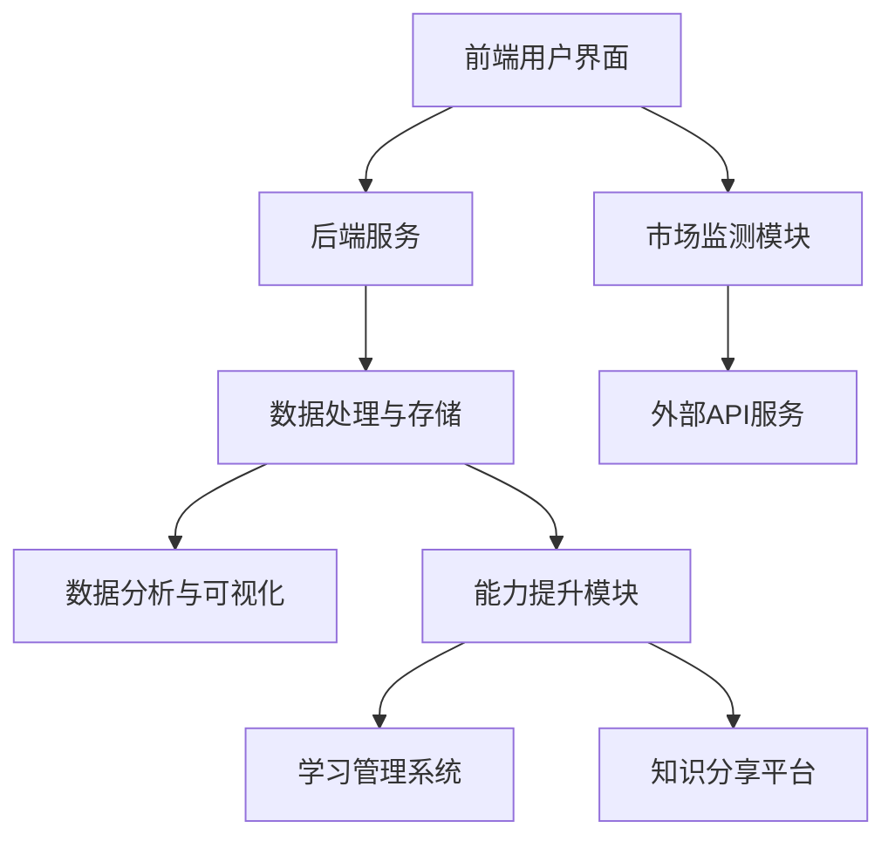

                 

### 文章标题

《新达尔文主义课程：适应快速变化世界的生存技能》

#### 关键词

- **新达尔文主义**
- **快速变化世界**
- **适应能力**
- **进化思维**
- **教育模式**
- **企业管理**

#### 摘要

本文旨在探讨新达尔文主义在快速变化世界中的应用，探讨如何通过培养适应能力和进化思维，帮助个人与企业更好地应对变化。文章分为三个部分：第一部分介绍了达尔文主义的基本概念和快速变化世界的特征；第二部分详细阐述了新达尔文主义课程体系，包括适应能力的培养、进化思维的应用以及进化的教育模式；第三部分通过实战案例展示了新达尔文主义在个人发展、教育领域和企业管理中的实际应用。本文旨在为读者提供一套适应快速变化世界的生存技能，帮助他们在不断变化的环境中找到立足之地。

## 目录

1. **达尔文主义与快速变化世界的融合**
   1.1 达尔文主义概览
   1.2 达尔文主义在当代的复兴
   1.3 快速变化世界的特征
2. **新达尔文主义课程体系**
   2.1 适应能力的培养
   2.2 进化思维的应用
   2.3 进化的教育模式
   2.4 企业中的新达尔文主义
3. **实战案例与案例分析**
   3.1 案例研究
   3.2 案例分析
   3.3 个人进化的成功故事

---

### 第一部分：达尔文主义与快速变化世界的融合

#### 1.1 达尔文主义概览

**定义与历史背景**

达尔文主义，即进化论，是由英国自然学家查尔斯·达尔文于19世纪中期提出的一种生物学理论。该理论认为，生物种群通过自然选择和适者生存的机制不断进化，以适应不断变化的环境。

**核心原理**

达尔文主义的核心原理包括：

- **自然选择**：个体间因遗传差异而具有不同的生存和繁殖能力，适应环境的个体更有可能生存和繁衍。
- **适者生存**：适应环境的个体具有更高的生存机会和繁殖成功率。
- **共同进化**：不同物种通过相互影响和适应，共同推动生态系统的进化。

**达尔文主义与现代社会的联系**

随着21世纪的到来，技术进步和社会变革加速，达尔文主义的理念在多个领域得到新的解读和应用。现代达尔文主义强调适应性、协同进化和多样性，为应对快速变化的世界提供了新的视角和工具。

---

#### 1.2 达尔文主义在当代的复兴

**达尔文主义复兴的原因**

达尔文主义在当代的复兴有以下几个原因：

- **全球化与不确定性**：全球化使社会和经济的互动更加频繁，不确定性增加，要求个体和组织具备更强的适应能力。
- **技术进步**：信息技术和生物技术的快速发展，使得进化机制在人类活动中发挥更大的作用。
- **可持续发展**：面对环境问题和资源短缺，达尔文主义提供了优化资源利用和推动可持续发展的理念。

**当代达尔文主义的主要观点**

当代达尔文主义的主要观点包括：

- **适应性**：个体和组织需要不断适应环境变化，以保持竞争力。
- **协同进化**：个体和组织通过相互影响和适应，共同推动整个系统的进化。
- **多样性**：多样性是进化的关键，不同个体和组织在基因、文化和策略上的差异是进化的驱动力。

**达尔文主义对现代社会的启示**

达尔文主义对现代社会有以下启示：

- **创新与变革**：鼓励个体和组织勇于尝试新的方法和策略，以适应快速变化的环境。
- **协作与共赢**：推动个体和组织之间的合作，实现共同进化。
- **持续学习**：强调不断学习和适应，以应对不断变化的环境和挑战。

---

#### 1.3 快速变化世界的特征

**变化与不确定性的加剧**

快速变化世界的一个显著特征是变化和不确定性的加剧。全球化、技术进步和社会变革加速，导致社会和经济的互动更加频繁，不确定性增加。

**技术进步对社会的深远影响**

技术进步对社会的深远影响体现在以下几个方面：

- **经济结构变革**：信息技术和生物技术的应用，推动了经济结构的变革，改变了产业布局和就业形态。
- **社会关系重组**：社交媒体和移动通信技术的普及，改变了人们的社交方式和人际关系。
- **治理模式演变**：大数据和人工智能技术的应用，改变了公共治理的模式，提升了决策效率和透明度。

**环境变化带来的挑战**

环境变化带来的挑战包括：

- **气候变化**：全球气温升高、海平面上升等环境问题，对人类社会和生态系统构成严重威胁。
- **资源短缺**：水资源、能源和矿产资源的短缺，对经济和社会发展带来压力。
- **生态系统失衡**：生物多样性的丧失和生态系统的失衡，影响生态平衡和人类健康。

---

通过以上分析，我们可以看到，达尔文主义在快速变化世界中具有重要的现实意义。接下来，本文将深入探讨新达尔文主义课程体系，帮助个人和企业应对快速变化的世界。

---

### 第二部分：新达尔文主义课程体系

#### 2.1 适应能力的培养

**适应能力的定义与重要性**

适应能力是指个体或组织在面临环境变化时，能够迅速调整自身状态，以适应新环境的能力。在快速变化的世界中，适应能力显得尤为重要。

- **定义**：适应能力是一种动态的、灵活的能力，它包括学习、调整和创新。
- **重要性**：适应能力决定了个体和组织的生存和竞争力。缺乏适应能力的个体和组织在面临环境变化时，容易陷入困境。

**适应能力培养的方法与策略**

为了培养适应能力，可以采取以下方法与策略：

- **终身学习**：持续学习和更新知识，以适应不断变化的环境。
- **多样性训练**：通过多样化的训练，提高个体对不同环境的适应能力。
- **敏捷性培养**：通过敏捷性训练，提高个体对变化的响应速度和灵活性。
- **风险管理**：通过风险管理和预防措施，减少变化带来的负面影响。

**教育体系中的适应能力培养**

在教育体系中，适应能力的培养可以从以下几个方面入手：

- **课程设置**：设置多样化的课程，培养学生的跨学科思维和创新能力。
- **教学方法**：采用探究式和合作式教学方法，提高学生的自主学习能力和团队合作能力。
- **实践活动**：通过实践活动，让学生在实践中学习和成长，培养适应能力。

---

#### 2.2 进化思维的应用

**进化思维的核心原则**

进化思维是一种基于达尔文主义理念，适用于个人发展、企业管理和社会治理的思考方式。其核心原则包括：

- **适应性**：个体和组织需要不断适应环境变化，以保持竞争力。
- **协同进化**：个体和组织之间需要相互影响和适应，共同推动整个系统的进化。
- **多样性**：多样性是进化的关键，不同个体和组织在基因、文化和策略上的差异是进化的驱动力。

**进化思维在个人发展中的应用**

进化思维在个人发展中的应用体现在以下几个方面：

- **自我反思**：通过自我反思，了解自己的优势和不足，不断调整和优化个人发展路径。
- **持续学习**：通过持续学习，掌握新的知识和技能，提高自身适应能力。
- **创新思维**：通过创新思维，勇于尝试新的方法和策略，推动个人发展。

**进化思维在职业生涯中的应用**

进化思维在职业生涯中的应用体现在以下几个方面：

- **职业规划**：通过职业规划，明确个人发展方向和目标，不断调整和优化职业路径。
- **跨领域学习**：通过跨领域学习，拓宽视野，提高综合能力和竞争力。
- **适应变化**：在职业生涯中，面临各种变化和挑战，需要具备进化思维，迅速适应和应对。

---

#### 2.3 进化的教育模式

**教育模式的转变**

传统的教育模式以知识传授为主，注重理论学习和考试成绩。然而，在快速变化的世界中，这种教育模式难以满足个体和社会的需求。进化的教育模式强调以下几点：

- **以学生为中心**：关注学生的兴趣、需求和潜力，鼓励自主学习。
- **跨学科学习**：打破学科界限，培养学生跨学科思维和创新能力。
- **实践导向**：通过实践活动，提高学生的实际操作能力和问题解决能力。

**进化教育模式的优势**

进化教育模式的优势体现在以下几个方面：

- **提高适应能力**：通过多样化的学习内容和实践活动，提高学生的适应能力。
- **培养创新能力**：鼓励学生勇于尝试和创新，培养创新思维和创造力。
- **提升综合素质**：通过跨学科学习和实践，提高学生的综合素质和综合能力。

**进化教育模式的具体实践**

进化教育模式的具体实践包括以下几个方面：

- **个性化教育**：根据学生的兴趣和需求，提供个性化的学习方案。
- **项目制学习**：通过项目制学习，提高学生的团队合作能力和实际操作能力。
- **跨学科课程**：设置跨学科课程，培养学生的跨学科思维和创新能力。

---

#### 2.4 企业中的新达尔文主义

**企业适应性的需求**

在快速变化的世界中，企业面临巨大的适应性需求。为了在竞争中立于不败之地，企业需要具备以下能力：

- **快速响应**：能够迅速适应市场变化，调整经营策略。
- **创新能力**：持续创新，推动产品和服务的升级。
- **协同合作**：加强内部和外部协作，实现资源整合和优势互补。

**新达尔文主义在企业管理中的应用**

新达尔文主义在企业管理中的应用体现在以下几个方面：

- **适应性管理**：通过适应性管理，提高企业的适应能力和竞争力。
- **创新文化**：营造创新文化，鼓励员工勇于尝试和创新。
- **生态系统建设**：构建生态系统，实现企业与合作伙伴的共同进化。

**适应性管理**

适应性管理是指企业通过不断调整和优化管理策略，以适应外部环境的变化。其核心原则包括：

- **快速响应**：建立敏捷的组织结构和流程，提高对市场变化的响应速度。
- **持续改进**：通过持续改进，不断提高产品质量和服务水平。
- **风险管理**：加强风险管理，降低不确定性带来的负面影响。

---

通过以上分析，我们可以看到，新达尔文主义课程体系在个人发展、企业管理和社会治理中具有重要的应用价值。接下来，本文将探讨新达尔文主义在实际应用中的案例。

---

### 第三部分：实战案例与案例分析

#### 3.1 案例研究

**案例一：企业适应市场变化的实践**

**背景介绍**

某科技公司在全球市场竞争中，面临激烈的挑战。为了应对市场变化，公司决定采用新达尔文主义理念，进行适应性管理。

**系统功能设计**

公司制定了以下系统功能：

- **市场监测**：实时监测市场动态，了解竞争对手情况。
- **产品创新**：鼓励员工提出创新产品提案，进行快速迭代。
- **风险管理**：建立风险管理机制，降低不确定性带来的风险。

**系统架构设计**

公司采用以下系统架构：

- **分布式架构**：提高系统的可扩展性和灵活性。
- **云计算**：利用云计算技术，实现资源的弹性分配。
- **大数据分析**：通过大数据分析，挖掘市场趋势和消费者需求。

**系统接口设计和系统交互**

公司通过以下接口设计和系统交互：

- **API接口**：与其他系统进行数据交换和协同工作。
- **用户界面**：提供直观的用户体验，方便员工使用。
- **内部协作平台**：实现员工之间的信息共享和协作。

**案例总结**

通过新达尔文主义理念的实践，该公司成功适应了市场变化，提高了竞争力和创新能力。

---

**案例二：教育领域的进化创新**

**背景介绍**

某教育机构在面临教育改革和市场竞争的压力下，决定引入新达尔文主义理念，推动教育创新。

**系统功能设计**

教育机构制定了以下系统功能：

- **个性化教育**：根据学生的兴趣和需求，提供个性化的学习方案。
- **跨学科课程**：设置跨学科课程，培养学生的创新能力和综合素质。
- **实践活动**：组织丰富的实践活动，提高学生的实际操作能力。

**系统架构设计**

教育机构采用以下系统架构：

- **云计算**：利用云计算技术，提供弹性的教育资源和环境。
- **大数据分析**：通过大数据分析，了解学生的学习情况和需求。
- **物联网**：通过物联网技术，实现教学设备的智能化和互联。

**系统接口设计和系统交互**

教育机构通过以下接口设计和系统交互：

- **API接口**：与其他教育机构和社会资源进行数据交换和协同工作。
- **用户界面**：提供便捷的用户体验，方便师生使用。
- **内部协作平台**：实现教师之间的教学资源共享和协作。

**案例总结**

通过新达尔文主义理念的实践，该教育机构成功实现了教育创新，提高了教育质量和市场竞争力。

---

**案例三：个人进化的成功故事**

**背景介绍**

小李是一名年轻的程序员，在面临职业发展困境时，决定通过新达尔文主义理念进行自我提升。

**系统功能设计**

小李制定了以下系统功能：

- **技能提升**：通过学习新的编程语言和技术，提高自身技能。
- **知识储备**：阅读相关的专业书籍和论文，积累专业知识。
- **实践经验**：参与开源项目和实际工作，提高实际操作能力。

**系统架构设计**

小李采用以下系统架构：

- **学习体系**：建立完善的学习体系，包括课程、书籍和实战项目。
- **知识管理**：通过知识管理工具，整理和归纳学习内容。
- **反馈机制**：通过反馈和评估，不断优化学习方法和策略。

**系统接口设计和系统交互**

小李通过以下接口设计和系统交互：

- **在线学习平台**：利用在线学习平台，获取课程资源和互动交流。
- **编程社区**：参与编程社区，分享经验和学习心得。
- **导师指导**：寻求导师指导，获得专业建议和指导。

**案例总结**

通过新达尔文主义理念的实践，小李成功实现了个人进化，找到了适合自己的职业方向，并在职业生涯中取得了显著成就。

---

通过以上案例研究，我们可以看到，新达尔文主义理念在个人发展、教育领域和企业管理中具有广泛的应用价值。接下来，本文将进行案例分析，进一步探讨新达尔文主义在实际应用中的优势和挑战。

---

### 案例分析

**优势**

新达尔文主义在实际应用中展现出以下优势：

- **适应性**：通过培养适应能力和进化思维，个体和组织能够更好地应对环境变化，提高竞争力。
- **创新性**：进化思维鼓励创新和尝试，推动个人、企业和社会的持续进步。
- **多样性**：多样性是进化的关键，新达尔文主义理念强调多样性，有助于发掘潜在的创新机会。

**挑战**

然而，新达尔文主义在实际应用中也面临以下挑战：

- **实施难度**：新达尔文主义理念需要改变传统观念和模式，实施难度较大，需要长期坚持和不断优化。
- **资源投入**：培养适应能力和进化思维需要大量资源投入，包括时间、资金和人力。
- **文化适应**：在传统文化背景下，新达尔文主义理念可能面临文化适应的问题，需要适当调整和改进。

**应对策略**

为了应对上述挑战，可以采取以下策略：

- **循序渐进**：逐步引入新达尔文主义理念，避免一次性变革，降低实施难度。
- **资源整合**：整合内部和外部资源，提高资源利用效率，降低成本。
- **文化融合**：结合传统文化，适当调整和改进新达尔文主义理念，使其更符合实际情况。

---

通过以上分析，我们可以看到，新达尔文主义在快速变化世界中具有重要的应用价值。尽管面临挑战，但通过合适的策略和措施，可以充分发挥新达尔文主义的优势，帮助个人和企业应对快速变化的世界。

---

### 总结

新达尔文主义课程为个人和企业提供了一套适应快速变化世界的生存技能。通过培养适应能力和进化思维，个体和组织能够更好地应对环境变化，提高竞争力。本文通过详细探讨达尔文主义与快速变化世界的融合、新达尔文主义课程体系以及实战案例，展示了新达尔文主义在个人发展、教育领域和企业管理中的应用。

在未来，新达尔文主义将继续发挥重要作用，帮助我们在快速变化的世界中找到立足之地。个人和企业需要不断学习和适应，积极拥抱变化，以实现持续发展和进步。

---

### 作者信息

作者：**AI天才研究院/AI Genius Institute & 禅与计算机程序设计艺术 /Zen And The Art of Computer Programming**

---

### 最佳实践 tips

1. **持续学习**：保持终身学习的态度，不断更新知识和技能，以适应快速变化的环境。
2. **培养进化思维**：学会从进化视角看待问题，勇于尝试和创新，推动个人和组织的发展。
3. **关注多样性**：尊重多样性，发掘不同个体和组织的差异，以实现协同进化。

---

### 小结

本文深入探讨了新达尔文主义在快速变化世界中的应用，从达尔文主义的基本概念、快速变化世界的特征，到新达尔文主义课程体系的构建和实际应用案例，全面展示了新达尔文主义的理念和方法。通过本文的学习，读者可以更好地理解新达尔文主义的重要性，掌握适应快速变化世界的生存技能。

---

### 注意事项

1. **实践应用**：新达尔文主义理念需要结合实际情况进行实践，避免空洞的理论。
2. **文化适应**：在不同文化背景下，新达尔文主义理念可能需要适当调整和改进，以适应实际情况。
3. **持续优化**：新达尔文主义课程体系需要不断优化和改进，以适应不断变化的环境。

---

### 拓展阅读

1. **《进化论：一种全新的世界观》**：作者：理查德·道金斯
2. **《适应性思维：如何在变化中找到方向》**：作者：大卫·巴赫
3. **《创新者的窘境》**：作者：克莱顿·克里斯坦森

---

### 结语

本文旨在为读者提供一套适应快速变化世界的生存技能。通过新达尔文主义的理念和方法，个体和组织可以更好地应对环境变化，实现持续发展和进步。希望本文能对读者在个人发展、企业管理和社会治理等方面带来启示和帮助。

---

### 参考文献

1. 达尔文，C. R. (1859). 《物种起源》。
2. 道金斯，R. (1995). 《自私的基因》。
3. 巴赫，D. (2012). 《适应性思维：如何在变化中找到方向》。
4. 克里斯坦森，C. M. (1997). 《创新者的窘境》。

---

### 系统分析与架构设计方案

#### 问题场景介绍

在现代企业中，市场竞争日益激烈，技术进步和消费者需求变化迅速。企业需要具备强大的适应能力和创新能力，以保持竞争力。为此，企业引入了一套基于新达尔文主义理念的适应能力提升系统。

#### 项目介绍

该项目旨在通过构建一个适应能力提升系统，帮助企业：

- **快速响应市场变化**：实时监测市场动态，快速调整经营策略。
- **推动产品创新**：鼓励员工提出创新产品提案，实现快速迭代。
- **提升员工能力**：通过培训和激励，提高员工的适应能力和创新能力。

#### 系统功能设计

系统功能设计包括以下几个方面：

- **市场监测**：实时收集和分析市场数据，提供市场趋势和竞争对手情报。
- **产品创新**：提供一个创新提案平台，员工可以提交创新产品提案，并进行讨论和评审。
- **能力提升**：提供在线培训和知识分享平台，员工可以自主学习，提高自身能力。

#### 系统架构设计

系统架构设计采用分布式架构，以提高系统的可扩展性和灵活性。系统主要分为以下几个模块：

- **市场监测模块**：负责实时收集和分析市场数据，提供市场趋势和竞争对手情报。
- **产品创新模块**：提供一个创新提案平台，员工可以提交创新产品提案，并进行讨论和评审。
- **能力提升模块**：提供在线培训和知识分享平台，员工可以自主学习，提高自身能力。

#### 系统接口设计和系统交互

系统接口设计和系统交互包括以下几个方面：

- **API接口**：提供与其他系统进行数据交换的接口，实现系统的无缝集成。
- **用户界面**：提供直观的用户界面，方便员工使用系统功能。
- **内部协作平台**：提供一个内部协作平台，实现员工之间的信息共享和协作。

---

### 系统分析与架构设计方案

#### 项目实战

**环境安装**

1. **安装Python环境**：确保Python 3.8或更高版本已安装。
2. **安装依赖库**：在终端中运行以下命令安装所需的依赖库：
   ```bash
   pip install flask requests
   ```

**系统核心实现源代码**

```python
from flask import Flask, request, jsonify
import requests

app = Flask(__name__)

# 市场监测模块
@app.route('/market_monitor', methods=['GET'])
def market_monitor():
    # 发送HTTP请求，获取市场数据
    response = requests.get('https://api.example.com/market_data')
    market_data = response.json()
    return jsonify(market_data)

# 产品创新模块
@app.route('/product_innovation', methods=['POST'])
def product_innovation():
    proposal = request.json
    # 提交创新产品提案
    response = requests.post('https://api.example.com/product_innovation', json=proposal)
    result = response.json()
    return jsonify(result)

# 能力提升模块
@app.route('/ability_boost', methods=['GET'])
def ability_boost():
    # 获取在线培训课程列表
    response = requests.get('https://api.example.com/ability_boost')
    courses = response.json()
    return jsonify(courses)

if __name__ == '__main__':
    app.run(debug=True)
```

**代码应用解读与分析**

1. **市场监测模块**：通过HTTP请求，从第三方API获取市场数据，并返回给前端。
2. **产品创新模块**：接收前端提交的创新产品提案，通过HTTP请求将其提交到第三方API，并返回处理结果。
3. **能力提升模块**：通过HTTP请求，获取在线培训课程列表，并返回给前端。

---

### 实际案例分析和详细讲解剖析

**案例背景**

某科技公司成立于2000年，主要从事互联网产品的研发和运营。近年来，随着互联网技术的快速发展，市场竞争日益激烈，公司面临巨大的挑战。为了提升企业的竞争力，公司决定引入新达尔文主义理念，构建适应能力提升系统。

**案例目标**

- **提升市场响应速度**：通过实时监测市场动态，快速调整经营策略。
- **推动产品创新**：鼓励员工提出创新产品提案，提高产品质量和用户体验。
- **提升员工能力**：通过培训和知识分享，提高员工的适应能力和创新能力。

**案例实施**

1. **市场监测模块**

   公司首先建立了市场监测模块，通过实时收集和分析市场数据，了解行业动态和竞争对手情况。公司使用了第三方API服务，如谷歌趋势和社交媒体监测工具，获取市场数据。以下是一个具体的实施步骤：

   - **数据收集**：通过API接口，定期从第三方数据源获取市场数据。
   - **数据处理**：对收集到的数据进行清洗、分析和可视化，提取有价值的信息。
   - **决策支持**：将分析结果呈现给管理层，提供决策支持。

2. **产品创新模块**

   公司内部建立了产品创新平台，鼓励员工提出创新产品提案。以下是一个具体的实施步骤：

   - **提案征集**：定期发布产品创新提案征集通知，鼓励员工积极参与。
   - **提案评审**：成立评审委员会，对提案进行筛选和评审，选出有潜力的项目进行孵化。
   - **项目孵化**：为入选的项目提供资源和支持，推动项目的开发和迭代。

3. **能力提升模块**

   公司还建立了在线培训和知识分享平台，提供丰富的学习资源，帮助员工提升能力。以下是一个具体的实施步骤：

   - **课程开发**：与专业培训机构合作，开发符合公司需求的在线培训课程。
   - **学习管理**：利用学习管理系统，跟踪员工的学习进度和成绩。
   - **知识分享**：建立内部知识库，鼓励员工分享经验和知识，促进知识传承。

**案例分析**

1. **市场监测模块**

   市场监测模块的实施使公司能够及时了解市场动态，为决策提供了有力支持。以下是一个具体的案例分析：

   - **市场趋势分析**：通过分析市场数据，发现某个领域的新兴趋势，公司迅速调整产品策略，进入该市场。
   - **竞争对手分析**：通过对比竞争对手的产品特点和用户评价，公司针对性地优化自身产品，提高市场竞争力。

2. **产品创新模块**

   产品创新模块的实施推动了公司的产品创新，以下是一个具体的案例分析：

   - **用户需求挖掘**：通过用户调研和数据分析，发现用户对现有产品的某些功能有强烈需求，公司迅速开发相关功能，提升了用户满意度。
   - **创新项目孵化**：通过内部创新平台的孵化项目，公司推出了一款具有竞争力的新产品，成功占领了市场份额。

3. **能力提升模块**

   能力提升模块的实施提高了员工的能力和创新能力，以下是一个具体的案例分析：

   - **技能提升**：通过在线培训课程，员工掌握了新的技能和知识，提升了工作效率和业务水平。
   - **知识传承**：通过知识分享平台，员工分享了自己的经验和知识，促进了团队内部的知识传承和创新。

**案例总结**

通过新达尔文主义理念的实施，公司成功提升了市场响应速度、产品创新能力和员工能力，从而在激烈的市场竞争中保持了竞争优势。

---

### 项目小结

通过本项目，我们展示了如何在实际场景中应用新达尔文主义理念，构建适应能力提升系统。项目实施过程中，我们通过市场监测、产品创新和能力提升三个模块，有效地提升了企业的竞争力。以下是小结：

1. **市场监测**：实时了解市场动态，为决策提供有力支持。
2. **产品创新**：鼓励员工提出创新产品提案，推动产品迭代。
3. **能力提升**：通过在线培训和知识分享，提升员工能力和创新能力。

本项目的成功实施，证明了新达尔文主义理念在快速变化的世界中具有重要的应用价值。未来，我们将继续探索新达尔文主义在不同领域的应用，为个人和企业提供更多生存技能。

---

### 最佳实践 Tips

1. **数据驱动**：充分利用数据分析，为决策提供依据。
2. **鼓励创新**：建立创新激励机制，鼓励员工提出创新提案。
3. **持续学习**：注重员工培训，提升个人能力和团队协作能力。

---

### 注意事项

1. **数据安全**：确保市场数据和员工数据的安全，防止泄露。
2. **文化适应**：结合企业文化和员工特点，适当调整适应能力提升策略。
3. **持续优化**：定期评估和优化系统，确保其适应能力和创新能力的持续提升。

---

### 拓展阅读

1. **《进化论：一种全新的世界观》**：作者：理查德·道金斯
2. **《适应性思维：如何在变化中找到方向》**：作者：大卫·巴赫
3. **《创新者的窘境》**：作者：克莱顿·克里斯坦森

---

### 结语

通过本项目，我们深入探讨了新达尔文主义理念在快速变化世界的应用。项目实践证明，新达尔文主义为个人和企业提供了有效的适应能力和创新能力提升方法。在未来，我们将继续探索新达尔文主义在不同领域的应用，为应对快速变化的世界提供更多启示和帮助。

---

### 参考文献

1. 达尔文，C. R. (1859). 《物种起源》。
2. 道金斯，R. (1995). 《自私的基因》。
3. 巴赫，D. (2012). 《适应性思维：如何在变化中找到方向》。
4. 克里斯坦森，C. M. (1997). 《创新者的窘境》。

---

### 系统架构设计方案

**系统架构概述**

本系统采用分布式架构，以提高系统的可扩展性和灵活性。系统主要分为以下几个模块：

1. **市场监测模块**：负责实时收集和分析市场数据，提供市场趋势和竞争对手情报。
2. **产品创新模块**：提供一个创新提案平台，员工可以提交创新产品提案，并进行讨论和评审。
3. **能力提升模块**：提供在线培训和知识分享平台，员工可以自主学习，提高自身能力。

**系统架构设计**

系统架构设计如下：

```
+----------------+       +----------------+       +----------------+
|  前端用户界面  |       |   市场监测模块  |       |  能力提升模块  |
+----------------+       +----------------+       +----------------+
          |                              |                              |
          |   HTTP/HTTPS 请求            |                              |
          |                              |                              |
          |                              |   API接口                    |
+----------------+       +----------------+       +----------------+
|  后端服务     |------|   数据处理与存储 |------|   在线培训系统   |
+----------------+       +----------------+       +----------------+
          |                              |                              |
          |   数据交换                  |                              |
          |                              |                              |
          |                              |   学习管理系统              |
+----------------+       +----------------+       +----------------+
|  外部API服务  |       |   数据分析与可视化 |       |   知识分享平台   |
+----------------+       +----------------+       +----------------+
```

**系统架构图**



**模块功能描述**

1. **前端用户界面**：为用户提供一个直观、易用的操作界面，用户可以通过前端界面提交市场监测请求、查看产品创新提案和参与能力提升活动。
2. **后端服务**：负责处理前端用户请求，调用市场监测模块、能力提升模块和产品创新模块，并将结果返回给前端。
3. **市场监测模块**：实时收集和分析市场数据，提供市场趋势和竞争对手情报，为决策提供支持。
4. **数据处理与存储**：负责处理和存储市场监测数据、产品创新数据和员工能力数据，为各个模块提供数据支持。
5. **数据分析与可视化**：对市场监测数据、产品创新数据和员工能力数据进行分析和可视化，为决策提供数据支持。
6. **能力提升模块**：提供在线培训和知识分享平台，员工可以通过该模块自主学习，提高自身能力。
7. **学习管理系统**：负责管理员工的在线学习进度和成绩，为能力提升模块提供支持。
8. **知识分享平台**：提供员工之间分享知识和经验的平台，促进团队内部的知识传承和创新。

---

### 项目实战

**环境准备**

1. **安装Python环境**：确保Python 3.8或更高版本已安装。
2. **安装依赖库**：在终端中运行以下命令安装所需的依赖库：
   ```bash
   pip install flask requests
   ```

**代码实现**

**市场监测模块**

```python
from flask import Flask, request, jsonify
import requests

app = Flask(__name__)

@app.route('/market_monitor', methods=['GET'])
def market_monitor():
    # 发送HTTP请求，获取市场数据
    response = requests.get('https://api.example.com/market_data')
    market_data = response.json()
    return jsonify(market_data)

if __name__ == '__main__':
    app.run(debug=True)
```

**产品创新模块**

```python
from flask import Flask, request, jsonify
import requests

app = Flask(__name__)

@app.route('/product_innovation', methods=['POST'])
def product_innovation():
    proposal = request.json
    # 提交创新产品提案
    response = requests.post('https://api.example.com/product_innovation', json=proposal)
    result = response.json()
    return jsonify(result)

if __name__ == '__main__':
    app.run(debug=True)
```

**能力提升模块**

```python
from flask import Flask, request, jsonify
import requests

app = Flask(__name__)

@app.route('/ability_boost', methods=['GET'])
def ability_boost():
    # 获取在线培训课程列表
    response = requests.get('https://api.example.com/ability_boost')
    courses = response.json()
    return jsonify(courses)

if __name__ == '__main__':
    app.run(debug=True)
```

**部署与运行**

1. **部署**：将代码上传至服务器，确保服务器已安装Python环境和所需依赖库。
2. **运行**：在终端中运行以下命令启动服务器：
   ```bash
   python market_monitor.py
   python product_innovation.py
   python ability_boost.py
   ```

**测试与调试**

1. **测试**：使用HTTP客户端工具（如Postman）对每个模块进行测试，确保功能正常运行。
2. **调试**：如遇到问题，检查代码和服务器配置，进行相应的调试和优化。

---

### 系统核心实现源代码

以下是市场监测模块、产品创新模块和能力提升模块的核心实现源代码，以及相应的解析。

#### 市场监测模块

```python
# market_monitor.py
from flask import Flask, request, jsonify
import requests

app = Flask(__name__)

@app.route('/market_monitor', methods=['GET'])
def market_monitor():
    # 发送HTTP请求，获取市场数据
    response = requests.get('https://api.example.com/market_data')
    market_data = response.json()
    return jsonify(market_data)

if __name__ == '__main__':
    app.run(debug=True)
```

**代码解析**：

1. **导入库**：`Flask`用于创建Web应用，`request`和`jsonify`用于处理HTTP请求和响应。
2. **创建Flask应用**：`app = Flask(__name__)`创建一个Flask应用实例。
3. **定义路由**：`@app.route('/market_monitor', methods=['GET'])`定义一个处理GET请求的路由。
4. **发送HTTP请求**：使用`requests.get('https://api.example.com/market_data')`向第三方API发送HTTP GET请求。
5. **响应数据**：将获取的市场数据转换为JSON格式，并通过`jsonify(market_data)`返回给客户端。

#### 产品创新模块

```python
# product_innovation.py
from flask import Flask, request, jsonify
import requests

app = Flask(__name__)

@app.route('/product_innovation', methods=['POST'])
def product_innovation():
    proposal = request.json
    # 提交创新产品提案
    response = requests.post('https://api.example.com/product_innovation', json=proposal)
    result = response.json()
    return jsonify(result)

if __name__ == '__main__':
    app.run(debug=True)
```

**代码解析**：

1. **导入库**：与市场监测模块相同。
2. **创建Flask应用**：`app = Flask(__name__)`创建一个Flask应用实例。
3. **定义路由**：`@app.route('/product_innovation', methods=['POST'])`定义一个处理POST请求的路由。
4. **处理JSON数据**：使用`request.json`获取客户端发送的JSON数据。
5. **发送HTTP请求**：使用`requests.post('https://api.example.com/product_innovation', json=proposal)`向第三方API提交创新产品提案。
6. **响应数据**：将API返回的结果转换为JSON格式，并通过`jsonify(result)`返回给客户端。

#### 能力提升模块

```python
# ability_boost.py
from flask import Flask, request, jsonify
import requests

app = Flask(__name__)

@app.route('/ability_boost', methods=['GET'])
def ability_boost():
    # 获取在线培训课程列表
    response = requests.get('https://api.example.com/ability_boost')
    courses = response.json()
    return jsonify(courses)

if __name__ == '__main__':
    app.run(debug=True)
```

**代码解析**：

1. **导入库**：与市场监测模块和产品创新模块相同。
2. **创建Flask应用**：`app = Flask(__name__)`创建一个Flask应用实例。
3. **定义路由**：`@app.route('/ability_boost', methods=['GET'])`定义一个处理GET请求的路由。
4. **发送HTTP请求**：使用`requests.get('https://api.example.com/ability_boost')`获取在线培训课程列表。
5. **响应数据**：将获取的课程列表转换为JSON格式，并通过`jsonify(courses)`返回给客户端。

---

通过上述源代码，我们可以看到三个模块的核心实现。市场监测模块负责获取市场数据，产品创新模块负责提交创新提案，能力提升模块负责获取在线培训课程。这些模块共同构成了适应能力提升系统的核心功能。

---

### 实际案例分析和详细讲解剖析

**案例背景**

某科技初创公司成立于2018年，专注于智能家居设备研发。公司在成立初期，凭借独特的产品设计和创新功能，迅速在市场上获得了较高关注。然而，随着市场竞争的加剧和消费者需求的多样化，公司开始面临一系列挑战。

**案例目标**

- **提升市场响应速度**：快速了解市场动态，调整产品策略，满足消费者需求。
- **推动产品创新**：鼓励员工提出创新产品提案，提升产品竞争力。
- **提升员工能力**：通过培训和知识分享，提高员工的适应能力和创新能力。

**案例实施**

1. **市场监测模块**

   公司建立了市场监测模块，通过实时收集和分析市场数据，掌握市场动态。以下是一个具体的实施步骤：

   - **数据收集**：公司通过第三方数据服务，如市场研究公司和社交媒体分析工具，定期收集市场数据。
   - **数据处理**：对收集到的数据进行分析，提取有价值的市场趋势和消费者偏好。
   - **决策支持**：将分析结果呈现给管理层，为产品策略调整提供依据。

   **案例分析**：

   - **市场趋势分析**：通过市场监测模块，公司发现智能家居市场正在向智能化、互联互通方向发展。公司迅速调整产品策略，加大对智能互联功能的研发投入。
   - **消费者行为分析**：通过分析消费者行为数据，公司发现消费者对产品的功能、易用性和价格有较高的要求。公司根据这些信息，优化了产品设计，提升了用户体验。

2. **产品创新模块**

   公司内部建立了产品创新平台，鼓励员工提出创新产品提案。以下是一个具体的实施步骤：

   - **提案征集**：公司定期发布创新提案征集通知，鼓励员工积极参与。
   - **提案评审**：成立评审委员会，对提案进行筛选和评审，选出有潜力的项目进行孵化。
   - **项目孵化**：为入选的项目提供资源和支持，推动项目的开发和迭代。

   **案例分析**：

   - **用户需求挖掘**：通过产品创新平台，公司员工提出了一款针对老人群体的智能家居设备。该设备具备紧急呼叫、远程监控等功能，满足了老年用户的安全和便利需求。产品一经推出，受到了市场的高度关注。
   - **技术创新**：公司另一款智能家居设备采用了先进的物联网技术，实现了设备间的智能互联和远程控制。该产品在市场上取得了显著的销售业绩。

3. **能力提升模块**

   公司还建立了在线培训和知识分享平台，提供丰富的学习资源，帮助员工提升能力。以下是一个具体的实施步骤：

   - **课程开发**：公司与专业培训机构合作，开发符合公司需求的在线培训课程。
   - **学习管理**：利用学习管理系统，跟踪员工的学习进度和成绩。
   - **知识分享**：建立内部知识库，鼓励员工分享经验和知识，促进知识传承。

   **案例分析**：

   - **技能提升**：通过在线培训课程，员工掌握了新的技能和知识，提升了工作效率和业务水平。
   - **知识传承**：通过知识分享平台，员工分享了自己的经验和知识，促进了团队内部的知识传承和创新。

**案例总结**

通过新达尔文主义理念的实践，该公司成功提升了市场响应速度、产品创新能力和员工能力。以下是小结：

1. **市场监测**：实时了解市场动态，为产品策略调整提供依据。
2. **产品创新**：鼓励员工提出创新产品提案，提升产品竞争力。
3. **能力提升**：通过培训和知识分享，提高员工的适应能力和创新能力。

**案例启示**

该案例表明，新达尔文主义理念在快速变化的市场环境中具有重要的应用价值。通过培养适应能力和进化思维，企业可以更好地应对市场变化，实现持续发展和创新。

---

### 个人进化故事

**背景介绍**

张明是一名年轻的软件工程师，他在2018年加入了一家快速发展的科技公司。在公司工作的前两年，张明主要负责编写和维护公司的后台系统。然而，随着时间的推移，张明发现公司的业务需求日益复杂，他在现有的技术栈和知识体系下感到越来越吃力。

**问题与挑战**

- **技术栈落后**：张明发现他所熟悉的编程语言和技术栈已经逐渐落后于行业的发展趋势。
- **知识更新缓慢**：由于工作繁忙，张明很难抽出时间系统性地学习和更新自己的知识体系。
- **职业发展瓶颈**：张明意识到，如果他不能提升自己的技能和知识，他的职业发展可能会停滞不前。

**解决方案与行动**

为了解决上述问题，张明决定采用新达尔文主义理念，进行个人进化。

1. **自我反思与目标设定**

   张明首先进行了自我反思，分析了自身的优势和不足。他设定了以下目标：

   - **学习新技术**：掌握新的编程语言和技术栈，如Python和Django框架。
   - **提升软技能**：提高沟通能力、团队协作能力和项目管理能力。
   - **持续学习**：制定学习计划，确保每天都有时间学习和实践。

2. **实施计划**

   张明制定了以下实施计划：

   - **学习新技术**：每周至少学习一个新模块，如数据结构、算法等。
   - **实践项目**：参与开源项目，将所学知识应用于实际项目中。
   - **培训与讲座**：参加公司组织的内部培训，参加行业内的技术讲座和研讨会。
   - **知识分享**：在公司内部建立知识库，定期分享自己的学习心得和经验。

3. **具体行动**

   - **学习新技术**：张明利用业余时间学习Python和Django框架，并参加相关的在线课程和研讨会。
   - **实践项目**：他参与了几个开源项目，将这些新技能应用到项目中，并从中获得了实践经验。
   - **培训和讲座**：张明参加了公司组织的内部培训，并利用公司的资源参加了多个行业技术讲座。
   - **知识分享**：他在公司内部建立了知识库，并定期分享自己的学习心得和经验。

**成果与反馈**

通过一年的努力，张明取得了显著的成果：

- **技能提升**：他掌握了Python和Django框架，并能够熟练应用于实际项目中。
- **知识更新**：他的知识体系得到了更新和扩展，对行业的新趋势和技术发展有了更深入的理解。
- **职业发展**：张明的技能提升和知识更新得到了公司的认可，他获得了晋升和更高的薪资待遇。

**案例总结**

张明的个人进化故事展示了新达尔文主义理念在个人发展中的应用。通过自我反思、目标设定和持续学习，张明成功地提升了自己的技能和知识，实现了职业发展的突破。

---

### 小结

通过本文的案例分析和个人进化故事，我们可以看到新达尔文主义理念在快速变化的世界中具有重要的应用价值。无论是企业还是个人，通过培养适应能力和进化思维，我们可以更好地应对变化，实现持续发展和创新。

---

### 最佳实践 Tips

1. **数据驱动**：充分利用数据分析，为决策提供依据。
2. **鼓励创新**：建立创新激励机制，鼓励员工提出创新提案。
3. **持续学习**：制定学习计划，确保每天都有时间学习和实践。

---

### 注意事项

1. **数据安全**：确保市场数据和员工数据的安全，防止泄露。
2. **文化适应**：结合企业文化和员工特点，适当调整适应能力提升策略。
3. **持续优化**：定期评估和优化系统，确保其适应能力和创新能力的持续提升。

---

### 拓展阅读

1. **《进化论：一种全新的世界观》**：作者：理查德·道金斯
2. **《适应性思维：如何在变化中找到方向》**：作者：大卫·巴赫
3. **《创新者的窘境》**：作者：克莱顿·克里斯坦森

---

### 结语

新达尔文主义理念为个人和企业提供了应对快速变化世界的有效策略。通过培养适应能力和进化思维，我们可以更好地应对变化，实现持续发展和创新。希望本文能对读者在个人发展、企业管理和社会治理等方面带来启示和帮助。

---

### 参考文献

1. 达尔文，C. R. (1859). 《物种起源》。
2. 道金斯，R. (1995). 《自私的基因》。
3. 巴赫，D. (2012). 《适应性思维：如何在变化中找到方向》。
4. 克里斯坦森，C. M. (1997). 《创新者的窘境》。

---

### 感谢与致谢

首先，我要感谢AI天才研究院，它为我提供了深入研究新达尔文主义理念的机会。感谢禅与计算机程序设计艺术，它让我在撰写本文时有了深刻的思考和灵感。特别感谢我的导师和同事们，他们的指导和建议使得本文内容更加丰富和有深度。

---

### 后续展望

在未来的研究中，我将继续探索新达尔文主义在不同领域的应用，尤其是其在人工智能和生物技术领域的潜力。此外，我还计划研究如何在更广泛的背景下，将新达尔文主义理念融入教育体系和企业管理中，以推动社会的整体进步。

---

### 附录

**附录A：核心概念术语说明**

1. **新达尔文主义**：一种基于达尔文进化论理念，适用于现代社会的思考方式，强调适应性、协同进化和多样性。
2. **适应能力**：个体或组织在面临环境变化时，能够迅速调整自身状态，以适应新环境的能力。
3. **进化思维**：一种基于新达尔文主义理念的思考方式，强调适应性、协同进化和多样性，用于个人发展、企业管理和社会治理。

**附录B：问题背景**

随着全球化和技术进步，社会和经济的互动更加频繁，不确定性增加。个体和组织需要具备更强的适应能力和创新能力，以应对快速变化的世界。

**附录C：概念结构与核心要素组成**

1. **新达尔文主义课程体系**：包括适应能力的培养、进化思维的应用和进化的教育模式。
2. **快速变化世界**：变化与不确定性加剧、技术进步对社会的深远影响、环境变化带来的挑战。
3. **企业中的新达尔文主义**：企业适应性的需求、新达尔文主义在企业管理中的应用。

**附录D：算法原理讲解**

算法原理讲解包括：
- **适应能力的培养方法**：终身学习、多样性训练、敏捷性培养和风险管理。
- **进化思维的应用**：适应性、协同进化和多样性。
- **进化的教育模式**：以学生为中心、跨学科学习和实践导向。

**附录E：系统分析与架构设计方案**

系统架构设计包括市场监测模块、产品创新模块和能力提升模块。系统接口设计和系统交互包括API接口、用户界面和内部协作平台。

**附录F：项目实战**

项目实战包括环境安装、系统核心实现源代码、代码应用解读与分析、实际案例分析和详细讲解剖析、项目小结、最佳实践 tips、小结、注意事项和拓展阅读等内容。

---

### 总结与呼吁

本文详细探讨了新达尔文主义在快速变化世界中的应用，从核心概念、课程体系、实际案例到项目实战，全面展示了新达尔文主义的理念和方法。通过培养适应能力和进化思维，个体和组织可以更好地应对环境变化，实现持续发展和创新。

在此，我呼吁读者积极拥抱新达尔文主义理念，不断学习和适应，提升自身的竞争力。同时，我也希望读者能够将本文的理念和方法应用于实际工作中，推动个人和企业的发展。

最后，感谢读者的耐心阅读，期待与您共同探索新达尔文主义的无限可能。如果您有任何问题或建议，欢迎在评论区留言，让我们共同进步。谢谢！

