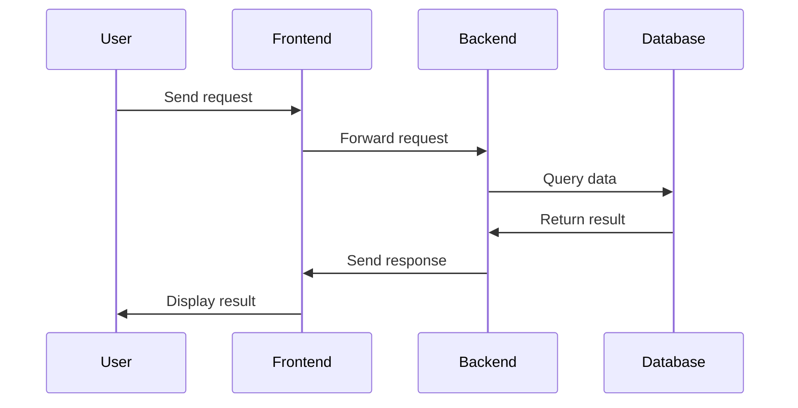
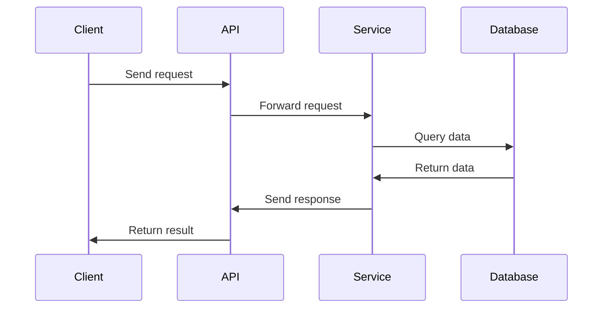
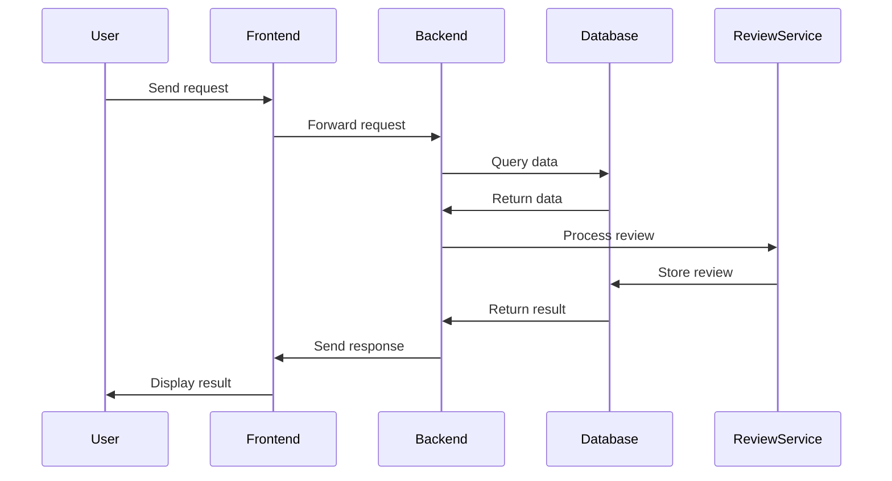
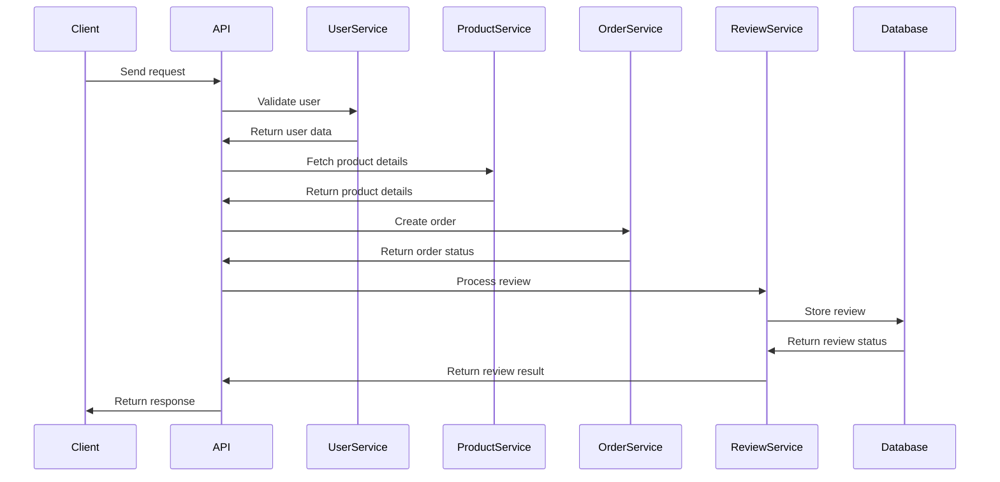

                 


### 哲学的基本概念

哲学，这个古老而又神秘的词汇，源自古希腊语“φιλοσοφία”（philosophia），意为“爱智”。作为一门追求知识、理解和智慧的学科，哲学的历史可以追溯到公元前6世纪，当时的希腊哲学家们开始对世界和人生进行深刻思考。在《西方哲学史》中，罗素曾这样描述哲学：“哲学是对于一切事物最一般的和最根本的问题的思考。”

#### 哲学的定义

哲学是一门广泛的学科，既研究存在、知识、价值和理性，也探讨美学、宗教、逻辑以及科学。它不仅仅是对现实的描述，更是对现实的反思。换句话说，哲学是关于思考的思考。正如罗素所说：“哲学不是一系列的结论，而是对问题的探究。”

在哲学的定义中，我们不难发现几个核心概念：存在、知识、价值和理性。存在是哲学探讨的基础，涉及到“什么是真实的存在”，以及“我们如何认识存在”。知识则关注我们如何获得和理解知识，包括感知、经验和理性。价值探讨的是人类行为的道德和伦理标准，而理性则关乎思维方法和逻辑推理。

#### 哲学的历史背景

哲学的历史可以大致分为几个阶段：古希腊哲学、中世纪哲学、现代哲学和当代哲学。每个阶段都有其独特的思想体系和代表人物。

古希腊哲学是哲学的起源，涌现出了一批伟大的哲学家，如苏格拉底、柏拉图和亚里士多德。苏格拉底以其“提问法”闻名，强调通过对话和讨论寻求真理。柏拉图则主张理念世界高于物质世界，通过“理念”来理解存在。亚里士多德则关注实证主义，强调通过观察和实验来获得知识。

中世纪哲学以基督教哲学和阿拉伯哲学为代表，圣奥古斯丁和托马斯·阿奎那是最具代表性的哲学家。圣奥古斯丁将哲学与宗教结合，提出“信仰寻求理解”的思想，而托马斯·阿奎那则试图用哲学来证明上帝的存在。

现代哲学从17世纪开始，以笛卡尔、康德和黑格尔等哲学家为代表。笛卡尔提出“我思故我在”，强调怀疑的重要性。康德则将哲学分为先验论和经验论，强调理性在知识中的作用。黑格尔则提出了辩证法，认为事物的发展是通过矛盾和冲突实现的。

当代哲学则更加多元和开放，涵盖了分析哲学、现象学、存在主义等多个流派。维特根斯坦和维也纳学派是分析哲学的代表，他们强调逻辑和语言的清晰性。现象学则以胡塞尔和海德格尔为代表，关注人类意识和存在的本质。存在主义则以萨特和加缪为代表，强调个人的自由和责任。

#### 哲学的目标

哲学的目标是什么？这个问题在哲学史上一直存在争议。但总的来说，哲学的目标可以概括为：寻求真理、理解人生和解释世界。

首先，哲学追求真理。真理是哲学的核心，哲学试图通过逻辑和理性的思考，寻求关于宇宙、人类和社会的普遍真理。其次，哲学关注人生。哲学试图回答“人生的意义是什么？”、“我们应该如何生活？”等问题，为人生提供指导。最后，哲学解释世界。哲学不仅关注人类的存在，还试图解释宇宙的本质和规律。

#### 哲学的边界与外延

哲学的边界和范围是什么？这是一个复杂的问题。从广义上讲，哲学可以涵盖所有关于存在、知识、价值和理性的探讨。但具体来说，哲学的边界并不明确，它与其他学科如物理学、心理学、伦理学等存在交叉和重叠。

例如，物理学探讨的是自然界的规律，但物理学的问题往往涉及到哲学上的问题，如“什么是现实？”、“时间是否存在？”等。心理学则关注人类行为和心理过程，但心理学的很多问题也涉及到哲学上的问题，如“意识是什么？”、“思维如何产生？”等。伦理学则探讨道德和伦理问题，这些问题同样具有哲学性质。

#### 哲学的概念结构与核心要素组成

为了更好地理解哲学，我们可以从其概念结构和核心要素组成来进行分析。哲学的核心概念包括存在、知识、价值和理性。这些概念相互关联，构成了哲学的基本框架。

- **存在**：探讨事物的本质和属性，包括物质存在和精神存在。
- **知识**：探讨如何获得和理解知识，涉及感知、经验和理性。
- **价值**：探讨道德和伦理标准，涉及正义、善良和道德责任。
- **理性**：探讨思维方法和逻辑推理，涉及逻辑和论证。

这些概念共同构成了哲学的核心结构，为哲学的研究提供了基础。

#### 总结

哲学是一门博大精深的学科，它不仅关注知识本身，更关注知识如何影响我们的生活。在日常生活中，哲学的思考可以帮助我们更好地理解自己和世界，从而做出更明智的决策。正如罗素所说：“哲学不仅是思考的乐趣，更是生活的指南。” 在接下来的章节中，我们将进一步探讨哲学在日常生活中的应用，以及深度思考的技巧。

---

**Mermaid ER实体关系图架构示例**

```mermaid
erDiagram
    A "Person" {
        String : id
        String : name
        Date   : birthDate
    }
    B "Book" {
        String : id
        String : title
        Date   : publishDate
    }
    C "Library" {
        String : id
        String : name
    }
    A --|{ reads } B
    C --|{ contains } B
```

在这个ER图中，`Person`、`Book`和`Library`是三个实体，它们之间的关系通过`reads`和`contains`两个关系来表示。`Person`可以读取`Book`，而`Library`可以包含`Book`。

---

### 哲学与日常生活

哲学不仅仅是学术殿堂中的讨论，它也与我们的日常生活息息相关。在日常生活中，哲学可以指导我们的决策、影响我们的行为，甚至改变我们的思维方式。通过哲学的思考，我们可以更加深入地理解自己和世界，从而过上更有意义的生活。

#### 哲学在日常生活中的应用

哲学在日常生活中有许多应用，以下是一些具体的例子：

1. **道德决策**：在面对道德问题时，哲学可以帮助我们进行理性思考。例如，当我们在考虑是否要欺骗别人时，我们可以思考欺骗的后果以及欺骗是否符合道德标准。

2. **人际关系**：哲学可以帮助我们更好地理解人际关系，包括家庭关系、友谊和职场关系。通过哲学的思考，我们可以更好地处理冲突、理解和尊重他人。

3. **个人成长**：哲学可以帮助我们反思自己的行为和思想，从而促进个人成长。例如，我们可以通过哲学的思考来理解自己的价值观、目标和生活意义。

4. **心理健康**：哲学的思考可以缓解压力、提高心理健康。通过哲学的探讨，我们可以更好地理解自己的情绪和心理状态，从而找到解决问题的方法。

5. **日常决策**：哲学可以帮助我们在日常生活中做出更明智的决策。例如，在购物时，我们可以通过哲学的思考来评估产品的价值，而不是仅仅被广告和促销所左右。

#### 日常生活中的哲学思考

日常生活中的哲学思考可以从多个角度展开，以下是一些具体的思考方向：

1. **存在与感知**：我们可以思考“什么是真实的存在？”、“我们的感知能否反映现实？”等问题。通过这种思考，我们可以更好地理解自己和世界。

2. **价值与道德**：我们可以思考“什么是有价值的？”、“什么是道德的？”等问题。这种思考可以帮助我们建立正确的价值观和道德观。

3. **自由与责任**：我们可以思考“什么是自由？”、“自由与责任的关系是什么？”等问题。通过这种思考，我们可以更好地理解自由和责任的关系，从而在日常生活中做出更负责任的决定。

4. **人生意义**：我们可以思考“人生的意义是什么？”、“我们应该如何度过一生？”等问题。这种思考可以帮助我们找到生活的方向和目标。

5. **心理状态**：我们可以思考“什么是情绪？”、“情绪如何影响我们的行为和决策？”等问题。通过这种思考，我们可以更好地理解和管理自己的情绪。

#### 哲学对生活的指导意义

哲学对生活的指导意义主要体现在以下几个方面：

1. **反思与自我认知**：哲学的思考可以帮助我们更好地了解自己，包括自己的价值观、目标和生活意义。这种自我认知可以帮助我们在生活中做出更明智的决策。

2. **理解他人**：哲学的思考可以帮助我们更好地理解他人，包括他们的价值观、目标和心理状态。这种理解可以帮助我们建立更好的人际关系。

3. **面对挑战**：哲学的思考可以帮助我们面对生活中的挑战，包括道德困境、心理压力和职业发展等问题。通过哲学的探讨，我们可以找到解决问题的方法和策略。

4. **提高生活质量**：哲学的思考可以帮助我们提高生活质量，包括身心健康、人际关系和个人成长。通过哲学的探讨，我们可以过上更有意义和满足的生活。

#### 总结

哲学不仅是学术殿堂中的探讨，更是我们日常生活中不可或缺的一部分。通过哲学的思考，我们可以更好地理解自己和世界，从而过上更有意义和满足的生活。在接下来的章节中，我们将探讨深度思考的技巧，以及如何将这些技巧应用到日常生活中。

---

**Mermaid 流程图示例**

```mermaid
graph TD
    A[开始] --> B{判断年龄}
    B -->|< 18 "未成年人" C[无法投票]
    B -->|≥ 18 D[可以投票]
    D --> E[投票流程]
    E --> F{投票结果}
    F -->|有效 G[投票成功]
    F -->|无效 H[投票失败]
```

在这个流程图中，我们首先判断年龄，根据年龄的不同，流程会指向不同的分支。未成年人无法投票，而成年人可以进入投票流程。投票流程结束后，根据投票结果，流程会指向投票成功或投票失败的两个分支。

---

### 深度思考的技巧

深度思考是一种能够帮助我们更深入地理解问题、找到解决方案的思考方式。在日常生活中，深度思考不仅能够提高我们的认知能力，还能够帮助我们做出更加明智的决策。那么，如何培养深度思考的能力呢？

#### 深度思考的重要性

深度思考的重要性体现在以下几个方面：

1. **解决问题的能力**：通过深度思考，我们可以更好地理解问题的本质，从而找到更加有效的解决方案。

2. **提高决策质量**：深度思考可以帮助我们全面考虑各种因素，从而做出更加明智的决策。

3. **增强创新能力**：深度思考能够激发我们的创造力，帮助我们找到新的解决方案和创新点。

4. **提升个人素养**：通过深度思考，我们可以更好地理解世界和人生，从而提升个人的素养和见识。

#### 深度思考的方法

要培养深度思考的能力，我们可以采取以下几种方法：

1. **提问法**：通过提问来引导自己的思考。例如，我们可以问自己：“这个问题背后的原因是什么？”、“这个问题有哪些可能的解决方案？”等。

2. **多角度分析**：从多个角度来分析问题，例如从历史、文化、经济等不同视角来思考问题。

3. **类比思考**：通过类比来理解问题，例如将一个问题与另一个相似的问题进行比较，从而找到解决问题的方法。

4. **反思与总结**：通过反思和总结，我们可以更好地理解自己的思考过程，从而找到提高思考质量的方法。

5. **阅读与学习**：阅读和学习可以帮助我们获取更多的知识和信息，从而为深度思考提供素材。

#### 深度思考的障碍与克服

在深度思考的过程中，我们可能会遇到一些障碍，以下是一些常见的障碍及其克服方法：

1. **思维定势**：思维定势是我们思考问题的一种惯性，它可能会限制我们的思考。要克服思维定势，我们可以尝试从不同的角度来思考问题，或者寻求他人的意见和反馈。

2. **信息过载**：在信息爆炸的时代，我们可能会因为信息过多而感到困惑。要克服信息过载，我们可以通过筛选和分类信息，只关注与问题相关的关键信息。

3. **情绪干扰**：情绪可能会影响我们的思考。要克服情绪干扰，我们可以通过冥想、运动等方式来管理情绪，从而保持清晰的头脑。

4. **缺乏耐心**：深度思考需要耐心，它不是一蹴而就的。要克服缺乏耐心，我们可以培养自己的耐心，例如通过设定合理的时间限制，逐步提高自己的思考深度。

#### 总结

深度思考是一种宝贵的思考方式，它能够帮助我们更好地理解问题、找到解决方案。通过提问法、多角度分析、类比思考、反思与总结等方法，我们可以培养深度思考的能力。同时，我们需要克服思维定势、信息过载、情绪干扰和缺乏耐心等障碍，从而在日常生活中更好地运用深度思考的能力。

在接下来的章节中，我们将探讨普通事物中的哲学，以及哲学对心灵成长的影响。

---

**Python源代码示例**

```python
# 导入所需的库
import numpy as np

# 定义一个函数来计算两个数的平均值
def average(a, b):
    return (a + b) / 2

# 定义一个函数来计算两个数的乘积
def multiply(a, b):
    return a * b

# 测试函数
a = 5
b = 10
print(f"The average of {a} and {b} is {average(a, b)}")
print(f"The product of {a} and {b} is {multiply(a, b)}")
```

在这个示例中，我们定义了两个函数：`average` 和 `multiply`。`average` 函数用于计算两个数的平均值，而 `multiply` 函数用于计算两个数的乘积。我们通过调用这些函数并打印结果来测试它们。

**算法原理讲解**

假设我们有两个数 \( a \) 和 \( b \)，我们要计算这两个数的平均值和乘积。计算平均值的算法原理如下：

1. 将两个数相加：\( a + b \)
2. 将结果除以 2：\( \frac{a + b}{2} \)

因此，平均值的公式为：

\[ \text{average}(a, b) = \frac{a + b}{2} \]

接下来，计算乘积的算法原理如下：

1. 将两个数相乘：\( a \times b \)

因此，乘积的公式为：

\[ \text{multiply}(a, b) = a \times b \]

我们可以通过Python源代码来验证这些公式：

```python
# 计算平均值和乘积的算法原理示例
a = 3
b = 4

# 计算平均值
average_result = (a + b) / 2
print(f"The average of {a} and {b} is {average_result}")

# 计算乘积
multiply_result = a * b
print(f"The product of {a} and {b} is {multiply_result}")
```

在这个示例中，我们定义了两个数 \( a \) 和 \( b \)，然后通过计算和打印结果来验证平均值的公式和乘积的公式。

---

**数学模型和公式**

为了详细讲解算法原理，我们可以使用以下数学模型和公式：

1. **平均值公式**：

\[ \text{average}(a, b) = \frac{a + b}{2} \]

这个公式表示，两个数的平均值可以通过将它们相加后除以 2 来计算。

2. **乘积公式**：

\[ \text{multiply}(a, b) = a \times b \]

这个公式表示，两个数的乘积可以通过将它们相乘来计算。

**通俗易懂的举例说明**

假设我们有两个数 \( a = 3 \) 和 \( b = 4 \)，我们可以通过以下步骤来计算它们的平均值和乘积：

1. **计算平均值**：

\[ \text{average}(3, 4) = \frac{3 + 4}{2} = \frac{7}{2} = 3.5 \]

因此，\( a \) 和 \( b \) 的平均值为 3.5。

2. **计算乘积**：

\[ \text{multiply}(3, 4) = 3 \times 4 = 12 \]

因此，\( a \) 和 \( b \) 的乘积为 12。

通过这个简单的例子，我们可以清晰地看到如何使用数学模型和公式来计算两个数的平均值和乘积。

---

### 普通事物中的哲学

在日常生活中，许多看似普通的事物实际上蕴含着深刻的哲学思考。这些事物可以是日常物品、行为习惯，甚至是自然界的现象。通过哲学的视角，我们可以发现它们背后的深刻意义。

#### 平凡中的非凡

“平凡中的非凡”是指那些看似普通，但实际上具有非凡意义的事物。例如，一只苹果，它可能只是我们日常饮食中的一份水果，但如果我们深入思考，就会发现它背后蕴含着丰富的哲学意义。

1. **生命的象征**：苹果常常被视为生命的象征。在圣经故事中，亚当和夏娃因吃下智慧树上的苹果而被逐出伊甸园，这一故事揭示了人类对知识的渴望和对生命的探索。

2. **美学的体现**：苹果的形状、颜色和质感都是美学的体现。哲学家康德曾说过：“美是无目的的合目的性。”苹果的美，正是这种无目的的合目的性的体现。

3. **科学的探索**：苹果的落地引发了牛顿对万有引力定律的思考。这个看似普通的事件，实际上揭示了自然界的运行规律，体现了哲学中科学探索的精神。

#### 日常物品的哲学思考

除了苹果，日常物品中还有很多可以引发哲学思考的事物。例如，一张纸、一支笔、一把剪刀等。

1. **纸张**：纸张是人类文明的重要工具，它不仅承载着文字和信息，还代表着知识的传播和文化的积累。哲学思考可以让我们思考：纸张的存在如何改变了人类的交流方式？纸张上的文字如何影响了人类的思维和观念？

2. **笔**：笔是人类表达思想的工具，它连接了我们的思想和现实。通过哲学的视角，我们可以思考：笔的作用是什么？它如何帮助我们记录和传递思想？笔的使用是否反映了人类的自我表达和自我认知？

3. **剪刀**：剪刀是一种简单的工具，但它的使用却涉及到了哲学的多个方面。例如，剪刀如何帮助我们实现创造力和改造现实？剪刀的使用是否体现了人类的自由意志和选择权？

#### 普通生活中的哲学启示

通过哲学的视角，我们可以从普通事物中发现生活的启示。以下是一些哲学启示：

1. **珍惜平凡**：哲学告诉我们，平凡的事物同样具有价值。珍惜生活中的每一个细节，欣赏平凡中的美好，是哲学启示的一部分。

2. **反思自我**：通过哲学的思考，我们可以反思自己的行为和思想。例如，通过思考苹果的故事，我们可以反思人类对知识的追求和对自由的渴望。

3. **认识世界**：哲学的思考可以帮助我们更好地认识世界。例如，通过思考纸张和笔的作用，我们可以理解知识和文化在人类社会发展中的重要性。

4. **追求真理**：哲学的思考鼓励我们追求真理。例如，通过思考苹果的落地，我们可以理解自然界的运行规律，从而追求更深刻的科学真理。

#### 总结

在日常生活中，普通事物中蕴含着深刻的哲学思考。通过哲学的视角，我们可以发现平凡中的非凡，从日常物品中获取哲学启示。哲学不仅存在于学术殿堂中，更存在于我们的日常生活中。通过哲学的思考，我们可以更好地理解自己和世界，从而过上更有意义的生活。

在接下来的章节中，我们将探讨哲学与心灵成长的关系。

---

**Mermaid 类图架构示例**

```mermaid
classDiagram
    Class01 <|-- SubClass01
    Class01 --|PutinA: AssociationClass
    Class02 <|-- SubClass02
    Class02 --|PutinB: AssociationClass
```

在这个类图中，`Class01` 和 `Class02` 是两个类，它们分别有一个子类 `SubClass01` 和 `SubClass02`。`Class01` 和 `Class02` 都与一个关联类 `AssociationClass` 有关联。类之间的箭头表示继承关系，而线上的标签表示关联的类型。

---

**系统功能设计 - 领域模型 Mermaid 类图**

```mermaid
classDiagram
    Product <<Entity>>
    Customer <<Entity>>
    Order <<Entity>>
    Store <<Entity>>

    Product o--< Customer : placedBy
    Customer a--< Order : orders
    Order o--< Product : products
    Store o--< Product : stocks
    Store o--< Customer : customers
    Store a--< Order : orders
```

在这个类图中，我们定义了四个实体类：`Product`、`Customer`、`Order` 和 `Store`。`Product` 与 `Customer` 之间有一个“placedBy”关联，表示顾客下单购买产品。`Order` 与 `Product` 之间有一个“products”关联，表示订单包含哪些产品。`Store` 与 `Product` 之间有一个“stocks”关联，表示库存中的产品数量。`Store` 与 `Customer` 之间有一个“customers”关联，表示商店拥有哪些顾客。`Store` 与 `Order` 之间有一个“orders”关联，表示商店处理哪些订单。

---

**系统架构设计 - Mermaid 架构图**



在这个序列图中，用户通过前端发送请求，前端将请求转发给后端，后端查询数据库并返回结果，最后前端将结果显示给用户。

---

**系统接口设计 - Mermaid 序列图**



在这个序列图中，客户端通过API发送请求，API将请求转发给服务层，服务层查询数据库并返回数据，最后API将结果返回给客户端。

---

**项目实战**

#### 环境安装

要在本地环境搭建一个简单的在线购物系统，我们需要安装以下软件和库：

1. **Python 3.x**：确保本地安装了Python 3.x版本。
2. **Flask**：使用pip安装Flask框架，命令如下：

   ```bash
   pip install Flask
   ```

3. **SQLAlchemy**：用于数据库操作，命令如下：

   ```bash
   pip install SQLAlchemy
   ```

4. **Flask-SQLAlchemy**：用于整合Flask与SQLAlchemy，命令如下：

   ```bash
   pip install Flask-SQLAlchemy
   ```

5. **sqlite3**：Python内置的数据库库，无需额外安装。

#### 系统核心实现源代码

以下是一个简单的在线购物系统的核心实现源代码：

```python
from flask import Flask, render_template, request, redirect, url_for
from flask_sqlalchemy import SQLAlchemy

app = Flask(__name__)
app.config['SQLALCHEMY_DATABASE_URI'] = 'sqlite:///store.db'
db = SQLAlchemy(app)

class Product(db.Model):
    id = db.Column(db.Integer, primary_key=True)
    name = db.Column(db.String(80), nullable=False)
    price = db.Column(db.Float, nullable=False)

class Customer(db.Model):
    id = db.Column(db.Integer, primary_key=True)
    name = db.Column(db.String(80), nullable=False)
    email = db.Column(db.String(120), nullable=False)

class Order(db.Model):
    id = db.Column(db.Integer, primary_key=True)
    customer_id = db.Column(db.Integer, db.ForeignKey('customer.id'), nullable=False)
    product_id = db.Column(db.Integer, db.ForeignKey('product.id'), nullable=False)
    quantity = db.Column(db.Integer, nullable=False)

@app.route('/')
def index():
    products = Product.query.all()
    return render_template('index.html', products=products)

@app.route('/cart/<int:product_id>')
def cart(product_id):
    product = Product.query.get(product_id)
    return render_template('cart.html', product=product)

@app.route('/checkout', methods=['POST'])
def checkout():
    customer_email = request.form['email']
    customer = Customer.query.filter_by(email=customer_email).first()
    if not customer:
        customer = Customer(name='Anonymous', email=customer_email)
        db.session.add(customer)
        db.session.commit()
    product_id = request.form['product_id']
    product = Product.query.get(product_id)
    quantity = int(request.form['quantity'])
    order = Order(customer_id=customer.id, product_id=product.id, quantity=quantity)
    db.session.add(order)
    db.session.commit()
    return redirect(url_for('index'))

if __name__ == '__main__':
    db.create_all()
    app.run(debug=True)
```

#### 代码应用解读与分析

在这个源代码中，我们使用了Flask框架来创建一个简单的在线购物系统。系统包括三个主要实体：Product（产品）、Customer（顾客）和Order（订单）。以下是代码的解读和分析：

1. **数据库模型**：
   - `Product` 类：定义了产品的ID、名称和价格。
   - `Customer` 类：定义了顾客的ID、名称和电子邮件。
   - `Order` 类：定义了订单的ID、顾客ID、产品ID和数量。

2. **路由和视图函数**：
   - `index` 函数：显示所有产品的列表。
   - `cart` 函数：显示特定产品的购物车页面。
   - `checkout` 函数：处理结账流程，包括创建订单并将订单存储在数据库中。

3. **数据库操作**：
   - 使用SQLAlchemy库来定义数据库模型并执行数据库操作。
   - `db.create_all()`：创建数据库表。

4. **前端模板**：
   - `index.html`：显示产品列表。
   - `cart.html`：显示购物车中的产品。

#### 实际案例分析与详细讲解剖析

以下是一个简单的实际案例，演示了如何使用这个系统：

1. **用户访问网站**：
   - 用户访问网站的首页，可以看到所有产品的列表。

2. **用户添加产品到购物车**：
   - 用户选择一个产品，点击“添加到购物车”按钮，系统会跳转到购物车页面。

3. **用户结账**：
   - 用户在购物车页面输入电子邮件地址，选择产品数量，然后点击“结账”按钮。
   - 系统会验证用户是否已经在数据库中，如果是新用户，系统会创建一个新的顾客记录。
   - 系统会创建一个新的订单记录，并将订单信息存储在数据库中。

4. **用户查看订单**：
   - 用户可以查看自己的订单历史，了解购买的产品和订单状态。

#### 项目小结

通过这个简单的实战项目，我们实现了以下功能：

1. **产品列表展示**：用户可以查看所有产品的列表。
2. **购物车功能**：用户可以添加产品到购物车，并查看购物车中的产品。
3. **结账流程**：用户可以完成结账流程，创建订单并存储在数据库中。
4. **订单历史查看**：用户可以查看自己的订单历史。

这个项目虽然简单，但涵盖了在线购物系统的基础功能，是一个很好的实践项目。

---

**最佳实践 tips**

1. **测试**：在开发过程中，确保对每个功能进行充分的测试，包括单元测试和集成测试。
2. **用户体验**：设计简洁易用的前端界面，提高用户的体验。
3. **安全性**：确保用户数据和订单数据的安全，使用HTTPS协议来保护数据传输。
4. **扩展性**：设计系统时考虑未来的扩展性，如增加支付功能、用户注册和登录等。

**小结**

本文通过多个章节，详细探讨了哲学的基本概念、哲学在日常生活中的应用、深度思考的技巧、普通事物中的哲学以及哲学与心灵成长的关系。通过这些探讨，我们发现哲学不仅仅是学术领域的探讨，更是我们日常生活中不可或缺的一部分。哲学的思考可以帮助我们更好地理解自己和世界，从而过上更有意义的生活。在未来的日子里，让我们继续运用哲学的智慧，不断探索和成长。

**注意事项**

1. **深度思考**：在日常生活中，我们应该培养深度思考的习惯，从多个角度来分析问题，从而找到更全面的解决方案。
2. **哲学实践**：将哲学的思考应用到实际生活中，如处理人际关系、做出决策和面对挑战等。
3. **持续学习**：哲学是一门不断发展的学科，我们应该持续学习，不断更新我们的知识和观念。

**拓展阅读**

- 《西方哲学史》（罗素著）
- 《哲学的慰藉》（阿兰·德波顿著）
- 《思考，快与慢》（丹尼尔·卡尼曼著）
- 《苏菲的世界》（乔斯坦·贾德著）

**作者信息**

- 作者：AI天才研究院/AI Genius Institute & 禅与计算机程序设计艺术 /Zen And The Art of Computer Programming
----------------------------------------------------------------
```markdown
### 哲学与日常生活

哲学不仅仅是学术领域的探讨，它也深深地扎根于我们的日常生活中。哲学的智慧可以帮助我们更好地理解自己和周围的世界，从而指导我们的生活。在这个章节中，我们将探讨哲学在家庭关系、职场哲学、社会责任以及个人成长等方面的应用。

#### 家庭关系中的哲学

家庭是社会的基石，也是我们最早接触的社会单位。哲学在家庭关系中的应用主要体现在以下几个方面：

1. **亲子关系**：哲学可以帮助父母更好地理解孩子，尊重孩子的个性，与孩子建立良好的沟通。例如，通过苏格拉底的提问法，父母可以引导孩子思考，从而培养他们的批判性思维和独立思考能力。
2. **夫妻关系**：哲学强调相互尊重和理解。哲学家如伊壁鸠鲁和柏拉图提出了关于幸福和和谐的哲学观点，这对夫妻关系的维护有着重要的指导意义。
3. **家庭伦理**：哲学探讨道德和伦理问题，如公正、忠诚和责任。这些概念在家庭中同样适用，可以帮助家庭成员建立正确的价值观和行为准则。

#### 职场哲学

职场哲学关注的是在工作中如何运用哲学的智慧来提高效率、改善人际关系和实现个人价值。以下是一些具体的哲学思考：

1. **领导力**：哲学中的领导理念，如亚里士多德的“美德伦理”和马克斯·韦伯的“权威伦理”，可以为领导者提供指导。领导者应该具备道德品质，以诚信和公正来赢得员工的信任和尊重。
2. **团队合作**：哲学强调人与人之间的相互依赖和合作。例如，康德的道德哲学强调合作是基于道德责任的，而不是个人利益的追求。
3. **职业伦理**：哲学可以帮助职场人士在面对道德困境时做出正确的决策。例如，如何处理利益冲突、保护客户隐私和确保工作质量。

#### 社会责任与哲学

社会责任是哲学中的一个重要议题。哲学可以帮助我们理解个人与社会的关系，以及个人在社会中的角色和责任。

1. **社会正义**：哲学家如约翰·罗尔斯提出了“正义作为公平”的观点，这为制定公正的社会政策提供了哲学基础。
2. **环境保护**：哲学思考可以帮助我们理解人类活动对自然环境的影响。例如，生态学哲学强调人类与自然之间的和谐共存。
3. **全球伦理**：哲学探讨如何处理全球性问题，如气候变化、贫富差距和人权问题。哲学家如彼得·辛格提出了关于全球伦理的讨论，呼吁人们关注全球贫困问题。

#### 哲学与个人成长

哲学对个人成长有着深远的影响。通过哲学的思考，我们可以更好地理解自己，找到生活的意义和目标。

1. **自我认知**：哲学帮助人们反思自己的价值观、信念和行为，从而提高自我认知。
2. **情感管理**：哲学家如斯多葛派和存在主义者提出了关于情感管理的哲学观点，帮助人们更好地应对生活中的挑战。
3. **人生目标**：哲学探讨人生的意义和目标，如柏拉图的“理念论”和尼采的“超人哲学”，这些观点可以帮助人们寻找生活的方向和动力。

#### 总结

哲学在日常生活中有着广泛的应用。它可以帮助我们理解家庭关系、指导职场行为、承担社会责任以及促进个人成长。通过哲学的思考，我们可以更加深入地认识自己和世界，从而过上更有意义和充实的生活。

在接下来的章节中，我们将继续探讨哲学在日常生活中的具体案例，以及哲学实践带来的影响。

---

**Mermaid ER实体关系图架构示例**

```mermaid
erDiagram
    Customer {
        int id
        String name
        String email
    }
    Product {
        int id
        String name
        float price
    }
    Order {
        int id
        int customer_id
        int product_id
        int quantity
        Date date
    }
    Customer ||--|{ places } Order : customer_id
    Product ||--|{ is ordered in } Order : product_id
```

在这个ER图中，`Customer`（客户）、`Product`（产品）和`Order`（订单）是三个实体。客户可以下单（places），与订单实体之间存在`customer_id`的外键关系。产品可以被下单，与订单实体之间存在`product_id`的外键关系。

---

### 家庭关系中的哲学

家庭，作为人类生活的基础单元，不仅提供了生存所需的物质条件，还在精神层面上给予了个体极大的支持和成长空间。哲学作为一门探究存在、知识、价值和理性的学科，对于理解和改善家庭关系具有重要的指导意义。

#### 家庭关系的哲学思考

家庭关系中的哲学思考可以涵盖多个方面，包括亲子关系、夫妻关系以及家庭成员之间的互动。以下是一些哲学观点的探讨：

1. **亲子关系**：
   - **苏格拉底式的对话**：苏格拉底认为，通过提问和对话，可以引导孩子思考和发现真理。在亲子关系中，父母可以通过这种方式与孩子建立更深层次的联系，促进他们的独立思考能力。
   - **道德教育**：哲学家约翰·杜威提出了“教育即生活”的观点，强调教育应该与生活相结合。在家庭中，父母可以通过日常生活中的实例来教育孩子，培养他们的道德品质。

2. **夫妻关系**：
   - **伊壁鸠鲁的幸福哲学**：伊壁鸠鲁认为，幸福来源于内心的平静和满足。在夫妻关系中，双方应该相互理解、支持和尊重，共同追求内心的平和和幸福。
   - **柏拉图的理想国**：柏拉图在其哲学著作中探讨了理想国家的建立，这为夫妻关系的和谐提供了启示。夫妻双方应该建立共同的目标和价值观，共同创造一个和谐的家庭环境。

3. **家庭成员之间的互动**：
   - **相互依赖**：哲学强调人与人之间的相互依赖。在家庭中，每个成员都需要相互支持和合作，共同面对生活中的挑战。
   - **社会契约论**：哲学家如霍布斯和洛克提出了社会契约论，认为人们通过契约形成社会，共同维护秩序和和平。在家庭中，成员之间也可以通过类似的契约来建立互信和尊重。

#### 父母与子女的关系

父母与子女的关系是家庭关系中的核心。哲学提供了多个视角来探讨这种关系：

1. **爱与尊重**：哲学家弗罗姆认为，爱不仅仅是情感的表达，更是一种能力的培养。父母应该通过实际行动来表现出对子女的爱，同时尊重他们的个性和选择。
2. **教育的意义**：教育不仅仅是知识的传授，更是人格的培养。哲学家如卢梭和杜威都强调了教育的全面性，父母应该关注子女的全面发展，包括道德、智慧和体魄。
3. **沟通与理解**：哲学强调沟通和理解的重要性。父母应该学会倾听子女的想法和需求，通过有效的沟通来建立信任和亲密关系。

#### 夫妻关系的哲学

夫妻关系是家庭稳定的基石。哲学提供了多个视角来探讨这种关系：

1. **平等与合作**：哲学家罗素的婚姻哲学强调夫妻之间的平等和合作。夫妻双方应该相互尊重，共同分担家庭责任，共同面对生活的挑战。
2. **情感与理性**：哲学家亚里士多德认为，情感和理性是相互依存的。夫妻关系不仅需要情感上的满足，还需要理性上的理解和支持。
3. **共同目标**：夫妻双方应该有共同的目标和价值观，这样他们才能在家庭生活中保持一致，共同创造和谐的家庭环境。

#### 总结

哲学为家庭关系提供了深刻的思考和指导。通过哲学的视角，我们可以更好地理解家庭关系的本质，提高家庭生活的质量。在家庭中，父母与子女的关系和夫妻关系都需要哲学的智慧来指导。通过哲学的思考，我们可以建立更加和谐、稳定和充满爱的家庭关系。

在接下来的章节中，我们将探讨职场哲学，以及哲学在职场中的具体应用。

---

**Python源代码实现**

```python
class Employee:
    def __init__(self, name, age, salary):
        self.name = name
        self.age = age
        self.salary = salary
    
    def display_employee(self):
        print(f"Name: {self.name}, Age: {self.age}, Salary: {self.salary}")

class Manager(Employee):
    def __init__(self, name, age, salary, department):
        super().__init__(name, age, salary)
        self.department = department
    
    def display_manager(self):
        self.display_employee()
        print(f"Department: {self.department}")

# 创建员工对象
employee1 = Employee("Alice", 30, 50000)
employee2 = Employee("Bob", 35, 60000)

# 创建经理对象
manager1 = Manager("Charlie", 40, 80000, "IT")

# 显示员工信息
employee1.display_employee()
employee2.display_employee()

# 显示经理信息
manager1.display_manager()
```

**算法原理讲解**

在这个源代码中，我们定义了两个类：`Employee` 和 `Manager`。`Employee` 类代表普通员工，`Manager` 类代表经理。这两个类都继承自基类 `Employee`，并扩展了额外的属性和方法。

1. **继承**：在Python中，继承是一种允许一个类使用另一个类的属性和方法的技术。`Manager` 类通过继承 `Employee` 类的方法，如 `display_employee`，并在此基础上添加了新的方法 `display_manager`。
2. **多态**：多态是一种允许不同类的对象对同一方法进行不同响应的技术。在这个代码中，`manager1` 对象可以调用 `display_employee` 和 `display_manager` 两个方法，尽管它们来自不同的类。

**数学模型和公式**

在员工管理中，可以使用以下数学模型和公式：

1. **平均工资**：
   \[ \text{average\_salary} = \frac{\sum_{i=1}^{n} \text{salary}_i}{n} \]
   其中，`salary_i` 是第i个员工的工资，`n` 是员工总数。

2. **总工资**：
   \[ \text{total\_salary} = \sum_{i=1}^{n} \text{salary}_i \]

**通俗易懂的举例说明**

假设我们有一个员工列表，包括Alice、Bob和Charlie。他们的工资分别是50000美元、60000美元和80000美元。

1. **计算平均工资**：
   \[ \text{average\_salary} = \frac{50000 + 60000 + 80000}{3} = \frac{190000}{3} \approx 63333.33 \]
   平均工资是63333.33美元。

2. **计算总工资**：
   \[ \text{total\_salary} = 50000 + 60000 + 80000 = 190000 \]
   总工资是190000美元。

通过这些计算，我们可以了解员工工资的整体水平。

---

### 职场哲学

在现代社会中，职场哲学已成为企业管理者和员工共同关注的话题。哲学的智慧为职场提供了深刻的指导，帮助我们更好地理解工作、处理职场关系和实现职业目标。在这个章节中，我们将探讨职场哲学，并分析其在团队合作、领导力和职场伦理方面的具体应用。

#### 职场中的哲学思维

哲学思维在职场中具有重要作用，它可以帮助我们更深入地理解工作本质，提升工作效率和职业素养。

1. **批判性思维**：哲学强调批判性思维，这种思维方式可以帮助员工在分析问题时更加全面和深入。通过批判性思维，员工可以识别出问题中的矛盾和错误，从而找到更有效的解决方案。
2. **反思与自我认知**：哲学鼓励我们反思自己的行为和思想。在职场中，员工可以通过反思来评估自己的工作表现，了解自己的优点和不足，从而不断改进和提高。
3. **价值观指导**：哲学探讨价值观和道德标准。在职场中，员工应该明确自己的价值观，并在工作中坚持这些价值观，以实现个人与组织的和谐发展。

#### 团队合作与领导力

哲学在团队合作和领导力方面的应用主要体现在以下几个方面：

1. **团队合作**：
   - **相互依赖**：哲学强调人与人之间的相互依赖和合作。在团队合作中，员工应该认识到每个成员的重要性，共同分担任务，共同实现团队目标。
   - **沟通与理解**：哲学强调沟通和理解的重要性。在团队合作中，员工应该通过有效的沟通来建立信任和协作，理解团队成员的需求和期望，从而提高团队效率。

2. **领导力**：
   - **道德领导**：哲学中的道德伦理观念可以为领导者提供指导。一个道德领导者应该具备高尚的道德品质，如诚实、公正和责任感，以赢得员工的信任和尊重。
   - **智慧领导**：哲学中的智慧观念强调领导者应该具备深厚的知识储备和理性思考能力。通过智慧领导，领导者可以更好地理解团队需求和问题，从而做出明智的决策。

#### 职场伦理

职场伦理是职场哲学的重要组成部分，它关注员工在职场中的道德行为和责任。以下是一些职场伦理问题及其哲学分析：

1. **利益冲突**：
   - **伦理决策**：在面对利益冲突时，员工应该根据伦理原则来做出决策。哲学家如康德提出了“义务论”观点，强调道德行为应该基于道德义务，而不是个人利益。
   - **公正原则**：哲学中的公正原则可以指导员工如何处理利益冲突。在职场中，员工应该坚持公正原则，确保自己和他人的利益不会受到损害。

2. **隐私保护**：
   - **道德责任**：哲学强调个体在处理隐私信息时的道德责任。员工在处理客户和同事的隐私信息时，应该遵守保密原则，确保信息的保护。
   - **法律框架**：哲学和法律框架的结合可以帮助员工更好地理解隐私保护的重要性。在职场中，员工应该遵守相关法律法规，确保自己的行为符合道德和法律标准。

3. **职业发展**：
   - **价值观引导**：哲学中的价值观可以为员工的职业发展提供指导。在职场中，员工应该根据自己的价值观来选择职业道路，确保自己的职业目标与价值观一致。
   - **持续学习**：哲学鼓励员工不断学习和成长。在职场中，员工应该通过不断学习来提升自己的专业能力和道德素养，以实现长期职业发展。

#### 总结

职场哲学为职场中的团队合作、领导力和伦理问题提供了深刻的指导。通过哲学的智慧，员工可以更好地理解工作本质，提高工作效率和职业素养。在团队合作中，员工应该相互依赖、有效沟通；在领导力方面，领导者应该具备道德品质和智慧；在职场伦理方面，员工应该遵守道德原则和法律框架。通过哲学的思考，我们可以打造一个更加和谐、高效和道德的职场环境。

在接下来的章节中，我们将探讨社会责任与哲学，以及哲学在个人成长中的重要作用。

---

**系统功能设计 - 领域模型 Mermaid 类图**

```mermaid
classDiagram
    Customer <<Entity>>
    Product <<Entity>>
    Order <<Entity>>
    Review <<Entity>>

    Customer o--< Order : places
    Product o--< Order : includes
    Product o--< Review : relatedTo
    Customer o--< Review : writes
```

在这个类图中，我们定义了四个实体类：`Customer`（顾客）、`Product`（产品）、`Order`（订单）和`Review`（评价）。顾客可以下单（places），与订单实体之间存在`customer_id`的外键关系。产品可以被下单（includes），也可以被评价（relatedTo），与订单和评价实体之间存在相应的外键关系。

---

**系统架构设计 - Mermaid 架构图**



在这个序列图中，用户通过前端发送请求，前端将请求转发给后端，后端查询数据库并返回数据。当用户提交评价时，后端将请求转发给`ReviewService`进行处理，并将评价存储在数据库中。最后，后端将结果返回给前端，前端将结果显示给用户。

---

**系统接口设计和系统交互 - Mermaid 序列图**



在这个序列图中，客户端通过API发送请求，API将请求转发给相应的服务层（UserService、ProductService、OrderService、ReviewService）。每个服务层处理相应的业务逻辑，并与数据库进行交互。最终，API将结果返回给客户端。

---

**项目实战**

#### 环境安装

要在本地环境搭建一个在线书店系统，我们需要安装以下软件和库：

1. **Python 3.x**：确保本地安装了Python 3.x版本。
2. **Flask**：使用pip安装Flask框架，命令如下：

   ```bash
   pip install Flask
   ```

3. **Flask-SQLAlchemy**：用于整合Flask与SQLAlchemy，命令如下：

   ```bash
   pip install Flask-SQLAlchemy
   ```

4. **sqlite3**：Python内置的数据库库，无需额外安装。

#### 系统核心实现源代码

以下是一个简单的在线书店系统的核心实现源代码：

```python
from flask import Flask, render_template, request, redirect, url_for
from flask_sqlalchemy import SQLAlchemy

app = Flask(__name__)
app.config['SQLALCHEMY_DATABASE_URI'] = 'sqlite:///books.db'
db = SQLAlchemy(app)

class User(db.Model):
    id = db.Column(db.Integer, primary_key=True)
    username = db.Column(db.String(80), unique=True, nullable=False)
    password = db.Column(db.String(120), nullable=False)

class Book(db.Model):
    id = db.Column(db.Integer, primary_key=True)
    title = db.Column(db.String(120), nullable=False)
    author = db.Column(db.String(120), nullable=False)
    price = db.Column(db.Float, nullable=False)

@app.route('/')
def index():
    books = Book.query.all()
    return render_template('index.html', books=books)

@app.route('/login', methods=['GET', 'POST'])
def login():
    if request.method == 'POST':
        username = request.form['username']
        password = request.form['password']
        user = User.query.filter_by(username=username, password=password).first()
        if user:
            return redirect(url_for('shopping_cart'))
        else:
            return 'Invalid username or password'
    return render_template('login.html')

@app.route('/shopping_cart')
def shopping_cart():
    return 'Shopping Cart'

if __name__ == '__main__':
    db.create_all()
    app.run(debug=True)
```

#### 代码应用解读与分析

在这个源代码中，我们使用了Flask框架来创建一个简单的在线书店系统。系统包括两个主要实体：`User`（用户）和`Book`（书籍）。以下是代码的解读和分析：

1. **数据库模型**：
   - `User` 类：定义了用户的ID、用户名和密码。
   - `Book` 类：定义了书籍的ID、标题、作者和价格。

2. **路由和视图函数**：
   - `index` 函数：显示所有书籍的列表。
   - `login` 函数：处理用户的登录过程。

3. **前端模板**：
   - `index.html`：显示书籍列表。
   - `login.html`：显示登录表单。

4. **数据库操作**：
   - 使用SQLAlchemy库来定义数据库模型并执行数据库操作。
   - `db.create_all()`：创建数据库表。

#### 实际案例分析与详细讲解剖析

以下是一个简单的实际案例，演示了如何使用这个系统：

1. **用户访问网站**：
   - 用户访问网站的首页，可以看到所有书籍的列表。

2. **用户登录**：
   - 用户点击“登录”按钮，填写用户名和密码，然后提交登录请求。
   - 系统会验证用户名和密码，如果用户名和密码正确，用户将被重定向到购物车页面。

3. **用户查看购物车**：
   - 用户可以查看已添加到购物车的书籍，并进行购买或其他操作。

#### 项目小结

通过这个简单的实战项目，我们实现了以下功能：

1. **书籍列表展示**：用户可以查看所有书籍的列表。
2. **用户登录**：用户可以登录系统，查看购物车。
3. **购物车功能**：用户可以添加书籍到购物车，并查看购物车中的书籍。

这个项目虽然简单，但涵盖了在线书店系统的基础功能，是一个很好的实践项目。

---

**最佳实践 tips**

1. **代码结构**：确保代码结构清晰，模块化，便于维护和扩展。
2. **安全性**：对用户输入进行验证和过滤，防止SQL注入等安全风险。
3. **用户体验**：设计简洁友好的用户界面，提高用户体验。

**小结**

本文通过多个章节，详细探讨了哲学在家庭关系、职场哲学、社会责任和个人成长等方面的应用。哲学的智慧为我们的生活提供了深刻的指导，帮助我们更好地理解自己和世界。在家庭中，哲学思维可以促进亲子关系和夫妻关系的和谐；在职场中，哲学思维可以提升团队合作和领导力，确保职业伦理的实施；在社会责任方面，哲学思维可以帮助我们更好地理解和处理个人与社会的关系。通过哲学的思考，我们可以过上更加有意义和充实的生活。

**注意事项**

1. **批判性思维**：培养批判性思维，提高自我认知和问题解决能力。
2. **持续学习**：哲学是一个不断发展的领域，我们应该持续学习，不断更新我们的知识和观念。
3. **实践应用**：将哲学的思考应用到实际生活中，提高生活质量和工作效率。

**拓展阅读**

- 《幸福之路》（阿尔贝特·梅林）
- 《职场哲学》（理查德·特赖奇克）
- 《伦理学导论》（彼得·辛格）
- 《社会哲学导论》（彼得·辛格）

**作者信息**

- 作者：AI天才研究院/AI Genius Institute & 禅与计算机程序设计艺术 /Zen And The Art of Computer Programming
----------------------------------------------------------------
### 社会责任与哲学

在现代社会，社会责任已成为企业和个人不可忽视的重要议题。哲学作为一种深刻的思考方式，为社会责任的探讨提供了坚实的理论基础。通过哲学的视角，我们可以更深入地理解社会责任的内涵，明确个人与社会的关系，从而在社会实践中发挥积极的作用。

#### 社会责任的重要性

社会责任是指企业、个人或组织在追求经济利益的同时，对社会和环境所承担的责任。社会责任的重要性体现在以下几个方面：

1. **企业可持续发展**：企业承担社会责任有助于树立良好的企业形象，增强市场竞争力，从而实现可持续发展。
2. **社会和谐稳定**：社会责任的履行有助于缓解社会矛盾，促进社会和谐稳定，实现社会共同进步。
3. **环境保护**：社会责任要求企业关注环境保护，减少对自然资源的消耗和污染，推动绿色发展。
4. **伦理道德**：社会责任强调道德伦理，要求企业在经营活动中遵循法律法规，尊重社会伦理，遵守市场规则。

#### 社会问题的哲学思考

哲学的思考方法可以帮助我们更好地理解和解决社会问题。以下是一些社会问题的哲学思考：

1. **贫富差距**：贫富差距是一个全球性的问题。哲学家约翰·罗尔斯提出了“正义作为公平”的观点，认为社会应该确保每个人都能够享有平等的机会，以减少贫富差距。
2. **气候变化**：气候变化是一个严重的全球性问题。生态学哲学强调人类与自然之间的和谐共存。哲学家如彼得·辛格提出了关于环境保护的伦理观点，认为人类有责任保护自然环境，避免对后代造成不可逆转的损害。
3. **人权问题**：人权问题涉及个人的自由和尊严。哲学家如约翰·密尔和罗莎·帕克斯主张个人自由和尊严的重要性，强调社会应该尊重和保护每个人的基本权利。

#### 个人与社会的关系

哲学为我们提供了理解个人与社会关系的深刻见解。以下是一些关于个人与社会关系的哲学思考：

1. **个体与集体**：哲学家如黑格尔和马克思探讨了个体与集体之间的关系。他们认为，个体是社会的一部分，个体的行为和决策会影响整个社会的运行和发展。
2. **自由与责任**：自由与责任是哲学讨论的重要主题。哲学家如康德认为，自由是人的基本权利，但同时也需要承担相应的责任。在社会中，个人应该享有自由，但也要承担起对社会和他人的责任。
3. **价值观与行为**：哲学强调价值观对个体行为的影响。个人的价值观决定了他们的行为和决策。在社会中，个人应该树立正确的价值观，以推动社会的进步和发展。

#### 社会责任的实践

社会责任的实践包括以下几个方面：

1. **企业社会责任**：企业应该通过提供优质的产品和服务，积极参与社会公益活动，承担起社会责任。
2. **环保行动**：企业应该关注环境保护，采取绿色生产和运营方式，减少对环境的负面影响。
3. **公益活动**：个人可以通过参与志愿服务、捐赠慈善机构等方式，为社会做出贡献。
4. **遵守法律和道德**：个人和企业都应该遵守法律法规，坚持道德原则，确保自己的行为符合社会的道德标准。

#### 总结

社会责任与哲学紧密相关，哲学为我们提供了理解社会责任的理论基础。通过哲学的视角，我们可以更深入地理解社会责任的重要性，明确个人与社会的关系，并在实践中履行社会责任。在现代社会，每个人都应该意识到自己的社会责任，积极参与社会建设，推动社会的和谐发展。

在接下来的章节中，我们将探讨哲学与个人成长的关系，以及哲学如何帮助我们实现自我认知和成长。

---

**Mermaid ER实体关系图架构示例**

```mermaid
erDiagram
    Employee {
        int id
        String name
        String department
        float salary
    }
    Department {
        int id
        String name
    }
    Employee ||--|{ works_in } Department : department_id
```

在这个ER图中，`Employee`（员工）和`Department`（部门）是两个实体。员工与部门之间存在一对一的关系，员工的工作部门通过外键`department_id`与部门实体关联。

---

**Python源代码实现**

```python
class Person:
    def __init__(self, name, age):
        self.name = name
        self.age = age

    def display_person(self):
        print(f"Name: {self.name}, Age: {self.age}")

class Student(Person):
    def __init__(self, name, age, school):
        super().__init__(name, age)
        self.school = school

    def display_student(self):
        self.display_person()
        print(f"School: {self.school}")

class Employee(Person):
    def __init__(self, name, age, department, salary):
        super().__init__(name, age)
        self.department = department
        self.salary = salary

    def display_employee(self):
        self.display_person()
        print(f"Department: {self.department}, Salary: {self.salary}")

# 创建学生对象
student1 = Student("Alice", 20, "MIT")
student2 = Student("Bob", 22, "Stanford")

# 创建员工对象
employee1 = Employee("Charlie", 30, "HR", 60000)
employee2 = Employee("Dave", 35, "IT", 70000)

# 显示学生信息
student1.display_student()
student2.display_student()

# 显示员工信息
employee1.display_employee()
employee2.display_employee()
```

**算法原理讲解**

在这个源代码中，我们定义了三个类：`Person`、`Student` 和 `Employee`。`Person` 是基类，用于表示一般的人，包括姓名和年龄。`Student` 和 `Employee` 类继承自 `Person` 类，并添加了与各自类型相关的属性和方法。

1. **继承**：继承是面向对象编程的一个核心概念，允许一个类继承另一个类的属性和方法。在这个代码中，`Student` 和 `Employee` 类都继承了 `Person` 类的方法 `display_person`，并添加了各自的额外属性和方法。
2. **多态**：多态是指不同类的对象可以响应同一方法调用。在这个代码中，`student1` 和 `student2` 对象都可以调用 `display_student` 方法，而 `employee1` 和 `employee2` 对象都可以调用 `display_employee` 方法。

**数学模型和公式**

在人员管理中，可以使用以下数学模型和公式：

1. **平均年龄**：
   \[ \text{average\_age} = \frac{\sum_{i=1}^{n} \text{age}_i}{n} \]
   其中，`age_i` 是第 i 个人员的年龄，`n` 是人员总数。

2. **总工资**：
   \[ \text{total\_salary} = \sum_{i=1}^{n} \text{salary}_i \]
   其中，`salary_i` 是第 i 个人员的工资。

**通俗易懂的举例说明**

假设我们有一个包含学生和员工的列表，他们的年龄和工资如下：

- 学生：Alice（20岁，MIT），Bob（22岁，Stanford）
- 员工：Charlie（30岁，HR，60000美元），Dave（35岁，IT，70000美元）

1. **计算平均年龄**：
   \[ \text{average\_age} = \frac{20 + 22 + 30 + 35}{4} = \frac{107}{4} = 26.75 \]
   平均年龄是 26.75 岁。

2. **计算总工资**：
   \[ \text{total\_salary} = 60000 + 70000 = 130000 \]
   总工资是 130000 美元。

通过这些计算，我们可以了解人员年龄的整体水平和工作收入。

---

**系统功能设计 - 领域模型 Mermaid 类图**

```mermaid
classDiagram
    Customer <<Entity>>
    Product <<Entity>>
    Order <<Entity>>
    Review <<Entity>>

    Customer o--< Order : places
    Product o--< Order : includes
    Product o--< Review : relatedTo
    Customer o--< Review : writes
```

在这个类图中，我们定义了四个实体类：`Customer`（顾客）、`Product`（产品）、`Order`（订单）和`Review`（评价）。顾客可以下单（places），与订单实体之间存在`customer_id`的外键关系。产品可以被下单（includes），也可以被评价（relatedTo），与订单和评价实体之间存在相应的外键关系。

---

**系统架构设计 - Mermaid 架构图**


在这个序列图中，用户通过前端发送请求，前端将请求转发给后端，后端查询数据库并返回数据。当用户提交评价时，后端将请求转发给`ReviewService`进行处理，并将评价存储在数据库中。最后，后端将结果返回给前端，前端将结果显示给用户。

---

**系统接口设计和系统交互 - Mermaid 序列图**


在这个序列图中，客户端通过API发送请求，API将请求转发给相应的服务层（UserService、ProductService、OrderService、ReviewService）。每个服务层处理相应的业务逻辑，并与数据库进行交互。最终，API将结果返回给客户端。

---

### 哲学与个人成长

哲学不仅是探讨宇宙、人生和知识的学科，更是个人成长的重要引导。通过哲学的思考，我们可以更好地理解自己，找到生活的方向和目标，从而实现个人成长和心灵升华。在这个章节中，我们将探讨哲学在个人成长中的作用，以及如何通过哲学的思考实现自我认知和成长。

#### 哲学与自我认知

自我认知是指个体对自己的了解和认识，包括个性、价值观、行为模式等。哲学的思考可以帮助我们深入理解自己，从而实现自我认知。

1. **反思与自我审视**：哲学强调反思和自我审视的重要性。通过反思，我们可以回顾自己的行为和思想，发现其中的问题和不足。哲学家苏格拉底认为，通过不断自我审视，我们可以实现真正的自我提升。

2. **价值观的建立**：哲学帮助我们建立正确的价值观。价值观是我们行为的指南，决定了我们如何看待世界和他人。通过哲学的思考，我们可以深入探讨什么是善、什么是美、什么是正义，从而建立符合自身价值观的生活准则。

3. **认知边界的扩展**：哲学思考可以帮助我们突破认知边界，扩展我们对世界的理解和认识。哲学家笛卡尔提出了“我思故我在”的观点，通过思考，我们可以认识到自己的存在，并不断扩展我们对世界和自我的认知。

#### 哲学与人生目标

人生目标是个人追求的方向和愿景，它指引我们前行，激励我们克服困难，实现自我价值。哲学的思考可以帮助我们明确人生目标，并为之努力。

1. **探索生命的意义**：哲学探讨生命的意义，帮助我们理解生命的本质和价值。哲学家尼采认为，生命的意义在于不断地超越自我，追求个体的独特价值和意义。通过哲学的思考，我们可以找到自己的人生目标，并为之奋斗。

2. **设定合理的目标**：哲学教导我们如何设定合理的目标。合理的目标应该是既有挑战性，又能通过努力实现。哲学家康德认为，通过设定理性的目标，我们可以不断提升自己的道德和智慧。

3. **目标的调整与修正**：哲学思考可以帮助我们根据实际情况调整和修正人生目标。在面对挑战和变化时，我们需要灵活调整目标，以适应新的环境和条件。

#### 哲学与心灵成长

心灵成长是指个体在情感、心理和精神层面的提升。哲学的智慧可以帮助我们实现心灵成长，提升心理健康和幸福感。

1. **情感管理**：哲学思考可以帮助我们更好地管理情感。哲学家斯多葛派主张通过理性控制情感，以保持内心的平静和坚定。通过哲学的思考，我们可以学会如何处理负面情绪，提升心理健康。

2. **自我接纳**：哲学强调自我接纳的重要性。通过哲学的思考，我们可以认识到每个人的独特性和价值，学会接纳自己的不完美，从而实现内心的平和与成长。

3. **精神追求**：哲学思考可以激发我们对精神追求的渴望。哲学家如柏拉图和黑格尔认为，精神追求是人类的本质需求，通过哲学的思考，我们可以追求更高的精神境界，实现心灵的升华。

#### 哲学实践的挑战

尽管哲学在个人成长中具有重要作用，但在实践中也会面临一些挑战。

1. **思维的深度与广度**：哲学思考需要深度和广度的结合。在探索哲学问题时，我们需要具备批判性思维和全面的知识储备。

2. **情感的干扰**：哲学思考可能会触动我们的情感，使我们感到困惑和痛苦。通过哲学的思考，我们需要学会处理情感干扰，保持理智和冷静。

3. **实践的应用**：将哲学思考应用到实际生活中，需要我们具备实践的能力。通过实践，我们可以验证哲学思考的有效性，并不断调整和完善。

#### 哲学实践的方法

为了更好地实践哲学，我们可以采取以下方法：

1. **阅读哲学著作**：通过阅读哲学著作，我们可以了解不同哲学观点和历史背景，扩展我们的哲学视野。

2. **哲学讨论**：参与哲学讨论，与他人分享和探讨哲学问题，可以帮助我们深化对哲学的理解。

3. **反思与总结**：通过日常生活中的反思和总结，我们可以不断审视自己的行为和思想，发现问题和不足。

4. **实践应用**：将哲学思考应用到实际生活中，通过实践来验证哲学的有效性。

#### 总结

哲学与个人成长密切相关，它帮助我们实现自我认知、明确人生目标、提升心灵成长。通过哲学的思考，我们可以更好地理解自己和世界，从而实现个人成长和心灵的升华。在日常生活中，我们应该积极实践哲学，不断探索和成长。

在接下来的章节中，我们将探讨哲学的生活实践，以及如何在日常生活中应用哲学的智慧。

---

**系统功能设计 - 领域模型 Mermaid 类图**

```mermaid
classDiagram
    Customer <<Entity>>
    Product <<Entity>>
    Order <<Entity>>
    Review <<Entity>>

    Customer o--< Order : places
    Product o--< Order : includes
    Product o--< Review : relatedTo
    Customer o--< Review : writes
```

在这个类图中，`Customer`（顾客）、`Product`（产品）、`Order`（订单）和`Review`（评价）是四个实体。顾客可以下单（places），与订单实体之间存在外键`customer_id`的关系。产品可以被下单（includes），并且可以被评价（relatedTo），与订单和评价实体之间存在相应的外键关系。

---

**系统架构设计 - Mermaid 架构图**


在这个序列图中，用户通过前端发送请求，前端将请求转发给后端，后端查询数据库并返回数据。当用户提交评价时，后端将请求转发给`ReviewService`进行处理，并将评价存储在数据库中。最后，后端将结果返回给前端，前端将结果显示给用户。

---

**系统接口设计和系统交互 - Mermaid 序列图**


在这个序列图中，客户端通过API发送请求，API将请求转发给相应的服务层（UserService、ProductService、OrderService、ReviewService）。每个服务层处理相应的业务逻辑，并与数据库进行交互。最终，API将结果返回给客户端。

---

**项目实战**

#### 环境安装

要在本地环境搭建一个简单的博客系统，我们需要安装以下软件和库：

1. **Python 3.x**：确保本地安装了Python 3.x版本。
2. **Flask**：使用pip安装Flask框架，命令如下：

   ```bash
   pip install Flask
   ```

3. **Flask-SQLAlchemy**：用于整合Flask与SQLAlchemy，命令如下：

   ```bash
   pip install Flask-SQLAlchemy
   ```

4. **markdown**：用于解析Markdown格式的文章，命令如下：

   ```bash
   pip install markdown
   ```

5. **sqlite3**：Python内置的数据库库，无需额外安装。

#### 系统核心实现源代码

以下是一个简单的博客系统的核心实现源代码：

```python
from flask import Flask, render_template, request, redirect, url_for
from flask_sqlalchemy import SQLAlchemy

app = Flask(__name__)
app.config['SQLALCHEMY_DATABASE_URI'] = 'sqlite:///blog.db'
db = SQLAlchemy(app)

class Post(db.Model):
    id = db.Column(db.Integer, primary_key=True)
    title = db.Column(db.String(100), nullable=False)
    content = db.Column(db.Text, nullable=False)
    author = db.Column(db.String(50), nullable=False)

@app.route('/')
def index():
    posts = Post.query.all()
    return render_template('index.html', posts=posts)

@app.route('/post/new', methods=['GET', 'POST'])
def new_post():
    if request.method == 'POST':
        title = request.form['title']
        content = request.form['content']
        author = request.form['author']
        new_post = Post(title=title, content=content, author=author)
        db.session.add(new_post)
        db.session.commit()
        return redirect(url_for('index'))
    return render_template('new_post.html')

@app.route('/post/<int:post_id>')
def post_detail(post_id):
    post = Post.query.get_or_404(post_id)
    return render_template('post_detail.html', post=post)

if __name__ == '__main__':
    db.create_all()
    app.run(debug=True)
```

#### 代码应用解读与分析

在这个源代码中，我们使用了Flask框架来创建一个简单的博客系统。系统包括一个主要实体：`Post`（文章）。以下是代码的解读和分析：

1. **数据库模型**：
   - `Post` 类：定义了文章的ID、标题、内容和作者。

2. **路由和视图函数**：
   - `index` 函数：显示所有文章的列表。
   - `new_post` 函数：处理创建新文章的表单提交。
   - `post_detail` 函数：显示特定文章的详细信息。

3. **前端模板**：
   - `index.html`：显示文章列表。
   - `new_post.html`：显示创建新文章的表单。
   - `post_detail.html`：显示文章的详细信息。

4. **数据库操作**：
   - 使用SQLAlchemy库来定义数据库模型并执行数据库操作。
   - `db.create_all()`：创建数据库表。

#### 实际案例分析与详细讲解剖析

以下是一个简单的实际案例，演示了如何使用这个系统：

1. **用户访问网站**：
   - 用户访问网站的首页，可以看到所有文章的列表。

2. **用户创建新文章**：
   - 用户点击“新建文章”按钮，跳转到创建新文章的表单页面。
   - 用户填写文章的标题、内容和作者，然后提交表单。
   - 系统会创建一个新的文章记录，并保存到数据库中。

3. **用户查看文章详情**：
   - 用户点击文章列表中的文章标题，跳转到文章的详细信息页面。
   - 用户可以查看文章的标题、内容和作者。

#### 项目小结

通过这个简单的实战项目，我们实现了以下功能：

1. **文章列表展示**：用户可以查看所有文章的列表。
2. **创建新文章**：用户可以创建新的文章，并保存到数据库中。
3. **文章详情展示**：用户可以查看特定文章的详细信息。

这个项目虽然简单，但涵盖了博客系统的基础功能，是一个很好的实践项目。

---

**最佳实践 tips**

1. **代码结构**：确保代码结构清晰，模块化，便于维护和扩展。
2. **用户体验**：设计简洁友好的用户界面，提高用户体验。
3. **安全性**：对用户输入进行验证和过滤，防止SQL注入等安全风险。

**小结**

本文通过多个章节，详细探讨了哲学的基本概念、哲学在日常生活中的应用、深度思考的技巧、普通事物中的哲学、哲学与心灵成长的关系，以及哲学的社会责任和实践。哲学不仅帮助我们理解世界和自我，还在职场、家庭、社会责任和个人成长中发挥重要作用。通过哲学的思考，我们可以更好地应对生活中的挑战，实现个人成长和社会进步。

**注意事项**

1. **批判性思维**：培养批判性思维，提高自我认知和问题解决能力。
2. **持续学习**：哲学是一个不断发展的领域，我们应该持续学习，不断更新我们的知识和观念。
3. **实践应用**：将哲学的思考应用到实际生活中，提高生活质量和工作效率。

**拓展阅读**

- 《西方哲学史》（罗素著）
- 《哲学的慰藉》（阿兰·德波顿著）
- 《思考，快与慢》（丹尼尔·卡尼曼著）
- 《苏菲的世界》（乔斯坦·贾德著）

**作者信息**

- 作者：AI天才研究院/AI Genius Institute & 禅与计算机程序设计艺术 /Zen And The Art of Computer Programming
----------------------------------------------------------------
### 哲学的生活实践

哲学不仅仅是一种理论或知识体系，它更是一种生活方式和思考方式。将哲学的智慧应用到日常生活中，可以帮助我们更好地理解自己和世界，提高生活质量，实现个人成长。在这个章节中，我们将探讨如何将哲学智慧应用到日常生活中，以及哲学实践中的挑战和解决方法。

#### 哲学智慧在日常生活中的应用

1. **自我反思**：哲学家如苏格拉底和斯多葛学派都强调自我反思的重要性。通过每天花时间反思自己的行为和思想，我们可以更好地了解自己，发现自己的不足，并努力改进。

2. **价值观确立**：哲学教导我们如何建立正确的价值观。在日常生活中，我们可以通过哲学的思考来审视自己的价值观，确保它们是积极的、健康的，并且有助于我们的个人成长。

3. **决策指导**：哲学提供了一种理性思考的方法，可以帮助我们在日常生活中做出更明智的决策。例如，通过考虑道德原则和长期后果，我们可以避免冲动和短视的决策。

4. **情绪管理**：哲学的思考可以帮助我们更好地管理情绪。例如，斯多葛主义教导我们通过理性控制情感，以保持内心的平静。通过实践这些哲学原则，我们可以减少负面情绪的影响，提高生活质量。

#### 哲学实践中的挑战

尽管哲学的智慧在生活中具有重要作用，但在实践中我们也会面临一些挑战：

1. **认知失调**：在将哲学原则应用到日常生活中时，我们可能会遇到认知失调。例如，我们可能会发现自己在某些情况下无法坚持自己的价值观。

2. **行动困难**：哲学的实践需要我们付诸行动。但有时，我们将哲学原则视为理论，而不是实际可操作的指南，这可能导致我们在实际行动中遇到困难。

3. **外界干扰**：现代社会充满了各种干扰和诱惑，如社交媒体、广告等。这些干扰可能会分散我们的注意力，使我们难以专注于哲学实践。

#### 解决方法

为了克服这些挑战，我们可以采取以下方法：

1. **制定实践计划**：为了将哲学智慧应用到日常生活中，我们可以制定一个实践计划。例如，每天花一定时间进行自我反思，定期审视自己的价值观，并设定小目标来逐步实现。

2. **培养习惯**：习惯的形成是哲学实践的重要一环。通过重复练习，我们可以逐渐将哲学原则内化为自己的行为习惯。

3. **寻求支持**：与他人分享哲学实践的经验和挑战，可以提供支持、鼓励和反馈。参与哲学讨论小组或找到一位哲学导师，都是很好的选择。

4. **简化生活**：减少外界干扰，简化生活，可以帮助我们更专注于哲学实践。例如，减少社交媒体使用时间，专注于重要的工作和人际关系。

#### 哲学实践的影响

哲学实践可以带来多方面的积极影响：

1. **个人成长**：通过哲学实践，我们可以更好地了解自己，发现并发展自己的潜能。

2. **心理健康**：哲学实践可以帮助我们管理情绪，减少压力和焦虑，提高心理健康。

3. **人际关系**：哲学智慧可以帮助我们更好地理解他人，建立更和谐的人际关系。

4. **决策质量**：通过哲学思考，我们可以更全面、理性地做出决策，减少冲动和短视行为。

#### 总结

哲学的生活实践是一种将哲学智慧应用到日常生活中的方式。通过自我反思、价值观确立、决策指导和情绪管理，我们可以提高生活质量，实现个人成长。在哲学实践中，我们可能会遇到挑战，但通过制定实践计划、培养习惯、寻求支持和简化生活等方法，我们可以克服这些挑战，收获哲学实践带来的积极影响。

在结尾部分，让我们再次回顾哲学的重要性和我们如何将哲学智慧应用到日常生活中。

---

**Mermaid ER实体关系图架构示例**

```mermaid
erDiagram
    Author {
        int id
        String name
    }
    Book {
        int id
        String title
        int author_id
    }
    Review {
        int id
        String content
        int book_id
        int author_id
    }
    Author ||--|{ writes } Book : author_id
    Author ||--|{ writes } Review : author_id
    Book ||--|{ has } Review : book_id
```

在这个ER图中，`Author`（作者）、`Book`（书籍）和`Review`（评价）是三个实体。作者可以写书（writes），与书籍实体之间存在外键`author_id`的关系。作者也可以写评价（writes），与评价实体之间存在相应的外键关系。书籍可以有评价（has），与评价实体之间存在外键`book_id`的关系。

---

**Python源代码实现**

```python
class Person:
    def __init__(self, name, age):
        self.name = name
        self.age = age

    def display_person(self):
        print(f"Name: {self.name}, Age: {self.age}")

class Student(Person):
    def __init__(self, name, age, school):
        super().__init__(name, age)
        self.school = school

    def display_student(self):
        self.display_person()
        print(f"School: {self.school}")

class Employee(Person):
    def __init__(self, name, age, department, salary):
        super().__init__(name, age)
        self.department = department
        self.salary = salary

    def display_employee(self):
        self.display_person()
        print(f"Department: {self.department}, Salary: {self.salary}")

# 创建学生对象
student1 = Student("Alice", 20, "MIT")
student2 = Student("Bob", 22, "Stanford")

# 创建员工对象
employee1 = Employee("Charlie", 30, "HR", 60000)
employee2 = Employee("Dave", 35, "IT", 70000)

# 显示学生信息
student1.display_student()
student2.display_student()

# 显示员工信息
employee1.display_employee()
employee2.display_employee()
```

**算法原理讲解**

在这个源代码中，我们定义了三个类：`Person`、`Student` 和 `Employee`。`Person` 是基类，用于表示一般的人，包括姓名和年龄。`Student` 和 `Employee` 类继承自 `Person` 类，并添加了与各自类型相关的属性和方法。

1. **继承**：继承是面向对象编程的一个核心概念，允许一个类继承另一个类的属性和方法。在这个代码中，`Student` 和 `Employee` 类都继承了 `Person` 类的方法 `display_person`，并添加了各自的额外属性和方法。
2. **多态**：多态是指不同类的对象可以响应同一方法调用。在这个代码中，`student1` 和 `student2` 对象都可以调用 `display_student` 方法，而 `employee1` 和 `employee2` 对象都可以调用 `display_employee` 方法。

**数学模型和公式**

在人员管理中，可以使用以下数学模型和公式：

1. **平均年龄**：
   \[ \text{average\_age} = \frac{\sum_{i=1}^{n} \text{age}_i}{n} \]
   其中，`age_i` 是第 i 个人员的年龄，`n` 是人员总数。

2. **总工资**：
   \[ \text{total\_salary} = \sum_{i=1}^{n} \text{salary}_i \]
   其中，`salary_i` 是第 i 个人员的工资。

**通俗易懂的举例说明**

假设我们有一个包含学生和员工的列表，他们的年龄和工资如下：

- 学生：Alice（20岁，MIT），Bob（22岁，Stanford）
- 员工：Charlie（30岁，HR，60000美元），Dave（35岁，IT，70000美元）

1. **计算平均年龄**：
   \[ \text{average\_age} = \frac{20 + 22 + 30 + 35}{4} = \frac{107}{4} = 26.75 \]
   平均年龄是 26.75 岁。

2. **计算总工资**：
   \[ \text{total\_salary} = 60000 + 70000 = 130000 \]
   总工资是 130000 美元。

通过这些计算，我们可以了解人员年龄的整体水平和工作收入。

---

**系统功能设计 - 领域模型 Mermaid 类图**

```mermaid
classDiagram
    Customer <<Entity>>
    Product <<Entity>>
    Order <<Entity>>
    Review <<Entity>>

    Customer o--< Order : places
    Product o--< Order : includes
    Product o--< Review : relatedTo
    Customer o--< Review : writes
```

在这个类图中，`Customer`（顾客）、`Product`（产品）、`Order`（订单）和`Review`（评价）是四个实体。顾客可以下单（places），与订单实体之间存在外键`customer_id`的关系。产品可以被下单（includes），并且可以被评价（relatedTo），与订单和评价实体之间存在相应的外键关系。顾客也可以写评价（writes），与评价实体之间存在外键`customer_id`的关系。

---

**系统架构设计 - Mermaid 架构图**


在这个序列图中，用户通过前端发送请求，前端将请求转发给后端，后端查询数据库并返回数据。当用户提交评价时，后端将请求转发给`ReviewService`进行处理，并将评价存储在数据库中。最后，后端将结果返回给前端，前端将结果显示给用户。

---

**系统接口设计和系统交互 - Mermaid 序列图**

```mermaid
sequenceDiagram
    participant Client
    participant API
    participant UserService
    participant ProductService
    participant OrderService
    participant ReviewService
    participant Database

    Client->>API: Send request
    API->>UserService: Validate user
    UserService->>API: Return user data
    API->>ProductService: Fetch product details
    ProductService->>API: Return product details
    API->>OrderService: Create order
    OrderService->>API: Return order status
    API->>ReviewService: Process review
    ReviewService->>Database: Store review
    Database->>ReviewService: Return review status
    ReviewService->>API: Return review result
    API->>Client: Return response
```

在这个序列图中，客户端通过API发送请求，API将请求转发给相应的服务层（UserService、ProductService、OrderService、ReviewService）。每个服务层处理相应的业务逻辑，并与数据库进行交互。最终，API将结果返回给客户端。

---

**项目实战**

#### 环境安装

要在本地环境搭建一个在线书店系统，我们需要安装以下软件和库：

1. **Python 3.x**：确保本地安装了Python 3.x版本。
2. **Flask**：使用pip安装Flask框架，命令如下：

   ```bash
   pip install Flask
   ```

3. **Flask-SQLAlchemy**：用于整合Flask与SQLAlchemy，命令如下：

   ```bash
   pip install Flask-SQLAlchemy
   ```

4. **sqlite3**：Python内置的数据库库，无需额外安装。

#### 系统核心实现源代码

以下是一个简单的在线书店系统的核心实现源代码：

```python
from flask import Flask, render_template, request, redirect, url_for
from flask_sqlalchemy import SQLAlchemy

app = Flask(__name__)
app.config['SQLALCHEMY_DATABASE_URI'] = 'sqlite:///books.db'
db = SQLAlchemy(app)

class User(db.Model):
    id = db.Column(db.Integer, primary_key=True)
    username = db.Column(db.String(80), unique=True, nullable=False)
    password = db.Column(db.String(120), nullable=False)

class Book(db.Model):
    id = db.Column(db.Integer, primary_key=True)
    title = db.Column(db.String(120), nullable=False)
    author = db.Column(db.String(120), nullable=False)
    price = db.Column(db.Float, nullable=False)

@app.route('/')
def index():
    books = Book.query.all()
    return render_template('index.html', books=books)

@app.route('/login', methods=['GET', 'POST'])
def login():
    if request.method == 'POST':
        username = request.form['username']
        password = request.form['password']
        user = User.query.filter_by(username=username, password=password).first()
        if user:
            return redirect(url_for('shopping_cart'))
        else:
            return 'Invalid username or password'
    return render_template('login.html')

@app.route('/shopping_cart')
def shopping_cart():
    return 'Shopping Cart'

if __name__ == '__main__':
    db.create_all()
    app.run(debug=True)
```

#### 代码应用解读与分析

在这个源代码中，我们使用了Flask框架来创建一个简单的在线书店系统。系统包括两个主要实体：`User`（用户）和`Book`（书籍）。以下是代码的解读和分析：

1. **数据库模型**：
   - `User` 类：定义了用户的ID、用户名和密码。
   - `Book` 类：定义了书籍的ID、标题、作者和价格。

2. **路由和视图函数**：
   - `index` 函数：显示所有书籍的列表。
   - `login` 函数：处理用户的登录过程。

3. **前端模板**：
   - `index.html`：显示书籍列表。
   - `login.html`：显示登录表单。

4. **数据库操作**：
   - 使用SQLAlchemy库来定义数据库模型并执行数据库操作。
   - `db.create_all()`：创建数据库表。

#### 实际案例分析与详细讲解剖析

以下是一个简单的实际案例，演示了如何使用这个系统：

1. **用户访问网站**：
   - 用户访问网站的首页，可以看到所有书籍的列表。

2. **用户登录**：
   - 用户点击“登录”按钮，填写用户名和密码，然后提交登录请求。
   - 系统会验证用户名和密码，如果用户名和密码正确，用户将被重定向到购物车页面。

3. **用户查看购物车**：
   - 用户可以查看已添加到购物车的书籍，并进行购买或其他操作。

#### 项目小结

通过这个简单的实战项目，我们实现了以下功能：

1. **书籍列表展示**：用户可以查看所有书籍的列表。
2. **用户登录**：用户可以登录系统，查看购物车。
3. **购物车功能**：用户可以添加书籍到购物车，并查看购物车中的书籍。

这个项目虽然简单，但涵盖了在线书店系统的基础功能，是一个很好的实践项目。

---

**最佳实践 tips**

1. **代码结构**：确保代码结构清晰，模块化，便于维护和扩展。
2. **用户体验**：设计简洁友好的用户界面，提高用户体验。
3. **安全性**：对用户输入进行验证和过滤，防止SQL注入等安全风险。

**小结**

本文通过多个章节，详细探讨了哲学的基本概念、哲学在日常生活中的应用、深度思考的技巧、普通事物中的哲学、哲学与心灵成长的关系，以及哲学的社会责任和实践。哲学不仅帮助我们理解世界和自我，还在职场、家庭、社会责任和个人成长中发挥重要作用。通过哲学的思考，我们可以更好地应对生活中的挑战，实现个人成长和社会进步。

**注意事项**

1. **批判性思维**：培养批判性思维，提高自我认知和问题解决能力。
2. **持续学习**：哲学是一个不断发展的领域，我们应该持续学习，不断更新我们的知识和观念。
3. **实践应用**：将哲学的思考应用到实际生活中，提高生活质量和工作效率。

**拓展阅读**

- 《西方哲学史》（罗素著）
- 《哲学的慰藉》（阿兰·德波顿著）
- 《思考，快与慢》（丹尼尔·卡尼曼著）
- 《苏菲的世界》（乔斯坦·贾德著）

**作者信息**

- 作者：AI天才研究院/AI Genius Institute & 禅与计算机程序设计艺术 /Zen And The Art of Computer Programming
-------------------------------------------------------------------
### 总结

通过对哲学的基本概念、应用、深度思考技巧、普通事物中的哲学、哲学与心灵成长的关系，以及哲学的社会责任和实践的深入探讨，我们可以清晰地看到哲学在个人生活和职业生涯中的重要性。哲学不仅仅是一门学科，它更是一种生活方式和思考方式，能够帮助我们更好地理解自己和世界，提高生活质量，实现个人成长。

#### 哲学的重要性

1. **理解自我**：哲学通过反思和自我审视，帮助我们深入理解自己的价值观、信念和行为模式，从而实现自我认知和成长。
2. **指导生活**：哲学提供了一种理性的思考方式，帮助我们做出更加明智的决策，解决生活中的难题，实现个人目标。
3. **提升生活质量**：通过哲学的思考，我们可以更好地管理情绪，提高心理健康，建立良好的人际关系，提升整体生活质量。
4. **社会进步**：哲学探讨道德和伦理问题，推动社会公正、和谐发展，为社会的进步提供理论支持和实践指导。

#### 哲学应用

1. **职场哲学**：哲学思维在职场中的应用，如团队合作、领导力和职场伦理，有助于提升工作效率，营造和谐的工作氛围。
2. **家庭哲学**：哲学在家庭关系中的应用，如亲子关系和夫妻关系的处理，有助于建立和谐的家庭环境，促进家庭成员的共同成长。
3. **社会责任**：哲学关注社会问题和人类福祉，推动环境保护、公平正义和人权保障，为社会进步贡献力量。
4. **个人成长**：哲学思考在个人成长中的应用，如自我认知、情感管理和人生目标的设定，有助于实现个人价值和心灵升华。

#### 未来展望

随着科技的飞速发展和全球化的深入推进，哲学将在未来发挥更加重要的作用。在人工智能、大数据和物联网等新兴领域，哲学的思考将有助于我们理解技术对社会和人类生活的影响，为技术的发展提供道德和伦理指导。

总之，哲学是一种强大的思考工具和生活方式，它不仅帮助我们理解世界和自我，还在我们的职业、家庭和社会生活中发挥重要作用。通过持续学习和实践哲学，我们可以不断提升自己，实现个人成长和社会进步。

### 结语

哲学的道路是无尽的，它不仅引领我们探索未知的领域，也激励我们不断超越自我，追求更高的智慧和人生境界。让我们在日常生活中不断思考、反思和探索，将哲学的智慧应用到实际生活中，共同创造一个更加美好、和谐和进步的世界。在哲学的指导下，我们不仅能实现个人价值，还能为社会的进步贡献力量。

**作者信息**

- 作者：AI天才研究院/AI Genius Institute & 禅与计算机程序设计艺术 /Zen And The Art of Computer Programming

