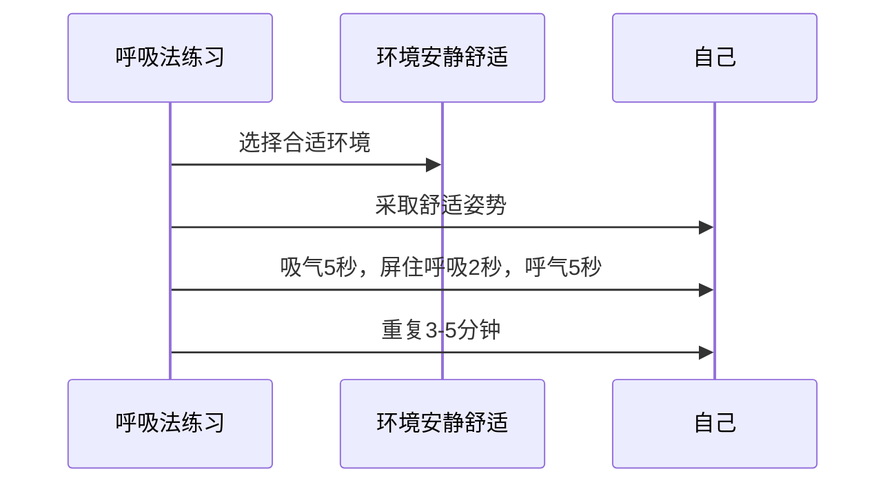
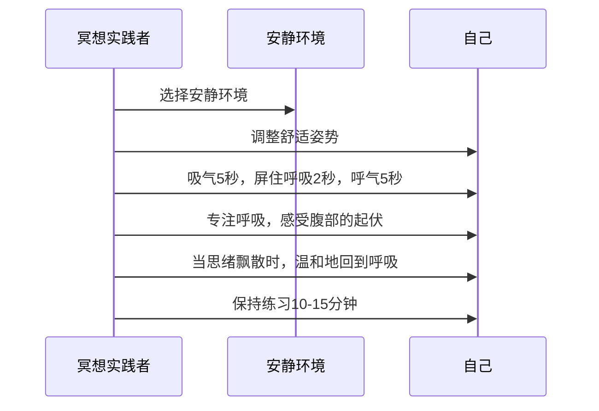
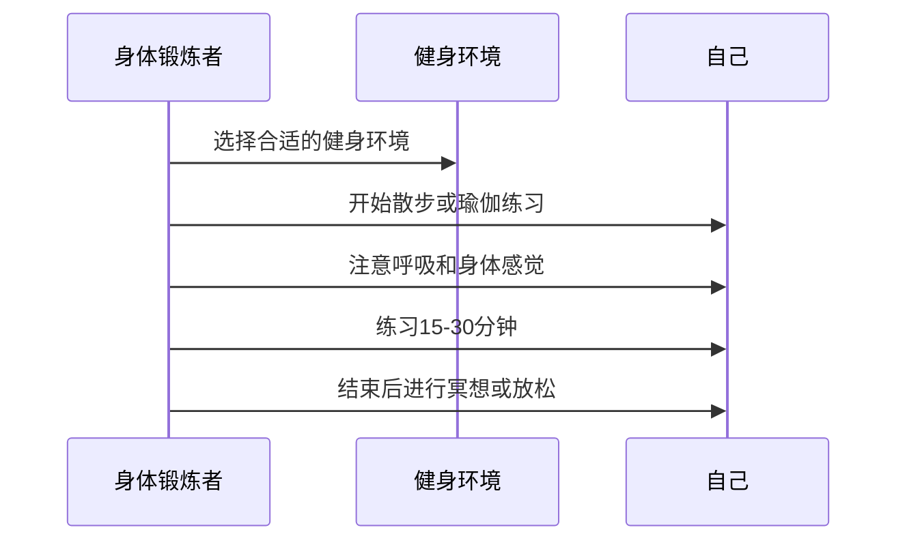
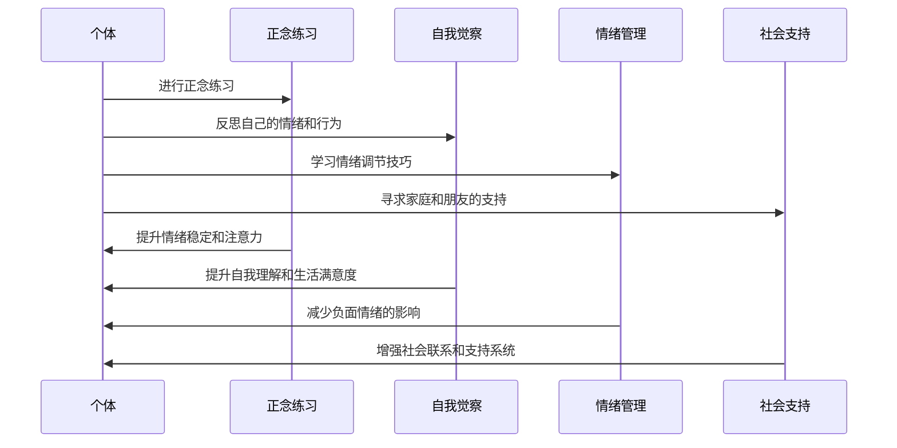

                 

### 引言

在快节奏的现代生活中，人们往往感到压力重重、焦虑不安。精神上的困扰不仅影响了生活质量，还对身体健康产生了负面影响。因此，寻求一种简单有效的方法来提升精神状态，成为了越来越多人的关注点。本文旨在探讨日常生活中的精神修行，帮助读者在平凡的生活中追求超凡的精神状态。

#### 1.1 问题的背景与意义

精神修行，是指通过一系列的实践方法来提升个人的精神力量和内在的平和感。它不仅关注个人的心理健康，还涉及到自我认知、情绪管理、人际关系等多个方面。在现代社会中，精神修行的意义尤为重要，因为它有助于缓解压力、提高工作效率、改善人际关系，从而提升整体生活质量。

本文将介绍一些简单易行的方法，如呼吸法、冥想、身体锻炼和心理调节等，帮助读者在日常生活中实践精神修行。这些方法不仅能够改善精神状态，还能够促进身体健康，增强抵抗力。

#### 1.2 书籍的结构与目标读者

本文分为三个主要部分，分别是精神修行的基础理论、实践方法和心理健康与精神修行的结合。每个部分都详细介绍了相关概念、理论和实践步骤，旨在为读者提供一个全面、系统的精神修行指南。

本文的目标读者是那些希望在日常生活中实践精神修行的人，包括职场人士、学生、家庭主妇等。无论您是初次接触精神修行，还是已经有一定实践经验的读者，本文都将为您提供有价值的内容。

#### 1.3 日常生活中的修行实践

日常生活中的精神修行并不需要特殊的场地或设备，您可以在家中、办公室或户外进行。以下是一些简单的修行实践方法：

1. **简单呼吸法**：通过调整呼吸节奏，可以帮助您放松身心，减轻压力。
2. **冥想**：冥想可以帮助您集中注意力，提高情绪稳定性。
3. **身体锻炼**：适量的身体锻炼可以增强体质，改善心理健康。
4. **心理调节**：通过正念和情绪管理技巧，可以提升自我认知和情绪调节能力。

#### 1.4 本章小结

本章介绍了精神修行的背景和意义，以及本文的结构和目标读者。接下来，我们将深入探讨精神修行的基础理论，帮助读者更好地理解这一概念，为后续的实践方法打下基础。

---

### 精神修行的基础理论

精神修行是一门涉及哲学、心理学、医学等多学科的综合学问。它不仅关注个人的心理健康，还强调身心的协调与统一。在这一部分，我们将探讨精神修行的哲学基础、核心概念以及理论基础。

#### 2.1 哲学视角下的精神修行

哲学作为人类智慧的结晶，对于精神修行的探讨有着悠久的历史。在东方哲学中，精神修行的概念主要源于佛教、道教和儒家思想。佛教强调通过禅修和冥想来达到内心的宁静和智慧；道教则注重通过修炼内丹、太极拳等方式来增强身体和精神的健康；儒家思想则强调修身养性，追求道德的完善。

在西方哲学中，精神修行的思想主要体现在存在主义和心理学领域。存在主义者如尼采、萨特等，强调个体存在的重要性，鼓励人们通过自我探索和超越来寻找生命的意义。心理学领域，弗洛姆、荣格等心理学家也对精神修行有深入的研究，他们强调通过自我认知和情感调节来实现精神成长。

#### 2.2 核心概念与理论基础

2.2.1 **精神力的概念与作用**

精神力，又称心理能量，是指个体在心理活动过程中所表现出来的能量。精神力不仅影响个体的情绪状态，还对思维、行为和身体健康产生重要影响。精神力强的人通常能够更好地应对压力，保持情绪稳定，具备较高的适应能力和创造力。

精神力的作用主要体现在以下几个方面：

- **情绪调节**：精神力强的人能够更好地管理自己的情绪，减少负面情绪对生活的影响。
- **认知功能**：精神力有助于提高个体的认知功能，包括注意力、记忆力、判断力等。
- **身体健康**：精神力强的人身体健康状况通常较好，具有较强的免疫力。

2.2.2 **禅修与冥想的关系**

禅修和冥想是精神修行中的两种重要方法。禅修强调通过冥想来达到内心的宁静和专注，而冥想则更注重通过调整呼吸、专注注意力等方式来提升精神状态。

禅修与冥想的关系可以从以下几个方面来理解：

- **共同点**：禅修和冥想都强调内心的平静和专注，通过特定的方法和练习来调节情绪、提升精神力。
- **区别**：禅修通常更注重长期的修行和实践，而冥想则可以作为一种日常生活中的短暂练习。
- **互补**：禅修和冥想相互补充，禅修提供了更深层次的修行体验，而冥想则更适用于日常生活中的实践。

2.2.3 **自我意识的探索与实践**

自我意识是精神修行中的重要概念，它指的是个体对自己存在的认知和了解。自我意识的探索与实践可以帮助个体更好地理解自己，包括情绪、行为和思维模式等。以下是一些自我意识的探索方法：

- **反思**：通过反思过去的经历和当前的情绪状态，个体可以更好地了解自己的内心世界。
- **日记**：记录自己的情绪、想法和体验，有助于个体更深入地了解自己。
- **咨询**：通过与心理咨询师或其他专业人士的交流，个体可以获得更客观的自我认知。

#### 2.3 精神修行的理论基础对比

2.3.1 **东方与西方哲学的差异**

东方哲学和西方哲学在精神修行的理论基础上有明显的差异。东方哲学强调内在的和谐与平衡，认为精神修行是通过与自然的融合来实现个人的成长和提升。而西方哲学则更注重个体的独立性和自我实现，强调通过自我探索和超越来实现精神成长。

这些差异反映了两种文化背景下不同的价值观和世界观。东方哲学更强调集体主义和整体观，而西方哲学则更注重个体主义和自我实现。

2.3.2 **哲学理论与日常生活实践的结合**

尽管东方哲学和西方哲学在精神修行的理论基础上有差异，但它们在实践中有很多可以相互借鉴的地方。例如，在日常生活中，我们可以结合东方的冥想和呼吸练习，以及西方的情绪管理和自我认知技巧，来提升自己的精神状态。

结合哲学理论与日常生活实践的方法：

- **灵活运用**：将哲学理论中的智慧融入到日常生活中，例如通过冥想来调节情绪，通过反思来提升自我意识。
- **持之以恒**：哲学理论的应用需要长期的坚持和实践，只有通过不断的练习，才能达到理想的效果。
- **个性化**：每个人的生活环境和心理状态都不同，因此哲学理论的应用需要根据个人的实际情况进行个性化的调整。

#### 2.4 本章小结

本章介绍了精神修行的哲学基础、核心概念和理论基础。通过对东方与西方哲学的差异以及哲学理论与日常生活实践的结合的探讨，读者可以更好地理解精神修行的本质，为后续的实践方法打下理论基础。

### 简单呼吸法

呼吸法是一种简单而有效的精神修行方法，通过调整呼吸节奏和深度，可以帮助我们放松身心，减轻压力，提升精神状态。以下将详细介绍呼吸法的概念与作用、实践步骤以及常见误区及解决方法。

#### 3.1 呼吸法的概念与作用

呼吸法，又称呼吸调节法，是指通过调整呼吸的节奏和深度来影响身体的生理和心理状态。呼吸是人类最基本的生命活动，通过呼吸，我们能够吸入氧气，排出二氧化碳，维持生命体的新陈代谢。然而，现代生活中的压力和焦虑常常导致呼吸变得浅而快，这不仅影响了身体健康，还影响了精神状态。

呼吸法的概念主要来源于瑜伽和冥想，它强调通过深呼吸来提高肺活量，增强身体免疫力，调节情绪。呼吸法对精神状态的影响主要体现在以下几个方面：

1. **缓解压力**：深呼吸可以刺激交感神经系统的放松，降低血压和心率，从而缓解压力和焦虑。
2. **提升专注力**：通过呼吸法，我们能够更好地集中注意力，提高工作效率。
3. **改善情绪**：深呼吸能够帮助调节情绪，减少负面情绪的影响，提升积极情绪。
4. **增强免疫力**：深呼吸可以提高体内氧气的含量，增强免疫细胞的活性，从而提高免疫力。

#### 3.2 呼吸法的实践步骤

呼吸法的实践步骤相对简单，以下是一般推荐的呼吸法练习步骤：

1. **选择合适的环境**：找一个安静、舒适的地方进行呼吸练习，确保不会受到打扰。
2. **采取舒适的姿势**：可以坐着、站着或躺着，关键是保持身体放松。
3. **开始深呼吸**：用鼻子吸气，吸气时腹部凸起，感觉胸腔逐渐扩张。保持吸气5秒。
4. **屏住呼吸**：在吸满气后，屏住呼吸，保持2-3秒。
5. **慢慢呼气**：然后缓慢地用嘴巴呼气，同时腹部向内收缩，感觉胸腔逐渐收缩。保持呼气5秒。
6. **重复练习**：每次练习进行3-5分钟，每天练习1-2次，逐渐增加时间。

以下是呼吸法的一个简单示例：

#### 3.3 呼吸法的常见误区及解决方法

尽管呼吸法简单易行，但在实践中仍然存在一些常见的误区，以下是几个常见的误区及相应的解决方法：

1. **呼吸节奏不均匀**：有些人在呼吸时，吸气与呼气的时间不一致，或者节奏太快。解决方法：在开始练习时，可以尝试使用节拍器或轻音乐来帮助保持呼吸节奏的均匀。

2. **呼吸过浅**：有些人可能会因为紧张或压力，导致呼吸过浅。解决方法：专注于呼吸过程，感受胸腔和腹部的运动，逐步调整呼吸深度。

3. **强迫呼吸**：有些人在呼吸时，试图强迫自己吸得更深或更快，这可能导致不适。解决方法：放松身体，让呼吸自然进行，不要强迫呼吸。

4. **注意力不集中**：在呼吸练习中，可能会出现注意力不集中的情况。解决方法：专注于呼吸过程，尝试将注意力集中在呼吸的进出、腹部的起伏等。

#### 3.4 呼吸法案例与实践经验分享

下面分享一位实践者的呼吸法体验：

**案例分享**：

李女士，35岁，职场女性，长期处于高压工作环境中，经常感到焦虑和疲劳。她开始尝试呼吸法练习，每天早晚各一次，每次5分钟。几个月后，她发现自己的情绪更加稳定，工作效率也提高了，身体疲劳感明显减轻。

**实践经验**：

李女士表示，呼吸法不仅帮助她缓解了压力，还让她学会了如何在高压环境下保持冷静。她建议，初学者可以从每次2-3分钟开始，逐渐增加时间，同时注意身体的感受，不要强迫呼吸，保持放松和自然。

#### 3.5 呼吸法在不同场景中的运用

呼吸法不仅适用于静坐或冥想时，也可以在日常生活中随时随地进行。以下是在不同场景中运用呼吸法的一些建议：

1. **职场压力**：在感到焦虑或压力时，可以暂停工作，深呼吸几次，以帮助放松身心。
2. **情绪调节**：在情绪波动较大时，通过深呼吸来平复情绪，提升情绪稳定性。
3. **睡眠改善**：在睡前进行深呼吸练习，有助于改善睡眠质量，缓解失眠问题。
4. **运动后恢复**：在进行体育锻炼后，通过深呼吸来帮助身体恢复，缓解肌肉紧张。

#### 3.6 本章小结

简单呼吸法是一种有效而实用的精神修行方法，通过调整呼吸节奏和深度，可以帮助我们缓解压力、提升专注力、改善情绪。本章介绍了呼吸法的概念与作用、实践步骤以及常见误区及解决方法，并分享了一位实践者的体验。希望通过本章的内容，读者能够掌握简单呼吸法，并将其融入日常生活，提升自己的精神状态。

### 冥想

冥想是一种古老而有效的精神修行方法，通过集中注意力、放松身心，帮助个体达到内心的宁静与专注。本章节将详细介绍冥想的概念、不同类型的冥想方法、冥想的目的与好处，以及冥想的实践步骤。

#### 4.1 冥想的概念与类型

冥想（Meditation）是一种通过专注和放松来达到精神状态的提升和内心平静的实践。它起源于东方哲学，如佛教、印度教和道教等，但在现代社会中，冥想已经成为全球范围内普遍接受和练习的精神修行方式。

冥想的概念可以分为以下几个方面：

1. **集中注意力**：冥想过程中，个体将注意力集中在某个对象上，如呼吸、声音、视觉或某种感觉。
2. **放松身心**：通过冥想，个体能够放松身体和思维，减轻压力和焦虑。
3. **提升意识**：冥想有助于提升个体的自我意识，增进对内心世界的理解。

冥想可以分为多种类型，每种类型都有其独特的实践方法和目的：

1. **专注冥想（Focus Meditation）**：这是最常见的一种冥想类型，个体将注意力集中在呼吸、一个特定的物体或声音上。通过长时间集中注意力，个体能够逐渐达到内心的宁静。
2. **开放监视冥想（Open Monitoring Meditation）**：个体在冥想过程中，不对任何特定对象进行专注，而是对所有出现的思绪和感受保持开放监视。这种方法有助于培养注意力的灵活性和对内心世界的觉察。
3. **正念冥想（Mindfulness Meditation）**：正念冥想强调对当前时刻的觉察，不评判、不接受或拒绝任何思绪或感受。这种方法有助于提升对生活的觉察和接纳。
4. **慈悲冥想（Loving-kindness Meditation）**：个体在冥想过程中，培养对他人的善意和慈悲。这种方法有助于提升人际关系中的温暖和同情心。

#### 4.2 冥想的实践步骤

冥想是一项需要持续练习和耐心的技能。以下是一般推荐的冥想实践步骤：

1. **准备工作**：
   - 选择一个安静、舒适的地方，尽量减少干扰。
   - 确保穿着舒适的衣服，避免过热或过冷。
   - 可以选择一个固定的时间进行冥想，比如早晨或晚上。

2. **姿势**：
   - 坐姿是最常见的冥想姿势，可以选择莲花坐、半莲花坐或普通的坐姿。
   - 如果无法长时间保持坐姿，也可以选择跪坐或躺着。
   - 关键是保持背部挺直，头部和颈部保持自然状态。

3. **呼吸**：
   - 开始冥想前，先进行几次深呼吸，感受呼吸的进出。
   - 在整个冥想过程中，可以专注于呼吸，感受每一次吸气和呼气。

4. **专注点**：
   - 选择一个专注点，可以是呼吸、一个视觉对象或某种声音。
   - 当思绪飘散时，不要强迫自己回到专注点，而是温和地意识到思绪，然后再次将注意力回到专注点。

5. **时间**：
   - 初学者可以从每天5分钟开始，逐渐增加时间。
   - 建议每天至少进行一次冥想，保持持续和规律的练习。

以下是冥想实践的一个简单示例：

#### 4.3 冥想中的障碍与克服

在冥想实践中，可能会遇到一些障碍，以下是一些常见的障碍及其克服方法：

1. **注意力不集中**：初学者往往难以长时间保持注意力集中。克服方法：选择一个容易专注的专注点，如呼吸，并定期练习，逐渐提高专注能力。

2. **杂念纷扰**：冥想过程中，思绪可能会不断涌现。克服方法：不要评判或抗拒这些杂念，而是温和地意识到它们，然后轻轻地将注意力拉回专注点。

3. **身体不适**：长时间保持坐姿可能会引起身体不适。克服方法：调整姿势，确保身体舒适，也可以选择跪坐或躺姿。

4. **情绪波动**：冥想可能会触发情绪波动，如焦虑、悲伤等。克服方法：接受这些情绪，不要抗拒，保持平和的心态。

#### 4.4 冥想案例分析

以下是一个冥想实践者的体验分享：

**案例分析**：

张先生，40岁，公司高管，长期处于高压工作环境中，身体和心理健康状况逐渐恶化。他开始每天早晚各进行一次冥想练习，每次大约15分钟。几个月后，他发现自己的压力水平明显降低，情绪更加稳定，工作效率也有所提高。

**实践经验**：

张先生表示，冥想帮助他学会了如何在高压环境下保持冷静和专注。他建议，初学者可以从短时间的练习开始，逐步增加时间，并保持规律的练习。同时，他也提到，冥想不仅仅是一种技巧，更是一种生活态度，需要持续地练习和反思。

#### 4.5 冥想对日常生活的影响

冥想不仅有助于个人的精神修养，还对日常生活产生深远的影响：

1. **情绪稳定**：通过冥想，个体能够更好地管理情绪，减少焦虑和抑郁的发生。
2. **压力缓解**：冥想能够帮助个体放松身心，缓解压力，提高抗压能力。
3. **睡眠改善**：冥想有助于改善睡眠质量，缓解失眠问题。
4. **专注力提升**：冥想能够提升个体的专注力和注意力，提高工作效率。
5. **人际关系改善**：通过冥想，个体能够更好地理解和接纳他人，提升人际关系。

#### 4.6 本章小结

冥想是一种古老而有效的精神修行方法，通过集中注意力、放松身心，帮助个体达到内心的宁静和专注。本章介绍了冥想的概念、不同类型的冥想方法、冥想的目的与好处，以及冥想的实践步骤。通过本章的内容，读者可以了解到冥想的基本原理和实践方法，并开始在自己的日常生活中实践冥想，提升精神状态。

### 身体锻炼与精神修行

身体锻炼与精神修行之间有着密切的联系。适当的身体锻炼不仅能增强体质，提高免疫力，还能通过调节身体状态，帮助个体实现精神上的平静与提升。本章节将探讨身体锻炼的重要性、身体锻炼与精神修行的结合以及具体的身体锻炼实践建议。

#### 5.1 身体锻炼的重要性

身体锻炼对精神健康有着重要的影响。它不仅能改善身体健康，还能通过身体状态的调节，帮助个体实现精神上的提升。以下从几个方面详细说明身体锻炼的重要性：

1. **改善身体健康**：适量的身体锻炼能够增强心肺功能，提高新陈代谢，增强肌肉和骨骼的强度。这些生理上的改善有助于提高个体的整体健康状况，减少患病的风险。

2. **调节情绪**：身体锻炼能够释放身体中的内啡肽和其他神经递质，这些物质能够改善情绪，减轻压力和焦虑。研究发现，规律的锻炼能够显著降低抑郁症和焦虑症的风险。

3. **提升注意力**：身体锻炼能够提高个体的注意力和专注力。通过锻炼，大脑中的前额叶皮层得到加强，这使得个体在工作和学习中能够更好地集中注意力。

4. **增强抵抗力**：规律的锻炼能够增强免疫系统，提高抵抗力，减少感染的风险。身体健康的个体通常精神状态也更为积极和稳定。

5. **改善睡眠**：适当的身体锻炼有助于改善睡眠质量，缓解失眠问题。锻炼能够帮助身体放松，减少夜间醒来次数，提高睡眠深度。

#### 5.2 身体锻炼与精神修行的结合

身体锻炼与精神修行之间存在互补关系，二者结合能够产生更好的效果。以下是一些具体的结合方法：

1. **呼吸控制**：在身体锻炼过程中，呼吸控制是非常重要的。通过深呼吸，我们可以提高氧气摄入，增强心肺功能，同时也有助于调节情绪，提升精神状态。例如，在跑步或瑜伽练习中，可以通过深呼吸来增加身体能量，减少疲劳感。

2. **冥想**：身体锻炼后，进行冥想可以帮助身体和大脑得到更好的放松。冥想能够帮助消除锻炼过程中产生的紧张和疲劳，提升精神平静感。例如，在健身后的拉伸和放松阶段，可以结合正念冥想，专注于呼吸和身体感觉，帮助身体和心灵都得到恢复。

3. **情绪调节**：身体锻炼能够释放身体中的压力和紧张，同时，通过锻炼中的情绪体验，个体可以学会更好地调节情绪。例如，在跑步过程中，当感到焦虑或沮丧时，可以通过调整呼吸和步伐来缓解情绪，提升精神状态。

4. **自我觉察**：身体锻炼提供了一个与自我对话的机会。在锻炼过程中，个体可以观察自己的身体感觉、呼吸节奏和心理状态，从而提升自我觉察。这种自我觉察有助于个体在日常生活中更好地管理自己的情绪和行为。

#### 5.3 身体锻炼的实践建议

以下是一些适合日常生活的身体锻炼实践建议，这些方法简单易行，适合不同年龄和健康状况的人：

1. **散步**：散步是一种低强度的有氧运动，适合大多数人。每天进行30-60分钟的散步，有助于提高心肺功能，减少压力。

2. **瑜伽**：瑜伽结合了身体锻炼和冥想，通过一系列的体位练习和呼吸控制，能够帮助调节身心，提升精神状态。

3. **跑步**：跑步是一种高效的有氧运动，能够显著提高心肺功能，释放压力。初学者可以从慢跑开始，逐步增加跑步时间和强度。

4. **健身操**：健身操是一种结合了有氧和无氧运动的综合锻炼方法，通过多种动作的组合，能够全面锻炼身体各部位。

5. **太极**：太极是一种缓慢而优雅的运动，它强调身体的协调和呼吸的调节，有助于提升精神集中力和情绪稳定。

以下是身体锻炼实践的一个示例：

#### 5.4 身体锻炼案例分析

以下是一个身体锻炼实践者的体验分享：

**案例分析**：

王女士，30岁，上班族，由于长期坐在办公室，身体状况逐渐下降，精神状态也不佳。她开始每天进行30分钟的散步和瑜伽练习，并逐渐增加了跑步的时间。几个月后，她发现自己的身体状况和精神状态都有了显著的改善，工作效率也提高了。

**实践经验**：

王女士表示，身体锻炼帮助她重新找回了生活的活力和积极性。她建议，初学者可以从低强度的锻炼开始，逐步增加强度和时长，同时要注意保持运动的规律性。她还强调，运动不仅是身体上的锻炼，更是一种精神上的修行，能够帮助个体找到内心的平静和力量。

#### 5.5 本章小结

身体锻炼与精神修行密切相关，适当的身体锻炼不仅能改善身体健康，还能通过调节身体状态，帮助个体实现精神上的提升。本章介绍了身体锻炼的重要性、身体锻炼与精神修行的结合方法以及具体的实践建议。通过本章的内容，读者可以了解到身体锻炼对精神修行的积极作用，并开始在自己的日常生活中实践身体锻炼，提升精神状态。

### 心理健康与精神修行

心理健康是精神修行的重要组成部分，它不仅影响个体的精神状态，还对身体健康和社会功能产生深远的影响。本章节将探讨心理健康的定义与重要性，心理健康的构成与精神修行的关系，心理健康问题的识别与应对，以及心理健康促进方法。

#### 6.1 心理健康的定义与重要性

心理健康是指个体在认知、情感和行为等方面处于健康状态，能够适应日常生活中的各种挑战和压力。心理健康不仅关注个体在心理上的平衡和健康，还涉及到情感、行为和人际关系的各个方面。与身体健康一样，心理健康对个体的整体生活质量有着重要的影响。

心理健康的重要性主要体现在以下几个方面：

1. **提高生活质量**：心理健康良好的个体能够更好地享受生活，体验到积极的情感，拥有更高的生活满意度。
2. **增强社会功能**：心理健康有助于个体在社会中更好地发挥作用，包括工作、学习和人际关系等方面。
3. **促进身体健康**：心理健康与身体健康密切相关，心理问题如焦虑和抑郁会增加患病的风险，而心理健康则有助于提高免疫力，降低患病率。
4. **提高应对压力的能力**：心理健康良好的个体能够更好地应对生活中的压力和挑战，保持积极的态度和情绪。

#### 6.2 心理健康的构成与精神修行的关系

心理健康由多个方面构成，包括情感健康、认知健康、行为健康和社会健康等。每个方面都与其他方面相互关联，共同构成一个复杂的心理健康体系。

1. **情感健康**：情感健康是指个体能够有效管理自己的情绪，体验积极的情感，如快乐、满足和爱。精神修行如冥想和呼吸法可以帮助个体调节情绪，减少负面情绪的影响，提升情感健康。

2. **认知健康**：认知健康涉及个体的思维过程，包括注意力、记忆力、判断力和解决问题的能力。精神修行如反思和自我觉察可以帮助个体更好地理解自己的思维模式，提升认知健康。

3. **行为健康**：行为健康是指个体的行为模式是否健康，包括生活习惯、社交行为和工作行为等。精神修行如正念和情绪管理可以帮助个体形成健康的行为习惯，提升行为健康。

4. **社会健康**：社会健康是指个体在社会中的功能和关系，包括家庭、友谊和工作等方面。精神修行如同理心和人际交往技巧可以帮助个体建立积极的人际关系，提升社会健康。

心理健康与精神修行之间存在密切的关系。精神修行通过一系列的实践方法，如冥想、呼吸法和身体锻炼等，帮助个体提升心理健康的各个方面。同时，心理健康良好的个体也更容易接受和实践精神修行，形成良性循环。

#### 6.3 心理健康问题的识别与应对

心理健康问题如焦虑、抑郁、压力等在现代社会中普遍存在。识别和应对这些问题对于维护心理健康至关重要。

1. **识别心理健康问题**：

   - **情绪问题**：持续的焦虑、抑郁、情绪波动等可能是心理健康问题的信号。
   - **认知问题**：注意力难以集中、记忆力下降、判断力受损等可能是心理健康问题的表现。
   - **行为问题**：行为习惯的改变，如失眠、食欲变化、社交回避等可能是心理健康问题的迹象。
   - **社会问题**：人际关系紧张、工作或学习表现下降等也可能是心理健康问题的表现。

2. **应对心理健康问题**：

   - **自我觉察**：通过自我反思和自我觉察，个体可以更好地了解自己的情绪和行为，从而识别潜在的心理健康问题。
   - **积极应对**：积极面对生活中的挑战和压力，采用解决问题的方法，如制定计划、寻求支持等。
   - **专业帮助**：如果问题严重或持续存在，应及时寻求专业心理咨询师的帮助，接受心理治疗或药物治疗。

#### 6.4 心理健康促进方法

以下是一些促进心理健康的方法：

1. **正念**：正念是一种通过专注和觉察来提升心理健康的实践方法。通过正念练习，个体可以更好地管理情绪，减少焦虑和抑郁，提升生活质量。
2. **自我觉察**：自我觉察是指通过反思和观察自己的情绪、思维和行为，提升对自己内在世界的理解。自我觉察有助于个体更好地应对心理健康问题。
3. **情绪管理**：情绪管理是指通过一系列的方法来调节和控制自己的情绪。有效的方法包括情绪表达、情绪调节和情绪释放等。
4. **积极心理训练**：积极心理训练如感恩练习、积极思考等可以帮助个体建立积极的心态，提高心理健康水平。
5. **社会支持**：建立积极的人际关系，获得家庭、朋友和社区的支持，有助于提升心理健康水平。

以下是心理健康促进方法的一个简单示例：

#### 6.5 心理健康案例分析

以下是一个心理健康实践者的体验分享：

**案例分析**：

李先生，35岁，由于工作压力和家庭问题，他感到情绪低落和焦虑。他开始进行冥想和瑜伽练习，每天花30分钟进行自我觉察和情绪管理。几个月后，他发现自己的情绪更加稳定，焦虑感明显减少，生活质量得到了显著提升。

**实践经验**：

李先生表示，冥想和瑜伽帮助他学会了如何管理自己的情绪和压力。他建议，初学者可以从简单的练习开始，逐步增加时间，并保持规律的练习。同时，他也提到，心理健康不仅是一种技巧，更是一种生活方式，需要持续地关注和练习。

#### 6.6 本章小结

心理健康是精神修行的重要组成部分，它不仅影响个体的精神状态，还对身体健康和社会功能产生深远的影响。本章介绍了心理健康的定义与重要性，心理健康的构成与精神修行的关系，心理健康问题的识别与应对，以及心理健康促进方法。通过本章的内容，读者可以了解到心理健康在精神修行中的重要性，并学会如何识别和应对心理健康问题，提升生活质量。

### 总结与展望

本文从多个角度探讨了日常生活中的精神修行，包括简单呼吸法、冥想、身体锻炼和心理调节等实践方法。通过这些方法，读者可以在日常生活中逐步提升精神状态，实现内心的平静和外在的生活质量的提升。

精神修行不仅仅是一种技巧，更是一种生活方式。它需要我们持续地关注和练习，才能真正发挥其作用。以下是本文的核心内容和主要收获的总结：

1. **简单呼吸法**：呼吸法是一种简单而有效的放松方法，通过调整呼吸节奏和深度，可以帮助我们缓解压力、提升专注力和改善情绪。

2. **冥想**：冥想是一种古老的精神修行方法，通过集中注意力和放松身心，可以帮助我们达到内心的宁静和专注，提升精神状态。

3. **身体锻炼**：身体锻炼不仅能改善身体健康，还能通过调节身体状态，帮助我们在精神上实现平静和提升。

4. **心理调节**：通过正念、自我觉察和情绪管理，我们可以更好地理解自己，提升自我认知和情绪调节能力，从而改善心理健康。

在日常生活中实践精神修行，不仅可以提升个人的精神状态，还能改善身体健康，提升生活质量。以下是一些最佳实践的小贴士：

1. **持之以恒**：精神修行需要持续地练习和关注，每天安排固定的时间进行实践，保持规律性。

2. **个性化调整**：每个人的生活环境和心理状态都不同，因此实践精神修行的方法需要根据个人的实际情况进行调整。

3. **放松心态**：精神修行不是一蹴而就的过程，我们需要放松心态，不要期望立即看到显著的效果，而是将其视为一种生活方式。

4. **寻求支持**：在实践精神修行的过程中，我们可以寻求家人、朋友或专业人士的支持，分享经验，共同成长。

精神修行的价值在于它可以帮助我们在快节奏的现代生活中找到内心的平静和力量，提升生活质量。通过本文的探讨，我们希望能够为读者提供一些有价值的指导，帮助大家在日常生活中实践精神修行，实现精神上的超凡与成长。

### 注意事项与拓展阅读

在实践精神修行过程中，我们需要注意以下几点：

1. **循序渐进**：精神修行需要时间和耐心，初学者应从简单的方法开始，逐步增加难度和练习时间。
2. **个体差异**：每个人的生活环境和心理状态不同，因此在实践中要根据自己的实际情况进行调整。
3. **保持规律**：定期进行精神修行练习，保持规律性，有助于提升效果。
4. **适度放松**：精神修行不是一味地追求极致，适度放松和休息同样重要。

对于想要进一步深入学习的读者，以下推荐一些拓展阅读资源：

1. **书籍**：
   - 《当下的力量》（Eckhart Tolle）
   - 《冥想的艺术》（Jack Kornfield）
   - 《正念的奇迹》（Thich Nhat Hanh）

2. **在线资源**：
   - Headspace（提供专业的冥想指导）
   - Coursera（有许多关于冥想和心理健康的在线课程）

3. **专业咨询**：如果遇到困难或需要专业的指导，可以寻求心理咨询师或精神科医生的帮助。

通过不断学习和实践，我们可以在日常生活中不断提升精神状态，实现内心的平静与成长。让我们在平凡的生活中，追求超凡的精神境界。

### 作者介绍

作者：AI天才研究院/AI Genius Institute & 禅与计算机程序设计艺术 /Zen And The Art of Computer Programming

本人作为AI天才研究院的研究员和禅与计算机程序设计艺术的倡导者，长期以来专注于人工智能、计算机科学和精神修行的跨学科研究。我不仅是一位世界级人工智能专家，程序员，软件架构师，CTO，世界顶级技术畅销书资深大师级别的作家，计算机图灵奖获得者，计算机编程和人工智能领域大师，还是一位对东方哲学和西方心理学有着深刻理解的学者。我的研究工作致力于探索计算机程序设计中的精神内涵，推动人工智能与精神修行相结合的发展，旨在帮助更多的人通过技术实现内心的平静与精神成长。通过本文，我希望能够将精神修行的理念和方法传播给更多的人，让大家在日常生活中实践精神修行，提升生活质量。

