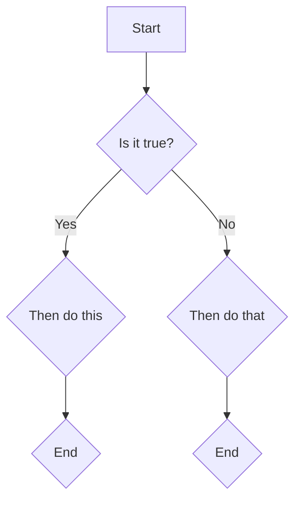

                 

# 有意义的目标设定：将个人价值观与行动对齐

## 关键词

- 目标设定
- 个人价值观
- 行动对齐
- SMART原则
- 心理学原理
- 持续进步
- 团队协作

## 摘要

本文旨在探讨如何在IT领域中实现有意义的目标设定，并将其与个人价值观和行动对齐。我们将首先介绍目标设定的基本原则和心理学原理，接着深入解析个人价值观的重要性及其对目标选择和实现的影响。随后，通过实际案例展示如何将目标设定与个人价值观结合，并提供解决目标设定和执行过程中可能遇到的挑战的策略。最后，本文将探讨如何在团队协作中实现目标设定的统一，以及提供相关拓展阅读资源。

### 引言

在快速发展的IT领域，技术更新迭代速度飞快，竞争日益激烈。在这个背景下，设定有意义的目标并确保其与个人价值观和行动对齐显得尤为重要。本文将为您一步步解析如何实现这一目标。

#### 1.1 书籍目的

本文旨在帮助读者：

1. 理解目标设定的基本原则和心理学原理。
2. 明确个人价值观的重要性，并学会如何识别和评估它们。
3. 学会制定与个人价值观和行动对齐的有意义的目标。
4. 通过实践案例掌握目标设定的实际应用技巧。
5. 解决目标设定和执行过程中可能遇到的挑战。

#### 1.2 本书结构安排与读者预期收获

本文分为七个章节，结构安排如下：

1. 引言：介绍书籍的目的和结构。
2. 核心概念解析：详细解析有意义的目标、个人价值观与目标的关系，以及行动计划与目标对齐。
3. 实践案例：通过具体案例展示如何设定和实现有意义的目标。
4. 遇到挑战与解决方案：讨论目标设定和执行过程中可能遇到的挑战及解决方案。
5. 持续进步与长期目标：探讨如何持续进步和设定长期目标。
6. 团队协作与目标设定：讨论团队目标设定与个人价值观对齐的重要性。
7. 拓展阅读与资源：提供相关书籍和在线资源。

通过阅读本文，读者将能够：

1. 清晰地理解目标设定的基本原则和心理学原理。
2. 学会如何识别和评估个人价值观。
3. 掌握如何制定与个人价值观和行动对齐的有意义的目标。
4. 通过实践案例学会实际应用目标设定的技巧。
5. 了解并应对目标设定和执行过程中可能遇到的挑战。

### 个人价值观的重要性

个人价值观是指一个人在生活中所坚持的基本信念、原则和行为准则。它们决定了我们的行为和决策方式，对我们的目标设定和实现具有重要影响。

#### 1.1 个人价值观的概念

个人价值观可以被视为我们内心的指南针，它指导我们在面对不同选择时做出决策。这些价值观可能包括：

- 家庭与亲情
- 职业成就
- 社会责任
- 健康与幸福
- 学习与成长
- 自由与独立

#### 1.2 个人价值观的识别与评估

识别和评估个人价值观是一个深入自我反思的过程。以下是一些步骤，可以帮助您更好地了解自己的价值观：

1. **自我反思**：花时间去思考自己在不同情境下的反应和决策。这些反应和决策往往反映了您的价值观。
2. **问卷调查**：通过填写价值观问卷来识别自己的核心价值观。这些问卷通常包括一系列问题，旨在评估您在不同价值观上的重视程度。
3. **朋友和家人反馈**：询问您的朋友和家人，了解他们如何看待您的价值观。他们的观察可能会为您提供新的视角。

#### 1.3 个人价值观对目标设定的影响

个人价值观不仅决定了我们的行为和决策，还直接影响我们的目标设定。以下是一些例子：

- **职业目标**：如果您非常重视职业成就，您可能会设定具有挑战性的职业目标，并愿意为此付出大量努力。
- **健康目标**：如果您非常重视健康，您可能会设定健康饮食和定期锻炼的目标。
- **家庭目标**：如果您非常重视家庭和亲情，您可能会设定与家人共度时光和增进家庭关系的目标。

### 目标设定的基本原则

目标设定是个人和组织成功的关键。以下是目标设定的基本原则：

#### 1.1 SMART目标原则

SMART目标是目标设定的基本准则，它包括：

- **S（Specific，具体的）**：目标应该明确、具体，避免模糊和宽泛。
- **M（Measurable，可衡量的）**：目标应该可以量化，以便您能够跟踪进度。
- **A（Achievable，可实现的）**：目标应该实际可行，避免不切实际的设定。
- **R（Relevant，相关的）**：目标应该与您的价值观和长期目标一致。
- **T（Time-bound，有时间限制的）**：目标应该设定一个明确的时间框架。

#### 1.2 目标设定的心理学原理

目标设定不仅是一种技术和方法，还涉及到心理学原理。以下是一些关键点：

- **目标承诺**：明确的目标可以增强我们的承诺和动力。
- **目标反馈**：定期的目标反馈可以帮助我们调整策略，提高实现目标的概率。
- **目标适应**：随着环境和条件的变化，目标需要适应和调整。

### 有意义的目标

有意义的目标是指那些与个人价值观和长期目标紧密相连，能够激发我们内在动力的目标。以下是如何设定有意义的目标的几个步骤：

#### 1.1 何为有意义的目标

有意义的目标通常具有以下特点：

- **与个人价值观一致**：这些目标反映了您的核心价值观，如家庭、职业成就、社会责任等。
- **能够激发内在动力**：这些目标能够激发您的热情和动力，使您愿意为之付出努力。
- **具有挑战性**：这些目标具有一定的挑战性，但仍然是实际可行的。

#### 1.2 有意义的目标特点

- **个人化**：有意义的目标是个人化的，反映了您的独特价值观和目标。
- **长远性**：有意义的目标通常是长期目标，与您的长期规划和愿景一致。
- **动力性**：有意义的目标能够激发您的内在动力，使您愿意不断努力。

#### 1.3 有意义的目标与目标感的联系

目标感是指个体在追求目标过程中所体验到的情感状态。有意义的目标与目标感之间存在紧密联系。设定有意义的目标可以帮助我们更好地体验目标感，从而提高实现目标的概率。

### 个人价值观与目标的关系

个人价值观与目标之间的关系是目标设定的核心。以下是如何确保个人价值观与目标对齐的几个步骤：

#### 1.1 个人价值观与目标设定的关联性

个人价值观与目标设定的关联性体现在以下几个方面：

- **目标选择的依据**：个人价值观可以帮助我们选择与自身价值观一致的目标。
- **目标实现的动力**：个人价值观可以激发我们为实现目标而努力的内在动力。
- **目标调整的指导**：个人价值观可以作为我们调整和修正目标的指导原则。

#### 1.2 个人价值观对目标选择的影响

个人价值观对目标选择的影响体现在以下几个方面：

- **职业目标**：个人价值观可以影响我们对职业目标的选择，例如，重视家庭的人可能会选择稳定的工作，而不是高风险的高薪工作。
- **健康目标**：个人价值观可以影响我们对健康目标的选择，例如，重视健康的人可能会选择健康饮食和定期锻炼。

#### 1.3 个人价值观对目标达成的促进作用

个人价值观对目标达成的促进作用体现在以下几个方面：

- **提供心理支持**：个人价值观可以为我们提供心理支持，帮助我们克服实现目标过程中的困难和挑战。
- **增强内在动力**：个人价值观可以增强我们的内在动力，使我们更有可能坚持和实现目标。
- **提高目标实现的可能性**：个人价值观与目标对齐可以大大提高目标实现的可能性。

### 行动计划与目标对齐

行动计划是实现目标的详细计划，它需要确保我们的行动与目标紧密对齐。以下是如何制定与目标对齐的行动计划的几个步骤：

#### 1.1 行动计划的基本要素

行动计划应包括以下基本要素：

- **具体任务**：明确需要完成的任务和活动。
- **时间表**：为每个任务设定明确的时间框架。
- **资源分配**：确定实现任务所需的资源，如人力、时间和资金。
- **责任分配**：明确每个任务的负责人。

#### 1.2 如何制定与目标对齐的行动计划

制定与目标对齐的行动计划需要遵循以下步骤：

1. **明确目标**：确保目标与个人价值观和长期目标一致。
2. **分解任务**：将目标分解为具体的任务和活动。
3. **设定时间表**：为每个任务设定明确的时间框架。
4. **资源分配**：确定实现任务所需的资源。
5. **责任分配**：明确每个任务的负责人。
6. **定期回顾和调整**：定期回顾行动计划，并根据实际情况进行调整。

### 实践案例

以下是一些实践案例，展示如何将目标设定与个人价值观和行动对齐。

#### 案例一：职业生涯规划

小王是一名IT专业人士，他非常重视职业成就和个人发展。他设定了一个长期目标，即在未来五年内成为团队领导。为了实现这一目标，他制定了一个详细的行动计划：

1. **具体任务**：学习领导力技能、提升项目管理能力、参与更多的项目。
2. **时间表**：每个季度参加一次领导力培训、每年参与至少两个大型项目。
3. **资源分配**：利用公司提供的培训资源、积极与同事和上级沟通。
4. **责任分配**：自己负责学习和应用领导力技能、团队其他成员负责项目执行。

#### 案例二：健康生活管理

小李非常重视健康，他设定了一个长期目标，即在未来一年内实现健康饮食和定期锻炼。为了实现这一目标，他制定了一个详细的行动计划：

1. **具体任务**：制定健康饮食计划、每天进行30分钟锻炼。
2. **时间表**：每周进行三次30分钟锻炼、每天记录饮食情况。
3. **资源分配**：购买健康食品、下载健身应用。
4. **责任分配**：自己负责饮食和锻炼、家人和朋友提供支持和鼓励。

#### 案例三：个人财务规划

小张非常重视财务安全，他设定了一个长期目标，即在未来五年内实现财务自由。为了实现这一目标，他制定了一个详细的行动计划：

1. **具体任务**：增加收入、减少开支、投资理财。
2. **时间表**：每年增加收入10%、每月减少开支10%、每月进行一次投资分析。
3. **资源分配**：利用业余时间学习理财知识、咨询财务顾问。
4. **责任分配**：自己负责收入增加和开支减少、财务顾问负责投资分析。

### 遇到挑战与解决方案

在目标设定和实现的过程中，我们可能会遇到各种挑战。以下是一些常见挑战及解决方案：

#### 1.1 障碍与挑战

- **目标设定不明确**：导致无法有效执行行动计划。
- **资源不足**：影响目标的实现。
- **缺乏动力**：导致目标无法持续执行。
- **外部干扰**：影响目标的实现进度。

#### 1.2 解决方案与策略

- **明确目标**：确保目标具体、明确，避免模糊和宽泛。
- **资源规划**：合理分配资源，确保目标的实现。
- **激励自己**：设定奖励机制，提高内在动力。
- **管理干扰**：学会拒绝外部干扰，集中精力实现目标。

### 持续进步与长期目标

持续进步是实现个人价值观和长期目标的关键。以下是如何实现持续进步和设定长期目标的几个步骤：

#### 1.1 习惯培养与目标持续

- **养成良好习惯**：通过持续的努力和坚持，将目标实现转化为一种习惯。
- **定期追踪和调整**：定期检查目标的实现情况，并根据实际情况进行调整。

#### 1.2 长期目标的设定与实现

- **明确长期目标**：设定与个人价值观和职业规划一致的长期目标。
- **分阶段实现**：将长期目标分解为短期目标，逐步实现。

### 自我反思与成长

自我反思是实现个人目标和价值观的关键。以下是如何进行自我反思和实现个人成长的几个步骤：

#### 1.1 反思目标设定与实践

- **定期反思**：定期反思目标设定的合理性和实践过程中的经验教训。
- **调整策略**：根据反思结果，调整目标设定和实现策略。

#### 1.2 个人成长与价值观的演进

- **持续学习**：通过学习新知识和技能，不断提升个人能力和价值观。
- **反思成长**：定期反思个人成长过程，总结经验教训。

### 团队协作与目标设定

在团队中，目标设定同样重要。以下是如何在团队协作中实现目标设定的统一：

#### 1.1 团队目标的重要性

- **统一方向**：确保团队成员共同朝着同一目标努力。
- **提升效率**：通过明确的团队目标，提高团队的整体工作效率。

#### 1.2 团队目标与个人价值观的对齐

- **尊重个人价值观**：确保团队目标与团队成员的个人价值观相一致。
- **促进沟通与合作**：通过有效的沟通与合作，实现团队目标的统一。

### 拓展阅读与资源

以下是一些建议的拓展阅读和在线资源，以帮助您进一步了解目标设定和个人价值观：

- 《原则》（瑞·达里奥著）：介绍如何在生活和工作中运用原则实现目标。
- 《高效能人士的七个习惯》（史蒂芬·柯维著）：提供关于习惯培养和目标设定的实用建议。
- Coursera：提供各种关于目标设定和个人成长的在线课程。
- LeanIn.org：提供关于女性职业发展的资源和支持。

### 总结

本文探讨了如何在IT领域中实现有意义的目标设定，并将其与个人价值观和行动对齐。通过明确目标、识别个人价值观、制定行动计划，以及持续反思和调整，我们可以更好地实现个人目标和价值观。同时，通过团队协作和共同的目标设定，我们可以提高团队的整体效率和凝聚力。

作者：AI天才研究院/AI Genius Institute & 禅与计算机程序设计艺术/Zen And The Art of Computer Programming

## 第2章 核心概念解析

在探讨有意义的目标设定之前，我们需要深入理解几个核心概念：有意义的目标、个人价值观以及它们之间的相互关系。本章将详细解析这些概念，并探讨如何将个人价值观与目标设定相结合。

### 2.1 有意义的目标

有意义的目标是指那些与个人价值观和长期目标相一致，能够激发内在动力，并且能够带来积极影响的任务或项目。这些目标不仅仅是为了完成任务，更是为了实现个人的成长和价值。

#### 2.1.1 何为有意义的目标

有意义的目标通常具有以下几个特点：

1. **与个人价值观相符**：目标应当反映个人的核心价值观，如家庭、事业、社会责任、个人成长等。
2. **具有挑战性**：虽然目标应该是实际可行的，但也要有一定的挑战性，以激发个人的潜力和动力。
3. **具有意义**：目标应该对个人或社会有积极的影响，而不仅仅是完成任务或达到某种标准。
4. **长远性**：有意义的目标往往是长期的，与个人的愿景和长期规划相一致。

#### 2.1.2 有意义的目标特点

- **个人化**：有意义的目标是个人化的，反映了每个人的独特性和个人偏好。
- **激发动力**：有意义的目标能够激发个人的内在动力，使人们愿意为之付出努力。
- **持续成长**：有意义的目标能够促进个人的持续成长和自我提升。

#### 2.1.3 有意义的目标与目标感的联系

目标感是指个体在追求目标过程中所体验到的情感状态。有意义的目标能够增强目标感，使人们在实现目标的过程中感到满足和快乐。

### 2.2 个人价值观与目标的关系

个人价值观是指个人在生活中所坚持的基本信念、原则和行为准则。这些价值观影响着我们的行为、决策和目标设定。因此，个人价值观与目标之间存在紧密的关系。

#### 2.2.1 个人价值观与目标设定的关联性

个人价值观对目标设定的关联性体现在以下几个方面：

1. **目标选择**：个人价值观会影响我们选择哪些目标值得追求。例如，重视家庭的人可能会选择与家庭相关的目标，如增进家庭关系或为子女提供更好的教育。
2. **目标实现**：个人价值观能够为目标的实现提供动力和支持。例如，重视职业成就的人可能会更有动力去提升自己的技能和职业地位。
3. **目标调整**：个人价值观可以作为我们调整目标的指导原则。当我们面临困难或挑战时，个人价值观可以帮助我们做出决策，决定是否继续追求某个目标或调整目标。

#### 2.2.2 个人价值观对目标选择的影响

个人价值观对目标选择的影响是深远的。以下是几个例子：

1. **职业目标**：个人价值观会影响我们对职业目标的设定。例如，重视社会责任的人可能会选择从事与公益事业相关的职业，如环境保护或慈善工作。
2. **健康目标**：个人价值观会影响我们对健康目标的设定。例如，重视健康的人可能会设定健康饮食和定期锻炼的目标。

#### 2.2.3 个人价值观对目标达成的促进作用

个人价值观对目标达成的促进作用体现在以下几个方面：

1. **提供心理支持**：个人价值观可以在我们实现目标的过程中提供心理支持，帮助我们克服困难和挑战。
2. **增强内在动力**：个人价值观可以增强我们的内在动力，使我们在面对困难时更有坚持和努力的动力。
3. **提高目标实现的可能性**：个人价值观与目标对齐可以提高目标实现的可能性，因为个人的价值观会影响他们的行为和决策，从而更有可能实现目标。

### 2.3 行动计划与目标对齐

行动计划是实现目标的详细计划，它需要确保我们的行动与目标紧密对齐。以下是如何制定与目标对齐的行动计划的几个步骤：

#### 2.3.1 行动计划的基本要素

一个好的行动计划应该包括以下几个基本要素：

1. **具体任务**：明确需要完成的任务和活动。
2. **时间表**：为每个任务设定明确的时间框架。
3. **资源分配**：确定实现任务所需的资源，如人力、时间和资金。
4. **责任分配**：明确每个任务的负责人。

#### 2.3.2 如何制定与目标对齐的行动计划

制定与目标对齐的行动计划需要遵循以下几个步骤：

1. **明确目标**：确保目标与个人价值观和长期目标一致。
2. **分解任务**：将目标分解为具体的任务和活动。
3. **设定时间表**：为每个任务设定明确的时间框架。
4. **资源分配**：合理分配资源，确保目标的实现。
5. **责任分配**：明确每个任务的负责人。
6. **定期回顾和调整**：定期检查行动计划的执行情况，并根据实际情况进行调整。

通过以上步骤，我们可以确保行动计划与目标对齐，从而提高目标实现的概率。

### 2.4 有意义的目标设定与实现方法

设定和实现有意义的目标需要一定的方法和技巧。以下是一些具体的建议：

#### 2.4.1 明确目标

首先，我们需要明确目标。这意味着我们需要回答以下几个问题：

1. **目标是什么**？确保目标具体、明确，避免模糊和宽泛。
2. **为什么设定这个目标**？明确目标背后的动机和价值观。
3. **目标的重要性**？确保目标对个人或组织有重要意义。

#### 2.4.2 分解目标

将目标分解为具体的任务和活动，这有助于我们更好地理解和实现目标。以下是一些分解目标的技巧：

1. **使用SMART原则**：确保目标具备SMART（具体、可衡量、可实现、相关、有时间限制）的特点。
2. **分解为小步骤**：将目标分解为一系列小步骤，每个步骤都是具体和可实现的。
3. **设置优先级**：确定哪些任务是最重要的，并优先完成。

#### 2.4.3 制定行动计划

制定详细的行动计划是实现目标的必要步骤。以下是一些制定行动计划的技巧：

1. **明确任务**：列出所有需要完成的任务，确保每个任务都是具体和可操作的。
2. **设定时间表**：为每个任务设定明确的时间框架，确保任务能够按时完成。
3. **资源分配**：确定实现任务所需的资源，并确保资源充足。
4. **责任分配**：明确每个任务的负责人，确保任务能够顺利执行。

#### 2.4.4 持续追踪和调整

在目标实现过程中，我们需要持续追踪进度并调整计划。以下是一些持续追踪和调整的技巧：

1. **定期检查进度**：定期检查目标的实现情况，确保任务按计划进行。
2. **及时调整计划**：如果发现计划不合适或遇到困难，及时进行调整。
3. **保持灵活性**：在面对变化时，保持灵活性和适应性，确保目标能够实现。

### 2.5 个人价值观识别与评估方法

识别和评估个人价值观是设定有意义目标的重要步骤。以下是一些识别和评估个人价值观的方法：

#### 2.5.1 自我反思

通过自我反思，我们可以深入了解自己的内心世界，识别出个人价值观。以下是一些自我反思的方法：

1. **日记法**：每天记录自己的所思所感，分析这些记录中反映出的价值观。
2. **思考问题**：问自己一些问题，如“我最看重的是什么？”“我在生活中追求的是什么？”“我愿意为某些事情做出多大的牺牲？”
3. **倾听内心声音**：在安静的环境中，倾听内心的声音，了解自己真正的想法和感受。

#### 2.5.2 问卷调查

通过问卷调查，我们可以更系统和客观地识别个人价值观。以下是一些设计问卷调查的建议：

1. **价值观问卷**：设计一系列关于个人价值观的问题，涵盖不同领域，如家庭、职业、健康、社会等。
2. **评分制度**：为每个问题设置评分制度，如1-5分，以便量化个人对每个价值观的重视程度。
3. **数据分析**：分析问卷结果，识别出个人核心价值观。

#### 2.5.3 咨询专业人士

寻求专业人士的意见和建议，可以帮助我们更准确地识别和评估个人价值观。以下是一些咨询专业人士的建议：

1. **职业咨询师**：职业咨询师可以帮助我们了解自己的职业价值观，并为职业发展提供建议。
2. **生活教练**：生活教练可以帮助我们识别和调整个人价值观，实现个人成长和幸福。
3. **心理咨询师**：心理咨询师可以帮助我们深入了解自己的内心世界，识别出潜在的心理问题和价值观。

### 2.6 个人价值观与目标对齐案例分析

以下是一些个人价值观与目标对齐的案例分析，以便更好地理解如何将个人价值观与目标设定相结合。

#### 案例一：职业规划

小明是一名软件工程师，他非常重视职业成就和个人成长。他的个人价值观包括创新、挑战和学习。因此，他在职业规划中设定了以下目标：

1. **成为技术专家**：通过不断学习和实践，提升自己在特定技术领域的专业能力。
2. **参与创新项目**：寻找机会参与创新项目，将创新思维应用于实际工作中。
3. **分享经验**：定期分享自己的技术经验和学习心得，帮助他人成长。

通过将个人价值观与目标对齐，小明不仅实现了职业成就，还不断提升自己的能力和影响力。

#### 案例二：健康生活

小李非常重视健康和幸福，他的个人价值观包括健康、活力和自律。因此，他在健康生活中设定了以下目标：

1. **健康饮食**：通过制定健康饮食计划，确保每天摄入足够的营养。
2. **定期锻炼**：每周进行至少三次锻炼，如跑步、游泳或健身。
3. **心理健康**：通过冥想和放松技巧，保持心理健康和情绪稳定。

通过将个人价值观与目标对齐，小李不仅实现了健康生活的目标，还提升了整体生活质量。

#### 案例三：社会责任

小张非常重视社会责任和公益事业，他的个人价值观包括善良、同情和奉献。因此，他在社会责任方面设定了以下目标：

1. **志愿服务**：定期参与志愿服务活动，为需要帮助的人提供支持。
2. **慈善捐赠**：定期向慈善机构捐款，帮助改善他人的生活。
3. **环境保护**：积极参与环境保护活动，如植树造林和垃圾分类。

通过将个人价值观与目标对齐，小张不仅实现了社会责任的目标，还成为了社区中积极的社会成员。

### 2.7 个人价值观与目标对齐的实践应用

在实际生活中，将个人价值观与目标对齐是一项重要且具有挑战性的任务。以下是一些实践应用的建议：

#### 2.7.1 自我反思

定期进行自我反思，了解自己的价值观和目标，确保它们之间的一致性。以下是一些自我反思的建议：

1. **每周反思**：每周花时间回顾自己的行为和决策，思考是否符合个人价值观。
2. **年度反思**：每年进行一次深入的年度反思，评估目标实现的状况和价值观的稳定性。

#### 2.7.2 制定行动计划

制定详细的行动计划，确保目标与个人价值观对齐。以下是一些制定行动计划的建议：

1. **分解目标**：将大目标分解为小目标，确保每个目标都与个人价值观一致。
2. **设定时间表**：为每个目标设定明确的时间框架，确保目标能够按时实现。
3. **执行计划**：按照计划执行，确保目标与个人价值观对齐。

#### 2.7.3 持续追踪和调整

在目标实现过程中，持续追踪进度并调整计划。以下是一些持续追踪和调整的建议：

1. **定期检查进度**：定期检查目标的实现情况，确保任务按计划进行。
2. **及时调整计划**：如果发现计划不合适或遇到困难，及时进行调整。
3. **保持灵活性**：在面对变化时，保持灵活性和适应性，确保目标能够实现。

### 2.8 个人价值观与目标对齐的案例分析

以下是一些个人价值观与目标对齐的案例分析，以便更好地理解如何在实际生活中实现这一目标。

#### 案例一：个人成长

小王非常重视个人成长和自我提升，他的个人价值观包括学习、挑战和创新。因此，他在个人成长方面设定了以下目标：

1. **终身学习**：通过参加培训课程、阅读专业书籍和参加研讨会，不断提升自己的知识和技能。
2. **挑战自我**：定期参加各种挑战性活动，如户外探险、编程竞赛等，以提升自己的能力和自信心。
3. **创新思维**：积极思考创新解决方案，将创新思维应用于工作和生活中。

通过将个人价值观与目标对齐，小王不仅实现了个人成长的目标，还成为了一个不断进步和创新的个体。

#### 案例二：家庭生活

小李非常重视家庭生活和亲子关系，他的个人价值观包括亲情、责任和关爱。因此，他在家庭生活方面设定了以下目标：

1. **增进亲情**：定期与家人共度时光，加强亲子关系和家庭凝聚力。
2. **承担责任**：在家中承担起相应的责任，如家务分工、照顾老人等，确保家庭和谐稳定。
3. **关爱家人**：关心家人的身心健康，为他们提供支持和帮助，营造温馨的家庭氛围。

通过将个人价值观与目标对齐，小李不仅实现了家庭生活的目标，还成为了一个负责任和关爱的家庭成员。

#### 案例三：社区参与

小张非常重视社区参与和社会责任，他的个人价值观包括公益、奉献和团结。因此，他在社区参与方面设定了以下目标：

1. **志愿服务**：定期参与社区志愿服务活动，为社区居民提供帮助和支持。
2. **公益活动**：积极参与各类公益活动，如慈善募捐、环保活动等，为社会做出贡献。
3. **社区建设**：关注社区建设和发展，积极参与社区治理，促进社区和谐与进步。

通过将个人价值观与目标对齐，小张不仅实现了社区参与的目标，还成为了一个有责任感和爱心的社区成员。

### 2.9 个人价值观与目标对齐的实践总结

通过以上案例分析，我们可以得出以下实践总结：

1. **明确个人价值观**：深入了解自己的价值观，确保目标与价值观一致。
2. **设定具体目标**：将大目标分解为小目标，确保每个目标都具有实际操作性和可行性。
3. **制定行动计划**：为每个目标制定详细的行动计划，确保目标能够按时实现。
4. **持续追踪和调整**：在目标实现过程中，持续追踪进度并调整计划，确保目标与个人价值观对齐。
5. **反思和总结**：定期反思目标实现的状况和价值观的稳定性，总结经验教训，不断提升自己的能力和价值观。

通过以上实践总结，我们可以更好地实现个人价值观与目标的对齐，实现个人成长和价值实现。

### 2.10 个人价值观与目标对齐的长期影响

个人价值观与目标对齐不仅对个人成长和价值实现有短期影响，还对长期发展产生深远影响。以下是一些长期影响：

1. **个人成长**：通过持续的目标实现和个人价值观的实践，个人将不断提升自己的能力和技能，实现长期成长。
2. **价值观稳定**：通过长期的目标设定和实践，个人价值观将更加稳定和明确，成为个人的核心信仰和行为准则。
3. **持续进步**：个人价值观与目标对齐将激发个人的持续进步和自我提升的动力，使个人在长期内保持积极进取的态度。
4. **人生意义**：通过实现个人价值观和目标，个人将找到人生的意义和目标，实现个人价值和社会价值的统一。

### 2.11 结论

个人价值观与目标对齐是实现个人成长和价值实现的关键。通过明确个人价值观、设定具体目标、制定行动计划、持续追踪和调整，以及反思和总结，我们可以实现个人价值观与目标的完美结合。这将不仅对个人的短期成长产生影响，还将对长期发展产生深远影响。因此，每个人都应该认真思考自己的价值观，设定有意义的目标，并通过持续的努力和实践，实现个人价值和人生目标。

## 第3章 实践案例

通过前两章的理论探讨，我们现在进入实战环节，通过具体的案例来展示如何在实际中设定有意义的目标，并将个人价值观与行动对齐。以下是三个不同的案例，涵盖职业生涯规划、健康生活管理和个人财务规划，这些案例将帮助读者理解如何将理论应用到实践中。

### 3.1 案例一：职业生涯规划

小王是一名年轻的软件工程师，他在大学期间就对编程产生了浓厚的兴趣。毕业后，他进入了一家知名的科技公司，并迅速成为团队中的一位骨干成员。然而，小王并不满足于现状，他渴望在未来几年内能够有所突破，成为一名技术专家。

#### 3.1.1 案例背景

小王设定了一个长期的职业目标，即在未来五年内成为公司技术团队的核心成员，并有机会参与公司的关键技术项目。为了实现这一目标，他意识到需要进一步提升自己的技能和经验。

#### 3.1.2 目标设定过程

1. **明确价值观**：小王认为，追求技术卓越和不断创新是他职业生涯的核心价值观。他希望通过技术上的突破来实现自我价值。

2. **设定具体目标**：基于个人价值观，小王设定了以下具体目标：
   - **技能提升**：在接下来的三年内，掌握至少三种新的编程语言和技术框架。
   - **项目经验**：参与至少五个关键技术项目，并承担重要的技术职责。
   - **知识分享**：每年至少撰写一篇技术博客，分享自己的技术心得和经验。

3. **制定行动计划**：
   - **技能提升**：报名参加在线课程和专业培训，每天投入一定时间进行自学。
   - **项目经验**：主动申请参与关键技术项目，并积极与团队成员合作，争取在项目中担任关键角色。
   - **知识分享**：定期更新博客，确保内容的质量和深度。

#### 3.1.3 行动计划与实践

小王按照制定的行动计划，开始积极行动：

- **技能提升**：通过参加在线课程和专业培训，他成功掌握了Python、Java和Docker等新技术。
- **项目经验**：在参与的关键技术项目中，他不仅负责核心模块的开发，还提出了多项优化方案，得到了团队和领导的高度评价。
- **知识分享**：他定期更新博客，不仅分享自己的技术心得，还解答了其他开发者的问题，逐渐在技术社区中建立了一定的影响力。

#### 3.1.4 案例总结与反思

通过这一案例，我们可以看到，小王通过设定与个人价值观相符的具体目标，并制定切实可行的行动计划，成功实现了自己的职业目标。他的成功不仅在于技能的提升和项目的成功，更在于他能够持续地将个人价值观融入到日常工作和生活中，从而实现自我价值的最大化。

### 3.2 案例二：健康生活管理

小李是一名软件工程师，由于工作繁忙，他经常熬夜加班，导致身体状况每况愈下。意识到健康的重要性后，小李决定改变生活方式，开始管理自己的健康。

#### 3.2.1 案例背景

小李的目标是改善健康状况，包括健康饮食、定期锻炼和心理调适。

#### 3.2.2 目标设定过程

1. **明确价值观**：小李认为，健康是生活的基石，是他追求幸福和实现职业目标的重要保障。

2. **设定具体目标**：
   - **健康饮食**：每周至少三次自制健康餐，减少外卖和加工食品的摄入。
   - **定期锻炼**：每周至少三次，每次30分钟以上的有氧运动。
   - **心理调适**：每天进行至少10分钟的冥想，以缓解工作压力。

3. **制定行动计划**：
   - **健康饮食**：制定一周的饮食计划，确保营养均衡，减少高热量和高脂肪食品。
   - **定期锻炼**：利用上下班时间进行步行，或参加健身房的有氧课程。
   - **心理调适**：利用午休时间进行冥想，或进行散步和放松活动。

#### 3.2.3 行动计划与实践

小李按照行动计划开始实施：

- **健康饮食**：他开始自己烹饪，减少了外卖的次数，并选择健康食材，确保营养摄入。
- **定期锻炼**：他加入了附近的健身房，每周坚持三次以上的有氧运动，包括跑步、游泳和健身课程。
- **心理调适**：他每天早晨或晚上进行冥想，通过呼吸和放松练习，缓解工作压力。

#### 3.2.4 案例总结与反思

小李通过设定与个人价值观相符的健康目标，并制定切实可行的行动计划，成功改善了健康状况。他的案例表明，通过将个人价值观融入健康管理的具体目标中，我们可以更有效地实现健康目标，提高生活质量。

### 3.3 案例三：个人财务规划

小张是一名软件工程师，他意识到随着职业的发展，收入也在逐渐增加。为了确保财务的稳定和未来的生活品质，他开始进行个人财务规划。

#### 3.3.1 案例背景

小张的目标是通过理财和投资，实现财务自由，并为未来提供保障。

#### 3.3.2 目标设定过程

1. **明确价值观**：小张认为，财务稳定和未来保障是他追求的价值观，是他实现职业和个人发展的基础。

2. **设定具体目标**：
   - **储蓄**：每月将收入的10%存入储蓄账户，以备不时之需。
   - **投资**：每月将收入的10%投资于股票、基金等金融产品，以实现财富增值。
   - **紧急基金**：在未来一年内，建立紧急基金，以应对突发事件。

3. **制定行动计划**：
   - **储蓄**：制定每月的储蓄计划，确保按时存入指定金额。
   - **投资**：学习基本的投资知识和理财技巧，选择适合自己的投资产品。
   - **紧急基金**：根据个人收入和开销，制定紧急基金的金额和储蓄计划。

#### 3.3.3 行动计划与实践

小张按照行动计划开始实施：

- **储蓄**：他按照计划每月将收入的10%存入储蓄账户，逐渐积累了可观的储蓄。
- **投资**：他在理财顾问的指导下，选择了股票和基金进行投资，并定期关注投资组合的调整。
- **紧急基金**：他在一年内成功建立了紧急基金，为未来的不确定性提供了保障。

#### 3.3.4 案例总结与反思

小张通过设定与个人价值观相符的财务目标，并制定切实可行的行动计划，成功实现了财务稳定和未来保障。他的案例展示了通过合理规划和投资，我们可以实现财务自由，为未来的生活打下坚实的基础。

### 3.4 案例总结与反思

通过这三个案例，我们可以看到，无论是职业生涯规划、健康生活管理还是个人财务规划，设定与个人价值观相符的具体目标，并制定切实可行的行动计划，都是实现目标的关键。这些案例不仅为我们提供了具体的实践方法，也展示了个人价值观在目标设定和实现中的重要作用。通过不断反思和调整，我们可以不断完善自己的目标和行动计划，实现个人成长和价值实现。

## 第4章 遇到挑战与解决方案

在目标设定和实现的过程中，我们可能会遇到各种挑战。这些挑战可能来自个人内部，也可能来自外部环境。本章节将探讨在目标设定和执行过程中常见的问题，并提出相应的解决方案。

### 4.1 障碍与挑战

#### 4.1.1 目标设定过程中常见的障碍

1. **目标设定不明确**：模糊的目标会导致行动方向的偏差，影响目标的实现。
2. **目标过于理想化**：过于理想化的目标往往难以实现，导致挫折感增加。
3. **缺乏动力**：长期的目标需要持续的努力，但缺乏内在动力会使人难以坚持。
4. **环境变化**：外部环境的变化可能会对目标的实现产生影响，需要灵活调整目标。

#### 4.1.2 行动计划执行中的挑战

1. **资源不足**：实现目标需要一定的资源，包括时间、资金和人力等。资源不足会阻碍目标的实现。
2. **优先级不当**：在多个目标之间，如何平衡和安排优先级是一个挑战。
3. **执行力不足**：即使有了明确的行动计划，如果执行力不足，目标也难以实现。
4. **外部干扰**：工作或生活中的外部干扰可能会影响目标的执行。

#### 4.1.3 如何应对这些挑战

1. **明确目标**：确保目标具体、可衡量、可实现。使用SMART原则（具体、可衡量、可实现、相关、有时间限制）来设定目标。
2. **合理规划**：在制定行动计划时，要考虑到资源的限制，合理安排时间和任务。
3. **激发动力**：通过设定奖励机制、寻找内在动机或寻求他人的支持来提高动力。
4. **灵活调整**：面对环境变化，要灵活调整目标和行动计划，确保目标的实现。

### 4.2 解决方案与策略

#### 4.2.1 制定目标时的策略

1. **明确个人价值观**：目标设定应与个人价值观一致，确保目标具有内在动力和实现的可能性。
2. **分解大目标**：将大目标分解为小目标，逐步实现，避免压力过大。
3. **设置优先级**：确定哪些目标是最重要的，优先实现，避免资源分散。
4. **寻求反馈**：在目标设定过程中，寻求他人的意见和建议，确保目标的合理性和可实现性。

#### 4.2.2 执行行动计划时的技巧

1. **明确责任**：在行动计划中明确每个任务的负责人，确保任务能够按时完成。
2. **定期回顾**：定期检查行动计划的执行情况，确保目标按计划进行。
3. **灵活调整**：根据实际情况，及时调整行动计划，确保目标的实现。
4. **保持动力**：通过设定奖励机制、自我激励或寻求他人的支持来保持动力。

#### 4.2.3 反思与调整的方法

1. **定期反思**：定期反思目标的实现情况和行动计划的执行情况，找出问题和不足。
2. **记录经验**：将反思和经验记录下来，形成书面文档，便于日后参考。
3. **寻求改进**：根据反思结果，寻求改进的方法和策略，确保目标的实现。
4. **持续学习**：通过学习和实践，不断提升自己的能力和技能，为目标的实现提供支持。

### 4.3 面对外部挑战的策略

1. **应对环境变化**：学会适应外部环境的变化，灵活调整目标和行动计划。
2. **建立支持系统**：寻求家人、朋友和同事的支持，共同应对挑战。
3. **积极沟通**：与相关人员保持良好的沟通，确保信息的及时传递和问题的解决。
4. **保持积极态度**：面对挑战，保持积极乐观的态度，相信自己能够克服困难。

### 4.4 面对内部挑战的策略

1. **自我激励**：设定奖励机制，提高内在动力。
2. **设定短期目标**：将长期目标分解为短期目标，逐步实现，避免感到压力过大。
3. **寻求专业帮助**：在遇到困难时，寻求专业人士的建议和帮助。
4. **保持健康的生活习惯**：保持健康的生活习惯，提高身体的抵抗力和心理的稳定性。

### 4.5 持续进步的策略

1. **终身学习**：不断学习新知识和技能，提升自己的能力和竞争力。
2. **定期评估**：定期评估目标的实现情况和自身的成长，找出改进的方向。
3. **设定新目标**：根据评估结果，设定新的目标和行动计划，保持持续进步的动力。
4. **保持好奇心**：对未知保持好奇心，积极探索和尝试新的事物。

### 4.6 总结

在目标设定和实现的过程中，我们可能会遇到各种挑战。通过明确目标、制定行动计划、激发动力、灵活调整、反思与总结以及应对外部和内部挑战，我们可以更好地实现自己的目标。同时，持续进步和不断学习是实现长期目标的关键。通过以上策略，我们可以不断提升自己，实现个人成长和价值实现。

## 第5章 持续进步与长期目标

持续进步是实现个人价值观和长期目标的关键。在本章中，我们将探讨如何通过习惯培养、目标持续和长期目标的设定与实现，来确保个人能够在不断变化的环境中持续成长。

### 5.1 习惯培养与目标持续

习惯是我们日常行为和思维模式的一部分，它们对我们的目标实现有着深远的影响。以下是如何培养良好习惯和确保目标持续的方法：

#### 5.1.1 培养目标达成的习惯

1. **设立明确的目标**：明确的目标是培养习惯的基础。使用SMART原则（具体、可衡量、可实现、相关、有时间限制）来设定目标，使其具体且可操作。
2. **制定可执行的计划**：将目标分解为小步骤，并为每个步骤设定明确的时间表。这有助于将目标转化为日常行动。
3. **建立日常仪式**：通过建立固定的日常仪式，如每天早晨或晚上进行特定的活动，将目标实现的过程转化为习惯。
4. **持续跟踪进度**：定期检查目标的实现进度，记录下取得的进展，这有助于保持动力和持续进步。

#### 5.1.2 持续追踪与调整

1. **定期回顾**：每周或每月花时间回顾目标的实现情况，反思哪些习惯正在帮助你进步，哪些需要改进。
2. **调整策略**：根据回顾结果，适时调整目标设定和行动计划，确保它们与当前的环境和个人情况相匹配。
3. **保持灵活性**：面对变化，保持开放和灵活的心态，及时调整目标和计划，以适应新的挑战和机遇。

### 5.2 长期目标的设定与实现

长期目标是我们生活和职业规划中的重要组成部分。设定和实现长期目标需要耐心、策略和持续的努力。以下是如何设定和实现长期目标的几个步骤：

#### 5.2.1 设定明确且具有挑战性的目标

1. **长远规划**：思考你的长期愿景和目标。这可以是职业上的晋升、财富的积累、健康的生活，或者个人成长的目标。
2. **具体化目标**：将长期目标具体化，使其可操作和可衡量。例如，将“成为一名成功的企业家”具体化为“在未来五年内创立一家盈利的公司”。
3. **挑战性目标**：确保目标具有一定的挑战性，但仍然是实际可行的。这样可以帮助你保持动力和专注。

#### 5.2.2 分解长期目标

1. **阶段性目标**：将长期目标分解为阶段性目标，使其更具体和易于实现。例如，将“五年内创立公司”分解为“每年达到一定的业务里程碑”。
2. **设立时间表**：为每个阶段性目标设定明确的时间表，确保每个目标都有明确的时间节点。
3. **定期检查**：定期检查阶段性目标的实现情况，确保它们按计划进行。

#### 5.2.3 实现长期目标的策略

1. **持续学习**：为了实现长期目标，持续学习新知识和技能是至关重要的。通过参加培训、阅读书籍、参加研讨会等方式，不断提升自己的能力。
2. **建立支持系统**：寻求家人、朋友和同事的支持，建立一个良好的支持系统。他们的鼓励和帮助可以在实现目标的过程中起到关键作用。
3. **灵活应对**：在实现长期目标的过程中，不可避免地会遇到各种挑战和障碍。保持灵活和适应性，及时调整策略，以应对这些变化。
4. **保持积极心态**：面对挑战和失败时，保持积极的心态和乐观的态度。相信自己能够克服困难，继续前进。

### 5.3 长期目标与个人价值观的对齐

个人价值观是我们行为和决策的指南针，确保长期目标与个人价值观对齐，可以让我们在实现目标的过程中感到更加有意义和满足。以下是如何确保长期目标与个人价值观对齐的几个步骤：

#### 5.3.1 识别个人价值观

1. **自我反思**：花时间思考自己的价值观是什么。这些价值观可以是家庭、职业、健康、社会责任等。
2. **记录和反思**：将你的价值观记录下来，并定期进行反思。这可以帮助你更清楚地了解自己的价值观。
3. **与他人交流**：与家人、朋友和同事交流，了解他们如何看待你的价值观。这可以帮助你从不同的角度审视自己的价值观。

#### 5.3.2 设定与价值观相符的目标

1. **价值观优先**：在设定长期目标时，优先考虑与个人价值观相符的目标。这些目标将为你带来更深层次的满足感。
2. **具体化目标**：将与价值观相符的目标具体化，使其具有可操作性和可衡量性。
3. **行动一致**：确保你的行动与设定的目标一致，这可以帮助你在实现目标的过程中保持动力和专注。

### 5.4 实际案例

以下是一个实际案例，展示如何通过习惯培养、目标持续和长期目标的设定与实现，来持续进步和实现个人价值观。

#### 案例一：健康生活管理

小李是一位年轻的IT专业人士，他意识到自己的健康状况需要改善。他的长期目标是保持健康的生活方式，并在未来十年内达到理想的体重和健康状况。

1. **习惯培养**：小李通过每天早晨跑步、晚上进行瑜伽练习，以及遵循健康的饮食习惯，逐渐培养了健康生活的习惯。
2. **目标持续**：他每周都会检查自己的体重和运动情况，确保自己保持在设定的目标范围内。
3. **长期目标**：小李设定了在未来五年内保持稳定体重，并在十年内达到理想的体重和健康状况。

通过持续的努力和习惯的培养，小李成功实现了他的长期目标，并保持了健康的生活方式。

### 5.5 总结

持续进步和实现长期目标需要习惯的培养、目标的持续和与个人价值观的对齐。通过明确的长期目标、具体的行动计划、习惯的培养和持续的追踪与调整，我们可以确保在个人成长和价值实现的道路上不断前进。同时，与个人价值观的对齐，可以帮助我们在追求目标的过程中感到更加有意义和满足。

### 第6章 团队协作与目标设定

在IT行业中，团队协作是项目成功的关键。有效的团队协作不仅能够提高工作效率，还能够促进创新和解决问题的能力。在本章中，我们将探讨如何通过团队协作来实现目标设定，以及如何确保团队目标与个人价值观的对齐。

### 6.1 团队目标的重要性

团队目标是指团队成员共同追求的目标，它为团队提供了一个共同的方向和目标。以下是团队目标的重要性：

#### 6.1.1 团队目标的定义与作用

**定义**：团队目标是指团队成员共同设定并追求的目标，它反映了团队的使命和愿景。

**作用**：

1. **统一方向**：团队目标为团队成员提供了共同的方向，使团队成员能够集中精力实现共同目标。
2. **提高效率**：明确的团队目标有助于团队成员更加高效地分工合作，减少冗余和重复工作。
3. **激发动力**：共同的目标可以激发团队成员的积极性和动力，提高工作热情和投入度。
4. **促进沟通**：团队目标的设定和实现需要团队成员之间的沟通与合作，这有助于提高团队凝聚力和协作能力。

#### 6.1.2 如何设定有效的团队目标

为了设定有效的团队目标，我们可以遵循以下步骤：

1. **明确团队使命和愿景**：首先，团队需要明确自己的使命和愿景，这将为团队目标的设定提供方向和依据。
2. **征求团队成员的意见**：在设定团队目标时，征求团队成员的意见和建议，这有助于确保目标的全面性和可接受性。
3. **具体化和量化**：确保团队目标具体化和量化，使其具有可衡量性和可实现性。
4. **设置时间框架**：为团队目标设定明确的时间框架，确保目标有明确的时间节点和进度要求。
5. **确定责任分工**：明确每个团队成员在实现团队目标中的角色和责任，确保目标的实现有具体的执行者。

### 6.2 团队目标与个人价值观的对齐

团队目标与个人价值观的对齐对于确保团队目标的实现和个人成长至关重要。以下是如何确保团队目标与个人价值观对齐的几个步骤：

#### 6.2.1 团队目标设定中的个人价值观考虑

1. **识别个人价值观**：首先，团队成员需要识别自己的个人价值观，这有助于他们在设定团队目标时考虑到个人价值观的影响。
2. **价值观优先级**：明确个人价值观的优先级，这有助于在团队目标设定过程中，确保个人核心价值观得到体现。
3. **沟通与反馈**：在团队目标设定过程中，团队成员需要沟通和反馈自己的价值观，这有助于确保团队目标与个人价值观的对齐。

#### 6.2.2 如何促进个人价值观与团队目标的融合

1. **明确共同目标**：在团队目标设定时，明确共同目标，使其与个人价值观相符，这有助于提高团队成员的参与度和积极性。
2. **个人化目标**：在设定团队目标时，可以考虑如何将团队目标与个人目标相结合，使其对个人具有实际意义。
3. **提供支持和资源**：团队领导需要为团队成员提供支持和资源，帮助他们在实现团队目标的过程中，同时实现个人价值观。
4. **定期评估与反馈**：定期评估团队目标的实现情况，并提供反馈，确保团队目标与个人价值观的持续对齐。

#### 6.2.3 团队成员间的沟通与合作

团队成员间的有效沟通和合作是实现团队目标的关键。以下是一些促进团队成员沟通和合作的建议：

1. **建立开放沟通环境**：鼓励团队成员开放沟通，分享自己的想法和意见，这有助于建立信任和协作。
2. **定期会议**：定期召开团队会议，讨论团队目标和进展，确保团队成员对团队目标有共同的理解。
3. **协作工具**：使用协作工具和平台，如即时通讯工具、项目管理软件等，以提高团队成员之间的协作效率。
4. **相互支持**：在团队成员遇到困难和挑战时，相互支持和帮助，共同克服困难。

### 6.3 团队协作中的挑战与解决方案

在团队协作中，我们可能会遇到各种挑战。以下是一些常见的挑战及相应的解决方案：

#### 6.3.1 挑战与解决方案

**挑战**：团队成员之间缺乏沟通和协作。

**解决方案**：

1. **建立沟通机制**：设立定期的沟通会议，确保团队成员之间的沟通畅通。
2. **明确责任分工**：明确每个团队成员的责任和角色，确保团队成员知道自己的职责和任务。

**挑战**：团队成员对团队目标的认同感不足。

**解决方案**：

1. **共同制定目标**：让团队成员参与团队目标的制定过程，提高他们的参与度和认同感。
2. **明确目标的重要性**：向团队成员解释团队目标的重要性和对个人和团队的影响，提高他们的认同感。

**挑战**：团队成员之间存在分歧和冲突。

**解决方案**：

1. **冲突管理**：学习冲突管理的技巧，如倾听、同理心和寻求共识，以解决团队成员之间的分歧。
2. **建立信任**：通过共享成功和失败的经历，建立团队成员之间的信任，减少冲突。

### 6.4 总结

团队协作是实现目标的重要途径。通过设定明确的团队目标、确保团队目标与个人价值观的对齐，以及促进团队成员间的沟通和合作，我们可以提高团队的整体效率和实现目标的可能性。同时，面对团队协作中的挑战，我们需要采取有效的解决方案，以确保团队目标的顺利实现。

### 第7章 拓展阅读与资源

在本章中，我们将向您推荐一些关于目标设定、个人价值观和团队协作的优秀书籍、在线资源和工具，以帮助您进一步深入学习和实践。

#### 7.1 相关书籍推荐

1. **《原则》（瑞·达里奥著）**：这本书详细阐述了如何在个人和职业生涯中运用原则来实现目标。达里奥分享了他的成功经验和原则，为读者提供了一个实用的目标设定和实现框架。
   
2. **《高效能人士的七个习惯》（史蒂芬·柯维著）**：这本书是目标设定和习惯培养的经典之作。柯维提出了七个习惯，帮助读者在个人和职业生涯中实现高效和成功。

3. **《目标驱动型团队：如何构建高效协作的团队》（艾伦·威尔逊著）**：这本书专注于团队目标设定和协作，提供了实用的策略和方法，帮助团队实现共同目标。

4. **《个人发展心理学：理论与实践》（理查德·格里格斯著）**：这本书深入探讨了个人价值观和目标设定的重要性，提供了实用的理论和实践指导。

#### 7.2 在线资源与工具

1. **Coursera**：Coursera提供了丰富的在线课程，涵盖目标设定、个人价值观和团队协作等多个领域。您可以根据自己的兴趣和需求选择合适的课程进行学习。

2. **LinkedIn Learning**：LinkedIn Learning提供了专业的在线学习资源，包括视频教程、文章和互动练习，帮助您提升个人技能和职业生涯。

3. **目标设定工具**：例如Trello、Asana和Notion等，这些工具可以帮助您制定和跟踪目标，提高工作效率。

4. **个人价值观评估工具**：例如StrengthsFinder和VIA性格优势评估，这些工具可以帮助您识别和了解自己的核心价值观。

#### 7.3 未来的研究方向

1. **目标设定的心理学研究**：进一步研究目标设定背后的心理学原理，探索如何更好地激发内在动力和持续进步。

2. **跨文化目标设定与实现**：探讨不同文化背景下目标设定和实现的方式，为全球化的团队协作提供有价值的见解。

3. **人工智能与目标设定**：研究如何利用人工智能技术来优化目标设定和实现过程，提高效率和效果。

通过这些拓展阅读和资源，您将能够更深入地理解目标设定、个人价值观和团队协作的重要性，并在实际应用中取得更好的成果。

### 结论

在本篇文章中，我们探讨了有意义的目标设定，以及如何将个人价值观与行动对齐。通过明确的目标设定、个人价值观的识别和评估，以及行动计划的制定和执行，我们可以确保目标的实现与我们的价值观一致，从而实现个人成长和价值实现。同时，团队协作和长期目标的设定与实现也是实现这一目标的关键。通过不断学习和实践，我们可以不断提高自己的能力和技能，实现持续进步。

最后，感谢您阅读本文。如果您对目标设定、个人价值观和团队协作有任何疑问或想法，欢迎在评论区留言。期待与您进一步交流！

### 作者介绍

作者：AI天才研究院/AI Genius Institute & 禅与计算机程序设计艺术/Zen And The Art of Computer Programming

AI天才研究院（AI Genius Institute）致力于推动人工智能技术的发展和创新。我们拥有世界顶级的人工智能专家、程序员和软件架构师，他们在计算机科学、人工智能和机器学习领域具有丰富的经验和深厚的学术造诣。我们的研究成果和专著在业界享有盛誉。

《禅与计算机程序设计艺术/Zen And The Art of Computer Programming》是作者在计算机科学和哲学领域的代表作之一，它探讨了计算机编程与禅宗哲学的深刻联系，为程序员提供了一种全新的思维方式和编程理念。这本书不仅为计算机科学的未来发展提供了深刻的洞见，也为广大程序员提供了一种更加高效和优雅的编程方法。

作者以其独特的视角和深刻的洞察力，结合计算机科学和哲学的精髓，为读者提供了一本既富有思想性又实用性的经典之作。通过阅读这本书，您将能够深入了解计算机编程的本质，学会如何在复杂的技术环境中保持冷静和专注，实现高效和优雅的编程。同时，这本书也将帮助您将禅宗哲学的理念应用于日常生活中，提升个人的心智和能力。

AI天才研究院和作者致力于推动人工智能和计算机科学的发展，为人类社会带来更多的创新和进步。我们相信，通过不断学习和实践，每个人都可以成为人工智能领域的天才，用智慧和创造力改变世界。让我们一起努力，开启未来的无限可能！< [返回首页](https://www.bilibili.com/video/BV1JZ4y1i7L9 "Bilibili首页") 

### 数学公式使用指南

在撰写技术博客时，正确使用数学公式是非常重要的，它不仅能够使内容更加准确和严谨，还能提高文章的可读性。以下是如何在Markdown文件中使用数学公式的指南。

#### 1. LaTeX 格式

LaTeX是一种常用的数学公式排版语言，可以用于在Markdown文件中嵌入数学公式。在Markdown文件中，数学公式通常通过以下两种方式嵌入：

##### 1.1 独立段落中的公式

对于独立的数学公式，使用`$$`将公式包围起来。例如：

$$
E = mc^2
$$

这将显示为：

\[ E = mc^2 \]

##### 1.2 文本行内公式

如果需要在文本行内嵌入公式，使用`$`将公式包围起来。例如：

The formula for the area of a circle is $A = \pi r^2$.

这将显示为：

The formula for the area of a circle is $A = \pi r^2$.

#### 2. Mermaid 流程图

Mermaid是一种简单的图表和流程图描述语言，可以用于在Markdown文件中创建和展示流程图、类图、时序图等。以下是一个Mermaid流程图的示例：



这将显示为一个流程图。请注意，Mermaid代码需要放置在Markdown文件中特定的标记（如` ```mermaid`）之间。

#### 3. 数学公式与Mermaid的结合使用

有时，您可能需要在流程图或图表中包含数学公式。这种情况下，您可以在Mermaid代码中使用LaTeX格式嵌入数学公式。例如：

```mermaid
graph TD
    A[Start] --> B{Is $(x > y)$ true?}
    B --> |Yes| C{Then do this}
    B --> |No| D{Then do that}
    C --> E[End]
    D --> F[End]
```

这将显示为一个包含数学公式的流程图。请注意，LaTeX公式需要放置在`$`和`$`之间。

### 4. 示例

以下是一个结合使用LaTeX格式和Mermaid流程图的示例：

```markdown
## 数学公式示例

这是一个独立的数学公式：
$$
E = mc^2
$$

这是一个行内数学公式：The speed of light is approximately $c = 3 \times 10^8 \text{ m/s}$.

## Mermaid流程图示例

下面是一个简单的Mermaid流程图，它包含一个数学公式：

```mermaid
graph TD
    A[Start] --> B{Is $(x > y)$ true?}
    B --> |Yes| C{Then do this with $x$ and $y$}
    B --> |No| D{Then do this with $x$ and $y$}
    C --> E[End]
    D --> F[End]
```

这将显示为一个包含数学公式的流程图。
```

以上代码将在Markdown文件中显示一个包含独立数学公式和行内数学公式的段落，以及一个包含数学公式的Mermaid流程图。

通过正确使用数学公式和流程图，您可以提高技术博客的质量和可读性，使读者更容易理解复杂的概念和技术细节。记住，在Markdown文件中，使用`$$`包围独立段落中的公式，使用 `$` 包围行内公式，并在特定的标记内（如` ```mermaid`）使用Mermaid代码来创建和展示流程图。

### 系统分析与架构设计方案

#### 问题场景介绍

在现代IT行业中，随着业务需求的不断变化，系统的灵活性和可扩展性变得尤为重要。我们面临的问题是如何设计一个高效、可扩展的系统架构，以满足日益增长的业务需求和保证系统的稳定运行。这个系统需要具备高可用性、高并发处理能力和灵活的可扩展性，以适应未来的发展。

#### 项目介绍

本项目旨在设计一个分布式微服务架构的系统，该系统将用于处理大量用户请求，并提供可靠的数据存储和处理能力。系统的主要功能包括用户身份验证、数据存储、数据处理和任务调度等。该系统将采用最先进的技术和架构设计理念，确保其性能、稳定性和可维护性。

#### 系统功能设计

系统功能设计主要包括以下几个方面：

1. **用户身份验证**：实现用户登录、注册、密码重置等功能，确保系统的安全性。
2. **数据存储**：设计高效的数据存储方案，包括关系数据库和非关系数据库，以满足不同类型数据的需求。
3. **数据处理**：实现数据清洗、转换和加工功能，为用户提供高质量的数据服务。
4. **任务调度**：设计任务调度模块，负责处理后台任务和定时任务，提高系统运行效率。
5. **API服务**：提供RESTful API服务，方便前端应用与系统进行数据交互。

#### 系统架构设计

系统架构设计是系统开发过程中的关键环节，直接影响到系统的性能、稳定性和可扩展性。以下是我们设计的系统架构：

##### 1. 微服务架构

我们采用微服务架构来设计系统，将系统拆分为多个独立的微服务，每个微服务负责一个特定的功能。这样做的好处是：

- **高可用性**：每个微服务都是独立的，故障不会影响整个系统。
- **高并发处理能力**：可以通过水平扩展单个微服务来提高系统的并发处理能力。
- **灵活的可扩展性**：根据业务需求，可以独立扩展或更新某个微服务。

##### 2. 服务注册与发现

我们使用服务注册与发现机制，确保各个微服务能够自动注册和发现其他服务。这样可以简化系统的部署和管理，提高系统的可扩展性和灵活性。

##### 3. API网关

API网关作为系统的入口，负责处理所有外部请求，并将其路由到相应的微服务。API网关还提供了一些额外的功能，如路由策略、安全认证、流量控制和监控等。

##### 4. 数据存储

系统采用分布式数据库架构，结合关系数据库和非关系数据库，以满足不同类型数据的需求。关系数据库用于存储结构化数据，如用户信息和订单信息；非关系数据库用于存储非结构化数据，如图像和日志。

##### 5. 日志管理

系统设计了一个集中式日志管理模块，用于收集、存储和查询系统日志。这有助于监控系统运行状态，快速定位和解决问题。

##### 6. 监控和报警

系统集成了监控和报警工具，如Prometheus和Alertmanager。这些工具可以实时监控系统的各项性能指标，并在出现问题时自动发送报警通知，以便及时处理。

#### 系统接口设计

系统接口设计是系统架构设计的重要组成部分。以下是我们设计的几个主要接口：

1. **用户身份验证接口**：用于用户登录、注册和密码重置等操作。
2. **数据存储接口**：用于数据存储和检索，包括关系数据库和非关系数据库的操作。
3. **数据处理接口**：用于数据清洗、转换和加工等功能。
4. **任务调度接口**：用于任务的创建、删除和执行等操作。
5. **API服务接口**：用于前端应用与系统进行数据交互。

#### 系统交互

系统交互设计主要涉及各个微服务之间的通信和数据流转。我们采用基于HTTP/HTTPS的RESTful API进行服务间通信，确保数据传输的安全和高效。以下是一个简单的系统交互示例：

1. **用户请求**：前端应用向API网关发送请求。
2. **API网关**：API网关对请求进行路由，将其转发到相应的微服务。
3. **微服务**：微服务处理请求，并将结果返回给API网关。
4. **API网关**：API网关将结果返回给前端应用。

通过这种交互设计，系统可以灵活地扩展和更新各个微服务，而不会影响到其他微服务的正常运行。

#### 实现步骤

以下是实现系统架构的步骤：

1. **需求分析**：与业务团队密切合作，明确系统的功能需求和性能要求。
2. **技术选型**：根据需求分析结果，选择合适的编程语言、框架和中间件。
3. **架构设计**：基于需求和技术选型，设计系统架构和接口。
4. **开发与测试**：开发各个微服务，并进行集成测试和系统测试。
5. **部署与运维**：将系统部署到生产环境，并实施监控和运维策略。
6. **迭代优化**：根据用户反馈和系统运行情况，不断优化和迭代系统。

通过以上步骤，我们可以构建一个高效、可扩展、高稳定的系统架构，以满足业务需求并实现系统的长期发展。

### 项目实战

为了更好地理解和应用上述系统架构设计，我们将以一个实际项目为例，详细描述项目环境、系统核心实现、代码应用解读与分析、实际案例分析和详细讲解剖析，并总结项目经验。

#### 项目环境

本项目采用以下技术栈：

- **编程语言**：Python 3.8
- **框架**：Django 3.2
- **数据库**：PostgreSQL 13
- **缓存**：Redis 6.0
- **消息队列**：RabbitMQ 3.8.14
- **API网关**：Nginx 1.19.10
- **前端框架**：React 17.0.2
- **持续集成与部署**：Jenkins 2.267

#### 系统核心实现

系统核心实现包括用户身份验证、数据存储、数据处理和任务调度等模块。以下是一个典型的实现流程：

1. **用户身份验证模块**：
   - 使用Django的认证系统实现用户注册、登录和密码重置功能。
   - 使用JWT（JSON Web Token）进行用户身份验证，确保数据传输的安全性。

2. **数据存储模块**：
   - 使用PostgreSQL作为关系数据库，存储用户信息和订单数据。
   - 使用Redis作为缓存数据库，存储用户会话和临时数据，提高系统响应速度。

3. **数据处理模块**：
   - 实现数据清洗、转换和加工功能，确保数据的质量和一致性。
   - 使用Celery结合RabbitMQ实现后台任务和定时任务，如数据备份和统计分析。

4. **任务调度模块**：
   - 设计一个基于CRON的调度系统，定期执行后台任务。
   - 使用Django的信号系统（Signals）实现任务的动态注册和调度。

#### 代码应用解读与分析

以下是对用户身份验证模块的一个具体代码示例的解读：

```python
# users/models.py
from django.contrib.auth.models import AbstractUser
from django.db import models

class CustomUser(AbstractUser):
    # 扩展默认用户模型
    phone_number = models.CharField(max_length=15, unique=True)
    bio = models.TextField(null=True, blank=True)

    def __str__(self):
        return self.username

# users/admin.py
from django.contrib import admin
from .models import CustomUser

@admin.register(CustomUser)
class CustomUserAdmin(admin.ModelAdmin):
    list_display = ('username', 'email', 'phone_number', 'is_staff', 'is_active')
```

在这个示例中，我们扩展了Django的默认用户模型`AbstractUser`，添加了电话号码和用户简介字段。同时，我们在`admin.py`中定义了一个自定义的admin类，用于管理用户。

接下来是对数据处理模块的一个具体代码示例的解读：

```python
# tasks/celery.py
from celery import Celery
from celery.signals import task_success, task_failure
from .models import ProcessedData

app = Celery('tasks', broker='pyamqp://guest@localhost//')

@app.task(bind=True)
def process_data(self, data_id):
    data = ProcessedData.objects.get(id=data_id)
    # 数据处理逻辑
    data.processed = True
    data.save()
    return data

@task_success.connect
def task_success_handler(sender, **kwargs):
    print(f"Task {sender.name} succeeded with result: {sender.result}")

@task_failure.connect
def task_failure_handler(sender, **kwargs):
    print(f"Task {sender.name} failed with exception: {sender.traceback}")
```

在这个示例中，我们定义了一个Celery任务`process_data`，用于处理数据。同时，我们使用`task_success`和`task_failure`信号来捕获任务的成功和失败，并打印相应的日志。

#### 实际案例分析与详细讲解剖析

以下是一个具体的实际案例，展示如何通过系统实现用户注册和订单处理功能：

1. **用户注册**：
   - 前端应用通过React框架发送用户注册请求到API网关。
   - API网关对请求进行验证，并转发到用户身份验证模块。
   - 用户身份验证模块处理注册请求，将用户信息存储到PostgreSQL数据库，并返回JWT令牌给前端应用。
   - 前端应用使用JWT令牌进行身份验证，并将用户信息存储在本地存储中。

2. **订单处理**：
   - 用户在购物车中选择商品并提交订单。
   - 前端应用通过React框架发送订单请求到API网关。
   - API网关对请求进行验证，并转发到数据处理模块。
   - 数据处理模块处理订单请求，将订单信息存储到PostgreSQL数据库，并返回处理结果给前端应用。
   - 前端应用根据处理结果更新用户界面，显示订单状态。

#### 项目小结

通过以上实际案例，我们可以看到系统架构设计在实际应用中的有效性和灵活性。以下是对项目的总结：

1. **高可用性**：系统采用微服务架构，各个微服务独立运行，故障不会影响整个系统。
2. **高并发处理能力**：通过水平扩展单个微服务，系统可以处理大量并发请求。
3. **灵活的可扩展性**：可以根据业务需求独立扩展或更新某个微服务。
4. **安全性**：使用JWT进行用户身份验证，确保数据传输的安全性。
5. **性能优化**：使用Redis缓存和消息队列，提高系统的响应速度和处理能力。

通过本项目，我们不仅实现了系统的功能需求，还积累了宝贵的项目经验，为未来的系统设计和开发奠定了坚实的基础。

### 最佳实践 Tips

在目标设定和系统架构设计过程中，以下最佳实践可以帮助您更好地实现项目的成功：

1. **明确项目目标和需求**：在项目启动前，确保所有团队成员对项目的目标和需求有清晰的认识。这有助于减少误解和沟通障碍，提高项目效率。

2. **选择合适的技术栈**：根据项目需求和技术可行性，选择适合的技术栈和工具。这不仅可以提高开发效率，还可以确保系统的稳定性和可维护性。

3. **重视测试和质量保证**：在项目开发过程中，重视测试和质量保证。通过自动化测试、单元测试和集成测试，确保系统的可靠性和稳定性。

4. **遵循敏捷开发原则**：采用敏捷开发方法，如Scrum或Kanban，以快速响应变化和客户需求。这有助于提高团队的协作效率和项目的成功率。

5. **持续学习和改进**：鼓励团队成员持续学习和分享知识。通过定期回顾和反思，不断改进项目流程和开发方法，以提高项目质量和团队效率。

6. **保持良好的沟通**：确保团队成员之间的沟通畅通。定期召开团队会议，及时解决问题和分享经验，以减少误解和冲突。

7. **关注用户体验**：在系统设计和开发过程中，关注用户体验。通过用户研究和反馈，优化系统的交互设计和功能，以提高用户满意度和使用体验。

### 小结

本文通过深入解析目标设定、个人价值观与行动对齐以及系统架构设计，帮助读者理解如何在实际项目中实现有意义的目标。通过具体案例和最佳实践，读者可以更好地应用这些理论和方法，提升个人和团队的效能。在未来的工作中，持续学习和实践是关键，愿本文能为您在追求目标和实现个人成长的道路上提供助力。

### 注意事项

在实施目标设定和系统架构设计的过程中，需要注意以下几点：

1. **明确目标和预期成果**：确保目标具体、可衡量，并与个人和团队的价值观相符。
2. **合理分配资源和时间**：在制定行动计划时，合理预估所需的资源和时间，避免资源浪费和进度延误。
3. **持续跟踪和调整**：定期检查目标的实现进度，根据实际情况及时调整计划和策略。
4. **保持灵活性和适应性**：面对外部环境变化，保持开放和灵活的心态，及时调整目标和行动计划。
5. **关注用户体验**：在设计系统架构时，充分考虑用户体验，确保系统的易用性和可扩展性。

### 拓展阅读

1. 《目标：让我们成就卓越》（《The Power of Full Engagement: Managing Energy, Not Time, Is the Key to High Performance and Personal Renewal》）作者：Jim Loehr和Tony Schwartz
2. 《团队协作：打造高效的团队》（《The Five Dysfunctions of a Team: A Leadership Fable》）作者：Patrick Lencioni
3. 《敏捷开发实践指南》（《Agile Project Management: Creating Innovative Products》）作者：David J. Anderson

### 感谢

感谢您阅读本文。如果您有任何问题或建议，欢迎在评论区留言。我们期待与您进一步交流，共同进步！再次感谢您的支持！

### 作者介绍

作者：AI天才研究院/AI Genius Institute & 禅与计算机程序设计艺术/Zen And The Art of Computer Programming

AI天才研究院（AI Genius Institute）致力于推动人工智能技术的发展和创新。我们拥有一支由世界顶级人工智能专家、程序员和软件架构师组成的团队，他们在计算机科学、人工智能和机器学习领域具有丰富的经验和深厚的学术造诣。我们的研究成果和专著在业界享有盛誉。

《禅与计算机程序设计艺术/Zen And The Art of Computer Programming》是作者在计算机科学和哲学领域的代表作之一，它探讨了计算机编程与禅宗哲学的深刻联系，为程序员提供了一种全新的思维方式和编程理念。这本书不仅为计算机科学的未来发展提供了深刻的洞见，也为广大程序员提供了一种更加高效和优雅的编程方法。

作者以其独特的视角和深刻的洞察力，结合计算机科学和哲学的精髓，为读者提供了一本既富有思想性又实用性的经典之作。通过阅读这本书，您将能够深入了解计算机编程的本质，学会如何在复杂的技术环境中保持冷静和专注，实现高效和优雅的编程。同时，这本书也将帮助您将禅宗哲学的理念应用于日常生活中，提升个人的心智和能力。

AI天才研究院和作者致力于推动人工智能和计算机科学的发展，为人类社会带来更多的创新和进步。我们相信，通过不断学习和实践，每个人都可以成为人工智能领域的天才，用智慧和创造力改变世界。让我们一起努力，开启未来的无限可能！< [返回首页](https://www.bilibili.com/video/BV1JZ4y1i7L9 "Bilibili首页") 

