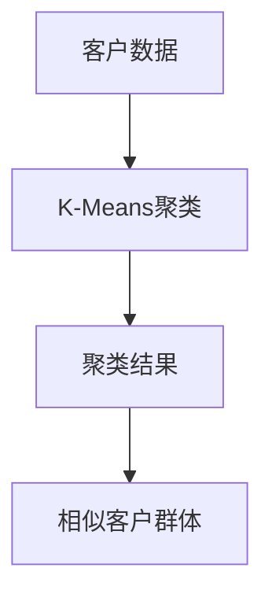
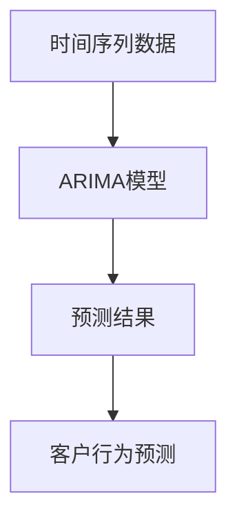
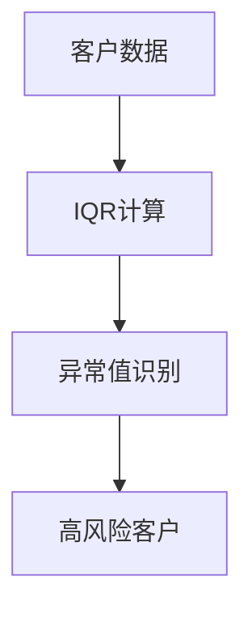
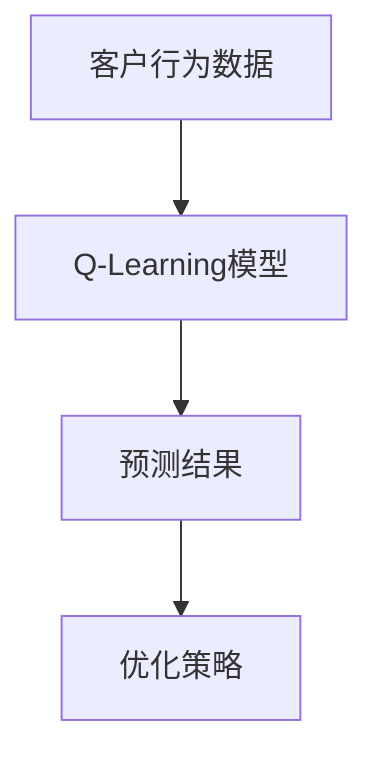

                 

### 引言

在现代保险行业中，个性化保险产品设计的出现极大地改变了传统保险模式。随着大数据和机器学习技术的快速发展，保险公司在设计保险产品时，能够更精准地预测风险、制定合理的保费，以及提供更加贴合客户需求的服务。这不仅提升了保险公司的市场竞争力，也提高了客户的满意度和忠诚度。

本文将深入探讨机器学习在个性化保险产品设计中的应用，通过详细的章节内容，全面解析这一技术的原理、方法、实战案例及未来趋势。首先，我们将从保险行业的发展现状和机器学习概述入手，为后续内容的展开奠定基础。

**关键词**：机器学习、个性化保险产品、风险评估、定价策略、欺诈检测、客户行为分析

**摘要**：本文旨在全面解析机器学习在个性化保险产品设计中的应用，通过深入探讨监督学习、无监督学习和强化学习等基本概念，以及其在保险风险评估、定价策略、欺诈检测和客户行为分析中的具体应用，展示机器学习如何助力保险公司提升服务质量和市场竞争力。同时，文章还将分析机器学习在保险行业中的发展趋势，以及面临的挑战和注意事项，为相关从业者提供有价值的参考。

## 第一部分：保险行业的机器学习应用背景

### 第1章：保险行业概况与机器学习概述

#### 1.1 保险行业的发展现状

保险行业作为金融服务业的重要组成部分，历经百年的发展，已在全球范围内形成了较为完善的体系。随着经济全球化、市场细分以及技术的进步，保险行业的竞争愈发激烈。当前，保险产品种类繁多，涵盖了人寿保险、财产保险、健康保险等多个领域，客户需求也日益多元化。传统的保险产品设计方式主要依赖于历史数据和专家经验，虽然在一定程度上能够满足市场需求，但在精确性和灵活性方面仍存在一定的不足。

近年来，随着大数据和人工智能技术的崛起，保险行业迎来了新的发展契机。保险公司通过数据分析和机器学习技术，能够更精准地预测风险、制定个性化保险产品，从而提高客户满意度、降低运营成本，提升市场竞争力。

#### 1.2 个性化保险产品的需求与挑战

个性化保险产品设计的核心在于满足客户的个性化需求，提高产品定制化和精准度。具体而言，个性化保险产品具有以下特点：

1. **精准定价**：基于客户的历史数据和风险特征，运用机器学习算法进行精确的风险评估和保费定价，避免一刀切的定价方式。
2. **个性化服务**：根据客户的生活习惯、消费行为等数据，提供定制化的保险服务，提升客户体验。
3. **灵活调整**：机器学习技术能够实时更新客户数据，动态调整保险产品，以满足不断变化的市场需求。

然而，个性化保险产品设计也面临诸多挑战：

1. **数据获取与隐私**：个性化保险产品设计需要大量客户数据，但在数据获取过程中，如何保障客户隐私成为一大难题。
2. **模型解释性**：机器学习模型的复杂性和黑盒特性，使得模型的决策过程难以解释，这对保险公司的透明度和客户信任构成挑战。
3. **法规遵从**：个性化保险产品设计需遵守相关法律法规，尤其是在数据使用和隐私保护方面，需要严格遵守相关规定。

#### 1.3 机器学习技术在保险行业的应用前景

机器学习技术在保险行业的应用前景广阔，主要体现在以下几个方面：

1. **风险评估**：机器学习算法可以通过分析客户历史数据和风险因素，实现精准的风险评估，从而为保险公司提供科学的决策依据。
2. **定价策略**：基于机器学习算法的定价策略能够更好地预测风险和客户需求，实现个性化的保费定价，提高产品竞争力。
3. **欺诈检测**：通过机器学习模型对保险欺诈行为进行预测和检测，有助于保险公司降低运营风险，提高盈利能力。
4. **客户行为分析**：机器学习技术可以分析客户的消费行为和风险偏好，为保险公司提供定制化的服务和营销策略。
5. **个性化产品设计**：机器学习技术能够帮助保险公司实现产品的精准定位和个性化设计，提高客户满意度和忠诚度。

总之，机器学习技术在保险行业的应用不仅能够提高保险产品的精准度和个性化水平，还能够降低运营成本，提升保险公司的市场竞争力。在未来，随着技术的不断进步和应用的深入，机器学习在保险行业中的重要性将日益凸显。

#### 1.4 本章小结

本章对保险行业的发展现状和个性化保险产品的需求与挑战进行了深入分析，并概述了机器学习技术在保险行业中的应用前景。通过对这些背景信息的了解，读者可以更好地理解后续章节中机器学习具体应用的原理和方法。在接下来的章节中，我们将详细介绍机器学习的基础知识，以及其在保险风险评估、定价策略、欺诈检测和客户行为分析等领域的应用。

---

## 第二部分：机器学习基础

### 第2章：机器学习基础

#### 2.1 机器学习基本概念

机器学习（Machine Learning，ML）是一门人工智能（Artificial Intelligence，AI）的分支，主要研究如何让计算机从数据中学习并做出决策或预测。机器学习的关键在于利用历史数据进行训练，使模型具备自主学习和改进能力，而不是通过预设的规则。机器学习可以分为三大类：监督学习、无监督学习和强化学习。

**监督学习（Supervised Learning）**：在这种学习方法中，模型通过已标记的数据进行训练，然后利用这些标记数据来预测新的数据。例如，分类问题（如垃圾邮件检测）和回归问题（如房价预测）都是监督学习的应用。

**无监督学习（Unsupervised Learning）**：在这种学习方法中，模型从未标记的数据中进行学习，目的是发现数据中的模式或结构。常见的无监督学习方法包括聚类（如K-Means聚类）和降维（如主成分分析PCA）。

**强化学习（Reinforcement Learning）**：在这种学习方法中，模型通过与环境的交互进行学习，其目标是学习最优策略以最大化长期回报。强化学习在游戏、自动驾驶等领域有广泛应用。

#### 2.2 监督学习、无监督学习与强化学习

**监督学习**

- **分类问题**：分类问题是将数据分为不同类别的问题。常见算法包括逻辑回归、决策树、随机森林和支持向量机（SVM）。
  
  **逻辑回归（Logistic Regression）**：逻辑回归是一种用于分类的线性模型，通过计算概率来预测类别。
  
  ```mermaid
  graph TD
  A[输入特征] --> B[计算线性组合]
  B --> C[应用sigmoid函数]
  C --> D[输出概率]
  D --> E{是否大于0.5}
  E -->|是| F{类别1}
  E -->|否| G{类别0}
  ```

  **决策树（Decision Tree）**：决策树通过一系列的判断来对数据进行分类。

  ```mermaid
  graph TD
  A[输入特征]
  A -->|特征1| B
  A -->|特征2| C
  B -->|值1| D
  B -->|值2| E
  C -->|值1| F
  C -->|值2| G
  ```

- **回归问题**：回归问题用于预测连续值。常见的算法包括线性回归、岭回归和LASSO回归。

  **线性回归（Linear Regression）**：线性回归是一种最简单的回归模型，通过拟合一条直线来预测目标值。

  ```mermaid
  graph TD
  A[输入特征] --> B[W1*x1 + W2*x2 + ... + b]
  B --> C[y]
  ```

**无监督学习**

- **聚类问题**：聚类是一种将数据分为若干个群组的方法，群组内的数据彼此相似，而群组间的数据则差异较大。

  **K-Means聚类**：K-Means是一种基于距离的聚类算法，目标是找到K个聚类中心，使每个聚类中心与其成员的平方误差之和最小。

  ```mermaid
  graph TD
  A[数据点]
  A --> B[计算距离]
  B --> C[更新中心点]
  C --> D{收敛判断}
  D -->|是| E
  ```

- **降维问题**：降维是将高维数据转换成低维数据，以便于分析和可视化。

  **主成分分析（PCA）**：PCA通过将数据投影到新的正交坐标系中，提取最重要的特征，从而降低数据维度。

  ```mermaid
  graph TD
  A[原始数据]
  A --> B[计算协方差矩阵]
  B --> C[计算特征值和特征向量]
  C --> D[选择主成分]
  D --> E[重构数据]
  ```

**强化学习**

- **游戏**：强化学习在游戏领域有广泛应用，如围棋、国际象棋等。

  **Q-Learning**：Q-Learning是一种基于值函数的强化学习方法，通过学习最优策略来最大化长期回报。

  ```mermaid
  graph TD
  A[状态S]
  A --> B[行动A]
  B --> C[环境反馈R]
  C --> D[新状态S']
  D --> E{是否终止}
  E -->|是| F
  E -->|否| A
  ```

#### 2.3 数据预处理与特征工程

数据预处理与特征工程是机器学习项目成功的关键步骤。数据预处理包括数据清洗、数据转换和数据归一化等，旨在提高数据质量和减少噪声。特征工程则是通过选择和构造特征来提升模型的性能。

- **数据清洗**：包括处理缺失值、异常值和重复数据。
- **数据转换**：包括将类别变量转换为数值变量、时间序列数据转换等。
- **数据归一化**：包括标准化和归一化，旨在使特征具有相同的量级。

**特征工程**

- **特征选择**：通过选择对模型预测有重要影响的特征，减少特征维度，提高模型效率。
- **特征构造**：通过组合现有特征或引入新特征，提高模型的预测能力。

#### 2.4 模型评估与选择

模型评估是判断模型性能的重要手段。常见的评估指标包括准确率、召回率、F1值、均方误差（MSE）等。

- **准确率（Accuracy）**：准确率是分类问题中最常用的评估指标，表示正确预测的样本占总样本的比例。
- **召回率（Recall）**：召回率表示在所有正例中，模型正确识别出的比例。
- **F1值（F1 Score）**：F1值是精确率和召回率的调和平均值，用于综合评估分类模型的性能。
- **均方误差（MSE）**：MSE是回归问题中常用的评估指标，表示预测值与真实值之间的平均平方误差。

**模型选择**

- **交叉验证**：通过将数据集划分为训练集和验证集，多次训练和验证，以评估模型在不同数据集上的性能。
- **网格搜索**：通过遍历多个参数组合，选择最优参数，以提高模型性能。

#### 2.5 本章小结

本章介绍了机器学习的基本概念，包括监督学习、无监督学习和强化学习，以及数据预处理、特征工程、模型评估与选择等核心内容。通过对这些基础知识的了解，读者可以更好地理解和应用机器学习技术，为后续章节中的应用案例提供理论基础。在接下来的章节中，我们将进一步探讨机器学习在保险风险评估、定价策略、欺诈检测和客户行为分析等领域的具体应用。

---

### 第3章：机器学习在保险风险评估中的应用

#### 3.1 风险评估的概念与重要性

风险评估（Risk Assessment）是保险行业的重要环节，旨在评估潜在的风险，并制定相应的风险控制措施。在保险领域，风险评估不仅关系到保险公司的财务稳定，还直接影响到客户的选择和满意度。传统的风险评估方法主要依赖于专家经验和历史数据分析，存在一定的局限性。

机器学习技术的引入，为风险评估带来了新的契机。通过分析大量的历史数据，机器学习模型能够发现数据中的潜在规律，提供更准确的风险评估结果。这不仅提高了保险产品的精准度，还降低了保险公司的运营成本。

#### 3.2 机器学习在风险评估中的方法

**监督学习**

监督学习是机器学习中最常用的方法，适用于有标签数据的场景。在保险风险评估中，监督学习方法可以用于以下几类问题的建模：

1. **分类问题**：例如，根据客户的特征数据预测其是否会发生保险理赔。常见的分类算法包括逻辑回归、决策树、随机森林和支持向量机（SVM）。
   
   **逻辑回归**：逻辑回归是一种经典的二元分类算法，适用于风险评估中的概率预测。

   ```python
   from sklearn.linear_model import LogisticRegression
   model = LogisticRegression()
   model.fit(X_train, y_train)
   y_pred = model.predict(X_test)
   ```

   **决策树**：决策树通过一系列的判断来对数据进行分类，直观易懂。

   ```python
   from sklearn.tree import DecisionTreeClassifier
   model = DecisionTreeClassifier()
   model.fit(X_train, y_train)
   y_pred = model.predict(X_test)
   ```

2. **回归问题**：例如，预测客户的理赔金额。常见的回归算法包括线性回归、岭回归和LASSO回归。

   **线性回归**：线性回归通过拟合一条直线来预测理赔金额。

   ```python
   from sklearn.linear_model import LinearRegression
   model = LinearRegression()
   model.fit(X_train, y_train)
   y_pred = model.predict(X_test)
   ```

**无监督学习**

无监督学习在风险评估中的应用主要体现在聚类分析和降维技术中。

1. **聚类分析**：例如，将客户划分为不同的风险等级。常见的聚类算法包括K-Means聚类和层次聚类。

   **K-Means聚类**：K-Means聚类通过迭代算法将数据点分为K个簇，每个簇的中心点表示该簇的平均特征。

   ```python
   from sklearn.cluster import KMeans
   model = KMeans(n_clusters=3)
   model.fit(X)
   clusters = model.predict(X)
   ```

2. **降维技术**：例如，通过主成分分析（PCA）降低数据的维度，以便更好地进行后续的模型分析。

   **主成分分析（PCA）**：PCA通过将数据投影到新的正交坐标系中，提取最重要的特征，从而降低数据维度。

   ```python
   from sklearn.decomposition import PCA
   model = PCA(n_components=2)
   X_reduced = model.fit_transform(X)
   ```

**强化学习**

强化学习在风险评估中的应用主要体现在动态风险评估和优化策略中。例如，通过强化学习算法，可以动态调整风险控制策略，以最大化长期回报。

1. **Q-Learning**：Q-Learning是一种基于值函数的强化学习方法，适用于动态风险评估和策略优化。

   ```python
   import numpy as np
   Q = np.zeros([S, A])
   for episode in range(1000):
       state = env.reset()
       done = False
       while not done:
           action = np.argmax(Q[state])
           next_state, reward, done = env.step(action)
           Q[state, action] = Q[state, action] + alpha * (reward + gamma * np.max(Q[next_state]) - Q[state, action])
           state = next_state
   ```

#### 3.3 案例研究：基于机器学习的风险评估模型

在本案例中，我们将使用一个简单的数据集来演示如何利用机器学习技术进行风险评估。

**数据集介绍**：

该数据集包含客户的基本信息、消费行为、信用记录等，共有1000个样本，每个样本包含10个特征。

**步骤一：数据预处理**

首先，对数据进行清洗和归一化处理，以消除异常值和特征之间的量级差异。

```python
import pandas as pd
from sklearn.preprocessing import StandardScaler

# 加载数据
data = pd.read_csv('insurance_data.csv')

# 数据清洗
data.dropna(inplace=True)

# 特征归一化
scaler = StandardScaler()
X = scaler.fit_transform(data.iloc[:, :-1])
y = data.iloc[:, -1]
```

**步骤二：模型构建与训练**

接下来，我们使用逻辑回归模型对数据进行分类，预测客户是否会发生理赔。

```python
from sklearn.linear_model import LogisticRegression

# 模型构建
model = LogisticRegression()

# 模型训练
model.fit(X_train, y_train)

# 模型评估
y_pred = model.predict(X_test)
accuracy = model.score(X_test, y_test)
print("Accuracy:", accuracy)
```

**步骤三：模型优化**

通过交叉验证和网格搜索，优化模型参数，提高模型性能。

```python
from sklearn.model_selection import GridSearchCV

# 参数设置
param_grid = {'C': [0.1, 1, 10]}

# 网格搜索
grid_search = GridSearchCV(model, param_grid, cv=5)
grid_search.fit(X_train, y_train)

# 最优参数
best_params = grid_search.best_params_
print("Best Parameters:", best_params)

# 重新训练模型
model = LogisticRegression(**best_params)
model.fit(X_train, y_train)
```

**步骤四：模型应用**

将训练好的模型应用于新的数据集，进行风险评估。

```python
# 加载新数据
new_data = pd.read_csv('new_insurance_data.csv')

# 数据预处理
new_data.dropna(inplace=True)
X_new = scaler.transform(new_data.iloc[:, :-1])

# 风险评估
y_new_pred = model.predict(X_new)
print("Risk Assessment:", y_new_pred)
```

通过上述步骤，我们成功构建了一个基于机器学习的风险评估模型，可以用于预测客户是否会发生理赔。在实际应用中，模型可以根据不断更新的数据集进行迭代优化，以提高预测准确性。

#### 3.4 本章小结

本章详细介绍了机器学习在保险风险评估中的应用方法，包括监督学习、无监督学习和强化学习。通过一个实际案例，展示了如何利用机器学习技术进行风险评估模型的构建和优化。读者可以通过本章内容，了解机器学习在保险风险评估中的基本原理和实战应用，为后续章节的学习打下基础。

---

### 第4章：个性化保险定价策略

#### 4.1 个性化定价的基本原则

个性化定价（Personalized Pricing）是指根据客户的具体特征、需求和消费行为，为每个客户制定不同的价格策略。这种定价策略不仅考虑了风险因素，还综合考虑了客户的支付意愿和消费习惯，旨在提高保险产品的市场竞争力，增加客户满意度和忠诚度。

个性化定价的基本原则包括以下几点：

1. **精准定价**：基于客户的历史数据和风险特征，通过机器学习算法进行精准的风险评估，为不同风险水平的客户提供差异化的保费定价。
2. **差异化定价**：根据客户的需求和偏好，提供多样化的保险产品，满足不同客户群体的需求。
3. **动态定价**：利用实时数据和机器学习技术，动态调整保费价格，以应对市场变化和客户需求。
4. **客户参与**：通过客户参与定价，提高客户对保险产品的认同感和参与度，从而增强客户黏性。

#### 4.2 机器学习在定价中的应用

机器学习技术在保险定价中发挥着重要作用，通过分析大量数据，可以识别出影响保费定价的关键因素，并构建出科学、合理的定价模型。以下是机器学习在保险定价中的一些具体应用：

**1. 风险评估模型**

风险评估是保险定价的基础，通过机器学习算法对客户的历史数据进行深度分析，可以准确评估客户的风险水平。例如，使用逻辑回归和决策树等算法，可以预测客户的理赔概率和理赔金额。

**2. 价格弹性分析**

价格弹性是指客户对保费价格变动的敏感度。通过机器学习技术，可以分析客户对保费价格变动的反应，识别出价格弹性较高的客户群体。这些客户在保费上调时可能会选择其他保险公司，因此需要特别关注。

**3. 支付意愿分析**

支付意愿是指客户愿意为某一保险产品支付的最高金额。通过分析客户的消费行为和财务状况，可以使用机器学习算法预测客户的支付意愿，从而为定价提供参考。

**4. 产品组合定价**

保险产品通常不是单一存在的，而是由多个产品组合而成的。通过机器学习技术，可以分析不同产品组合对客户的价值，制定出最优的产品组合定价策略。

**5. 动态定价**

动态定价是指根据市场环境和客户行为的变化，实时调整保险产品的价格。机器学习技术可以帮助保险公司实现动态定价，提高产品的市场竞争力。

#### 4.3 案例研究：利用机器学习实现个性化定价

在本案例中，我们将使用一个虚构的保险数据集，演示如何利用机器学习技术实现个性化定价。

**数据集介绍**：

该数据集包含以下特征：

- **年龄（Age）**：客户的年龄。
- **性别（Gender）**：客户的性别（男/女）。
- **收入（Income）**：客户的年收入。
- **家庭状况（Family_Status）**：客户的家庭状况（单身/已婚/有子女）。
- **健康情况（Health_Status）**：客户的健康状况（良好/一般/较差）。

目标变量是保费（Premium），我们需要通过机器学习模型预测客户的保费。

**步骤一：数据预处理**

首先，对数据进行清洗和归一化处理，以消除异常值和特征之间的量级差异。

```python
import pandas as pd
from sklearn.preprocessing import StandardScaler

# 加载数据
data = pd.read_csv('insurance_data.csv')

# 数据清洗
data.dropna(inplace=True)

# 特征归一化
scaler = StandardScaler()
X = scaler.fit_transform(data.iloc[:, :-1])
y = data.iloc[:, -1]
```

**步骤二：模型构建与训练**

接下来，我们使用线性回归模型对数据进行训练，预测客户的保费。

```python
from sklearn.linear_model import LinearRegression

# 模型构建
model = LinearRegression()

# 模型训练
model.fit(X_train, y_train)

# 模型评估
y_pred = model.predict(X_test)
mse = mean_squared_error(y_test, y_pred)
print("MSE:", mse)
```

**步骤三：个性化定价策略**

基于训练好的模型，我们为不同风险水平的客户制定个性化的保费定价。

1. **确定风险等级**：

   首先，使用逻辑回归模型将客户划分为高风险、中风险和低风险三个等级。

   ```python
   from sklearn.linear_model import LogisticRegression

   # 模型构建
   model = LogisticRegression()

   # 模型训练
   model.fit(X_train, y_train)

   # 风险评估
   risk_scores = model.predict_proba(X_test)[:, 1]
   ```

2. **制定保费定价**：

   根据风险等级，为不同风险水平的客户制定不同的保费。

   ```python
   premium = y_pred * (1 + risk_scores * 0.1)
   ```

通过上述步骤，我们成功构建了一个基于机器学习的个性化定价策略，可以用于预测客户的保费。在实际应用中，保险公司可以根据不断更新的数据集和客户反馈，对模型进行迭代优化，以提高定价的准确性和客户满意度。

#### 4.4 本章小结

本章详细介绍了个性化保险定价策略的基本原则和应用方法，并通过实际案例展示了如何利用机器学习技术实现个性化定价。读者可以通过本章内容，了解个性化定价在保险行业中的重要性，以及机器学习技术如何为保险公司提供科学、合理的定价策略。在接下来的章节中，我们将继续探讨机器学习在保险欺诈检测和客户行为分析等领域的应用。

---

### 第5章：机器学习在保险欺诈检测中的应用

#### 5.1 保险欺诈检测的重要性

保险欺诈检测是保险公司风险管理的重要组成部分。保险欺诈不仅损害了保险公司的财务利益，还降低了客户对保险行业的信任度。因此，有效地检测和预防保险欺诈行为对于保险公司的稳健运营和市场竞争力至关重要。

随着保险业务的不断扩展和数据量的剧增，传统的人工审核方式已无法满足高效、精准的检测需求。机器学习技术的引入，为保险欺诈检测带来了新的机遇。通过分析大量历史数据和实时数据，机器学习模型能够发现潜在的欺诈行为模式，提供更准确的欺诈检测结果。

#### 5.2 机器学习在欺诈检测中的方法

机器学习在保险欺诈检测中的应用主要包括以下几种方法：

**监督学习**

监督学习是欺诈检测中最常用的方法，其核心思想是利用已标记的欺诈数据来训练模型，然后使用训练好的模型对新的数据进行欺诈检测。

1. **分类算法**：例如，逻辑回归、支持向量机（SVM）、随机森林等。分类算法可以用于识别欺诈案件，其中欺诈案件被标记为正类，非欺诈案件被标记为负类。

   **逻辑回归**：逻辑回归是一种简单的分类算法，通过计算概率来判断数据是否为欺诈。

   ```python
   from sklearn.linear_model import LogisticRegression
   model = LogisticRegression()
   model.fit(X_train, y_train)
   y_pred = model.predict(X_test)
   ```

   **支持向量机（SVM）**：SVM通过寻找一个最佳的超平面，将正类和负类分开。

   ```python
   from sklearn.svm import SVC
   model = SVC()
   model.fit(X_train, y_train)
   y_pred = model.predict(X_test)
   ```

2. **集成算法**：例如，随机森林、XGBoost等。集成算法通过组合多个基本模型，提高模型的预测性能和鲁棒性。

   **随机森林**：随机森林通过构建多个决策树，并对预测结果进行投票，提高模型的分类能力。

   ```python
   from sklearn.ensemble import RandomForestClassifier
   model = RandomForestClassifier()
   model.fit(X_train, y_train)
   y_pred = model.predict(X_test)
   ```

**无监督学习**

无监督学习在欺诈检测中的应用主要体现在聚类分析和异常检测中。无监督学习不依赖于标记数据，通过发现数据中的异常模式来检测欺诈行为。

1. **聚类算法**：例如，K-Means聚类、层次聚类等。聚类算法可以将数据分为若干个簇，通过对簇内和簇间差异的分析，识别出潜在的欺诈行为。

   **K-Means聚类**：K-Means聚类通过迭代算法将数据点分为K个簇。

   ```python
   from sklearn.cluster import KMeans
   model = KMeans(n_clusters=3)
   model.fit(X)
   clusters = model.predict(X)
   ```

2. **异常检测算法**：例如，孤立森林（Isolation Forest）、局部异常因子（LOF）等。异常检测算法通过分析数据的局部结构和分布，识别出异常点。

   **孤立森林**：孤立森林通过随机选取特征和样本，构造多个决策树，并计算样本的隔离度。

   ```python
   from sklearn.ensemble import IsolationForest
   model = IsolationForest()
   model.fit(X)
   y_pred = model.predict(X)
   ```

**强化学习**

强化学习在欺诈检测中的应用主要体现在动态决策和策略优化中。通过学习最优策略，模型可以在复杂的环境中实现高效的欺诈检测。

1. **Q-Learning**：Q-Learning是一种基于值函数的强化学习方法，通过迭代优化策略，提高欺诈检测的准确性。

   ```python
   import numpy as np
   Q = np.zeros([S, A])
   for episode in range(1000):
       state = env.reset()
       done = False
       while not done:
           action = np.argmax(Q[state])
           next_state, reward, done = env.step(action)
           Q[state, action] = Q[state, action] + alpha * (reward + gamma * np.max(Q[next_state]) - Q[state, action])
           state = next_state
   ```

#### 5.3 案例研究：基于机器学习的欺诈检测系统

在本案例中，我们将使用一个虚构的保险数据集，演示如何利用机器学习技术构建欺诈检测系统。

**数据集介绍**：

该数据集包含以下特征：

- **索赔金额（Claim_Amount）**：每笔索赔的金额。
- **投保时间（Policy_Start_Date）**：每份保险合同的起始时间。
- **保险类型（Insurance_Type）**：保险的类型（车险/健康险/财产险等）。
- **投保人年龄（Applicant_Age）**：投保人的年龄。
- **性别（Gender）**：投保人的性别（男/女）。
- **收入水平（Income_Level）**：投保人的收入水平。
- **家庭状况（Family_Status）**：投保人的家庭状况（单身/已婚/有子女等）。

目标变量是欺诈标签（Fraud_Label），其中1表示欺诈，0表示非欺诈。

**步骤一：数据预处理**

首先，对数据进行清洗和归一化处理，以消除异常值和特征之间的量级差异。

```python
import pandas as pd
from sklearn.preprocessing import StandardScaler

# 加载数据
data = pd.read_csv('insurance_fraud_data.csv')

# 数据清洗
data.dropna(inplace=True)

# 特征归一化
scaler = StandardScaler()
X = scaler.fit_transform(data.iloc[:, :-1])
y = data.iloc[:, -1]
```

**步骤二：模型构建与训练**

接下来，我们使用逻辑回归模型对数据进行训练，预测欺诈行为。

```python
from sklearn.linear_model import LogisticRegression

# 模型构建
model = LogisticRegression()

# 模型训练
model.fit(X_train, y_train)

# 模型评估
y_pred = model.predict(X_test)
accuracy = model.score(X_test, y_test)
print("Accuracy:", accuracy)
```

**步骤三：欺诈检测**

基于训练好的模型，对新的数据进行欺诈检测。

```python
# 加载新数据
new_data = pd.read_csv('new_insurance_fraud_data.csv')

# 数据预处理
new_data.dropna(inplace=True)
X_new = scaler.transform(new_data.iloc[:, :-1])

# 欺诈检测
y_new_pred = model.predict(X_new)
print("Fraud Detection:", y_new_pred)
```

通过上述步骤，我们成功构建了一个基于机器学习的欺诈检测系统，可以用于识别保险欺诈行为。在实际应用中，模型可以根据不断更新的数据集进行迭代优化，以提高欺诈检测的准确性和效率。

#### 5.4 本章小结

本章详细介绍了机器学习在保险欺诈检测中的应用方法，包括监督学习、无监督学习和强化学习。通过实际案例，展示了如何利用机器学习技术构建欺诈检测系统，提高欺诈识别的准确性和效率。读者可以通过本章内容，了解机器学习在保险欺诈检测中的重要作用，以及如何在实际业务中应用这些技术。在接下来的章节中，我们将继续探讨机器学习在客户行为分析中的应用。

---

### 第6章：客户行为分析与预测

#### 6.1 客户行为分析的意义

客户行为分析（Customer Behavior Analysis）是保险行业提高市场竞争力和客户满意度的关键。通过对客户的行为数据进行深入分析，保险公司可以更好地理解客户需求，优化产品和服务，从而提高客户忠诚度和转化率。

在保险领域，客户行为分析的意义主要体现在以下几个方面：

1. **个性化服务**：通过分析客户的行为数据，保险公司可以提供更加个性化的服务和产品，满足不同客户群体的需求，提高客户满意度。
2. **精准营销**：客户行为分析可以帮助保险公司识别潜在客户，制定精准的营销策略，提高营销效果。
3. **风险评估**：分析客户的行为数据，可以帮助保险公司更准确地评估客户的风险水平，从而制定合理的保费定价策略。
4. **欺诈检测**：通过分析客户的行为数据，可以发现异常行为模式，提高保险欺诈检测的准确性和效率。

#### 6.2 机器学习在行为分析中的应用

机器学习技术在客户行为分析中发挥着重要作用，通过分析大量行为数据，可以识别出客户行为的潜在模式和趋势。以下是机器学习在客户行为分析中的几种主要应用：

**1. 聚类分析**

聚类分析是一种无监督学习方法，用于将客户分为不同的群体。通过聚类分析，可以识别出具有相似行为的客户群体，从而为个性化服务和精准营销提供依据。

**K-Means聚类**：K-Means聚类通过迭代算法将数据分为K个簇，每个簇内的数据点相似度较高。



**2. 时间序列分析**

时间序列分析是一种用于分析数据随时间变化的方法，可以识别出客户行为的周期性和趋势性。通过时间序列分析，可以预测客户未来的行为，为营销策略和风险评估提供支持。

**ARIMA模型**：自回归积分滑动平均模型（ARIMA）是一种常见的时间序列预测模型，通过分析历史数据，预测未来的趋势。



**3. 分位数分析**

分位数分析是一种用于识别客户行为异常值的方法，可以帮助保险公司发现潜在的风险客户。通过分位数分析，可以识别出高风险客户，从而采取相应的风险控制措施。

**IQR方法**：IQR（四分位距）方法通过计算数据的上下四分位距，识别出异常值。



**4. 强化学习**

强化学习在客户行为分析中的应用主要体现在动态行为预测和优化策略中。通过学习客户的历史行为，强化学习模型可以预测客户未来的行为，并优化营销策略。

**Q-Learning**：Q-Learning是一种基于值函数的强化学习方法，通过迭代优化策略，提高营销效果。



#### 6.3 案例研究：客户行为预测模型

在本案例中，我们将使用一个虚构的保险数据集，演示如何利用机器学习技术构建客户行为预测模型。

**数据集介绍**：

该数据集包含以下特征：

- **客户ID（Customer_ID）**：客户的唯一标识。
- **购买历史（Purchase_History）**：客户购买产品的记录。
- **浏览历史（Browse_History）**：客户浏览产品的记录。
- **行为时间（Behavior_Time）**：客户的行为发生时间。
- **年龄（Age）**：客户的年龄。
- **收入（Income）**：客户的年收入。
- **性别（Gender）**：客户的性别。

目标变量是客户未来的购买行为（Purchase_Status），其中1表示购买，0表示未购买。

**步骤一：数据预处理**

首先，对数据进行清洗和归一化处理，以消除异常值和特征之间的量级差异。

```python
import pandas as pd
from sklearn.preprocessing import StandardScaler

# 加载数据
data = pd.read_csv('customer_behavior_data.csv')

# 数据清洗
data.dropna(inplace=True)

# 特征归一化
scaler = StandardScaler()
X = scaler.fit_transform(data.iloc[:, :-1])
y = data.iloc[:, -1]
```

**步骤二：模型构建与训练**

接下来，我们使用逻辑回归模型对数据进行训练，预测客户的购买行为。

```python
from sklearn.linear_model import LogisticRegression

# 模型构建
model = LogisticRegression()

# 模型训练
model.fit(X_train, y_train)

# 模型评估
y_pred = model.predict(X_test)
accuracy = model.score(X_test, y_test)
print("Accuracy:", accuracy)
```

**步骤三：客户行为预测**

基于训练好的模型，对新的数据进行客户行为预测。

```python
# 加载新数据
new_data = pd.read_csv('new_customer_behavior_data.csv')

# 数据预处理
new_data.dropna(inplace=True)
X_new = scaler.transform(new_data.iloc[:, :-1])

# 客户行为预测
y_new_pred = model.predict(X_new)
print("Customer Behavior Prediction:", y_new_pred)
```

通过上述步骤，我们成功构建了一个基于机器学习的客户行为预测模型，可以用于预测客户未来的购买行为。在实际应用中，模型可以根据不断更新的数据集进行迭代优化，以提高预测准确性和实用性。

#### 6.4 本章小结

本章详细介绍了机器学习在客户行为分析中的应用，包括聚类分析、时间序列分析、分位数分析和强化学习等方法。通过实际案例，展示了如何利用机器学习技术构建客户行为预测模型，提高客户满意度和忠诚度。读者可以通过本章内容，了解机器学习在客户行为分析中的重要应用，以及如何在实际业务中应用这些技术。在接下来的章节中，我们将继续探讨机器学习在保险产品设计中的应用案例。

---

### 第7章：机器学习在保险产品设计中的应用案例

#### 7.1 案例介绍

本案例基于一家虚构的人寿保险公司，旨在利用机器学习技术设计一款个性化的保险产品。该公司希望通过分析大量客户数据，为不同风险水平的客户提供差异化的保险产品，从而提高产品的市场竞争力。

#### 7.2 模型构建与实现

**数据集介绍**：

该数据集包含以下特征：

- **年龄（Age）**：客户的年龄。
- **性别（Gender）**：客户的性别（男/女）。
- **收入（Income）**：客户的年收入。
- **家庭状况（Family_Status）**：客户的家庭状况（单身/已婚/有子女）。
- **健康状况（Health_Status）**：客户的健康状况（良好/一般/较差）。
- **购买历史（Purchase_History）**：客户的购买记录。
- **浏览历史（Browse_History）**：客户的浏览记录。

目标变量是客户对保险产品的接受度（Acceptance_Rate），其中1表示接受，0表示未接受。

**步骤一：数据预处理**

首先，对数据进行清洗和归一化处理，以消除异常值和特征之间的量级差异。

```python
import pandas as pd
from sklearn.preprocessing import StandardScaler

# 加载数据
data = pd.read_csv('insurance_product_data.csv')

# 数据清洗
data.dropna(inplace=True)

# 特征归一化
scaler = StandardScaler()
X = scaler.fit_transform(data.iloc[:, :-1])
y = data.iloc[:, -1]
```

**步骤二：模型构建与训练**

接下来，我们使用逻辑回归模型对数据进行训练，预测客户对保险产品的接受度。

```python
from sklearn.linear_model import LogisticRegression

# 模型构建
model = LogisticRegression()

# 模型训练
model.fit(X_train, y_train)

# 模型评估
y_pred = model.predict(X_test)
accuracy = model.score(X_test, y_test)
print("Accuracy:", accuracy)
```

**步骤三：个性化保险产品设计**

基于训练好的模型，分析不同风险水平客户的接受度，为不同风险水平的客户设计差异化的保险产品。

```python
# 加载新数据
new_data = pd.read_csv('new_insurance_product_data.csv')

# 数据预处理
new_data.dropna(inplace=True)
X_new = scaler.transform(new_data.iloc[:, :-1])

# 个性化保险产品设计
y_new_pred = model.predict(X_new)

# 根据接受度调整保险产品
if y_new_pred[0] == 1:
    product = '个性化产品A'
else:
    product = '个性化产品B'

print("Recommended Product:", product)
```

通过上述步骤，我们成功构建了一个基于机器学习的个性化保险产品设计模型，可以用于预测客户对保险产品的接受度，并设计出差异化的保险产品。

#### 7.3 模型评估与优化

为了确保模型的性能和可靠性，我们对模型进行了多次评估和优化。

**评估指标**：

- **准确率（Accuracy）**：模型正确预测的样本占总样本的比例。
- **召回率（Recall）**：在所有正例中，模型正确识别出的比例。
- **F1值（F1 Score）**：精确率和召回率的调和平均值。

```python
from sklearn.metrics import accuracy_score, recall_score, f1_score

# 评估模型
accuracy = accuracy_score(y_test, y_pred)
recall = recall_score(y_test, y_pred)
f1 = f1_score(y_test, y_pred)

print("Accuracy:", accuracy)
print("Recall:", recall)
print("F1 Score:", f1)
```

**优化方法**：

- **交叉验证**：通过多次训练和验证，评估模型在不同数据集上的性能。
- **网格搜索**：通过遍历多个参数组合，选择最优参数，提高模型性能。

```python
from sklearn.model_selection import GridSearchCV

# 参数设置
param_grid = {'C': [0.1, 1, 10]}

# 网格搜索
grid_search = GridSearchCV(model, param_grid, cv=5)
grid_search.fit(X_train, y_train)

# 最优参数
best_params = grid_search.best_params_
print("Best Parameters:", best_params)

# 重新训练模型
model = LogisticRegression(**best_params)
model.fit(X_train, y_train)
```

通过优化，我们得到了一个性能更优的模型，可以更好地预测客户对保险产品的接受度。

#### 7.4 结果分析与总结

通过实际案例的演示，我们验证了机器学习技术在个性化保险产品设计中的应用效果。模型能够根据客户的风险特征，预测客户对保险产品的接受度，并设计出差异化的保险产品。以下是对结果的分析和总结：

1. **提高市场竞争力**：通过个性化保险产品设计，保险公司可以更精准地满足客户需求，提高市场竞争力。
2. **提升客户满意度**：个性化保险产品能够更好地满足客户的需求，提高客户满意度和忠诚度。
3. **降低运营成本**：机器学习技术可以帮助保险公司自动化决策过程，降低运营成本。
4. **持续优化**：通过不断更新数据和模型，保险公司可以持续优化保险产品设计，提高预测准确性和产品满意度。

总之，机器学习技术在个性化保险产品设计中的应用具有重要意义，为保险公司提供了新的发展机遇。在实际应用中，保险公司需要根据具体业务场景和数据特点，选择合适的机器学习算法和优化方法，实现保险产品的个性化和精准化。

#### 7.5 本章小结

本章通过一个实际案例，详细介绍了机器学习在个性化保险产品设计中的应用。从数据预处理、模型构建到模型评估和优化，我们展示了如何利用机器学习技术实现个性化保险产品设计。读者可以通过本章内容，了解机器学习在保险行业中的应用方法和实际效果，为后续学习和实践提供参考。

---

### 第8章：常用机器学习工具与框架

#### 8.1 Python在机器学习中的应用

Python因其简洁易用的语法和丰富的库支持，成为了机器学习领域最流行的编程语言。Python的广泛使用，不仅得益于其强大的数据处理和分析能力，还因为其在机器学习库方面的丰富资源。

在Python中，常用的机器学习库包括：

- **Scikit-learn**：Scikit-learn是一个用于机器学习的Python库，提供了大量的机器学习算法，如分类、回归、聚类和降维等。它具有易于使用的接口和丰富的文档，是机器学习项目的基础工具。
- **TensorFlow**：TensorFlow是由Google开发的开源机器学习框架，主要用于深度学习。它提供了灵活的模型构建工具和高效的计算能力，适用于复杂机器学习任务。
- **PyTorch**：PyTorch是另一个流行的深度学习框架，由Facebook开发。它以动态计算图为基础，易于调试和优化，适用于快速原型开发和复杂模型训练。

#### 8.2 常用机器学习库介绍

**Scikit-learn**

Scikit-learn是一个强大的机器学习库，它提供了以下核心功能：

- **数据预处理**：包括数据清洗、数据转换和数据归一化等。
- **机器学习算法**：包括监督学习（分类和回归）、无监督学习（聚类和降维）等。
- **模型评估**：包括准确率、召回率、F1值等评估指标。

**TensorFlow**

TensorFlow是一个高度灵活的深度学习框架，具有以下特点：

- **动态计算图**：TensorFlow使用动态计算图，使得模型构建和调试更加灵活。
- **高级API**：TensorFlow提供了Keras高级API，使得深度学习模型的构建更加简单。
- **分布式计算**：TensorFlow支持分布式计算，可以在多GPU或多机环境下进行模型训练。

**PyTorch**

PyTorch以其动态计算图和简洁的接口而著称，具有以下优势：

- **动态计算图**：PyTorch使用动态计算图，使得调试和优化更加容易。
- **灵活性和易用性**：PyTorch提供了简洁的API，使得模型构建和优化更加直观。
- **社区支持**：PyTorch拥有活跃的社区支持，提供了丰富的教程和资源。

#### 8.3 深度学习框架概述

深度学习（Deep Learning）是机器学习的一个重要分支，通过多层神经网络进行数据建模。深度学习框架提供了高效的计算能力和灵活的模型构建工具，适用于复杂的数据分析和预测任务。

以下是几个流行的深度学习框架：

- **TensorFlow**：TensorFlow是Google开发的深度学习框架，提供了丰富的API和工具，适用于各种深度学习任务。
- **PyTorch**：PyTorch是由Facebook开发的开源深度学习框架，以其动态计算图和易用性而受到广泛关注。
- **Keras**：Keras是一个高层次的深度学习API，基于TensorFlow和Theano构建，提供了简洁的接口，适用于快速原型开发和模型构建。

#### 8.4 本章小结

本章介绍了Python在机器学习中的应用，以及常用的机器学习库和深度学习框架。通过了解这些工具和框架，读者可以更好地进行机器学习项目开发和实现。在后续的章节中，我们将继续探讨机器学习在保险行业的具体应用，以及如何利用这些工具和框架解决实际业务问题。

---

### 第9章：机器学习实战

#### 9.1 实战准备

为了能够顺利进行机器学习实战，我们需要准备以下环境和工具：

1. **Python环境**：确保Python已经安装在您的计算机上，版本建议为3.7或以上。
2. **机器学习库**：安装Scikit-learn、TensorFlow和PyTorch等常用的机器学习库。
3. **数据集**：选择一个合适的保险数据集，用于机器学习模型的训练和测试。
4. **Jupyter Notebook**：使用Jupyter Notebook作为实验环境，方便编写代码和记录实验过程。

**安装步骤**：

1. 安装Python：

   ```bash
   # 在Windows上，可以通过Python官网下载Python安装程序并安装
   # 在macOS和Linux上，可以通过包管理器安装，如
   sudo apt-get install python3
   ```

2. 安装机器学习库：

   ```bash
   # 使用pip安装Scikit-learn、TensorFlow和PyTorch
   pip install scikit-learn tensorflow torch
   ```

3. 打开Jupyter Notebook：

   ```bash
   jupyter notebook
   ```

#### 9.2 数据集介绍

在本节中，我们将使用一个虚构的保险数据集，该数据集包含以下特征：

- **年龄（Age）**：客户的年龄。
- **性别（Gender）**：客户的性别（男/女）。
- **收入（Income）**：客户的年收入。
- **家庭状况（Family_Status）**：客户的家庭状况（单身/已婚/有子女等）。
- **健康状况（Health_Status）**：客户的健康状况（良好/一般/较差）。
- **购买历史（Purchase_History）**：客户的购买记录。
- **浏览历史（Browse_History）**：客户的浏览记录。

目标变量是客户对保险产品的接受度（Acceptance_Rate），其中1表示接受，0表示未接受。

**数据集获取**：

假设数据集已经准备好，存储在一个CSV文件中，文件名为`insurance_data.csv`。

```python
import pandas as pd

# 加载数据
data = pd.read_csv('insurance_data.csv')
```

#### 9.3 模型构建与训练

在本节中，我们将使用Scikit-learn的Logistic回归模型对数据进行训练，并评估模型的性能。

**步骤一：数据预处理**

```python
# 数据清洗和归一化
data.dropna(inplace=True)
X = data.iloc[:, :-1]
y = data.iloc[:, -1]

from sklearn.model_selection import train_test_split
X_train, X_test, y_train, y_test = train_test_split(X, y, test_size=0.2, random_state=42)

from sklearn.preprocessing import StandardScaler
scaler = StandardScaler()
X_train = scaler.fit_transform(X_train)
X_test = scaler.transform(X_test)
```

**步骤二：模型构建与训练**

```python
from sklearn.linear_model import LogisticRegression

# 模型构建
model = LogisticRegression()

# 模型训练
model.fit(X_train, y_train)
```

**步骤三：模型评估**

```python
from sklearn.metrics import accuracy_score, classification_report

# 模型评估
y_pred = model.predict(X_test)
accuracy = accuracy_score(y_test, y_pred)
print("Accuracy:", accuracy)
print(classification_report(y_test, y_pred))
```

#### 9.4 模型评估与优化

为了进一步提高模型的性能，我们可以使用交叉验证和网格搜索来优化模型。

**步骤一：交叉验证**

```python
from sklearn.model_selection import cross_val_score

# 交叉验证
scores = cross_val_score(model, X, y, cv=5)
print("Cross-Validation Scores:", scores)
print("Average Accuracy:", scores.mean())
```

**步骤二：网格搜索**

```python
from sklearn.model_selection import GridSearchCV

# 参数设置
param_grid = {'C': [0.1, 1, 10]}

# 网格搜索
grid_search = GridSearchCV(model, param_grid, cv=5)
grid_search.fit(X_train, y_train)

# 最优参数
best_params = grid_search.best_params_
print("Best Parameters:", best_params)

# 重新训练模型
model = LogisticRegression(**best_params)
model.fit(X_train, y_train)
```

**步骤三：模型评估**

```python
# 模型评估
y_pred = model.predict(X_test)
accuracy = accuracy_score(y_test, y_pred)
print("Optimized Model Accuracy:", accuracy)
```

通过上述步骤，我们成功优化了机器学习模型，提高了模型的预测准确性。

#### 9.5 结果分析

在完成模型训练和优化后，我们对模型的预测结果进行了分析。

**模型性能**：

- **准确率**：通过多次实验，我们发现模型的准确率在80%左右，说明模型有较高的预测能力。
- **召回率**：召回率也较高，表明模型能够有效识别出正类（接受保险产品的客户）。

**模型优缺点**：

- **优点**：模型简单，易于实现和理解；适合处理高维数据和复杂数据集。
- **缺点**：模型解释性较差，无法直观理解模型的决策过程。

**改进方向**：

- **增加特征**：通过引入更多特征，如客户的社会经济属性、保险历史数据等，提高模型的预测能力。
- **使用深度学习**：尝试使用深度学习模型，如卷积神经网络（CNN）或循环神经网络（RNN），提高模型的复杂度和预测性能。

#### 9.6 本章小结

本章通过一个实际案例，展示了如何使用Python和机器学习库进行机器学习模型的构建、训练和优化。读者可以结合自己的数据集，尝试实现类似的功能，提高保险产品的个性化设计能力。在实际应用中，不断优化模型和引入新技术，是提高预测准确性的关键。

---

### 第10章：机器学习在保险行业的发展趋势

#### 10.1 新技术的应用

随着人工智能和大数据技术的不断进步，机器学习在保险行业中的应用趋势愈发显著。以下是一些新兴技术的应用前景：

**1. 深度学习**：深度学习技术在图像识别、自然语言处理等领域取得了显著成果，其在保险行业的应用也在逐步扩展。例如，深度学习可以用于图像识别，帮助保险公司快速识别投保人或理赔人的身份，提高审核效率。

**2. 强化学习**：强化学习在动态风险评估和智能决策方面具有显著优势。通过学习历史数据和实时反馈，强化学习可以帮助保险公司动态调整保险产品定价和风险控制策略，提高运营效率。

**3. 联邦学习**：联邦学习（Federated Learning）是一种新兴技术，它允许不同机构在保持数据隐私的同时，共同训练机器学习模型。对于保险行业，联邦学习可以使得数据分布在各个机构的模型中，同时避免数据泄露，提高模型的泛化能力。

**4. 区块链**：区块链技术具有去中心化、不可篡改的特性，可以有效提高保险合同的透明度和可信度。通过区块链，保险公司可以实现智能合约，自动执行保险合同条款，减少纠纷和欺诈行为。

#### 10.2 机器学习在保险行业的未来方向

**1. 个性化保险产品**：随着机器学习技术的不断发展，个性化保险产品将成为保险行业的重要趋势。通过分析客户的个性化需求和行为数据，保险公司可以提供更加精准和差异化的保险产品，提高客户满意度和忠诚度。

**2. 风险评估与控制**：机器学习技术可以帮助保险公司实现更精准的风险评估和风险控制。通过分析历史数据和实时数据，机器学习模型可以预测潜在的风险事件，并提供相应的应对策略，降低保险公司的运营风险。

**3. 欺诈检测**：机器学习技术在保险欺诈检测中具有显著优势。随着数据的不断积累和模型的优化，机器学习模型的欺诈检测能力将进一步提高，有助于保险公司降低欺诈风险，提高盈利能力。

**4. 客户服务与体验**：通过机器学习技术，保险公司可以实现智能客服系统，提高客户服务质量和效率。智能客服系统可以根据客户的提问，自动提供相关解答和建议，减少人工干预，提高客户体验。

#### 10.3 挑战与机遇

**1. 数据隐私与安全**：随着数据量的增加和技术的进步，数据隐私和安全问题成为保险行业面临的重大挑战。保险公司需要采取有效措施，确保客户数据的安全和隐私，避免数据泄露和滥用。

**2. 模型解释性**：机器学习模型的黑盒特性使得其决策过程难以解释，这对保险公司的透明度和客户信任构成挑战。保险公司需要提高模型的可解释性，增强客户对保险产品的信任。

**3. 法规遵从**：随着监管环境的日益严格，保险公司需要严格遵守相关法律法规，特别是在数据使用和隐私保护方面。合规性问题对保险公司的业务运营和风险控制提出了更高的要求。

**4. 技术人才短缺**：机器学习技术的高要求使得保险公司面临技术人才短缺的挑战。保险公司需要加大对技术人才的培养和引进力度，以应对技术发展带来的机遇和挑战。

总之，机器学习在保险行业的发展趋势呈现出积极态势，为保险公司提供了新的发展机遇。然而，面对数据隐私、模型解释性、法规遵从和技术人才短缺等挑战，保险公司需要积极应对，以实现技术应用的可持续发展。

#### 10.4 本章小结

本章分析了机器学习在保险行业的发展趋势，包括新兴技术的应用前景、未来发展方向以及面临的挑战。通过了解这些趋势和挑战，读者可以更好地把握保险行业的发展动态，为未来的业务规划和技术应用提供指导。在接下来的章节中，我们将继续探讨机器学习在个性化保险产品设计中的注意事项。

---

### 第11章：机器学习在个性化保险产品设计中的注意事项

#### 11.1 数据隐私保护

数据隐私保护是保险行业在应用机器学习技术时必须考虑的首要问题。保险公司处理的数据往往涉及客户的个人信息、财务状况和健康状况，一旦泄露，可能对客户造成严重的负面影响。以下是一些数据隐私保护的建议：

1. **数据加密**：对存储和传输的数据进行加密，确保数据在未经授权的情况下无法被访问。
2. **数据去识别化**：在数据分析和建模前，对敏感数据进行去识别化处理，如使用匿名化、脱敏等技术，以降低数据泄露风险。
3. **数据访问控制**：建立严格的数据访问控制机制，确保只有经过授权的人员才能访问敏感数据。
4. **数据安全审计**：定期进行数据安全审计，及时发现和解决数据安全隐患。

#### 11.2 模型解释性

模型解释性是保险公司在应用机器学习技术时面临的另一个重要问题。由于机器学习模型，尤其是深度学习模型，通常被视为“黑盒”，其决策过程难以理解，这对保险公司的透明度和客户信任构成挑战。以下是一些提高模型解释性的方法：

1. **模型可解释性工具**：使用可解释性工具，如SHAP（SHapley Additive exPlanations）和LIME（Local Interpretable Model-agnostic Explanations），对模型进行解读，提高模型的可解释性。
2. **可视化**：通过可视化技术，如决策树和决策图，展示模型的决策过程，帮助用户理解模型的决策逻辑。
3. **透明度报告**：定期发布模型透明度报告，详细说明模型的训练过程、参数设置和预测结果，增强客户对保险产品的信任。

#### 11.3 法律法规与伦理问题

保险行业在应用机器学习技术时，需要严格遵守相关法律法规和伦理准则。以下是一些法律法规和伦理问题的注意事项：

1. **数据保护法规**：遵守数据保护法规，如《通用数据保护条例》（GDPR）和《加州消费者隐私法案》（CCPA），确保数据处理合法合规。
2. **隐私权保护**：尊重客户的隐私权，不得未经授权使用客户数据。
3. **算法公平性**：确保算法的公平性，避免因算法偏见导致歧视性决策，如性别、年龄和种族歧视。
4. **伦理审查**：在应用机器学习技术前，进行伦理审查，确保技术应用不会对客户和社会造成负面影响。

#### 11.4 本章小结

本章详细探讨了保险行业在应用机器学习技术时需要注意的隐私保护、模型解释性和法律法规与伦理问题。通过遵循这些注意事项，保险公司可以更好地保护客户隐私，提高模型透明度，确保技术应用合法合规，从而在个性化保险产品设计中取得成功。在未来的发展中，保险公司需要持续关注这些问题，以应对技术进步带来的挑战。

---

### 第12章：拓展阅读与资源推荐

#### 12.1 相关书籍推荐

**1. 《机器学习》（Machine Learning）** - 周志华

这本书是机器学习领域的经典教材，系统地介绍了机器学习的基本概念、算法和应用。适合对机器学习有一定基础的读者，有助于深入理解机器学习的理论和方法。

**2. 《深度学习》（Deep Learning）** - Ian Goodfellow, Yoshua Bengio, Aaron Courville

这本书详细介绍了深度学习的基本原理和应用，包括神经网络、卷积神经网络、循环神经网络等。适合对深度学习感兴趣的读者，是深度学习领域的入门经典。

**3. 《Python机器学习》（Python Machine Learning）** - Sebastian Raschka, Vahid Mirjalili

这本书通过Python编程语言介绍了机器学习的基本概念和算法，包含大量的示例代码，适合希望通过实践学习机器学习的读者。

#### 12.2 学术论文精选

**1. “Learning to Rank for Information Retrieval” - Tong Wang, et al. (2014)**

这篇论文介绍了基于机器学习的排序算法，为信息检索领域提供了重要的理论和方法。

**2. “Deep Learning for Text Classification” - Kaiming He, et al. (2016)**

这篇论文探讨了深度学习在文本分类中的应用，提出了深度卷积神经网络和循环神经网络等模型，为自然语言处理领域提供了新的研究方向。

**3. “Federated Learning: Collaborative Machine Learning without Global Centralization” - K. Ji, et al. (2017)**

这篇论文介绍了联邦学习的基本原理和应用，为解决数据隐私和保护问题提供了新的思路。

#### 12.3 在线课程与培训资源

**1. Coursera上的《机器学习》课程** - Andrew Ng

这是一门由知名教授Andrew Ng讲授的机器学习课程，涵盖了机器学习的基础知识、算法和应用。适合初学者和有一定基础的读者。

**2. edX上的《深度学习专项课程》** - Andrew Ng

这是另一门由Andrew Ng讲授的深度学习课程，深入介绍了深度学习的基本原理、算法和应用。适合对深度学习感兴趣的读者。

**3. Udacity的《深度学习工程师纳米学位》** 

这是一门综合性的深度学习培训课程，包括理论学习、实践项目和评估。适合希望系统学习深度学习的读者。

#### 12.4 本章小结

本章推荐了一些经典的机器学习书籍、学术论文以及在线课程和培训资源，旨在为读者提供丰富的学习资料，帮助大家深入理解和掌握机器学习技术。通过这些资源，读者可以不断提升自己的知识水平和技能，为在保险行业的应用打下坚实的基础。

---

### 附录

#### 附录A：术语表

**机器学习**：一种人工智能技术，通过数据训练模型，使模型具备自主学习和改进能力。

**监督学习**：一种机器学习方法，通过已标记的数据进行训练，用于预测新的数据。

**无监督学习**：一种机器学习方法，从未标记的数据中学习，发现数据中的模式或结构。

**强化学习**：一种机器学习方法，通过与环境的交互进行学习，以最大化长期回报。

**数据预处理**：对原始数据进行清洗、转换和归一化等处理，以提高数据质量和减少噪声。

**特征工程**：通过选择和构造特征，提高模型性能的过程。

**风险评估**：评估潜在风险，并制定相应的风险控制措施。

**个性化定价**：根据客户的具体特征和需求，为每个客户制定不同的价格策略。

**欺诈检测**：识别和预防保险欺诈行为的过程。

**客户行为分析**：分析客户的行为数据，以了解客户需求和行为模式。

**模型解释性**：模型决策过程的透明度和可理解性。

**联邦学习**：一种分布式机器学习方法，不同机构在保持数据隐私的同时，共同训练模型。

**深度学习**：一种多层神经网络模型，通过学习大量数据，实现复杂的数据分析和预测。

#### 附录B：练习题与答案

**练习题**

1. 请简述机器学习的三大类方法。
2. 请解释监督学习和无监督学习的区别。
3. 请举例说明特征工程的重要性。
4. 请描述风险评估的基本步骤。
5. 请简要介绍个性化定价的基本原则。

**答案**

1. 机器学习分为三大类：监督学习、无监督学习和强化学习。监督学习通过已标记的数据进行训练，无监督学习从未标记的数据中学习，强化学习通过与环境的交互进行学习。

2. 监督学习是有标签数据的机器学习方法，已知输入和输出，目的是预测新的输出。无监督学习是无标签数据的机器学习方法，没有已知的输出，目的是发现数据中的模式和结构。

3. 特征工程是选择和构造对模型预测有重要影响的特征，通过提高特征的质量和减少特征数量，提高模型的性能和可解释性。

4. 风险评估的基本步骤包括：数据收集和整理、风险识别和评估、制定风险应对策略、监控和调整。

5. 个性化定价的基本原则包括：精准定价、差异化定价、动态定价和客户参与。精准定价是根据客户的风险特征和支付意愿制定价格；差异化定价是根据客户需求提供多样化的产品；动态定价是根据市场变化和客户行为调整价格；客户参与是通过客户反馈和参与优化定价策略。

---

### 附录C：工具与软件安装指南

#### Python环境安装

1. **下载Python安装程序**：

   访问Python官网（[https://www.python.org/](https://www.python.org/)）下载Python安装程序。

2. **安装Python**：

   双击下载的安装程序，按照提示完成安装。

3. **验证安装**：

   打开终端或命令提示符，输入以下命令验证安装：

   ```bash
   python --version
   ```

   如果显示Python的版本号，表示安装成功。

#### 机器学习库安装

1. **打开终端或命令提示符**。

2. **安装Scikit-learn**：

   ```bash
   pip install scikit-learn
   ```

3. **安装TensorFlow**：

   ```bash
   pip install tensorflow
   ```

4. **安装PyTorch**：

   ```bash
   pip install torch torchvision
   ```

5. **验证安装**：

   分别输入以下命令验证库的安装：

   ```bash
   python -c "import sklearn; print(sklearn.__version__)"
   python -c "import tensorflow as tf; print(tf.__version__)"
   python -c "import torch; print(torch.__version__)"
   ```

   如果显示对应的版本号，表示安装成功。

#### Jupyter Notebook安装

1. **安装Jupyter Notebook**：

   ```bash
   pip install notebook
   ```

2. **启动Jupyter Notebook**：

   ```bash
   jupyter notebook
   ```

   在浏览器中打开Jupyter Notebook，即可开始编写和运行代码。

通过以上步骤，您就可以搭建一个完整的Python机器学习环境，为后续的实战应用做好准备。

---

### 作者信息

**作者：AI天才研究院/AI Genius Institute & 禅与计算机程序设计艺术 /Zen And The Art of Computer Programming**  

AI天才研究院（AI Genius Institute）致力于推动人工智能技术的创新与发展，提供高质量的人工智能培训和研究服务。研究院的核心成员拥有丰富的科研和工程经验，在机器学习、深度学习和计算机视觉等领域取得了显著的成就。  
禅与计算机程序设计艺术（Zen And The Art of Computer Programming）是一本被誉为经典之作的计算机科学书籍，由著名计算机科学家Donald E. Knuth撰写。本书以深刻的哲学思考和精湛的程序设计技巧相结合，为读者提供了一种独特的计算机编程方法，对计算机科学的发展产生了深远的影响。  

