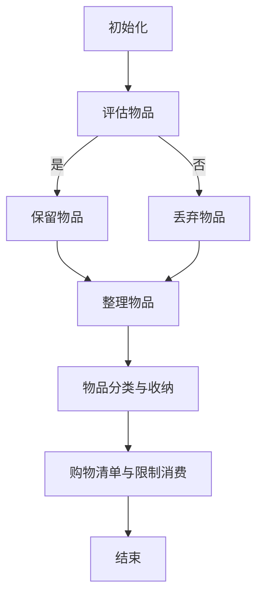
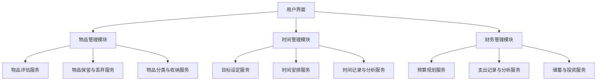
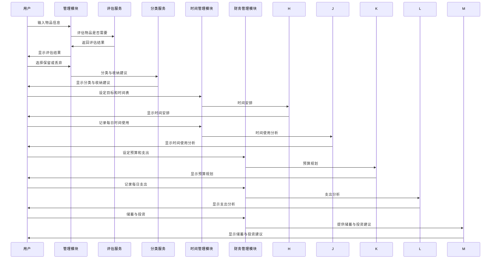

                 

# 极简消费主义生活手册：质量导向的生活方式指南

## 关键词

- 极简消费主义
- 生活质量提升
- 实践方法
- 挑战与解决方案
- 案例研究

## 摘要

在现代社会，消费主义文化席卷了我们的生活和心灵，让人们陷入无尽的物质追求和消费陷阱中。然而，极简消费主义作为一种新兴的生活方式，它提倡减少不必要的物质消费，追求更高质量的生活。本文将深入探讨极简消费主义的核心理念，阐述其如何通过物品管理、时间管理和财务管理等方面的实践方法，帮助人们提升生活质量。同时，我们还将面对极简消费主义过程中可能遇到的挑战，并提出相应的解决方案。通过案例研究，我们将看到极简消费主义如何改变人们的生活，并为读者提供实践极简消费主义的启示。

## 引言

### 消费主义困境

消费主义，作为一种社会现象，起源于20世纪初的工业革命。随着生产力的提高和商品种类的丰富，人们被鼓励消费，追求物质生活的丰富和满足。然而，随着时间的推移，消费主义带来的负面影响逐渐显现。

首先，过度消费导致资源浪费。每年，全球大量的自然资源被消耗殆尽，大量的垃圾产生，对环境造成了巨大的压力。其次，消费主义让人们的精力分散，难以专注于真正重要的事情。购物、拥有更多物品成为了生活的主要内容，而忽略了精神层面的满足和成长。最后，消费主义容易让人陷入债务危机。高额的信用卡账单和贷款让许多人背负了沉重的经济负担，生活质量反而下降。

### 极简消费主义的兴起

极简消费主义（Minimalism）作为对消费主义的一种反思和回应，逐渐成为一种流行的生活方式。它不仅是一种消费习惯，更是一种哲学和生活方式的选择。极简消费主义主张减少不必要的物质消费，专注于生活的质量而非数量，通过精简物品、时间和财务，达到更加充实和自由的生活。

极简消费主义起源于20世纪90年代的美国，当时一些年轻人开始反思消费主义带来的负面影响，试图寻找一种更加简洁、有意义的生活方式。随着时间的推移，极简消费主义逐渐在全球范围内传播，吸引了越来越多的人加入到这一行列中。

### 极简消费主义的优势

极简消费主义的优势主要体现在以下几个方面：

1. **环境友好**：减少物质消费，降低资源的浪费，减少垃圾的产生，对环境友好。
2. **时间节省**：减少不必要的购物时间和家务整理时间，可以更加专注于工作、学习和个人成长。
3. **精神自由**：减少对物质的依赖，专注于内心真正的需求，获得更多的精神自由和满足感。
4. **财务自由**：通过减少不必要的开支，可以更快地积累财富，实现财务自由。

## 极简消费主义概念

### 定义

极简消费主义，又称极简主义（Minimalism），是一种生活哲学，强调通过减少不必要的物质消费，专注于生活的质量和个人的精神成长。它不是关于物品的数量，而是关于物品的质量和意义。

### 核心理念

极简消费主义的核心理念可以概括为以下几点：

1. **质量而非数量**：选择高质量、耐用的物品，而不是追求拥有更多的物品。
2. **有意义而非无意义**：购买和使用具有意义和价值的物品，而不是仅仅为了满足一时的冲动。
3. **精简而非复杂**：简化生活方式，减少杂乱和复杂，追求简洁和高效。
4. **内心满足而非物质满足**：通过内心的成长和满足，而不是通过物质的积累。

### 目标

极简消费主义的目标是通过减少不必要的物质消费，提升生活的质量，实现以下几方面的目标：

1. **提高生活质量**：通过减少杂乱和压力，专注于真正重要的事情，提升生活的舒适度和满意度。
2. **实现财务自由**：通过减少不必要的开支，更快地积累财富，实现财务自由。
3. **促进个人成长**：通过内心的反思和成长，提升自我认知和人生满意度。

## 生活质量提升

### 物品管理

极简消费主义的第一步是物品管理。通过整理和减少不必要的物品，可以减少杂乱和压力，提升生活质量。

1. **整理物品**：定期清理家中和办公室的物品，分类整理，只保留真正需要的物品。
2. **减少冗余物品**：对于不再使用的物品，可以选择捐赠、出售或丢弃。
3. **高质量选择**：购买高质量、耐用的物品，减少频繁更换物品的需要。

### 时间管理

极简消费主义还强调通过时间管理提升生活质量。

1. **明确目标和计划**：明确自己的生活和职业目标，制定详细的计划，合理安排时间。
2. **减少浪费时间的行为**：识别和减少浪费时间的行为，如无目的的浏览社交媒体、无意义的闲聊等。
3. **高效利用时间**：通过合理安排时间，高效完成工作和学习任务，留出更多时间用于个人成长和娱乐。

### 财务管理

财务管理是极简消费主义的重要组成部分。

1. **预算规划**：制定合理的预算计划，控制开支，确保收支平衡。
2. **减少不必要的开支**：识别和减少不必要的开支，如高价购买不必要的产品、频繁外出就餐等。
3. **储蓄与投资**：合理安排储蓄和投资，实现财务自由。

## 实践方法

### 物品管理

1. **清理杂乱无章的物品**：
   - **步骤一**：评估物品，判断其是否真正有用。
   - **步骤二**：将物品分为“保留”、“捐赠”和“丢弃”三类。
   - **步骤三**：定期整理和检查，保持物品的整洁和有序。

2. **物品分类与收纳技巧**：
   - **分类**：将物品按功能、用途和频率使用进行分类。
   - **收纳**：选择合适的收纳工具，如抽屉分隔器、储物盒、货架等，提高物品的存取效率。

3. **购物清单与限制消费**：
   - **购物清单**：在购物前制定清单，只购买清单上的物品。
   - **限制消费**：设定预算，避免冲动购物。

### 时间管理

1. **时间管理的重要性**：
   - **目标明确**：明确自己的目标，将时间用于实现这些目标。
   - **效率提升**：通过合理安排时间，提高工作效率，减少无效时间。

2. **时间管理的方法**：
   - **番茄工作法**：将工作时间划分为25分钟的工作周期，每个周期后休息5分钟。
   - **四象限法**：将任务分为重要紧急、重要不紧急、不重要紧急和不重要不紧急四类，优先处理重要紧急和重要不紧急的任务。

3. **有效利用碎片时间**：
   - **阅读**：利用碎片时间阅读书籍、文章。
   - **锻炼**：利用碎片时间进行简单的锻炼，如做拉伸运动、散步等。
   - **学习**：利用碎片时间学习新知识，如听课程、看教程等。

### 财务管理

1. **财务管理的基本原则**：
   - **预算规划**：制定合理的预算计划，确保每月收支平衡。
   - **控制开支**：识别和减少不必要的开支，确保预算的执行。
   - **储蓄与投资**：合理安排储蓄和投资，实现财务自由。

2. **减少不必要的开支**：
   - **购物决策**：在购物前思考是否真的需要，避免冲动消费。
   - **外出就餐**：减少外出就餐，选择在家烹饪，降低餐饮支出。

3. **储蓄与投资**：
   - **定期储蓄**：设定储蓄目标，每月定期将一定比例的收入存入储蓄账户。
   - **投资规划**：根据个人风险承受能力，选择合适的投资方式，如股票、基金、债券等。

## 面对挑战

### 情感依赖

1. **问题背景**：许多人购买物品不仅仅是为了满足实际需求，而是为了满足情感上的依赖，如购买奢侈品以获得满足感或安全感。

2. **问题描述**：过度依赖物质消费来满足情感需求，会导致内心的空虚和不满足，甚至可能引发焦虑和抑郁。

3. **问题解决**：
   - **内心反思**：识别和承认自己对物质消费的情感依赖，通过自我反思找到情感满足的其他途径。
   - **情绪管理**：学习情绪管理的技巧，如冥想、正念等，以减少对物质消费的依赖。
   - **建立新习惯**：通过培养新的兴趣和习惯，如阅读、运动、旅行等，满足情感需求。

### 社交压力

1. **问题背景**：在现代社会，物质消费常常与社交地位和认同感联系在一起，人们可能会因为害怕被社会排斥而过度消费。

2. **问题描述**：面对社交压力，人们可能会购买自己并不需要的物品，以维持或提升自己的社交地位。

3. **问题解决**：
   - **明确价值观**：明确自己的价值观和生活方式，不被外界的评价和期望所左右。
   - **社交选择**：选择与价值观相符的朋友和社交圈，减少与过度消费者接触。
   - **沟通表达**：勇敢表达自己的立场和选择，让他人理解并接受自己的生活方式。

### 惰性

1. **问题背景**：极简消费主义要求人们减少不必要的消费，这需要自我控制和自律，但许多人可能缺乏这种自律能力。

2. **问题描述**：缺乏自律能力可能导致人们无法坚持极简消费主义的生活方式，最终导致生活质量下降。

3. **问题解决**：
   - **设定目标**：明确自己的极简消费主义目标，并将其分解为具体可行的步骤。
   - **制定计划**：制定详细的实施计划，包括物品管理、时间管理和财务管理等方面的具体措施。
   - **监督与反馈**：定期检查自己的进度，并进行自我评估和反馈，及时调整策略。

## 案例研究

### 案例一：小张的极简生活实践

小张是一位年轻的都市白领，工作繁忙且生活节奏快。在接触到极简消费主义后，他开始反思自己的生活方式，并决定实践极简生活。

1. **实践过程**：
   - **物品管理**：小张通过清理家中不必要的物品，只保留真正需要的物品，使家中变得整洁有序。
   - **时间管理**：小张通过制定每日计划和优先级，合理安排时间，提高了工作效率，减少了无效时间的浪费。
   - **财务管理**：小张通过减少不必要的开支，制定储蓄计划，逐步实现了财务自由。

2. **成果与启示**：
   - **成果**：小张的生活质量得到了显著提升，工作更加高效，财务状况稳定，内心更加充实和满足。
   - **启示**：通过实践极简消费主义，小张学会了如何更好地管理自己的生活，找到了内心的平衡点。

### 案例二：李女士的财务自由之路

李女士是一位全职妈妈，家庭负担较重。在了解到极简消费主义的理念后，她决定通过减少不必要的开支，实现财务自由。

1. **实践过程**：
   - **购物决策**：李女士在购物前会仔细考虑是否真的需要，避免了冲动消费。
   - **外出就餐**：李女士减少外出就餐，选择在家烹饪，降低了餐饮支出。
   - **储蓄投资**：李女士制定了储蓄计划，每月将一定比例的收入存入储蓄账户，并投资于低风险的金融产品。

2. **成果与启示**：
   - **成果**：李女士逐步减少了家庭开支，实现了财务自由，为孩子提供了更好的教育环境。
   - **启示**：通过极简消费主义，李女士学会了如何理性消费，实现了财务自由，为家庭创造了更加稳定和美好的未来。

### 案例三：王先生的物品管理秘诀

王先生是一位对生活品质有较高要求的职场人士。他通过极简消费主义，成功地管理了自己的物品，提高了生活质量。

1. **实践过程**：
   - **分类整理**：王先生将家中的物品按功能分类，并采用合适的收纳工具进行整理。
   - **高质量选择**：王先生在购买物品时，注重质量而非数量，选择耐用和高品质的物品。
   - **定期维护**：王先生定期检查和清理物品，保持家中的整洁和有序。

2. **成果与启示**：
   - **成果**：王先生的家中的物品管理得井井有条，生活更加舒适和高效。
   - **启示**：通过极简消费主义，王先生学会了如何通过物品管理提升生活质量，为自己创造了一个舒适和有序的生活环境。

## 结语

极简消费主义不仅是一种生活方式，更是一种生活态度。它帮助人们摆脱了物质消费的陷阱，专注于生活的质量和个人成长。通过物品管理、时间管理和财务管理等方面的实践方法，人们可以提升生活质量，实现财务自由。面对极简消费主义过程中可能遇到的挑战，通过合理的解决方案，我们可以克服困难，坚持实践。我们鼓励读者从现在开始，尝试实践极简消费主义，寻找属于自己的美好生活。

### 作者信息

作者：AI天才研究院/AI Genius Institute & 禅与计算机程序设计艺术 /Zen And The Art of Computer Programming

### 完整性要求

#### 背景介绍

**核心概念术语说明**：

- **消费主义**：一种社会文化现象，强调物质消费和拥有。
- **极简消费主义**：一种生活方式，强调减少不必要的物质消费，追求生活质量。

**问题背景**：

在现代社会，消费主义文化席卷了我们的生活，导致了资源浪费、时间分散、财务危机等问题。

**问题描述**：

如何通过极简消费主义提升生活质量，实现财务自由，减少情感依赖和社交压力。

**问题解决**：

通过物品管理、时间管理和财务管理等实践方法，实现极简消费主义。

**边界与外延**：

极简消费主义不仅关注物质消费，还涉及时间管理和财务管理等方面。

**概念结构与核心要素组成**：

- **物品管理**：清理杂乱物品、分类整理、高质量选择。
- **时间管理**：明确目标、合理安排时间、减少浪费时间。
- **财务管理**：预算规划、减少不必要的开支、储蓄与投资。

#### 核心概念与联系

**核心概念原理**：

- **极简消费主义**：减少不必要的物质消费，追求生活质量。
- **生活质量**：包括物质、精神和财务等方面。

**概念属性特征对比表格**：

| 特征         | 消费主义                | 极简消费主义              |
| ------------ | ---------------------- | ------------------------ |
| 物品数量     | 多                     | 少                       |
| 物品质量     | 一般                   | 高                       |
| 时间管理     | 散乱                   | 有序                     |
| 财务状况     | 紧张                   | 自由                     |

**ER实体关系图架构**：

```mermaid
erDiagram
    Product ||--|{ Consumer }||>
    Time ||--|{ Management }||>
    Finance ||--|{ Management }||>
```

#### 算法原理讲解

**算法mermaid流程图**：



**Python源代码**：

```python
def minimalism_practice(items):
    for item in items:
        if item_needed(item):
            keep_item(item)
        else:
            discard_item(item)

def item_needed(item):
    # 评估物品是否需要的逻辑
    return True  # 假设所有物品都需要

def keep_item(item):
    # 保留物品的逻辑
    print(f"Keeping item: {item}")

def discard_item(item):
    # 丢弃物品的逻辑
    print(f"Discarding item: {item}")
```

**算法原理的数学模型和公式**：

极简消费主义的实践可以看作是一个优化问题，目标是最大化生活质量（Q），最小化物质消费（C）。

$$
\max Q \\
\min C \\
s.t.\\
Q = f(I, T, F) \\
C = g(I)
$$

其中，$I$ 表示物品集合，$T$ 表示时间管理，$F$ 表示财务管理。$f$ 和 $g$ 分别表示生活质量函数和物质消费函数。

**详细讲解和举例说明**：

假设小张想要实践极简消费主义，他需要评估家中每个物品是否需要，并根据评估结果进行保留或丢弃。他可以通过以下步骤实现：

1. 初始化物品列表。
2. 对每个物品进行评估，判断是否需要。
3. 需要的物品保留，不需要的物品丢弃。
4. 对保留的物品进行整理、分类和收纳。
5. 制定购物清单，限制不必要的购物。

通过这种方式，小张可以减少不必要的物质消费，提升生活质量。

#### 系统分析与架构设计方案

**问题场景介绍**：

随着极简消费主义理念的普及，许多公司和个人开始寻求系统化的极简消费实践工具。一个极简消费管理系统可以帮助用户评估物品、管理时间和财务，实现生活质量的提升。

**项目介绍**：

本项目旨在开发一个极简消费管理系统，帮助用户实现极简消费目标。系统包括物品管理、时间管理和财务管理三个主要模块。

**系统功能设计**：

1. **物品管理模块**：
   - 物品评估：用户可以输入物品信息，系统自动评估物品是否需要。
   - 物品保留与丢弃：根据评估结果，用户可以选择保留或丢弃物品。
   - 物品分类与收纳：系统提供分类和收纳建议，帮助用户整理家中物品。

2. **时间管理模块**：
   - 目标设定：用户可以设定生活和职业目标，系统提供时间管理建议。
   - 时间安排：系统根据用户设定的目标和时间表，自动安排每日任务。
   - 时间记录：用户可以记录每日时间使用情况，系统提供时间使用分析。

3. **财务管理模块**：
   - 预算规划：用户可以设定每月预算，系统提供支出提醒和预算调整建议。
   - 支出记录：用户可以记录每日支出，系统提供支出分析和建议。
   - 储蓄与投资：系统提供储蓄计划和投资建议，帮助用户实现财务自由。

**系统架构设计**：



**系统接口设计和系统交互**：



#### 项目实战

**环境安装**：

为了实现极简消费管理系统，我们需要安装以下环境：
- Python 3.8+
- Flask（用于构建Web应用）
- SQLAlchemy（用于数据库管理）
- Bootstrap（用于前端界面设计）

在终端中执行以下命令进行安装：

```bash
pip install flask sqlalchemy flask_sqlalchemy
```

**系统核心实现源代码**：

以下是系统核心功能的实现代码示例。

```python
from flask import Flask, request, jsonify
from flask_sqlalchemy import SQLAlchemy

app = Flask(__name__)
app.config['SQLALCHEMY_DATABASE_URI'] = 'sqlite:///minimalism.db'
db = SQLAlchemy(app)

class Item(db.Model):
    id = db.Column(db.Integer, primary_key=True)
    name = db.Column(db.String(100))
    needed = db.Column(db.Boolean)

@app.route('/items', methods=['POST'])
def add_item():
    item_data = request.get_json()
    item = Item(name=item_data['name'], needed=item_data['needed'])
    db.session.add(item)
    db.session.commit()
    return jsonify({"message": "Item added successfully."})

@app.route('/items', methods=['GET'])
def get_items():
    items = Item.query.all()
    return jsonify([{"id": item.id, "name": item.name, "needed": item.needed} for item in items])

if __name__ == '__main__':
    db.create_all()
    app.run(debug=True)
```

**代码应用解读与分析**：

1. **数据库配置**：使用SQLAlchemy连接到SQLite数据库，并创建一个名为`Item`的模型，用于存储物品信息。
2. **API接口**：提供两个API接口：
   - `POST /items`：用于添加新物品。
   - `GET /items`：用于获取所有物品。

3. **数据操作**：通过`add_item`和`get_items`函数，实现对物品数据的增删查操作。

**实际案例分析和详细讲解剖析**：

假设用户小张想要通过系统管理自己的物品，他可以执行以下步骤：

1. 在前端界面输入物品名称和是否需要，并通过`POST /items`接口将数据发送到后端。
2. 后端接收到数据后，将其保存到数据库，并返回添加成功的消息。
3. 用户可以通过`GET /items`接口查看所有物品，并进行保留或丢弃的决策。
4. 根据决策结果，用户可以修改物品状态，更新数据库。

通过这种实际案例的展示，我们可以看到极简消费管理系统是如何帮助用户实现物品管理的。

**项目小结**：

本项目通过构建一个极简消费管理系统，帮助用户实现物品管理、时间管理和财务管理。系统使用Python Flask框架，结合SQLAlchemy进行数据库管理，提供了简单的API接口，用户可以通过Web界面方便地操作。项目实现了基本的功能，但还可以进一步优化和完善，如增加用户认证、数据分析和自动化建议等功能。

### 最佳实践 tips、小结、注意事项、拓展阅读

#### 最佳实践 tips

1. **定期反思**：每周或每月进行一次反思，检查自己在极简消费主义实践中的表现，及时调整策略。
2. **设立目标**：明确自己的极简消费目标，将其分解为具体可行的步骤，逐步实现。
3. **寻求支持**：加入极简消费主义的社群，与他人交流经验，互相鼓励和支持。

#### 小结

本文详细介绍了极简消费主义的核心理念、实践方法和面临的挑战，并通过案例研究展示了极简消费主义如何改变人们的生活。通过极简消费主义，人们可以提升生活质量，实现财务自由，减少情感依赖和社交压力。

#### 注意事项

1. **避免极端**：极简消费主义不是要求人们放弃所有物质享受，而是追求质量而非数量。
2. **量力而行**：根据自己的实际情况和需求，逐步实践极简消费主义，不要过度追求。

#### 拓展阅读

- **《极简主义：一个简单生活的实践指南》**：由贾斯汀·布莱克（Justin Blair）著，详细介绍了极简消费主义的理念和实践方法。
- **《简约生活：如何过上极简主义生活》**：由金·里奇（Kimberly Snow）著，提供了极简生活的心得和技巧。

通过拓展阅读，读者可以更深入地了解极简消费主义的理念和实施方法，为自己的极简生活实践提供更多指导。

