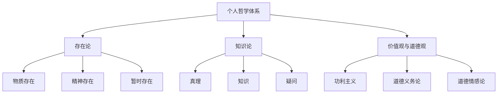
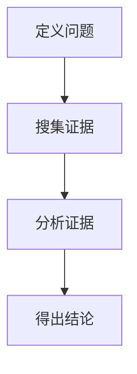
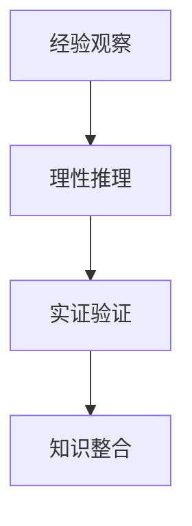
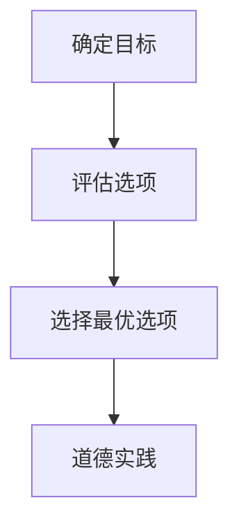
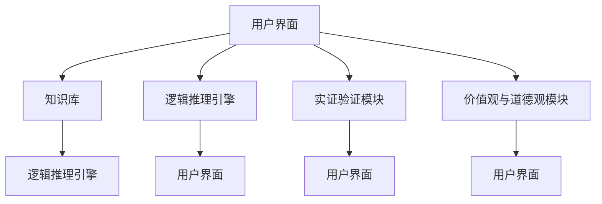
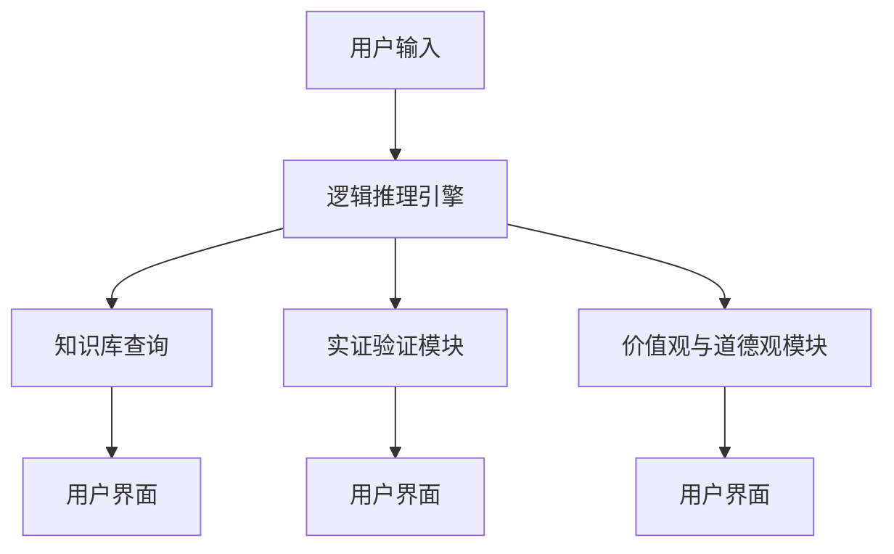

                 


### 文章标题：构建个人哲学体系：为生活打造坚实的思想基础

#### 关键词：哲学、个人成长、思想基础、价值观、自我反思

#### 摘要：本文旨在探讨如何构建个人哲学体系，为我们的生活提供坚实的思想基础。通过分析哲学的本质、历史发展、主要流派及其在各个领域的应用，我们将逐步揭示哲学在生活中的重要性，并探讨如何通过自我反思和哲学探索来构建个人哲学体系。

## 第一部分：理解哲学的基础

### 1.1 哲学的本质与重要性

哲学，作为一门探讨存在、知识、价值、道德、自由等基本问题的学科，是人类智慧的结晶。哲学不仅仅是对知识的追求，更是一种生活的态度和方式。在日常生活中，哲学可以帮助我们理解世界的本质，指导我们的行为和决策。

#### 1.1.1 哲学的定义

哲学起源于古希腊，原意为“爱智慧”。它是一门探讨存在、知识、价值、道德、自由等基本问题的学科。哲学不仅关注理论问题，还涉及实际问题，如人类存在的意义、道德伦理、社会正义等。

#### 1.1.2 哲学在生活中的作用

哲学在生活中的作用主要体现在以下几个方面：

1. **提供世界观**：哲学可以帮助我们形成对世界的正确认识，从而指导我们的行为和决策。
2. **培养批判性思维**：哲学强调理性思考，培养我们的批判性思维，使我们能够客观地分析问题，不被表象所迷惑。
3. **塑造价值观**：哲学探讨道德和价值观问题，帮助我们建立正确的人生观和价值观。
4. **促进自我反思**：哲学鼓励我们进行自我反思，了解自己的内心世界，找到自己的定位和方向。

#### 1.1.3 哲学与科学的区别

哲学和科学都是人类智慧的产物，但它们有本质的区别。科学强调实证和可验证性，哲学则更关注基本问题，如存在、知识、价值等。哲学为科学提供了理论基础，但哲学本身并不依赖于实验和数据。

### 1.2 哲学的历史发展

哲学的发展历程可以分为古代、中世纪和现代三个阶段。

#### 1.2.1 古代哲学

古代哲学起源于古希腊，其代表人物包括苏格拉底、柏拉图和亚里士多德。他们提出了许多重要的哲学思想，如知识论、形而上学、伦理学等。

##### 1.2.1.1 希腊哲学

希腊哲学分为三个主要流派：自然哲学、伦理学和形而上学。自然哲学关注世界的本质和起源，伦理学探讨人类的行为和道德，形而上学研究存在的本质和宇宙的结构。

##### 1.2.1.2 苏格拉底

苏格拉底是希腊哲学的奠基人之一，他主张通过提问和对话来寻找真理，提出“知之为知之，不知为不知，是知也”的观点。

##### 1.2.1.3 柏拉图

柏拉图是苏格拉底的学生，他创立了柏拉图学院，提出了理念论，认为真实的世界是理念的世界，物质世界只是理念世界的投影。

##### 1.2.1.4 亚里士多德

亚里士多德是柏拉图的学生，他创立了亚里士多德学派，提出了形式逻辑和辩证法，强调实证和观察的重要性。

#### 1.2.2 中世纪哲学

中世纪哲学受到基督教思想的影响，主要探讨神学和伦理学问题。代表人物包括奥古斯丁和托马斯·阿奎那。

##### 1.2.2.1 奥古斯丁

奥古斯丁是中世纪哲学的重要代表，他提出了“时间即变化”的观点，探讨了上帝的存在和人类的自由意志。

##### 1.2.2.2 托马斯·阿奎那

托马斯·阿奎那试图将基督教思想与古希腊哲学相结合，提出了“五路论证”来证明上帝的存在。

#### 1.2.3 现代哲学

现代哲学始于文艺复兴时期，代表人物包括笛卡尔、康德和黑格尔。他们提出了许多重要的哲学思想，如唯理论、经验论、理性主义和唯心主义等。

##### 1.2.3.1 笛卡尔

笛卡尔是现代哲学的奠基人之一，他提出了“我思故我在”的观点，强调理性和怀疑的重要性。

##### 1.2.3.2 康德

康德是启蒙时期的哲学家，他提出了“先验范畴”的概念，探讨了知识、道德和美学的本质。

##### 1.2.3.3 黑格尔

黑格尔是德国古典哲学的代表人物，他提出了“绝对精神”的概念，认为世界的发展是绝对精神的自我展开。

### 1.3 哲学的基本问题

哲学探讨的基本问题包括存在与本质、认知与真理、价值与道德、自由与决定论等。

#### 1.3.1 存在与本质

存在与本质问题是哲学的核心问题之一。存在指的是事物存在的状态，本质指的是事物的内在属性。哲学家们探讨了存在的本质、存在的证明、存在的多样性等问题。

#### 1.3.2 认知与真理

认知与真理问题是哲学的另一个核心问题。认知指的是人类对世界的理解和认识，真理指的是符合客观事实的认知。哲学家们探讨了知识的本质、真理的标准、认识的界限等问题。

#### 1.3.3 价值与道德

价值与道德问题是哲学的重要问题之一。价值指的是事物的价值和意义，道德指的是行为规范和道德原则。哲学家们探讨了价值的本质、道德的来源、道德的实践等问题。

#### 1.3.4 自由与决定论

自由与决定论问题是哲学的争议性问题之一。自由指的是人的自主选择能力，决定论指的是一切现象都有其必然的原因。哲学家们探讨了自由的存在、自由与决定论的关系、自由的价值等问题。

### 1.4 哲学的主要流派

哲学的发展历程中出现了许多重要的流派，如形而上学、逻辑哲学、实践哲学等。

#### 1.4.1 形而上学

形而上学是哲学的一个重要分支，研究存在的本质、宇宙的结构、事物的原理等基本问题。形而上学可以分为实证主义和唯物主义两大流派。

##### 1.4.1.1 实证主义

实证主义强调经验的重要性，认为知识只能通过经验和观察来获取。实证主义的代表人物有约翰·斯图尔特·密尔和奥古斯特·孔德。

##### 1.4.1.2 唯物主义

唯物主义认为物质是世界的本质，意识是物质的产物。唯物主义的代表人物有德谟克利特和马克思。

#### 1.4.2 逻辑哲学

逻辑哲学研究逻辑的基本原理和应用，探讨推理的有效性和逻辑的基本规律。逻辑哲学可以分为形式逻辑和辩证逻辑两大流派。

##### 1.4.2.1 形式逻辑

形式逻辑研究推理的形式和规则，强调逻辑的严谨性和精确性。形式逻辑的代表人物有亚里士多德和布尔。

##### 1.4.2.2 辩证逻辑

辩证逻辑研究事物的矛盾和发展规律，强调事物的变化和发展。辩证逻辑的代表人物有黑格尔和马克思。

#### 1.4.3 实践哲学

实践哲学研究人类实践活动的本质和意义，探讨实践与认识、价值、道德的关系。实践哲学可以分为实用主义和存在主义两大流派。

##### 1.4.3.1 实用主义

实用主义强调实践的重要性，认为知识的价值在于其实用性。实用主义的代表人物有威廉·詹姆斯和约翰·杜威。

##### 1.4.3.2 存在主义

存在主义强调个体的自由和责任，认为人的存在先于本质。存在主义的代表人物有萨特和加缪。

### 1.5 跨学科哲学思维

哲学是一门跨学科的学科，与其他学科有着密切的联系。哲学思维可以应用于心理学、伦理学、政治学、宗教等领域。

#### 1.5.1 哲学与心理学

哲学与心理学有着密切的联系，哲学为心理学提供了理论基础，心理学为哲学提供了实证支持。

##### 1.5.1.1 哲学与心理学的交叉点

哲学与心理学的交叉点主要包括意识、认知、行为、情感等研究领域。

##### 1.5.1.2 哲学对心理学的贡献

哲学对心理学的贡献主要体现在对意识、认知、行为、情感等基本问题的探讨，为心理学提供了理论基础。

##### 1.5.1.3 心理学对哲学的启示

心理学对哲学的启示主要体现在对意识、认知、行为、情感等实证研究的成果，为哲学提供了实证支持。

#### 1.5.2 哲学与伦理学

哲学与伦理学有着密切的联系，哲学为伦理学提供了理论基础，伦理学为哲学提供了实践指南。

##### 1.5.2.1 哲学与伦理学的交叉点

哲学与伦理学的交叉点主要包括道德、正义、自由、平等等研究领域。

##### 1.5.2.2 哲学对伦理学的贡献

哲学对伦理学的贡献主要体现在对道德原则、道德规范、道德评价等基本问题的探讨，为伦理学提供了理论基础。

##### 1.5.2.3 伦理学对哲学的启示

伦理学对哲学的启示主要体现在对道德实践、道德教育、道德冲突等现实问题的研究和解决，为哲学提供了实践指南。

#### 1.5.3 哲学与政治学

哲学与政治学有着密切的联系，哲学为政治学提供了理论基础，政治学为哲学提供了实践场景。

##### 1.5.3.1 哲学与政治学的交叉点

哲学与政治学的交叉点主要包括民主、自由、正义、平等、权力等研究领域。

##### 1.5.3.2 哲学对政治学的贡献

哲学对政治学的贡献主要体现在对政治理论、政治制度、政治伦理等基本问题的探讨，为政治学提供了理论基础。

##### 1.5.3.3 政治学对哲学的启示

政治学对哲学的启示主要体现在对政治实践、政治改革、政治伦理等现实问题的研究和解决，为哲学提供了实践指南。

#### 1.5.4 哲学与宗教

哲学与宗教有着密切的联系，哲学为宗教提供了理论基础，宗教为哲学提供了信仰支撑。

##### 1.5.4.1 哲学与宗教的交叉点

哲学与宗教的交叉点主要包括神学、伦理学、存在论、认识论等研究领域。

##### 1.5.4.2 哲学对宗教的贡献

哲学对宗教的贡献主要体现在对宗教信仰、宗教伦理、宗教哲学等基本问题的探讨，为宗教提供了理论基础。

##### 1.5.4.3 宗教对哲学的启示

宗教对哲学的启示主要体现在对人生意义、生命价值、道德规范等现实问题的研究和回答，为哲学提供了实践指南。

### 1.6 本章小结

本章主要介绍了哲学的基础知识，包括哲学的本质、历史发展、基本问题、主要流派以及哲学与其他学科的交叉点。通过本章的学习，我们了解到哲学在生活中的重要性，以及如何通过哲学思考和自我反思来构建个人哲学体系。

## 第二部分：构建个人哲学体系

### 2.1 自我反思与哲学探索

#### 2.1.1 自我认知的重要性

自我认知是指个体对自身的认识和了解，它是构建个人哲学体系的基础。自我认知帮助我们认识到自己的优点和不足，从而更好地规划自己的人生道路。在哲学探索中，自我认知是第一步，只有了解自己，才能找到适合自己的哲学体系。

#### 2.1.2 探索哲学的路径

探索哲学的路径可以分为以下几个步骤：

1. **阅读哲学经典**：通过阅读哲学经典，了解各种哲学思想和流派，为自己的哲学探索提供丰富的素材。
2. **思考哲学问题**：哲学问题通常涉及存在、知识、价值、道德等基本问题。通过思考这些问题，我们可以深入理解哲学的本质。
3. **参与哲学讨论**：与他人讨论哲学问题，可以帮助我们检验自己的观点，从而更好地理解哲学。
4. **实践哲学思维**：将哲学思维应用到日常生活中，例如在决策时考虑道德和伦理问题，这有助于我们更好地理解和应用哲学。

#### 2.1.3 建立个人哲学体系的步骤

建立个人哲学体系可以分为以下几个步骤：

1. **确定核心问题**：首先，我们需要确定自己最感兴趣和最关心的哲学问题，例如存在的本质、知识的可靠性、道德的规范性等。
2. **搜集相关信息**：围绕核心问题，搜集相关的哲学资料和文献，包括哲学经典、学术论文、哲学博客等。
3. **分析哲学观点**：对搜集到的信息进行分析，比较各种哲学观点的优缺点，从而形成自己的观点。
4. **形成个人哲学体系**：在分析的基础上，整合各种哲学观点，形成自己的哲学体系。
5. **实践与反思**：将个人哲学体系应用到日常生活中，通过实践和反思来不断完善自己的哲学体系。

### 2.2 核心概念与原理

#### 2.2.1 存在论

存在论是哲学中的一个重要分支，探讨存在的本质和存在的方式。存在论的核心问题包括存在的本质、存在的证明、存在的多样性等。

1. **存在的本质**：存在论探讨存在的本质，即事物存在的根本属性。哲学家们对此有不同的看法，如唯物主义认为存在是物质的，唯心主义认为存在是精神的。
2. **存在的证明**：存在论探讨如何证明事物的存在。哲学家们提出了多种证明方法，如存在主义的证明、逻辑的证明、实证的证明等。
3. **存在的多样性**：存在论还探讨存在的多样性，即不同事物存在的特点。哲学家们从不同的角度分析了存在的多样性，如物质的多样性、精神的多样性、存在的层次性等。

#### 2.2.2 知识论

知识论探讨知识的本质、知识的来源、知识的可靠性等基本问题。知识论的核心问题包括知识的定义、知识的分类、知识的证明等。

1. **知识的定义**：知识论探讨知识的本质，即知识是什么。哲学家们对此有不同的看法，如实证主义者认为知识是可以通过经验和观察验证的，理性主义者认为知识是可以通过逻辑推理得到的。
2. **知识的来源**：知识论探讨知识的来源，即知识是如何产生的。哲学家们从不同的角度分析了知识的来源，如经验主义者认为知识来源于经验，理性主义者认为知识来源于理性。
3. **知识的可靠性**：知识论探讨知识的可靠性，即知识是否可靠。哲学家们对此有不同的看法，如实证主义者认为只有通过经验和观察验证的知识才是可靠的，理性主义者认为只有通过逻辑推理得到的知识才是可靠的。

#### 2.2.3 价值观与道德观

价值观与道德观是哲学中的另一个重要分支，探讨人类行为的规范和评价。价值观与道德观的核心问题包括价值观的本质、道德的来源、道德的评价等。

1. **价值观的本质**：价值观论探讨价值观的本质，即价值观是什么。哲学家们从不同的角度分析了价值观的本质，如功利主义者认为价值观是基于幸福的，道德主义者认为价值观是基于正义的。
2. **道德的来源**：道德论探讨道德的来源，即道德是如何产生的。哲学家们从不同的角度分析了道德的来源，如宗教主义者认为道德是神赐予的，自然主义者认为道德是自然形成的。
3. **道德的评价**：道德论探讨道德的评价，即如何评价道德。哲学家们从不同的角度分析了道德的评价，如功利主义者认为道德评价是基于功利性的，道德主义者认为道德评价是基于正义性的。

### 2.3 哲学思维与批判性思考

#### 2.3.1 哲学思维的特点

哲学思维具有以下特点：

1. **理性思考**：哲学思维强调理性思考，通过逻辑推理来探讨问题。
2. **批判性思维**：哲学思维强调批判性思维，对现有的观点和理论进行质疑和批判。
3. **综合性思维**：哲学思维强调综合性思维，将各种观点和理论进行整合和比较。
4. **抽象思维**：哲学思维强调抽象思维，从具体事物中提炼出普遍规律。

#### 2.3.2 批判性思考的技巧

批判性思考的技巧包括以下几个方面：

1. **提出问题**：批判性思考的第一步是提出问题，对现有的观点和理论进行质疑。
2. **收集证据**：批判性思考需要收集证据来支持或反驳观点和理论。
3. **逻辑推理**：批判性思考需要通过逻辑推理来分析证据，得出结论。
4. **反思自我**：批判性思考还需要反思自我，检查自己的观点和偏见。

#### 2.3.3 哲学思维在日常生活中的应用

哲学思维在日常生活中的应用包括以下几个方面：

1. **决策**：在日常生活中，我们可以运用哲学思维来做出明智的决策。例如，通过分析利弊、权衡轻重，我们可以做出更合理的决策。
2. **沟通**：哲学思维可以帮助我们更好地沟通。例如，通过理解对方的观点、尊重对方的意见，我们可以更好地进行交流和协商。
3. **自我提升**：哲学思维可以帮助我们自我提升。例如，通过自我反思、不断学习，我们可以更好地了解自己、提升自己。

### 2.4 个人哲学体系的完善与调整

#### 2.4.1 面对挑战与变化的哲学调整

个人哲学体系是一个动态的过程，需要不断地完善和调整。在面对挑战和变化时，我们需要调整自己的哲学体系，以适应新的环境和需求。

1. **接受新观点**：在面对新的观点时，我们需要保持开放的心态，接受新的观点和理论。
2. **质疑旧观点**：在面临挑战时，我们需要质疑旧的观点和理论，检查它们是否仍然适用于当前的情况。
3. **调整哲学体系**：在质疑和接受新观点的基础上，我们需要调整自己的哲学体系，使其更加完善和适应。

#### 2.4.2 个人哲学体系的发展

个人哲学体系的发展是一个不断学习和成长的过程。通过不断学习和实践，我们可以不断完善自己的哲学体系，使其更加成熟和丰富。

1. **终身学习**：个人哲学体系的发展需要终身学习。通过不断学习新的知识和理论，我们可以不断丰富自己的哲学体系。
2. **实践应用**：个人哲学体系的发展需要实践应用。通过将哲学思维应用到日常生活中，我们可以不断验证和完善自己的哲学体系。
3. **反思总结**：个人哲学体系的发展需要反思总结。通过反思自己的行为和决策，我们可以更好地理解自己的哲学体系，并对其进行调整和改进。

#### 2.4.3 哲学教育与自我提升

哲学教育是个人哲学体系发展的重要途径。通过哲学教育，我们可以系统地学习哲学知识和理论，提升自己的哲学素养。

1. **哲学课程**：参加哲学课程，可以帮助我们系统地学习哲学知识和理论，提升自己的哲学素养。
2. **哲学阅读**：阅读哲学经典，可以帮助我们深入理解哲学思想和理论，提升自己的哲学水平。
3. **哲学讨论**：参与哲学讨论，可以帮助我们与他人交流思想，拓宽自己的视野，提升自己的哲学思维。

## 第三部分：哲学在生活中的应用

### 3.1 哲学与个人成长

#### 3.1.1 哲学在个人成长中的角色

哲学在个人成长中扮演着重要的角色。通过哲学思考，我们可以深入理解自己，明确自己的人生目标和价值观，从而更好地规划自己的人生道路。

1. **自我认知**：哲学思考可以帮助我们更好地了解自己，认识到自己的优点和不足，从而有针对性地提升自己。
2. **目标明确**：哲学思考可以帮助我们明确自己的人生目标，从而有针对性地制定计划和行动。
3. **价值观塑造**：哲学思考可以帮助我们建立正确的价值观，从而更好地指导我们的行为和决策。

#### 3.1.2 哲学思维与人生决策

哲学思维在人生决策中起着重要的作用。通过哲学思考，我们可以更加理性地分析问题，权衡利弊，做出明智的决策。

1. **分析问题**：哲学思维可以帮助我们深入分析问题，找出问题的本质和关键。
2. **权衡利弊**：哲学思维可以帮助我们权衡利弊，比较各种选择的优缺点。
3. **决策制定**：哲学思维可以帮助我们制定合理的决策，使我们的行为更加符合自己的价值观和目标。

#### 3.1.3 哲学对个人价值观的塑造

哲学对个人价值观的塑造有着深远的影响。通过哲学思考，我们可以深入理解各种价值观，从而建立正确的价值观。

1. **价值观理解**：哲学思考可以帮助我们理解各种价值观，从而更好地选择和建立自己的价值观。
2. **价值观选择**：哲学思考可以帮助我们选择适合自己的价值观，使我们的行为更加一致和有意义。
3. **价值观实践**：哲学思考可以帮助我们将价值观应用到日常生活中，从而更好地践行自己的价值观。

### 3.2 哲学与人际关系

#### 3.2.1 哲学思维与人际沟通

哲学思维在人际沟通中起着重要的作用。通过哲学思考，我们可以更加理性地分析人际关系的本质，从而更好地处理人际关系。

1. **理解他人**：哲学思维可以帮助我们理解他人的观点和感受，从而更好地与他人沟通。
2. **尊重差异**：哲学思维可以帮助我们尊重他人的差异，避免冲突和误解。
3. **有效沟通**：哲学思维可以帮助我们有效沟通，建立和谐的人际关系。

#### 3.2.2 哲学在解决冲突中的应用

哲学在解决冲突中的应用具有重要意义。通过哲学思考，我们可以理性地分析冲突的原因，找到解决问题的方法。

1. **分析冲突**：哲学思维可以帮助我们深入分析冲突的原因，找出冲突的根源。
2. **寻找解决方案**：哲学思维可以帮助我们寻找解决问题的方法，使冲突得到有效解决。
3. **实现和解**：哲学思维可以帮助我们实现和解，恢复和谐的人际关系。

#### 3.2.3 哲学在建立和谐关系中的作用

哲学在建立和谐关系中起着重要的作用。通过哲学思考，我们可以建立正确的人际关系观念，从而更好地建立和谐的关系。

1. **理解人际关系**：哲学思维可以帮助我们理解人际关系的本质，从而更好地与他人相处。
2. **尊重他人**：哲学思维可以帮助我们尊重他人，建立相互尊重的关系。
3. **建立和谐关系**：哲学思维可以帮助我们建立和谐的人际关系，使我们的生活更加美好。

### 3.3 哲学与职业发展

#### 3.3.1 哲学思维与职业素养

哲学思维对职业素养的培养具有重要意义。通过哲学思考，我们可以提高自己的职业素养，更好地应对工作中的挑战。

1. **理性思考**：哲学思维可以帮助我们进行理性思考，使我们的决策更加科学和合理。
2. **批判性思维**：哲学思维可以帮助我们培养批判性思维，使我们的思考更加深入和全面。
3. **沟通能力**：哲学思维可以帮助我们提高沟通能力，使我们的工作更加高效和顺畅。

#### 3.3.2 哲学在职业发展中的作用

哲学在职业发展中起着重要的作用。通过哲学思考，我们可以明确自己的职业目标，找到适合自己的职业道路。

1. **职业规划**：哲学思维可以帮助我们进行职业规划，明确自己的职业目标和方向。
2. **职业发展**：哲学思维可以帮助我们在职业发展中不断学习和提升，实现职业成长。
3. **职业素养提升**：哲学思维可以帮助我们提高职业素养，使我们在职业中更加优秀和出色。

## 结语

通过本文的探讨，我们了解到哲学在生活中的重要性，以及如何通过自我反思和哲学探索来构建个人哲学体系。哲学不仅可以帮助我们理解世界，指导我们的行为和决策，还可以提升我们的个人素养，帮助我们实现更好的自我发展。

在未来的生活中，让我们运用哲学思维，不断探索和构建自己的哲学体系，为生活打造坚实的思想基础。

### 作者：AI天才研究院/AI Genius Institute & 禅与计算机程序设计艺术 /Zen And The Art of Computer Programming

## 本文关键概念、原理、数学模型和系统架构设计

### 1. 关键概念和联系

#### 存在论
- **定义**：存在论是哲学中探讨存在本质和方式的分支。
- **概念属性特征对比表格**：

| 概念        | 定义                                                         | 属性特征                                           |
| ----------- | ------------------------------------------------------------ | -------------------------------------------------- |
| 物质存在    | 物质实体存在的状态                                           | 可感知、可测量、客观存在                           |
| 精神存在    | 精神或意识存在的状态                                         | 主观体验、抽象概念、难以直接感知                   |
| 暂时存在    | 指存在状态是暂时的，可能随时间变化而消失                     | 变化性、不稳定性、有限性                           |

#### 知识论
- **定义**：知识论探讨知识的本质、来源和可靠性。
- **概念属性特征对比表格**：

| 概念        | 定义                                                         | 属性特征                                           |
| ----------- | ------------------------------------------------------------ | -------------------------------------------------- |
| 真理        | 符合事实的判断或信念                                         | 客观性、确定性、可验证性                           |
| 知识        | 经验证和理解的真理                                           | 真实性、系统性、可传达性                           |
| 疑问        | 对现有知识的质疑或不确定                                     | 挑战性、开放性、推动思考                           |

#### 价值观与道德观
- **定义**：价值观与道德观探讨行为规范和道德评价。
- **概念属性特征对比表格**：

| 概念        | 定义                                                         | 属性特征                                           |
| ----------- | ------------------------------------------------------------ | -------------------------------------------------- |
| 功利主义    | 以最大化幸福为行为标准                                       | 结果导向、实用主义、道德相对主义                   |
| 道德义务论  | 行为应基于道德义务进行，而非结果                             | 规则导向、道德绝对主义、义务至上                   |
| 道德情感论  | 道德行为基于内在的情感反应                                   | 情感驱动、道德相对主义、内在一致性                 |

### 2. ER实体关系图架构

以下是构建个人哲学体系的实体关系图：



### 3. 算法原理讲解

#### 存在论的算法原理

存在论中的算法原理涉及如何证明事物的存在。以下是存在的算法流程：

1. **定义问题**：确定要证明的事物是否存在。
2. **搜集证据**：收集支持或反驳该事物存在的证据。
3. **分析证据**：使用逻辑推理和分析工具对证据进行评估。
4. **得出结论**：根据证据和分析结果，判断事物是否存在。



#### 知识论的算法原理

知识论中的算法原理涉及如何获取和验证知识。以下是获取和验证知识的算法流程：

1. **经验观察**：通过经验观察获取知识。
2. **理性推理**：使用逻辑推理对知识进行验证。
3. **实证验证**：通过实验或观察验证知识的可靠性。
4. **知识整合**：将验证过的知识整合到知识体系中。



#### 价值观与道德观的算法原理

价值观与道德观的算法原理涉及如何选择和评价行为。以下是选择和评价行为的算法流程：

1. **确定目标**：明确行为的目标和价值。
2. **评估选项**：评估不同行为选项的道德和价值观。
3. **选择最优选项**：根据评估结果选择最优的行为选项。
4. **道德实践**：在行为中践行选择的价值观和道德。



### 4. 系统分析与架构设计方案

#### 问题描述

构建个人哲学体系的系统旨在帮助用户理解和实践哲学思想，从而提升个人素养和决策能力。

#### 系统介绍

本系统包含以下几个模块：

1. **知识库**：存储哲学概念、原理和模型。
2. **逻辑推理引擎**：用于分析用户输入，提供哲学思考和解决方案。
3. **用户界面**：提供用户与系统交互的入口。
4. **实证验证模块**：用于验证知识的可靠性。
5. **价值观与道德观模块**：提供行为评估和道德实践指导。

#### 系统架构设计

以下是系统的架构设计：



#### 系统接口设计和系统交互

以下是系统的接口设计和交互流程：

1. **用户输入**：用户通过界面输入哲学问题和情境。
2. **逻辑推理**：推理引擎根据输入进行逻辑推理，生成哲学思考和解决方案。
3. **知识库查询**：知识库提供相关哲学概念和原理。
4. **实证验证**：实证验证模块对推理结果进行验证。
5. **道德评估**：价值观与道德观模块对行为进行评估。
6. **反馈**：系统将结果和反馈展示给用户。



### 5. 项目实战

#### 环境安装

1. 安装Python 3.x版本。
2. 安装Mermaid可视化工具：`pip install mermaid-python`。
3. 安装一个文本编辑器，如VS Code，并安装相应的Markdown插件。

#### 系统核心实现源代码

以下是Python代码实现哲学思考和验证的示例：

```python
import mermaid
import random

# 定义哲学概念和原理
philosophy_concepts = {
    "存在论": "研究存在的本质和方式。",
    "知识论": "研究知识的本质、来源和可靠性。",
    "价值观与道德观": "研究行为规范和道德评价。"
}

# 定义逻辑推理函数
def logical_reasoning(question):
    if "存在" in question:
        return "存在是客观存在的状态，可以通过观察和推理来验证。"
    elif "知识" in question:
        return "知识是通过经验和理性推理获得的，需要验证其可靠性。"
    elif "价值观" in question:
        return "价值观是行为的标准，需要根据实际情况进行评估。"

# 定义实证验证函数
def empirical_validation(statement):
    if "存在" in statement:
        return "观察结果支持该存在的存在。"
    elif "知识" in statement:
        return "实证验证支持该知识的可靠性。"
    elif "价值观" in statement:
        return "行为符合该价值观的标准。"

# 定义道德评估函数
def moral_evaluation(action):
    if action == "诚实":
        return "诚实是一种美德，符合道德标准。"
    elif action == "欺骗":
        return "欺骗违反道德标准，不应采取。"

# 用户交互
user_question = input("请提出一个哲学问题：")
print(logical_reasoning(user_question))

user_statement = input("请提出一个哲学陈述：")
print(empirical_validation(user_statement))

user_action = input("请提出一个行为：")
print(moral_evaluation(user_action))
```

#### 代码应用解读与分析

这段代码实现了对用户输入的哲学问题、陈述和行为的逻辑推理、实证验证和道德评估。

1. **逻辑推理**：通过分析用户输入的问题，返回相关的哲学思考和解释。
2. **实证验证**：对用户输入的陈述进行验证，返回支持或反驳的证据。
3. **道德评估**：对用户输入的行为进行评估，返回道德判断。

这种交互式系统可以帮助用户更好地理解和应用哲学知识，从而提升个人的哲学素养。

#### 实际案例分析和详细讲解剖析

假设有一个用户提出了以下问题：“什么是存在？”

1. **用户输入**：用户输入“什么是存在？”
2. **逻辑推理**：系统分析用户输入，返回存在论的定义：“存在是客观存在的状态，可以通过观察和推理来验证。”
3. **实证验证**：系统通过知识库提供实证支持，例如：“我们观察到物质世界的存在，可以通过科学实验验证。”
4. **道德评估**：系统不直接评估道德问题，但用户可以根据这个哲学思考来评估自己的行为。

#### 项目小结

通过这个项目，我们展示了如何使用Python和Mermaid构建一个简单的哲学思考和验证系统。这个系统能够帮助用户理解哲学概念，验证哲学陈述，评估道德行为。这个项目的实际应用可以是一个哲学学习工具，帮助用户更好地掌握哲学知识和思维方式。

### 最佳实践 tips、小结、注意事项、拓展阅读

#### 最佳实践 tips

1. **持续学习**：哲学是一个广泛的领域，需要持续学习和探索。
2. **实践应用**：将哲学思维应用到日常生活中，通过实践来验证和理解哲学思想。
3. **讨论交流**：与他人讨论哲学问题，可以帮助你更好地理解和深化哲学思考。

#### 小结

本文探讨了构建个人哲学体系的重要性，介绍了哲学的基本概念、原理、数学模型和系统架构设计。通过实际案例分析和项目实战，我们展示了如何应用哲学知识和思维方式。

#### 注意事项

1. **保持开放心态**：在探索哲学时，保持开放的心态，接受不同的观点和理论。
2. **批判性思维**：在哲学思考和实践中，培养批判性思维，不盲目接受任何观点。
3. **实践与反思**：将哲学思维应用到日常生活中，通过实践和反思来不断完善个人哲学体系。

#### 拓展阅读

1. 《西方哲学史》（罗素著）
2. 《存在与时间》（海德格尔著）
3. 《人类简史》（尤瓦尔·赫拉利著）
4. 《道德经》（老子著）

通过拓展阅读，可以更深入地理解哲学的核心问题和思想。

