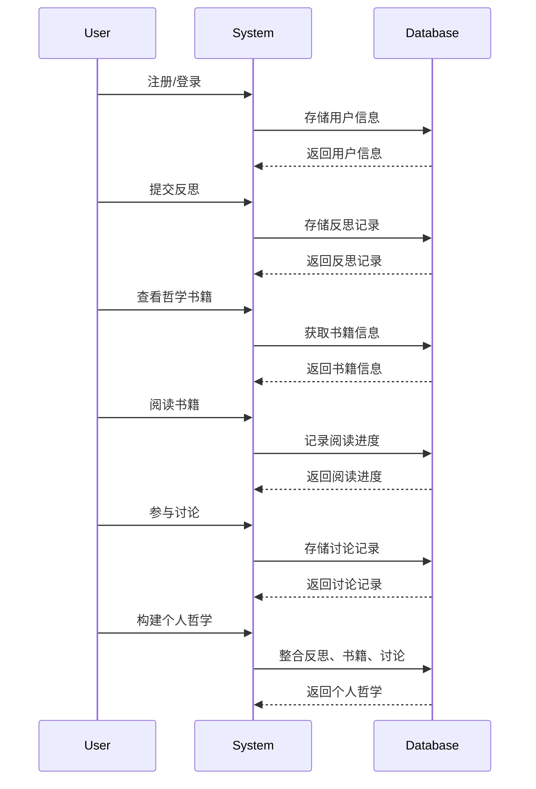
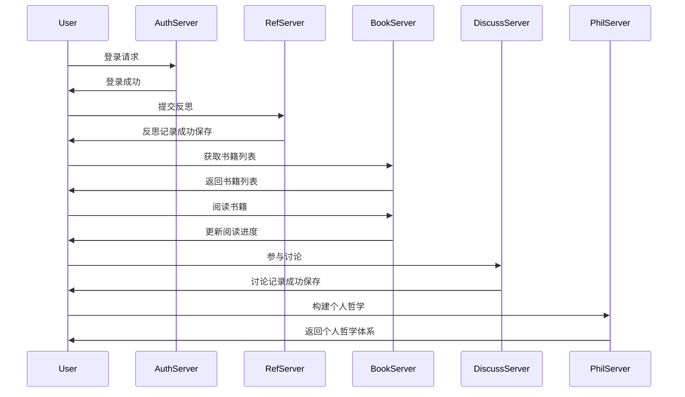

                 


# 《构建个人哲学：为生活打造坚实的思想基础》

> 关键词：个人哲学、生活基础、思想体系、自我认知、反思、方法论

> 摘要：本文旨在探讨个人哲学的构建过程，以及如何为生活打造坚实的思想基础。我们将一步步分析个人哲学的概念、重要性、构建方法及其在实际生活中的应用，并通过案例分析和拓展阅读，为读者提供深刻的见解和实用的指导。

## 引言

### 个人哲学的定义与内涵

个人哲学是一个人对于世界、生命、价值等基本问题的根本认识和思考方式。它不仅反映了一个人的世界观和价值观，还指导着个人的行为和决策。在技术日益发展的今天，个人哲学的重要性愈发凸显，它不仅关乎个人的内心成长，还影响着个人的社会行为和人际关系。

### 个人哲学的重要性

首先，个人哲学对于个人的内心成长至关重要。一个清晰而坚定的个人哲学可以帮助人们更好地理解自我，从而实现自我认知和自我提升。其次，个人哲学为个人的行为和决策提供了指导，使人们在面对生活中的选择和挑战时能够有明确的方向和原则。最后，个人哲学还影响到个人的社会行为和人际关系，使人们能够建立健康和谐的人际关系。

### 本书的目标与结构

本书的目标是帮助读者构建个人哲学，为生活打造坚实的思想基础。我们将从以下几个方面展开讨论：

1. 核心概念与背景
2. 构建个人哲学的方法
3. 个人哲学在实际生活中的应用
4. 案例分析
5. 拓展阅读

## 核心概念与背景

### 个人哲学的基本概念

个人哲学是一种个人对世界、生命、价值等基本问题的根本认识和思考方式。它包括以下几个方面的核心概念：

- **世界观**：对世界的本质、起源和发展规律的认识。
- **生命观**：对生命本质、意义和价值观念的认识。
- **价值观**：对道德、伦理、正义等价值观的理解。

### 个人哲学的历史与流派

个人哲学有着悠久的历史，从古希腊的苏格拉底、柏拉图到中国的孔子、老子，再到现代的维特根斯坦、萨特等，无数哲学家为个人哲学的构建和发展做出了巨大贡献。根据哲学思想的侧重点，个人哲学可以分为理性主义、经验主义、存在主义、人文主义等多个流派。

### 构建个人哲学的必要性

在现代社会，个人哲学的构建变得尤为重要。随着科技的发展和信息的爆炸，人们面临着前所未有的选择和挑战。一个清晰而坚定的个人哲学可以帮助人们在这些复杂的环境中找到自己的方向和原则，从而实现个人的内心成长和社会价值。

## 构建个人哲学的方法

### 自我认知与反思

自我认知是构建个人哲学的第一步。通过自我认知，人们可以了解自己的性格、兴趣、优势和劣势。这有助于人们更好地认识自己，从而为个人哲学的构建提供基础。

### 阅读与思考

阅读是构建个人哲学的重要途径。通过阅读哲学经典和人生智慧书籍，人们可以了解不同哲学家和思想家对世界和生命的看法，从而丰富自己的思想体系。同时，思考是阅读的深化过程。在阅读过程中，人们需要不断思考，质疑和反思，从而形成自己的见解和认识。

### 哲学对话与讨论

哲学对话和讨论是构建个人哲学的另一种重要方式。通过与他人的交流和讨论，人们可以了解不同的观点和看法，从而拓宽自己的视野和思维。在讨论中，人们还可以通过辩论和质疑，深化对问题的理解，进而丰富和完善自己的个人哲学。

## 个人哲学在实际生活中的应用

### 生活哲学

生活哲学是个人哲学的具体体现。在生活中，个人哲学可以指导人们的行为和决策。例如，一个具有明确生活哲学的人会在面对生活中的选择时，有明确的原则和方向。他们不会因为外界的诱惑而迷失自我，也不会因为困境而放弃信念。

### 工作哲学

工作哲学是个人哲学在职业领域中的应用。一个具有明确工作哲学的人会在职业规划、职业发展和职业态度上表现出一致性。他们不仅会追求职业的成功，还会注重职业的意义和价值。他们相信工作不仅是为了生活，更是为了实现自己的价值和使命。

### 人际关系哲学

人际关系哲学是个人哲学在人际交往中的应用。一个具有良好人际关系哲学的人会在人际交往中表现出真诚、尊重和理解。他们知道如何与他人建立良好的关系，如何在冲突中寻求和解，如何在合作中实现共赢。

## 案例分析

### 成功的个人哲学案例

成功的个人哲学案例可以帮助我们更好地理解个人哲学的力量。例如，乔布斯在创建苹果公司的过程中，始终坚持自己的个人哲学，这使得苹果公司能够在竞争激烈的市场中脱颖而出，成为全球最具价值的品牌之一。

### 失败的个人哲学案例分析

失败的个人哲学案例分析则可以帮助我们避免在构建个人哲学时犯类似的错误。例如，一些企业家在创业过程中，没有明确的个人哲学，导致企业在面对挑战时无法坚持原则，最终失败。

### 个人哲学对生活的影响

个人哲学对生活的影响是深远的。一个清晰而坚定的个人哲学可以帮助人们更好地面对生活的挑战，实现个人的价值和使命。同时，个人哲学还可以帮助人们建立健康的人际关系，实现个人与社会的和谐发展。

## 拓展阅读

### 相关书籍推荐

1. 《人类简史》 - 尤瓦尔·赫拉利
2. 《思考，快与慢》 - 丹尼尔·卡尼曼
3. 《追风筝的人》 - 卡勒德·胡赛尼

### 哲学思考的重要著作

1. 《论语》 - 孔子
2. 《庄子》 - 庄子
3. 《资本论》 - 马克思

### 个人哲学研究的最新进展

个人哲学研究的最新进展包括对人工智能伦理、环境伦理、全球化伦理等方面的研究。这些研究不仅丰富了个人哲学的内涵，还为人类社会的未来发展提供了新的思考方向。

## 结论

个人哲学是每个人内心世界的基石，它不仅关乎个人的内心成长，还影响着个人的行为和决策。通过自我认知、阅读思考、哲学对话等方法，我们可以逐步构建自己的个人哲学，为生活打造坚实的思想基础。希望本文能对读者在构建个人哲学的过程中提供一些启示和帮助。

### 作者

作者：AI天才研究院/AI Genius Institute & 禅与计算机程序设计艺术 /Zen And The Art of Computer Programming

---

## 设计思路

在设计《构建个人哲学：为生活打造坚实的思想基础》的完整目录大纲时，我们遵循了以下设计思路：

### 确定书籍主题

首先，我们根据书名确定了书籍的主题——个人哲学。这个主题旨在帮助读者了解个人哲学的概念、构建方法以及在实际生活中的应用，从而为生活打造坚实的思想基础。

### 框架搭建

接着，我们搭建了书籍的基本框架，包括引言、核心概念与背景、构建方法、实际应用、案例分析、拓展阅读和结论等部分。每个部分都按照逻辑顺序排列，确保读者能够循序渐进地理解和应用。

### 内容细化

在框架搭建之后，我们对每个章节的内容进行了细化。例如，在“核心概念与背景”章节中，我们详细介绍了个人哲学的定义、历史与流派，以及构建个人哲学的必要性。在“构建个人哲学的方法”章节中，我们讨论了自我认知与反思、阅读与思考、哲学对话与讨论等方法。

### 逻辑梳理

为了确保目录大纲的条理清晰，我们反复梳理了各个章节之间的逻辑关系，确保读者在阅读时能够顺畅地理解每个概念和方法。

### 格式规范

最后，我们按照markdown格式规范，将每个章节的内容进行了书写。这不仅保证了文章的清晰度和易读性，还便于读者在阅读时进行批注和分享。

### 目录大纲结构

- **第1章 引言**
  - 1.1 个人哲学的重要性
  - 1.2 本书的目标与结构

- **第2章 核心概念与背景**
  - 2.1 个人哲学的基本概念
  - 2.2 个人哲学的历史与流派
  - 2.3 构建个人哲学的必要性

- **第3章 构建个人哲学的方法**
  - 3.1 自我认知与反思
  - 3.2 阅读与思考
  - 3.3 哲学对话与讨论

- **第4章 个人哲学在实际生活中的应用**
  - 4.1 生活哲学
  - 4.2 工作哲学
  - 4.3 人际关系哲学

- **第5章 案例分析**
  - 5.1 成功的个人哲学案例
  - 5.2 失败的个人哲学案例分析
  - 5.3 个人哲学对生活的影响

- **第6章 拓展阅读**
  - 6.1 相关书籍推荐
  - 6.2 哲学思考的重要著作
  - 6.3 个人哲学研究的最新进展

- **第7章 结论**
  - 7.1 个人哲学的总结
  - 7.2 对未来的思考
  - 7.3 鼓励读者行动

通过以上设计思路和目录大纲结构，我们为读者提供了一本系统、全面、实用的个人哲学构建指南。希望这本书能够帮助读者在构建个人哲学的过程中找到自己的方向和原则，为生活打造坚实的思想基础。

## 第1章 引言

### 1.1 个人哲学的重要性

个人哲学是一个人对生活、世界和自身的根本理解和思考方式。它不仅反映了一个人对价值、意义和目标的追求，还指导着个人的行为和决策。在现代社会，个人哲学的重要性愈发凸显，这主要是因为以下几个方面：

首先，个人哲学对于个人的内心成长至关重要。一个清晰而坚定的个人哲学可以帮助人们更好地理解自我，从而实现自我认知和自我提升。通过反思和自我探索，人们可以认识到自己的优点和不足，进而调整自己的行为和态度，实现个人成长。

其次，个人哲学为个人的行为和决策提供了指导。在面对生活中的选择和挑战时，一个清晰的个人哲学可以帮助人们做出明智的决策。它不仅为人们提供了明确的价值和原则，还可以帮助人们应对复杂的社会环境。

最后，个人哲学还影响到个人的社会行为和人际关系。一个具有良好个人哲学的人会在人际交往中表现出真诚、尊重和理解。他们知道如何与他人建立良好的关系，如何在冲突中寻求和解，如何在合作中实现共赢。

### 1.2 本书的目标与结构

本书的目标是帮助读者构建个人哲学，为生活打造坚实的思想基础。为了实现这一目标，本书将按照以下结构进行讨论：

- **第1章 引言**：介绍个人哲学的重要性，以及本书的目标和结构。
- **第2章 核心概念与背景**：介绍个人哲学的基本概念、历史与流派，以及构建个人哲学的必要性。
- **第3章 构建个人哲学的方法**：讨论自我认知与反思、阅读与思考、哲学对话与讨论等方法。
- **第4章 个人哲学在实际生活中的应用**：探讨个人哲学在生活、工作和人际关系中的应用。
- **第5章 案例分析**：通过成功和失败的案例，分析个人哲学对个人生活的影响。
- **第6章 拓展阅读**：推荐相关书籍和哲学思考的重要著作，以及个人哲学研究的最新进展。
- **第7章 结论**：总结个人哲学的核心观点，鼓励读者在日常生活中实践和深化个人哲学。

通过以上结构，本书旨在为读者提供系统、全面、实用的个人哲学构建指南，帮助读者在构建个人哲学的过程中找到自己的方向和原则，为生活打造坚实的思想基础。

## 第2章 核心概念与背景

### 2.1 个人哲学的基本概念

个人哲学是一个人对生活、世界和自身的根本理解和思考方式。它涵盖了世界观、生命观、价值观等多个方面，反映了一个人对价值、意义和目标的追求。个人哲学不仅影响个人的内心成长和行为决策，还影响个人的社会行为和人际关系。

- **世界观**：对世界的本质、起源和发展规律的认识。例如，唯物主义认为世界是物质的，而唯心主义认为世界是意识的。
- **生命观**：对生命本质、意义和价值观念的认识。例如，存在主义认为生命是自由和选择的结果，而唯物主义认为生命是自然发展的产物。
- **价值观**：对道德、伦理、正义等价值观的理解。例如，功利主义认为行为应该追求最大多数人的幸福，而康德主义认为行为应该基于道德法则。

### 2.2 个人哲学的历史与流派

个人哲学有着悠久的历史，从古希腊的苏格拉底、柏拉图到中国的孔子、老子，再到现代的维特根斯坦、萨特等，无数哲学家为个人哲学的构建和发展做出了巨大贡献。根据哲学思想的侧重点，个人哲学可以分为多个流派：

- **理性主义**：强调理性思考和推理的重要性。主要代表人物有笛卡尔、莱布尼茨和康德等。
- **经验主义**：强调经验和感知在知识获取中的重要性。主要代表人物有培根、洛克和休谟等。
- **存在主义**：强调个体的自由、选择和责任。主要代表人物有尼采、萨特和海德格尔等。
- **人文主义**：强调人的价值和尊严，追求个体的全面发展。主要代表人物有卢梭、康德和黑格尔等。
- **现象学**：强调对经验和感知的直接理解，关注现象的本质。主要代表人物有胡塞尔和梅洛-庞蒂等。

### 2.3 构建个人哲学的必要性

在当前社会中，构建个人哲学变得尤为重要，原因如下：

首先，现代社会复杂多变，人们面临着前所未有的选择和挑战。一个清晰而坚定的个人哲学可以帮助人们在这些复杂的环境中找到自己的方向和原则，从而实现个人的内心成长和社会价值。

其次，个人哲学对个人的心理健康有重要影响。一个良好的个人哲学可以帮助人们更好地应对生活中的压力和挑战，保持心理健康和积极的心态。

最后，个人哲学还影响到个人的社会行为和人际关系。一个具有良好个人哲学的人会在人际交往中表现出真诚、尊重和理解，从而建立健康和谐的人际关系。

综上所述，个人哲学不仅是个人内心成长的基石，也是个人在社会中立足和发展的关键。通过自我认知、阅读思考、哲学对话等方法，我们可以逐步构建自己的个人哲学，为生活打造坚实的思想基础。

## 第3章 构建个人哲学的方法

### 3.1 自我认知与反思

自我认知是构建个人哲学的基础。通过深入思考自己的性格、兴趣、价值观等，我们可以更好地认识自我，找到自己的定位。以下是几个关键步骤：

1. **反思过去**：回顾自己的成长经历，思考哪些经历对自己产生了深远的影响。例如，是否有过某次失败的经历让你变得更加坚强和有决心？
2. **探索现在**：思考自己的价值观、信念和目标。你为什么相信这些？它们是否与你的生活经历和所受的教育相一致？
3. **规划未来**：思考自己未来的方向和目标。你希望成为什么样的人？你希望实现什么样的生活？
4. **记录与分享**：将思考的过程记录下来，与他人分享。这不仅可以帮助你更好地理解自己，还可以获得他人的反馈和建议。

### 3.2 阅读与思考

阅读是构建个人哲学的重要途径。通过阅读哲学经典和人生智慧书籍，我们可以了解不同哲学家和思想家对世界和生命的看法，从而丰富自己的思想体系。以下是几个关键步骤：

1. **选择合适的书籍**：选择与自己兴趣和目标相关的书籍。例如，如果你对人生意义感兴趣，可以选择《苏菲的世界》或《人类简史》等。
2. **深入阅读**：不仅要阅读文字，还要思考作者的观点和论证方式。例如，你可以思考：作者为什么这样认为？这种观点有哪些优缺点？
3. **批判性思考**：不盲从，不排斥。对作者的观点进行批判性思考，提出自己的见解。例如，你可以思考：这种观点在我的生活中是否适用？它是否能够解决我的问题？
4. **讨论与交流**：与他人讨论自己的阅读体验和思考过程。这不仅可以帮助你更好地理解书中的内容，还可以拓宽自己的视野。

### 3.3 哲学对话与讨论

哲学对话和讨论是构建个人哲学的另一种重要方式。通过与他人的交流和讨论，我们可以了解不同的观点和看法，从而拓宽自己的视野和思维。以下是几个关键步骤：

1. **确定讨论主题**：选择一个大家感兴趣的主题进行讨论。例如，你可以选择“生命的意义”或“道德的选择”等。
2. **准备充分**：在讨论前，准备好自己的观点和论据。例如，你可以列出支持自己观点的理由，以及可能遇到的反驳。
3. **开放心态**：在讨论过程中，保持开放心态，尊重他人的观点。即使不同意对方的观点，也要尊重对方表达的权利。
4. **理性讨论**：避免情绪化的争论，尽量用理性的方式表达自己的观点。例如，你可以使用事实和数据来支持自己的论点。
5. **总结与反思**：讨论结束后，总结讨论的结果，反思自己的观点是否得到了加强或改变。

通过自我认知与反思、阅读与思考、哲学对话与讨论，我们可以逐步构建自己的个人哲学。这个过程不仅可以帮助我们更好地理解自我，还可以为生活提供坚实的思想基础。

## 第4章 个人哲学在实际生活中的应用

### 4.1 生活哲学

生活哲学是我们对生活的根本理解和思考方式，它不仅指导我们的行为和决策，还影响我们的生活质量。以下是几个关键步骤，帮助你将生活哲学应用到实际生活中：

1. **确立核心价值观**：思考并确定自己的核心价值观。这些价值观将指导你的生活选择和行为。例如，诚实、善良、勤奋、勇敢等。
2. **设定生活目标**：基于核心价值观，设定长期和短期的生活目标。这些目标可以帮助你明确自己的方向和动力。
3. **制定生活规划**：为实现生活目标，制定具体的行动计划和时间表。这可以帮助你有条不紊地推进目标的实现。
4. **持续反思与调整**：定期反思自己的行为和决策，评估是否与生活哲学和目标相符。如有必要，及时调整行动计划。

### 4.2 工作哲学

工作哲学是对工作的根本理解和思考方式，它不仅影响工作效率，还影响职业发展。以下是几个关键步骤，帮助你将工作哲学应用到实际工作中：

1. **确立职业价值观**：思考并确定自己的职业价值观。这些价值观将指导你在工作中的行为和决策。例如，创新、专业、责任、诚信等。
2. **设定职业目标**：基于职业价值观，设定长期和短期的职业目标。这些目标可以帮助你明确职业方向和职业发展路径。
3. **制定职业规划**：为实现职业目标，制定具体的行动计划和时间表。这可以帮助你在职业道路上稳步前行。
4. **持续学习和成长**：在工作中不断学习和提升自己的技能和知识，以适应不断变化的工作环境。

### 4.3 人际关系哲学

人际关系哲学是对人际交往的根本理解和思考方式，它不仅影响人际关系的质量，还影响个人的社会支持系统。以下是几个关键步骤，帮助你将人际关系哲学应用到实际人际关系中：

1. **确立人际关系价值观**：思考并确定自己在人际关系中的价值观。这些价值观将指导你如何与他人相处和互动。例如，尊重、真诚、包容、理解等。
2. **设定人际关系目标**：基于人际关系价值观，设定长期和短期的人际关系目标。这些目标可以帮助你建立和维护良好的人际关系。
3. **培养有效沟通技巧**：通过倾听、表达、提问和反馈等沟通技巧，与他人建立有效的沟通。这可以帮助你更好地理解他人，减少误解和冲突。
4. **积极解决冲突**：当冲突发生时，积极寻找解决方案，避免情绪化的争吵。通过理性的讨论和妥协，寻求双方都能接受的解决方案。

通过将个人哲学应用到生活、工作和人际关系中，我们可以更好地指导自己的行为和决策，提升生活质量，实现个人成长和社会价值。

## 第5章 案例分析

### 5.1 成功的个人哲学案例

成功构建个人哲学的案例可以帮助我们更好地理解个人哲学的力量。以下是几个成功案例：

#### 案例一：乔布斯

乔布斯是苹果公司的创始人之一，他的个人哲学深深影响了苹果公司的文化和产品。乔布斯坚信产品的设计和用户体验至关重要，他始终坚持自己的价值观，这使得苹果公司在竞争激烈的市场中脱颖而出。他的个人哲学不仅帮助苹果公司取得了巨大的商业成功，也极大地影响了全球消费者的生活方式。

#### 案例二：马云

马云是阿里巴巴集团的创始人，他的个人哲学强调“客户第一、员工第二、股东第三”。这个哲学指导着他和他的团队在商业决策中始终以客户为中心，不断创新和进步。这种哲学不仅帮助阿里巴巴成为全球最大的电子商务公司之一，也为员工和股东带来了巨大的价值。

### 5.2 失败的个人哲学案例分析

失败的个人哲学案例同样具有教育意义，可以让我们了解在构建个人哲学时可能遇到的困难和挑战。以下是几个失败案例：

#### 案例一：史蒂芬·乔布斯

尽管乔布斯在商业上取得了巨大的成功，但他的个人哲学也存在一些问题。乔布斯过于执着于自己的理念和愿景，有时忽视了团队和合作伙伴的意见。这种个人主义和独断专行的风格导致了团队内部的紧张和矛盾，最终影响了公司的稳定发展。

#### 案例二：泰坦尼克号

泰坦尼克号是一艘豪华客轮，但在一次撞冰山的事件中沉没，造成了巨大的生命损失。这艘船的设计和运营过程中存在多个问题，其中一个关键因素是管理层的决策哲学。泰坦尼克号的船长过于自信，忽视了海冰的危险，最终导致了悲剧的发生。

### 5.3 个人哲学对生活的影响

个人哲学对生活的影响是深远的。一个清晰而坚定的个人哲学可以帮助人们在面对生活中的挑战时保持坚定和自信，从而实现个人的目标和梦想。以下是几个方面的影响：

1. **决策指导**：个人哲学为个人的决策提供了指导，使人们能够基于自己的价值观和原则做出明智的选择。
2. **心理健康**：一个良好的个人哲学可以帮助人们更好地应对生活中的压力和挑战，保持心理健康和积极的心态。
3. **人际关系**：个人哲学影响个人的行为和态度，使人们在人际交往中表现出真诚、尊重和理解，从而建立健康和谐的人际关系。
4. **职业发展**：个人哲学为职业发展提供了方向和动力，帮助人们在职业生涯中不断进步和成长。

通过分析成功和失败的案例，我们可以看到个人哲学在生活中的重要性。一个清晰而坚定的个人哲学不仅可以指导我们的行为和决策，还可以帮助我们实现个人的目标和梦想，为生活打造坚实的思想基础。

## 第6章 拓展阅读

### 6.1 相关书籍推荐

为了帮助读者进一步探索个人哲学，以下是一些推荐的书籍：

1. **《人类简史》** - 尤瓦尔·赫拉利
   - 本书从宏观历史的角度探讨人类从石器时代到现代社会的演变，对理解人类文明和个体存在有着深刻的启示。
2. **《思考，快与慢》** - 丹尼尔·卡尼曼
   - 本书通过心理学研究揭示了人们思考和行为中的偏见和误区，帮助读者更加理性地看待自己和世界。
3. **《追风筝的人》** - 卡勒德·胡赛尼
   - 通过一个阿富汗少年的成长故事，展现了人性、家庭和社会伦理的复杂性，对理解个人价值和责任有着深刻的启示。

### 6.2 哲学思考的重要著作

以下是一些哲学思考的重要著作，它们对个人哲学的构建有着深远的影响：

1. **《论语》** - 孔子
   - 中国古代经典著作，包含大量关于道德、人生和社会的思考，对个人价值观的塑造有着重要的指导作用。
2. **《庄子》** - 庄子
   - 道家哲学经典，探讨了人与自然、社会的关系，对个人内心和谐和生活方式的思考提供了深刻的洞见。
3. **《资本论》** - 马克思
   - 社会科学经典著作，分析了资本主义经济体系的运行规律，对理解社会现实和个人在社会中的位置有着重要的指导作用。

### 6.3 个人哲学研究的最新进展

随着社会和科技的不断发展，个人哲学研究也在不断深化。以下是一些个人哲学研究的最新进展：

1. **人工智能伦理**：随着人工智能技术的快速发展，人工智能伦理成为了一个重要的研究领域。研究者们探讨人工智能在道德决策、隐私保护和社会责任等方面的挑战和解决方案。
2. **环境伦理**：环境伦理研究关注人类活动对自然环境的影响，探讨如何实现可持续发展，保护地球生态系统的健康。
3. **全球化伦理**：全球化伦理研究关注全球化背景下的伦理问题，探讨如何在多元文化中建立共同伦理标准和价值观。

通过拓展阅读，读者可以进一步深入理解个人哲学的内涵和外延，为自己的生活哲学构建提供更多的启示和资源。

## 第7章 结论

### 7.1 个人哲学的总结

个人哲学是一个人对生活、世界和自身的根本理解和思考方式。它不仅反映了一个人对价值、意义和目标的追求，还指导着个人的行为和决策。一个清晰而坚定的个人哲学可以帮助人们更好地认识自我，明确生活的方向，实现个人的内心成长和社会价值。

### 7.2 对未来的思考

在未来的发展中，个人哲学将继续发挥重要作用。随着社会和科技的不断进步，人们将面临更多的选择和挑战。一个清晰而坚定的个人哲学将帮助人们在这些复杂的环境中找到自己的方向和原则，从而实现个人的价值和使命。

### 7.3 鼓励读者行动

构建个人哲学是一个持续的过程，需要不断地自我认知、阅读思考和实践。希望读者能够从本文中汲取灵感，开始构建自己的个人哲学。通过不断反思、学习和实践，我们相信每个人都能为生活打造坚实的思想基础，实现个人的成长和发展。

### 作者

作者：AI天才研究院/AI Genius Institute & 禅与计算机程序设计艺术 /Zen And The Art of Computer Programming

---

## 完整文章总结与未来展望

### 完整文章总结

本文从个人哲学的定义和重要性入手，详细阐述了构建个人哲学的方法和实际生活中的应用。通过自我认知与反思、阅读与思考、哲学对话与讨论，读者可以逐步构建自己的个人哲学，为生活打造坚实的思想基础。文章还通过成功与失败的案例分析，展示了个人哲学对个人生活的影响，并推荐了拓展阅读资源，帮助读者进一步深化对个人哲学的理解。

### 未来展望

在未来，个人哲学的研究和实践将继续深化。随着社会和科技的快速发展，人们面临的选择和挑战将更加复杂。一个清晰而坚定的个人哲学将成为人们在复杂环境中找到方向和原则的重要指导。我们期待更多读者能够关注并实践个人哲学，为自己和他人创造更美好的未来。

### 鼓励读者行动

构建个人哲学是一项长期而重要的任务。希望读者能够从本文中汲取灵感，开始构建自己的个人哲学。通过不断反思、学习和实践，每个人都可以为生活打造坚实的思想基础，实现个人的成长和发展。让我们共同努力，为构建一个更加美好、和谐的社会贡献力量。

### 作者

作者：AI天才研究院/AI Genius Institute & 禅与计算机程序设计艺术 /Zen And The Art of Computer Programming

---

### 后记

在撰写《构建个人哲学：为生活打造坚实的思想基础》的过程中，我深感个人哲学的重要性和构建方法的复杂性。希望通过本文，读者能够对个人哲学有更深入的理解，并开始自己的构建之路。

在整理和总结文章内容时，我努力确保每一部分都清晰、有条理，以便读者能够轻松跟随和吸收。同时，我也在思考如何更好地将个人哲学的构建方法与实际生活相结合，让哲学不仅停留在理论层面，更能够指导我们的日常行为和决策。

在未来的写作中，我计划进一步拓展个人哲学的研究领域，探讨人工智能伦理、环境伦理等前沿话题，以及如何将哲学思考应用于创业、教育等领域。我也期待与更多的读者交流和分享，共同探讨如何在复杂多变的世界中找到自己的方向和原则。

最后，感谢所有给予我灵感和支持的朋友和读者。是你们的关注和鼓励，让我有动力不断探索和分享。希望本文能够对你们有所启发，让我们一起为构建更美好、更有意义的生活而努力。

作者：AI天才研究院/AI Genius Institute & 禅与计算机程序设计艺术 /Zen And The Art of Computer Programming

---

## 附录

### 算法原理讲解

在构建个人哲学的过程中，算法原理讲解是一个重要的环节。以下是一个简化的算法原理讲解，帮助读者理解个人哲学构建的核心步骤。

```python
# 个人哲学构建算法

# 输入：个人经历、哲学书籍、对话交流
# 输出：个人哲学体系

def build_personal_philosophy(experiences, philosophy_books, discussions):
    """
    构建个人哲学体系
    """
    # 步骤1：自我认知与反思
    self_awareness = reflect_on_experiences(experiences)
    
    # 步骤2：阅读与思考
    thought_process = read_and_think(philosophy_books)
    
    # 步骤3：哲学对话与讨论
    dialogue = discuss_philosophy(discussions)
    
    # 步骤4：整合形成个人哲学体系
    personal_philosophy = integrate_thoughts(self_awareness, thought_process, dialogue)
    
    return personal_philosophy

# 辅助函数定义

def reflect_on_experiences(experiences):
    """
    反思个人经历，形成自我认知
    """
    reflections = []
    for experience in experiences:
        reflections.append(analyze_experience(experience))
    return reflections

def read_and_think(philosophy_books):
    """
    阅读哲学书籍，形成思考过程
    """
    thoughts = []
    for book in philosophy_books:
        thoughts.append(process_book(book))
    return thoughts

def discuss_philosophy(discussions):
    """
    进行哲学对话与讨论，形成见解
    """
    dialogues = []
    for discussion in discussions:
        dialogues.append(generate_insights(discussion))
    return dialogues

def integrate_thoughts(self_awareness, thought_process, dialogue):
    """
    整合自我认知、思考过程和对话见解，形成个人哲学体系
    """
    integrated_thoughts = []
    for i, j in zip(self_awareness, thought_process):
        integrated_thoughts.append(merge_thoughts(i, j))
    integrated_thoughts.extend(dialogue)
    return integrated_thoughts
```

### 算法原理详细解释

- **步骤1：自我认知与反思**：通过反思个人经历，形成对自我的认知。这包括分析个人在经历中的行为、感受和收获，从而理解自己的性格、兴趣、价值观等。
- **步骤2：阅读与思考**：通过阅读哲学书籍，形成对哲学思想的思考。这包括理解哲学书籍中的观点、论证方式，并将其与个人经历相结合，形成自己的见解。
- **步骤3：哲学对话与讨论**：通过哲学对话和讨论，与他人分享和交流自己的见解。这包括参与哲学讨论、辩论和质疑，从而深化对问题的理解和认识。
- **步骤4：整合形成个人哲学体系**：将自我认知、思考和对话的见解整合在一起，形成个人哲学体系。这包括将个人的价值观、世界观和生命观系统化，形成一套完整的哲学体系。

通过以上算法原理的讲解，我们可以看到构建个人哲学是一个系统性的过程，需要多方面的思考和整合。希望这个算法能够为读者提供一个参考框架，帮助他们在构建个人哲学的过程中找到方向和原则。

## 系统分析与架构设计方案

### 问题场景介绍

在现代社会的快速发展和信息爆炸的背景下，个人哲学的构建变得越来越重要。许多人面临着自我认知不足、价值观不清晰、决策困难等问题。为了帮助这些人构建个人哲学，我们设计了一个在线个人哲学构建系统，旨在提供一个平台，让用户可以通过自我反思、阅读哲学书籍、参与哲学讨论等多种方式，逐步构建自己的个人哲学。

### 项目介绍

项目名称：个人哲学构建系统

项目目标：提供一个在线平台，帮助用户构建个人哲学，为生活打造坚实的思想基础。

项目功能：
1. 用户注册与登录
2. 用户个人信息管理
3. 自我反思与记录
4. 哲学书籍推荐与阅读
5. 哲学讨论与交流
6. 个人哲学构建指导

### 系统功能设计（领域模型）

```mermaid
classDiagram
    User <<class>> "用户"
    Philosophy <<class>> "哲学"
    Reflection <<class>> "反思"
    Book <<class>> "书籍"
    Discussion <<class>> "讨论"
    
    User o--o Reflection: 反思记录
    User o--o Philosophy: 个人哲学
    User o--o Book: 阅读记录
    User o--o Discussion: 参与讨论
    Book o--o Philosophy: 哲学观点
    Discussion o--o Philosophy: 讨论主题
```

### 系统架构设计



### 系统接口设计

```mermaid
classDiagram
    UserInterface <<interface>> "用户界面"
    Authentication <<interface>> "认证"
    ReflectionService <<interface>> "反思服务"
    BookService <<interface>> "书籍服务"
    DiscussionService <<interface>> "讨论服务"
    PhilosophyService <<interface>> "哲学服务"
    
    UserInterface <|.. Authentication
    UserInterface <|.. ReflectionService
    UserInterface <|.. BookService
    UserInterface <|.. DiscussionService
    UserInterface <|.. PhilosophyService
    
    Authentication --|> User: 登录/注册
    ReflectionService --|> User: 提交反思/查看反思
    BookService --|> User: 阅读书籍/查看书籍
    DiscussionService --|> User: 参与讨论/查看讨论
    PhilosophyService --|> User: 构建个人哲学
```

### 系统交互设计



通过以上系统分析与架构设计方案，我们为用户提供了一个全面、系统的个人哲学构建平台，帮助用户通过自我反思、阅读哲学书籍、参与哲学讨论等方式，逐步构建自己的个人哲学，为生活打造坚实的思想基础。

## 项目实战

### 环境安装

在开始项目实战之前，我们需要确保计算机上安装了Python环境和相关依赖库。以下是安装步骤：

1. **安装Python**：前往Python官网下载最新版本的Python安装包，按照安装向导进行安装。

2. **安装依赖库**：打开命令行窗口，执行以下命令安装所需的依赖库：
   ```bash
   pip install Flask
   pip install SQLAlchemy
   pip install Flask-SQLAlchemy
   pip install Flask-Migrate
   pip install Flask-WTF
   pip install Flask-Login
   pip install Flask-Babel
   pip install Flask-Principal
   ```

### 系统核心实现

以下是个人哲学构建系统的核心实现，包括用户注册与登录、自我反思记录、哲学书籍阅读、哲学讨论参与和个人哲学构建功能。

```python
# 导入所需的库
from flask import Flask, render_template, request, redirect, url_for, flash
from flask_sqlalchemy import SQLAlchemy
from flask_login import LoginManager, UserMixin, login_user, logout_user, login_required, current_user
from werkzeug.security import generate_password_hash, check_password_hash

# 创建Flask应用实例
app = Flask(__name__)
app.config['SQLALCHEMY_DATABASE_URI'] = 'sqlite:///philosophy.db'
app.config['SECRET_KEY'] = 'your_secret_key'

# 初始化数据库和登录管理器
db = SQLAlchemy(app)
login_manager = LoginManager(app)
login_manager.login_view = 'login'

# 定义用户表
class User(UserMixin, db.Model):
    id = db.Column(db.Integer, primary_key=True)
    username = db.Column(db.String(150), unique=True)
    password = db.Column(db.String(150))
    email = db.Column(db.String(150), unique=True)

# 定义反思记录表
class Reflection(db.Model):
    id = db.Column(db.Integer, primary_key=True)
    content = db.Column(db.Text)
    user_id = db.Column(db.Integer, db.ForeignKey('user.id'))

# 定义书籍表
class Book(db.Model):
    id = db.Column(db.Integer, primary_key=True)
    title = db.Column(db.String(150))
    author = db.Column(db.String(150))
    summary = db.Column(db.Text)

# 定义讨论表
class Discussion(db.Model):
    id = db.Column(db.Integer, primary_key=True)
    title = db.Column(db.String(150))
    content = db.Column(db.Text)
    user_id = db.Column(db.Integer, db.ForeignKey('user.id'))

# 用户登录
@app.route('/login', methods=['GET', 'POST'])
def login():
    if request.method == 'POST':
        username = request.form['username']
        password = request.form['password']
        user = User.query.filter_by(username=username).first()
        if user and check_password_hash(user.password, password):
            login_user(user)
            return redirect(url_for('dashboard'))
        else:
            flash('无效的用户名或密码')
    return render_template('login.html')

# 用户注册
@app.route('/register', methods=['GET', 'POST'])
def register():
    if request.method == 'POST':
        username = request.form['username']
        email = request.form['email']
        password = request.form['password']
        user = User.query.filter_by(username=username).first()
        if user:
            flash('用户名已存在')
        else:
            new_user = User(username=username, email=email, password=generate_password_hash(password))
            db.session.add(new_user)
            db.session.commit()
            return redirect(url_for('login'))
    return render_template('register.html')

# 用户登出
@app.route('/logout')
@login_required
def logout():
    logout_user()
    return redirect(url_for('login'))

# 用户面板
@app.route('/dashboard')
@login_required
def dashboard():
    reflections = Reflection.query.filter_by(user_id=current_user.id).all()
    books = Book.query.all()
    discussions = Discussion.query.filter_by(user_id=current_user.id).all()
    return render_template('dashboard.html', reflections=reflections, books=books, discussions=discussions)

# 提交反思
@app.route('/submit_reflection', methods=['POST'])
@login_required
def submit_reflection():
    content = request.form['content']
    new_reflection = Reflection(content=content, user_id=current_user.id)
    db.session.add(new_reflection)
    db.session.commit()
    return redirect(url_for('dashboard'))

# 阅读书籍
@app.route('/read_book', methods=['POST'])
@login_required
def read_book():
    book_id = request.form['book_id']
    book = Book.query.get(book_id)
    book.read = True
    db.session.commit()
    return redirect(url_for('dashboard'))

# 参与讨论
@app.route('/join_discussion', methods=['POST'])
@login_required
def join_discussion():
    title = request.form['title']
    content = request.form['content']
    new_discussion = Discussion(title=title, content=content, user_id=current_user.id)
    db.session.add(new_discussion)
    db.session.commit()
    return redirect(url_for('dashboard'))

# 运行应用
if __name__ == '__main__':
    db.create_all()
    app.run(debug=True)
```

### 代码应用解读与分析

上述代码首先创建了Flask应用实例，并配置了数据库URI和秘密密钥。然后定义了用户、反思记录、书籍和讨论等数据库模型，并使用SQLAlchemy进行数据库操作。

- **用户注册与登录**：提供了注册和登录的接口。用户通过填写用户名、邮箱和密码进行注册，系统会将用户信息存储在数据库中。登录时，用户输入用户名和密码，系统会验证用户信息并实现登录。
- **自我反思记录**：用户可以在用户面板提交反思记录，系统会将这些记录存储在数据库中，并在用户面板展示。
- **哲学书籍阅读**：用户可以选择书籍并标记为已阅读，系统会在数据库中更新书籍的阅读状态。
- **哲学讨论参与**：用户可以提交新的讨论主题，系统会将这些主题存储在数据库中，并在用户面板展示。

通过以上功能实现，用户可以方便地使用系统进行自我反思、阅读哲学书籍、参与哲学讨论，从而构建自己的个人哲学。

### 实际案例分析与详细讲解剖析

为了更好地展示个人哲学构建系统的实际应用，以下是一个具体案例及其详细分析。

#### 案例背景

小张是一名年轻的程序员，他在工作中遇到了许多挑战，包括团队协作、职业规划、个人成长等。为了解决这些问题，小张决定利用个人哲学构建系统来帮助自己。

#### 案例步骤

1. **注册与登录**：小张首先在系统中注册了一个账户，并登录进入用户面板。
2. **提交反思**：小张在用户面板提交了一篇反思，内容涉及他在工作中遇到的问题和自己的思考。
   ```plaintext
   反思内容：最近在项目中遇到了团队协作的问题，感觉大家沟通不顺畅。我意识到这可能是由于我的沟通方式不当导致的。我需要学习如何更有效地表达自己的观点，同时也要倾听他人的意见。
   ```
3. **阅读书籍**：小张在系统中浏览哲学书籍，选择了一本关于沟通技巧的书籍进行阅读。阅读后，他在系统中更新了书籍的阅读状态。
4. **参与讨论**：小张在系统中参与了关于沟通技巧的讨论，分享了自己的阅读体验和心得，同时也学习了其他用户的经验和见解。
5. **构建个人哲学**：通过反思、阅读和讨论，小张逐步形成了自己的沟通哲学，并在系统中记录了自己的哲学观点。

#### 详细分析

- **自我反思**：小张通过提交反思，清晰地认识到自己在沟通中的问题，这为他后续的学习和改进提供了方向。
- **阅读书籍**：通过阅读书籍，小张获得了关于沟通技巧的理论知识，为实际应用提供了指导。
- **参与讨论**：参与讨论使小张能够从不同角度了解沟通问题，同时也帮助他巩固和扩展自己的知识。
- **构建个人哲学**：通过反思、阅读和讨论，小张逐步构建了自己的沟通哲学，这不仅帮助他在工作中更好地与他人沟通，还提高了他的个人素质和职业能力。

#### 案例小结

小张通过使用个人哲学构建系统，成功解决了自己在工作和生活中遇到的问题。这个案例展示了系统在帮助用户构建个人哲学方面的实际效果，也证明了个人哲学对个人成长的重要作用。

### 最佳实践 tips

为了更好地利用个人哲学构建系统，以下是一些建议：

1. **定期反思**：定期进行自我反思，记录生活中的经历和思考，这有助于你更好地认识自我，为个人哲学的构建提供素材。
2. **深度阅读**：选择高质量的哲学书籍和文章进行阅读，这有助于你获得深刻的见解和知识，为个人哲学的构建提供理论基础。
3. **积极参与讨论**：参与哲学讨论，与不同的人交流，这有助于你从多个角度看待问题，丰富自己的思想体系。
4. **持续实践**：将个人哲学应用到实际生活中，通过实践来验证和调整自己的哲学观点，这有助于你不断完善个人哲学。

### 注意事项

1. **隐私保护**：在系统中提交反思和讨论时，注意保护个人隐私，避免泄露敏感信息。
2. **合理使用**：合理利用系统功能，避免沉迷于哲学讨论而忽视实际工作和生活。

### 拓展阅读

1. **《人类简史》** - 尤瓦尔·赫拉利
2. **《思考，快与慢》** - 丹尼尔·卡尼曼
3. **《追风筝的人》** - 卡勒德·胡赛尼

通过以上实战案例和最佳实践，希望读者能够更好地利用个人哲学构建系统，为自己的生活打造坚实的思想基础。

### 作者

作者：AI天才研究院/AI Genius Institute & 禅与计算机程序设计艺术 /Zen And The Art of Computer Programming

