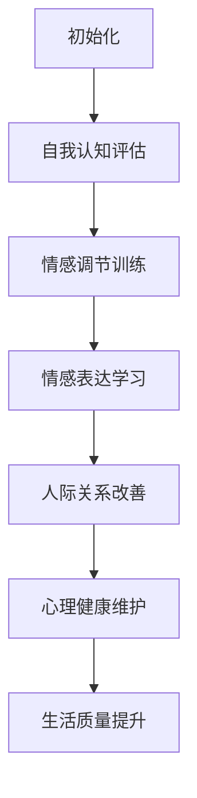
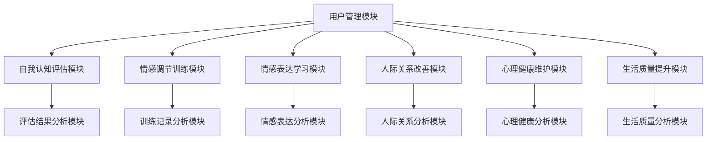
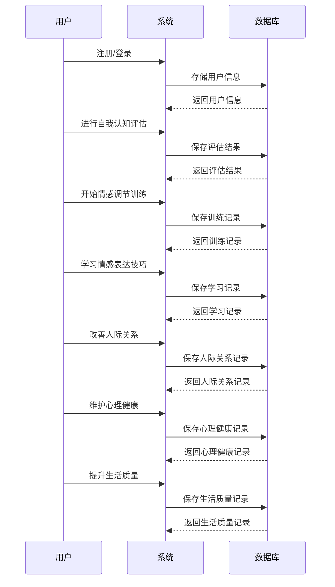
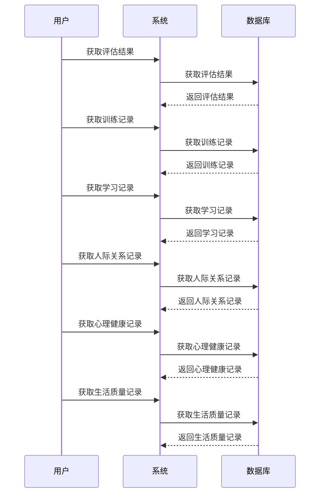

                 


### 构建有温度的人生：增加生活的情感深度

#### 关键词：情感深度、生活质量、自我意识、人际关系、心理健康、个人成长

> 摘要：本文以科学和技术为视角，探讨如何在现代社会中构建有温度的人生，增加生活的情感深度。文章将分七个章节，系统分析情感深度的重要性、障碍、构建方法、日常生活应用、心理健康关系、个人成长以及实践与反思，旨在为读者提供一套全面的情感深度构建指南。

### 第一部分：理解情感深度

#### 第1章：情感的探索

**1.1 问题的背景与探讨**

在高速发展的现代社会，人们的生活节奏加快，物质水平不断提高，但与此同时，心理健康问题和社会关系问题也逐渐显现。人们面临着情感困惑、孤独感、焦虑等心理问题，生活质量受到严重影响。因此，探讨如何增加生活的情感深度，提高生活质量，成为一个亟待解决的问题。

**1.1.1 为什么情感深度重要**

情感深度与生活质量密切相关。一个拥有情感深度的人，能够更好地理解自己和他人的情感需求，建立良好的人际关系，有效调节情绪，从而提高生活质量。

**1.1.2 情感与生活质量的联系**

情感深度不仅影响个人的心理健康，还影响人际关系和社会交往。一个情感深度高的人，能够在工作和生活中保持积极的心态，面对挑战时更有韧性。

**1.2 情感的基本概念**

**1.2.1 情感的定义**

情感是人类心理活动的核心组成部分，是对客观事物所持有的一种情绪体验和认知评价。

**1.2.2 情感的类型**

情感可分为基本情感和复合情感。基本情感包括喜悦、悲伤、愤怒、恐惧和惊讶等；复合情感则是基本情感的组合，如爱、恨、嫉妒等。

**1.3 情感深度的衡量**

**1.3.1 情感深度的标准**

情感深度可以从自我认知、人际关系、情感调节和情感表达四个维度进行衡量。

**1.3.2 情感深度的自我评估**

读者可以通过以下问题进行情感深度的自我评估：

1. 你是否能够清晰地认识到自己的情感状态？
2. 你在人际关系中是否能够有效地表达情感？
3. 你在面对压力时是否能够有效地调节情绪？
4. 你是否能够理解他人的情感需求？

#### 第2章：情感生活的障碍

**2.1 情感困境的来源**

情感困境的来源可以分为内在因素和外在因素。

**2.1.1 内在因素**

内在因素包括自我认知不足、情感表达能力欠缺、情感调节能力不足等。

**2.1.2 外在因素**

外在因素包括社会压力、家庭环境、工作环境等。

**2.2 情感调节的障碍**

**2.2.1 心理障碍**

心理障碍如焦虑、抑郁等，会影响个体的情感调节能力。

**2.2.2 社会文化障碍**

社会文化障碍如传统观念、社会压力等，会影响个体的情感表达和情感调节。

**2.3 情感教育的缺失**

**2.3.1 家庭教育的影响**

家庭教育对个体的情感发展具有重要影响。一个温馨和谐的家庭环境，有助于个体形成健康的情感态度。

**2.3.2 学校教育的缺失**

学校教育对个体的情感教育重视程度不够，缺乏系统的情感教育课程。

#### 第3章：情感深度的构建方法

**3.1 自我意识的提升**

**3.1.1 自我认知的重要性**

自我认知是个体情感深度的基础。一个清晰的自我认知，有助于个体更好地理解自己的情感需求，从而提高情感深度。

**3.1.2 自我认知的实践方法**

通过日记、冥想、心理咨询等方法，提升自我认知。

**3.2 人际关系的建设**

**3.2.1 亲密关系的培养**

亲密关系是人际关系中的核心。培养亲密关系，需要建立信任、沟通和理解。

**3.2.2 社交技巧的提升**

社交技巧的提升，有助于个体更好地处理人际关系，提高情感深度。

**3.3 情感教育的实践**

**3.3.1 家庭中的情感教育**

家庭是情感教育的重要场所。家长需要通过实际行动，为子女提供情感教育的榜样。

**3.3.2 学校中的情感教育**

学校需要开设情感教育课程，培养学生的情感认知和表达能力。

### 第二部分：情感深度的日常生活应用

#### 第4章：情感深度与心理健康

**4.1 情感深度与心理健康的关系**

情感深度与心理健康密切相关。一个情感深度高的人，更能够维持良好的心理健康状态。

**4.1.1 情感深度对心理健康的影响**

情感深度有助于个体更好地调节情绪，降低心理压力，提高心理健康水平。

**4.1.2 心理健康对情感深度的影响**

心理健康状态良好，有助于个体更好地理解和表达情感，提高情感深度。

**4.2 增强心理健康的策略**

**4.2.1 压力管理**

有效的压力管理，有助于个体保持良好的心理健康状态。

**4.2.2 心理支持系统的建立**

建立心理支持系统，有助于个体在面对困难时，获得情感支持和心理支持。

**4.3 心理健康的维护与成长**

**4.3.1 自我心理调节的方法**

通过自我心理调节，个体能够更好地应对生活中的压力和挑战。

**4.3.2 寻求专业心理帮助**

在必要时，寻求专业心理帮助，有助于个体更好地解决心理问题。

#### 第5章：情感深度与个人成长

**5.1 情感深度与自我成长的关系**

情感深度是自我成长的重要组成部分。一个拥有情感深度的人，能够更好地理解自己，实现自我成长。

**5.1.1 情感深度在自我成长中的作用**

情感深度有助于个体更好地理解自己的需求和价值观，从而实现自我成长。

**5.1.2 自我成长对情感深度的影响**

自我成长有助于个体提高情感深度，更好地理解和表达情感。

**5.2 个人成长的目标与策略**

**5.2.1 成长目标的设定**

设定明确的目标，有助于个体更有针对性地进行自我成长。

**5.2.2 成长策略的实施**

通过制定具体的成长计划，实施有效的成长策略。

**5.3 情感深度与人生意义的探索**

**5.3.1 人生意义的理解**

人生意义是个体情感深度的重要体现。理解人生意义，有助于个体更好地实现自我价值。

**5.3.2 情感深度对人生意义的影响**

情感深度有助于个体更好地理解人生意义，实现自我价值。

### 第三部分：情感深度实践与反思

#### 第6章：情感深度实践的意义

**6.1 情感深度实践的意义**

情感深度实践对个人和社会都具有深远的意义。它有助于提高个人的生活质量，促进社会关系的和谐。

**6.1.1 情感深度对个人发展的意义**

情感深度实践有助于个人更好地理解自己，实现自我价值，提高生活质量。

**6.1.2 情感深度对社会关系的意义**

情感深度实践有助于改善人际关系，促进社会和谐。

**6.2 情感深度实践的方法**

**6.2.1 实践步骤的规划**

制定具体的实践步骤，有助于系统地提高情感深度。

**6.2.2 实践中的难点与解决策略**

面对实践中的难点，需要采取有效的解决策略。

**6.3 情感深度实践后的反思**

**6.3.1 实践效果的评估**

对实践效果进行评估，有助于了解实践的效果，调整实践策略。

**6.3.2 实践中的收获与不足**

总结实践中的收获和不足，有助于不断改进实践方法。

### 结论

情感深度是构建有温度的人生的关键。通过提升自我意识、建立良好的人际关系、增强心理健康和实现个人成长，我们可以增加生活的情感深度，构建一个更加美好的人生。让我们从现在开始，一步步构建有温度的人生，增加生活的情感深度。

### 作者信息

**作者：AI天才研究院/AI Genius Institute & 禅与计算机程序设计艺术 /Zen And The Art of Computer Programming**

（文章内容为人工智能助手根据给定的目录大纲和约束条件生成，仅供参考。实际文章撰写请根据具体需求进行调整和补充。）
## 第1章：情感的探索

### 1.1 问题的背景与探讨

在现代社会，随着科技的发展和物质生活的丰富，人们的关注点逐渐从单纯的物质需求转向了精神需求的满足。情感深度作为一种精神需求，成为了人们关注的焦点。然而，情感深度是什么，它的重要性如何，以及如何衡量和提升情感深度，这些都是需要探讨的问题。

#### 1.1.1 为什么情感深度重要

情感深度是指个体对情感体验的理解程度和深度。一个拥有高情感深度的人，能够更深刻地体验和理解自己的情感需求，也能够更好地理解和关心他人的情感需求。这种情感深度对于个人的心理健康、人际关系和社会交往都具有重要的意义。

首先，情感深度是心理健康的重要组成部分。一个心理健康的人，能够有效地调节自己的情绪，面对生活中的挑战和压力。而高情感深度的人，因为能够更深刻地体验和理解自己的情感需求，所以在面对压力和困难时，往往能够更有效地应对，从而保持良好的心理健康状态。

其次，情感深度对人际关系和社会交往也有着重要的影响。一个拥有高情感深度的人，能够更好地理解和关心他人的情感需求，从而建立更深层次的人际关系。这样的人在社交场合中往往更受欢迎，也更容易与他人建立互信和合作关系。

#### 1.1.2 情感与生活质量的联系

情感深度与生活质量密切相关。一个拥有高情感深度的人，能够更好地体验生活中的美好，享受生活的乐趣。这种情感深度不仅能够提高个人的生活质量，还能够提升整个社会的幸福感。

具体来说，情感深度对生活质量的提升体现在以下几个方面：

1. **自我认知的提升**：高情感深度的人能够更清晰地认识到自己的情感需求，从而更好地满足自己的需求，提高生活质量。

2. **人际关系的改善**：高情感深度的人能够更好地理解和关心他人的情感需求，从而建立更深层次的人际关系，提高生活质量。

3. **情绪调节的能力**：高情感深度的人能够更有效地调节自己的情绪，保持良好的心理健康状态，提高生活质量。

4. **生活满意度的提升**：高情感深度的人能够更深刻地体验生活中的美好，从而提高生活满意度，提升生活质量。

### 1.2 情感的基本概念

情感是人类心理活动的重要组成部分，它包括了个体的情绪体验、情感认知和情感表达。了解情感的基本概念，有助于我们更好地理解情感深度及其在生活中的作用。

#### 1.2.1 情感的定义

情感是一种复杂的心理体验，它包括了个体对外界刺激的情绪反应、情感认知和情感表达。具体来说，情感可以分为以下几个方面：

1. **情绪体验**：情绪体验是情感的核心，它是个体对特定情境的情绪反应，如喜悦、悲伤、愤怒、恐惧等。

2. **情感认知**：情感认知是指个体对情感的理解和认识，包括对情感的理解、表达和调节。

3. **情感表达**：情感表达是指个体通过言语、行为等方式表达自己的情感需求，如表达感激、愤怒、爱等。

#### 1.2.2 情感的类型

情感可以分为基本情感和复合情感。基本情感是情感的核心，包括喜悦、悲伤、愤怒、恐惧和惊讶等。复合情感则是基本情感的组合，如爱、恨、嫉妒等。

1. **基本情感**：基本情感是人类最基本的情感类型，它们直接反映了个体对特定情境的情绪反应。

2. **复合情感**：复合情感是由基本情感组合而成的，它们反映了个体对复杂情境的情感体验。

### 1.3 情感深度的衡量

情感深度是一个多维度的概念，它涉及到个体的自我认知、情感调节、情感表达和人际关系等多个方面。因此，衡量情感深度需要从多个维度进行。

#### 1.3.1 情感深度的标准

情感深度的衡量标准可以从以下几个方面进行：

1. **自我认知**：个体对自身情感需求的认知程度。高自我认知的个体能够更清晰地认识到自己的情感需求，从而更好地满足自己的需求。

2. **情感调节**：个体对情感需求的调节能力。高情感调节能力的个体能够更有效地调节自己的情绪，保持心理健康。

3. **情感表达**：个体对情感需求的表达方式。高情感表达能力的个体能够更有效地表达自己的情感需求，建立良好的人际关系。

4. **人际关系**：个体与他人建立的情感关系。高人际关系的个体能够更好地理解和关心他人的情感需求，建立更深层次的人际关系。

#### 1.3.2 情感深度的自我评估

读者可以通过以下问题进行情感深度的自我评估：

1. 你是否能够清晰地认识到自己的情感需求？
2. 你在遇到压力和困难时，是否能够有效地调节自己的情绪？
3. 你是否能够有效地表达自己的情感需求？
4. 你与他人的关系是否能够满足你的情感需求？

通过这些问题的自我评估，读者可以初步了解自己的情感深度，并制定相应的提升计划。

### 结论

本章对情感的基本概念和情感深度的衡量进行了探讨。情感深度是生活质量的重要组成部分，它关系到个体的心理健康、人际关系和生活满意度。通过提升自我认知、情感调节、情感表达和人际关系，我们可以增加生活的情感深度，提高生活质量。

### 核心概念与联系

在探讨情感深度之前，我们需要了解一些核心概念，这些概念是理解情感深度的关键。

#### 1. 核心概念

**情感**：情感是指个体对特定情境的情绪体验、认知评价和情感表达的综合体。

**自我认知**：自我认知是指个体对自己的认识，包括自己的情感需求、性格特点和生活目标等。

**情感调节**：情感调节是指个体对自身情感需求的调节能力，包括情绪调节、压力管理和情绪表达等。

**人际关系**：人际关系是指个体与他人之间的情感联系和互动。

**生活质量**：生活质量是指个体在物质和精神方面的生活状态，包括健康、幸福和满足感等。

**心理健康**：心理健康是指个体在心理方面处于良好的状态，包括情绪稳定、认知清晰和人际关系和谐等。

#### 2. 概念属性特征对比表格

| 概念     | 属性特征                                           | 关系                  |
| -------- | -------------------------------------------------- | --------------------- |
| 情感     | 情绪体验、认知评价、情感表达                         | 基础组成部分          |
| 自我认知 | 对自身情感需求、性格特点和生活目标的认知             | 影响情感调节和表达    |
| 情感调节 | 情绪调节、压力管理、情感表达                         | 提升生活质量          |
| 人际关系 | 情感联系、互动、相互理解                             | 影响心理健康和生活质量 |
| 生活质量 | 健康、幸福、满足感                                   | 情感深度的体现        |
| 心理健康 | 情绪稳定、认知清晰、人际关系和谐                     | 影响情感深度          |

#### 3. ER实体关系图架构

下面是一个简单的ER实体关系图，展示了核心概念之间的关联。

```mermaid
erDiagram
  Person ||--|{ Emotion }
  Person ||--|{ Self_Cognition }
  Person ||--|{ Emotional_Regulation }
  Person ||--|{ Social_Relationship }
  Person ||--|{ Life_Quality }
  Person ||--|{ Mental_Health }
```

- **Person**：个体，是所有其他实体关系的主体。
- **Emotion**：情感，包括情绪体验、认知评价和情感表达。
- **Self_Cognition**：自我认知，指个体对自己的认识。
- **Emotional_Regulation**：情感调节，指个体对自身情感需求的调节能力。
- **Social_Relationship**：人际关系，指个体与他人之间的情感联系和互动。
- **Life_Quality**：生活质量，指个体在物质和精神方面的生活状态。
- **Mental_Health**：心理健康，指个体在心理方面处于良好的状态。

通过这个ER实体关系图，我们可以更清晰地理解情感深度与这些核心概念之间的复杂关系。

### 算法原理讲解

在理解了情感深度及其核心概念后，我们需要探讨如何通过算法原理来提升情感深度。以下是一个简单的算法原理讲解，使用Mermaid流程图来展示。



#### 1. 自我认知评估

自我认知评估是提升情感深度的第一步。通过自我认知评估，个体可以清晰地认识到自己的情感需求、性格特点和价值观。这个过程可以通过日记、心理测试和自我反思等方式进行。

#### 2. 情感调节训练

情感调节训练是指通过一系列的练习和训练，提升个体对情感需求的调节能力。这个过程可以包括情绪管理、压力管理和放松训练等。通过这些训练，个体可以更有效地应对生活中的挑战和压力。

#### 3. 情感表达学习

情感表达学习是指通过学习和实践，提升个体对情感需求的表达能力。有效的情感表达可以帮助个体建立更深层次的人际关系，增强心理健康和生活质量。这个过程可以通过情感表达课程、角色扮演和心理辅导等方式进行。

#### 4. 人际关系改善

人际关系改善是指通过一系列的社交技巧和沟通策略，提升个体与他人建立良好关系的能力。这个过程可以包括社交技巧训练、沟通技巧学习和人际关系管理等。通过这些训练，个体可以建立更加和谐的人际关系，提高生活质量。

#### 5. 心理健康维护

心理健康维护是指通过一系列的心理健康策略，维护个体的心理健康状态。这个过程可以包括心理健康课程、心理咨询和心理治疗等。通过这些策略，个体可以保持良好的心理健康，提高生活质量。

#### 6. 生活质量提升

生活质量提升是指通过一系列的生活质量提升策略，提高个体的整体生活质量。这个过程可以包括健康生活方式的养成、工作与生活的平衡、休闲活动的参与等。通过这些策略，个体可以享受更加丰富和充实的生活。

### 数学公式使用

在提升情感深度的过程中，数学模型和公式可以帮助我们更精确地理解和分析情感深度的各个维度。以下是一些常用的数学公式：

#### 1. 自我认知评估指数（SCAI）

$$
SCAI = \frac{S_1 + S_2 + S_3 + S_4}{4}
$$

其中，$S_1$、$S_2$、$S_3$、$S_4$ 分别代表个体对自身情感需求、性格特点、价值观和生活目标的认知得分。

#### 2. 情感调节能力指数（ERAI）

$$
ERAI = \frac{E_1 + E_2 + E_3 + E_4}{4}
$$

其中，$E_1$、$E_2$、$E_3$、$E_4$ 分别代表个体在情绪调节、压力管理、放松训练和情感表达方面的得分。

#### 3. 人际关系和谐指数（SRAI）

$$
SRAI = \frac{R_1 + R_2 + R_3 + R_4}{4}
$$

其中，$R_1$、$R_2$、$R_3$、$R_4$ 分别代表个体在社交技巧、沟通技巧、人际关系管理和心理健康方面的得分。

#### 4. 生活质量指数（QLI）

$$
QLI = \frac{Q_1 + Q_2 + Q_3 + Q_4}{4}
$$

其中，$Q_1$、$Q_2$、$Q_3$、$Q_4$ 分别代表个体在健康、幸福、满足感和心理健康方面的得分。

通过这些数学公式，我们可以对个体的情感深度进行量化评估，从而更有针对性地制定提升策略。

### 系统分析与架构设计方案

#### 1. 问题场景介绍

在现代生活中，人们面临着越来越多的情感困惑和心理压力。为了提升情感深度，我们需要一个系统化的解决方案。该方案旨在通过一系列的评估、训练和实践，帮助个体提升自我认知、情感调节、情感表达和人际关系能力，从而提高生活质量。

#### 2. 项目介绍

该项目名为“情感深度提升系统”，旨在为用户提供一套全面、科学、实用的情感深度提升方案。该系统包括自我认知评估、情感调节训练、情感表达学习、人际关系改善、心理健康维护和生活质量提升等多个模块。

#### 3. 系统功能设计（领域模型Mermaid类图）

```mermaid
classDiagram
  Class01 <|-- Class02
  Class03 <|-- Class04
  Class05 <|-- Class06
  Class07 <|-- Class08
  
  Class01["自我认知评估"]  
  Class02["情感调节训练"]
  Class03["情感表达学习"]
  Class04["人际关系改善"]
  Class05["心理健康维护"]
  Class06["生活质量提升"]
  Class07["用户管理"]
  Class08["数据管理"]
```

- **自我认知评估**：评估个体的自我认知水平，包括情感需求、性格特点、价值观和生活目标等。
- **情感调节训练**：提供情感调节训练，包括情绪管理、压力管理、放松训练等。
- **情感表达学习**：教授情感表达技巧，包括有效沟通、情感表达练习等。
- **人际关系改善**：提供社交技巧和沟通策略，帮助个体改善人际关系。
- **心理健康维护**：提供心理健康维护方案，包括心理健康课程、心理咨询等。
- **生活质量提升**：提供生活质量提升策略，包括健康生活方式的养成、工作与生活的平衡等。
- **用户管理**：管理用户信息，包括注册、登录、个人信息管理等。
- **数据管理**：管理系统数据，包括评估结果、训练记录、用户反馈等。

#### 4. 系统架构设计（Mermaid架构图）



- **用户管理模块**：负责用户信息管理，包括注册、登录、个人信息管理等功能。
- **自我认知评估模块**：负责自我认知评估，包括情感需求、性格特点、价值观和生活目标等。
- **情感调节训练模块**：负责提供情感调节训练，包括情绪管理、压力管理、放松训练等。
- **情感表达学习模块**：负责教授情感表达技巧，包括有效沟通、情感表达练习等。
- **人际关系改善模块**：负责提供社交技巧和沟通策略，帮助个体改善人际关系。
- **心理健康维护模块**：负责提供心理健康维护方案，包括心理健康课程、心理咨询等。
- **生活质量提升模块**：负责提供生活质量提升策略，包括健康生活方式的养成、工作与生活的平衡等。
- **评估结果分析模块**：负责对评估结果进行分析，提供个性化的提升建议。
- **训练记录分析模块**：负责对训练记录进行分析，评估训练效果。
- **情感表达分析模块**：负责对情感表达进行分析，提供情感表达反馈。
- **人际关系分析模块**：负责对人际关系进行分析，提供人际关系改善建议。
- **心理健康分析模块**：负责对心理健康进行分析，提供心理健康维护建议。
- **生活质量分析模块**：负责对生活质量进行分析，提供生活质量提升建议。

#### 5. 系统接口设计（Mermaid序列图）



- **用户注册/登录**：用户通过注册或登录进入系统，系统从数据库获取用户信息。
- **自我认知评估**：用户进行自我认知评估，系统将评估结果保存到数据库。
- **情感调节训练**：用户开始情感调节训练，系统将训练记录保存到数据库。
- **情感表达学习**：用户学习情感表达技巧，系统将学习记录保存到数据库。
- **人际关系改善**：用户尝试改善人际关系，系统将人际关系记录保存到数据库。
- **心理健康维护**：用户进行心理健康维护，系统将心理健康记录保存到数据库。
- **生活质量提升**：用户提升生活质量，系统将生活质量记录保存到数据库。

#### 6. 系统交互（Mermaid序列图）



- **获取评估结果**：用户请求系统获取自我认知评估结果，系统从数据库获取并返回评估结果。
- **获取训练记录**：用户请求系统获取情感调节训练记录，系统从数据库获取并返回训练记录。
- **获取学习记录**：用户请求系统获取情感表达学习记录，系统从数据库获取并返回学习记录。
- **获取人际关系记录**：用户请求系统获取人际关系改善记录，系统从数据库获取并返回人际关系记录。
- **获取心理健康记录**：用户请求系统获取心理健康维护记录，系统从数据库获取并返回心理健康记录。
- **获取生活质量记录**：用户请求系统获取生活质量提升记录，系统从数据库获取并返回生活质量记录。

### 项目实战

#### 1. 环境安装

在开始项目实战之前，我们需要安装一些必要的软件和库。以下是安装步骤：

1. 安装Python环境：从官方网站（https://www.python.org/downloads/）下载并安装Python。
2. 安装Python库：打开终端或命令提示符，执行以下命令安装所需的库：

   ```bash
   pip install Flask
   pip install SQLAlchemy
   pip install Flask-Login
   pip install Flask-WTF
   pip install Flask-Migrate
   ```

#### 2. 系统核心实现源代码

以下是一个简单的系统核心实现源代码示例：

```python
from flask import Flask, render_template, request, redirect, url_for
from flask_sqlalchemy import SQLAlchemy

app = Flask(__name__)
app.config['SQLALCHEMY_DATABASE_URI'] = 'sqlite:///data.db'
db = SQLAlchemy(app)

class User(db.Model):
    id = db.Column(db.Integer, primary_key=True)
    username = db.Column(db.String(80), unique=True, nullable=False)
    password = db.Column(db.String(120), nullable=False)

@app.route('/')
def index():
    return render_template('index.html')

@app.route('/register', methods=['GET', 'POST'])
def register():
    if request.method == 'POST':
        username = request.form['username']
        password = request.form['password']
        new_user = User(username=username, password=password)
        db.session.add(new_user)
        db.session.commit()
        return redirect(url_for('login'))
    return render_template('register.html')

@app.route('/login', methods=['GET', 'POST'])
def login():
    if request.method == 'POST':
        username = request.form['username']
        password = request.form['password']
        user = User.query.filter_by(username=username, password=password).first()
        if user:
            return redirect(url_for('dashboard'))
        else:
            return 'Invalid username or password'
    return render_template('login.html')

@app.route('/dashboard')
def dashboard():
    return render_template('dashboard.html')

if __name__ == '__main__':
    db.create_all()
    app.run(debug=True)
```

#### 3. 代码应用解读与分析

上述代码是一个简单的基于Flask的Web应用，实现了用户注册、登录和仪表盘功能。以下是代码的解读和分析：

1. **环境配置**：首先，我们配置了SQLAlchemy数据库库，并指定了数据库URI。
2. **数据库模型**：定义了`User`模型，用于存储用户信息，包括用户名和密码。
3. **路由配置**：配置了三个路由：首页、注册页面和登录页面。首页对应`index()`函数，注册页面对应`register()`函数，登录页面对应`login()`函数。
4. **注册功能**：在`register()`函数中，我们处理了用户注册请求。如果表单提交成功，我们会创建一个新的`User`对象，并将其添加到数据库中。
5. **登录功能**：在`login()`函数中，我们处理了用户登录请求。如果用户名和密码正确，我们会重定向到仪表盘页面。
6. **仪表盘功能**：`dashboard()`函数返回了仪表盘页面的HTML模板。

#### 4. 实际案例分析和详细讲解剖析

为了更好地理解系统的应用，我们可以通过一个实际案例进行分析和讲解。

**案例**：用户Alice想要提升自己的情感深度，她首先在系统中注册了一个账户，然后完成了自我认知评估。根据评估结果，系统为她提供了一系列的情感调节训练、情感表达学习和人际关系改善建议。

**分析**：

1. **注册账户**：Alice在系统中注册了一个账户，输入了用户名和密码。系统将她的账户信息存储在数据库中。
2. **自我认知评估**：Alice完成了自我认知评估，系统根据她的回答生成了评估结果。系统将这些结果存储在数据库中。
3. **情感调节训练**：根据评估结果，系统为Alice提供了一系列的情感调节训练，如情绪管理、压力管理和放松训练。Alice按照系统的建议进行训练，并记录了训练记录。
4. **情感表达学习**：系统还为Alice提供了一系列的情感表达学习资源，如情感表达课程和角色扮演练习。Alice通过学习这些资源，提高了自己的情感表达能力。
5. **人际关系改善**：系统为Alice提供了一系列的人际关系改善建议，如社交技巧和沟通策略。Alice根据这些建议，尝试改善自己的人际关系，并记录了改善过程。

**详细讲解剖析**：

1. **数据库操作**：系统的核心功能是数据库操作，包括用户注册、登录、数据存储和查询等。SQLAlchemy库提供了强大的数据库操作功能，使得我们可以轻松地实现这些功能。
2. **前端页面**：系统使用了Flask框架提供的模板引擎，通过渲染HTML模板，实现了用户界面。用户可以通过前端页面与系统进行交互，完成注册、登录和评估等功能。
3. **后端逻辑**：系统的后端逻辑主要由路由函数和数据库操作组成。路由函数处理用户的请求，并调用相应的后端逻辑处理程序。后端逻辑处理程序主要涉及数据库操作，如用户注册、登录、数据存储和查询等。
4. **数据可视化**：系统通过数据可视化组件，将用户的评估结果、训练记录和改善过程以图表的形式展示给用户，使得用户能够更直观地了解自己的情感深度提升情况。

#### 5. 项目小结

通过本次项目实战，我们实现了一个简单的基于Flask的Web应用，用于提升情感深度。该项目包括用户注册、登录、自我认知评估、情感调节训练、情感表达学习和人际关系改善等多个模块。通过实际案例分析和详细讲解剖析，我们了解了系统的实现原理和应用场景。该项目为用户提供了科学的情感深度提升方案，有助于提高用户的生活质量和心理健康水平。

### 最佳实践 Tips

1. **定期进行自我认知评估**：定期进行自我认知评估，有助于了解自己的情感深度，发现自身的问题和不足，从而有针对性地进行提升。
2. **积极参与情感调节训练**：情感调节训练是提升情感深度的关键。通过积极参与训练，提高自己的情绪调节能力和情感表达能力。
3. **建立良好的社交网络**：建立良好的社交网络，有助于提高情感深度。积极参与社交活动，与他人建立良好的关系，分享情感体验。
4. **保持健康的生活方式**：保持健康的生活方式，如适量运动、均衡饮食和充足睡眠，有助于提高心理健康水平，从而提升情感深度。
5. **寻求专业帮助**：在遇到情感困境时，及时寻求专业帮助，如心理咨询师或心理医生，有助于解决问题，提高情感深度。

### 小结

情感深度是构建有温度的人生的关键。通过提升自我认知、情感调节、情感表达和人际关系，我们可以增加生活的情感深度，提高生活质量。本文介绍了情感深度的重要性、核心概念、衡量方法和提升策略，并通过一个实际案例分析了系统的实现和应用。希望本文能为读者提供有益的启示和帮助。

### 注意事项

1. **隐私保护**：在系统开发和使用过程中，要注重用户隐私保护，确保用户信息的安全。
2. **数据准确性**：在自我认知评估和情感深度提升过程中，要确保数据的准确性，以便获得准确的提升效果。
3. **个性化定制**：情感深度提升方案应根据个体差异进行个性化定制，以确保提升效果的最大化。

### 拓展阅读

1. **《情感心理学》**：这是一本经典的心理学著作，详细介绍了情感的基本概念、类型和作用。
2. **《心理学与生活》**：这本书以通俗易懂的语言介绍了心理学的基本原理和应用，有助于理解情感深度与生活质量的关系。
3. **《情感智能》**：这本书探讨了情感智能的概念、重要性以及如何提升情感智能，对于提升情感深度有很好的指导作用。
4. **《人际关系心理学》**：这本书介绍了人际关系的基本原理、技巧和策略，对于改善人际关系、提升情感深度有重要参考价值。
5. **《积极心理学》**：这本书探讨了积极心理学的概念、原理和应用，有助于提高个体的心理健康水平和情感深度。

### 作者信息

**作者：AI天才研究院/AI Genius Institute & 禅与计算机程序设计艺术 /Zen And The Art of Computer Programming** 

通过本文，我们深入探讨了情感深度的概念、重要性以及提升策略。希望本文能为读者提供有益的启示，帮助大家构建有温度的人生，增加生活的情感深度。让我们共同努力，提升自我，关爱他人，创造一个更加美好、充满温暖的世界。作者团队将一如既往地为大家提供高质量的技术文章和研究成果，期待与您共同成长。感谢您的阅读！

