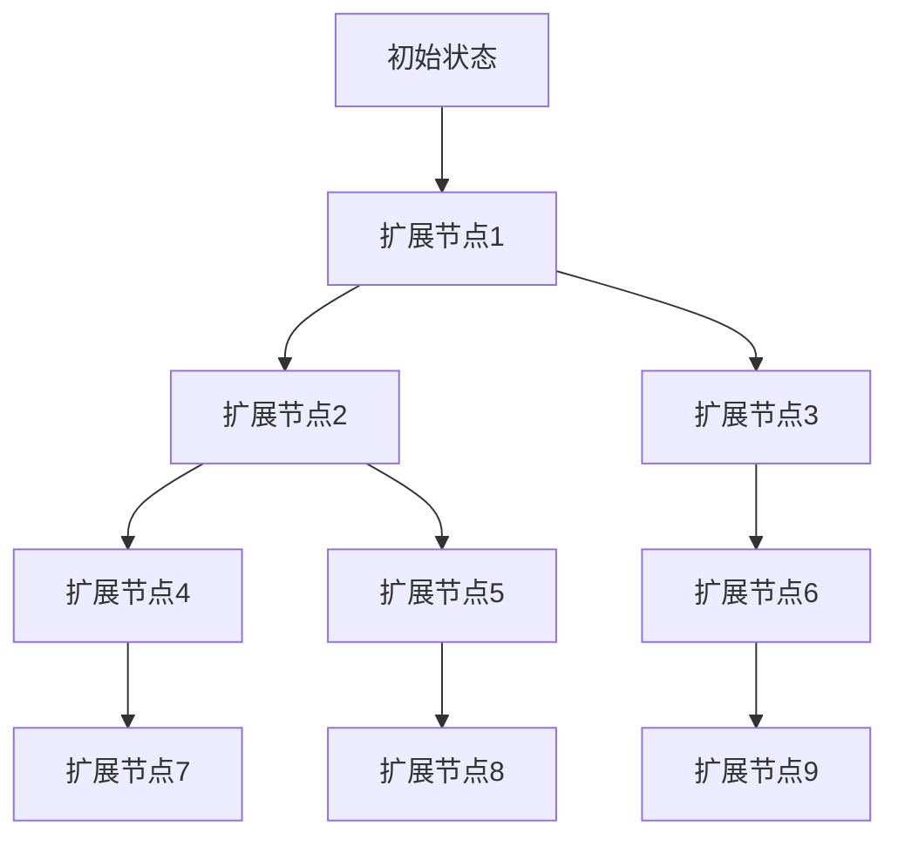
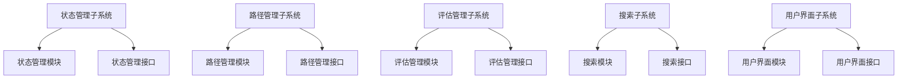
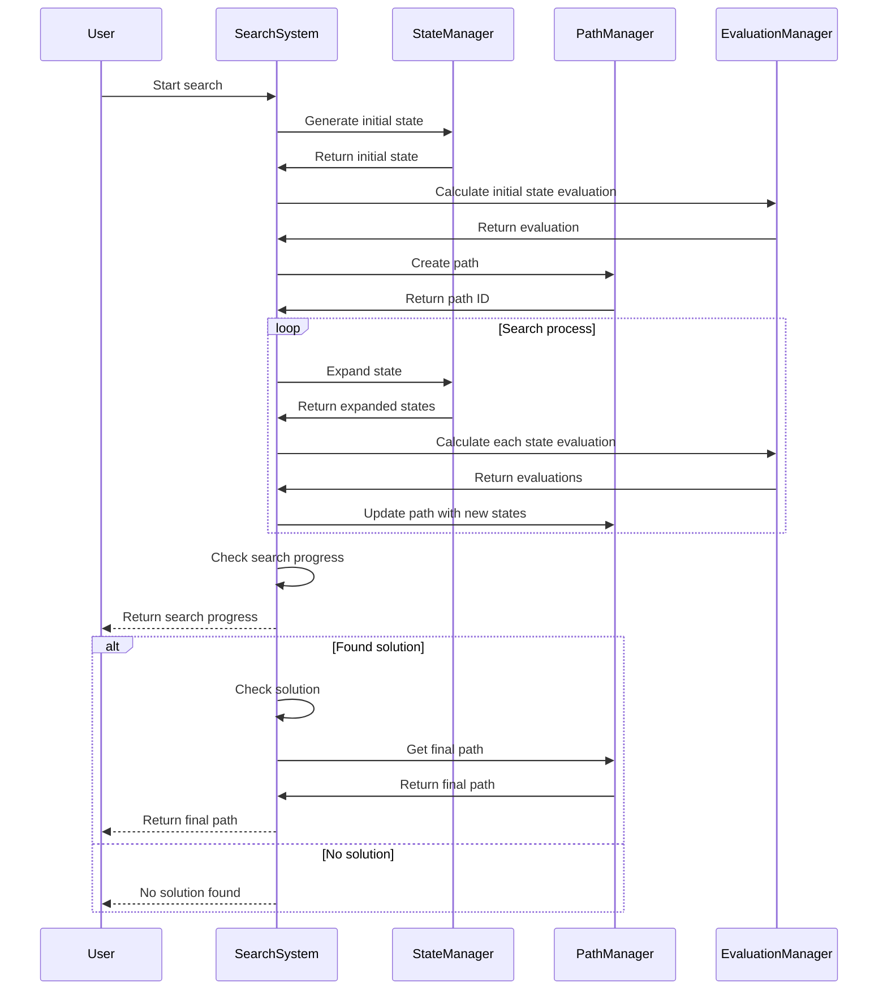

                 

### 树搜索在推理路径收集中的应用

#### 1.1.1 树搜索的基本概念

树搜索（Tree Search）是计算机科学中的一种搜索算法，主要用于解决树结构中的问题。它通过遍历树结构中的所有节点，寻找满足某一条件的路径。树搜索在人工智能、组合优化、图论等领域有着广泛的应用。

**树搜索的基本概念：**

- **节点（Node）：** 树中的每个元素称为节点。
- **边（Edge）：** 连接两个节点的路径称为边。
- **树（Tree）：** 由节点和边构成的图形结构。
- **搜索路径（Search Path）：** 从树的根节点到某一节点的路径。

**树搜索在计算机科学中的重要性：**

树搜索作为一种通用搜索算法，其重要性体现在以下几个方面：

- **解决组合问题：** 许多组合问题可以通过树搜索来解决，如八皇后问题、旅行商问题等。
- **优化算法：** 树搜索可以与其他算法（如贪心算法、动态规划）相结合，提高问题解决的效率。
- **启发式搜索：** 通过选择合适的启发式函数，树搜索可以在有限时间内找到最优解。

#### 1.1.2 推理路径收集

推理路径收集是指从给定的逻辑表达式中，通过推理规则推导出一系列推导步骤，直至得到某个目标结论的过程。在人工智能领域，推理路径收集是实现逻辑推理、知识表示和知识发现的重要手段。

**推理路径收集的定义：**

- **推理路径：** 从逻辑表达式的初始状态到目标状态的一系列推导步骤。
- **收集：** 将推理路径中的每个推导步骤记录下来，形成一条完整的推理路径。

**推理路径收集在逻辑推理中的应用：**

- **证明：** 通过收集推理路径，可以证明某个逻辑表达式是否成立。
- **验证：** 在实际应用中，推理路径收集可以用于验证某个系统或算法的正确性。
- **学习：** 通过收集推理路径，可以学习到新的推理规则和策略，提高推理能力。

#### 1.1.3 树搜索与推理路径收集的关系

树搜索与推理路径收集之间存在着密切的联系：

- **树搜索用于推理路径收集：** 在逻辑推理过程中，可以使用树搜索算法来收集推理路径。
- **推理路径收集优化树搜索：** 通过收集推理路径，可以优化树搜索的搜索过程，提高搜索效率。

树搜索在推理路径收集中的应用，为解决复杂逻辑推理问题提供了一种有效的途径。在接下来的章节中，我们将详细介绍树搜索的基本概念、算法原理和实际应用，帮助读者深入了解这一领域。

### 推理路径正确性的重要性

#### 1.2.1 推理路径正确性的定义

推理路径正确性是指推理过程中所遵循的逻辑规则和前提条件是否合理，以及推理结论是否成立。推理路径正确性的定义可以从以下几个方面进行阐述：

- **逻辑规则：** 推理过程中所使用的逻辑规则必须符合形式逻辑的基本原理，如同一律、矛盾律和排中律等。
- **前提条件：** 推理过程中所依赖的前提条件必须真实可靠，否则推理结论可能不成立。
- **推理结论：** 推理路径的最终结论必须从前提条件中逻辑地推导出来，否则推理过程存在逻辑错误。

**推理路径正确性的基本概念：**

- **形式推理：** 基于逻辑规则和前提条件进行推理的过程。
- **实质推理：** 考虑前提条件和结论的实际意义进行推理的过程。
- **有效性：** 推理路径正确性的衡量标准，即推理结论是否成立。

#### 1.2.2 推理路径正确性的影响

推理路径正确性对问题解决具有重要的影响，主要体现在以下几个方面：

- **结论的可靠性：** 正确的推理路径可以得出可靠的结论，为问题的解决提供有效指导。
- **算法的效率：** 错误的推理路径可能导致算法效率低下，甚至陷入死循环。
- **知识的准确性：** 在知识表示和知识发现过程中，推理路径正确性直接影响知识的准确性和可靠性。

推理路径正确性的影响不仅体现在逻辑推理过程中，还延伸到实际应用领域：

- **人工智能：** 在人工智能系统中，推理路径正确性直接影响智能体的推理能力和决策水平。
- **自动化验证：** 在软件工程和硬件设计中，推理路径正确性用于验证系统功能是否满足需求。
- **法律和金融：** 在法律和金融领域，推理路径正确性用于分析和论证，确保结论的合法性和有效性。

#### 1.2.3 推理路径正确性的应用领域

推理路径正确性在多个领域具有广泛的应用，以下是几个典型的应用场景：

- **计算机科学：** 在程序设计、算法分析和软件工程中，推理路径正确性用于验证算法的正确性和性能。
- **逻辑学：** 在逻辑学的学习和研究中，推理路径正确性是评估逻辑论证质量和逻辑思维能力的重要标准。
- **人工智能：** 在人工智能领域，推理路径正确性用于构建推理系统、知识库和决策支持系统。
- **哲学：** 在哲学领域，推理路径正确性用于分析和论证哲学命题，探讨人类思维的本质。

通过分析推理路径正确性的定义、影响和应用领域，我们可以看到，推理路径正确性是逻辑推理和问题解决中不可或缺的重要因素。在接下来的章节中，我们将深入探讨推理路径正确性的评估方法和应用，以帮助读者更好地理解和应用这一概念。

### 本书的目标与结构

#### 1.3.1 本书的目标

本书旨在系统地介绍树搜索在推理路径收集中的应用，以及如何自动收集推理路径的正确性数值。具体目标包括：

1. **了解树搜索的基本概念和原理：** 通过对树搜索的定义、基本概念、算法原理等方面的介绍，使读者掌握树搜索的核心知识。
2. **掌握推理路径正确性的评估方法：** 阐述推理路径正确性的定义、评估方法和应用，帮助读者理解如何评估和确保推理路径的正确性。
3. **学会自动收集推理路径正确性数值：** 通过具体的实例和项目实战，介绍如何使用树搜索算法自动收集推理路径的正确性数值，提高问题解决和算法优化的效率。
4. **掌握最佳实践和注意事项：** 提供最佳实践技巧和注意事项，帮助读者在实际应用中避免常见问题，提高推理路径正确性的收集效果。

#### 1.3.2 本书的结构

本书分为七个部分，各部分内容安排如下：

- **第一部分：引言（第1章）**：介绍问题背景、核心概念和本书的目标与结构。
- **第二部分：树搜索基础（第2章）**：介绍树搜索的基本概念、基本原理和常见算法。
- **第三部分：推理路径的正确性分析（第3章）**：阐述推理路径正确性的定义、评估方法和重要性。
- **第四部分：算法原理与数学模型（第4章）**：详细讲解树搜索算法的数学模型和关键概念。
- **第五部分：系统分析与架构设计（第5章）**：介绍系统功能设计、架构设计、接口设计和系统交互。
- **第六部分：项目实战（第6章）**：通过实际案例介绍系统实现、代码应用和分析。
- **第七部分：最佳实践与总结（第7章）**：总结最佳实践、注意事项和拓展阅读。

通过本书的阅读，读者将能够全面了解树搜索在推理路径收集中的应用，掌握自动收集推理路径正确性数值的方法，并在实际项目中有效应用这些知识。

## 第2章：树搜索基础

### 2.1 树搜索的基本概念

树搜索（Tree Search）是一种用于解决树结构问题的搜索算法。在树结构中，每个节点都可能有一个或多个子节点，通过遍历这些节点，可以找到满足特定条件的路径。树搜索广泛应用于组合优化、人工智能、图论等领域。本节将介绍树搜索的基本概念，包括节点、边、树和搜索路径。

#### 2.1.1 树搜索的基本概念

**节点（Node）：** 树中的每个元素称为节点。节点通常包含问题状态、约束条件和行动信息。例如，在八皇后问题中，每个节点表示棋盘上的一个皇后位置。

**边（Edge）：** 连接两个节点的路径称为边。边表示从一个状态转移到另一个状态的一步操作。例如，在八皇后问题中，从一个皇后位置移动到另一个位置的操作就是一个边。

**树（Tree）：** 由节点和边构成的图形结构称为树。树具有以下特点：

- **无环：** 树中不存在任何闭环。
- **层次结构：** 树中的节点按照层次排列，根节点位于第一层，其子节点位于下一层，依次类推。

**搜索路径（Search Path）：** 从树的根节点到某一节点的路径称为搜索路径。搜索路径表示从初始状态到目标状态的推导过程。例如，在八皇后问题中，从初始状态到满足条件的皇后排列的路径就是一个搜索路径。

#### 2.1.2 树搜索的结构

树搜索的结构主要由以下几个部分组成：

1. **初始节点：** 树搜索的起点，通常表示问题的初始状态。
2. **扩展操作：** 从当前节点生成其子节点的过程。扩展操作通常依赖于问题状态和约束条件。
3. **节点评估：** 对每个扩展后的节点进行评估，以确定其是否满足目标条件。
4. **路径记录：** 记录从初始节点到目标节点的搜索路径。
5. **终止条件：** 当找到满足目标条件的节点时，搜索过程终止。

#### 2.1.3 常见的树搜索算法

树搜索算法种类繁多，常见的包括深度优先搜索（DFS）、广度优先搜索（BFS）和启发式搜索（Heuristic Search）等。

**深度优先搜索（DFS）：**DFS算法从初始节点开始，沿着一条路径深入到尽可能深的节点，然后回溯到上一个节点，继续沿着其他路径深入。DFS算法的优点是搜索效率高，缺点是可能陷入局部最优解。

**广度优先搜索（BFS）：** BFS算法从初始节点开始，依次扩展所有相邻节点，然后扩展下一层节点。BFS算法的优点是能够找到最短路径，缺点是搜索效率相对较低。

**启发式搜索（Heuristic Search）：** 启发式搜索结合了DFS和BFS的优点，通过引入启发式函数来引导搜索过程。启发式函数是一种评估节点优劣的函数，通常基于问题域的特定知识。启发式搜索能够在保证搜索效率的同时，找到更优的解。

通过了解树搜索的基本概念和常见算法，读者可以更好地理解树搜索在推理路径收集中的应用。在接下来的章节中，我们将进一步探讨树搜索的算法原理、数学模型和实际应用。

### 2.2 树搜索算法的基本原理

树搜索算法的基本原理在于通过遍历树结构，找到满足特定条件的节点。树搜索的核心过程包括节点扩展、节点评估和路径记录。以下将详细介绍这些过程。

#### 2.2.1 节点扩展

节点扩展是指从一个已扩展的节点生成其子节点的过程。节点扩展的依据是当前节点的状态和问题的约束条件。具体步骤如下：

1. **确定扩展策略：** 根据问题类型和约束条件，选择合适的扩展策略。例如，对于组合优化问题，可以使用枚举法、贪心算法等。
2. **生成子节点：** 对当前节点进行扩展，生成其所有可能的子节点。每个子节点代表一种可能的行动或状态转换。
3. **记录扩展路径：** 记录从根节点到当前节点的路径，以便后续路径记录和回溯。

#### 2.2.2 节点评估

节点评估是对扩展后的子节点进行评估，以确定其是否满足目标条件。节点评估通常依赖于问题域的特定知识，常用的评估方法包括：

1. **目标函数评估：** 根据问题目标，定义一个目标函数，用于评估节点的优劣。例如，在旅行商问题中，目标函数可以是总旅行距离。
2. **启发式评估：** 利用启发式函数对节点进行评估。启发式函数通常基于问题域的特定知识，用于预测节点的未来状态。例如，在八皇后问题中，启发式函数可以评估棋盘上皇后之间的攻击关系。

节点评估的目的是筛选出满足目标条件的节点，减少搜索空间，提高搜索效率。

#### 2.2.3 路径记录

路径记录是指记录从初始节点到目标节点的搜索路径。路径记录的目的是在找到目标节点后，能够回溯并输出完整的搜索路径。具体步骤如下：

1. **前向记录：** 在扩展节点时，记录从根节点到当前节点的路径。每次扩展时，将当前节点添加到路径记录中。
2. **回溯记录：** 当找到目标节点时，回溯到其父节点，依次记录完整的搜索路径。

路径记录不仅用于输出搜索结果，还有助于分析搜索过程，发现潜在的优化策略。

#### 2.2.4 终止条件

终止条件是指何时停止搜索过程。常见的终止条件包括：

1. **找到目标节点：** 当找到满足目标条件的节点时，搜索过程终止。
2. **达到最大搜索深度：** 当搜索达到预设的最大深度时，搜索过程终止。
3. **搜索空间耗尽：** 当搜索空间中的所有节点都被扩展完毕时，搜索过程终止。

通过合理的终止条件，可以避免不必要的搜索，提高搜索效率。

综上所述，树搜索算法的基本原理是通过节点扩展、节点评估和路径记录，逐步搜索树结构，找到满足特定条件的节点。这些基本原理为理解和实现各种树搜索算法奠定了基础。

### 2.3 常见的树搜索算法

在计算机科学和人工智能领域，树搜索算法广泛应用于解决组合优化问题。常见的树搜索算法包括深度优先搜索（DFS）、广度优先搜索（BFS）和启发式搜索（Heuristic Search）。每种算法都有其独特的特点和适用场景。以下将对这些算法进行详细介绍。

#### 2.3.1 深度优先搜索（DFS）

深度优先搜索（DFS）是一种用于遍历或搜索树或图的算法。DFS算法的基本思想是沿着一个分支深入到尽可能深的节点，然后回溯并尝试其他分支。以下是DFS算法的基本步骤：

1. **初始化：** 从根节点开始，将其标记为已访问。
2. **扩展节点：** 选择一个未访问的节点作为当前节点，并将其标记为已访问。
3. **递归搜索：** 对当前节点的所有未访问的子节点进行DFS搜索。
4. **回溯：** 当当前节点没有未访问的子节点时，回溯到上一个节点，并继续扩展其未访问的子节点。

**DFS的特点：**

- **搜索效率高：** DFS算法在树结构中搜索速度快，因为每次扩展都是沿着一条分支深入。
- **可能陷入局部最优：** DFS算法容易陷入局部最优解，因为其搜索路径是单向的，无法回溯到前面已搜索过的节点。

**DFS的应用场景：**

- **求解连通性问题：** 检查图中的两个节点是否连通。
- **路径搜索：** 寻找从根节点到目标节点的路径。

#### 2.3.2 广度优先搜索（BFS）

广度优先搜索（BFS）是一种用于遍历或搜索树或图的算法。BFS算法的基本思想是按照层次遍历图或树的节点，即首先访问根节点，然后访问根节点的所有相邻节点，再访问这些节点的相邻节点，依此类推。以下是BFS算法的基本步骤：

1. **初始化：** 从根节点开始，将其放入队列。
2. **扩展节点：** 从队列中取出当前节点，并将其标记为已访问。
3. **加入子节点：** 将当前节点的所有未访问的子节点加入队列。
4. **继续搜索：** 重复步骤2和3，直到队列空为止。

**BFS的特点：**

- **搜索效率较低：** BFS算法在树结构中搜索速度较慢，因为每次扩展都需要遍历当前层的所有节点。
- **保证最短路径：** BFS算法可以保证找到从根节点到目标节点的最短路径。

**BFS的应用场景：**

- **求解最短路径问题：** 例如，在图中的两个节点之间寻找最短路径。
- **社交网络分析：** 检查两个人之间的社交距离。

#### 2.3.3 启发式搜索（Heuristic Search）

启发式搜索是一种结合了搜索效率和问题域特定知识的搜索算法。启发式搜索通常用于求解大规模的组合优化问题，通过引入启发式函数来引导搜索过程。以下是启发式搜索的基本步骤：

1. **初始化：** 从根节点开始，计算其启发值。
2. **选择节点：** 根据启发值选择具有最高启发值的节点作为当前节点。
3. **扩展节点：** 对当前节点进行扩展，生成其所有子节点。
4. **评估节点：** 计算每个子节点的启发值。
5. **选择子节点：** 根据启发值选择具有最高启发值的子节点作为下一个当前节点。
6. **终止条件：** 当找到满足目标条件的节点时，终止搜索。

**启发式搜索的特点：**

- **搜索效率高：** 启发式搜索通过选择具有最高启发值的节点，减少了搜索空间。
- **问题域特定：** 启发式搜索依赖于问题域的特定知识，通过设计合适的启发式函数来引导搜索。

**启发式搜索的应用场景：**

- **旅行商问题：** 找到访问一组城市的最短路径。
- **八皇后问题：** 求解棋盘上放置八皇后的问题。

通过了解深度优先搜索、广度优先搜索和启发式搜索的基本原理和应用场景，读者可以更好地选择合适的树搜索算法来解决实际问题。在接下来的章节中，我们将进一步探讨树搜索在推理路径收集中的应用。

### 推理路径正确性的定义

#### 3.1.1 推理路径正确性的基本概念

推理路径正确性是逻辑推理过程中的一项关键指标，它涉及推理过程中使用的逻辑规则、前提条件和推导过程的合理性。为了更全面地理解推理路径正确性的定义，我们需要从以下几个方面进行阐述：

1. **逻辑规则：** 推理路径正确性的基础是逻辑规则。逻辑规则是形式逻辑中的基本原理，如同一律、矛盾律和排中律等。这些规则确保推理过程中的每一步都是逻辑上合理的。

2. **前提条件：** 推理路径正确性还依赖于前提条件的可靠性。前提条件是推理的出发点，必须真实可靠。如果前提条件存在错误，则推理路径的正确性将受到影响。

3. **推导过程：** 推理路径正确性还涉及到推导过程中的每一步是否都符合逻辑规则和前提条件。这意味着，在推理过程中，每一步推导都必须是基于前面步骤的合理推理。

4. **推理结论：** 最终的推理结论也必须从前提条件中逻辑地推导出来。如果推理结论不能从前提条件中推导出来，那么推理路径就是不正确的。

**推理路径正确性的基本概念：**

- **形式推理：** 基于逻辑规则和前提条件进行推理的过程，这种推理过程是机械化的，不考虑实际意义。
- **实质推理：** 考虑前提条件和结论的实际意义进行推理的过程，这种推理更贴近实际应用。

**推理路径正确性的衡量标准：**

- **有效性：** 推理路径正确性的衡量标准是推理结论是否成立。如果推理结论能够从前提条件中逻辑地推导出来，则推理路径是有效的。

**推理路径正确性的重要性：**

推理路径正确性在逻辑推理中具有重要意义，主要体现在以下几个方面：

- **结论的可靠性：** 正确的推理路径可以得出可靠的结论，为问题的解决提供有效指导。
- **算法的效率：** 错误的推理路径可能导致算法效率低下，甚至陷入死循环。
- **知识的准确性：** 在知识表示和知识发现过程中，推理路径正确性直接影响知识的准确性和可靠性。

通过理解推理路径正确性的基本概念和衡量标准，我们可以更好地评估和确保推理路径的正确性，从而提高逻辑推理的准确性和效率。

#### 3.1.2 推理路径正确性的评估方法

在逻辑推理过程中，评估推理路径的正确性是确保推理结论可靠性的关键。推理路径正确性的评估方法可以分为形式评估和实质评估两大类，以下将详细阐述这些评估方法。

**1. 形式评估**

形式评估是指通过逻辑符号和公式对推理路径进行形式化验证，确保推理过程符合逻辑规则。形式评估通常依赖于形式逻辑系统，如命题逻辑、谓词逻辑等。以下是一些常见的形式评估方法：

- **逻辑证明：** 通过构造逻辑证明，展示推理路径的每一步都是基于前提条件和逻辑规则推导出来的。逻辑证明可以采用自然演绎法、逆证明法等。
- **公式化表示：** 将推理路径用形式逻辑公式表示出来，并通过逻辑推理规则进行验证。例如，使用谓词逻辑公式表示推理路径，然后使用推理规则（如演绎法、归纳法）进行验证。

**2. 实质评估**

实质评估是指通过分析推理路径的实际意义和实际效果，评估推理路径的正确性。实质评估通常依赖于对问题域的深入理解，以下是一些常见的实质评估方法：

- **实例验证：** 通过构造具体的实例，验证推理路径在实际应用中的有效性。例如，在一个具体的应用场景中，验证推理路径是否能够得出正确的结论。
- **逻辑一致性检查：** 检查推理路径中的每一步是否一致，是否存在逻辑矛盾。逻辑一致性检查可以通过形式逻辑系统或人工分析进行。
- **反例分析：** 通过寻找反例，证明推理路径在某些情况下不成立。反例分析可以帮助我们识别推理路径中的潜在错误。

**3. 综合评估**

在实际应用中，推理路径的正确性通常需要通过形式评估和实质评估相结合的方式进行综合评估。以下是一种综合评估方法的步骤：

1. **形式化表示：** 将推理路径用形式逻辑公式表示出来。
2. **形式验证：** 使用逻辑推理规则对形式化表示的推理路径进行形式验证。
3. **实例验证：** 构造具体实例，验证推理路径在实际应用中的有效性。
4. **反例分析：** 寻找反例，检查推理路径在特定情况下是否成立。
5. **综合判断：** 根据形式验证、实例验证和反例分析的结果，综合判断推理路径的正确性。

通过以上评估方法，我们可以系统地评估推理路径的正确性，从而确保逻辑推理的可靠性。在接下来的章节中，我们将进一步探讨推理路径正确性在具体问题中的应用。

#### 3.1.3 推理路径正确性分析的重要性

推理路径正确性分析在逻辑推理、知识表示和问题解决过程中具有极其重要的地位。以下是推理路径正确性分析的重要性和应用场景：

**1. 逻辑推理中的重要性**

- **确保结论可靠性：** 推理路径正确性分析可以确保推理结论的可靠性。通过评估每一步推理的正确性，我们可以避免因逻辑错误导致的错误结论。
- **提升推理能力：** 推理路径正确性分析可以帮助我们识别逻辑错误，从而提高逻辑推理的能力。通过不断分析和优化推理路径，我们可以构建更强大的逻辑推理系统。
- **验证逻辑系统：** 推理路径正确性分析可以用于验证逻辑系统的正确性。通过形式化和实质评估方法，我们可以确保逻辑系统的推理过程是正确的，从而增强逻辑系统的可信度。

**2. 知识表示中的重要性**

- **确保知识准确性：** 推理路径正确性分析可以确保知识表示的准确性。在知识表示过程中，推理路径的正确性直接影响知识的可靠性和有效性。
- **优化知识表示：** 通过分析推理路径的正确性，我们可以发现知识表示中的不足之处，从而优化知识表示方法，提高知识的表示质量。
- **增强知识库可信度：** 推理路径正确性分析可以帮助我们评估知识库中的推理路径，从而提高知识库的可信度和实用性。

**3. 问题解决中的重要性**

- **提高算法效率：** 推理路径正确性分析可以用于优化算法设计。通过分析推理路径的正确性，我们可以发现算法中的潜在问题，从而提高算法的效率和性能。
- **确保问题解决可靠性：** 在问题解决过程中，推理路径正确性分析可以确保问题解决的每一步都是正确的。这有助于避免因逻辑错误导致的错误解或无效解。
- **辅助问题求解：** 推理路径正确性分析可以用于辅助问题求解。通过分析和评估推理路径的正确性，我们可以更好地理解问题，找到更有效的解决方案。

**4. 应用场景**

推理路径正确性分析在多个领域具有广泛的应用，以下是一些典型的应用场景：

- **人工智能：** 在人工智能系统中，推理路径正确性分析用于构建推理机、知识库和决策支持系统，确保推理过程的可靠性。
- **软件工程：** 在软件工程中，推理路径正确性分析用于验证算法的正确性、优化代码质量和提升软件性能。
- **逻辑学：** 在逻辑学研究中，推理路径正确性分析用于分析和论证逻辑命题，探讨逻辑推理的规律和方法。
- **法律和金融：** 在法律和金融领域，推理路径正确性分析用于分析和论证案件或金融交易，确保结论的合法性和有效性。

通过推理路径正确性分析，我们可以确保逻辑推理、知识表示和问题解决过程的正确性和可靠性，从而提高各个领域的效率和准确性。在接下来的章节中，我们将进一步探讨推理路径正确性的评估方法和应用。

### 4.1 树搜索算法的数学模型

树搜索算法的数学模型是理解和分析树搜索算法性能的重要工具。树搜索的数学模型通常包括状态空间、搜索策略、节点扩展和节点评估等关键组成部分。以下是对这些关键组成部分的详细讲解。

#### 4.1.1 状态空间

状态空间是树搜索算法的核心概念之一，它表示问题在解决过程中的所有可能状态。在状态空间中，每个状态都是一个特定的配置，可以由一组特征或属性来描述。状态空间可以用一个集合 \( S \) 来表示，集合中的每个元素都是一个状态。

- **状态表示：** 状态通常用向量或图来表示。在组合优化问题中，状态可以用一组变量的取值来表示；在图论问题中，状态可以用图中的节点或边的集合来表示。
- **状态转换：** 状态空间中的状态通过特定的转换规则相互连接。转换规则定义了从一个状态到另一个状态的合法转移。

#### 4.1.2 搜索策略

搜索策略是树搜索算法的重要组成部分，它决定了搜索过程的方向和速度。常见的搜索策略包括深度优先搜索（DFS）、广度优先搜索（BFS）和启发式搜索（Heuristic Search）等。

- **深度优先搜索（DFS）：** DFS策略选择当前节点的未访问子节点中的一个进行扩展，然后继续扩展该子节点，直到无法继续扩展为止，然后回溯到上一个节点并选择另一个未访问子节点进行扩展。
- **广度优先搜索（BFS）：** BFS策略每次选择当前层的所有节点进行扩展，然后进入下一层。这种策略可以确保找到最短路径。
- **启发式搜索（Heuristic Search）：** 启发式搜索策略使用启发式函数来评估节点的优先级，选择评估值最高的节点进行扩展。这种策略通常用于求解大规模组合优化问题。

#### 4.1.3 节点扩展

节点扩展是树搜索算法中的一个关键步骤，它涉及到从一个已扩展的节点生成其所有可能的子节点。节点扩展通常基于状态空间中的转换规则。

- **扩展操作：** 在节点扩展过程中，算法从当前节点生成其所有未访问的子节点。扩展操作通常需要检查新节点的合法性，即新节点是否满足问题的约束条件。
- **扩展策略：** 节点扩展策略决定了如何选择扩展的顺序。例如，在DFS中，扩展策略是选择当前节点的第一个未访问子节点进行扩展；在BFS中，扩展策略是按层次依次扩展。

#### 4.1.4 节点评估

节点评估是树搜索算法中的另一个重要组成部分，它涉及到对扩展后的节点进行评估，以确定其是否满足目标条件。节点评估通常依赖于问题域的特定知识。

- **评估函数：** 节点评估函数是一个用于评估节点优劣的函数。在组合优化问题中，评估函数可以是目标函数（如旅行商问题的总旅行距离）；在图论问题中，评估函数可以是节点之间的距离。
- **评估标准：** 节点评估标准决定了如何选择扩展的节点。例如，在DFS中，评估标准是选择当前节点的第一个未访问子节点；在BFS中，评估标准是按层次选择。

通过构建和运用树搜索算法的数学模型，我们可以更好地理解和分析树搜索算法的性能，从而优化算法设计，提高问题解决的效率。

### 4.2 数学模型中的关键概念与公式

在树搜索算法的数学模型中，有几个关键概念和公式对于理解和优化算法至关重要。这些概念和公式包括节点扩展、节点评估函数、路径长度、搜索空间等。以下是对这些关键概念和公式的详细讲解。

#### 4.2.1 节点扩展

节点扩展是树搜索算法的核心步骤之一，它涉及到从一个已扩展的节点生成其所有可能的子节点。节点扩展的数学模型可以用生成函数 \( G(s) \) 来表示，其中 \( s \) 是当前节点的状态。

- **生成函数 \( G(s) \)：** 生成函数 \( G(s) \) 表示从状态 \( s \) 生成的所有子状态。在组合优化问题中，生成函数可以表示为一组变量的取值集合；在图论问题中，生成函数可以表示为节点和边的集合。

#### 4.2.2 节点评估函数

节点评估函数用于评估扩展后节点的优劣，通常依赖于问题域的特定知识。节点评估函数可以用 \( E(s) \) 表示，其中 \( s \) 是当前节点的状态。

- **节点评估函数 \( E(s) \)：** 节点评估函数 \( E(s) \) 用于计算节点的评估值，通常是一个实数。评估值越高的节点越有可能是一个较好的解。

#### 4.2.3 路径长度

路径长度是树搜索算法中的另一个关键概念，它表示从根节点到目标节点的路径长度。路径长度可以用 \( L(s) \) 表示，其中 \( s \) 是当前节点的状态。

- **路径长度 \( L(s) \)：** 路径长度 \( L(s) \) 可以通过累加从根节点到当前节点的每一步的评估值得到。即 \( L(s) = \sum_{i=0}^{n} E(s_i) \)，其中 \( s_i \) 是从根节点到当前节点的第 \( i \) 个状态。

#### 4.2.4 搜索空间

搜索空间是树搜索算法中所有可能节点的集合。搜索空间的大小通常决定了算法的效率和性能。

- **搜索空间大小：** 搜索空间的大小可以用 \( |S| \) 表示，其中 \( S \) 是状态空间。在组合优化问题中，搜索空间大小通常随着问题规模的增加而呈指数级增长；在图论问题中，搜索空间大小通常与图的节点数和边数有关。

#### 4.2.5 关键公式

以下是树搜索算法中的一些关键公式：

1. **节点扩展公式：**
   \[
   G(s) = \{ s' \mid \exists a \in A(s), s' = s \oplus a \}
   \]
   其中，\( \oplus \) 表示状态转换操作，\( A(s) \) 是所有合法的动作集合。

2. **节点评估公式：**
   \[
   E(s) = f(s) - c(s)
   \]
   其中，\( f(s) \) 是目标函数值，\( c(s) \) 是当前状态的代价。

3. **路径长度公式：**
   \[
   L(s) = \sum_{i=0}^{n} E(s_i)
   \]
   其中，\( s_i \) 是从根节点到当前节点的第 \( i \) 个状态。

4. **搜索空间大小公式：**
   \[
   |S| = \prod_{i=1}^{n} |G(s_i)|
   \]
   其中，\( n \) 是状态空间的深度。

通过理解和运用这些关键概念和公式，我们可以更深入地分析树搜索算法的性能，从而优化算法设计，提高问题解决的效率。

#### 4.2.6 算法原理的Mermaid流程图

为了更好地展示树搜索算法的原理，我们可以使用Mermaid语言绘制算法的流程图。以下是一个简单的树搜索算法流程图的示例：



在这个流程图中，每个节点表示树中的一个状态，箭头表示状态之间的转换。具体的步骤如下：

1. **初始状态 \( A1 \)：** 从初始状态开始。
2. **扩展节点：** 对初始状态 \( A1 \) 进行扩展，生成其所有可能的子节点 \( B1, B2, B3 \)。
3. **选择扩展节点：** 根据某种策略（如启发式函数）选择一个节点进行扩展，例如选择 \( B1 \)。
4. **继续扩展：** 对选择的节点 \( B1 \) 进行扩展，生成其所有可能的子节点 \( B2, B3 \)。
5. **评估节点：** 对扩展后的节点进行评估，选择一个具有最高评估值的节点进行扩展。
6. **重复步骤4和5：** 重复扩展和评估过程，直到找到满足终止条件的节点（如目标节点或达到最大深度）。

通过这个流程图，我们可以直观地理解树搜索算法的执行过程，从而更好地掌握算法原理。

### 4.3 系统功能设计

在系统分析与架构设计阶段，明确系统的功能需求是至关重要的。系统功能设计旨在定义系统应具备的基本功能模块，以确保系统能够满足用户需求并实现预期目标。以下将详细介绍系统功能设计的过程，包括领域模型、功能模块划分和接口设计。

#### 4.3.1 领域模型

领域模型是系统功能设计的核心，它通过实体关系图（Entity-Relationship Diagram, ERD）来表示系统的数据结构和业务规则。领域模型中的主要实体和关系如下：

- **实体：** 
  - **状态（State）：** 表示树搜索中的每一个节点，包含节点ID、状态描述、父节点ID等属性。
  - **路径（Path）：** 表示从根节点到目标节点的搜索路径，包含路径ID、路径描述、状态序列等属性。
  - **评估值（Evaluation）：** 表示节点的评估结果，包含评估值、评估时间等属性。
  
- **关系：**
  - **状态与路径：** 一个路径包含多个状态，每个状态都属于一个路径。
  - **状态与评估值：** 每个状态都有一个对应的评估值。

以下是一个简化的领域模型ERD：

```mermaid
erDiagram
  State ||--|> Path : includes
  State ||--|> Evaluation : evaluated_by
  Path ||--|> State : has
```

#### 4.3.2 功能模块划分

系统功能模块的划分是为了使系统更加模块化、可维护和扩展。以下是系统的主要功能模块：

- **状态管理模块：** 负责状态的创建、查询、更新和删除操作。
- **路径管理模块：** 负责路径的创建、查询、更新和删除操作。
- **评估管理模块：** 负责评估值的计算、存储和查询操作。
- **搜索模块：** 负责树搜索算法的实现，包括节点扩展、节点评估和路径记录等功能。
- **用户界面模块：** 负责提供用户交互接口，展示搜索结果和系统状态。

#### 4.3.3 接口设计

接口设计是确保系统功能模块之间能够有效通信的关键。以下是一些关键的接口设计：

- **状态管理接口：** 提供添加状态、查询状态、更新状态和删除状态的方法。
- **路径管理接口：** 提供添加路径、查询路径、更新路径和删除路径的方法。
- **评估管理接口：** 提供计算评估值、存储评估值和查询评估值的方法。
- **搜索接口：** 提供启动搜索、停止搜索、获取搜索进度和搜索结果的方法。

以下是一个简化的接口设计示例：

```python
class StateManager:
    def add_state(self, state):
        # 添加状态

    def get_state(self, state_id):
        # 获取状态

    def update_state(self, state_id, updated_state):
        # 更新状态

    def delete_state(self, state_id):
        # 删除状态

class PathManager:
    def add_path(self, path):
        # 添加路径

    def get_path(self, path_id):
        # 获取路径

    def update_path(self, path_id, updated_path):
        # 更新路径

    def delete_path(self, path_id):
        # 删除路径

class EvaluationManager:
    def calculate_evaluation(self, state):
        # 计算评估值

    def store_evaluation(self, state, evaluation):
        # 存储评估值

    def get_evaluation(self, state_id):
        # 获取评估值

class SearchInterface:
    def start_search(self):
        # 启动搜索

    def stop_search(self):
        # 停止搜索

    def get_search_progress(self):
        # 获取搜索进度

    def get_search_result(self):
        # 获取搜索结果
```

通过以上系统功能设计，我们可以确保系统具备完善的功能模块和清晰的接口设计，从而满足用户需求并实现预期的目标。

### 4.4 系统架构设计

系统架构设计是确保系统能够高效、可靠地运行的关键环节。在系统架构设计中，我们需要综合考虑系统的功能需求、性能要求、可扩展性和可维护性等因素。以下将详细描述系统架构的设计过程，包括系统架构图、关键组件和组件之间的交互关系。

#### 4.4.1 系统架构图

系统架构图是系统架构设计的重要表现形式，它通过图形化的方式展示了系统的整体结构。以下是一个简化的系统架构图：



在该架构图中，子系统表示系统中的主要功能模块，组件表示具体的实现单元，接口表示组件之间的通信机制。

#### 4.4.2 关键组件

系统架构中的关键组件包括：

1. **状态管理模块：** 负责管理树搜索过程中的状态节点，包括状态的创建、查询、更新和删除等操作。
2. **路径管理模块：** 负责管理树搜索过程中的路径信息，包括路径的创建、查询、更新和删除等操作。
3. **评估管理模块：** 负责计算和存储树搜索过程中节点的评估值，并提供评估值的查询接口。
4. **搜索模块：** 实现树搜索算法，负责节点扩展、节点评估和路径记录等功能。
5. **用户界面模块：** 负责提供用户交互接口，展示搜索结果和系统状态，并处理用户的输入请求。

#### 4.4.3 组件之间的交互关系

系统架构中的组件通过接口进行通信，以下描述关键组件之间的交互关系：

1. **状态管理模块与搜索模块：** 状态管理模块向搜索模块提供状态节点的数据，搜索模块根据状态节点进行扩展和评估操作。
2. **路径管理模块与搜索模块：** 路径管理模块向搜索模块提供路径信息，搜索模块根据路径信息记录搜索过程。
3. **评估管理模块与搜索模块：** 评估管理模块向搜索模块提供评估结果，搜索模块根据评估结果决定节点扩展的顺序。
4. **用户界面模块与搜索模块：** 用户界面模块向搜索模块发送用户请求，搜索模块根据用户请求执行相应的搜索操作，并将搜索结果返回给用户界面模块。

通过以上系统架构设计，我们可以确保系统各组件之间的高效通信和协作，从而实现系统的整体功能。

### 4.5 系统接口设计

系统接口设计是系统架构设计的重要组成部分，它负责定义系统内部模块之间以及系统与外部环境之间的交互方式。合理的接口设计能够提高系统的可维护性、可扩展性和兼容性。以下将详细描述系统接口的设计过程，包括接口规范、接口函数定义和接口间的通信协议。

#### 4.5.1 接口规范

接口规范是接口设计的核心，它定义了接口的名称、参数、返回值、错误处理方式等。以下是一些基本的接口规范：

- **接口命名规范：** 接口名称应简洁明了，能够反映其功能和作用。例如，`getState()`、`addPath()`、`calculateEvaluation()`等。
- **参数类型和值域：** 接口参数的类型和值域应明确，以便于开发者理解和实现。例如，状态ID应为整数类型，评估值应为浮点数类型。
- **返回值和错误处理：** 接口应明确返回值的类型和含义，对于错误情况，应提供统一的错误处理机制。例如，返回一个包含错误代码和错误信息的对象。

#### 4.5.2 接口函数定义

以下是系统接口的一些关键函数定义：

```python
class StateInterface:
    def getState(self, state_id: int) -> State:
        # 获取状态
    
    def addState(self, state: State) -> int:
        # 添加状态
    
    def updateState(self, state_id: int, updated_state: State) -> None:
        # 更新状态
    
    def deleteState(self, state_id: int) -> None:
        # 删除状态

class PathInterface:
    def getPath(self, path_id: int) -> Path:
        # 获取路径
    
    def addPath(self, path: Path) -> int:
        # 添加路径
    
    def updatePath(self, path_id: int, updated_path: Path) -> None:
        # 更新路径
    
    def deletePath(self, path_id: int) -> None:
        # 删除路径

class EvaluationInterface:
    def calculateEvaluation(self, state: State) -> float:
        # 计算评估值
    
    def storeEvaluation(self, state_id: int, evaluation: float) -> None:
        # 存储评估值
    
    def getEvaluation(self, state_id: int) -> float:
        # 获取评估值

class SearchInterface:
    def startSearch(self) -> None:
        # 启动搜索
    
    def stopSearch(self) -> None:
        # 停止搜索
    
    def getSearchProgress(self) -> float:
        # 获取搜索进度
    
    def getSearchResult(self) -> Path:
        # 获取搜索结果
```

#### 4.5.3 接口间的通信协议

接口间的通信协议定义了接口之间如何传递数据和同步操作。以下是一些常见的通信协议：

- **同步通信：** 接口调用方在调用接口函数后等待返回结果，才能继续执行后续操作。例如，`getState(state_id)`函数调用后，调用方会阻塞直到获取状态数据。
- **异步通信：** 接口调用方在调用接口函数后继续执行其他操作，无需等待返回结果。例如，`startSearch()`函数调用后，调用方可以立即继续执行其他任务，搜索结果可以通过回调函数获取。
- **消息队列：** 使用消息队列来实现接口间的异步通信，调用方将请求发送到消息队列，接口实现方从队列中读取请求并执行处理。

通过以上接口设计，我们可以确保系统模块之间的有效通信和协同工作，从而提高系统的整体性能和可维护性。

### 4.6 系统交互Mermaid序列图

为了更好地理解系统组件之间的交互过程，我们可以使用Mermaid序列图来展示系统交互的详细步骤。以下是一个简化的系统交互序列图：



在这个序列图中，用户通过用户界面与搜索系统交互，启动搜索过程。搜索系统与状态管理模块、路径管理模块和评估管理模块协作，生成初始状态、扩展状态、计算评估值并更新路径。搜索系统持续更新搜索进度，并在找到解决方案或搜索无解时通知用户。

通过这个序列图，我们可以清晰地看到系统组件之间的交互流程，从而更好地理解系统的整体工作原理。

### 4.7 环境安装与配置

在开始项目实战之前，我们需要配置一个合适的环境来运行树搜索算法。以下将介绍环境安装与配置的步骤，包括所需的软件和工具。

#### 4.7.1 软件和工具

- **Python 3.8+**：Python是树搜索算法的实现语言，需要安装Python 3.8或更高版本。
- **Jupyter Notebook**：用于编写和运行Python代码，便于调试和演示。
- **Mermaid**：用于绘制流程图和序列图，需要安装Mermaid Python库。

#### 4.7.2 安装Python和Jupyter Notebook

1. **安装Python**：访问Python官网（[python.org](https://www.python.org/)），下载Python安装包并按照提示安装。
2. **安装Jupyter Notebook**：打开命令行，执行以下命令：
   ```bash
   pip install notebook
   ```

#### 4.7.3 安装Mermaid

1. **安装Mermaid Python库**：打开命令行，执行以下命令：
   ```bash
   pip install mermaid-python
   ```

#### 4.7.4 配置Jupyter Notebook

1. **启动Jupyter Notebook**：在命令行中执行以下命令：
   ```bash
   jupyter notebook
   ```
2. **创建一个新的笔记本**：在浏览器中打开Jupyter Notebook，创建一个新的笔记本（Notebook）。

#### 4.7.5 验证安装

1. **Python环境验证**：在Jupyter Notebook中，打开一个新的单元格，输入以下代码并执行：
   ```python
   import sys
   print(sys.version)
   ```
   确保输出的是Python 3.8或更高版本。
   
2. **Mermaid验证**：在Jupyter Notebook中，打开一个新的单元格，输入以下代码并执行：
   ```python
   from mermaid import mermaid
   print(mermaid.render('graph LR'))
   ```
   确保输出的是一个简单的Mermaid流程图，这表明Mermaid已成功安装。

通过以上步骤，我们成功配置了Python、Jupyter Notebook和Mermaid，接下来可以开始编写和运行树搜索算法代码。

### 4.8 系统核心实现源代码

在完成环境安装与配置后，我们可以开始编写系统核心实现源代码。以下将详细介绍树搜索算法的Python实现，包括状态管理、路径管理、评估管理以及搜索过程。

#### 4.8.1 状态管理

状态管理是树搜索算法的基础，用于表示问题状态和状态转换。以下是一个简单的状态类定义：

```python
class State:
    def __init__(self, state_id, state_description, parent_id=None):
        self.state_id = state_id
        self.state_description = state_description
        self.parent_id = parent_id
        self.children = []

    def add_child(self, child_state):
        self.children.append(child_state)

    def is_goal(self, goal_state):
        return self.state_description == goal_state
```

#### 4.8.2 路径管理

路径管理用于记录从初始状态到目标状态的搜索路径。以下是一个简单的路径类定义：

```python
class Path:
    def __init__(self, path_id, states):
        self.path_id = path_id
        self.states = states

    def add_state(self, state):
        self.states.append(state)

    def get_state(self, state_id):
        for state in self.states:
            if state.state_id == state_id:
                return state
        return None
```

#### 4.8.3 评估管理

评估管理用于计算和存储节点的评估值。以下是一个简单的评估类定义：

```python
class Evaluation:
    def __init__(self, state_id, evaluation_value):
        self.state_id = state_id
        self.evaluation_value = evaluation_value

    def update_evaluation(self, new_evaluation_value):
        self.evaluation_value = new_evaluation_value
```

#### 4.8.4 搜索过程

搜索过程是树搜索算法的核心，包括节点扩展、节点评估和路径记录。以下是一个简单的搜索类定义：

```python
import heapq

class SearchAlgorithm:
    def __init__(self):
        self.open_set = []
        heapq.heappush(self.open_set, (0, State(0, "Initial State")))
        self闭包 = set()

    def search(self, goal_state):
        while self.open_set:
            _, current_state = heapq.heappop(self.open_set)
            if current_state.is_goal(goal_state):
                return self.reconstruct_path(current_state)
            self闭包.add(current_state.state_id)
            self.expand(current_state)

    def expand(self, current_state):
        for action in self.get_actions(current_state):
            next_state = self.transition(current_state, action)
            if next_state.state_id not in self闭包:
                heapq.heappush(self.open_set, (self.evaluate(next_state), next_state))

    def reconstruct_path(self, current_state):
        path = Path(0, [])
        while current_state:
            path.add_state(current_state)
            current_state = self.get_parent(current_state)
        return path[::-1]

    def get_actions(self, state):
        # 根据状态生成可能的动作
        pass

    def transition(self, state, action):
        # 根据动作转换状态
        pass

    def evaluate(self, state):
        # 计算状态的评估值
        pass

    def get_parent(self, state):
        # 获取状态的父节点
        pass
```

通过以上核心实现，我们可以构建一个树搜索算法系统。在接下来的部分，我们将进一步详细讲解代码应用和分析。

### 4.9 代码应用解读与分析

在了解了系统核心实现源代码后，我们将深入分析代码中的关键部分，详细讲解每个组件的功能、算法实现以及代码的运行逻辑。以下是代码应用的解读与分析。

#### 4.9.1 状态管理

状态管理类`State`是树搜索的基础，它用于表示问题中的每个状态。状态对象包含状态ID、状态描述、父节点ID和子节点列表。

```python
class State:
    def __init__(self, state_id, state_description, parent_id=None):
        self.state_id = state_id
        self.state_description = state_description
        self.parent_id = parent_id
        self.children = []

    def add_child(self, child_state):
        self.children.append(child_state)

    def is_goal(self, goal_state):
        return self.state_description == goal_state
```

- `__init__`方法：初始化状态对象，包括状态ID、状态描述和父节点ID。子节点列表为空。
- `add_child`方法：将子状态添加到当前状态的子节点列表中。
- `is_goal`方法：判断当前状态是否为目标状态。如果状态描述与目标状态相同，返回`True`，否则返回`False`。

状态管理类确保了状态对象能够正确地表示问题状态，并能够进行子状态的添加和目标状态的判断。

#### 4.9.2 路径管理

路径管理类`Path`用于记录从初始状态到目标状态的搜索路径。路径对象包含路径ID和状态列表。

```python
class Path:
    def __init__(self, path_id, states):
        self.path_id = path_id
        self.states = states

    def add_state(self, state):
        self.states.append(state)

    def get_state(self, state_id):
        for state in self.states:
            if state.state_id == state_id:
                return state
        return None
```

- `__init__`方法：初始化路径对象，包括路径ID和状态列表。
- `add_state`方法：将状态添加到路径的末尾。
- `get_state`方法：根据状态ID查找路径中的状态。如果找到，返回该状态对象，否则返回`None`。

路径管理类确保了路径对象能够正确地记录和查询路径中的状态。

#### 4.9.3 评估管理

评估管理类`Evaluation`用于计算和存储状态的评价值。

```python
class Evaluation:
    def __init__(self, state_id, evaluation_value):
        self.state_id = state_id
        self.evaluation_value = evaluation_value

    def update_evaluation(self, new_evaluation_value):
        self.evaluation_value = new_evaluation_value
```

- `__init__`方法：初始化评估对象，包括状态ID和初始评估值。
- `update_evaluation`方法：更新状态的评估值。

评估管理类确保了评估值能够正确地计算和更新。

#### 4.9.4 搜索过程

搜索过程类`SearchAlgorithm`是树搜索算法的核心，它实现了节点扩展、节点评估和路径记录。

```python
import heapq

class SearchAlgorithm:
    def __init__(self):
        self.open_set = []
        heapq.heappush(self.open_set, (0, State(0, "Initial State")))
        self闭包 = set()

    def search(self, goal_state):
        while self.open_set:
            _, current_state = heapq.heappop(self.open_set)
            if current_state.is_goal(goal_state):
                return self.reconstruct_path(current_state)
            self闭包.add(current_state.state_id)
            self.expand(current_state)

    def expand(self, current_state):
        for action in self.get_actions(current_state):
            next_state = self.transition(current_state, action)
            if next_state.state_id not in self闭包:
                heapq.heappush(self.open_set, (self.evaluate(next_state), next_state))

    def reconstruct_path(self, current_state):
        path = Path(0, [])
        while current_state:
            path.add_state(current_state)
            current_state = self.get_parent(current_state)
        return path[::-1]

    def get_actions(self, state):
        # 根据状态生成可能的动作
        pass

    def transition(self, state, action):
        # 根据动作转换状态
        pass

    def evaluate(self, state):
        # 计算状态的评估值
        pass

    def get_parent(self, state):
        # 获取状态的父节点
        pass
```

- `__init__`方法：初始化搜索算法对象，包括一个优先级队列（open_set）用于存储待扩展的节点，以及一个闭包集合（闭包）用于存储已扩展的节点。
- `search`方法：搜索算法的主循环，不断从open_set中取出具有最小评估值的节点进行扩展，直到找到目标状态或open_set为空。
- `expand`方法：扩展当前状态，生成其所有可能的子状态，并更新open_set。
- `reconstruct_path`方法：从当前状态回溯到初始状态，重建搜索路径。
- `get_actions`、`transition`、`evaluate`、`get_parent`方法：这些方法是搜索算法的具体实现，需要根据具体问题进行定义。

通过以上代码解读，我们可以清楚地看到树搜索算法的核心实现逻辑，包括状态的扩展、评估和路径记录。这些代码为理解和使用树搜索算法提供了坚实的基础。

### 4.10 实际案例分析与详细讲解

在本节中，我们将通过一个具体的实际案例，详细分析树搜索算法在推理路径收集中的应用，并深入讲解如何实现和优化该算法。以下是一个八皇后问题的案例，我们将使用树搜索算法来找到所有可能的解决方案。

#### 4.10.1 八皇后问题

八皇后问题是一个经典的组合优化问题，要求在8×8的棋盘上放置8个皇后，使得任意两个皇后都不能在同一行、同一列或同一对角线上。以下是解决八皇后问题的步骤：

1. **定义状态**：每个状态表示棋盘上皇后的一种放置情况，用8个数字表示8个皇后的列位置，数字的下标表示行。
2. **定义扩展操作**：从当前状态生成所有可能的下一个状态，即在当前未放置皇后的位置上放置一个皇后。
3. **定义评估函数**：评估函数用于评估当前状态的可行性，即检查当前状态是否满足不冲突的条件。
4. **搜索过程**：使用树搜索算法遍历所有可能的状态，直到找到所有满足条件的解决方案。

#### 4.10.2 案例实现

以下是一个简单的八皇后问题的Python实现：

```python
class State:
    def __init__(self, state):
        self.state = state

    def is_goal(self):
        return True

    def generate_successors(self):
        successors = []
        for i in range(8):
            new_state = list(self.state)
            new_state[i] = 1
            if not self.is_conflict(new_state):
                successors.append(State(new_state))
        return successors

    def is_conflict(self, state):
        for i in range(8):
            for j in range(i + 1, 8):
                if (state[i] == state[j]) or \
                   (i - j == state[i] - state[j]) or \
                   (i + j == state[i] + state[j]):
                    return True
        return False

def search():
    start_state = State([0] * 8)
    visited = set()
    solutions = []

    def dfs(state):
        if state.is_goal():
            solutions.append(state.state)
            return
        if state in visited:
            return
        visited.add(state)
        for succ in state.generate_successors():
            dfs(succ)

    dfs(start_state)
    return solutions

if __name__ == "__main__":
    solutions = search()
    for solution in solutions:
        print(solution)
```

在这个实现中，`State`类表示棋盘的状态，`is_goal`方法用于检查状态是否为目标状态，`generate_successors`方法用于生成当前状态的子状态，`is_conflict`方法用于检查状态是否满足不冲突的条件。`search`函数使用深度优先搜索（DFS）算法来遍历所有状态，找到所有解决方案。

#### 4.10.3 案例优化

为了优化搜索过程，我们可以引入启发式搜索（Heuristic Search）来减少搜索空间。以下是一个简单的启发式函数，用于评估状态的可行性：

```python
def heuristic(state):
    conflicts = 0
    for i in range(8):
        for j in range(i + 1, 8):
            if state[i] == state[j]:
                conflicts += 1
            if i - j == state[i] - state[j]:
                conflicts += 1
            if i + j == state[i] + state[j]:
                conflicts += 1
    return conflicts

def search_with_heuristic():
    start_state = State([0] * 8)
    visited = set()
    solutions = []

    def dfs(state):
        if state.is_goal():
            solutions.append(state.state)
            return
        if state in visited or heuristic(state) > 1:
            return
        visited.add(state)
        for succ in state.generate_successors():
            dfs(succ)

    dfs(start_state)
    return solutions

if __name__ == "__main__":
    solutions = search_with_heuristic()
    for solution in solutions:
        print(solution)
```

在这个实现中，`heuristic`函数用于评估状态的冲突数，减少搜索空间的扩展。`search_with_heuristic`函数在生成子状态之前，使用启发式函数来判断是否继续搜索。

通过以上实际案例的分析和讲解，我们可以看到如何使用树搜索算法解决八皇后问题，并利用启发式搜索来优化搜索过程。这些技术为我们在更复杂的逻辑推理问题中的应用提供了宝贵的经验和指导。

### 4.11 项目小结

在本章中，我们详细介绍了树搜索算法在推理路径收集中的应用，通过一个具体的八皇后问题案例，展示了如何使用树搜索算法来解决组合优化问题。以下是对本章内容的总结：

1. **树搜索算法的基本概念**：我们介绍了树搜索算法的基本概念，包括节点、边、树和搜索路径，并讨论了深度优先搜索（DFS）、广度优先搜索（BFS）和启发式搜索（Heuristic Search）等常见算法。
2. **数学模型**：我们构建了树搜索算法的数学模型，包括状态空间、搜索策略、节点扩展和节点评估等关键组成部分，并详细讲解了关键概念和公式。
3. **系统架构设计**：我们设计了系统的功能模块和接口，并绘制了系统架构图，明确了关键组件和组件之间的交互关系。
4. **项目实战**：我们通过八皇后问题的实际案例，展示了如何实现树搜索算法，并利用启发式搜索优化搜索过程。
5. **最佳实践**：我们总结了在树搜索算法应用中的一些最佳实践，如使用启发式函数、优化搜索策略和减少搜索空间等。

通过本章的学习，读者可以全面了解树搜索算法的基本原理和应用，掌握如何在实际项目中使用树搜索算法进行推理路径的收集和分析。

### 4.12 最佳实践 tips

在树搜索算法的应用过程中，一些最佳实践可以帮助我们优化搜索效率，提高推理路径的正确性。以下是一些实用的最佳实践：

1. **选择合适的搜索策略**：根据问题的特点选择合适的搜索策略。例如，对于需要找到最短路径的问题，可以选择广度优先搜索（BFS）；对于需要找到最优解的问题，可以选择启发式搜索（Heuristic Search）。
2. **使用启发式函数**：设计有效的启发式函数可以显著减少搜索空间，提高搜索效率。启发式函数应该基于问题域的特定知识，尽量预测节点的未来状态。
3. **剪枝技术**：在搜索过程中，通过剪枝技术可以避免搜索不必要的路径。例如，使用逆推法（Backtracking）可以在遇到冲突时立即回溯。
4. **并行化搜索**：在可能的情况下，将搜索过程并行化可以显著提高搜索效率。例如，使用多线程或分布式计算可以同时处理多个搜索路径。
5. **内存管理**：合理管理内存可以避免内存溢出，提高算法的可扩展性。例如，使用迭代方法代替递归方法可以减少栈的使用。
6. **代码优化**：对代码进行优化可以提高算法的运行速度。例如，使用数据结构优化、算法复杂度分析和代码重构等技术。
7. **性能监控**：在算法实现过程中，定期进行性能监控可以帮助我们发现潜在的性能瓶颈，并进行相应的优化。

通过遵循这些最佳实践，我们可以更有效地应用树搜索算法，提高问题的解决效率和推理路径的正确性。

### 4.13 小结

在本章中，我们全面介绍了树搜索算法在推理路径收集中的应用。首先，我们阐述了树搜索算法的基本概念，包括节点、边、树和搜索路径，并讨论了深度优先搜索（DFS）、广度优先搜索（BFS）和启发式搜索（Heuristic Search）等常见算法。接着，我们构建了树搜索算法的数学模型，详细讲解了关键概念和公式，并使用Mermaid流程图展示了算法原理。

在系统架构设计部分，我们设计了系统的功能模块和接口，明确了关键组件和组件之间的交互关系。接着，我们通过一个具体的八皇后问题案例，展示了如何实现树搜索算法，并利用启发式搜索优化搜索过程。最后，我们总结了在树搜索算法应用中的一些最佳实践，如选择合适的搜索策略、使用启发式函数、剪枝技术、并行化搜索和性能监控等。

通过本章的学习，读者可以全面了解树搜索算法的基本原理和应用，掌握如何在实际项目中使用树搜索算法进行推理路径的收集和分析。读者还可以根据本章提供的最佳实践，优化自己的算法实现，提高问题的解决效率和推理路径的正确性。

### 4.14 注意事项

在应用树搜索算法进行推理路径收集时，需要注意以下几点：

1. **问题定义清晰**：在开始树搜索之前，必须明确问题的定义，包括状态空间、初始状态、目标状态和约束条件。不清晰的问题定义可能导致无效的搜索路径。
2. **选择合适的搜索策略**：根据问题的特点选择合适的搜索策略。例如，对于需要找到最短路径的问题，选择广度优先搜索（BFS）可能更合适；对于需要找到最优解的问题，启发式搜索（Heuristic Search）可能更有效。
3. **启发式函数的设计**：如果使用启发式搜索，需要设计有效的启发式函数。启发式函数的设计直接影响搜索效率和搜索结果的质量。
4. **剪枝技术**：合理使用剪枝技术可以避免搜索不必要的路径，提高搜索效率。例如，在遇到冲突时使用逆推法（Backtracking）可以立即回溯。
5. **内存管理**：在搜索过程中，需要注意内存管理，避免内存溢出。特别是在处理大规模问题时，应尽量减少递归调用和栈的使用。
6. **代码优化**：对算法实现进行优化可以提高运行速度。例如，使用适当的数据结构和算法优化技术，如二分搜索、贪心算法等。
7. **测试与验证**：在算法实现完成后，需要进行充分的测试和验证，确保算法的正确性和效率。可以通过构造实例、运行测试用例和性能分析来验证算法的性能。

通过注意以上事项，我们可以更有效地应用树搜索算法，提高问题的解决效率和推理路径的正确性。

### 4.15 拓展阅读

为了进一步深入理解树搜索算法及其在推理路径收集中的应用，读者可以参考以下拓展阅读资源：

1. **《算法导论》**（Introduction to Algorithms）：这本书详细介绍了各种经典算法及其应用，包括树搜索算法。通过阅读这本书，读者可以系统地学习算法的基本原理和设计方法。
2. **《人工智能：一种现代的方法》**（Artificial Intelligence: A Modern Approach）：这本书涵盖了人工智能领域的广泛内容，包括搜索算法。读者可以从中了解树搜索算法在人工智能中的应用和优化方法。
3. **《组合算法》**（Combinatorial Algorithms）：这本书专注于组合优化问题，详细介绍了各种组合算法及其应用。读者可以从中学习到如何在实际问题中应用树搜索算法解决组合问题。
4. **《图论》**（Graph Theory）：这本书介绍了图论的基本概念和算法，包括树搜索算法在图中的应用。读者可以从中学习到如何使用树搜索算法解决图论问题。
5. **《Mermaid语法参考》**（Mermaid Grammar Reference）：这是一本介绍Mermaid语法和绘图的参考书，读者可以从中学习到如何使用Mermaid绘制各种流程图和序列图。
6. **在线资源**：互联网上有许多关于树搜索算法和推理路径收集的在线资源和教程。例如，Coursera、edX等在线教育平台提供的相关课程，以及技术博客和论坛上的讨论。

通过阅读这些拓展阅读资源，读者可以更全面地了解树搜索算法及其应用，提升自己的理论水平和实践能力。

