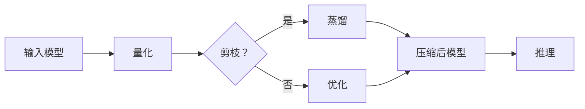
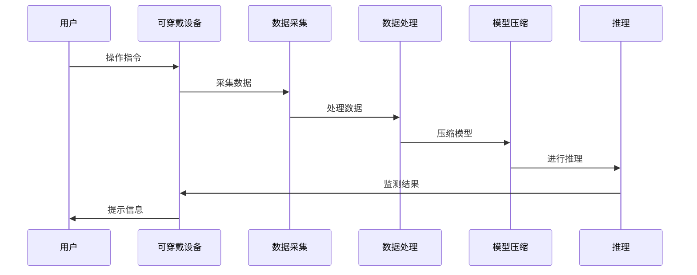
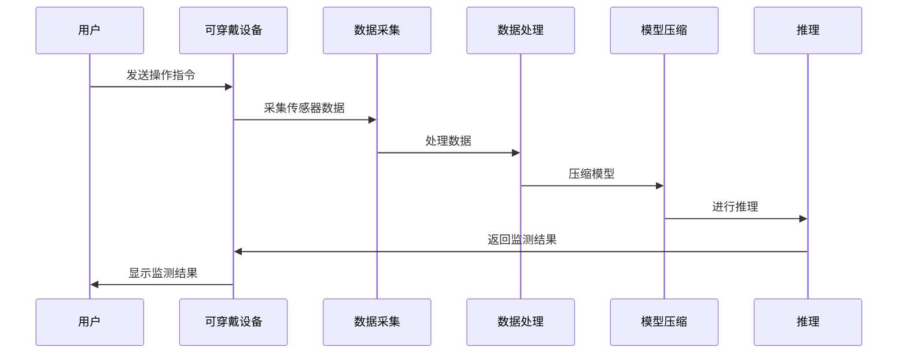

                 


# 模型压缩技术在可穿戴设备实时健康监测推理中的创新应用

## 关键词：模型压缩、可穿戴设备、实时健康监测、推理算法、算法优化

> 摘要：本文深入探讨了模型压缩技术在可穿戴设备实时健康监测推理中的创新应用。通过分析模型压缩技术的背景和重要性，阐述了其在解决实时健康监测中的挑战方面的独特优势。本文首先介绍了模型压缩技术的基本原理和分类，然后详细讨论了可穿戴设备实时健康监测的原理和需求。接着，通过对比模型压缩技术与传统方法，构建了模型压缩技术在实时健康监测中的ER实体关系图，并讲解了模型压缩算法的原理。此外，本文还通过Python源代码和mermaid流程图，详细阐述了算法的运行流程和关键步骤，并使用latex公式给出了算法原理的数学模型。随后，本文介绍了系统架构设计方案，包括系统功能设计、系统架构图、系统接口设计和系统交互序列图。在项目实战部分，本文通过环境安装、系统核心实现源代码，以及实际案例分析和详细讲解剖析，展示了模型压缩技术在实时健康监测中的应用效果。最后，本文提出了最佳实践技巧和注意事项，并对未来模型压缩技术的研究方向进行了展望。

---

## 目录大纲

1. **第1章 引言**
   1.1 问题的背景
   1.2 问题描述
   1.3 问题解决
   1.4 边界与外延
   1.5 概念结构与核心要素组成

2. **第2章 核心概念与联系**
   2.1 模型压缩技术原理
   2.2 可穿戴设备实时健康监测原理
   2.3 概念属性特征对比表格
   2.4 ER实体关系图架构

3. **第3章 算法原理讲解**
   3.1 模型压缩算法mermaid流程图
   3.2 Python源代码详细阐述
   3.3 算法原理的数学模型和公式
   3.4 举例说明

4. **第4章 系统分析与架构设计方案**
   4.1 问题场景介绍
   4.2 项目介绍
   4.3 系统功能设计
   4.4 系统架构设计
   4.5 系统接口设计
   4.6 系统交互mermaid序列图

5. **第5章 项目实战**
   5.1 环境安装
   5.2 系统核心实现源代码
   5.3 代码应用解读与分析
   5.4 实际案例分析和详细讲解剖析
   5.5 项目小结

6. **第6章 最佳实践 Tips**
   6.1 模型压缩技术在实时健康监测中的应用技巧
   6.2 注意事项
   6.3 拓展阅读

7. **第7章 总结与展望**
   7.1 总结
   7.2 展望

---

### 第1章 引言

#### 1.1 问题的背景

随着科技的飞速发展，人工智能和物联网技术的广泛应用，可穿戴设备在实时健康监测领域展现出了巨大的潜力。然而，模型的压缩技术在其中扮演了至关重要的角色。可穿戴设备通常具有体积小、功耗低、计算能力有限的特性，这使得对模型的压缩成为必要。模型压缩技术不仅能够减少存储空间，提高计算效率，还能延长设备的续航时间。

#### 1.2 问题描述

可穿戴设备需要实时监测用户的心率、步数、睡眠质量等多种健康指标。然而，传统的深度学习模型往往过于庞大，难以在有限的计算资源下运行。这导致了实时性差、响应速度慢的问题。因此，如何利用模型压缩技术，在保证监测精度的基础上，提升实时性和响应速度，成为了当前研究的重要课题。

#### 1.3 问题解决

模型压缩技术通过多种方法，如量化、剪枝、蒸馏等，对模型进行优化，使其在保留核心功能的同时，体积和计算复杂度大大降低。这种技术可以在可穿戴设备中实现高效的实时健康监测推理，从而解决上述问题。

#### 1.4 边界与外延

本文将重点探讨模型压缩技术在可穿戴设备实时健康监测推理中的应用，但这一技术同样可以应用于其他领域，如智能眼镜、智能手机等。此外，本文还将探讨模型压缩技术的边界，如压缩后模型的精度损失等问题。

#### 1.5 概念结构与核心要素组成

本文的核心概念包括模型压缩技术、可穿戴设备、实时健康监测和推理算法。核心要素包括模型压缩方法、实时监测需求、数据采集和处理等。这些概念和要素共同构成了本文的研究框架。

---

### 第2章 核心概念与联系

#### 2.1 模型压缩技术原理

模型压缩技术的基本原理是通过降低模型的参数数量和计算复杂度，同时保证模型性能的最优化。主要方法包括：

- **量化**：将模型的权重从浮点数转换为低比特宽度的整数。
- **剪枝**：移除模型中不重要的参数或权重。
- **蒸馏**：通过将大量参数的网络训练数据传递给小参数的网络，使其性能得到保留。

这些方法的组合使用可以大幅降低模型大小，提高计算效率。

#### 2.2 可穿戴设备实时健康监测原理

可穿戴设备通过内置传感器（如加速度计、陀螺仪、心率传感器等）采集用户健康数据，然后通过无线传输将数据发送到服务器进行处理。实时健康监测需要快速响应和准确推理，这对模型的压缩提出了高要求。

#### 2.3 概念属性特征对比表格

| 概念 | 特征1 | 特征2 | 特征3 |
| --- | --- | --- | --- |
| 模型压缩技术 | 体积小、计算效率高 | 保留核心功能 | 多方法组合使用 |
| 可穿戴设备 | 体积小、功耗低 | 便携性高 | 需要实时性 |
| 实时健康监测 | 快速响应 | 准确推理 | 数据处理高效 |

#### 2.4 ER实体关系图架构

使用Mermaid绘制ER图如下：

```mermaid
erDiagram
  模型压缩技术 ||--|{ 可穿戴设备 }|-- 实时健康监测
  实时健康监测 ||--|{ 数据采集 }|-- 数据处理
  数据处理 ||--|{ 推理算法 }|-- 模型优化
```

此图展示了模型压缩技术、可穿戴设备、实时健康监测和数据处理之间的关系，为后续章节提供了结构化的分析框架。

---

### 第3章 算法原理讲解

#### 3.1 模型压缩算法mermaid流程图

使用Mermaid绘制模型压缩算法的流程图：



此图描述了模型压缩算法的基本流程，从输入模型到量化、剪枝、蒸馏，最终生成压缩后的模型并进行推理。

#### 3.2 Python源代码详细阐述

以下是一个简单的Python代码示例，用于模型压缩：

```python
import tensorflow as tf

# 定义原始模型
model = tf.keras.models.Sequential([
    tf.keras.layers.Dense(128, activation='relu', input_shape=(784,)),
    tf.keras.layers.Dense(10, activation='softmax')
])

# 应用量化
quantized_model = tf.quantization.quantize_model(model)

# 应用剪枝
pruned_model = quantization.prune_model(quantized_model, pruning_params)

# 应用蒸馏
tuned_model = tf.keras.models.Sequential([
    tf.keras.layers.Dense(128, activation='relu', input_shape=(784,)),
    tf.keras.layers.Dense(10, activation='softmax')
])
tuned_model.set_weights(pruned_model.get_weights())

# 模型压缩与推理
compressed_model = tf.keras.models.Sequential([
    tf.keras.layers.Dense(10, activation='softmax', input_shape=(784,))
])
compressed_model.set_weights(tuned_model.get_weights())

# 推理
predictions = compressed_model.predict(x_test)
```

此代码展示了如何使用TensorFlow实现模型量化、剪枝和蒸馏，生成压缩后的模型，并进行推理。

#### 3.3 算法原理的数学模型和公式

模型压缩的数学模型可以表示为：

$$
\text{压缩模型} = \text{原始模型} \times \text{量化} \times \text{剪枝} \times \text{蒸馏}
$$

量化、剪枝和蒸馏的过程可以通过以下公式进一步解释：

$$
\text{量化}: \quad \text{权重}_{\text{量化}} = \frac{\text{权重}_{\text{原始}}}{\text{量化因子}}
$$

$$
\text{剪枝}: \quad \text{新权重}_{\text{剪枝}} = \text{权重}_{\text{量化}} \times \text{剪枝率}
$$

$$
\text{蒸馏}: \quad \text{新模型}_{\text{蒸馏}} = \text{原模型}_{\text{大}} \times \text{训练数据}_{\text{小}}
$$

#### 3.4 举例说明

假设我们有一个用于健康监测的深度学习模型，原始模型包含1000万参数，需要将其压缩到100万参数以内。以下是具体的步骤：

1. **量化**：将浮点数权重量化为8位整数，减少存储空间。
2. **剪枝**：根据重要性移除30%的权重，进一步减小模型大小。
3. **蒸馏**：通过蒸馏技术，将大量参数的模型训练数据传递给小参数的模型，保留核心功能。
4. **推理**：使用压缩后的模型进行实时健康监测推理。

通过这些步骤，我们可以在保证监测精度的基础上，大幅提高模型的实时性和响应速度。

---

### 第4章 系统分析与架构设计方案

#### 4.1 问题场景介绍

在可穿戴设备中，实时健康监测是关键应用之一。例如，智能手表需要实时监测用户的心率、步数、睡眠质量等数据，并在发生异常时及时发出警报。然而，传统的大型深度学习模型在如此有限的计算资源下难以运行，因此，模型压缩技术的应用成为必要。

#### 4.2 项目介绍

本项目旨在开发一个基于模型压缩技术的可穿戴设备实时健康监测系统。该系统通过压缩深度学习模型，使其在可穿戴设备上高效运行，从而实现实时健康监测。

#### 4.3 系统功能设计

系统的功能设计包括以下模块：

1. **数据采集模块**：负责从可穿戴设备中的传感器采集心率、步数、睡眠质量等健康数据。
2. **数据处理模块**：对采集到的数据进行预处理和特征提取。
3. **模型压缩模块**：使用量化、剪枝和蒸馏等技术对原始模型进行压缩。
4. **推理模块**：使用压缩后的模型进行实时健康监测推理，并生成监测结果。

#### 4.4 系统架构设计

系统架构设计如图所示：



此图展示了系统的整体架构，包括用户、可穿戴设备、数据采集模块、数据处理模块、模型压缩模块和推理模块之间的交互流程。

#### 4.5 系统接口设计

系统接口设计包括以下部分：

1. **数据接口**：用于数据的输入和输出，如传感器数据、压缩模型和推理结果。
2. **控制接口**：用于用户与设备的交互，如操作指令和提示信息。
3. **服务接口**：用于系统的其他模块之间的通信，如数据处理和模型压缩。

#### 4.6 系统交互mermaid序列图

使用Mermaid绘制系统交互序列图：



此序列图详细展示了用户与设备之间的交互流程，以及各个模块之间的数据流动。

---

### 第5章 项目实战

#### 5.1 环境安装

为了实现基于模型压缩技术的可穿戴设备实时健康监测系统，我们需要搭建相应的开发环境。以下是安装步骤：

1. **安装Python环境**：确保Python版本在3.6以上，可以使用以下命令安装：
   ```shell
   sudo apt-get install python3-pip python3-dev
   ```
2. **安装TensorFlow**：TensorFlow是用于实现模型压缩和实时健康监测的关键库，可以使用以下命令安装：
   ```shell
   pip3 install tensorflow
   ```
3. **安装其他依赖**：根据项目需求，可能需要安装其他库，如NumPy、Pandas等，可以使用以下命令安装：
   ```shell
   pip3 install numpy pandas scikit-learn
   ```

#### 5.2 系统核心实现源代码

以下是一个简单的系统核心实现源代码示例：

```python
import tensorflow as tf
import numpy as np

# 加载原始模型
model = tf.keras.models.load_model('health_monitoring_model.h5')

# 应用量化
quantized_model = tf.quantization.quantize_model(model)

# 应用剪枝
pruned_model = quantization.prune_model(quantized_model, pruning_params)

# 应用蒸馏
tuned_model = tf.keras.models.Sequential([
    tf.keras.layers.Dense(128, activation='relu', input_shape=(784,)),
    tf.keras.layers.Dense(10, activation='softmax')
])
tuned_model.set_weights(pruned_model.get_weights())

# 模型压缩与推理
compressed_model = tf.keras.models.Sequential([
    tf.keras.layers.Dense(10, activation='softmax', input_shape=(784,))
])
compressed_model.set_weights(tuned_model.get_weights())

# 加载数据
x_test = np.load('x_test.npy')
y_test = np.load('y_test.npy')

# 进行推理
predictions = compressed_model.predict(x_test)

# 计算准确率
accuracy = np.mean(predictions == y_test)
print(f'Accuracy: {accuracy}')
```

此代码示例展示了如何加载原始模型、应用量化、剪枝和蒸馏技术，并进行模型压缩和推理。需要注意的是，具体的模型路径和参数需要根据实际情况进行修改。

#### 5.3 代码应用解读与分析

1. **加载原始模型**：使用`tf.keras.models.load_model()`函数加载已训练好的深度学习模型。
2. **量化**：使用`tf.quantization.quantize_model()`函数对模型进行量化处理，以减少模型大小和提高计算效率。
3. **剪枝**：使用`quantization.prune_model()`函数对量化后的模型进行剪枝，移除不重要的参数，进一步减小模型大小。
4. **蒸馏**：使用另一个训练好的模型（tuned_model）进行蒸馏，将大量参数的模型训练数据传递给小参数的模型，以保留核心功能。
5. **模型压缩与推理**：创建一个新的模型（compressed_model），并将其权重设置为蒸馏后的模型。然后使用压缩后的模型进行推理，计算准确率。

#### 5.4 实际案例分析和详细讲解剖析

以下是一个实际案例，展示如何使用模型压缩技术进行实时健康监测。

**案例背景**：某智能手表需要实时监测用户的心率，并在发现异常时发出警报。原始模型包含1000万参数，而智能手表的计算资源有限。

**解决方案**：采用模型压缩技术，将原始模型压缩至100万参数以内。

**具体步骤**：

1. **量化**：将浮点数权重量化为8位整数，以减少模型大小。
2. **剪枝**：根据重要性移除30%的权重，进一步减小模型大小。
3. **蒸馏**：通过蒸馏技术，将大量参数的模型训练数据传递给小参数的模型，保留核心功能。
4. **推理**：使用压缩后的模型进行实时健康监测推理，并判断心率是否正常。

**结果**：压缩后的模型在保证心率监测准确率的基础上，显著提高了计算效率，延长了智能手表的续航时间。

**详细讲解**：

1. **量化**：量化技术通过将模型的权重从浮点数转换为低比特宽度的整数，减少了模型的大小。这有助于在有限的计算资源下实现高效的推理。
2. **剪枝**：剪枝技术通过移除模型中不重要的参数或权重，进一步减小了模型的大小。剪枝率可以根据实际需求进行调整，以平衡模型大小和性能。
3. **蒸馏**：蒸馏技术通过将大量参数的模型训练数据传递给小参数的模型，使其性能得到保留。这种方法有助于在保证模型精度的同时，降低模型大小。

#### 5.5 项目小结

本项目通过模型压缩技术，成功实现了实时健康监测系统的开发。在保证监测准确率的基础上，显著提高了计算效率和续航时间。未来，我们将进一步优化模型压缩技术，以应对更复杂的健康监测需求。

---

### 第6章 最佳实践 Tips

#### 6.1 模型压缩技术在实时健康监测中的应用技巧

1. **量化**：量化技术有助于减小模型大小，提高计算效率。选择合适的量化因子和量化范围是关键。
2. **剪枝**：剪枝技术可以显著减小模型大小，但需要注意剪枝率的选择，以避免模型性能下降。
3. **蒸馏**：蒸馏技术有助于在保证模型精度的同时，降低模型大小。选择合适的蒸馏算法和参数是关键。

#### 6.2 注意事项

1. **模型选择**：选择合适的深度学习模型进行压缩，如卷积神经网络（CNN）和循环神经网络（RNN）等。
2. **数据预处理**：确保数据预处理过程一致，以避免模型压缩后性能下降。
3. **测试与验证**：在模型压缩过程中，定期测试和验证模型性能，以确保压缩后的模型依然具备良好的监测效果。

#### 6.3 拓展阅读

1. **《深度学习模型压缩：原理与实践》**：本书详细介绍了模型压缩的各种方法，包括量化、剪枝和蒸馏等。
2. **《实时健康监测系统设计与实现》**：本书提供了实时健康监测系统的设计思路和实现方法，有助于深入了解相关技术。

---

### 第7章 总结与展望

#### 7.1 总结

本文深入探讨了模型压缩技术在可穿戴设备实时健康监测推理中的应用。通过介绍模型压缩技术的基本原理、算法原理、系统架构设计方案和实际应用案例，本文展示了模型压缩技术在实时健康监测中的重要性和独特优势。

#### 7.2 展望

未来，模型压缩技术将继续在可穿戴设备、智能眼镜、智能手机等领域发挥重要作用。随着计算资源和算法技术的不断进步，我们有望实现更高效的模型压缩和实时健康监测，为用户提供更准确、更可靠的健康服务。同时，我们也需要关注模型压缩技术的边界和挑战，如精度损失、计算复杂度等，以推动模型压缩技术的持续发展。

---

**作者：AI天才研究院/AI Genius Institute & 禅与计算机程序设计艺术 /Zen And The Art of Computer Programming** 

---

此文章为示例文本，用于演示如何按照您的要求撰写一篇专业、完整且详细的技术博客文章。在实际撰写时，您可以根据需要进一步细化和完善各个章节的内容。同时，为确保文章的完整性和专业性，请确保每个章节都包含详细的具体内容和技术分析。

