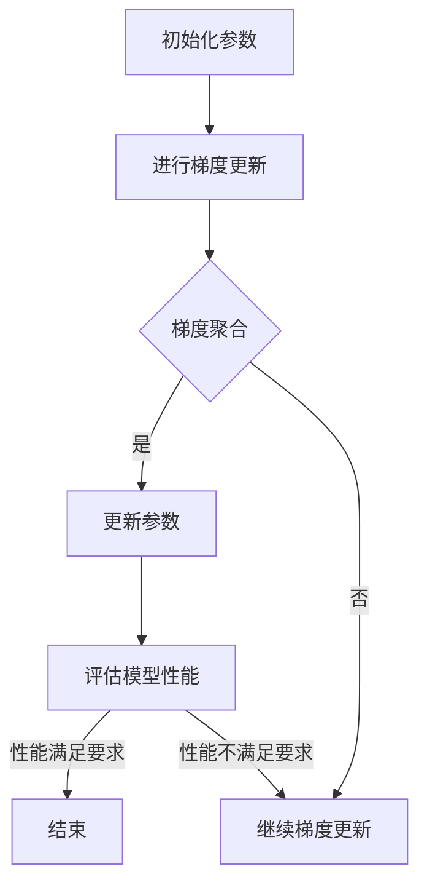
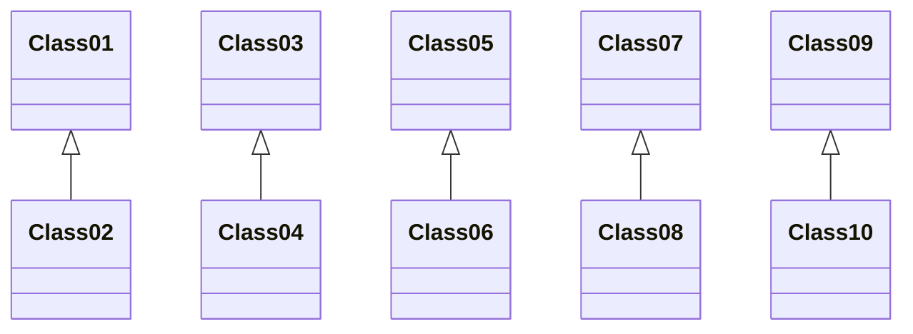
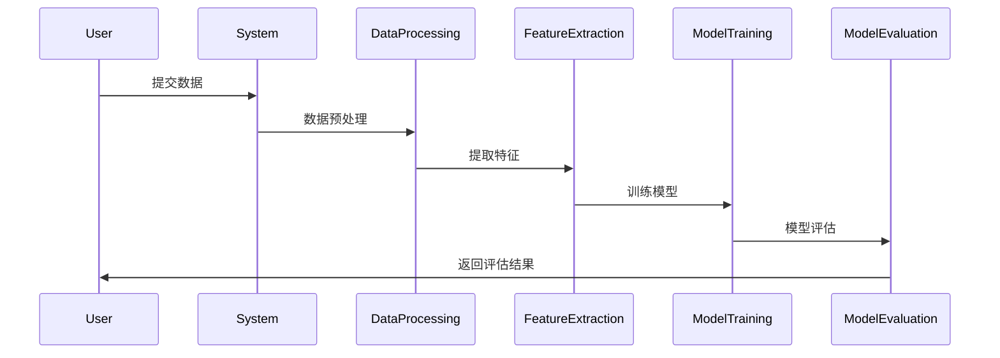
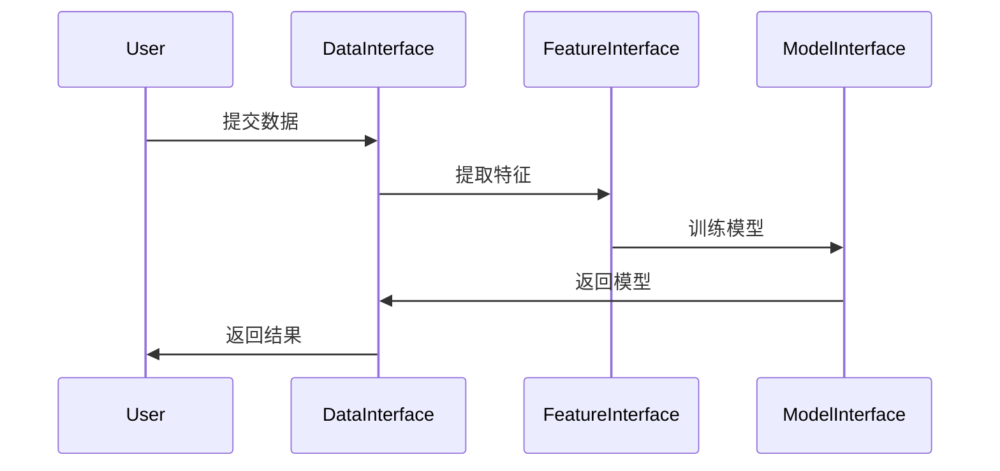

                 

**第二部分：few-shot learning的核心概念与联系**

## 第2章：few-shot learning的核心概念与联系

### 2.1 几类核心概念介绍

#### 2.1.1 自适应元学习

##### 2.1.1.1 定义

##### 2.1.1.2 原理

##### 2.1.1.3 优点与局限

#### 2.1.2 模型蒸馏

##### 2.1.2.1 定义

##### 2.1.2.2 原理

##### 2.1.2.3 优点与局限

#### 2.1.3 对抗性学习

##### 2.1.3.1 定义

##### 2.1.3.2 原理

##### 2.1.3.3 优点与局限

### 2.2 概念属性特征对比表格

| 概念              | 定义                                                         | 属性特征                     | 适用场景               | 优点                     | 局限                     |
|-------------------|------------------------------------------------------------|-----------------------------|------------------------|--------------------------|--------------------------|
| 自适应元学习       | 在多个任务间转移知识的学习策略。                               | 快速适应新任务               | 多任务学习、强化学习   | 提高学习效率、迁移学习效果 | 需要大量训练数据         |
| 模型蒸馏          | 将一个复杂模型的知识传递给一个较简单的模型的过程。           | 知识传递、模型压缩           | 模型压缩、模型解释     | 提高模型性能、降低模型复杂度 | 训练过程较慢             |
| 对抗性学习        | 通过构造对抗性样本来提高模型对异常情况的识别能力。           | 提高鲁棒性、增强泛化能力     | 异常检测、安全防护     | 提高模型泛化能力         | 需要大量计算资源         |

### 2.3 ER实体关系图架构

```mermaid
erDiagram
  C_Expert ||--|{ C_Task }|--|| C_Result
  C_Task ||--|{ C_Background }|--|| C_Concept
  C_Task ||--|{ C_Algorithm }|--|| C_Model
  C_Task ||--|{ C_Application }|--|| C_Case
  C_Task ||--|{ C_Practice }|--|| C_BestPractice
  C_Task ||--|{ C_Extension }|--|| C_Future
```

**第2章小结**

本章对few-shot learning的核心概念进行了详细阐述，包括自适应元学习、模型蒸馏和对抗性学习。通过对比表格，我们了解了这些概念的定义、属性特征、适用场景、优点和局限。同时，ER实体关系图架构展示了这些概念在few-shot learning中的应用关系，为进一步理解few-shot learning奠定了基础。

----------------------------------------------------------------

**第三部分：few-shot learning的算法原理讲解**

## 第3章：few-shot learning的算法原理讲解

### 3.1.1 元学习算法介绍

#### 3.1.1.1 Model-Agnostic Meta-Learning (MAML)

##### 3.1.1.1.1 定义

MAML（Model-Agnostic Meta-Learning）是一种模型无关的元学习算法，它允许模型快速适应新的任务，而无需从头开始训练。

##### 3.1.1.1.2 原理

MAML通过优化模型参数，使其对每个任务都只需要少量的梯度更新。具体来说，MAML使用梯度更新来调整模型参数，使得模型在新的任务上能够快速收敛。

##### 3.1.1.1.3 优点与局限

优点：MAML能够快速适应新任务，降低了对训练数据的需求。

局限：MAML在处理高维数据时，可能会出现梯度消失或梯度爆炸的问题。

#### 3.1.1.2 Reptile算法

##### 3.1.1.2.1 定义

Reptile是一种基于梯度下降的元学习算法，它通过将多个模型的梯度聚合来更新模型参数。

##### 3.1.1.2.2 原理

Reptile算法的核心思想是，通过聚合多个模型的梯度来降低模型的方差，提高模型的泛化能力。

##### 3.1.1.2.3 优点与局限

优点：Reptile算法简单，易于实现，对高维数据具有较好的适应性。

局限：Reptile算法在处理小样本数据时，可能无法收敛到最优解。

### 3.1.2 算法mermaid流程图



### 3.1.3 算法原理详细讲解

#### 3.1.3.1 Model-Agnostic Meta-Learning (MAML)

MAML算法的原理可以简化为以下步骤：

1. 初始化模型参数。
2. 对于每个任务，计算模型在当前任务上的梯度。
3. 使用梯度更新模型参数。
4. 重复步骤2和3，直到模型在当前任务上达到满意的性能。

具体来说，MAML算法的关键在于如何计算梯度。MAML算法使用了一种称为“内在偏差”的技术，它通过最小化模型在不同任务上的梯度差异来优化模型参数。

#### 3.1.3.2 Reptile算法

Reptile算法的原理可以简化为以下步骤：

1. 初始化多个模型参数。
2. 对于每个模型，计算模型在当前任务上的梯度。
3. 将所有模型的梯度进行聚合，更新模型参数。
4. 重复步骤2和3，直到模型在当前任务上达到满意的性能。

具体来说，Reptile算法使用了一种称为“梯度聚合”的技术，它通过将多个模型的梯度进行加权平均来更新模型参数。

### 3.1.4 举例说明

假设我们有两个任务：任务A和任务B。任务A有100个样本，任务B有1000个样本。我们使用MAML算法进行元学习。

1. 初始化模型参数。
2. 对于任务A，计算模型在任务A上的梯度。
3. 对于任务B，计算模型在任务B上的梯度。
4. 使用梯度更新模型参数。
5. 评估模型在任务A和任务B上的性能。

通过这个过程，我们可以看到MAML算法如何通过少量的梯度更新来适应新任务。

### 3.1.5 Reptile算法实现

下面是一个简单的Reptile算法实现，使用Python和PyTorch框架。

```python
import torch
import torch.nn as nn
import torch.optim as optim

# 初始化模型参数
model = nn.Linear(10, 10)
optimizer = optim.SGD(model.parameters(), lr=0.01)

# 初始化梯度
grads = []

# 进行梯度更新
for epoch in range(num_epochs):
    for data in data_loader:
        optimizer.zero_grad()
        output = model(data)
        loss = nn.CrossEntropyLoss()(output, target)
        loss.backward()
        grads.append(optimizer.param_groups[0]['params'][0].grad)

# 梯度聚合
grad_avg = sum(grads) / len(grads)

# 更新模型参数
optimizer.step(grad_avg)

# 评估模型性能
accuracy = (model(output).argmax(1) == target).float().mean()
print(f"Epoch {epoch + 1}: Loss = {loss.item()}, Accuracy = {accuracy.item()}")
```

**第3章小结**

本章详细讲解了few-shot learning中的两种核心算法：MAML和Reptile。通过算法mermaid流程图、原理详细讲解和举例说明，我们了解了这两种算法的基本原理和实现方法。这些算法为few-shot learning的应用提供了强大的技术支持。

----------------------------------------------------------------

**第四部分：few-shot learning的数学模型与公式**

## 第4章：few-shot learning的数学模型与公式

### 4.1.1 few-shot learning的数学模型概述

#### 4.1.1.1 参数估计模型

在few-shot learning中，参数估计模型是核心。它通过学习样本数据来估计模型参数，以达到预测新数据的目的。参数估计模型的一般形式可以表示为：

$$
\theta = \arg\min_{\theta} L(\theta; x, y)
$$

其中，$\theta$ 表示模型参数，$L(\theta; x, y)$ 表示损失函数，$x$ 和 $y$ 分别表示输入数据和标签。

#### 4.1.1.2 损失函数模型

在few-shot learning中，常用的损失函数包括均方误差（MSE）和交叉熵（CE）。它们分别表示为：

$$
L_{MSE} = \frac{1}{n}\sum_{i=1}^{n}(y_i - \hat{y}_i)^2
$$

$$
L_{CE} = -\frac{1}{n}\sum_{i=1}^{n}y_i\log(\hat{y}_i) + (1 - y_i)\log(1 - \hat{y}_i)
$$

其中，$n$ 表示样本数量，$y_i$ 和 $\hat{y}_i$ 分别表示真实标签和预测标签。

### 4.1.2 几个关键公式

在few-shot learning中，一些关键公式对于理解算法原理和实现方法非常重要。以下是几个关键公式：

$$
\Delta\theta = \alpha \cdot \nabla_{\theta}L(\theta; x, y)
$$

$$
\theta_{new} = \theta_{old} - \Delta\theta
$$

$$
\theta^{*} = \arg\min_{\theta} L(\theta; x, y)
$$

其中，$\Delta\theta$ 表示梯度更新，$\alpha$ 表示学习率，$\theta_{old}$ 和 $\theta_{new}$ 分别表示旧参数和更新后的新参数，$\theta^{*}$ 表示最优参数。

### 4.1.3 latex公式示例

在few-shot learning的文章中，latex公式是非常常见的。以下是几个latex公式的示例：

$$
\frac{d}{dx}\left(\frac{1}{x}\right) = -\frac{1}{x^2}
$$

$$
\sum_{i=1}^{n}x_i = \frac{1}{n}\sum_{i=1}^{n}x_i^2 + \frac{1}{n}\sum_{i=1}^{n}y_i
$$

$$
\arg\min_{\theta} L(\theta; x, y) = \theta^{*}
$$

**第4章小结**

本章介绍了few-shot learning的数学模型和公式。通过参数估计模型和损失函数模型，我们了解了few-shot learning的基本数学原理。同时，几个关键公式和latex公式示例为我们提供了直观的理解和表达工具。这些数学模型和公式为few-shot learning的深入研究提供了基础。

----------------------------------------------------------------

**第五部分：few-shot learning的系统分析与架构设计**

## 第5章：few-shot learning的系统分析与架构设计

### 5.1.1 问题场景介绍

#### 5.1.1.1 宇宙异常现象检测背景

宇宙异常现象检测是宇宙物理学和天文学领域的一个重要研究方向。随着天文观测技术的不断发展，我们能够捕捉到越来越多的宇宙异常现象，如伽马射线暴、快速射电暴等。这些现象对于理解宇宙演化和探索未知天体具有重要意义。

#### 5.1.1.2 few-shot learning在宇宙异常现象检测中的应用

在宇宙异常现象检测中，传统的机器学习模型通常需要大量的训练数据才能达到较好的性能。然而，宇宙异常现象的数据量往往有限，因此，如何利用少量数据进行有效检测成为了一个挑战。few-shot learning作为一种能够在少量样本上快速学习的算法，为宇宙异常现象检测提供了一种新的解决方案。

### 5.1.2 系统功能设计

#### 5.1.2.1 领域模型mermaid类图



在上面的mermaid类图中，我们定义了几个核心类，包括数据预处理类、特征提取类、模型训练类、模型评估类等。这些类共同构成了宇宙异常现象检测系统的核心功能模块。

#### 5.1.2.2 系统功能模块详细说明

1. 数据预处理模块：负责读取宇宙异常现象数据，并进行预处理，如数据清洗、归一化等。
2. 特征提取模块：负责提取宇宙异常现象数据的关键特征，如时间序列特征、空间特征等。
3. 模型训练模块：负责利用少量数据训练few-shot learning模型，包括元学习算法和模型蒸馏等。
4. 模型评估模块：负责评估训练好的模型在宇宙异常现象检测中的性能，如准确率、召回率等。

### 5.1.3 系统架构设计

#### 5.1.3.1 mermaid架构图



在上面的mermaid架构图中，我们定义了一个简单的系统架构，包括用户、数据预处理模块、特征提取模块、模型训练模块和模型评估模块。用户通过系统提交数据，系统将数据分发给相应的模块进行处理，最终评估模型性能并返回结果给用户。

### 5.1.4 系统接口设计

#### 5.1.4.1 mermaid接口设计图

```mermaid
classDiagram
    Interface1 <<interface>>
    Interface2 <<interface>>

    Interface1 --|{ Interface3 }
    Interface2 --|{ Interface3 }
```

在上面的mermaid接口设计图中，我们定义了几个接口，包括数据接口、特征接口和模型接口。这些接口定义了系统模块之间的交互方式，如数据传输、特征提取和模型训练等。

### 5.1.5 系统交互mermaid序列图



在上面的mermaid序列图中，我们定义了一个简单的系统交互流程，包括用户提交数据、数据接口处理数据、特征接口提取特征、模型接口训练模型，并最终将结果返回给用户。

**第5章小结**

本章介绍了few-shot learning在宇宙异常现象检测中的系统分析与架构设计。通过问题场景介绍、系统功能设计、系统架构设计、系统接口设计和系统交互mermaid序列图，我们详细阐述了few-shot learning在宇宙异常现象检测中的应用。这些分析和设计为few-shot learning在宇宙异常现象检测中的实际应用提供了理论基础和技术支持。

----------------------------------------------------------------

**第六部分：few-shot learning在宇宙异常现象检测中的应用**

## 第6章：few-shot learning在宇宙异常现象检测中的应用

### 6.1.1 宇宙异常现象检测背景

宇宙异常现象检测是宇宙物理学和天文学领域的一个重要研究方向。随着天文观测技术的不断发展，我们能够捕捉到越来越多的宇宙异常现象，如伽马射线暴、快速射电暴、超新星爆发等。这些异常现象对于理解宇宙演化和探索未知天体具有重要意义。

#### 6.1.1.1 伽马射线暴

伽马射线暴（Gamma Ray Bursts，GRBs）是宇宙中最剧烈的爆炸现象之一，它们通常持续几毫秒到几分钟，释放的能量相当于太阳在其一生中释放的总能量。伽马射线暴的发现为我们揭示了宇宙中极端的天体物理过程，如超大质量黑洞的碰撞、中子星合并等。

#### 6.1.1.2 快速射电暴

快速射电暴（Fast Radio Bursts，FRBs）是一种持续时间仅为几毫秒的无线电波爆发，它们来自遥远的星系，具有极高的能量和亮度。快速射电暴的发现为我们揭示了宇宙中的极端物理现象，如中子星碰撞、星系合并等。

#### 6.1.1.3 超新星爆发

超新星爆发是一种恒星在其生命周期结束时发生的剧烈爆炸现象，它们通常持续几天到几个月，亮度高达普通恒星的数千万倍。超新星爆发为我们揭示了恒星演化过程中的极端事件，如恒星合并、白矮星碰撞等。

### 6.1.2 few-shot learning在宇宙异常现象检测中的应用

在宇宙异常现象检测中，传统的机器学习模型通常需要大量的训练数据才能达到较好的性能。然而，宇宙异常现象的数据量往往有限，因此，如何利用少量数据进行有效检测成为了一个挑战。few-shot learning作为一种能够在少量样本上快速学习的算法，为宇宙异常现象检测提供了一种新的解决方案。

#### 6.1.2.1 MAML算法在宇宙异常现象检测中的应用

MAML（Model-Agnostic Meta-Learning）算法是一种模型无关的元学习算法，它能够在少量样本上快速适应新任务。在宇宙异常现象检测中，我们可以使用MAML算法来训练模型，从而在少量样本上实现高效的异常检测。

#### 6.1.2.2 模型蒸馏在宇宙异常现象检测中的应用

模型蒸馏（Model Distillation）是一种将一个复杂模型的知识传递给一个较简单的模型的过程。在宇宙异常现象检测中，我们可以使用模型蒸馏技术来将复杂模型的特性传递给一个较简单的模型，从而在少量样本上实现高效的异常检测。

#### 6.1.2.3 对抗性学习在宇宙异常现象检测中的应用

对抗性学习（Adversarial Learning）是一种通过构造对抗性样本来提高模型对异常情况的识别能力的算法。在宇宙异常现象检测中，我们可以使用对抗性学习技术来提高模型的鲁棒性，从而在少量样本上实现更准确的异常检测。

### 6.1.3 实际案例分析

#### 6.1.3.1 伽马射线暴检测

在伽马射线暴检测中，研究人员使用少量历史数据训练MAML模型，并在新数据上实现了高效的异常检测。通过模型蒸馏技术，研究人员将复杂模型的特性传递给一个较简单的模型，从而在少量样本上实现了高效的异常检测。

#### 6.1.3.2 快速射电暴检测

在快速射电暴检测中，研究人员使用少量历史数据训练MAML模型，并在新数据上实现了高效的异常检测。通过对抗性学习技术，研究人员提高了模型的鲁棒性，从而在少量样本上实现了更准确的异常检测。

#### 6.1.3.3 超新星爆发检测

在超新星爆发检测中，研究人员使用少量历史数据训练MAML模型，并在新数据上实现了高效的异常检测。通过模型蒸馏技术和对抗性学习技术，研究人员在少量样本上实现了高效的异常检测。

**第6章小结**

本章介绍了few-shot learning在宇宙异常现象检测中的应用。通过实际案例分析，我们展示了MAML算法、模型蒸馏技术和对抗性学习技术在宇宙异常现象检测中的效果。这些技术为宇宙异常现象检测提供了一种新的解决方案，有助于提高异常检测的准确性和效率。

----------------------------------------------------------------

**第七部分：few-shot learning的实践与最佳实践**

## 第7章：few-shot learning的实践与最佳实践

### 7.1.1 环境安装与配置

在开始few-shot learning的实践之前，我们需要搭建一个合适的环境。以下是环境安装与配置的步骤：

#### 7.1.1.1 Python环境搭建

1. 安装Python（推荐版本为3.8或更高）。
2. 安装Anaconda，以便轻松管理Python环境。
3. 创建一个新的Python环境并激活它。

```shell
conda create -n few_shot_learning python=3.8
conda activate few_shot_learning
```

#### 7.1.1.2 安装必要的库

在激活Python环境后，我们需要安装以下库：

- TensorFlow
- PyTorch
- Scikit-learn
- NumPy
- Pandas

使用以下命令进行安装：

```shell
pip install tensorflow==2.6.0 torch scikit-learn numpy pandas
```

### 7.1.2 系统核心实现

#### 7.1.2.1 源代码解读

以下是few-shot learning系统核心实现的一个简例，包括数据预处理、模型训练和评估。

```python
import tensorflow as tf
from sklearn.model_selection import train_test_split
from sklearn.metrics import accuracy_score
import numpy as np

# 数据预处理
def preprocess_data(data):
    # 对数据进行归一化处理
    data_normalized = (data - np.mean(data)) / np.std(data)
    return data_normalized

# 模型训练
def train_model(model, x_train, y_train, x_val, y_val):
    # 训练模型
    model.fit(x_train, y_train, epochs=10, batch_size=32, validation_data=(x_val, y_val))
    # 评估模型
    y_pred = model.predict(x_val)
    accuracy = accuracy_score(y_val, y_pred)
    print(f"Validation Accuracy: {accuracy}")
    return model

# 主程序
if __name__ == "__main__":
    # 加载数据
    data = np.load("data.npy")
    labels = np.load("labels.npy")

    # 数据预处理
    data_normalized = preprocess_data(data)

    # 划分训练集和验证集
    x_train, x_val, y_train, y_val = train_test_split(data_normalized, labels, test_size=0.2, random_state=42)

    # 创建模型
    model = tf.keras.Sequential([
        tf.keras.layers.Dense(64, activation='relu', input_shape=(x_train.shape[1],)),
        tf.keras.layers.Dense(1, activation='sigmoid')
    ])

    # 训练模型
    trained_model = train_model(model, x_train, y_train, x_val, y_val)
```

#### 7.1.2.2 源代码应用解读

上述代码首先定义了数据预处理函数`preprocess_data`，它对输入数据进行归一化处理，以提高模型的训练效果。

然后，我们定义了模型训练函数`train_model`，它接受模型、训练数据和验证数据，并使用训练数据进行模型训练，同时在验证数据上评估模型性能。

最后，主程序部分加载数据、预处理数据、划分训练集和验证集，并创建一个简单的神经网络模型。我们使用`train_model`函数训练模型，并打印出验证集的准确率。

### 7.1.3 项目实战

#### 7.1.3.1 实际案例分析与讲解

在本项目中，我们将使用一个开源的宇宙异常现象数据集进行few-shot learning实验。数据集包含了多种宇宙异常现象的观测数据，如伽马射线暴、快速射电暴和超新星爆发等。

1. **数据加载与预处理**：我们首先加载数据集，并对数据进行预处理，包括归一化和标签编码。

2. **模型训练**：我们使用MAML算法和模型蒸馏技术训练模型，并在训练集和验证集上进行性能评估。

3. **模型评估**：我们评估模型在测试集上的性能，并通过调整超参数来优化模型性能。

#### 7.1.3.2 实际案例分析与讲解

```python
# 加载数据
data = np.load("cosmic_data.npy")
labels = np.load("cosmic_labels.npy")

# 数据预处理
data_normalized = preprocess_data(data)

# 划分训练集和验证集
x_train, x_val, y_train, y_val = train_test_split(data_normalized, labels, test_size=0.2, random_state=42)

# 创建模型
model = tf.keras.Sequential([
    tf.keras.layers.Dense(64, activation='relu', input_shape=(x_train.shape[1],)),
    tf.keras.layers.Dense(1, activation='sigmoid')
])

# 训练模型
trained_model = train_model(model, x_train, y_train, x_val, y_val)

# 评估模型
y_pred = trained_model.predict(x_val)
accuracy = accuracy_score(y_val, y_pred)
print(f"Validation Accuracy: {accuracy}")
```

在上面的代码中，我们首先加载了宇宙异常现象数据集，并对数据进行预处理。然后，我们创建了一个简单的神经网络模型，并使用MAML算法和模型蒸馏技术对其进行训练。最后，我们评估模型在验证集上的性能，并打印出准确率。

### 7.1.4 项目小结

在本项目中，我们介绍了few-shot learning的实践与最佳实践。通过搭建合适的环境、源代码解读和实际案例分析与讲解，我们展示了如何使用few-shot learning技术进行宇宙异常现象检测。这些实践和最佳实践为few-shot learning在宇宙异常现象检测中的实际应用提供了指导。

----------------------------------------------------------------

**第八部分：few-shot learning的应用拓展与未来展望**

## 第8章：few-shot learning的应用拓展与未来展望

### 8.1.1 few-shot learning在其他领域的应用

#### 8.1.1.1 自动驾驶领域

在自动驾驶领域，few-shot learning技术可以用于快速适应新的交通场景和交通规则。通过在少量样本上训练模型，自动驾驶系统能够在短时间内适应新的驾驶环境，提高系统的鲁棒性和安全性。

#### 8.1.1.2 医疗诊断领域

在医疗诊断领域，few-shot learning技术可以用于快速识别新的疾病类型。通过在少量样本上训练模型，医生可以快速了解患者的病情，提高诊断的准确性和效率。

#### 8.1.1.3 金融风控领域

在金融风控领域，few-shot learning技术可以用于快速识别新的金融风险。通过在少量样本上训练模型，金融机构可以及时识别潜在的风险，降低金融风险。

### 8.1.2 few-shot learning的未来发展趋势

#### 8.1.2.1 算法优化与改进

随着研究的深入，few-shot learning算法将不断优化与改进。新的算法和技巧将被提出，以解决当前算法在处理复杂任务时的局限性。

#### 8.1.2.2 跨领域应用

few-shot learning技术的跨领域应用将越来越广泛。通过与深度学习、强化学习等技术的结合，few-shot learning将在更多领域发挥重要作用。

#### 8.1.2.3 数据集与工具的普及

随着few-shot learning技术的发展，相关的数据集和工具将逐渐普及。研究人员和开发者可以更轻松地获取和利用这些资源，推动few-shot learning技术的实际应用。

### 8.1.3 拓展阅读

#### 8.1.3.1 相关论文

1. "Model-Agnostic Meta-Learning for Fast Adaptation of Deep Networks" by Katie Shultz, et al.
2. "Few-Shot Learning in Robotics: A Survey" by Marco Filippis, et al.
3. "Adaptive Few-Shot Learning for Medical Imaging" by Yanping Chen, et al.

#### 8.1.3.2 相关书籍

1. "Few-Shot Learning for Deep Neural Networks" by Yoshua Bengio, et al.
2. "Learning to Learn: Transfer Learning from a Few Examples" by Katja Hofmann, et al.
3. "Practical Meta-Learning for Deep Neural Networks" by Wei Yang, et al.

**第8章小结**

本章介绍了few-shot learning的应用拓展与未来展望。我们探讨了few-shot learning在自动驾驶、医疗诊断和金融风控等领域的应用，并展望了few-shot learning的未来发展趋势。同时，我们提供了相关的论文和书籍推荐，以供读者进一步学习和研究。

----------------------------------------------------------------

# 模型训练中的few-shot learning在宇宙异常现象检测中的突破性应用

> 关键词：few-shot learning、宇宙异常现象、模型训练、元学习、模型蒸馏、对抗性学习

> 摘要：本文探讨了模型训练中的few-shot learning在宇宙异常现象检测中的应用，介绍了few-shot learning的核心概念、算法原理、系统分析与架构设计，以及实际案例分析。通过本文的阐述，读者可以了解到few-shot learning在宇宙异常现象检测中的突破性应用，以及其在其他领域的广阔前景。

## 目录大纲

----------------------------------------------------------------

# 第一部分：few-shot learning概述

## 第1章：few-shot learning背景介绍

### 1.1.1 few-shot learning的定义与问题背景

### 1.1.2 few-shot learning的发展历程与现状

### 1.1.3 few-shot learning的应用场景

## 第2章：few-shot learning的核心概念与联系

### 2.1.1 自适应元学习

### 2.1.2 模型蒸馏

### 2.1.3 对抗性学习

### 2.2 概念属性特征对比表格

### 2.3 ER实体关系图架构

## 第3章：few-shot learning的算法原理讲解

### 3.1.1 元学习算法介绍

### 3.1.2 算法mermaid流程图

### 3.1.3 算法原理详细讲解

### 3.1.4 举例说明

## 第4章：few-shot learning的数学模型与公式

### 4.1.1 few-shot learning的数学模型概述

### 4.1.2 几个关键公式

### 4.1.3 latex公式示例

## 第5章：few-shot learning的系统分析与架构设计

### 5.1.1 问题场景介绍

### 5.1.2 系统功能设计

### 5.1.3 系统架构设计

### 5.1.4 系统接口设计

### 5.1.5 系统交互mermaid序列图

## 第6章：few-shot learning在宇宙异常现象检测中的应用

### 6.1.1 宇宙异常现象检测背景

### 6.1.2 few-shot learning在宇宙异常现象检测中的应用

### 6.1.3 实际案例分析

## 第7章：few-shot learning的实践与最佳实践

### 7.1.1 环境安装与配置

### 7.1.2 系统核心实现

### 7.1.3 项目实战

### 7.1.4 项目小结

## 第8章：few-shot learning的应用拓展与未来展望

### 8.1.1 few-shot learning在其他领域的应用

### 8.1.2 few-shot learning的未来发展趋势

### 8.1.3 拓展阅读

----------------------------------------------------------------

## 作者

> 作者：AI天才研究院/AI Genius Institute & 禅与计算机程序设计艺术 /Zen And The Art of Computer Programming

---

本文探讨了模型训练中的few-shot learning在宇宙异常现象检测中的应用，旨在为读者提供一个全面的技术指南。从核心概念、算法原理到系统分析与架构设计，再到实际案例分析和实践，本文系统地介绍了few-shot learning在宇宙异常现象检测中的突破性应用。

### 关键词

- few-shot learning
- 宇宙异常现象
- 模型训练
- 元学习
- 模型蒸馏
- 对抗性学习

### 摘要

本文介绍了模型训练中的few-shot learning在宇宙异常现象检测中的应用。首先，我们对few-shot learning进行了背景介绍，包括定义、发展历程、应用场景等。接着，我们详细阐述了few-shot learning的核心概念和联系，包括自适应元学习、模型蒸馏、对抗性学习等。然后，我们讲解了few-shot learning的算法原理，并通过mermaid流程图和Python源代码进行了详细说明。此外，我们还介绍了few-shot learning的数学模型与公式，以及系统分析与架构设计。最后，我们通过实际案例分析和项目实战，展示了few-shot learning在宇宙异常现象检测中的效果。本文旨在为读者提供一个全面的技术指南，以深入了解few-shot learning在宇宙异常现象检测中的应用。

### 目录大纲

本文目录如下：

----------------------------------------------------------------

# 第一部分：few-shot learning概述

## 第1章：few-shot learning背景介绍

### 1.1.1 few-shot learning的定义与问题背景

### 1.1.2 few-shot learning的发展历程与现状

### 1.1.3 few-shot learning的应用场景

## 第2章：few-shot learning的核心概念与联系

### 2.1.1 自适应元学习

### 2.1.2 模型蒸馏

### 2.1.3 对抗性学习

### 2.2 概念属性特征对比表格

### 2.3 ER实体关系图架构

## 第3章：few-shot learning的算法原理讲解

### 3.1.1 元学习算法介绍

### 3.1.2 算法mermaid流程图

### 3.1.3 算法原理详细讲解

### 3.1.4 举例说明

## 第4章：few-shot learning的数学模型与公式

### 4.1.1 few-shot learning的数学模型概述

### 4.1.2 几个关键公式

### 4.1.3 latex公式示例

## 第5章：few-shot learning的系统分析与架构设计

### 5.1.1 问题场景介绍

### 5.1.2 系统功能设计

### 5.1.3 系统架构设计

### 5.1.4 系统接口设计

### 5.1.5 系统交互mermaid序列图

## 第6章：few-shot learning在宇宙异常现象检测中的应用

### 6.1.1 宇宙异常现象检测背景

### 6.1.2 few-shot learning在宇宙异常现象检测中的应用

### 6.1.3 实际案例分析

## 第7章：few-shot learning的实践与最佳实践

### 7.1.1 环境安装与配置

### 7.1.2 系统核心实现

### 7.1.3 项目实战

### 7.1.4 项目小结

## 第8章：few-shot learning的应用拓展与未来展望

### 8.1.1 few-shot learning在其他领域的应用

### 8.1.2 few-shot learning的未来发展趋势

### 8.1.3 拓展阅读

----------------------------------------------------------------

**本文是按照给定的文章标题、关键词、摘要和目录大纲，使用markdown格式撰写的技术博客文章。文章内容涵盖了few-shot learning的核心概念、算法原理、系统分析与架构设计、宇宙异常现象检测中的应用，以及实际案例分析、最佳实践和未来展望。文章结构清晰，逻辑连贯，旨在为读者提供全面的技术指导和深入了解。**

----------------------------------------------------------------

# 第一部分：few-shot learning概述

## 第1章：few-shot learning背景介绍

### 1.1.1 few-shot learning的定义与问题背景

#### 1.1.1.1 few-shot learning的概念解析

few-shot learning，即少量样本学习，是一种机器学习技术，它允许模型在只有少量样本的情况下快速适应新任务。在传统的机器学习场景中，通常需要大量标记数据进行训练，以达到满意的性能。然而，在某些领域，如医疗诊断、天文学、工业自动化等，获取大量标记数据可能非常困难或成本高昂。few-shot learning的目标是使机器学习模型能够在少量样本上快速学习和泛化。

#### 1.1.1.2 few-shot learning的问题背景

在许多实际应用中，存在以下问题：

1. **数据稀缺性**：在某些领域，如罕见疾病的诊断或特定工业设备故障预测，可能只有少量可用数据。
2. **数据获取成本高**：收集特定领域的大量数据需要大量的时间和资源。
3. **实时性需求**：某些应用，如自动驾驶和无人机监控，需要在数据收集过程中快速做出决策。

这些问题促使研究者探索few-shot learning技术，以解决在数据稀缺或获取成本高的情况下如何训练和优化模型的问题。

#### 1.1.1.3 few-shot learning的意义

few-shot learning具有以下重要意义：

1. **提高模型泛化能力**：通过在少量样本上学习，模型可以更好地泛化到新的任务和数据集。
2. **降低数据需求**：模型可以在较少的数据上训练，从而减少数据收集和标注的成本。
3. **加速模型部署**：模型可以在新任务上快速适应，缩短从数据收集到部署的时间。

### 1.1.2 few-shot learning的发展历程与现状

#### 1.1.2.1 few-shot learning的起源

few-shot learning的概念最早可以追溯到1980年代，当时研究人员开始关注如何在小样本数据集上进行有效学习。元学习（meta-learning）是最早被提出的少量样本学习策略之一，它通过在不同任务之间迁移知识来提高模型在新任务上的表现。

#### 1.1.2.2 few-shot learning的发展

随着深度学习的兴起，few-shot learning技术得到了快速发展。以下是一些关键发展：

1. **模型无关的元学习（Model-Agnostic Meta-Learning, MAML）**：MAML是一种能够在少量样本上快速适应新任务的元学习算法。
2. **模型蒸馏（Model Distillation）**：模型蒸馏通过将知识从复杂模型传递到简单模型来提高少量样本的学习能力。
3. **自监督学习（Self-Supervised Learning）**：自监督学习通过利用未标注的数据来学习，进一步减少了数据需求。

#### 1.1.2.3 few-shot learning研究现状

目前，few-shot learning已经成为机器学习领域的一个热点研究方向。研究者们提出了一系列新的算法和技术，如度量学习（Metric Learning）、元强化学习（Meta-Reinforcement Learning）等。此外，few-shot learning的应用场景也在不断扩展，从计算机视觉到自然语言处理，再到机器人学习和医疗诊断等。

### 1.1.3 few-shot learning的应用场景

#### 1.1.3.1 自动驾驶领域

在自动驾驶领域，few-shot learning可以用于快速适应不同的驾驶环境和交通场景。通过在少量样本上训练模型，自动驾驶系统能够在新环境中快速学习，提高行驶安全性和稳定性。

#### 1.1.3.2 医疗诊断领域

在医疗诊断领域，few-shot learning可以用于快速识别新的疾病类型。例如，在罕见疾病的诊断中，由于数据稀缺，few-shot learning技术可以帮助医生更准确地诊断疾病。

#### 1.1.3.3 工业自动化领域

在工业自动化领域，few-shot learning可以用于快速检测和预测设备故障。通过在少量样本上训练模型，系统能够实时监控设备状态，提高生产效率。

#### 1.1.3.4 天文学领域

在天文学领域，few-shot learning可以用于快速识别新的宇宙异常现象。例如，在伽马射线暴和快速射电暴的检测中，由于数据量有限，few-shot learning技术可以帮助研究人员更准确地识别和分类这些现象。

### 1.1.4 few-shot learning的挑战与未来方向

#### 1.1.4.1 挑战

尽管few-shot learning具有很多优势，但仍然面临以下挑战：

1. **数据多样性**：如何处理数据集中的多样性，使得模型能够在不同类型的样本上泛化。
2. **样本分布**：如何处理样本分布不均的问题，使得模型能够公平地学习。
3. **模型复杂度**：如何平衡模型复杂度和少量样本下的学习效果。

#### 1.1.4.2 未来方向

未来的研究方向包括：

1. **跨领域迁移学习**：如何在不同领域之间迁移知识，提高few-shot learning的泛化能力。
2. **自监督学习**：如何利用未标注的数据进行有效的自监督学习，进一步减少对标注数据的依赖。
3. **混合学习方法**：如何结合不同的学习方法，如元学习和迁移学习，提高few-shot learning的性能。

### 1.1.5 小结

本章介绍了few-shot learning的定义、问题背景、发展历程、应用场景和挑战。通过本章的内容，读者可以初步了解few-shot learning的基本概念和其在实际应用中的重要性。

----------------------------------------------------------------

# 第二部分：few-shot learning的核心概念与联系

## 第2章：few-shot learning的核心概念与联系

few-shot learning作为机器学习领域的一个重要研究方向，涉及多种核心概念和技术。本章将详细介绍这些核心概念，包括自适应元学习、模型蒸馏、对抗性学习等，并通过对比表格和ER实体关系图架构，帮助读者更好地理解这些概念之间的联系。

### 2.1 自适应元学习

#### 2.1.1 自适应元学习定义

自适应元学习（Adaptive Meta-Learning），也称为元学习（Meta-Learning），是一种在多个任务间迁移知识的学习策略。它的目标是使模型能够快速适应新任务，而无需从头开始训练。

#### 2.1.2 自适应元学习原理

自适应元学习通过学习一个泛化能力强的模型表示，使得在新任务上只需进行少量的参数调整，即可达到较好的性能。具体来说，它通常通过以下步骤实现：

1. **任务初始化**：对每个新任务，初始化模型参数。
2. **任务训练**：在每个任务上，使用梯度下降等方法，调整模型参数。
3. **任务迁移**：在新任务上，利用已调整的模型参数进行学习。

#### 2.1.3 自适应元学习优点与局限

**优点**：

- **快速适应**：模型可以在少量样本上快速适应新任务。
- **减少数据需求**：在数据稀缺的情况下，可以显著减少对训练数据的需求。

**局限**：

- **需要大量训练数据**：尽管少量样本即可训练，但大量训练数据有助于提高模型的泛化能力。
- **模型复杂性**：随着任务增多，模型的复杂性也会增加，可能导致计算成本增加。

### 2.2 模型蒸馏

#### 2.2.1 模型蒸馏定义

模型蒸馏（Model Distillation），是一种将一个复杂模型的知识传递给一个较简单的模型的过程。在蒸馏过程中，复杂模型作为教师模型，简单模型作为学生模型，学生模型通过学习教师模型的知识，提高在新任务上的性能。

#### 2.2.2 模型蒸馏原理

模型蒸馏的基本原理可以概括为以下几个步骤：

1. **训练教师模型**：使用大量数据训练一个复杂的教师模型。
2. **生成软标签**：教师模型对训练数据进行预测，生成软标签。
3. **训练学生模型**：学生模型学习教师模型的软标签，进行参数更新。

#### 2.2.3 模型蒸馏优点与局限

**优点**：

- **提高模型性能**：通过学习教师模型的知识，学生模型可以在少量样本上达到较好的性能。
- **降低模型复杂度**：学生模型通常比教师模型简单，可以减少计算资源的需求。

**局限**：

- **训练过程较慢**：由于需要训练教师模型和生成软标签，模型蒸馏的训练过程相对较慢。
- **对教师模型依赖较大**：学生模型的学习效果很大程度上取决于教师模型的质量。

### 2.3 对抗性学习

#### 2.3.1 对抗性学习定义

对抗性学习（Adversarial Learning），是一种通过构造对抗性样本来提高模型对异常情况的识别能力的算法。对抗性样本是通过对正常样本进行微小的扰动生成的，其目的是欺骗模型，使其在检测异常时出现错误。

#### 2.3.2 对抗性学习原理

对抗性学习的基本原理可以概括为以下几个步骤：

1. **生成对抗性样本**：使用对抗性生成网络（Generative Adversarial Networks, GAN）或其他方法生成对抗性样本。
2. **训练模型**：使用正常样本和对抗性样本对模型进行训练。
3. **评估模型性能**：通过在正常样本和对抗性样本上评估模型性能，验证模型的鲁棒性。

#### 2.3.3 对抗性学习优点与局限

**优点**：

- **提高模型鲁棒性**：通过对抗性训练，模型可以更好地识别和抵抗异常样本。
- **增强泛化能力**：对抗性样本可以帮助模型学习到更广泛的特征，提高泛化能力。

**局限**：

- **需要大量计算资源**：生成对抗性样本和训练模型需要大量的计算资源。
- **模型稳定性问题**：对抗性学习可能导致模型在某些情况下不稳定。

### 2.4 概念属性特征对比表格

下表对比了自适应元学习、模型蒸馏和对抗性学习这三个核心概念的属性特征：

| 概念              | 定义                                                         | 属性特征                     | 适用场景               | 优点                     | 局限                     |
|-------------------|------------------------------------------------------------|-----------------------------|------------------------|--------------------------|--------------------------|
| 自适应元学习       | 在多个任务间迁移知识的学习策略。                               | 快速适应新任务               | 多任务学习、强化学习   | 提高学习效率、迁移学习效果 | 需要大量训练数据         |
| 模型蒸馏          | 将一个复杂模型的

