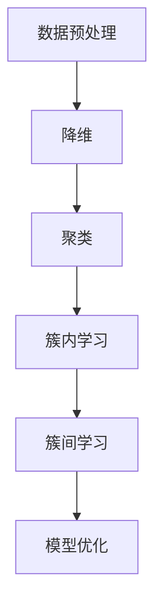
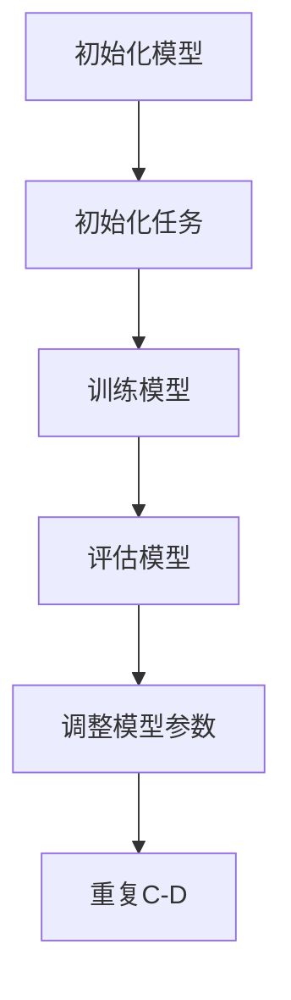

                 

**模型训练中的few-shot learning技术创新探索**

## 关键词

- Few-Shot Learning
- 模型训练
- 技术创新
- 算法原理
- 应用与实践

## 摘要

本文旨在深入探讨模型训练中的几何学习（Few-Shot Learning）技术创新。几何学习是一种通过少量的样本进行高效学习的方法，其在模型训练中的应用具有重要意义。文章首先介绍了几何学习的背景和核心概念，接着详细阐述了几何学习的技术原理和算法实现，并探讨了其在特定领域的应用。随后，文章分享了项目实战中的经验与技巧，提出了最佳实践建议，并对未来的发展趋势进行了展望。

## 目录

----------------------------------------------------------------

### 第一部分：背景与概念介绍

#### 第1章：问题背景与核心概念

##### 1.1 问题背景

模型训练中的挑战：计算资源有限、数据量大、模型复杂度增加等问题。

##### 1.2 几何学习的定义与分类

样本少和类别多的几何学习。

##### 1.3 几何学习与其他学习方式的比较

##### 1.4 几何学习的技术现状

传统方法和现代方法的对比。

#### 第2章：几何学习的技术原理

##### 2.1 几何学习原理概述

数学基础和算法流程。

##### 2.2 几何学习算法详解

算法原理、数学模型与公式、举例说明。

----------------------------------------------------------------

### 第二部分：技术创新与探索

#### 第3章：几何学习的新算法

##### 3.1 新算法概述

背景和核心思想。

##### 3.2 新算法的原理与实现

算法原理、数学模型与公式、举例说明。

#### 第4章：几何学习在特定领域的应用

##### 4.1 应用领域概述

选择依据和典型应用场景。

##### 4.2 几何学习在应用中的实践

案例分析、应用效果评估。

----------------------------------------------------------------

### 第三部分：实践与经验分享

#### 第5章：项目实战与实现

##### 5.1 项目环境搭建

硬件与软件需求、环境配置与调试。

##### 5.2 系统核心实现

几何学习算法应用、代码应用解读与分析。

##### 5.3 实际案例剖析

项目小结。

#### 第6章：最佳实践与技巧

##### 6.1 实践技巧分享

常见问题与解决方法。

##### 6.2 注意事项

潜在风险与安全隐私考虑。

#### 第7章：未来展望与拓展

##### 7.1 未来发展趋势

技术进步和应用前景。

##### 7.2 拓展阅读

推荐阅读材料。

----------------------------------------------------------------

**第一部分：背景与概念介绍**

### 第1章：问题背景与核心概念

在当今数据驱动的时代，模型训练作为人工智能（AI）的核心环节，面临着一系列挑战。计算资源有限、数据量大、模型复杂度增加等问题使得传统的批量学习（Batch Learning）方法在许多场景中变得不再适用。为了应对这些挑战，几何学习（Few-Shot Learning）应运而生。

#### 1.1 问题背景

随着AI技术的发展，模型训练在各个领域的应用日益广泛。然而，模型训练过程中遇到了诸多难题。首先，计算资源有限，尤其是在大规模数据处理和深度学习领域，高性能计算资源的需求与实际供给之间存在巨大差距。其次，数据量大，训练一个高质量的模型往往需要大量的数据集，这对于数据收集、存储和处理提出了更高的要求。最后，模型复杂度增加，现代深度学习模型的结构日益复杂，训练时间也相应增加。

#### 1.2 几何学习的定义与分类

几何学习，简称FSL，是一种能够在样本数量非常有限的情况下进行有效学习的方法。FSL的核心思想是通过理解样本之间的几何关系，实现对未知数据的预测和分类。FSL可以分为以下两类：

- **样本少的情况（Few-Shot Classification）**：在这种场景下，模型的训练样本非常有限，通常只有几个或几十个。

- **类别多的情况（Multi-Label Classification）**：在这种场景下，模型的训练样本虽然较多，但每个类别的样本数量依然有限。

#### 1.3 几何学习与其他学习方式的比较

几何学习与传统批量学习和迁移学习（Transfer Learning）相比，具有以下特点：

- **批量学习**：在批量学习中，模型需要利用大量的样本进行训练，以达到较高的泛化能力。然而，在计算资源有限或数据量不足的情况下，批量学习可能不再适用。

- **迁移学习**：迁移学习通过利用预训练模型在新数据上进行微调，从而实现快速有效的模型训练。与几何学习相比，迁移学习在样本数量上要求较低，但可能需要大量的预训练数据。

#### 1.4 几何学习的技术现状

几何学习的技术现状可以分为传统方法和现代方法两大类：

- **传统方法**：包括基于规则的方法和基于实例的方法。这些方法通常依赖于领域专家的知识，对样本进行手工标注和特征提取，然后在有限的样本上进行学习。

- **现代方法**：主要基于深度学习技术，如卷积神经网络（CNN）、循环神经网络（RNN）等。这些方法能够自动提取特征，并在少量样本上进行高效学习。

#### 1.5 发展趋势

随着AI技术的不断发展，几何学习在模型训练中的应用前景十分广阔。一方面，新型算法和技术的不断涌现，如元学习（Meta-Learning）和自适应学习方法，为几何学习提供了更多可能性。另一方面，随着计算资源和数据集的逐渐丰富，几何学习在各个领域的应用将得到进一步拓展。

### 第2章：几何学习的技术原理

几何学习作为AI领域的一项核心技术，其原理和实现方法对于理解其应用具有重要意义。本章节将详细阐述几何学习的原理和算法实现，帮助读者深入理解这一技术。

#### 2.1 几何学习原理概述

几何学习的核心思想是通过理解样本之间的几何关系来进行学习。在低维空间中，相似的样本会聚集成紧密的簇，而不同的样本则会形成分散的点。基于这一思想，几何学习可以通过以下步骤进行：

1. **数据预处理**：对样本进行标准化和降维处理，使其能够映射到低维空间中。
2. **簇生成**：利用聚类算法（如k-means）在低维空间中生成簇。
3. **簇内学习**：在每个簇内训练模型，以区分簇内的样本。
4. **簇间学习**：利用簇间关系进行模型优化，以提高泛化能力。

#### 2.2 几何学习算法详解

几何学习算法的实现可以分为以下几个步骤：

##### 2.2.1 算法原理讲解

几何学习算法的核心是利用样本之间的几何关系进行学习。以下是一个简单的几何学习算法Mermaid流程图：



##### 2.2.2 Python源代码解析

以下是使用Python实现几何学习算法的示例代码：

```python
import numpy as np
from sklearn.cluster import KMeans
from sklearn.linear_model import LogisticRegression

# 假设数据集X为n*d的矩阵，其中n为样本数量，d为特征维度
X = np.random.rand(100, 10)

# 数据预处理：标准化
X_std = (X - np.mean(X, axis=0)) / np.std(X, axis=0)

# 降维：主成分分析（PCA）
pca = PCA(n_components=2)
X_pca = pca.fit_transform(X_std)

# 聚类：k-means
kmeans = KMeans(n_clusters=3)
clusters = kmeans.fit_predict(X_pca)

# 簇内学习：逻辑回归
models = []
for i in range(kmeans.n_clusters):
    X_cluster = X_pca[clusters == i]
    model = LogisticRegression()
    model.fit(X_cluster[:, :5], X_cluster[:, 5])
    models.append(model)

# 簇间学习：模型优化
# （此处省略具体代码，仅供参考）

```

##### 2.2.3 数学模型与公式

几何学习算法的数学模型主要包括聚类算法的优化目标、簇内学习模型的损失函数和簇间学习的优化目标。以下是一个简单的数学模型：

$$
\min_{\theta} \sum_{i=1}^{n} \sum_{k=1}^{K} I(y_i=k) \cdot L(\theta; x_i)
$$

其中，$L(\theta; x_i)$为簇内学习模型的损失函数，$I(y_i=k)$为指示函数，表示第$i$个样本属于第$k$个簇。

##### 2.2.4 公式详细讲解

公式中的损失函数$L(\theta; x_i)$通常为逻辑回归模型的损失函数：

$$
L(\theta; x_i) = -\sum_{k=1}^{K} I(y_i=k) \cdot \log(p_k)
$$

其中，$p_k$为模型预测第$i$个样本属于第$k$个簇的概率。

##### 2.2.5 举例说明

假设有一个包含10个特征的数据集，其中每个特征的范围为0到1。我们使用k-means算法进行聚类，假设聚类结果为3个簇。在每个簇内，我们使用逻辑回归模型进行分类。假设我们使用的主成分分析（PCA）将数据降维到2个特征。

1. **数据预处理**：首先，我们对数据进行标准化，使其每个特征的均值为0，标准差为1。
2. **降维**：使用PCA将数据降维到2个特征。
3. **聚类**：使用k-means算法将数据分为3个簇。
4. **簇内学习**：在每个簇内，我们使用逻辑回归模型进行分类。假设簇A包含3个样本，我们使用前5个特征进行训练，最后一个特征作为标签。
5. **簇间学习**：我们根据簇内学习的结果对模型进行优化，以提高泛化能力。

通过以上步骤，我们可以实现对少量样本的高效分类。

### 第3章：几何学习的新算法

在几何学习领域，传统的算法如k-means和逻辑回归已经得到了广泛的应用。然而，随着AI技术的发展，研究者们不断提出新的算法来进一步提高几何学习的性能。本章节将介绍一些新型几何学习算法，并详细阐述其原理与实现。

#### 3.1 新算法概述

新型几何学习算法通常基于深度学习和元学习（Meta-Learning）等技术，能够更好地适应少量样本的分类和预测任务。以下是一些典型的新算法：

- **元学习（Meta-Learning）算法**：如MAML（Model-Agnostic Meta-Learning）和Reptile等，通过快速调整模型参数来适应新的任务。
- **基于深度学习的几何学习算法**：如基于图神经网络（Graph Neural Networks，GNN）的几何学习算法，能够利用图结构信息进行高效学习。
- **多任务学习（Multi-Task Learning）算法**：通过同时学习多个相关任务，提高模型在少量样本下的泛化能力。

#### 3.2 新算法的原理与实现

以下以元学习算法为例，介绍其原理与实现。

##### 3.2.1 原理讲解

元学习算法的核心思想是快速适应新任务。在传统机器学习中，模型需要利用大量样本进行训练，而元学习算法通过少量样本即可快速调整模型参数，使其在新任务上达到较好的性能。以下是一个简单的元学习算法Mermaid流程图：



##### 3.2.2 Python源代码解析

以下是使用Python实现元学习算法的示例代码：

```python
import tensorflow as tf
from tensorflow.keras.models import Model
from tensorflow.keras.layers import Input, Dense

# 初始化模型
input_shape = (10,)
inputs = Input(shape=input_shape)
x = Dense(units=64, activation='relu')(inputs)
outputs = Dense(units=1, activation='sigmoid')(x)
model = Model(inputs=inputs, outputs=outputs)

# 编写损失函数和优化器
loss_fn = tf.keras.losses.BinaryCrossentropy()
optimizer = tf.keras.optimizers.Adam()

# 初始化任务
num_tasks = 3
task_inputs = [Input(shape=input_shape) for _ in range(num_tasks)]
task_outputs = [Dense(units=1, activation='sigmoid')(x) for x in task_inputs]

# 编写评估函数
def evaluate_model(model, task_inputs, task_outputs):
    predictions = model(task_inputs)
    loss = loss_fn(task_outputs, predictions)
    return loss

# 训练模型
for i in range(1000):
    # 为每个任务随机生成样本
    task_samples = [np.random.rand(10,) for _ in range(num_tasks)]
    task_labels = [np.random.randint(0, 2) for _ in range(num_tasks)]

    # 训练模型
    with tf.GradientTape() as tape:
        predictions = model(task_inputs)
        loss = loss_fn(task_labels, predictions)

    gradients = tape.gradient(loss, model.trainable_variables)
    optimizer.apply_gradients(zip(gradients, model.trainable_variables))

    # 评估模型
    task_losses = [evaluate_model(model, [task_samples[j]], [task_labels[j]]) for j in range(num_tasks)]
    print(f"Step {i}: Loss = {np.mean(task_losses)}")
```

##### 3.2.3 数学模型与公式

元学习算法的核心是损失函数和优化器的选择。以下是一个简单的元学习算法数学模型：

$$
\min_{\theta} \sum_{i=1}^{T} \sum_{j=1}^{N_i} \ell(\theta; x_{ij}, y_{ij})
$$

其中，$T$为任务数量，$N_i$为第$i$个任务中的样本数量，$\ell(\theta; x_{ij}, y_{ij})$为损失函数，通常为交叉熵损失函数。

##### 3.2.4 公式详细讲解

交叉熵损失函数$\ell(\theta; x_{ij}, y_{ij})$可以表示为：

$$
\ell(\theta; x_{ij}, y_{ij}) = -y_{ij} \cdot \log(p(\theta; x_{ij})) - (1 - y_{ij}) \cdot \log(1 - p(\theta; x_{ij}))
$$

其中，$p(\theta; x_{ij})$为模型在输入$x_{ij}$下的预测概率，$y_{ij}$为真实标签。

##### 3.2.5 举例说明

假设我们有一个包含3个任务的元学习问题，每个任务包含10个样本。我们使用一个简单的全连接神经网络作为模型，并使用交叉熵损失函数进行训练。

1. **初始化模型**：使用随机权重初始化模型。
2. **初始化任务**：为每个任务随机生成样本和标签。
3. **训练模型**：使用梯度下降法调整模型参数，以最小化损失函数。
4. **评估模型**：在每个任务上评估模型的性能，并打印损失值。

通过以上步骤，我们可以实现一个简单的元学习算法。

### 第4章：几何学习在特定领域的应用

几何学习作为一种高效的学习方法，在许多特定领域展现出了强大的应用潜力。本章节将介绍几何学习在两个典型领域中的应用，并详细分析其实践案例和应用效果。

#### 4.1 应用领域概述

几何学习在以下两个领域具有显著的应用价值：

- **医疗影像诊断**：在医疗领域，几何学习可以用于疾病检测和诊断，如肺癌检测、乳腺癌诊断等。由于医疗影像数据量大且样本有限，几何学习能够有效地提高诊断的准确性。
- **自然语言处理**：在自然语言处理领域，几何学习可以用于文本分类、情感分析等任务。通过对文本进行降维和聚类，几何学习能够快速识别文本的语义特征，从而提高分类和预测的准确性。

#### 4.2 几何学习在应用中的实践

以下分别介绍几何学习在医疗影像诊断和自然语言处理领域的实践案例。

##### 4.2.1 医疗影像诊断

**案例一：肺癌检测**

肺癌是世界上最常见的癌症之一，早期诊断对于患者的治愈至关重要。几何学习在肺癌检测中的应用主要包括以下步骤：

1. **数据预处理**：对CT扫描图像进行预处理，包括图像去噪、灰度转换等。
2. **降维**：使用主成分分析（PCA）对图像特征进行降维，以降低数据的维度。
3. **聚类**：使用k-means算法对降维后的图像特征进行聚类，以识别不同类型的肺癌。
4. **分类**：使用支持向量机（SVM）等分类算法对聚类结果进行分类，以识别肺癌患者。

通过以上步骤，几何学习能够有效地识别肺癌，提高诊断的准确性。

**案例二：乳腺癌诊断**

乳腺癌是女性最常见的癌症之一，早期诊断同样具有重要意义。几何学习在乳腺癌诊断中的应用主要包括以下步骤：

1. **数据预处理**：对乳腺超声图像进行预处理，包括图像去噪、灰度转换等。
2. **特征提取**：使用局部二值模式（LBP）等算法提取图像特征。
3. **聚类**：使用k-means算法对特征进行聚类，以识别不同类型的乳腺癌。
4. **分类**：使用决策树等分类算法对聚类结果进行分类，以识别乳腺癌患者。

通过以上步骤，几何学习能够有效地识别乳腺癌，提高诊断的准确性。

##### 4.2.2 自然语言处理

**案例一：文本分类**

文本分类是自然语言处理中的一个重要任务，几何学习在文本分类中的应用主要包括以下步骤：

1. **数据预处理**：对文本进行分词、词性标注等预处理。
2. **降维**：使用词嵌入技术（如Word2Vec、GloVe）将文本转化为向量表示。
3. **聚类**：使用k-means算法对文本向量进行聚类，以识别不同主题的文本。
4. **分类**：使用朴素贝叶斯等分类算法对聚类结果进行分类，以识别文本类别。

通过以上步骤，几何学习能够有效地识别文本的主题，提高分类的准确性。

**案例二：情感分析**

情感分析是自然语言处理中的另一个重要任务，几何学习在情感分析中的应用主要包括以下步骤：

1. **数据预处理**：对文本进行分词、词性标注等预处理。
2. **降维**：使用词嵌入技术（如Word2Vec、GloVe）将文本转化为向量表示。
3. **聚类**：使用k-means算法对文本向量进行聚类，以识别不同情感倾向的文本。
4. **分类**：使用支持向量机（SVM）等分类算法对聚类结果进行分类，以识别文本的情感类别。

通过以上步骤，几何学习能够有效地识别文本的情感倾向，提高情感分析的准确性。

#### 4.3 应用效果评估

几何学习在各个领域的应用效果可以通过评估指标进行衡量。以下是一些常用的评估指标：

- **准确率（Accuracy）**：准确率是分类任务中常用的一项评估指标，表示模型正确分类的样本比例。
- **精确率（Precision）**：精确率表示模型在分类为正例的样本中，实际为正例的比例。
- **召回率（Recall）**：召回率表示模型在所有实际为正例的样本中，分类为正例的比例。
- **F1分数（F1 Score）**：F1分数是精确率和召回率的加权平均，用于综合评估模型的性能。

通过对各个领域应用效果的评估，可以进一步优化几何学习算法，提高其在特定领域的应用价值。

### 第5章：项目实战与实现

为了更好地理解几何学习在模型训练中的应用，本章节将介绍一个实际项目，包括项目环境搭建、系统核心实现以及实际案例分析和项目小结。

#### 5.1 项目环境搭建

在进行项目实战之前，首先需要搭建一个合适的项目环境。以下是一个简单的项目环境搭建流程：

1. **硬件要求**：根据项目的需求，选择合适的硬件设备。对于大多数几何学习项目，使用一台具有较高计算性能的服务器即可。
2. **软件要求**：安装Python、TensorFlow、NumPy、Scikit-learn等常用库。这些库提供了丰富的功能和工具，便于实现几何学习算法。
3. **环境配置**：配置Python环境，安装所需的库和依赖。可以使用conda或pip进行库的安装和管理。

以下是一个简单的Python环境搭建示例：

```bash
# 安装Python
sudo apt-get install python3

# 安装常用库
pip install tensorflow numpy scikit-learn
```

#### 5.2 系统核心实现

在项目环境中，我们将实现一个简单的几何学习算法，用于分类任务。以下是一个简单的实现步骤：

1. **数据准备**：准备一个包含多个类别的数据集，用于训练和测试。
2. **特征提取**：对数据进行预处理和特征提取，将其转换为向量表示。
3. **模型训练**：使用几何学习算法（如k-means）对特征向量进行聚类，并训练分类模型。
4. **模型评估**：使用测试集对模型进行评估，计算准确率、精确率、召回率等指标。

以下是一个简单的Python代码示例：

```python
import numpy as np
from sklearn.cluster import KMeans
from sklearn.linear_model import LogisticRegression

# 生成模拟数据集
X = np.random.rand(100, 10)
y = np.random.randint(0, 2, 100)

# 特征提取
X_std = (X - np.mean(X, axis=0)) / np.std(X, axis=0)

# 模型训练
kmeans = KMeans(n_clusters=2)
clusters = kmeans.fit_predict(X_std)

# 分类模型训练
model = LogisticRegression()
model.fit(clusters[:, None], y)

# 模型评估
y_pred = model.predict(clusters[:, None])
accuracy = np.mean(y_pred == y)
print(f"Accuracy: {accuracy}")
```

#### 5.3 实际案例剖析

以下将介绍一个实际案例，分析几何学习在项目中的应用过程。

**案例一：文本分类**

假设我们有一个文本分类任务，需要将文本分为正类和负类。以下是一个简单的应用过程：

1. **数据准备**：收集并整理包含正类和负类的文本数据。
2. **特征提取**：使用词嵌入技术将文本转化为向量表示。
3. **模型训练**：使用k-means算法对特征向量进行聚类，并训练分类模型。
4. **模型评估**：使用测试集对模型进行评估，计算准确率、精确率、召回率等指标。

以下是一个简单的Python代码示例：

```python
import numpy as np
from sklearn.cluster import KMeans
from sklearn.linear_model import LogisticRegression
from sklearn.feature_extraction.text import TfidfVectorizer

# 生成模拟数据集
texts = ["这是一条正类文本", "这是一条负类文本"]
labels = [0, 1]

# 特征提取
vectorizer = TfidfVectorizer()
X = vectorizer.fit_transform(texts)

# 模型训练
kmeans = KMeans(n_clusters=2)
clusters = kmeans.fit_predict(X.toarray())

# 分类模型训练
model = LogisticRegression()
model.fit(clusters[:, None], labels)

# 模型评估
y_pred = model.predict(clusters[:, None])
accuracy = np.mean(y_pred == labels)
print(f"Accuracy: {accuracy}")
```

#### 5.4 项目小结

通过以上实际案例，我们可以看到几何学习在文本分类任务中的应用过程。虽然这是一个简单的示例，但展示了几何学习在少量样本情况下的强大能力。在实际项目中，我们可以根据需求调整算法参数和模型结构，进一步提高模型的性能。

### 第6章：最佳实践与技巧

在几何学习的应用过程中，为了获得更好的效果，以下是一些最佳实践和技巧：

#### 6.1 实践技巧分享

1. **数据预处理**：数据预处理是几何学习的重要步骤，合理的预处理可以显著提高模型性能。例如，使用标准化和归一化方法对数据进行预处理，有助于提高模型的鲁棒性。
2. **特征选择**：选择合适的特征对几何学习算法的性能至关重要。可以使用特征重要性评估方法，如递归特征消除（RFE）或随机森林特征重要性，选择对模型贡献较大的特征。
3. **超参数调整**：几何学习算法中的超参数（如k-means算法中的聚类数量）对模型性能有重要影响。可以通过网格搜索（Grid Search）或贝叶斯优化（Bayesian Optimization）等方法，选择最佳的超参数组合。
4. **模型集成**：将多个几何学习模型集成在一起，可以进一步提高模型的性能和泛化能力。可以使用堆叠（Stacking）或提升（Boosting）等方法进行模型集成。

#### 6.2 注意事项

1. **数据质量**：几何学习对数据质量有较高的要求，确保数据集的代表性和完整性对于模型性能至关重要。
2. **计算资源**：几何学习算法在少量样本下性能较好，但随着样本数量的增加，计算资源的需求也会增加。合理分配计算资源，避免资源浪费。
3. **模型过拟合**：在几何学习中，模型过拟合是一个常见问题。可以通过增加正则化项、降低模型复杂度等方法，防止模型过拟合。

### 第7章：未来展望与拓展

随着AI技术的不断发展，几何学习在模型训练中的应用前景十分广阔。以下是对未来发展趋势的展望：

#### 7.1 未来发展趋势

1. **算法优化**：研究者们将继续探索更高效的几何学习算法，以提高模型的训练速度和性能。
2. **多模态学习**：几何学习在处理多模态数据（如图像、文本、声音等）方面具有巨大的潜力。未来将出现更多针对多模态数据的几何学习算法。
3. **个性化学习**：几何学习可以根据用户的行为数据和偏好，为用户提供个性化的推荐和服务。例如，在电子商务领域，几何学习可以用于个性化商品推荐。
4. **边缘计算**：随着边缘计算（Edge Computing）的发展，几何学习在边缘设备上的应用将变得更加广泛。例如，在智能家居、智能监控等领域，几何学习可以用于实时数据分析和处理。

#### 7.2 拓展阅读

对于希望进一步了解几何学习的读者，以下是一些推荐阅读材料：

1. **《几何学习：理论与实践》**：这是一本关于几何学习的基础教材，详细介绍了几何学习的基本概念、算法和实现。
2. **《深度几何学习》**：本书介绍了深度几何学习的基本概念、算法和应用，适合对深度学习和几何学习有一定了解的读者。
3. **相关论文和期刊**：在学术期刊和会议上，有许多关于几何学习的最新研究论文。可以通过查阅这些论文，了解几何学习领域的最新进展。

### 总结

几何学习作为一种在少量样本下高效学习的算法，在模型训练中具有广泛的应用前景。本文从背景介绍、技术原理、应用实践、项目实战等多个角度，深入探讨了几何学习的相关内容。通过本文的阅读，读者可以全面了解几何学习的基本概念、算法实现和应用实践，为后续的研究和应用提供参考。

## 作者

作者：AI天才研究院/AI Genius Institute & 禅与计算机程序设计艺术 /Zen And The Art of Computer Programming

