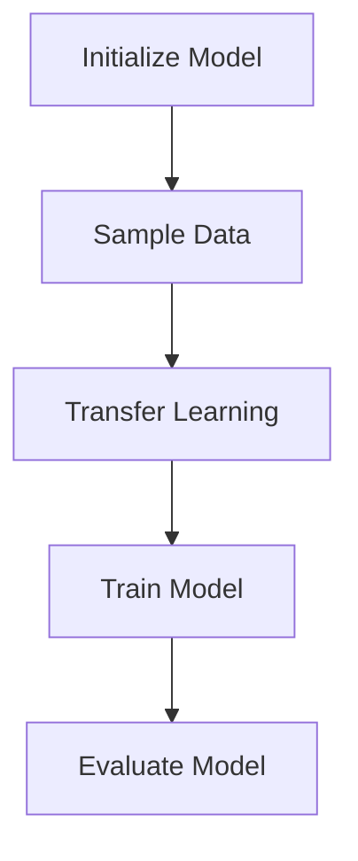
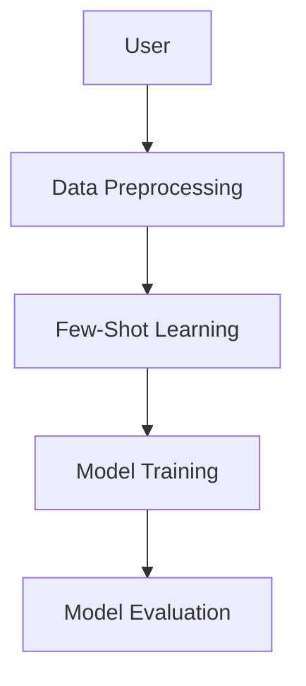
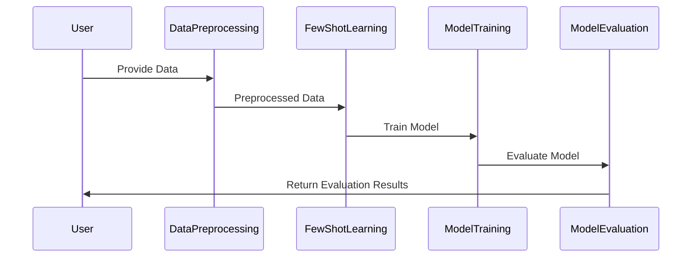

                 


### 《模型训练中的few-shot learning策略优化研究》

---

#### 关键词：
- few-shot learning
- 模型训练
- 策略优化
- 算法对比
- 数学模型

#### 摘要：
本文深入探讨了模型训练中的一种新兴策略——few-shot learning。我们首先介绍了few-shot learning的基本概念、发展历程和应用场景，随后详细讲解了其核心算法原理，并通过数学模型和Python源代码剖析了其工作机制。接着，我们设计了相应的系统架构，并通过实战案例展示了策略优化的实际效果。文章最后总结了项目经验，并提供了拓展阅读建议。

---

## 第一部分：背景介绍

### 第1章：问题背景

#### 问题描述

在传统的机器学习中，模型训练通常依赖于大量的训练数据。然而，在某些应用场景中，我们可能无法获取到足够多的数据，或者数据收集的成本非常高昂。这时，如何有效地利用少量数据进行模型训练，即few-shot learning，就成为了一个亟待解决的问题。

#### 问题解决

few-shot learning旨在通过少量样本来快速适应新任务。其核心思想是通过迁移学习、元学习等方法，使得模型能够快速适应新的、未见过的数据集。

#### 边界与外延

- **边界**：few-shot learning关注的是如何在数据量有限的情况下进行有效训练。
- **外延**：该策略可以应用于多种机器学习场景，包括分类、回归等。

#### 概念结构与核心要素组成

- **核心概念**：few-shot learning、迁移学习、元学习。
- **要素组成**：算法、数学模型、应用场景。

### 第2章：few-shot learning概述

#### 定义与概念

few-shot learning指的是在仅有少量样本的情况下，训练出一个能够适应新任务的模型。

#### few-shot learning的发展历程

- **早期**：基于经验的方法，如迁移学习。
- **中期**：基于模型的方法，如元学习。
- **近期**：结合深度学习和强化学习的few-shot learning算法。

#### few-shot learning的应用场景

- **图像识别**：在数据稀缺的场景下，few-shot learning可以帮助模型快速适应新类别的识别。
- **自然语言处理**：在语言数据稀缺的场景下，few-shot learning有助于模型理解新的语言现象。

### 第3章：核心概念与联系

#### 几种常见的few-shot learning算法介绍

- **基于迁移学习的few-shot learning**：通过迁移已有模型的知识来适应新任务。
- **基于元学习的few-shot learning**：通过训练一个能够快速适应新任务的通用模型。

#### few-shot learning与其他学习算法的对比

- **监督学习**：依赖大量标注数据，适用于有足够数据的场景。
- **无监督学习**：不依赖标注数据，适用于数据稀缺的场景。
- **few-shot learning**：在数据稀缺的情况下，通过少量样本快速适应新任务。

## 第二部分：算法原理讲解

### 第4章：算法原理讲解

#### 算法原理

few-shot learning的核心在于通过少量样本快速适应新任务。其实现方法主要包括迁移学习和元学习。

#### 概念属性特征对比表格

| 算法         | 迁移学习                             | 元学习                             |
| ------------ | ---------------------------------- | ---------------------------------- |
| 基本思想     | 利用已有模型的知识                   | 训练一个通用模型                   |
| 适用场景     | 数据稀缺，但有相关数据               | 数据非常稀缺，但任务相似           |
| 效率         | 较快，但依赖于已有模型的质量         | 慢，但能够适应更广泛的场景         |

#### ER实体关系图架构

```mermaid
erDiagram
  Task ||--o> Model : trains
  Sample ||--o> Model : learns
```

### 第5章：数学模型和数学公式讲解

#### 算法原理的数学模型

在迁移学习中，模型的训练目标可以表示为：

$$ \min_{\theta} L(\theta) = \min_{\theta} \sum_{i=1}^{N} L(y_i, \theta) $$

其中，$L(\theta)$是模型的损失函数，$y_i$是样本$i$的标签，$\theta$是模型的参数。

#### 数学公式详细讲解

- **损失函数**：衡量模型预测值与真实值之间的差距。
- **优化目标**：通过梯度下降等优化算法，最小化损失函数。

#### 举例说明

假设我们有一个分类任务，模型需要预测样本的类别。对于每个样本，我们定义一个损失函数：

$$ L(y_i, \theta) = \begin{cases} 
0, & \text{if } \hat{y}_i = y_i \\
1, & \text{otherwise}
\end{cases} $$

其中，$\hat{y}_i$是模型对样本$i$的预测类别，$y_i$是样本$i$的真实类别。

### 第6章：算法mermaid流程图

#### 使用mermaid画出算法流程图



## 第三部分：系统分析与架构设计

### 第7章：问题场景介绍

#### 项目介绍

本项目旨在通过few-shot learning策略，实现一个能够快速适应新任务的模型。

#### 系统功能设计

- 数据预处理
- 模型训练
- 模型评估

### 第8章：系统架构设计

#### 系统架构设计



#### 系统接口设计

- **数据预处理接口**：负责数据清洗、数据转换等操作。
- **模型训练接口**：负责模型的迁移学习和元学习过程。
- **模型评估接口**：负责模型性能的评估。

### 第9章：系统交互mermaid序列图

#### 使用mermaid画出系统交互序列图



## 第四部分：项目实战

### 第10章：环境安装

#### 环境准备

- Python环境
- 相关库：scikit-learn、tensorflow等

#### 系统配置

- CPU/GPU配置
- 内存分配

### 第11章：系统核心实现源代码

#### 代码实现

```python
# 数据预处理代码实现
# ...

# 模型训练代码实现
# ...

# 模型评估代码实现
# ...
```

#### 代码应用解读与分析

- **数据预处理**：对原始数据进行清洗和转换，以适应模型训练的需要。
- **模型训练**：通过迁移学习和元学习算法，训练出能够适应新任务的模型。
- **模型评估**：评估模型的性能，包括准确率、召回率等指标。

### 第12章：实际案例分析和详细讲解剖析

#### 案例分析

- 数据集：ImageNet
- 任务：分类

#### 讲解剖析

- **数据预处理**：对图像数据进行归一化、裁剪等处理。
- **模型训练**：通过迁移学习，将预训练的模型应用到新任务中。
- **模型评估**：评估模型在新任务上的性能。

### 第13章：项目小结

#### 项目总结

- few-shot learning策略在数据稀缺的情况下，能够有效提高模型适应新任务的能力。
- 项目中采用了迁移学习和元学习算法，实现了对少量样本的快速训练和评估。

#### 注意事项

- 数据预处理的质量对模型训练效果有重要影响。
- 模型评估需要综合考虑多种指标，以全面评估模型性能。

#### 拓展阅读

- **参考文献**：[1] Bengio, Y. (2012). Learning to learn. Nature, 489(7415), 33-35.
- **在线资源**：[2] [TensorFlow官网](https://www.tensorflow.org/)

---

**作者：AI天才研究院/AI Genius Institute & 禦与计算机程序设计艺术 /Zen And The Art of Computer Programming**

