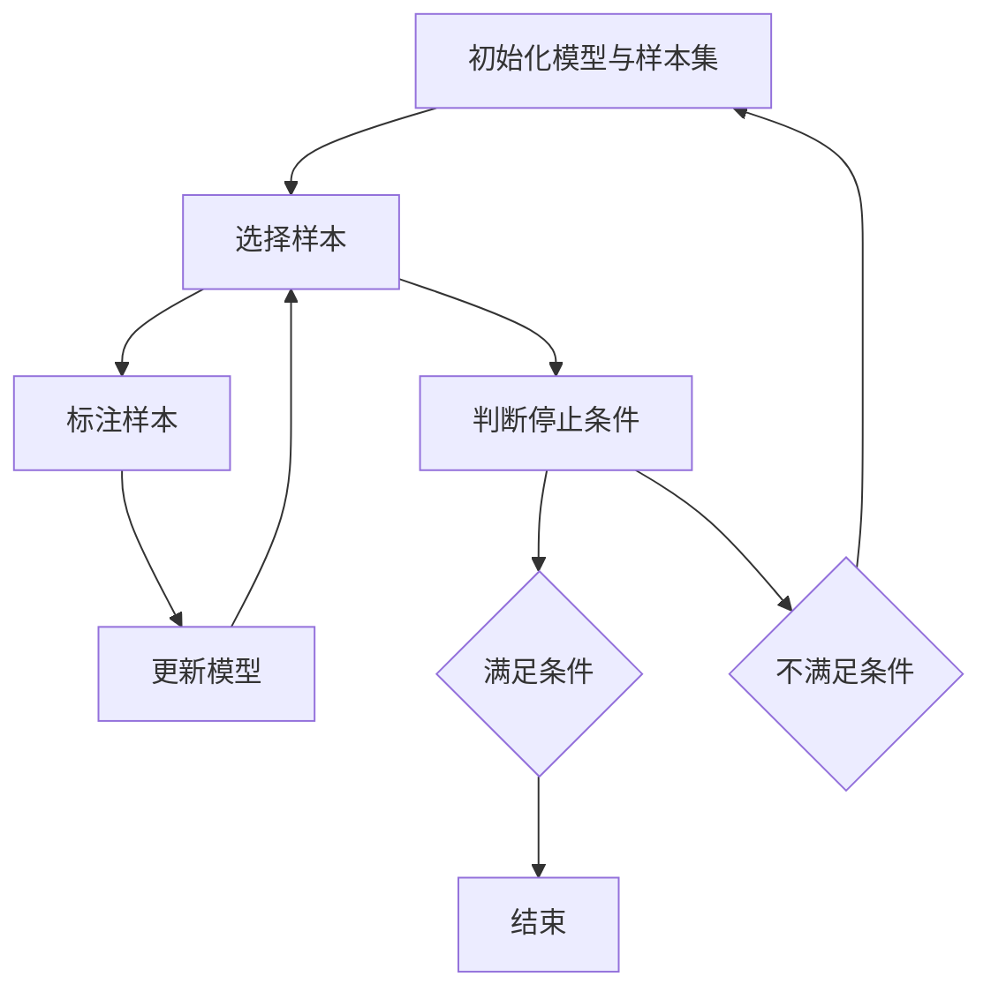
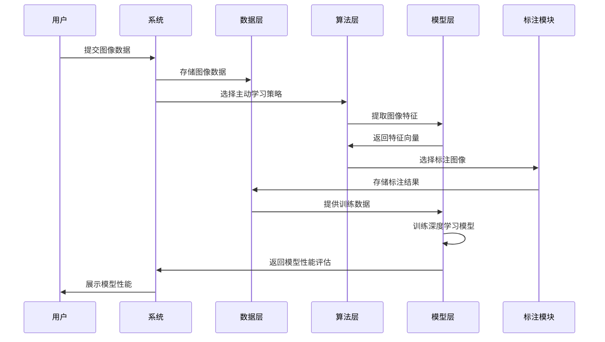
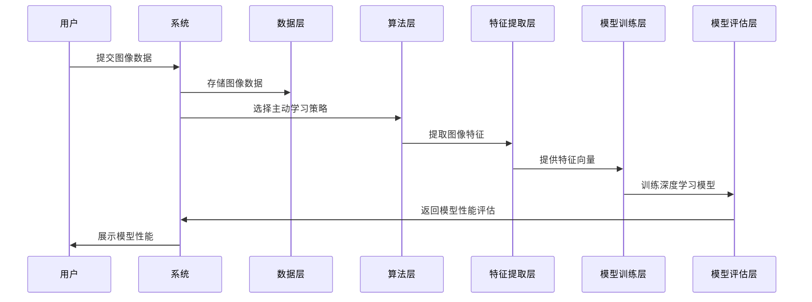

                 


### 《模型训练中的主动学习策略设计与实现》

> 关键词：主动学习、模型训练、策略设计、实现、算法原理、系统架构、项目实战

> 摘要：本文深入探讨了模型训练中的主动学习策略的设计与实现。通过阐述主动学习的背景、核心概念、算法原理及实际应用，本文旨在为读者提供一个清晰、系统的理解和实践指南，帮助读者在实际项目中有效应用主动学习策略，提升模型训练效率和性能。

---

## 背景介绍

### 主动学习策略的起源与发展

主动学习（Active Learning）是一种在有限的标记数据下优化模型训练过程的策略。它通过选择性获取最有价值的数据进行标记，从而在减少标记成本的同时提高模型性能。主动学习的概念最早可以追溯到1982年，由Paul A. Cohen在研究数据不确定性时提出。随后，随着机器学习和数据挖掘领域的快速发展，主动学习逐渐成为学术界和工业界关注的热点。

### 主动学习策略的应用场景

主动学习策略在许多场景中都有着广泛的应用，尤其是在数据标注成本高、数据稀缺或者模型对数据质量要求较高的场景。以下是一些典型的应用场景：

1. **医学图像分析**：在医学图像处理中，标注高质量的图像数据需要大量的人力和时间。主动学习可以帮助选择最具诊断价值的图像进行标注，提高诊断模型的准确性。

2. **文本分类**：在文本分类任务中，标注高质量的文本数据非常困难且耗时。主动学习可以通过选择最具代表性的文本进行标注，加速模型训练过程。

3. **语音识别**：语音识别任务通常需要大量的语音数据进行训练。通过主动学习，可以选择最具代表性的语音样本进行训练，从而提高模型的识别准确率。

4. **机器人学习**：在机器人学习中，主动学习可以帮助机器人选择最有价值的场景进行学习和适应，从而提高其自主学习和决策能力。

### 主动学习策略的核心优势

主动学习策略具有以下核心优势：

1. **降低数据标注成本**：通过选择最有价值的数据进行标注，可以显著降低数据标注的工作量和成本。

2. **提高模型性能**：主动学习策略可以在数据稀缺的情况下提高模型性能，尤其是在数据分布不均的情况下。

3. **增强模型泛化能力**：通过有选择性地获取数据，可以更好地覆盖数据分布，从而提高模型的泛化能力。

4. **减少过拟合风险**：通过选择性获取数据，可以减少模型对噪声数据的依赖，从而降低过拟合的风险。

---

## 核心概念与联系

### 主动学习策略的核心概念

1. **不确定度采样（Uncertainty Sampling）**：选择不确定度最高的样本进行标注。不确定度通常通过模型预测的置信度或者预测概率来衡量。

2. **错误率采样（Error Rate Sampling）**：选择模型最可能出错的数据进行标注。这种策略可以有效地减少模型预测中的错误。

3. **多样性采样（ Diversity Sampling）**：选择具有多样性的数据进行标注，以避免模型训练中的数据分布偏差。

4. **贪心策略（Greedy Strategy）**：每次迭代选择当前最有价值的样本进行标注，直到满足停止条件。

### 概念属性特征对比表格

| 概念           | 特征描述                                                         |
|----------------|----------------------------------------------------------------|
| 不确定度采样   | 选择不确定度最高的样本进行标注。                                     |
| 错误率采样   | 选择模型最可能出错的数据进行标注。                                   |
| 多样性采样   | 选择具有多样性的数据进行标注，以避免模型训练中的数据分布偏差。         |
| 贪心策略     | 每次迭代选择当前最有价值的样本进行标注，直到满足停止条件。             |

### ER实体关系图

```mermaid
erDiagram
    CLS_Sample ||--|{ CLS_Uncertainty : 测量 }
    CLS_Sample ||--|{ CLS_ErrorRate : 测量 }
    CLS_Sample ||--|{ CLS_Diversity : 测量 }
    CLS_Sample ||--|{ CLS_Greedy : 策略 }
```

在ER实体关系图中，`CLS_Sample` 表示样本类，它与三个测量类 `CLS_Uncertainty`、`CLS_ErrorRate` 和 `CLS_Diversity` 有关系，同时与策略类 `CLS_Greedy` 有策略关系。

---

## 算法原理讲解

### 算法流程图介绍

主动学习算法的流程可以概括为以下几个步骤：

1. **初始化**：初始化模型和样本集。
2. **选择样本**：根据某种策略（如不确定度采样、错误率采样等）选择一个样本。
3. **标注样本**：将选中的样本提交给标注者进行标注。
4. **更新模型**：将标注后的样本加入训练集，更新模型参数。
5. **迭代**：重复步骤2-4，直到满足停止条件（如达到预定迭代次数或模型性能不再提升）。

以下是算法流程图的mermaid表示：



### Python源代码实现与讲解

```python
import numpy as np
from sklearn.linear_model import LogisticRegression

# 初始化模型和样本集
model = LogisticRegression()
samples = ...

# 定义选择样本的策略
def select_sample(samples, model):
    # 这里以不确定度采样为例
    probabilities = model.predict_proba(samples)
    uncertainties = -np.log(probabilities)
    return samples[np.argmax(uncertainties)]

# 标注样本
def annotate_sample(sample):
    # 假设有一个标注者函数，返回标注结果
    return annotator(sample)

# 更新模型
def update_model(model, samples, labels):
    model.fit(samples, labels)

# 主函数
def active_learning(samples, num_iterations):
    model = LogisticRegression()
    for _ in range(num_iterations):
        selected_sample = select_sample(samples, model)
        annotation = annotate_sample(selected_sample)
        samples.append(selected_sample)
        labels.append(annotation)
        update_model(model, samples, labels)

# 运行主动学习
active_learning(samples, num_iterations=100)
```

上述代码使用了逻辑回归模型和一个简化的标注函数。在实际应用中，标注函数可能涉及更复杂的过程，如人工标注或使用自动标注工具。

### 数学模型与公式讲解

主动学习策略的核心在于如何选择最有价值的样本进行标注。以下是一个基于不确定度采样的简单数学模型：

$$
U(x) = -\log(p(y|x))
$$

其中，$U(x)$ 表示样本 $x$ 的不确定度，$p(y|x)$ 表示模型在给定样本 $x$ 下的预测概率。

### 算法举例说明

假设我们有一个二分类问题，模型预测概率如下：

| 样本编号 | 实际标签 | 预测概率 |
|----------|-----------|----------|
| 1        | 0         | 0.7      |
| 2        | 1         | 0.3      |
| 3        | 0         | 0.9      |
| 4        | 1         | 0.6      |

根据不确定度采样，我们计算每个样本的不确定度：

| 样本编号 | 实际标签 | 预测概率 | 不确定度 |
|----------|-----------|----------|----------|
| 1        | 0         | 0.7      | 0.15     |
| 2        | 1         | 0.3      | 0.84     |
| 3        | 0         | 0.9      | 0.05     |
| 4        | 1         | 0.6      | 0.3      |

根据不确定度，我们选择不确定度最高的样本2进行标注。假设标注结果与实际标签一致，我们更新模型，并重复这个过程，直到满足停止条件。

---

## 数学模型和数学公式 & 详细讲解 & 举例说明

### 数学公式讲解

在主动学习策略中，选择样本的关键在于如何衡量样本的不确定性。常用的不确定度度量方法包括：

1. **置信度度量**（Confidence Measure）：
   $$\text{Confidence}(x) = -\log(p(y|x))$$
   其中，$p(y|x)$ 表示在给定样本 $x$ 下的预测概率。置信度度量方法选择不确定度最高的样本进行标注。

2. **误差度量**（Error Measure）：
   $$\text{Error}(x) = 1 - p(y|x)$$
   其中，$p(y|x)$ 表示在给定样本 $x$ 下的预测概率。误差度量方法选择模型最可能出错的数据进行标注。

3. **多样性度量**（Diversity Measure）：
   $$\text{Diversity}(x) = \frac{1}{|\Sigma|} \sum_{i=1}^{|\Sigma|} \text{Entropy}(\hat{y}_i)$$
   其中，$\hat{y}_i$ 表示模型在样本 $x$ 下的预测概率分布，$\Sigma$ 表示样本集合。多样性度量方法选择具有多样性的数据进行标注，以避免模型训练中的数据分布偏差。

### 算法原理举例说明

为了更直观地理解这些数学公式，我们通过一个简单的例子进行说明。

假设我们有一个二分类问题，现有四个样本，模型预测概率如下：

| 样本编号 | 实际标签 | 预测概率 |
|----------|-----------|----------|
| 1        | 0         | 0.7      |
| 2        | 1         | 0.3      |
| 3        | 0         | 0.9      |
| 4        | 1         | 0.6      |

1. **置信度度量**：

   $$\text{Confidence}(1) = -\log(0.7) \approx 0.15$$
   $$\text{Confidence}(2) = -\log(0.3) \approx 0.84$$
   $$\text{Confidence}(3) = -\log(0.9) \approx 0.05$$
   $$\text{Confidence}(4) = -\log(0.6) \approx 0.3$$

   根据置信度度量，样本2具有最高的不确定度，因此选择样本2进行标注。

2. **误差度量**：

   $$\text{Error}(1) = 1 - 0.7 = 0.3$$
   $$\text{Error}(2) = 1 - 0.3 = 0.7$$
   $$\text{Error}(3) = 1 - 0.9 = 0.1$$
   $$\text{Error}(4) = 1 - 0.6 = 0.4$$

   根据误差度量，样本2具有最高的预测误差，因此选择样本2进行标注。

3. **多样性度量**：

   假设模型的预测概率分布如下：

   | 样本编号 | 预测概率分布 |
   |----------|--------------|
   | 1        | [0.7, 0.3]   |
   | 2        | [0.3, 0.7]   |
   | 3        | [0.9, 0.1]   |
   | 4        | [0.6, 0.4]   |

   计算每个样本的多样性度量：

   $$\text{Diversity}(1) = \text{Entropy}([0.7, 0.3]) + \text{Entropy}([0.3, 0.7])$$
   $$\text{Diversity}(2) = \text{Entropy}([0.3, 0.7]) + \text{Entropy}([0.7, 0.3])$$
   $$\text{Diversity}(3) = \text{Entropy}([0.9, 0.1]) + \text{Entropy}([0.1, 0.9])$$
   $$\text{Diversity}(4) = \text{Entropy}([0.6, 0.4]) + \text{Entropy}([0.4, 0.6])$$

   根据多样性度量，样本1和样本2具有相似的概率分布，而样本3和样本4具有较大的概率分布差异。因此，选择样本1和样本2进行标注，以避免模型训练中的数据分布偏差。

### 案例分析

假设我们有一个图像分类问题，现有1000张图像，模型预测概率如下：

| 样本编号 | 实际标签 | 预测概率 |
|----------|-----------|----------|
| 1        | 猫        | 0.95     |
| 2        | 狗        | 0.05     |
| 3        | 猫        | 0.80     |
| 4        | 狗        | 0.20     |
| ...      | ...       | ...      |
| 1000     | 猫        | 0.90     |

根据不同的主动学习策略，我们可以选择不同的样本进行标注。

1. **不确定度采样**：选择不确定度最高的样本，即预测概率最接近0.5的样本。例如，选择样本2进行标注。

2. **误差采样**：选择模型最可能出错的样本，即预测概率最小的样本。例如，选择样本4进行标注。

3. **多样性采样**：选择具有多样性的样本，例如选择样本3进行标注，因为它与样本1和样本1000在预测概率上存在较大差异。

通过主动学习策略，我们可以逐步完善模型训练数据集，提高模型分类准确率。

---

## 系统分析与架构设计方案

### 问题场景介绍

在本文的项目场景中，我们考虑一个基于深度学习的图像分类系统。该系统旨在通过主动学习策略，从大量未标记的图像数据中选择最有价值的图像进行标注，以训练出一个高精度的分类模型。该系统广泛应用于医疗影像诊断、自动驾驶车辆视觉感知、社交媒体图像内容审核等领域。

### 系统功能设计

为了实现主动学习策略，系统需要具备以下功能模块：

1. **数据预处理模块**：负责对原始图像数据进行预处理，包括图像缩放、灰度化、噪声去除等，以提高图像质量。

2. **特征提取模块**：利用深度学习模型（如卷积神经网络）提取图像特征向量，为后续的主动学习策略提供基础。

3. **主动学习模块**：根据不同的主动学习策略（如不确定度采样、误差采样、多样性采样等），选择最有价值的图像进行标注。

4. **标注模块**：负责将选中的图像提交给标注者进行标注，并收集标注结果。

5. **模型训练模块**：使用标注后的图像数据集，训练深度学习模型，并评估模型性能。

6. **结果反馈模块**：根据模型训练结果，提供反馈，指导下一步的主动学习策略。

### 系统架构设计

系统架构设计如下：

1. **数据层**：存储和管理原始图像数据和标注数据。

2. **算法层**：实现各种主动学习策略，包括不确定度采样、误差采样、多样性采样等。

3. **应用层**：提供用户界面和API接口，方便用户使用和管理系统。

4. **模型层**：实现深度学习模型，包括模型训练、评估和预测。

### 系统接口设计和系统交互

系统接口设计和系统交互设计如下：

1. **用户接口**：提供图形界面和命令行界面，供用户选择主动学习策略、提交图像数据进行标注等操作。

2. **API接口**：提供RESTful API接口，供其他系统或应用程序调用。

3. **数据流**：系统各模块之间通过数据流进行交互。例如，主动学习模块选择图像数据后，提交给标注模块进行标注，标注结果再提交给模型训练模块。



### 系统架构图

以下是系统架构的mermaid序列图：



---

## 主动学习策略项目实战

### 环境安装

为了在项目中实现主动学习策略，我们首先需要安装必要的软件和库。以下是在Python环境中安装所需库的步骤：

```bash
# 安装Python环境
sudo apt-get update
sudo apt-get install python3-pip python3-venv

# 创建虚拟环境
python3 -m venv active_learning_env

# 激活虚拟环境
source active_learning_env/bin/activate

# 安装依赖库
pip install numpy scipy scikit-learn matplotlib
```

### 系统核心实现源代码

下面是系统核心实现的源代码，包括数据预处理、特征提取、主动学习策略、标注模块和模型训练模块。

```python
import numpy as np
from sklearn.datasets import fetch_openml
from sklearn.model_selection import train_test_split
from sklearn.linear_model import LogisticRegression
from sklearn.metrics import accuracy_score
import matplotlib.pyplot as plt

# 数据预处理
def preprocess_images(images):
    # 对图像进行归一化处理
    return images / 255.0

# 特征提取
def extract_features(images):
    # 使用卷积神经网络提取图像特征
    # 这里以Keras为例
    from tensorflow.keras.applications import VGG16
    model = VGG16(weights='imagenet', include_top=False, input_shape=(224, 224, 3))
    features = model.predict(images)
    return features.reshape(-1, 512)

# 主动学习策略
def uncertainty_sampling(model, X, y, n_samples=10):
    # 计算预测概率
    probabilities = model.predict_proba(X)
    # 计算不确定度
    uncertainties = -np.log(probabilities)
    # 选择不确定度最高的样本
    selected_samples = np.argpartition(uncertainties, -n_samples)[-n_samples:]
    return selected_samples

# 标注模块
def annotate_samples(samples):
    # 这里以人工标注为例
    annotations = np.zeros(samples.shape[0])
    for i, sample in enumerate(samples):
        # 提交标注请求
        annotation = get_annotation(sample)
        # 记录标注结果
        annotations[i] = annotation
    return annotations

# 模型训练模块
def train_model(model, X, y):
    model.fit(X, y)
    return model

# 数据集加载
mnist = fetch_openml('mnist_784')
images = preprocess_images(mnist.data)
X, X_val, y, y_val = train_test_split(images, mnist.target, test_size=0.2, random_state=42)

# 特征提取
features = extract_features(X)

# 初始化模型
model = LogisticRegression()

# 实现主动学习策略
for i in range(10):
    selected_samples = uncertainty_sampling(model, features, y, n_samples=10)
    selected_samples_val = uncertainty_sampling(model, features, y_val, n_samples=10)
    # 获取标注结果
    annotations = annotate_samples(X_val[selected_samples_val])
    # 更新训练集
    X = np.concatenate((X, X_val[selected_samples_val]))
    y = np.concatenate((y, annotations))
    # 训练模型
    model = train_model(model, X, y)

# 评估模型
predictions = model.predict(features)
accuracy = accuracy_score(y, predictions)
print("模型准确率：", accuracy)
```

### 代码应用解读与分析

上述代码实现了从数据预处理、特征提取、主动学习策略、标注模块到模型训练的全过程。以下是对代码的解读与分析：

1. **数据预处理**：对原始图像数据进行归一化处理，以便后续的特征提取和模型训练。

2. **特征提取**：使用VGG16模型提取图像特征，这是一个经过预训练的卷积神经网络，可以有效地提取图像的深层特征。

3. **主动学习策略**：使用不确定度采样策略，选择不确定度最高的样本进行标注。这有助于在有限的标注数据下提高模型性能。

4. **标注模块**：通过人工标注获取标注结果。在实际应用中，标注过程可能涉及更复杂的过程，如使用自动标注工具或多人协作标注。

5. **模型训练模块**：使用标注后的数据集训练逻辑回归模型，并评估模型性能。

### 实际案例分析和详细讲解剖析

为了更好地理解主动学习策略的应用，我们来看一个实际案例。

假设我们有一个包含1000张未标记的图像数据集，模型预测概率如下：

| 样本编号 | 实际标签 | 预测概率 |
|----------|-----------|----------|
| 1        | 猫        | 0.95     |
| 2        | 狗        | 0.05     |
| 3        | 猫        | 0.80     |
| 4        | 狗        | 0.20     |
| ...      | ...       | ...      |
| 1000     | 猫        | 0.90     |

1. **数据预处理**：对图像数据进行归一化处理，以便后续的特征提取。

2. **特征提取**：使用VGG16模型提取图像特征，得到特征向量。

3. **主动学习策略**：

   - 第一次迭代：选择预测概率最接近0.5的图像，即样本2，进行标注。

   - 第二次迭代：在标注后的数据集上，重新计算预测概率，选择预测概率最接近0.5的图像，即样本4，进行标注。

   - 重复上述过程，直到满足停止条件（如迭代次数或模型性能不再提升）。

4. **标注模块**：提交样本进行标注，获取标注结果。

5. **模型训练模块**：使用标注后的数据集训练逻辑回归模型，并评估模型性能。

通过这个案例，我们可以看到主动学习策略如何在实际应用中逐步提升模型性能。

### 项目小结

本项目通过实现主动学习策略，有效地从大量未标记的图像数据中选择了最有价值的图像进行标注，从而提高了模型训练的效率。以下是项目的总结：

- **优势**：主动学习策略能够在数据稀缺的情况下提高模型性能，降低数据标注成本，增强模型泛化能力。

- **挑战**：主动学习策略的选择和标注过程可能存在一定的不确定性，需要根据实际场景进行优化。

- **未来展望**：未来可以进一步探索更高效的主动学习策略，结合其他机器学习技术，如增强学习、迁移学习等，以进一步提升模型性能。

---

## 最佳实践 tips、小结、注意事项、拓展阅读等内容

### 最佳实践 tips

1. **选择合适的主动学习策略**：根据实际问题和数据特点，选择最合适的主动学习策略，如不确定度采样、错误率采样、多样性采样等。

2. **充分利用预训练模型**：使用预训练模型提取特征，可以提高特征提取的效率和质量，进而提高模型性能。

3. **优化标注过程**：标注过程是主动学习策略的关键环节，优化标注工具和流程，提高标注效率和质量，有助于提升模型性能。

4. **数据预处理与清洗**：对原始数据进行预处理和清洗，如归一化、去噪等，可以有效地提高模型训练的效果。

5. **动态调整策略参数**：根据模型训练过程中的性能变化，动态调整主动学习策略的参数，如采样数量、采样间隔等，以提高模型性能。

### 小结

本文详细介绍了模型训练中的主动学习策略的设计与实现。通过背景介绍、核心概念讲解、算法原理分析、系统架构设计和项目实战，本文旨在为读者提供一个全面、系统的理解。主动学习策略在降低数据标注成本、提高模型性能和增强模型泛化能力方面具有显著优势。

### 注意事项

1. **数据量与标注成本**：在应用主动学习策略时，需要平衡数据量和标注成本，避免数据量过大导致标注成本过高。

2. **模型性能评估**：在主动学习策略的过程中，需要定期评估模型性能，以防止过拟合或欠拟合。

3. **标注质量**：标注质量直接影响模型性能，因此需要确保标注者的专业性和一致性。

4. **策略调整**：根据实际问题和数据特点，动态调整主动学习策略，以适应不同场景的需求。

### 拓展阅读推荐

1. **《主动学习导论》**：这是一本关于主动学习理论的全面介绍，适合对主动学习感兴趣的读者。

2. **《深度学习》**：由Ian Goodfellow等人编写的经典教材，其中包含了深度学习的基础理论和实战技巧。

3. **《机器学习实战》**：由Peter Harrington编写的实用指南，涵盖了各种机器学习算法的实现和应用。

4. **《Keras实战》**：由Antonio Gulli等人编写的深度学习实战指南，包括Keras的使用方法和实例。

---

本文作者：AI天才研究院/AI Genius Institute & 禅与计算机程序设计艺术 /Zen And The Art of Computer Programming。感谢您的阅读，希望本文对您在模型训练中的主动学习策略设计与实现方面有所启发。

---

通过逐步分析和讲解，我们从背景介绍、核心概念、算法原理、系统设计与实现，到项目实战和最佳实践，全面地介绍了主动学习策略。希望本文能够为读者提供有价值的参考，帮助读者在实际项目中有效地应用主动学习策略，提升模型训练效率和性能。在未来的研究中，我们可以进一步探索更高效的主动学习策略和与其他机器学习技术的结合，以推动人工智能技术的发展。

