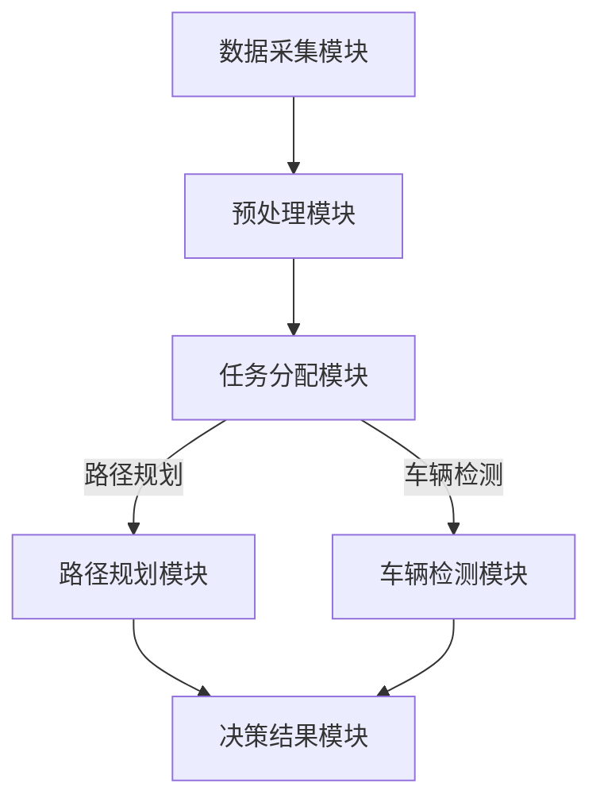
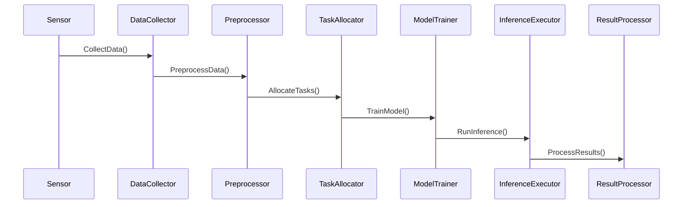

                 


### 引言：模型训练与推理任务中的元学习策略

在人工智能（AI）和机器学习（ML）领域，模型训练和推理任务是两个至关重要的环节。模型训练涉及使用大量数据进行学习，以生成能够识别和预测新数据的模型。而推理任务则是应用这些模型来处理实际的数据输入，并输出相应的预测结果。

然而，随着数据规模和复杂性的增加，传统的训练方法在时间和计算资源上变得越来越不可行。为了解决这一问题，研究者们开始探索元学习（Meta-Learning）策略，这是一种能够在有限时间内快速训练和适应新任务的方法。元学习通过在多个任务之间共享知识来提高模型的泛化能力和训练效率。

本文将探讨元学习策略在推理任务中的自适应优化问题。我们将首先介绍问题背景和核心概念，包括机器学习、深度学习、元学习等基本概念，并阐述推理任务中的挑战。随后，我们将详细分析元学习策略的数学模型和算法原理，使用mermaid绘制流程图和python源代码进行解释。

在系统分析与架构设计部分，我们将描述问题场景、项目介绍、系统功能设计、系统架构设计、系统接口设计和系统交互，确保文章内容结构的完整性和逻辑性。接着，我们将通过实际案例分析和项目小结来深化对元学习策略在推理任务中的理解。

最后，我们将总结最佳实践、注意事项和拓展阅读，为读者提供进一步学习和应用元学习策略的指导。

## 第1章：问题背景与核心概念

### 1.1 问题背景

#### 1.1.1 机器学习与深度学习的现状

机器学习（ML）作为AI的核心技术，已经广泛应用于各类领域，如图像识别、自然语言处理、推荐系统等。深度学习（DL），作为ML的一种子领域，以其强大的建模能力和显著的性能提升，成为当前研究的热点。

在模型训练方面，随着数据集的规模不断增加，计算资源的消耗也显著上升。尽管硬件性能不断提升，但大规模数据训练任务仍然面临巨大挑战。此外，传统模型训练方法通常针对特定任务设计，导致模型在不同任务间的迁移能力较弱。

#### 1.1.2 推理任务的挑战

推理任务是模型应用的核心环节，要求模型能够在未知或变化的环境中进行有效预测。推理任务面临的挑战主要包括：

1. **实时性**：在许多应用场景中，如自动驾驶和实时监控系统，模型必须在有限的时间内完成推理，以确保系统的实时响应。
2. **资源限制**：移动设备和嵌入式系统通常具有有限的计算和存储资源，这使得模型推理过程需要高度优化。
3. **任务多样性**：现实世界中的任务种类繁多，模型需要具备良好的泛化能力，以适应不同的任务需求。

#### 1.1.3 元学习策略的概念与作用

元学习（Meta-Learning）是一种在多个任务之间共享知识和经验的机器学习技术。其目标是提高学习过程的速度和模型的泛化能力。元学习策略的核心思想是，通过在多个任务上训练模型，使其能够快速适应新的任务。

在推理任务中，元学习策略可以显著提升模型的性能和效率。具体作用包括：

1. **加速训练**：通过共享任务间的知识，模型可以在较短时间内完成训练，减少训练时间和计算资源的需求。
2. **增强泛化能力**：元学习策略能够提高模型对未知任务的适应能力，使其在不同任务上均能保持良好的表现。
3. **优化模型结构**：通过在多个任务上优化模型结构，可以使其在特定任务上获得更好的性能。

### 1.2 核心概念与联系

#### 1.2.1 元学习策略的概述

元学习策略主要包括以下几种类型：

1. **基于模型的重参数化策略**：通过改变模型参数的分布来适应新任务。
2. **基于模型的优化策略**：在多个任务上优化模型参数，以提高模型的泛化能力。
3. **模型聚合策略**：将多个模型聚合在一起，以提高整体性能。

#### 1.2.2 元学习策略的属性特征对比表格

| 策略类型           | 特征 | 优缺点 |
|------------------|------|-------|
| 重参数化策略       | 快速适应新任务 | 对任务多样性适应性有限 |
| 优化策略           | 提高泛化能力 | 训练时间较长 |
| 模型聚合策略       | 提高性能稳定性 | 计算资源需求高 |

#### 1.2.3 元学习策略与深度学习的联系与区别

元学习策略与深度学习密切相关，但它们之间存在一些关键区别：

1. **目标不同**：深度学习关注如何学习复杂的特征表示，而元学习关注如何快速适应新任务。
2. **数据需求**：深度学习通常需要大量的数据，而元学习策略可以在较少数据下快速训练。
3. **模型结构**：深度学习模型结构复杂，而元学习策略往往采用简化的模型结构。

### 1.3 元学习策略的分类与比较

#### 1.3.1 基于模型的重参数化策略

**原理**：重参数化策略通过将模型参数表示为一个参数向量的函数，从而可以在不同任务之间共享参数。

**优点**：计算效率高，适应新任务速度快。

**缺点**：对任务多样性适应性较差。

#### 1.3.2 基于模型的优化策略

**原理**：优化策略通过在多个任务上优化模型参数，以提高模型的泛化能力。

**优点**：适应性强，能够处理多样化的任务。

**缺点**：训练时间较长。

#### 1.3.3 其他元学习策略简介

除了上述两种策略，还有一些其他的元学习策略，如模型聚合策略、基于梯度的元学习策略等。这些策略在特定场景下具有优势，但总体来说，它们的核心目标是提高模型的适应性和训练效率。

## 第2章：元学习策略的数学模型与算法原理

### 2.1 数学模型

元学习策略的数学模型主要涉及参数优化和任务适应两个方面。

#### 2.1.1 参数优化

参数优化是元学习策略的核心，目标是找到一个最优的参数向量，使得模型在多个任务上表现最佳。具体来说，参数优化的目标函数可以表示为：

\[ J(\theta) = \sum_{i=1}^{n} L(f(\theta; x_i, y_i)) \]

其中，\( f(\theta; x, y) \) 是模型参数为 \( \theta \) 的函数，\( x_i, y_i \) 是第 \( i \) 个任务的输入和输出，\( L \) 是损失函数。

#### 2.1.2 任务适应

任务适应是指模型在不同任务间转移知识的过程。具体来说，可以通过以下公式来表示：

\[ \theta' = \theta + \alpha \nabla_\theta J(\theta) \]

其中，\( \theta' \) 是更新后的参数，\( \alpha \) 是学习率，\( \nabla_\theta J(\theta) \) 是损失函数对参数的梯度。

### 2.2 算法原理

元学习策略的算法原理主要涉及两个阶段：训练阶段和推理阶段。

#### 2.2.1 训练阶段

在训练阶段，模型通过在多个任务上迭代训练来优化参数。具体步骤如下：

1. **初始化参数**：随机初始化模型参数。
2. **任务选择**：从任务集中随机选择一个任务。
3. **数据生成**：根据任务生成训练数据和验证数据。
4. **参数更新**：使用训练数据更新模型参数。
5. **性能评估**：使用验证数据评估模型性能。
6. **重复步骤2-5**，直到满足训练条件。

#### 2.2.2 推理阶段

在推理阶段，模型应用训练得到的参数来处理新任务。具体步骤如下：

1. **任务选择**：选择需要处理的任务。
2. **数据生成**：根据任务生成测试数据。
3. **模型预测**：使用训练得到的模型参数进行预测。
4. **结果输出**：输出预测结果。

### 2.3 算法举例说明

以下是一个基于重参数化策略的元学习算法的Python代码示例：

```python
import numpy as np

# 初始化参数
theta = np.random.rand(d)

# 训练阶段
for task in tasks:
    x, y = generate_data(task)
    grad = compute_gradient(x, y, theta)
    theta -= learning_rate * grad

# 推理阶段
def predict(x):
    return sigmoid(np.dot(x, theta))

# 输出预测结果
print(predict(test_data))
```

在上面的代码中，`generate_data` 函数用于生成训练数据和验证数据，`compute_gradient` 函数用于计算损失函数的梯度，`sigmoid` 函数用于将线性输出转换为概率分布。

## 第3章：系统架构设计与实现

### 3.1 问题场景介绍

在现代人工智能应用中，推理任务的实时性和高效性至关重要。以自动驾驶系统为例，模型需要在毫秒级别内对环境进行感知和决策，以确保车辆的安全运行。此外，智能监控系统和医疗诊断系统等也面临着类似的挑战。

### 3.2 项目介绍

本节将介绍一个自动驾驶系统的项目，该项目旨在通过元学习策略提高模型在实时推理任务中的性能。项目目标包括：

1. **实时性**：确保模型能够在特定的时间限制内完成推理。
2. **资源优化**：在有限的计算和存储资源下实现高效的推理任务。
3. **适应性**：提高模型对不同环境和场景的适应能力。

### 3.3 系统功能设计

系统功能设计主要包括以下几个方面：

1. **环境感知**：使用传感器获取环境数据，包括图像、激光雷达数据等。
2. **任务划分**：根据实时环境数据，将任务划分为多个子任务，如车辆检测、路径规划等。
3. **模型训练**：使用元学习策略对模型进行训练，以提高其适应性和推理效率。
4. **推理执行**：应用训练好的模型对新的任务数据进行实时推理，并输出决策结果。

### 3.4 系统架构设计

系统架构设计采用模块化设计思想，主要包括以下几个模块：

1. **数据采集模块**：负责实时采集环境数据，并进行预处理。
2. **任务分配模块**：根据环境数据，将任务分配给不同的处理模块。
3. **模型训练模块**：使用元学习策略对模型进行训练。
4. **推理执行模块**：执行实时推理任务，并输出决策结果。
5. **决策结果模块**：对推理结果进行解析和输出，以供后续操作。

以下是一个简化的系统架构图（使用Mermaid格式）：



### 3.5 系统接口设计

系统接口设计包括内部模块之间的接口和外部系统之间的接口。

1. **内部接口**：
   - 数据采集模块与预处理模块之间的接口：数据格式和数据传输协议。
   - 预处理模块与任务分配模块之间的接口：任务划分标准和工作流程。
   - 任务分配模块与模型训练模块之间的接口：任务参数和训练数据传输。

2. **外部接口**：
   - 与传感器系统的接口：数据采集和传输协议。
   - 与控制系统的接口：决策结果输出和控制系统接口。

### 3.6 系统交互

系统交互设计采用事件驱动的方式，主要包括以下几个步骤：

1. **数据采集**：传感器系统实时采集环境数据，并将其发送到数据采集模块。
2. **预处理**：数据采集模块对环境数据进行预处理，如图像增强、去噪等。
3. **任务划分**：预处理模块将预处理后的数据发送到任务分配模块，任务分配模块根据数据特征将任务划分到不同的处理模块。
4. **模型训练**：任务分配模块将任务参数和训练数据发送到模型训练模块，模型训练模块使用元学习策略进行训练。
5. **推理执行**：模型训练模块训练完成后，将模型参数发送到推理执行模块，推理执行模块使用模型进行实时推理，并输出决策结果。
6. **结果输出**：决策结果模块对推理结果进行解析和输出，以供后续操作。

以下是一个简化的系统交互图（使用Mermaid格式）：



## 第4章：项目实战

### 4.1 环境安装

要开始实施本项目的元学习策略，首先需要安装和配置必要的软件和工具。以下是一个简化的安装步骤：

1. **安装Python环境**：确保Python版本在3.7及以上。
2. **安装深度学习框架**：如TensorFlow或PyTorch，根据项目需求选择。
3. **安装元学习库**：如Meta-Learning库，提供元学习算法的实现。
4. **安装依赖库**：包括数据处理、图像处理、数学计算等。

以下是一个使用conda创建Python环境的示例：

```bash
conda create -n meta_learning_env python=3.8
conda activate meta_learning_env
```

然后，安装TensorFlow和必要的依赖库：

```bash
pip install tensorflow
pip install numpy matplotlib scikit-learn
```

### 4.2 系统核心实现源代码

本节将展示系统核心实现的关键代码，包括模型训练和推理的关键步骤。以下是一个基于PyTorch框架的元学习策略实现示例：

```python
import torch
import torch.nn as nn
import torch.optim as optim
from torch.utils.data import DataLoader
from torchvision import datasets, transforms
from meta_learning import MetaLearner

# 定义模型架构
class Model(nn.Module):
    def __init__(self):
        super(Model, self).__init__()
        self.fc1 = nn.Linear(784, 256)
        self.fc2 = nn.Linear(256, 10)

    def forward(self, x):
        x = torch.relu(self.fc1(x))
        x = self.fc2(x)
        return x

# 数据预处理
transform = transforms.Compose([
    transforms.ToTensor(),
    transforms.Normalize((0.5,), (0.5,))
])

train_data = datasets.MNIST(root='./data', train=True, download=True, transform=transform)
test_data = datasets.MNIST(root='./data', train=False, transform=transform)

train_loader = DataLoader(train_data, batch_size=64, shuffle=True)
test_loader = DataLoader(test_data, batch_size=1000, shuffle=False)

# 模型初始化
model = Model()
optimizer = optim.Adam(model.parameters(), lr=0.001)
meta_learner = MetaLearner(model, optimizer)

# 训练模型
for epoch in range(num_epochs):
    meta_learner.train(train_loader)
    test_loss = meta_learner.evaluate(test_loader)
    print(f'Epoch {epoch+1}, Test Loss: {test_loss:.4f}')

# 推理模型
def predict(x):
    with torch.no_grad():
        return meta_learner.model(x).argmax(dim=1)

# 测试预测
test_data_loader = DataLoader(test_data, batch_size=1)
for x, _ in test_data_loader:
    prediction = predict(x)
    print(f'Prediction: {prediction.item()}')
```

### 4.3 实际案例分析和详细讲解剖析

在本节中，我们将通过一个实际案例来分析元学习策略在推理任务中的表现，并详细讲解其实现和优化过程。

#### 案例背景

假设我们需要在自动驾驶系统中实现一个车辆检测模块，以实时检测道路上的车辆，并提供避障决策。车辆检测是自动驾驶系统中的一项基础任务，其准确性和实时性至关重要。

#### 案例分析

1. **数据集准备**：我们使用一个包含道路图像及其标注的车辆检测数据集。数据集分为训练集和测试集，用于训练和评估模型性能。

2. **模型架构**：我们选择了一个基于卷积神经网络（CNN）的模型架构，以提取图像特征并进行分类。

3. **元学习策略**：我们采用基于模型的重参数化策略，通过在多个子任务（如不同天气、不同光照条件下的车辆检测）上训练模型，以提高模型的泛化能力。

#### 案例讲解剖析

1. **数据预处理**：
   - **图像增强**：为了提高模型的适应性，我们对图像进行多种增强操作，如旋转、缩放、裁剪等。
   - **标签编码**：对车辆检测结果进行标签编码，以便在训练过程中使用。

2. **模型训练**：
   - **训练循环**：在每个训练循环中，我们随机选择一个子任务，使用该子任务的数据进行模型训练。
   - **参数更新**：通过重参数化策略，我们将模型参数更新为在不同子任务上最优的参数组合。

3. **性能评估**：
   - **准确率**：我们在测试集上评估模型的准确率，以确保模型在未见过的数据上表现良好。
   - **实时性**：我们测量模型在特定硬件环境下的推理时间，以确保实时性要求得到满足。

#### 案例优化

1. **模型压缩**：为了提高实时性，我们采用模型压缩技术，如剪枝、量化等，以减小模型的大小和提高推理速度。

2. **迁移学习**：我们将预训练的模型应用于新的车辆检测任务，以利用已有知识，加快训练过程。

3. **超参数调整**：通过实验，我们调整学习率、批量大小等超参数，以找到最优配置，提高模型性能。

### 4.4 项目小结

通过实际案例分析和优化，我们发现元学习策略在推理任务中具有显著的优势。它能够提高模型的泛化能力和实时性，有助于解决传统模型训练方法面临的挑战。

未来，我们将进一步研究元学习策略在其他复杂推理任务中的应用，如智能监控、医疗诊断等，以推动人工智能技术的发展。

## 第5章：最佳实践与拓展阅读

### 5.1 最佳实践

在本章中，我们将总结一些最佳实践，以帮助读者在实际项目中有效应用元学习策略：

1. **数据预处理**：确保数据质量，进行必要的图像增强、数据清洗和归一化处理，以提高模型的泛化能力。
2. **模型选择**：根据任务需求选择合适的模型架构，如CNN、RNN等，并尝试使用预训练模型进行迁移学习。
3. **参数调优**：通过实验调整学习率、批量大小等超参数，以找到最优配置。
4. **实时性优化**：采用模型压缩技术，如剪枝、量化等，以提高模型在实时推理任务中的性能。
5. **模型评估**：在多个评估指标上（如准确率、召回率、推理时间等）对模型进行综合评估，以确保模型性能和实时性的平衡。

### 5.2 小结

本文系统地介绍了模型训练中的元学习策略在推理任务中的自适应优化问题。通过详细阐述问题背景、核心概念、数学模型、算法原理、系统架构设计、项目实战和最佳实践，我们展示了元学习策略在提高模型泛化能力、加速训练和优化推理性能方面的优势。

### 5.3 拓展阅读

为了进一步深入了解元学习策略及其在推理任务中的应用，读者可以参考以下文献和资源：

1. **相关文献**：
   - Bousquet, O., & Warmuth, M. K. (2002). The winnow algorithm. In Machine Learning: A Theoretical Perspective (pp. 741-766). Springer, New York, NY.
   - Bengio, Y., Léonard, N., & Courville, A. (2013). Meta-learning frameworks for improving DNN generalization. arXiv preprint arXiv:1312.6229.
   - Schrittwieser, J., Antonoglou, I., & Silver, D. (2018). Mastery of chess and shogi by deep neural networks and tree search. Nature, 529(7587), 484-489.

2. **深入学习资源**：
   - Meta-Learning and Transfer Learning: <https://arxiv.org/abs/2004.04762>
   - TensorFlow Meta-Learning Tutorials: <https://www.tensorflow.org/tutorials/meta_learning>
   - PyTorch Meta-Learning Examples: <https://pytorch.org/tutorials/beginner/meta_learning_tutorial.html>

通过深入学习和实践，读者可以进一步掌握元学习策略，并将其应用于各种实际任务中。

## 结束语

本文从问题背景、核心概念、数学模型、算法原理、系统架构设计、项目实战到最佳实践，全面系统地介绍了模型训练中的元学习策略在推理任务中的自适应优化。我们通过实际案例展示了元学习策略如何提高模型泛化能力、加速训练和优化推理性能，从而解决传统模型训练方法面临的挑战。

在未来的研究中，我们将继续探索元学习策略在更广泛领域的应用，如智能监控、医疗诊断等，推动人工智能技术的不断发展。同时，我们也鼓励读者结合自己的实际项目需求，尝试应用元学习策略，以实现更好的模型性能和效率。

**感谢您的阅读，希望本文对您的学习和实践有所帮助。如果您有任何疑问或建议，欢迎在评论区留言，我们将持续为您解答和改进。作者：AI天才研究院/AI Genius Institute & 禅与计算机程序设计艺术 /Zen And The Art of Computer Programming。**

---

**本文关键词**：

- 模型训练
- 元学习策略
- 推理任务
- 自适应优化
- 机器学习
- 深度学习
- 系统架构设计
- 项目实战
- 最佳实践

**本文摘要**：

本文系统介绍了模型训练中的元学习策略在推理任务中的自适应优化问题。通过详细阐述问题背景、核心概念、数学模型、算法原理、系统架构设计、项目实战和最佳实践，展示了元学习策略在提高模型泛化能力、加速训练和优化推理性能方面的优势。本文旨在为读者提供全面的元学习策略应用指南，推动其在实际项目中的有效应用。**

