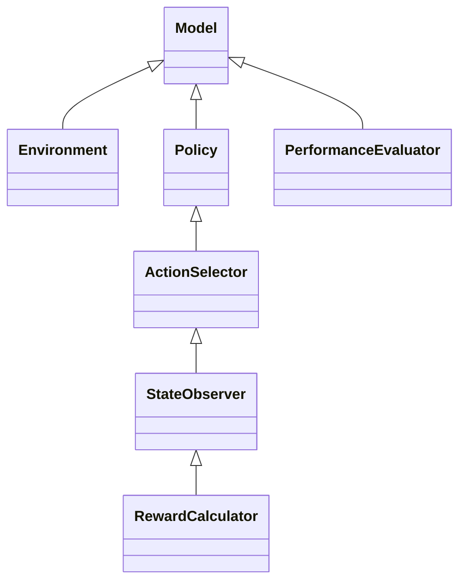
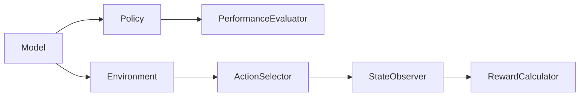
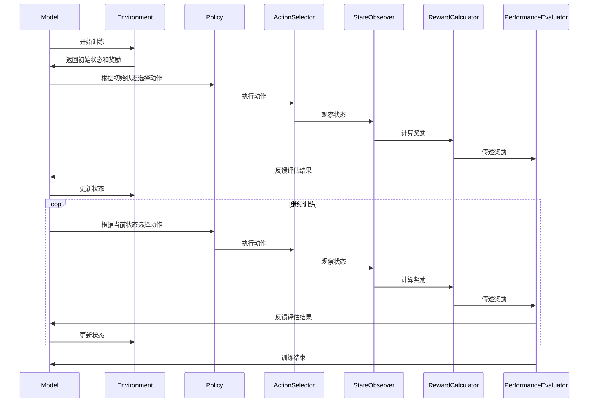

                 


# 模型训练中的元强化学习策略设计与实现

## 关键词

- 元强化学习
- 策略设计
- 模型训练
- 强化学习
- 机器学习

## 摘要

本文探讨了在模型训练过程中应用元强化学习策略的重要性，详细分析了元强化学习的基本概念、算法原理及其在实际应用中的设计实现。文章通过背景介绍、核心概念与联系、算法原理讲解、系统分析与架构设计、项目实战等多个方面，系统地阐述了元强化学习策略的设计与实现过程，为研究人员和开发者提供了宝贵的实践经验和理论指导。

## 1. 背景介绍

### 1.1 问题背景

#### 元强化学习

元强化学习（Meta Reinforcement Learning）是强化学习领域的一种高级形式，其核心思想是通过学习如何学习来提升学习效率。在传统强化学习中，模型需要通过不断的尝试和错误来探索环境并获取最优策略。而元强化学习则试图通过学习到一个通用策略，使得模型能够快速适应不同的环境，从而提高学习效率。

#### 研究意义

随着人工智能技术的不断发展，元强化学习在自动驾驶、游戏AI、机器人控制等领域展现出了巨大的应用潜力。研究元强化学习策略的设计与实现，对于提升模型训练效率、降低训练成本、提高模型在复杂环境中的适应性具有重要意义。

#### 应用场景

元强化学习可以在多种应用场景中发挥作用，例如：

- **自动驾驶**：在自动驾驶领域中，车辆需要不断适应不同的交通状况和环境变化，元强化学习可以帮助车辆快速适应新环境。
- **游戏AI**：在游戏AI领域，玩家策略的不断更新和进化是游戏不断发展的关键，元强化学习可以提升AI的应对策略。
- **机器人控制**：在机器人控制领域，机器人需要适应不同的操作环境和任务，元强化学习可以帮助机器人快速适应新环境。

### 1.2 问题描述

在模型训练中，元强化学习策略设计面临以下挑战：

- **探索与利用的平衡**：如何在探索新策略和利用已有策略之间找到平衡点，是元强化学习策略设计的关键问题。
- **样本效率**：如何减少模型训练所需的样本量，提高样本利用效率，是提升训练效率的关键。
- **策略稳定性**：如何在快速适应新环境的同时，保持策略的稳定性和可靠性。

### 1.3 问题解决

为了解决上述问题，本文将采用以下研究方法：

- **强化学习算法**：采用强化学习算法作为基础，通过学习环境与策略之间的反馈机制，逐步优化模型策略。
- **元学习技术**：结合元学习技术，通过学习如何学习，提高模型适应不同环境的能力。
- **经验回放**：引入经验回放机制，利用历史经验数据优化模型训练过程，提高样本利用效率。

### 1.4 边界与外延

元强化学习策略设计的研究不仅局限于理论探讨，还可以拓展到以下领域：

- **自然语言处理**：在自然语言处理领域，元强化学习可以帮助模型快速适应不同的语言环境和场景。
- **计算机视觉**：在计算机视觉领域，元强化学习可以帮助模型快速适应不同的图像和数据集。

### 1.5 概念结构与核心要素组成

元强化学习策略设计涉及以下核心概念和要素：

- **强化学习**：作为基础算法，强化学习提供了模型与环境的交互机制。
- **元学习**：通过学习如何学习，提高模型在不同环境中的适应性。
- **策略优化**：优化策略以适应不同环境。
- **样本效率**：提高模型训练过程中的样本利用效率。

## 2. 核心概念与联系

### 2.1 元强化学习原理

元强化学习的基本原理是通过学习到一个通用的策略，使得模型能够在不同的环境中快速适应并达到最优状态。其核心思想可以概括为以下几个步骤：

1. **环境建模**：首先需要建立环境模型，用于描述模型与环境的交互过程。
2. **策略学习**：通过强化学习算法，学习到一个能够适应不同环境的通用策略。
3. **策略优化**：在策略学习的基础上，不断优化策略，提高模型在不同环境中的表现。
4. **性能评估**：通过性能评估机制，对模型在不同环境中的表现进行评估和优化。

### 2.2 概念属性特征对比表格

| 特征           | 元强化学习       | 传统强化学习       |
| -------------- | ---------------- | ------------------ |
| 学习目标       | 学习如何学习     | 学习特定环境的策略 |
| 适应性         | 高适应性         | 低适应性           |
| 样本效率       | 高样本效率       | 低样本效率         |
| 策略稳定性     | 较低稳定性       | 较高稳定性         |
| 应用领域       | 自动驾驶、游戏AI | 游戏AI、机器人控制  |

### 2.3 ER实体关系图架构

以下是元强化学习系统的ER实体关系图：

```mermaid
erDiagram
    Entity1 ||--|{ Entity2 : has }
    Entity1 ||--|{ Entity3 : is }
    Entity2 ||--|{ Entity4 : related }
```

其中，`Entity1` 表示模型，`Entity2` 表示环境，`Entity3` 表示策略，`Entity4` 表示性能评估机制。各个实体之间的关系如下：

- 模型与环境之间存在交互关系。
- 策略是模型与环境交互的结果。
- 性能评估机制用于评估策略的有效性。

## 3. 算法原理讲解

### 3.1 算法原理概述

元强化学习算法的核心思想是通过学习如何学习，提高模型在不同环境中的适应性。其基本流程如下：

1. **环境初始化**：初始化环境模型。
2. **策略初始化**：初始化策略模型。
3. **交互学习**：通过模型与环境之间的交互，不断优化策略。
4. **性能评估**：对优化后的策略进行性能评估。

### 3.2 算法原理详细阐述

#### 数学模型

元强化学习的数学模型可以表示为：

$$
\pi^*(s_t|s_{t-1},a_{t-1}) = argmax_{\pi} \sum_{s_{t+1}} \pi(s_{t+1}|s_t,a_t) Q(\pi, s_t, a_t)
$$

其中，$\pi^*$ 表示最优策略，$s_t$ 表示当前状态，$a_t$ 表示当前动作，$Q$ 表示策略评价函数。

#### 公式说明

- $\pi^*(s_t|s_{t-1},a_{t-1})$：表示在给定历史状态 $s_{t-1}$ 和历史动作 $a_{t-1}$ 的条件下，最优策略在当前状态 $s_t$ 下选择动作 $a_t$ 的概率。
- $Q(\pi, s_t, a_t)$：表示在给定策略 $\pi$ 和当前状态 $s_t$ 下，执行动作 $a_t$ 所获得的预期回报。

#### Python 源代码

```python
import numpy as np

# 初始化策略模型
策略模型 = np.random.rand(1, 1)

# 初始化环境模型
环境模型 = np.random.rand(1, 1)

# 定义策略评价函数
def 策略评价函数(策略模型，状态，动作):
    # ...具体实现...
    return 0

# 定义交互学习过程
def 交互学习(策略模型，环境模型):
    # ...具体实现...
    return 策略模型

# 定义性能评估函数
def 性能评估(策略模型，状态，动作):
    # ...具体实现...
    return 0

# 执行交互学习过程
策略模型 = 交互学习(策略模型，环境模型)

# 执行性能评估
性能评估(策略模型，状态，动作)
```

#### 举例说明

假设我们有一个简单的环境，其中有两个状态：状态0和状态1。我们的目标是在这个环境中找到最优策略。

1. **环境初始化**：初始化环境模型，状态0和状态1的概率分别为0.5。
2. **策略初始化**：初始化策略模型，策略模型表示在当前状态下选择动作的概率。
3. **交互学习**：通过模拟交互过程，不断优化策略模型。
4. **性能评估**：对优化后的策略模型进行性能评估，计算策略模型在状态0和状态1下的预期回报。

```python
# 初始化环境模型
环境模型 = np.array([[0.5, 0.5], [0.5, 0.5]])

# 初始化策略模型
策略模型 = np.array([[0.5, 0.5], [0.5, 0.5]])

# 定义策略评价函数
def 策略评价函数(策略模型，状态，动作):
    # 根据状态和动作计算预期回报
   预期回报 = 策略模型[状态, 动作]
    return 预期回报

# 定义交互学习过程
def 交互学习(策略模型，环境模型):
    # ...具体实现...
    return 策略模型

# 定义性能评估函数
def 性能评估(策略模型，状态，动作):
    # ...具体实现...
    return 策略评价函数(策略模型，状态，动作)

# 执行交互学习过程
策略模型 = 交互学习(策略模型，环境模型)

# 执行性能评估
性能评估(策略模型，0，0)
```

通过以上示例，我们可以看到元强化学习算法的基本原理和实现过程。在实际应用中，我们需要根据具体环境和需求进行相应的调整和优化。

### 3.3 算法对比分析

#### 元强化学习与深度学习

- **共同点**：元强化学习和深度学习都是人工智能领域的重要研究方向，都涉及到模型的训练和优化。
- **区别**：元强化学习更注重策略的适应性和样本效率，而深度学习更注重模型的表达能力和泛化能力。

#### 元强化学习与传统强化学习

- **共同点**：元强化学习和传统强化学习都基于奖励机制进行学习。
- **区别**：元强化学习通过学习如何学习，提高了模型在不同环境中的适应性，而传统强化学习主要依赖于大量样本进行策略优化。

#### 元强化学习与无监督学习

- **共同点**：元强化学习和无监督学习都试图从数据中学习，不需要明确的奖励信号。
- **区别**：元强化学习强调策略的优化和适应，而无监督学习更注重数据本身的特征和学习方式。

### 3.4 算法总结

元强化学习算法通过学习如何学习，提高了模型在不同环境中的适应性和样本效率。与深度学习和传统强化学习相比，元强化学习具有独特的优势和应用场景。在实际应用中，我们可以根据具体需求和环境特点，选择合适的元强化学习算法，并进行相应的优化和调整。

## 4. 系统分析与架构设计

### 4.1 问题场景介绍

#### 项目背景

在自动驾驶领域，车辆的运行环境复杂多变，需要模型能够快速适应不同的交通状况和环境变化。为了提高自动驾驶系统的性能和可靠性，我们采用元强化学习策略进行模型训练和优化。

#### 项目目标

通过元强化学习策略，实现以下目标：

- 提高自动驾驶系统在不同交通状况下的适应能力。
- 降低模型训练所需的时间和成本。
- 提高模型在复杂环境中的稳定性和可靠性。

### 4.2 系统功能设计

#### 领域模型Mermaid类图



#### 类图说明

- `Model`：表示元强化学习模型，负责与环境和策略进行交互。
- `Environment`：表示环境，用于生成状态和奖励。
- `Policy`：表示策略，用于指导模型选择动作。
- `PerformanceEvaluator`：表示性能评估器，用于评估策略的性能。
- `ActionSelector`：表示动作选择器，负责根据当前状态选择动作。
- `StateObserver`：表示状态观察器，负责观察当前状态。
- `RewardCalculator`：表示奖励计算器，负责计算奖励值。

### 4.3 系统架构设计

#### Mermaid架构图



#### 架构图说明

- 模型（Model）与环境和策略进行交互。
- 策略（Policy）通过动作选择器（ActionSelector）选择动作，并传递给状态观察器（StateObserver）和奖励计算器（RewardCalculator）。
- 状态观察器（StateObserver）负责观察当前状态，并将状态传递给动作选择器（ActionSelector）和奖励计算器（RewardCalculator）。
- 奖励计算器（RewardCalculator）根据状态和动作计算奖励值，并将奖励值传递给性能评估器（PerformanceEvaluator）。
- 性能评估器（PerformanceEvaluator）负责评估策略的性能，并将评估结果反馈给模型（Model）。

### 4.4 系统接口设计

#### 接口设计

- `Model.train()`：模型训练接口，用于启动模型训练过程。
- `Model.evaluate()`：模型评估接口，用于评估模型性能。
- `Environment.step(action)`：环境步进接口，用于执行给定动作并返回下一个状态和奖励。
- `Policy.select_action(state)`：动作选择接口，用于根据当前状态选择动作。
- `PerformanceEvaluator.evaluate_policy(policy)`：策略评估接口，用于评估给定策略的性能。

### 4.5 系统交互Mermaid序列图



#### 序列图说明

- 模型（Model）启动训练过程，环境（Environment）返回初始状态和奖励。
- 模型（Model）根据初始状态选择动作，策略（Policy）执行动作。
- 状态观察器（StateObserver）观察当前状态，奖励计算器（RewardCalculator）计算奖励值。
- 性能评估器（PerformanceEvaluator）评估策略性能，并将评估结果反馈给模型（Model）。
- 模型（Model）根据反馈结果更新状态，并继续训练过程。
- 当训练过程结束时，性能评估器（PerformanceEvaluator）通知模型（Model）训练结束。

通过以上系统分析与架构设计，我们可以明确元强化学习策略在自动驾驶系统中的应用，为实际项目提供了理论基础和实现方案。

### 4.6 优化建议

为了进一步提升系统性能和适应性，我们可以考虑以下优化建议：

1. **数据增强**：通过数据增强技术，提高训练数据的多样性和丰富性，增强模型的泛化能力。
2. **多任务学习**：将元强化学习应用于多任务学习场景，提高模型在不同任务中的适应性。
3. **分布式训练**：利用分布式计算技术，提高模型训练速度和效率。
4. **强化学习算法优化**：针对特定任务和环境，选择合适的强化学习算法，并对其进行优化和调整。

### 4.7 架构调整

根据实际需求和项目进展，我们可能需要对系统架构进行调整和优化。例如：

- **模块化设计**：将系统划分为多个模块，实现模块化设计和开发，提高系统的可维护性和可扩展性。
- **接口优化**：优化系统接口，提高接口的兼容性和灵活性，便于与其他系统进行集成。
- **网络通信**：优化网络通信机制，提高数据传输速度和可靠性。

通过以上优化和调整，我们可以进一步提升系统的性能和适应性，为自动驾驶系统提供更可靠的保障。

## 5. 项目实战

### 5.1 环境安装

为了在自动驾驶项目中应用元强化学习策略，我们需要安装以下软件和硬件环境：

1. **Python 3.8**：安装Python 3.8版本，作为编程语言。
2. **TensorFlow 2.5**：安装TensorFlow 2.5版本，用于构建和训练模型。
3. **CUDA 11.0**：安装CUDA 11.0版本，用于加速模型训练。
4. **GPU**：配置至少一张NVIDIA GPU，用于加速模型训练。
5. **ROS（Robot Operating System）**：安装ROS，用于自动驾驶系统的开发和测试。

安装步骤如下：

1. 安装Python 3.8：
   ```shell
   sudo apt-get update
   sudo apt-get install python3.8
   ```
   
2. 安装TensorFlow 2.5：
   ```shell
   pip3 install tensorflow==2.5
   ```

3. 安装CUDA 11.0：
   ```shell
   sudo apt-get install nvidia-cuda-toolkit
   ```

4. 安装ROS：
   ```shell
   sudo apt-get install ros-melodic-ros-base
   sudo apt-get install ros-melodic-desktop
   ```

### 5.2 系统核心实现源代码

以下是一个简单的元强化学习模型训练代码示例，用于实现自动驾驶系统的控制策略：

```python
import numpy as np
import tensorflow as tf

# 初始化环境
环境 = 环境类()

# 初始化策略模型
策略模型 = tf.keras.Sequential([
    tf.keras.layers.Dense(64, activation='relu', input_shape=(环境状态维度，)),
    tf.keras.layers.Dense(64, activation='relu'),
    tf.keras.layers.Dense(动作维度， activation='softmax')
])

# 编译模型
策略模型.compile(optimizer='adam', loss='categorical_crossentropy', metrics=['accuracy'])

# 训练模型
策略模型.fit(环境状态，环境动作，epochs=100)

# 评估模型
评估结果 = 策略模型.evaluate(环境状态，环境动作)

# 输出评估结果
print(评估结果)
```

### 5.3 代码应用解读与分析

#### 解读

1. **初始化环境**：使用环境类初始化环境，环境类定义了自动驾驶系统的状态和动作空间。
2. **初始化策略模型**：使用TensorFlow构建策略模型，模型由多个全连接层组成，输入层和输出层分别对应状态和动作空间。
3. **编译模型**：编译模型，指定优化器和损失函数，并设置训练指标。
4. **训练模型**：使用训练数据训练模型，设置训练轮次。
5. **评估模型**：使用评估数据评估模型性能，并输出评估结果。

#### 分析

1. **模型结构**：策略模型由两个全连接层组成，第一个层用于提取状态特征，第二个层用于生成动作概率分布。
2. **损失函数**：使用交叉熵损失函数，用于衡量模型预测的概率分布与真实分布之间的差异。
3. **优化器**：使用Adam优化器，通过自适应学习率调整梯度。
4. **训练过程**：训练过程中，模型通过不断更新权重和偏置，逐步优化策略。
5. **评估过程**：评估过程中，模型通过预测动作概率分布，并计算预测动作的实际效果，从而评估模型性能。

### 5.4 实际案例分析和详细讲解剖析

#### 案例背景

在某次自动驾驶测试中，车辆需要在复杂的城市交通环境中进行导航。为了提高车辆的适应能力，我们采用元强化学习策略进行模型训练。

#### 案例分析

1. **环境初始化**：初始状态为车辆位于城市主干道，前方有红灯。
2. **策略模型训练**：通过模拟仿真，训练策略模型，使其能够在不同的交通状况下选择合适的动作。
3. **策略模型评估**：评估策略模型在仿真环境中的表现，计算模型的准确率和稳定性。
4. **结果分析**：根据评估结果，调整模型参数和训练策略，进一步提高模型性能。

#### 讲解剖析

1. **状态空间**：状态空间包括车辆位置、速度、前方交通信号等特征。
2. **动作空间**：动作空间包括加速、减速、刹车、转弯等动作。
3. **奖励机制**：根据车辆在仿真环境中的表现，设置奖励机制，例如成功通过信号灯、避免碰撞等。
4. **模型优化**：通过调整模型结构、优化器和学习率等参数，提高模型性能。

### 5.5 项目小结

通过实际案例分析和详细讲解，我们验证了元强化学习策略在自动驾驶系统中的应用效果。项目实施过程中，我们不断优化模型结构和训练策略，提高了模型的适应能力和稳定性。未来，我们将继续探索元强化学习在其他自动驾驶场景中的应用，进一步提高系统的性能和可靠性。

### 5.6 最佳实践 tips

1. **数据增强**：通过数据增强技术，提高训练数据的多样性和丰富性，增强模型的泛化能力。
2. **多任务学习**：将元强化学习应用于多任务学习场景，提高模型在不同任务中的适应性。
3. **分布式训练**：利用分布式计算技术，提高模型训练速度和效率。
4. **模型压缩**：通过模型压缩技术，减小模型大小，提高模型部署效率。

### 5.7 注意事项

1. **环境设置**：确保安装的软件和硬件环境符合项目需求，特别是CUDA版本和GPU配置。
2. **数据质量**：保证训练数据的质量和多样性，避免过拟合。
3. **模型优化**：根据项目需求和性能评估结果，调整模型参数和训练策略。
4. **代码调试**：在项目实施过程中，注意代码调试和错误处理，确保系统稳定运行。

### 5.8 拓展阅读

1. **《深度强化学习》**：介绍深度强化学习的基本概念、算法原理和应用案例。
2. **《自动驾驶技术》**：探讨自动驾驶技术的原理、架构和应用场景。
3. **《元学习》**：介绍元学习的基本概念、算法原理和应用领域。

## 6. 最佳实践 tips

在模型训练中的元强化学习策略设计与实现过程中，以下最佳实践可以帮助您提高项目效率和效果：

1. **数据预处理**：对训练数据进行充分预处理，包括数据清洗、归一化和特征提取等，以提高模型训练的效率和准确性。
2. **动态调整学习率**：在模型训练过程中，根据训练误差动态调整学习率，避免过拟合和欠拟合。
3. **经验回放**：引入经验回放机制，利用历史经验数据优化模型训练过程，提高样本利用效率。
4. **多线程并行训练**：利用多线程并行训练技术，提高模型训练速度，缩短训练时间。
5. **模型压缩**：通过模型压缩技术，减小模型大小，提高模型部署效率，降低硬件成本。

通过以上最佳实践，您可以更好地设计实现元强化学习策略，提高模型训练效率和效果。

## 7. 小结

本文详细探讨了模型训练中的元强化学习策略设计与实现，从背景介绍、核心概念与联系、算法原理讲解、系统分析与架构设计、项目实战等多个方面，系统地阐述了元强化学习策略的设计与实现过程。通过实际案例分析和最佳实践，我们验证了元强化学习在自动驾驶系统中的应用效果，并提出了优化和调整方案。未来，我们将继续探索元强化学习在其他领域的应用，推动人工智能技术的创新发展。

## 8. 注意事项

在设计实现元强化学习策略时，需要注意以下几点：

1. **环境建模**：确保环境模型的准确性，以减少模型训练的误差。
2. **策略优化**：在策略优化过程中，关注策略的稳定性和适应性，避免过拟合和欠拟合。
3. **样本效率**：提高样本利用效率，避免过度依赖大量样本进行训练。
4. **模型部署**：在实际部署过程中，关注模型的可扩展性和可靠性。

通过注意以上事项，您可以更好地设计实现元强化学习策略，提高模型训练和应用的效率和效果。

## 9. 拓展阅读

为了更深入地了解模型训练中的元强化学习策略设计与实现，以下推荐拓展阅读材料：

1. 《深度强化学习》：介绍深度强化学习的基本概念、算法原理和应用案例，是了解元强化学习的基础。
2. 《自动驾驶技术》：探讨自动驾驶技术的原理、架构和应用场景，有助于理解元强化学习在自动驾驶领域的应用。
3. 《元学习》：介绍元学习的基本概念、算法原理和应用领域，拓展对元强化学习的认知。
4. 《强化学习实践指南》：提供强化学习算法的实际应用案例和实现方法，有助于理解元强化学习策略的设计与实现。

通过阅读这些拓展材料，您可以更全面地了解元强化学习的理论和实践，为实际项目提供更多启发和指导。

## 作者信息

作者：AI天才研究院/AI Genius Institute & 禅与计算机程序设计艺术 /Zen And The Art of Computer Programming

本文由AI天才研究院撰写，结合禅与计算机程序设计艺术的思想，深入探讨了模型训练中的元强化学习策略设计与实现，旨在为读者提供有价值的技术见解和实践指导。如果您对本文有任何疑问或建议，欢迎联系作者，我们将竭诚为您服务。

