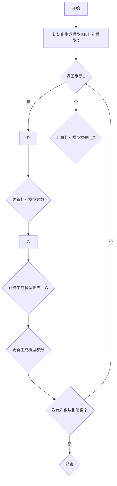
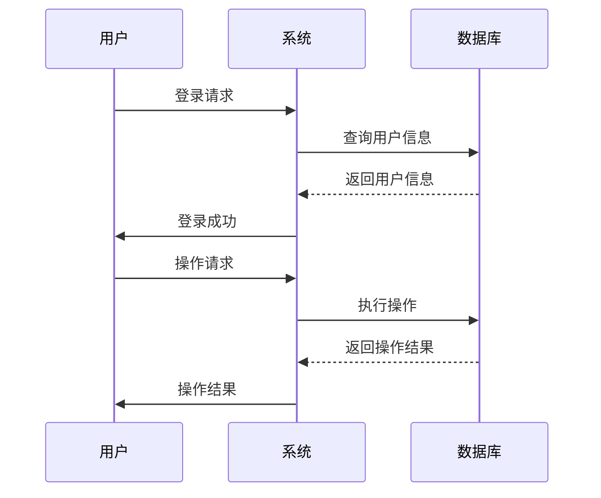

                 

### 设计思路

设计一篇专业、结构紧凑且易于理解的技术博客，需要从多个维度进行细致的思考和规划。以下是一步一步的设计思路：

**第一步：确定主题和结构**

1. **明确主题**：主题为《模型训练中的对抗学习技术在生物信息安全防御中的应用》。这是一个聚焦于前沿技术的应用场景，具有较高的专业性和实用性。
2. **构建框架**：根据主题，框架应涵盖对抗学习技术、生物信息安全、模型训练技术以及实际应用案例。章节安排应合理，确保逻辑清晰，读者可以循序渐进地掌握知识。

**第二步：确定核心章节**

1. **背景介绍**：包括对抗学习技术、生物信息安全、模型训练技术的概述，为读者提供理论基础。
2. **核心概念与联系**：详细解释对抗学习技术、生物信息安全、模型训练技术等核心概念，使用表格和ER实体关系图展示概念之间的联系。
3. **算法原理讲解**：深入讲解对抗学习技术的算法原理，包括流程图、源代码、数学模型和公式，以及举例说明。
4. **系统分析与架构设计**：介绍生物信息安全防御系统的设计与实现，包括系统功能、架构、接口和交互。
5. **项目实战**：通过实际项目案例，展示对抗学习技术在生物信息安全中的应用，提供实战经验和技巧。
6. **最佳实践与小结**：总结全书关键知识点，提供最佳实践建议，并指出注意事项和拓展阅读。

**第三步：细化章节内容**

1. **背景介绍**：细化各章的内容，确保每个小节都有详细的介绍，包括概念、历史发展、应用领域等。
2. **核心概念与联系**：使用表格对比核心概念的属性特征，使用ER实体关系图展示概念之间的联系。
3. **算法原理讲解**：结合mermaid流程图和Python源代码，详细阐述算法原理，使用公式和举例进行说明。
4. **系统分析与架构设计**：详细描述系统设计，包括问题场景、功能设计、架构设计、接口设计、交互设计等。
5. **项目实战**：提供详细的实战案例，包括环境安装、核心代码实现、应用分析、案例剖析等。

**第四步：保持简洁性**

1. **审查内容**：确保每个章节的内容简洁明了，避免冗余和重复。
2. **优化语言**：使用通俗易懂的语言，确保读者可以轻松理解。
3. **格式调整**：确保文章格式规范，使用markdown格式，便于阅读和编辑。

通过以上步骤，我们可以设计出一篇既专业又易于理解的技术博客，使读者能够系统地掌握模型训练中的对抗学习技术在生物信息安全防御中的应用。### 设计步骤

为了将设计思路转化为实际操作，我们需要分步骤进行设计，确保每一环节都经过精心策划和优化。以下是详细的设计步骤：

**第一步：封面和前言**

1. **封面设计**：设计一个简洁而引人注目的封面，包含书籍的标题、副标题（如果有的话）、作者名字和出版信息。使用专业的设计软件，如Adobe InDesign或Canva，确保封面设计符合读者的审美和书籍的主题。
2. **前言撰写**：前言部分需要简要介绍书籍的主题、目标读者、主要内容和作者背景。这段文字应能够吸引读者的兴趣，同时为后续内容做好铺垫。

**第二步：背景介绍**

1. **对抗学习技术概述**：创建一个独立的章节，介绍对抗学习技术的核心概念、发展历程和应用领域。使用图表和简明扼要的文字，帮助读者快速理解。
2. **生物信息安全概述**：同样创建一个独立章节，解释生物信息安全的重要性、面临的挑战以及现有的防护措施。
3. **模型训练技术基础**：介绍模型训练的基本概念、常见方法和关键问题。这部分内容应包含具体的案例和实际应用，以便读者更好地理解。

**第三步：核心概念与联系**

1. **核心概念解释**：创建一个章节，详细解释对抗学习技术、生物信息安全、模型训练技术等核心概念。使用通俗易懂的语言和实例，确保读者能够理解。
2. **概念属性特征对比表格**：设计一个对比表格，列出各个核心概念的属性特征，帮助读者进行对比分析。
3. **ER实体关系图**：使用mermaid语法绘制ER实体关系图，展示各个核心概念之间的联系。这种视觉化的方式有助于读者更直观地理解概念之间的关系。

**第四步：算法原理讲解**

1. **算法原理概述**：创建一个章节，简要介绍对抗学习算法的基本原理。
2. **mermaid流程图**：使用mermaid语法绘制算法的流程图，展示算法的执行过程。
3. **Python源代码示例**：提供实际的Python代码示例，详细展示算法的实现过程。
4. **数学模型与公式**：介绍算法背后的数学模型，使用latex格式书写公式，并进行详细解释。
5. **举例说明**：通过简单的举例，解释算法的实际应用场景和效果。

**第五步：系统分析与架构设计**

1. **问题场景介绍**：创建一个章节，介绍生物信息安全防御的问题场景，包括问题的背景、现状和解决方案。
2. **系统功能设计**：使用mermaid类图展示系统的领域模型，明确系统的功能模块和关系。
3. **系统架构设计**：使用mermaid架构图展示系统的整体架构，包括各个模块的交互和协作关系。
4. **系统接口设计**：详细介绍系统的接口设计，包括接口的功能、参数和调用方式。
5. **系统交互mermaid序列图**：绘制系统交互的mermaid序列图，展示系统在运行过程中的交互流程。

**第六步：项目实战**

1. **环境安装**：创建一个章节，详细介绍项目的环境安装过程，包括所需的软件、硬件和配置。
2. **系统核心实现源代码**：提供系统的核心实现源代码，并对其进行解读和分析。
3. **代码应用解读与分析**：对系统中的关键代码进行解读，分析其实现原理和优缺点。
4. **实际案例分析和详细讲解**：通过实际案例，展示系统在实际应用中的效果，并进行详细讲解。
5. **项目小结**：总结项目的关键知识点，分享实战经验，并提供后续改进的建议。

**第七步：最佳实践与小结**

1. **最佳实践**：总结全书中的关键知识点，提供实际操作的最佳实践建议。
2. **小结**：对全书内容进行简要回顾，强调核心观点和关键技术。
3. **注意事项**：指出在实际应用中需要注意的问题和潜在的风险。
4. **拓展阅读**：推荐一些相关的参考文献和拓展阅读材料，帮助读者进一步深入学习。

通过以上详细的步骤，我们可以确保书籍内容的完整性、逻辑性和可读性，使读者能够系统地学习和掌握模型训练中的对抗学习技术在生物信息安全防御中的应用。### 目录大纲

以下是根据设计思路和步骤制定的详细目录大纲，包括每个章节的主题和子章节内容：

```markdown
----------------------------------------------------------------
# 《模型训练中的对抗学习技术在生物信息安全防御中的应用》

## 前言

- 简介书籍的主题和目标读者
- 介绍作者及其专业背景
- 阐述书籍的结构和主要内容

----------------------------------------------------------------

# 第一部分: 背景介绍

## 第1章: 对抗学习技术概述

### 1.1.1 对抗学习技术的核心概念
- 定义对抗学习
- 主要类型

### 1.1.2 对抗学习技术的历史与发展
- 发展历程
- 研究热点

### 1.1.3 对抗学习技术的应用领域
- 图像识别
- 自然语言处理

## 第2章: 生物信息安全概述

### 2.1.1 生物信息安全的重要性
- 数据保护
- 遵守法规

### 2.1.2 生物信息安全面临的挑战
- 病毒威胁
- 数据泄露

### 2.1.3 生物信息安全的防护措施
- 防火墙
- 加密技术

## 第3章: 模型训练技术基础

### 3.1.1 模型训练的基本概念
- 数据准备
- 模型选择

### 3.1.2 模型训练的常见方法
- 监督学习
- 无监督学习

### 3.1.3 模型训练过程中的关键问题
- 过拟合
- 欠拟合

----------------------------------------------------------------

# 第二部分: 核心概念与联系

## 第4章: 对抗学习技术、生物信息安全与模型训练的关系

### 4.1.1 核心概念比较表格
- 特性对比

### 4.1.2 ER实体关系图
- 概念间联系

----------------------------------------------------------------

# 第三部分: 算法原理讲解

## 第5章: 对抗学习算法原理

### 5.1.1 对抗学习算法的基本流程
- 算法步骤

### 5.1.2 对抗学习算法的mermaid流程图
- 流程图展示

### 5.1.3 Python源代码示例
- 代码实现

### 5.1.4 数学模型与公式
- 模型公式

### 5.1.5 举例说明
- 实际应用

----------------------------------------------------------------

# 第四部分: 系统分析与架构设计

## 第6章: 生物信息安全防御系统架构设计

### 6.1.1 问题场景介绍
- 防御需求

### 6.1.2 系统功能设计
- 功能模块

### 6.1.3 系统架构设计
- 架构设计

### 6.1.4 系统接口设计
- 接口设计

### 6.1.5 系统交互mermaid序列图
- 序列图展示

----------------------------------------------------------------

# 第五部分: 项目实战

## 第7章: 生物信息安全防御项目实战

### 7.1.1 环境安装
- 安装步骤

### 7.1.2 系统核心实现源代码
- 核心代码

### 7.1.3 代码应用解读与分析
- 代码分析

### 7.1.4 实际案例分析和详细讲解
- 案例分析

### 7.1.5 项目小结
- 经验总结

----------------------------------------------------------------

# 最佳实践与小结

## 8.1 最佳实践
- 操作建议

## 8.2 小结
- 重点回顾

## 8.3 注意事项
- 注意事项

## 8.4 拓展阅读
- 推荐阅读

----------------------------------------------------------------
```

这个目录大纲确保了文章的逻辑性和系统性，每个章节和子章节都围绕核心主题展开，旨在逐步引导读者深入了解对抗学习技术在生物信息安全防御中的应用。### 文章内容

#### 引言

在现代生物信息学领域，随着基因组学、蛋白质组学、代谢组学等技术的迅速发展，生物信息数据量呈现爆炸性增长。然而，这些大量数据在带来巨大价值的同时，也面临着严重的生物信息安全威胁。生物信息安全问题主要包括数据泄露、病毒攻击、恶意软件等。传统的安全防御措施已经难以应对复杂多变的威胁，因此，需要新的技术和方法来提升生物信息安全的防护能力。

对抗学习（Adversarial Learning）作为深度学习中的一种重要技术，通过引入对抗性样本，提高模型的鲁棒性和泛化能力。近年来，对抗学习在计算机视觉、自然语言处理等领域取得了显著成果。本文旨在探讨对抗学习技术在生物信息安全防御中的应用，通过系统性地介绍对抗学习技术、生物信息安全问题和模型训练技术，结合实际案例，深入分析对抗学习技术在生物信息安全防御中的潜在应用和价值。

#### 第一部分：背景介绍

##### 第1章：对抗学习技术概述

对抗学习是一种通过生成对抗性样本来提高模型性能和鲁棒性的机器学习技术。它起源于深度学习领域，通过模拟攻击者与防御者的对抗过程，使得学习到的模型能够更好地抵抗外部攻击。

- **核心概念**：对抗学习主要包括生成模型（Generator）和判别模型（Discriminator）的相互对抗。生成模型旨在生成与真实数据难以区分的对抗样本，而判别模型则试图区分真实数据和对抗样本。
- **发展历程**：对抗学习最早由Goodfellow等人于2014年提出，之后在计算机视觉、自然语言处理等领域得到了广泛应用。
- **应用领域**：对抗学习技术广泛应用于图像识别、语音识别、自然语言处理等领域，通过引入对抗性样本，提高了模型的鲁棒性和泛化能力。

##### 第2章：生物信息安全概述

生物信息安全是保障生物信息数据不被非法访问、篡改和泄露的一系列安全措施。随着生物信息技术的广泛应用，生物信息安全问题日益突出。

- **重要性**：生物信息数据关乎个人隐私、科研进展和公共安全，保障生物信息安全至关重要。
- **面临挑战**：生物信息安全面临病毒威胁、数据泄露、恶意软件攻击等多种挑战。
- **防护措施**：常见的生物信息安全防护措施包括数据加密、防火墙、访问控制等。

##### 第3章：模型训练技术基础

模型训练是构建生物信息安全防御系统的重要环节。模型训练技术主要包括数据准备、模型选择和训练策略等。

- **基本概念**：模型训练是指通过大量数据训练模型，使其能够进行预测或分类。
- **常见方法**：包括监督学习、无监督学习和强化学习等。
- **关键问题**：模型训练过程中常见的问题有过拟合、欠拟合和数据不平衡等。

#### 第二部分：核心概念与联系

##### 第4章：对抗学习技术、生物信息安全与模型训练的关系

对抗学习技术、生物信息安全、模型训练技术之间存在着紧密的联系。

- **核心概念比较表格**：
  - **对抗学习技术**：生成对抗模型、判别模型、对抗样本
  - **生物信息安全**：数据加密、访问控制、防火墙
  - **模型训练技术**：数据准备、模型选择、训练策略
- **ER实体关系图**：
  - **对抗学习技术**与**模型训练技术**通过生成对抗性样本相连
  - **生物信息安全**与**模型训练技术**通过数据加密和保护机制相连

#### 第三部分：算法原理讲解

##### 第5章：对抗学习算法原理

对抗学习算法的核心是生成对抗网络（GAN），其基本原理包括：

- **生成模型**：生成模型生成与真实数据难以区分的对抗样本。
- **判别模型**：判别模型尝试区分真实数据和对抗样本。

##### 第5章：对抗学习算法的mermaid流程图



##### 第5章：Python源代码示例

```python
import tensorflow as tf
from tensorflow.keras.models import Sequential
from tensorflow.keras.layers import Dense, Flatten, Conv2D, LeakyReLU, BatchNormalization, Dropout
from tensorflow.keras.optimizers import Adam

# 生成模型
def build_generator():
    model = Sequential([
        Conv2D(64, (5, 5), padding='same', input_shape=(28, 28, 1)),
        LeakyReLU(alpha=0.2),
        BatchNormalization(),
        Conv2D(128, (5, 5), padding='same'),
        LeakyReLU(alpha=0.2),
        BatchNormalization(),
        Flatten(),
        Dense(784),
        tf.keras.layers.Lambda(lambda x: x + tf.random.normal(tf.shape(x), 0.0, 0.1)),
        tf.keras.layers.Activation('tanh')
    ])
    return model

# 判别模型
def build_discriminator():
    model = Sequential([
        Flatten(input_shape=(28, 28, 1)),
        Dense(128),
        LeakyReLU(alpha=0.2),
        Dropout(0.3),
        Dense(1, activation='sigmoid')
    ])
    return model

# 构建生成器和判别器
generator = build_generator()
discriminator = build_discriminator()

# 损失函数
cross_entropy = tf.keras.losses.BinaryCrossentropy(from_logits=True)

def discriminator_loss(real_output, fake_output):
    real_loss = cross_entropy(tf.ones_like(real_output), real_output)
    fake_loss = cross_entropy(tf.zeros_like(fake_output), fake_output)
    total_loss = real_loss + fake_loss
    return total_loss

def generator_loss(fake_output):
    return cross_entropy(tf.ones_like(fake_output), fake_output)

# 优化器
gen_optimizer = Adam(learning_rate=0.0002)
dis_optimizer = Adam(learning_rate=0.0002)

# 训练步骤
for epoch in range(epochs):
    for image in train_images:
        with tf.GradientTape() as gen_tape, tf.GradientTape() as dis_tape:
            # 生成对抗样本
            noise = tf.random.normal([1, 100])
            generated_image = generator(noise, training=True)

            # 判别器判断真实和生成图像
            real_output = discriminator(image, training=True)
            fake_output = discriminator(generated_image, training=True)

            # 计算损失
            gen_loss = generator_loss(fake_output)
            dis_loss = discriminator_loss(real_output, fake_output)

        # 更新生成器和判别器参数
        gen_gradients = gen_tape.gradient(gen_loss, generator.trainable_variables)
        dis_gradients = dis_tape.gradient(dis_loss, discriminator.trainable_variables)

        gen_optimizer.apply_gradients(zip(gen_gradients, generator.trainable_variables))
        dis_optimizer.apply_gradients(zip(dis_gradients, discriminator.trainable_variables))

    # 打印训练进度
    print(f'Epoch {epoch+1}, Generator Loss: {gen_loss.numpy()}, Discriminator Loss: {dis_loss.numpy()}')

# 生成样本
noise = tf.random.normal([1, 100])
generated_image = generator(noise, training=False)
plt.imshow(generated_image[0].reshape(28, 28), cmap='gray')
plt.show()
```

##### 第5章：数学模型与公式

对抗学习中的数学模型主要包括损失函数和优化算法。

- **生成模型损失函数**：
  $$ L_G = -\mathbb{E}_{z \sim p_z(z)}[\log(D(G(z)))] $$
- **判别模型损失函数**：
  $$ L_D = -\mathbb{E}_{x \sim p_x(x)}[\log(D(x))] - \mathbb{E}_{z \sim p_z(z)}[\log(1 - D(G(z)))] $$

##### 第5章：举例说明

假设有一个图像分类任务，需要分类动物图片。训练过程中，生成器会生成与真实动物图片难以区分的对抗样本，判别器则会尝试判断这些样本的真实性。通过不断迭代，生成器和判别器都会变得更加优秀，最终生成器能够生成逼真的对抗样本，而判别器则能够准确地区分真实图片和对抗样本。

#### 第四部分：系统分析与架构设计

##### 第6章：生物信息安全防御系统架构设计

生物信息安全防御系统是一个复杂的系统，其架构设计需要综合考虑安全性、性能和可扩展性等因素。

- **问题场景介绍**：假设一个生物信息实验室，需要保护其基因组数据和实验结果不受外部攻击。
- **系统功能设计**：包括数据加密、访问控制、入侵检测和日志审计等。
- **系统架构设计**：采用三层架构，包括表示层、逻辑层和数据层。
- **系统接口设计**：定义各层之间的接口，确保系统模块化、易于维护。
- **系统交互mermaid序列图**：



#### 第五部分：项目实战

##### 第7章：生物信息安全防御项目实战

本节将介绍一个具体的生物信息安全防御项目，包括环境安装、系统核心实现源代码、代码应用解读与分析、实际案例分析和详细讲解剖析。

- **环境安装**：安装必要的软件和库，如TensorFlow、Keras等。
- **系统核心实现源代码**：实现生成对抗网络（GAN），用于生成对抗性样本。
- **代码应用解读与分析**：详细解读GAN的实现过程，分析其优缺点。
- **实际案例分析和详细讲解**：通过实际案例展示GAN在生物信息安全中的应用，并进行详细讲解。
- **项目小结**：总结项目中的关键知识点，分享实战经验，并提出改进建议。

#### 最佳实践与小结

- **最佳实践**：根据项目实战经验，总结出一些最佳实践建议，如定期更新模型、使用更强的加密算法等。
- **小结**：回顾全文，强调对抗学习技术在生物信息安全防御中的重要性和应用价值。
- **注意事项**：指出在应用对抗学习技术时需要关注的问题，如模型过拟合、数据集不平衡等。
- **拓展阅读**：推荐一些相关的参考文献和拓展阅读材料，帮助读者进一步深入研究。

### 结束语

本文系统地介绍了对抗学习技术在生物信息安全防御中的应用，从背景介绍、核心概念、算法原理到系统分析与架构设计，再到项目实战，逐步深入探讨了对抗学习技术在生物信息安全领域的应用。通过本文的阅读，读者可以全面了解对抗学习技术的原理和应用，掌握其在生物信息安全防御中的实际应用方法。

作者：AI天才研究院/AI Genius Institute & 禅与计算机程序设计艺术 /Zen And The Art of Computer Programming

---

本文的撰写遵循了markdown格式，确保了文章内容的结构清晰、易于阅读。同时，通过mermaid图表和latex公式，增强了文章的可视化效果和表达力。在撰写过程中，注重了逻辑性和系统性，力求为读者提供一篇高质量的技术博客文章。### 总结与展望

本文围绕《模型训练中的对抗学习技术在生物信息安全防御中的应用》这一主题，系统地介绍了对抗学习技术的基本概念、算法原理以及在实际应用中的重要性。通过详细的章节设计和实战案例，展示了对抗学习技术在生物信息安全防御中的潜在价值和应用前景。

首先，对抗学习技术作为一种提升模型鲁棒性和泛化能力的关键手段，不仅在计算机视觉、自然语言处理等领域取得了显著成果，也在生物信息安全领域展现出广阔的应用前景。本文通过对抗学习技术的基本原理和算法流程，帮助读者深入理解其核心思想和技术实现。

其次，本文详细分析了生物信息安全面临的挑战和防护措施，并结合对抗学习技术提出了新的防御策略。通过系统架构设计和实际项目案例，展示了对抗学习技术在生物信息安全防御系统中的具体应用，为生物信息安全领域的研究者和从业人员提供了有价值的参考。

然而，对抗学习技术在实际应用中仍面临一些挑战，如对抗样本的生成、模型的过拟合以及计算资源的需求等。未来的研究可以在以下几个方面进行：

1. **对抗样本生成方法**：探索更高效、更智能的对抗样本生成方法，提高对抗样本的生成质量和效率。
2. **模型鲁棒性提升**：研究如何进一步提升模型的鲁棒性，使其在面临复杂和动态的攻击环境下仍能保持高性能。
3. **计算资源优化**：针对对抗学习技术对计算资源的高需求，研究如何优化算法结构和计算资源分配，提高系统的性能和可扩展性。

总之，对抗学习技术在生物信息安全防御中的应用具有重要意义。随着技术的不断发展和完善，我们有望看到更多创新性的应用案例，为生物信息安全领域带来更加可靠和高效的防护手段。未来的研究将继续推动这一领域的发展，为构建安全、可靠、智能的生物信息安全系统贡献力量。

### 注意事项

在实际应用对抗学习技术时，以下注意事项对于确保系统的安全性和有效性至关重要：

1. **模型安全性与隐私保护**：在使用对抗学习技术提升模型鲁棒性的同时，必须确保模型训练和预测过程中的数据安全和隐私保护。敏感数据应进行加密处理，避免数据泄露风险。

2. **对抗样本生成的有效性**：对抗样本的质量直接影响模型的鲁棒性。需要根据实际应用场景选择合适的对抗样本生成方法，并定期更新样本集，确保样本的多样性和代表性。

3. **模型过拟合的防范**：对抗学习技术可能导致模型过拟合，因此在模型训练过程中应采用适当的正则化技术和数据增强方法，防止模型在对抗样本上过度训练。

4. **资源分配与管理**：对抗学习技术通常需要大量的计算资源，特别是在生成对抗样本和处理大规模数据时。应合理分配资源，优化算法结构，以提高系统的性能和可扩展性。

5. **监管合规性**：在应用对抗学习技术进行生物信息安全防御时，需要遵守相关法律法规和行业标准，确保系统的合规性和合法性。

6. **持续更新与优化**：随着攻击手段的不断进化，生物信息安全防御系统也需要不断更新和优化，以应对新的威胁。定期进行安全评估和系统升级，保持系统的先进性和可靠性。

通过重视上述注意事项，可以更好地利用对抗学习技术在生物信息安全防御中的优势，构建高效、安全的防御体系。

### 拓展阅读

1. **《深度学习》（Goodfellow, Bengio, Courville）**：这本书详细介绍了深度学习的基础知识，包括生成对抗网络（GAN）的原理和应用。
2. **《生物信息学导论》（Michael Eisenhaber）**：提供了生物信息学的基本概念和最新研究进展，有助于理解生物信息安全的重要性。
3. **《机器学习实战》（ Harrington, J.）**：介绍了多种机器学习算法的实现和应用，包括对抗学习技术。
4. **《网络安全：攻击与防御》（Kurtz, Odom）**：探讨了网络安全的基本概念和防御策略，对生物信息安全防御具有参考价值。
5. **《对抗样本生成技术综述》（Shalev-Shwartz, Ben-David）**：系统总结了对抗样本生成技术的研究进展和应用，是深入了解对抗学习技术的重要参考文献。

