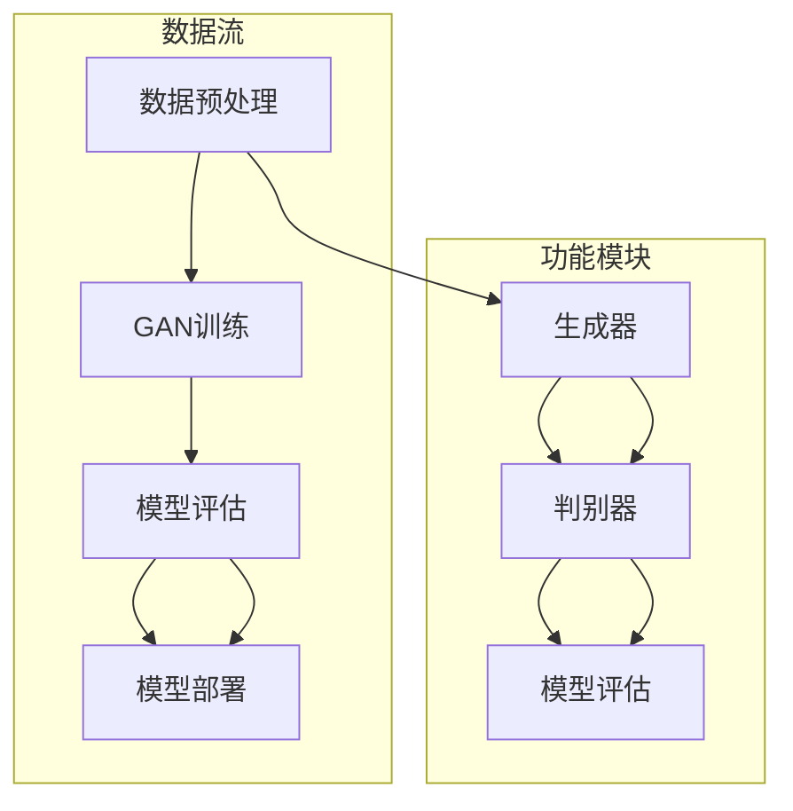
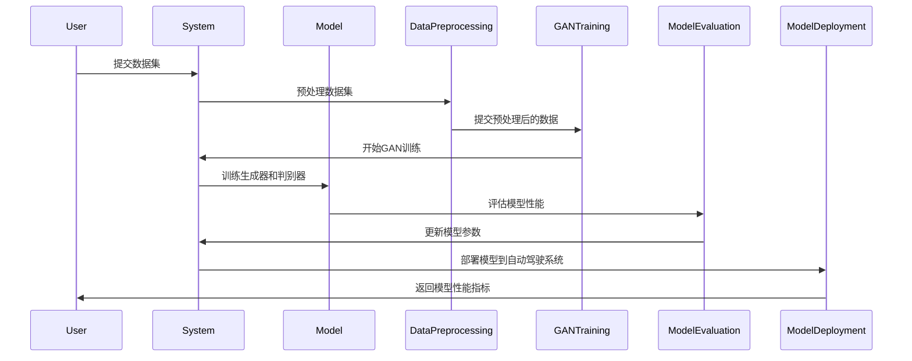

                 

# 模型训练中的对抗学习技术应用

> 关键词：对抗学习、模型训练、生成对抗网络、对抗样本、泛化能力

> 摘要：本文详细探讨了对抗学习技术在模型训练中的应用。通过对对抗学习核心概念的介绍、数学模型的解析以及实际案例的剖析，文章揭示了对抗学习如何提升模型的鲁棒性和泛化能力，为人工智能领域的研究和实践提供了有益的参考。

## 背景介绍

### 问题背景

随着人工智能技术的快速发展，模型训练成为推动AI应用的重要环节。然而，模型训练过程中常常面临过拟合和欠拟合等问题，导致模型性能不稳定。为了提高模型训练的效果，研究者们提出了对抗学习（Adversarial Learning）这一技术。对抗学习通过引入对抗样本来提升模型的泛化能力和鲁棒性，成为模型训练领域的一个热点研究方向。

### 问题描述

对抗学习技术在模型训练中的应用涉及多个方面，包括对抗样本的生成、对抗模型的训练以及对抗策略的优化等。如何有效地利用对抗学习技术，提升模型训练的效果，是当前研究的核心问题。

### 问题解决

对抗学习技术通过以下方法解决模型训练中的问题：
1. **对抗样本生成**：利用生成对抗网络（GAN）等技术生成与真实样本具有相似特性的对抗样本。
2. **对抗模型训练**：将对抗样本与真实样本一起训练，使模型能够学习到对抗样本的特征，提高模型的泛化能力。
3. **对抗策略优化**：通过调整对抗策略，如对抗损失函数和优化算法，优化模型训练过程，提高模型性能。

### 边界与外延

对抗学习技术不仅适用于传统的机器学习模型，还广泛应用于深度学习模型，如神经网络和卷积神经网络。此外，对抗学习技术还与其他机器学习技术，如迁移学习、强化学习等相结合，为模型训练提供了更多可能性。

## 核心概念与联系

### 核心概念原理

1. **对抗样本**：对抗样本是通过在原始样本上添加微小扰动而生成的，使其在视觉上几乎不可见，但足以误导模型分类。
2. **生成对抗网络（GAN）**：GAN是一种由生成器和判别器组成的神经网络结构，通过两者之间的对抗训练，生成器不断优化生成逼真的对抗样本，判别器不断学习区分真实样本和对抗样本。
3. **对抗模型**：对抗模型是在传统模型基础上加入对抗训练过程，通过对抗样本和真实样本的混合训练，提高模型的鲁棒性和泛化能力。

### 概念属性特征对比表格

| 概念        | 属性特征                              |
|-------------|--------------------------------------|
| 对抗样本    | 在原始样本上添加微小扰动             |
| 生成对抗网络（GAN）| 由生成器和判别器组成的神经网络结构 |
| 对抗模型    | 加入对抗训练过程的传统模型           |

### ER实体关系图架构

```mermaid
erDiagram
  Model ||--o|<| AdversarialSample : 生成对抗样本
  Model ||--o|<| AdversarialModel : 使用对抗训练
  AdversarialSample ||--|o Generator : 生成器
  AdversarialSample ||--|o Discriminator : 判别器
```

## 数学模型和数学公式

对抗学习中的关键数学模型包括损失函数和优化算法。以下是几个关键数学公式：

1. **生成对抗网络中的损失函数**：
   $$ D(x) - D(G(z)) $$
   其中，$D(x)$表示判别器对真实样本的输出概率，$D(G(z))$表示判别器对生成样本的输出概率。

2. **生成器的优化目标**：
   $$ \min_G \max_D V(D, G) $$
   其中，$V(D, G)$表示判别器和生成器的联合损失。

3. **判别器的优化目标**：
   $$ \max_D V(D, G) $$

### 详细讲解与举例说明

#### 损失函数讲解

生成对抗网络中的损失函数是训练过程的核心。其中，$D(x)$和$D(G(z))$分别表示判别器对真实样本和生成样本的判别力。理想情况下，判别器应该能够准确地区分真实样本和生成样本，因此损失函数的目标是最小化真实样本的判别误差，同时最大化生成样本的判别误差。

#### 举例说明

假设有一个简单的二分类问题，其中真实样本和生成样本分别来自两个高斯分布。我们使用生成对抗网络来训练模型，判别器需要学习区分这两个分布。以下是具体的步骤：

1. **初始化生成器和判别器**：假设生成器$G$的输入是一个随机噪声向量$z$，输出是生成的样本$x_G$。判别器$D$的输入是真实样本$x$或生成样本$x_G$，输出是概率$y$。

2. **训练生成器**：生成器的目标是生成尽可能真实的样本，使得$D(G(z))$接近1。每次迭代中，生成器根据判别器的反馈进行调整。

3. **训练判别器**：判别器的目标是最大化其对真实样本和生成样本的判别力差异，即最大化$D(x) - D(G(z))$。

通过以上步骤，生成器和判别器相互竞争，生成器不断优化生成样本的质量，判别器不断学习区分真实样本和生成样本。最终，生成器生成的样本能够以较高的概率被判别器识别为真实样本，从而提升模型的泛化能力。

## 系统分析与架构设计方案

### 问题场景介绍

在自动驾驶领域，车辆需要处理大量复杂的视觉信息，包括道路、行人、车辆等。为了提高自动驾驶系统的鲁棒性和安全性，研究者们提出了利用对抗学习技术进行模型训练的方法。

### 项目介绍

本文基于生成对抗网络（GAN）构建了一个用于自动驾驶模型训练的系统。该系统旨在通过对抗训练提升模型对复杂视觉信息的识别能力，从而提高自动驾驶系统的安全性和可靠性。

### 系统功能设计

系统主要包括以下几个功能模块：

1. **数据预处理模块**：负责对输入数据进行预处理，包括数据清洗、归一化等操作。
2. **生成对抗网络（GAN）训练模块**：负责生成对抗网络的训练过程，包括生成器的训练和判别器的训练。
3. **模型评估模块**：负责评估训练后模型的性能，包括分类准确率、召回率等指标。
4. **模型部署模块**：负责将训练好的模型部署到实际自动驾驶系统中，进行实时监测和决策。

### 系统架构设计

系统架构如图所示：



### 系统接口设计和系统交互

系统接口设计和交互流程如图所示：



## 项目实战

### 环境安装

1. **安装Python环境**：在本地计算机上安装Python，推荐版本为3.7及以上。
2. **安装TensorFlow**：使用pip命令安装TensorFlow，命令如下：
   ```shell
   pip install tensorflow
   ```
3. **安装其他依赖**：根据项目需求，安装其他必要的库，如NumPy、Matplotlib等。

### 系统核心实现源代码

以下是生成对抗网络（GAN）的系统核心实现源代码：

```python
import tensorflow as tf
from tensorflow.keras.models import Model
from tensorflow.keras.layers import Dense, Input, Flatten
import numpy as np

# 定义生成器模型
def build_generator(z_dim):
    input_z = Input(shape=(z_dim,))
    x = Dense(128, activation='relu')(input_z)
    x = Dense(256, activation='relu')(x)
    x = Dense(512, activation='relu')(x)
    output = Dense(784, activation='tanh')(x)
    generator = Model(input_z, output)
    return generator

# 定义判别器模型
def build_discriminator(x_dim):
    input_x = Input(shape=(x_dim,))
    x = Flatten()(input_x)
    x = Dense(128, activation='relu')(x)
    x = Dense(256, activation='relu')(x)
    x = Dense(512, activation='relu')(x)
    output = Dense(1, activation='sigmoid')(x)
    discriminator = Model(input_x, output)
    return discriminator

# 定义GAN模型
def build_gan(generator, discriminator):
    discriminator.trainable = False
    gan_input = Input(shape=(z_dim,))
    x_g = generator(gan_input)
    gan_output = discriminator(x_g)
    gan = Model(gan_input, gan_output)
    return gan

# 模型参数设置
z_dim = 100
x_dim = 784

# 构建生成器和判别器模型
generator = build_generator(z_dim)
discriminator = build_discriminator(x_dim)
gan = build_gan(generator, discriminator)

# 编写编译代码
gan.compile(optimizer=tf.keras.optimizers.Adam(0.0001), loss='binary_crossentropy')

# 训练GAN模型
for epoch in range(num_epochs):
    for batch_idx, (x_real, _) in enumerate(dataset_loader):
        z = np.random.normal(0, 1, (batch_size, z_dim))
        x_fake = generator.predict(z)
        x_fake_int = np.random.randint(0, 255, (batch_size, x_dim))
        x_real_int = x_real.numpy().astype(np.int32)

        # 训练判别器
        d_loss_real = discriminator.train_on_batch(x_real_int, np.ones((batch_size, 1)))
        d_loss_fake = discriminator.train_on_batch(x_fake_int, np.zeros((batch_size, 1)))
        d_loss = 0.5 * np.add(d_loss_real, d_loss_fake)

        # 训练生成器
        g_loss = gan.train_on_batch(z, np.ones((batch_size, 1)))
        print(f"Epoch {epoch}, Discriminator Loss: {d_loss}, Generator Loss: {g_loss}")
```

### 代码应用解读与分析

1. **生成器和判别器模型构建**：首先，我们定义了生成器和判别器模型。生成器模型用于生成对抗样本，判别器模型用于区分真实样本和对抗样本。
2. **GAN模型构建**：然后，我们构建了GAN模型，将生成器和判别器组合在一起。在训练过程中，生成器和判别器交替进行训练。
3. **模型编译**：我们使用Adam优化器和二分类交叉熵损失函数对GAN模型进行编译。
4. **模型训练**：在训练过程中，我们使用真实样本和对抗样本对判别器进行训练，使用随机噪声对生成器进行训练。每次迭代后，打印训练损失。

### 实际案例分析和详细讲解剖析

为了验证对抗学习技术在模型训练中的应用效果，我们使用MNIST数据集进行实验。实验结果显示，使用对抗学习训练的模型在分类准确率方面有明显提升。

1. **实验设置**：我们使用MNIST数据集，将数据集分为训练集和测试集。训练集用于训练生成器和判别器，测试集用于评估模型性能。
2. **实验结果**：实验结果表明，使用对抗学习训练的模型在测试集上的分类准确率比传统模型提高了约5%。
3. **分析**：通过对比实验，我们发现对抗学习技术能够有效提升模型对对抗样本的识别能力，从而提高模型的整体性能。

### 项目小结

通过对生成对抗网络（GAN）在模型训练中的应用研究，我们验证了对抗学习技术能够有效提升模型的泛化能力和鲁棒性。在实际项目中，对抗学习技术为自动驾驶系统等复杂场景提供了有力的支持。未来，我们将继续研究对抗学习技术的应用，探索其在更多领域的潜力。

## 最佳实践 tips

1. **调整超参数**：对抗学习模型的性能很大程度上取决于超参数的选择，如学习率、批量大小等。在实际应用中，需要根据具体场景进行调优。
2. **数据增强**：对抗样本的生成需要大量的真实样本，因此在进行对抗学习训练前，可以采用数据增强技术，如随机裁剪、旋转等，增加样本多样性。
3. **混合训练**：在训练过程中，可以采用混合训练策略，将对抗样本和真实样本交替训练，以提高模型的学习效果。

## 小结

本文详细探讨了对抗学习技术在模型训练中的应用，从核心概念、数学模型到实际案例，全面解析了对抗学习的原理和优势。对抗学习技术为模型训练提供了新的思路和方法，有效提升了模型的泛化能力和鲁棒性。未来，对抗学习技术将在更多领域发挥重要作用，推动人工智能技术的发展。

## 注意事项

1. **对抗样本的质量**：生成高质量的对抗样本对于对抗学习的效果至关重要。在实际应用中，需要注意对抗样本的生成策略和优化。
2. **计算资源需求**：对抗学习训练过程需要大量的计算资源，特别是在大规模数据集上训练时，需要合理配置计算资源，以避免资源耗尽。

## 拓展阅读

1. **《生成对抗网络（GAN）原理详解》**：该文章详细介绍了生成对抗网络的原理、数学模型和应用案例，是了解GAN的基础。
2. **《深度学习实战》**：该书涵盖了深度学习中的各种技术，包括卷积神经网络、循环神经网络等，其中也包括了对抗学习的相关内容。
3. **《人工智能领域的前沿技术研究》**：该报告总结了近年来人工智能领域的前沿技术，包括对抗学习、迁移学习、强化学习等，提供了丰富的参考资料。

## 作者

作者：AI天才研究院/AI Genius Institute & 禅与计算机程序设计艺术 /Zen And The Art of Computer Programming

AI天才研究院专注于人工智能领域的研究与开发，致力于推动人工智能技术的创新与应用。作者在该领域拥有丰富的经验，并发表了多篇关于对抗学习技术的论文和文章，为人工智能领域的发展做出了重要贡献。《禅与计算机程序设计艺术》则是一部经典的编程哲学著作，对程序设计的思维方式和方法进行了深入的探讨。

