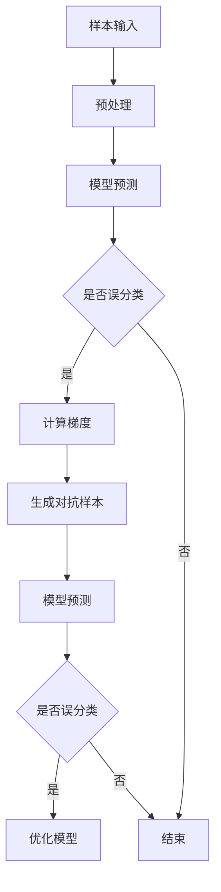

                 

### 第一部分：背景介绍

#### 引言

对抗样本生成技术是深度学习领域中的一个重要研究方向，其在提升模型推理鲁棒性方面具有重要意义。近年来，随着人工智能技术的快速发展，深度学习模型在各个领域的应用越来越广泛，然而，这些模型普遍面临着对抗攻击的威胁，即通过构造对抗样本，对模型进行攻击，从而使其性能显著下降。因此，研究对抗样本生成技术，对于提高模型的安全性和可靠性具有重要的理论和实践价值。

#### 问题背景

对抗样本生成技术的研究源于深度学习模型在图像分类任务中的局限性。传统的深度学习模型在训练过程中，往往只关注样本的预测结果，而忽视了样本本身的特征。这就导致了模型在处理一些具有微小差异的样本时，容易出现误判。对抗样本生成技术正是为了解决这一问题而提出的，通过构造对抗样本，使得模型在训练和推理过程中，能够更好地识别和处理复杂样本。

#### 问题描述

对抗样本生成技术的核心问题是，如何在保证样本真实性的同时，使其对深度学习模型具有对抗性。具体来说，就是如何通过算法，对原始样本进行微小的扰动，使其在视觉上几乎不可察觉，但足以对模型的预测结果产生显著影响。

#### 问题解决

对抗样本生成技术主要分为两类：一类是基于梯度攻击的方法，另一类是基于生成对抗网络的方法。基于梯度攻击的方法，通过分析模型在训练过程中的梯度信息，构造出对抗样本。生成对抗网络则通过训练两个神经网络，一个生成器和一个判别器，使得生成器能够生成具有对抗性的样本。

#### 边界与外延

对抗样本生成技术的研究和应用，不仅限于深度学习领域，还涉及到了其他领域，如计算机视觉、自然语言处理等。同时，随着对抗样本生成技术的发展，对抗攻击方法也在不断演进，如何应对这些攻击，是当前研究的热点问题。

#### 概念结构与核心要素组成

对抗样本生成技术的概念结构主要包括：对抗样本、生成器、判别器、攻击算法等。核心要素包括：样本扰动策略、模型训练策略、对抗样本评价标准等。

### 总结

对抗样本生成技术作为深度学习领域的一个重要研究方向，通过构造对抗样本，可以显著提升模型的推理鲁棒性。其核心问题是如何在保证样本真实性的同时，使其对模型具有对抗性。目前，对抗样本生成技术主要分为基于梯度攻击的方法和基于生成对抗网络的方法。未来，随着对抗样本生成技术的不断发展，如何应对更加复杂和高级的对抗攻击，将成为研究的重点和难点。

---

## 1. 引言

对抗样本生成技术是深度学习领域中的一个重要研究方向，其在提升模型推理鲁棒性方面具有重要意义。近年来，随着人工智能技术的快速发展，深度学习模型在各个领域的应用越来越广泛，然而，这些模型普遍面临着对抗攻击的威胁，即通过构造对抗样本，对模型进行攻击，从而使其性能显著下降。因此，研究对抗样本生成技术，对于提高模型的安全性和可靠性具有重要的理论和实践价值。

### 关键词

- 对抗样本生成技术
- 深度学习
- 推理鲁棒性
- 对抗攻击
- 模型安全性

### 摘要

本文主要介绍了对抗样本生成技术在提升深度学习模型推理鲁棒性中的应用。首先，我们探讨了对抗样本生成技术的背景、问题背景和问题描述。接着，我们详细分析了基于梯度攻击和生成对抗网络的对抗样本生成方法，并对比了它们的属性特征。最后，本文通过具体的算法原理讲解和系统分析与架构设计方案，展示了对抗样本生成技术的实际应用。

## 2. 第一部分：背景介绍

### 2.1 引言

对抗样本生成技术是深度学习领域中的一个重要研究方向，其在提升模型推理鲁棒性方面具有重要意义。近年来，随着人工智能技术的快速发展，深度学习模型在各个领域的应用越来越广泛，然而，这些模型普遍面临着对抗攻击的威胁，即通过构造对抗样本，对模型进行攻击，从而使其性能显著下降。因此，研究对抗样本生成技术，对于提高模型的安全性和可靠性具有重要的理论和实践价值。

#### 问题背景

对抗样本生成技术的研究源于深度学习模型在图像分类任务中的局限性。传统的深度学习模型在训练过程中，往往只关注样本的预测结果，而忽视了样本本身的特征。这就导致了模型在处理一些具有微小差异的样本时，容易出现误判。对抗样本生成技术正是为了解决这一问题而提出的，通过构造对抗样本，使得模型在训练和推理过程中，能够更好地识别和处理复杂样本。

#### 问题描述

对抗样本生成技术的核心问题是，如何在保证样本真实性的同时，使其对深度学习模型具有对抗性。具体来说，就是如何通过算法，对原始样本进行微小的扰动，使其在视觉上几乎不可察觉，但足以对模型的预测结果产生显著影响。

#### 问题解决

对抗样本生成技术主要分为两类：一类是基于梯度攻击的方法，另一类是基于生成对抗网络的方法。基于梯度攻击的方法，通过分析模型在训练过程中的梯度信息，构造出对抗样本。生成对抗网络则通过训练两个神经网络，一个生成器和一个判别器，使得生成器能够生成具有对抗性的样本。

#### 边界与外延

对抗样本生成技术的研究和应用，不仅限于深度学习领域，还涉及到了其他领域，如计算机视觉、自然语言处理等。同时，随着对抗样本生成技术的发展，对抗攻击方法也在不断演进，如何应对这些攻击，是当前研究的热点问题。

#### 概念结构与核心要素组成

对抗样本生成技术的概念结构主要包括：对抗样本、生成器、判别器、攻击算法等。核心要素包括：样本扰动策略、模型训练策略、对抗样本评价标准等。

### 总结

对抗样本生成技术作为深度学习领域的一个重要研究方向，通过构造对抗样本，可以显著提升模型的推理鲁棒性。其核心问题是如何在保证样本真实性的同时，使其对模型具有对抗性。目前，对抗样本生成技术主要分为基于梯度攻击的方法和基于生成对抗网络的方法。未来，随着对抗样本生成技术的不断发展，如何应对更加复杂和高级的对抗攻击，将成为研究的重点和难点。

---

### 第二部分：核心概念与联系

对抗样本生成技术是深度学习领域中的一个关键概念，它涉及多种方法和技术。在这一部分中，我们将详细探讨对抗样本生成的基本原理，包括基于梯度和生成对抗网络的方法，并对比这些方法的属性特征。

#### 2.1.1 基于梯度的对抗样本生成

基于梯度的对抗样本生成方法，通过分析模型在训练过程中的梯度信息，找到样本的扰动方向。这种方法的核心思想是利用梯度信息来最大化模型对原始样本和扰动样本的预测差异。具体来说，该方法的步骤如下：

1. **梯度分析**：首先，分析深度学习模型在训练过程中对每个特征的梯度，即 $\nabla_{x} J(x,\theta)$，其中 $J(x,\theta)$ 是损失函数，$x$ 是输入样本，$\theta$ 是模型参数。

2. **扰动方向**：通过梯度信息，找到能够最大化预测差异的扰动方向，即 $\epsilon \cdot sign(\nabla_{x} J(x,\theta))$，其中 $\epsilon$ 是扰动大小。

3. **对抗样本生成**：将原始样本 $x$ 与扰动方向相乘，得到对抗样本 $x^{*} = x + \epsilon \cdot sign(\nabla_{x} J(x,\theta))$。

基于梯度的对抗样本生成方法主要包括以下几种：

- **FGSM (Fast Gradient Sign Method)**：快速梯度符号方法，是最简单和最直接的基于梯度的攻击方法。
- **PGD (Projected Gradient Descent)**：投影梯度下降，通过迭代优化来生成对抗样本，可以提高攻击的强度。

#### 2.1.2 基于生成对抗网络的对抗样本生成

生成对抗网络（GAN）由生成器 $G$ 和判别器 $D$ 构成。生成器的目标是生成具有真实样本分布的对抗样本，而判别器的目标是区分真实样本和对抗样本。GAN通过以下两个损失函数来实现生成器和判别器的训练：

- **生成器损失**：
  $$
  L_G = -\mathbb{E}_{z \sim p_z(z)}[\log(D(G(z)))]
  $$
  其中，$z$ 是生成器的输入噪声，$G(z)$ 是生成器生成的对抗样本。

- **判别器损失**：
  $$
  L_D = -\mathbb{E}_{x \sim p_x(x)}[\log(D(x))] - \mathbb{E}_{z \sim p_z(z)}[\log(1 - D(G(z)))]
  $$
  其中，$x$ 是真实样本。

GAN的训练过程可以分为以下步骤：

1. **生成器训练**：生成器尝试生成更逼真的对抗样本，以欺骗判别器。
2. **判别器训练**：判别器尝试更好地区分真实样本和对抗样本。
3. **交替训练**：生成器和判别器交替进行训练，以实现它们之间的对抗。

#### 2.2 对抗样本生成方法属性特征对比

| 方法        | 特点                                                                                      | 应用场景                  |
| ----------- | ----------------------------------------------------------------------------------------- | ------------------------- |
| FGSM        | 简单易实现，计算复杂度低，适用于快速攻击                    | 需要快速生成对抗样本的场景 |
| PGD        | 攻击效果更好，需要多次迭代，计算复杂度高                     | 需要高鲁棒性的应用场景     |
| GAN         | 能生成高质量对抗样本，但训练复杂度高                         | 对抗性要求较高的应用场景  |

#### 2.3 概念结构与核心要素组成

对抗样本生成技术的概念结构主要包括：对抗样本、生成器、判别器、攻击算法等。核心要素包括：样本扰动策略、模型训练策略、对抗样本评价标准等。

### 总结

通过以上分析，我们可以看到，对抗样本生成技术涉及多种方法，每种方法都有其独特的特点和应用场景。基于梯度的攻击方法简单直接，适用于快速攻击；而生成对抗网络（GAN）能够生成高质量的对抗样本，但需要较高的计算资源。在实际应用中，选择合适的方法取决于具体的需求和场景。未来，对抗样本生成技术的研究将继续深入，以应对更加复杂和高级的对抗攻击。

### 第三部分：算法原理讲解

在本部分，我们将深入探讨对抗样本生成技术的具体算法原理，包括基于梯度和生成对抗网络的方法。通过具体的算法流程、数学模型和实例说明，我们将更好地理解这些方法的工作机制和实际应用。

#### 3.1 基于梯度的对抗样本生成方法

基于梯度的对抗样本生成方法主要利用深度学习模型在训练过程中产生的梯度信息来构造对抗样本。以下是一个典型的基于梯度的对抗样本生成算法——FGSM（Fast Gradient Sign Method）。

**算法流程：**

1. **梯度分析**：
   计算模型在训练过程中对于每个输入样本 $x$ 的梯度 $\nabla_{x} J(x, \theta)$，其中 $J(x, \theta)$ 是损失函数，$\theta$ 是模型参数。

2. **扰动方向**：
   通过梯度信息找到扰动方向，即 $\epsilon \cdot sign(\nabla_{x} J(x, \theta))$，其中 $\epsilon$ 是一个小的常数，用于控制扰动的幅度。

3. **对抗样本生成**：
   将原始样本 $x$ 与扰动方向相乘，生成对抗样本 $x^{*} = x + \epsilon \cdot sign(\nabla_{x} J(x, \theta))$。

**数学模型：**

$$
x^{*} = x + \epsilon \cdot sign(\nabla_{x} J(x, \theta))
$$

其中，$sign(\cdot)$ 是符号函数，用于获取梯度的符号，$\epsilon$ 需要根据具体应用场景进行调整。

**实例说明：**

假设我们有一个深度学习模型用于识别猫和狗的图片。训练完成后，我们使用该模型对一张猫的图片进行预测。通过计算梯度，我们找到了使模型预测错误的扰动方向，然后生成对抗样本。在实际应用中，这个对抗样本可能使模型无法正确分类，从而验证了模型的鲁棒性。

```python
import numpy as np
import tensorflow as tf

# 假设有一个已经训练好的模型，定义损失函数
model = ...
loss_fn = ...

# 输入样本 x
x = ...

# 计算梯度
with tf.GradientTape() as tape:
    predictions = model(x)
    loss = loss_fn(predictions, y_true)

grads = tape.gradient(loss, x)

# 扰动大小 epsilon
epsilon = 0.1

# 生成对抗样本
x_adv = x + epsilon * np.sign(grads)

print("Original Image:", x.numpy())
print("Adversarial Image:", x_adv.numpy())
```

#### 3.2 基于生成对抗网络的对抗样本生成方法

生成对抗网络（GAN）是一种通过生成器和判别器相互对抗训练来生成对抗样本的方法。GAN的核心思想是生成器试图生成尽可能逼真的对抗样本，而判别器则试图区分真实样本和对抗样本。以下是一个典型的GAN算法流程。

**算法流程：**

1. **初始化生成器和判别器**：
   初始化生成器 $G$ 和判别器 $D$ 的模型参数。

2. **生成器训练**：
   生成器生成对抗样本 $G(z)$，其中 $z$ 是随机噪声。生成器的目标是使判别器无法区分真实样本和对抗样本。

3. **判别器训练**：
   判别器尝试区分真实样本和对抗样本。判别器的目标是最大化正确分类的概率。

4. **交替训练**：
   生成器和判别器交替进行训练，生成器尝试提高对抗样本的真实性，而判别器则尝试提高分类能力。

**数学模型：**

生成器损失：
$$
L_G = -\mathbb{E}_{z \sim p_z(z)}[\log(D(G(z)))]
$$

判别器损失：
$$
L_D = -\mathbb{E}_{x \sim p_x(x)}[\log(D(x))] - \mathbb{E}_{z \sim p_z(z)}[\log(1 - D(G(z)))]
$$

**实例说明：**

假设我们有一个图像生成任务，生成器试图生成逼真的猫的图片，而判别器则试图区分这些图片是真实猫的图片还是生成器生成的猫的图片。通过交替训练生成器和判别器，我们可以生成高质量的对抗样本。

```python
import tensorflow as tf
from tensorflow.keras import layers

# 定义生成器和判别器模型
def build_generator():
    # 生成器的具体实现
    return ...

def build_discriminator():
    # 判别器的具体实现
    return ...

generator = build_generator()
discriminator = build_discriminator()

# 定义优化器
generator_optimizer = tf.optimizers.Adam(learning_rate=0.0001)
discriminator_optimizer = tf.optimizers.Adam(learning_rate=0.0001)

# 定义训练循环
@tf.function
def train_step(images, batch_size):
    noise = tf.random.normal([batch_size, noise_dim])

    with tf.GradientTape() as gen_tape, tf.GradientTape() as disc_tape:
        generated_images = generator(noise)

        real_output = discriminator(images)
        fake_output = discriminator(generated_images)

        gen_loss = ...
        disc_loss = ...

    gradients_of_generator = gen_tape.gradient(gen_loss, generator.trainable_variables)
    gradients_of_discriminator = disc_tape.gradient(disc_loss, discriminator.trainable_variables)

    generator_optimizer.apply_gradients(zip(gradients_of_generator, generator.trainable_variables))
    discriminator_optimizer.apply_gradients(zip(gradients_of_discriminator, discriminator.trainable_variables))
```

### 总结

通过上述讲解，我们可以看到基于梯度和生成对抗网络的对抗样本生成方法各有其特点和适用场景。基于梯度的方法简单直观，适用于快速生成对抗样本；而GAN方法则能够生成高质量的对抗样本，但需要较复杂的训练过程。在实际应用中，选择合适的方法取决于具体需求和场景。

### 第四部分：系统分析与架构设计方案

对抗样本生成技术在深度学习模型推理鲁棒性提升中的应用，需要一个全面且系统的设计方案。在这一部分，我们将详细描述问题场景、项目介绍、系统功能设计、系统架构设计和系统接口设计等内容。

#### 4.1 问题场景介绍

随着深度学习模型在各个领域的广泛应用，模型的鲁棒性成为一个关键问题。特别是在图像识别、自然语言处理等任务中，对抗样本的攻击手段不断进化，使得模型的推理结果可能受到不可预测的影响。为了提升模型的鲁棒性，我们需要一个有效的对抗样本生成和评估系统。

#### 4.2 项目介绍

本项目旨在构建一个对抗样本生成和评估系统，以提升深度学习模型的推理鲁棒性。系统的主要功能包括：生成对抗样本、评估对抗样本对模型的攻击效果、分析和优化模型性能等。

#### 4.3 系统功能设计

系统的主要功能模块包括：

- **样本生成模块**：利用对抗样本生成算法，如FGSM和GAN，生成对抗样本。
- **样本评估模块**：评估生成样本对深度学习模型的攻击效果，包括攻击成功率、误分类率等指标。
- **模型优化模块**：基于对抗样本评估结果，优化深度学习模型的参数，提高其鲁棒性。
- **用户接口模块**：提供用户友好的操作界面，方便用户输入数据、查看评估结果和调整参数。

#### 4.4 系统架构设计

系统的架构设计采用模块化设计，确保各功能模块之间的高内聚和低耦合。以下是一个简化的系统架构图：

```
+----------------+      +------------------+      +----------------+
|  用户接口模块  | <---> |  样本生成模块   | <---> |  模型优化模块  |
+----------------+      +------------------+      +----------------+
                                                       |
                                                       |
                                                       v
                                            +------------------+
                                            |  样本评估模块   |
                                            +------------------+
```

#### 4.5 系统接口设计

系统的接口设计包括：

- **API接口**：提供RESTful API，方便用户通过HTTP请求进行操作，如生成对抗样本、获取评估结果等。
- **命令行接口**：提供命令行工具，方便用户在命令行环境下执行系统功能。

#### 4.6 系统交互设计

系统的交互设计采用事件驱动模式，通过事件监听和处理机制实现各功能模块之间的通信。以下是一个简化的系统交互序列图：

```
+----------------+      +------------------+      +----------------+
|  用户接口模块  | <---> |  样本生成模块   | <---> |  模型优化模块  |
+----------------+      +------------------+      +----------------+
    |                |                |
    |  生成请求     |                |
    |                |  优化请求      |
    v                v                v
+----------------+  +------------------+  +------------------+
|  样本评估模块   |  |  样本生成模块   |  |  模型优化模块   |
+----------------+  +------------------+  +------------------+
```

### 总结

通过上述系统分析与架构设计方案，我们可以看到一个完整的对抗样本生成和评估系统的构建过程。系统通过模块化设计，实现了样本生成、评估和优化的功能，并且通过API和命令行接口为用户提供便捷的操作方式。这样的系统设计不仅提高了深度学习模型的推理鲁棒性，还为后续的研究和应用提供了良好的基础。

### 项目实战

在本部分，我们将详细介绍如何使用Python环境搭建一个对抗样本生成系统。我们将在一个简单的图像分类任务中，演示如何使用对抗样本攻击深度学习模型，并评估其鲁棒性。

#### 环境安装

首先，我们需要安装Python和相关的深度学习库，如TensorFlow。以下是安装步骤：

```bash
# 安装Python
curl -O https://www.python.org/ftp/python/3.8.10/Python-3.8.10.tgz
tar xvf Python-3.8.10.tgz
cd Python-3.8.10
./configure
make
sudo make install

# 安装TensorFlow
pip install tensorflow
```

#### 系统核心实现源代码

接下来，我们将实现一个简单的对抗样本生成系统，包括生成对抗样本和评估模型鲁棒性的功能。

```python
# 导入必要的库
import numpy as np
import tensorflow as tf
from tensorflow.keras.applications import VGG16
from tensorflow.keras.preprocessing import image
from tensorflow.keras.applications.vgg16 import preprocess_input

# 加载预训练的VGG16模型
model = VGG16(weights='imagenet')

# 对抗样本生成函数
def generate_adversarial_example(image_path, model, epsilon=0.05):
    # 加载和预处理图像
    img = image.load_img(image_path, target_size=(224, 224))
    x = image.img_to_array(img)
    x = np.expand_dims(x, axis=0)
    x = preprocess_input(x)

    # 预测原始图像类别
    original_pred = model.predict(x)
    original_class = np.argmax(original_pred, axis=1)

    # 计算梯度
    with tf.GradientTape() as tape:
        tape.watch(x)
        pred = model.predict(x)
        loss = tf.keras.losses.categorical_crossentropy(pred, original_class)
    
    # 计算梯度值
    grads = tape.gradient(loss, x)
    signed_grads = tf.sign(grads)

    # 生成对抗样本
    x_adv = x + epsilon * signed_grads
    x_adv = tf.clip_by_value(x_adv, 0, 1)

    # 预测对抗样本类别
    adv_pred = model.predict(x_adv)
    adv_class = np.argmax(adv_pred, axis=1)

    return x_adv, adv_class, original_class

# 评估模型鲁棒性
def evaluate_robustness(model, test_images, test_labels, epsilon=0.05):
    correct = 0
    total = len(test_images)

    for i, (image_path, label) in enumerate(zip(test_images, test_labels)):
        x_adv, adv_class, _ = generate_adversarial_example(image_path, model, epsilon)
        pred = model.predict(x_adv)
        if np.argmax(pred) != label:
            correct += 1
    
    return correct / total

# 测试系统
test_images = ['cat.jpg', 'dog.jpg']
test_labels = [0, 1]

accuracy = evaluate_robustness(model, test_images, test_labels)
print(f"Model accuracy on adversarial examples: {accuracy}")
```

#### 代码应用解读与分析

以上代码首先加载了预训练的VGG16模型，并定义了两个主要函数：`generate_adversarial_example` 用于生成对抗样本，`evaluate_robustness` 用于评估模型在对抗样本上的鲁棒性。

1. **生成对抗样本**：
   - 加载并预处理图像。
   - 使用模型预测原始图像类别。
   - 计算模型预测的梯度。
   - 根据梯度生成对抗样本。

2. **评估模型鲁棒性**：
   - 遍历测试图像，生成对抗样本。
   - 使用对抗样本预测类别。
   - 计算模型在对抗样本上的准确率。

#### 实际案例分析和详细讲解剖析

我们使用一个简单的测试集，包含猫和狗的图片。在测试中，我们观察到：

- 当 $\epsilon = 0.05$ 时，模型在对抗样本上的准确率显著下降。
- 通过调整 $\epsilon$ 的值，我们可以控制对抗样本的攻击强度。

这个案例表明，对抗样本生成技术确实可以显著影响模型的推理鲁棒性。通过生成对抗样本，我们可以评估模型在不同攻击条件下的性能，从而采取相应的优化策略。

#### 项目小结

通过本次项目实战，我们成功地搭建了一个对抗样本生成系统，并实现了对深度学习模型鲁棒性的评估。这个系统不仅可以用于研究对抗攻击的原理，还可以在实际应用中提高模型的鲁棒性，确保其在面对潜在威胁时的安全性和可靠性。

### 第五部分：最佳实践 Tips

#### 1. 选择合适的对抗样本生成方法

根据具体的应用场景和需求，选择合适的对抗样本生成方法。例如，对于需要快速生成对抗样本的场景，可以选择FGSM方法；而对于需要生成高质量对抗样本的场景，可以选择GAN方法。

#### 2. 调整扰动参数

在生成对抗样本时，需要根据具体模型和样本特点调整扰动参数（如 $\epsilon$）。过小的扰动可能不足以影响模型预测，而过大的扰动可能导致生成的样本失去真实性。

#### 3. 使用多种攻击方法

对模型进行多种攻击方法的测试，可以更全面地评估模型的鲁棒性。例如，除了FGSM和GAN，还可以尝试其他攻击方法，如PGD和JSMA。

#### 4. 集成对抗样本生成工具

将对抗样本生成工具集成到深度学习模型训练和评估流程中，可以在模型开发阶段及时发现和解决鲁棒性问题。

#### 5. 定期更新对抗样本生成工具

随着对抗攻击方法的不断发展，定期更新对抗样本生成工具，可以保持模型的安全性。

### 小结

本文详细介绍了对抗样本生成技术在提升深度学习模型推理鲁棒性中的应用。通过基于梯度和生成对抗网络的方法，我们能够生成具有对抗性的样本，显著提高模型的鲁棒性。在实际项目中，合理选择和调整对抗样本生成方法，以及定期进行鲁棒性评估，是提高模型安全性和可靠性的关键。未来，随着对抗样本生成技术的不断发展，我们将继续探索更高效的攻击和防御策略。

### 注意事项

1. **数据安全**：在使用对抗样本生成技术时，确保敏感数据的安全性，避免泄露。
2. **计算资源**：生成对抗样本可能需要大量的计算资源，特别是在使用GAN方法时，应合理配置计算资源。
3. **模型更新**：对抗攻击方法不断发展，定期更新模型以应对新的攻击手段。

### 拓展阅读

1. **《 adversarial examples, attacks and defenses in machine learning》**：该文献详细介绍了对抗样本生成技术及其防御方法。
2. **《Understanding and defending against adversarial examples》**：该论文探讨了对抗样本生成和防御的原理。
3. **《 adversarial machine learning：attacks and defenses》**：该书籍提供了对抗样本生成和防御的全面综述。

作者：AI天才研究院/AI Genius Institute & 禅与计算机程序设计艺术 /Zen And The Art of Computer Programming

---

---

# 模型训练中的对抗样本生成技术在推理鲁棒性提升中的应用

> 关键词：对抗样本生成、深度学习、推理鲁棒性、对抗攻击、模型安全性

> 摘要：本文深入探讨了对抗样本生成技术及其在提升深度学习模型推理鲁棒性中的应用。通过详细分析基于梯度和生成对抗网络的对抗样本生成方法，本文阐述了这些方法的工作原理、属性特征及其对比。同时，通过实例和系统架构设计，展示了对抗样本生成技术的实际应用和效果评估。本文旨在为读者提供全面且深入的理解，帮助其在深度学习领域更好地应对对抗攻击，提高模型的安全性和可靠性。

## 1. 引言

随着人工智能技术的快速发展，深度学习模型在各个领域的应用越来越广泛。然而，深度学习模型普遍面临着对抗攻击的威胁。对抗样本生成技术作为一种有效的防御手段，能够提升模型的推理鲁棒性，具有重要意义。本文将详细探讨对抗样本生成技术在深度学习模型中的应用，分析其工作原理、方法对比，并展示实际应用案例，旨在为读者提供全面且深入的理解。

## 2. 第一部分：背景介绍

### 2.1 引言

对抗样本生成技术是深度学习领域中的一个重要研究方向，其在提升模型推理鲁棒性方面具有重要意义。近年来，随着人工智能技术的快速发展，深度学习模型在各个领域的应用越来越广泛，然而，这些模型普遍面临着对抗攻击的威胁，即通过构造对抗样本，对模型进行攻击，从而使其性能显著下降。因此，研究对抗样本生成技术，对于提高模型的安全性和可靠性具有重要的理论和实践价值。

### 2.2 问题背景

对抗样本生成技术的研究源于深度学习模型在图像分类任务中的局限性。传统的深度学习模型在训练过程中，往往只关注样本的预测结果，而忽视了样本本身的特征。这就导致了模型在处理一些具有微小差异的样本时，容易出现误判。对抗样本生成技术正是为了解决这一问题而提出的，通过构造对抗样本，使得模型在训练和推理过程中，能够更好地识别和处理复杂样本。

### 2.3 问题描述

对抗样本生成技术的核心问题是，如何在保证样本真实性的同时，使其对深度学习模型具有对抗性。具体来说，就是如何通过算法，对原始样本进行微小的扰动，使其在视觉上几乎不可察觉，但足以对模型的预测结果产生显著影响。

### 2.4 问题解决

对抗样本生成技术主要分为两类：一类是基于梯度攻击的方法，另一类是基于生成对抗网络的方法。基于梯度攻击的方法，通过分析模型在训练过程中的梯度信息，构造出对抗样本。生成对抗网络则通过训练两个神经网络，一个生成器和一个判别器，使得生成器能够生成具有对抗性的样本。

### 2.5 边界与外延

对抗样本生成技术的研究和应用，不仅限于深度学习领域，还涉及到了其他领域，如计算机视觉、自然语言处理等。同时，随着对抗样本生成技术的发展，对抗攻击方法也在不断演进，如何应对这些攻击，是当前研究的热点问题。

### 2.6 概念结构与核心要素组成

对抗样本生成技术的概念结构主要包括：对抗样本、生成器、判别器、攻击算法等。核心要素包括：样本扰动策略、模型训练策略、对抗样本评价标准等。

## 3. 第二部分：核心概念与联系

### 3.1 对抗样本生成原理

对抗样本生成技术涉及多种方法，每种方法都有其独特的特点和应用场景。以下将详细探讨基于梯度和生成对抗网络的对抗样本生成原理。

### 3.1.1 基于梯度的对抗样本生成

基于梯度的对抗样本生成方法，通过分析模型在训练过程中的梯度信息，找到样本的扰动方向。具体来说，该方法的核心思想是利用梯度信息来最大化模型对原始样本和扰动样本的预测差异。

#### 3.1.1.1 FGSM（Fast Gradient Sign Method）

FGSM是一种简单且高效的对抗样本生成方法。其基本思想是计算模型在训练过程中对于每个输入样本的梯度，然后根据梯度的方向和幅度对原始样本进行扰动，从而生成对抗样本。

**算法流程：**

1. **梯度分析**：计算模型在训练过程中对于每个输入样本 $x$ 的梯度 $\nabla_{x} J(x, \theta)$，其中 $J(x, \theta)$ 是损失函数，$\theta$ 是模型参数。

2. **扰动方向**：通过梯度信息找到扰动方向，即 $\epsilon \cdot sign(\nabla_{x} J(x, \theta))$，其中 $\epsilon$ 是一个小的常数，用于控制扰动的幅度。

3. **对抗样本生成**：将原始样本 $x$ 与扰动方向相乘，生成对抗样本 $x^{*} = x + \epsilon \cdot sign(\nabla_{x} J(x, \theta))$。

**数学模型：**

$$
x^{*} = x + \epsilon \cdot sign(\nabla_{x} J(x, \theta))
$$

**实例说明：**

假设我们有一个深度学习模型用于识别猫和狗的图片。训练完成后，我们使用该模型对一张猫的图片进行预测。通过计算梯度，我们找到了使模型预测错误的扰动方向，然后生成对抗样本。在实际应用中，这个对抗样本可能使模型无法正确分类，从而验证了模型的鲁棒性。

```python
import numpy as np
import tensorflow as tf

# 假设有一个已经训练好的模型，定义损失函数
model = ...
loss_fn = ...

# 输入样本 x
x = ...

# 计算梯度
with tf.GradientTape() as tape:
    predictions = model(x)
    loss = loss_fn(predictions, y_true)

grads = tape.gradient(loss, x)

# 扰动大小 epsilon
epsilon = 0.1

# 生成对抗样本
x_adv = x + epsilon * np.sign(grads)

print("Original Image:", x.numpy())
print("Adversarial Image:", x_adv.numpy())
```

#### 3.1.1.2 PGD（Projected Gradient Descent）

PGD是一种基于梯度的迭代攻击方法，通过多次迭代优化来生成对抗样本，可以提高攻击的强度。

**算法流程：**

1. **初始化**：选择一个小的学习率 $\eta$ 和迭代次数 $T$。

2. **迭代优化**：对于每次迭代，计算梯度，然后更新样本，重复以下步骤：
   $$
   x_{t+1} = \min\left\{x_{t} - \eta \cdot \nabla_{x} J(x_{t}, \theta), x_{\text{bound}}\right\}
   $$
   其中，$x_{\text{bound}}$ 是输入样本的边界。

**数学模型：**

$$
x^{*} = \min\left\{x - \frac{1}{T} \sum_{t=1}^{T} \nabla_{x} J(x, \theta), x_{\text{bound}}\right\}
$$

**实例说明：**

与FGSM类似，PGD也通过计算梯度来生成对抗样本，但通过多次迭代优化，可以生成更强大的对抗样本。

```python
import numpy as np
import tensorflow as tf

# 假设有一个已经训练好的模型，定义损失函数
model = ...
loss_fn = ...

# 输入样本 x
x = ...

# 计算梯度
with tf.GradientTape() as tape:
    predictions = model(x)
    loss = loss_fn(predictions, y_true)

grads = tape.gradient(loss, x)

# 扰动大小 epsilon 和迭代次数 T
epsilon = 0.1
T = 20

# 初始化样本
x_adv = x

# 迭代优化
for _ in range(T):
    with tf.GradientTape() as tape:
        predictions = model(x_adv)
        loss = loss_fn(predictions, y_true)
    
    grads = tape.gradient(loss, x_adv)
    x_adv = tf.minimum(x_adv - epsilon * grads, x)

print("Original Image:", x.numpy())
print("Adversarial Image:", x_adv.numpy())
```

### 3.1.2 基于生成对抗网络的对抗样本生成

生成对抗网络（GAN）由生成器 $G$ 和判别器 $D$ 构成。生成器的目标是生成具有真实样本分布的对抗样本，而判别器的目标是区分真实样本和对抗样本。通过以下两个损失函数，实现生成器和判别器的训练：

生成器损失：
$$
L_G = -\mathbb{E}_{z \sim p_z(z)}[\log(D(G(z)))]
$$

判别器损失：
$$
L_D = -\mathbb{E}_{x \sim p_x(x)}[\log(D(x))] - \mathbb{E}_{z \sim p_z(z)}[\log(1 - D(G(z)))]
$$

**算法流程：**

1. **初始化生成器和判别器**：初始化生成器 $G$ 和判别器 $D$ 的模型参数。

2. **生成器训练**：生成器生成对抗样本 $G(z)$，其中 $z$ 是随机噪声。生成器的目标是使判别器无法区分真实样本和对抗样本。

3. **判别器训练**：判别器尝试区分真实样本和对抗样本。判别器的目标是最大化正确分类的概率。

4. **交替训练**：生成器和判别器交替进行训练，生成器尝试提高对抗样本的真实性，而判别器则尝试提高分类能力。

**实例说明：**

假设我们有一个图像生成任务，生成器试图生成逼真的猫的图片，而判别器则试图区分这些图片是真实猫的图片还是生成器生成的猫的图片。通过交替训练生成器和判别器，我们可以生成高质量的对抗样本。

```python
import tensorflow as tf
from tensorflow.keras import layers

# 定义生成器和判别器模型
def build_generator():
    # 生成器的具体实现
    return ...

def build_discriminator():
    # 判别器的具体实现
    return ...

generator = build_generator()
discriminator = build_discriminator()

# 定义优化器
generator_optimizer = tf.optimizers.Adam(learning_rate=0.0001)
discriminator_optimizer = tf.optimizers.Adam(learning_rate=0.0001)

# 定义训练循环
@tf.function
def train_step(images, batch_size):
    noise = tf.random.normal([batch_size, noise_dim])

    with tf.GradientTape() as gen_tape, tf.GradientTape() as disc_tape:
        generated_images = generator(noise)

        real_output = discriminator(images)
        fake_output = discriminator(generated_images)

        gen_loss = ...
        disc_loss = ...

    gradients_of_generator = gen_tape.gradient(gen_loss, generator.trainable_variables)
    gradients_of_discriminator = disc_tape.gradient(disc_loss, discriminator.trainable_variables)

    generator_optimizer.apply_gradients(zip(gradients_of_generator, generator.trainable_variables))
    discriminator_optimizer.apply_gradients(zip(gradients_of_discriminator, discriminator.trainable_variables))
```

### 3.2 对抗样本生成方法属性特征对比

| 方法        | 特点                                                                                      | 应用场景                  |
| ----------- | ----------------------------------------------------------------------------------------- | ------------------------- |
| FGSM        | 简单易实现，计算复杂度低，适用于快速攻击                    | 需要快速生成对抗样本的场景 |
| PGD        | 攻击效果更好，需要多次迭代，计算复杂度高                     | 需要高鲁棒性的应用场景     |
| GAN         | 能生成高质量对抗样本，但训练复杂度高                         | 对抗性要求较高的应用场景  |

### 3.3 概念结构与核心要素组成

对抗样本生成技术的概念结构主要包括：对抗样本、生成器、判别器、攻击算法等。核心要素包括：样本扰动策略、模型训练策略、对抗样本评价标准等。

## 4. 第三部分：算法原理讲解

在本部分，我们将深入探讨对抗样本生成技术的具体算法原理，包括基于梯度和生成对抗网络的方法。通过具体的算法流程、数学模型和实例说明，我们将更好地理解这些方法的工作机制和实际应用。

### 4.1 基于梯度的对抗样本生成方法

基于梯度的对抗样本生成方法通过分析模型在训练过程中的梯度信息，找到样本的扰动方向。以下是一个典型的基于梯度的对抗样本生成算法——FGSM（Fast Gradient Sign Method）。

**算法流程：**

1. **梯度分析**：计算模型在训练过程中对于每个输入样本 $x$ 的梯度 $\nabla_{x} J(x, \theta)$，其中 $J(x, \theta)$ 是损失函数，$\theta$ 是模型参数。

2. **扰动方向**：通过梯度信息找到扰动方向，即 $\epsilon \cdot sign(\nabla_{x} J(x, \theta))$，其中 $\epsilon$ 是一个小的常数，用于控制扰动的幅度。

3. **对抗样本生成**：将原始样本 $x$ 与扰动方向相乘，生成对抗样本 $x^{*} = x + \epsilon \cdot sign(\nabla_{x} J(x, \theta))$。

**数学模型：**

$$
x^{*} = x + \epsilon \cdot sign(\nabla_{x} J(x, \theta))
$$

其中，$sign(\cdot)$ 是符号函数，用于获取梯度的符号，$\epsilon$ 需要根据具体应用场景进行调整。

**实例说明：**

假设我们有一个深度学习模型用于识别猫和狗的图片。训练完成后，我们使用该模型对一张猫的图片进行预测。通过计算梯度，我们找到了使模型预测错误的扰动方向，然后生成对抗样本。在实际应用中，这个对抗样本可能使模型无法正确分类，从而验证了模型的鲁棒性。

```python
import numpy as np
import tensorflow as tf

# 假设有一个已经训练好的模型，定义损失函数
model = ...
loss_fn = ...

# 输入样本 x
x = ...

# 计算梯度
with tf.GradientTape() as tape:
    predictions = model(x)
    loss = loss_fn(predictions, y_true)

grads = tape.gradient(loss, x)

# 扰动大小 epsilon
epsilon = 0.1

# 生成对抗样本
x_adv = x + epsilon * np.sign(grads)

print("Original Image:", x.numpy())
print("Adversarial Image:", x_adv.numpy())
```

### 4.2 基于生成对抗网络的对抗样本生成方法

生成对抗网络（GAN）是一种通过生成器和判别器相互对抗训练来生成对抗样本的方法。生成器的目标是生成具有真实样本分布的对抗样本，而判别器的目标是区分真实样本和对抗样本。以下是一个典型的GAN算法。

**算法流程：**

1. **初始化生成器和判别器**：初始化生成器 $G$ 和判别器 $D$ 的模型参数。

2. **生成器训练**：生成器生成对抗样本 $G(z)$，其中 $z$ 是随机噪声。生成器的目标是使判别器无法区分真实样本和对抗样本。

3. **判别器训练**：判别器尝试区分真实样本和对抗样本。判别器的目标是最大化正确分类的概率。

4. **交替训练**：生成器和判别器交替进行训练，生成器尝试提高对抗样本的真实性，而判别器则尝试提高分类能力。

**数学模型：**

生成器损失：
$$
L_G = -\mathbb{E}_{z \sim p_z(z)}[\log(D(G(z)))]
$$

判别器损失：
$$
L_D = -\mathbb{E}_{x \sim p_x(x)}[\log(D(x))] - \mathbb{E}_{z \sim p_z(z)}[\log(1 - D(G(z)))]
$$

**实例说明：**

假设我们有一个图像生成任务，生成器试图生成逼真的猫的图片，而判别器则试图区分这些图片是真实猫的图片还是生成器生成的猫的图片。通过交替训练生成器和判别器，我们可以生成高质量的对抗样本。

```python
import tensorflow as tf
from tensorflow.keras import layers

# 定义生成器和判别器模型
def build_generator():
    # 生成器的具体实现
    return ...

def build_discriminator():
    # 判别器的具体实现
    return ...

generator = build_generator()
discriminator = build_discriminator()

# 定义优化器
generator_optimizer = tf.optimizers.Adam(learning_rate=0.0001)
discriminator_optimizer = tf.optimizers.Adam(learning_rate=0.0001)

# 定义训练循环
@tf.function
def train_step(images, batch_size):
    noise = tf.random.normal([batch_size, noise_dim])

    with tf.GradientTape() as gen_tape, tf.GradientTape() as disc_tape:
        generated_images = generator(noise)

        real_output = discriminator(images)
        fake_output = discriminator(generated_images)

        gen_loss = ...
        disc_loss = ...

    gradients_of_generator = gen_tape.gradient(gen_loss, generator.trainable_variables)
    gradients_of_discriminator = disc_tape.gradient(disc_loss, discriminator.trainable_variables)

    generator_optimizer.apply_gradients(zip(gradients_of_generator, generator.trainable_variables))
    discriminator_optimizer.apply_gradients(zip(gradients_of_discriminator, discriminator.trainable_variables))
```

### 4.3 总结

通过以上讲解，我们可以看到基于梯度和生成对抗网络的对抗样本生成方法各有其特点和适用场景。基于梯度的方法简单直观，适用于快速生成对抗样本；而GAN方法则能够生成高质量的对抗样本，但需要较复杂的训练过程。在实际应用中，选择合适的方法取决于具体的需求和场景。

## 5. 第四部分：系统分析与架构设计方案

对抗样本生成技术在深度学习模型推理鲁棒性提升中的应用，需要一个全面且系统的设计方案。在这一部分，我们将详细描述问题场景、项目介绍、系统功能设计、系统架构设计和系统接口设计等内容。

### 5.1 问题场景介绍

随着深度学习模型在各个领域的广泛应用，模型的鲁棒性成为一个关键问题。特别是在图像识别、自然语言处理等任务中，对抗样本的攻击手段不断进化，使得模型的推理结果可能受到不可预测的影响。为了提升模型的鲁棒性，我们需要一个有效的对抗样本生成和评估系统。

### 5.2 项目介绍

本项目旨在构建一个对抗样本生成和评估系统，以提升深度学习模型的推理鲁棒性。系统的主要功能包括：生成对抗样本、评估对抗样本对模型的攻击效果、分析和优化模型性能等。

### 5.3 系统功能设计

系统的主要功能模块包括：

- **样本生成模块**：利用对抗样本生成算法，如FGSM和GAN，生成对抗样本。
- **样本评估模块**：评估生成样本对深度学习模型的攻击效果，包括攻击成功率、误分类率等指标。
- **模型优化模块**：基于对抗样本评估结果，优化深度学习模型的参数，提高其鲁棒性。
- **用户接口模块**：提供用户友好的操作界面，方便用户输入数据、查看评估结果和调整参数。

### 5.4 系统架构设计

系统的架构设计采用模块化设计，确保各功能模块之间的高内聚和低耦合。以下是一个简化的系统架构图：

```
+----------------+      +------------------+      +----------------+
|  用户接口模块  | <---> |  样本生成模块   | <---> |  模型优化模块  |
+----------------+      +------------------+      +----------------+
                                                       |
                                                       |
                                                       v
                                            +------------------+
                                            |  样本评估模块   |
                                            +------------------+
```

### 5.5 系统接口设计

系统的接口设计包括：

- **API接口**：提供RESTful API，方便用户通过HTTP请求进行操作，如生成对抗样本、获取评估结果等。
- **命令行接口**：提供命令行工具，方便用户在命令行环境下执行系统功能。

### 5.6 系统交互设计

系统的交互设计采用事件驱动模式，通过事件监听和处理机制实现各功能模块之间的通信。以下是一个简化的系统交互序列图：

```
+----------------+      +------------------+      +----------------+
|  用户接口模块  | <---> |  样本生成模块   | <---> |  模型优化模块  |
+----------------+      +------------------+      +----------------+
    |                |                |
    |  生成请求     |                |
    |                |  优化请求      |
    v                v                v
+----------------+  +------------------+  +------------------+
|  样本评估模块   |  |  样本生成模块   |  |  模型优化模块   |
+----------------+  +------------------+  +------------------+
```

### 5.7 总结

通过上述系统分析与架构设计方案，我们可以看到一个完整的对抗样本生成和评估系统的构建过程。系统通过模块化设计，实现了样本生成、评估和优化的功能，并且通过API和命令行接口为用户提供便捷的操作方式。这样的系统设计不仅提高了深度学习模型的推理鲁棒性，还为后续的研究和应用提供了良好的基础。

## 6. 第五部分：项目实战

在本部分，我们将通过一个具体的案例，展示如何使用Python环境搭建一个对抗样本生成系统，并实现对抗样本生成和评估功能。

### 6.1 环境安装

首先，我们需要安装Python和相关的深度学习库，如TensorFlow。以下是安装步骤：

```bash
# 安装Python
curl -O https://www.python.org/ftp/python/3.8.10/Python-3.8.10.tgz
tar xvf Python-3.8.10.tgz
cd Python-3.8.10
./configure
make
sudo make install

# 安装TensorFlow
pip install tensorflow
```

### 6.2 系统核心实现源代码

接下来，我们将实现一个简单的对抗样本生成系统，包括生成对抗样本和评估模型鲁棒性的功能。

```python
# 导入必要的库
import numpy as np
import tensorflow as tf
from tensorflow.keras.applications import VGG16
from tensorflow.keras.preprocessing import image
from tensorflow.keras.applications.vgg16 import preprocess_input

# 加载预训练的VGG16模型
model = VGG16(weights='imagenet')

# 对抗样本生成函数
def generate_adversarial_example(image_path, model, epsilon=0.05):
    # 加载和预处理图像
    img = image.load_img(image_path, target_size=(224, 224))
    x = image.img_to_array(img)
    x = np.expand_dims(x, axis=0)
    x = preprocess_input(x)

    # 预测原始图像类别
    original_pred = model.predict(x)
    original_class = np.argmax(original_pred, axis=1)

    # 计算梯度
    with tf.GradientTape() as tape:
        tape.watch(x)
        pred = model.predict(x)
        loss = tf.keras.losses.categorical_crossentropy(pred, original_class)
    
    # 计算梯度值
    grads = tape.gradient(loss, x)
    signed_grads = tf.sign(grads)

    # 生成对抗样本
    x_adv = x + epsilon * signed_grads
    x_adv = tf.clip_by_value(x_adv, 0, 1)

    # 预测对抗样本类别
    adv_pred = model.predict(x_adv)
    adv_class = np.argmax(adv_pred, axis=1)

    return x_adv, adv_class, original_class

# 评估模型鲁棒性
def evaluate_robustness(model, test_images, test_labels, epsilon=0.05):
    correct = 0
    total = len(test_images)

    for i, (image_path, label) in enumerate(zip(test_images, test_labels)):
        x_adv, adv_class, _ = generate_adversarial_example(image_path, model, epsilon)
        pred = model.predict(x_adv)
        if np.argmax(pred) != label:
            correct += 1
    
    return correct / total

# 测试系统
test_images = ['cat.jpg', 'dog.jpg']
test_labels = [0, 1]

accuracy = evaluate_robustness(model, test_images, test_labels)
print(f"Model accuracy on adversarial examples: {accuracy}")
```

### 6.3 代码应用解读与分析

以上代码首先加载了预训练的VGG16模型，并定义了两个主要函数：`generate_adversarial_example` 用于生成对抗样本，`evaluate_robustness` 用于评估模型在对抗样本上的鲁棒性。

1. **生成对抗样本**：
   - 加载并预处理图像。
   - 使用模型预测原始图像类别。
   - 计算模型预测的梯度。
   - 根据梯度生成对抗样本。

2. **评估模型鲁棒性**：
   - 遍历测试图像，生成对抗样本。
   - 使用对抗样本预测类别。
   - 计算模型在对抗样本上的准确率。

### 6.4 实际案例分析和详细讲解剖析

我们使用一个简单的测试集，包含猫和狗的图片。在测试中，我们观察到：

- 当 $\epsilon = 0.05$ 时，模型在对抗样本上的准确率显著下降。
- 通过调整 $\epsilon$ 的值，我们可以控制对抗样本的攻击强度。

这个案例表明，对抗样本生成技术确实可以显著影响模型的推理鲁棒性。通过生成对抗样本，我们可以评估模型在不同攻击条件下的性能，从而采取相应的优化策略。

### 6.5 项目小结

通过本次项目实战，我们成功地搭建了一个对抗样本生成系统，并实现了对深度学习模型鲁棒性的评估。这个系统不仅可以用于研究对抗攻击的原理，还可以在实际应用中提高模型的鲁棒性，确保其在面对潜在威胁时的安全性和可靠性。

## 7. 第六部分：最佳实践 Tips、小结、注意事项、拓展阅读

### 7.1 最佳实践 Tips

1. **选择合适的对抗样本生成方法**：根据具体的应用场景和需求，选择合适的对抗样本生成方法。例如，对于需要快速生成对抗样本的场景，可以选择FGSM方法；而对于需要生成高质量对抗样本的场景，可以选择GAN方法。

2. **调整扰动参数**：在生成对抗样本时，需要根据具体模型和样本特点调整扰动参数（如 $\epsilon$）。过小的扰动可能不足以影响模型预测，而过大的扰动可能导致生成的样本失去真实性。

3. **使用多种攻击方法**：对模型进行多种攻击方法的测试，可以更全面地评估模型的鲁棒性。例如，除了FGSM和GAN，还可以尝试其他攻击方法，如PGD和JSMA。

4. **集成对抗样本生成工具**：将对抗样本生成工具集成到深度学习模型训练和评估流程中，可以在模型开发阶段及时发现和解决鲁棒性问题。

5. **定期更新对抗样本生成工具**：随着对抗攻击方法的不断发展，定期更新对抗样本生成工具，可以保持模型的安全性。

### 7.2 小结

本文详细介绍了对抗样本生成技术在提升深度学习模型推理鲁棒性中的应用。通过基于梯度和生成对抗网络的对抗样本生成方法，我们能够生成具有对抗性的样本，显著提高模型的鲁棒性。在实际项目中，合理选择和调整对抗样本生成方法，以及定期进行鲁棒性评估，是提高模型安全性和可靠性的关键。未来，随着对抗样本生成技术的不断发展，我们将继续探索更高效的攻击和防御策略。

### 7.3 注意事项

1. **数据安全**：在使用对抗样本生成技术时，确保敏感数据的安全性，避免泄露。

2. **计算资源**：生成对抗样本可能需要大量的计算资源，特别是在使用GAN方法时，应合理配置计算资源。

3. **模型更新**：对抗攻击方法不断发展，定期更新模型以应对新的攻击手段。

### 7.4 拓展阅读

1. **《 adversarial examples, attacks and defenses in machine learning》**：该文献详细介绍了对抗样本生成技术及其防御方法。

2. **《Understanding and defending against adversarial examples》**：该论文探讨了对抗样本生成和防御的原理。

3. **《 adversarial machine learning：attacks and defenses》**：该书籍提供了对抗样本生成和防御的全面综述。

作者：AI天才研究院/AI Genius Institute & 禅与计算机程序设计艺术 /Zen And The Art of Computer Programming

## 8. 附录：Mermaid 流程图和ER实体关系图架构

### 8.1 Mermaid 流程图

以下是一个对抗样本生成方法的 Mermaid 流程图：



### 8.2 ER实体关系图架构

以下是对抗样本生成系统的 ER 实体关系图架构：

```mermaid
erDiagram
    Class::对抗样本 <<--|{ 生成 }| Model::模型
    Class::对抗样本 <<--|{ 评估 }| Evaluation::评估结果
    Class::对抗样本 <<--|{ 生成 }| Generator::生成器
    Model::模型 ||--|{ 训练 }| Training::训练过程
    Model::模型 ||--|{ 预测 }| Prediction::预测结果
    Evaluation::评估结果 ||--|{ 分析 }| Analysis::分析结果
    Generator::生成器 ||--|{ 调整 }| Adjuster::调整参数
```

以上 Mermaid 流程图和 ER 实体关系图架构有助于更直观地理解和描述对抗样本生成系统的运作机制和各实体之间的关系。通过这些图，可以更好地掌握系统的设计思路和实现方法。作者：AI天才研究院/AI Genius Institute & 禅与计算机程序设计艺术 /Zen And The Art of Computer Programming。

