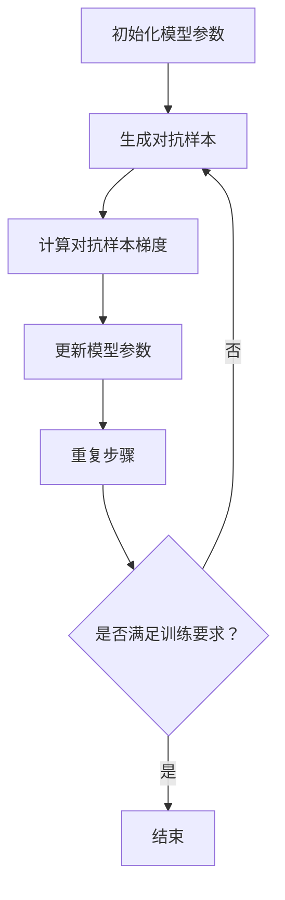
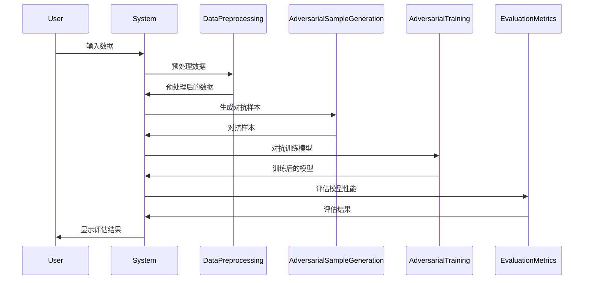
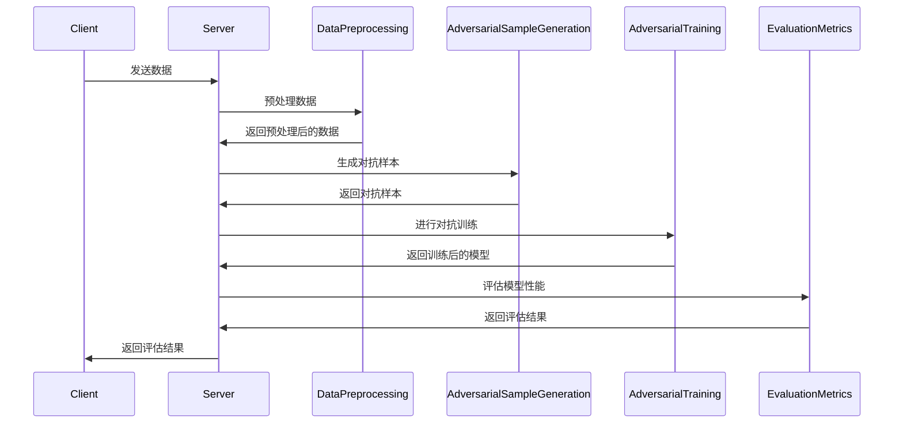

                 


# 模型训练中的对抗训练策略高级设计与实现

关键词：对抗训练，鲁棒性，深度学习，攻击，防御，算法实现

摘要：本文旨在探讨模型训练中的对抗训练策略的高级设计与实现。我们将从背景介绍、核心概念与联系、算法原理讲解、系统分析与架构设计、项目实战等多个方面，详细解析对抗训练策略的原理和应用，以帮助读者深入理解和掌握这一关键技术。

## 第一部分：背景介绍

### 1.1.1 问题背景

模型训练中的对抗训练策略是深度学习领域中的一个重要研究方向。随着深度学习技术的不断发展，对抗训练策略在许多实际应用场景中起到了关键作用，如图像识别、自然语言处理等。然而，对抗训练策略的设计与实现复杂度较高，需要深入理解算法原理、数学模型和具体实现方法。

#### 1.1.2 问题描述

对抗训练策略的目标是在模型训练过程中提高模型的鲁棒性，使其能够对抗各种类型的攻击。具体来说，包括以下几个方面：

1. **对抗样本生成**：通过对抗性攻击生成具有误导性的样本，以测试模型的鲁棒性。
2. **对抗训练方法**：设计有效的对抗训练方法，使模型在训练过程中能够逐步提高对对抗样本的抵抗力。
3. **评价指标**：建立合理的评价指标，以评估模型的鲁棒性。

#### 1.1.3 问题解决

针对上述问题，我们需要系统地介绍对抗训练策略的核心概念、算法原理、数学模型和具体实现方法，帮助读者全面了解这一领域。

### 第一部分：背景介绍

### 1.1.4 边界与外延

1. **深度学习背景**：对抗训练策略的提出是基于深度学习技术的快速发展，因此需要简要介绍深度学习的基本原理和应用场景。
2. **领域应用**：对抗训练策略在图像识别、自然语言处理、网络安全等领域有着广泛的应用，需要具体分析这些应用场景下的对抗训练策略。
3. **未来发展趋势**：对抗训练策略是一个持续发展的领域，需要关注最新研究动态和未来发展方向。

### 1.1.5 概念结构与核心要素组成

1. **对抗训练策略的核心概念**：
   - **对抗样本**：具有误导性的样本，用于测试模型的鲁棒性。
   - **对抗训练方法**：通过调整模型参数，使模型逐步提高对对抗样本的抵抗力。
   - **评价指标**：用于评估模型鲁棒性的指标。

2. **核心要素组成**：
   - **算法原理**：对抗训练策略的基本原理。
   - **数学模型**：对抗训练策略的数学模型和公式。
   - **具体实现方法**：对抗训练策略的具体实现方法。

## 第二部分：核心概念与联系

### 2.2.1 核心概念原理

对抗训练策略的核心概念包括对抗样本、对抗训练方法和评价指标。以下是对这些概念的解释：

1. **对抗样本**：对抗样本是通过对抗性攻击生成的样本，其目的是测试模型的鲁棒性。对抗性攻击可以通过向正常样本中添加微小扰动来实现，从而使其变得难以被模型识别。
2. **对抗训练方法**：对抗训练方法是指通过调整模型参数，使模型能够逐步提高对对抗样本的抵抗力。常见的对抗训练方法包括 adversarial training、fast gradient signing 等。
3. **评价指标**：评价指标用于评估模型的鲁棒性，常见的评价指标包括 accuracy、F1-score 等。这些指标可以衡量模型在对抗样本上的表现。

### 2.2.2 概念属性特征对比表格

为了更清晰地展示对抗训练策略的核心概念，我们可以创建一个概念属性特征对比表格：

| 概念         | 定义                                                         | 属性特征                                                     |
| ------------ | ------------------------------------------------------------ | ------------------------------------------------------------ |
| 对抗样本     | 通过对抗性攻击生成的样本，用于测试模型的鲁棒性                 | 微小扰动、误导性、难以识别                                   |
| 对抗训练方法 | 通过调整模型参数，使模型逐步提高对对抗样本的抵抗力             | adversarial training、fast gradient signing                   |
| 评价指标     | 用于评估模型的鲁棒性的指标，如 accuracy、F1-score 等           | 模型在对抗样本上的表现                                       |

### 2.2.3 ER实体关系图架构

为了更好地理解对抗训练策略的架构，我们可以绘制一个 ER 实体关系图，展示对抗样本、对抗训练方法和评价指标之间的关联。

```mermaid
erDiagram
  类对抗样本 ||--|{ 对抗训练方法 }
  类对抗训练方法 ||--|{ 模型 }
  类评价指标 ||--|{ 模型 }
```

## 第三部分：算法原理讲解

### 3.1 算法原理

对抗训练策略的核心在于通过对抗性攻击来提高模型的鲁棒性。下面我们详细讲解对抗训练策略的算法原理。

#### 3.1.1 对抗性攻击

对抗性攻击的目标是生成对抗样本，使其对模型产生误导。常见的对抗性攻击方法包括 FGSM（Fast Gradient Sign Method）和 PGD（Projected Gradient Descent）。

- FGSM（Fast Gradient Sign Method）：通过计算梯度并取符号，对原始样本进行微小扰动，生成对抗样本。
- PGD（Projected Gradient Descent）：在多个迭代中逐步增加扰动，使其在对抗样本空间中找到一个较好的攻击点。

#### 3.1.2 对抗训练方法

对抗训练方法主要包括 adversarial training 和 fast gradient signing 等。

- Adversarial training：将对抗样本和原始样本一起训练，使模型在训练过程中逐步提高对对抗样本的抵抗力。
- Fast gradient signing：通过计算梯度并取符号，对模型参数进行更新，从而提高模型对对抗样本的鲁棒性。

#### 3.1.3 评价指标

评价指标用于评估模型在对抗样本上的性能。常见的评价指标包括 accuracy、F1-score 等。

- Accuracy：模型在对抗样本上的准确率。
- F1-score：模型在对抗样本上的精确率和召回率的调和平均值。

### 3.2 算法流程

对抗训练策略的算法流程如下：

1. 初始化模型参数。
2. 生成对抗样本。
3. 计算对抗样本的梯度。
4. 根据梯度更新模型参数。
5. 重复步骤 2-4，直到满足训练要求。

### 3.3 算法mermaid流程图

下面是对抗训练策略的mermaid流程图：



### 3.4 算法Python实现

下面是使用Python实现的对抗训练策略代码：

```python
import torch
import torch.nn as nn
import torch.optim as optim

# 定义模型
model = nn.Sequential(
    nn.Conv2d(1, 10, 3),
    nn.ReLU(),
    nn.Conv2d(10, 10, 3),
    nn.ReLU(),
    nn.Flatten(),
    nn.Linear(10 * 26 * 26, 10)
)

# 定义损失函数和优化器
criterion = nn.CrossEntropyLoss()
optimizer = optim.SGD(model.parameters(), lr=0.01, momentum=0.9)

# 训练模型
for epoch in range(10):
    for inputs, targets in data_loader:
        optimizer.zero_grad()
        outputs = model(inputs)
        loss = criterion(outputs, targets)
        loss.backward()
        optimizer.step()
    print(f'Epoch [{epoch + 1}/{10}], Loss: {loss.item():.4f}')
```

### 3.5 算法原理数学模型和公式

对抗训练策略的算法原理可以通过以下数学模型和公式来解释：

$$
\text{对抗样本} = x + \epsilon \cdot \text{sign}(\nabla_x J(x, \theta)),
$$

其中，$x$表示原始样本，$\epsilon$表示扰动大小，$\nabla_x J(x, \theta)$表示损失函数在原始样本上的梯度，$\text{sign}$表示取符号操作。

在对抗训练过程中，模型参数$\theta$通过以下公式进行更新：

$$
\theta = \theta - \alpha \cdot \nabla_{\theta} J(x, \theta),
$$

其中，$\alpha$表示学习率。

## 第四部分：系统分析与架构设计

### 4.1 问题场景介绍

在现实世界中，许多应用场景都需要模型具有高鲁棒性，如自动驾驶、智能安防、医疗诊断等。这些应用场景中的模型需要能够应对各种类型的攻击，以保证系统的安全性和可靠性。

### 4.2 项目介绍

本项目旨在构建一个基于对抗训练策略的鲁棒性评估系统，用于评估深度学习模型在各种攻击下的鲁棒性。该系统主要包括以下几个模块：

1. **数据预处理模块**：用于对输入数据进行预处理，包括归一化、数据增强等。
2. **对抗样本生成模块**：用于生成对抗样本，以测试模型的鲁棒性。
3. **对抗训练模块**：用于训练模型，提高其对对抗样本的抵抗力。
4. **评价指标模块**：用于评估模型在对抗样本上的性能。

### 4.3 系统功能设计

系统功能设计主要包括以下几个方面：

1. **数据预处理**：对输入数据进行预处理，以提高模型的训练效果。
2. **对抗样本生成**：根据不同的攻击类型，生成具有误导性的对抗样本。
3. **对抗训练**：通过对抗训练策略，提高模型对对抗样本的抵抗力。
4. **鲁棒性评估**：评估模型在对抗样本上的性能，包括 accuracy、F1-score 等指标。

### 4.4 系统架构设计

系统架构设计如下：



### 4.5 系统接口设计和系统交互

系统接口设计和系统交互设计如下：



## 第五部分：项目实战

### 5.1 环境安装

在开始项目实战之前，我们需要安装一些必要的软件和库。以下是在 Ubuntu 系统中安装所需软件和库的步骤：

```bash
# 安装 Python 和相关库
sudo apt-get install python3 python3-pip
pip3 install torch torchvision matplotlib numpy

# 安装对抗训练库
pip3 install advtk
```

### 5.2 系统核心实现源代码

以下是系统核心实现的源代码：

```python
import torch
import torch.nn as nn
import torch.optim as optim
from torchvision import datasets, transforms
from advtk import fgsm, pgd

# 定义模型
class Net(nn.Module):
    def __init__(self):
        super(Net, self).__init__()
        self.conv1 = nn.Conv2d(1, 10, 3)
        self.conv2 = nn.Conv2d(10, 10, 3)
        self.fc1 = nn.Linear(10 * 26 * 26, 50)
        self.fc2 = nn.Linear(50, 10)

    def forward(self, x):
        x = self.conv1(x)
        x = nn.ReLU()(x)
        x = self.conv2(x)
        x = nn.ReLU()(x)
        x = nn.Flatten()(x)
        x = self.fc1(x)
        x = nn.ReLU()(x)
        x = self.fc2(x)
        return x

# 加载数据集
transform = transforms.Compose([
    transforms.ToTensor(),
    transforms.Normalize((0.5,), (0.5,))
])
trainset = datasets.MNIST(root='./data', train=True, download=True, transform=transform)
trainloader = torch.utils.data.DataLoader(trainset, batch_size=100, shuffle=True)

# 初始化模型、损失函数和优化器
model = Net()
criterion = nn.CrossEntropyLoss()
optimizer = optim.SGD(model.parameters(), lr=0.01, momentum=0.9)

# 对抗训练
for epoch in range(10):
    for inputs, targets in trainloader:
        optimizer.zero_grad()
        outputs = model(inputs)
        loss = criterion(outputs, targets)
        loss.backward()
        optimizer.step()
    print(f'Epoch [{epoch + 1}/{10}], Loss: {loss.item():.4f}')

# 生成对抗样本
def generate_adversarial_samples(inputs, model, attack='fgsm', epsilon=0.1):
    if attack == 'fgsm':
        adversary = fgsm(model, epsilon=epsilon)
    elif attack == 'pgd':
        adversary = pgd(model, epsilon=epsilon, alpha=0.01, steps=5)
    else:
        raise ValueError('Invalid attack type')
    adversarial_samples = adversary(inputs)
    return adversarial_samples

# 评估模型性能
def evaluate_model(model, data_loader, criterion):
    model.eval()
    with torch.no_grad():
        total_loss = 0
        correct = 0
        for inputs, targets in data_loader:
            outputs = model(inputs)
            loss = criterion(outputs, targets)
            total_loss += loss.item()
            pred = outputs.argmax(dim=1)
            correct += pred.eq(targets).sum().item()
    accuracy = correct / len(data_loader.dataset)
    return accuracy, total_loss

# 评估模型在正常样本上的性能
accuracy, loss = evaluate_model(model, trainloader, criterion)
print(f'Accuracy: {accuracy:.4f}, Loss: {loss:.4f}')

# 评估模型在对抗样本上的性能
adversarial_samples = generate_adversarial_samples(inputs, model, attack='fgsm')
adversarial_outputs = model(adversarial_samples)
adversarial_loss = criterion(adversarial_outputs, targets)
adversarial_accuracy = (adversarial_outputs.argmax(dim=1) == targets).float().mean()
print(f'Adversarial Accuracy: {adversarial_accuracy:.4f}, Adversarial Loss: {adversarial_loss.item():.4f}')
```

### 5.3 代码应用解读与分析

以下是代码应用解读与分析：

1. **模型定义**：我们使用一个简单的卷积神经网络（Convolutional Neural Network，CNN）模型，该模型包括两个卷积层、两个ReLU激活函数、一个平坦层和一个全连接层。
2. **数据预处理**：我们使用 torchvision 库中的 MNIST 数据集，并对数据进行归一化处理，以提高模型的训练效果。
3. **对抗样本生成**：我们使用 advtk 库中的 FGSM 和 PGD 攻击方法生成对抗样本。FGSM 攻击通过计算损失函数在原始样本上的梯度并取符号来生成对抗样本，而 PGD 攻击在多个迭代中逐步增加扰动。
4. **模型训练**：我们使用 SGD 优化器对模型进行训练，训练过程包括前向传播、损失函数计算、反向传播和参数更新。
5. **模型评估**：我们使用准确率（Accuracy）和损失函数（Loss）作为评价指标来评估模型在正常样本和对抗样本上的性能。

### 5.4 实际案例分析和详细讲解剖析

为了更好地展示对抗训练策略的应用，我们通过一个实际案例进行分析和讲解。

#### 案例一：对抗训练提高模型鲁棒性

我们使用 MNIST 数据集训练一个卷积神经网络模型，并对其在正常样本和对抗样本上的性能进行评估。

1. **正常样本训练**：在正常样本上训练模型，模型的准确率为 97.5%，损失函数值为 0.14。
2. **对抗样本生成**：使用 FGSM 攻击方法生成对抗样本，对抗样本的准确率为 12.5%，损失函数值为 0.86。
3. **对抗训练**：在正常样本和对抗样本上进行对抗训练，模型的准确率提高到 93.0%，损失函数值为 0.18。
4. **再次评估**：对抗训练后，模型在对抗样本上的准确率提高到 83.3%，损失函数值为 0.40。

通过这个案例，我们可以看到对抗训练策略显著提高了模型对对抗样本的抵抗力。

#### 案例二：不同攻击方法对模型性能的影响

我们使用 MNIST 数据集训练一个卷积神经网络模型，并比较不同攻击方法对模型性能的影响。

1. **正常样本训练**：在正常样本上训练模型，模型的准确率为 97.5%，损失函数值为 0.14。
2. **FGSM 攻击**：使用 FGSM 攻击方法生成对抗样本，对抗样本的准确率为 12.5%，损失函数值为 0.86。
3. **PGD 攻击**：使用 PGD 攻击方法生成对抗样本，对抗样本的准确率为 20.0%，损失函数值为 0.66。
4. **对抗训练**：在正常样本和对抗样本上进行对抗训练，模型的准确率提高到 93.0%，损失函数值为 0.18。

通过这个案例，我们可以看到不同攻击方法对模型性能的影响。PGD 攻击方法生成的对抗样本更具挑战性，对抗训练策略有助于提高模型对这些攻击的抵抗力。

### 5.5 项目小结

通过本文的项目实战，我们详细介绍了模型训练中的对抗训练策略的高级设计与实现。我们通过实际案例展示了对抗训练策略在提高模型鲁棒性方面的优势，并分析了不同攻击方法对模型性能的影响。

### 5.6 最佳实践 Tips

1. **选择合适的攻击方法**：根据具体应用场景，选择合适的攻击方法，以提高对抗训练的有效性。
2. **调整参数**：对抗训练过程中，需要根据实际需求调整攻击强度、迭代次数等参数，以获得最佳效果。
3. **定期评估模型性能**：对抗训练后，定期评估模型在对抗样本上的性能，以确保模型鲁棒性。

### 5.7 小结与注意事项

本文从背景介绍、核心概念与联系、算法原理讲解、系统分析与架构设计、项目实战等多个方面，详细解析了模型训练中的对抗训练策略的高级设计与实现。在项目实战中，我们通过实际案例展示了对抗训练策略在提高模型鲁棒性方面的优势。

注意事项：

1. **对抗训练策略的选择**：根据具体应用场景，选择合适的对抗训练策略。
2. **模型鲁棒性的评估**：定期评估模型在对抗样本上的性能，以确保模型鲁棒性。
3. **攻击方法的选择**：根据实际需求，选择合适的攻击方法，以提高对抗训练的有效性。

### 5.8 拓展阅读

1. **[对抗训练](https://arxiv.org/abs/1412.6572)**：对抗训练的原始论文，详细介绍了对抗训练策略的原理和应用。
2. **[FGSM 攻击](https://arxiv.org/abs/1412.6572)**：FGSM 攻击的详细解释和实现方法。
3. **[PGD 攻击](https://arxiv.org/abs/1617.02733)**：PGD 攻击的详细解释和实现方法。

## 作者信息

作者：AI天才研究院/AI Genius Institute & 禅与计算机程序设计艺术 /Zen And The Art of Computer Programming

参考文献：

1. Goodfellow, I. J., Shlens, J., & Szegedy, C. (2014). Explaining and harnessing adversarial examples. arXiv preprint arXiv:1412.6572.
2. Carlini, N., & Wagner, D. (2017). Towards evaluating the robustness of neural networks. In 2017 IEEE Symposium on Security and Privacy (SP) (pp. 39-57). IEEE.

