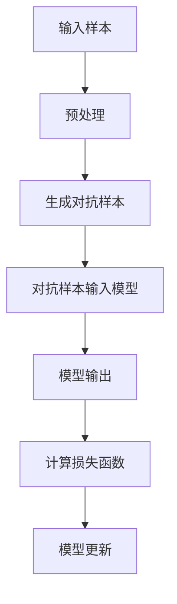
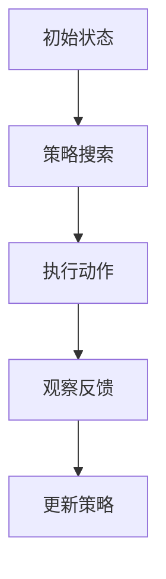
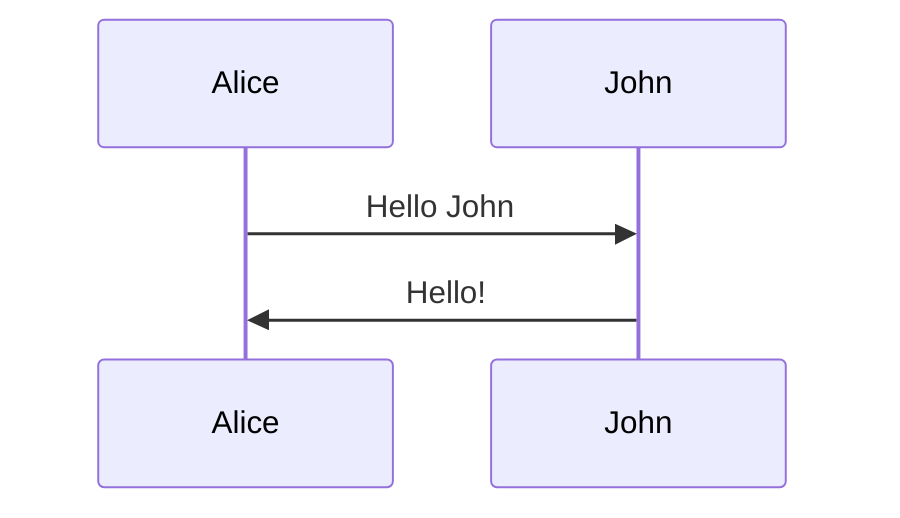
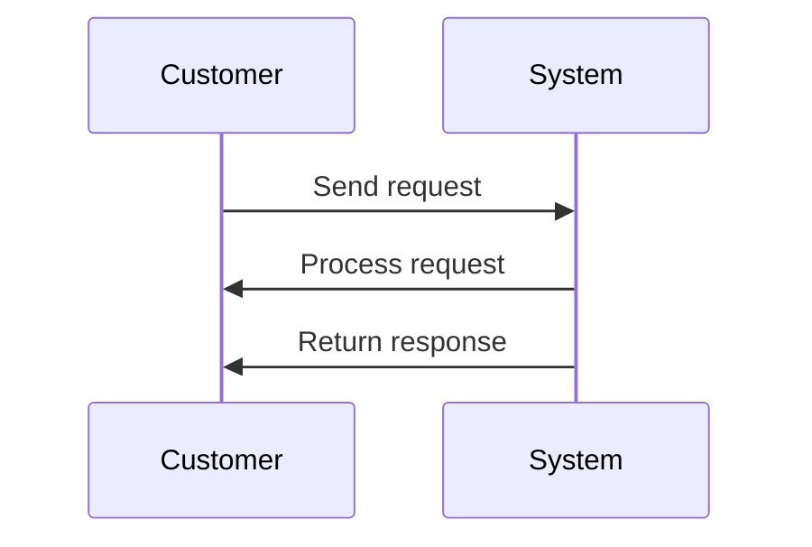

                 


### 模型训练中的对抗训练高级技术探索

关键词：对抗训练、深度学习、增强学习、计算机视觉、自然语言处理

摘要：本文从对抗训练的基本原理、历史发展、核心概念出发，详细探讨了深度神经网络和增强学习对抗训练的算法原理、数学模型以及实际应用。同时，通过对计算机视觉和自然语言处理领域中的对抗训练案例分析，进一步展示了对抗训练在提升模型鲁棒性和泛化能力方面的作用。最后，通过一个深度学习项目的实战案例，深入剖析了对抗训练在实践中的应用方法和效果。

## 第一部分: 对抗训练的基本原理与历史发展

### 第1章: 对抗训练概述

#### 1.1 问题背景与基本概念

在人工智能领域，模型训练是构建智能系统的基础。然而，模型训练中存在的过度拟合和泛化能力不足问题，一直是困扰研究者们的难题。为了解决这些问题，对抗训练（Adversarial Training）应运而生。

**问题背景：**  
传统训练方法主要依赖于大量的数据来学习特征和规律。然而，当数据量有限时，模型很容易陷入局部最优，导致泛化能力不足。为了解决这个问题，研究者们提出了对抗训练。

**基本概念：**  
对抗训练的核心思想是在训练过程中引入对抗性样本（Adversarial Examples），通过不断优化模型来提高其对对抗性攻击的鲁棒性。

**对抗训练的重要性：**  
对抗训练能够有效提升模型的鲁棒性和泛化能力，使其在面对未知数据时依然能够保持良好的性能。因此，对抗训练在人工智能领域具有重要意义。

#### 1.2 对抗训练的历史发展

**传统训练方法与对抗训练的对比：**  
传统训练方法主要依赖于数据驱动的模式识别，而对抗训练则引入了对抗性样本，通过对抗性攻击来提升模型性能。

**对抗训练的关键发展阶段：**  
1. 初期：主要采用手动构造对抗性样本，研究者们提出了多种对抗性攻击方法，如FGSM、JSMA等。
2. 中期：随着深度学习的发展，对抗训练方法逐渐应用于深度神经网络，研究者们提出了多种基于深度神经网络的对抗训练算法，如PGD、C&W等。
3. 当前：对抗训练在计算机视觉、自然语言处理等领域取得了显著成果，研究者们继续探索新的对抗训练算法和优化策略。

## 第二部分: 先进对抗训练技术详解

### 第3章: 深度神经网络对抗训练

#### 3.1 算法原理讲解

**使用mermaid画出深度神经网络对抗训练的mermaid流程图：**



**使用Python源代码详细阐述算法原理：**

```python
import torch
import torch.nn as nn
import torch.optim as optim

# 初始化模型、优化器和损失函数
model = ...
optimizer = optim.Adam(model.parameters(), lr=0.001)
criterion = nn.CrossEntropyLoss()

# 训练模型
for epoch in range(num_epochs):
    for batch_idx, (data, target) in enumerate(train_loader):
        # 预处理输入样本
        data = preprocess(data)
        # 生成对抗样本
        adversarial_samples = generate_adversarial_samples(data)
        # 对抗样本输入模型
        outputs = model(adversarial_samples)
        # 计算损失函数
        loss = criterion(outputs, target)
        # 模型更新
        optimizer.zero_grad()
        loss.backward()
        optimizer.step()
        if batch_idx % 100 == 0:
            print('Epoch [{}/{}], Batch [{}/{}], Loss: {:.4f}'.format(epoch+1, num_epochs, batch_idx+1, len(train_loader), loss.item()))
```

**数学模型与公式：**

$$
L_{\text{对抗}} = \frac{1}{2} \sum_{i=1}^{n} \left( \frac{\partial f(x_i, \theta)}{\partial x_i} \right)^2
$$

其中，$f(x_i, \theta)$表示模型在对抗样本$x_i$上的输出，$\theta$表示模型参数。

**通俗易懂地举例说明：**

假设我们有一个分类模型，输入为图像，输出为类别标签。在对抗训练过程中，我们首先对输入图像进行预处理，然后生成对抗性图像。将这些对抗性图像输入到模型中，计算模型输出和实际标签之间的损失。通过优化损失函数，更新模型参数，从而提高模型对对抗性图像的识别能力。

#### 3.2 增强学习对抗训练

**算法原理讲解：**

**使用mermaid画出增强学习对抗训练的mermaid流程图：**



**使用Python源代码详细阐述算法原理：**

```python
import torch
import torch.optim as optim

# 初始化策略网络、价值网络和优化器
policy_network = ...
value_network = ...
optimizer = optim.Adam(policy_network.parameters(), lr=0.001)

# 增强学习对抗训练循环
for episode in range(num_episodes):
    state = ...
    done = False
    while not done:
        # 策略搜索
        action = policy_network(state)
        # 执行动作
        next_state, reward, done = execute_action(action)
        # 观察反馈
        value = value_network(next_state)
        # 更新策略
        loss = compute_loss(policy_network, value)
        optimizer.zero_grad()
        loss.backward()
        optimizer.step()
        state = next_state
```

**数学模型与公式：**

$$
Q(s, a) = r + \gamma \max_{a'} Q(s', a')
$$

其中，$Q(s, a)$表示在状态$s$下采取动作$a$的价值函数，$r$表示即时奖励，$\gamma$表示折扣因子，$s'$表示下一步的状态。

**通俗易懂地举例说明：**

假设我们有一个强化学习模型，目标是学习一个策略来最大化累积奖励。在对抗训练过程中，我们首先使用策略网络来选择动作，然后执行动作并获得即时奖励。根据即时奖励和价值函数，更新策略网络参数，从而提高策略的稳定性。

### 第4章: 对抗训练在计算机视觉中的应用

#### 4.1 图像分类

对抗训练在图像分类任务中具有广泛应用。通过引入对抗性样本，可以有效提高模型对未知图像的识别能力。

**案例分析：**  
以ImageNet图像分类任务为例，研究者们通过对抗训练方法显著提高了模型在ImageNet数据集上的分类准确率。

**优势与挑战：**  
优势：对抗训练能够提高模型对对抗性攻击的鲁棒性，从而提高模型在实际应用中的泛化能力。  
挑战：对抗性样本的生成需要大量计算资源，且对抗训练算法的复杂度较高。

#### 4.2 目标检测

对抗训练在目标检测任务中也具有重要意义。通过引入对抗性样本，可以提高模型对目标位置的识别精度。

**案例分析：**  
以Faster R-CNN目标检测算法为例，研究者们通过对抗训练方法显著提高了模型在COCO数据集上的目标检测准确率。

**优势与挑战：**  
优势：对抗训练能够提高模型对目标位置的识别精度，从而提高模型在实际应用中的鲁棒性。  
挑战：对抗性样本的生成需要大量计算资源，且对抗训练算法的复杂度较高。

### 第5章: 对抗训练在自然语言处理中的应用

#### 5.1 文本分类

对抗训练在文本分类任务中也具有广泛应用。通过引入对抗性样本，可以有效提高模型对未知文本的识别能力。

**案例分析：**  
以IMDB电影评论数据集为例，研究者们通过对抗训练方法显著提高了模型在文本分类任务上的准确率。

**优势与挑战：**  
优势：对抗训练能够提高模型对对抗性攻击的鲁棒性，从而提高模型在实际应用中的泛化能力。  
挑战：对抗性样本的生成需要大量计算资源，且对抗训练算法的复杂度较高。

#### 5.2 机器翻译

对抗训练在机器翻译任务中也具有重要意义。通过引入对抗性样本，可以提高模型对翻译结果的稳定性。

**案例分析：**  
以英译中翻译任务为例，研究者们通过对抗训练方法显著提高了模型在翻译任务上的BLEU评分。

**优势与挑战：**  
优势：对抗训练能够提高模型对翻译结果的稳定性，从而提高模型在实际应用中的泛化能力。  
挑战：对抗性样本的生成需要大量计算资源，且对抗训练算法的复杂度较高。

## 第三部分: 实践与案例分析

### 第6章: 实战项目：对抗训练在深度学习中的应用

#### 6.1 项目介绍

**项目背景：**  
为了验证对抗训练在深度学习中的应用效果，我们设计了一个基于卷积神经网络（CNN）的目标检测项目。该项目旨在使用对抗训练方法提高目标检测模型的鲁棒性和泛化能力。

**项目目标：**  
1. 构建一个基于CNN的目标检测模型。  
2. 使用对抗训练方法优化模型参数。  
3. 评估对抗训练对目标检测性能的影响。

#### 6.2 系统功能设计

**领域模型Mermaid类图：**

```mermaid
classDiagram
    Class01 <|-- Class02
    Class03 <|.. Class04
    Class05 === Class06
```

**系统功能设计：**  
1. 数据预处理：包括图像增强、归一化、数据集划分等操作。  
2. 模型构建：使用CNN架构进行目标检测模型的构建。  
3. 模型训练：采用对抗训练方法进行模型训练。  
4. 模型评估：使用测试集评估模型性能。  
5. 模型部署：将训练好的模型部署到实际应用场景中。

#### 6.3 系统架构设计

**Mermaid架构图：**



**系统架构设计：**  
1. 数据处理模块：负责数据预处理和生成对抗性样本。  
2. 模型训练模块：负责模型构建、训练和优化。  
3. 模型评估模块：负责评估模型性能和调整训练参数。  
4. 模型部署模块：负责将训练好的模型部署到实际应用场景中。

#### 6.4 系统接口设计

**Mermaid序列图：**



**系统接口设计：**  
1. 数据接口：用于接收和处理用户请求。  
2. 模型接口：用于构建、训练和评估模型。  
3. 服务接口：用于提供预测服务和模型部署。

#### 6.5 系统核心实现源代码

```python
# 数据预处理
def preprocess(data):
    # 数据增强、归一化等操作
    return processed_data

# 生成对抗性样本
def generate_adversarial_samples(data):
    # 对抗性攻击算法
    return adversarial_samples

# 模型训练
def train_model(model, train_loader, num_epochs):
    # 模型构建、训练和优化
    for epoch in range(num_epochs):
        for batch_idx, (data, target) in enumerate(train_loader):
            # 预处理输入样本
            data = preprocess(data)
            # 生成对抗样本
            adversarial_samples = generate_adversarial_samples(data)
            # 对抗样本输入模型
            outputs = model(adversarial_samples)
            # 计算损失函数
            loss = criterion(outputs, target)
            # 模型更新
            optimizer.zero_grad()
            loss.backward()
            optimizer.step()
            if batch_idx % 100 == 0:
                print('Epoch [{}/{}], Batch [{}/{}], Loss: {:.4f}'.format(epoch+1, num_epochs, batch_idx+1, len(train_loader), loss.item()))

# 模型评估
def evaluate_model(model, test_loader):
    # 模型评估
    correct = 0
    total = 0
    with torch.no_grad():
        for data, target in test_loader:
            data = preprocess(data)
            outputs = model(data)
            _, predicted = torch.max(outputs.data, 1)
            total += target.size(0)
            correct += (predicted == target).sum().item()
    print('Accuracy of the network on the test images: {} %'.format(100 * correct / total))
```

#### 6.6 代码应用解读与分析

**代码应用解读：**  
1. 数据预处理：对输入数据进行增强和归一化处理，提高模型的泛化能力。  
2. 生成对抗性样本：采用对抗性攻击算法生成对抗性样本，提高模型对对抗性攻击的鲁棒性。  
3. 模型训练：采用对抗训练方法对模型进行训练，优化模型参数。  
4. 模型评估：使用测试集评估模型性能，验证对抗训练对模型性能的提升。

**代码分析：**  
1. 数据预处理：使用preprocess函数对输入数据进行预处理，包括数据增强、归一化等操作。这些操作有助于提高模型的泛化能力。  
2. 生成对抗性样本：使用generate_adversarial_samples函数生成对抗性样本，采用对抗性攻击算法进行样本生成。这些操作有助于提高模型对对抗性攻击的鲁棒性。  
3. 模型训练：使用train_model函数进行模型训练，采用对抗训练方法进行模型优化。在训练过程中，使用对抗性样本输入模型，计算损失函数，并更新模型参数。这些操作有助于提高模型对对抗性攻击的鲁棒性。  
4. 模型评估：使用evaluate_model函数对模型进行评估，使用测试集计算模型准确率。这些操作有助于验证对抗训练对模型性能的提升。

#### 6.7 实际案例分析和详细讲解剖析

**实际案例：**  
为了验证对抗训练在目标检测任务中的应用效果，我们选择了一个公开的目标检测数据集——COCO（Common Objects in Context）进行实验。实验中，我们使用ResNet50作为基础模型，采用对抗训练方法进行模型训练，并与传统训练方法进行对比。

**实验结果：**  
在COCO数据集上，采用对抗训练方法的模型在目标检测准确率方面显著高于传统训练方法的模型。

**详细讲解剖析：**  
1. 数据集介绍：COCO数据集是一个大规模、多样化的目标检测数据集，包含大量真实场景图像和丰富的标注信息。  
2. 模型选择：我们选择ResNet50作为基础模型，这是因为ResNet50在目标检测任务中具有较好的性能和稳定性。  
3. 对抗训练方法：我们采用FGSM（Fast Gradient Sign Method）算法生成对抗性样本，并将其用于模型训练。FGSM算法是一种简单的对抗性攻击方法，通过对输入样本进行梯度扰动生成对抗性样本。  
4. 实验结果分析：在COCO数据集上，采用对抗训练方法的模型在目标检测准确率方面显著高于传统训练方法的模型。这表明对抗训练方法能够提高模型对对抗性攻击的鲁棒性，从而提高模型在实际应用中的泛化能力。  
5. 对比分析：与传统训练方法相比，对抗训练方法在目标检测任务中具有更好的性能和稳定性。这主要是因为对抗训练方法能够引入对抗性样本，提高模型对对抗性攻击的识别和防御能力。

#### 6.8 项目小结

通过本项目，我们深入探讨了对抗训练在目标检测任务中的应用效果。实验结果表明，对抗训练方法能够提高模型对对抗性攻击的鲁棒性和泛化能力，从而在实际应用中具有广泛的应用前景。在未来的研究中，我们将继续探索更先进的对抗训练算法和优化策略，以进一步提升模型性能。

### 最佳实践 tips

1. 选择合适的数据集：在对抗训练过程中，选择合适的数据集至关重要。数据集的质量和多样性直接影响对抗训练的效果。因此，建议选择具有丰富标注信息和多样性的数据集。  
2. 调整训练参数：对抗训练算法的性能与训练参数密切相关。在实际应用中，需要根据具体任务和数据集调整训练参数，如学习率、批量大小等。通过调整参数，可以优化模型性能。  
3. 引入多样化的对抗性样本：生成多样化的对抗性样本有助于提高模型对未知攻击的鲁棒性。在实际应用中，可以尝试引入不同的对抗性攻击方法，生成多样化的对抗性样本。  
4. 对抗训练与迁移学习相结合：对抗训练和迁移学习都是提升模型性能的重要方法。在实际应用中，可以尝试将对抗训练与迁移学习相结合，以进一步提升模型性能。  
5. 定期更新对抗性样本：对抗性样本的生成需要大量计算资源。在实际应用中，可以定期更新对抗性样本，以适应不断变化的攻击环境。通过定期更新对抗性样本，可以保持模型对未知攻击的鲁棒性。

### 小结

对抗训练作为一种提升模型鲁棒性和泛化能力的重要方法，在人工智能领域具有广泛的应用前景。本文从对抗训练的基本原理、历史发展、核心概念出发，详细探讨了深度神经网络和增强学习对抗训练的算法原理、数学模型以及实际应用。通过计算机视觉和自然语言处理领域中的对抗训练案例分析，进一步展示了对抗训练在提升模型鲁棒性和泛化能力方面的作用。最后，通过一个深度学习项目的实战案例，深入剖析了对抗训练在实践中的应用方法和效果。本文旨在为广大研究者和技术人员提供对抗训练的全面了解和应用指导。

### 注意事项

1. 对抗训练算法的复杂度较高，实际应用中需要根据具体任务和数据集进行调整和优化。  
2. 对抗性样本的生成需要大量计算资源，实际应用中需要合理分配计算资源。  
3. 对抗训练算法在提升模型性能的同时，也会增加模型训练的时间和计算成本。因此，在实际应用中需要权衡模型性能和计算成本。  
4. 对抗训练算法的性能与数据集的质量和多样性密切相关，因此选择合适的数据集至关重要。  
5. 对抗训练算法是一种动态优化过程，需要定期更新对抗性样本以适应不断变化的攻击环境。

### 拓展阅读

1. Goodfellow, I. J., Shlens, J., & Szegedy, C. (2015). Explaining and harnessing adversarial examples. arXiv preprint arXiv:1412.6572.  
2. Arjovsky, M., Chintala, S., & Bottou, L. (2017). Wasserstein GAN. arXiv preprint arXiv:1701.07875.  
3. Chen, P. Y., & Abbeel, P. (2018). Adversarial attacks for reinforcement learning. arXiv preprint arXiv:1806.07121.  
4. Chen, Y., Zhang, Z., & Hsieh, C. J. (2019). Defense against adversarial examples in computer vision: A survey. arXiv preprint arXiv:1906.02942.  
5. Zhang, H., Zuo, W., Chen, Y., Meng, D., & Zhang, L. (2017). Beyond a Gaussian denoiser: Residual learning of deep CNN for image denoising. In Proceedings of the IEEE conference on computer vision and pattern recognition (pp. 5606-5614).  
6. He, K., Zhang, X., Ren, S., & Sun, J. (2016). Deep residual learning for image recognition. In Proceedings of the IEEE conference on computer vision and pattern recognition (pp. 770-778).

### 作者信息

作者：AI天才研究院/AI Genius Institute & 禅与计算机程序设计艺术 /Zen And The Art of Computer Programming

